# 德国人

在前面的章节中，我们已经浏览了 Google 提供的移动机器学习 SDK——tensor flow for mobile——和 Apple 提供的 Core ML——并对它们有了很好的理解。我们研究了这些产品的基本架构、它们提供的关键特性，还使用这些 SDK 尝试了一些任务/程序。基于我们迄今为止对移动机器学习框架和工具的探索，我们将能够确定一些差距，这些差距使得难以执行移动机器学习部署以及这些部署的后续维护和支持。让我给你列举几个:

*   一旦我们创建了机器学习模型并将其导入到 Android 或 iOS 应用中，如果需要对导入到移动应用中的模型进行任何更改，您认为这种更改将如何实施并升级到在现场部署和使用的应用中？如何在不在移动应用商店(App Store 或 Play Store)中重新部署应用的情况下更新/升级模型？
*   一旦机器学习模型进入现场，并被现场用户使用，我们如何在实时用户场景中监控模型的性能和使用情况？
*   此外，您可能已经体验到，在 iOS 和 Android 中使用机器学习模型的过程和机制是不一样的。此外，为了使机器学习模型与 TensorFlow Lite 和 Core ML 兼容，使用各种机器学习框架(如 TensorFlow 和 scikit-learn)创建机器学习模型的机制也不同。没有开发人员可以遵循的通用过程和使用模式来跨框架创建和使用这些模型。我们认为，如果有一种通用的方法来使用这些来自不同供应商的使用相同过程和机制的机器学习模型，那将会简单得多。

Fritz 平台已经尝试回答前面提到的在机器学习模型使用和部署中观察到的所有差距。Fritz 作为一个机器学习平台，试图为移动应用提供促进机器学习模型使用和部署的解决方案。它是一个移动机器学习平台，具有即用型机器学习功能，以及导入和使用自定义 ML 模型的选项—TensorFlow 用于移动和核心 ML 模型。

因此，在本章中，我们将详细讨论以下内容:

*   了解 Fritz 移动机器学习平台、其功能和优势。
*   通过使用我们已经使用 Core ML 创建的回归模型，探索 Fritz 并实现 iOS 移动应用。
*   探索 Fritz 并使用我们在第三章[中创建的示例 Android 模型实现一个 Android 移动应用，在 iOS 上使用 tensor flow*随机森林。*](10656284-f170-420b-a35c-e11cf1f3d988.xhtml)


# 弗里茨简介

Fritz 是一个免费的端到端平台，使我们能够轻松创建基于机器学习的移动应用。它是一个支持设备上机器学习的平台，也就是说，它有助于创建完全可以在移动设备上工作的移动机器学习应用。它同时支持 iOS 和 Android 平台。


# 预建 ML 模型

Fritz 提供了内置的 ML 模型，可以直接在移动应用中使用。以下是 Fritz 支持的两个重要模型:

*   **物体检测**:您可以识别一幅图像或实时视频的每一帧中感兴趣的物体。这有助于您了解图像中有哪些对象，以及它们在图像中的位置。物体探测功能使预测*完全在设备上*和不需要互联网连接*。*
*   **图像标注**:可以识别一幅图像或每一帧直播视频的内容。这也完全离线工作，不需要互联网连接。


# 使用定制模型的能力

Fritz 为我们提供了将为 Core ML、TensorFlow for mobile 和 TensorFlow Lite 构建的模型导入移动应用的能力，并提供了可以与这些模型直接交互的 API。


# 模型管理

Fritz 的主要优势在于它支持 ML 模型管理和实时升级:

*   它为我们提供了升级现场部署的机器学习模型的能力，也就是说，它允许开发人员升级或更改 ML 模型，而无需在移动应用商店中进行应用升级和重新部署。
*   它为我们提供了监控部署到该领域的机器学习模型的性能的工具。
*   它有助于部署、分析和机器学习模型管理。


# 使用 Fritz 的动手样品

在本节中，我们将尝试使用 Fritz 以及我们已经使用 Core ML 和 TensorFlow for mobile 为 iOS 和 Android 创建的模型，并使用 Fritz 构建 iOS 和 Android 移动应用。与此同时，我们将了解如何使用 Fritz 内置模型，如对象检测和图像标记。


# 在使用 Fritz 的 Android 应用中使用现有的 TensorFlow for mobile 模型

在本节中，我们将了解如何使用 TensorFlow for mobile 模型，我们已经使用 Fritz toolkit 在 Android 移动应用中创建了该模型。我们将使用 TensorFlow for mobile 创建的示例模型进行求和 *(a+b)* 。我们将详细介绍实现这一目标所需的步骤。


# 向弗里茨注册

为了使用 Fritz，您必须在 Fritz 门户网站注册一个帐户:

1.  转到[https://fritz.ai/](https://fritz.ai/)
2.  点击顶部菜单上的登录
3.  点击创建账户
4.  输入您的详细信息并提交
5.  在 Fritz 中创建新项目

拥有帐户后，使用您的凭据登录，然后执行以下步骤:

1.  点击“添加新项目”按钮
2.  输入项目名称和组织
3.  点击提交


# 正在上传模型文件(。pb 或者。tflite)

1.  单击左侧菜单中的自定义模型
2.  给出模型名称和描述
3.  上传模型文件
4.  单击创建模型文件按钮

上传后，模型页面将如下所示:

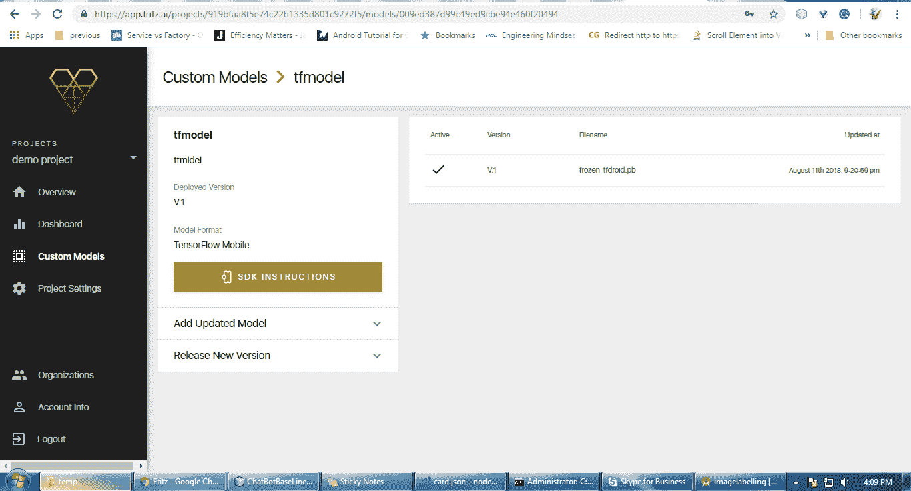

这里，我们使用的是在《T4》第三章、*iOS 上的随机森林*中创建的相同模型:用于 Android 的 TensorFlow。GitHub 的网址是[https://GitHub . com/packt publishing/Machine-Learning-for-Mobile/blob/master/tensor flow % 20 simple/tensor/frozen _ TF droid . Pb](https://github.com/PacktPublishing/Machine-Learning-for-Mobile/blob/master/tensorflow%20simple/tensor/frozen_tfdroid.pb)。


# 设置 Android 并注册应用

我们已经创建了一个项目，并向其中添加了一个模型。让我们看看如何在 Android 项目中使用这个模型。现在，我将向您展示如何将我们在[第 3 章](10656284-f170-420b-a35c-e11cf1f3d988.xhtml)、*iOS 上的随机森林*中看到的 TensorFlow 简单示例转换为 fritz 格式。要继续，请在 Android studio 中打开该示例。

如果没有，可以从[https://github . com/packt publishing/Machine-Learning-for-Mobile/tree/master/tensor flow % 20 simple](https://github.com/PacktPublishing/Machine-Learning-for-Mobile/tree/master/tensorflow%20simple)下载。在给定的路径中有 TensorFlow 示例是 Android 项目，在 Android studio 中打开它。


# 添加 Fritz 的 TFMobile 库

在本节中，我们将把这个项目转换成 Fritz 管理的项目。在模型页面中，单击 SDK 说明按钮。它将打开一个显示集成信息的对话框，如下所示:

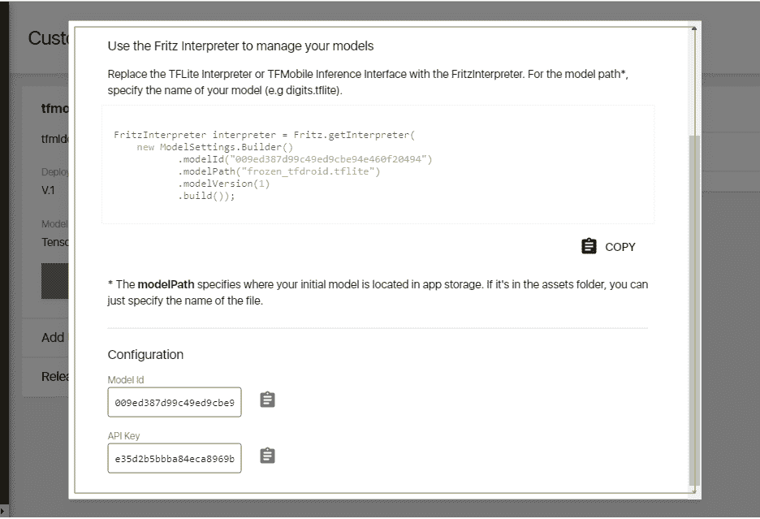

在这里，您将找到 API 键，它对于项目是唯一的，模型 Id，它对于您上传的每个模型都是变化的，以及创建解释器的代码。


# 向项目添加依赖项

为了访问 Fritz 解释器，您需要向您的项目添加依赖项。为此，请打开您的模块应用的`build.gradle`文件。您需要添加一个指向 Fritz Maven 存储库的存储库条目。为此，添加以下几行:

```
repositories {
    maven { url "https://raw.github.com/fritzlabs/fritz-repository/master" }
}
```

现在添加 Fritz 依赖项:

```
dependencies {
    implementation fileTree(dir: 'libs', include: ['*.jar'])
    implementation 'com.android.support:appcompat-v7:27.1.0'
    implementation 'com.android.support.constraint:constraint-layout:1.1.2'
    implementation 'ai.fritz:core:1.0.0'
    implementation 'ai.fritz:custom-model-tfmobile:1.0.0'
    implementation 'com.stripe:stripe-android:6.1.2'
}
```

使用前面的代码，我们添加了 Fritz 核心库和`tfmobile`库。fritz 核心库需要与 Fritz 云服务器通信，以下载用于版本管理的模型文件。`tfmobile`库是必需的，因为我们正在使用 TensorFlow 移动模型，我们需要 TensorFlow 库进行推理。


# 在 Android 清单中注册 FritzJob 服务

我已经提到过，当部署在 fritz 云服务器上时，您的应用将下载模型文件。为此，Fritz 实现了一个名为`FritzJob` service 的服务，它将在后台运行。当它发现您的 web 控制台中部署了新型号时，它会在设备连接到 Wi-Fi 时尝试下载它。

若要登录你的云帐户，你的应用需要一些凭据。为此，fritz 提供了一个 API 密钥。为此，我们需要在 Android manifest XML 文件中添加一个元条目，如下所示:

```
<meta-data android:name="fritz_api_key" android:value="6265ed5e7e334a97bbc750a09305cb19" />
```

您需要用您的值替换 fritz API 键的值，该值是在您单击 SDK INSTRUCTIONS 时从浏览器的上一个对话框中获得的。

我们需要声明 Fritz 作业，如下所示:

```
<service
    android:name="ai.fritz.core.FritzJob"
    android:exported="true"
    android:permission="android.permission.BIND_JOB_SERVICE" />
```

由于我们的应用需要通过 Wi-Fi 连接到云服务器，因此我们需要提及互联网访问权限:

```
<uses-permission android:name="android.permission.INTERNET"/>
```

现在，我的整个清单文件将如下所示:

```
<?xml version="1.0" encoding="utf-8"?>
<manifest xmlns:android="http://schemas.android.com/apk/res/android"
    package="org.packt.fritz.samplefritzapp">

    <uses-permission android:name="android.permission.INTERNET"/>

    <application
        android:allowBackup="true"
        android:icon="@mipmap/ic_launcher"
        android:label="@string/app_name"
        android:roundIcon="@mipmap/ic_launcher_round"
        android:supportsRtl="true"
        android:theme="@style/AppTheme">
        <activity android:name=".MainActivity">
            <intent-filter>
                <action android:name="android.intent.action.MAIN" />

               <category android:name="android.intent.category.LAUNCHER" />
            </intent-filter>
        </activity>
        <meta-data android:name="fritz_api_key" android:value="6265ed5e7e334a97bbc750a09305cb19" />
        <service
            android:name="ai.fritz.core.FritzJob"
            android:exported="true"
            android:permission="android.permission.BIND_JOB_SERVICE" />
    </application>

</manifest>
```


# 用 Fritz 解释器替换 TensorFlowInferenceInterface 类

打开应用的主活动，并进行以下更改:

```
package org.packt.fritz.samplefritzapp;

import android.os.Bundle;
import android.support.v7.app.AppCompatActivity;
import android.view.View;
import android.widget.Button;
import android.widget.EditText;
import android.widget.TextView;
import android.widget.Toast;

import org.tensorflow.contrib.android.TensorFlowInferenceInterface;

import ai.fritz.core.*;
import ai.fritz.customtfmobile.*;
```

在前面的`import`语句中，我们已经为 Fritz 核心库和 Fritz 自定义模型库添加了导入，并且我们还使用了 Google `TensorflowInfereceInterface`:

```
public class MainActivity extends AppCompatActivity {

private TensorFlowInferenceInterface inferenceInterface;

 static {
System.loadLibrary("tensorflow_inference");
 }
```

在前面几行中，我们已经声明了 TensorFlow 推理接口并加载了`tensorflow_inference`库，这是可选的。这可以由 Fritz 自己隐式地完成:

```
 @Override
 protected void onCreate(Bundle savedInstanceState) {
        super.onCreate(savedInstanceState);
 setContentView(R.layout.activity_main);
 Fritz.configure(this);
```

在前面几行中，我们已经配置了 fritz 服务并将其与应用链接起来。在这里，它将验证应用包名称是否已添加到您的 Fritz 控制台。

为此，您需要在 Fritz web 控制台的项目左侧菜单中单击项目设置。

然后，点击添加 android 应用到您的项目，它会打开一个对话框，如下所示:

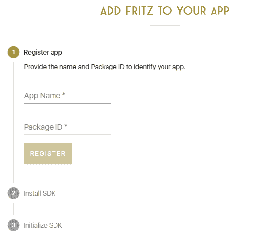

在这种情况下，您需要为您的应用命名，以便识别。然后，您需要从 Android 清单文件中获取包名，并将其输入到包 id 文本字段中。

您可以从清单文件的 manifest 标记中获得这个特殊的标记，如下所示:

```
<?xml version="1.0" encoding="utf-8"?>
<manifest xmlns:android="http://schemas.android.com/apk/res/android"
    package="org.packt.fritz.samplefritzapp">
```

注册后，请回到我们的代码:

```
 try {

FritzTFMobileInterpreter interpreter = FritzTFMobileInterpreter.create(this.getApplicationContext(),
 new ModelSettings.Builder()
.modelId("2a83207a32334fceaa29498f57cbd9ae")
.modelPath("ab2.pb")
.modelVersion(1)
.build());
```

在这里，我们为 Fritz 模型创建一个对象。第一个参数是应用上下文对象，第二个参数是模型信息对象。

在型号设置中，我们将提供型号 ID，这可以从您在 Fritz web 控制台的型号页面中单击 SDK 说明时显示的对话框中获得。

另一件重要的事情是模型路径。这是你放在`assets`文件夹中的模型文件名:

```
 inferenceInterface = interpreter.getInferenceInterface();
```

在前一行中，我们获取了 TensorFlow 推理接口对象，并将其赋给全局声明的变量:

```
 final Button button = (Button) findViewById(R.id.button);

 button.setOnClickListener(new View.OnClickListener() {
 public void onClick(View v) {

 final EditText editNum1 = (EditText) findViewById(R.id.editNum1);
 final EditText editNum2 = (EditText) findViewById(R.id.editNum2);

 float num1 = Float.parseFloat(editNum1.getText().toString());
 float num2 = Float.parseFloat(editNum2.getText().toString());

 long[] i = {1};

 int[] a = {Math.round(num1)};
 int[] b = {Math.round(num2)};

 inferenceInterface.feed("a", a, i);
 inferenceInterface.feed("b", b, i);

 inferenceInterface.run(new String[]{"c"});

 int[] c = {0};
 inferenceInterface.fetch("c", c);

 final TextView textViewR = (TextView) findViewById(R.id.txtViewResult);
 textViewR.setText(Integer.toString(c[0]));
 }
});
 }
 catch (Exception ex)
{
Toast.makeText(this.getApplicationContext(),ex.toString(),Toast.LENGTH_LONG).show();

 }

}

}
```

在前面的块中，我们注册了一个事件侦听器，每当用户单击 Run 按钮时，它都会执行推理。


# 构建和运行应用

要查看结果，请连接设备并运行项目。它将显示结果，如下所示:

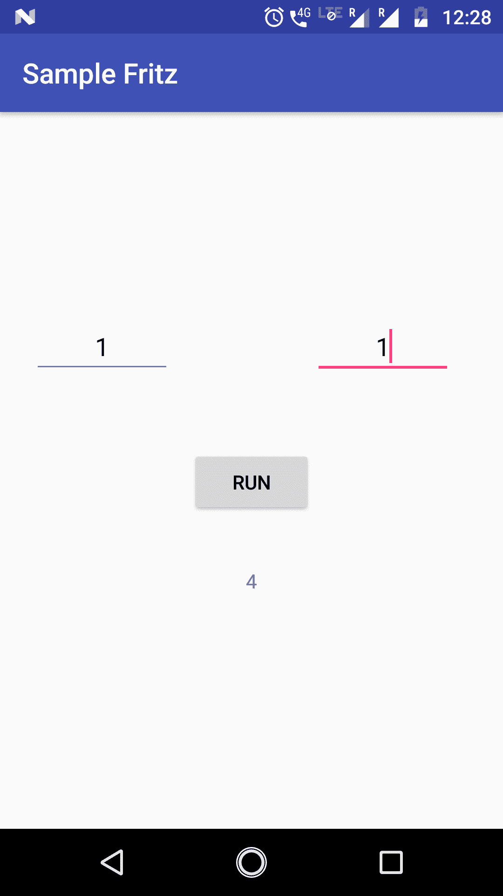


# 部署模型的新版本

Fritz 真正的强大之处在于自动下载修改后的模型文件。在这里，我们将演示这一点。

到目前为止，我们已经上传了我们的旧 *(a+b)* ^(*2*) 模型并执行了推理。现在我们将其更新为*(a+b)*^(*3*)并检查我们的 app 是否自动下载修改后的模型。

为此，我们需要创建 *(a+b)* ³ 模型。首先，我们需要回忆一下我们在[第 4 章](cb30489a-0fda-4d76-bf46-985510e6e7e7.xhtml)、*tensor flow Mobile in Android*下的*创建和保存模型*部分，在那里我们创建了 *(a+b) ²* 模型。我们将做一个小小的改变来转换这个模型:

```

import tensorflow as tf

a = tf.placeholder(tf.int32, name='a')  # input
b = tf.placeholder(tf.int32, name='b')  # input
times = tf.Variable(name="times", dtype=tf.int32, initial_value=3)
c = tf.pow(tf.add(a, b), times, name="c")

saver = tf.train.Saver()
init_op = tf.global_variables_initializer()
with tf.Session() as sess:
    sess.run(init_op)

    tf.train.write_graph(sess.graph_def, '.', 'tfdroid.pbtxt')
    sess.run(tf.assign(name="times", value=3, ref=times))
    # save the graph

    # save a checkpoint file, which will store the above assignment
    saver.save(sess, './tfdroid.ckpt')
```

在前面的程序中，我们所做的唯一更改是对变量`times`的值，现在是`3`。这会导致(a+b)乘以三，得到 *(a+b) ³* 。关于如何运行和生成`.pb`扩展模型文件的说明，请参见 [第四章](cb30489a-0fda-4d76-bf46-985510e6e7e7.xhtml)、*安卓版 tensor flow Mobile*。

一旦您获得了`frozen_tfdroid.pb`文件，您就可以从您的模型页面的 Fritz web 控制台上传它，如下面的屏幕截图所示:


展开“添加更新的模型”窗格，并上传生成的模型。它将作为版本 2 添加到右侧表格中:

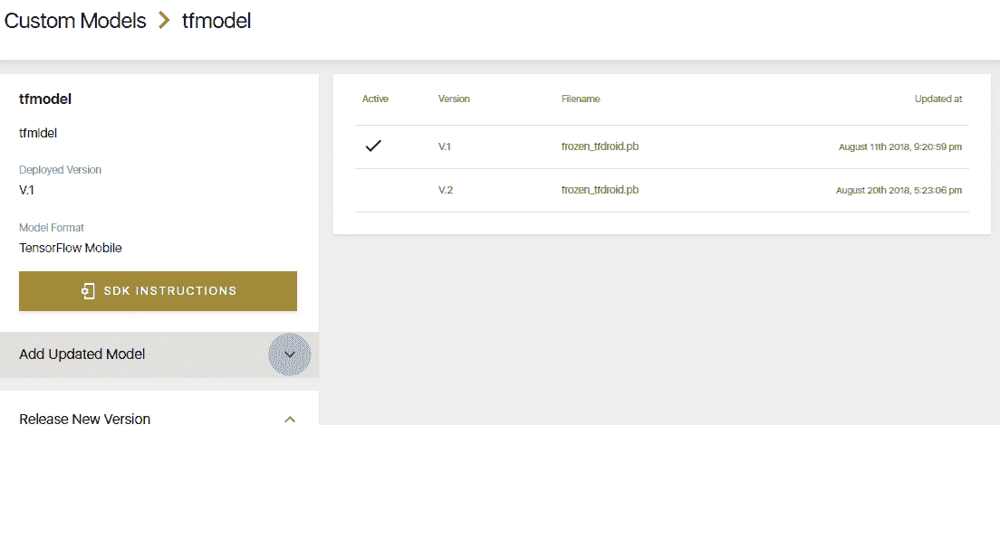

现在你已经上传了模型的修订版，但是还没有发布。为此，您需要展开“发布新版本”窗格并发布您需要的版本。

完成后，所有安装了您的应用的移动设备在通过 WiFi 网络连接到互联网时，都将下载发布的型号。

以下是我连接 WiFi 路由器并重启应用后得到的结果:

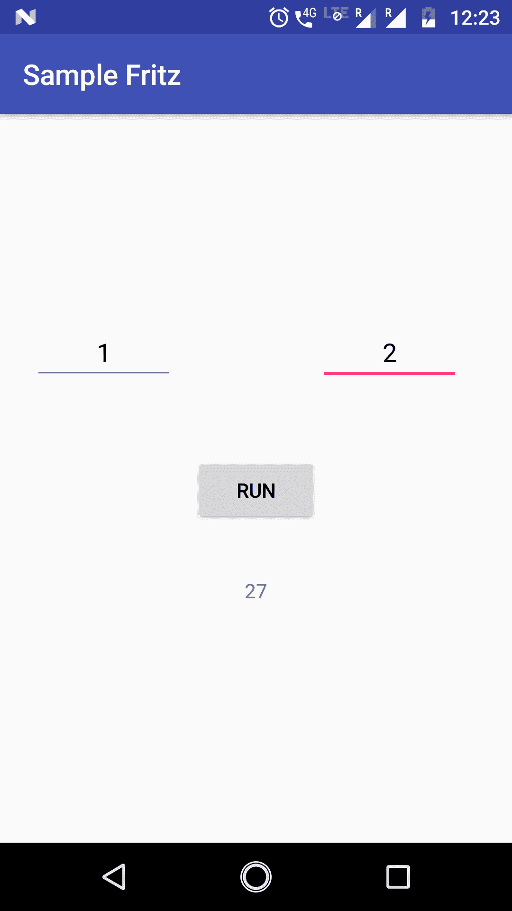<title>Creating an android application using fritz pre-built models</title> 

# 使用 fritz 预建模型创建 android 应用

Fritz 为 iOS 和 Android 提供了两种预建模型:

*   图像标注
*   目标检测

在这一部分，我们将看到如何在你的 Android 应用中使用图像标签模型。

为此，您需要在 Fritz 中创建一个项目；请参考使用 Fritz 在 Android 应用中使用现有 TensorFlow for mobile 模型的*一节中给出的步骤。*

现在，打开 Android studio，创建一个包含空活动和布局文件的空项目。


# 向项目添加依赖项

为了访问前面对话框中显示的 fritz 解释器，您需要将依赖项添加到项目中。为此，请打开您的模块应用的`build.gradle`文件。

您需要添加一个指向 fritz maven 存储库的存储库条目。为此，添加以下几行:

```
repositories {
    maven { url "https://raw.github.com/fritzlabs/fritz-repository/master" }
}
```

现在，添加 fritz 依赖项:

```
dependencies {
    implementation fileTree(dir: 'libs', include: ['*.jar'])
    implementation 'com.android.support:appcompat-v7:26.1.0'
    implementation 'com.android.support.constraint:constraint-layout:1.1.2'
    implementation 'ai.fritz:core:1.0.1'
    implementation 'ai.fritz:vision-label-model:1.0.1'

}
```

在前面几行中，我们添加了 fritz core 库和 fritz vision 库用于标记。Fritz 核心库需要与 fritz 云服务器通信，以便下载用于版本管理的模型文件。

用于贴标的 Fritz 视觉库将下载所需的库，如 TensorFlow mobile 和视觉依赖项。


# 在您的 Android 清单中注册 Fritz JobService

我已经提到过，当部署在 fritz 云服务器上时，您的应用将下载模型文件。为此，Fritz 实现了一个名为`FritzJob`的服务。该服务将在后台运行，当它发现您的 web 控制台中部署了新型号时，它会在设备通过 WiFi 网络连接时尝试下载该型号。

若要登录你的云帐户，你的应用需要一些凭据。为此，fritz 提供了一个 API 密钥。为此，我们需要向 Android manifest XML 文件添加一个元条目，如下所示:

```
<meta-data
    android:name="fritz_api_key"
    android:value="e35d2b5bbba84eca8969b7d6acac1fb7" />
```

当你点击`SDK INSTRUCTIONS`时，你需要用你从浏览器的前一个对话框中得到的值替换 Fritz API 键的值。

我们需要声明 Fritz 作业，如下所示:

```
<service
    android:name="ai.fritz.core.FritzJob"
    android:exported="true"
    android:permission="android.permission.BIND_JOB_SERVICE" />
```

由于我们的应用需要通过 WiFi 连接到云服务器，因此我们需要提及互联网访问权限:

```
<uses-permission android:name="android.permission.INTERNET"/>
```

我们需要添加以下几行:

```
<uses-sdk android:minSdkVersion="21" android:targetSdkVersion="21" />
<uses-feature android:name="android.hardware.camera2.full" />
<uses-permission android:name="android.permission.CAMERA" />

```

在 Android 中，相机处理机制已被更改为`camera2`包，前面一行指定了使用哪个`camera2`功能。要了解更多相关信息，请查看[https://developer . Android . com/reference/Android/HARDWARE/camera 2/camera characteristics # INFO _ SUPPORTED _ HARDWARE _ LEVEL](https://developer.android.com/reference/android/hardware/camera2/CameraCharacteristics#INFO_SUPPORTED_HARDWARE_LEVEL)。因此，为了访问摄像机，我们还添加了摄像机权限。

现在，我的整个清单文件将如下所示:

```
<?xml version="1.0" encoding="utf-8"?>
<manifest xmlns:android="http://schemas.android.com/apk/res/android"
    package="com.example.avinaas.imagelabelling">

    <uses-sdk android:minSdkVersion="21" android:targetSdkVersion="21" />
    <uses-feature android:name="android.hardware.camera2.full" />
    <uses-permission android:name="android.permission.CAMERA" />
    <uses-permission android:name="android.permission.INTERNET" />

    <application
        android:allowBackup="true"
        android:icon="@mipmap/ic_launcher"
        android:label="@string/app_name"
        android:roundIcon="@mipmap/ic_launcher_round"
        android:supportsRtl="true"
        android:theme="@style/AppTheme">
        <activity android:name=".MainActivity">
            <intent-filter>
                <action android:name="android.intent.action.MAIN" />

                <category android:name="android.intent.category.LAUNCHER" />
            </intent-filter>
        </activity>
        <meta-data
            android:name="fritz_api_key"
            android:value="e35d2b5bbba84eca8969b7d6acac1fb7" />
        <service
            android:name="ai.fritz.core.FritzJob"
            android:exported="true"
            android:permission="android.permission.BIND_JOB_SERVICE" />
    </application>

</manifest>
```


# 创建应用布局和组件

在位于`assets/layouts`文件夹中的`activity_main.xml`文件中，您需要输入以下代码:

```
<?xml version="1.0" encoding="utf-8"?>
<RelativeLayout xmlns:android="http://schemas.android.com/apk/res/android"
    xmlns:tools="http://schemas.android.com/tools"
    android:layout_width="match_parent"
    android:layout_height="match_parent"
    tools:context="com.example.avinaas.imagelabelling.MainActivity">

<TextureView
    android:id="@+id/preview"
    android:layout_width="match_parent"
    android:layout_height="wrap_content"
    android:layout_above="@id/btn_takepic"
    android:layout_alignParentTop="true"/>

    <Button
        android:id="@+id/btn_takepic"
        android:layout_width="wrap_content"
        android:layout_height="wrap_content"
        android:layout_alignParentBottom="true"
        android:layout_centerHorizontal="true"
        android:layout_marginBottom="16dp"
        android:layout_marginTop="16dp"
        android:text="Start Labeling"
        />
</RelativeLayout>

```

在前面的 XML 工具中，上下文值需要随着您的主活动而改变。

在前面的 XML 中，我们添加了一个接收事件的按钮和一个纹理视图，该视图充当摄像机流的占位符。

上述布局的设计视图将如下所示:

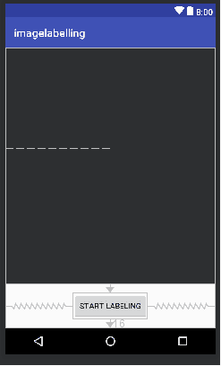


# 编写应用代码

这个应用的代码可以在您的 GitHub 存储库中找到，地址是[https://GitHub . com/packt publishing/Machine-Learning-for-Mobile/tree/master/Fritz/image labeling/image labeling](https://github.com/PacktPublishing/Machine-Learning-for-Mobile/tree/master/Fritz/imagelabelling/imagelabelling)。

一旦你下载了代码，在 Android studio 中打开它，你可以在`MainActivity.java`中找到代码。

解释整个代码，可能更多的是处理 android 代码。在这里，您可以找到重要代码块的解释:

```
Fritz.configure(this.getApplicationContext());
```

`oncreate`生命周期方法中的前一行将初始化 Fritz 框架:

```
options = new FritzVisionLabelPredictorOptions.Builder()
        .confidenceThreshold(0.3f)
        .build();
```

前面一行将为标注预测器创建配置选项:

```
visionPredictor = FritzVisionLabelPredictor.getInstance(this.getApplicationContext(), options);
```

创建预测器的实例:

```
Bitmap bmp = BitmapFactory.decodeFile(file.getPath());
```

将图像保存到文件并将其转换为位图:

```
FritzVisionImage img = FritzVisionImage.fromBitmap(bmp);
List<FritzVisionLabel> labels = visionPredictor.predict(img);
```

将位图图像转换为 fritz vision 图像，并将该图像对象提供给预测器的`predit`方法，该方法反过来将预测的标签作为列表返回:

```
String output="";

for(FritzVisionLabel lab: labels)
{
    output = output + lab.getText()+"\t Confidence: "+ lab.getConfidence();
}

if(output.trim().length()==0)
{
    output = "Unable to predict.";
}
Toast.makeText(MainActivity.this, output, Toast.LENGTH_LONG).show();
```

由于预测器返回了一个`Fritzvisionlabel`对象的列表，我们需要解码并显示给用户。前面的代码向用户显示了 Toast 消息中的内容和置信度。

一旦您运行应用，从相机捕捉的图像帧将显示在我们在布局中创建的纹理视图中。

一旦点击开始标记按钮，它会将图像保存到磁盘，并将相同的图像输入到`Fritzvisionlabel`预测器。一旦您恢复了预测结果，您将解释它并以`Toast`消息的形式显示给用户。

为了让前面的应用工作，我们需要将此应用添加到您的 Fritz 项目中。

为此，请在 Fritz web 控制台中单击项目左侧菜单中的项目设置。

然后，点击添加 android 应用到您的项目，它会打开一个对话框，如下所示:

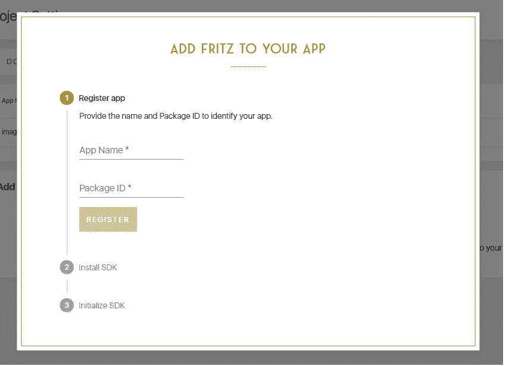

在这种情况下，您需要为您的应用命名，以便识别。然后，您需要从您的 android 清单文件中获取包名，并将其输入到`Package ID`文本字段中。

这可以从清单文件的清单标记中获得，如下所示:

```
<?xml version="1.0" encoding="utf-8"?>
<manifest xmlns:android="http://schemas.android.com/apk/res/android"
    package="com.example.avinaas.imagelabelling">
```

一旦你注册了这个应用，你就可以通过将一个 Android 设备连接到你的 PC 并启用 USB 调试选项来运行并查看结果。

请确保您在 android studio 中禁用了即时运行选项。这可以通过文件菜单中的设置选项来完成。

成功运行应用后，结果将如下所示:

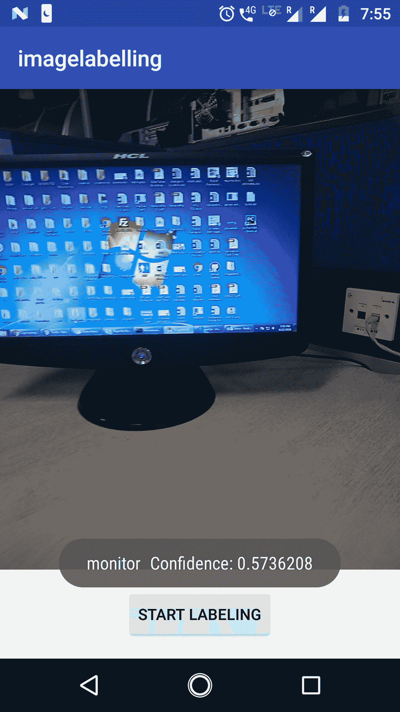


# 在使用 Fritz 的 iOS 应用中使用现有的核心 ML 模型

在这一节中，我们将看到如何使用我们已经使用 Fritz toolkit 在 iOS 移动应用中创建的核心 ML 模型。我们将使用`Boston`数据集获取使用 Core ML 创建的`HousePricer.mlmodel`，并使用线性回归算法执行房价预测。我们将详细说明实现这一目标所需的步骤。

为此，请在[https://GitHub . com/packt publishing/Machine-Learning-for-Mobile/tree/master/housing % 20 price % 20 prediction/sample](https://github.com/PacktPublishing/Machine-Learning-for-Mobile/tree/master/housing%20price%20prediction/sample)下载房价预测包 GitHub 中的线性回归示例源代码。


# 向弗里茨注册

为了使用 fritz，您必须在 fritz 门户网站上注册一个帐户:

1.  转到[https://fritz.ai/](https://fritz.ai/)。
2.  点击顶部菜单上的登录
3.  点击创建账户
4.  输入您的详细信息并提交


# 在 Fritz 中创建新项目

拥有帐户后，使用您的凭据登录并执行以下步骤:

1.  单击“添加新项目”按钮
2.  输入项目名称和组织
3.  点击提交


# 正在上传模型文件(。pb 或者。tflite)

以下是上传模型文件的步骤:

1.  单击左侧菜单中的自定义模型
2.  给出模型名称和描述
3.  运行 Python 程序后，上传在第一个线性回归章节中生成的模型文件(`HousePricer.mlmodel`

你可以在下载的目录中找到这个文件:[https://github . com/packt publishing/Machine-Learning-for-Mobile/tree/master/housing % 20 price % 20 prediction/sample/sample](https://github.com/PacktPublishing/Machine-Learning-for-Mobile/tree/master/housing%20price%20prediction/sample/sample)。

4.  单击创建模型文件按钮

上传后，模型页面将如下所示:

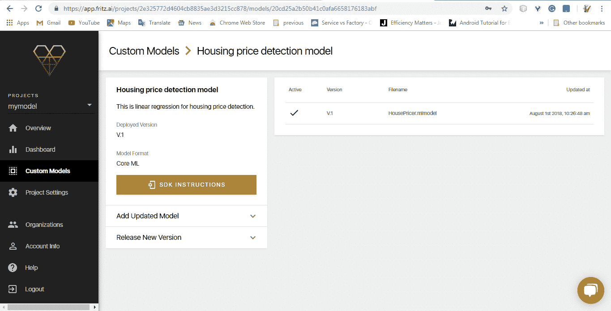


# 创建 Xcode 项目

现在，打开您已经下载到 Xcode 中的项目。该项目将如下所示。

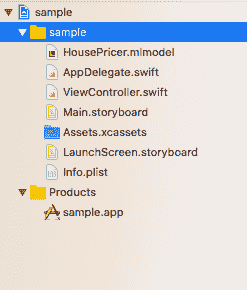


# 安装 Fritz 依赖项

要安装 Fritz 依赖项，请从 Fritz 下载适用于您的型号的 pod 文件。为此，您需要将 iOS 项目添加到 fritz 项目中。这可以从 fritz 控制台的项目设置页面中完成。

在项目设置页面，点击添加 IOS 项目按钮。然后在打开应用时，使用 Xcode 中显示的应用名称填写对话框。用您可以从构建设置中获得的包 ID 填充它，如下面的屏幕截图所示:

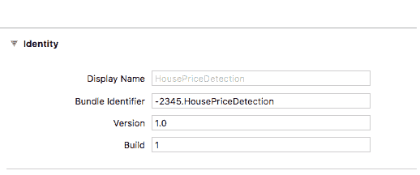

然后你将被允许下载`Fritz-info.plist`文件。将此文件添加到 Xcode 中的项目文件夹，如下面的屏幕截图所示:

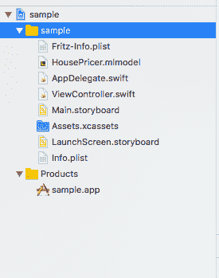

之后，您需要关闭 Xcode，从终端导航到您的项目文件夹，并逐个给出以下命令:

```
$ pod init
$ pod 'Fritz'
$ pod install
```

这将为您的应用创建一个`.xcworkspace`文件。将该文件用于应用的所有未来开发。

现在关闭 Xcode 应用，并使用该文件重新打开项目。


# 添加代码

在 fritz 控制台中打开您的模型控制台。它会有一个按钮- SDK 指令点击它会打开一个对话框，如下图所示。如对话框所示，用显示的文件名创建一个新文件，并将代码粘贴/写入其中:

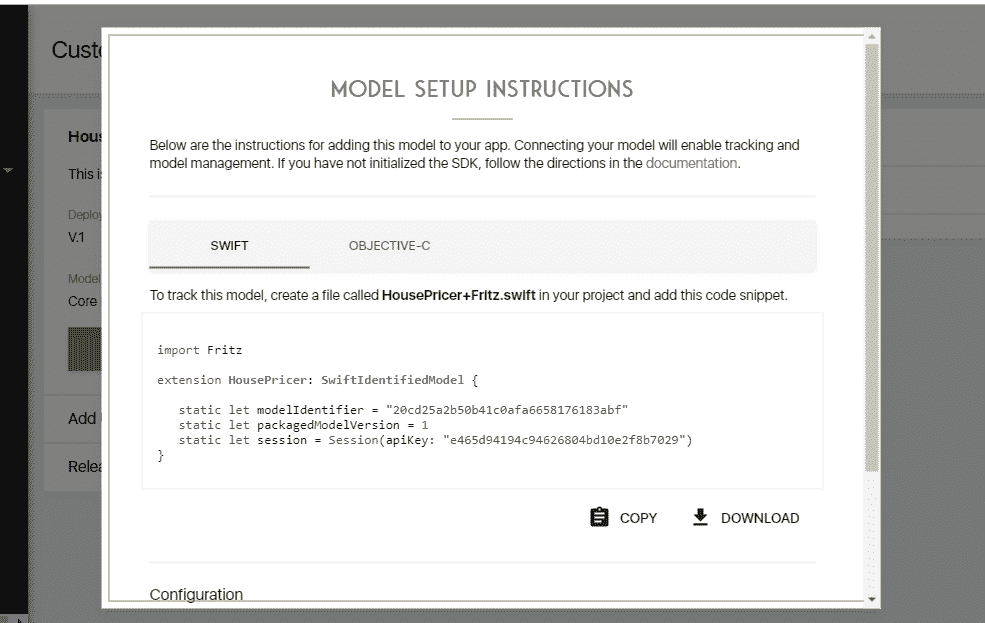

现在，一旦你添加了这个文件，你需要打开`AppDelegate.swift`并做如下修改:

*   首先，添加一个新的导入
*   导入`Fritz`
*   现在在应用委托类中:

```
      func application(_application : UIApplication, 
      didFinishLaunchingWithOptions launchOptions: 
      [UIApplication.LauncgOptionsKey: Any])
```

替换先前的方法定义如下所示:

```
func application(_ application: UIApplication,
didFinishLaunchingWithOptions launchOptions: [UIApplication.LaunchOptionsKey: Any]?)
-> Bool {
FritzCore.configure()
return true
}
```


# 构建和运行 iOS 移动应用

类似于我们构建 iOS 移动应用的方式，在模拟器中构建并运行项目，它会给你以下结果:

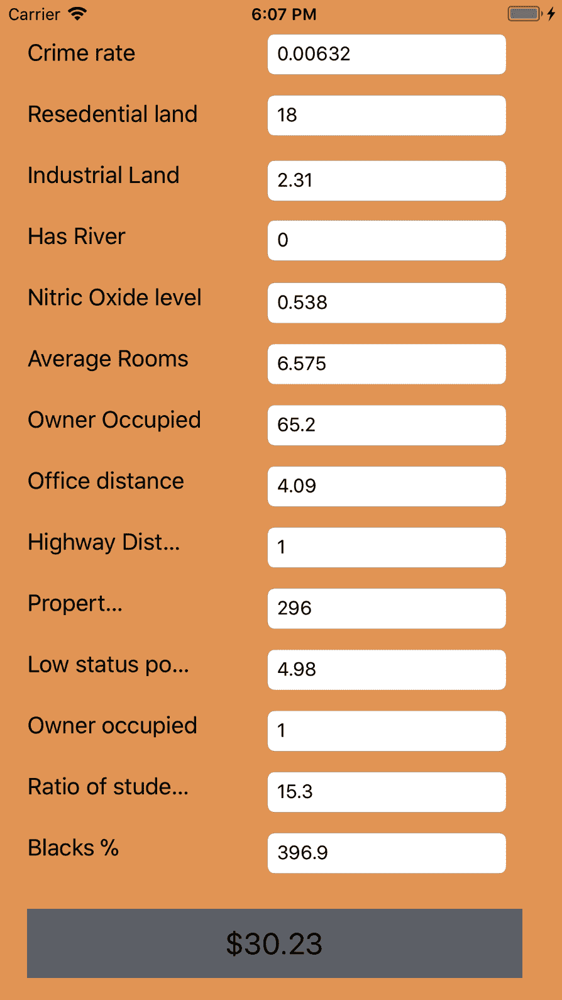


# 摘要

在这一章中，我们学习了 Fritz，这是一个端到端的平台，使我们能够创建机器学习应用。我们还研究了预构建的 ML 模型以及如何在 Fritz 中使用定制模型。然后，我们探讨了如何在 iOS 和 Android 中实现 Core ML 中的 Fritz。最后，我们使用 fritz 库创建了两个应用:一个使用预构建的 Fritz 模型，另一个使用 iOS 的核心 ML 模型。在下一章，我们将学习神经网络及其在移动应用和机器学习中的应用。