# 机器学习中的移动景观

计算机每天都在进步，设备的外形也在发生巨大的变化。过去，我们只会在办公室看到电脑，但现在我们在家里的桌子上、腿上、口袋里和手腕上都可以看到电脑。随着机器配备越来越多的智能，市场变得越来越多样化。

目前，几乎每个成年人都随身携带一个设备，据估计，无论是否有必要，我们每天至少要看 50 次智能手机。这些机器影响着我们的日常决策过程。设备现在配备了 Siri、谷歌助手、Alexa 或 Cortana 等应用，这些功能旨在模仿人类智能。回答任何问题的能力将这些类型的技术呈现为人类大师。在后端，这些系统利用从所有用户那里获得的集体智慧进行改进。你与虚拟助手互动得越多，他们给出的结果就越好。

尽管有这些进步，我们离通过机器创造人脑还有多远？我们现在是 2018 年。如果科学发现了一种控制我们大脑神经元的方法，这可能在不久的将来成为可能。模仿人类能力的机器正在帮助解决复杂的文本、视觉和听觉问题。它们类似于人类大脑每天执行的任务——平均而言，人类大脑每天做出大约 35，000 个决定。

虽然我们将来能够模仿人脑，但这是有代价的。目前我们没有更便宜的解决方案。与人脑相比，人脑模拟程序的功耗量限制了它。人脑耗电约 20 W，而一个模拟程序耗电约 1 MW 以上。人类大脑中的神经元运行速度为 200 Hz，而典型的微处理器运行速度为 2 GHz，是这个速度的 1000 万倍。

虽然我们离克隆人脑还很远，但我们可以实现一种算法，根据以前的数据以及来自类似设备的数据做出有意识的决定。这就是**人工智能** ( **AI** )的子集派上用场的地方。通过预定义的算法从我们拥有的复杂数据中识别模式，这些类型的智能可以为我们提供有用的信息。

当计算机每次都在没有明确指令的情况下开始做决策时，我们就达到了**机器学习** ( **ML** )的能力。ML 现在无处不在，包括通过识别垃圾邮件、推荐在电子商务网站上购买的最佳产品、在社交媒体照片上自动标记你的面部等功能。所有这些都是使用历史数据中确定的模式，以及通过减少数据中不必要的噪声并产生高质量输出的算法来完成的。当数据积累得越来越多时，计算机可以做出更好的决策。

由于我们可以更广泛地使用移动设备，我们在这些设备上花费的时间也在迅速增加，因此在手机上运行 ML 模型是有意义的。在手机市场，Android 和 iOS 平台率先覆盖了整个智能手机频谱。我们将探索 TensorFlow Lite 和 Core ML 如何在这些移动平台上工作。

本章将涉及的主题如下:

*   ML 基础知识(带示例)
*   张量流和核心 ML 基础


# 机器学习基础

ML 是一个概念，它描述了一组通用算法分析你的数据的过程，并为你提供有趣的数据，而无需为你的问题编写任何特定的代码。

或者，我们可以将 ML 视为一个黑匣子，尖端科学家如何使用它来做一些疯狂的事情，如检测癫痫或癌症疾病，而您简单的电子邮件收件箱每天都在使用它来过滤垃圾邮件。

在更大的层面上，洗钱可分为以下两类:

*   监督学习
*   无监督学习


# 监督学习

有了监督学习，你的主要任务就是开发一个将输入映射到输出的函数。例如，如果您有输入变量( *x* )和输出变量( *y* )，那么您可以使用一种算法来学习从输入到输出的映射函数:

*y = f(x)*

目标是很好地逼近映射函数，以便当您有新的输入数据( *x* )时，您可以预测它的输出变量( *y* )。

例如，你有一堆水果和篮子。你开始给水果和篮子贴上苹果、香蕉、草莓等标签。当你把所有的水果都放进相应的篮子里后，现在你的工作是给新进的水果贴上标签。通过给它们贴标签，你已经学会了所有的水果和它们的细节。根据之前的经验，你现在可以根据颜色、大小和图案等属性给新水果贴上标签。


# 无监督学习

在这种情况下，您只有输入数据( *x* )而没有相应的输出变量。无监督学习的目标是对数据中的底层结构或分布进行建模，以便了解更多信息。

在无监督学习中，你可能一开始没有任何数据。例如，在上面讨论的监督学习的相同场景中，你有一个装满水果的篮子，你被要求将它们分成相似的组。但你没有任何以前的数据，或者没有训练或标签是早些时候做的。在这种情况下，您需要首先了解领域，因为您不知道输入是否是水果。在这种情况下，您需要首先理解每个输入的所有特征，然后尝试与每个新输入匹配。可能在最后一步，你会把所有红色的水果放在一个篮子里，绿色的水果放在另一个篮子里。但不是一个准确的分类。这被称为无监督学习。


# 线性回归-监督学习

让我们来看一个简单的线性回归示例及其在 TensorFlow 上的实现。

让我们预测一所房子的价格，查看同一地区其他房子的价格及其大小信息:

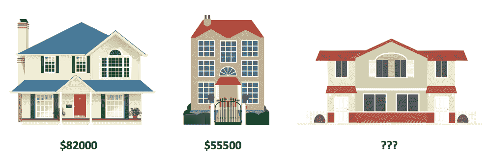

我们有一栋价值 82，000 美元的房子，另一栋价值 55，000 美元。现在，我们的任务是找出第三所房子的价格。我们知道所有房子的大小和价格，我们可以将这些数据绘制成图表。让我们根据另外两个数据点找出第三栋房子的价格:

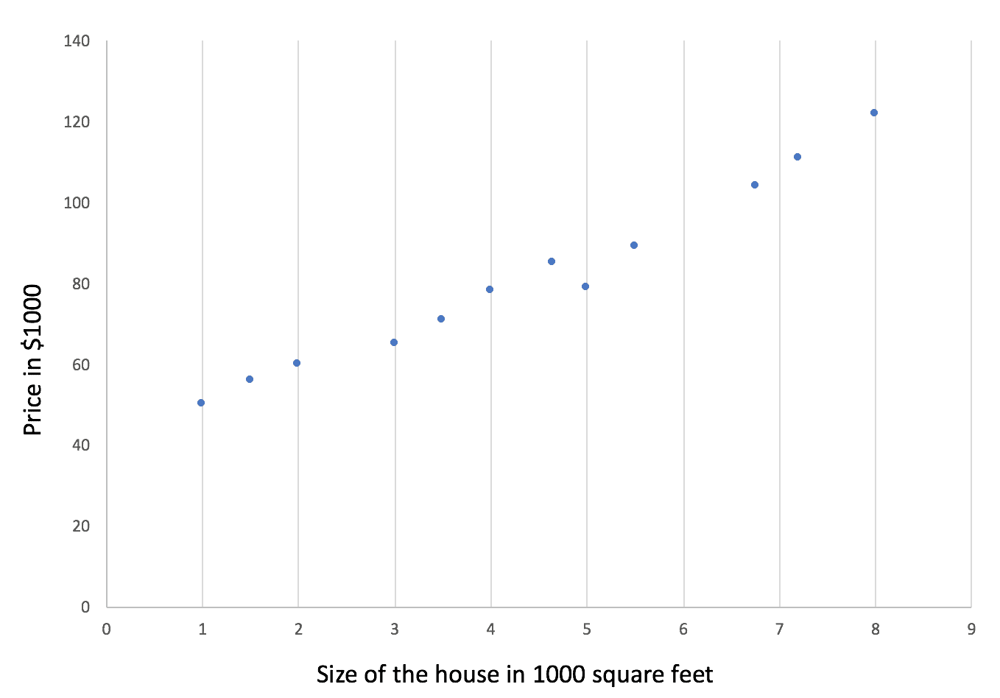

你可能想知道现在如何划清界限。靠近图上标记的所有点随机画一条线。现在，计算每个点到直线的距离，并将它们相加。这样做的结果是误差值。我们的算法应该朝着最小化误差的方向发展，因为最佳拟合线具有较低的误差值。这个过程被称为**梯度下降**。

特定地区所有房屋的价格都相应地标在图上。现在，让我们画出我们已经知道的两套房子的价值:

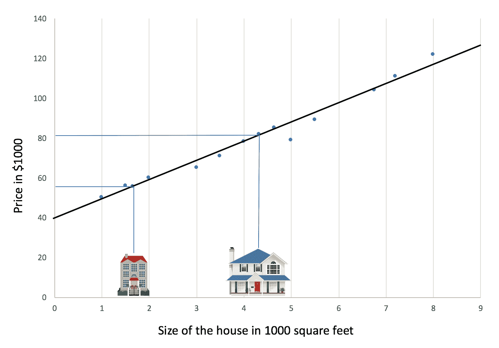

之后，让我们画一条更接近大多数值的线。这条线与数据完全吻合。由此，我们应该能够确定三号房屋的价格:

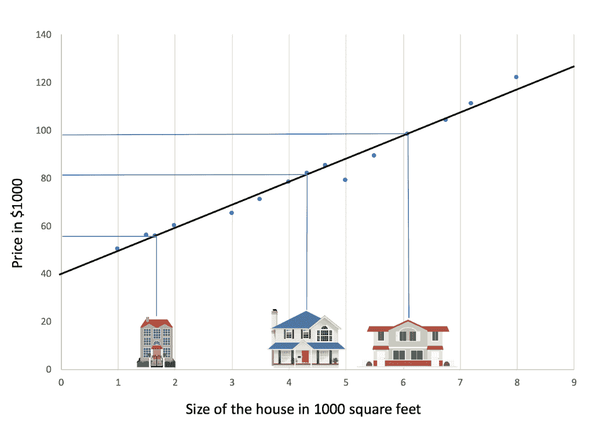

基于为住宅 3 号提供的数据的大小，我们可以在图表上映射为住宅 3 号提供的数据的大小。这将允许我们计算出通过所有点画的线上的连接点。这对应于 y 轴上的 98，300 美元。这就是所谓的**线性回归**:

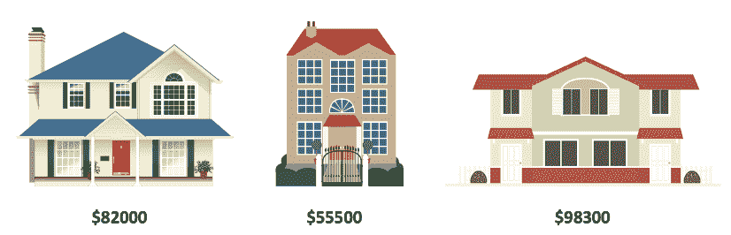

让我们试着把我们的问题转化成伪代码的形式:

```
def estimate_house_price(sqft, location): 
 price = 0 
 #In my area, the average house costs 2000 per sq.ft 
 price_per_sqft = 2000 
 if location == "vegas": 
     #but some areas cost a bit more 
     price_per_sqft = 5000 
 elif location == "newyork": 
     #and some areas cost less 
     price_per_sqft = 4000 
 #start with a base price estimate based on how big the place is 
 price = price_per_sqft * sqft 
 return price
```

这将是你估计房价的典型方法。我们可以继续添加越来越多的条件检查，但它不能被控制超过位置或参数增加的点。对于一个典型的房价估计，还有很多其他因素也要考虑，如房间的数量，附近的位置，学校，加油站，医院，水位，交通，等等。我们可以把这个函数概括成非常简单的东西，并猜出正确的答案:

```
def estimate_house_price(sqft, location): 
 price = < DO MAGIC HERE >
 return price
```

我们如何在不写条件检查的情况下确定一条完全符合的线？通常，线性回归线以下列形式表示:

*Y = XW +b*

在我们的示例中，为了更好地理解，让我们用一种更简单的形式来描述:

*预测= X *权重+偏差*

*Weight* 是直线的斜率， *bias* 是截距(当 *X = 0* 时 *Y* 的值)。构建线性模型后，我们需要识别梯度下降。*成本*函数识别均方误差，以产生梯度下降:

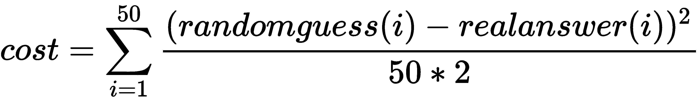

让我们通过伪代码来表示 *cost* 函数，来解决我们估算房价的问题:

```
def estimate_house_price(sqft, location):
 price = 0
 #and this
 price += sqft * 235.43
 #maybe this too
 price += location * 643.34
 #adding a little bit of salt for a perfect result 
 price += 191.23
 return price
```

值`235.43`、`643.34`和`191.23`看起来可能是随机的，但是有了这些值，我们就能够发现任何新房子的估价。我们如何得出这个值？我们应该进行一次迭代，以达到正确的值，同时减少我们在正确方向上的误差:

```
def estimate_house_price(sqft, location):
 price = 0
 #and this
 price += sqft * 1.0
 #maybe this too
 price += location * 1.0
 #adding a little bit of salt for a perfect result
 price += 1.0
 return price
```

因此，我们将从`1.0`开始迭代，并开始在正确的方向上最小化误差。让我们用 TensorFlow 把它写成代码。稍后，我们将更深入地了解使用的方法:

```
#import all the necessary libraries
import tensorflow as tf
import matplotlib.pyplot as plt
import numpy

#Random number generator
randnumgen = numpy.random

#The values that we have plotted on the graph
values_X = 
  numpy.asarray([1,2,3,4,5.5,6.75,7.2,8,3.5,4.65,5,1.5,4.32,1.65,6.08])
values_Y = 
 numpy.asarray([50,60,65,78,89,104,111,122,71,85,79,56,81.8,55.5,98.3])

# Parameters
learning_rate = 0.01
training_steps = 1000
iterations = values_X.shape[0]

# tf float points - graph inputs
X = tf.placeholder("float")
Y = tf.placeholder("float")

# Set the weight and bias
W = tf.Variable(randnumgen.randn(), name="weight")
b = tf.Variable(randnumgen.randn(), name="bias")

# Linear model construction
# y = xw + b
prediction = tf.add(tf.multiply(X, W), b)

#The cost method helps to minimize error for gradient descent. 
#This is called mean squared error.
cost = tf.reduce_sum(tf.pow(prediction-Y, 2))/(2*iterations)

# In TensorFlow, minimize() method knows how to optimize the values for # weight & bias. 
optimizer = 
   tf.train.GradientDescentOptimizer(learning_rate).minimize(cost)

#assigning default values 
init = tf.global_variables_initializer()

#We can start the training now
with tf.Session() as sess:

    # Run the initializer. We will see more in detail with later       
    #chapters
     sess.run(init)

    # Fit all training data
     for step in range(training_steps):
         for (x, y) in zip(values_X, values_Y):
             sess.run(optimizer, feed_dict={X: x, Y: y})
             c = sess.run(cost, feed_dict={X: values_X, Y:values_Y})
             print("Step:", '%04d' % (step+1), "cost=", "  
                             {:.4f}".format(c), \
                             "W=", sess.run(W), "b=", sess.run(b))

     print("Successfully completed!")
     # with this we can identify the values of Weight & bias
     training_cost = sess.run(cost, feed_dict={X: values_X, Y: 
                                               values_Y})
     print("Training cost=", training_cost, "Weight=", sess.run(W), 
           "bias=", sess.run(b))

     # Lets plot all the values on the graph
     plt.plot(values_X, values_Y, 'ro', label='house price points')
     plt.plot(values_X, sess.run(W) * values_X + sess.run(b), 
                                       label='Line Fitting')
     plt.legend()
     plt.show()
```

你可以从我们的 GitHub 资源库([https://GitHub . com/packt publishing/Machine-Learning-Projects-for-Mobile-Applications](https://github.com/PacktPublishing/Machine-Learning-Projects-for-Mobile-Applications))的`Chapter01`下找到相同的代码。


# TensorFlow Lite 和 Core ML

对于这本书来说，一个好的起点是尝试 ML 模型数据集和训练模型。这将有助于快速进入后续章节。我们不打算在这里处理基本的 ML 算法；相反，这将是一个更加基于实践的方法。你可以从我们的 GitHub 库([https://github.com/intrepidkarthi/MLmobileapps](https://github.com/intrepidkarthi/MLmobileapps))下载完整的代码库。

在本书中，我们将讨论两个框架:TensorFlow Lite 和 Core ML。这两个框架与 Android 和 iOS 紧密耦合。我们将通过 TensorFlow Lite 在移动设备上研究 ML 的基础知识。假设读者知道张量流和基本 ML 算法的基础，因为这本书不打算涵盖那些元素。

如前所述，我们每个人几乎无时无刻不在口袋里拿着一部智能手机。我们有大量的数据来自这些设备上的传感器。除此之外，我们还有来自边缘设备的数据。在写这本书的时候，这个类别下有将近 230 亿个设备，包括智能扬声器、智能手表和智能传感器。过去只能在价格较高的设备上使用的高端技术现在也可以在价格较低的设备上使用。这些设备的指数级增长率为这些设备上的 ML 铺平了道路。

虽然在设备上运行 ML 有很多原因，但最主要的原因是延迟。如果您正在处理视频或音频，您不希望不断地来回 ping 服务器上的数据。另一个优点是，当设备处于离线模式时，您可以进行处理。重要的是，数据保留在用户本地的设备上。这在电池/功耗方面更节能。

虽然这看起来是一个优点，但是这种方法也有一些缺点。我们的大多数设备都使用容量有限、处理能力较低、内存限制严格的电池。TensorFlow 框架不会解决所有这些问题，这就是为什么它已经转变为在所有这些条件下都能有效工作的框架。TensorFlow Lite 是一个轻量级、节能和内存高效的框架，将在嵌入式小尺寸设备上运行。


# TensorFlow Lite

TensorFlow Lite 框架由五个高级组件组成。所有这些组件都经过优化，可在移动平台上运行，如下面的架构图所示:

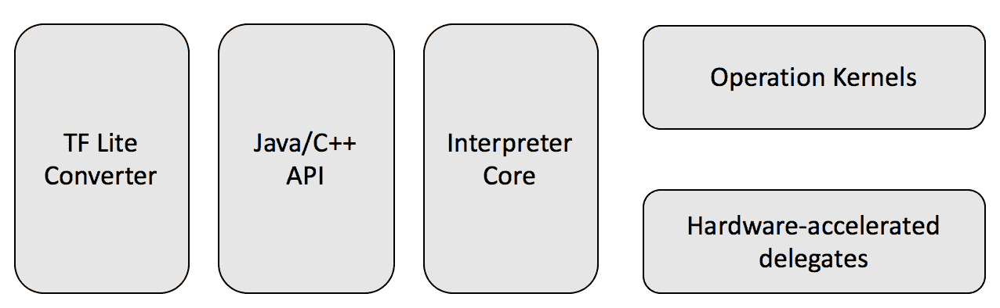

以下是 TensorFlow Lite 架构的核心单元:

*   第一部分是使用 TensorFlow Lite 转换器将您现有的模型转换为与 TensorFlow Lite 兼容的模型(`.tflite`)，并将您的训练模型存储在磁盘上。您还可以在移动或嵌入式应用中使用预先训练的模型。
*   Java/c++ API——API 加载`.tflite`模型并调用解释器。它在所有平台上都可用。Java API 是写在 C++ API 之上的包装器，只在 Android 上可用。
*   解释器和内核——解释器模块在操作内核的帮助下运行。它有选择地加载内核；核心解释器的大小是 75 KB。这与 TensorFlow Mobile 所需的 1.1 MB 相比，在 TensorFlow Lite 上有了显著的降低。通过所有支持的操作，它的核心解释器大小达到 400 KB。开发人员可以选择性地选择他们想要包含的操作。这样，他们可以保持较小的足迹。

*   硬件加速委托——在选定的 Android 设备上，解释器将使用 Android **神经网络 API** ( **NNAPI** )进行硬件加速，或者如果没有可用的，则默认为 CPU 执行。

您还可以使用解释器可以使用的 C++ API 来实现定制内核。


# 支持的平台

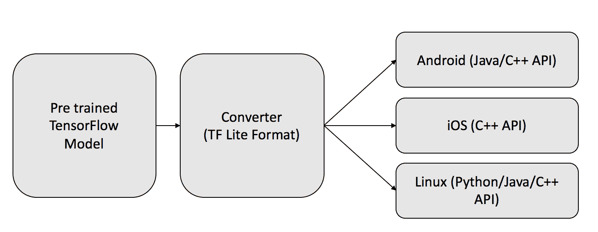

TensorFlow Lite 目前支持 Android/iOS 平台以及 Linux(例如 Raspberry Pi)平台。在 Raspberry Pi 等嵌入式设备上，Python API 有所帮助。TensorFlow Lite 平台还支持核心 ML 模型以及 iOS 平台。

在 iOS 平台上，从预先训练的 TensorFlow 模型中，我们可以直接将格式转换为核心 ML 模型，应用将直接在核心 ML 运行时上运行:

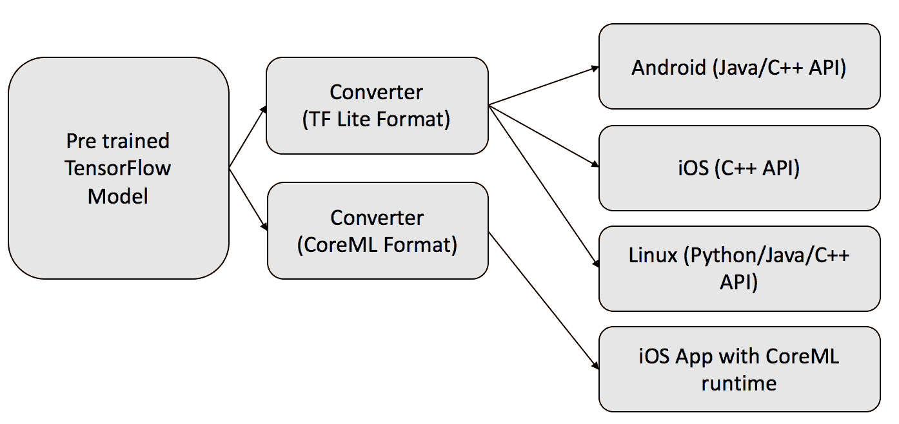

使用单一模型，我们可以通过转换格式在 Android/iOS 平台上运行该模型。


# TensorFlow Lite 内存使用和性能

TensorFlow 对模型使用 FlatBuffers。FlatBuffers 是一个跨平台、开源的序列化库。使用 FlatBuffers 的主要优点是，在通过打包/解包访问数据之前，它不需要二次表示。它通常与基于对象的内存分配相结合。FlatBuffers 比协议缓冲区更节省内存，因为它有助于我们保持较小的内存占用。

FlatBuffers 最初是为游戏平台开发的。因为它对性能敏感，所以也用于其他平台。在转换时，TensorFlow Lite 预融合激活和偏差，使 TensorFlow Lite 执行速度更快。解释器使用静态内存和执行计划，这使得它可以更快地加载。优化后的操作内核在 NEON 和 ARM 平台上运行更快。

TensorFlow 充分利用了这些设备在硅片层面上的所有创新。TensorFlow Lite 支持 Android NNAPI。在撰写本文时，一些 **Oracle 企业经理**(**OEM**)已经开始使用 NNAPI。TensorFlow Lite 采用直接图形加速，在 Android 上使用**开放图形库** ( **OpenGL** )，在 iOS 上使用 Metal。

为了提高性能，对量化进行了更改。这是一种存储数字并对其进行计算的技术。这在两个方面有所帮助。首先，只要型号更小，就更适合更小的设备。其次，许多处理器都有专门的合成指令集，处理定点操作数比处理浮点数快得多。所以，一个非常简单的量化方法是在你完成训练后简单的缩小权重和激活。然而，这导致次优精度。

TensorFlow Lite 在 MobileNet 和 Inception-v3 上的性能是 TensorFlow 的三倍。虽然 TensorFlow Lite 仅支持推理，但它很快会被改编为包含一个培训模块。TensorFlow Lite 支持大约 50 种常用操作。

它支持 MobileNet、Inception-v3、ResNet50、SqueezeNet、DenseNet、Inception-v4、SmartReply 等:

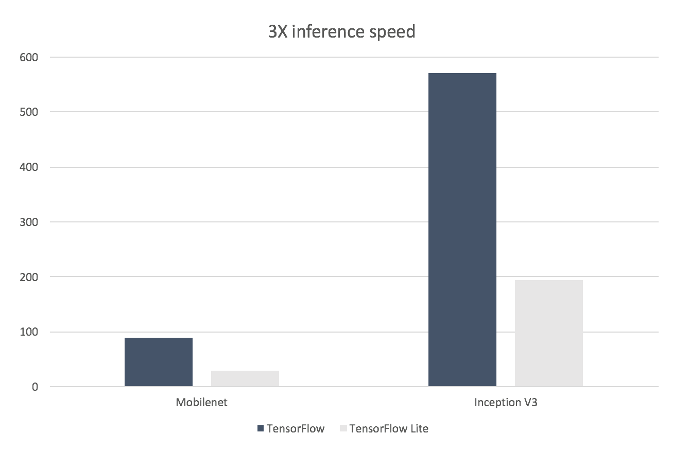

图中的 *y* 轴以毫秒为单位。


# TensorFlow Lite 实践

借助 TensorFlow Lite，您可以使用现有模型快速开始构建您的第一个基于 TensorFlow Lite 的应用:

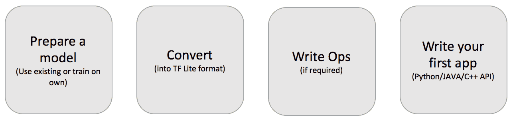

实时使用 TensorFlow Lite 包括四个步骤:

1.  在第一步中，我们需要要么使用一个现有的模型，要么准备我们自己的模型并训练它。
2.  一旦模型准备好了，就需要使用转换器将其转换成`.tflite`格式。
3.  然后，我们可以在它的基础上编写 ops 进行任何类型的优化。
4.  你可以开始写你的 hello world 项目了。

让我们从这里直接进入代码。


# 将 SavedModel 转换为 TensorFlow Lite 格式

通过调用转换方法，只需一行代码就可以将 ML 模型转换成 TensorFlow Lite 模型。下面是将现有模型转换为 TensorFlow Lite 格式的简单 Python 片段。您可以输入现有模型并将其转换成`.tflite`格式:

```
import sys
from tf.contrib.lite import convert_savedmodel
convert_savedmodel.convert(
                            saved_model_directory="/tmp/your_model",
                            output_tflite_file="/tmp/my_model.tflite")
```

这里的代码使用 FlatBuffers 将在其他框架中创建的现有模型转换为 TensorFlow Lite 格式。需要遵循一些转换策略。


# 战略

我们实施以下策略:

*   使用冻结的 graphdef(或 SavedModel)
*   避免不支持的运算符

*   使用可视化工具理解模型(TensorBoard 和 TensorFlow Lite 可视化工具)
*   为任何缺失的功能编写自定义运算符
*   如果遗漏了什么，向社区提出问题

在以后的章节中，当我们深入到实际应用中时，我们将会看到这些策略的细节。


# Android 上的 TensorFlow Lite

我们可以开始使用 TensorFlow GitHub 存储库中提供的演示应用。这是一个相机应用，使用浮点 Inception-v3 模型或量化的 MobileNet 模型对图像进行连续分类。使用 Android 或更早版本尝试一下。

试玩 app 可以在:[https://github . com/tensor flow/tensor flow/tree/master/tensor flow/contrib/lite/Java/demo/app](https://github.com/tensorflow/tensorflow/tree/master/tensorflow/contrib/lite/java/demo/app)找到。

这个应用执行帧的实时分类。它显示最有可能的分类类别。它还显示检测物体所用的时间。

有三种方法可以在您的设备上获得演示应用:

*   你可以下载预编译的 APK 二进制文件
*   您可以在 Android Studio 上构建并运行应用
*   您可以使用 Bazel 下载 TensorFlow Lite 的源代码，并通过命令行运行应用


# 下载 APK 二进制文件

这是尝试应用的最简单的方法。

安装应用后，启动应用。首次打开应用时，它会提示您使用运行时权限访问设备摄像头。一旦启用了权限，您就可以使用该应用来识别实时背面摄像头视图中的对象。在结果中，您可以看到已识别对象的前三个分类，以及延迟。


# Android Studio 上的 TensorFlow Lite

您可以通过以下步骤直接从 Android Studio 下载并构建 TensorFlow Lite:

1.  下载并安装最新版本的 Android Studio。
2.  在您的工作室设置中，确保 NDK 版本大于 14，SDK 版本大于 26。我们在本书和以后的应用中使用 27。我们将在以后的项目中详细讨论如何配置它。
3.  您可以从以下信息框中的链接下载该应用。
4.  按照 Android Studio 的指示，你需要安装所有的 Gradle 依赖项。

演示应用可以在:[https://github . com/tensor flow/tensor flow/tree/master/tensor flow/contrib/lite/Java/demo/app/src/main/Java/com/example/Android/tflitecamerademo](https://github.com/tensorflow/tensorflow/tree/master/tensorflow/contrib/lite/java/demo/app/src/main/java/com/example/android/tflitecamerademo)找到。

我们需要一个模型，以便在应用中使用它。我们可以使用现有的模型，也可以训练我们自己的模型。让我们在这个应用中使用一个现有的模型。

您可以通过信息框中的链接下载模型。您也可以从以下链接下载压缩的模型文件:

*   您可以下载一个 Inception-v3 浮点模型或者最新的 MobileNet 模型。将适当的`.tflite`复制到 Android 应用的`assets`目录中。然后，您可以在`Camera2BasicFragment.java`文件`tensorflow/contrib/lite/java/demo/app/src/main/assets/`中更改分类器。

模型可以从:[https://github . com/tensor flow/tensor flow/blob/master/tensor flow/contrib/lite/g3doc/models . MD](https://github.com/tensorflow/tensorflow/blob/master/tensorflow/contrib/lite/g3doc/models.md)下载。

现在，您可以构建并运行演示应用。


# 从源代码构建 TensorFlow Lite 演示应用

第一步，克隆 TensorFlow repo。你需要巴泽尔来建造 APK:

```
git clone https://github.com/tensorflow/tensorflow
```


# 安装 Bazel

如果 Bazel 没有安装在您的系统上，您需要安装它。本书根据 macOS High Sierra 10.13.2 经验编写。Bazel 是通过自制软件安装的。


# 使用自制软件安装

以下是安装 Homebrew 的步骤:

1.  家酿有依赖 JDK，你需要先安装。从 Oracle 网站下载并安装最新的 JDK。
2.  然后，安装家酿。

您可以直接从终端运行以下脚本:

```
/usr/bin/ruby -e "$(curl -fsSL \
 https://raw.githubusercontent.com/Homebrew/install/master/install)"
```

一旦安装了 Homebrew，您可以使用以下命令安装 Bazel:

```
brew install bazel
```

一切都好。现在，您可以使用下面显示的命令来验证 Bazel 版本:

```
bazel version
```

如果已经安装了 Bazel，您可以使用以下命令升级版本:

```
brew upgrade bazel
```

请注意，Bazel 目前不支持 Windows 上的 Android 版本。Windows 用户应该下载预构建的二进制文件。


# 安装安卓 NDK 和 SDK

您需要 Android NDK 来构建 TensorFlow Lite 代码。你可以通过以下链接从 NDK 档案馆下载。

安卓 NDK 档案可以从:[https://developer.android.com/ndk/downloads/older_releases](https://developer.android.com/ndk/downloads/older_releases)下载。

Android Studio 自带 SDK 工具。您需要访问构建工具版本 23 或更高版本(应用运行在具有 API 21 或更高版本的设备上)。

您可以使用 API 级别和到 SDK 和 NDK 的路径来更新目录根目录中的`WORKSPACE`文件。

更新`api_level`以及 SDK 和 NDK 在存储库根目录下的位置。如果从 Studio 打开 SDK 管理器，可以找到 SDK 路径。例如，请注意 SDK 的以下内容:

```
android_sdk_repository (
 name = "androidsdk",
 api_level = 27,
 build_tools_version = "27.0.3",
 path = "/Users/coco/Library/Android/sdk",
)
```

对于安卓 NDK 档案:

```
android_ndk_repository(
 name = "androidndk",
 path = "/home/coco/android-ndk-r14b/",
 api_level = 19,
)
```

在写作的时候，`android-ndk-r14b-darwin-x86_64.zip`是从 NDK 档案馆拿来的。您可以根据可用性调整上述参数。

现在，我们准备好构建源代码了。要构建演示应用，请运行 Bazel:

```
bazel build --cxxopt=--std=c++11 
 //tensorflow/contrib/lite/java/demo/app/src/main:TfLiteCameraDemo
```

Caution: Due to a bug, Bazel only supports the Python 2 environment right now. 

MobileNet 是开始 ML 的好地方。该数据集中的模型图像由 299 * 299 像素的图像组成。但是，相机捕捉 224 * 224 像素的图像，并调整其大小以匹配模型中的大小。每个图像在磁盘中占用 224 * 224 * 3 字节。之后这些字节被逐行转换成 ByteBuffer。这里，数字 *3* 表示像素的 RGB 值。

这里的演示应用使用 TensorFlow Lite Java API，它将单个图像作为输入，并在输出中生成相同的图像。输出包含一个二维数组。第一个数组包含类别索引值，第二维包含分类的置信度值。根据这些值，它在前端向用户显示前三名。


# iOS 上的 TensorFlow Lite

现在，我们将在 iOS 环境中构建相同的应用。该应用具有相同的功能，我们也将使用相同的量化 MobileNet 模型。我们需要在真实的 iOS 设备上运行它，才能使用相机功能；它在模拟器上不起作用。


# 先决条件

若要开始使用 Xcode，您需要在他们的门户网站上拥有有效的 Apple 开发者 id。该应用还需要 iPhone，因为它使用相机模块。您需要将预置描述文件分配给特定设备。只有这样，您才能在设备上构建和运行应用。

您可以克隆完整的 TensorFlow 存储库，但是要运行此应用，您可能不需要完整的源代码。如果您已经下载了它，则不需要再次下载:

```
git clone https://github.com/tensorflow/tensorflow
```

Xcode 附带了命令行工具，如下所示:

```
xcode-select --install
```


# 构建 iOS 演示应用

如果你对 iOS 应用构建不是很熟悉，请看看这方面的一些基础教程。您需要安装`cocoapods`来安装所有的依赖项:

```
sudo gem install cocoapods
```

有一个 shell 脚本可用于下载运行该应用所需的模型文件:

```
sh tensorflow/contrib/lite/examples/ios/download_models.sh
```

您可以转到项目目录并从命令行安装`pod`:

```
cd tensorflow/contrib/lite/examples/ios/camera
pod install
pod update
```

一旦更新完成，你应该能看到`tflite_camera_example.xcworkspace`。然后，您可以在 Xcode 中打开应用。您也可以使用以下命令:

```
open tflite_camera_example.xcworkspace
```

现在是时候在您的 iPhone 上构建并运行该应用了。

您需要允许应用使用相机的用户权限。用相机指向物体，开始看到分类结果！


# 核心 ML

Core ML 帮助我们构建面向 iOS 平台的 ML 学习应用。

核心 ML 使用基于新输入数据进行预测的训练模型。例如，根据一个地区的历史土地价格训练的模型可能能够在给定位置和面积的详细信息时预测土地的价格。

核心 ML 是其他特定领域框架的基础。Core ML 支持的主要框架包括用于评估学习决策树的 GamePlayKit，用于文本分析的**自然语言处理** ( **NLP** )，以及用于基于图像分析的视觉框架。

核心 ML 构建于 accelerate、**基本神经网络子程序** ( **BNNSs** )和金属性能着色器之上，如核心 ML 文档中的架构图所示:

*   有了 Accelerate 框架，你可以进行大规模的数学计算，也可以进行基于图像的计算。它针对高性能进行了优化，还包含用 C 编写的 API，用于矢量和矩阵计算、**数字信号处理** ( **DSP** )和其他计算。
*   bnn 有助于实现神经网络。从训练数据来看，子例程方法和其他集合对于实现和运行神经网络是有用的。

*   借助 Metal framework，您可以使用 GPU 设备渲染高级三维图形并运行并行计算。它附带了金属着色语言、MetalKit 框架和金属性能着色器框架。通过金属性能着色器框架，它可以与每个 GPU 系列的硬件功能配合工作，以获得最佳性能。

核心 ML 应用建立在上述三层组件之上，如下图所示:

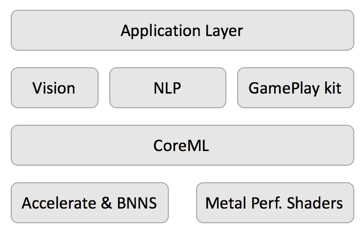

Core ML 针对片上性能进行了优化，最大限度地减少了内存占用和功耗。


# 核心 ML 模型转换

要在 iOS 上运行您的第一个应用，您不需要开始构建自己的模型。你可以使用任何一个现有的最好的模型。如果您有一个使用另一个第三方框架创建的模型，您可以使用核心 ML 工具 Python 包，或第三方包，如 MXNet converter 或 TensorFlow converter。下面给出了访问这些工具的链接。如果您的模型不支持这些转换器，您也可以编写自己的转换器。

核心 ML 工具 Python 包可从:[https://pypi.org/project/coremltools/](https://pypi.org/project/coremltools/)
tensor flow 转换器可通过链接访问:[https://github.com/tf-coreml/tf-coreml](https://github.com/tf-coreml/tf-coreml)
MXNet 转换器可从:[https://github . com/Apache/incubator-MXNet/tree/master/Tools/coreml](https://github.com/apache/incubator-mxnet/tree/master/tools/coreml)

核心的 ML Tools Python 包支持从 Caffe v1、Keras 1.2.2+、scikit-learn 0.18、XGBoost 0.6 和 LIBSVM 3.22 框架的转换。这包括 SVM 模型、树形集成、神经网络、广义线性模型、特征工程和管道模型。

可以通过`pip`安装核心 ML 工具:

```
pip install -U coremltools
```


# 将您自己的模型转换成核心 ML 模型

将现有模型转换成核心 ML 模型可以通过`coremltools` Python 包来完成。如果您想将一个简单的 Caffe 模型转换成一个核心 ML 模型，可以通过下面的例子来完成:

```
import coremltools
my_coremlmodel = 
  coremltools.converters.caffe.convert('faces.caffemodel')
  coremltools.utils.save_spec(my_coremlmodel, 'faces.mlmodel')
```

不同型号的转换步骤不同。您可能需要添加标签和输入名称，以及模型的结构。


# iOS 应用上的核心 ML

在 iOS 应用上集成 Core ML 非常简单。去苹果开发者页面下载预先训练好的模型。从那里下载 MobileNet 模型。

下载完`MobileNet.mlmodel`后，将其添加到项目*中的`Resources`组。*视觉框架通过将现有的图像格式转换成可接受的输入类型来缓解我们的问题。您可以看到您的模型的细节，如下图所示。在接下来的章节中，我们将开始在现有模型的基础上创建我们自己的模型。

让我们看看如何将模型加载到我们的应用中:

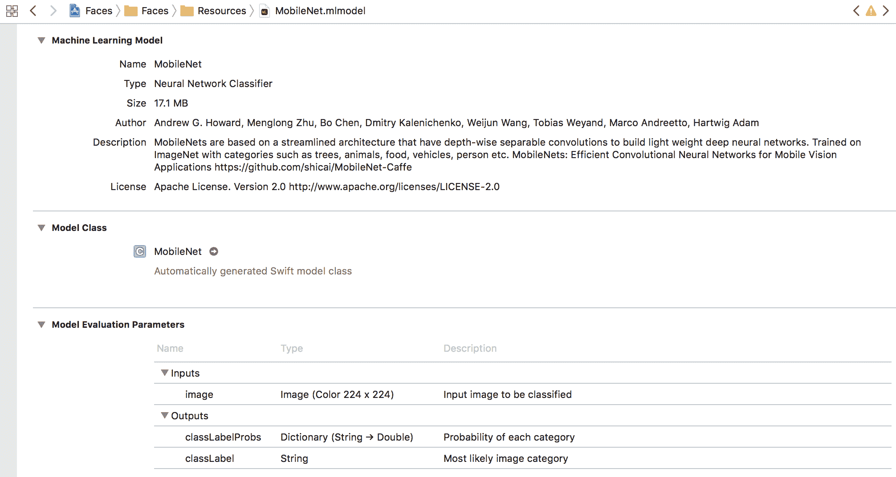

在您最近创建的 Xcode 项目中打开`ViewController.swift`，并导入 Vision 和核心 ML 框架:

```
/**
Lets see the UIImage given to vision framework for the prediction.
The results could be slightly different based on the UIImage conversion.
**/
func visionPrediction(image: UIImage) {
     guard let visionModel = try? VNCoreMLModel(for: model.model) else{
                fatalError("World is gonna crash!")
     }
    let request = VNCoreMLRequest(model: visionModel) { request, error  
                                                        in
     if let predictions = request.results as? [VNClassificationObservation] {
 //top predictions sorted based on confidence
 //results come in string, double tuple
     let topPredictions = observations.prefix(through: 5)
 .map { ($0.identifier, Double($0.confidence)) }
     self.show(results: topPredictions)
     }
   }
}
```

让我们通过用于预测的核心 ML MobileNet 模型加载相同的图像:

```
/** 
Method that predicts objects from image using CoreML. The only downside of this method is, the mlmodel expects images in 224 * 224 pixels resolutions. So we need to manually convert UIImage
into pixelBuffer.
**/
func coremlPrediction(image: UIImage) {
     if let makeBuffer = image.pixelBuffer(width: 224, height: 224),
     let prediction = try? model.prediction(data: makeBuffer) {
     let topPredictions = top(5, prediction.prob)
     show(results: topPredictions)
    }
}
```


# 摘要

我们现在已经熟悉了 TensorFlow Lite 和 Core ML 背后的基本思想。前面提到的所有代码都可以在我们的 GitHub 库中找到。由于这两个库都运行在移动设备上，它们都有局限性。我们将在后续章节中深入探讨实时应用。

在接下来的章节中，你将学习如何基于特定的用例来开发和训练特定的模型。我们还将介绍如何在此基础上构建自己的移动应用。准备好开始训练模型，并在您自己的移动应用上使用它！