# 使用核心 ML 的基于 CNN 的年龄和性别识别

在这一章中，我们将构建一个 iOS 应用程序，从相机馈送或用户的照片库中检测一个人的年龄、性别和情绪。我们将使用 Caffe **机器学习** ( **ML** )库为相同目的构建的现有数据模型，并将这些模型转换为核心 ML 模型，以便在我们的应用程序中使用。我们将更多地讨论**卷积神经网络**(**CNN**)如何通过示例应用程序预测年龄、性别和情绪。

这个应用程序可以用于多种用例。几个例子如下:

*   通过解析图库中的所有照片来查找您拍摄的照片类型
*   了解顾客进入的位置(医院、餐馆等)
*   通过捕捉情感来计算出正确的营销数据
*   通过理解驾驶员的情绪让汽车更安全

还有很多其他的用例。一旦您提高了数据模型的准确性，您就可以找出越来越多的用例。

本章将涵盖以下主题:

*   年龄、性别和情绪预测
*   CNN
*   使用 Core ML 实现 iOS 应用


# 年龄、性别和情绪预测

本章将介绍一个完整的 iOS 应用程序，它使用核心 ML 模型从使用 iPhone 相机拍摄的照片或用户手机图库中的照片中检测年龄、性别和情感。

Core ML 使开发人员能够在设备上安装和运行预先训练好的模型，这有其自身的优势。由于核心 ML 位于本地设备中，因此没有必要调用云服务来获得预测结果。这改善了通信延迟，也节省了数据带宽。核心 ML 的另一个重要好处是隐私。你不需要把你的数据发送给第三方来得到你想要的结果。拥有离线模型的主要缺点是模型不能被更新，因此不能用更新的输入来改进它。此外，一些型号可能会增加内存占用，因为移动设备上的存储是有限的。

使用 Core ML，当您导入 ML 模型时，Xcode 将帮助您完成剩下的工作。在这个项目中，我们将基于 Gil Levi 和 Tal Hassncer 的以下研究论文来构建 iOS 应用程序:*使用卷积神经网络的年龄和性别分类*([https://ieeexplore.ieee.org/document/7301352](https://ieeexplore.ieee.org/document/7301352))，IEEE 关于面部和手势的**分析和建模的研讨会** ( **AMFG** )，在 IEEE Conf。关于**计算机视觉和模式识别** ( **CVPR** )，波士顿，2015。

这个项目是建立在 MacBook Pro 机器上，在 macOS High Sierra 上使用 Xcode 版本 9.3。年龄和性别预测成为社交媒体平台上的常见应用。虽然有多种算法用于预测和分类年龄和性别，但这些算法在性能方面仍有待改进。在这一章中，基于深度细胞神经网络进行分类。

你可以在这里找到本章开发的应用:[https://github . com/intrepidkarthi/MLmobileapps/tree/master/chapter 2](https://github.com/intrepidkarthi/MLmobileapps/tree/master/Chapter2)。在本章中，我们将在我们的应用程序中使用一个数据集。这是在这里找到的:[https://talhassner . github . io/home/projects/a dience/a dience-data . html](https://talhassner.github.io/home/projects/Adience/Adience-data.html)。


# 年龄预测

有多种方法可以根据给定的输入照片预测年龄。早期的方法通过计算诸如眼睛、鼻子、嘴等面部属性的不同测量值之间的比率来工作。一旦面部属性基于它们的大小和距离被计算出来，比率将被计算，年龄分类将使用基于规则的引擎来完成。问题来了:当我们没有在任何社交媒体平台上的个人资料照片上看到的完美的正面正面照片时，这种方法可能不会完美。

有多种方法可以预测和识别面部特征。一种这样的方法是**高斯混合模型** ( **GMM** )，用于表示面部斑块的分布。然后我们转移到超级向量和**隐马尔可夫模型** ( **HMM** )来表示面部补丁分布。采用**局部二元模式** ( **LBP** )和丢失**支持向量机** ( **SVM** )分类器展示了最佳性能。


# 性别预测

早期的性别计算方法使用神经网络。图像强度和面部的三维结构被用来预测性别。SVM 分类器用于图像强度。

作为所有即将推出的 iOS 应用程序的通用程序，我们将在本章中研究代码签名和配置文件。其中一个流行的基准是 FERET 基准，它使用强度、形状和特征来产生近乎完美的性能解决方案。该应用中使用的数据集使用了一组复杂的图像，这些图像是从不同角度拍摄的，并且暴露在不同的光量下。另一个流行的基准，称为**标记的野生人脸** ( **LFW** )，使用**局部二进制模式** ( **LBP** )和 AdaBoost 分类器。


# 卷积神经网络

神经网络的最早应用之一是通过**光学字符识别** ( **OCR** )进行演示，但它们受到时间、计算资源的限制，以及在训练更大的网络时面临的其他挑战。

CNN 是前馈神经网络的一部分，受到生物过程的影响。这与神经元在大脑中的工作方式以及它们之间的连接模式相同。这些神经元将对视野中特定区域的刺激做出反应，这被称为**感受野**。当多个神经元相互重叠时，会覆盖整个视野。下图显示了 CNN 架构:

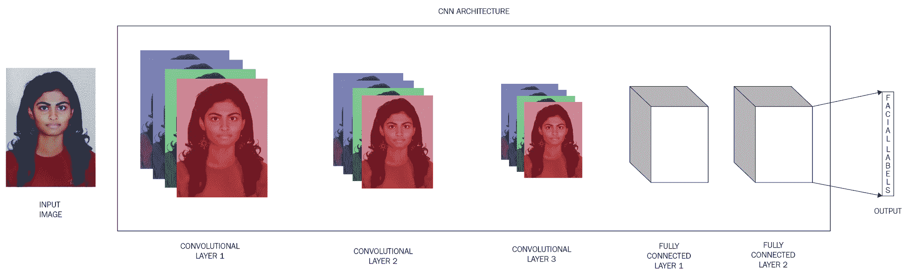

CNN 有一个输入层和一个输出层，还有多个隐藏层。这些隐藏层由池层、卷积层、规范化层和全连接层组成。卷积层应用卷积运算，并将结果传递给下一层。这类似于神经元对视觉刺激的反应。每个神经元将只对其感受野作出反应。深度 CNN 用于各种应用，包括面部关键点检测、动作分类、语音识别等等。


# 寻找模式

识别包含数字 0(或不包含数字 0)的给定图像的一种非常简单的方法可以通过存储所有数字的图像并比较每个图像以识别良好的匹配来解决。这将是一个棘手而乏味的过程，因为计算机是逐字逐句地进行数学运算的。在我们的输入图像与我们的存储库中的图像完全匹配之前，我们不会找到匹配。从计算机的角度来看，图像将被视为二维像素阵列，每个位置都有一个数字。让我们看一个数字为 0 的例子:

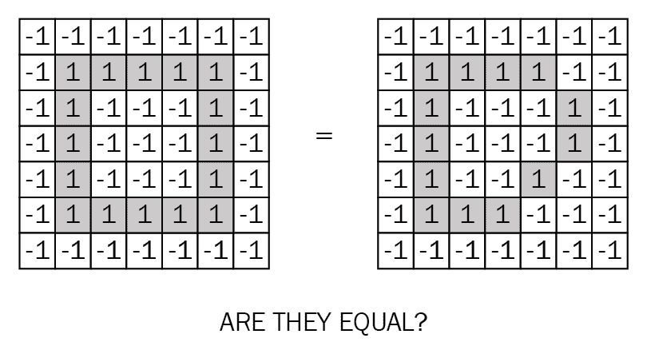

上图中左边的图在我们的存储库中，而右边的图是输入图像，它是数字 0 的稍微变形/手写版本。验证后，计算机将尝试匹配所有像素值。然而，当在像素级没有精确的值匹配时，数字 0 将不会被识别。这就是我们需要 CNN 帮忙的地方。


# 从图像中查找特征

让我们来看一个字母 x 的图像。当我们将新图像输入系统时，CNN 不知道该特征是否匹配。因此，它将尝试匹配图像中各处的特征模式。这是我们构建过滤器的方式:

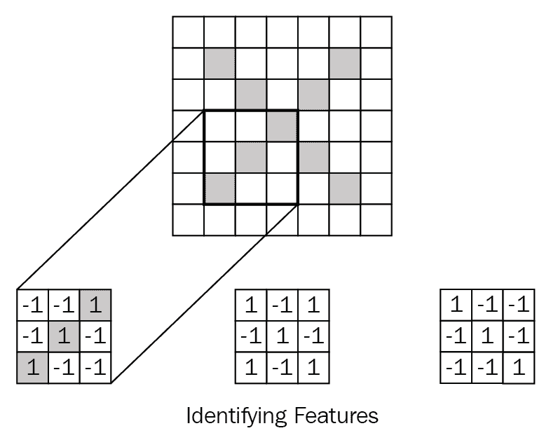

我们在这里应用的数学逻辑叫做**卷积**。要计算特征与图像部分的匹配度，请将特征的每个像素值乘以图像中相应像素的值。要得到一个最终值，将所有值相加，然后除以总像素数:

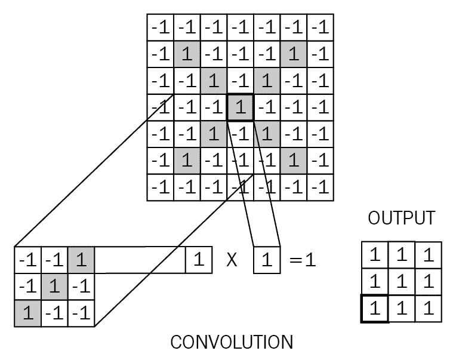

例如，如果两个像素颜色相同(比如值为 1)，那么 *(1) * ( 1) = (1)* 。如果不是，那么 *(-1) * (-1) = 1* 。在最终结果中，每个匹配像素的结果值为 1，每个不匹配像素的结果值为-1。

为了完成这个卷积过程，让我们将特征网格移动到图像补片上。如下图所示，3 x 3 网格移动 7 x 7 网格。这就形成了最终的 5 x 5 阵列。在生成的网格中，接近 1 的值表示强匹配，接近 0 的值表示不匹配，接近-1 的值表示我们特征的照片底片:

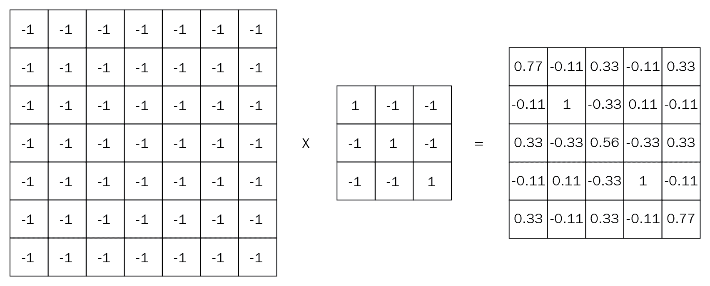

在下一步中，我们必须对所有其他特征重复卷积过程。这给出了过滤后的图像——每个过滤器一个。在美国有线电视新闻网，这被称为**卷积层**，这将是随后添加到它的附加层。

这就是 CNN 进行繁重计算的地方。此示例显示了一个简单的 7 x 7 图像，结果为 5 x 5。然而，典型的图片大小至少为 128 x 128 像素。计算量随着特征的数量以及每个特征中的像素数而线性增加。


# 汇集层

另一个提高处理能力效率的过程叫做**池化**。在池化层，较大的图像被缩小尺寸，同时保留其中的信息。这是通过在图像上滑动一个窗口并在每个窗口中取最大值来实现的。在典型的池层中，2 或 3 个像素的窗口在一个边上工作，但是采取 2 个像素的步长也工作:

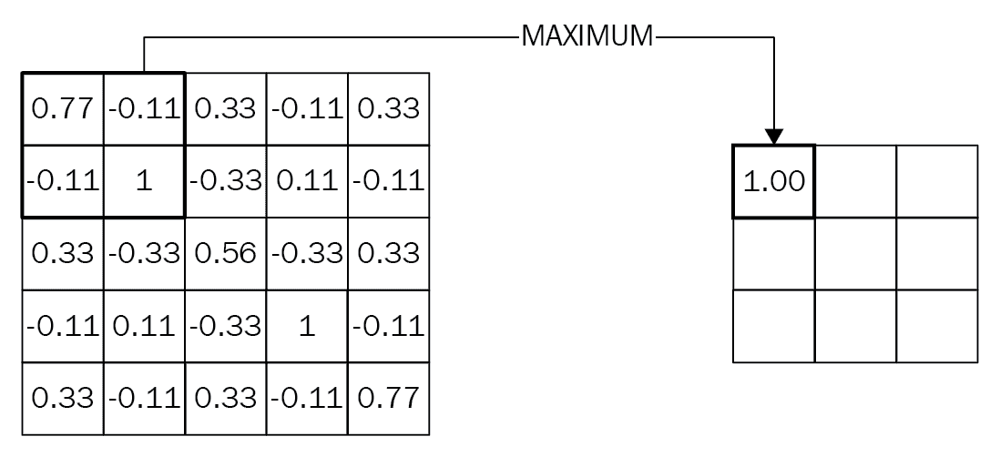

合并图层后，图像大小将减少四分之一。这保持了每个窗口的最大值。它还保留了每个窗口中的最佳特征。这一步意味着它不关心特性是否适合，只要它适合窗口内的某个地方。在这一层的帮助下，CNN 可以识别图像内部是否存在某个特征，而不用担心它在哪里。这样，计算机就不用担心字面意思了。

在这一层结束时，将图像的大小从 1000 万像素降低到 200 万像素肯定会帮助我们更快地计算进一步处理的能力。


# 整流线性单位

保持一个**整流线性单元** ( **ReLUs** )层背后的逻辑非常简单:它用 0 代替所有负值。这有助于我们避免负值，使 CNN 在数学上更加健康:

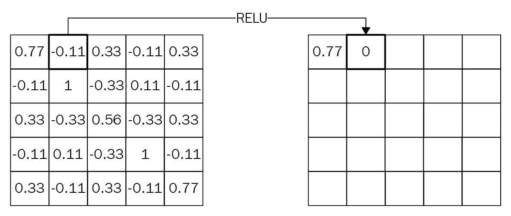

这里，在这一层，图像的大小没有改变。只有当负值被替换为 0 时，我们才会得到与输入相同大小的输出。


# 局部响应标准化层

在生物大脑功能中，有一个概念叫做**侧抑制**。这是指一个受刺激的神经元控制其邻居的能力。我们的主要议程是有一个局部峰值，以找到邻域中的最大值。

这在我们处理 ReLU 神经元时很有用。ReLU 神经元有无限激活，我们需要**局部反应正常化** ( **LRN** )来正常化它们。为此，我们需要识别高频特征。通过应用 LRN，神经元变得比它们的邻居更敏感。这在 ImageNet ConvNet 过程中使用，如前文所述。

然而，在最近的实时应用中，由于它的贡献似乎非常小，所以不太被重视。


# 脱落层

dropout 层字面上指的是通过随机忽略它们来丢弃一些数据单元。这意味着对下游神经元的贡献在前向传递中被移除，并且权重在后向传递中不被应用。如果神经元在训练过程中丢失，其他神经元将尝试对丢失的神经元进行预测。以这种方式，神经元对于特定权重的神经元将变得不太有效。我们需要这样做以避免过度拟合。


# 全连接层

在这一层中，较高层被作为输入，输出将是投票。例如，我们将决定给定的输入图像是否包含字母 *a* 或 *b* 。在此步骤中，输入被视为列表，而不是二维数组。下图显示了完全连接层的示例:

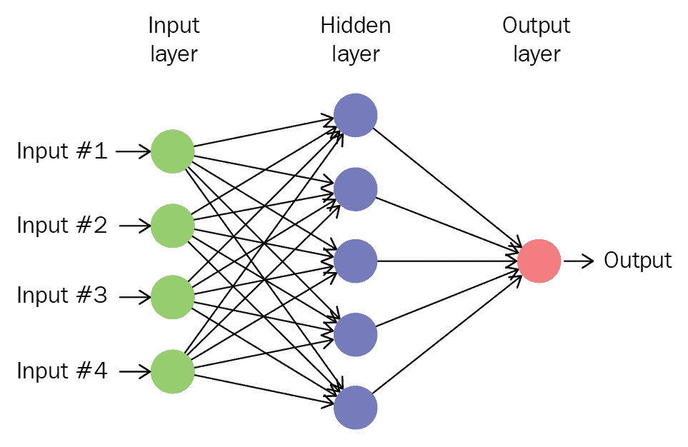

列表中的每个值都得到它的投票，以决定给定的输入是否包含字母 *a* 或 *b* 。一些值将帮助我们发现给定的输入是否包含字母 *a、*，一些值将帮助我们识别它是否包含字母 *b* 。这些特定的值将比其他值获得更多的投票。投票被表示为价值和每一类输出之间的权重。CNN 深入到输入图像的较低层，直到找到完全连接的层。得票最多的答案获胜，并将被宣布为输入的类别。

现在让我们开始讨论我们的情况吧。


# 年龄和性别预测的 CNN

当我们试图为年龄和性别预测准备数据集时，可能会出现一些问题。从大量的社交媒体图片中创建数据集可能需要更多的个人隐私数据，而这些数据可能是我们无法获得的。大多数可用的现有模型都有其自身的局限性。同样，过度拟合应该得到适当的关注，因为这是 CNN 的一个常见问题。


# 体系结构

我们的应用程序架构中的网络包括三个卷积层和两个全连接层，以及少量神经元。

以下是 CNN 的流程图，以及整个流程的所有组成部分:

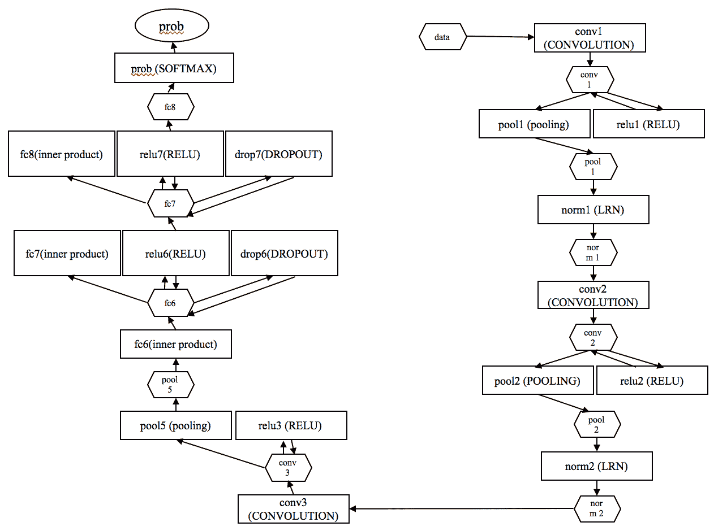

颜色通道(红色、绿色和蓝色)由网络单独直接处理。每当输入图像时，该图像的尺寸将被缩放到 256 x 256 像素。之后，227 x 227 像素的新裁剪图像将被提供给网络。

本章中开发的应用程序基于对 120 万幅图像应用的 ImageNet 分类。这篇论文可以在这里找到:[https://papers . nips . cc/paper/4824-imagenet-classification-with-deep-convolutionary-neural-networks . pdf](https://papers.nips.cc/paper/4824-imagenet-classification-with-deep-convolutional-neural-networks.pdf)。

然后，三个后续卷积层定义如下:

*   在第一卷积层中，由 3×7×7 像素组成的 96 个滤波器被应用于 227×227 像素图像的裁剪输入图像。随后是校正的线性单元和汇集层。这取 3×3 区域的最大值，步长为 2×2 像素，后跟一个 LRN。输出将是一个 96 x 28 x 28 像素的图像。
*   在第二卷积层中，由 96×5×5 像素组成的 256 个滤波器被应用于来自前一层的输入图像。接下来是 ReLU，一个池层和一个 LRN 层。输出包含 256 x 14 x 14 像素的图像大小。
*   在第三卷积层中，由 256×3×3 像素组成的 384 个滤波器被应用于来自前一层的输入图像，其后是 ReLU 和池层。然后是完全连接的层。
*   全连接层由 512 个神经元组成，后面是一个 ReLU，以及一个 dropout 层。
*   第二个完全连接的层由相同的 512 个神经元组成，随后是 ReLU，以及一个脱落层。
*   第三个完全连接的层通过对年龄和性别进行分类来映射最终部分。在最后一层，应用一个 softmax 函数来获得每个类的概率。


# 训练网络

以下是用于构建此模型的数据集的详细信息:

*   **照片总数**:26580 张
*   **受试者总数**:2284 人
*   **年龄组/标签数量** : 8 (0-2 岁、4-6 岁、8-13 岁、15-20 岁、25-32 岁、38-43 岁、48-53 岁、60 岁以上)
*   **性别标签**:是


# 正在初始化数据集

所有层的权重都以随机值开始，同时保持标准偏差值为 0.01。使用前面提到的训练数据集从头开始训练网络。表示为二进制向量的训练的结果值对应于真实类。这一结果带有年龄组分类的适当标签，以及与之相关的性别事实类别。


# 使用核心 ML 在 iOS 上的实现

现在是时候进入应用程序的编码部分了。我们正在使用一个由伯克利人工智能研究团队以及贡献者社区开发的模型。首先，我们需要将现有的 Caffe 模型转换成核心 ML 模型，以便在我们的应用程序中使用:

```
//Downloading Age and Gender models 
wget 
 http://www.openu.ac.il/home/hassner/projects/cnn_agegender/cnn_age_gen
        der_models_and_data.0.0.2.zip
unzip -a cnn_age_gender_models_and_data.0.0.2.zip
```

现在，转到提取的文件夹，将模型转换成核心 ML 模型:

```
import coremltools

folder = 'cnn_age_gender_models_and_data.0.0.2'

coreml_model = coremltools.converters.caffe.convert(
 (folder + '/age_net.caffemodel', folder + '/deploy_age.prototxt'),
  image_input_names = 'data',
  class_labels = 'ages.txt'
)

coreml_model.save('Age.mlmodel')
```

性别模型也需要这样做。为了启动我们的工作，让我们创建第一个核心 ML 应用程序。

让我们从初始屏幕中选择单视图应用程序，如下图所示:

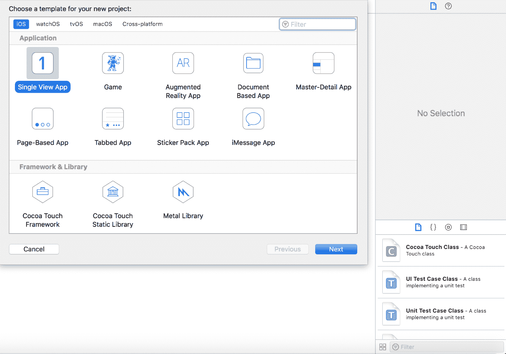

在下一个向导屏幕上，为您的应用程序选择一个合适的名称。填写剩余的字段，包括组织名称以及标识符。我们不打算在这个应用程序中使用核心数据，所以让我们跳过这个选项。让我们从用 Xcode 创建一个新的应用程序开始。以下屏幕截图描述了如何在 Xcode 中创建新项目:

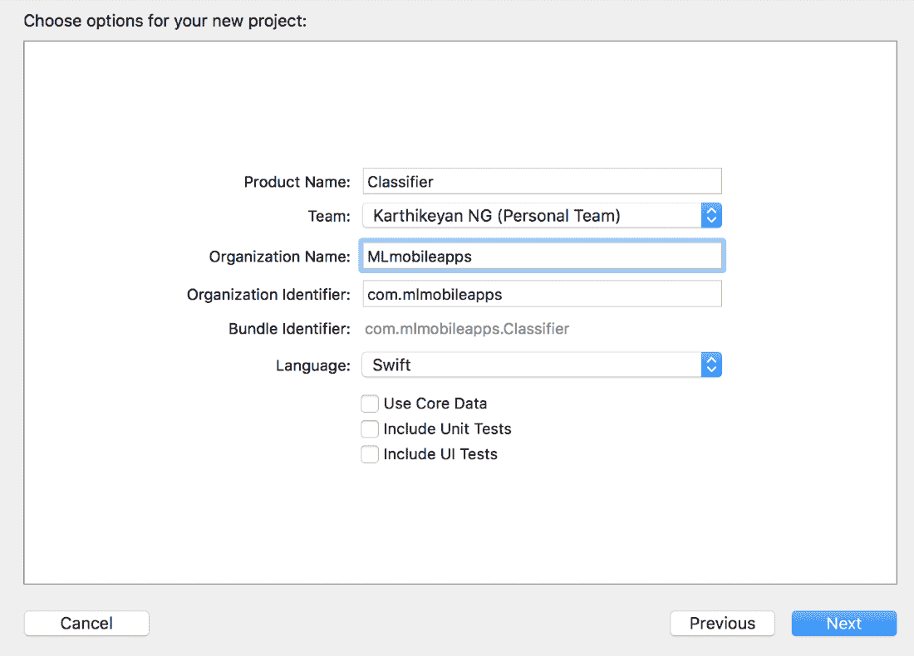

选择保存应用程序的文件位置后，您将能够看到已初始化的新应用程序的一般信息，如下面的屏幕截图所示:

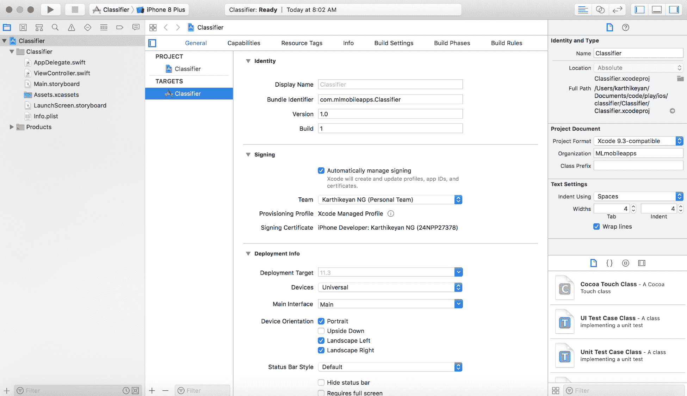

让我们首先创建一个控制器，用于从手机的图库或相机中拾取图像。

下面的代码块为图像拾取器创建一个控制器:

```
import UIKit

open class ImageClassificationController<Service: 
         ClassificationServiceProtocol>: UIViewController,
         PhotoSourceControllerDelegate, UINavigationControllerDelegate, 
         UIImagePickerControllerDelegate {
              /// View with image, button and labels
     public private(set) lazy var mainView =   
                         ImageClassificationView(frame: .zero)
     /// Service used to perform gender, age and emotion classification
     public let classificationService: Service = .init()
     /// Status bar style
     open override var preferredStatusBarStyle: UIStatusBarStyle {
     return .lightContent
 }

// MARK: - View lifecycle
 open override func viewDidLoad() {
     super.viewDidLoad()
     mainView.frame = view.bounds
     mainView.button.setTitle("Select a photo", for: .normal)
     mainView.button.addTarget(self, action:         #selector(handleSelectPhotoTap), for: .touchUpInside)
     view.addSubview(mainView)

    mainView.setupConstraints()
         classificationService.setup()
    }

    open override func viewDidLayoutSubviews() {
         super.viewDidLayoutSubviews()
         mainView.frame = view.bounds
    }

// MARK: - Actions
 /// Present image picker
 @objc private func handleSelectPhotoTap() {
 let sourcePicker = PhotoSourceController()
 sourcePicker.delegate = self
 present(sourcePicker, animated: true)
 }

// MARK: - PhotoSourceControllerDelegate
 public func photoSourceController(_ controller: PhotoSourceController,
   didSelectSourceType sourceType: UIImagePickerControllerSourceType) {
 let imagePicker = UIImagePickerController()
 imagePicker.delegate = self
 imagePicker.allowsEditing = true
 imagePicker.sourceType = sourceType
 present(imagePicker, animated: true)
 }

// MARK: - UIImagePickerControllerDelegate
 public func imagePickerController(_ picker: UIImagePickerController,
         didFinishPickingMediaWithInfo info: [String : Any]) {
 let editedImage = info[UIImagePickerControllerEditedImage] as? UIImage
 guard let image = editedImage, let ciImage = CIImage(image: image) else {
 print("Can't analyze selected photo")
 return
 }

DispatchQueue.main.async { [weak mainView] in
 mainView?.imageView.image = image
 mainView?.label.text = ""
 }

picker.dismiss(animated: true)

// Run Core ML classifier
 DispatchQueue.global(qos: .userInteractive).async { [weak self] in
 self?.classificationService.classify(image: ciImage)
 }
 }
}
```

在控制器中，一旦图像被选取，我们将把它传递到下一页，在那里我们对图像进行分类。选取器控制器应该如下所示:

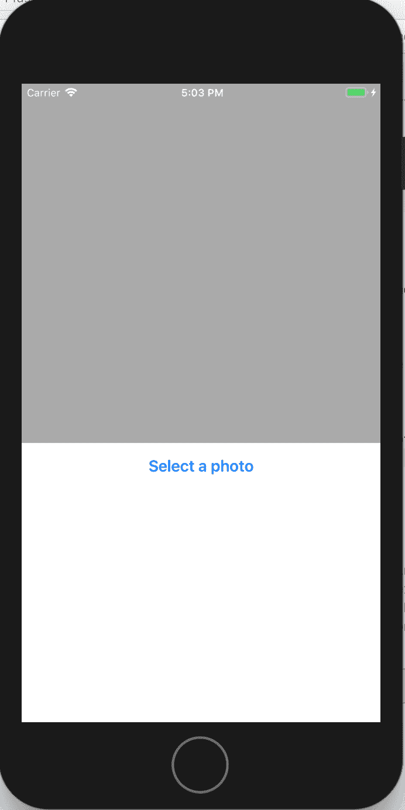

现在，让我们添加一个图像源选取器，它允许用户从照片库中以及从相机中选取图像:

```
import UIKit

/// Delegate protocol used for `PhotoSourceController`
  public protocol PhotoSourceControllerDelegate: class {
 /// Sent to the delegate when a photo source was selected
 func photoSourceController(_ controller: PhotoSourceController,
 didSelectSourceType sourceType: UIImagePickerControllerSourceType)
}

/// Controller used to present a picker where the user can select a 
/// source for a photo
public final class PhotoSourceController: UIAlertController {
 /// The controller's delegate
 public weak var delegate: PhotoSourceControllerDelegate?
public override func viewDidLoad() {
 super.viewDidLoad()
 addAction(forSourceType: .camera, title: "Snap a photo")
 addAction(forSourceType: .savedPhotosAlbum, title: "Photo Album")
 addCancelAction()
 }
}

// MARK: - Actions

private extension PhotoSourceController {
 func addAction(forSourceType sourceType: UIImagePickerControllerSourceType, title: String) {
 let action = UIAlertAction(title: title, style: .default) { [weak 
                            self] _ in
 guard let `self` = self else {
 return
 }
 self.delegate?.photoSourceController(self, didSelectSourceType: 
                                      sourceType)
 }
addAction(action)
 }

func addCancelAction() {
 let action = UIAlertAction(title: "Cancel", style: .cancel, handler: 
                            nil)
 addAction(action)
 }
}

```

当用户点击选择一张照片选项时，它会弹出选项**从手机的相机中抓拍一张照片**或者从用户的**相册**中挑选一张照片。还有一个取消弹出窗口的选项。以下屏幕截图描述了图库的图像选择菜单:

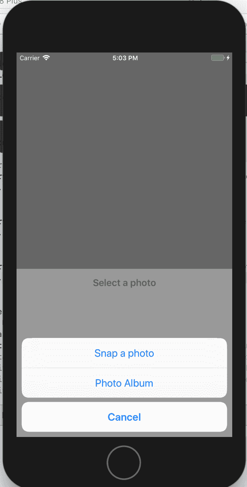

我们最后的任务是向图像选择菜单项添加动作。一旦图片被选中，就会调用相应的方法从模型中获取结果。

以下代码块用于向添加的按钮添加功能:

```
extension ViewController: ClassificationServiceDelegate {
 func classificationService(_ service: ClassificationService, 
 didDetectGender gender: String) {
 append(to: mainView.label, title: "Gender", text: gender)
 }

func classificationService(_ service: ClassificationService, didDetectAge age: String) {
 append(to: mainView.label, title: "Age", text: age)
 }

func classificationService(_ service: ClassificationService, didDetectEmotion emotion: String) {
 append(to: mainView.label, title: "Emotions", text: emotion)
 }

/// Set results of the classification request
 func append(to label: UILabel, title: String, text: String) {
 DispatchQueue.main.async { [weak label] in
 let attributedText = label?.attributedText ?? NSAttributedString(string: "")
 let string = NSMutableAttributedString(attributedString: attributedText)
 string.append(.init(string: "\(title): ", attributes: [.font: UIFont.boldSystemFont(ofSize: 25)]))
 string.append(.init(string: text, attributes: [.font: UIFont.systemFont(ofSize: 25)]))
 string.append(.init(string: "\n\n"))
label?.attributedText = string
 }
 }

```

这里使用的方法从分类服务中获取性别、年龄和情感的结果，并将其传递给 UI。由于模型是在您的本地系统上运行的，因此结果可能不是 100%准确。以下屏幕截图描述了显示图像相关信息的应用程序的完整功能:

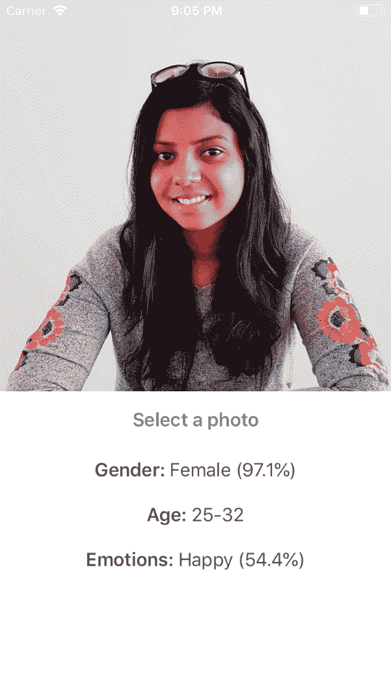


# 摘要

在这一章中，我们学习了从零开始构建一个完整的 iOS 应用程序。我们还学习了如何将 Caffe 模型转换成核心 ML 模型。现在我们知道如何将一个核心 ML 模型导入到一个 iOS 应用程序中，并从模型中获得预测结果。通过这样做，我们在不使用互联网的情况下节省了数据带宽，并且数据保留在本地设备上，不会影响用户隐私。

在下一章，有了这些知识，我们将继续构建一个应用程序，通过神经网络将艺术风格应用于现有的图像。