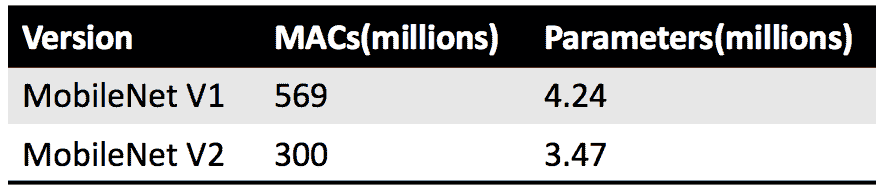
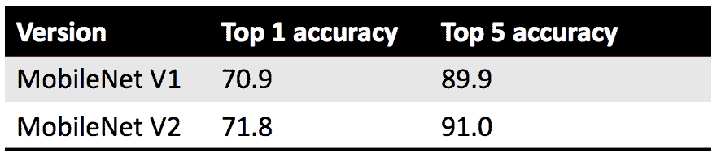
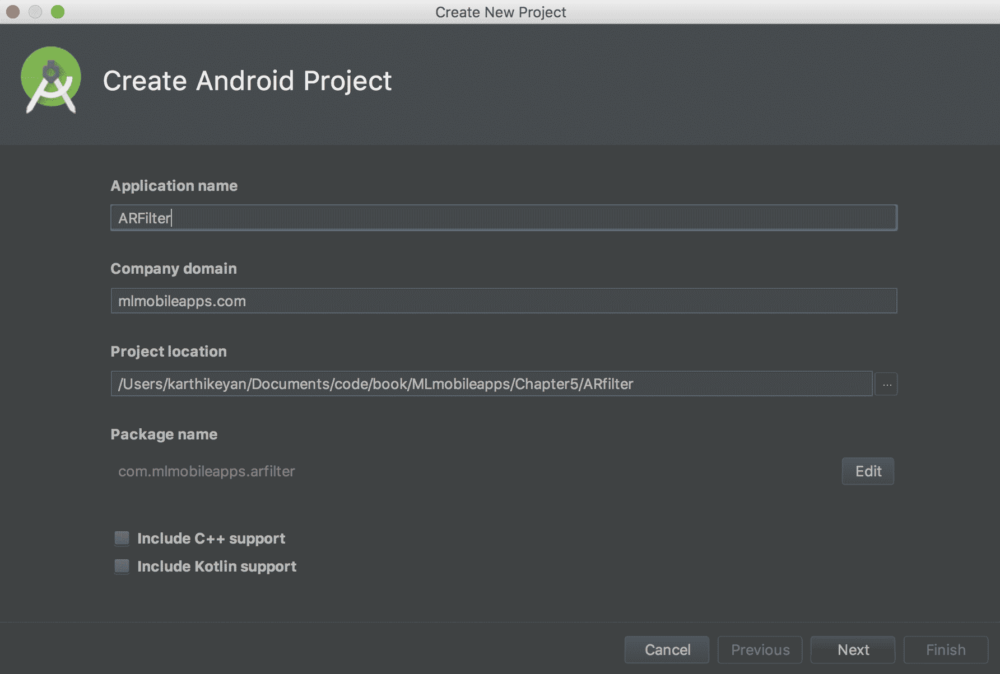
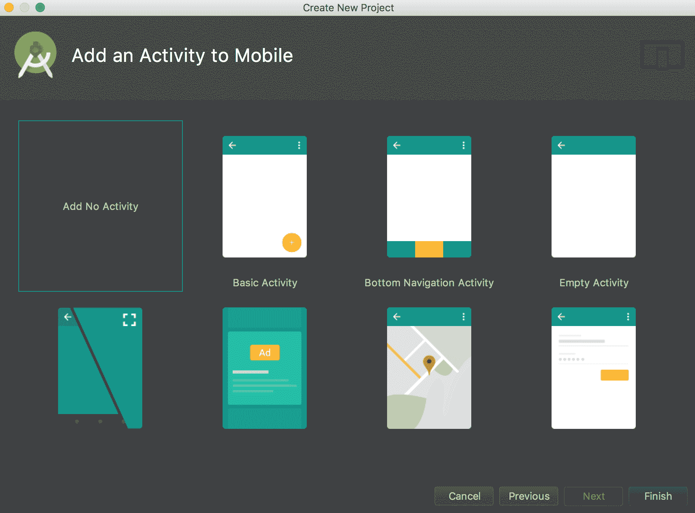
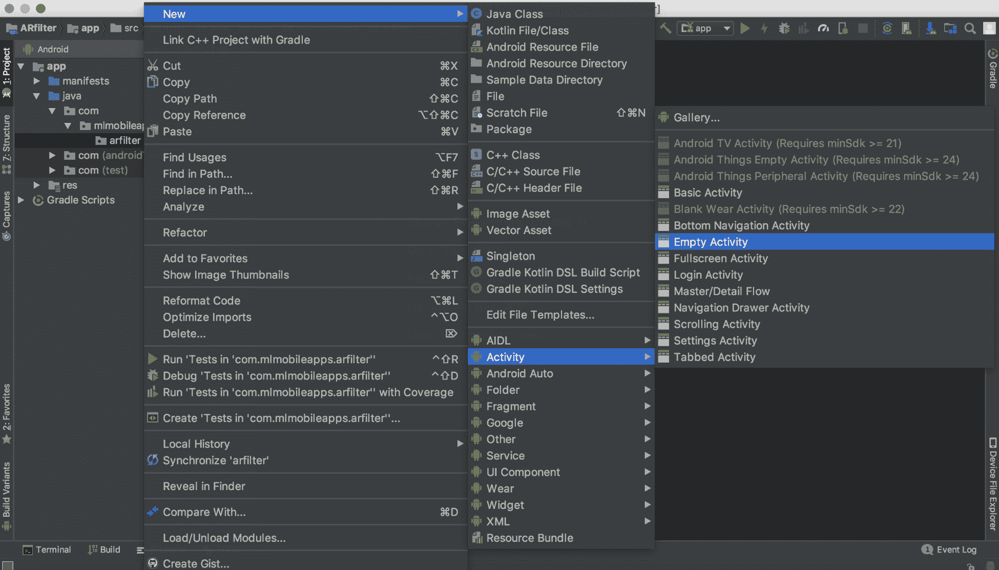
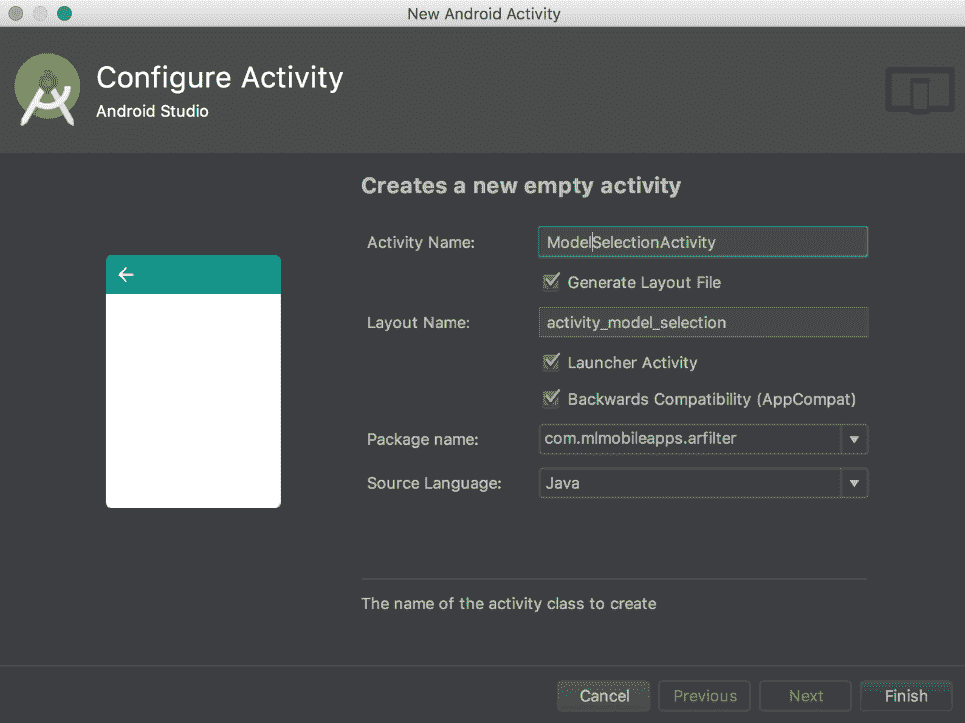
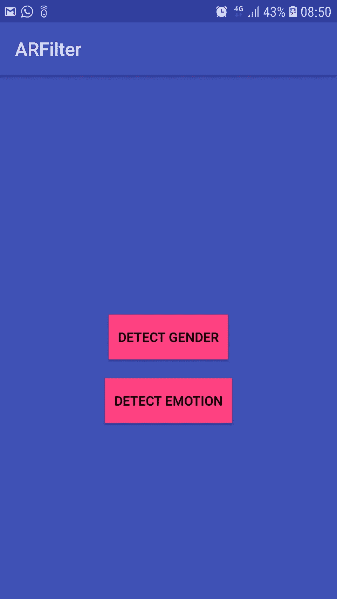
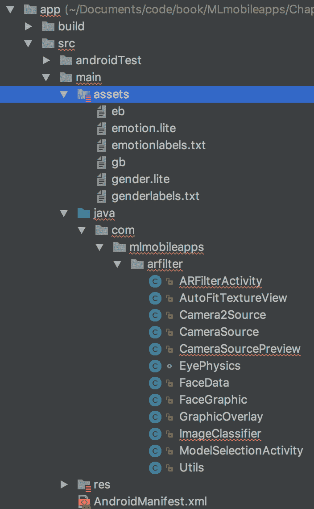
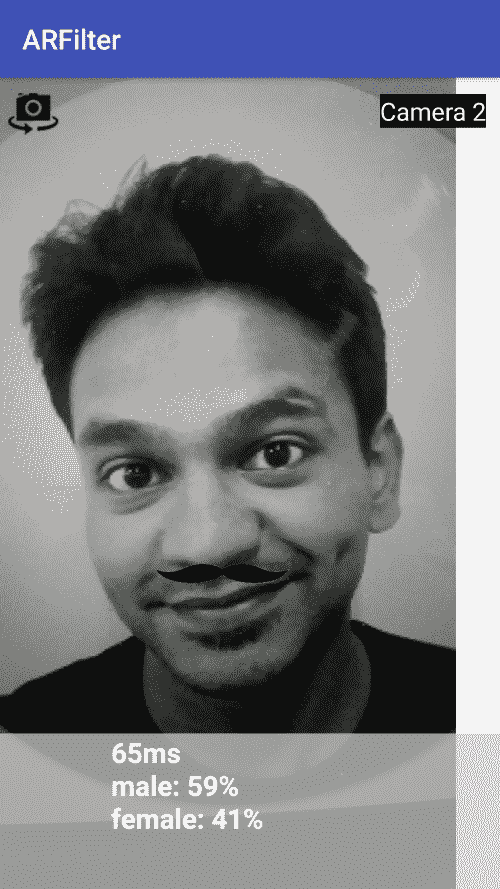
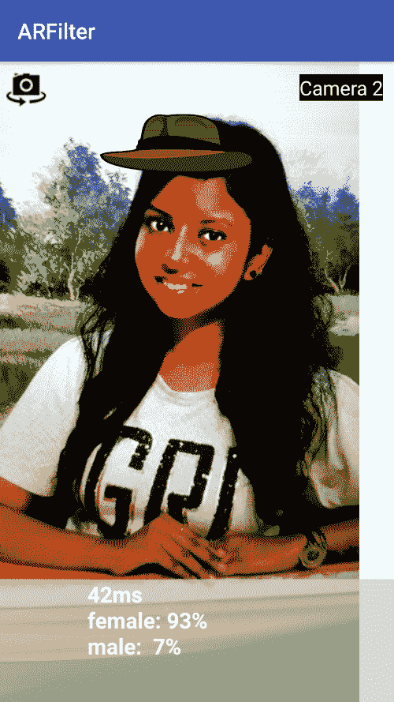

# 五、Android 上类似 Snapchat 的 AR 滤镜

在本章中，我们将构建一个**增强 Rea****Lite**(**AR**)过滤器，用于 Snapchat 和 Instagram 等使用 TensorFlow Lite 的应用。通过这个应用，我们将在实时摄像机视图上放置 AR 滤镜。例如，我们可以在男性的面部关键点添加小胡子，我们可以在眼睛上方添加相关的情感表达。TensorFlow Lite 模型用于从摄像机视图中检测性别和情感。

在本章中，我们将理解以下概念:

*   MobileNet 型号
*   构建模型转换所需的数据集
*   构建 Android 应用


# MobileNet 型号

我们使用 MobileNet 模型来识别性别，而 AffectNet 模型用于检测情绪。面部关键点检测是使用谷歌的移动视觉 API 实现的。

神经网络和深度学习在**自然语言处理** ( **NLP** )和计算机视觉领域引发了巨大的进步。虽然许多面部、物体、地标、徽标和文本识别技术都是为联网设备提供的，但我们相信，移动设备不断增长的计算能力可以让用户随时随地获得这些技术，而不管是否连接了互联网。然而，用于设备和嵌入式应用的计算机视觉面临许多挑战——模型必须在资源受限的环境中利用有限的计算、功率和空间快速、高精度地运行。

TensorFlow 提供各种预训练模型，如拖放模型，以便识别大约 1，000 个默认对象。与其他类似的模型(如 Inception 模型数据集)相比，MobileNet 在延迟、大小和准确性方面表现更好。在输出性能方面，有一个成熟的模型，有很大的滞后。然而，当模型可在移动设备上部署并且用于实时离线模型检测时，这种折衷是可接受的。

你可以在[https://github . com/intrepidkarthi/MLmobileapps/tree/master/chapter 5/ar filter](https://github.com/intrepidkarthi/MLmobileapps/tree/master/Chapter5/ARfilter)和[https://github . com/packt publishing/Machine-Learning-Projects-for-Mobile-Applications](https://github.com/PacktPublishing/Machine-Learning-Projects-for-Mobile-Applications)中参考本章的代码。

MobileNet 架构以不同于典型 CNN 的方式处理 3×3 卷积层。

有关 MobileNet 架构的更详细解释，请访问[https://arxiv.org/pdf/1704.04861.pdf](https://arxiv.org/pdf/1704.04861.pdf)。

让我们看一个如何使用 MobileNet 的例子。在这种情况下，我们不要再构建一个通用数据集。相反，我们将编写一个简单的分类器来查找图像中的皮卡丘。以下是展示皮卡丘图像和没有皮卡丘的图像的样本图片:


# 构建数据集

为了构建我们自己的分类器，我们需要包含有和没有皮卡丘的图像的数据集。你可以从每个数据库中的 1000 张图片开始，你可以在这里找到这样的图片:[https://search.creativecommons.org/](https://search.creativecommons.org/)。

让我们创建两个名为`pikachu`和`no-pikachu`的文件夹，并相应地删除这些图像。始终确保您有适当的许可证来使用任何图像，尤其是用于商业目的。

来自谷歌和必应 API 的图片剪贴:[https://github.com/rushilsrivastava/image_search](https://github.com/rushilsrivastava/image_search)。

现在我们有一个图像文件夹，其结构如下:

```
/dataset/
     /pikachu/[image1,..]
     /no-pikachu/[image1,..]
```


# 图像的再训练

我们现在可以开始标记我们的图像。有了 TensorFlow，这项工作变得更加容易。假设您已经安装了 TensorFlow，请下载以下再训练脚本:

```
curl 
 https://github.com/tensorflow/hub/blob/master/examples/
 image_retraining/retrain.py
```

现在让我们用 Python 脚本重新训练图像:

```
python retrain.py \
 --image_dir ~/MLmobileapps/Chapter5/dataset/ \
 --learning_rate=0.0001 \
 --testing_percentage=20 \
 --validation_percentage=20 \
 --train_batch_size=32 \
 --validation_batch_size=-1 \
 --eval_step_interval=100 \
 --how_many_training_steps=1000 \
 --flip_left_right=True \
 --random_scale=30 \
 --random_brightness=30 \
 --architecture mobilenet_1.0_224 \
 --output_graph=output_graph.pb \

 --output_labels=output_labels.txt
```

如果将`validation_batch_size`设置为`-1`，将验证整个数据集；`learning_rate` = `0.0001`效果不错。你可以调整一下，自己试试这个。在`architecture`标志中，我们从版本 1.0、0.75、0.50 和 0.25 中选择使用哪个版本的 MobileNet。后缀数字`224`代表图像分辨率。您也可以指定 224、192、160 或 128。


# 从 GraphDef 到 TFLite 的模型转换

`TocoConverter`用于从 TensorFlow `GraphDef`文件或 SavedModel 转换为 TFLite FlatBuffer 或图形可视化。TOCO 代表 *TensorFlow Lite 优化转换器*。

我们需要通过命令行参数传递数据。下面列出了一些关于`TensorFlow 1.10.0`的命令行参数:

```
 --output_file OUTPUT_FILE
 Filepath of the output tflite model.
 --graph_def_file GRAPH_DEF_FILE
 Filepath of input TensorFlow GraphDef.
 --saved_model_dir 
 Filepath of directory containing the SavedModel.
 --keras_model_file
 Filepath of HDF5 file containing tf.Keras model.
 --output_format {TFLITE,GRAPHVIZ_DOT}
 Output file format.
 --inference_type {FLOAT,QUANTIZED_UINT8}
 Target data type in the output
 --inference_input_type {FLOAT,QUANTIZED_UINT8}
 Target data type of real-number input arrays. 
 --input_arrays INPUT_ARRAYS
 Names of the input arrays, comma-separated.
 --input_shapes INPUT_SHAPES
 Shapes corresponding to --input_arrays, colon-separated.
 --output_arrays OUTPUT_ARRAYS
 Names of the output arrays, comma-separated.
```

我们现在可以使用`toco`工具将 TensorFlow 模型转换为 TensorFlow Lite 模型:

```
toco \ 
 --graph_def_file=/tmp/output_graph.pb
 --output_file=/tmp/optimized_graph.tflite 
 --input_arrays=Mul 
 --output_arrays=final_result 
 --input_format=TENSORFLOW_GRAPHDEF 
 --output_format=TFLITE 
 --input_shape=1,${224},${224},3 
 --inference_type=FLOAT 
 --input_data_type=FLOAT
```

同样，我们在这个应用中使用了两个模型文件:性别模型和情感模型。这些将在下面两节中解释。

要将 TensorFlow 1.9.0 中的 ML 模型转换为 TensorFlow 1.11.0，请使用 to converter。TocoConverter 在语义上与 TFLite Converter 相同。要转换 TensorFlow 1.9 之前的模型，请使用`toco_convert`功能。运行`help(tf.contrib.lite.toco_convert)`获取可接受参数的详细信息。


# 性别模型

这是建立在`IMDB WIKI`数据集上的，该数据集包含 500，000+名人面部。它使用 MobileNet_V1_224_0.5 版本的 MobileNet。

数据模型项目的链接可以在这里找到:[https://data.vision.ee.ethz.ch/cvl/rrothe/imdb-wiki/](https://data.vision.ee.ethz.ch/cvl/rrothe/imdb-wiki/)。

很难找到包含数千幅图像的公共数据集。这个数据集是建立在一个名人面部的大集合之上的。有两个共同的地方:一个是 IMDb，另一个是维基百科。超过 10 万名名人的详细资料通过脚本从他们的个人资料中检索。然后通过去除噪音(无关内容)进行组织。所有没有时间戳的图像都被删除，假设只有一张照片的图像可能显示该人和出生日期细节是正确的。最后，有 460723 张面部来自 IMDb 的 20284 位名人，62328 张来自维基百科，总计 523051 张。

模型背后的论文可以在这里找到:[https://www . vision . ee . ethz . ch/en/publications/papers/proceedings/eth _ biwi _ 01229 . pdf](https://www.vision.ee.ethz.ch/en/publications/papers/proceedings/eth_biwi_01229.pdf)。这个模型说它只能用于研究目的。虽然我们可以重用第二章的模型，但我们想让你接触不同的模型数据集，因此我们选择了这个流行人脸数据集。你可以根据你解决的问题选择自己的模型数据集，哪个更适合你。

作者鸣谢:@article{Rothe-IJCV-2016，作者= {拉斯穆斯·罗斯和拉杜·蒂莫夫特和吕克·范·古尔}，标题= {对没有面部标志的单一图像的真实和表观年龄的深度期望}，期刊= {国际计算机视觉杂志(IJCV)}，年份= {2016}，月份= { 7 月}，}


# 情感模型

这是建立在拥有超过 100 万张图片的 AffectNet 模型上的。它使用 MobileNet_V2_224_1.4 版本的 MobileNet。

数据模型项目的链接可以在这里找到:【http://mohammadmahoor.com/affectnet/】T4。

AffectNet 模型是通过从互联网上收集并注释超过 100 万张人脸的面部图像而构建的。这些图片来自三个搜索引擎，使用了六种不同语言的大约 1250 个相关关键词。在收集的图像中，一半的图像被人工注释了七个离散面部表情的存在(分类模型)以及效价和唤醒的强度(维度模型)。


# MobileNet 版本比较

在我们的两个模型中，我们使用不同版本的 MobileNet 模型。V2 移动网络基本上是 V1 的升级版，在性能方面更加高效和强大。我们将看到两种模型之间的一些因素:



上图显示来自 V1 和 V2 的 MobileNet 的数字属于带有 1.0 深度乘数的型号版本。如果这个表中的数字较低，那就更好了。通过查看结果，我们可以假设 V2 的速度几乎是 V1 模型的两倍。在移动设备上，当内存访问受限于计算能力时，V2 工作得非常好。

MACs—乘-累加运算。这衡量在一张 224×224 RGB 图像上进行推理需要多少计算。当图像尺寸增加时，需要更多的 MAC。

单从 MAC 电脑的数量来看，V2 的速度应该是 V1 的两倍。但是，不仅仅是计算次数的问题。在移动设备上，内存访问比计算慢得多。但是 V2 也有优势:它的参数数量只有 V1 的 80%。现在，我们来看看精确度方面的性能:



上图是在 ImageNet 数据集上测试的。这些数字可能会产生误导，因为它取决于在推导这些数字时考虑的所有约束条件。

模型背后的 IEEE 论文可以在这里找到:[http://Mohammad mahoor . com/WP-content/uploads/2017/08/affect net _ one column-2 . pdf](http://mohammadmahoor.com/wp-content/uploads/2017/08/AffectNet_oneColumn-2.pdf)。


# 构建 Android 应用

现在从 Android Studio 创建一个新的 Android 项目。这应该叫做`ARFilter`，或者你喜欢的任何名字:



在下一个屏幕上，选择我们的应用支持的 Android OS 版本，并选择图像上未显示的 **API 15** 。这几乎涵盖了所有现有的安卓手机。准备好后，请按下一步。在下一个屏幕上，选择 Add No Activity 并单击 Finish。这将创建一个空项目:



一旦项目被创建，让我们添加一个**空活动**。我们可以根据自己的需求选择不同的活动方式:



通过选中复选框来命名创建的 activity Launcher Activity。这将在`AndroidManifest.xml`文件中的特定活动下添加一个意图过滤器:

```
<intent-filter>
    <action android:name="android.intent.action.MAIN" />
    <category android:name="android.intent.category.LAUNCHER" />
</intent-filter>
```

`<intent-filter>`: To advertise which implicit intents your app can receive, declare one or more intent filters for each of your app components with an `<intent-filter>` element in your manifest file. Each intent filter specifies the type of intents it accepts based on the intent's action, data, and category. The system delivers an implicit intent to your app component only if the intent can pass through one of your intent filters. Here, the intent is to keep this activity as the first activity when the app is opened by the user.

接下来，我们将命名启动器活动:



创建活动后，让我们开始设计活动的**用户界面** ( **UI** )布局。在这里，用户选择在这个应用中使用哪个模型。我们有两个用于性别和情感检测的模型，其细节我们在前面讨论过。在本活动中，我们将添加两个按钮及其对应的模型分类器，如下所示:



选择相应的模型后，我们将使用带有`ModelSelectionActivity`类的`clickListener`事件启动下一个活动，如下所示。基于对性别识别或情感识别按钮的点击，我们将把信息传递给`ARFilterActivity`。以便将相应的模型加载到内存中:


在`ARFilterActivity`中，我们将会有实时的`view`分类。被传递的对象将在过滤器活动中被接收，其中相应的分类器将被如下调用。基于从上一个活动中选择的分类器，相应的模型将被加载到`OnCreate()`方法中的`ARFilterActivity`中，如下所示:

```
@Override
public void onClick(View view) {
    int id = view.getId();

    if(id==R.id.genderbtn){
        Intent intent = new Intent(this, ARFilterActivity.class);
        intent.putExtra(ARFilterActivity.MODEL_TYPE,"gender");
        startActivity(intent);
    }
    else if(id==R.id.emotionbtn){
        Intent intent = new Intent(this,ARFilterActivity.class);
        intent.putExtra(ARFilterActivity.MODEL_TYPE,"emotion");
        startActivity(intent);
    }
}
```

`Intent`: An `Intent` is a messaging object you can use to request an action from another app component. Although intents facilitate communication between components in several ways, there are three fundamental use cases such as starting an `Activity`, starting a service and delivering a broadcast.

UI 将进行相应设计，以便通过`activity_arfilter`布局在布局底部显示结果，如下所示。`CameraSourcePreview`为视图启动 Camera2 API，我们将在其中添加`GraphicOverlay`类。它是一个视图，呈现一系列自定义图形，覆盖在相关预览(即相机预览)的顶部。创建者可以添加图形对象、更新对象和删除它们，从而在视图中触发适当的绘制和失效。

它支持相对于相机预览属性的图形缩放和镜像。想法是检测项目以预览尺寸表示，但是需要放大到全视图尺寸，并且在前置摄像头的情况下也是镜像的:

```
public static String classifierType(){
    String type = mn.getIntent().getExtras().getString("TYPE");
    if(type!=null) {
        if(type.equals("gender"))
            return "gender";
        else
            return "emotion";
    }
    else
        return null;
}
```

我们使用 Google 开源项目中的`CameraPreview`类，而`CAMERA`对象需要基于不同 Android API 级别的用户权限:

链接到谷歌摄像头 API:[https://github.com/googlesamples/android-Camera2Basic](https://github.com/googlesamples/android-Camera2Basic)。

```
<com.mlmobileapps.arfilter.CameraSourcePreview
    android:id="@+id/preview"
    android:layout_width="wrap_content"
    android:layout_height="wrap_content">

    <com.mlmobileapps.arfilter.GraphicOverlay
        android:id="@+id/faceOverlay"
        android:layout_width="match_parent"
        android:layout_height="match_parent" />
</com.mlmobileapps.arfilter.CameraSourcePreview>
```

一旦我们准备好了相机 API，我们需要从用户端获得适当的许可来使用相机，如下所示。我们需要以下权限:

`Manifest.permission.CAMERA`

`Manifest.permission.WRITE_EXTERNAL_STORAGE`

*   这样，我们现在就有了一个应用，在这个应用的屏幕上，我们可以选择加载哪个模型。在下一个屏幕上，我们准备好了摄像机视图。我们现在必须加载适当的模型，检测屏幕上的人脸，并相应地应用过滤器。
*   真实摄像头视图上的人脸检测是通过 Google Vision API 完成的。这可以作为一个依赖项添加到您的`build.gradle`上，如下所示。您应该始终使用最新版本的`api`:

```
private void requestPermissionThenOpenCamera() {
    if(ContextCompat.checkSelfPermission(context,
Manifest.permission.CAMERA) == PackageManager.PERMISSION_GRANTED) {
        if (ContextCompat.checkSelfPermission(context, Manifest.permission.WRITE_EXTERNAL_STORAGE) == PackageManager.PERMISSION_GRANTED) {
            Log.e(TAG, "requestPermissionThenOpenCamera: 
                       "+Build.VERSION.SDK_INT);
            useCamera2 = (Build.VERSION.SDK_INT >= Build.VERSION_CODES.LOLLIPOP);
            createCameraSourceFront();
        } else {
            ActivityCompat.requestPermissions(this, new String[]
{Manifest.permission.WRITE_EXTERNAL_STORAGE}, REQUEST_STORAGE_PERMISSION);
        }
    } else {
        ActivityCompat.requestPermissions(this, new String[]{Manifest.permission.CAMERA}, REQUEST_CAMERA_PERMISSION);
    }
}
```

图像分类对象在`ARFilterActivity`的`OnCreate()`方法和`ImageClassifier`类中初始化。根据用户选择加载相应的模型，如下所示:

一旦决定了模型，我们将读取文件并将它们加载到内存中。进一步解释了加载模型的方法。我们还将读取型号标签，并将它们读入内存。我们还将为输入图像分配内存:

```
api 'com.google.android.gms:play-services-vision:15.0.0'
```

然后，相应的模型从`assets`文件夹载入内存，如下所示:

```
private void initPaths(){
  String type = ARFilterActivity.classifierType();
  if(type!=null)
  {
    if(type.equals("gender")){
      MODEL_PATH = "gender.lite";
      LABEL_PATH = "genderlabels.txt";
    }
    else{
      MODEL_PATH = "emotion.lite";
      LABEL_PATH = "emotionlabels.txt";
    }
  }
}
```



```
//tflite object is created with the model loaded into memory
tflite = new Interpreter(loadModelFile(activity));
//gets the list of defined labels for the model
labelList = loadLabelList(activity);
//input image buffer is created
imgData =
    ByteBuffer.allocateDirect(
        4 * DIM_BATCH_SIZE * DIM_IMG_SIZE_X * DIM_IMG_SIZE_Y * DIM_PIXEL_SIZE);
imgData.order(ByteOrder.nativeOrder());
labelProbArray = new float[1][labelList.size()];
filterLabelProbArray = new float[FILTER_STAGES][labelList.size()];
```

`AssetManager`中条目的文件描述符。这提供了您自己打开的可用于读取数据的`FileDescriptor`，以及文件中该条目数据的偏移量和长度。Assets 文件夹位于我们的 codebase 主文件夹旁边，如屏幕截图所示:

一旦我们将模型数据加载到内存中，我们需要将相应的标签文件加载到如下列表中。标签文件位于模型文件旁边的`Assets`文件夹中:

从实时摄像机视角来看，逐帧数据由`ImageClassifier`解析。所有的 ML 算法和基于视觉的库都将输入输入到数据阵列中。所以我们将把我们的输入图像数据转换成 ByteBuffer。然后，传递的位图值将被转换为 ByteBuffer，如下所示:

```
/** load the model into memory from Assets. */
private MappedByteBuffer loadModelFile(Activity activity) throws IOException {
  AssetFileDescriptor fileDescriptor = 
                           activity.getAssets().openFd(MODEL_PATH);
  FileInputStream inputStream = new 
              FileInputStream(fileDescriptor.getFileDescriptor());
              FileChannel fileChannel = inputStream.getChannel();
              long startOffset = fileDescriptor.getStartOffset();
              long declaredLength = fileDescriptor.getDeclaredLength();
  return fileChannel.map(FileChannel.MapMode.READ_ONLY, startOffset, declaredLength);
}
```

然后，将调用`classifyFrame()`方法。一旦我们有了作为`ByteBuffer`的输入数据，我们将通过调用`run()`方法来调用 TensorFlow Lite 对输入进行分类。这就是奇迹发生的地方:

```
/** Reads label list from Assets. */
private List<String> loadLabelList(Activity activity) throws IOException {
  List<String> labelList = new ArrayList<String>();
  BufferedReader reader =
      new BufferedReader(new InputStreamReader(activity.getAssets().open(LABEL_PATH)));
  String line;
  while ((line = reader.readLine()) != null) {
    labelList.add(line);
  }
  reader.close();
  return labelList;
}
```

ByteBuffer 是一个令人困惑的类。它有点像基于 RAM 的`RandomAccessFile`。它也有点像没有自动增长特性的 ByteArrayList，让您以一致的方式处理部分填充的`byte[]`。它没有异步前瞻。这是非常低的水平。您必须显式清除和填充缓冲区，并显式读取和/或写入它。避免缓冲区溢出取决于您。

```
private void convertBitmapToByteBuffer(Bitmap bitmap) {
    if (imgData == null) {
      return;
    }
    imgData.rewind();
    bitmap.getPixels(intValues, 0, bitmap.getWidth(), 0, 0, bitmap.getWidth(), bitmap.getHeight());
    // Convert the image to floating point.
    int pixel = 0;
    long startTime = SystemClock.uptimeMillis();
    for (int i = 0; i < DIM_IMG_SIZE_X; ++i) {
      for (int j = 0; j < DIM_IMG_SIZE_Y; ++j) {
        final int val = intValues[pixel++];
        imgData.putFloat((((val >> 16) & 0xFF)-IMAGE_MEAN)/IMAGE_STD);
        imgData.putFloat((((val >> 8) & 0xFF)-IMAGE_MEAN)/IMAGE_STD);
        imgData.putFloat((((val) & 0xFF)-IMAGE_MEAN)/IMAGE_STD);
      }
    }
    long endTime = SystemClock.uptimeMillis();
//    Log.d(TAG, "Timecost to put values into ByteBuffer: " + Long.toString(endTime - startTime));
  }
```

一旦我们从 TensorFlow Lite 模型获得结果，我们将开始应用过滤器。这是我们在相机视图上叠加相应滤镜的地方。在`applyFilter`方法中，相应的标签被分配给当前帧，并在屏幕上显示如下:

```
convertBitmapToByteBuffer(bitmap);
// Here's where the magic happens!!!
long startTime = SystemClock.uptimeMillis();
tflite.run(imgData, labelProbArray);
long endTime = SystemClock.uptimeMillis();
Log.d(TAG, "Timecost to run model inference: " + Long.toString(endTime - startTime));

// smooth the results
applyFilter();
```

我们将在摄像机视图下方的视图中打印最高概率值。我们有截图如下。我们将把数据格式化并显示在屏幕上。一旦基于概率识别了标签，结果将返回顶部的标签:

现在，让我们回到`ARFilterActivity`。通过谷歌视觉 API，我们使用`GraphicFaceTrackerFactory`检测每一帧中的人脸。我们将使用 Google Vision API 中的`FaceDetector`:

```
void applyFilter(){
  int num_labels =  labelList.size();

  // Low pass filter `labelProbArray` into the first stage of the 
     filter.
  for(int j=0; j<num_labels; ++j){
    filterLabelProbArray[0][j] += FILTER_FACTOR*(labelProbArray[0][j] -
                                                 filterLabelProbArray[0][j]);
  }
  // Low pass filter each stage into the next.
  for (int i=1; i<FILTER_STAGES; ++i){
    for(int j=0; j<num_labels; ++j){
      filterLabelProbArray[i][j] += FILTER_FACTOR*(
              filterLabelProbArray[i-1][j] -
              filterLabelProbArray[i][j]);
    }
  }

  // Copy the last stage filter output back to `labelProbArray`.
  for(int j=0; j<num_labels; ++j){
    labelProbArray[0][j] = filterLabelProbArray[FILTER_STAGES-1][j];
  }
}
```

带`FaceDetector`的参数:

```
/** Prints top labels, to be shown in UI as the results. */
private String printTopKLabels() {
  for (int i = 0; i < labelList.size(); ++i) {
    sortedLabels.add(
        new AbstractMap.SimpleEntry<>(labelList.get(i), labelProbArray[0][i]));
    if (sortedLabels.size() > RESULTS_TO_SHOW) {
      sortedLabels.poll();
    }
  }
  String textToShow = "";
  final int size = sortedLabels.size();
  for (int i = 0; i < size; ++i) {
    Map.Entry<String, Float> label = sortedLabels.poll();
    textToShow = String.format("\n%s: %3s",label.getKey(), Math.round(label.getValue()*100) + "%"+textToShow);

    if(i==size-1)
      topLabel = label.getKey();
  }
  return textToShow;
}
```

`ACCURATE_MODE`:表示扩展设置中对精度的偏好，这可能会使精度 vs

```
private void createCameraSourceFront() {
        previewFaceDetector = new FaceDetector.Builder(context)
                .setClassificationType(FaceDetector.NO_CLASSIFICATIONS)
                .setLandmarkType(FaceDetector.ALL_LANDMARKS)
                .setMode(FaceDetector.FAST_MODE)
                .setProminentFaceOnly(usingFrontCamera)
                .setTrackingEnabled(true)
                .setMinFaceSize(usingFrontCamera?0.35f : 0.15f)
                .build();

        if(previewFaceDetector.isOperational()) {
            previewFaceDetector.setProcessor(new MultiProcessor.Builder<>(new GraphicFaceTrackerFactory()).build());
        } else {
            Toast.makeText(context, "FACE DETECTION NOT AVAILABLE", 
                           Toast.LENGTH_SHORT).show();
        }
        Log.e(TAG, "createCameraSourceFront: "+useCamera2 );
        if(useCamera2) {
            mCamera2Source = new Camera2Source.Builder(context, 
                                 previewFaceDetector)
                    .setFocusMode(Camera2Source.CAMERA_AF_AUTO)
                    .setFlashMode(Camera2Source.CAMERA_FLASH_AUTO)
                    .setFacing(Camera2Source.CAMERA_FACING_FRONT)
                    .build();
            startCameraSource();

        } else {
            mCameraSource = new CameraSource.Builder(context, 
                                previewFaceDetector)
                    .setFacing(CameraSource.CAMERA_FACING_FRONT)
                    .setRequestedFps(30.0f)
                    .build();

            startCameraSource();
        }
    }
```

`ALL_CLASSIFICATIONS`:执行*睁眼*和*微笑*分类

*   `ALL_LANDMARKS`:检测所有地标
*   `FAST_MODE`:表示扩展设置中的速度偏好，可使精度 vs
*   `NO_CLASSIFICATIONS`:不进行分类
*   `NO_LANDMARKS`:不进行地标检测
*   我们从那里检测所有的面部点，并将信息传递给`FaceData`类，如下所示:
*   一旦所有的面部关键点被识别，相应的决定将被采取。一旦确定了人脸，我们将做出两个决定。我们将首先检查眼睛是否睁开，还将检查此人是否微笑，如下所示:

然后，检测到的面部数据将被传递给计算面部关键点坐标的方法:

```
// Get head angles.
mFaceData.setEulerY(face.getEulerY());
mFaceData.setEulerZ(face.getEulerZ());

// Get face dimensions.
mFaceData.setPosition(face.getPosition());
mFaceData.setWidth(face.getWidth());
mFaceData.setHeight(face.getHeight());

// Get the positions of facial landmarks.
mFaceData.setLeftEyePosition(getLandmarkPosition(face, 
                                  Landmark.LEFT_EYE));
mFaceData.setRightEyePosition(getLandmarkPosition(face, 
                                  Landmark.RIGHT_EYE));
mFaceData.setMouthBottomPosition(getLandmarkPosition(face, 
                                  Landmark.LEFT_CHEEK));
mFaceData.setMouthBottomPosition(getLandmarkPosition(face, 
                                  Landmark.RIGHT_CHEEK));
mFaceData.setNoseBasePosition(getLandmarkPosition(face, 
                                  Landmark.NOSE_BASE));
mFaceData.setMouthBottomPosition(getLandmarkPosition(face, 
                                  Landmark.LEFT_EAR));
mFaceData.setMouthBottomPosition(getLandmarkPosition(face, 
                                  Landmark.LEFT_EAR_TIP));
mFaceData.setMouthBottomPosition(getLandmarkPosition(face,
                                  Landmark.RIGHT_EAR));
mFaceData.setMouthBottomPosition(getLandmarkPosition(face, 
                                  Landmark.RIGHT_EAR_TIP));
mFaceData.setMouthLeftPosition(getLandmarkPosition(face, 
                                  Landmark.LEFT_MOUTH));
mFaceData.setMouthBottomPosition(getLandmarkPosition(face, 
                                  Landmark.BOTTOM_MOUTH));
mFaceData.setMouthRightPosition(getLandmarkPosition(face, 
                                  Landmark.RIGHT_MOUTH));
```

一旦所有这些数据都被识别出来，我们就可以通过在实时摄像机视图上叠加相应的过滤器，开始对我们捕获的数据应用过滤器。`GraphicOverlay`对象将被传递到相机预览，如下所示:

```
// Decision: 1
//Identifies whether the eyes are open
final float EYE_CLOSED_THRESHOLD = 0.4f;
float leftOpenScore = face.getIsLeftEyeOpenProbability();
if (leftOpenScore == Face.UNCOMPUTED_PROBABILITY) {
    mFaceData.setLeftEyeOpen(mPreviousIsLeftEyeOpen);
} else {
    mFaceData.setLeftEyeOpen(leftOpenScore > EYE_CLOSED_THRESHOLD);
    mPreviousIsLeftEyeOpen = mFaceData.isLeftEyeOpen();
}
float rightOpenScore = face.getIsRightEyeOpenProbability();
if (rightOpenScore == Face.UNCOMPUTED_PROBABILITY) {
    mFaceData.setRightEyeOpen(mPreviousIsRightEyeOpen);
} else {
    mFaceData.setRightEyeOpen(rightOpenScore > EYE_CLOSED_THRESHOLD);
    mPreviousIsRightEyeOpen = mFaceData.isRightEyeOpen();
}

// Decision: 2
// identifies if person is smiling.
final float SMILING_THRESHOLD = 0.8f;
mFaceData.setSmiling(face.getIsSmilingProbability() > SMILING_THRESHOLD);
```

一旦识别出性别，让我们在检测到的人脸上应用`GraphicOverlay`。所有这些与过滤器相关的魔法都是由`FaceGraphic`类产生的。让我们尝试在`noseBasePosition`、`mouthRightPosition`、`mouthLeftposition`坐标之间应用小胡子图像:

```
/** Given a face and a facial landmark position,
 *  return the coordinates of the landmark if known,
 *  or approximated coordinates (based on prior data) if not.
 */
private PointF getLandmarkPosition(Face face, int landmarkId) {
    for (Landmark landmark : face.getLandmarks()) {
        if (landmark.getType() == landmarkId) {
            return landmark.getPosition();
        }
    }

    PointF landmarkPosition = 
           mPreviousLandmarkPositions.get(landmarkId);
    if (landmarkPosition == null) {
        return null;
    }

    float x = face.getPosition().x + (landmarkPosition.x * 
                                      face.getWidth());
    float y = face.getPosition().y + (landmarkPosition.y * 
                                      face.getHeight());
    return new PointF(x, y);
}
```

在`draw`方法中，我们如下定义覆盖图像的容器区域:

```
private void startCameraSource() {
    if(useCamera2) {
        if(mCamera2Source != null) {
            cameraVersion.setText("Camera 2");
            try {mPreview.start(mCamera2Source, mGraphicOverlay);
            } catch (IOException e) {
                Log.e(TAG, "Unable to start camera source 2.", e);
                mCamera2Source.release();
                mCamera2Source = null;
            }
        }
    } else {
        if (mCameraSource != null) {
            cameraVersion.setText("Camera 1");
            try {mPreview.start(mCameraSource, mGraphicOverlay);
            } catch (IOException e) {
                Log.e(TAG, "Unable to start camera source.", e);
                mCameraSource.release();
                mCameraSource = null;
            }
        }
    }
}
```

在实时视图中，应用的图形覆盖将如下所示:

```
drawMoustache(canvas,noseBasePosition,mouthLeftPosition,mouthRightPosition);
```



```
private void drawMoustache(Canvas canvas,
                           PointF noseBasePosition,
                           PointF mouthLeftPosition, PointF mouthRightPosition) {
    int left = (int)mouthLeftPosition.x;
    int top = (int)noseBasePosition.y;
    int right = (int)mouthRightPosition.x;
    int bottom = (int) Math.min(mouthLeftPosition.y, mouthRightPosition.y);

    if (mIsFrontFacing) {
        mMustacheGraphic.setBounds(left, top, right, bottom);
    } else {
        mMustacheGraphic.setBounds(right, top, left, bottom);
    }
    mMustacheGraphic.draw(canvas);
}
```

In the real-time view, the applied graphic overlay will look as follows:


如果分类器在图像中找到女性，它将在她们的头顶绘制一顶帽子，而不是胡子，以便与男性区分开来:

在`draw`方法中，我们如下定义覆盖图像的容器区域:

绘制帽子后，应用的图形覆盖在实时视图中将如下所示:

```
drawHat(canvas, position, width, height, noseBasePosition);
```



```
private void drawHat(Canvas canvas, PointF facePosition, float faceWidth, float faceHeight, PointF noseBasePosition) {
    final float HAT_FACE_WIDTH_RATIO = (float)(4.0 / 4.0);
    final float HAT_FACE_HEIGHT_RATIO = (float)(3.0 / 6.0);
    final float HAT_CENTER_Y_OFFSET_FACTOR = (float)(1.0 / 8.0);

    float hatCenterY = facePosition.y + (faceHeight * 
                       HAT_CENTER_Y_OFFSET_FACTOR);
    float hatWidth = faceWidth * HAT_FACE_WIDTH_RATIO;
    float hatHeight = faceHeight * HAT_FACE_HEIGHT_RATIO;

    int left = (int)(noseBasePosition.x - (hatWidth / 2));
    int right = (int)(noseBasePosition.x + (hatWidth / 2));
    int top = (int)(hatCenterY - (hatHeight / 2));
    int bottom = (int)(hatCenterY + (hatHeight / 2));
    mHatGraphic.setBounds(left, top, right, bottom);
    mHatGraphic.draw(canvas);
}
```

你可以通过画鼻子、嘴巴、彩虹呕吐物或者任何你想在上面画的东西来玩这个游戏。

参考

[https://developers . Google . com/vision/Android/face-tracker-tutorial](https://developers.google.com/vision/android/face-tracker-tutorial)


# [https://github.com/googlesamples/android-vision](https://github.com/googlesamples/android-vision)

*   [http://machinethink.net/blog/mobilenet-v2/](http://machinethink.net/blog/mobilenet-v2/)
*   【https://github.com/googlesamples/android-Camera2Basic 号
*   [https://medium . com/tensor flow/using-tensor flow-lite-on-Android-9 BBC 9 CB 7d 69d](https://medium.com/tensorflow/using-tensorflow-lite-on-android-9bbc9cb7d69d)
*   问题
*   你能在不同的数据集上建立自己的模型吗？


# 你能画一个不同的物体来代替帽子或胡子吗？

1.  检查除了面部检测之外，您是否可以检测任何其他对象，然后在其上应用不同的过滤器。
2.  摘要
3.  通过这款应用，你可以构建一个类似于 Snapchat 或 Instagram 上使用的应用功能。如果你对 OpenCV 很熟悉，你可以不使用 Google APIs 来检测人脸。有了这个，你就可以开发很多整容 AR 应用，比如虚拟化妆、虚拟珠宝挑选、虚拟太阳镜挑选等等。


# 有了这些经验，让我们继续构建一个应用，它允许您对手绘图像的文本进行分类。

在下一章中，您将构建一个 Android 应用，它可以识别手写内容并根据数字对文本进行分类。为此，我们将使用 MNIST 数据库。

With this experience under your belt, let's move on to building an application that allows you to classify text for hand-drawn images. 

In the next chapter, you will build an Android application that identifies freehand writing and classifies text based on numbers. We will use the MNIST database for this purpose.