# 使用 OpenCV 与你的朋友交换面孔

计算机视觉已经走过了漫长的道路。我们现在可以识别物体，以生成人脸交换视频。这可以通过在逐帧的基础上用另一个人的脸替换一个人的脸来实现。这个过程使得很难检测视频是变形的还是真实的。

在这一章中，我们将研究如何构建一个应用程序，在这个应用程序中，一个人脸图像被放置在另一个图像之上。我们还将讨论包含称为 dlib 的**机器学习** ( **ML** )算法的 C++工具包和**开源计算机视觉库** ( **OpenCV** )。

OpenCV 是一个具有 C++、Python 和 Java 接口的库，支持 Windows、Linux、macOS、iOS 和 Android。OpenCV 旨在提高计算效率，并专注于实时应用。它广泛应用于所有基于视觉的应用。Dlib 是一个 C++工具包，包含 ML 算法和工具，用于创建基于 C++的真实应用程序。它被广泛应用于工业和学术界，包括机器人、嵌入式设备、移动电话和大型高性能计算环境。Dlib 是开源的，可以在任何应用程序中免费使用。

本章中创建的 Android 应用程序使用这两个框架以及 Google Vision SDK 进行人脸检测，以便在两幅图像之间交换人脸。下图显示了一个简单的示例:

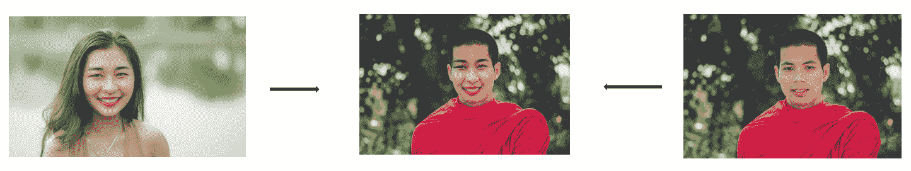

本章将涵盖以下主题:

*   理解面部交换是如何工作的
*   构建原生人脸交换库
*   构建一个用于面部交换的 Android 应用程序。

本章的代码块可以在[https://github . com/intrepidkarthi/MLmobileapps/tree/master/chapter 7](https://github.com/intrepidkarthi/MLmobileapps/tree/master/Chapter7)和[https://github . com/packt publishing/Machine-Learning-Projects-for-Mobile-Applications](https://github.com/PacktPublishing/Machine-Learning-Projects-for-Mobile-Applications)中找到。


# 理解面子交换

长期以来，理解人脸一直是计算机视觉工程师研究的基础。这项研究的第一个应用是面部识别功能。为了在输入图像或视频帧中识别人脸，我们的算法应该首先检测人脸的位置。然后，它将使一个边界框框住图像中的一个面，如下所示:

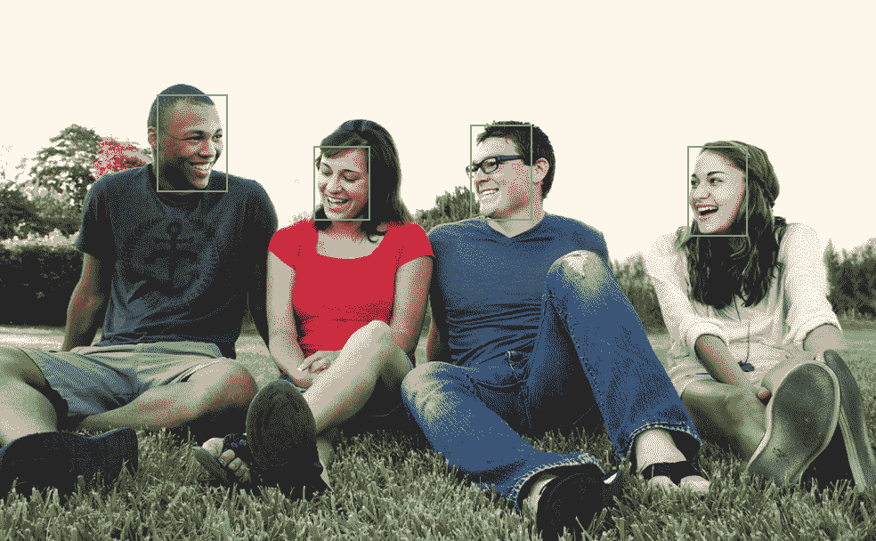

一旦我们有了边界框，很明显的下一步是用框内更细粒度的细节来识别面部关键点，例如，眼睛的位置，鼻子底部，眉毛，等等。识别面部标志点将有助于构建虚拟化妆间、人脸变形、**增强现实** ( **AR** )滤镜等应用。

用`dlib`库制作的面部关键点识别看起来如下:


面部关键点检测最初是由瓦伊德·卡泽米和约瑟芬·沙利文发明的，他们发现了 68 个特定的点构成了面部标志，如上图所示。这里是这篇论文的链接:[http://www.csc.kth.se/~vahidk/papers/KazemiCVPR14.pdf](http://www.csc.kth.se/~vahidk/papers/KazemiCVPR14.pdf)。

为了在两张脸之间应用脸交换，我们需要考虑一些事情:

*   根据拍摄地点，每张照片都有不同的光线设置。此外，照片中的每个人都会有不同的肤色。这将使图像看起来不同。
*   皮肤质地因人而异。例如，小孩的皮肤纹理通常会很光滑，但老年人却不是这样。

*   不同的人面部几何形状不同。如果面部几何形状之间存在巨大差异，我们可能不会收到想要的输出。例如，如果我们试图把一个 1 岁小孩的脸换成一个 85 岁的老奶奶，我们可能得不到想要的结果。
*   不同的图片面部角度不同。这也取决于相机的角度。

现在让我们进入交换两张脸的一步一步的过程。


# 换脸的步骤

面部交换包括一步一步地用一个图像替换另一个图像。一旦我们理解了面交换的步骤，我们将在本章后面的应用程序中构建一个本地库。


# 面部关键点检测

使面部交换看起来真实的重要方面是对准面部。目的是将一个面放在另一个面的上面，使其覆盖另一个面。为了识别面部关键点，我们需要识别两个人脸的几何形状。由于面与面之间的几何体不同，我们需要扭曲源面，使其与目标面对齐。Dlib 帮助识别 68 个面部关键点。我们确定面的外部边界如下:

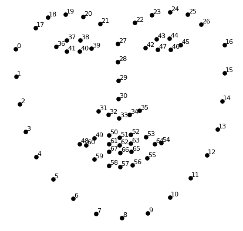

这张图片显示了 68 个位于每个面上的地标。

上图是 CMU 的 Brandon Amos 创作的，他在`OpenFace`图书馆工作。


# 识别凸包

一旦我们确定了关键点，我们的下一个任务就是找到我们的凸包。这是围绕面部关键点绘制的边界。面部关键点确定后，我们可以通过连接边界点找到我们的船体。没有任何凹面的边界被称为**凸包**。

应用凸包后，输入图像如下所示:


# Delaunay 三角剖分和 Voronoi 图

下图左侧显示了一个人的常规图像，中间显示了图像的 Delaunay 三角剖分，右侧显示了同一个人的 Voronoi 图:

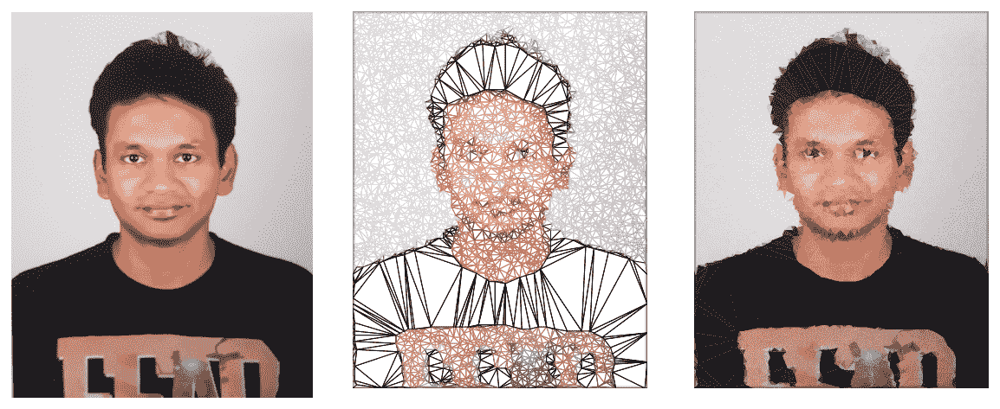

给定平面中的一组点，三角剖分是指将平面细分为三角形，以这些点为顶点。对于同一直线上的一组点，不存在 Delaunay 三角剖分。一组点可以有许多可能的三角剖分，但是 Delaunay 三角剖分根据所有三角形的外接圆具有空内部的条件而不同。

任何关于 Delaunay 三角剖分的讨论都应该利用 Voronoi 图，因为它们是紧密耦合的。我们为三角测量计算的点集也类似地用于 Voronoi 图:

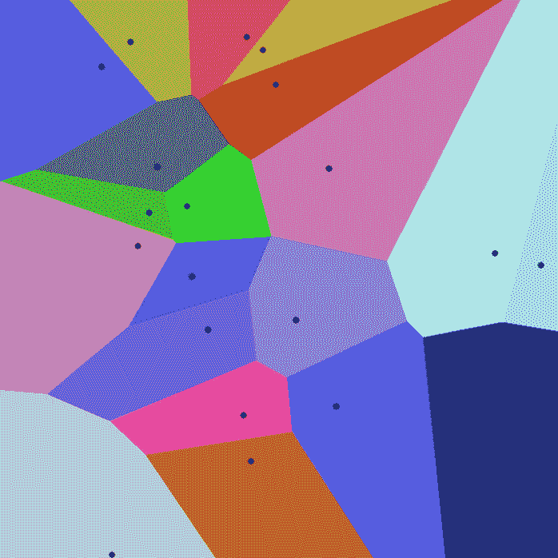

正如您在前面一个包含一组点的平面图像中所看到的，Voronoi 图将这组点划分为多个区域，在这些区域中，边界线与相邻点的距离相等。Voronoi 图也被称为 Voronoi 镶嵌、Voronoi 分解、Voronoi 分割或 Dirichlet 镶嵌。

这两个主题的维基百科链接分别是[https://en.wikipedia.org/wiki/Delaunay_triangulation](https://en.wikipedia.org/wiki/Delaunay_triangulation)和[https://en.wikipedia.org/wiki/Voronoi_diagram](https://en.wikipedia.org/wiki/Voronoi_diagram)。


# 仿射扭曲三角形

对于图像中找到的每个三角形，使用仿射变换方法将三角形内的所有像素转换为面交换图像。重复这个过程，直到我们得到相同图像的扭曲版本:

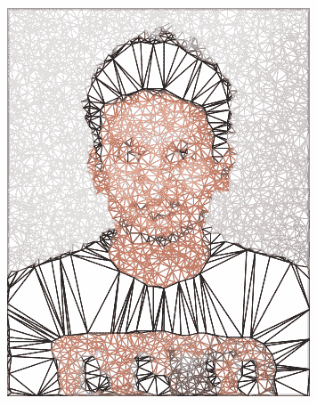

类似地，在第二个要交换面的图像上执行相同的过程。这是使用名为`warpAffine`的 OpenCV 方法实现的。我们将在实现该方法时详细讨论这一点。

应用`warpAffine`后，交换的图像如下所示:

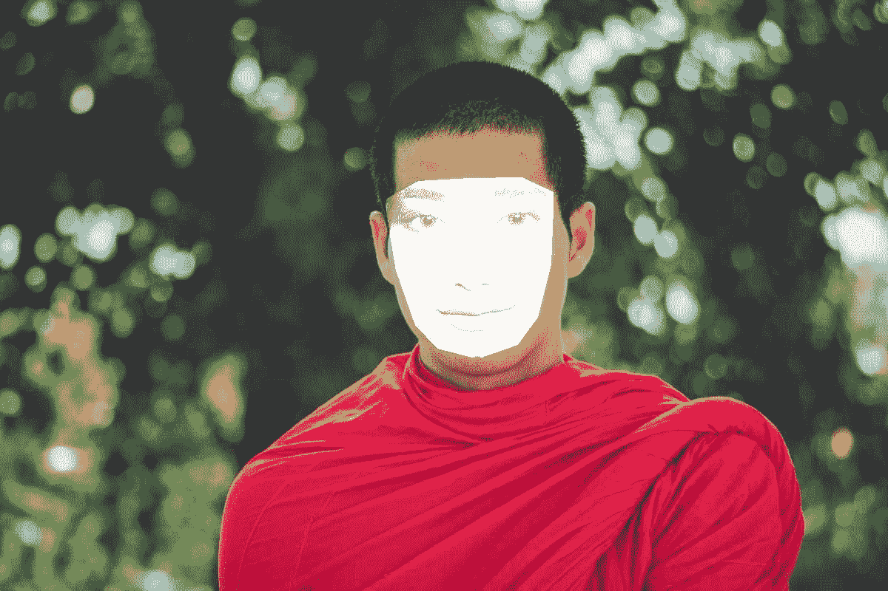


# 无缝克隆

直到最后一步，在另一个图像上交换的图像可能看起来不太合适。为了使边缘和肤色完美契合，我们需要在最后一步应用无缝克隆。有三种类型的无缝克隆可用，旨在获得最终映像的最佳输出:

*   这是我们在应用程序中使用的。当将具有复杂轮廓的物体插入到新的背景中时，该方法的能力被充分表现出来。
*   `MIXED_CLONE`:经典的方法——基于颜色的选择和 alpha 蒙版可能比较耗时，而且经常会留下不理想的光晕。
*   `FEATURE_EXCHANGE`:特征交换允许用户轻松地用替代特征替换一个对象的某些特征。

您必须选择最适合您应用的产品:

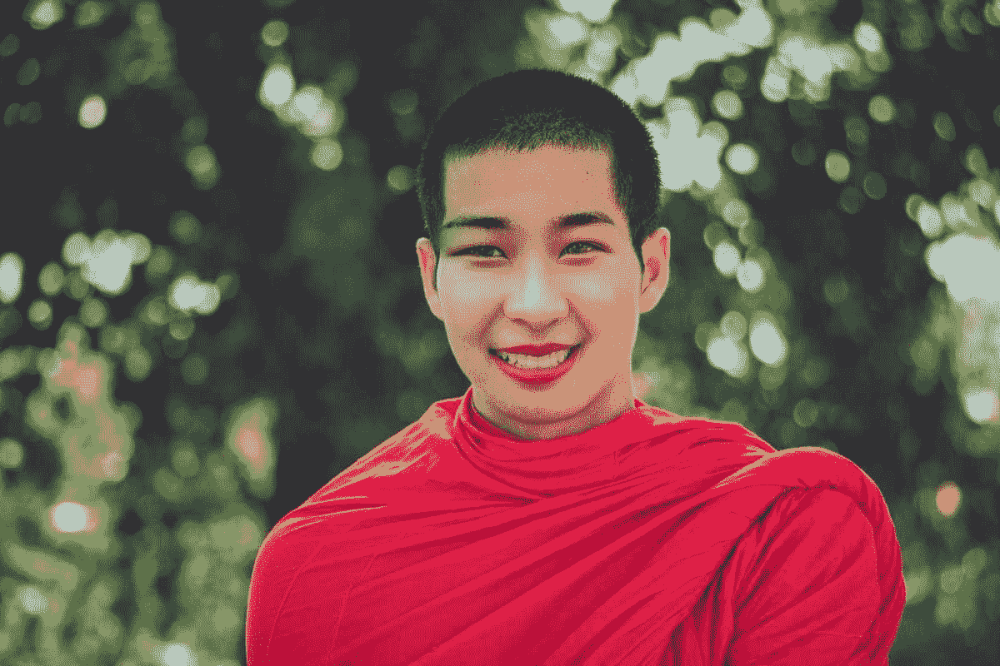

有了这个，我们得到了完美的换脸图像。现在是开始构建应用程序的时候了。


# 构建 Android 应用程序

作为第一步，我们需要在 Android Studio 上安装**原生开发套件** ( **NDK** )。由于面部交换的核心部分涉及 C++的原生代码，NDK 帮助构建了一个带有原生代码的 Android 应用程序。

您可以在 SDK 管理器中的 **SDK Tools** 选项卡下启用 NDK，如下图所示:

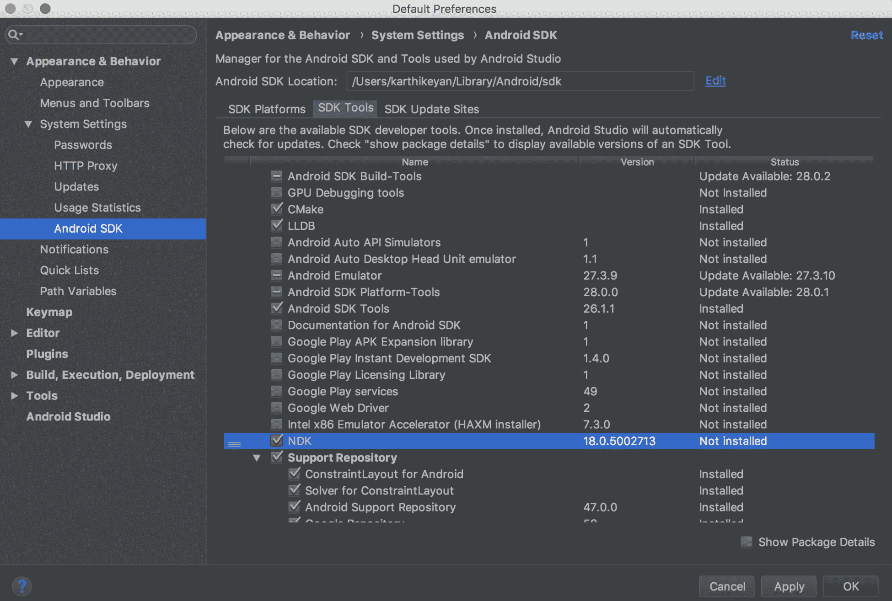

这个库使用 OpenCV 3.0.0 版本的 Android SDK。这个可以从[https://SourceForge . net/projects/opencv library/files/opencv-Android/3 . 0 . 0/](https://sourceforge.net/projects/opencvlibrary/files/opencv-android/3.0.0/)下载。


# 构建原生人脸交换库

让我们继续构建面部交换库。为 Android 构建一个本地库涉及三个文件:

*   `Android.mk`
*   `Application.mk`
*   `faceswapper.cpp`

在 Android 中创建一个原生库在这里讨论:【https://developer.android.com/ndk/guides/】T21。

在我们开始构建模型之前，让我们仔细看看这些。


# Android.mk

这样，根据您的本地路径更改`OpenCV.mk`路径。此应用程序构建在 MacBook Pro macOS High Sierra 上。`Android.mk`文件位于项目的`jni/`目录的子目录中。它实际上是构建系统解析一次或多次的微小 GNU`makefile`片段:

```
LOCAL_PATH := $(call my-dir)

include $(CLEAR_VARS)

OPENCV_INSTALL_MODULES:=on
OPENCV_CAMERA_MODULES:=off
OPENCV_LIB_TYPE:=STATIC
include /Users/karthikeyan/Downloads/OpenCV-
                           android/sdk/native/jni/OpenCV.mk

LOCAL_MODULE    := faceswapper
LOCAL_SRC_FILES := faceswapper.cpp
LOCAL_LDLIBS +=  -llog -ldl -landroid -latomic
LOCAL_CPPFLAGS := -O0 -g3 -std=c++11 -Wall -Wextra -fexceptions

include $(BUILD_SHARED_LIBRARY)
```

关于`Android.mk`文件的更多信息可以在这里找到:[https://developer.android.com/ndk/guides/android_mk](https://developer.android.com/ndk/guides/android_mk)。


# Application.mk

`Application.mk`文件包含目标 ABIs、工具链、发布/调试模式和 STL。如果我们没有明确指定，下面列出了几个参数的默认值:

*   **ABI** :所有未被否决的 ABI
*   **工具链**:叮当
*   **模式**:释放
*   **STL** :系统

这里，我们指定了工具链、Android API 版本和将要使用的架构。类似地，如果您正在为其他架构构建，例如每秒**百万条指令** ( **MIPS** )，请在`APP_ABI`变量中将其指定为逗号分隔值:

```
NDK_TOOLCHAIN_VERSION := clang
APP_STL := gnustl_static
APP_CPPFLAGS := -frtti -fexceptions -std=c++11 -DNO_MAKEFILE
APP_ABI := armeabi-v7a
APP_PLATFORM := android-15

APP_CXX = -clang++
LOCAL_C_INCLUDES += ${ANDROID_NDK}/sources/cxx-stl/gnu-libstdc++/4.8/include
```

面交换逻辑是使用 OpenCV 和 dlib 库用 C++编写的。

更多细节可以在这里找到:[https://developer.android.com/ndk/guides/application_mk](https://developer.android.com/ndk/guides/application_mk)。


# 应用换面逻辑

我们将把两个输入图像作为参数传递给 swapper 方法。这里的`img1`是有脸的图像，将在`img2`中粘贴到身体上。一般来说，`img2`包含有脸的身体，但是在结果中看不到身体。作为第一步，我们首先向该方法提供两幅图像的矩阵值以及使用 dlib 计算的所有点向量(面部关键点)。我们将得到如下所示的`img2`的扭曲图像:

```
//faceswapper.cpp
Mat img1Warped = img2.clone();

//convert Mat to float data type
img1.convertTo(img1, CV_32F);
img1Warped.convertTo(img1Warped, CV_32F);

Mat img11 = img1, img22 = img2;
img11.convertTo(img11, CV_8UC3);
img22.convertTo(img22, CV_8UC3);
```

`CV_8UC3`: Any primitive type from the list can be defined by an identifier in the form *CV_<bit-depth>{U|S|F}C(<number_of_channels>)* where `U` is an unsigned integer type, `S` is a signed integer type, and `F` is a float type. `CV_8UC3` is an 8-bit unsigned integer matrix/image with three channels. Although it is most common that this means an RGB (or actually BGR) image, it does not mandate it. It simply means that there are three channels, and how you use them is up to you and your application.

在这之后，我们的下一步是识别所识别的面部多边形的凸包:

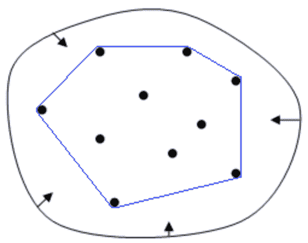

多边形的凸包是包围我们的多边形的最小凸集。例如，当 *X* 是平面的有界子集时，凸包可以被视为由围绕 *X* 伸展的橡皮筋所包围的形状:

```
// Find convex hull
vector<Point2f> hull1;
vector<Point2f> hull2;
vector<int> hullIndex;

convexHull(points2, hullIndex, false, false);

for (size_t i = 0; i < hullIndex.size(); i++) {
    hull1.push_back(points1[hullIndex[i]]);
    hull2.push_back(points2[hullIndex[i]]);
}
```

一旦确定了凸包，我们将使用以下方法找到 Delaunay 三角剖分:

```
// Find delaunay triangulation for points on the convex hull
 vector< vector<int> > dt;
Rect rect(0, 0, img1Warped.cols, img1Warped.rows);
calculateDelaunayTriangles(rect, hull2, dt);
```

三角剖分完成后，对于图像中找到的每个三角形，使用仿射变换方法将三角形内的所有像素转换为面交换图像。重复这个过程，直到我们得到相同图像的扭曲版本。我们可以使用以下方法扭曲图像一和图像二:

```
// Apply affine transformation to Delaunay triangles
for (size_t i = 0; i < dt.size(); i++) {
     vector<Point2f> t1, t2;
       // Get points for img1, img2 corresponding to the triangles
   for(size_t j = 0; j < 3; j++) {
      t1.push_back(hull1[dt[i][j]]);
      t2.push_back(hull2[dt[i][j]]);
   }
     warpTriangle(img1, img1Warped, t1, t2);
}

 // Calculate mask
 vector<Point> hull8U;
 for (size_t i = 0; i < hull2.size(); i++) {
     Point pt(hull2[i].x, hull2[i].y);
     hull8U.push_back(pt);
 }

 Mat mask = Mat::zeros(img2.rows, img2.cols, img2.depth());
 fillConvexPoly(mask, &hull8U[0], hull8U.size(), Scalar(255,255,255));
```

在这一步结束时，我们将得到我们的未完成的输出与不同的肤色，这将看起来像交换后的未完成的输出。为了使边缘和肤色完美契合，我们需要在最后一步应用无缝克隆。为了完成这一循环，我们将按如下方式应用无缝克隆:

```
// Clone seamlessly.
Rect r = boundingRect(hull2);
img1Warped.convertTo(img1Warped, CV_8UC3);

Mat img1WarpedSub = img1Warped(r);
Mat img2Sub       = img2(r);
Mat maskSub       = mask(r);

Point center(r.width/2, r.height/2);

Mat output;
int NORMAL_CLONE = 1;
seamlessClone(img1WarpedSub, img2Sub, maskSub, center, output, NORMAL_CLONE);
```

代替`NORMAL_CLONE`，可以尝试传递值`2`和`3`，分别对应`MIXED_CLONE`和`FEATURE_EXCHANGE`。

将使用以下代码从 Android Java 代码库调用该方法:

```
Java_com_mlmobileapps_faceswapper_FaceSwap_portraitSwapNative(                                         
                                    JNIEnv *env,
                                    jobject obj,
                                    jlong addrImg1,
                                    jlong addrImg2,
                                    jintArray landmarksX1,
                                    jintArray landmarksY1,
                                    jintArray landmarksX2,
                                    jintArray landmarksY2,
                                    jlong addrResult )
{
    // Transform java points to readable OpenCV points
    vector<Point2f> points1 = readPoints(env, landmarksX1, 
                                         landmarksY1);
    vector<Point2f> points2 = readPoints(env, landmarksX2, 
                                         landmarksY2);

    // Get the OpenCV Mats
    Mat img1 = *(Mat*)addrImg1;
    Mat img2 = *(Mat*)addrImg2;
    Mat* retImg = (Mat*)addrResult;

    // Call faceswap function to swap faces
    Mat swapImg = faceswap_main(img1, img2, points1, points2);
    swapImg.convertTo(swapImg, CV_8UC3);
    swapImg.copyTo(*retImg);
}
}
```

将 C++文件另存为`faceswapper.cpp`。

现在是建图书馆的时候了。从终端运行以下命令:

```
$ndk-build V=1
```

您将会在相应的架构文件夹中找到生成的`libfaceswapper.so`库。将文件复制到 Android 项目的`jnilibs`文件夹中。我们不会深入研究项目中产生的每一个布局。相反，您可以从我们在 GitHub 上的公共代码库中下载完整的代码库。

GitHub 链接:[https://GitHub . com/intrepidkarthi/MLmobileapps/tree/master/chapter 7](https://github.com/intrepidkarthi/MLmobileapps/tree/master/Chapter7)和[https://GitHub . com/packt publishing/Machine-Learning-Projects-for-Mobile-Applications](https://github.com/PacktPublishing/Machine-Learning-Projects-for-Mobile-Applications)。


# 构建应用程序

使用 Android Studio 中的设计编辑器创建 UI 更容易。如果您熟悉基于 XML 的文本编辑器，也可以使用它。我们将创建一个简单的`ViewPager` ( `activity_swap.xml`)，它将在一个`CoordinatorLayout`中保存两个输入图像，如下面的代码块所示:

```
<android.support.v4.view.ViewPager
    android:id="@+id/container"
    android:layout_width="0dp"
    android:layout_height="0dp"
    android:layout_gravity="center_vertical"
    app:layout_behavior="@string/appbar_scrolling_view_behavior"
    app:layout_constraintBottom_toTopOf="@+id/container1"
    app:layout_constraintHorizontal_bias="0.0"
    app:layout_constraintLeft_toLeftOf="parent"
    app:layout_constraintRight_toRightOf="parent"
    app:layout_constraintTop_toBottomOf="@+id/container2"/>
```

我们需要`TabLayout`来保存其中的`ViewPager`视图。我们将它添加到`ViewPager`之前的`AppBarLayout`中，如下所示:

```
<android.support.design.widget.AppBarLayout
    android:id="@+id/appbar"
    android:layout_width="0dp"
    android:layout_height="wrap_content"
    android:paddingTop="@dimen/appbar_padding_top"
    android:theme="@style/AppTheme.AppBarOverlay"
    app:layout_constraintHorizontal_bias="0.0"
    app:layout_constraintLeft_toLeftOf="parent"
    app:layout_constraintRight_toRightOf="parent"
    app:layout_constraintTop_toBottomOf="@+id/main_toolbar">

    <android.support.design.widget.TabLayout
        android:id="@+id/tabs"
        android:layout_width="match_parent"
        android:layout_height="wrap_content"
        android:fillViewport="false"
        app:tabGravity="fill"
        app:tabMaxWidth="0dp"
        app:tabMode="fixed" />

</android.support.design.widget.AppBarLayout>
```

一旦我们准备好布局，我们将在`FaceSwapperActivity`中初始化相同的布局。创建将为活动的三个主要部分返回片段的适配器，如下所示:

```
private void setupTabs() {

    mSectionsPagerAdapter = new 
                SectionsPagerAdapter(getSupportFragmentManager());

    // Set up the ViewPager with the sections adapter.
    mViewPager = (ViewPager) findViewById(R.id.container);
    mViewPager.setAdapter(mSectionsPagerAdapter);

    tabLayout = (TabLayout) findViewById(R.id.tabs);
    tabLayout.setupWithViewPager(mViewPager);
    // Sets tab icons
            tabLayout.getTabAt(0).setIcon(ResourcesCompat.getDrawable(getResources(
                              ), R.drawable.ic_face, null));
          tabLayout.getTabAt(1).setIcon(ResourcesCompat.getDrawable(getResources(
                              ), R.drawable.ic_face, null));

    tabLayout.addOnTabSelectedListener(this);
}
```

一旦我们有了标签设置，我们将添加按钮来捕捉图片，选择图库图片以及调用交换方法。这样，我们将添加控件来从相机中抓拍照片，并从用户照片库中挑选图像。

在对按钮执行任何操作之前，我们需要检查我们是否有权限抓取图片，以及是否有权限在存储区域读取/写入图片，以便从图库中选取图片，如下所示:

```
/**
 * Controls if an app has permission to use the camera and internal storage.
 @return true if permissions are ok otherwise false.
 */
private boolean checkPermissions() {
    granted = true;
    // List the permissions
    String requests[] = {
            Manifest.permission.CAMERA,
            Manifest.permission.READ_EXTERNAL_STORAGE,
            Manifest.permission.WRITE_EXTERNAL_STORAGE,
    };

    for (String request : requests) {
        if (ContextCompat.checkSelfPermission(this, request) != PackageManager.PERMISSION_GRANTED) {
            granted = false;
        }
    }
    if (granted) {
        return true;
    }
    ActivityCompat.requestPermissions(this, requests, 
                              MY_PERMISSIONS_REQUEST_READ_CONTACTS);
    return granted;
}
```

一旦我们有了权限设置的权利，我们将添加行动的相机和画廊图像选择器的按钮。以下代码启动相机，并将视图捕获为图像:

```
@SuppressWarnings("UnusedParameters")
public void cameraMode(View view) {
    if (checkPermissions()) {
        Intent intent = new Intent(MediaStore.ACTION_IMAGE_CAPTURE);
        if (Build.VERSION.SDK_INT >= CAMERA_API_LEVEL_LIMIT) {
           //for api > = 24
            File file = createImageFile();
            if (file != null) {
                Uri photoURI = FileProvider.getUriForFile(getApplicationContext(), BuildConfig.APPLICATION_ID + ".provider", file);

                intent.putExtra(MediaStore.EXTRA_OUTPUT, photoURI);
            }

        } else {
            //api < 24
            intent = new Intent(MediaStore.ACTION_IMAGE_CAPTURE);
            intent.putExtra(MediaStore.EXTRA_OUTPUT, 
                            getPhotoFileUri());

            // Avoid crash
            if (intent.resolveActivity(getPackageManager()) != null) {
                // Start the image capture intent to take photo
                startActivityForResult(intent, 
                           CAPTURE_IMAGE_ACTIVITY_REQUEST_CODE);
            }
        }
        // Avoid crash
        if (intent.resolveActivity(getPackageManager()) != null) {
            // Start the image capture intent to take photo
            startActivityForResult(intent, 
                          CAPTURE_IMAGE_ACTIVITY_REQUEST_CODE);
        }
    } else {
        if (infoToast != null) {
            infoToast.cancel();
        }
        infoToast = showInfoToast(getString(R.string.err_permission));
    }
}
```

还有一个选项可以从照片库中选择一张图片。一旦我们得到最终的拾取或捕捉图像，我们将调用如下所示的`startActivityForResult`方法:

```
@SuppressWarnings("UnusedParameters")
public void galleryMode(View view) {
    if (checkPermissions()) {
        // Opens photo album
        Intent i = new Intent(Intent.ACTION_PICK, MediaStore.Images.Media.EXTERNAL_CONTENT_URI);
        startActivityForResult(i, RESULT_LOAD_IMAGE);
    } else {
        if (infoToast != null) {
            infoToast.cancel();
        }
        infoToast = showInfoToast(getString(R.string.err_permission));
    }
}
```

一旦我们设置好所有基本的 UI 布局，应用程序将如下所示:


将使用`FaceSwap`类将本地库加载到应用程序中:

```
 * @param addrImg1,    memory address to image 1.
 * @param addrImg2,    memory address to image 2.
 * @param landmarksX1, facial landmark x-coordinates to image 1.
 * @param landmarksY1, facial landmark y-coordinates to image 1.
 * @param landmarksX2, facial landmark x-coordinates to image 2.
 * @param landmarksY2, facial landmark y-coordinates to image 2.
 * @param addrResult, memory address to result image.
 */
@SuppressWarnings("JniMissingFunction")
public native void portraitSwapNative(long addrImg1,
                                      long addrImg2,
                                      int[] landmarksX1,
                                      int[] landmarksY1,
                                      int[] landmarksX2,
                                      int[] landmarksY2,
                                      long addrResult);

/* Load Native Library */
static {
    //noinspection StatementWithEmptyBody
    if (!OpenCVLoader.initDebug()) ;
    else System.loadLibrary("faceswapper");
}
```

之后，我们编写交换脸时要调用的方法。我们需要传递所有的面部关键点作为该方法的输入。我们可以使用`FaceDetector`类从 Google Vision SDK 获取面部数据:

```
FaceDetector detector = new FaceDetector.Builder(context)
        .setTrackingEnabled(false)
        .setLandmarkType(FaceDetector.ALL_LANDMARKS)
        .build();
```

从图书馆，我们会找到所有的标志点。地标列表如下。这用于从给定的输入图像中识别面部:

```
case Landmark.RIGHT_CHEEK:
    x1 = (float) (x1 + 0.8 * FACE_CONST * faceW * Math.cos(Math.PI +  theta));
    y1 = (float) (y1 + FACE_CONST * faceW * Math.sin(Math.PI + theta));

    xRightEye += x1;
    yRightEye += y1;
    break;

case Landmark.LEFT_CHEEK:
    x1 = (float) (x1 + 0.8 * FACE_CONST * faceW * Math.cos(theta));
    y1 = (float) (y1 + FACE_CONST * faceW * Math.sin(theta));

    xLeftEye += x1;
    yLeftEye += y1;
    break;

case Landmark.RIGHT_MOUTH:
    x1 = (float) (x1 + 0.75 * FACE_CONST * faceW * Math.cos((-Math.PI / 
                  8) + Math.PI + theta));
    y1 = (float) (y1 + 0.75 * FACE_CONST * faceW * Math.sin((-Math.PI / 
                  8) + Math.PI + theta));

    xMouthRight += x1;
    yMouthRight += y1;
    break;

case Landmark.LEFT_MOUTH:
    x1 = (float) (x1 + 0.75 * FACE_CONST * faceW * Math.cos(Math.PI / 8  
                  + theta));
    y1 = (float) (y1 + 0.75 * FACE_CONST * faceW * Math.sin(Math.PI / 8 
                  + theta));

    xMouthLeft += x1;
    yMouthLeft += y1;
    break;

case Landmark.BOTTOM_MOUTH:
    x1 = (float) (x1 + FACE_CONST_MOUTH * faceW * Math.cos(theta90));
    y1 = (float) (y1 + FACE_CONST_MOUTH * faceW * Math.sin(theta90));

    xMouthLeft += x1;
    xMouthRight += x1;
    yMouthLeft += y1;
    yMouthRight += y1;
    break;

```

眼睛上的标志按如下所示进行处理:

```
case Landmark.RIGHT_EYE:
    x1 = (float) (x1 + 1.05 * FACE_CONST_EYE * faceW * Math.cos(Math.PI 
                  + Math.PI / 5 + theta));
    y1 = (float) (y1 + FACE_CONST_EYE * faceW * Math.sin(Math.PI + 
                  Math.PI / 5 + theta));

    xRightEye += x1;
    yRightEye += y1;
    xForeHeadMid += x1;
    yForeHeadMid += y1;
    xForeHeadRight += x1;
    yForeHeadRight += y1;
    break;

case Landmark.LEFT_EYE:
    x1 = (float) (x1 + 1.05 * FACE_CONST_EYE * faceW * Math.cos(-
                  Math.PI / 5 + theta));
    y1 = (float) (y1 + FACE_CONST_EYE * faceW * Math.sin(-Math.PI / 5 + 
                  theta));

    xLeftEye += x1;
    yLeftEye += y1;
    xForeHeadMid += x1;
    yForeHeadMid += y1;
    xForeHeadLeft += x1;
    yForeHeadLeft += y1;
    break;
```

一旦我们有了所有的面部键坐标，我们就调用`swap`方法，它在内部调用本机库`swap`方法:

```
/**
 * Swaps the faces of two photos where the faces have landmarks pts1 and pts2.
 *
 * @param bmp1 photo 1.
 * @param bmp2 photo 2.
 * @param pts1 landmarks for a face in bmp1.
 * @param pts2 landmarks for a face in bmp2.
 * @return a bitmap where a face in bmp1 has been pasted onto a face in 
    bmp2.
 */
private Bitmap swap(Bitmap bmp1, Bitmap bmp2, ArrayList<PointF> pts1, 
                    ArrayList<PointF> pts2) {
    // For storing x and y coordinates of landmarks.
    // Needs to be stored like this when sending them to native code.
    int[] X1 = new int[pts1.size()];
    int[] Y1 = new int[pts1.size()];
    int[] X2 = new int[pts2.size()];
    int[] Y2 = new int[pts2.size()];

    for (int i = 0; i < pts1.size(); ++i) {
        int x1 = pts1.get(i).X();
        int y1 = pts1.get(i).Y();
        X1[i] = x1;
        Y1[i] = y1;

        int x2 = pts2.get(i).X();
        int y2 = pts2.get(i).Y();
        X2[i] = x2;
        Y2[i] = y2;
    }

    // Get OpenCV data structures
    Mat img1 = new Mat();
    bitmapToMat(bmp1, img1);
    Mat img2 = new Mat();
    bitmapToMat(bmp2, img2);

    // Convert to three channel image format
    Imgproc.cvtColor(img1, img1, Imgproc.COLOR_BGRA2BGR);
    Imgproc.cvtColor(img2, img2, Imgproc.COLOR_BGRA2BGR);

    Mat swapped = new Mat();
    // Call native function to get swapped image
    portraitSwapNative(img1.getNativeObjAddr(), img2.getNativeObjAddr(), X1, Y1, X2, Y2, swapped.getNativeObjAddr());
    // Convert back to standard image format
    Bitmap bmp = Bitmap.createBitmap(bmp1.getWidth(), bmp1.getHeight(), Bitmap.Config.ARGB_8888);
    matToBitmap(swapped, bmp);

    return bmp;
}
```

类似地，我们可以从单个图像交换多个图像，如下所示:

```
/**
 * Makes a group face swap, swaps faces in an image.
 * Callers make sure bitmap is not null.
 * @param bitmap image with faces, #faces >= 2
 * @return status.
 */
fsStatus multiSwap(Bitmap bitmap) {
    // Get facial landmarks for people in bitmap
    ArrayList<ArrayList<PointF>> landmarks = getFacialLandmarks(bitmap);

    // Check if people were found (at least 2)
    if (landmarks.size() < 2) return fsStatus.FACE_SWAP_TOO_FEW_FACES;

    if (landmarks.size() == 2) {
        if (landmarks.get(0).size() != LANDMARK_SIZE)
            return fsStatus.FACE_SWAP_INSUFFICIENT_LANDMARKS_IMAGE1;

        if (landmarks.get(1).size() != LANDMARK_SIZE)
            return fsStatus.FACE_SWAP_INSUFFICIENT_LANDMARKS_IMAGE1;
    }

    Bitmap bitmap1 = bitmap.copy(bitmap.getConfig(), true);
    Bitmap bitmap2 = bitmap.copy(bitmap.getConfig(), true);

    int faceSwapCount = 0;

    // Start swapping faces
    int i = 0;
    while (i < landmarks.size() - 1) {

        if (landmarks.get(i).size() != LANDMARK_SIZE) {
            i++;
        } else {

            bitmap2 = swap(bitmap1, bitmap2, landmarks.get(i), landmarks.get(i + 1));
            bitmap2 = swap(bitmap1, bitmap2, landmarks.get(i + 1), landmarks.get(i));

            faceSwapCount++;
            i += 2;
        }
    }

    // An extra swap if the number of faces is odd.
    if (landmarks.size() % 2 == 1) {
        int ind = landmarks.size();
        if (landmarks.get(ind - 2).size() == LANDMARK_SIZE && landmarks.get(ind - 2).size() == LANDMARK_SIZE) {
            bitmap2 = swap(bitmap2, bitmap2, landmarks.get(ind - 2), landmarks.get(ind - 1));
            bitmap2 = swap(bitmap1, bitmap2, landmarks.get(ind - 1), landmarks.get(ind - 2));
            faceSwapCount++;
        }
    }
    if (faceSwapCount == 0) return fsStatus.FACE_SWAP_TOO_FEW_FACES;
    res = bitmap2;
    return fsStatus.FACE_SWAP_OK;
}
```

我们现在将开始加载图像作为输入。我们可以从相机或图库中选择一张图片:

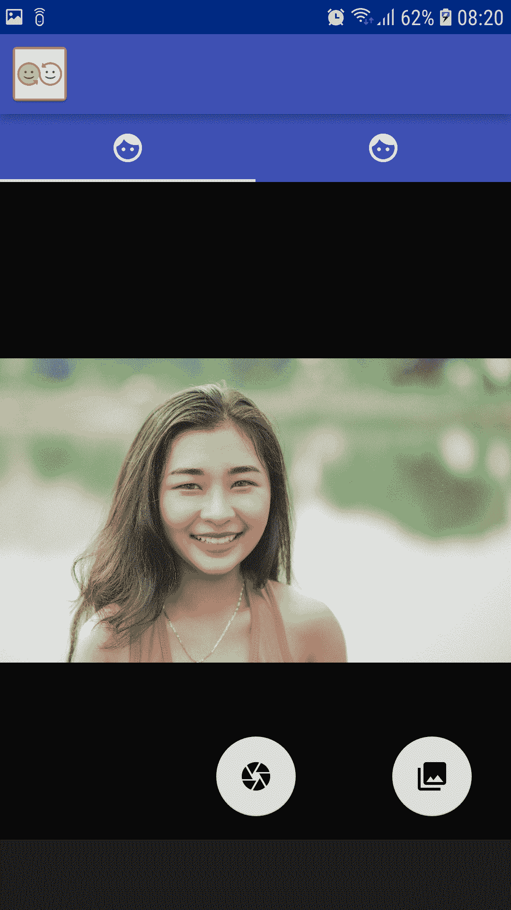 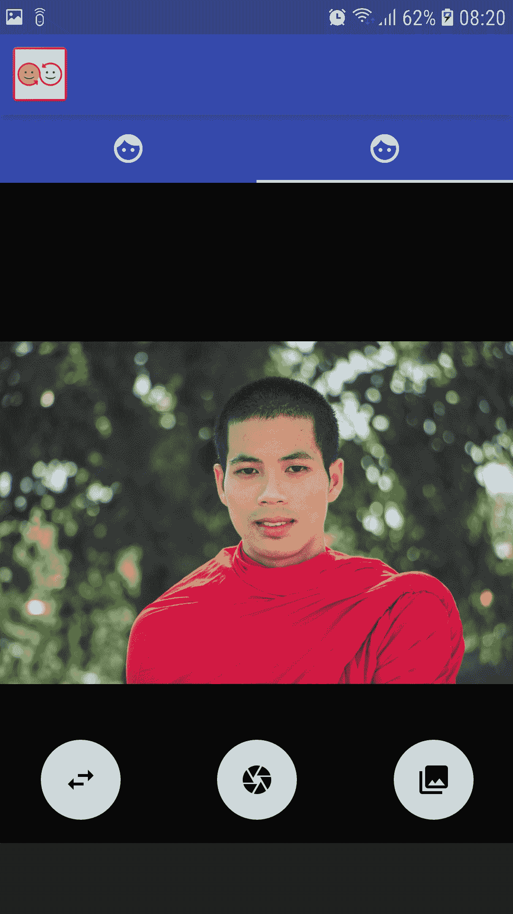

现在两个图像都已加载。一旦我们加载了两个图像，我们可以交换它们。输出如下所示:


为了获得更好的输出效果，请使用相同分辨率和大小的图像。如果边界框包含相同大小的数据，您将获得更好的输出。肤色和图像几何在这里也起着重要的作用。

如果您在编译代码时遇到任何问题，请尝试从 SDK 管理器中禁用 NDK，然后重试。


# 摘要

在这一章中，我们学习了如何构建一个完整的人脸交换应用程序。这是计算机视觉研究的基本组成部分之一。在此基础上可以构建许多有用的应用程序。

在下一章，我们将使用 TensorFlow 构建我们自己的食物分类器，并使用 Core ML 将其构建到 iOS 应用程序中。


# 参考

有很多关于换脸的流行讨论。有关更多信息，请参见以下内容:

*   深度学习换脸:[https://github.com/deepfakes/faceswap](https://github.com/deepfakes/faceswap)
*   来自谷歌和必应 API 的图片剪贴:[https://github.com/rushilsrivastava/image_search](https://github.com/rushilsrivastava/image_search)
*   Python 实现与 dlib 和 OpenCV 框架相同的应用:[https://github.com/wuhuikai/FaceSwap](https://github.com/wuhuikai/FaceSwap)
*   与甘对脸:[与](https://github.com/shaoanlu/faceswap-GAN)


# 问题

1.  你明白面部交换是如何进行的吗？
2.  你能自己为 Android 建立一个 NDK 图书馆吗？
3.  你能用`ViewPager`构建一个简单的安卓应用吗？
4.  你能建立一个完整的人脸交换/变形应用程序吗？