# 五、时间序列分析

在这一章中，我们将看看时间序列分析，并学习在不同时间点观察和捕捉事件的几种方法。我们将介绍白噪声的概念，并在一系列中了解它的检测。

我们将获取时间序列数据，并计算连续观测值之间的差异，这将导致新序列的形成。这些概念将帮助我们深入时间序列分析，并帮助我们围绕它建立更深入的理解。

在本章中，我们将讨论以下主题:

*   时间序列分析导论
*   白噪声
*   随机游动
*   自回归
*   自相关
*   平稳性
*   区别
*   AR 模型
*   移动平均模型
*   自回归综合移动平均
*   参数优化
*   异常检测


# 时间序列分析导论

有几个场合，我们可能会试图在不同的时间点观察和捕捉一个事件。通常，我们最终会得出相邻观察值之间的相关性或关联性，这是处理独立且同分布数据的方法所无法处理的。以数学和统计的方式考虑所有这些的方法被称为**时间序列分析**。

时间序列分析已经被用于许多领域，例如汽车、银行和零售业、产品开发等等。它的使用没有边界，因此分析师和数据科学家正在全力探索这一领域，以便为组织获取最大利益。

在本节中，我们将介绍一些与时间序列分析相关的概念，这些概念将为将来更深入的理解奠定基础。一旦我们建立了这个基础，我们将进入建模阶段。


# 白噪声

均值为零、标准差为*σ²T5 的不相关随机变量集合的简单序列称为**白噪声**。在这种情况下，变量是独立且同分布的。所有值都具有相同的方差 *σ ²* 。在这种情况下，序列是从高斯分布中提取的，称为**高斯白噪声**。*

当序列变成白噪声时，意味着序列的性质完全是随机的，序列内部没有关联。因此，模型无法开发，在这种情况下也无法进行预测。

然而，当我们通常用非白噪声序列建立时间序列模型时，我们试图在残差或误差中获得白噪声现象。简单来说，每当我们试图建立一个模型时，动机都是从序列中提取最大数量的信息，以便变量中不再存在更多的信息。一旦我们建立了一个模型，噪音将永远是它的一部分。方程式如下:

*Y [t] = X [t] +误差*

因此，误差序列本质上应该是完全随机的，这意味着它是白噪声。如果我们得到的这些错误是白噪声，那么我们可以说我们已经从这个系列中提取了所有可能的信息。


# 序列中白噪声的检测

我们可以使用以下工具检测白噪声:

*   线形图:一旦我们有了线形图，我们就可以知道序列是否有一个恒定的均值和方差
*   **自相关图**:有了相关图，我们就能知道滞后变量之间是否存在关联
*   **摘要**:根据序列中有意义的连续数值块的平均值和方差检查序列的平均值和方差

让我们用 Python 来做这件事:

1.  首先，我们将导入所有需要的库，如下所示:

```
from random import gauss
from random import seed
from pandas import Series
from pandas.tools.plotting import autocorrelation_plot
from matplotlib import pyplot
```

2.  接下来，我们将设置白噪声序列供我们分析，如下:

```
seed(1000)
#creating white noise series
series = [gauss(0.0, 1.0) for i in range(500)]
series = Series(series)
```

3.  让我们使用下面的代码对其进行汇总或统计:

```
print(series.describe())
```

我们将获得以下输出:

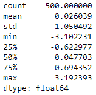

在这里，我们可以看到均值接近于零，标准差接近于 1。

4.  现在，让我们使用以下代码绘制一个线图来检查趋势:

```
series.plot()
pyplot.show()
```

我们将获得以下输出:

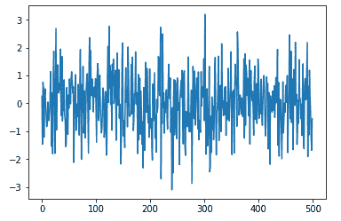

线图看起来完全是随机的，在这里看不到任何趋势。

5.  是时候做一个自相关图了。让我们使用下面的代码来设置一个:

```
autocorrelation_plot(series)
pyplot.show()
```

我们将获得以下输出:

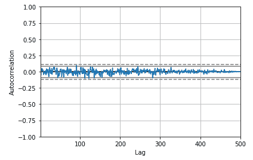

即使在**自相关**函数图中，相关性也超出了我们的置信水平范围。这告诉我们，它是一个白噪音系列。


# 随机游动

随机游走是一种时间序列模型，其中当前观察值等于先前的观察值，并进行随机修改。它可以用以下方式描述:

*x[t]= x[t-1]+w[t]*

在前面的公式中， *w [t]* 是一个白噪声序列。

有时，我们可能会遇到反映不规则增长的序列。在这些情况下，预测下一个级别的策略不会是正确的。相反，尝试预测从一个时期到下一个时期发生的变化可能会更好，也就是说，为了找出一个重要的模式，查看系列的第一个差异可能会更好。下图显示了随机行走模式:

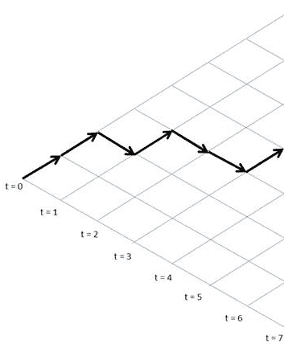

在每个时间段内，从左到右，变量的值采取独立的随机步骤上升或下降，这被称为**随机行走**。

也可以用以下方式描述:

*y(t)= b[o]+b[1]* x[t-1]+w[t]*

下面的列表解释了前面的公式:

*   *y(t)* :序列中的下一个值
*   *b [o]*
*   *b[1]:系数，设置为 1*
*   *w[t]T32**:**白噪声*


# 自回归

自回归是一种时间序列模型，通常使用同一序列的前一个值作为回归的解释因子，以预测下一个值。假设我们已经测量并跟踪了一段时间内的指标，称为*y[t]，它是在时间 *t* 测量的，此时该值是对来自同一时间序列的先前值的回归。比如 *y [t]* 上 *y [t-1]* :*


如前面的等式所示，先前的值 *y [t-1]* 已经成为这里的预测值，并且 *y [t]* 是要预测的响应值。另外， *ε [t]* 正态分布，均值为零，方差为 1。自回归模型的阶由模型用来确定下一个值的前一个值的数量来定义。因此，前面的方程是一阶自回归，或 **AR(1)** 。如果一定要推广的话，一个*k*^(*th*)阶自回归，写作 **AR(k)** ，是一个多元线性回归，其中任意时刻( *t* )的序列值是时间*t1*、*T2*、…、**t k 的值的(线性)函数**

 *下表显示了以下值对于 AR(1)模型的意义:

*   当 *β [1] = 0* ，*y*t 时，它相当于白噪声
*   当 *β [1] = 1* 且 *β [0] = 0* ， *y [t]* 时，相当于一次随机游走
*   当 *β [1] = 1* 且 *β [0] ≠ 0* 、 *y [t]* 时，相当于一个随机游走带漂移
*   当 *β [1] < 1* ， *y [t]* 时，倾向于在正值和负值之间振荡


# 自相关

自相关是时间序列滞后值之间相关性的度量。例如， *r [1]* 是 *y [t]* 和 *y [t-1 之间的自相关；]* 同理， *r [2]* 是*y[t]和 *y [t-2]* 之间的自相关。这可以用下面的公式来概括:*

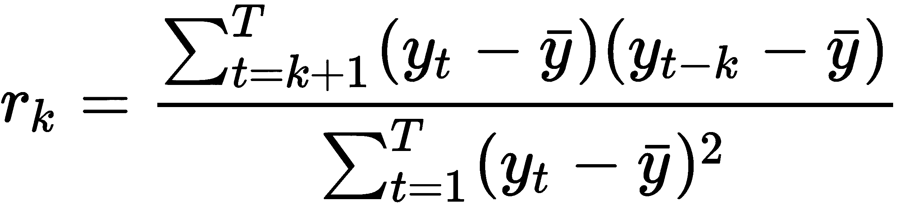

在前面的公式中， *T* 是时间序列的长度。

例如，假设我们有相关系数，如下图所示:

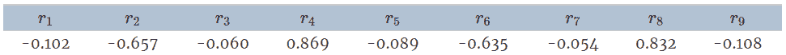

为了绘制它，我们得到如下结果:

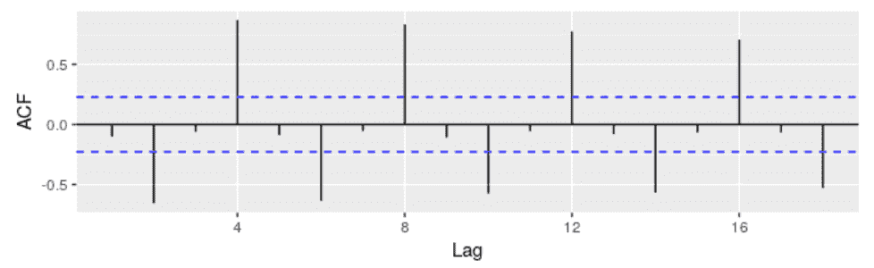

以下是该自相关函数图的一些观察结果:

*   r [4]
*   蓝线是相关性是否明显不同于零的指标
*   滞后 0 处的自相关始终为 1


# 平稳性

一些时间序列模型的常见假设是数据必须是平稳的。让我们看看平稳性对于时间序列意味着什么。

平稳过程是指均值、方差和自相关结构不随时间变化的过程。这意味着数据没有趋势(增加或减少)。

我们可以用下面的公式来描述这一点:

*E(x [t] )= μ* ，对于所有 *t*

*E(x[t]²)=σ*^(*2*)，对于所有 *t*

*cov(x [t] ，x[k])= cov(x[t+s]，x [k+s] )* ，对于所有 *t* 、 *k* 和 s


# 平稳性检测

有多种方法可以帮助我们判断数据是否是稳定的，如下所示:

*   **绘制数据图**:绘制数据相对于时间变量的图可以帮助我们了解它是否有趋势。我们从平稳性的定义中知道，数据中的趋势意味着没有恒定的均值和方差。让我们用 Python 来做这件事。对于这个例子，我们使用的是国际航班的乘客数据。

首先，让我们加载所有需要的库，如下所示:

```
 from pandas import Series
from matplotlib import pyplot
%matplotlib inline

data = Series.from_csv('AirPassengers.csv', header=0)
  series.plot()
  pyplot.show()
```

我们将获得以下输出:

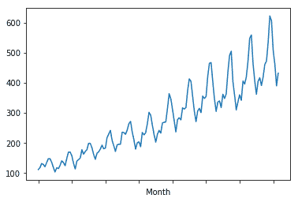

从图中可以很清楚地看出，这里有一个增加的趋势，这将证明我们的假设，即它是一个非平稳序列。

*   **划分数据集并计算汇总**:下一个方法是将数据序列分成两部分，并计算平均值和方差。通过这样做，我们将能够计算出均值和方差是否是常数。让我们通过使用以下代码来实现这一点:

```
X = data.values
partition =int(len(X) / 2)
X1, X2 = X[0:partition], X[partition:]
mean1, mean2 =np.nanmean(X1),np.nanmean(X2)
var1, var2 = np.nanvar(X1), np.nanvar(X2)
print('mean1=%f, mean2=%f' % (mean1, mean2))
print('variance1=%f, variance2=%f' % (var1, var2))
```

输出如下所示:

```
mean1=182.902778, mean2=377.694444 variance1=2244.087770, variance2=7367.962191
```

我们可以看到系列 1 和系列 2 的均值和方差不相等，因此我们可以得出结论，该系列不是平稳的。

*   **增广的 Dickey-Fuller 检验**:增广的 Dickey-Fuller 检验是一种统计检验，它倾向于在一定的置信度下给出一个关于序列是否平稳的指示。统计测试获取数据，并使用其假设和过程来测试我们对数据的假设。最终，它会在一定程度上自信地给出结果，这有助于我们做出决定。

这个检验无非是单位根检验，试图找出时间序列是否受趋势的影响。它利用**自回归** ( **AR** )模型，优化不同滞后值的信息准则。

这里，零假设如下:

*   ***H [o]*** :时间序列有单位根，暗示序列是非平稳的

另一个假设如下:

*   ***H [1]*** :时间序列没有单位根，因此是平稳的

根据假设检验的规则，如果我们选择 5%的显著性水平进行检验，那么结果将解释如下:

如果 *p 值> 0.05* = >，那么我们无法拒绝零假设。也就是说，序列是非平稳的。

如果 *p 值< 0.05* = >，那么零假设被拒绝，这意味着序列是平稳的。

让我们用 Python 来执行:

1.  首先，我们将加载库，如下所示:

```
import pandas as pd
import numpy as np
import matplotlib.pylab as plt
%matplotlib inline
from matplotlib.pylab import rcParams
rcParams['figure.figsize'] = 25, 6
```

2.  接下来，我们加载数据和时间图，如下所示:

```
data = pd.read_csv('AirPassengers.csv')
print(data.head())
print('\n Data Types:')
print(data.dtypes)
```

下图显示了输出结果:

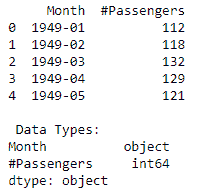

3.  然后，我们按如下方式解析数据:

```
dateparse = lambda dates: pd.datetime.strptime(dates, '%Y-%m')
data = pd.read_csv('./data/AirPassengers.csv', parse_dates=['Month'], index_col='Month',date_parser=dateparse)
print(data.head())
```

然后，我们得到以下输出:

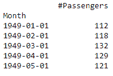

```
ts= data["#Passengers"]
ts.head()
```

由此，我们得到以下输出:

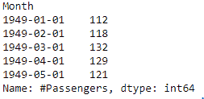

4.  然后我们绘制图表，如下所示:

```
plt.plot(ts)
```

输出如下所示:

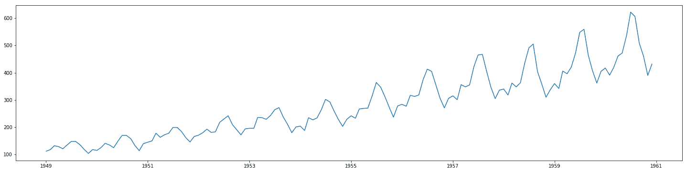

5.  让我们使用以下代码创建一个函数来执行平稳性测试:

```
from statsmodels.tsa.stattools import adfuller
def stationarity_test(timeseries):
 dftest = adfuller(timeseries, autolag='AIC')
 dfoutput = pd.Series(dftest[0:4], index=['Test Statistic','p-value','#Lags Used','Number of Observations Used'])
 for key,value in dftest[4].items():
               dfoutput['Critical Value (%s)'%key] = value
 print(dfoutput)

stationarity_test(ts)
```

输出如下所示:

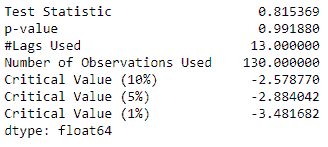

由于 *p 值> 0.05* 和*t*-统计量大于所有临界值(1%、5%、10%)， *tt* 暗示序列是非平稳的，因为我们未能拒绝零假设。

那么，如果数据是不稳定的，该怎么办呢？我们使用差分法将非平稳数据转化为平稳数据。


# AR 模型

AR 模型是随机过程的一部分，其中特定的滞后值 *y [t]* 被用作预测变量，并在 *y [t]* 上回归以估计其值。滞后值是前期序列的值，往往会对序列的当前值产生影响。让我们看一个例子。假设我们必须评估和预测明天的天气。我们将从思考今天的天气和昨天的天气开始，因为这将有助于我们预测天气是会下雨、晴朗还是多云。潜意识里，我们也意识到前一天的天气可能与今天的天气有关联。这就是我们所说的 **AR 模型**。

这具有一定程度的不确定性，导致未来值预测的准确性降低。该公式与带有 *p* 滞后的系列的公式相同，如下所示:

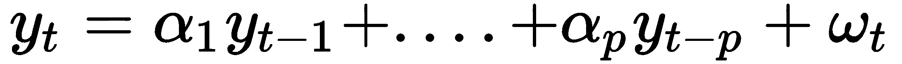

上式中， *ω* 为白噪声项， *α* 为系数，不能为零。汇总等式如下所示:

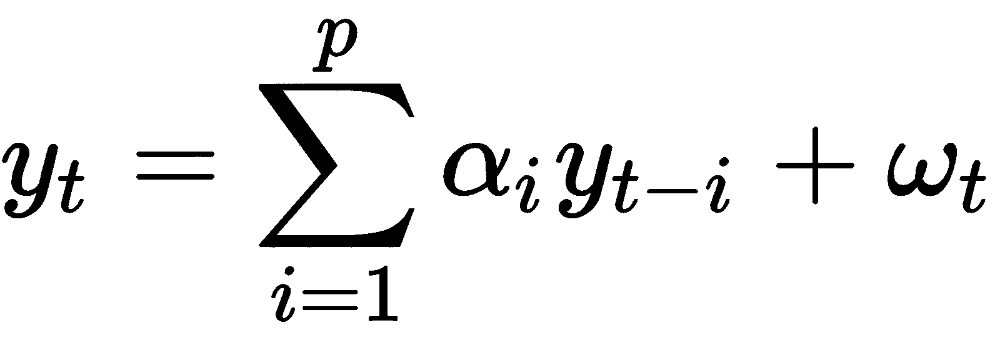

偶尔，我们可能会讨论模型的顺序。例如，我们可以将 AR 模型描述为阶数为 *p* 。在这种情况下，***p*代表模型中使用的滞后变量的数量。例如，AR(2)模型或二阶AR 模型如下所示:**

 **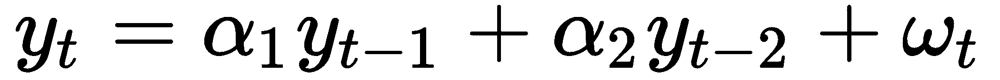


# 移动平均模型

一个**移动平均模型** ( **MA** )是历史白噪声误差项的线性组合。让我们来看看模型的方程:

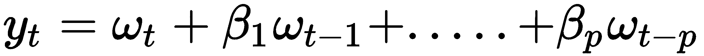

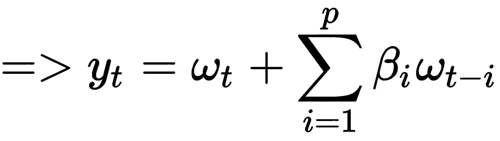

这里， *ω* 为白噪声，其中 *E(ω [t] )=0* ，方差= *σ ²* 。

为了找出 AR 模型的阶次，我们需要绘制一个偏自相关函数图，然后寻找第一次越过上置信水平的滞后。


# 自回归综合移动平均

**自回归综合移动平均线** ( **ARIMA** )模型是以下要素的组合:

*   **自回归算子**:我们已经了解了这是什么意思；只是重申一句，就是站化系列的滞后。用 *p* 表示，无非是自回归项的个数。PACF 图产生了这个分量。
*   **积分算子**:一个需要求微分才能平稳的数列被称为平稳数列的积分版。用 *d* 表示，这是将非平稳时间序列转换为平稳时间序列所需的差分量。这是通过从上一个周期中减去当前周期的观测值来完成的。如果对系列只进行了一次，则称为**第一次差分**。这个过程消除了以恒定速率增长的序列的趋势。在这种情况下，数列是以递增的速率增长的，差分后的数列需要再进行一轮差分，称为**二次差分**。
*   **移动平均算子**:预测误差的滞后，用 *q* 表示。它是等式中滞后预测误差的数量。ACF 图会产生这个分量。

ARIMA 模型只能应用于平稳序列。因此，在应用它之前，必须在序列中检查平稳性条件。可以进行 ADF 测试来确定这一点。

ARIMA 转动方程如下所示:

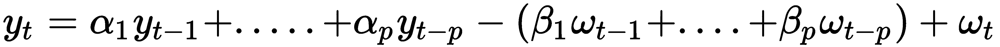

方程的第一部分(在 *-* 符号之前)是自回归段，第二部分(在 *-* 符号之后)是 MA 段。

我们还可以在 ARIMA 添加一个季节成分，这将是 ARIMA *(p，d，q)(p，d，q) [s]* 。在添加它时，我们需要执行季节差异，这意味着从季节滞后中减去当前观测值。

为了找出参数 *p* 和 *q* ，我们绘制 ACF 和 PACF。

这里，我们将 lag 的数量设为 20，并使用`statsmodel.tsa.stattools `库来导入`acf`和`pacf`函数，如下所示:

```
from statsmodels.tsa.stattools import acf,pacf
lag_acf= acf(ts_log_dif,nlags=20)
lag_pacf = pacf(ts_log_dif, nlags=20,method="ols")
```

现在我们将使用以下代码在`matplotlib`的帮助下绘图:

```

plt.subplot(121) 
plt.plot(lag_acf)
plt.axhline(y=0,linestyle='--',color='gray')
plt.axhline(y=-1.96/np.sqrt(len(ts_log_diff)),linestyle='--',color='gray')
plt.axhline(y=1.96/np.sqrt(len(ts_log_diff)),linestyle='--',color='gray')
plt.title('Autocorrelation Function')
```

输出如下所示:

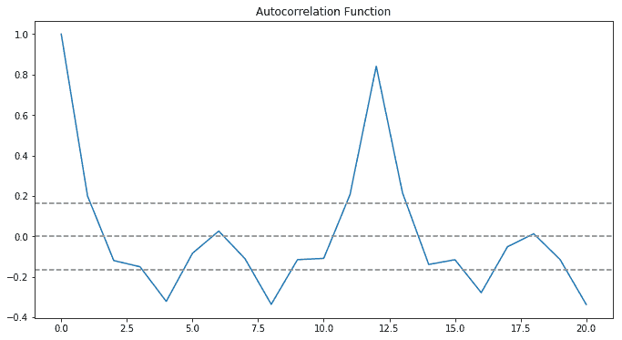

这里，我们测量的是时间序列与其自身的滞后版本之间的相关性。例如，在滞后 5 时，ACF 会将时刻 *t1* 、 *t2* 的序列与时刻 *t [1-5]* 、 *…* 、 *t [2-5]* 的序列进行比较。它是相关系数与其滞后值的关系图。

如果我们仔细观察前面的图，我们会发现在滞后 2 时已经越过了置信水平上线。因此，MA 的顺序为 *2* 和 *q=2* 。

绘制了序列和滞后值之间的偏相关，并给出了一个**偏相关泛函** ( **PACF** )图。这是一个非常有趣的术语。如果我们继续计算一个 *Y* 变量和 *X* 3 之间的相关性，同时我们知道 *Y* 与 *X* 1 和 *X* 2 具有分离关联，那么偏相关解决了不能用它们与 *X* 1 和 *X* 2 的相关性来解释的那部分相关性。

这里，偏相关是平方根(通过增加一个变量(这里， *X* 3)同时对其他变量(这里， *X* 1， *X* 2)回归 *Y* 来减少方差)。

在时间序列的情况下，Y 和滞后值 Y [t-3] 之间的偏相关将是不能用 *Y* 和*Y*[T51-1]和*Y*[t-2]之间的相关性来解释的值，如下面的代码所示:

```
#Plot PACF:
plt.subplot(122)
plt.plot(lag_pacf)
plt.axhline(y=0,linestyle='--',color='gray')
plt.axhline(y=-1.96/np.sqrt(len(ts_log_diff)),linestyle='--',color='gray')
plt.axhline(y=1.96/np.sqrt(len(ts_log_diff)),linestyle='--',color='gray')
plt.title('Partial Autocorrelation Function')
plt.tight_layout()
```

我们将获得以下输出:

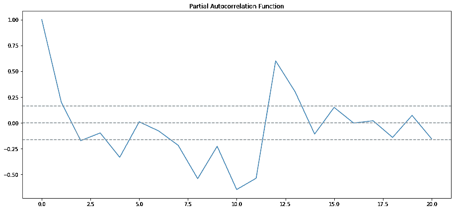

如果我们仔细观察前面的图，我们会发现在滞后 2 时已经越过了置信水平上线。因此，AR 的顺序将是 2 并且 *p=2* 。

让我们尝试一个阶数为 *(p=2，d=1，q=0)* 的 AR 模型。 *d* 值被取为 1，因为它是单次差分的情况。还计算了平方的残差和，以判断模型的好坏并将其与其他模型进行比较，如以下代码所示:

```
from statsmodels.tsa.arima_model import ARIMA
model1 = ARIMA(ts_log, order=(2, 1, 0)) 
results_AR = model1.fit(disp=-1) 
plt.plot(ts_log_dif)
plt.plot(results_AR.fittedvalues, color='red')
plt.title('RSS: %.4f'% sum((results_AR.fittedvalues-ts_log_dif)**2))
```

输出如下所示:


现在，我们可以使用以下代码查看描述 AR1 和 AR2 系数的模型摘要:

```
results_AR.summary()
```

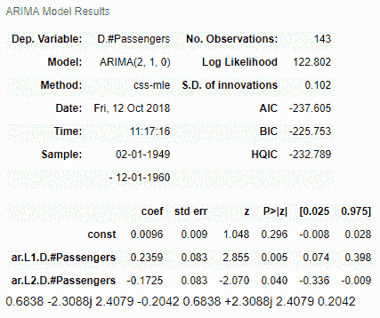

现在，让我们使用以下代码构建一个顺序为 *(p=0，d=1，q=2)* 的 MA 模型:

```
model2 = ARIMA(ts_log, order=(0, 1, 2)) 
results_MA = model2.fit(disp=-1) 
plt.plot(ts_log_dif)
plt.plot(results_MA.fittedvalues, color='red')
plt.title('RSS: %.4f'% sum((results_MA.fittedvalues-ts_log_dif)**2))
```

输出如下所示:

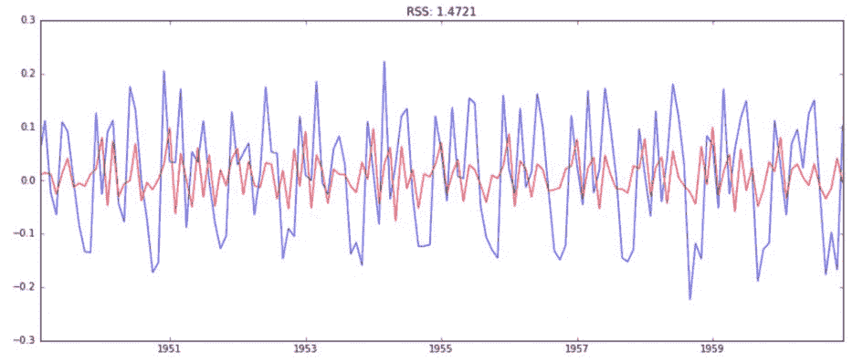

现在，让我们结合这两个模型，使用以下代码构建一个 ARIMA 模型:

```
model3 = ARIMA(ts_log, order=(2, 1, 2))  

results_ARIMA = model.fit(disp=-1)  

plt.plot(ts_log_dif)

plt.plot(results_ARIMA.fittedvalues, color='red')

plt.title('RSS: %.4f'% sum((results_ARIMA.fittedvalues-ts_log_dif)**2))
```

输出如下所示:

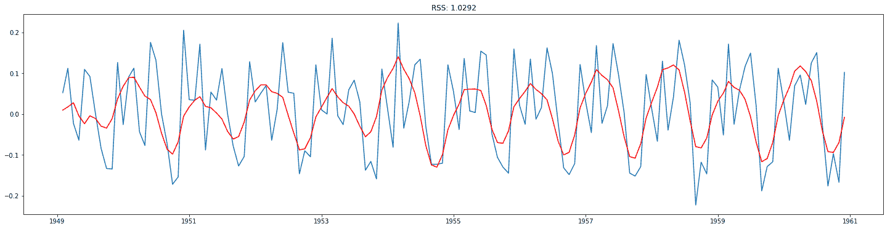

从 AR 模型到 ARIMA，我们可以体验到 RSS 价值的下降。现在 **RSS= 1.0292** :

```
results_ARIMA.summary()
```

我们可以看到 AR1、AR2、MA1 和 MA2 的系数，并且，如果我们通过 *p* 值，我们可以看到所有这些参数都很重要，如下面的屏幕截图所示:

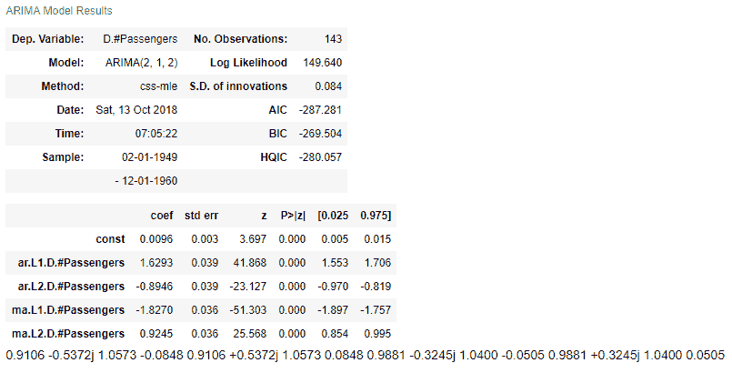

让我们使用以下代码将预测值转换成一个序列:

```
predictions_ARIMA_dif= pd.Series(results_ARIMA.fittedvalues, copy=True)
print(predictions_ARIMA_dif.head())
```

我们将获得以下输出:

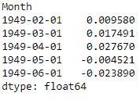

将差值转换成对数标度的方法是将这些差值连续地加到基数上。一个简单的方法是首先确定指数的累积和，然后将它加到基数上。使用以下代码可以找到累积和:

```
predictions_ARIMA_dif_cumsum = predictions_ARIMA_dif.cumsum()
print(predictions_ARIMA_dif_cumsum.head())
```

由此，我们将获得以下输出:

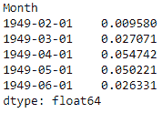

我们将创建一个以所有值为基数的序列，并将差值添加到该序列中，以便添加到基序列中，如下所示:

```
predictions_ARIMA_log = pd.Series(ts_log.ix[0], index=ts_log.index)
predictions_ARIMA_log = predictions_ARIMA_log.add(predictions_ARIMA_dif_cumsum,fill_value=0)
predictions_ARIMA_log.head()
```

下面显示了输出:

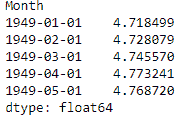

现在让我们使用以下代码来查找预测:

```
predictions_ARIMA = np.exp(predictions_ARIMA_log)
plt.plot(ts)
plt.plot(predictions_ARIMA)
plt.title('RMSE: %.4f'% np.sqrt(sum((predictions_ARIMA-ts)**2)/len(ts)))
```

输出如下所示:


# 参数优化

让我们看看如何优化模型的参数。


# AR 模型

```
import statsmodels.tsa.api as smtsa
aic=[] 
for ari in range(1, 3): 
 obj_arima = smtsa.ARIMA(ts_log_diff, order=(ari,2,0)).fit(maxlag=30, method='mle', trend='nc') 
 aic.append([ari,2,0, obj_arima.aic])
print(aic)
[[1, 2, 0, -76.46506473849644], [2, 2, 0, -116.1112196485397]]
```

因此，在 AR 模型的这个场景中，我们的模型参数是`p=2`、`d=2`和`q=0`，因为这个组合的 AIC 最小。


# ARIMA 模型

即使对于 ARIMA 模型，我们也可以通过使用以下代码来优化参数:

```
import statsmodels.tsa.api as smtsa
aic=[] 
for ari in range(1, 3): 
     for maj in range(1,3): 
        arima_obj = smtsa.ARIMA(ts_log, order=(ari,1,maj)).fit(maxlag=30, method='mle', trend='nc') 
        aic.append([ari,1, maj, arima_obj.aic])
print(aic)
```

以下是通过执行上述代码获得的输出:

```
[[1, 1, 1, -242.6262079840165], [1, 1, 2, -248.8648292320533], [2, 1, 1, -251.46351037666676], [2, 1, 2, -279.96951163008583]]
```

应该选择具有最少**阿凯克信息准则** ( **AIC** )的组合。


# 异常检测

异常本质上是一系列异常模式，是对预期行为的不规则偏离。例如，我们很多人都看过板球比赛。在这项运动中，出局的一种形式是被接住，在球直接传到守场员手中之前，它必须碰到击球手的球棒。如果球场很吵，有时候谁都很难判断球有没有碰到球棒。为了解决这个问题，裁判使用一种叫做**嗅觉仪**的设备来帮助他们判断。snickometer 使用来自残端麦克风的声音来生成麦克风声音的曲线图。如果图是一条直线，那么球没有与球棒接触；否则，该图将显示尖峰。因此，峰值是异常的标志。异常的另一个例子可以是在扫描中检测到恶性肿瘤。

异常检测是一种我们可以用来找出异常行为的技术。异常也可以称为**异常值**。以下列表显示了几种不同的异常情况:

*   **点异常**:点异常是指超出阈值边界的点，该阈值已被指定用于检查整个系统。通常有一个适当的系统在这个边界被异常点突破时发出警报。例如，金融行业中的欺诈检测可以使用点异常检测来检查交易是否发生在持卡人通常所在的不同城市。
*   **上下文异常**:特定于上下文的观察被称为**上下文异常**。例如，平日里交通繁忙是很平常的事，但是如果假日是在星期一，那就显得不正常了。
*   **集体异常**:一组集体数据实例有助于检测异常。假设有人意外地试图将数据从远程机器复制到本地主机。在这种情况下，这种异常将被标记为潜在的网络攻击。

在本节中，我们将重点关注上下文异常，并尝试借助简单的移动平均线来检测它们。

首先，让我们加载所有需要的库，如下所示:

```
import numpy as np # vectors and matrices
import pandas as pd # tables and data manipulations
import matplotlib.pyplot as plt # plots
import seaborn as sns # more plots
from sklearn.metrics import mean_absolute_error
import warnings # `do not disturb` mode
warnings.filterwarnings('ignore')
%matplotlib inline
```

接下来，我们使用下面的代码读取数据集。我们保留相同的数据集，即`AirPassenger.csv`:

```
data = pd.read_csv('AirPassengers.csv', index_col=['Month'], parse_dates=['Month'])
 plt.figure(figsize=(20, 10))
 plt.plot(ads)
 plt.title('Trend')
 plt.grid(True)
 plt.show()
```

我们得到如下输出:

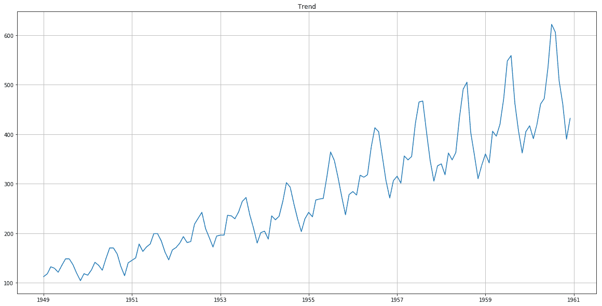

现在，我们将编写一个函数，并使用以下代码创建一个用于检测异常的阈值:

```
def plotMovingAverage(series, window, plot_intervals=False, scale=1.96, plot_anomalies=False):
       rolling_mean = series.rolling(window=window).mean()
       plt.figure(figsize=(15,5))
       plt.title("Moving average\n window size = {}".format(window))
       plt.plot(rolling_mean, "g", label="Rolling mean trend")
      # Plot confidence intervals for smoothed values
      if plot_intervals:
          mae = mean_absolute_error(series[window:], rolling_mean[window:])
          deviation = np.std(series[window:] - rolling_mean[window:])
          lower_bond = rolling_mean - (mae + scale * deviation)
          upper_bond = rolling_mean + (mae + scale * deviation)
          plt.plot(upper_bond, "r--", label="Upper Bond / Lower Bond")
          plt.plot(lower_bond, "r--") 
 # Having the intervals, find abnormal values
      if plot_anomalies:
         anomalies = pd.DataFrame(index=series.index, columns=series.columns)
         anomalies[series<lower_bond] = series[series<lower_bond]
         anomalies[series>upper_bond] = series[series>upper_bond]
         plt.plot(anomalies, "ro", markersize=10) 
         plt.plot(series[window:], label="Actual values")
         plt.legend(loc="upper left")
         plt.grid(True)
```

现在，让我们使用以下内容将异常引入到系列中:

```
data_anomaly = data.copy()
data_anomaly.iloc[-20] = data_anomaly.iloc[-20] * 0.2
```

现在，让我们绘制它来检测使用以下代码引入的异常:

```
plotMovingAverage(data_anomaly, 4, plot_intervals=True, plot_anomalies=True)
```

下图显示了输出:

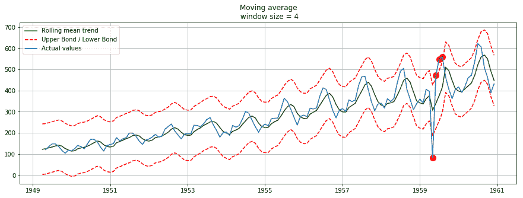

现在，引入的异常现象可以被视为 1959 年后游客数量的下降。然而，应该注意的是，这是较简单的方法之一。ARIMA 和霍尔特-温特斯也可以用在这种情况下。


# 摘要

在这一章中，我们学习了时间序列分析和白噪声。我们学习了随机游走、自回归、自相关和平稳性的概念，这些概念描述了如何判断数据是否平稳。

我们还学习了差分，获取时间序列数据并计算连续观察值之间的差异，从而形成新的序列。本章还谈到了 AR 模型，它是随机过程的一部分，其中将特定的滞后值*y**[t]**用作预测变量，并在 *y* *[t]* 上进行回归，以估计这些值。我们还学习了两个优化参数，即 AR 模型和 ARIMA 模型。*

 *在下一章，我们将学习自然语言处理。****