# 六、自然语言处理

世界变化的速度有多快？嗯，技术和数据一直在快速变化。随着互联网和社交媒体的出现，我们对数据的整个看法已经改变。最初，大多数数据分析的范围都围绕着结构化数据。然而，由于如此多的非结构化数据通过互联网和社交媒体涌入，分析的范围已经扩大。每秒钟都会产生大量的文本数据、图像、声音和视频数据。它们包含大量需要为业务而综合的信息。自然语言处理是一种技术，通过它我们使机器能够理解文本或语音。虽然非结构化数据的范围很广，但本章的范围是让你接触文本分析。

结构化数据通常由关系数据库或电子表格中设置的固定观察值和固定列组成，而非结构化数据没有任何结构，也不能在关系数据库中设置；相反，它需要一个 NoSQL 数据库，例如，视频，文本等等。

在本章中，您将了解以下主题:

*   文档术语矩阵
*   看待文本的不同方法
*   情感分析
*   主题建模
*   贝叶斯技术


# 文本语料库

文本语料库是由单个文档或一组文档构成的文本数据，可以来自任何语言，如英语、德语、印地语等。在当今世界，大多数文本数据来自社交媒体，如脸书、Twitter、博客网站和其他平台。移动应用现在已被添加到此类来源的列表中。更大规模的语料库被称为**语料库，**使得分析更加准确。


# 句子

一个语料库可以被分成单元，这些单元被称为**句**。一旦我们将句子组合在一起，它们就掌握了语料库的含义和上下文。造句是在词类的帮助下进行的。每个句子都用一个分隔符与其他句子隔开，比如句号，我们可以利用它来进一步分割。这叫做**句子标记化**。


# 话

单词是语料库的最小单位，当我们按照词性排列单词时，单词就形成了句子的形状。当我们把句子分解成单词的时候，叫做**单词标记化**。


# 一大堆单词

当我们将文本作为输入数据时，我们不能继续使用原始文本。因此，必须将文本输入数据转换成数字或数字向量，以便可用于多种算法。

单词袋模型是使文本可用于算法的方法之一。本质上，它是对文档中出现的单词起作用的文本的表示。它与结构、顺序和位置无关；这个模型只寻找单词的计数作为特征。

这个模型背后的思想过程是，拥有相似的内容意味着拥有相似的文档。

单词袋模型中要采取的不同步骤如下:

*   **建立语料库**:在这个步骤中，文档被收集并组合在一起以形成语料库。例如，电视剧《老友记》中的著名歌曲在这里被用作语料库:

*我会在那里等你
当大雨倾盆而下
我会在那里等你
就像以前一样
我会在那里等你*

让我们把这首歌的每一行都看作一个单独的文档。

*   **词汇构建**:在这一步中，我们找出语料库中的独特单词，并创建一个列表:
    *   我
    *   将
    *   是
    *   在那里
    *   为
    *   你们
    *   当...的时候
    *   这
    *   雨
    *   开始
    *   到
    *   倾泻
    *   喜欢
    *   有
    *   be 的过去分词
    *   以前
*   **文档向量创建**:现在，是时候将文本的每个文档转换成向量了。

实现这一点的简单方法是通过布尔路由。这意味着原始文本将借助于该文本在相应文档中的存在/不存在而被转换成文档向量。

例如，如果歌曲的第一行被转换成包含 *I will be there for you* 的文档，那么文档向量将如下所示:

|  | **文件向量** |
| 我 | 一 |
| 将 | 一 |
| 是 | 一 |
| 在那里 | 一 |
| 为 | 一 |
| 你们 | 一 |
| 当...的时候 | 0 |
| 这 | 0 |
| 雨 | 0 |
| 开始 | 0 |
| 到 | 0 |
| 倾泻 | 0 |
| 喜欢 | 0 |
| 有 | 0 |
| be 的过去分词 | 0 |
| 以前 | 0 |

文档中出现的所有单词都标记为 1，其余的标记为 0。

因此，第一句的文档向量是*【1，1，1，1，1，0，0，0，0，0，0，0，0，0，0】*。

同样，第二句的文档向量是*【0，0，0，0，0，1，1，1，1，1，0，0，0，0】*。

随着语料库规模的不断增加，文档向量中零的数量也会增加。其结果是，它在向量中引入了稀疏性，成为一个稀疏向量。对于各种算法来说，计算稀疏向量变得非常具有挑战性。在某种程度上，数据清理是应对这一问题的方法之一:

*   **清理文本**:这将涉及到把所有的语料库转换成一个单独的格(大写(最好)或小写)。标点符号必须从语料库中删除。词干化，即找到文本的词根，可以被合并，并将能够减少语料库中的独特词。此外，删除停用词，如*是*和的*，可能能够减轻稀疏的痛苦。*

*   **Count vector** :还有一种方法可以创建文档向量，借助于文档中出现的单词的频率。假设有一个由 N 个文档组成的语料库，并且已经提取了 T 个标记(单词)。这些测试标记将构成我们词典。因此，计数向量矩阵的维数将变成 N×t。每一行包含组成字典的相应文档中的记号(单词)的频率。

例如，假设我们有三个文档:

*   **N1** :计数向量中有计数
*   **N2** :计数向量是否优于创建特征向量的布尔方式？
*   **N3** :特征向量的创建非常重要

移除`stopwords`后，计数向量矩阵如下表所示:

|  | **计数** | **矢量** | **拿到了** | **它** | **更好的** | **比** | **布尔型** | **方式** | **创建** | **功能** | **创作** | **重要** |
| N1 | 2 | 一 | 一 | 一 | 0 | 0 | 0 | 0 | 0 | 0 | 0 | 0 |
| N2 | 一 | 2 | 0 | 0 | 一 | 一 | 一 | 一 | 一 | 一 | 0 | 0 |
| N3 | 0 | 一 | 0 | 0 | 0 | 0 | 0 | 0 | 0 | 一 | 一 | 一 |

现在，仔细看看矩阵维数；因为 *N=3* 和 *T=12* ，所以这是一个 3×12 的矩阵。

我们将看看矩阵的形成是如何发生的。对于文档 N1，计数在其中出现的次数是 2，向量出现的次数是 1，依此类推。取这些频率，我们输入这些值。另外两份文件也完成了类似的程序。

然而，这有一个缺点。一个高频词可能开始支配文档和语料库，这将导致从特征中提取出有限的信息。为了解决这个问题，**术语频率逆文档频率** ( **TF-IDF** )被引入。


# TF-IDF

我们知道计数向量化的局限性，即一个高频词可能会破坏聚会。因此，我们的想法是通过为出现在大多数文档中的频繁出现的单词分配较低的权重并增加出现在文档子集中的单词的权重来惩罚它们。这是 TF-IDF 工作的原则。

TF-IDF 是术语对于文档和整个语料库(文档集合)的重要程度的度量:

*TF-IDF(期限)= TF(期限)* IDF(期限)*

**词频** ( **TF** )是该词在同一文档的所有词中出现的频率。例如，如果一个文档中有 1000 个单词，我们必须找出在该文档中出现了 50 次的单词 *NLP* 的 *TF* ，我们使用下面的语句:

*TF(NLP)= 50/1000=0.05*

因此，我们可以得出以下结论:

*TF(term) =术语在文档中出现的次数/文档中的总术语数*

在前面的例子中，由三个文档组成， *N1* 、 *N2* 和 *N3* ，如果需要找到文档 *N1* 中术语*计数*的 *TF* ，结果如下:

*TF(计数)N1= 2/ (2+1+1+1) = 2/5 = 0.4*

它表示单词对文档的贡献。

然而，IDF 是该术语对整个语料库的重要性的一个指标:

*IDF("count") = log(文档总数/包含术语" count "的文档数)*

*IDF("计数")= log(3/2)= 0.17*

现在，让我们计算项*矢量*的 IDF:

*IDF(" vector ")= log(3/3)= 0*

我们如何解读这一点？这意味着如果同一个单词出现在所有的文档中，那么它与特定的文档无关。但是，如果这个单词只出现在文档的一个子集中，这意味着它与它所在的那些文档有一定的相关性。

让我们为*计数*和*向量*计算 TF-IDF，如下所示:

*文件 N1 的 TF-IDF(计数)= TF(计数)*IDF(计数)= 0.4 * 0.17 = 0.068*

*文档 N1 的 TF-IDF(向量)= TF(向量)* IDF(向量)= (1/5)*0 = 0*

很明显，由于它给 *N1* 中的*计数*分配了更多的权重，所以它比*向量*更重要。权重值越高，该术语越罕见。重量越小，该术语越常见。搜索引擎利用 TF-IDF 来检索与查询相关的文档。

现在，我们将看看如何在 Python 中执行计数矢量器和 TF-IDF 矢量器。


# 执行计数矢量器

以下是执行`CountVectorizer`的步骤:

1.  导入计数矢量器所需的库:

```
from sklearn.feature_extraction.text import CountVectorizer
```

2.  列出课文清单:

```
text = [" Machine translation automatically translate text from one human language to another text"]
```

3.  标记文本列表并建立词汇:

```
vectorizer.fit(text)
```

您将获得以下输出:

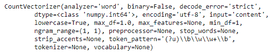

4.  让我们来看看创造出来的词汇:

```
print(vectorizer.vocabulary_)
```

我们得到以下输出:

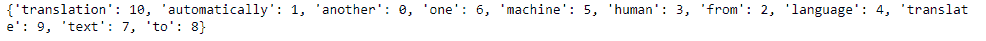

5.  现在，我们必须对它进行编码，如下所示:

```
vector = vectorizer.transform(text)
```

6.  让我们对向量进行总结，并找出矩阵项:

```
print(type(vector))
print(vector.toarray())
```

我们得到以下输出:

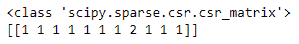


# 在 Python 中执行 TF-IDF

以下是在 Python 中执行 TF-IDF 的步骤:

1.  导入库，如下所示:

```
from sklearn.feature_extraction.text import TfidfVectorizer
```

2.  让我们通过添加四个文档来制作一个语料库，如下所示:

```
corpus = ['First document', 'Second document','Third document','First and second document' ]
```

3.  让我们设置矢量器:

```
vectorizer = TfidfVectorizer()
```

4.  我们从文本中提取特征如下:

```
X = vectorizer.fit_transform(corpus)
print(vectorizer.get_feature_names())
print(X.shape)
```

输出如下所示:

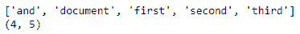

5.  文档术语矩阵来了；每个列表都表示一个文档:

```
X.toarray()
```

我们得到以下输出:

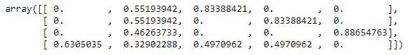

情感分析

情感分析是自然语言处理的应用领域之一。它被广泛应用于各个行业和领域，行业内对它有很大的需求。每个组织都致力于关注客户及其需求。因此，要了解声音和情绪，客户是首要目标，因为了解客户的脉搏会带来收入。如今，顾客通过推特、脸书或博客来表达他们的观点。需要做一些工作来提炼文本数据，并使其可消费。让我们看看如何在 Python 中实现它。


# 这里，影迷们的言辞来自 IMDB。GitHub 上也分享了这个。

我们将启动这些库，如下所示:

我们将加载数据集，如下所示:

现在，让我们探索数据及其维度:

```
import numpy as np
 import pandas as pd
 import seaborn as sns
 import matplotlib.pyplot as plt
 sns.set(color_codes=True)
 import os
 print(os.listdir())
```

我们得到以下输出:

```
data= pd.read_csv("imdb_master.csv",encoding = "ISO-8859-1")
```

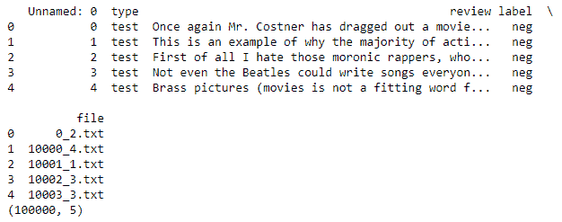

```
print(data.head())
print(data.shape)
```

我们只需要两个变量`review`和`label`来建立模型。我们将把它们都保存在数据中。新的数据帧已创建，如下所示:

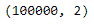

现在，这是我们需要检查`label`中有多少类别的步骤，因为我们只对保留积极和消极的类别感兴趣:

```
Newdata= data[["review","label"]]
Newdata.shape
```

输出如下所示:

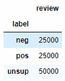

```
g= Newdata.groupby("label")
g.count()
```

现在，很明显有三个类别，我们将去掉`unsup`，如下所示:

我们得到以下输出:

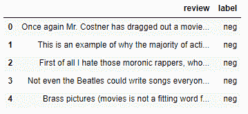

```
sent=["neg","pos"]

Newdata = Newdata[Newdata.label.isin(sent)]
Newdata.head()
```

We get the following output:

我们的数据现在已经建立。但是，由于我们去掉了几行，我们将重置数据的索引，因为这有时会导致一些问题:

输出如下所示:


```
print(len(Newdata))
Newdata=Newdata.reset_index(drop=True) Newdata.head()
```

我们受够了。现在，我们将对`label`变量进行编码，以使其可用于机器学习模型。为此，我们必须使用`LabelEncode`，如下所示:

我们必须清理部分数据，以使其干净和标准，如下所示:

输出如下所示:

```
from sklearn.preprocessing import LabelEncoder
 labelencoder = LabelEncoder()
 Newdata["label"] = labelencoder.fit_transform(Newdata["label"])
```

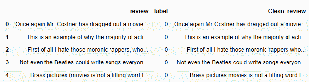

```
Newdata["Clean_review"]= Newdata['review'].str.replace("[^a-zA-Z#]", " ")

Newdata.head()
```

这里，我们试图去掉长度小于`3`的单词，因为大多数长度小于`3`的单词对意思没有太大影响:

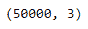

现在可以进行数据的令牌化，如下所示:

```
Newdata['Clean_review'] = Newdata['Clean_review'].apply(lambda x: ' '.join([w for w in x.split() if len(w)>3]))
 Newdata.shape
```

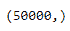

我们正在利用词干，以消除相同单词的不同变体。例如，我们将按如下方式查看满意、满足和满意:

```
tokenized_data = Newdata['Clean_review'].apply(lambda x: x.split())
 tokenized_data.shape
```

输出如下所示:

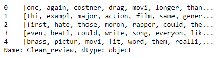

```
from nltk.stem.porter import *
 stemmer = PorterStemmer()
 tokenized_data = tokenized_data.apply(lambda x: [stemmer.stem(i) for i in x])
 tokenized_data.head()
```

词干提取之后，我们必须将数据连接回来，因为我们正朝着生成单词云的方向前进:

我们得到以下输出:

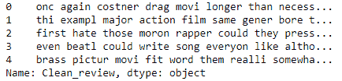

```
for i in range(len(tokenized_data)):
 tokenized_data[i] = ' '.join(tokenized_data[i])

tokenized_data.head()
```

这里，标记化的数据已经与旧的`Newdata`数据帧结合在一起:

以下是上述代码的输出:

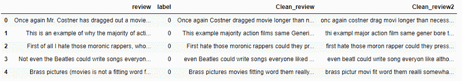

```
Newdata["Clean_review2"]= tokenized_data
 Newdata.head()
```

将所有单词组合在一起的单词云已经产生:

输出如下所示:

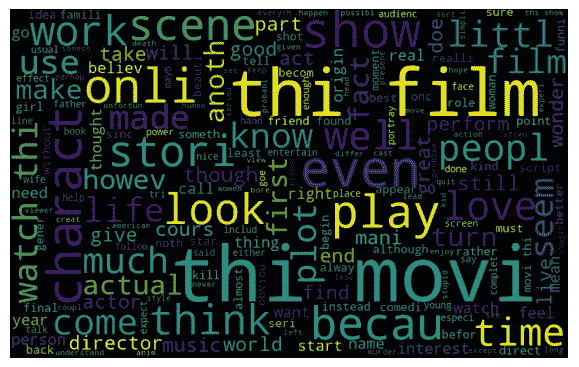

```
all_words = ' '.join([str(text) for text in Newdata['Clean_review2']])
 from wordcloud import WordCloud
 wordcloud = WordCloud(width=800, height=500, random_state=21, max_font_size=110).generate(all_words)
 plt.figure(figsize=(10, 7))
 plt.imshow(wordcloud, interpolation="bilinear")
 plt.axis('off')
 plt.show()
```

The output can be seen as follows:


现在，我们将分别为消极情绪和积极情绪制作一个词云，如下所示:

对于`Negative`情绪，我们将使用以下内容:

下面的输出显示了`Negative`情绪的单词云:

*   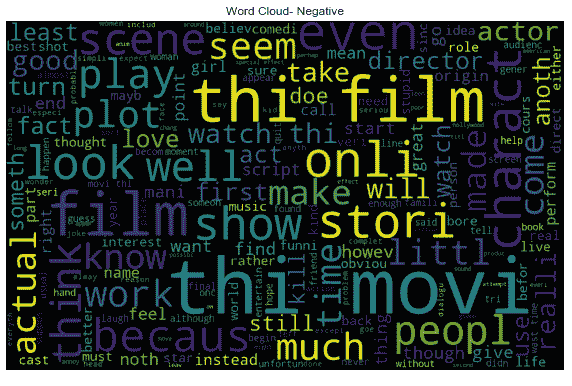

```
Negative =' '.join([text for text in Newdata['Clean_review2'][Newdata['label'] == 0]])
 wordcloud1= WordCloud(width=800, height=500, random_state=21, max_font_size=110).generate(Negative)
 plt.figure(figsize=(10, 7))
 plt.imshow(wordcloud1, interpolation="bilinear")
 plt.title("Word Cloud- Negative")
 plt.axis('off')
 plt.show()
```

我们将使用以下内容来表达`Positive`情感:

以下输出显示了`Positive`情绪的词云:

*   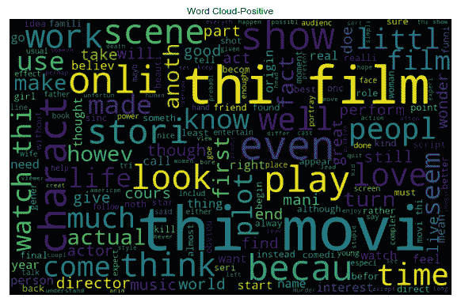

```
Positive=' '.join([text for text in Newdata['Clean_review2'][Newdata['label'] == 1]])
 wordcloud2 = WordCloud(width=800, height=500, random_state=21, max_font_size=110).generate(Positive)
 plt.figure(figsize=(10, 7))
 plt.imshow(wordcloud, interpolation="bilinear")
 plt.title("Word Cloud-Positive")
 plt.axis('off')
 plt.show()
```

情感分类

我们将采用两种方法进行情感分类(正面和负面)，如下所示:


# TF-IDF

计数矢量化

*   让我们看看哪个给我们更好的结果。
*   TF-IDF 特征提取

以下代码将为我们提供 TF-IDF 特征提取:


# 我们将获得以下输出:

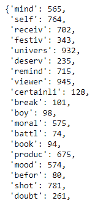

```
from sklearn.feature_extraction.text import TfidfVectorizer
tfidf= TfidfVectorizer(max_df=0.9,min_df= 2, max_features=1000,
                        stop_words="english")
tfidfV = tfidf.fit_transform(Newdata['Clean_review2'])

tfidf.vocabulary_
```

单词特征提取的计数向量机包

以下代码将显示一袋单词的计数矢量器:


# 模型构建计数矢量化

对于构建计数矢量化，我们可以将数据分为训练和测试数据集，如下所示:

```
from sklearn.feature_extraction.text import CountVectorizer
 bow_vectorizer = CountVectorizer(max_df=0.90, min_df=2, max_features=1000, stop_words='english')
 # bag-of-words
 bow = bow_vectorizer.fit_transform(Newdata['Clean_review2'])
```


# 我们得到以下输出:

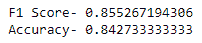

```
from sklearn.linear_model import LogisticRegression
 from sklearn.model_selection import train_test_split
 from sklearn.metrics import f1_score,accuracy_score
 # splitting data into training and validation set
 xtrain, xtest, ytrain, ytest = train_test_split(bow, Newdata['label'], random_state=42, test_size=0.3)
 lreg = LogisticRegression()
 lreg.fit(xtrain, ytrain) # training the model
 prediction = lreg.predict_proba(xtest) # predicting on the validation set
 prediction_int = prediction[:,1] >= 0.3 # if prediction is greater than or equal to 0.3 than 1 else 0
 prediction_int = prediction_int.astype(np.int)
 print("F1 Score-",f1_score(ytest, prediction_int))
 print("Accuracy-",accuracy_score(ytest,prediction_int))
```

在这里，我们达到了 84%的准确率。让我们看看 TF-IDF 方法的效果如何:

输出如下所示:

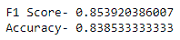

```
from sklearn.linear_model import LogisticRegression
 # splitting data into training and validation set
 xtraintf, xtesttf, ytraintf, ytesttf = train_test_split(tfidfV, Newdata['label'], random_state=42, test_size=0.3)
 lreg = LogisticRegression()
 lreg.fit(xtraintf, ytraintf) # training the model
 prediction = lreg.predict_proba(xtesttf) # predicting on the test set
 prediction_int = prediction[:,1] >= 0.3 # if prediction is greater than or equal to 0.3 than 1 else 0
 prediction_int = prediction_int.astype(np.int)
 print("F1 Score-",f1_score(ytest, prediction_int))
 print("Accuracy-",accuracy_score(ytest,prediction_int))
```

在这里，准确率为 83.8%(比计数矢量器略低)。

这就完成了情感分类模型的构建。

主题建模

建模是一种方法，用于识别主题并导出文本语料库显示的隐藏模式。主题建模类似于聚类，因为我们提供主题的数量作为超参数(类似于聚类中使用的参数)，这恰好是聚类的数量(k-means)。通过这种方式，我们试图提取出主题或文本的数量，这些主题或文本被赋予了一定的权重。


# 建模的应用在于文档聚类、降维、信息检索和特征选择领域。

执行此操作有多种方式，如下所示:

**潜在狄利克雷分配** ( **LDA** ):基于概率图模型

**潜在语义分析** ( **LSA** ):它作用于线性代数(奇异值分解)

*   **非负矩阵分解**:基于线性代数
*   我们将主要讨论 LDA，它被认为是最受欢迎的。
*   LDA 是一种矩阵分解技术，它的工作原理是假设文档是由许多主题构成的，而主题又是由单词构成的。

阅读了前面的章节后，您应该知道任何语料库都可以表示为一个文档术语矩阵。下面的矩阵显示了一个由 **M** 个文档组成的语料库和一个由 **N** 个单词组成的**M×N 矩阵**。该矩阵中的所有单元格都具有该特定文档中单词的频率:

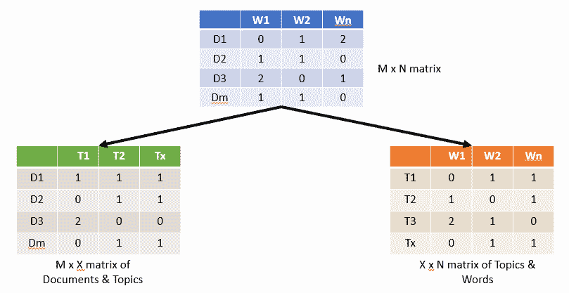

这个 **M x N 矩阵的文档&单词**被 LDA 翻译成两个矩阵: **M x X 矩阵的文档&主题**和 **X x N 矩阵的主题&单词**。


This **M x N matrix of Document & Words** gets translated into two matrices by LDA: **M x X matrix of Documents & Topics** and **X x N matrix of Topics & Words**.

LDA 架构

在 LDA 架构中，有 M 个具有 N 个单词的文档，它们通过称为 **LDA** 的黑条进行处理。它传递带有**单词簇**的 **X 主题**。每个主题都有主题外单词的 psi 分布。最后，它还提出了文档中主题的分布，用 phi 表示。


# 下图说明了 LDA:

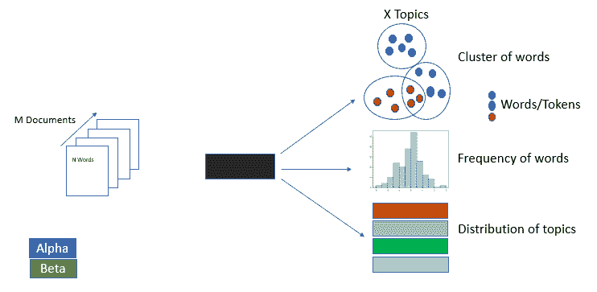

关于 **Alpha** 和 **Beta** 超参数:Alpha 代表文档-主题集中度，Beta 代表主题-词集中度。alpha 值越高，我们从文档中获得的主题就越多。另一方面，beta 值越高，一个题目的字数越多。这些可以根据领域知识进行调整。

LDA 遍历每个文档的每个单词，并为其分配和调整主题。基于两个概率的乘积，新的主题 *X* 被分配给它: *p1=(主题 t/文档 d)，*表示分配给主题 t 的文档单词的比例， *p2=(单词 w/主题 t)，*表示在所有文档中分配给主题 *t* 的比例，其具有与之关联的单词 w。

随着通过次数的增加，主题词和主题文档得到了良好的分布。

让我们看看它是如何在 Python 中执行的:

在这一步中，我们正在加载来自`sklearn`的`dataset = fetch_20newsgroups`:

在这一步中，我们将清理数据集。为此，需要`stopwords`和`WordNetLemmatizer`功能。因此，必须加载相关的库，如下所示:

1.  确保您已经下载了以下词典:

```
from sklearn.datasets import fetch_20newsgroups
 dataset = fetch_20newsgroups(shuffle=True, random_state=1, remove=('headers', 'footers', 'quotes'))
 documents = dataset.data
```

2.  这里，创建了一个`clean`函数来将单词小写。移除`stopwords`并选择长度大于`3`的单词。此外，它使标点符号自由。最后，对其进行假设，如下所示:

```
from nltk.corpus import stopwords
from nltk.stem.wordnet import WordNetLemmatizer
import string
```

3.  现在，我们必须在`gensim`库的帮助下制作文档术语矩阵。该库还将使我们能够执行 LDA:

```
import nltk
nltk.download("stopwords")
nltk.download("wordnet")
```

4.  这里创建了基于一包单词的文档术语矩阵:

```
stop = set(stopwords.words('english'))
punc = set(string.punctuation)
lemma = WordNetLemmatizer()
def clean(doc):
     stopw_free = " ".join([i for i in doc.lower().split() if i not in stop and len(i)>3])
     punc_free = ''.join(ch for ch in stop_free if ch not in punc)
     lemmatized = " ".join(lemma.lemmatize(word) for word in punc_free.split())
     return lemmatized
 doc_clean = [clean(doc).split() for doc in documents]
```

5.  在 TF-IDF 的帮助下，正在创建一个类似的矩阵:

```
import gensim
from gensim import corpora
```

6.  让我们用 TF-IDF 矩阵建立模型。主题的数量已经被给定为`10`:

```
corpus = corpora.Dictionary(doc_clean)
 doc_term_matrix = [corpus.doc2bow(doc) for doc in doc_clean]
```

7.  我们来看看带字的题目:

```
from gensim import models
tfidf = models.TfidfModel(doc_term_matrix)
corpus_tfidf = tfidf[doc_term_matrix]
```

8.  输出如下所示:

```
lda_model1 = gensim.models.LdaMulticore(corpus_tfidf, num_topics=10, id2word=corpus, passes=2, workers=2)
```

9.  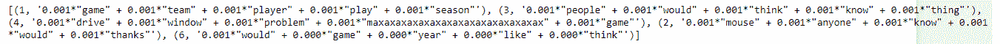

```
print(lda_model1.print_topics(num_topics=5, num_words=5))
```

对于单词袋，将进行类似的练习；稍后，我们将对其进行比较:

我们得到以下输出:

10.  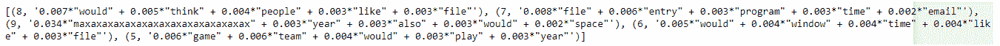

```
lda_model2 = gensim.models.LdaMulticore(doc_term_matrix, num_topics=10, id2word=corpus, passes=2, workers=2)

print(lda_model2.print_topics(num_topics=5, num_words=5))
```

评估模型

对数困惑度是衡量 LDA 模型好坏的一个标准。困惑值越低，模型越好:


# 日志困惑的输出如下:

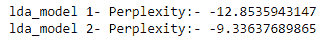

```
print("lda_model 1- Perplexity:-",lda_model.log_perplexity(corpus_tfidf))
print("lda_model 2- Perplexity:-",lda_model2.log_perplexity(doc_term_matrix))
```

可视化 LDA

为了可视化数据，我们可以使用下面的代码:


# 输出如下所示:

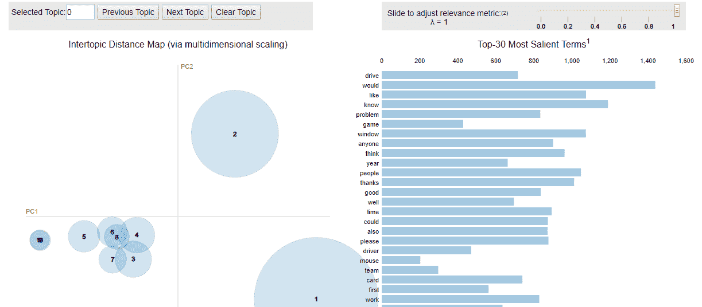

```
import pyLDAvis
import pyLDAvis.gensim
import matplotlib.pyplot as plt
%matplotlib inline

pyLDAvis.enable_notebook()
visual1= pyLDAvis.gensim.prepare(lda_model, doc_term_matrix, corpus)
visual1
```

我们可以在这里启用笔记本，如下所示:


We can enable the notebook here, as follows:

```
pyLDAvis.enable_notebook()
 visual2= pyLDAvis.gensim.prepare(lda_model2, doc_term_matrix, corpus)
 visual2
```

输出如下所示:

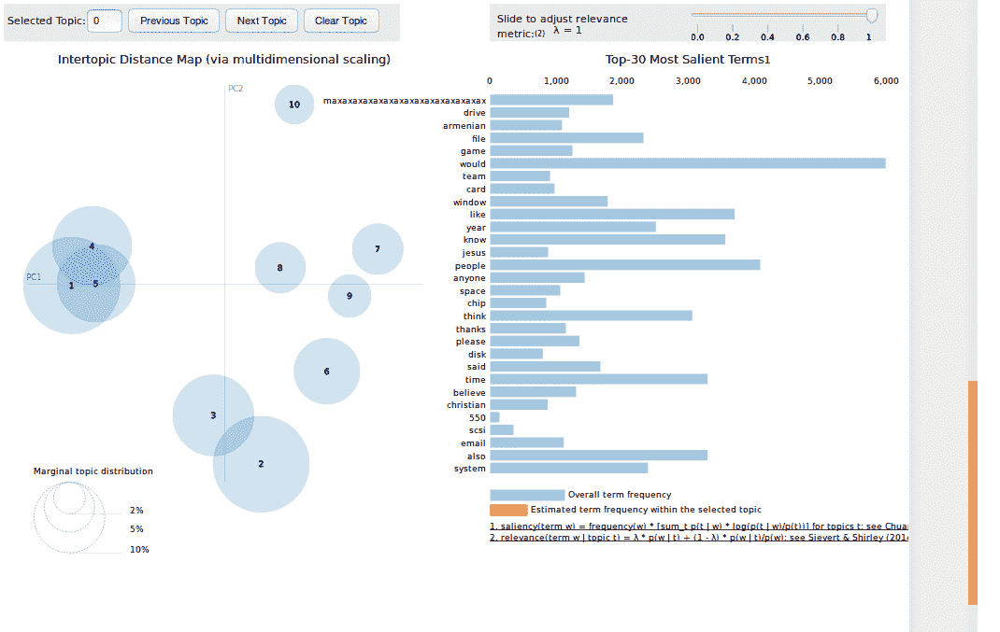

我们来试着解读一下这个。

左侧是主题，右侧是术语/词语:

更大的圈子意味着更频繁的话题。

相互重叠或相近的主题是相似的。

*   在选择主题时，可以看到所选主题的最有代表性的单词。这反映了这个词的使用频率。可以使用滑块切换每个属性的权重。
*   将鼠标悬停在某个主题上，将会在右侧提供该主题的单词贡献，单击该单词后，我们将会看到圆圈大小发生变化，这反映了该术语在该主题中的出现频率。
*   Upon selecting a topic, the most representative words for the selected topic can be seen. This reflects how frequent the word is. One can toggle the weight of each property by using the slider.
*   Hovering over a topic will provide the contribution of words to the topic on the right and upon clicking on the word, we will see the circle size changing, which reflects how frequent that term is in that topic.

文本分类中的朴素贝叶斯技术

朴素贝叶斯是一种基于贝叶斯定理的监督分类算法。这是一种概率算法。但是，你可能想知道为什么它被称为**幼稚**。之所以如此，是因为该算法基于所有特征相互独立的假设。然而，我们认识到这样一个事实，即在现实世界的场景中，特性的独立性可能不存在。例如，如果我们试图检测一封电子邮件是否是垃圾邮件，我们寻找的只是与垃圾邮件相关的关键字，如彩票、奖励等等。基于这些，我们从电子邮件中提取那些相关的特征，并且说如果给定垃圾邮件相关的特征，该电子邮件将被分类为垃圾邮件。


# 贝叶斯定理

给定一定的条件，贝叶斯定理帮助我们找到后验概率:


# *P(A|B)= P(B|A) * P(A)/P(B)*

*A* 和 *B* 可以分别作为目标和特征。

其中， *P(A|B)* :后验概率，暗示事件 *A* 的概率，假设 *B* 已经发生:

*P(B|A)* :在给定目标 *A* 的情况下，隐含特征 *B* 的概率的可能性

*P(A)* :目标的先验概率 *A*

*   *P(B)* :特征的先验概率 *B*
*   朴素贝叶斯分类器的工作原理
*   我们将通过泰坦尼克号的例子来理解这一切。当泰坦尼克号正在下沉时，就获救而言，有几个类别比其他类别优先。我们有以下数据集(它是一个 Kaggle 数据集):


# **人员类别**

**生存几率**

| 妇女 | 是 |
| 小孩 | 是 |
| 小孩 | 是 |
| 男人 | 不 |
| 妇女 | 是 |
| 妇女 | 是 |
| 男人 | 不 |
| 男人 | 是 |
| 小孩 | 是 |
| 妇女 | 不 |
| 小孩 | 不 |
| 妇女 | 不 |
| 男人 | 是 |
| 男人 | 不 |
| 妇女 | 是 |
| Woman | 现在，让我们为前面的信息准备一个可能性表: |

Now, let's prepare a likelihood table for the preceding information:

| **生存几率** |  | **Survival chance** |  |  |  |  |
| 不 | 是 | 总计 | Yes | Grand Total | 种类 | 小孩 |
| 一 | 3 | 四 | 4/15= | 0.27 | 男人 | 3 |
| 2 | 5 | 5/15= | 0.33 | 5/15= | 妇女 | 2 |
| 四 | 6 | 6/15= | 0.40 | 6/15= | 0.40 | 总计 |
| 6 | 9 | 15 | 9 | 15 |  |  |
| 6/15 | 9/15 | 6/15 | 9/15 |  |  |  |
| 0.40 | 0.6 | 0.40 | 0.6 |  |  |  |

让我们来看看哪一类人有最大的生存机会:

*Kid-P(Yes | Kid)= P(Kid | Yes)* P(Yes)/P(Kid)*

*P(小子|是)= 3/9= 0.3*

*P(是)= 9/15 =0.6*

*P(小子)= 4/15 =0.27*

*P(是|kid) = 0.33 *0.6/0.27=0.73*

*女人- P(是|女人)= P(女人|是)* P(是)/P(女人)*

*P(女|是)= 4/9= 0.44*

*P(是)= 9/15 =0.6*

*P(女人)= 6/15 =0.4*

*P(是|女)= 0.44 *0.6/0.4=0.66*

*Man-P(Yes | Man)= P(Man | Yes)* P(Yes)/P(Man)*

*P(Man|Yes) = 2/9= 0.22*

*P(是)= 9/15 =0.6*

*P(Man)= 6/15 =0.33*

*P(是|人)= 0.22 *0.6/0.33=0.4*

因此，我们可以看到，一个孩子有最大的生存机会，一个男人的生存机会最小。

让我们在朴素贝叶斯的帮助下执行情感分类，看看结果是更好还是更差:

输出如下所示:

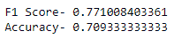

```
from sklearn.naive_bayes import MultinomialNB
# splitting data into training and validation set
xtraintf, xtesttf, ytraintf, ytesttf = train_test_split(tfidfV, Newdata['label'], random_state=42, test_size=0.3)
NB= MultinomialNB()
NB.fit(xtraintf, ytraintf)
prediction = NB.predict_proba(xtesttf) # predicting on the test set
prediction_int = prediction[:,1] >= 0.3 # if prediction is greater than or equal to 0.3 than 1 else 0
prediction_int = prediction_int.astype(np.int)
print("F1 Score-",f1_score(ytest, prediction_int))
print("Accuracy-",accuracy_score(ytest,prediction_int))
```

在这里，我们可以看到我们以前的结果优于朴素贝叶斯结果。

摘要

在这一章中，我们学习了由句子和单词组成的语料库建设技术，其中包括一个单词包，使文本可用于算法。您还了解了 TF-IDF，以及一个术语对于文档和整个语料库的重要性。我们讨论了情感分析、分类和 TF-IDF 特征提取。


# 还向您介绍了主题建模和评估模型，其中包括可视化 LDA。我们讲述了贝叶斯定理和朴素贝叶斯分类器。在下一章，你将学习时态和序列模式发现。

In this chapter, we studied corpus building techniques that consists of sentences and words, which includes a bag of words to make the texts usable for the algorithms. You also learned about TF-IDF and how important a term is with respect to a document and the entire corpus. We went over sentiment analysis, along with classification and TF-IDF feature extraction.

You were also introduced to topic modeling and evaluating models, which includes visualizing LDA. We covered the Bayes theorem and working with the Naive Bayes classifier. In the next chapter, you will learn about temporal and sequential pattern discovery.