# 八、概率图模型

在我们进入**贝叶斯网络** ( **BN** )概念之前，我们应该了解概率论。因此，我们将努力触及这些问题，并为 BNs 奠定基础。

我们已经知道概率是事件发生的确定/不确定程度。然而，它也可以被称为信任度，当我们谈论 BN 时，它更常用。

当我们掷一枚公平硬币时，我们说围绕正面/反面事件发生的信任度是 *0.5* 。这意味着我们对正面发生的信念和反面一样坚定。概率可以看如下:

*p(正面)=p(反面)=0.5*

在本章中，我们将讨论以下主题:

*   贝叶斯规则
*   贝叶斯网络


# 关键概念

在进入本章正文之前，我们将介绍几个关键概念:

*   在离散分布的情况下，使用概率质量函数来找出概率， *p(X= x)，*其中 *X* 是离散随机变量， *x* 是实数值。
*   在连续分布的情况下，用概率密度函数求出概率 *p(X < = x)* 。在这种情况下，绘制概率曲线，曲线下的面积(积分)有助于我们了解概率。

*   条件概率就是理解这一点，一场板球比赛可以是完美的例子。假设有一场印度和澳大利亚之间的比赛，我们试图传递我们的信念，印度获胜。你认为概率会受到印度选的队的冲击吗？如果 *Virat Kohli* 和 *Rohit Sharma* 是团队的一员，印度赢得比赛的概率会受到影响吗？所以， *p(印度赢|Rohit 和 Virat 在打)*表示印度赢的概率，给定 *Rohit* 和 *Virat* 在打。本质上，它意味着一个事件的概率依赖于另一个事件的概率。叫做**条件概率**。

给定 *y* ，则 *x* 的概率可表示如下:

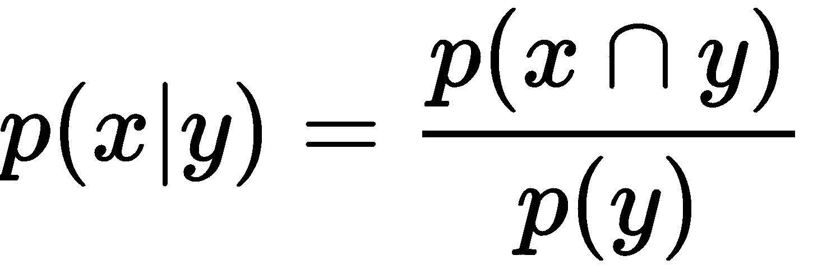

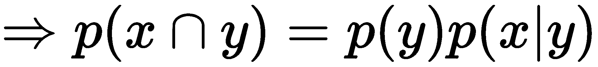

*   链式法则使用一组随机变量的条件概率来计算它们的联合分布。从条件概率我们知道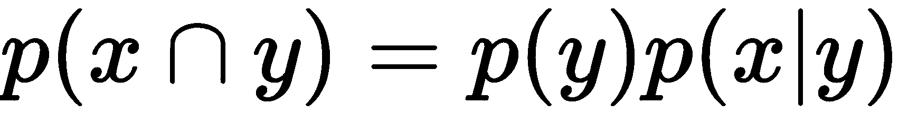。

它暗示如果有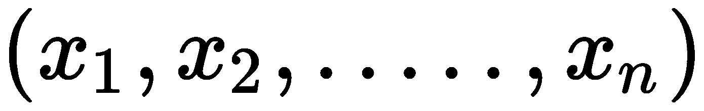事件。联合概率分布是这样的:

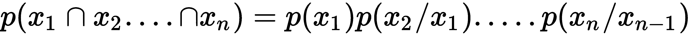


# 贝叶斯规则

贝叶斯规则是概率论的基石之一。它源于条件概率和联合概率，并扩展到更广的范围。

我们将通过举一个板球的例子来简单地解释这一点。在板球运动中，场地条件随着你从一个地方到另一个地方而变化，这是决定球队的重要因素之一。结果也可能取决于它。

假设印度队去澳大利亚比赛，我们要预测一个印度球员在比赛中得一百分(100 分)的信念。如果那个球员有在那个国家踢球的经验，我们可以坚定地说，他可能会得一百分。但是，还有一个球员是这个国家的第一次。他的优先信念是什么？当然，许多人不太相信他能得一百分。

然而，当我们看到球员的表现时，我们之前的想法会改变。也就是说，随着玩家玩的游戏越来越多，关于玩家的更多数据将由我们支配。基于此，后验信念将不断更新。它变化很大，很大程度上是由于观察或更多的数据(这被称为**可能性**)。贝叶斯法则就是基于这些概念。

假设*A[I]与 *B* 形成一个互斥事件:*

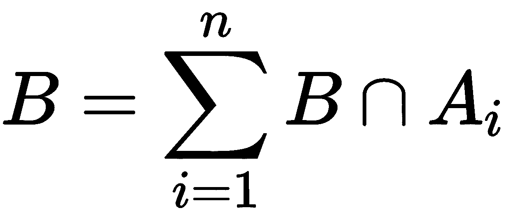

*B* 的概率如下:

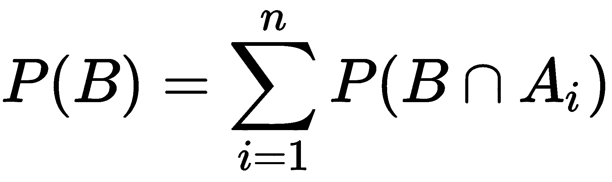

我们从条件概率中得到 B 的概率，如下所示:

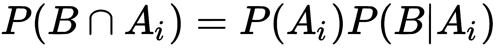

因此:


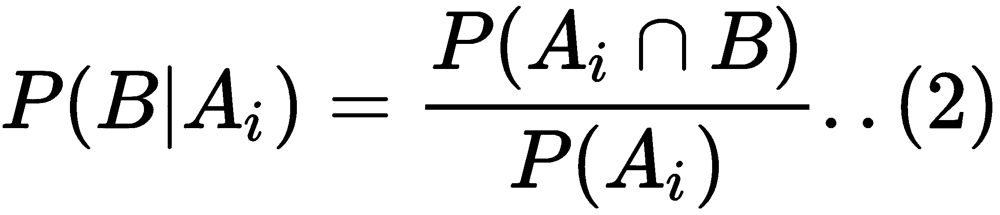

现在，从等式 2 中提取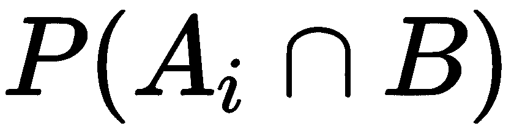 的值，并将其放入等式 1，我们得到:

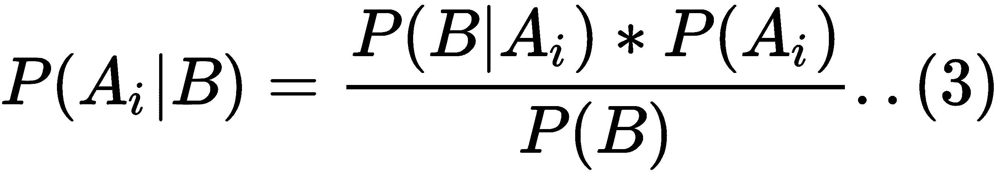

替换上式中的值 *P(B)* 后，我们得到:

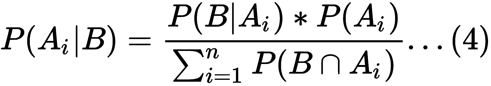

先看一下方程 3。这叫做**贝叶斯法则**。

*P(A|B)* 称为**后验**，需要估计。在前面的例子中，这将是一个世纪得分的概率，假设玩家已经有了早期在那里玩的经验。

*P(B|A)* 称为**似然**，是在给定我们初始假设的情况下，观察到新证据的概率。例如，一个以前有过板球比赛经验的运动员得分 100 分的概率。

*P(A)* 称为**先验**，是我们假设没有任何额外先验信息的概率。

*P(B)* 称为**边际似然**，是观察到证据的总概率。


# 贝叶斯网络

贝叶斯网络是一种概率图模型，可用于建立模型来解决业务问题。这方面的应用相当广泛。例如，它可以用于异常检测、预测建模、诊断、自动洞察和许多其他应用。

这是完全可以理解的，这里使用的几个词对你来说是陌生的。例如，我们这里的图化是什么意思？

图是由一组节点和边组成的。节点用 *N={N1，N2…..Nn}* ，其中独立变量位于每个节点。边是节点之间的连接器。边可以用 *E={E1，E2…..En}* 又可以是两种类型:

*   导演，代理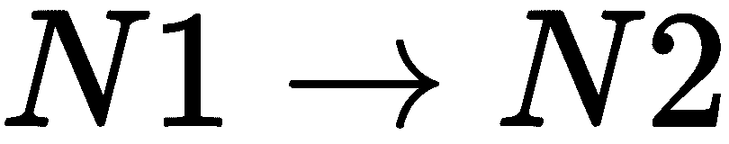
*   无方向，由以下内容表示:

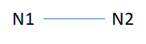

借助节点和边，展示变量之间的关系。可以是条件独立关系，也可以是条件依赖关系。BN 是一种可以在变量之间引入因果关系的技术。虽然因果关系并不是其中必不可少的一部分，但是在网络中拥有这个(因果关系)可以让结构变得相当紧凑。

我们通过一个例子来看。有许多可变因素，如醒来晚了，高速公路上的事故，下雨天，交通堵塞，他们上班会迟到，开会会迟到。如果一个人起床晚了，就意味着上班迟到。高速公路上的事故会造成交通堵塞，反过来，这会导致上班迟到。在雨天，道路更容易发生事故，此外，缓慢行驶的车辆会造成交通堵塞，从而导致上班迟到。下图解释了该示例:

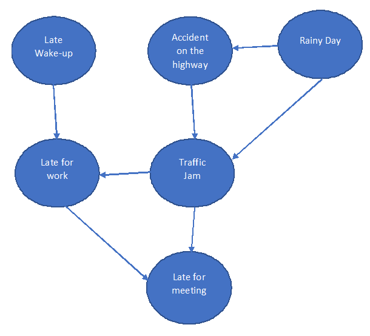

这种网络被称为**有向无环图**。无环意味着网络中没有循环。我们在这里讨论的是变量之间的关系。例如，起床晚和开会迟到通常不是独立的。但考虑到上班迟到，他们是有条件独立的。

此外，晚起似乎与高速公路上的事故没有联系和关系。也就是说，它们可能看起来相互独立。但是，如果你知道上班迟到的价值，那么这两个可以称为有条件独立。

因此，BN 允许节点之间的条件独立性。同时，它是联合概率分布的有效表示，这是由链式规则实现的。

假设 X 代表 n 个独立变量或节点。弧线或有向箭头表示变量之间的概率相关性或独立性。没有弧线意味着概率上的独立性。网络是一个有向无环图，其中每个节点都保持着局部概率分布，也称为**条件概率表** ( **CPT** )。

如果我们说的是之前的网络，那么我们需要寻址整个网络所需的概率分布。为了简单起见，我们将所有节点保持为布尔型。


# 节点概率

让我们看看每个节点上的概率，并找出有多少概率会出现在那里。

携带**晚起**和**雨天**的节点是父节点，因为没有节点通向这些节点。不同的节点可以从以下几点看出:

1.  **节点(晚起)**:作为父节点之一，我们将寻找晚起的概率。因此，这里被发现的概率计数是 1。
2.  **节点(雨天)**:和晚起节点一样，这里概率的计数也是 1。
3.  **节点(公路上的事故)**:由于是雨天的子节点，所以讲的是雨天发生事故的概率和非雨天发生事故的概率。所以，这里的概率是 2。
4.  **节点(堵车)**:它有两个双亲(雨天和事故)。雨天有两个值，真和假，和事故一样。将两者结合将产生四种不同的组合。因此，概率计数将是 4。
5.  **节点(上班迟到)和节点(开会迟到)**:类似的解释也适用于这两个节点。这些事件发生的概率是 4:

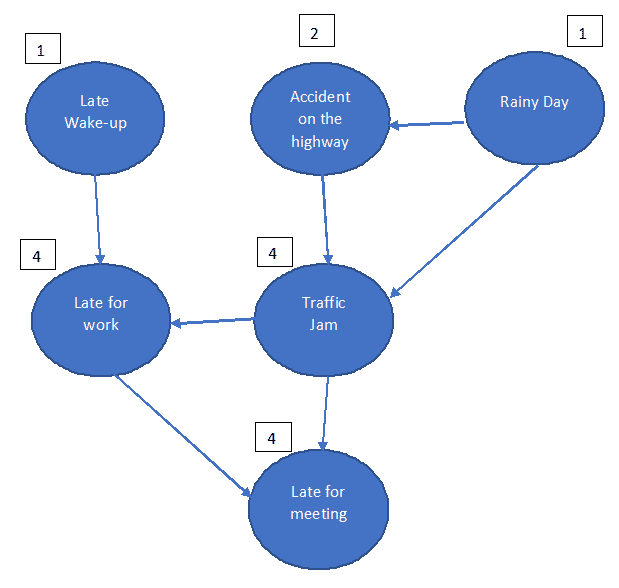

概率总数是 1 + 2 + 1 + 4 + 4 + 4 = 16。

如果它只是一个正常的联合概率分布而不是 BN，我们将有 2 ⁶ -1 个概率。因此，BN 使网络相当紧凑。此外，我们必须注意的另一个更基本的假设是，给定每个节点的直接父节点，每个节点都有条件地独立于非子节点。例如，在**上班迟到**也在的情况下，晚起和开会迟到是有条件独立的。一般来说，我们可以用下面的方式来表示 BN，这显示了联合分布是如何被转化为紧凑结构的:

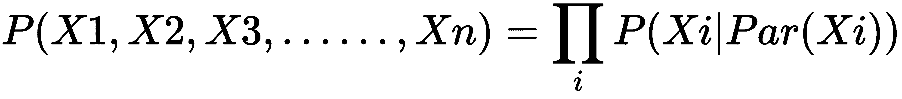

如果 *G* 是图，*X[I]是图 *G* 中的一个节点， *P* 是*X[I]节点的父节点。**

以下是关于这些等式的一些注释:

*   等式的右边是链规则的应用，它展示了条件独立性关系。它是联合概率分布的图结构近似。
*   当然，图必须是非循环的。
*   它可以方便地显示各种事件之间的关系。

现在，让我们用一个简单的场景来展示 CPT。以下是三个事件的组合，如下所示:

如果下雨，狗会开始叫，男人会翘班:

*   下雨的可能性(是/否)
*   狗会叫的概率(是/否)
*   该男子不上班的可能性(是/否)

让我们把网络准备成一个有向无环图。所有这些节点反映一个事件，有向箭头是条件概率。我们将在这里看到如何阅读这个图表:

*   连接器 1 指示下雨时狗叫的可能性
*   连接器 2 指示如果狗叫，该人跳过他的工作的概率

下图显示了两种概率的流程图:

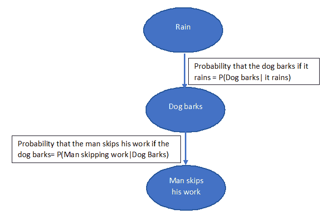


# 运费付至·....（carriage paid to...的缩写）

让我们为连接器 1 进行 CPT:

|  | **狗叫** | **狗不叫** | **聚合** |
| 下雨了 | 10 | 四 | 14 |
| 不下雨 | 8 | 5 | 13 |
| 总计 | 18 | 9 | 27 |

这里，我们讨论以下场景:

*   概率*(狗叫|下雨)= 10/14*
*   概率*(狗不叫|下雨)= 4/14*
*   概率*(狗叫|不下雨)= 8/13*
*   概率*(狗不叫|不下雨)= 5/13*

|  | **狗叫** | **狗不叫** |
| 下雨了 | 10/14 | 4/14 |
| 不下雨 | 8/13 | 5/13 |

下图详细显示了概率:

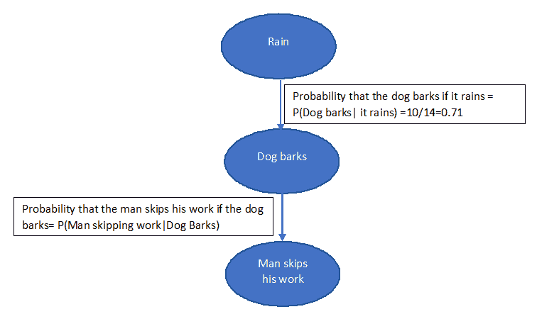

假设*下雨的概率= P(下雨)=0.6* 那么*不下雨的概率= P(不下雨)= 0.4* 。

让我们说，男子旷工的 CPT 如下:

|  | 这个男人旷工了 | **男人不翘班** |
| 狗叫了 | 0.8 | 0.2 |
| 这条狗不叫 | 0.3 | 0.7 |

必须相对于父节点计算每个事件的概率。

现在，我们应该找出*男人翘班，狗叫但不下雨的概率= P(男人翘班，狗叫，不下雨)*:

*= P(人逃工|狗叫)*P(狗叫|不下雨)*P(不下雨)*

*=0.8 * (8/13) *0.4*

*=0.1969*


# 训练和测试集的示例

让我们用 Python 来解决一个用例。我们将使用 Kaggle 的泰坦尼克号数据。
数据被分成两组:

*   训练集(`train.csv`)
*   测试集(`test.csv`)

这些数据是关于泰坦尼克号上的乘客的。它抓住了他们的特点:

*   `pclass`:机票等级 1 =第一，2 =第二，3 =第三
*   `gender`:性别
*   `Age`:以年为单位的年龄
*   `sibsp`:泰坦尼克号上的兄弟姐妹/配偶数量
*   `parch`:泰坦尼克号上父母/孩子的数量
*   `ticket`:票号
*   `fare Passenger`:票价

*   `cabin`:客舱号
*   `embarked`:启运港`C = Cherbourg`、`Q = Queenstown`、`S = Southampton`

我们必须建立模型来预测他们是否能在泰坦尼克号沉没后幸存下来。最初，导入参数，如下所示:

```
import pandas as pd
import numpy as np
```

我们正在这里加载数据集:

```
traindf= pd.read_csv("train.csv")
testdf= pd.read_csv("test.csv")
```

我们必须寻找每个变量的唯一值的数量，因为 bn 是离散模型:

```
for k in traindf.keys():
 print('{0}: {1}'.format(k, len(traindf[k].unique())))
```

输出如下所示:

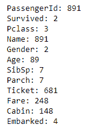

为了使我们的系统免于太多的计算并避免它的负荷，我们将减少变量的数量:

```
for k in traindf.keys():
 if len(traindf[k].unique())<=10:
 print(k)
```

我们得到以下输出:

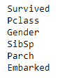

现在，我们只剩下六个变量。

此外，我们必须离散化连续变量，以防它们需要成为模型的一部分:

```
import math
def forAge(row):
 if row['Age'] < 10:
    return '<10'
 elif math.isnan(row['Age']):
    return "nan"
 else:
    dec = str(int(row['Age']/10))
    return "{0}0's".format(dec)
 decade=traindf.apply(forAge, axis=1)
 print("Decade: {1}".format(k, len(decade.unique())))
```

输出如下所示:

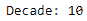

现在让我们做预处理:

```
def preprocess(df):
 # create a dataframe with discrete variables (len<10)
 filt=[k for k in df.keys() if len(df[k].unique())<=10]
 filtr2=df[filt].copy()
 forAge = lambda row: int(row['Age']/10) if not math.isnan(row['Age']) else np.nan
 filtr2['Decade']=df.apply(forAge, axis=1)
 filtr2=filtr2.dropna()
 filtr2['Decade']=filtr2['Decade'].astype('int32')
 return filtr2
```

对于`traindf`和`testdf`，我们使用以下公式:

```
ptraindf= preprocess(traindf)
ptestdf=preprocess(testdf)
```

我们需要保存这些数据，因为`pyAgrum`库只接受文件作为输入:

```
ptraindf.to_csv('post_train.csv', index=False)
ptestdf.to_csv( 'post_test.csv', index=False)

df=pd.read_csv('post_train.csv')
for k in df.keys():
  print("{} : {}".format(k, df[k].unique()))
```

输出如下所示:

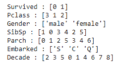

```
import pyAgrum as gum
import pyAgrum.lib.notebook as gnb
```

现在，是时候建立模型了。这里，您需要在选择`RangeVariable`和`LabelizedVariable`变量时保持警惕:

```
template=gum.BayesNet()
template.add(gum.RangeVariable("Survived", "Survived",0,1))
template.add(gum.RangeVariable("Pclass", "Pclass",1,3))
template.add(gum.LabelizedVariable("Gender", "Gender",0).addLabel("female").addLabel("male"))
template.add(gum.RangeVariable("SibSp", "SibSp",0,8))
template.add(gum.RangeVariable("Parch", "Parch",0,9))
template.add(gum.LabelizedVariable("Embarked", "Embarked",0).addLabel('').addLabel('C').addLabel('Q').addLabel('S'))
template.add(gum.RangeVariable("Decade", "Calculated decade", 0,9))
gnb.showBN(template)
```

输出如下所示:


对于`learnBN()`，我们使用以下内容:

```
learner = gum.BNLearner('post_train.csv', template)
bn = learner.learnBN()
bn
```

以下是输出:

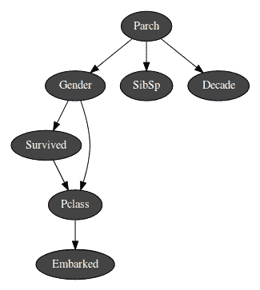

现在我们有了模型，让我们试着从中提取信息:

```
gnb.showInformation(bn,{},size="20")
```

我们得到如下输出:

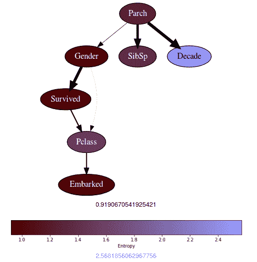

变量的熵意味着值越大，变量的边际概率分布越不确定。熵值越低，不确定性越低。`Decade`变量有最高的熵，这意味着它是均匀分布的。Parch 具有低熵且分布不均匀。

熵如何计算的一个结果是，如果随机变量有许多模态，熵往往会变得更大。

找到这个推论让我们看到了这里的边际概率分布:

```
gnb.showInference(bn)
```

输出如下所示:

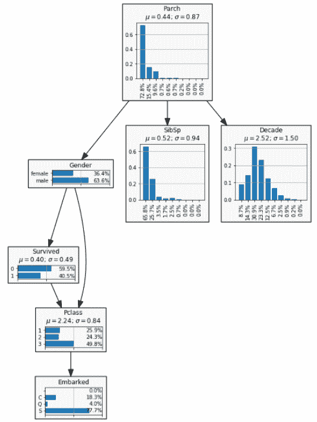

现在，让我们看看如何进行分类:

```
gnb.showPosterior(bn,evs={},target='Survived')
```

我们得到如下输出:

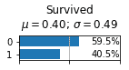

超过 40%的乘客在这里幸存。但是，我们没有提出任何条件。

假设我们想知道年轻男性存活的几率有多大:

```
gnb.showPosterior(bn,evs={"Gender": "male", "Decade": 3},target='Survived')
```

以下是输出:

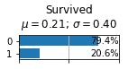

所以，几率是 20.6%。

如果我们必须找出一个老太太存活的机会，我们会这样做:

```
gnb.showPosterior(bn,evs={"Gender": "female", "Decade": 8},target='Survived')
```

输出如下所示:

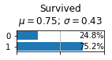

现在，为了评估模型以发现它有多好，我们将绘制 ROC 曲线:

```
from pyAgrum.lib.bn2roc import showROC
 showROC(bn, 'post_train.csv','Survived',"1",True,True)
```

以下是输出:

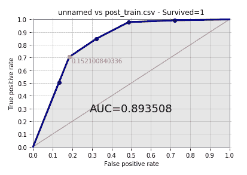

在这里， **AUC** 出来是 **0.893508** 相当体面。

我们已经完成了建模部分。此外，我们还学习了概率论、贝叶斯网络、CPT 的计算以及如何在 Python 中执行它。


# 摘要

这一章让我们了解了概率论。还有，概率论的应用已经投入使用。我们了解了贝叶斯规则和贝叶斯网络以及它是如何形成的。我们被 CPT 的计算弄脏了手。最后，我们通过一个用例来理解如何在 BNs 的帮助下进行分类。读者现在将有技能有一个贝叶斯规则和 BNs 的深入知识。

在下一章中，我们将研究深度学习中的选定主题。