# 深度学习中的精选主题

在[第 4 章](6fd48e9f-f2fd-4b29-a006-1b151de4960f.xhtml) *、* *训练神经网络*中，我们看了什么是**人工神经网络** ( **ANN** )以及这种模型是如何构建的。你可以说深度神经网络是人工神经网络的加长版；然而，它也有自己的一系列挑战。

在本章中，我们将了解以下主题:

*   什么是深度神经网络？
*   如何初始化参数
*   对抗网络——生成对抗网络和贝叶斯生成对抗网络
*   深高斯过程
*   辛顿胶囊网络


# 深度神经网络

让我们回顾一下我们在[第 4 章](6fd48e9f-f2fd-4b29-a006-1b151de4960f.xhtml) *“训练神经网络*”中学到的内容。神经网络是对人脑的机器模拟，被视为一套算法，用于从数据中提取模式。它有三个不同的层次:

*   输入层
*   隐蔽层
*   输出层

感官数字数据(以向量的形式)通过输入层，然后通过隐藏层，以生成自己的一套感知和推理，从而在输出层产生最终结果。

你能回忆起我们在[第 4 章](6fd48e9f-f2fd-4b29-a006-1b151de4960f.xhtml)、*训练神经网络*、*、*中学到的关于人工神经网络的层数和计数方法吗？当我们得到如下图所示的图层时，你能数出图层的数量吗？记住，我们总是只计算隐藏层和输出层。因此，如果有人问你网络中有多少层，你在回答时不要包括输入层:

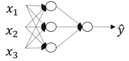

是的，没错——前面的架构有两层。对于以下网络呢？

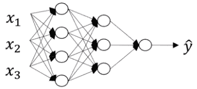

这个网络有三层，其中包括两个隐藏层。随着层数的增加，模型变得更深。


# 为什么我们需要深度学习模型？

深度学习模型是一个高度非线性的模型，它有多个层，多个节点依次行动来解决一个业务问题。每一层都被分配了不同的任务。

例如，如果我们有一个人脸检测问题，隐藏层 1 会找出图像中存在哪些边缘。第二层找出边缘的组合，开始形成眼睛、鼻子和其他部分的形状。第 3 层启用对象模型，创建面部的形状。下图显示了不同的隐藏层:


在这里，我们得到了一个逻辑回归模型，也称为单层神经网络。有时，它也被称为最**浅网络**。这里可以看到的第二个网络是双层网络。还是那句话，是浅网，但没有上一个浅。下一个架构有三层，这使得事情变得更加有趣。现在网络越来越深了。最后一种架构是六层架构，由五个隐藏层组成。层数越来越深。


# 深度神经网络符号

符号的解释如下:

*   *l* :层数为 4 层
*   *n^(【l】)*:层内节点数 *l*

对于以下体系结构，如下所示:

*   *n^(【0】):*输入层的节点数，即 3
*   *n^(【1】)*:5
*   *n²5*
*   *n³:*3
*   *n^(【4】)*:1
*   *a^(【l】)*:层激活 *l:*

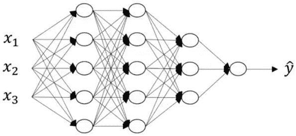

正如我们已经知道的那样，下面的等式穿过这些层:

*z = w ^T X + b*

因此，我们得到以下结果:

*   激活: *a = σ(z)*
*   *w^(【l】)*:层重 *l*
*   *b^(【l】)*:层内偏差 *l*


# 深层网络中的前向传播

让我们看看这些等式是如何为第 1 层和第 2 层建立的。如果训练样本集为，X 为前一网络的( *x1* 、 *x2* 、 *x3* )。

让我们看看这个等式是如何适用于第 1 层的:

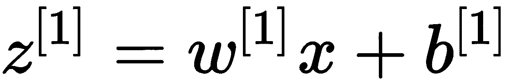

第 1 层的激活功能如下:

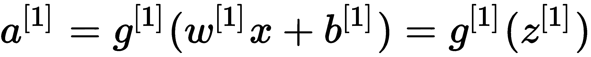

输入也可以表示如下:

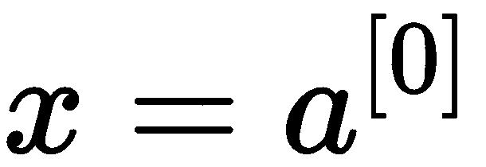

对于第 2 层，输入如下:

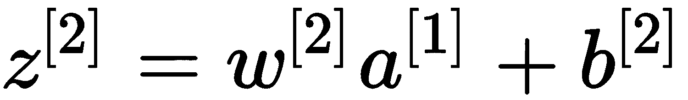

这里应用的激活函数如下:

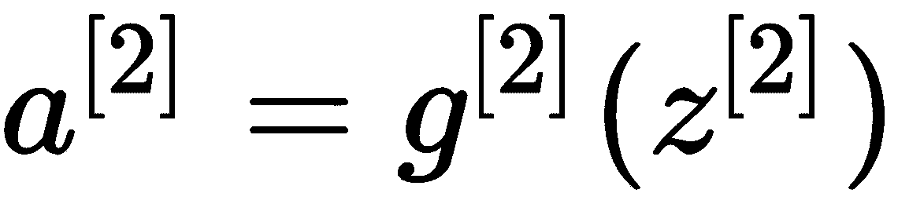

类似地，对于第 3 层，应用的输入如下:


第三层的激活功能如下:

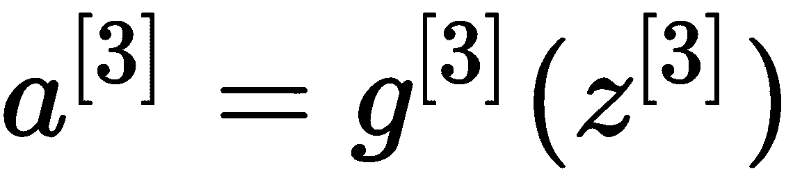

最后，这是最后一层的输入:

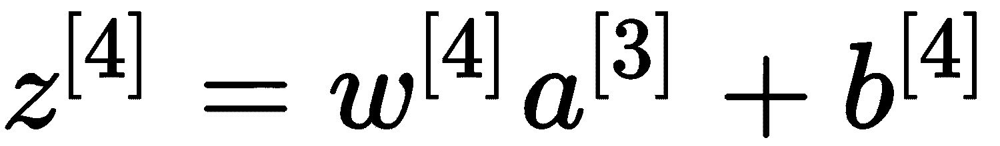

这是它的激活:

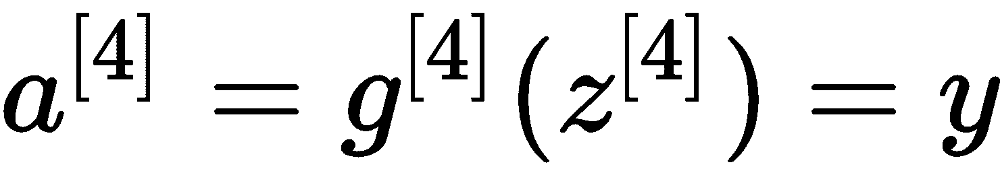

因此，广义正向传播方程结果如下:


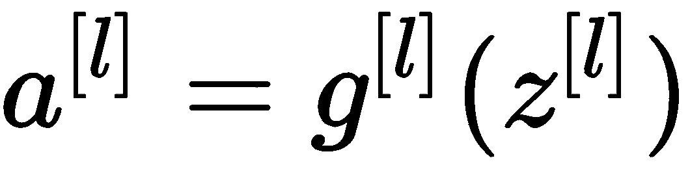


# 参数 W 和 b

下面说一下架构。首先，让我们记下我们在上一节中学到了什么。请看下图:

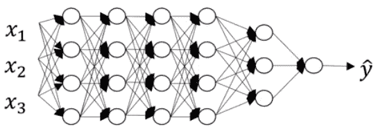

在这里，我们可以看到以下内容:

*   *l* :层数:6 层
*   *n^(【l】)*:层节点数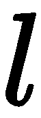
*   *n^(【0】)*:输入层节点数:3::
*   *n^(【1】)*:第一层节点数:4:

这个等式如下:

*n^(【2】)= 4::n^(【3】)= 4::n^(【4】)= 4::n^(【5】)= 3::n^(【6】)= 1*

实现前向传播意味着隐藏层 1 可以通过下面的等式来表示:

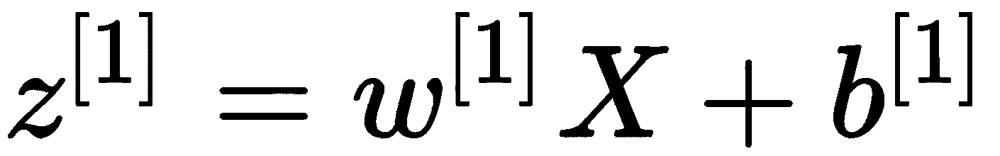 …..(1)

你能确定正向传播的 z、w 和 X 的维数吗？

我们来讨论一下这个。 *X* 表示输入层向量或节点，我们知道有 3 个节点。我们能找出输入层的维数吗？嗯，是的，是(*n*，1)——或者，你也可以说是(3，1)。

第一个隐藏层呢？由于第一个隐藏层已经得到了三个节点，*z的维数将为(*n*，1)。这意味着维数将是(4，1)。*

 **z^(【1】)*和 X 的尺寸已经确定。通过查看前面的等式，显然*z^(【1】)*和*w^(【1】)**X*的维数必须相同(来自线性代数)。那么，能不能想出*w^(【1】)*的尺寸？从线性代数中我们知道，只有当矩阵 1 的列数等于矩阵 2 的行数时，矩阵 1 和矩阵 2 之间的矩阵乘法才有可能。因此，*w^(【1】)*的列数必须等于矩阵 *X* 的行数。这样会使*w^(【1】)*的列数为 3。然而，正如我们已经讨论过的那样，*z*和*w**X*的尺寸必须相同，因此前者的行数应该等于后者的行数。因此，*w*的行数将变成 4。好了，我们现在已经得到了*w^(【1】)*的维数，也就是(4，3)。为了使这个更一般，我们还可以说*w^(【1】)*的尺寸为(*n*，*n*)。同理，*w^(【2】)*的维数会等于(*n^(【2】)*，*n*)或(当前层的节点数，上一层的节点数)。会使*的尺寸 w^(【2】)*(4，4)。我们来概括一下这个。让我们看看下面等式的维数:

*w^(【1】)=(n^(【1】)，n^(【l-1】))*

偏置*b^(【1】)*的维度呢？你能利用线性代数把它算出来吗？这对你来说一定是小菜一碟。是的，你现在可能已经猜对了。与*z^(【1】)*尺寸相同。为了大家的利益，我来解释一下。根据等式，左手边的尺寸应该等于右手边的尺寸。另外，*w^(【1】)**X+b^(【1】)*是两个矩阵的相加，众所周知，两个矩阵只有在维数相同的情况下才能相加；也就是说，它们必须具有相同的行数和列数。因此，*b*的尺寸将等于*w**X*；进而会等于*z^(【1】)*(也就是(4，1))。

概括来说，*b^(【1】)=(n^(【1】)，1)* 的维度。

对于反向传播，如下所示:

*   尺寸*d**w^(【l】)=(n^(【l】)，n^(【l-1】))*
*   *db**^(【l】)=(n^(【l】)，1)* 的尺寸


# 向前和向后传播

让我用一个例子来告诉你向前传球和向后传球是如何工作的。

我们有一个网络，它有两层(一个隐藏层和一个输出层)。每一层(包括输入)都有两个节点。它也有偏差节点，如下图所示:

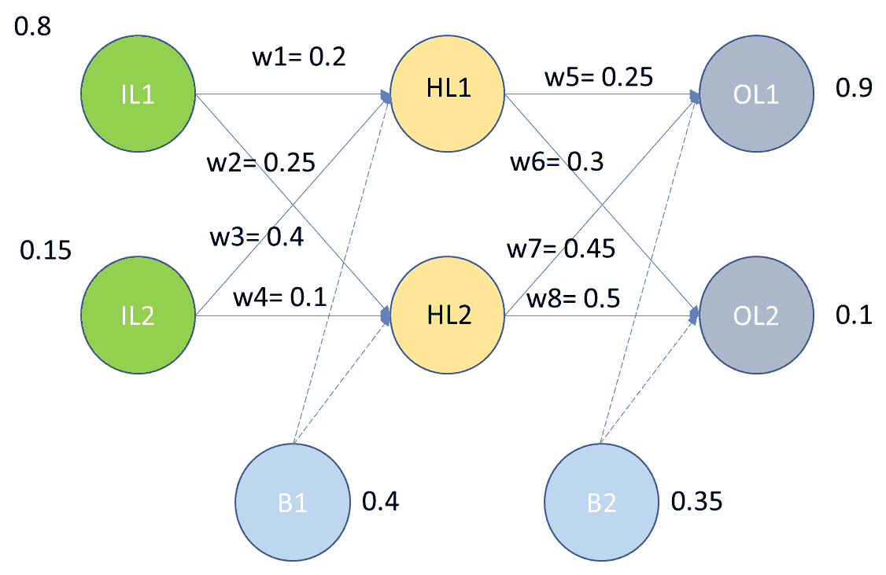

上图中使用的符号如下:

*   *IL* :输入层
*   *HL* :隐藏层
*   *OL* :输出层
*   *w* :重量
*   *B* :偏置

我们已经获得了所有必填字段的值。让我们把这个输入网络，看看它是如何流动的。这里使用的激活函数是 sigmoid。

给予隐藏层的第一个节点的输入如下:

*输入 1 = w1*IL1 + w3*IL2 + B1*

*输入 1 =(0.2 * 0.8)+(0.4 * 0.15)+0.4 = 0.62*

给予隐藏层的第二个节点的输入如下:

*输入 L2 = w2*IL1 + w4*IL2 + B1*

*输入 L2 =(0.25 * 0.8)+(0.1 * 0.15)+0.4 = 0.615*

为了找出输出，我们将使用我们的激活函数，就像这样:

*输出 1 = 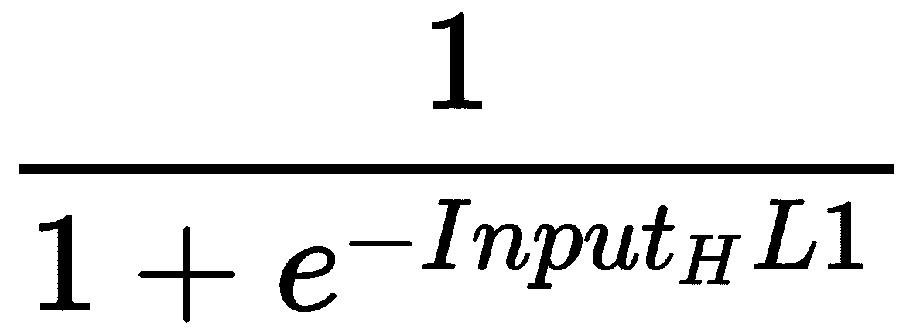 = 0.650219*

*output L2 =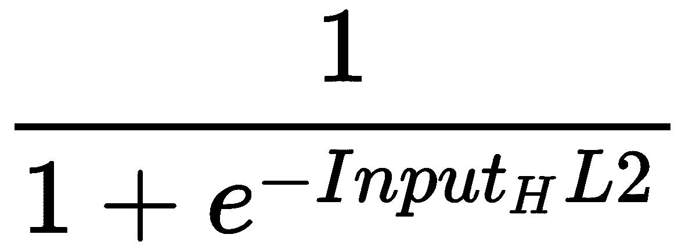= 0.649081*

现在，这些输出将作为输入传递到输出层。让我们计算输出层中节点的输入值:

*输入= w5 *输出 _ HL1+w7 *输出 _HL2 + B2 = 0.804641*

*输入= w6 *输出 _ HL1+w8 *输出 _HL2 + B2= 0.869606*

现在，让我们计算输出:

*输出[OL1]== 0.690966*

*输出[OL2]=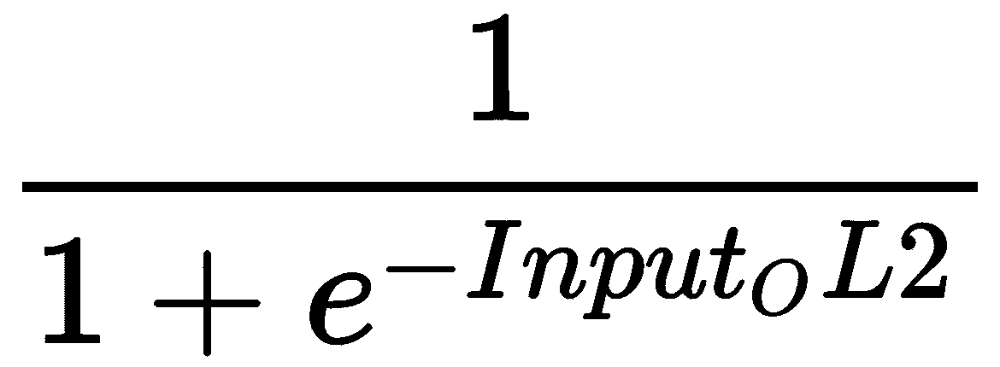= 0.704664*


# 误差计算

现在，我们可以使用平方误差函数计算每个输出神经元的误差，并将它们相加得到总误差:

*Etotal =* 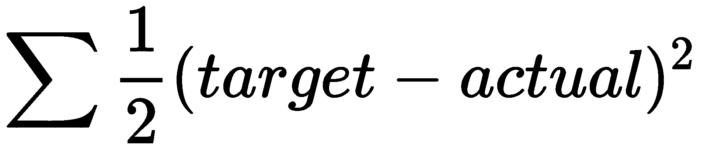

*EOL1 =输出层第一个节点的误差=* 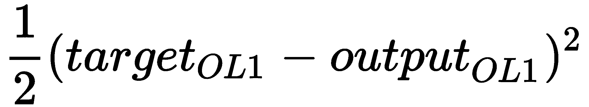

*=0.021848*

*EOL2 =输出层第二节点错误=* 

*=0.182809*

*总误差= Etotal = eol 1+eol 2 = 0.021848+0.182809 = 0.204657*


# 反向传播

反向传播的目的是更新网络中的每个权重，使它们使实际输出更接近目标输出，从而最小化每个输出神经元和整个网络的误差。

让我们首先关注一个输出层。我们应该找出 w5 的变化对总误差的影响。

这将由决定。它是 Etotal 对 w5 的偏导数。

让我们在这里应用链式法则:


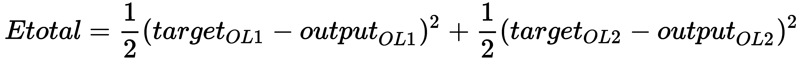

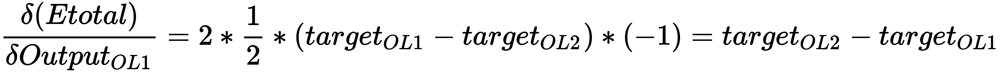

*= 0.690966–0.9 =-0.209034*

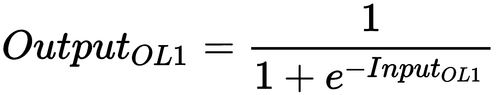

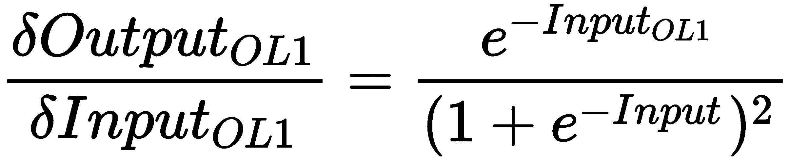

*= 0.213532*

*输入= w5 *输出 1+w7 *输出 2 + B2*

*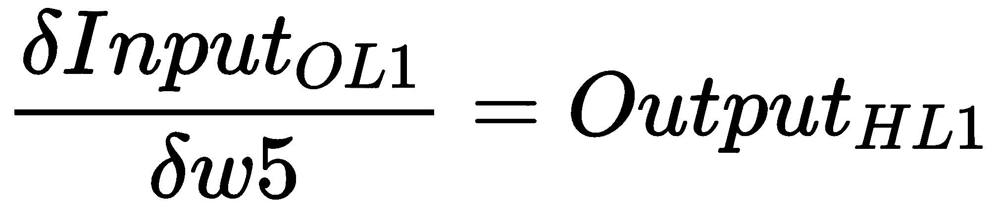 = 0.650219*

现在，让我们回到旧等式:

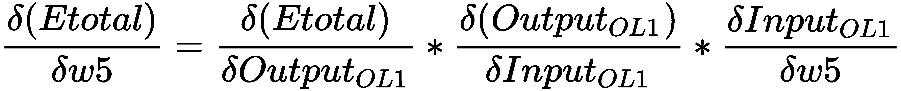

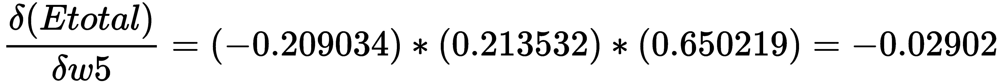

为了更新权重，我们将使用以下公式。我们将学习率设置为 *α = 0.1* :

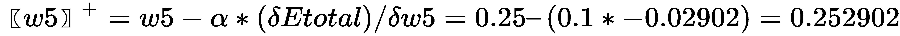

同样，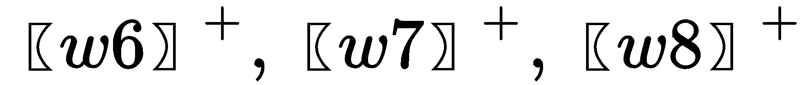也是应该计算出来的。方法保持不变。我们将把这个留给计算，因为它将帮助你更好地理解概念。

当涉及到隐藏层和计算时，方法仍然保持不变。但是，公式会有一点变化。我会帮你做公式，但剩下的计算得由你自己来做。

我们将在这里乘坐 *w1* 。

让我们在这里应用链式法则:

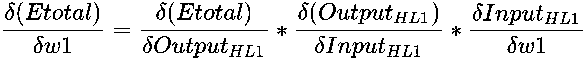

这个公式必须用于 *w2* 、 *w3* 和 *w4* 。请确保您正在对 *E_total* 相对于其他权重进行偏导数计算，并最终使用学习率公式获得更新后的权重。


# 正向传播方程

我们知道它周围的方程式。如果这个的输入是*a^(【l-1】)*，那么输出将是*a^(【l】)*。但是有一个缓存部分，无非是 z*^(【l】)*，如下图所示:

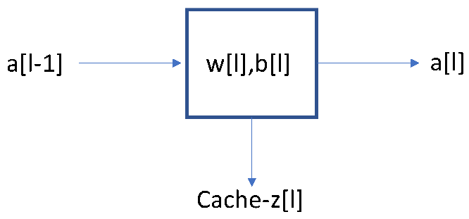

这里这就分解成*w^(【1】)a^(【l-1】)+b^(【l】)*(记住*a^(【0】)*等于 *X* )。


# 反向传播方程

执行反向传播需要以下等式:

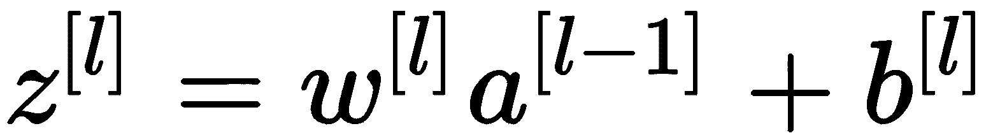


这些等式会让你了解幕后发生了什么。这里，添加了一个后缀 *d* ，它表示在反向传播期间起作用的偏导数:

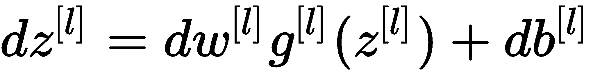

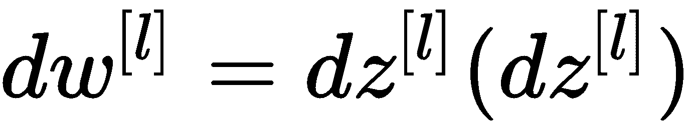


# 参数和超参数

当我们继续建立深度学习模型时，你需要知道如何记录参数和超参数。但是我们对这些有多了解呢？

当涉及到参数时，我们有权重和偏差。当我们开始训练网络时，首要步骤之一是初始化参数。


# 偏置初始化

通常的做法是将偏差初始化为零，因为神经元的对称断裂由随机权重的初始化来处理。


# 超参数

超参数是深度学习网络的构建模块之一。它是决定网络最佳架构(例如层数)的一个因素，也是负责确保如何训练网络的一个因素。

以下是深度学习网络的各种超参数:

*   **学习速率**:这负责决定网络训练的速度。缓慢的学习速率确保平滑的收敛，而快速的学习速率可能不具有平滑的收敛。
*   **历元**:历元数是网络在训练时消耗整个训练数据的次数。
*   **隐藏层数**:决定了模型的结构，有助于达到模型的最佳容量。
*   **节点数(神经元)**:要使用的节点数之间要有一个权衡。它决定是否已经提取了产生所需输出的所有必要信息。过拟合或欠拟合将由节点的数量决定。因此，建议将其与正则化一起使用。
*   **Dropout** : Dropout 是一种正则化技术，用于通过避免过度拟合来提高泛化能力。这在第 4 章、*训练神经网络*中详细讨论。下降值可以在 0.2 和 0.5 之间。

*   **动量**:决定下一步收敛的方向。该值介于 0.6 和 0.9 之间，用于处理振荡。
*   **批量**:这是输入网络的样本数量，之后会进行参数更新。通常取 32，64，128，256。

为了找到超参数的最佳数量，谨慎的做法是采用网格搜索或随机搜索。


# 用例–数字识别器

**修改后的国家标准技术研究所** ( **MNIST** )实际上是 *hello world* 的计算机视觉数据集。考虑到它在 1999 年的发布，这个数据集已经成为基准分类算法的主要基础。

我们的目标是从成千上万的手写图像数据集中正确识别数字。我们策划了一套教程风格的内核，涵盖了从回归到神经网络的所有内容:

```
import numpy as np
import pandas as pd
import matplotlib.pyplot as plt
import matplotlib.image as mpimg
import seaborn as sns
%matplotlib inline
from sklearn.model_selection import train_test_split
import itertools
from keras.utils.np_utils import to_categorical # convert to one-hot-encoding
from keras.models import Sequential
from keras.layers import Dense, Dropout, Flatten, Conv2D, MaxPool2D
from keras.optimizers import SGD
from keras.preprocessing.image import ImageDataGenerator
sns.set(style='white', context='notebook', palette='deep')
np.random.seed(2)

# Load the data
train = pd.read_csv("train.csv")
test = pd.read_csv("test.csv")

Y_train = train["label"]
# Drop 'label' column
X_train = train.drop(labels = ["label"],axis = 1)

Y_train.value_counts()
```

上述代码的输出如下:

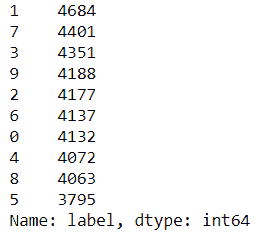

```
X_train.isnull().any().describe()
```

这里，我们得到以下输出:

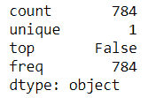

```
test.isnull().any().describe()
```

这里，我们得到以下输出:

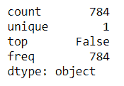

```
X_train = X_train / 255.0
test = test / 255.0
```

通过将图像重塑为三维，我们得到以下结果:

```
 Reshape image in 3 dimensions (height = 28px, width = 28px, canal = 1)
X_train = X_train.values.reshape(-1,28,28,1)
test = test.values.reshape(-1,28,28,1)

Encode labels to one hot vectors 
Y_train = to_categorical(Y_train, num_classes = 10)

# Split the dataset into train and the validation set 
X_train, X_val, Y_train, Y_val = train_test_split(X_train, Y_train, test_size = 0.1, random_state=2)
```

通过执行以下代码，我们将能够看到编号的绘图:

```
pic = plt.imshow(X_train[9][:,:,0])
```

输出如下所示:

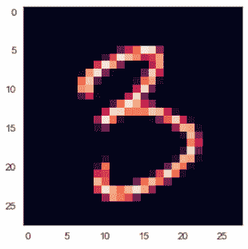

顺序模型现在如下所示:

```
model = Sequential()
model.add(Conv2D(filters = 32, kernel_size = (5,5),padding = 'Same', activation ='relu', input_shape = (28,28,1)))
model.add(Conv2D(filters = 32, kernel_size = (5,5),padding = 'Same', activation ='relu'))
model.add(MaxPool2D(pool_size=(2,2)))
model.add(Dropout(0.25))
model.add(Conv2D(filters = 64, kernel_size = (3,3),padding = 'Same', activation ='relu'))
model.add(Conv2D(filters = 64, kernel_size = (3,3),padding = 'Same', activation ='relu'))
model.add(MaxPool2D(pool_size=(2,2), strides=(2,2)))
model.add(Dropout(0.25))
model.add(Flatten())
model.add(Dense(256, activation = "relu"))
model.add(Dropout(0.5))
model.add(Dense(10, activation = "softmax"))
```

当我们定义优化器时，我们得到以下输出:

```
# Define the optimizer
optimizer = SGD(lr=0.01, momentum=0.0, decay=0.0)
```

当我们编译模型时，我们得到以下输出:

```
# Compile the model
model.compile(optimizer = optimizer, loss = "categorical_crossentropy", metrics=["accuracy"])

epochs = 5
batch_size = 64
```

接下来，我们生成图像生成器:

```
datagen = ImageDataGenerator(
 featurewise_center=False, # set input mean to 0 over the dataset
 samplewise_center=False, # set each sample mean to 0
 featurewise_std_normalization=False, # divide inputs by std of the dataset
 samplewise_std_normalization=False, # divide each input by its std
 zca_whitening=False, # apply ZCA whitening
 rotation_range=10, # randomly rotate images in the range (degrees, 0 to 180)
 zoom_range = 0.1, # Randomly zoom image 
 width_shift_range=0.1, # randomly shift images horizontally (fraction of total width)
 height_shift_range=0.1, # randomly shift images vertically (fraction of total height)
 horizontal_flip=False, # randomly flip images
 vertical_flip=False) # randomly flip images
datagen.fit(X_train)

history = model.fit_generator(datagen.flow(X_train,Y_train, batch_size=batch_size),
 epochs = epochs, validation_data = (X_val,Y_val),
 verbose = 2, steps_per_epoch=X_train.shape[0] // batch_size)
```

输出如下所示:

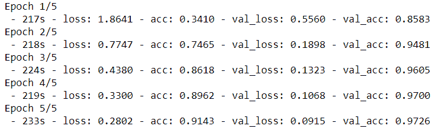

我们预测模型如下:

```
results = model.predict(test)
# select with the maximum probability
results = np.argmax(results,axis = 1)
results = pd.Series(results,name="Label")
results
```

输出如下所示:

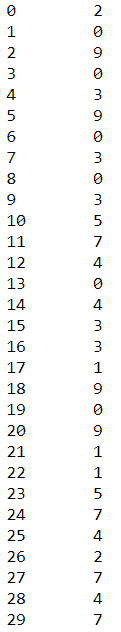


# 生成对抗网络

**生成对抗网络** ( **GANs** )是深度神经网络架构的另一种形式，是两个相互竞争又相互合作的网络的组合。它是由 Ian Goodfellow 和 Yoshua Bengio 在 2014 年推出的。

GANs 可以学习模仿任何数据分布，这在理想情况下意味着 GANs 可以被教会创建一个与任何领域的现有对象相似的对象，如图像、音乐、语音和散文。它可以创建以前从未存在过的任何物体的照片。他们在某种意义上是机器人艺术家，他们的产出令人印象深刻。

它属于无监督学习，其中两个网络在训练时学习它们的任务。其中一个网络称为**发生器**，另一个称为**鉴别器**。

为了更好理解，我们可以把一个**干**看作是一个伪造者(生产者)和一个警察(鉴别者)的例子。一开始，伪造者给警察看假钱。警察像侦探一样工作，发现这是一张假币(如果你想了解鉴别器是如何工作的，你也可以把 D 想象成一名侦探)。警察将他的反馈传递给伪造者，解释为什么钱是假的。伪造者根据收到的反馈进行一些调整，并制造新的假币。警察说，钱仍然是假的，他与伪造者分享他的新反馈。然后，伪造者试图根据最新的反馈制造新的假币。这个循环无限期地继续下去，直到警察被假钱愚弄，因为它看起来像真的。创建 GAN 模型时，发生器和鉴别器开始从头开始学习，并相互学习。看似对立，其实是在互相帮助学习。这两者之间的反馈机制有助于模型更加健壮。

鉴别者是一个相当好的学习者，因为它能够从现实世界中学习任何东西。也就是说，如果你想让它学习猫和狗的图像，以及要求它区分这些图像的 1000 个不同类别，它将能够毫不费力地做到这一点，就像这样:

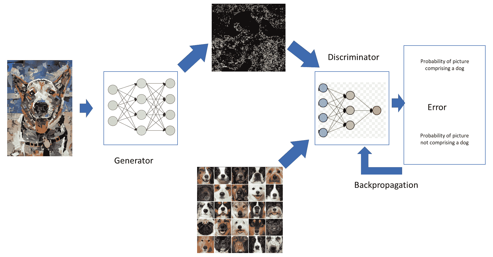

噪声进入发电机；然后，发生器的输出通过鉴频器，我们得到一个输出。与此同时，鉴别器正在根据狗的图像进行训练。然而，在最开始，即使是狗的图像也可以被鉴别器分类为非狗的图像，并且它会发现这个错误。这个错误通过网络传播回来。


# 辛顿胶囊网络

深度学习之父 Geoffrey Hinton 通过引入一种新的网络，在深度学习领域引起了巨大的轰动。这个网络被称为**胶囊网络** ( **胶囊网**)。还提出了训练该网络的算法，称为**胶囊间动态路由****。2011 年，Hinton 在一篇名为**转变自编码器**的论文中首次谈到了这一点。2017 年 11 月，Hinton 和他的团队发表了关于胶囊网络的完整论文。**

 **<title>The Capsule Network and convolutional neural networks</title>  

# 胶囊网络和卷积神经网络

**卷积神经网络** ( **CNN** )一直是深度学习领域最重要的里程碑之一。它让每个人都兴奋不已，也成为了新研究的基石。但是，正如他们所说，*在这个世界上没有什么是完美的。我们热爱的 CNN 也不是。*

你能回忆起 CNN 是如何工作的吗？CNN 最重要的工作就是执行卷积。这意味着，一旦你将一幅图像通过 CNN，卷积层就会从图像像素中提取出边缘和颜色梯度等特征。其他图层会将这些功能组合成一个更复杂的图层。在它的上面，一旦密集层被保留，它使网络能够执行分类工作。下图显示了我们正在处理的图像:

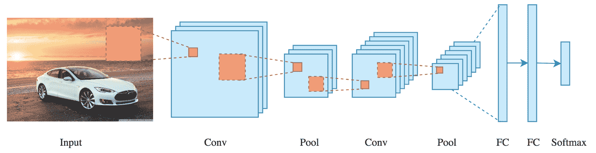

上图是一个基本的 CNN 网络，用于检测图像中的汽车。下图显示了一辆完好无损的汽车的图像，以及该汽车的片段图像:

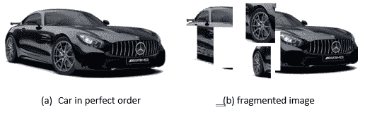

假设我们通过 CNN 网络传递这两个图像(以检测汽车)——网络对这两个图像的响应会是什么？你能思考一下这个问题并给出一个答案吗？为了帮助你，一辆汽车有许多部件，如车轮、挡风玻璃、引擎盖等等，但是当所有这些部件都按顺序排列时，在人的眼中，一辆汽车就是一辆汽车。但是，对于 CNN 来说，只有特写才是重要的。CNN 不考虑相对位置和方向关系。因此，这两个图像都将被网络分类为汽车，尽管人眼并不是这样。

为了弥补，CNN 包括最大池，这有助于增加更高层神经元的视图，从而使更高阶特征的检测成为可能。最大池使 CNN 工作，但同时也发生了信息丢失。这是 CNN 的一大缺点。


# 摘要

在这一章中，我们学习了深度神经网络以及为什么我们需要深度学习模型。我们还学习了向前和向后延拓，以及参数和超参数。我们还讨论了 GANs，以及深度高斯过程、胶囊网络和 CNN。

在下一章，我们将研究因果推理。***