# 高级方法

我们已经读到了这本书的最后一章。然而，这并不意味着我们可以忽略我们将在接下来的章节中讨论的主题。这些主题是最先进的，会把你和其他人区分开来。

在本章中，我们将讨论以下主题:

*   核主成分分析
*   独立成分分析
*   压缩传感
*   贝叶斯多重插补
*   自组织地图


# 介绍

在前一章中，我们了解了什么是**主成分分析** ( **PCA** )，它是如何工作的，以及我们应该何时部署它。然而，作为一种降维技术，你认为你能把它用在每一个场景中吗？你能回忆起我们讨论过的路障或其背后的基本假设吗？

是的，PCA 背后最重要的假设是它适用于线性可分的数据集。然而，在现实世界中，你不会经常得到这种数据集。我们需要一种方法来捕捉非线性数据模式。

在左侧，我们有一个数据集，其中有两个类。我们可以看到，一旦我们得到了投影并确定了成分，主成分分析就不会对其产生影响，并且它也不能在 2D 维中用一条线将其分开。也就是说，只有当我们得到低层次的维度和线性可分的数据时，PCA 才能很好地发挥作用。下图显示了两个类的数据集:

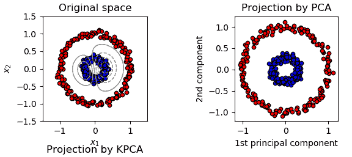

这就是我们引入核方法的原因:这样我们可以将它与 PCA 合并来实现它。

为了回顾一下您对内核方法的了解，我们将简要讨论它及其重要性:

*   我们得到了低维空间的数据。然而，当我们得到非线性数据时，有时很难实现分类(绿色和红色)(如下图所示)。话虽如此，但我们确实清楚地认识到，拥有一个可以将数据从较低维度映射到较高维度的工具，将会产生正确的分类。这个工具叫做**内核方法**。
*   相同的数据集在新的特征空间中被证明是线性可分的。

下图显示了低维和高维空间中的数据:

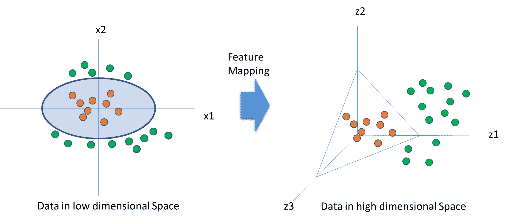

为了对上图中的绿色和红色点进行分类，特征映射函数必须获取数据，并将 is 从 2D 变为 3D，即*φ= R²→R³*。这个等式如下:

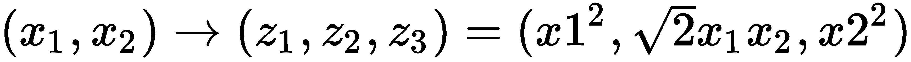

内核方法的目标是计算并选择内核函数 *K* 。这样我们就可以在新的维度中找到几何特征，并对数据模式进行分类。让我们看看这是如何做到的:

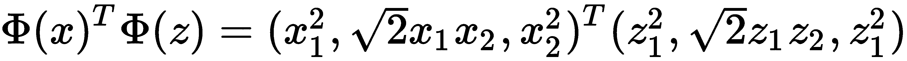

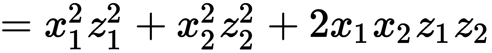

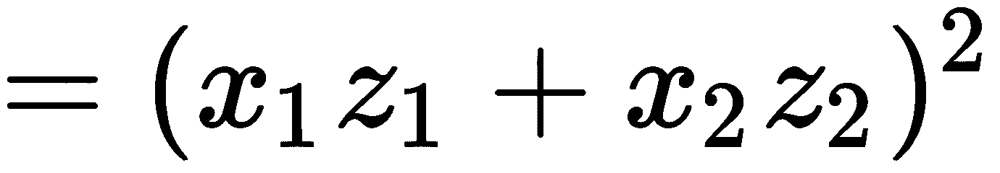

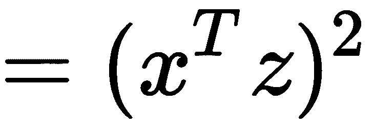

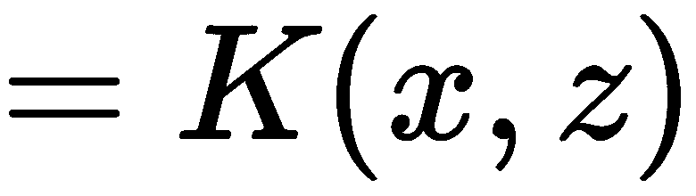

这里，Phi 是一个特征映射函数。但是我们是否总是需要知道特征映射函数呢？不完全是。内核函数 *K* 完成了这个任务。对于给定的核函数， *K* ，我们可以得出一个特征空间， *H* 。两种流行的核函数是高斯核函数和多项式核函数。

选择一个合适的核函数将使我们能够很好地找出新特征空间中的数据特征。

现在我们已经熟悉了内核技巧，让我们继续学习内核 PCA。


# 核主成分分析

内核 PCA 是一种算法，它不仅保持了 PCA 的主要精神，而且进一步利用了内核技巧，使其可用于非线性数据:

1.  让我们定义特征空间中数据的协方差矩阵，它是映射函数和映射函数的转置的乘积:

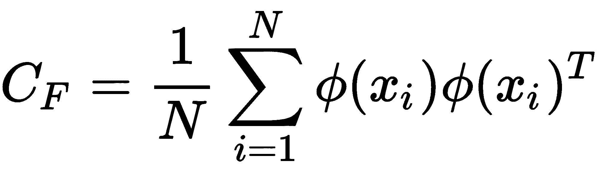

它类似于我们用于 PCA 的那个。

2.  下一步是求解以下方程，以便我们可以计算主成分:

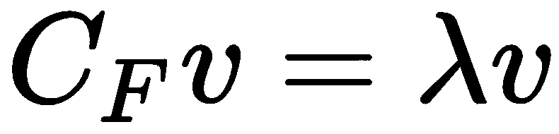

这里，*C[F]是数据在特征空间的协方差矩阵， *v* 是特征向量，*λ*(λ)是特征值。*

3.  我们把*第一步*的值代入*第二步*——也就是*第二步的等式中 *C [F]* 的值。*特征向量如下:

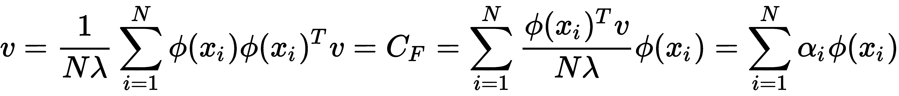

这里，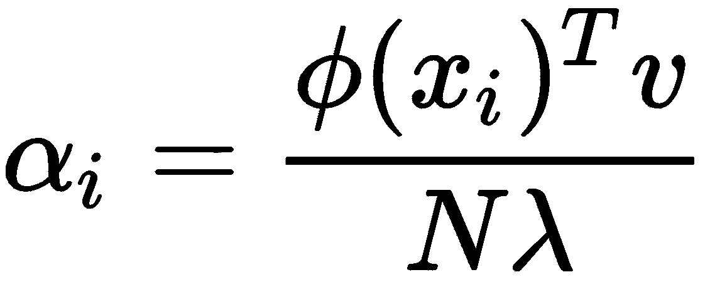是一个标量数。

4.  现在，让我们把核函数加入方程。让我们把公式两边的*φ(x[k])*，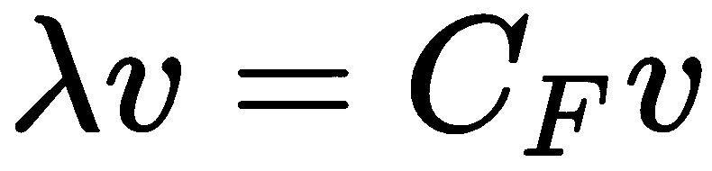:

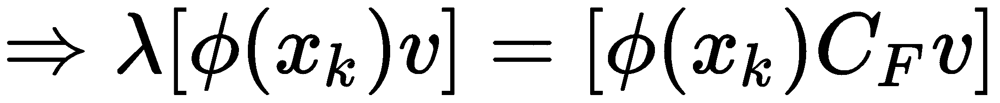

5.  让我们将*步骤 3* 中的等式中的 *v* 的值代入*步骤 4* 的等式中，如下所示:

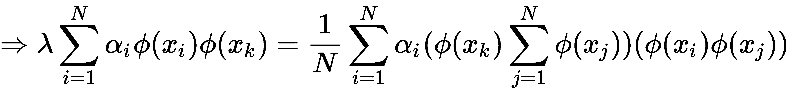

6.  现在，我们称*K*。通过键入 *K* 的值来简化*步骤 5* 的等式，我们得到以下结果:

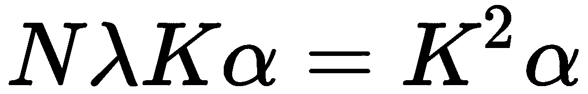

在进行特征分解时，我们得到以下结果:

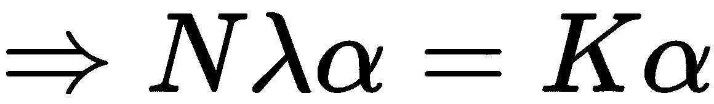

对用于中心定位的特征空间进行归一化，我们得到以下结果:

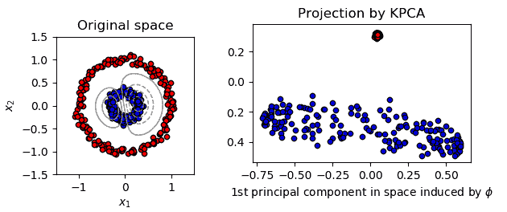

现在，让我们用 Python 执行内核 PCA。我们将保持简单，并在虹膜数据集上工作。我们还将了解如何在模型中利用新的压缩维度:

让我们加载库:

然后，加载数据，并为解释变量和目标变量创建单独的对象:

1.  让我们来看看说明性的数据:

```
import numpy as np # linear algebra
import pandas as pd # data processing
import matplotlib.pyplot as plt
from sklearn import datasets
```

2.  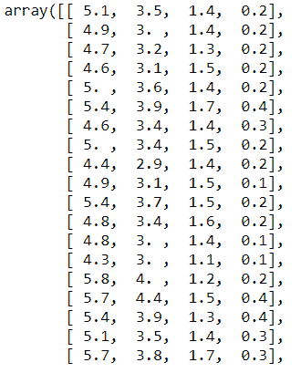

```
iris = datasets.load_iris()
X = iris.data 
y = iris.target
```

3.  让我们将数据分为训练集和测试集，如下所示:

```
X
```

现在，我们可以标准化数据:

4.  我们来看看`X_train`:

```
from sklearn.model_selection import train_test_split
X_train, X_test, y_train, y_test = train_test_split(X, y, test_size = 0.25, random_state = 0)
```

5.  输出如下所示:

```
from sklearn.preprocessing import StandardScaler
sc = StandardScaler()
X_train = sc.fit_transform(X_train)
X_test = sc.transform(X_test)
```

6.  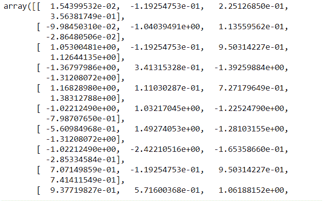

```
X_train
```

现在，让我们将内核 PCA 应用于此。这里，我们试图将数据压缩成两个部分。这里选择的核是径向基函数:

在核主成分分析的帮助下，我们得到了新的训练和测试数据。

7.  让我们看看数据是什么样的:

```
from sklearn.decomposition import KernelPCA
kpca = KernelPCA(n_components = 2, kernel = 'rbf')
X_train2 = kpca.fit_transform(X_train)
X_test2 = kpca.transform(X_test)
```

我们得到以下输出:

8.  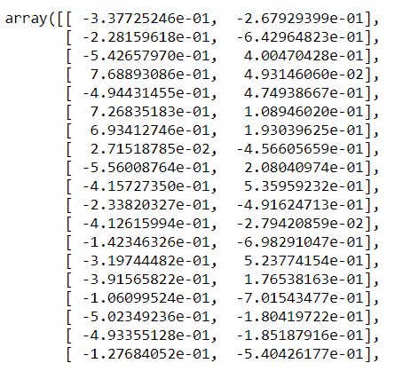

```
X_train2
```

现在，我们这里有两个组件。前面，`X_train`给我们展示了四个变量。现在，数据被缩减为两个字段。

独立成分分析

**独立成分分析** ( **ICA** )在降维方面类似于 PCA。然而，它起源于信号处理领域，其中存在这样的问题，即多个信号从多个来源传输，并且设置了多个设备来捕捉它。然而，问题是该设备捕获的信号不是很清晰，因为它碰巧是许多来源的混合。他们需要对产生 ICA 的不同设备有清晰和独立的接收。赫拉尔特和朱滕在 1996 年提出了这个观点。


# 主成分分析和独立成分分析的区别在于，主成分分析侧重于寻找不相关的因素，而独立成分分析则是推导出独立的因素。迷茫？让我帮你做。不相关的因素意味着它们之间没有线性关系，而独立性意味着两个因素彼此没有关系。例如，在数学上取得好成绩与你生活在哪个州无关。

该算法的基本假设是变量是未知潜在变量和独立变量的线性混合物。

数据 *x [i] (t)* 使用隐藏变量 *s [i] (t)* 建模:

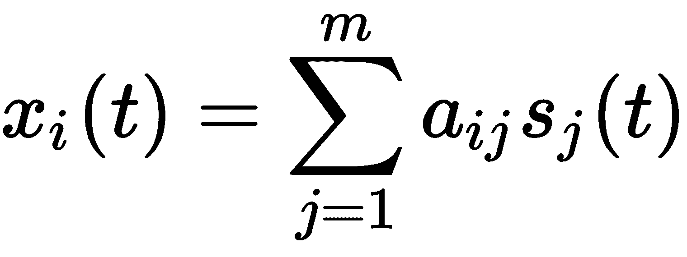

这里， *i= 1，2，3..........【T11 号】*

也可以用矩阵分解的形式写成 **x=As** :

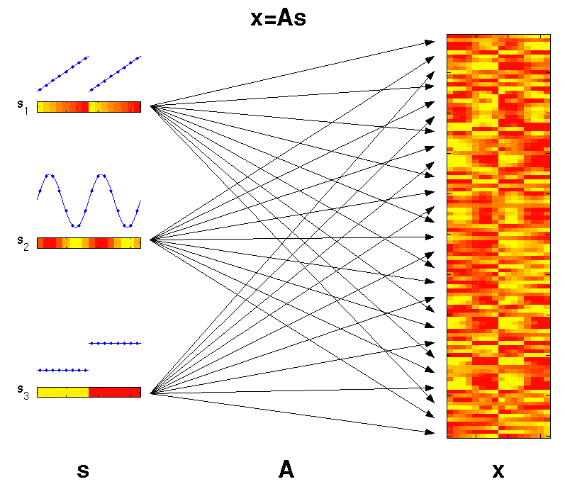

在这里，我们有以下内容:

**A** :常数混合矩阵

**s** :相互独立的潜在因素矩阵

*   当我们已经得到 **X** 时，我们必须估计 **A** 和 **s** 的值。
*   换句话说，我们的目标是找到 *W* ，也就是*W = A*^(*-1*)，这是一个未混合矩阵。

这里， *s [ij]* 必须是统计独立且非高斯的(不遵循正态分布)。

独立分量分析预处理

ICA 的预处理可以如下进行:


# **对中**:第一步是对中 *x* 。也就是说，我们需要从 *x* 中减去它的均值向量，从而使 *x* 成为一个零均值变量。

**白化**:在将数据放入 ICA 之前，我们应该对数据进行白化。这意味着数据必须是不相关的。从几何学上来说，它倾向于恢复数据的初始形状，并且只需要旋转结果矩阵。

*   方法
*   为了找出什么分解矩阵是独立的，我们必须依靠非高斯性。让我们看看我们如何能做到这一点。


# 这里，我们将需要最大化峰度，这将把分布变成非高斯分布。这将产生独立的组件。下图显示了快速 ICA 的图像:

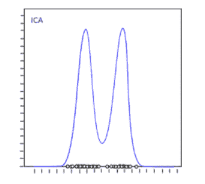

为此，我们在 Python 中有了`FastICA`库。

让我们看看如何在 Python 中执行这个。我们将使用相同的虹膜数据。对于执行 ICA 来说，这可能不是一个理想的数据集，但是这样做是出于方向性的目的。要在 Python 中执行代码，我们需要执行以下步骤:

首先，我们需要加载库:

现在，我们需要加载数据:

让我们将数据划分为训练集和测试集:

1.  让我们将数据设为标准标量:

```
import numpy as np # linear algebra
import pandas as pd # data processing
import matplotlib.pyplot as plt
from sklearn import datasets
```

2.  现在，我们需要在 ICA 库中加载:

```
iris = datasets.load_iris()
X = iris.data 
y = iris.target
```

3.  我们如下执行 ICA。这里我们将坚持三个组成部分:

```
from sklearn.model_selection import train_test_split
X_train, X_test, y_train, y_test = train_test_split(X, y, test_size = 0.25, random_state = 0)
```

4.  然后，我们将绘制结果，如下所示:

```
from sklearn.preprocessing import StandardScaler
sc = StandardScaler()
X_train = sc.fit_transform(X_train)
X_test = sc.transform(X_test)
```

5.  其输出如下所示:

```
from sklearn.decomposition import FastICA
```

6.  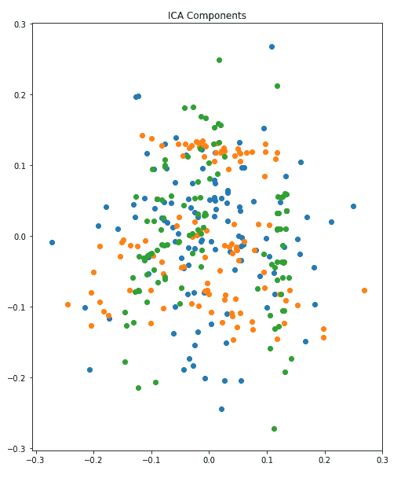

```
ICA = FastICA(n_components=3, random_state=10,whiten= True) 
X=ICA.fit_transform(X_train)
```

7.  我们可以在这里看到三种不同的成分(按颜色)。

```
plt.figure(figsize=(8,10))
plt.title('ICA Components')
plt.scatter(X[:,0], X[:,1])
plt.scatter(X[:,1], X[:,2])
plt.scatter(X[:,2], X[:,0])
```

压缩传感

压缩感知是信息论和信号处理领域中最容易解决的问题之一。这是一种信号采集和重建技术，其中信号是可压缩的。信号必须是稀疏的。压缩检测试图将信号样本与函数相匹配，并且它倾向于使用尽可能少的基本函数来匹配样本。下图对此进行了描述:

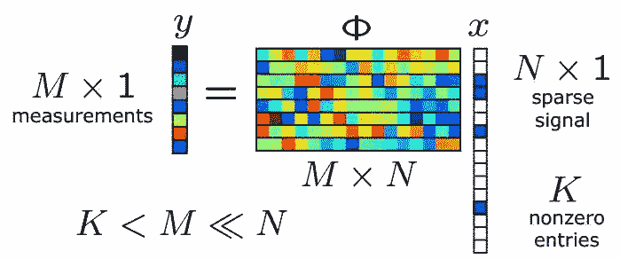


# 这是我们在线性代数中看到的素数方程之一，其中 **y** 是一个 **M x 1** 矩阵，phi 是一个 **M x N** 矩阵，其列数大于行数，而 **x** 是一个包含 **k** 个非零元素的 **N x 1** 矩阵。有这么多未知数，表示为一个 **N** 长度向量和 **M** 个测量值，其中**M<N**。在这种类型的方程中，我们知道许多解是可能的，因为这个矩阵的零空间是非平凡的。因此，这个方程可以容纳许多解。

我们的目标

我们的目标是找出所有解决方案中非零条目最少的解决方案。也就是说，解应该给我们尽可能少的非零值。你想知道这可以应用在哪里吗？它有很多应用。它可以应用的领域如下:

信号表示法


# 医学成像

稀疏信道估计

*   假设我们得到了一个时间信号。这个信号非常稀疏，但我们对它有一点了解，因为它有几个频率。你能从前面的等式中感觉到它是什么吗？是的，可以认为是 *X* 。
*   姑且称这个**未知**信号 *X* 。现在，即使我们不知道整个信号，我们仍然可以对它或样本进行观察，如下面的代码所示:
*   这将形成一个随机方程:

现在，我们需要符合标准。我们得到以下输出:

然后，我们需要拟合`l2`范数。我们得到以下输出:

```
import numpy as np
import matplotlib as mpl
import matplotlib.pyplot as plt
import scipy.optimize as spopt
import scipy.fftpack as spfft
import scipy.ndimage as spimg
import cvxpy as cvx
```

将两个正弦波相加，我们得到以下输出:

```
x = np.sort(np.random.uniform(0, 15, 30))
y = 5 + 0.5 * x + 0.1 * np.random.randn(len(x))
```

现在，让我们把样品从`n`拿出来:

```

l1 = lambda x0, x, y: np.sum(np.abs(x0[0] * x + x0[1] - y))
opt1 = spopt.fmin(func=l1, x0=[1, 1], args=(x, y))
```

让我们创建`idct`矩阵运算符:

```

l2 = lambda x0, x, y: np.sum(np.power(x0[0] * x + x0[1] - y, 2))
opt2 = spopt.fmin(func=l2, x0=[1, 1], args=(x, y))

y2 = y.copy()
y2[3] += 5
y2[13] -= 10
xopt12 = spopt.fmin(func=l1, x0=[1, 1], args=(x, y2))
xopt22 = spopt.fmin(func=l2, x0=[1, 1], args=(x, y2))
```

其输出如下所示:

```
n = 10000
t = np.linspace(0, 1/5, n)
y = np.sin(1250 * np.pi * t) + np.sin(3000 * np.pi * t)
yt = spfft.dct(y, norm='ortho')
plt.figure(figsize=[10,5])
plt.plot(t,y)
plt.title('Original signal')
plt.xlabel('Time (s)')
plt.ylabel('y')
```

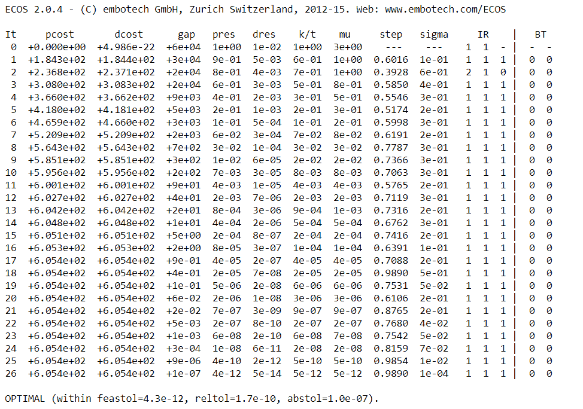

```
m = 1000 # 10% sample
ran = np.random.choice(n, m, replace=False) # random sample of indices
t2 = t[ran]
y2 = y[ran]
```

要重建信号，我们必须做到以下几点:

```
# create idct matrix operator
A = spfft.idct(np.identity(n), norm='ortho', axis=0)
A = A[ran]
# do L1 optimization
vx = cvx.Variable(n)
objective = cvx.Minimize(cvx.norm(vx, 1))
constraints = [A*vx == y2]
prob = cvx.Problem(objective, constraints)
result = prob.solve(verbose=True)
```

这就是我们如何重建信号。

自组织地图

**自组织地图** ( **SOM** )是 Teuvo Kohonen 在 20 世纪 80 年代发明的。有时，它们被称为**科霍宁地图**。那么，它们为什么存在？这种映射的主要动机是通过神经网络来降低维数。下图显示了来自输入图层的不同 2D 模式:

```
x = np.array(vx.value)
x = np.squeeze(x)
signal = spfft.idct(x, norm='ortho', axis=0)
```

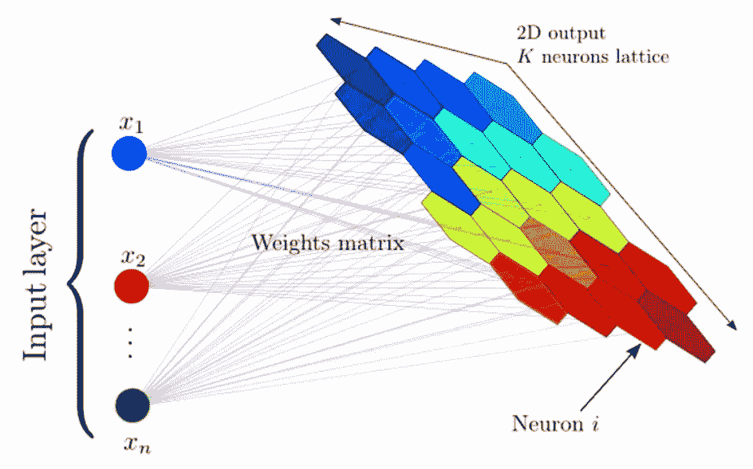


# 它们将列数作为输入。正如我们从 2D 输出中看到的，它将数据集中的列数量转换并减少到 2D 中。

下面的链接通向 2D 输出:[https://www.cs.hmc.edu/~kpang/nn/som.html](https://www.cs.hmc.edu/~kpang/nn/som.html)

上图描述的是 2D 基于各种因素的健康状况。也就是说，它显示了他们是富有还是贫穷。其他要考虑的因素有教育、生活质量、卫生、通货膨胀和健康。因此，它形成了一个巨大的列集或维度集。比利时和瑞典等国家似乎显示出类似的特征，表明它们在健康指标上得分很高。

由于这是一种无监督的学习技术，数据没有被标记。仅基于模式，神经网络就能够理解哪个国家应该被放置在哪里。

与我们刚刚讨论的情况类似，可以利用自组织地图的机会很多。可以认为它在本质上类似于 K-均值聚类。

The depiction of the preceding diagram in 2D talks about a health of the country based on various factors. That is, it shows whether they are rich or poor. Some other factors that are taken into account are education, quality of life, sanitation, inflation, and health. Therefore, it forms a huge set of columns or dimensions. Countries such as Belgium and Sweden seem to show similar traits, depicting that they have got a good score on the health indicator.

索姆

让我们来看看 SOMs 是如何学习的:

每个节点的权重由小的标准化随机值初始化。这些就像不同输出节点的坐标。


# 第一行的输入(从所有变量中取出第一行)被送入第一个节点。

现在，我们有两个向量。如果 *V* 是当前输入向量， *W* 是节点的权重向量，那么我们计算欧几里德距离，如下所示:

1.  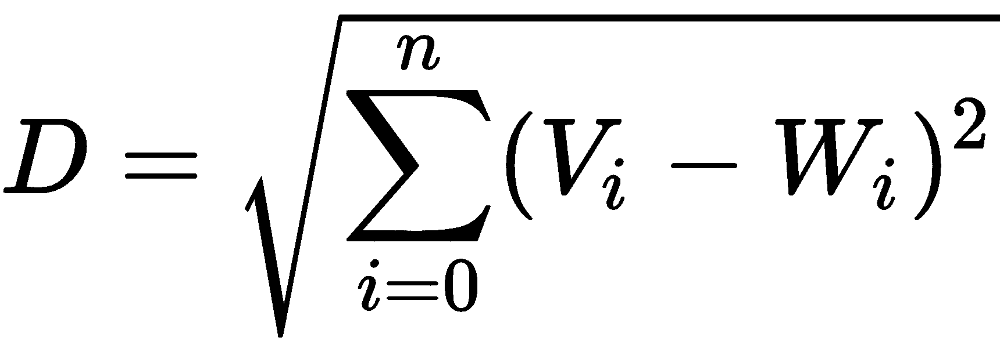
2.  具有最接近输入向量的权重向量的节点被标记为**最佳匹配单元** ( **BMU** )。
3.  对输入和权重向量的所有行执行类似的操作。bmu 适用于所有人。

一旦为每次迭代确定了 BMU，就可以计算 BMU 邻域内的其他节点。相同半径内的节点将更新其权重。绿色箭头表示半径。慢慢地，邻域将缩小到只有一个结点的大小，如下图所示:

4.  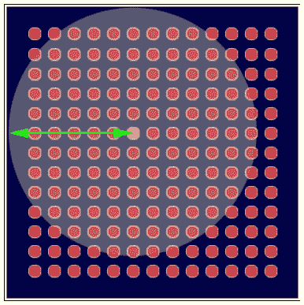
5.  Kohonen 算法最有趣的部分是邻域的半径不断缩小。它通过指数衰减函数发生。λ的值取决于σ。为运行算法而选择的迭代次数由以下等式给出:
6.  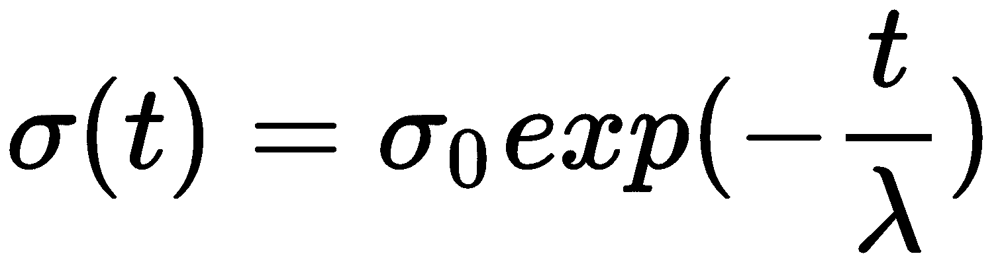

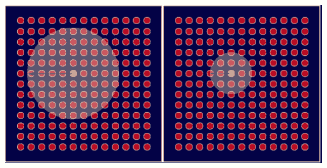

7.  权重通过以下等式更新:

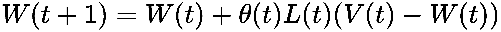

在这里，这是如下:

8.  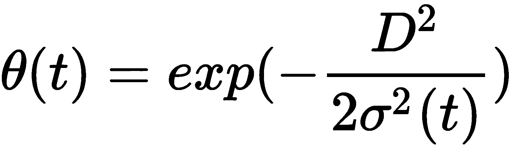

*t= 1，2...*可以解释如下:

Here, this is as follows:

*L(t)* :学习率

*D* :节点到 BMU 的距离

*   *σ* :函数的宽度
    *   现在，让我们用 Python 实现一个用例。我们将尝试检测信用卡数据集中的欺诈行为:
    *   让我们加载库:
    *   现在，是时候加载数据了:

接下来，我们将标准化数据:

1.  让我们导入`minisom`库并键入超参数，即学习率、sigma、长度和迭代次数:

```
import numpy as np
import matplotlib.pyplot as plt
import pandas as pd
```

2.  让我们来看看结果:

```
data = pd.read_csv('Credit_Card_Applications.csv')
X = data.iloc[:, :-1].values
y = data.iloc[:, -1].values
```

3.  前面的代码将生成以下输出:

```
from sklearn.preprocessing import MinMaxScaler
sc = MinMaxScaler(feature_range = (0, 1))
X = sc.fit_transform(X)
```

4.  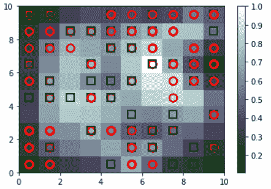

```
from minisom import MiniSom
som = MiniSom(x = 10, y = 10, input_len = 15, sigma = 1.0, learning_rate = 0.5)
som.random_weights_init(X)
som.train_random(data = X, num_iteration = 100)    
```

5.  我们可以看到有欺诈倾向的节点有白色背景。这意味着我们可以在这些节点的帮助下追踪这些客户:

```
from pylab import bone, pcolor, colorbar, plot, show
bone()
pcolor(som.distance_map().T)
colorbar()
markers = ['o', 's']
colors = ['r', 'g']
for i, x in enumerate(X):
 w = som.winner(x)
 plot(w[0] + 0.5,
 w[1] + 0.5,
 markers[y[i]],
 markeredgecolor = colors[y[i]],
 markerfacecolor = 'None',
 markersize = 10,
 markeredgewidth = 2)
show()
```

这会给你欺诈的模式。

贝叶斯多重插补

贝叶斯多重插补具有贝叶斯框架的精神。需要指定完整数据的参数模型和未知模型参数的先验分布， *θ* 。随后， *m* 个独立试验从缺失数据中抽取，如使用贝叶斯定理由观察数据给出的。马尔可夫链蒙特卡罗可以用来模拟缺失数据的整个联合后验分布。身体质量指数在生成缺失值的插补时遵循正态分布。

```
mappings = som.win_map(X)
frauds = np.concatenate((mappings[(8,1)], mappings[(6,8)]), axis = 0)
frauds = sc.inverse_transform(frauds)                                         
```

假设数据如下:


# *Y = (Yobs，Ymiss)，*

这里， *Yobs* 是观察到的 *Y* 和 *Ymiss* 是缺失的 *Y.*

Let's say that the data is as follows:

如果 *P(Y|θ)* 是参数模型，则参数 *θ* 是参数化正态分布的均值和协方差矩阵。如果是这种情况，让 *P(θ)* 成为先验:

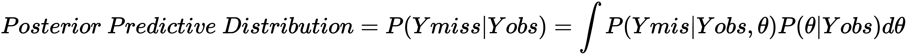

让我们利用 R 中的`Amelia`包并执行它:

现在，让我们进行估算:

摘要

在这一章中，我们学习了核主成分分析和独立成分分析。我们还学习了压缩感知、压缩感知的目标、自组织地图及其工作原理。最后，我们得出了贝叶斯多重插补的结论。

```
library(foreign)
dataset = read.spss("World95.sav", to.data.frame=TRUE)

library(Amelia)

myvars <- names(dataset) %in% c("COUNTRY", "RELIGION", "REGION","CLIMATE") 
newdata <- dataset[!myvars]
```

Now, let's make the imputation:

```
impute.out <- amelia(newdata, m=4)
```


# Summary

In this chapter, we have studied the Kernel PCA, along with ICA. We also studied compressed sensing, the goals of compressed sensing, and self-organizing maps and how they work. Finally, we concluded with Bayesian multiple imputations.