# 一、使用 R 的实用机器学习

在本章中，我们将讨论以下主题:

*   下载并安装 R
*   下载和安装 RStudio
*   安装和加载软件包
*   读取和写入数据
*   使用 R 操作数据
*   应用基本统计数据
*   可视化数据
*   获取用于机器学习的数据集


# 简介

机器学习的目的是揭示隐藏的模式，未知的相关性，并从数据中找到有用的信息。除此之外，通过与数据分析相结合，机器学习可用于执行预测性分析。有了机器学习，对业务运营和流程的分析就不局限于人的尺度思维；机器规模分析使企业能够捕捉大数据中隐藏的价值。

机器学习与人类的推理过程有相似之处。与传统分析不同，生成的模型不会随着数据的积累而发展。机器学习可以从经过处理和分析的数据中学习。换句话说，处理的数据越多，它可以学习的就越多。

r 作为 GNU-S 的一种方言，是一种强大的统计语言，可以用来操作和分析数据。此外，R 提供了许多机器学习包和可视化功能，使用户能够动态分析数据。最重要的是，R 是开源免费的。

使用 R 大大简化了机器学习。你只需要知道每个算法如何解决你的问题，然后你就可以简单地用一个写好的包，用几个命令行就能快速生成数据上的预测模型。例如，您可以对垃圾邮件过滤执行朴素贝叶斯，对客户细分执行 k-means 聚类，使用线性回归预测房价，或者实现隐马尔可夫模型来预测股票市场，如下面的屏幕截图所示:

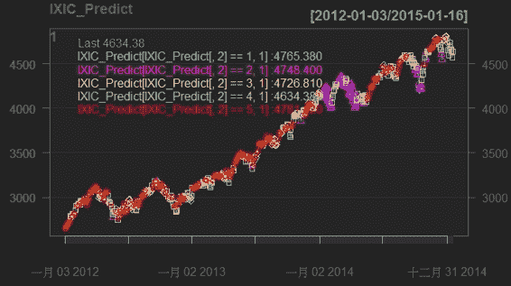

使用 R 的股票市场预测

此外，您可以执行非线性降维来计算图像数据的相异度，并可视化聚类图，如下面的截图所示。你所需要做的就是按照这本书里提供的食谱去做。

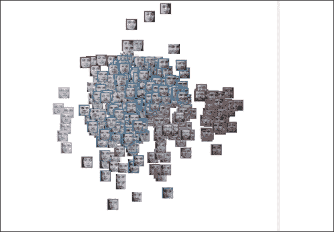

人脸图像数据的聚类图

这一章是对机器学习和 R 的全面介绍；前几个菜谱介绍了如何设置 R 环境和集成开发环境 RStudio。设置好环境后，下面的食谱介绍了包的安装和加载。为了理解如何使用 R 进行数据分析，接下来的四个方法包括使用 R 进行数据读/写、数据操作、基本统计和数据可视化。本章的最后一个方法列出了有用的数据源和资源。


# 下载并安装 R

要使用 R，你必须先在你的电脑上安装 T4。这个菜谱给出了如何下载和安装 r。


## 准备就绪

如果你是 R 语言的新手，你可以在官方网站([http://www.r-project.org](http://www.r-project.org)/)上找到详细的介绍、语言历史和功能。当你准备好下载安装 R 的时候，请访问以下链接:[http://cran.r-project.org/](http://cran.r-project.org/)。


## 怎么做...

请执行以下步骤为 Windows 和 Mac 用户下载并安装 R:

1.  Go to the R CRAN website, [http://www.r-project.org/](http://www.r-project.org/), and click on the **download R** link, that is, [http://cran.r-project.org/mirrors.html](http://cran.r-project.org/mirrors.html)):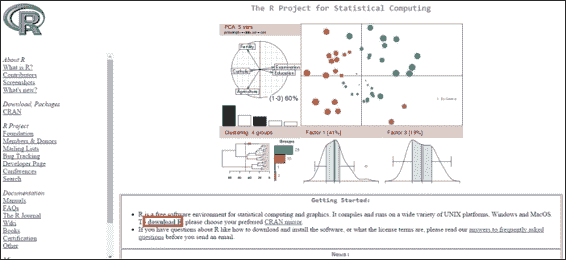
2.  You may select the mirror location closest to you: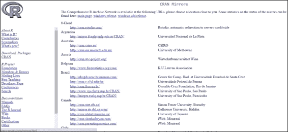

    曲柄镜

3.  Select the correct download link based on your operating system: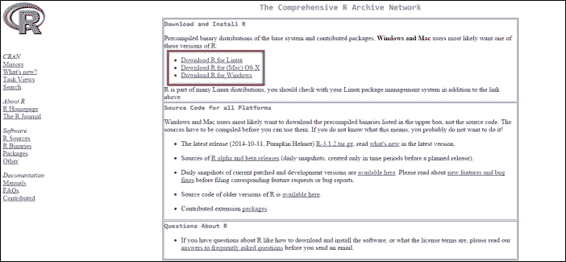

    根据您的操作系统点击下载链接

由于 R 的安装对于 Windows 和 Mac 是不同的，这里提供了为每个操作系统安装 R 所需的步骤。

对于 Windows 用户:

1.  Click on **Download R for Windows**, as shown in the following screenshot, and then click on **base**: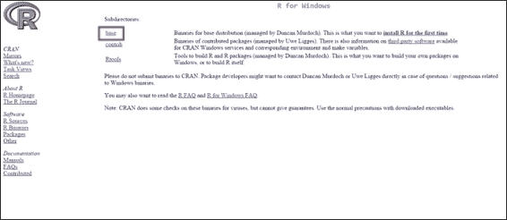

    转到“下载 R for Windows”并点击“基础”

2.  Click on **Download R 3.x.x for Windows**: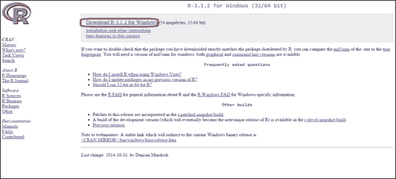

    点击“下载 R 3.x.x for Windows”

3.  The installation file should be downloaded. Once the download is finished, you can double-click on the installation file and begin installing R: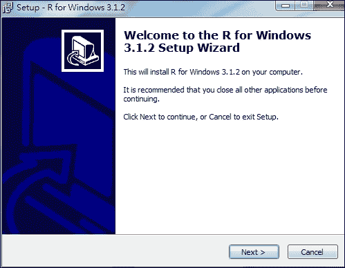
4.  R 的 Windows 安装相当简单；安装 GUI 可能会指导您如何逐步安装程序(公共许可证、目标位置、选择组件、启动选项、启动菜单文件夹和选择附加任务)。如果不想进行任何更改，请将所有安装选项保留为默认设置。
5.  After successfully completing the installation, a shortcut to the R application will appear in your Start menu, which will open the R Console: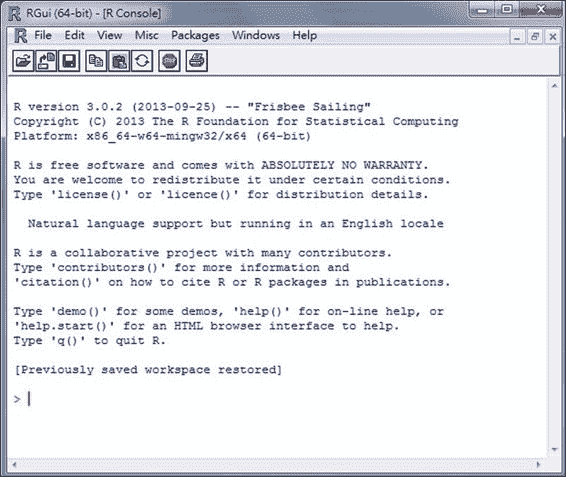

    Windows R 控制台

对于 Mac OS X 用户:

1.  进入到**下载(Mac)OS X R，**如这张截图所示。
2.  Click on the latest version (`.pkg` file extension) according to your Mac OS version: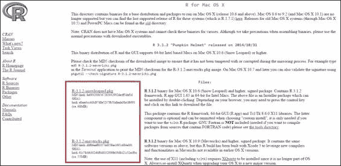
3.  Double-click on the downloaded installation file (`.pkg` extension) and begin to install R. Leave all the installation options as the default settings if you do not want to make any changes:
4.  按照屏幕指示，**简介**，**读我**，**执照**，**目的地选择**，**安装类型**，**安装**，**汇总**，点击**继续**至完成安装。
5.  After the file is installed, you can use **Spotlight Search** or go to the application folder to find R: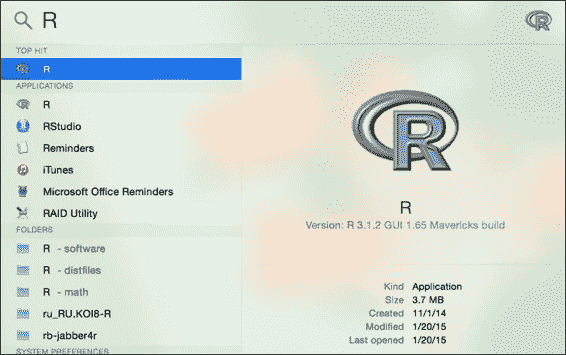

    使用“聚光灯搜索”查找 R

6.  Click on R to open **R Console**: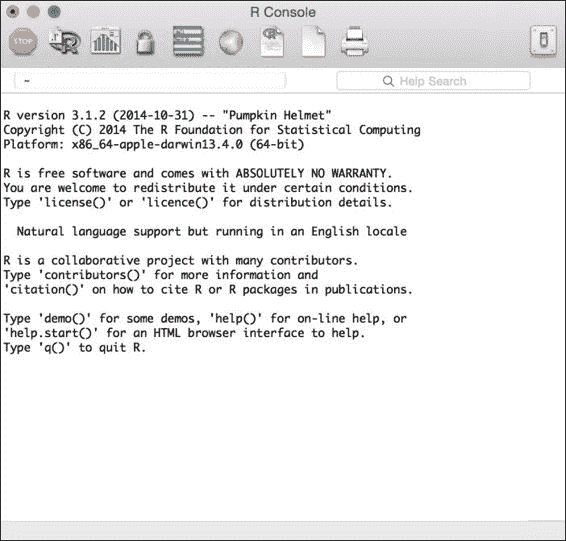

作为下载一个 Mac `.pkg`文件来安装 R 的替代方案，Mac 用户也可以使用 Homebrew 安装 R:

1.  从 https://xquartz.macosforge.org/landing/[下载`XQuartz-2.X.X.dmg`](https://xquartz.macosforge.org/landing/)。
2.  双击`.dmg`文件上的将其挂载。
3.  使用以下命令行更新 brew:

    ```r
     $ brew update 
    ```

4.  克隆存储库并将其所有公式符号链接到`homebrew/science` :

    ```r
     $ brew tap homebrew/science 
    ```

5.  安装 gfortran:

    ```r
     $ brew install gfortran 
    ```

6.  安装 R:

    ```r
     $ brew install R 
    ```

    

对于 Linux 用户，有针对 Debian、Red Hat、SUSE 和 Ubuntu 的预编译二进制文件。或者，您可以从源代码安装 R。除了下载预编译的二进制文件，还可以通过包管理器安装 R for Linux。下面是 CentOS 和 Ubuntu 的安装步骤。

下载并在 Ubuntu 上安装 R:

1.  将条目添加到`/etc/apt/sources.list`文件:

    ```r
     $ sudo sh -c "echo 'deb http:// cran.stat.ucla.edu/bin/linux/ubuntu precise/' >> /etc/apt/sources.list" 
    ```

2.  然后，更新资源库:

    ```r
     $ sudo apt-get update 
    ```

3.  用下面的命令安装 R:

    ```r
     $ sudo apt-get install r-base 
    ```

4.  在命令行中启动 R:

    ```r
     $ R 
    ```

下载和在 CentOS 5 上安装 R:

1.  获取 rpm CentOS5 RHEL EPEL 存储库 CentOS5:

    ```r
     $ wget http://dl.fedoraproject.org/pub/epel/5/x86_64/epel-release-5-4.noarch.rpm 
    ```

2.  安装 CentOS5 RHEL EPEL 库:

    ```r
     $ sudo rpm -Uvh epel-release-5-4.noarch.rpm 
    ```

3.  更新已安装的软件包:

    ```r
     $ sudo yum update 
    ```

4.  通过资源库安装 R:

    ```r
     $ sudo yum install R 
    ```

5.  在命令行中启动 R:

    ```r
     $ R 
    ```

下载和在 CentOS 6 上安装 R:

1.  获取 rpm CentOS5 RHEL EPEL 库的 CentOS6:

    ```r
     $ wget http://dl.fedoraproject.org/pub/epel/6/x86_64/epel-release-6-8.noarch.rpm 
    ```

2.  安装 CentOS5 RHEL EPEL 库:

    ```r
     $ sudo rpm -Uvh epel-release-6-8.noarch.rpm 
    ```

3.  更新已安装的软件包:

    ```r
     $ sudo yum update 
    ```

4.  通过资源库安装 R:

    ```r
     $ sudo yum install R 
    ```

5.  在命令行中启动 R:

    ```r
     $ R 
    ```


## 工作原理...

CRAN 为 Linux、Mac OS X 和 Windows 提供了预编译的二进制文件。对于 Mac 和 Windows 用户来说，安装过程非常简单。您通常可以按照屏幕上的说明来完成安装。对于 Linux 用户，可以使用每个平台提供的包管理器来安装 R 或者从源代码构建 R。


## 参见

*   对于那些计划从源代码构建 R 的人来说，请参考 **R 安装和管理**([http://cran.r-project.org/doc/manuals/R-admin.html](http://cran.r-project.org/doc/manuals/R-admin.html))，其中说明了如何在各种平台上安装 R。


# 下载并安装 RStudio

要编写 R 脚本，可以使用 R 控制台、R commander 或任何文本编辑器(EMACS、VIM 或 sublime)。然而，RStudio 的帮助，一个用于 R 的集成开发环境 ( **IDE** )可以让开发变得容易很多。

RStudio 为软件开发提供全面的设施。内置的功能，如语法高亮、代码完成和智能缩进，有助于最大限度地提高工作效率。为了使 R 编程更易于管理，RStudio 还将主界面集成到一个四面板布局中。它包括一个交互式 R 控制台，一个选项卡式源代码编辑器，一个用于当前活动对象/历史的面板，以及一个用于文件浏览器/绘图窗口/包安装窗口/R 帮助窗口的选项卡式面板。此外，RStudio 是开源的，可用于许多平台，如 Windows、Mac OS X 和 Linux。这个食谱展示了如何下载和安装 RStudio。


## 做好准备

RStudio 需要一个工作的 R 安装；加载 RStudio 时，它必须能够找到 R 的版本，因此，在继续安装 RStudio 之前，您必须在操作系统上安装了 R 的情况下完成之前的操作。


## 如何做到这一点...

执行以下步骤，为 Windows 和 Mac 用户下载并安装 RStudio:

1.  Access RStudio's official site by using the following URL: [http://www.rstudio.com/products/RStudio/](http://www.rstudio.com/products/RStudio/).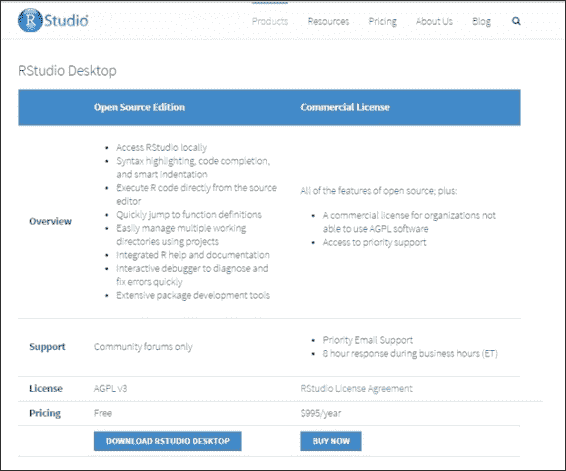
2.  For a desktop version installation, click on **Download RStudio Desktop** ([http://www.rstudio.com/products/rstudio/download/](http://www.rstudio.com/products/rstudio/download/)) and choose the RStudio recommended for your system. Download the relevant packages: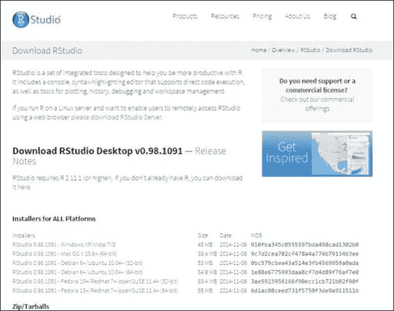
3.  Install RStudio by double-clicking on the downloaded packages. For Windows users, follow the onscreen instruction to install the application: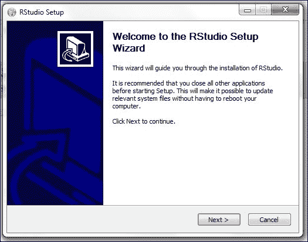
4.  For Mac users, simply drag the RStudio icon to the `Applications` folder: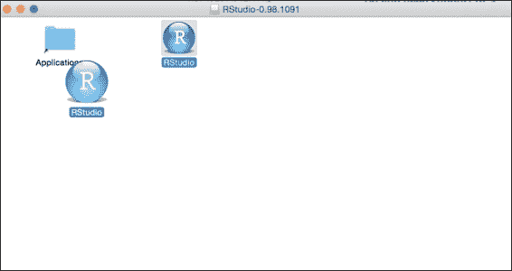
5.  Start RStudio: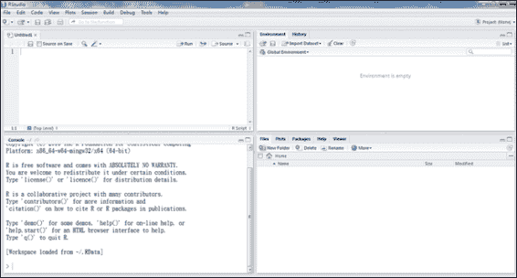

    RStudio 控制台

    为 Ubuntu/Debian 和 RedHat/Centos 用户下载和安装 RStudio 执行以下步骤:

对于 32 位 Debian(6+)/Ubuntu(10.04+):

对于 Debian(6+)/Ubuntu(10.04+) 64 位:

```r
$ wget http://download1.rstudio.org/rstudio-0.98.1091-i386.deb
$ sudo gdebi rstudio-0.98\. 1091-i386.deb

```

对于 red hat/CentOS(5.4+)32 位:

```r
$ wget http://download1.rstudio.org/rstudio-0.98\. 1091-amd64.deb
$ sudo gdebi rstudio-0.98\. 1091-amd64.deb

```

对于 red hat/CentOS(5.4+)64 位:

```r
$ wget http://download1.rstudio.org/rstudio-0.98\. 1091-i686.rpm
$ sudo yum install --nogpgcheck rstudio-0.98\. 1091-i686.rpm

```

工作原理

```r
$ wget http://download1.rstudio.org/rstudio-0.98\. 1091-x86_64.rpm
$ sudo yum install --nogpgcheck rstudio-0.98\. 1091-x86_64.rpm

```


## RStudio 程序可以在桌面上运行，也可以通过网络浏览器运行。桌面版适用于 Windows、Mac OS X 和 Linux 平台，在所有平台上的操作类似。对于 Windows 和 Mac 用户，在下载 RStudio 的预编译包后，按照前面步骤中显示的屏幕指示完成安装。Linux 用户可以使用为安装提供的包管理系统。

参见


## 除了桌面版本之外，用户还可以安装服务器版本，以便为多个用户提供访问。服务器版本提供了一个 URL，用户可以访问该 URL 来使用 RStudio 资源。要安装 RStudio，请参考以下链接:[http://www.rstudio.com/ide/download/server.html](http://www.rstudio.com/ide/download/server.html)。本页提供了以下 Linux 发行版的安装说明:Debian (6+)、Ubuntu (10.04+)、RedHat 和 CentOS (5.4+)。

*   对于其他 Linux 发行版，您可以从源代码构建 RStudio。
*   安装和加载软件包


# 在成功地安装 R 之后，用户可以从存储库中下载、安装和更新包。因为 R 允许用户创建他们自己的包，所以提供了官方和非官方的库来管理这些用户创建的包。 **CRAN** 是官方的 R 包库。目前，CRAN 包存储库包含 6，379 个可用包(截至 2015 年 2 月 27 日)。通过使用 CRAN 上提供的软件包，用户可以将 R 的功能扩展到机器学习、统计和相关目的。CRAN 是一个分布在世界各地的 FTP 和 web 服务器网络，为 r 存储相同的最新版本的代码和文档。您可以选择离您最近的 CRAN 镜像来下载软件包。

准备就绪


## 在您的主机上启动一个 R 会话。

如何做到这一点...


## 执行以下步骤来安装和加载 R 软件包:

加载已安装软件包列表:

```r
 > library() 
```

1.  设置默认曲轴镜像:

    ```r
     > chooseCRANmirror() 
    ```

2.  r 将返回一个 CRAN 镜像列表，然后要求用户要么键入镜像 ID 来选择它，要么输入 0 来退出:

从 CRAN 安装软件包；以套餐 e1071 为例:

```r
 > install.packages("e1071") 
```

1.  从 CRAN 更新包；以套餐 e1071 为例:

    ```r
     > update.packages("e1071") 
    ```

2.  加载包包:

    ```r
     > library(e1071) 
    ```

3.  如果您想查看软件包的文档，您可以使用`help`功能:

    ```r
     > help(package ="e1071") 
    ```

4.  如果您想查看该函数的文档，您可以使用`help`函数:

    ```r
     > help(svm, e1071) 
    ```

5.  或者，您可以使用帮助快捷键`?`查看该功能的帮助文档:

    ```r
     > ?e1071::svm 
    ```

6.  如果该函数没有提供任何文档，您可能希望在提供的文档中搜索给定的关键字。例如，如果您希望搜索与`svm`相关的文档:

    ```r
     > help.search("svm") 
    ```

7.  或者，您可以使用`??`作为`help.search`的快捷键:

    ```r
     > ??svm 
    ```

8.  要查看函数的参数，只需使用`args`函数。例如，如果您想知道`lm`函数的参数:

    ```r
     > args(lm) 
    ```

9.  有些包会提供例子和演示；您可以使用`example`或`demo`查看示例或演示。例如，可以通过键入以下命令来查看`lm`包的示例和`graphics`包的演示:

    ```r
     > example(lm) > demo(graphics) 
    ```

10.  要查看所有可用的演示，您可以使用演示功能将它们全部列出:

    ```r
     > demo() 
    ```

11.  工作原理


## 这个菜谱首先介绍如何查看已加载的包，如何从 CRAN 安装包，以及如何加载新的包。在安装包之前，对 CRAN 包的清单感兴趣的可以参考[http://CRAN . r-project . org/web/packages/available _ packages _ by _ name . html](http://cran.r-project.org/web/packages/available_packages_by_name.html)。

安装软件包时，还会提供与该软件包相关的文档。因此，您可以查看文档或已安装软件包和功能的相关帮助页面。此外，软件包还提供了演示和示例，可以帮助用户理解所安装软件包的功能。

参见


## 除了从 CRAN 安装软件包，还有其他的 R 软件包库，包括 Crantastic，一个用于评级和审查 CRAN 软件包的社区网站，以及 R-Forge，一个用于协作开发 R 软件包的中央平台。除此之外，Bioconductor 还为基因组数据分析提供 R 软件包。

*   如果您想找到相关的功能和软件包，请访问[http://cran.r-project.org/web/views/](http://cran.r-project.org/web/views/)的任务视图列表，或者在[http://rseek.org](http://rseek.org)搜索关键字。
*   读写数据


# 在开始浏览数据之前，必须将数据加载到 R 会话中。这个方法将引入方法来将数据从文件加载到内存中，或者使用 r 中的预定义数据。

做好准备


## 首先，在您机器上启动一个 R 会话。由于这个方法涉及到文件 IO 的步骤，如果用户没有指定完整路径，读写活动将发生在当前工作目录中。

您可以简单地在 R 会话中键入`getwd()`来获得当前的工作目录位置。但是，如果您想改变当前的工作目录，您可以使用`setwd("<path>")`，其中`<path>`可以替换为您想要的路径，来指定工作目录。

怎么做...


## 执行以下步骤，用 R 读写数据:

要查看 R 的内置数据集，请键入以下命令:

```r
 > data() 
```

1.  r 将返回一个`dataset`包中的数据集列表，该列表包含每个数据集的名称和描述。
2.  要将数据集`iris`加载到 R 会话中，键入以下命令:

    ```r
     > data(iris) 
    ```

3.  数据集 iris 现在被加载到数据框格式中，这是 R 中存储数据表的常用数据结构。
4.  要查看虹膜的数据类型，只需使用`class`功能:

    ```r
     > class(iris) [1] "data.frame" 
    ```

5.  `data.frame`控制台打印显示`iris`数据集处于数据帧结构中。
6.  使用保存功能将对象存储在文件中。例如，要将加载的虹膜数据保存到`myData.RData`中，使用以下命令:

    ```r
     > save(iris, file="myData.RData") 
    ```

7.  使用 load 函数将保存的对象读入 R 会话。例如，要从`myData.RData`加载虹膜数据，使用以下命令:

    ```r
     > load("myData.RData") 
    ```

8.  除了使用内置数据集之外，R 还提供了将数据从文本导入数据框的功能。例如，`read.table`函数可以将给定的文本格式化成数据帧:

    ```r
     > test.data = read.table(header = TRUE, text = " + a b + 1 2 + 3 4 + ") 
    ```

9.  您也可以使用`row.names`和`col.names`来指定列和行的名称:

    ```r
     > test.data = read.table(text = " + 1 2 + 3 4",  + col.names=c("a","b"), + row.names = c("first","second")) 
    ```

10.  查看`test.data`变量的类:

    ```r
     > class(test.data) [1] "data.frame" 
    ```

11.  `class`函数显示`test.data`变量包含一个数据框。
12.  在中，除了使用`read.table`功能导入数据，您还可以使用`write.table`功能将数据导出到文本文件:

    ```r
     > write.table(test.data, file = "test.txt" , sep = " ") 
    ```

13.  `write.table`函数会将`test.data`的内容写入`test.txt`(写入的路径可以通过输入`getwd()`找到)，中间有一个分隔符作为空格。
14.  与`write.table`类似，`write.csv`也可以将数据导出到文件中。但是，`write.csv`使用逗号作为默认分隔符:

    ```r
     > write.csv(test.data, file = "test.csv") 
    ```

15.  使用`read.csv`功能，可以将`csv`文件作为数据帧导入。然而，最后一个示例将数据框的列名和行名写入`test.csv`文件。因此，将表头指定为`TRUE`并将行名指定为函数内的第一列，可以确保读取的数据帧不会将表头和第一列视为值:

    ```r
     > csv.data = read.csv("test.csv", header = TRUE, row.names=1) > head(csv.data)   a b 1 1 2 2 3 4 
    ```

16.  工作原理


## 通常，要收集的数据可能有多个文件和不同的格式。为了在文件和 RData 之间交换数据，R 提供了许多内置函数，如`save`、`load`、`read.csv`、`read.table`、`write.csv`、`write.table`。

这个例子首先演示了如何将内置数据集 iris 加载到 R 会话中。iris 数据集是机器学习领域中最著名和最常用的数据集。这里，我们使用虹膜数据集作为例子。菜谱显示了如何保存 RData 并用`save`和`load`函数加载它。此外，该示例说明了如何使用`read.table`、`write.table`、`read.csv`和`write.csv`将数据从文件交换到数据帧。使用 R IO 函数读写数据非常重要，因为大多数数据源都是外部的。因此，您必须使用这些函数将数据加载到 R 会话中。

参见


## 对于`load`、`read.table`和`read.csv`功能，要读取的文件也可以是完整的 URL(对于支持的 URL，使用`?url`了解更多信息)。

在某些场合，数据可能在 Excel 文件中，而不是平面文本文件中。`WriteXLS`包允许将一个对象写入一个 Excel 文件，在第一个参数中给定一个变量，在第二个参数中写入该文件:

安装`WriteXLS`包:

```r
 > install.packages("WriteXLS") 
```

1.  加载`WriteXLS`包:

    ```r
     > library("WriteXLS") 
    ```

2.  使用`WriteXLS`函数将数据帧虹膜写入名为`iris.xls` :

    ```r
     > WriteXLS("iris", ExcelFileName="iris.xls") 
    ```

    的文件中
3.  用 R 来操纵数据


# 这个菜谱将讨论如何使用内置的 R 函数来操作数据。由于数据处理是大多数分析程序中最耗时的部分，你应该了解如何对数据应用这些功能。

准备就绪


## 通过在操作系统上安装 R，确保您已经完成了之前的制作方法。

怎么做...


## 执行以下步骤，用 r 操作数据。

使用手镯符号对数据进行子集划分:

将数据集 iris 加载到 R 会话:

```r
 > data(iris) 
```

1.  要选择值，您可以使用括号符号来指定数据集的索引。第一个索引用于行，第二个用于列:

    ```r
     > iris[1,"Sepal.Length"] [1] 5.1 
    ```

2.  您也可以使用 c():

    ```r
     > Sepal.iris = iris[, c("Sepal.Length", "Sepal.Width")] 
    ```

    选择多个列
3.  然后你可以使用`str()`来总结和显示`Sepal.iris`的内部结构:

    ```r
     > str(Sepal.iris) 'data.frame':  150 obs. of  2 variables:  $ Sepal.Length: num  5.1 4.9 4.7 4.6 5 5.4 4.6 5 4.4 4.9 ...  $ Sepal.Width : num  3.5 3 3.2 3.1 3.6 3.9 3.4 3.4 2.9 3.1 .. 
    ```

4.  为了用给定的索引行对数据进行子集化，可以用括号符号在第一个索引处指定索引。在本例中，我们向您展示了如何在选择了`Sepal.Length`列和`Sepal.Width`列的情况下对前五条记录的数据进行子集化:

    ```r
     > Five.Sepal.iris = iris[1:5, c("Sepal.Length", "Sepal.Width")] > str(Five.Sepal.iris) 'data.frame':	5 obs. of  2 variables:  $ Sepal.Length: num  5.1 4.9 4.7 4.6 5  $ Sepal.Width : num  3.5 3 3.2 3.1 3.6 
    ```

5.  也可以设置条件来过滤数据。例如，使用所有五个变量筛选包含 setosa 数据的返回记录。在下面的示例中，第一个索引指定返回标准，第二个索引指定返回变量的索引范围:

    ```r
     > setosa.data = iris[iris$Species=="setosa",1:5] > str(setosa.data) 'data.frame':	50 obs. of  5 variables:  $ Sepal.Length: num  5.1 4.9 4.7 4.6 5 5.4 4.6 5 4.4 4.9 ...  $ Sepal.Width : num  3.5 3 3.2 3.1 3.6 3.9 3.4 3.4 2.9 3.1 ...  $ Petal.Length: num  1.4 1.4 1.3 1.5 1.4 1.7 1.4 1.5 1.4 1.5 ...  $ Petal.Width : num  0.2 0.2 0.2 0.2 0.2 0.4 0.3 0.2 0.2 0.1 ...  $ Species     : Factor w/ 3 levels "setosa","versicolor",..: 1 1 1 1 1 1 1 1 1 1 ... 
    ```

6.  或者，`which`函数返回满意数据的索引。以下示例返回包含等于`setosa` :

    ```r
     > which(iris$Species=="setosa")  [1]  1  2  3  4  5  6  7  8  9 10 11 12 13 14 15 16 17 18 [19] 19 20 21 22 23 24 25 26 27 28 29 30 31 32 33 34 35 36 [37] 37 38 39 40 41 42 43 44 45 46 47 48 49 50 
    ```

    的物种的虹膜数据的索引
7.  由操作返回的索引然后可以被应用作为选择包含刚毛鸢尾物种的索引。以下示例返回包含所有五个变量的 setosa:

    ```r
     > setosa.data = iris[which(iris$Species=="setosa"),1:5] > str(setosa.data) 'data.frame':	50 obs. of  5 variables:  $ Sepal.Length: num  5.1 4.9 4.7 4.6 5 5.4 4.6 5 4.4 4.9 ...  $ Sepal.Width : num  3.5 3 3.2 3.1 3.6 3.9 3.4 3.4 2.9 3.1 ...  $ Petal.Length: num  1.4 1.4 1.3 1.5 1.4 1.7 1.4 1.5 1.4 1.5 ...  $ Petal.Width : num  0.2 0.2 0.2 0.2 0.2 0.4 0.3 0.2 0.2 0.1 ...  $ Species     : Factor w/ 3 levels "setosa","versicolor",..: 1 1 1 1 1 1 1 1 1 1 ... 
    ```

8.  使用`subset`功能的子集数据:

除了使用括号符号的之外，R 还提供了一个`subset`函数，使用户能够通过观察使用逻辑语句来划分数据帧的子集。

1.  首先，从鸢尾数据中分离出种类、萼片长度和萼片宽度。要从虹膜数据中选择萼片的长度和宽度，应在`select`参数中指定要作为子集的列:

    ```r
     > Sepal.data = subset(iris, select=c("Sepal.Length", "Sepal.Width")) > str(Sepal.data) 'data.frame': 150 obs. of  2 variables:  $ Sepal.Length: num  5.1 4.9 4.7 4.6 5 5.4 4.6 5 4.4 4.9 ...  $ Sepal.Width : num  3.5 3 3.2 3.1 3.6 3.9 3.4 3.4 2.9 3.1 ... 
    ```

2.  这表明`Sepal.data`包含 150 个带有`Sepal.Length`变量和`Sepal.Width`的对象。

另一方面，你可以使用一个子集参数来获取只包含 setosa 的子集数据。在 subset 函数的第二个参数中，可以指定子集的条件:

```r
 > setosa.data = subset(iris, Species =="setosa") > str(setosa.data) 'data.frame': 50 obs. of  5 variables:  $ Sepal.Length: num  5.1 4.9 4.7 4.6 5 5.4 4.6 5 4.4 4.9 ...  $ Sepal.Width : num  3.5 3 3.2 3.1 3.6 3.9 3.4 3.4 2.9 3.1 ...  $ Petal.Length: num  1.4 1.4 1.3 1.5 1.4 1.7 1.4 1.5 1.4 1.5 ...  $ Petal.Width : num  0.2 0.2 0.2 0.2 0.2 0.4 0.3 0.2 0.2 0.1 ...  $ Species     : Factor w/ 3 levels "setosa","versicolor",..: 1 1 1 1 1 1 1 1 1 1 ... 
```

1.  大多数情况下，在对数据进行子集化时，您可能希望应用一个并集或交集条件。“或”和“与”运算可进一步用于此目的。例如，如果你想用`Petal.Width >=0.2 and Petal.Length < = 1.4`检索数据:

    ```r
     > example.data= subset(iris, Petal.Length <=1.4 & Petal.Width >= 0.2, select=Species ) > str(example.data) 'data.frame': 21 obs. of  1 variable:  $ Species: Factor w/ 3 levels "setosa","versicolor",..: 1 1 1 1 1 1 1 1 1 1 ... 
    ```

2.  **合并数据**:合并数据涉及通过公共列或行名称将两个数据帧合并成一个合并的数据帧。以下示例显示了如何将`flower.type`数据帧和 iris 的前三行合并到`Species`列中的一个公共行名称中:

**排序数据**:`order`函数将返回指定列的排序数据帧的索引。以下示例显示了前六条记录的结果，这些记录包含萼片长度排序(从大到小)的虹膜数据

```r
> flower.type = data.frame(Species = "setosa", Flower = "iris")
> merge(flower.type, iris[1:3,], by ="Species")
 Species Flower Sepal.Length Sepal.Width Petal.Length Petal.Width
1  setosa   iris          5.1         3.5          1.4         0.2
2  setosa   iris          4.9         3.0          1.4         0.2
3  setosa   iris          4.7         3.2          1.3         0.2

```

工作原理

```r
> head(iris[order(iris$Sepal.Length, decreasing = TRUE),])
 Sepal.Length Sepal.Width Petal.Length Petal.Width   Species
132          7.9         3.8          6.4         2.0 virginica
118          7.7         3.8          6.7         2.2 virginica
119          7.7         2.6          6.9         2.3 virginica
123          7.7         2.8          6.7         2.0 virginica
136          7.7         3.0          6.1         2.3 virginica
106          7.6         3.0          6.6         2.1 virginica

```


## 在进行数据分析之前，将收集的数据组织成结构化的格式是很重要的。因此，我们可以简单地使用 R 数据框对数据集进行子集化、合并和排序。这个方法首先介绍了两种子集数据的方法:一种使用括号符号，另一种使用`subset`函数。您可以使用这两种方法来生成子集数据，方法是选择列并按照给定的标准过滤数据。然后，配方引入了`merge`函数来合并数据帧。最后，菜谱介绍了如何使用`order`对数据进行排序。

还有更多...


## `sub`和`gsub`函数允许使用正则表达式替换字符串。`sub`和`gsub`功能分别执行第一个和所有其他匹配的替换:

应用基本统计

```r
> sub("e", "q", names(iris))
[1] "Sqpal.Length" "Sqpal.Width"  "Pqtal.Length" "Pqtal.Width"  "Spqcies" 
> gsub("e", "q", names(iris))
[1] "Sqpal.Lqngth" "Sqpal.Width"  "Pqtal.Lqngth" "Pqtal.Width"  "Spqciqs"

```


# r 提供了广泛的统计功能，允许用户获得数据的汇总统计，生成频率和列联表，产生相关性，并进行统计推断。这个方法涵盖了可以应用于数据集的基本统计数据。

准备就绪


## 通过在您的操作系统上安装 R，确保您已经完成了前面的方法。

怎么做...


## 执行以下步骤，对数据集应用统计数据:

将虹膜数据加载到 R 会话:

```r
 > data(iris) 
```

1.  观察数据的格式:

    ```r
     > class(iris)   [1] "data.frame" 
    ```

2.  虹膜数据集是一个包含四个数字属性的数据帧:`petal length`、`petal width`、`sepal width`和`sepal length`。对于数值，可以进行描述性统计，如`mean`、`sd`、`var`、`min`、`max`、`median`、`range`、`quantile`。这些可以应用于数据集中的四个属性中的任何一个:

    ```r
     > mean(iris$Sepal.Length) [1] 5.843333 > sd(iris$Sepal.Length) [1] 0.8280661 > var(iris$Sepal.Length) [1] 0.6856935 > min(iris$Sepal.Length) [1] 4.3 > max(iris$Sepal.Length) [1] 7.9 > median(iris$Sepal.Length) [1] 5.8 > range(iris$Sepal.Length) [1] 4.3 7.9 > quantile(iris$Sepal.Length)   0%  25%  50%  75% 100%   4.3  5.1  5.8  6.4  7.9 
    ```

3.  前面的示例演示了如何对单个变量应用描述性统计。为了获得数据帧的每个数字属性的汇总统计，可以使用`sapply`。例如，要应用虹膜数据帧中前四个属性的平均值，通过将`na.rm`设置为`TRUE` :

    ```r
     > sapply(iris[1:4], mean, na.rm=TRUE) Sepal.Length  Sepal.Width Petal.Length  Petal.Width      5.843333     3.057333     3.758000     1.199333  
    ```

    忽略`na`值
4.  作为使用`sapply`对给定属性应用描述性统计的的替代方法，R 提供了汇总函数，该函数提供了全面的描述性统计。在以下示例中，summary 函数提供了每个 iris 数据集数值属性的平均值、中值、第 25 和第 75 个四分位数、最小值和最大值:

    ```r
     > summary(iris) Sepal.Length    Sepal.Width     Petal.Length    Petal.Width    Species    Min.   :4.300   Min.   :2.000   Min.   :1.000   Min.   :0.100   setosa    :50    1st Qu.:5.100   1st Qu.:2.800   1st Qu.:1.600   1st Qu.:0.300   versicolor:50    Median :5.800   Median :3.000   Median :4.350   Median :1.300   virginica :50    Mean   :5.843   Mean   :3.057   Mean   :3.758   Mean   :1.199                    3rd Qu.:6.400   3rd Qu.:3.300   3rd Qu.:5.100   3rd Qu.:1.800                    Max.   :7.900   Max.   :4.400   Max.   :6.900   Max.   :2.500 
    ```

5.  前面的示例显示了如何输出单个变量的描述性统计数据。r 还为用户调查变量之间的关系提供了相关性。以下示例通过计算虹膜内每个属性对的相关性来生成 4x4 矩阵:

    ```r
     > cor(iris[,1:4])              Sepal.Length Sepal.Width Petal.Length Petal.Width Sepal.Length    1.0000000  -0.1175698    0.8717538   0.8179411 Sepal.Width    -0.1175698   1.0000000   -0.4284401  -0.3661259 Petal.Length    0.8717538  -0.4284401    1.0000000   0.9628654 Petal.Width     0.8179411  -0.3661259    0.9628654   1.0000000 
    ```

6.  r 还提供了一个函数来计算 iris 中每个属性对的协方差:

    ```r
     > cov(iris[,1:4])              Sepal.Length Sepal.Width Petal.Length Petal.Width Sepal.Length    0.6856935  -0.0424340    1.2743154   0.5162707 Sepal.Width    -0.0424340   0.1899794   -0.3296564  -0.1216394 Petal.Length    1.2743154  -0.3296564    3.1162779   1.2956094 Petal.Width     0.5162707  -0.1216394    1.2956094   0.5810063 
    ```

7.  进行统计测试以评估结果的显著性；在这里，我们展示了如何使用 t 检验来确定两个样本之间的统计差异。在这个例子中，我们对鸢尾属的花瓣宽度 an 进行了 t 检验。如果我们获得小于 0.5 的 p 值，我们可以确定在刚毛和杂色之间的花瓣宽度将显著变化:

    ```r
     > t.test(iris$Petal.Width[iris$Species=="setosa"],  +        iris$Petal.Width[iris$Species=="versicolor"])    Welch Two Sample t-test  data:  iris$Petal.Width[iris$Species == "setosa"] and iris$Petal.Width[iris$Species == "versicolor"] t = -34.0803, df = 74.755, p-value < 2.2e-16 alternative hypothesis: true difference in means is not equal to 0 95 percent confidence interval:  -1.143133 -1.016867 sample estimates: mean of x mean of y      0.246     1.326 
    ```

8.  或者，您可以对鸢尾的萼片长度和萼片宽度进行相关性测试，然后检索这两个变量之间的相关性分数。正相关越强，数值越接近 1。负相关性越强，数值越接近-1:

    ```r
     > cor.test(iris$Sepal.Length, iris$Sepal.Width)    Pearson's product-moment correlation  data:  iris$Sepal.Length and iris$Sepal.Width t = -1.4403, df = 148, p-value = 0.1519 alternative hypothesis: true correlation is not equal to 0 95 percent confidence interval:  -0.27269325  0.04351158 sample estimates:        cor  -0.1175698  
    ```

9.  工作原理...


## r 内置了统计功能，用户可以对单个变量进行描述性统计。菜谱首先介绍如何在单个变量上应用`mean`、`sd`、`var`、`min`、`max`、`median`、`range`、`quantile`。此外，为了对所有四个数字变量应用统计数据，可以使用`sapply`函数。为了确定多个变量之间的关系，可以进行相关和协方差分析。最后，配方显示了如何通过执行统计测试来确定两个给定样品的统计差异。

还有更多...


## 如果您需要计算不同组中数据的汇总统计，您可以使用聚合和整形函数来计算数据子集的汇总统计:

使用`aggregate`按物种计算每个虹膜属性组的平均值:

```r
 > aggregate(x=iris[,1:4],by=list(iris$Species),FUN=mean) 
```

1.  使用`reshape`按物种计算每个虹膜属性组的平均值:

    ```r
     >  library(reshape) >  iris.melt <- melt(iris,id='Species') >  cast(Species~variable,data=iris.melt,mean,      subset=Species %in% c('setosa','versicolor'),      margins='grand_row')    
    ```

2.  有关整形和聚合的信息，请使用`?reshape`或`?aggregate`参阅帮助文档。

可视化数据


# 可视化是通过图形方式传达信息的一种强有力的方式。视觉呈现使数据更容易理解。这个菜谱提供了一些绘制图表的基本功能，并演示了可视化如何有助于数据探索。

做好准备


## 通过在您的操作系统上安装 R，确保您已经完成了之前的制作方法。

如何去做...


## 执行以下步骤来可视化数据集:

将虹膜数据加载到 R 会话:

```r
 > data(iris) 
```

1.  使用`table`命令计算虹膜内物种的频率:

    ```r
     > table.iris = table(iris$Species) > table.iris      setosa versicolor  virginica          50         50         50  
    ```

2.  物种分布的饼状图
3.  As the frequency in the table shows, each species represents 1/3 of the iris data. We can draw a simple pie chart to represent the distribution of species within the iris:

    ```r
    > pie(table.iris)

    ```

    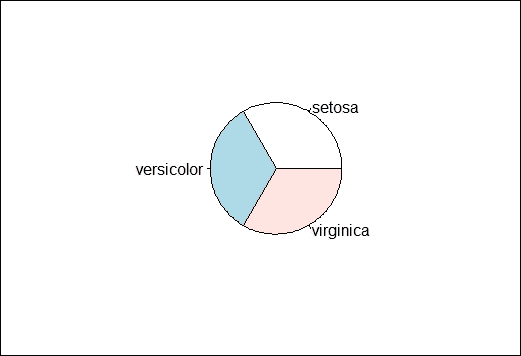

    The pie chart of species distribution

    萼片长度的直方图

4.  The histogram creates a frequency plot of sorts along the *x*-axis. The following example produces a histogram of the sepal length:

    ```r
    > hist(iris$Sepal.Length)

    ```

    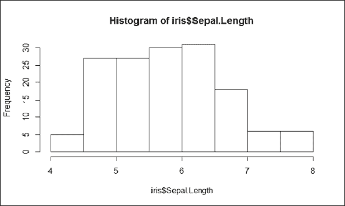

    The histogram of the sepal length

    在直方图中， *x* 轴代表萼片长度， *y* 轴代表不同萼片长度的计数。直方图显示，对于大多数鸢尾，萼片长度从 4 厘米到 8 厘米不等。

5.  花瓣宽度的箱线图
6.  Boxplots, also named box and whisker graphs, allow you to convey a lot of information in one simple plot. In such a graph, the line represents the median of the sample. The box itself shows the upper and lower quartiles. The whiskers show the range:

    ```r
    > boxplot(Petal.Width ~ Species, data = iris)

    ```

    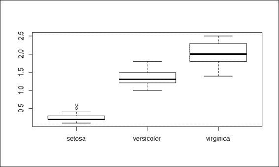

    The boxplot of the petal width

    前面的截图清楚地显示了 setosa 的花瓣宽度的中值和上限范围比 versicolor 和 virginica 短得多。因此，花瓣宽度可以作为区分鸢尾属物种的实质性属性。

7.  萼片长度的散点图
8.  A scatter plot is used when there are two variables to plot against one another. This example plots the petal length against the petal width and color dots in accordance to the species it belongs to:

    ```r
    > plot(x=iris$Petal.Length, y=iris$Petal.Width, col=iris$Species)

    ```

    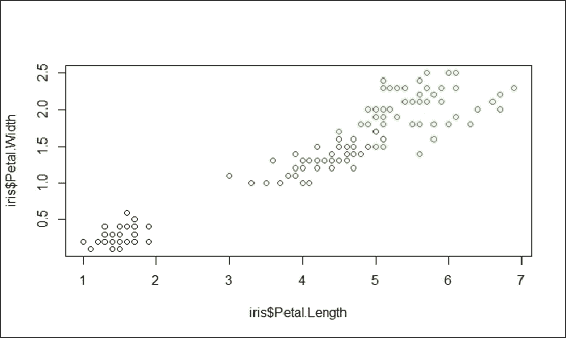

    The scatter plot of the sepal length

    虹膜数据对散点图

9.  The preceding screenshot is a scatter plot of the petal length against the petal width. As there are four attributes within the iris dataset, it takes six operations to plot all combinations. However, R provides a function named `pairs`, which can generate each subplot in one figure:

    ```r
    > pairs(iris[1:4], main = "Edgar Anderson's Iris Data", pch = 21, bg = c("red", "green3", "blue")[unclass(iris$Species)])

    ```

    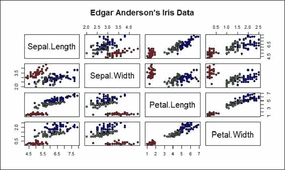

    Pairs scatterplot of iris data

    工作原理...


## r 提供了许多内置的绘图函数，使用户能够用不同种类的绘图来可视化数据。这个食谱演示了饼图的使用，它可以呈现类别分布。同样大小的饼图显示每个物种的数量是相等的。直方图描绘了不同萼片长度的频率。箱线图可以传达大量的描述性统计数据，并显示花瓣宽度可以用来区分鸢尾属物种。最后，我们介绍了散点图，它在一个图上绘制变量。为了快速生成包含所有虹膜数据对的散点图，可以使用`pairs`命令。

参见


## ggplot2 是 R 的另一个绘图系统，基于 Leland Wilkinson 的图形语法的实现。它允许用户以更高的抽象度添加、删除或更改绘图中的组件。然而，与点阵图形相比，抽象结果的级别较慢。对 ggplot 这个话题感兴趣的可以参考这个网站:[http://ggplot2.org/](http://ggplot2.org/)。

*   为机器学习获取数据集


# 虽然 R 有一个内置的数据集，但样本大小和应用领域是有限的。除了在模拟中生成数据之外，另一种方法是从外部数据仓库获取数据。一个著名的数据仓库是 UCI 机器学习仓库，它包含了人工和真实数据集。这个菜谱介绍了如何从 UCI 机器学习库中获取样本数据集。

准备就绪


## 通过在您的操作系统上安装 R，确保您已经完成了前面的方法。

怎么做...


## 执行以下步骤来检索机器学习的数据:

UCI 数据仓库

1.  Access the UCI machine learning repository: [http://archive.ics.uci.edu/ml/](http://archive.ics.uci.edu/ml/).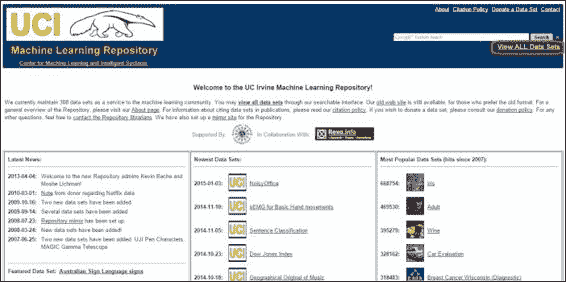

    UCI data repository

2.  Click on **View ALL Data Sets**. Here you will find a list of datasets containing field names, such as **Name**, **Data Types**, **Default Task**, **Attribute Types**, **# Instances**, **# Attributes**, and **Year**: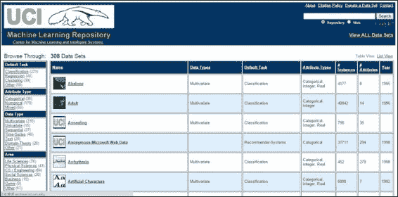
3.  Use *Ctrl* + *F* to search for **Iris**: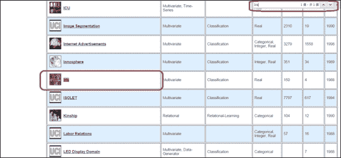
4.  Click on **Iris**. This will display the data folder and the dataset description: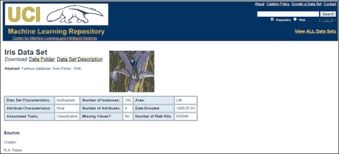
5.  Click on **Data Folder**, which will display a directory containing the iris dataset: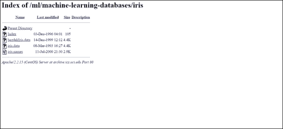

    然后，您可以下载`iris.data`或使用`read.csv`功能读取数据集:

    ```r
     > iris.data = read.csv(url("http://archive.ics.uci.edu/ml/machine-learning-databases/iris/iris.data"), header = FALSE,  col.names = c("Sepal.Length", "Sepal.Width", "Petal.Length", "Petal.Width", "Species")) > head(iris.data)   Sepal.Length Sepal.Width Petal.Length Petal.Width   Species 1         5.1         3.5          1.4         0.2 Iris-setosa 2         4.9         3.0          1.4         0.2 Iris-setosa 3         4.7         3.2          1.3         0.2 Iris-setosa 4         4.6         3.1          1.5         0.2 Iris-setosa 5         5.0         3.6          1.4         0.2 Iris-setosa 6         5.4         3.9          1.7         0.4 Iris-setosa 
    ```

6.  工作原理...


## 在进行数据分析之前，重要的是收集您的数据集。然而，收集适当的数据集用于进一步的探索和分析并不容易。因此，我们可以使用带有 UCI 存储库的准备好的数据集作为我们的数据源。这里，我们首先访问 UCI 数据集存储库，然后使用 iris 数据集作为示例。我们可以利用浏览器的查找功能( *Ctrl* + *F* )找到虹膜数据集，然后进入文件目录。最后，我们可以下载数据集并使用 R IO 函数`read.csv`将 iris 数据集加载到 R 会话中。

参见


## KD nuggets([http://www.kdnuggets.com/datasets/index.html](http://www.kdnuggets.com/datasets/index.html))为数据挖掘和数据科学提供了一个资源丰富的数据集列表。您可以浏览列表以找到满足您要求的数据。

*   KDnuggets ([http://www.kdnuggets.com/datasets/index.html](http://www.kdnuggets.com/datasets/index.html)) offers a resourceful list of datasets for data mining and data science. You can explore the list to find the data that satisfies your requirements.