<title>Chapter 2. Data Exploration with RMS Titanic</title>  

# 第二章。RMS Titanic 的数据探索

在本章中，我们将介绍以下配方:

*   从 CSV 文件中读取大量数据集
*   转换字符变量的类型
*   检测缺失值
*   输入缺失值
*   探索和可视化数据
*   用决策树预测乘客存活率
*   用混淆矩阵验证预测的能力
*   用 ROC 曲线评估绩效

<title>Chapter 2. Data Exploration with RMS Titanic</title>  

# 简介

数据探索帮助数据消费者专注于搜索信息，以期从收集的信息中形成真实的分析。此外，随着数据管理、分析、建模和评估步骤的完成，用户可以从他们关注的数据中获得洞察力和有价值的观点。

在真实的数据探索项目中，探索过程包括六个步骤。它们如下:

1.  问正确的问题。
2.  数据收集。
3.  数据管理。
4.  基本探索性数据分析。
5.  高级探索性数据分析。
6.  模型评估。

以下是对这六个步骤的详细解释:

1.  **问正确的问题**:当用户提出他们的问题时，例如“探索结束后，我的预期发现是什么？”，或者“通过探索我能提取什么样的信息？，“将给出不同的结果。因此，首先要问正确的问题，因为问题本身决定了探索的目的和目标。
2.  **数据收集**:一旦确定了勘探目标，用户就可以开始从数据源中收集或提取与勘探目标相关的数据。大多数情况下，从不同系统收集的数据显得杂乱无章，格式多样。显然，原始数据可能来自不同的来源，如文件、数据库或互联网。从这些来源检索数据需要文件 IO 功能、JDBC/ODBC、网络爬虫等的帮助。这个提取的数据被称为**原始数据**，这是因为没有经过处理，或者没有经过任何其他处理。大多数原始数据不容易被大多数分析工具或可视化程序使用。
3.  **数据管理**:的下一个阶段是数据管理(或争论)，这一步有助于将原始数据映射为更方便的格式以供消费。在此阶段，有许多过程，如数据解析、排序、合并、过滤、缺失值补全，以及其他过程来转换和组织数据，并使其适合消费结构。稍后，映射的数据可以进一步用于数据聚合、分析或可视化。
4.  **基础探索性数据分析**:在数据管理阶段之后，用户可以对数据处理进行进一步的分析。最基本的分析是执行探索性数据分析。探索性数据分析包括通过总结数据集的特征来分析数据集。执行基本的统计、聚合和可视化方法也是帮助用户理解数据特征的关键任务，这有利于用户通过绘图轻松捕捉大多数、趋势和异常值。
5.  **高级探索性数据分析**:到目前为止，描述性统计给出了数据特征的一般性描述。然而，人们希望为用户生成推理规则，以基于输入参数来预测数据特征。因此，机器学习的应用使得用户能够生成推理模型，其中用户可以输入训练数据集来生成预测模型。在此之后，预测模型可用于基于给定参数预测输出值或标签。
6.  **模型评估**:最后，为了评估生成模型在给定问题的数据估计中是否表现最佳，必须进行模型选择。这里的选择方法涉及很多步骤，包括数据预处理，参数调优，甚至机器学习算法的切换。然而，有一件事必须牢记在心，那就是最简单的模型在预测或探索能力方面经常取得最好的结果；而复杂的模型通常会导致过度拟合。

在下面的例子中，我们将基于泰坦尼克号沉船幸存者的数据集执行一个样本数据探索。我们在这里演示的步骤遵循了如何从在线数据源 Kaggle 通过数据管理清理数据；进行基本的探索性数据分析，以发现可能预测存活率的重要属性；使用分类算法执行高级探索性数据分析，以预测给定数据的存活率；最后，执行模型评估以生成预测模型。

<title>Reading a Titanic dataset from a CSV file</title>  

# 从 CSV 文件中读取大量数据集

为了开始的探索，我们需要从 ka ggle(【https://www.kaggle.com/】)检索一个数据集。我们曾经在第一章[中看过的一些例子](part0015_split_000.html#page "Chapter 1. Practical Machine Learning with R")，*实用机器学习用 R* 。在这里，我们介绍处理现实世界问题的方法。

<title>Reading a Titanic dataset from a CSV file</title>  

## 准备就绪

要从 Kaggle 检索数据，你需要首先注册一个 Kaggle 账户([https://www.kaggle.com/account/register](https://www.kaggle.com/account/register))。然后，登录帐户进行进一步探索:


Kaggle.com

<title>Reading a Titanic dataset from a CSV file</title>  

## 怎么做...

执行以下步骤从 CSV 文件中读取Titanic 数据集:

1.  前往[http://www.kaggle.com/c/titanic-gettingStarted/data](http://www.kaggle.com/c/titanic-gettingStarted/data)检索数据列表。
2.  您可以看到可供下载的数据文件列表， 如下表所示:

    | 

    文件名

     | 

    可用格式

     |
    | --- | --- |
    | `train` | `.csv`(59.76 kb) |
    | 【T2 |
    |  | `.csv`【3.18 kb】 |
    | `genderclassmodel` | `.csv``.csv`【3】 |
    | `test` |

3.  将训练数据([https://www . ka ggle . com/c/titanic-getting started/download/train . CSV](https://www.kaggle.com/c/titanic-gettingStarted/download/train.csv))下载到本地磁盘。
4.  然后，确保下载的文件放在当前目录下。您可以使用`getwd`功能查看当前工作目录。如果下载的文件不在工作目录中，请将文件移动到当前工作目录。或者，您可以使用`setwd()`设置下载文件所在的工作目录:

    ```
     > getwd() [1] "C:/Users/guest" 
    ```

5.  接下来，可以使用`read.csv`将数据加载到数据帧中。在这里，可以使用`read.csv` 函数读取`train.csv`来构造变量名为`train.data`的数据。然而，为了将空字符串视为`NA`，可以指定`na.strings`等于`"NA"`或空字符串:

    ```
     > train.data = read.csv("train.csv", na.strings=c("NA", "")) 
    ```

6.  然后，使用`str`功能检查加载的数据:

    ```
     > str(train.data) 'data.frame': 891 obs. of  12 variables:  $ PassengerId: int  1 2 3 4 5 6 7 8 9 10 ...  $ Survived   : int  0 1 1 1 0 0 0 0 1 1 ...  $ Pclass     : int  3 1 3 1 3 3 1 3 3 2 ...  $ Name       : Factor w/ 891 levels "Abbing, Mr. Anthony",..: 109 191 358 277 16 559 520 629 417 581 ...  $ Sex        : Factor w/ 2 levels "female","male": 2 1 1 1 2 2 2 2 1 1 ...  $ Age        : num  22 38 26 35 35 NA 54 2 27 14 ...  $ SibSp      : int  1 1 0 1 0 0 0 3 0 1 ...  $ Parch      : int  0 0 0 0 0 0 0 1 2 0 ...  $ Ticket     : Factor w/ 681 levels "110152","110413",..: 524 597 670 50 473 276 86 396 345 133 ...  $ Fare       : num  7.25 71.28 7.92 53.1 8.05 ...  $ Cabin      : Factor w/ 148 levels "","A10","A14",..: 1 83 1 57 1 1 131 1 1 1 ...  $ Embarked   : Factor w/ 4 levels "","C","Q","S": 4 2 4 4 4 3 4 4 4 2 ... 
    ```

<title>Reading a Titanic dataset from a CSV file</title>  

## 工作原理...

为了开始数据探索，我们首先从 Kaggle 下载了泰坦尼克号数据集，这是一个包含许多数据竞赛和数据集的网站。为了将数据加载到数据框中，该方法演示了如何应用`read.csv`函数加载带有`na.strings`参数的数据集，目的是将空字符串和`"NA"`转换为 NA 值。为了查看数据集的结构，我们使用了`str`函数来紧凑地显示`train.data`；你可以发现数据集包含乘客的人口统计信息和生存标签。这里收集的数据足够好，初学者可以练习如何处理和分析数据。

<title>Reading a Titanic dataset from a CSV file</title>  

## 还有更多...

在 Kaggle 上，科学上的许多数据都与竞赛有关，这些竞赛大多涉及设计一种机器学习方法来解决现实世界的问题。

Kaggle 上的大多数比赛都是由学术界或企业团体举办的，如亚马逊或脸书。事实上，他们创造这些竞赛并提供奖励，如奖金或工作前景(见 https://www.kaggle.com/competitions)。于是，就有很多数据科学家被吸引注册了 Kaggle 账号参加比赛。一个 pilot exploration 的初学者可以参加其中一个比赛，这将有助于他们通过用机器学习技能解决现实世界的问题来获得经验。

作为参赛者，为了创造一个更具挑战性的学习环境，参与者需要提交他们的输出答案，并将收到评估分数，这样每个人都可以评估自己在排行榜上的排名。

<title>Converting types on character variables</title>  

# 转换字符变量的类型

在 R 中，由于名义变量、序数变量、区间变量和比率变量在统计建模中被区别对待，我们必须将名义变量从字符转换成因子。

<title>Converting types on character variables</title>  

## 做好准备

您需要通过将 Titanic 训练数据加载到 R 会话中来完成前面的配方，使用`read.csv`函数并分配一个等于 NA 和空字符串("")的参数`na.strings`。然后，将从`train.csv`加载的数据分配到`train.data`变量中。

<title>Converting types on character variables</title>  

## 怎么做...

执行以下步骤来转换字符变量的类型:

1.  使用`str`功能打印泰坦尼克号数据概览:

    ```
     > str(train.data) 'data.frame':  891 obs. of  12 variables:  $ PassengerId: int  1 2 3 4 5 6 7 8 9 10 ...  $ Survived   : int  0 1 1 1 0 0 0 0 1 1 ...  $ Pclass     : int  3 1 3 1 3 3 1 3 3 2 ...  $ Name       : Factor w/ 891 levels "Abbing, Mr. Anthony",..: 109 191 358 277 16 559 520 629 417 581 ...  $ Sex        : Factor w/ 2 levels "female","male": 2 1 1 1 2 2 2 2 1 1 ...  $ Age        : num  22 38 26 35 35 NA 54 2 27 14 ...  $ SibSp      : int  1 1 0 1 0 0 0 3 0 1 ...  $ Parch      : int  0 0 0 0 0 0 0 1 2 0 ...  $ Ticket     : Factor w/ 681 levels "110152","110413",..: 524 597 670 50 473 276 86 396 345 133 ...  $ Fare       : num  7.25 71.28 7.92 53.1 8.05 ...  $ Cabin      : Factor w/ 147 levels "A10","A14","A16",..: NA 82 NA 56 NA NA 130 NA NA NA ...  $ Embarked   : Factor w/ 3 levels "C","Q","S": 3 1 3 3 3 2 3 3 3 1 ... 
    ```

2.  为了将变量从`int`数值类型转换为`factor`分类类型，您可以将`factor` :

    ```
     > train.data$Survived = factor(train.data$Survived) > train.data$Pclass = factor(train.data$Pclass) 
    ```

3.  用`str`函数再次打印出变量，你可以看到`Pclass`和`Survived`现在被转换成如下的因子:

    ```
     > str(train.data) 'data.frame':  891 obs. of  12 variables:  $ PassengerId: int  1 2 3 4 5 6 7 8 9 10 ...  $ Survived   : Factor w/ 2 levels "0","1": 1 2 2 2 1 1 1 1 2 2 ...  $ Pclass     : Factor w/ 3 levels "1","2","3": 3 1 3 1 3 3 1 3 3 2 ...  $ Name       : Factor w/ 891 levels "Abbing, Mr. Anthony",..: 109 191 358 277 16 559 520 629 417 581 ...  $ Sex        : Factor w/ 2 levels "female","male": 2 1 1 1 2 2 2 2 1 1 ...  $ Age        : num  22 38 26 35 35 NA 54 2 27 14 ...  $ SibSp      : int  1 1 0 1 0 0 0 3 0 1 ...  $ Parch      : int  0 0 0 0 0 0 0 1 2 0 ...  $ Ticket     : Factor w/ 681 levels "110152","110413",..: 524 597 670 50 473 276 86 396 345 133 ...  $ Fare       : num  7.25 71.28 7.92 53.1 8.05 ...  $ Cabin      : Factor w/ 147 levels "A10","A14","A16",..: NA 82 NA 56 NA NA 130 NA NA NA ...  $ Embarked   : Factor w/ 3 levels "C","Q","S": 3 1 3 3 3 2 3 3 3 1 ... 
    ```

<title>Converting types on character variables</title>  

## 工作原理...

谈谈统计，有四种度量:标称、序数、区间、比率。名义变量用来标注变量，比如性别和名字；序数变量，是对非数字概念的度量，如满意度和幸福度。区间变量显示数字刻度，它不仅告诉我们顺序，还可以显示数值之间的差异，如摄氏温度。比率变量表示连续量的大小与单位量的比率。比率变量提供顺序、值之间的差异和真零值，如体重和身高。在 R 中，不同的测量值以不同的方式计算，因此您应该在对数据集应用描述性或推理性分析之前执行类型转换。

在这个配方中，我们首先使用`str`功能显示训练数据的结构。从数据的结构中，您可以找到属性名、数据类型以及每个属性中包含的前几个值。从`Survived`和`Pclass`属性中，可以看到数据类型为`int`。如图表 1 ( *前言*所列的变量描述，可以看到`Survived` (0 =否；1 =是)和`Pclass` (1 =第 1；2 =第二；3 =第三)是分类变量。因此，我们通过`factor`函数将数据从字符转换为因子类型。

<title>Converting types on character variables</title>  

## 还有更多...

除了 factor，还有更多类型转换函数。对于数值型，有`is.numeric()`和`as.numeric()`；对于人品，有:`is.character()`和`as.character()`。对于 vector，有:`is.vector()`和`as.vector()`；对于矩阵，有`is.matrix()`和`as.matrix()`。最后，对于数据帧，有:`is.data.frame()`和`as.data.frame()`。

<title>Detecting missing values</title>  

# 检测缺失值

缺失的值会降低样本的代表性，此外，可能会扭曲关于总体的推断。这个方法将集中于检测 Titanic 数据集中缺失的值。

<title>Detecting missing values</title>  

## 做好准备

您需要通过属性`Pclass`和因子类型`Survived`完成前面的配方。

在 R 中，丢失的值用符号 **NA** ( **不可用**)，而不可能的值是 **NaN** ( **不是数字**)。

<title>Detecting missing values</title>  

## 怎么做...

执行以下步骤检测缺失值:

1.  `is.na`函数用于表示属性的哪个索引包含 NA 值。在这里，我们先将其应用到`Age`属性:

    ```
     > is.na(train.data$Age) 
    ```

2.  `is.na`函数指示`Age`属性的缺失值。要得到缺失值的大概数目，可以执行`sum`来计算这个:

    ```
     > sum(is.na(train.data$Age) == TRUE) [1] 177 
    ```

3.  为了计算缺失值的百分比，采用的一种方法是统计缺失值与非缺失值的数量:

    ```
     > sum(is.na(train.data$Age) == TRUE) /  length(train.data$Age) [1] 0.1986532 
    ```

4.  要获得属性缺失值的百分比，可以使用`sapply`来计算所有属性的百分比:

    ```
     > sapply(train.data, function(df) { +               sum(is.na(df)==TRUE)/ length(df); +           })  PassengerId    Survived      Pclass        Name         Sex         Age  0.000000000 0.000000000 0.000000000 0.000000000 0.000000000 0.198653199        SibSp       Parch      Ticket        Fare       Cabin    Embarked  0.000000000 0.000000000 0.000000000 0.000000000 0.771043771 0.002244669  
    ```

5.  除了简单地查看丢失数据的百分比，用户还可以使用`Amelia`包来可视化丢失的值。这里，我们使用`install.packages`和`require`来安装`Amelia`并加载软件包。但是在安装和加载`Amelia`包之前，需要先安装`Rcpp`，预先:

    ```
     > install.packages("Amelia") > require(Amelia) 
    ```

6.  Then, use the `missmap` function to plot the missing value map:

    ```
    > missmap(train.data, main="Missing Map")

    ```

    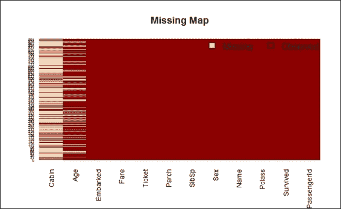

    丢失的泰坦尼克号数据集地图

<title>Detecting missing values</title>  

## 它是如何工作的...

在 R 中，丢失的值通常用符号`"NA"`表示不可用。大多数函数(如`mean`或`sum`)在数据集中遇到安娜值时可能会输出 NA。虽然您可以指定一个参数(如`na.rm`)来消除 NA 的影响，但最好估算或删除数据集中的缺失数据，以防止缺失值的影响扩散。为了找出 Titanic 数据集中缺失的值，我们首先将所有 NA 值相加，然后除以每个属性中值的数量，然后，我们使用`sapply`将计算应用于所有属性。

除此之外，为了使用表格显示计算结果，您可以利用`Amelia`包在一个图表上绘制每个属性的缺失值图。缺失值的可视化使用户能够更好地理解每个数据集中的缺失百分比。从前面的截图中，您可能已经观察到缺少的值是米色的，而它的观察值是暗红色的。*x*-轴显示不同的属性名， *y* 轴显示记录的索引。很明显，大部分舱显示丢失的数据，并且它还显示当计算`Age`属性时，大约 19.87%的数据丢失，并且在`Embarked`属性中有两个值丢失。

<title>Detecting missing values</title>  

## 还有更多...

为了处理丢失的值，我们引入了`Amelia`来可视化它们。除了键入控制台命令，您还可以使用`Amelia`和`AmeliaView`的交互式 GUI，它允许用户从窗口环境中加载数据集、管理选项和运行`Amelia`。

要开始运行`AmeliaView`，只需在 R 控制台中键入`AmeliaView()`:

```
> AmeliaView()

```

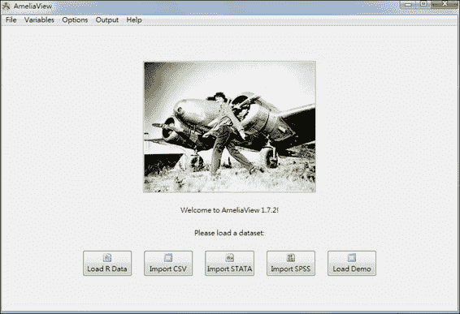

AmeliaView

<title>Imputing missing values</title>  

# 输入缺失值

在检测到每个属性中缺失值的数量后，我们必须估算缺失值，因为它们可能会对从数据中得出的结论产生重大影响。

<title>Imputing missing values</title>  

## 做好准备

该配方需要在 R 进程中加载`train.data`，并通过将`Pclass`和`Survived`转换为因子类型来完成之前的配方。

<title>Imputing missing values</title>  

## 怎么做...

执行以下步骤来估算缺失值:

1.  首先列出**启运港**的分布。这里，我们添加了`useNA = "always"`参数来显示`train.data` :

    ```
     > table(train.data$Embarked, useNA = "always")     C    Q    S <NA>   168   77  644    2  
    ```

    中包含的 NA 值的数量
2.  将两个缺失值分配给一个更有可能的端口(即计数最多的端口)，在本例中为南安普敦:

    ```
     > train.data$Embarked[which(is.na(train.data$Embarked))] = 'S'; > table(train.data$Embarked, useNA = "always")     C    Q    S <NA>   168   77  646    0  
    ```

3.  为了发现`train.data`名字中包含的头衔类型，我们先用 blank(一种正则表达式模式为`"\\s+"`)对`train.data$Name`进行标记，然后用`table`函数统计出现的频率。在此之后，由于名称 title 经常以句点结尾，我们使用正则表达式 grep 包含句点的单词。最后，`sort`表中按降序排列:

    ```
     > train.data$Name = as.character(train.data$Name) > table_words = table(unlist(strsplit(train.data$Name, "\\s+"))) > sort(table_words [grep('\\.',names(table_words))], decreasing=TRUE)        Mr.     Miss.      Mrs.   Master.        517       182       125        40        Dr.      Rev.      Col.    Major.          7         6         2            2      Mlle.     Capt. Countess.    Don.          2         1         1                1  Jonkheer.        L.     Lady .      Mme.          1         1         1         1        Ms.      Sir.          1         1  
    ```

4.  要获得哪个标题包含丢失的值，可以使用`stringr`包提供的`str_match`来获得包含句点的子字符串，然后将列与`cbind`绑定在一起。最后，通过使用 table 函数获取缺失值的统计数据，您可以对每个标题进行计数:

    ```
     > library(stringr)  > tb = cbind(train.data$Age, str_match(train.data$Name, " [a-zA-Z]+\\.")) > table(tb[is.na(tb[,1]),2])       Dr.  Master.    Miss.      Mr.     Mrs.         1        4            36       119       17  
    ```

5.  对于包含缺失值的标题，估算数据的一种方法是为每个标题分配平均值(不包含缺失值):

    ```
     > mean.mr = mean(train.data$Age[grepl(" Mr\\.", train.data$Name) & !is.na(train.data$Age)]) > mean.mrs = mean(train.data$Age[grepl(" Mrs\\.", train.data$Name) & !is.na(train.data$Age)]) > mean.dr = mean(train.data$Age[grepl(" Dr\\.", train.data$Name) & !is.na(train.data$Age)]) > mean.miss = mean(train.data$Age[grepl(" Miss\\.", train.data$Name) & !is.na(train.data$Age)]) > mean.master =  mean(train.data$Age[grepl(" Master\\.", train.data$Name) & !is.na(train.data$Age)]) 
    ```

6.  然后，用各标题的平均值赋值缺失值:

    ```
     > train.data$Age[grepl(" Mr\\.", train.data$Name) & is.na(train.data$Age)] = mean.mr > train.data$Age[grepl(" Mrs\\.", train.data$Name) & is.na(train.data$Age)] = mean.mrs > train.data$Age[grepl(" Dr\\.", train.data$Name) & is.na(train.data$Age)] = mean.dr > train.data$Age[grepl(" Miss\\.", train.data$Name) & is.na(train.data$Age)] = mean.miss > train.data$Age[grepl(" Master\\.", train.data$Name) & is.na(train.data$Age)] = mean.master 
    ```

<title>Imputing missing values</title>  

## 工作原理...

为了估算`Embarked`属性的缺失值，我们首先使用`table`函数生成已装载端口的统计数据。`table`功能对`train.data`中的两个 NA 值进行计数。从数据集描述中，我们识别出 C、Q 和 S(C =瑟堡，Q =皇后镇，S =南安普顿)。由于我们不知道这两个丢失的值属于哪个类别，一种可能的方法是将丢失的值分配给最可能的端口，即`Southampton`。

至于的另一个属性`Age`，虽然大约有 20%的值丢失，但用户仍然可以根据每个乘客的标题推断出丢失的值。为了发现数据集的名称中有多少个标题，我们建议在`Name`属性中计数分段单词的方法，这有助于计算每个给定标题的缺失值的数量。生成的单词表显示了常见的标题，如`Mr`、`Mrs`、`Miss`和`Master`。你可以参考维基百科中的英文敬语条目来获得每个标题的描述。

考虑到缺失数据，我们将每个标题的平均值重新分配给具有相应标题的缺失值。但是，对于`Cabin`属性，缺少的值太多了，我们无法从任何引用属性中推断出该值。因此，我们发现试图使用该属性进行进一步分析是行不通的。

<title>Imputing missing values</title>  

## 还有更多...

这里我们列出了维基百科中的敬语条目供你参考。根据它([http://en.wikipedia.org/wiki/English_honorific](http://en.wikipedia.org/wiki/English_honorific)):

*   先生:这个是用在男人身上的，不管他的婚姻状况如何
*   主人:这是给年轻男子或男孩用的，尤其是在英国
*   小姐:它通常用于未婚女性，虽然也用于已婚女艺人
*   这是给已婚妇女用的
*   博士:在美国，这是指拥有第一个专业学位的人

<title>Exploring and visualizing data</title>  

# 探索和可视化数据

输入缺失值后，应进行探索性分析，包括使用可视化图的和汇总方法来总结数据特征。结果有助于用户更好地理解使用中的数据。下面的食谱将介绍如何使用基本绘图技术，以帮助用户进行探索性分析。

<title>Exploring and visualizing data</title>  

## 准备就绪

该配方需要通过输入`age`和`Embarked`属性中缺失的值来完成前一个配方。

<title>Exploring and visualizing data</title>  

## 怎么做...

执行以下步骤来浏览和可视化数据:

1.  First, you can use a bar plot and histogram to generate descriptive statistics for each attribute, starting with passenger survival:

    ```
    > barplot(table(train.data$Survived), main="Passenger Survival",  names= c("Perished", "Survived"))

    ```

    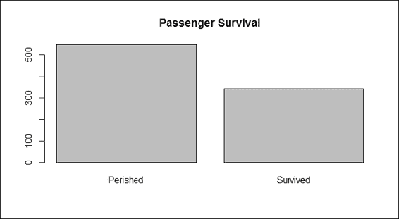

    乘客生存

2.  We can generate the bar plot of passenger class:

    ```
    > barplot(table(train.data$Pclass), main="Passenger Class",  names= c("first", "second", "third"))

    ```

    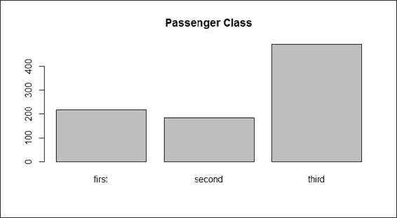

    乘客等级

3.  Next, we outline the gender data with the bar plot:

    ```
    > barplot(table(train.data$Sex), main="Passenger Gender")

    ```

    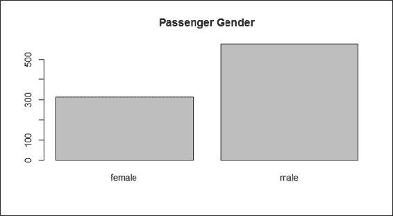

    乘客性别

4.  We then plot the histogram of the different ages with the `hist` function:

    ```
    > hist(train.data$Age, main="Passenger Age", xlab = "Age")

    ```

    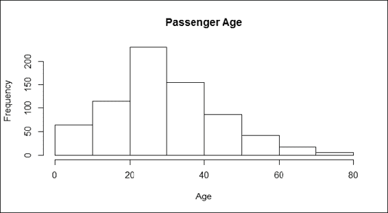

    乘客年龄

5.  We can plot the bar plot of sibling passengers to get the following:

    ```
    > barplot(table(train.data$SibSp), main="Passenger Siblings")

    ```

    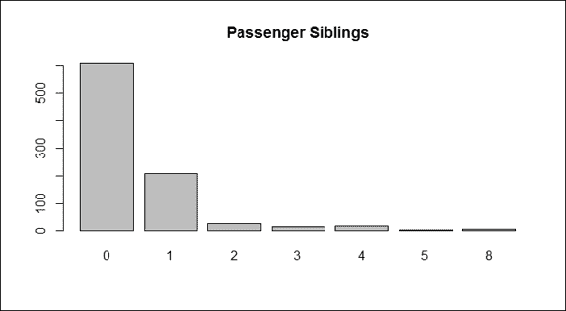

    乘客兄弟姐妹

6.  Next, we can get the distribution of the passenger parch:

    ```
    > barplot(table(train.data$Parch), main="Passenger Parch")

    ```

    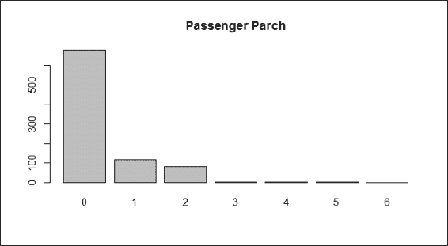

    乘客车厢

7.  Next, we plot the histogram of the passenger fares:

    ```
    > hist(train.data$Fare, main="Passenger Fare", xlab = "Fare")

    ```

    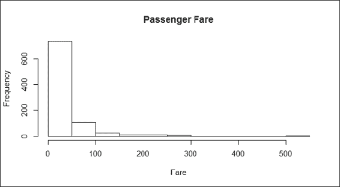

    客运费

8.  Finally, one can look at the port of embarkation:

    ```
    > barplot(table(train.data$Embarked), main="Port of Embarkation")

    ```

    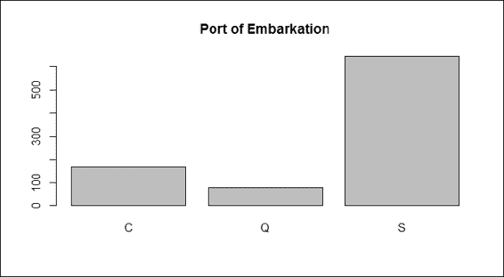

    启航港口

9.  Use `barplot` to find out which gender is more likely to perish during shipwrecks:

    ```
    > counts = table( train.data$Survived, train.data$Sex)
    > barplot(counts,  col=c("darkblue","red"), legend = c("Perished", "Survived"), main = "Passenger Survival by Sex")

    ```

    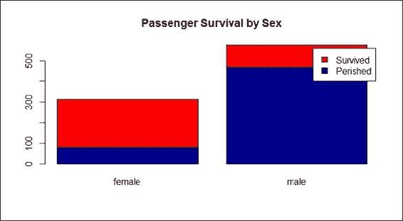

    按性别划分的乘客存活率

10.  Next, we should examine whether the `Pclass` factor of each passenger may affect the survival rate:

    ```
    > counts = table( train.data$Survived, train.data$Pclass)
    > barplot(counts,  col=c("darkblue","red"), legend =c("Perished", "Survived"), main= "Titanic Class Bar Plot" )

    ```

    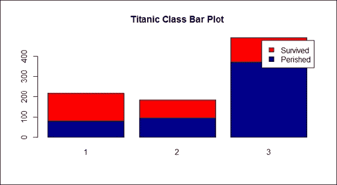

    按等级划分的乘客存活率

11.  Next, we examine the gender composition of each `Pclass`:

    ```
    > counts = table( train.data$Sex, train.data$Pclass)
    > barplot(counts,  col=c("darkblue","red"), legend = rownames(counts), main= "Passenger Gender by Class")

    ```

    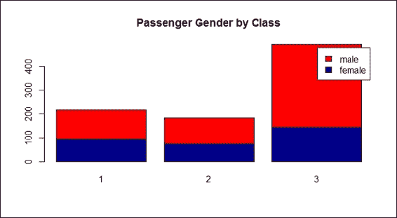

    按等级划分的乘客性别

12.  Furthermore, we examine the histogram of passenger ages:

    ```
    > hist(train.data$Age[which(train.data$Survived == "0")], main= "Passenger Age Histogram", xlab="Age", ylab="Count", col ="blue", breaks=seq(0,80,by=2))
    > hist(train.data$Age[which(train.data$Survived == "1")], col ="red", add = T, breaks=seq(0,80,by=2))

    ```

    

    乘客年龄直方图

13.  To examine more details about the relationship between the age and survival rate, one can use a `boxplot`:

    ```
    > boxplot(train.data$Age ~ train.data$Survived, 
    +         main="Passenger Survival by Age",
    +         xlab="Survived", ylab="Age")

    ```

    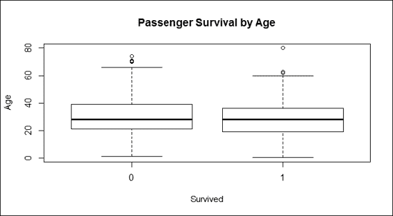

    按年龄划分的乘客存活率

14.  为了将不同年龄的人分成不同的组，如儿童(13 岁以下)、青少年(13 岁至 19 岁)、成人(20 岁至 65 岁)、老年人(65 岁以上)，执行以下命令:

    ```
     >train.child = train.data$Survived[train.data$Age < 13] > length(train.child[which(train.child == 1)] ) / length(train.child)  [1] 0.5797101  > train.youth = train.data$Survived[train.data$Age >= 15 & train.data$Age < 25] > length(train.youth[which(train.youth == 1)] ) / length(train.youth) [1] 0.4285714  > train.adult  = train.data$Survived[train.data$Age >= 20 & train.data$Age < 65] > length(train.adult[which(train.adult == 1)] ) / length(train.adult)  [1] 0.3659218  > train.senior  = train.data$Survived[train.data$Age >= 65] > length(train.senior[which(train.senior == 1)] ) / length(train.senior) [1] 0.09090909 
    ```

<title>Exploring and visualizing data</title>  

## 工作原理...

在我们预测存活率之前，我们应该首先使用聚合和可视化方法来检查每个属性如何影响乘客的命运。因此，我们通过生成每个属性的条形图和直方图来开始检查。

前面列表中截图的图形给出了 Titanic 数据集每个属性的轮廓。根据第一张截图，在海难中遇难的乘客多于幸存的乘客。三等舱的乘客是船上三等舱中人数最多的，这也反映了一个事实，即三等舱是泰坦尼克号上最经济的舱(第二步)。就性别分布而言，男性乘客多于女性乘客(步骤 3)。至于年龄分布，步骤 4 中的截图显示，大多数乘客的年龄在 20 至 40 岁之间。根据步骤 5 中的截图，大多数乘客有一个或更少的兄弟姐妹。第六步截图显示，大部分乘客有 0 到 2 张 parch。

在步骤 7 的截图中，票价直方图显示票价存在差异，这可能是泰坦尼克号上不同乘客等级的结果。最后，第 8 步中的截图显示，船停了三次搭载乘客。

当我们从开始探索`sex`属性时，通过得出的柱状图来判断，它清楚地表明在海难中，女性乘客比男性有更高的存活率(步骤 9)。除此之外，维基百科关于皇家邮轮泰坦尼克号([http://en.wikipedia.org/wiki/RMS_Titanic](http://en.wikipedia.org/wiki/RMS_Titanic))的条目解释道*“由于一些官员在登上救生艇时遵循了‘妇女和儿童优先’的协议，过多的男性留在了船上*。因此，女性幸存者人数超过男性幸存者是合理的。换句话说，简单地用`sex`就可以高度准确地预测一个人是否会活下来。

然后，我们检查乘客等级是否影响存活率(步骤 10)。在这里，从`Pclass`的定义出发，每个等级的票价都根据质量进行了相应的定价；头等舱票价高，三等舱票价低。由于每位乘客的阶级似乎表明了他们的社会和经济地位，因此可以合理地假设，较富裕的乘客可能有更多的机会生存下来。

不幸的是，班级和存活率之间没有相关性，所以结果没有显示我们假设的现象。然而，在我们检查了`pclass`的组成中的`sex`(步骤 11)后，结果显示大多数三等舱乘客是男性；富人更倾向于生存的假设可能没有那么具体。

接下来，我们通过直方图和箱线图研究了年龄和乘客命运之间的关系(步骤 12)。条形图用水平柱显示年龄分布，其中红色柱代表幸存的乘客，而蓝色柱代表死亡的乘客。很难从不同年龄组来区分存活率的差异。我们创建的柱状图并没有证明不同年龄组的乘客更有可能幸存。另一方面，图中显示船上大多数人的年龄在 20 到 40 岁之间，但没有显示这个群体是否比老人或小孩更有可能存活(步骤 13)。在这里，我们介绍了一种盒图，这是一种标准化的绘图技术，显示数据的分布和信息，如最小值、第一个四分位数、中值、第三个四分位数、最大值和异常值。

后来，我们通过将乘客年龄分为四组，进一步检验了年龄组是否与乘客命运有任何关系。统计数据显示，儿童群体(13 岁以下)比年轻人(13 岁至 20 岁)、成年人(20 岁至 65 岁)和老年人(65 岁以上)更有可能存活。结果显示，较年轻年龄组的人更有可能在海难中幸存。然而，我们注意到这可能是由“妇女和儿童优先”协议造成的。

<title>Exploring and visualizing data</title>  

## 还有更多...

除了使用条形图、直方图和箱线图来可视化数据的之外，还可以应用`vcd`包中的`mosaicplot`来检查多个分类变量之间的关系。例如，当我们检查`Survived`和`Pclass`变量之间的关系时，应用程序执行如下:

```
> mosaicplot(train.data$Pclass ~ train.data$Survived, 
+           main="Passenger Survival Class", color=TRUE, 
+  xlab="Pclass", ylab="Survived")

```

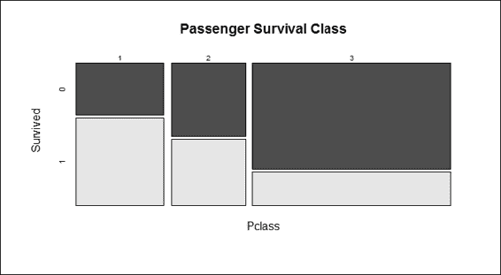

按等级划分的乘客存活率

<title>Exploring and visualizing data</title>  

## 亦见

*   关于沉船的更多信息，人们可以阅读皇家邮轮泰坦尼克号的历史(请参考维基百科[http://en.wikipedia.org/wiki/Sinking_of_the_RMS_Titanic](http://en.wikipedia.org/wiki/Sinking_of_the_RMS_Titanic)中的*皇家邮轮泰坦尼克号*沉没的条目)，因为当时实施的一些协议可能极大地影响了乘客的存活率。

<title>Predicting passenger survival with a decision tree</title>  

# 用决策树预测乘客存活率

探索性分析帮助用户深入了解单个或多个变量如何影响存活率。然而，它没有确定哪些组合可以生成预测模型，从而预测乘客的存活率。另一方面，机器学习可以从训练数据集生成预测模型，以便用户可以应用该模型从给定的属性预测可能的标签。在这份食谱中，我们将介绍如何使用决策树从给定的变量中预测乘客存活率。

<title>Predicting passenger survival with a decision tree</title>  

## 准备就绪

我们将使用在之前的配方中已经使用过的数据`train.data`。

<title>Predicting passenger survival with a decision tree</title>  

## 怎么做...

执行以下步骤，用决策树预测乘客存活率:

1.  首先，我们用三个输入参数构建一个数据分割函数`split.data`:`data`、`p`和`s`。`data`参数代表输入数据集，`p`参数代表从输入数据集生成子集的比例，`s`参数代表随机种子:

    ```
     > split.data = function(data, p = 0.7, s = 666){ +     set.seed(s) +     index = sample(1:dim(data)[1]) +     train = data[index[1:floor(dim(data)[1] * p)], ] +     test = data[index[((ceiling(dim(data)[1] * p)) + 1):dim(data)[1]], ] +     return(list(train = train, test = test)) + }  
    ```

2.  然后，我们拆分数据，将 70%分配给训练数据集，剩下的 30%分配给测试数据集:

    ```
     > allset= split.data(train.data, p = 0.7)  > trainset = allset$train  > testset = allset$test 
    ```

3.  对于条件树，必须使用 party 包中的`ctree`函数；因此，我们安装并加载党包:

    ```
     > install.packages('party') > require('party') 
    ```

4.  然后我们使用`Survived`作为标签来生成使用中的预测模型。在之后，我们将分类树模型赋值为变量`train.ctree`:

    ```
     > train.ctree = ctree(Survived ~ Pclass + Sex + Age + SibSp + Fare + Parch + Embarked, data=trainset) > train.ctree     Conditional inference tree with 7 terminal nodes  Response:  Survived  Inputs:  Pclass, Sex, Age, SibSp, Fare, Parch, Embarked  Number of observations:  623   1) Sex == {male}; criterion = 1, statistic = 173.672   2) Pclass == {2, 3}; criterion = 1, statistic = 30.951     3) Age <= 9; criterion = 0.997, statistic = 12.173       4) SibSp <= 1; criterion = 0.999, statistic = 15.432         5)*  weights = 10        4) SibSp > 1         6)*  weights = 11      3) Age > 9       7)*  weights = 282    2) Pclass == {1}     8)*  weights = 87  1) Sex == {female}   9) Pclass == {1, 2}; criterion = 1, statistic = 59.504     10)*  weights = 125    9) Pclass == {3}     11) Fare <= 23.25; criterion = 0.997, statistic = 12.456       12)*  weights = 85      11) Fare > 23.25       13)*  weights = 23  
    ```

5.  We use a `plot` function to plot the tree:

    ```
    > plot(train.ctree, main="Conditional inference tree of Titanic Dataset")

    ```

    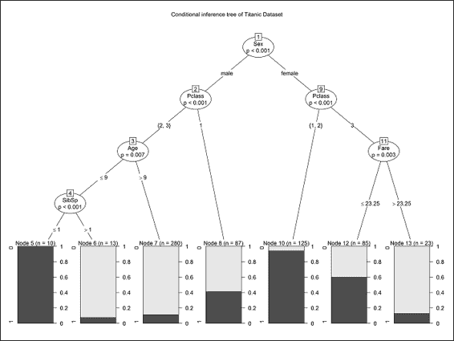

    泰坦尼克号数据集的条件推理树

<title>Predicting passenger survival with a decision tree</title>  

## 工作原理...

该菜谱介绍了如何使用条件推理树`ctree`来预测乘客存活率。虽然条件推理树不是解决分类问题的唯一方法，但它是理解预测乘客存活率的决策路径的简单方法。

我们首先使用我们实现的函数`split.data`将数据分成一个训练和测试集。因此，我们可以使用训练集来生成预测模型，然后在模型评估的配方中对测试数据集使用该预测模型。然后，我们安装并加载`party`包，使用`ctree`构建预测模型，标签为`Survived`。在不考虑任何特定属性的情况下，我们将`Pclass`、`Sex`、`Age`、`SibSp`、`Parch`、`Embarked`和`Fare`等属性作为训练属性，除了`Cabin`，因为该属性的大部分值都是缺失的。

在构建预测模型之后，我们可以以文本方式打印出决策路径和节点，或者使用绘图函数来绘制决策树。从决策树中，用户可以看到什么样的变量组合可能有助于预测存活率。根据前面的截图，用户可以找到`Pclass`和`Sex`的组合，这是预测存活率的一个很好的决策边界(节点 9)。这张照片显示，头等舱和二等舱的女性乘客大多在海难中幸存。男性乘客，包括二等舱和三等舱的乘客以及 9 岁以上的乘客，几乎都在海难中丧生。从树中，人们可能会发现诸如`Embarked`和`Parch`的属性丢失了。这是因为条件推理树在分类时认为这些属性不太重要。

从决策树中，用户可以看到什么样的变量组合可能有助于预测存活率。此外，条件推理树有助于在分类过程中选择重要的属性；人们可以检查构建的树，以查看选择的属性是否与自己的假设相匹配。

<title>Predicting passenger survival with a decision tree</title>  

## 还有更多...

这个食谱涵盖了与分类算法和条件推理树相关的问题。由于我们不讨论适配算法的背景知识，如果需要，用户最好使用`help`功能查看`party`包中与`ctree`相关的文档。

有一个类似的基于决策树的包，名为`rpart`。`party`和`rpart`的区别在于，party 包中的`ctree`避免了`party`包中的`rpart`和`ctree`的后续变量选择偏差，倾向于选择具有许多可能分裂或许多缺失值的变量。与其他方法不同，`ctree`使用显著性测试程序来选择变量，而不是选择最大化信息度量的变量。

除了`ctree`，还可以使用`svm`生成预测模型。要加载`svm`函数，首先加载`e1071`包，然后使用`svm`构建来生成这个预测:

```
> install.packages('e1071')
> require('e1071')
> svm.model = svm(Survived ~ Pclass + Sex + Age + SibSp + Fare + Parch + Embarked, data = trainset, probability = TRUE)

```

在这里，我们使用`svm`来展示在使用 r 时，您可以如何轻松地立即在同一数据集上使用不同的机器学习算法。有关如何使用`svm`的更多信息，请参考[第 6 章](part0072_split_000.html#page "Chapter 6. Classification (II) – Neural Network and SVM")、*分类(II)–神经网络、SVM* 。

<title>Validating the power of prediction with a confusion matrix</title>  

# 用混淆矩阵验证预测的能力

构建预测模型后，在预测标签时验证模型如何执行是很重要的。在之前的配方中，我们用`ctree`和构建了一个模型，将数据预先分割成一个训练和测试集。现在，用户将学会通过使用混淆矩阵来验证`ctree`在生存预测中的表现。

<title>Validating the power of prediction with a confusion matrix</title>  

## 准备就绪

在评估预测模型之前，首先要确保生成的训练集和测试数据集在 R 会话中。

<title>Validating the power of prediction with a confusion matrix</title>  

## 怎么做...

执行以下步骤来验证预测能力:

1.  我们开始使用构建的`train.ctree`模型来预测测试集的生存:

    ```
     > ctree.predict = predict(train.ctree, testset) 
    ```

2.  首先我们安装`caret`包，然后加载:

    ```
     > install.packages("caret") > require(caret) 
    ```

3.  加载`caret`后，可以使用混淆矩阵生成输出矩阵的统计:

    ```
     > confusionMatrix(ctree.predict, testset$Survived) Confusion Matrix and Statistics            Reference Prediction   0   1          0 160  25          1  16  66                 Accuracy : 0.8464                            95% CI : (0.7975, 0.8875)     No Information Rate : 0.6592               P-Value [Acc > NIR] : 4.645e-12                           Kappa : 0.6499            Mcnemar's Test P-Value : 0.2115                        Sensitivity : 0.9091                       Specificity : 0.7253                    Pos Pred Value : 0.8649                    Neg Pred Value : 0.8049                        Prevalence : 0.6592                    Detection Rate : 0.5993              Detection Prevalence : 0.6929                 Balanced Accuracy : 0.8172                   'Positive' Class : 0 
    ```

<title>Validating the power of prediction with a confusion matrix</title>  

## 工作原理...

在建立之前配方中的预测模型后，测量所建立模型的性能是很重要的。可以通过预测结果是否匹配测试数据集中包含的原始标签来评估性能。可以通过使用由 caret 包提供的混淆矩阵来生成混淆矩阵，这是一种测量预测准确性的方法。

为了生成混淆矩阵，用户需要首先安装并加载`caret`包。混淆矩阵显示，单纯使用`ctree`可以达到高达 84%的准确率。通过调整所使用的属性，或者通过将分类算法替换为 SVM、`glm`或随机森林，可以生成更好的预测模型。

<title>Validating the power of prediction with a confusion matrix</title>  

## 还有更多...

caret 包(*分类和回归训练*)有助于非常方便地迭代和比较不同的预测模型。该软件包还包含几个功能，包括:

*   数据拆分
*   常见预处理:创建虚拟变量、识别零方差和接近零方差预测值、寻找相关预测值、居中、缩放和等
*   培训(使用交叉验证)
*   常见的可视化(例如，`featurePlot`)

<title>Assessing performance with the ROC curve</title>  

# 使用 ROC 曲线评估绩效

另一种测量是通过使用 ROC 曲线(这需要`ROCR`包)，它根据其真阳性率对其假阳性率绘制一条曲线。本食谱将介绍我们如何使用 ROC 曲线来衡量预测模型的性能。

<title>Assessing performance with the ROC curve</title>  

## 准备就绪

在应用 ROC 曲线评估预测模型之前，首先确保生成的训练集、测试数据集和构建的预测模型`ctree.predict`在 R 会话内。

<title>Assessing performance with the ROC curve</title>  

## 如何做到这一点...

执行以下步骤来评估预测性能:

1.  准备概率矩阵:

    ```
     > train.ctree.pred = predict(train.ctree, testset) > train.ctree.prob =  1- unlist(treeresponse(train.ctree, testset), use.names=F)[seq(1,nrow(testset)*2,2)] 
    ```

2.  安装并加载`ROCR`包:

    ```
     > install.packages("ROCR") > require(ROCR) 
    ```

3.  从概率:

    ```
     > train.ctree.prob.rocr = prediction(train.ctree.prob, testset$Survived) 
    ```

    创建一个`ROCR`预测对象
4.  为 ROC 曲线(`tpr=true positive rate, fpr=false positive rate`)和曲线下面积(AUC)准备 ROCR 绩效对象:

    ```
     > train.ctree.perf = performance(train.ctree.prob.rocr, "tpr","fpr") > train.ctree.auc.perf =  performance(train.ctree.prob.rocr, measure = "auc", x.measure = "cutoff") 
    ```

5.  Plot the ROC curve, with colorize as `TRUE`, and put `AUC` as the title:

    ```
    > plot(train.ctree.perf, col=2,colorize=T, main=paste("AUC:", train.ctree.auc.perf@y.values))

    ```

    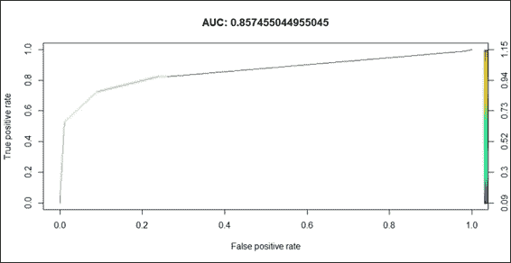

    预测模型的 ROC

<title>Assessing performance with the ROC curve</title>  

## 工作原理...

这里，我们首先从概率矩阵创建预测对象，然后为 ROC 曲线(`tpr=true positive rate`、`fpr=false positive rate`)和 AUC 准备 ROCR 性能对象。最后，我们使用 plot 函数绘制 ROC 曲线。

前面截图中画出的结果是这样解释的:曲线下越大(一个完美的预测会使 AUC 等于 1)，模型的预测精度越好。我们的模型返回值 0.857，这表明简单条件推理树模型足够强大，可以进行生存预测。

<title>Assessing performance with the ROC curve</title>  

## 亦见

*   要获得更多关于 ROCR 的信息，你可以阅读论文 *Sing，T.* ， *Sander，O.* ， *Berenwinkel，N.* 和 *Lengauer，T.* (2005)。 *ROCR:可视化 R 中的分类器性能*。*生物信息学，21(20)，3940-3941* 。