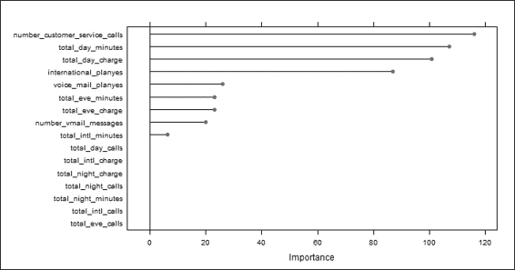
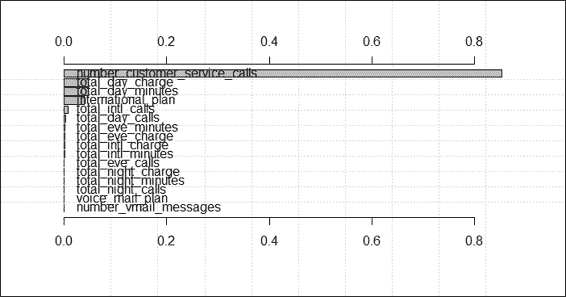
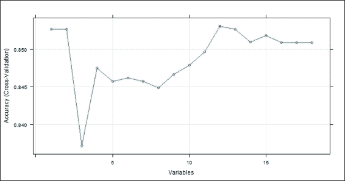
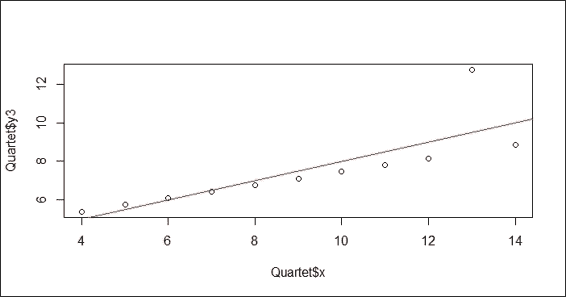
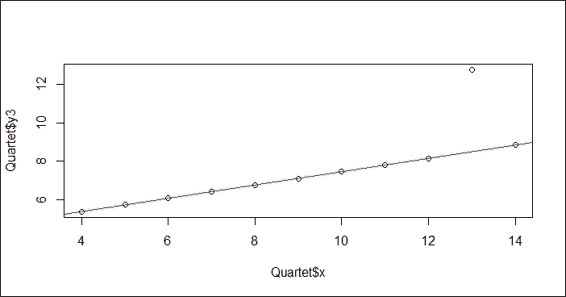
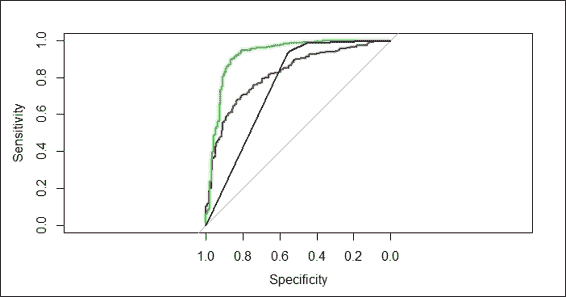
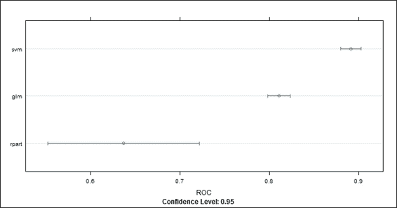
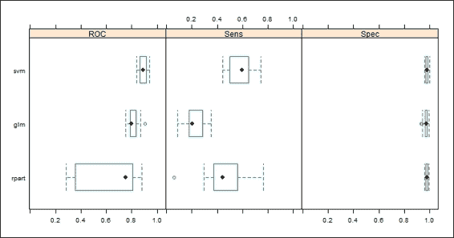

# 七、模型评估

在本章中，我们将讨论以下主题:

*   用 k-fold 交叉验证估计模型性能
*   使用 e1071 包进行交叉验证
*   使用插入符号包执行交叉验证
*   用插入符号包对变量重要性进行排序
*   用 rminer 包对变量重要性进行排序
*   寻找与脱字符号包高度相关的特征
*   使用脱字符号包选择特征
*   测量回归模型的性能
*   用混淆矩阵衡量预测性能
*   使用 ROCR 测量预测性能
*   使用 caret 软件包比较 ROC 曲线
*   使用 caret 包测量模型之间的性能差异


# 简介

进行模型评估，以确保拟合的模型能够准确预测未来或未知受试者的反应。如果没有模型评估，我们可能会训练过度适合训练数据的模型。为了防止过度拟合，我们可以使用软件包，如`caret`、`rminer`和`rocr`来评估拟合模型的性能。此外，模型评估可以帮助选择最佳模型，该模型更稳健并且可以准确预测未来受试者的反应。

在下一章，我们将讨论如何实现一个简单的 R 脚本或使用其中一个包(例如，`caret`或`rminer`)来评估一个拟合模型的性能。


# 使用 k 倍交叉验证评估模型性能

k 倍交叉验证技术是一种用于评估分类器性能的常用技术，因为它克服了过度拟合的问题。对于 k-fold 交叉验证，该方法不使用整个数据集来构建模型，而是将数据分成训练数据集和测试数据集。因此，使用训练数据集构建的模型可以用于评估模型在测试数据集上的性能。通过执行 n 次重复的 k-fold 验证，我们可以使用 *n* 精度的平均值来真实地评估所构建模型的性能。在这个配方中，我们将说明如何进行 k 重交叉验证。


## 准备就绪

在这个食谱中，我们将继续使用电信`churn`数据集作为输入数据源来训练支持向量机。对于没有准备数据集的人，请参考[第五章](part0060_split_000.html#page "Chapter 5. Classification (I) – Tree, Lazy, and Probabilistic")、*分类(一)——树、懒、概率*，了解详细信息。


## 怎么做...

执行以下步骤交叉验证电信`churn`数据集:

1.  使用剪切功能将索引拆分为`10`折叠:

    ```
     > ind = cut(1:nrow(churnTrain), breaks=10, labels=F) 
    ```

2.  接下来，使用`for`循环执行 10 次交叉验证，重复`10`次:

    ```
     > accuracies = c() > for (i in 1:10) { +   fit = svm(churn ~., churnTrain[ind != i,]) +   predictions = predict(fit, churnTrain[ind == i, ! names(churnTrain) %in% c("churn")]) +   correct_count = sum(predictions == churnTrain[ind == i,c("churn")]) +   accuracies = append(correct_count / nrow(churnTrain[ind == i,]), accuracies) + } 
    ```

3.  然后可以打印精度:

    ```
     > accuracies  [1] 0.9341317 0.8948949 0.8978979 0.9459459 0.9219219 0.9281437 0.9219219 0.9249249 0.9189189 0.9251497 
    ```

4.  最后，您可以使用`mean`功能生成平均精度:

    ```
     > mean(accuracies) [1] 0.9213852 
    ```


## 它是如何工作的...

在这个配方中，我们实现了一个简单的脚本，执行 10 重交叉验证。我们首先用`cut`函数生成一个 10 倍的指数。然后，我们实现一个`for`循环来执行 10 次 10 重交叉验证。在循环中，我们首先对数据的`9`折叠应用`svm`作为训练集。然后，我们使用拟合的模型来预测其余数据(测试数据集)的标签。接下来，我们使用正确预测的标签的总和来生成准确度。因此，循环存储 10 个生成的精度。最后，我们使用`mean`函数来检索精确度的平均值。


## 还有更多...

如果您希望使用其他模型执行 k-fold 验证，只需替换该行以生成适合您喜欢的任何分类器的变量。例如，如果您想评估带有 10 重交叉验证的朴素贝叶斯模型，您只需将调用函数从`svm`替换为`naiveBayes`:

```
> for (i in 1:10) {
+   fit = naiveBayes(churn ~., churnTrain[ind != i,])
+   predictions = predict(fit, churnTrain[ind == i, ! names(churnTrain) %in% c("churn")])
+   correct_count = sum(predictions == churnTrain[ind == i,c("churn")])
+   accuracies = append(correct_count / nrow(churnTrain[ind == i,]), accuracies)
+ }

```


# 使用 e1071 包进行交叉验证

除了实现一个`loop`函数进行 k 重交叉验证，还可以使用`tuning`函数(例如`tune.nnet`、 `tune.randomForest`、 `tune.rpart`、 `tune.svm`、`tune.knn`)。)以获得最小误差值。在这个配方中，我们将说明如何使用`tune.svm`来执行 10 重交叉验证，并获得最佳分类模型。


## 做好准备

在这个方法中，我们继续使用 telecom `churn`数据集作为输入数据源来执行 10 重交叉验证。


## 怎么做...

执行以下步骤，以便使用交叉验证检索最小估计误差:

1.  将`tune.svm`应用于训练数据集`trainset`，将 10 重交叉验证作为调整控制。(如果发现错误信息，如`could not find function predict.func`，请清空工作区，重启 R 会话，重新加载`e1071`库):

    ```
     > tuned = tune.svm(churn~., data = trainset, gamma = 10^-2, cost = 10^2, tunecontrol=tune.control(cross=10)) 
    ```

2.  接下来，您可以获取该型号的汇总信息，调好:

    ```
     > summary(tuned)  Error estimation of 'svm' using 10-fold cross validation: 0.08164651 
    ```

3.  然后，您可以访问调优型号的性能详情:

    ```
     > tuned$performances   gamma cost      error dispersion 1  0.01  100 0.08164651 0.02437228 
    ```

4.  最后，您可以使用最佳模型生成一个分类表:

    ```
     > svmfit = tuned$best.model > table(trainset[,c("churn")], predict(svmfit))         yes   no   yes  234  108   no    13 1960 
    ```


## 工作原理...

`e1071`包提供了构建和评估模型的各种函数，因此，您不需要重新发明轮子来评估一个合适的模型。在这个方法中，我们使用`tune.svm`函数，通过给定的公式、数据集、gamma、成本和控制函数来调整 svm 模型。在`tune.control`选项中，我们将选项配置为`cross=10`，它在调优过程中执行 10 重交叉验证。在调整过程中，调整过程将最终返回最小估计误差、性能细节和最佳模型。因此，我们可以获得调优的性能度量，并进一步使用最佳模型来生成分类表。


## 参见

*   在`e1071`封装中，`tune`功能使用网格搜索来调整参数。对其他调谐功能感兴趣的，使用帮助功能查看`tune`文档:

    ```
     > ?e1071::tune 
    ```


# 使用插入符号包执行交叉验证

`Caret`(分类和回归训练)包包含许多关于回归和分类问题的训练过程的功能。与`e1071`包类似，它也包含一个执行 k-fold 交叉验证的函数。在这个配方中，我们将演示如何使用`caret`包执行 k-fold 交叉验证。


## 做好准备

在这个方法中，我们将继续使用 telecom `churn`数据集作为输入数据源来执行 k-fold 交叉验证。


## 怎么做...

执行以下步骤，用`caret`包进行 k 重交叉验证:

1.  首先，在`3`重复:

    ```
     > control = trainControl(method="repeatedcv", number=10, repeats=3) 
    ```

    中设置控制参数进行十重交叉验证训练
2.  然后，您可以使用`rpart` :

    ```
     > model = train(churn~., data=trainset, method="rpart", preProcess="scale", trControl=control) 
    ```

    对电信客户流失数据训练分类模型
3.  最后，您可以检查生成的模型的输出:

    ```
     > model CART   2315 samples   16 predictor    2 classes: 'yes', 'no'   Pre-processing: scaled  Resampling: Cross-Validated (10 fold, repeated 3 times)   Summary of sample sizes: 2084, 2083, 2082, 2084, 2083, 2084, ...   Resampling results across tuning parameters:    cp      Accuracy  Kappa  Accuracy SD  Kappa SD   0.0556  0.904     0.531  0.0236       0.155      0.0746  0.867     0.269  0.0153       0.153      0.0760  0.860     0.212  0.0107       0.141     Accuracy was used to select the optimal model using the largest value. The final value used for the model was cp = 0.05555556. 
    ```


## 工作原理...

在这个配方中，我们展示了使用`caret`包进行 k 重交叉验证是多么的方便。在第一步中，我们设置训练对照，并选择在三次重复中执行 10 重交叉验证的选项。重复 k 倍验证的过程称为重复 k 倍验证，用于检验模型的稳定性。如果模型是稳定的，人们应该得到类似的测试结果。然后，我们对训练数据集应用`rpart`,选择缩放数据，并使用上一步配置的选项训练模型。

训练过程完成后，模型输出三个重采样结果。在这些结果中，`cp=0.05555556`的模型具有最大的精度值(`0.904`，因此被选为分类的最佳模型。


## 参见

*   您可以在`trainControl`中配置`resampling`功能，您可以在其中指定`boot`、`boot632`、`cv`、`repeatedcv`、`LOOCV`、`LGOCV`、`none`、`oob`、`adaptive` _ `cv`、`adaptive_boot`或`adaptive_LGOCV`。要查看更多关于如何选择重采样方法的详细信息，请查看`trainControl`文档:

    ```
     > ?trainControl 
    ```


# 用脱字包对变量重要性进行排序

建立监督学习模型后，我们可以估计特征的重要性。该估算采用灵敏度分析来测量输入变化时对给定模型输出的影响。在本食谱中，我们将向您展示如何用`caret`包对变量重要性进行排序。


## 做好准备

您需要通过将合适的`rpart`对象存储在`model`变量中来完成之前的配方。


## 怎么做...

执行以下步骤，用`caret`包对变量重要性进行排序:

1.  首先可以用`varImp`函数估算变量重要性:

    ```
     > importance = varImp(model, scale=FALSE) > importance rpart variable importance                                Overall number_customer_service_calls 116.015 total_day_minutes             106.988 total_day_charge              100.648 international_planyes          86.789 voice_mail_planyes             25.974 total_eve_charge               23.097 total_eve_minutes              23.097 number_vmail_messages          19.885 total_intl_minutes              6.347 total_eve_calls                 0.000 total_day_calls                 0.000 total_night_charge              0.000 total_intl_calls                0.000 total_intl_charge               0.000 total_night_minutes             0.000 total_night_calls               0.000 
    ```

2.  Then, you can generate the variable importance plot with the `plot` function:

    ```
    > plot(importance)

    ```

    

    图 1:使用 caret 包可视化变量的重要性


## 工作原理...

在这个菜谱中，我们首先使用`varImp`函数来检索变量 importance 并获得摘要。总体结果显示了每个属性的敏感度度量。接下来，我们根据等级绘制变量重要性，这表明`number_customer_service_calls`属性是敏感度度量中最重要的变量。


## 还有更多...

在一些分类包中，如`rpart`，从训练模型生成的对象包含变量重要性。我们可以通过访问输出对象来检查变量重要性:

```
> library(rpart)
> model.rp = rpart(churn~., data=trainset)
> model.rp$variable.importance
 total_day_minutes              total_day_charge 
 111.645286                    110.881583 
number_customer_service_calls            total_intl_minutes 
 58.486651                     48.283228 
 total_intl_charge              total_eve_charge 
 47.698379                     47.166646 
 total_eve_minutes            international_plan 
 47.166646                     42.194508 
 total_intl_calls         number_vmail_messages 
 36.730344                     19.884863 
 voice_mail_plan             total_night_calls 
 19.884863                      7.195828 
 total_eve_calls            total_night_charge 
 3.553423                      1.754547 
 total_night_minutes               total_day_calls 
 1.754547                      1.494986 

```


# 用 rminer 包对变量重要性进行排序

除了使用`caret`包生成变量重要性的之外，您还可以使用`rminer`包生成分类模型的变量重要性。在下面的食谱中，我们将说明如何使用`rminer`来获得拟合模型的变量重要性。


## 准备就绪

在这个菜谱中，我们将继续使用 telecom `churn`数据集作为输入数据源来对变量重要性进行排序。


## 怎么做...

执行以下步骤，用`rminer`对变量重要性进行排序:

1.  安装并加载软件包，`rminer` :

    ```
     > install.packages("rminer") > library(rminer) 
    ```

2.  用训练集拟合 svm 模型:

    ```
     > model=fit(churn~.,trainset,model="svm") 
    ```

3.  使用`Importance`函数获得变量重要性:

    ```
     > VariableImportance=Importance(model,trainset,method="sensv") 
    ```

4.  Plot the variable importance ranked by the variance:

    ```
    > L=list(runs=1,sen=t(VariableImportance$imp),sresponses=VariableImportance$sresponses)
    > mgraph(L,graph="IMP",leg=names(trainset),col="gray",Grid=10)

    ```

    

    图 2:使用`rminer`包的可变重要性的可视化


## 它是如何工作的...

类似于`caret`包，`rminer`包也可以生成分类模型的可变重要性。在这个方法中，我们首先使用`fit`函数在训练数据集`trainset`上训练 svm 模型。然后，我们使用`Importance`函数，用一个灵敏度度量对变量的重要性进行排序。最后，我们使用`mgraph`来绘制变量重要性的等级。与使用`caret`包获得的结果相似，`number_customer_service_calls`是灵敏度测量中最重要的变量。


## 亦见

*   `rminer`包提供多种分类模式供选择。如果您对使用 svm 以外的模型感兴趣，您可以使用以下命令查看这些选项:

    ```
     > ?rminer::fit 
    ```


# 寻找与脱字符号包高度相关的特征

当执行回归或分类时，如果移除高度相关的属性，某些模型会执行得更好。`caret`包提供了`findCorrelation`函数，可以用来查找彼此高度相关的属性。在这个菜谱中，我们将演示如何使用`caret`包找到高度相关的特性。


## 正在准备中

在这个菜谱中，我们将继续使用 telecom `churn`数据集作为输入数据源来查找高度相关的特性。


## 怎么做...

执行以下步骤来查找高度相关的属性:

1.  删除不是用数字字符编码的特征:

    ```
     > new_train = trainset[,! names(churnTrain) %in% c("churn", "international_plan", "voice_mail_plan")] 
    ```

2.  然后，就可以获得各个属性的关联:

    ```
     >cor_mat = cor(new_train) 
    ```

3.  接下来，我们使用`findCorrelation`来搜索截止值等于 0.75 的高度相关的属性:

    ```
     > highlyCorrelated = findCorrelation(cor_mat, cutoff=0.75) 
    ```

4.  我们然后获得高度相关属性的名称:

    ```
     > names(new_train)[highlyCorrelated] [1] "total_intl_minutes"  "total_day_charge"    "total_eve_minutes"   "total_night_minutes" 
    ```


## 它是如何工作的...

在这个配方中，我们使用`caret`包搜索高度相关的属性。为了检索每个属性的相关性，应该首先删除非数字属性。然后，我们执行相关以获得相关矩阵。接下来，我们使用`findCorrelation`找到高度相关的属性，截止值设置为 0.75。最终得到高度相关(相关系数大于 0.75)的属性名称，分别为`total_intl_minutes`、`total_day_charge`、`total_eve_minutes`、`total_night_minutes`。可以考虑去掉一些高度相关的属性，保留一两个属性，以获得更好的准确性。


## 亦见

*   除了`caret`包，您还可以使用`subselect`包中的`leaps`、`genetic`和`anneal`函数来实现相同的目标


# 使用插入符号包选择特征

特征选择方法搜索预测误差最小的特征子集。我们可以应用特征选择来识别构建精确模型所需的属性。`caret`包提供了一个递归的特征消除函数`rfe`，可以帮助自动选择需要的特征。在下面的菜谱中，我们将演示如何使用`caret`包来执行特征选择。


## 做好准备

在这个方法中，我们将继续使用 telecom `churn`数据集作为特性选择的输入数据源。


## 怎么做...

执行以下步骤来选择特征:

1.  将训练数据集`trainset`中名为`international_plan`的特征转换为`intl_yes`和`intl_no` :

    ```
     > intl_plan = model.matrix(~ trainset.international_plan - 1, data=data.frame(trainset$international_plan)) > colnames(intl_plan) = c("trainset.international_planno"="intl_no", "trainset.international_planyes"= "intl_yes") 
    ```

2.  将训练数据集`trainset`中名为`voice_mail_plan`的特征转换为`voice_yes`和`voice_no` :

    ```
     > voice_plan = model.matrix(~ trainset.voice_mail_plan - 1, data=data.frame(trainset$voice_mail_plan)) > colnames(voice_plan) = c("trainset.voice_mail_planno" ="voice_no", "trainset.voice_mail_planyes"="voidce_yes") 
    ```

3.  移除`international_plan`和`voice_mail_plan`属性的并将训练数据集、`trainset`与数据帧、`intl_plan`和`voice_plan` :

    ```
     > trainset$international_plan = NULL > trainset$voice_mail_plan = NULL > trainset = cbind(intl_plan,voice_plan, trainset) 
    ```

    合并
4.  将测试数据集`testset`中名为`international_plan`的特征转换为`intl_yes`和`intl_no` :

    ```
     > intl_plan = model.matrix(~ testset.international_plan - 1, data=data.frame(testset$international_plan)) > colnames(intl_plan) = c("testset.international_planno"="intl_no", "testset.international_planyes"= "intl_yes") 
    ```

5.  将训练数据集`trainset`中命名为`voice_mail_plan`的特征转换为`voice_yes`和`voice_no` :

    ```
     > voice_plan = model.matrix(~ testset.voice_mail_plan - 1, data=data.frame(testset$voice_mail_plan)) > colnames(voice_plan) = c("testset.voice_mail_planno" ="voice_no", "testset.voice_mail_planyes"="voidce_yes") 
    ```

6.  删除`international_plan`和`voice_mail_plan`属性，合并测试数据集，`testset`和数据帧，`intl_plan`和`voice_plan` :

    ```
     > testset$international_plan = NULL > testset$voice_mail_plan = NULL > testset = cbind(intl_plan,voice_plan, testset) 
    ```

7.  然后，我们使用线性判别分析创建一个特征选择算法:

    ```
     > ldaControl = rfeControl(functions = ldaFuncs, method = "cv") 
    ```

8.  接下来，我们使用从 1 到 18:

    ```
     > ldaProfile = rfe(trainset[, !names(trainset) %in% c("churn")], trainset[,c("churn")],sizes = c(1:18), rfeControl = ldaControl) > ldaProfile  Recursive feature selection  Outer resampling method: Cross-Validated (10 fold)   Resampling performance over subset size:   Variables Accuracy  Kappa AccuracySD KappaSD Selected          1   0.8523 0.0000   0.001325 0.00000                   2   0.8523 0.0000   0.001325 0.00000                   3   0.8423 0.1877   0.015468 0.09787                   4   0.8462 0.2285   0.016593 0.09610                   5   0.8466 0.2384   0.020710 0.09970                   6   0.8466 0.2364   0.019612 0.09387                   7   0.8458 0.2315   0.017551 0.08670                   8   0.8458 0.2284   0.016608 0.09536                   9   0.8475 0.2430   0.016882 0.10147                  10   0.8514 0.2577   0.014281 0.08076                  11   0.8518 0.2587   0.014124 0.08075                  12   0.8544 0.2702   0.015078 0.09208        *         13   0.8544 0.2721   0.015352 0.09421                  14   0.8531 0.2663   0.018428 0.11022                  15   0.8527 0.2652   0.017958 0.10850                  16   0.8531 0.2684   0.017897 0.10884                  17   0.8531 0.2684   0.017897 0.10884                  18   0.8531 0.2684   0.017897 0.10884           The top 5 variables (out of 12):    total_day_charge, total_day_minutes, intl_no, number_customer_service_calls, total_eve_charge 
    ```

    的子集对训练数据集`trainset`执行后向特征选择
9.  Next, we can plot the selection result:

    ```
    > plot(ldaProfile, type = c("o", "g"))

    ```

    

    图 3:特性选择结果

    我们然后可以检查变量的最佳子集:

    ```
     > ldaProfile$optVariables  [1] "total_day_charge"               [2] "total_day_minutes"              [3] "intl_no"                        [4] "number_customer_service_calls"  [5] "total_eve_charge"               [6] "total_eve_minutes"              [7] "voidce_yes"                     [8] "total_intl_calls"               [9] "number_vmail_messages"         [10] "total_intl_charge"             [11] "total_intl_minutes"            [12] "total_night_minutes"   
    ```

10.  现在，我们可以检查拟合的模型:

    ```
     > ldaProfile$fit Call: lda(x, y)  Prior probabilities of groups:       yes        no  0.1477322 0.8522678   Group means:     total_day_charge total_day_minutes   intl_no yes         35.00143          205.8877 0.7046784 no          29.62402          174.2555 0.9351242     number_customer_service_calls total_eve_charge yes                      2.204678         18.16702 no                       1.441460         16.96789     total_eve_minutes voidce_yes total_intl_calls yes          213.7269  0.1666667         4.134503 no           199.6197  0.2954891         4.514445     number_vmail_messages total_intl_charge yes              5.099415          2.899386 no               8.674607          2.741343     total_intl_minutes total_night_minutes yes           10.73684            205.4640 no            10.15119            201.4184  Coefficients of linear discriminants:                                        LD1 total_day_charge               0.715025524 total_day_minutes             -0.130486470 intl_no                        2.259889324 number_customer_service_calls -0.421997335 total_eve_charge              -2.390372793 total_eve_minutes              0.198406977 voidce_yes                     0.660927935 total_intl_calls               0.066240268 number_vmail_messages         -0.003529233 total_intl_charge              2.315069869 total_intl_minutes            -0.693504606 total_night_minutes           -0.002127471 
    ```

11.  最后，我们可以计算跨重采样的性能:

    ```
     > postResample(predict(ldaProfile, testset[, !names(testset) %in% c("churn")]), testset[,c("churn")]) Accuracy     Kappa 0.8605108 0.2672027 
    ```

12.  工作原理...


## 在这个配方中，我们使用`caret`包进行特征选择。由于数据集中有因子编码的属性，我们首先使用一个名为`model.matrix`的函数将因子编码的属性转换成多个二进制属性。因此，我们将`international_plan`属性转换为`intl_yes`和`intl_no`。此外，我们将`voice_mail_plan`属性转换为`voice_yes`和`voice_no`。

接下来，我们使用交叉验证方法`cv`和线性判别函数`ldaFuncs`设置用于训练的控制参数。然后，我们使用递归特征消除，`rfe`，通过使用`control`函数，`ldaFuncs`来执行特征选择。`rfe`函数生成特征选择摘要，其中包含对子集大小和顶部变量的性能进行重采样。

然后，我们可以使用获得的模型信息来绘制变量数量与精确度的关系。从图 3 可以明显看出，使用 12 个特征可以获得最佳精度。除此之外，我们可以检索拟合模型中变量的最佳子集(总共 12 个变量)。最后，我们可以计算所有重采样的性能，其精度为 0.86，kappa 为 0.27。

亦见


## 为了指定用于控制特征选择的算法，可以改变`rfeControl`中指定的控制功能。这里有一些你可以使用的选项:

```
 caretFuncs      SVM (caret) lmFuncs     lm (base) rfFuncs         RF(randomForest) treebagFuncs     DT (ipred) ldaFuncs       lda(base) nbFuncs       NB(klaR) gamFuncs      gam(gam) 
```

*   测量回归模型的性能


# 为了衡量回归模型的性能，我们可以计算预测输出和实际输出的距离作为模型性能的量化指标。这里我们经常用**均方根误差** ( **RMSE** )、**相对平方误差** ( **RSE** )和 R 平方作为常用的度量。在下面的食谱中，我们将说明如何从构建的回归模型中计算这些度量。

做好准备


## 在这个配方中，我们将使用包含四个回归数据集的`Quartet`数据集作为输入数据源。

怎么做...


## 执行以下步骤来衡量回归模型的性能:

从`car`包中加载`Quartet`数据集:

```
 > library(car) > data(Quartet) 
```

1.  图 4:线性回归图
2.  Plot the attribute, `y3`, against x using the `lm` function:

    ```
    > plot(Quartet$x, Quartet$y3)
    > lmfit = lm(Quartet$y3~Quartet$x)
    > abline(lmfit, col="red")

    ```

    

    Figure 4: The linear regression plot

    您可以使用`predict`功能:

    ```
     > predicted= predict(lmfit, newdata=Quartet[c("x")]) 
    ```

    检索预测值
3.  现在，可以计算均方根误差:

    ```
     > actual = Quartet$y3 > rmse = (mean((predicted - actual)^2))^0.5 > rmse [1] 1.118286 
    ```

4.  你可以计算相对平方误差:

    ```
     > mu = mean(actual) > rse = mean((predicted - actual)^2) / mean((mu - actual)^2)  > rse [1] 0.333676 
    ```

5.  也可以用 R 平方作为度量:

    ```
     > rsquare = 1 - rse > rsquare [1] 0.666324 
    ```

6.  图 5:四方数据集上的稳健线性回归图
7.  Then, you can plot attribute, y3, against x using the `rlm` function from the MASS package:

    ```
    > library(MASS)
    > plot(Quartet$x, Quartet$y3)
    > rlmfit = rlm(Quartet$y3~Quartet$x)
    > abline(rlmfit, col="red")

    ```

    

    Figure 5: The robust linear regression plot on the Quartet dataset

    然后可以使用`predict`函数检索预测值:

    ```
     > predicted = predict(rlmfit, newdata=Quartet[c("x")]) 
    ```

8.  接下来，您可以使用预测值和实际值的距离来计算均方根误差:

    ```
     > actual = Quartet$y3 > rmse = (mean((predicted - actual)^2))^0.5 > rmse [1] 1.279045 
    ```

9.  计算预测和实际标签之间的相对平方误差:

    ```
     > mu = mean(actual) > rse =mean((predicted - actual)^2) / mean((mu - actual)^2)  > rse [1] 0.4365067 
    ```

10.  现在，你可以计算 R 平方值:

    ```
     > rsquare = 1 - rse > rsquare [1] 0.5634933 
    ```

11.  工作原理...


## 回归模型性能的测量采用预测值和实际值之间的距离。我们经常使用这三个度量，均方根误差、相对平方误差和 R 平方，作为回归模型性能的量化指标。在这个方法中，我们首先从`car`包中加载`Quartet`数据。然后，我们使用`lm`函数来拟合线性模型，并在 x 变量与`y3`变量的散点图上添加回归线。接下来，我们使用 predict 函数计算预测值，开始计算所建模型的**均方根误差** ( **RMSE** )、**相对平方误差** ( **RSE** )和 R 平方。

由于这个数据集在`x=13`有一个异常值，我们想量化异常值如何影响性能测量。为了实现这一点，我们首先使用来自`MASS`包的`rlm`函数训练一个回归模型。与上一步类似，我们然后生成均方根误差、相对误差和 R 平方的性能测量。从输出测量来看，`lm`模型的均方误差和相对均方误差明显小于`rlm`建立的模型，R-Square 的得分表明`lm`建立的模型具有更大的预测能力。然而，对于实际场景，我们应该在`x=13`移除异常值。这种比较表明，异常值可能偏向于性能度量，并可能导致我们选择错误的模型。

还有更多…


## 如果您想在线性回归模型上执行交叉验证，您可以使用`e1071`包中的`tune`函数:

除了`e1071`包，您可以使用`caret`包中的`train`函数来执行交叉验证。除此之外，您还可以使用`DAAG`包中的`cv.lm`来达到同样的目的。

```
> tune(lm, y3~x, data = Quartet)
Error estimation of 'lm' using 10-fold cross validation: 2.33754

```

用混淆矩阵衡量预测性能


# 为了测量分类模型的性能，我们可以首先根据我们的预测标签和实际标签生成一个分类表。然后，我们可以使用混淆矩阵来获得性能度量，如精确度、召回率、特异性和准确性。在这个菜谱中，我们将演示如何使用`caret`包检索混淆矩阵。

做好准备


## 在这个方案中，我们将继续使用电信`churn`数据集作为我们的示例数据集。

怎么做...


## 执行以下步骤来生成分类测量:

使用训练数据集训练 svm 模型:

```
 > svm.model= train(churn ~ ., +                   data = trainset, +                   method = "svmRadial") 
```

1.  然后，您可以使用拟合的模型预测标签，`svm.model` :

    ```
     > svm.pred = predict(svm.model, testset[,! names(testset) %in% c("churn")]) 
    ```

2.  接下来，可以生成一个分类表:

    ```
     > table(svm.pred, testset[,c("churn")])  svm.pred yes  no      yes  73  16      no   68 861 
    ```

3.  最后，您可以使用预测结果和来自测试数据集的实际标签来生成混淆矩阵:

    ```
     > confusionMatrix(svm.pred, testset[,c("churn")]) Confusion Matrix and Statistics            Reference Prediction yes  no        yes  73  16        no   68 861                 Accuracy : 0.9175                            95% CI : (0.8989, 0.9337)     No Information Rate : 0.8615               P-Value [Acc > NIR] : 2.273e-08                           Kappa : 0.5909            Mcnemar's Test P-Value : 2.628e-08                     Sensitivity : 0.51773                      Specificity : 0.98176                   Pos Pred Value : 0.82022                   Neg Pred Value : 0.92680                       Prevalence : 0.13851                   Detection Rate : 0.07171             Detection Prevalence : 0.08743                Balanced Accuracy : 0.74974                  'Positive' Class : yes               
    ```

4.  工作原理...


## 在这个配方中，我们演示了如何获得混淆矩阵来衡量分类模型的性能。首先，我们使用`caret`包中的`train`函数来训练 svm 模型。接下来，我们使用`predict`函数来提取使用测试数据集的 svm 模型的预测标签。然后，我们执行`table`函数来获得基于预测和实际标签的分类表。最后，我们使用`caret`包中的`confusionMatrix`函数来生成混淆矩阵，以测量分类模型的性能。

参见


## 如果你对`train`功能可用的方法感兴趣，可以参考这个网站:[http://topepo.github.io/caret/modelList.html](http://topepo.github.io/caret/modelList.html)

*   使用 ROCR 测量预测性能


# **接收器工作特性** ( **ROC** )曲线是说明二进制分类器系统的性能的曲线图，并且绘出了不同切割点的真阳性率对假阳性率。我们最常用此图来计算曲线 ( **AUC** )至下的**面积，以衡量分类模型的性能。在本食谱中，我们将演示如何绘制 ROC 曲线并计算 AUC 来衡量分类模型的性能。**

做好准备


## 在这个配方中，我们将继续使用电信`churn`数据集作为我们的示例数据集。

如何去做...


## 执行以下步骤，以生成两个具有不同成本的不同分类实例:

首先，你应该安装并加载`ROCR`包:

```
 > install.packages("ROCR") > library(ROCR) 
```

1.  使用概率等于`TRUE` :

    ```
     > svmfit=svm(churn~ ., data=trainset, prob=TRUE) 
    ```

    的训练数据集训练 svm 模型
2.  基于训练好的模型在测试数据集上进行预测，概率设置为`TRUE` :

    ```
     >pred=predict(svmfit,testset[, !names(testset) %in% c("churn")], probability=TRUE) 
    ```

3.  用`yes` :

    ```
     > pred.prob = attr(pred, "probabilities")  > pred.to.roc = pred.prob[, 2]  
    ```

    获得标签的概率
4.  使用`prediction`功能生成预测结果:

    ```
     > pred.rocr = prediction(pred.to.roc, testset$churn) 
    ```

5.  使用`performance`功能获得性能测量:

    ```
     > perf.rocr = performance(pred.rocr, measure = "auc", x.measure = "cutoff")  > perf.tpr.rocr = performance(pred.rocr, "tpr","fpr")  
    ```

6.  图 svm 分类器性能的 ROC 曲线
7.  Visualize the ROC curve using the `plot` function:

    ```
    > plot(perf.tpr.rocr, colorize=T,main=paste("AUC:",(perf.rocr@y.values)))

    ```

    

    Figure 6: The ROC curve for the svm classifier performance

    它是如何工作的...


## 在这个食谱中，我们演示了如何生成 ROC 曲线来说明二元分类器的性能。首先要安装并加载库，`ROCR`。然后，我们使用来自`e1071`包的 svm 来训练分类模型，然后使用该模型来预测测试数据集的标签。接下来，我们使用预测函数(来自包，`ROCR`)来生成预测结果。然后，我们调整性能函数，以获得相对于假阳性率的真阳性率的性能测量。最后，我们使用`plot`函数来可视化 ROC 图，并在标题上添加 AUC 的值。在这个例子中，AUC 值是 0.92，这表明 svm 分类器在分类电信用户流失数据集方面表现良好。

亦见


## 对 ROC 的概念和术语感兴趣的，可以参考[http://en . Wikipedia . org/wiki/Receiver _ operating _ character istic](http://en.wikipedia.org/wiki/Receiver_operating_characteristic)

*   使用 caret 软件包比较 ROC 曲线


# 在前几章中，我们介绍了许多分类方法；每种方法都有自己的优缺点。然而，当涉及到如何选择最佳拟合模型的问题时，您需要比较从不同预测模型生成的所有性能度量。为了便于比较，caret 包允许我们生成和比较模型的性能。在这个菜谱中，我们将使用`caret`包提供的函数来比较同一数据集上不同算法训练的模型。

准备就绪


## 这里，我们将继续使用电信数据集作为输入数据源。

怎么做...


## 执行以下步骤，生成每个拟合模型的 ROC 曲线:

安装并加载库，`pROC` :

```
 > install.packages("pROC") > library("pROC") 
```

1.  在 3 次重复中设置 10 倍交叉验证的训练控制:

    ```
     > control = trainControl(method = "repeatedcv", +                            number = 10, +                            repeats = 3, +                            classProbs = TRUE, +                            summaryFunction = twoClassSummary) 
    ```

2.  然后，您可以使用`glm` :

    ```
     > glm.model= train(churn ~ ., +                     data = trainset, +                     method = "glm", +                     metric = "ROC", +                     trControl = control) 
    ```

    在训练数据集上训练一个分类器
3.  此外，您可以使用`svm` :

    ```
     > svm.model= train(churn ~ ., +                   data = trainset, +                   method = "svmRadial", +                   metric = "ROC", +                   trControl = control) 
    ```

    在训练数据集上训练一个分类器
4.  为了查看`rpart`如何处理训练数据，我们使用了`rpart`函数:

    ```
     > rpart.model= train(churn ~ ., +                   data = trainset, +                   method = "rpart", +                   metric = "ROC", +                   trControl = control) 
    ```

5.  您可以根据不同的训练模型分别进行预测:

    ```
     > glm.probs = predict(glm.model, testset[,! names(testset) %in% c("churn")], type = "prob") > svm.probs = predict(svm.model, testset[,! names(testset) %in% c("churn")], type = "prob") > rpart.probs = predict(rpart.model, testset[,! names(testset) %in% c("churn")], type = "prob") 
    ```

6.  图 7:三个分类器性能的 ROC 曲线
7.  You can generate the ROC curve of each model, and plot the curve on the same figure:

    ```
    > glm.ROC = roc(response = testset[,c("churn")],
    +                predictor =glm.probs$yes,
    +                levels = levels(testset[,c("churn")]))
    > plot(glm.ROC, type="S", col="red") 

    Call:
    roc.default(response = testset[, c("churn")], predictor = glm.probs$yes,     levels = levels(testset[, c("churn")]))

    Data: glm.probs$yes in 141 controls (testset[, c("churn")] yes) > 877 cases (testset[, c("churn")] no).
    Area under the curve: 0.82

    > svm.ROC = roc(response = testset[,c("churn")],
    +                predictor =svm.probs$yes,
    +                levels = levels(testset[,c("churn")]))
    > plot(svm.ROC, add=TRUE, col="green") 

    Call:
    roc.default(response = testset[, c("churn")], predictor = svm.probs$yes,     levels = levels(testset[, c("churn")]))

    Data: svm.probs$yes in 141 controls (testset[, c("churn")] yes) > 877 cases (testset[, c("churn")] no).
    Area under the curve: 0.9233

    > rpart.ROC = roc(response = testset[,c("churn")],
    +                predictor =rpart.probs$yes,
    +                levels = levels(testset[,c("churn")]))
    > plot(rpart.ROC, add=TRUE, col="blue")

    Call:
    roc.default(response = testset[, c("churn")], predictor = rpart.probs$yes,     levels = levels(testset[, c("churn")]))

    Data: rpart.probs$yes in 141 controls (testset[, c("churn")] yes) > 877 cases (testset[, c("churn")] no).
    Area under the curve: 0.7581

    ```

    

    Figure 7: The ROC curve for the performance of three classifiers

    工作原理...


## 在这里，我们通过在一个图中展示拟合模型的 ROC 曲线来演示如何比较拟合模型。首先，我们在`twoClassSummary`建立了培训过程的控制，10 重交叉验证，3 次重复，绩效评估。在建立了对训练过程的控制之后，我们然后对训练数据集应用`glm`、`svm`和`rpart`算法来拟合分类模型。接下来，我们可以基于每个生成的模型进行预测，并分别绘制 ROC 曲线。在生成的图中，我们发现 svm 训练的模型具有最大的曲线下面积，为 0.9233(以绿色绘制)，`glm`模型(红色)的 AUC 为 0.82，`rpart`模型(蓝色)的 AUC 为 0.7581。从*图 7* 可以明显看出`svm`在这个训练数据集上的所有拟合模型中表现最好(不需要调优)。

亦见


## 我们使用另一个 ROC 可视化软件包`pROC`，它可以用来显示和分析 ROC 曲线。如果您想了解更多关于套餐的信息，请使用`help`功能:

```
 > help(package="pROC") 
```

*   使用 caret 软件包测量不同型号之间的性能差异


# 在前一个配方中，我们介绍了如何为每个生成的模型生成 ROC 曲线，并将曲线绘制在同一个图上。除了使用 ROC 曲线，一个可以使用重采样方法生成 ROC、灵敏度和特异性指标中每个拟合模型的统计数据。因此，我们可以使用这些统计数据来比较每个模型之间的性能差异。在下面的食谱中，我们将介绍如何测量装有`caret`套件的模型之间的性能差异。

做好准备


## 用户需要通过将`glm`拟合模型、`svm`拟合模型和`rpart`拟合模型分别存储到`glm.model`、`svm.model`和`rpart.model`来完成之前的配方。

怎么做...


## 执行以下步骤来测量每个装配模型之间的性能差异:

对生成的三个模型进行重采样:

```
 > cv.values = resamples(list(glm = glm.model, svm=svm.model, rpart = rpart.model)) 
```

1.  然后，您可以获得重采样结果的汇总:

    ```
     > summary(cv.values)  Call: summary.resamples(object = cv.values)  Models: glm, svm, rpart  Number of resamples: 30   ROC          Min. 1st Qu. Median   Mean 3rd Qu.   Max. NA's glm   0.7206  0.7847 0.8126 0.8116  0.8371 0.8877    0 svm   0.8337  0.8673 0.8946 0.8929  0.9194 0.9458    0 rpart 0.2802  0.7159 0.7413 0.6769  0.8105 0.8821    0  Sens           Min. 1st Qu. Median   Mean 3rd Qu.   Max. NA's glm   0.08824  0.2000 0.2286 0.2194  0.2517 0.3529    0 svm   0.44120  0.5368 0.5714 0.5866  0.6424 0.7143    0 rpart 0.20590  0.3742 0.4706 0.4745  0.5929 0.6471    0  Spec          Min. 1st Qu. Median   Mean 3rd Qu.   Max. NA's glm   0.9442  0.9608 0.9746 0.9701  0.9797 0.9949    0 svm   0.9442  0.9646 0.9746 0.9740  0.9835 0.9949    0 rpart 0.9492  0.9709 0.9797 0.9780  0.9848 0.9949    0 
    ```

2.  图 ROC 指标中重采样结果的点状图
3.  Use `dotplot` to plot the resampling result in the ROC metric:

    ```
    > dotplot(cv.values, metric = "ROC")

    ```

    

    图 9:重采样结果的盒须图

4.  Also, you can use a box-whisker plot to plot the resampling result:

    ```
    > bwplot(cv.values, layout = c(3, 1))

    ```

    

    工作原理...

    在这个配方中，我们演示了如何使用重采样方法测量三个拟合模型之间的性能差异。首先，我们使用`resample`函数来生成每个拟合模型的统计数据(`svm.model`、`glm.model`和`rpart.model`)。然后，我们可以使用`summary`函数来获得这三个模型在 ROC、灵敏度和特异性指标中的统计数据。接下来，我们可以对重采样结果应用一个`dotplot`,看看 ROC 在每个模型之间是如何变化的。最后，我们在重采样结果上使用盒须图来显示 ROC 中不同模型的盒须图，在单个图上显示灵敏度和特异性度量。


## 参见

除了使用`dotplot`和`bwplot`来测量性能差异，还可以使用`densityplot`、`splom`和`xyplot`来可视化每个拟合模型在 ROC、灵敏度和特异性指标中的性能差异。


## See also

*   Besides using `dotplot` and `bwplot` to measure performance differences, one can use `densityplot`, `splom`, and `xyplot` to visualize the performance differences of each fitted model in the ROC, sensitivity, and specificity metrics.