# 第八章。集成学习

在本章中，我们将讨论以下主题:

*   用 bagging 方法对数据进行分类
*   用 bagging 方法进行交叉验证
*   使用 boosting 方法对数据进行分类
*   使用 boosting 方法执行交叉验证
*   使用梯度增强对数据进行分类
*   计算分类器的边距
*   计算集合方法的误差演化
*   用随机森林对数据进行分类
*   估计不同分类器的预测误差


# 简介

集成学习是一种将不同学习者产生的结果组合成一种格式的方法，目的是产生更好的分类结果和回归结果。在前几章中，我们讨论了几种分类方法。这些方法采用不同的方法，但它们都有相同的目标，即找到一个最佳的分类模型。然而，单个分类器可能是不完美的，这可能会在某些类别中对数据进行错误分类。因为不是所有的分类器都是不完美的，所以更好的方法是通过投票来平均结果。换句话说，如果我们用相同的输入对每个分类器的预测结果进行平均，我们可以创建一个比使用个体方法更好的模型。

在集成学习中，bagging、boosting 和随机森林是三种最常见的方法:

*   Bagging 是一种投票方式，首先用 Bootstrap 生成一个不同的训练集，然后用训练集做出不同的基础学习者。 bagging 方法采用基础学习者的组合来进行更好的预测。
*   升压与装袋方法类似。然而，boosting 的不同之处在于，它首先按顺序构建基础学习，其中每个后续学习器都是为前一个学习器的预测残差构建的。通过创建一个互补学习器的方法，它利用前一个学习器所犯的错误来训练下一个基础学习器。
*   随机森林使用从许多分类树投票的分类结果。这个想法很简单；单个分类树将利用单个输入向量获得单个分类结果。但是，随机森林会生成许多分类树，从一个输入中获得多个结果。因此，随机林将使用来自所有决策树的大多数投票来对数据进行分类，或者使用平均输出进行回归。

在下面的食谱中，我们将讨论如何使用 bagging 和 boosting 对数据进行分类。然后，我们可以执行交叉验证来估计每个分类器的错误率。除此之外，我们将介绍如何使用边际来衡量模型的确定性。接下来，我们介绍随机森林，类似于 bagging 和 boosting 方法，并介绍如何训练模型来对数据进行分类，并使用余量来估计模型的确定性。最后，我们将演示如何估计每个分类器的错误率，并使用错误率来比较不同分类器的性能。


# 用 bagging 方法对数据进行分类

`adabag`包实现了增压和装袋两种方法。对于 bagging 方法，该包实现了 Breiman 的 Bagging 算法，首先生成多个版本的分类器，然后得到一个聚合的分类器。在这个菜谱中，我们将说明如何使用来自`adabag`的 bagging 方法来使用电信`churn`数据集生成分类模型。


## 准备就绪

在这个方法中，我们继续使用电信`churn`数据集作为 bagging 方法的输入数据源。对于没有准备数据集的人，请参考[第五章](part0060_split_000.html#page "Chapter 5. Classification (I) – Tree, Lazy, and Probabilistic")、*分类(一)——树、懒、概率*，了解详细信息。


## 怎么做...

执行以下步骤，为电信`churn`数据集生成分类模型:

1.  首先，您需要安装并加载`adabag`包(安装`adabag`可能需要一段时间):

    ```
     > install.packages("adabag") > library(adabag) 
    ```

2.  接下来，您可以使用`bagging`函数来训练一个训练数据集(训练过程中结果可能会有所不同):

    ```
     > set.seed(2) > churn.bagging = bagging(churn ~ ., data=trainset, mfinal=10) 
    ```

3.  从装袋结果中取变量重要性:

    ```
     > churn.bagging$importance            international_plan number_customer_service_calls                     10.4948380                    16.4260510          number_vmail_messages               total_day_calls                      0.5319143                     0.3774190               total_day_charge             total_day_minutes                      0.0000000                    28.7545042                total_eve_calls              total_eve_charge                      0.1463585                     0.0000000              total_eve_minutes              total_intl_calls                     14.2366754                     8.7733895              total_intl_charge            total_intl_minutes                      0.0000000                     9.7838256              total_night_calls            total_night_charge                      0.4349952                     0.0000000            total_night_minutes               voice_mail_plan                      2.3379622                     7.7020671  
    ```

4.  生成分类模型后，可以使用测试数据集的预测结果:

    ```
     > churn.predbagging= predict.bagging(churn.bagging, newdata=testset) 
    ```

5.  从预测结果中，可以得到一个分类表:

    ```
     > churn.predbagging$confusion                Observed Class Predicted Class yes  no             no   35 866             yes 106  11 
    ```

6.  最后，您可以检索装袋结果的平均误差:

    ```
     > churn.predbagging$error [1] 0.0451866 
    ```


## 工作原理...

bagging来源于 Bootstrap aggregating 这个名称，它是一种稳定、准确且易于实施的数据分类和回归模型。bagging 的定义如下:给定大小为 *n* 的训练数据集，bagging 执行 Bootstrap 采样并生成大小为 *n* 的 *m* 个新的训练集 *Di* 。最后，我们可以将 *m* Bootstrap 样本拟合到 *m* 模型，并通过平均输出(用于回归)或投票(用于分类)来组合结果:

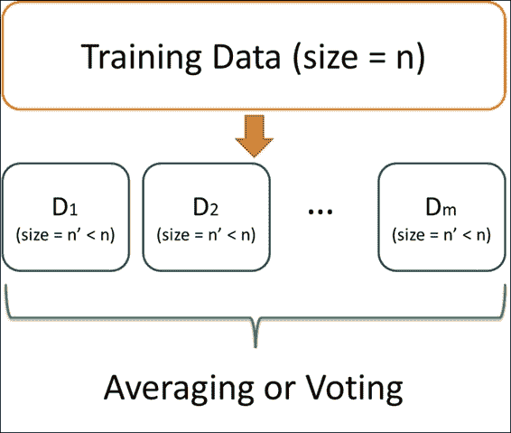

装袋方法的说明

使用 bagging 的好处在于它是一种强大的学习方法，易于理解和实施。然而，这种技术的主要缺点是很难分析结果。

在这个方法中，我们使用`adabag`中的 boosting 方法对电信客户流失数据进行分类。与前面章节中讨论的其他分类方法类似，您可以使用公式和训练数据集来训练提升分类器。此外，您可以在`mfinal`参数中将迭代次数设置为 10。一旦分类模型建立，你可以检查每个属性的重要性。按重要性排列属性揭示了客户服务呼叫的数量在分类模型中起着至关重要的作用。

接下来，有了合适的模型，您可以应用`predict.bagging`函数来预测测试数据集的标签。因此，您可以使用测试数据集和预测结果的标签来生成分类表，并获得平均误差，在本例中为 0.045。


## 还有更多...

除了`adabag`之外，`ipred`包提供了分类树的装袋方法。我们在此演示如何使用`ipred`包装的装袋方法来训练分类模型:

1.  首先，你需要安装并加载`ipred`包:

    ```
     > install.packages("ipred") > library(ipred) 
    ```

2.  然后，您可以使用`bagging`方法来拟合分类方法:

    ```
     > churn.bagging = bagging(churn ~ ., data = trainset, coob = T) > churn.bagging  Bagging classification trees with 25 bootstrap replications   Call: bagging.data.frame(formula = churn ~ ., data = trainset, coob = T)  Out-of-bag estimate of misclassification error:  0.0605  
    ```

3.  获得错误分类的估计值:

    ```
     > mean(predict(churn.bagging) != trainset$churn) [1] 0.06047516 
    ```

4.  然后您可以使用`predict`函数来获得测试数据集的预测标签:

    ```
     > churn.prediction = predict(churn.bagging, newdata=testset, type="class") 
    ```

5.  从测试数据集和预测结果的标签中获取分类表:

    ```
     > prediction.table = table(churn.prediction, testset$churn)  churn.prediction yes  no              no   31 869              yes 110   8 
    ```


# 用 bagging 方法进行交叉验证

要评估分类器的预测能力，您可以运行交叉验证方法来测试分类模型的稳健性。在本菜谱中，我们将介绍如何使用`bagging.cv`通过 bagging 方法进行交叉验证。


## 做好准备

在这个配方中，我们继续使用 telecom `churn`数据集作为输入数据源，通过 bagging 方法执行 k-fold 交叉验证。


## 怎么做...

执行以下步骤，通过使用 bagging 方法进行交叉验证来检索最小估计误差:

1.  首先，我们使用`bagging.cv`对训练数据集进行 10 次迭代的 10 重分类:

    ```
     > churn.baggingcv = bagging.cv(churn ~ ., v=10, data=trainset, mfinal=10) 
    ```

2.  然后你可以从交叉验证结果中得到混淆矩阵:

    ```
     > churn.baggingcv$confusion                Observed Class Predicted Class  yes   no             no   100 1938             yes  242   35 
    ```

3.  最后，您可以从交叉验证结果中检索最小估计误差:

    ```
     > churn.baggingcv$error [1] 0.05831533 
    ```


## 工作原理...

`adabag`包提供了用装袋或助推法进行 k 倍验证的功能。在这个的例子中，我们使用`bagging.cv`通过 bagging 方法进行 k 重交叉验证。我们首先通过指定`v=10`和`mfinal=10`来执行 10 次迭代的 10 重交叉验证。请注意，由于迭代的次数，这是相当耗时的。在交叉验证过程完成后，我们可以从交叉验证结果中获得混淆矩阵和平均误差(在本例中为 0.058)。


## 亦见

*   有兴趣调整`bagging.cv`参数的，请使用`help`功能查看`bagging.cv`文档:

    ```
     > help(bagging.cv) 
    ```


# 用 boosting 方法对数据进行分类

与 bagging 方法类似，boosting 从简单或弱分类器开始，并通过对错误分类的样本进行重新加权来逐步改进。因此，新的分类器可以从以前的分类器中学习。`adabag`包提供了 **AdaBoost 的实现。M1** 和 **SAMME** 算法。因此，可以使用`adabag`中的 boosting 方法来执行集成学习。在这个配方中，我们将使用`adabag`中的 boosting 方法对电信`churn`数据集进行分类。


## 准备就绪

在这个方法中，我们将继续使用电信客户流失数据集作为输入数据源，通过 boosting 方法执行分类。此外，在开始制作食谱之前，您需要将`adabag`包加载到 R 中。


## 怎么做...

执行以下步骤，使用 boosting 方法对电信`churn`数据集进行分类:

1.  您可以使用`adabag`包中的 boosting 函数来训练分类模型:

    ```
     > set.seed(2) > churn.boost = boosting(churn ~.,data=trainset,mfinal=10, coeflearn="Freund", boos=FALSE , control=rpart.control(maxdepth=3)) 
    ```

2.  然后，您可以基于增强的模型和测试数据集进行预测:

    ```
     > churn.boost.pred = predict.boosting(churn.boost,newdata=testset) 
    ```

3.  接下来，您可以从预测结果中检索分类表:

    ```
     > churn.boost.pred$confusion                Observed Class Predicted Class yes  no             no   41 858             yes 100  19 
    ```

4.  最后，您可以从预测结果中获得平均误差:

    ```
     > churn.boost.pred$error [1] 0.0589391 
    ```


## 工作原理...

boosting 的思想是将弱学习者(例如，单个决策树)“助推”成强学习者。假设我们的训练数据集中有 *n* 个点，我们可以为每个点分配一个权重 *Wi* (0 < = i < n)。然后在迭代学习过程中(我们假设迭代次数为 *m* )，我们可以在每次迭代中根据分类结果对每个点重新加权。如果点被正确分类，我们应该减少权重。否则，我们增加点的权重。当迭代过程结束后，我们就可以得到 *m* 拟合模型，*f[I](x)*(0<= I<n)。最后，我们可以通过对每棵树的预测进行加权平均来获得最终预测，其中权重 b 基于每棵树的质量:

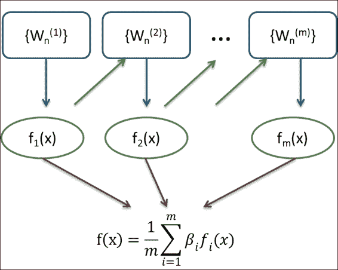

助推法的一个例证

bagging 和 boosting 都是集成方法，将每个单个学习器的预测能力组合成一个强学习器。bagging 和 boosting 之间的区别在于，bagging 方法组合了独立的模型，而 boosting 执行迭代过程，通过用连续的模型预测前面的模型来减少它们的误差。

在这个配方中，我们演示了如何在 boosting 方法中拟合分类模型。类似于 bagging，必须指定用于训练分类模型的公式和训练数据集。此外，可以指定参数，例如迭代次数(`mfinal`)、权重更新系数(`coeflearn`)、如何使用每个观察的权重(`boos`)以及对`rpart`(单个决策树)的控制。在这个配方中，我们使用`Freund`(AdaBoost)将迭代次数设置为 10。M1 算法实现方法)为`coeflearn`，`boos`设置为假，最大深度设置为`3`用于`rpart`配置。

我们使用 boosting 方法拟合分类模型，然后保存在`churn.boost`中。然后我们可以使用`prediction`函数获得预测的标签。此外，我们可以使用`table`函数来检索基于预测标签的分类表，并测试数据集标签。最后，我们可以得到预测结果的平均误差。


## 还有更多...

除了使用`adabag`包中的增强功能外，用户还可以使用`caret`包通过增强方法执行分类:

1.  首先，加载`mboost`和`pROC`包:

    ```
     > library(mboost) > install.packages("pROC") > library(pROC) 
    ```

2.  然后我们可以用`trainControl`函数设置训练控制，用`train`函数用 adaboost:

    ```
     > set.seed(2) > ctrl = trainControl(method = "repeatedcv", repeats = 1, classProbs = TRUE, summaryFunction = twoClassSummary) > ada.train = train(churn ~ ., data = trainset, method = "ada", metric = "ROC", trControl = ctrl) 
    ```

    训练分类模型
3.  使用`summary`函数获取分类模型的详细信息:

    ```
     > ada.train$result    nu maxdepth iter       ROC      Sens        Spec      ROCSD     SensSD      SpecSD 1 0.1        1   50 0.8571988 0.9152941 0.012662155 0.03448418 0.04430519 0.007251045 4 0.1        2   50 0.8905514 0.7138655 0.006083679 0.03538445 0.10089887 0.006236741 7 0.1        3   50 0.9056456 0.4036134 0.007093780 0.03934631 0.09406015 0.006407402 2 0.1        1  100 0.8550789 0.8918487 0.015705276 0.03434382 0.06190546 0.006503191 5 0.1        2  100 0.8907720 0.6609244 0.009626724 0.03788941 0.11403364 0.006940001 8 0.1        3  100 0.9077750 0.3832773 0.005576065 0.03601187 0.09630026 0.003738978 3 0.1        1  150 0.8571743 0.8714286 0.016720505 0.03481526 0.06198773 0.006767313 6 0.1        2  150 0.8929524 0.6171429 0.011654617 0.03638272 0.11383803 0.006777465 9 0.1        3  150 0.9093921 0.3743697 0.007093780 0.03258220 0.09504202 0.005446136 
    ```

4.  Use the `plot` function to plot the ROC curve within different iterations:

    ```
    > plot(ada.train)

    ```

    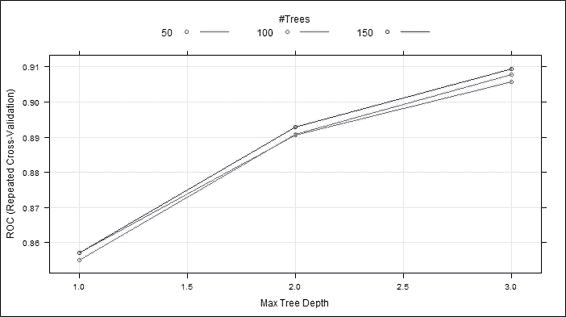

    重复交叉验证图

5.  最后，我们可以使用`predict`函数进行预测，并查看分类表:

    ```
     > ada.predict = predict(ada.train, testset, "prob") > ada.predict.result = ifelse(ada.predict[1] > 0.5, "yes", "no")  > table(testset$churn, ada.predict.result)      ada.predict.result        no yes   yes  40 101   no  872   5 
    ```


# 使用 boosting 方法进行交叉验证

类似于`bagging`函数，`adabag`为 boosting 方法提供了一个交叉验证函数，命名为`boosting.cv`。在这个配方中，我们将演示如何使用包`adabag`中的`boosting.cv`来执行交叉验证。


## 做好准备

在这个方法中，我们继续使用 telecom `churn`数据集作为输入数据源，通过`boosting`方法执行 k-fold 交叉验证。


## 怎么做...

执行以下步骤，通过与`boosting`方法的交叉验证检索最小估计误差:

1.  首先可以用`boosting.cv`交叉验证训练数据集:

    ```
     > churn.boostcv = boosting.cv(churn ~ ., v=10, data=trainset, mfinal=5,control=rpart.control(cp=0.01)) 
    ```

2.  然后你可以从 boosting 结果中得到混淆矩阵:

    ```
     > churn.boostcv$confusion                Observed Class Predicted Class  yes   no             no   119 1940             yes  223   33 
    ```

3.  最后，您可以检索 boosting 方法的平均误差:

    ```
     > churn.boostcv$error [1] 0.06565875 
    ```


## 它是如何工作的...

类似于`bagging.cv`，我们可以使用`boosting.cv`用 boosting 方法进行交叉验证。如果`v`设置为`10`且`mfinal`设置为`5`，则`boosting`方法将执行 10 次交叉验证，共 5 次迭代。此外，用户可以在参数内设置`rpart`配合的控制。在本例中，我们可以将复杂度参数设置为 0.01。一旦训练完成，将获得增强结果的混淆矩阵和平均误差。


## 亦见

*   如果需要更多关于`boosting.cv`参数调整的信息，请使用`help`功能查看`boosting.cv`文档:

    ```
     > help(boosting.cv) 
    ```


# 利用梯度推进对数据进行分类

梯度增强集成弱学习器，并创建新的基本学习器，该基本学习器最大限度地与损失函数的负梯度相关。人们可以将这种方法应用于回归或分类问题，并且它将在不同的数据集中表现良好。在这个菜谱中，我们将介绍如何使用`gbm`对电信`churn`数据集进行分类。


## 正在准备中

在这个方法中，我们继续使用 telecom `churn`数据集作为`bagging`方法的输入数据源。对于没有准备数据集的人，请参考[第五章](part0060_split_000.html#page "Chapter 5. Classification (I) – Tree, Lazy, and Probabilistic")、*分类(一)——树、懒、概率*，了解详细信息。


## 怎么做...

使用梯度增强方法执行以下步骤来计算和分类数据:

1.  首先，安装并加载软件包，`gbm` :

    ```
     > install.packages("gbm") > library(gbm) 
    ```

2.  `gbm`功能仅使用从`0`到`1`的响应；因此，您应该将是/否响应转换为数字响应(0/1):

    ```
     > trainset$churn = ifelse(trainset$churn == "yes", 1, 0) 
    ```

3.  接下来，您可以使用`gbm`函数来训练一个训练数据集:

    ```
     > set.seed(2) > churn.gbm = gbm(formula = churn ~ .,distribution = "bernoulli",data = trainset,n.trees = 1000,interaction.depth = 7,shrinkage = 0.01, cv.folds=3) 
    ```

4.  Then, you can obtain the summary information from the fitted model:

    ```
    > summary(churn.gbm)
     var    rel.inf
    total_day_minutes          total_day_minutes 28.1217147
    total_eve_minutes                total_eve_minutes 16.8097151
    number_customer_service_calls number_customer_service_calls 12.7894464
    total_intl_minutes             total_intl_minutes  9.4515822
    total_intl_calls                   total_intl_calls  8.1379826
    international_plan               international_plan  8.0703900
    total_night_minutes             total_night_minutes  4.0805153
    number_vmail_messages         number_vmail_messages  3.9173515
    voice_mail_plan                  voice_mail_plan  2.5501480
    total_night_calls              total_night_calls  2.1357970
    total_day_calls                     total_day_calls  1.7367888
    total_eve_calls                     total_eve_calls  1.4398047
    total_eve_charge                 total_eve_charge  0.5457486
    total_night_charge              total_night_charge  0.2130152
    total_day_charge                total_day_charge  0.0000000
    total_intl_charge                 total_intl_charge  0.0000000

    ```

    

    拟合模型的相对影响图

5.  You can obtain the best iteration using cross-validation:

    ```
    > churn.iter = gbm.perf(churn.gbm,method="cv")

    ```

    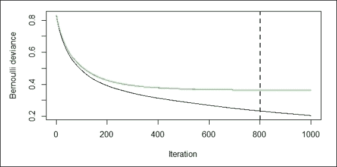

    性能测量图

6.  然后，您可以检索伯努利损失函数返回的日志的奇数值:

    ```
     > churn.predict = predict(churn.gbm, testset, n.trees = churn.iter) > str(churn.predict)  num [1:1018] -3.31 -2.91 -3.16 -3.47 -3.48 ... 
    ```

7.  Next, you can plot the ROC curve and get the best cut off that will have the maximum accuracy:

    ```
    > churn.roc = roc(testset$churn, churn.predict)
    > plot(churn.roc)
    Call:
    roc.default(response = testset$churn, predictor = churn.predict)
    Data: churn.predict in 141 controls (testset$churn yes) > 877 cases (testset$churn no).
    Area under the curve: 0.9393

    ```

    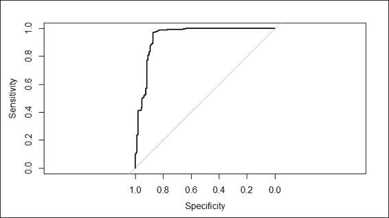

    拟合模型的 ROC 曲线

8.  您可以使用`coords`功能检索最佳截止值，并使用该截止值获得预测标签:

    ```
     > coords(churn.roc, "best")   threshold specificity sensitivity   -0.9495258   0.8723404   0.9703535  > churn.predict.class = ifelse(churn.predict > coords(churn.roc, "best")["threshold"], "yes", "no") 
    ```

9.  最后，您可以从预测结果中获得分类表:

    ```
     > table( testset$churn,churn.predict.class)      churn.predict.class        no yes   yes  18 123   no  851  26 
    ```


## 它是如何工作的...

梯度推进算法首先计算每个分区的残差偏差，然后确定每个阶段的最佳数据分区。接下来，后续模型将拟合前一阶段的残差，并构建新模型来减少残差方差(误差)。残差方差的减少遵循函数梯度下降技术，通过降低其导数来最小化残差方差，如下所示:

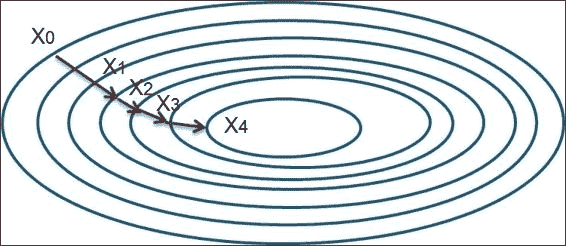

梯度下降法

在这个配方中，我们使用来自`gbm`的梯度推进方法对电信客户流失数据集进行分类。为了开始分类，我们首先安装并加载`gbm`包。然后，我们使用`gbm`函数来训练分类模型。这里，由于我们的预测目标是`churn`属性，这是一个二元结果，因此我们将分布设置为`distribution`参数中的`bernoulli`。此外，我们设置 1000 棵树以适应`n.tree`参数，变量交互的最大深度为`interaction.depth`中的`7`，步长减小的学习率为`shrinkage`中的 0.01，交叉验证的数量为`cv.folds`中的`3`。模型拟合后，我们可以利用汇总函数，在表格和图形中得到各个变量的相对影响信息。相对影响显示了可归因于平方差总和中每个变量的减少。在这里，我们可以发现`total_day_minutes`是在减少损失功能中最有影响力的一个。

接下来，我们使用`gbm.perf`函数来寻找最佳迭代。这里，我们通过将`method`参数指定为`cv`来估计交叉验证的最佳数量。该函数还会生成两个图，黑线表示训练误差，绿线表示验证误差。这里的误差测量是一个`bernoulli`分布，我们在之前的训练阶段已经定义过。图上的蓝色虚线显示了最佳迭代的位置。

然后，我们使用`predict`函数获得伯努利损失函数返回的每个测试用例中日志的奇数值。为了获得最佳预测结果，可以将`n.trees`参数设置为最佳迭代次数。然而，由于返回值是一个奇数值日志，我们仍然必须确定最佳截止值来确定标签。因此，我们使用`roc`函数来生成一条 ROC 曲线，并以最大的精确度得到临界值。

最后，我们可以使用函数`coords`来检索最佳截止阈值，并使用`ifelse`函数从对数的奇数值中确定类别标签。现在，我们可以使用`table`函数生成分类表，看看分类模型有多准确。


## 还有更多...

除了使用`gbm`包中的增强功能外，还可以使用`mboost`包通过梯度增强方法执行分类:

1.  首先，安装并加载`mboost`包:

    ```
     > install.packages("mboost") > library(mboost) 
    ```

2.  `mboost`函数仅使用数字响应；因此，您应该将是/否响应转换为数字响应(0/1):

    ```
     > trainset$churn = ifelse(trainset$churn == "yes", 1, 0) 
    ```

3.  此外，您应该删除非数字属性，例如`voice_mail_plan`和`international_plan` :

    ```
     > trainset$voice_mail_plan = NULL > trainset$international_plan = NULL 
    ```

4.  然后我们可以使用`mboost`来训练分类模型:

    ```
     > churn.mboost = mboost(churn ~ ., data=trainset,  control = boost_control(mstop = 10)) 
    ```

5.  使用`summary`函数获取分类模型的详细信息:

    ```
     > summary(churn.mboost)     Model-based Boosting  Call: mboost(formula = churn ~ ., data = trainset, control = boost_control(mstop = 10))      Squared Error (Regression)   Loss function: (y - f)^2   Number of boosting iterations: mstop = 10  Step size:  0.1  Offset:  1.147732  Number of baselearners:  14   Selection frequencies:             bbs(total_day_minutes) bbs(number_customer_service_calls)                  0.6                                0.4  
    ```

6.  Lastly, use the `plot` function to draw a partial contribution plot of each attribute:

    ```
    > par(mfrow=c(1,2))
    > plot(churn.mboost)

    ```

    

    重要属性的部分贡献图


# 计算分类器的边距

余量是分类确定性的度量。该方法计算正确类别的支持度和错误类别的最大支持度之间的差异。在这个菜谱中，我们将演示如何计算生成的分类器的边距。


## 准备就绪

你需要通过在变量`churn.bagging`和`churn.predbagging`中存储一个合适的装袋模型来完成前面的配方。同样，将安装好的助推分级器放入`churn.boost`和`churn.boost.pred`中。


## 怎么做...

执行以下步骤计算每个集合学习者的余量:

1.  首先，使用`margins`函数计算增强分类器的边距:

    ```
     > boost.margins = margins(churn.boost, trainset) > boost.pred.margins = margins(churn.boost.pred, testset) 
    ```

2.  You can then use the `plot` function to plot a marginal cumulative distribution graph of the boosting classifiers:

    ```
    > plot(sort(boost.margins[[1]]), (1:length(boost.margins[[1]]))/length(boost.margins[[1]]), type="l",xlim=c(-1,1),main="Boosting: Margin cumulative distribution graph", xlab="margin", ylab="% observations", col = "blue")
    > lines(sort(boost.pred.margins[[1]]), (1:length(boost.pred.margins[[1]]))/length(boost.pred.margins[[1]]), type="l", col = "green")
    > abline(v=0, col="red",lty=2)

    ```

    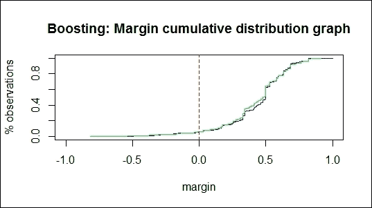

    使用 boosting 方法的边际累积分布图

    然后，您可以计算负裕度匹配训练误差的百分比和负裕度匹配测试误差

    ```
     > boosting.training.margin = table(boost.margins[[1]] > 0) > boosting.negative.training = as.numeric(boosting.training.margin[1]/boosting.training.margin[2]) > boosting.negative.training  [1] 0.06387868  > boosting.testing.margin = table(boost.pred.margins[[1]] > 0) > boosting.negative.testing = as.numeric(boosting.testing.margin[1]/boosting.testing.margin[2]) > boosting.negative.testing [1] 0.06263048 
    ```

    的百分比
3.  此外，您可以计算 bagging 分类器的边距。您可能会看到显示“`no non-missing argument to min`”的警告消息。该消息仅表明最小值/最大值函数应用于长度为 0 的参数的数值:

    ```
     > bagging.margins = margins(churn.bagging, trainset) > bagging.pred.margins = margins(churn.predbagging, testset) 
    ```

4.  bagging 方法的边际累积分布图
5.  You can then use the `plot` function to plot a margin cumulative distribution graph of the bagging classifiers:

    ```
    > plot(sort(bagging.margins[[1]]), (1:length(bagging.margins[[1]]))/length(bagging.margins[[1]]), type="l",xlim=c(-1,1),main="Bagging: Margin cumulative distribution graph", xlab="margin", ylab="% observations", col = "blue")

    > lines(sort(bagging.pred.margins[[1]]), (1:length(bagging.pred.margins[[1]]))/length(bagging.pred.margins[[1]]), type="l", col = "green")
    > abline(v=0, col="red",lty=2)

    ```

    

    The margin cumulative distribution graph of the bagging method

    最后，您可以计算负边界匹配训练错误的百分比和负边界匹配测试错误的百分比:

    ```
     > bagging.training.margin = table(bagging.margins[[1]] > 0) > bagging.negative.training = as.numeric(bagging.training.margin[1]/bagging.training.margin[2]) > bagging.negative.training [1] 0.1733401  > bagging.testing.margin = table(bagging.pred.margins[[1]] > 0) > bagging.negative.testing = as.numeric(bagging.testing.margin[1]/bagging.testing.margin[2]) > bagging.negative.testing [1] 0.04303279 
    ```

6.  工作原理...


## 裕度是分类确定性的度量；它由正确类别的支持度和错误类别的最大支持度计算得出。边距的公式可以表示为:

这里，xi 样本的余量等于正确分类的样本的支持度( *c* 表示正确的类别)减去被分类到类别 *j* 的样本的最大支持度(其中 *j≠c* 和 *j=1…k* )。因此，正确分类的示例将具有正边距，而错误分类的示例将具有负边距。如果裕度值接近 1，则意味着正确分类的示例具有高置信度。另一方面，不确定分类的例子将具有小的余量。

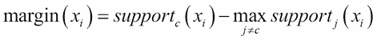

`margins`函数计算 AdaBoost 的裕量。M1、AdaBoost-SAMME 或 bagging 分类器，它们返回边距的向量。为了直观显示利润分布，可以使用利润累积分布图。在这些图表中，x 轴显示边距，y 轴显示边距小于或等于 x 轴边距值的观察值的百分比。如果每个观察值都被正确分类，图表将在等于 1 的边距处显示一条垂直线(其中边距= 1)。

对于 boosting 分类器的边缘累积分布图，我们可以看到图上绘制了两条线，其中绿线表示测试数据集的边缘，蓝线表示训练集的边缘。该图显示，大约 6.39%的负边际与训练误差相匹配，6.26%的负边际与测试误差相匹配。另一方面，在 bagging 分类器的边缘累积分布图中，我们可以发现 17.33%的负边缘与训练误差匹配，4.3%的负边缘与测试误差匹配。通常，匹配训练误差的负边界百分比应该接近匹配测试误差的负边界百分比。因此，我们应该检查为什么与训练误差匹配的负边际百分比比与测试误差匹配的负边际百分比高得多。

参见

如果你对更多关于边缘分布图的细节感兴趣，请参考以下来源: *Kuncheva LI (2004)* ，*组合模式分类器:方法和算法*， *John Wiley & Sons* 。


## 计算误差演化的集成方法

*   `adabag`包为用户提供了`errorevol`函数，用于根据迭代次数的估计集合方法误差。在这个菜谱中，我们将演示如何使用`errorevol`来显示每个集成分类器的误差演变。


# 准备就绪

您需要通过在变量`churn.bagging`中存储合适的装袋模型来完成之前的配方。此外，将安装好的助推分级器放入`churn.boost`。


## 怎么做...

执行以下步骤来计算每个集成学习器的误差演化:


## 提升误差与树数量的关系

Perform the following steps to calculate the error evolution of each ensemble learner:

1.  First, use the `errorevol` function to calculate the error evolution of the boosting classifiers:

    ```
    > boosting.evol.train = errorevol(churn.boost, trainset)
    > boosting.evol.test = errorevol(churn.boost, testset)
    > plot(boosting.evol.test$error, type = "l", ylim = c(0, 1),
    +       main = "Boosting error versus number of trees", xlab = "Iterations",
    +       ylab = "Error", col = "red", lwd = 2)
    > lines(boosting.evol.train$error, cex = .5, col = "blue", lty = 2, lwd = 2)
    > legend("topright", c("test", "train"), col = c("red", "blue"), lty = 1:2, lwd = 2)

    ```

    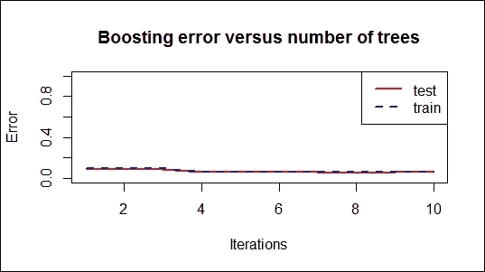

    装袋误差与树木数量的关系

2.  Next, use the `errorevol` function to calculate the error evolution of the bagging classifiers:

    ```
    > bagging.evol.train = errorevol(churn.bagging, trainset)
    > bagging.evol.test = errorevol(churn.bagging, testset)
    > plot(bagging.evol.test$error, type = "l", ylim = c(0, 1),
    +       main = "Bagging error versus number of trees", xlab = "Iterations",
    +       ylab = "Error", col = "red", lwd = 2)
    > lines(bagging.evol.train$error, cex = .5, col = "blue", lty = 2, lwd = 2)
    > legend("topright", c("test", "train"), col = c("red", "blue"), lty = 1:2, lwd = 2)

    ```

    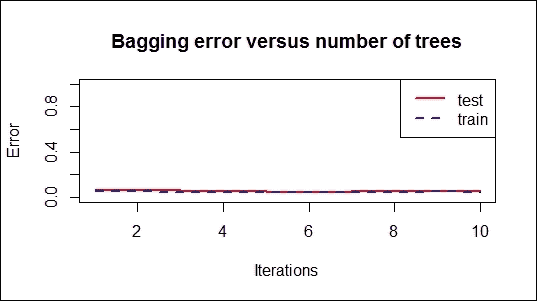

    工作原理...

    `errorest`函数计算 AdaBoost 的误差演变。M1、AdaBoost-SAMME 或 bagging 分类器，并返回误差演化向量。在这个配方中，我们使用 boosting 和 bagging 模型来生成误差演化向量，并绘制误差与树数量的关系图。


## 结果图揭示了每次迭代的错误率。错误率的趋势有助于衡量在迭代次数增加时错误减少的速度。除此之外，图表还可以显示模型是否过度拟合。

参见

如果集合模型过拟合，您可以使用`predict.bagging`和`predict.boosting`功能来修剪集合模型。更多信息，请使用帮助功能参考`predict.bagging`和`predict.boosting` :

```
 > help(predict.bagging) > help(predict.boosting) 
```


## 用随机森林对数据进行分类

*   随机森林是另一种有用的集成学习方法，它在训练过程中生成多个决策树。每个决策树将输出它自己的对应于输入的预测结果。林将使用投票机制选择投票最多的类作为预测结果。在这个菜谱中，我们将说明如何使用`randomForest`包对数据进行分类。


# 做好准备

在这个方案中，我们将继续使用电信`churn`数据集作为输入数据源，通过随机森林方法执行分类。


## 怎么做...

执行以下步骤，使用随机目录林对数据进行分类:


## 首先，你要安装并加载`randomForest`包；

```
 > install.packages("randomForest") > library(randomForest) 
```

然后，您可以用训练集来拟合随机森林分类器:

```
 > churn.rf = randomForest(churn ~ ., data = trainset, importance = T) > churn.rf  Call:  randomForest(formula = churn ~ ., data = trainset, importance = T)                 Type of random forest: classification                      Number of trees: 500 No. of variables tried at each split: 4          OOB estimate of  error rate: 4.88% Confusion matrix:     yes   no class.error yes 247   95 0.277777778 no   18 1955 0.009123163 
```

1.  接下来，基于拟合的模型和测试数据集进行预测:

    ```
     > churn.prediction = predict(churn.rf, testset) 
    ```

2.  类似于其他分类方法，可以得到分类表:

    ```
     > table(churn.prediction, testset$churn)  churn.prediction yes  no              yes 110   7              no   31 870 
    ```

3.  随机森林的均方误差
4.  Similar to other classification methods, you can obtain the classification table:

    ```
    > table(churn.prediction, testset$churn)

    churn.prediction yes  no
     yes 110   7
     no   31 870

    ```

5.  You can use the `plot` function to plot the mean square error of the forest object:

    ```
    > plot(churn.rf)

    ```

    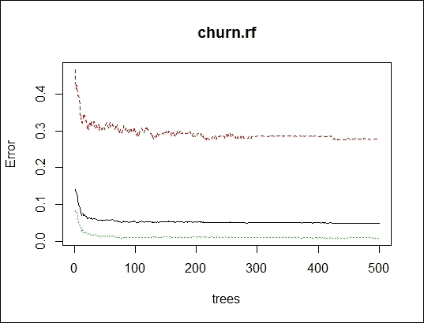

    然后，您可以检查适合的分类器中每个属性的重要性:

    ```
     > importance(churn.rf)                                       yes         no international_plan            66.55206691 56.5100647 voice_mail_plan               19.98337191 15.2354970 number_vmail_messages         21.02976166 14.0707195 total_day_minutes             28.05190188 27.7570444 
    ```

    可变重要性的可视化

6.  You can then examine the importance of each attribute within the fitted classifier:

    ```
    > importance(churn.rf)
     yes         no
    international_plan            66.55206691 56.5100647
    voice_mail_plan               19.98337191 15.2354970
    number_vmail_messages         21.02976166 14.0707195
    total_day_minutes             28.05190188 27.7570444

    ```

7.  Next, you can use the `varImpPlot` function to obtain the plot of variable importance:

    ```
    > varImpPlot(churn.rf)

    ```

    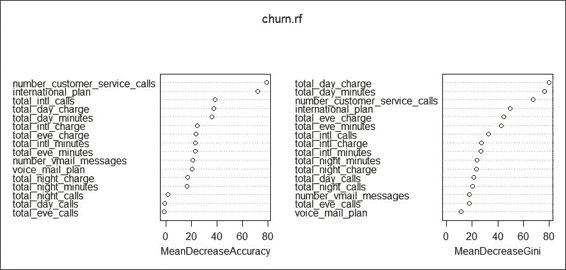

    随机森林方法的边际累积分布图

8.  You can also use the `margin` function to calculate the margins and plot the margin cumulative distribution:

    ```
    > margins.rf=margin(churn.rf,trainset)
    > plot(margins.rf)

    ```

    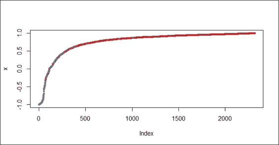

    边缘分布的直方图

9.  Furthermore, you can use a histogram to visualize the margin distribution of the random forest:

    ```
    > hist(margins.rf,main="Margins of Random Forest for churn dataset")

    ```

    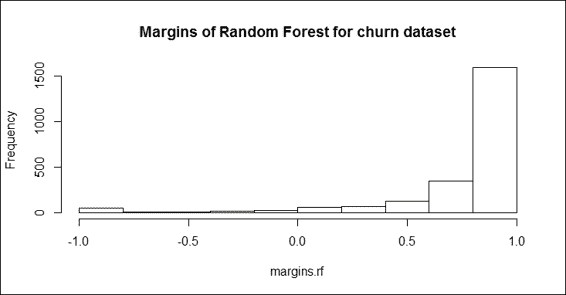

    按类别划分的随机森林的边缘

10.  You can also use `boxplot` to visualize the margins of the random forest by class:

    ```
    > boxplot(margins.rf~trainset$churn, main="Margins of Random Forest for churn dataset by class")

    ```

    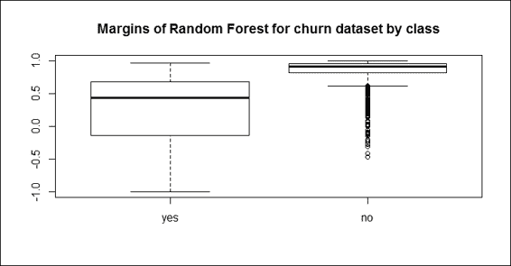

    工作原理...

    随机森林的目的是将弱学习器(例如，单个决策树)集成为强学习器。开发随机森林的过程与装袋方法非常相似，假设我们有一个包含具有 *M* 个特征的 *N* 个样本的训练集。该过程首先执行 bootstrap 采样，该采样随机地对 *N* 个事例进行采样，替换作为每个单独决策树的训练数据集。接下来，在每个节点中，该过程首先随机选择 *m* 个变量(其中*M<M*，然后在 M 个变量中找到提供最佳分割的预测变量。接下来，该过程在不修剪的情况下生长完整的树。最后，我们可以从每一棵单独的树上得到一个实例的预测结果。因此，我们可以通过对输出进行平均或加权平均(对于回归)或进行多数表决(对于分类)来获得预测结果:


## How it works...

一个随机森林使用两个参数: **ntree** (树的数量)和 **mtry** (用于寻找最佳特征的特征数量)，而 bagging 方法只使用 ntree 作为参数。因此，如果我们将 mtry 设置为等于训练数据集中的要素数，那么随机森林就等于 bagging 方法。


随机森林的主要优点是易于计算，能够高效处理数据，并且对缺失或不平衡的数据具有容错能力。随机森林的主要缺点是它无法预测超出定型数据集范围的值。此外，它容易对噪声数据进行过拟合。

在这个配方中，我们采用了从`randomForest`包中改编的随机森林方法来拟合分类模型。首先，我们将`randomForest`安装并加载到一个 R 会话中。然后，我们使用随机森林方法来训练分类模型。我们设置`importance = T`，这将确保评估预测器的重要性。

类似于 bagging 和 boosting 方法，一旦模型被拟合，就可以使用拟合的模型对测试数据集进行预测，并且进一步获得分类表。

为了评估每个属性的重要性，`randomForest`包提供了重要性和`varImpPlot`函数，以列出拟合模型中每个属性的重要性，或者使用平均减少精度或平均减少`gini`来可视化重要性。

类似于`adabag`，它包含一个计算打包和增强方法的边距的方法，`randomForest`提供了`margin`函数来计算森林对象的边距。使用`plot`、`hist`和`boxplot`功能，您可以可视化不同方面的裕量与正确分类的观察值的比例。

还有更多...

除了`randomForest`包，`party`包还提供了随机森林的实现。在下面的步骤中，我们将说明如何使用`party`包中的`cforest`函数来执行分类:


## 首先，安装并加载`party`包:

```
 > install.packages("party") > library(party) 
```

然后，您可以使用`cforest`函数来拟合分类模型:

```
 > churn.cforest = cforest(churn ~ ., data = trainset, controls=cforest_unbiased(ntree=1000, mtry=5)) > churn.cforest     Random Forest using Conditional Inference Trees  Number of trees:  1000   Response:  churn  Inputs:  international_plan, voice_mail_plan, number_vmail_messages, total_day_minutes, total_day_calls, total_day_charge, total_eve_minutes, total_eve_calls, total_eve_charge, total_night_minutes, total_night_calls, total_night_charge, total_intl_minutes, total_intl_calls, total_intl_charge, number_customer_service_calls  Number of observations:  2315  
```

1.  您可以根据建立的模型和测试数据集进行预测:

    ```
     > churn.cforest.prediction = predict(churn.cforest, testset, OOB=TRUE, type = "response") 
    ```

2.  最后，从预测标签和测试数据集的标签中获取分类表:

    ```
     > table(churn.cforest.prediction, testset$churn)  churn.cforest.prediction yes  no                      yes  91   3                      no   50 874 
    ```

3.  估计不同分类器的预测误差
4.  在本章的开始，我们讨论了为什么我们使用集成学习，以及与仅使用单个分类器相比，它如何提高预测性能。我们现在通过比较每种方法的性能来验证集成模型是否比单个决策树执行得更好。为了比较不同的分类器，我们可以对每个分类方法执行 10 重交叉验证，以使用`ipred`包中的`erroreset`来估计测试误差。


# 准备就绪

在这个方案中，我们将继续使用电信`churn`数据集作为输入数据源来估计不同分类器的预测误差。


## 怎么做...

执行以下步骤来估计每种分类方法的预测误差:


## 您可以估计 bagging 模型的错误率:

```
 > churn.bagging= errorest(churn ~ ., data = trainset, model = bagging) > churn.bagging  Call: errorest.data.frame(formula = churn ~ ., data = trainset, model = bagging)     10-fold cross-validation estimator of misclassification error   Misclassification error:  0.0583  
```

然后你可以估计 boosting 方法的错误率:

```
 > install.packages("ada") > library(ada) > churn.boosting= errorest(churn ~ ., data = trainset, model = ada) > churn.boosting  Call: errorest.data.frame(formula = churn ~ ., data = trainset, model = ada)     10-fold cross-validation estimator of misclassification error   Misclassification error:  0.0475  
```

1.  接下来，估计随机森林模型的错误率:

    ```
     > churn.rf= errorest(churn ~ ., data = trainset, model = randomForest) > churn.rf  Call: errorest.data.frame(formula = churn ~ ., data = trainset, model = randomForest)     10-fold cross-validation estimator of misclassification error   Misclassification error:  0.051  
    ```

2.  最后用`churn.predict`做一个预测函数，然后用函数估计单决策树的错误率:

    ```
     > churn.predict = function(object, newdata) {predict(object, newdata = newdata, type = "class")} > churn.tree= errorest(churn ~ ., data = trainset, model = rpart,predict = churn.predict) > churn.tree  Call: errorest.data.frame(formula = churn ~ ., data = trainset, model = rpart,      predict = churn.predict)     10-fold cross-validation estimator of misclassification error   Misclassification error:  0.0674  
    ```

3.  工作原理...
4.  在这个方法中，我们使用`ipred`包中的`errorest`函数来估计四个不同分类器的错误率。我们比较了 boosting、bagging 和随机森林方法，以及单一决策树分类器。`errorest`函数对每个分类器执行 10 重交叉验证，并计算误分类误差。来自四个选择的模型的估计结果揭示了 boosting 方法以最低的错误率(0.0475)执行得最好。随机森林方法的错误率第二低(0.051)，而 bagging 方法的错误率为 0.0583。单一决策树分类器`rpart`在四种方法中表现最差，错误率等于 0.0674。这些结果表明，所有三种集成学习方法，boosting，bagging 和随机森林，都优于单个决策树分类器。


## 参见

在这个配方中，我们提到了`ada`包，它包含了一个执行随机增强的方法。对这个包感兴趣的可以参考:*加性逻辑回归:弗里德曼*、*等(2000)* 的 Boosting 的统计观点。


## See also

*   In this recipe we mentioned the `ada` package, which contains a method to perform stochastic boosting. For those interested in this package, please refer to: *Additive Logistic Regression: A Statistical View of Boosting by Friedman*, *et al. (2000)*.