# 九、聚类

在本章中，我们将讨论以下主题:

*   使用分层聚类对数据进行聚类
*   将树切成一簇簇
*   用 k-means 方法聚类数据
*   绘制二元聚类图
*   比较聚类方法
*   从聚类中提取轮廓信息
*   获得 k-means 的最佳聚类
*   使用基于密度的方法聚类数据
*   使用基于模型的方法对数据进行聚类
*   可视化相异矩阵
*   从外部验证集群


# 简介

聚类是一种用于将相似的对象(在距离上接近)分组在同一组(簇)中的技术。与前面章节中介绍的监督学习方法(例如，分类和回归)不同，聚类分析不使用任何标签信息，而是简单地使用数据特征之间的相似性来将它们分组到聚类中。

聚类可以广泛应用于商业分析。例如，营销部门可以使用聚类按个人属性对客户进行细分。因此，可以针对不同类型的客户设计不同的营销活动。

四种最常见的聚类方法是分层聚类、k-means 聚类、基于模型的聚类和基于密度的聚类:

*   **层次聚类**:创建聚类的层次结构，并在树状图中呈现该层次结构。这种方法不需要在开始时指定簇的数量。
*   **k-means 聚类**:也称平面聚类。与分层聚类不同，它不创建聚类的层次结构，并且它需要聚类的数量作为输入。但是，它的性能比层次聚类更快。
*   **基于模型的聚类**:层次聚类和 k-means 聚类都使用启发式方法来构建聚类，并且不依赖于正式的模型。基于模型的分类假设一个数据模型，并应用 EM 算法来查找最可能的模型组件和分类数。
*   **基于密度的聚类**:根据密度测量构建聚类。该方法中的聚类比数据集的剩余部分具有更高的密度。

在下面的食谱中，我们将讨论如何使用这四种聚类技术对数据进行聚类。我们讨论如何在内部验证聚类，在聚类内使用平方和、平均轮廓宽度，在外部使用地面事实。


# 用层次聚类对数据进行聚类

层次聚类采用凝聚或分割的方法来构建聚类的层次结构。无论采用哪种方法，都首先使用距离相似性度量来合并或分裂聚类。递归过程会继续，直到只剩下一个集群，或者无法再拆分更多的集群。最后，我们可以使用一个树状图来表示集群的层次结构。在本菜谱中，我们将演示如何使用分层聚类对客户进行聚类。


## 准备就绪

在这个菜谱中，我们将对客户数据执行层次聚类，这涉及到将客户分成不同的组。你可以从这个 Github 页面下载数据:[https://github.com/ywchiu/ml_R_cookbook/tree/master/CH9](https://github.com/ywchiu/ml_R_cookbook/tree/master/CH9)。


## 怎么做...

执行以下步骤将客户数据聚类到一个聚类层次结构中:

1.  首先，你需要从`customer.csv`加载数据并保存到`customer` :

    ```
     > customer= read.csv('customer.csv', header=TRUE) > head(customer)   ID Visit.Time Average.Expense Sex Age 1  1          3             5.7   0  10 2  2          5            14.5   0  27 3  3         16            33.5   0  32 4  4          5            15.9   0  30 5  5         16            24.9   0  23 6  6          3            12.0   0  15 
    ```

2.  然后您可以检查数据集结构:

    ```
     > str(customer) 'data.frame':  60 obs. of  5 variables:  $ ID             : int  1 2 3 4 5 6 7 8 9 10 ...  $ Visit.Time     : int  3 5 16 5 16 3 12 14 6 3 ...  $ Average.Expense: num  5.7 14.5 33.5 15.9 24.9 12 28.5 18.8 23.8 5.3 ...  $ Sex            : int  0 0 0 0 0 0 0 0 0 0 ...  $ Age            : int  10 27 32 30 23 15 33 27 16 11 ... 
    ```

3.  接下来，您应该将客户数据归一化为相同的尺度:

    ```
     > customer = scale(customer[,-1]) 
    ```

4.  然后，您可以使用聚合层次聚类对客户数据进行聚类:

    ```
     > hc = hclust(dist(customer, method="euclidean"), method="ward.D2") > hc  Call: hclust(d = dist(customer, method = "euclidean"), method = "ward.D2")  Cluster method   : ward.D2  Distance         : euclidean  Number of objects: 60 
    ```

5.  Lastly, you can use the `plot` function to plot the dendrogram:

    ```
    > plot(hc, hang = -0.01, cex = 0.7)

    ```

    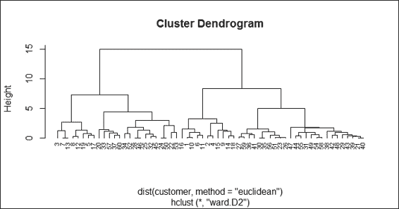

    使用“ward”的系统聚类的树状图。D2”

6.  Additionally, you can use the single method to perform hierarchical clustering and see how the generated dendrogram differs from the previous:

    ```
    > hc2 = hclust(dist(customer), method="single")
    > plot(hc2, hang = -0.01, cex = 0.7)

    ```

    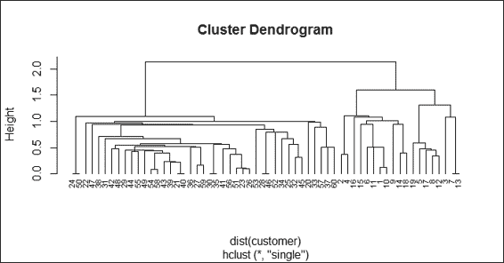

    用“单”进行系统聚类的树状图


## 工作原理...

分层聚类是一种聚类技术，它试图迭代地构建聚类的层次结构。一般来说，有两种方法可以构建分层集群:

*   **凝聚层次聚类**:这是一种自底向上的方法。每个观察在其自己的集群中开始。然后，我们可以计算每个聚类之间的相似性(或距离),然后在每次迭代中合并两个最相似的聚类，直到只剩下一个聚类。
*   **Divisive hierarchical clustering**: This is a top-down approach. All observations start in one cluster, and then we split the cluster into the two least dissimilar clusters recursively until there is one cluster for each observation: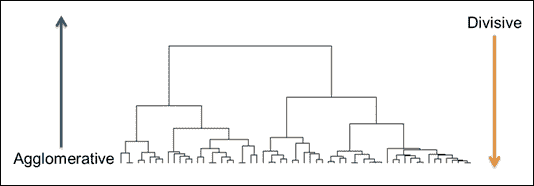

    分层聚类的一个例子

在执行层次聚类之前，我们需要确定这两个聚类有多相似。这里，我们列出了一些用于相似性度量的常见距离函数:

*   **Single linkage**: This refers to the shortest distance between two points in each cluster: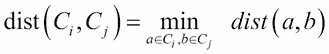
*   **Complete linkage**: This refers to the longest distance between two points in each cluster: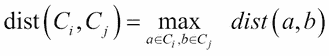
*   **Average linkage**: This refer to the average distance between two points in each cluster (where 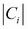 is the size of cluster 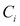 and 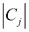 is the size of cluster ):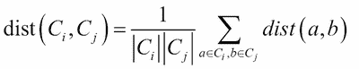
*   **Ward method**: This refers to the sum of the squared distance from each point to the mean of the merged clusters (where 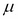 is the mean vector of 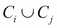):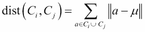

在这个方法中，我们对客户数据执行层次聚类。首先，我们从`customer.csv`加载数据，然后将其加载到客户数据框中。在数据中，我们发现客户账户信息的五个变量，分别是 ID、访问次数、平均费用、性别和年龄。由于每个变量的标度不同，我们使用标度函数来标准化标度。

在所有属性的尺度被标准化之后，我们使用`hclust`函数执行层次聚类。我们使用欧几里德距离作为距离度量，并使用沃德最小方差法进行凝聚聚类。

最后，我们使用`plot`函数来绘制层次聚类的树状图。我们指定`hang`在树状图的底部显示标签，并使用`cex`将标签缩小到正常大小的 70%。为了比较使用`ward.D2`和`single`方法生成集群层次结构的差异，我们使用上图中的`single`绘制了另一个树状图(步骤 6)。


## 还有更多...

执行等级聚类时，您可以选择不同的距离度量和方法。更多详情，可参考`dist`和`hclust`的文档:

```
> ? dist
> ? hclust

```

在这个菜谱中，我们使用`hclust`来执行凝聚层次聚类；如果您想执行分裂层次聚类，您可以使用`diana`函数:

1.  首先，您可以使用`diana`来执行分裂式层次聚类:

    ```
     > dv = diana(customer, metric = "euclidean") 
    ```

2.  然后，您可以使用`summary`获取汇总信息:

    ```
     > summary(dv) 
    ```

3.  最后，您可以使用`plot`功能:

    ```
     > plot(dv) 
    ```

    绘制树状图和横幅

如果你对绘制水平树状图感兴趣，你可以使用`dendextend`包。使用以下程序生成水平树状图:

1.  首先安装加载`dendextend`和`magrittr`包(如果你的 R 版本是 3.1 及以上，就不用安装加载`magrittr`包):

    ```
     > install.packages("dendextend") > library(dendextend) > install.packages("margrittr") > library(magrittr) 
    ```

2.  设置树状图:

    ```
     > dend = customer %>% dist %>% hclust %>% as.dendrogram 
    ```

3.  Finally, plot the horizontal dendrogram:

    ```
    dend %>% plot(horiz=TRUE, main = "Horizontal Dendrogram")

    ```

    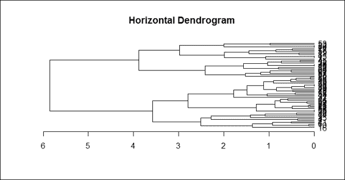

    水平树状图


# 将树木切割成簇

在树状图中，我们可以看到聚类的层次结构，但是我们还没有将数据分组到不同的聚类中。但是，我们可以确定树状图中有多少个聚类，并在特定树高处切割树状图，以将数据分成不同的组。在这个配方中，我们演示了如何使用`cutree`函数将数据分成给定数量的簇。


## 准备就绪

为了执行`cutree`功能，您需要通过生成 hclust 对象`hc`来完成之前的配方。


## 怎么做...

执行以下步骤，将集群的层次结构分割成给定数量的集群:

1.  首先，将数据分为四组:

    ```
     > fit = cutree(hc, k = 4) 
    ```

2.  然后，您可以检查数据的分类标签:

    ```
     > fit  [1] 1 1 2 1 2 1 2 2 1 1 1 2 2 1 1 1 2 1 2 3 4 3 4 3 3 4 4 3 4 [30] 4 4 3 3 3 4 4 3 4 4 4 4 4 4 4 3 3 4 4 4 3 4 3 3 4 4 4 3 4 [59] 4 3 
    ```

3.  统计每个聚类内的数据数量:

    ```
     > table(fit) fit  1  2  3  4  11  8 16 25  
    ```

4.  Finally, you can visualize how data is clustered with the red rectangle border:

    ```
    > plot(hc)
    > rect.hclust(hc, k = 4 , border="red")

    ```

    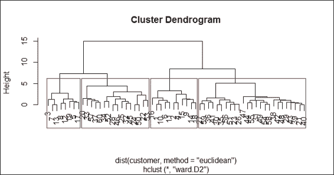

    使用红色矩形边界来区分树状图中的不同聚类


## 工作原理...

我们可以从上图的树状图中确定集群的数量。在这个配方中，我们确定树中应该有四个集群。因此，我们在`cutree`函数中将聚类数指定为`4`。除了使用簇的数量来切割树之外，您还可以将`height`指定为切割树参数。

接下来，我们可以输出数据的分类标签，并使用`table`函数来计算每个分类中的数据数量。从计数表中，我们发现大部分数据都在簇 4 中。最后，我们可以在聚类周围绘制红色矩形，以显示如何使用`rect.hclust`函数将数据分类到四个聚类中。


## 还有更多...

除了在所有分层分类周围绘制矩形之外，您还可以在某个分类周围放置一个红色矩形:

```
> rect.hclust(hc, k = 4 , which =2, border="red")

```

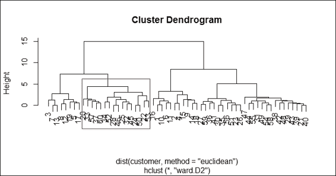

在某个集群周围绘制一个红色矩形。

此外，您可以通过使用`dendextend`包，用红色矩形包围集群，从而用不同的颜色给集群着色。你必须完成前一个配方的*还有更多*部分中概述的说明，并执行以下步骤:

1.  根据树枝所属的簇给树枝上色:

    ```
     > dend %>% color_branches(k=4) %>% plot(horiz=TRUE, main = "Horizontal Dendrogram") 
    ```

2.  You can then add a red rectangle around the clusters:

    ```
    > dend %>% rect.dendrogram(k=4,horiz=TRUE)

    ```

    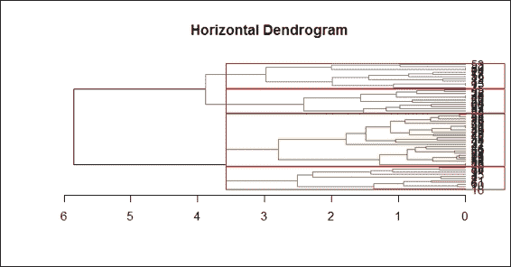

    在水平树状图中围绕聚类绘制红色矩形

3.  Finally, you can add a line to show the tree cutting location:

    ```
    > abline(v = heights_per_k.dendrogram(dend)["4"] + .1, lwd = 2, lty = 2, col = "blue")

    ```

    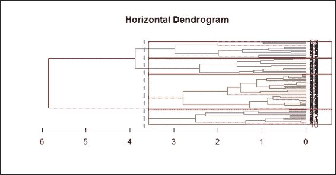

    在水平树状图中画一条切割线


# 用 k-means 方法对数据进行聚类

k-means 聚类是一种平面聚类技术，它只产生一个具有 *k* 个聚类的分区。与不要求用户在开始时确定聚类数目的分层聚类不同，k-means 方法要求首先确定这个数目。然而，k-means 聚类比层次聚类快得多，因为层次树的构建非常耗时。在这个菜谱中，我们将演示如何对客户数据集执行 k-means 聚类。


## 准备就绪

在这个菜谱中，我们将继续使用客户数据集作为输入数据源来执行 k-means 聚类。


## 怎么做...

执行以下步骤，使用 k-means 方法对`customer`数据集进行聚类:

1.  首先，可以使用`kmeans`对客户数据进行聚类:

    ```
     > set.seed(22) > fit = kmeans(customer, 4) > fit K-means clustering with 4 clusters of sizes 8, 11, 16, 25  Cluster means:   Visit.Time Average.Expense        Sex        Age 1  1.3302016       1.0155226 -1.4566845  0.5591307 2 -0.7771737      -0.5178412 -1.4566845 -0.4774599 3  0.8571173       0.9887331  0.6750489  1.0505015 4 -0.6322632      -0.7299063  0.6750489 -0.6411604  Clustering vector:  [1] 2 2 1 2 1 2 1 1 2 2 2 1 1 2 2 2 1 2 1 3 4 3 4 3 3 4 4 3 [29] 4 4 4 3 3 3 4 4 3 4 4 4 4 4 4 4 3 3 4 4 4 3 4 3 3 4 4 4 [57] 3 4 4 3  Within cluster sum of squares by cluster: [1]  5.90040 11.97454 22.58236 20.89159  (between_SS / total_SS =  74.0 %)  Available components:  [1] "cluster"      "centers"      "totss"        [4] "withinss"     "tot.withinss" "betweenss"    [7] "size"         "iter"         "ifault 
    ```

2.  You can then inspect the center of each cluster using `barplot`:

    ```
    > barplot(t(fit$centers), beside = TRUE,xlab="cluster", ylab="value")

    ```

    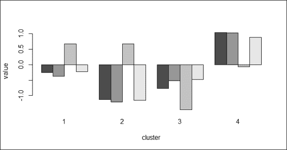

    四个聚类中不同属性中心的柱状图

3.  Lastly, you can draw a scatter plot of the data and color the points according to the clusters:

    ```
    > plot(customer, col = fit$cluster)

    ```

    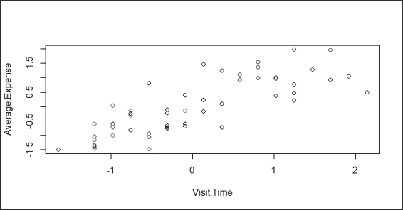

    散点图显示根据其分类标签着色的数据


## 工作原理...

k-means 聚类是一种划分聚类的方法。该算法的目标是将 n 个对象划分成*个*簇，其中每个对象属于具有最近平均值的簇。该算法的目标是最小化**类内平方和** ( **WCSS** )。假设 *x* 是给定的一组观察值，S = 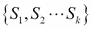表示 *k* 分区，而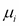是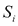的平均值，那么我们可以将 WCSS 函数公式化如下:

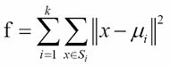

k 均值聚类的过程可以通过以下五个步骤来说明:

1.  指定 *k* 簇的数量。
2.  随机创建 k 个分区。
3.  计算分区的中心。
4.  关联离聚类中心最近的对象。
5.  重复步骤 2、3 和 4，直到 WCSS 变化很小(或最小化)。

在这个菜谱中，我们演示了如何使用 k-means 聚类对客户数据进行聚类。与层次聚类相比，k-means 聚类需要用户输入 K 的数量。在这个例子中，我们使用 *K=4* 。然后，拟合模型的输出显示了每个聚类的大小、四个生成的聚类的聚类平均值、关于每个数据点的聚类向量、聚类的类内平方和以及其他可用分量。

此外，您可以在条形图中绘制每个聚类的中心，这将提供关于每个属性如何影响聚类的更多详细信息。最后，我们在散点图中绘制数据点，并使用拟合的聚类标签来分配与聚类标签相关的颜色。


## 亦见

*   在 k-means 聚类分析中，可以指定用于执行聚类分析的算法。您可以指定 Hartigan-Wong、Lloyd、Forgy 或 MacQueen 作为聚类分析算法。更多详情请使用`help`功能查阅`kmeans`功能文档:

    ```
     >help(kmeans) 
    ```


# 绘制二元聚类图

在前面的配方中，我们采用了 k-means 方法来将数据归入聚类。但是，如果有两个以上的变量，就不可能显示数据是如何在二维空间中聚集的。因此，您可以使用二元聚类图，首先将变量缩减为两个分量，然后使用分量(如轴和圆)作为聚类，以显示数据是如何聚类的。在本食谱中，我们将说明如何创建二元聚类图。


## 准备就绪

在这个菜谱中，我们将继续使用`customer`数据集作为输入数据源来绘制二元聚类图。


## 怎么做...

执行以下步骤绘制二元聚类图:

1.  安装并加载集群包:

    ```
     > install.packages("cluster") > library(cluster) 
    ```

2.  You can then draw a bivariate cluster plot:

    ```
    > clusplot(customer, fit$cluster, color=TRUE, shade=TRUE)

    ```

    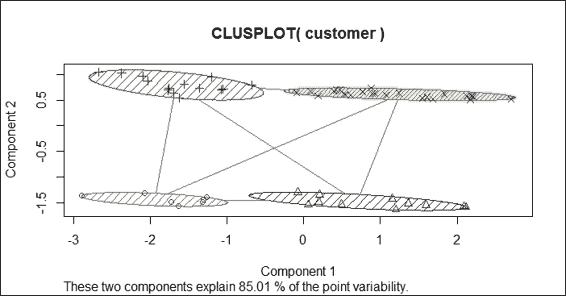

    客户数据集的二元聚类图

3.  You can also zoom into the bivariate cluster plot:

    ```
    > par(mfrow= c(1,2))
    > clusplot(customer, fit$cluster, color=TRUE, shade=TRUE)
    > rect(-0.7,-1.7, 2.2,-1.2, border = "orange", lwd=2)
    > clusplot(customer, fit$cluster, color = TRUE, xlim = c(-0.7,2.2), ylim = c(-1.7,-1.2))

    ```

    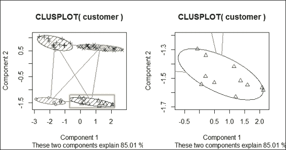

    二元聚类图的放大


## 工作原理...

在这个配方中，我们绘制了一个二元聚类图来显示数据是如何聚类的。要绘制二元聚类图，我们首先需要安装`cluster`包并将其加载到 r 中。然后我们使用`clusplot`函数从客户数据集中绘制二元聚类图。在`clustplot`功能中，我们可以设置`shade`到`TRUE`和`color`到`TRUE`来显示带有颜色和阴影的聚类。根据上图(步骤 2 ),我们发现双变量使用两个分量作为 x 轴和 y 轴，这解释了 85.01%的点可变性。然后数据点根据组件 1 和组件 2 散布在图上。同一聚类内的数据用相同的颜色和阴影圈出。

除了在单个图中绘制四个集群，您还可以使用`rect`在给定的 x 轴和 y 轴范围内的特定区域周围添加一个矩形。然后，您可以通过使用`clusplot`函数中的`xlim`和`ylim`来放大图表，以检查每个聚类中的数据。


## 还有更多

`clusplot`功能使用`princomp`和`cmdscale`将原始特征尺寸减少到主成分。因此，我们可以看到数据如何聚集在一个图中，这两个分量分别为 x 轴和 y 轴。要了解更多关于`princomp`和`cmdscale`的信息，可以使用`help`功能查看相关文档:

```
> help(cmdscale)
> help(princomp)

```

对于那些对如何使用`cmdscale`减少尺寸感兴趣的人，请执行以下步骤:

```
> mds = cmdscale(dist(customer), k = 2)
> plot(mds, col = fit$cluster)

```

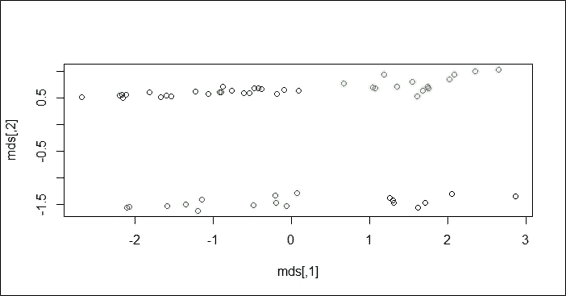

关于缩放维度的数据散点图


# 比较聚类方法

在使用不同的聚类方法将数据归入聚类之后，您可能希望测量聚类的准确性。在大多数情况下，您可以使用集群内或集群间指标作为度量。我们现在介绍如何使用`fpc`包中的`cluster.stat`来比较不同的聚类方法。


## 做好准备

为了执行聚类方法比较，需要通过生成`customer`数据集来完成之前的配方。


## 怎么做...

执行以下步骤来比较聚类方法:

1.  首先安装并加载`fpc`包:

    ```
     > install.packages("fpc") > library(fpc) 
    ```

2.  然后，您需要使用带有`single`方法的层次聚类来对客户数据进行聚类，并生成对象`hc_single` :

    ```
     > single_c =  hclust(dist(customer), method="single") > hc_single = cutree(single_c, k = 4) 
    ```

3.  使用层次聚类和`complete`方法对客户数据进行聚类，生成对象`hc_complete` :

    ```
     > complete_c =  hclust(dist(customer), method="complete") > hc_complete =  cutree(complete_c, k = 4) 
    ```

4.  然后您可以使用 k-means 聚类对客户数据进行聚类，并生成对象`km` :

    ```
     > set.seed(22) > km = kmeans(customer, 4) 
    ```

5.  接下来，检索任一聚类方法的聚类验证统计信息:

    ```
     > cs = cluster.stats(dist(customer), km$cluster) 
    ```

6.  大多数情况下，我们着重使用`within.cluster.ss`和`avg.silwidth`来验证聚类方法:

    ```
     > cs[c("within.cluster.ss","avg.silwidth")] $within.cluster.ss [1] 61.3489  $avg.silwidth [1] 0.4640587 
    ```

7.  最后，我们可以生成每种聚类方法的聚类统计信息，并以表格形式列出:

    ```
     > sapply(list(kmeans = km$cluster, hc_single = hc_single, hc_complete = hc_complete), function(c) cluster.stats(dist(customer), c)[c("within.cluster.ss","avg.silwidth")])                   kmeans    hc_single hc_complete within.cluster.ss 61.3489   136.0092  65.94076 avg.silwidth      0.4640587 0.2481926 0.4255961 
    ```


## 工作原理...

在本菜谱中，我们将演示如何验证集群。为了验证聚类方法，我们通常采用两种技术:类间距离和类内距离。在这些技术中，簇间距离越高越好，簇内距离越低越好。为了计算相关的统计数据，我们可以将 fpc 包中的`cluster.stat`应用到合适的聚类对象上。

从输出中，`within.cluster.ss`测量值代表组内平方和，avg.silwidth 代表平均轮廓宽度。`within.cluster.ss`测量显示了集群中相关对象的紧密程度；该值越小，聚类中的相关对象越紧密。另一方面，轮廓是一种度量，它考虑了聚类中相关对象的紧密程度以及聚类之间的分离程度。数学上，我们可以定义每个点 *x* 的轮廓宽度如下:

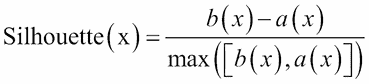

在前面的等式中， *a(x)* 是 *x* 和该簇中所有其他点之间的平均距离，而 *b(x)* 是 x 和其他簇中的点之间的平均距离的最小值。轮廓值通常在 *0* 到 *1* 之间；越接近 *1* 的值表示数据聚类越好。

上一步生成的汇总表显示，在`within.cluster.ss`和`avg.silwidth`中，完全层次聚类方法优于单一层次聚类方法和 k-means 聚类。


## 参见

*   `kmeans`函数还输出统计数据(例如`withinss`和`betweenss`)供用户验证聚类方法:

    ```
     > set.seed(22) > km = kmeans(customer, 4) > km$withinss [1]  5.90040 11.97454 22.58236 20.89159 > km$betweenss [1] 174.6511 
    ```


# 从聚类中提取轮廓信息

剪影信息是用于验证数据簇的测量值。在之前的配方中，我们提到了聚类的测量涉及计算数据在每个聚类中的聚集程度，并测量不同聚类之间的距离。轮廓系数结合了对簇内和簇间距离的测量。输出值的范围通常从 *0* 到*1*；越靠近 *1* ，集群越好。在本食谱中，我们将介绍如何计算轮廓信息。


## 做好准备

在中，为了从群集中提取轮廓信息，您需要通过生成`customer`数据集来完成之前的配方。


## 怎么做...

执行以下步骤来计算轮廓信息:

1.  使用`kmeans`生成一个 k-means 对象，`km` :

    ```
     > set.seed(22) > km = kmeans(customer, 4) 
    ```

2.  然后你可以计算轮廓信息:

    ```
     > kms = silhouette(km$cluster,dist(customer)) > summary(kms) Silhouette of 60 units in 4 clusters from silhouette.default(x = km$cluster, dist = dist(customer)) :  Cluster sizes and average silhouette widths:         8        11        16        25  0.5464597 0.4080823 0.3794910 0.5164434  Individual silhouette widths:    Min. 1st Qu.  Median    Mean 3rd Qu.    Max.   0.1931  0.4030  0.4890  0.4641  0.5422  0.6333  
    ```

3.  Next, you can plot the silhouette information:

    ```
    > plot(kms)

    ```

    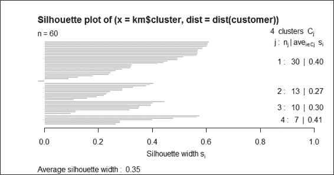

    k 均值聚类结果的轮廓图


## 工作原理...

在这个配方中，我们演示了如何使用轮廓图来验证聚类。您可以首先检索轮廓信息，该信息显示聚类大小、平均轮廓宽度和单个轮廓宽度。轮廓系数是从 *0* 到 *1* 的一个值；越接近 *1* ，群集的质量越好。

最后，我们使用`plot`函数绘制一个轮廓图。该图的左侧显示了水平线的数量，代表了聚类的数量。右栏显示了其自身聚类的图的平均相似性减去下一个相似聚类的平均相似性。平均轮廓宽度显示在图的底部。


## 参见

*   对于那些对如何计算轮廓感兴趣的人，请参考维基百科条目中的**轮廓值**:[http://en.wikipedia.org/wiki/Silhouette_%28clustering%29](http://en.wikipedia.org/wiki/Silhouette_%28clustering%29)


# 获得 k-means 的最佳聚类数

虽然 k-means 聚类快速且易于使用，但它需要在开始时将 *k* 作为输入。因此，我们可以使用平方和来确定哪个 *k* 值最适合于找到 k 均值的最佳聚类数。在下面的食谱中，我们将讨论如何为 k-means 聚类方法找到最佳的聚类数。


## 做好准备

为了找到最佳的聚类数，您需要通过生成`customer`数据集来完成之前的配方。


## 怎么做...

执行以下步骤，找到 k-means 聚类的最佳聚类数:

1.  首先，计算不同簇数的平方和(`withinss`):

    ```
     > nk = 2:10 > set.seed(22) > WSS = sapply(nk, function(k) { +     kmeans(customer, centers=k)$tot.withinss + }) > WSS [1] 123.49224  88.07028  61.34890  48.76431  47.20813 [6]  45.48114  29.58014  28.87519  23.21331 
    ```

2.  You can then use a line plot to plot the within sum of squares with a different number of `k`:

    ```
    > plot(nk, WSS, type="l", xlab= "number of k", ylab="within sum of squares")

    ```

    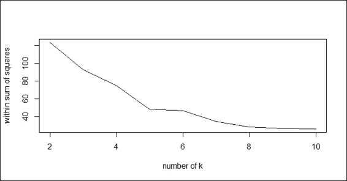

    不同 k 数的平方和内的线图

3.  接下来，您可以计算不同数量的簇的平均轮廓宽度(avg . sil width):

    ```
     > SW = sapply(nk, function(k) { +   cluster.stats(dist(customer), kmeans(customer, centers=k)$cluster)$avg.silwidth + }) > SW [1] 0.4203896 0.4278904 0.4640587 0.4308448 0.3481157 [6] 0.3320245 0.4396910 0.3417403 0.4070539 
    ```

4.  You can then use a line plot to plot the average silhouette width with a different number of `k`:

    ```
    > plot(nk, SW, type="l", xlab="number of clusers", ylab="average silhouette width")

    ```

    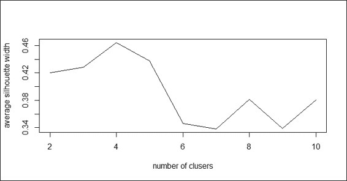

    关于不同 k 数的平均轮廓宽度的线图

5.  检索集群的最大数量:

    ```
     > nk[which.max(SW)] [1] 4 
    ```


## 工作原理...

在这个配方中，我们演示了如何通过迭代获得平方和和平均轮廓值来找到最佳的聚类数。对于平方和，较低的值表示聚类质量较好。通过绘制不同数量的`k`的平方和，我们发现曲线的拐点在`k=4`。

另一方面，我们也使用`cluster.stats`基于不同的聚类数计算平均轮廓宽度。此外，我们可以使用线形图来绘制关于不同数量的簇的平均轮廓宽度。上图(步骤 4)显示最大平均轮廓宽度出现在`k=4`。最后，我们使用`which.max`来获得 k 的值，以确定最大平均轮廓宽度的位置。


## 参见

*   对于那些对如何计算平方和感兴趣的人，请参考维基百科 **K 均值聚类**的条目:[http://en.wikipedia.org/wiki/K-means_clustering](http://en.wikipedia.org/wiki/K-means_clustering)


# 使用基于密度的方法对数据进行聚类

作为距离测量的替代方法，您可以使用基于密度的测量对数据进行聚类。这种方法会找到比剩余区域密度更高的区域。最著名的方法之一就是 DBSCAN。在下面的菜谱中，我们将演示如何使用 DBSCAN 来执行基于密度的聚类。


## 准备就绪

在这个配方中，我们将使用从`mlbench`包中生成的模拟数据。


## 怎么做...

执行以下步骤来执行基于密度的聚类:

1.  首先安装并加载`fpc`和`mlbench`包:

    ```
     > install.packages("mlbench") > library(mlbench) > install.packages("fpc") > library(fpc) 
    ```

2.  You can then use the `mlbench` library to draw a Cassini problem graph:

    ```
    > set.seed(2)
    > p = mlbench.cassini(500)
    > plot(p$x)

    ```

    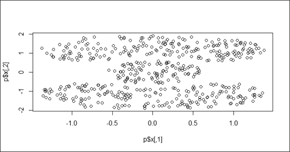

    卡西尼问题图

3.  接下来，你可以用聚类数据对其进行密度测量:

    ```
     > ds = dbscan(dist(p$x),0.2, 2, countmode=NULL, method="dist") > ds dbscan Pts=500 MinPts=2 eps=0.2         1   2   3 seed  200 200 100 total 200 200 100 
    ```

4.  Plot the data in a scatter plot with different cluster labels as the color:

    ```
    > plot(ds, p$x)

    ```

    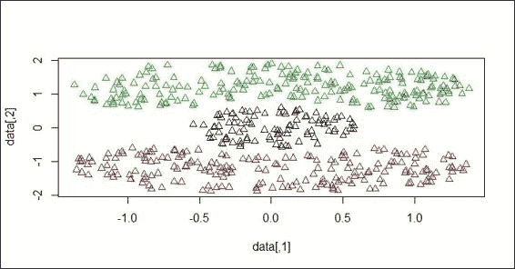

    数据散点图根据分类标签进行着色

    你也可以用`dbscan`到预测该数据点属于哪个聚类。在这个例子中，首先在矩阵`p` :

    ```
     > y = matrix(0,nrow=3,ncol=2) > y[1,] = c(0,0) > y[2,] = c(0,-1.5) > y[3,] = c(1,1) > y      [,1] [,2] [1,]    0  0.0 [2,]    0 -1.5 [3,]    1  1.0 
    ```

    中做三个输入
5.  然后，您可以预测数据属于哪个集群:

    ```
     > predict(ds, p$x, y) [1] 3 1 2 
    ```

6.  它是如何工作的...


## 基于密度的聚类使用密度可达性和密度连通性的思想，这使得它在发现非线性形状的聚类时非常有用。在讨论基于密度的聚类过程之前，必须解释一些重要的背景概念。基于密度的聚类考虑了两个参数:`eps`和`MinPts`。`eps`代表邻域的最大半径；`MinPts`表示`eps`邻域内的最小点数。有了这两个参数，我们可以将核心点定义为在`eps`内有多于`MinPts`的点。此外，我们可以将板点定义为具有小于`MinPts`的点，但是在核心点的附近。然后，我们可以定义核心对象，好像在`p`的`eps`-邻域中的点数多于`MinPts`。

此外，我们必须定义两点之间的可达性。如果 q 在`p`的`eps`邻域内并且`p`是一个核心物体，我们可以说一个点`p`是从另一个点`q`直接密度可达的。然后，我们可以定义一个点`p`是一般的，并且从该点`q`密度可达，如果存在一个点链，p [1] ，p [2] ...，p [n] ，其中 p [1] = q，p [n] = p，p [i] +1 是从 pi 到 Eps 的直接可达密度，对于 1 < = i < = n:

点 p 和 q 是密度可达的

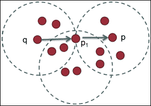

Point p and q is density reachable

有了基于密度的聚类的初步概念，我们就可以用来说明 DBSCAN(最流行的基于密度的聚类)的过程，如以下步骤所示:

随机选择一个点，`p`。

1.  相对于`Eps`和`MinPts`，从`p`检索所有密度可达的点。
2.  如果`p`是一个核心点，那么就形成了一个集群。否则，如果它是一个板点，并且没有从`p`密度可达的点，该过程将把该点标记为噪声，并继续访问下一个点。
3.  重复这个过程，直到所有的点都被访问过。
4.  在本菜谱中，我们将演示如何使用基于密度的 DBSCAN 方法对客户数据进行聚类。首先，我们必须安装并加载`mlbench`和`fpc`库。`mlbench`包提供了多种方法来生成不同形状和大小的模拟数据。在这个例子中，我们生成了一个卡西尼问题图。

接下来，我们对 Cassini 数据集执行`dbscan`来对数据进行聚类。我们指定可达性距离为 0.2，到达`2`的最小可达性点数，进度报告为空，并使用距离作为度量。该聚类方法成功地将数据分为大小为 200、200 和 100 的三个聚类。通过在图上绘制点和簇标签，我们看到卡西尼图的三个部分以不同的颜色分开。

`fpc`包还提供了一个`predict`函数，你可以用它来预测输入矩阵的集群标签。点 c(0，0)被归入聚类 3，点 c(0，-1.5)被归入聚类 1，点 c(1，1)被归入聚类 2。

参见


## `fpc`包包含了灵活的聚类过程，并具有有用的聚类分析功能。对于示例，您可以使用`plotcluster`函数生成一个判别投影图。更多信息，请参考以下文档:

```
 > help(plotcluster) 
```

*   用基于模型的方法对数据进行聚类


# 与使用启发式方法且不依赖于正式模型的分层聚类和 k-means 聚类相反。基于模型的聚类技术假设各种数据模型，并应用 EM 算法来获得最可能的模型，并进一步使用该模型来推断最可能的聚类数。在本食谱中，我们将演示如何使用基于模型的方法来确定最可能的聚类数。

准备就绪


## 为了执行基于模型的方法来对客户数据进行聚类，您需要通过生成客户数据集来完成前面的配方。

怎么做...


## 执行以下步骤来执行基于模型的聚类:

首先，请安装并加载库`mclust` :

```
 > install.packages("mclust") > library(mclust) 
```

1.  然后，可以在`customer`数据集上执行基于模型的聚类:

    ```
     > mb = Mclust(customer) > plot(mb) 
    ```

2.  BIC 与组件数量的关系图
3.  Then, you can press 1 to obtain the BIC against a number of components: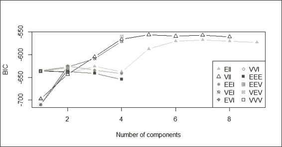

    Plot of BIC against number of components

    显示不同特征组合分类的图

4.  Then, you can press 2 to show the classification with regard to different combinations of features: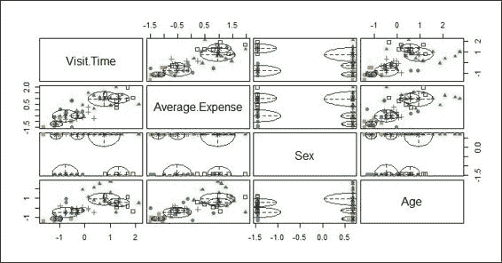

    Plot showing classification with regard to different combinations of features

    显示不同特征组合的分类不确定性的图

5.  Press 3 to show the classification uncertainty with regard to different combinations of features: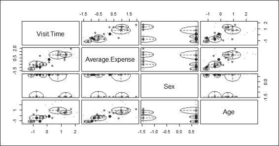

    Plot showing classification uncertainty with regard to different combinations of features

    密度估计图

6.  Next, press 4 to plot the density estimation: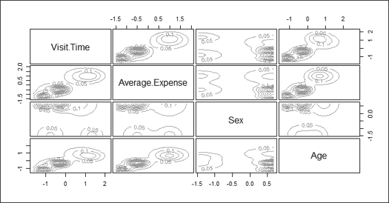

    A plot of density estimation

    然后，你可以按 0 出图密度，退出出图菜单。

7.  最后，使用`summary`函数获得最可能的模型和聚类数:

    ```
     > summary(mb) ---------------------------------------------------- Gaussian finite mixture model fitted by EM algorithm  ----------------------------------------------------  Mclust VII (spherical, varying volume) model with 5 components:   log.likelihood  n df       BIC       ICL       -218.6891 60 29 -556.1142 -557.2812  Clustering table:  1  2  3  4  5 11  8 17 14 10 
    ```

8.  工作原理...


## 基于模型的聚类使用基于概率的方法，而不是采用启发式方法来构建聚类。基于模型的聚类假设数据是由一个潜在概率分布生成的，并试图从数据中恢复该分布。一种常见的基于模型的方法是使用有限混合模型，该模型为概率分布的分析提供了灵活的建模框架。有限混合模型是成分概率分布的线性加权和。假设数据 *y=(y [1] ，y [2] …y [n] )* 包含 n 个独立的多变量观测值；g 是部件的数量；有限混合模型的可能性可以用公式表示为:

Instead of taking a heuristic approach to build a cluster, model-based clustering uses a probability-based approach. Model-based clustering assumes that the data is generated by an underlying probability distribution and tries to recover the distribution from the data. One common model-based approach is using finite mixture models, which provide a flexible modeling framework for the analysis of the probability distribution. Finite mixture models are a linearly weighted sum of component probability distribution. Assume the data *y=(y[1],y[2]…y[n])* contains n independent and multivariable observations; G is the number of components; the likelihood of finite mixture models can be formulated as:

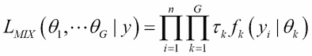

其中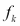和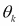是混合物中第 *k* 个成分的密度和参数，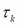 ( 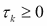和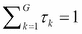)是一个观测值属于第 *k* 个成分的概率。

基于模型的聚类过程有几个步骤:首先，该过程选择组件概率分布的数量和类型。然后，它拟合一个有限混合模型，并计算一个组件成员的后验概率。最后，它将每个观察值的隶属度分配给具有最大概率的组件。

在这个菜谱中，我们演示了如何使用基于模型的聚类来对数据进行聚类。我们首先将`Mclust`库安装并加载到 r 中。然后使用`Mclust`函数将客户数据放入基于模型的方法中。

数据适合模型后，我们根据聚类结果绘制模型。有四种不同的图:BIC、分类、不确定性和密度图。BIC 图显示了 BIC 值，人们可以使用这个值来选择集群的数量。分类图显示了数据如何根据不同的维度组合进行聚类。不确定性图显示了不同维度组合的分类不确定性。密度图显示等高线中的密度估计值。

你也可以使用`summary`函数获得最可能的模型和最可能的聚类数。对于本例，最大可能的聚类数是 5，BIC 值等于-556.1142。

参见


## 对于那些对`Mclust`如何工作的细节感兴趣的人，请参考以下来源:C. Fraley，A. E. Raftery，T. B. Murphy 和 L. Scrucca (2012)。 *mclust 第 4 版 R:基于模型的聚类、分类和密度估计的正态混合建模*。*华盛顿大学统计系第 597 号技术报告*。

*   可视化相异矩阵


# 相异度矩阵可以用作群集质量的度量。为了可视化矩阵，我们可以在距离矩阵上使用热图。在图中，不相似性低(或相似性高)的条目绘制得较暗，这有助于识别数据中的隐藏结构。在这份食谱中，我们将讨论一些有用的可视化相异矩阵的技术。

准备就绪


## 为了可视化差异矩阵，您需要通过生成客户数据集来完成之前的配方。除此之外，还需要生成一个 k-means 对象并存储在变量`km`中。

怎么做...


## 执行以下步骤来可视化相异度矩阵:

首先安装并加载`seriation`包:

```
 > install.packages("seriation") > library(seriation) 
```

1.  k-均值聚类的相异度图
2.  You can then use `dissplot` to visualize the dissimilarity matrix in a heat map:

    ```
    > dissplot(dist(customer), labels=km$cluster, options=list(main="Kmeans Clustering With k=4"))

    ```

    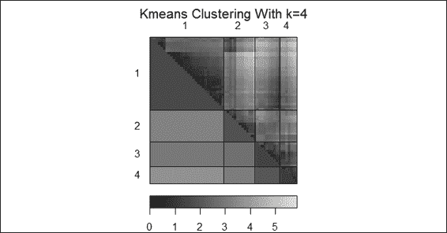

    A dissimilarity plot of k-means clustering

    层次聚类的相异度图

3.  Next, apply `dissplot` on hierarchical clustering in the heat map:

    ```
    > complete_c =  hclust(dist(customer), method="complete")
    > hc_complete =  cutree(complete_c, k = 4)
    > dissplot(dist(customer), labels=hc_complete, options=list(main="Hierarchical Clustering"))

    ```

    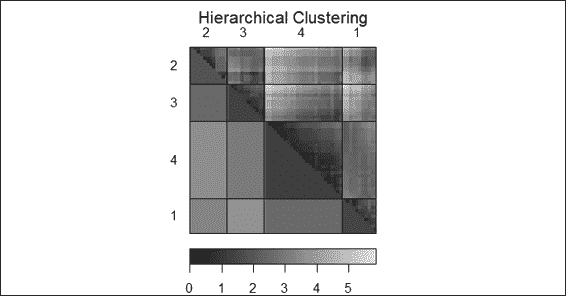

    A dissimilarity plot of hierarchical clustering

    它是如何工作的...


## 在这个配方中，我们使用相异度图来可视化相异度矩阵。我们首先安装并加载包`seriation`，然后对 k-means 聚类输出应用`dissplot`函数，生成前面的图(步骤 2)。

它显示了彼此相似的聚类被绘制得较暗，而不相似的组合被绘制得较亮。因此，我们可以看到聚类相对于它们对应的聚类(例如聚类 4 到聚类 4)被绘制成对角线并且更暗。另一方面，彼此不相似的聚类被绘制得更亮并且远离对角线。

同样，我们可以对层次聚类的输出应用`dissplot`函数。图中生成的图(步骤 3)显示了单个热图中每个聚类的相似性。

还有更多...


## 除了使用`dissplot`来可视化相异度矩阵，还可以使用`dist`和`image`函数来可视化距离矩阵。在结果图中，密切相关的条目用红色标出。不太相关的条目绘制成更接近白色:

客户数据集的距离矩阵图

```
> image(as.matrix(dist(customer)))

```

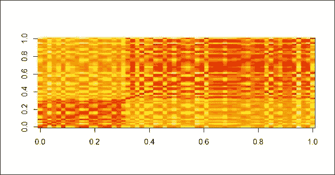

A distance matrix plot of customer dataset

为了绘制树状图和热图来显示数据是如何聚集的，您可以使用函数`heatmap`:

列和行侧都有树状图的热图

```
> cd=dist(customer)
> hc=hclust(cd)
> cdt=dist(t(customer))
> hcc=hclust(cdt)
> heatmap(customer, Rowv=as.dendrogram(hc), Colv=as.dendrogram(hcc))

```

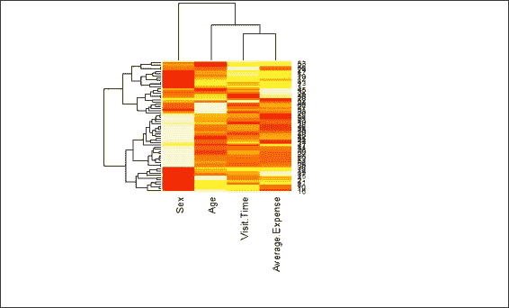

A heat map with dendrogram on the column and row side

从外部验证集群


# 除了生成统计数据来验证生成的聚类的质量之外，您还可以使用已知的数据聚类作为基础事实来比较不同的聚类方法。在这份食谱中，我们将展示聚类方法对于具有已知聚类的数据有何不同。

准备就绪


## 在这个菜谱中，我们将继续使用手写数字作为聚类输入；你可以在作者的 Github 页面上找到图:[https://github.com/ywchiu/ml_R_cookbook/tree/master/CH9](https://github.com/ywchiu/ml_R_cookbook/tree/master/CH9)。

怎么做...


## 执行以下步骤，使用不同的聚类技术对数字进行聚类:

首先，你需要安装并加载软件包`png` :

```
 > install.packages("png") > library(png) 
```

1.  手写数字的散点图
2.  Then, please read images from `handwriting.png` and transform the read data into a scatter plot:

    ```
    > img2 = readPNG("handwriting.png", TRUE)
    > img3 = img2[,nrow(img2):1]
    > b = cbind(as.integer(which(img3 < -1) %% 28), which(img3 < -1) / 28)
    > plot(b, xlim=c(1,28), ylim=c(1,28))

    ```

    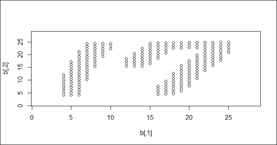

    A scatter plot of handwriting digits

    手写数字的 k-means 聚类结果

3.  Perform a k-means clustering method on the handwriting digits:

    ```
    > set.seed(18)
    > fit = kmeans(b, 2)
    > plot(b, col=fit$cluster)
    > plot(b, col=fit$cluster,  xlim=c(1,28), ylim=c(1,28))

    ```

    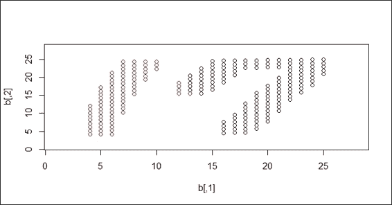

    k-means clustering result on handwriting digits

    接下来，对手写数字执行`dbscan`聚类方法:

    ```
     > ds = dbscan(b, 2) > ds dbscan Pts=212 MinPts=5 eps=2        1   2 seed  75 137 total 75 137 > plot(ds, b,  xlim=c(1,28), ylim=c(1,28)) 
    ```

4.  手写数字的 DBSCAN 聚类结果

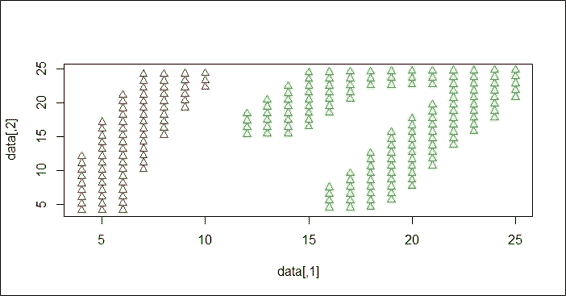

DBSCAN clustering result on handwriting digits

工作原理...


## 在这个食谱中，我们演示了不同的聚类方法如何对手写数据集起作用。聚类的目的是将 1 和 7 分成不同的聚类。我们使用不同的技术来观察 k-means 和 DBSCAN 方法是如何对数据进行聚类的。

为了生成数据，我们使用 Windows 应用`paint.exe`创建一个尺寸为 28 x 28 像素的 PNG 文件。然后，我们使用`readPNG`函数读取 PNG 数据，并将读取的 PNG 数据点转换成散点图，散点图显示 17 中的手写数字。

读取数据后，我们对手写数字执行聚类技术。首先，我们执行 k-means 聚类，其中`k=2`在数据集上。由于 k-均值聚类使用距离度量，因此构建的聚类覆盖了 1 位和 7 位数字的区域。然后，我们对数据集执行 DBSCAN。由于 DBSCAN 是一种基于密度的聚类技术，它成功地将数字 1 和数字 7 分成不同的聚类。

参见


## 如果你对如何阅读 R 中的各种图形格式感兴趣，可以参考下面的文档:

```
 > help(package="png") 
```

*   第十章。关联分析和序列挖掘


# 在本章中，我们将讨论以下主题:

将数据转换为事务

*   显示交易和关联
*   利用先验规则挖掘关联
*   删除多余的规则
*   可视化关联规则
*   用 Eclat 挖掘频繁项集
*   使用时态信息创建事务
*   用 cSPADE 挖掘频繁序列模式
*   简介


# 企业在日常运营中积累了大量的交易数据(例如，零售商的销售订单、发票和货运单据)。在数据中寻找隐藏的关系可能很有用，例如，“什么产品经常一起购买？”或者“买手机之后的后续购买有哪些？”为了回答这两个问题，我们需要对事务数据集执行关联分析和频繁序列模式挖掘。

关联分析是一种在交易数据集中发现有趣关系的方法。产品之间的一个著名关联是*买尿布的顾客也买啤酒*。虽然这种关联听起来可能不寻常，但如果零售商能够利用这种信息或规则向他们的客户交叉销售产品，他们就很有可能增加销售额。

关联分析是用来找出**项集**之间的关联关系，但是如果你想找出项被频繁购买的顺序呢？为此，您可以采用频繁序列模式挖掘从具有时态信息的事务数据集中发现频繁子序列。然后，您可以使用挖掘出的频繁子序列来预测客户购物序列订单、web 点击流、生物序列以及在其他应用中的使用。

在本章中，我们将介绍创建和检查事务数据集的方法，使用 Apriori 算法执行关联分析，以各种图形格式可视化关联，以及使用 Eclat 算法查找频繁项集。最后，我们将使用时态信息创建事务，并使用 cSPADE 算法来发现频繁的序列模式。

将数据转换成交易


# 在创建挖掘关联规则之前，您需要将数据转换成事务。在下面的菜谱中，我们将介绍如何将列表、矩阵或数据框转换成事务。

准备就绪


## 在这个方法中，我们将在列表、矩阵或数据框中生成三个不同的数据集。然后，我们可以将生成的数据集转换成事务。

怎么做...


## 执行以下步骤将不同格式的数据转换为事务:

首先，你必须安装并加载软件包`arule` :

```
 > install.packages("arules") > library(arules) 
```

1.  然后你可以用三个包含购买记录的向量做一个列表:

    ```
     > tr_list = list(c("Apple", "Bread", "Cake"), +                c("Apple", "Bread", "Milk"), +                c("Bread", "Cake", "Milk")) > names(tr_list) = paste("Tr",c(1:3), sep = "") 
    ```

2.  接下来，您可以使用`as`函数将数据帧转换为事务:

    ```
     > trans = as(tr_list, "transactions") > trans transactions in sparse format with  3 transactions (rows) and  4 items (columns) 
    ```

3.  你也可以将矩阵格式的数据转换成事务:

    ```
     > tr_matrix = matrix( +   c(1,1,1,0, +     1,1,0,1, +     0,1,1,1), ncol = 4) > dimnames(tr_matrix) =  list( +   paste("Tr",c(1:3), sep = ""), +   c("Apple","Bread","Cake", "Milk") +   ) > trans2 =  as(tr_matrix, "transactions") > trans2 transactions in sparse format with  3 transactions (rows) and  4 items (columns) 
    ```

4.  最后，您可以将数据框格式的数据集转换为事务:

    ```
     > Tr_df = data.frame( +   TrID= as.factor(c(1,2,1,1,2,3,2,3,2,3)), +   Item = as.factor(c("Apple","Milk","Cake","Bread", +                      "Cake","Milk","Apple","Cake", +                      "Bread","Bread"))   + ) > trans3 = as(split(Tr_df[,"Item"], Tr_df[,"TrID"]), "transactions") > trans3 transactions in sparse format with  3 transactions (rows) and  4 items (columns) 
    ```

5.  工作原理...


## 在挖掘频繁项集或使用关联规则之前，按事务类准备数据集是很重要的。在这个菜谱中，我们演示了如何将数据集从列表、矩阵和数据框格式转换为事务。在第一步中，我们以包含三个购买记录向量的列表格式生成数据集。然后，在我们为每个事务分配了一个事务 ID 之后，我们使用`as`函数将数据转换成事务。

接下来，我们演示如何将数据从矩阵格式转换成事务。为了表示物品是如何被购买的，人们应该使用二元关联矩阵来记录每笔交易中不同物品的购买行为。同样，我们可以使用一个`as`函数将数据集从矩阵格式转换成事务。

最后，我们演示了如何将数据集从数据帧格式转换为事务。数据帧包含两个因子类型向量:一个是名为`TrID`的交易 ID，另一个显示与不同交易相关的购买项目(名为`Item`)。此外，可以使用`as`函数将数据帧格式的数据转换成事务。

参见


## `transactions`类用于表示规则或频繁模式挖掘的事务数据。它是`itemMatrix`类的扩展。如果您对如何使用这两个不同的类来表示交易数据感兴趣，请使用`help`函数来参考以下文档:

```
 > help(transactions) > help(itemMatrix) 
```

*   显示交易和关联


# `arule`包使用自己的`transactions`类来存储事务数据。因此，我们必须使用`arule`提供的通用函数来显示事务和关联规则。在这个菜谱中，我们将说明如何通过`arule`包中的各种函数显示事务和关联规则。

准备就绪


## 通过生成交易并将其存储在变量`trans`中，确保您已经完成了之前的配方。

如何做到这一点...


## 执行以下步骤来显示交易和关联:

首先，您可以获得交易数据的列表表示:

```
 > LIST(trans) $Tr1 [1] "Apple" "Bread" "Cake"   $Tr2 [1] "Apple" "Bread" "Milk"   $Tr3 [1] "Bread" "Cake"  "Milk" 
```

1.  接下来，您可以使用`summary`功能显示交易的统计汇总和详细信息:

    ```
     > summary(trans) transactions as itemMatrix in sparse format with  3 rows (elements/itemsets/transactions) and  4 columns (items) and a density of 0.75   most frequent items:   Bread   Apple    Cake    Milk (Other)        3       2       2       2       0   element (itemset/transaction) length distribution: sizes 3  3      Min. 1st Qu.  Median    Mean 3rd Qu.    Max.        3       3       3       3       3       3   includes extended item information - examples:   labels 1  Apple 2  Bread 3   Cake  includes extended transaction information - examples:   transactionID 1           Tr1 2           Tr2 3           Tr3 
    ```

2.  您可以使用`inspect`函数显示交易:

    ```
     > inspect(trans)   items   transactionID 1 {Apple,                  Bread,                  Cake}            Tr1 2 {Apple,                  Bread,                  Milk}            Tr2 3 {Bread,                  Cake,                   Milk}            Tr3 
    ```

3.  除此之外，您还可以按大小过滤交易:

    ```
     > filter_trains = trans[size(trans) >=3] > inspect(filter_trains)   items   transactionID 1 {Apple,                  Bread,                  Cake}            Tr1 2 {Apple,                  Bread,                  Milk}            Tr2 3 {Bread,                  Cake,                   Milk}            Tr3 
    ```

4.  交易的目视检查
5.  Also, you can use the image function to visually inspect the transactions:

    ```
    > image(trans)

    ```

    

    Visual inspection of transactions

    交易记录的项目频率条形图

6.  To visually show the frequency/support bar plot, one can use `itemFrequenctPlot`:

    ```
    > itemFrequencyPlot (trans)

    ```

    

    Item frequency bar plot of transactions

    工作原理...


## 由于事务数据是挖掘关联和频繁模式的基础，我们必须学习如何显示关联以获得洞察力并确定如何建立关联。`arules`包提供了各种检查事务的方法。首先，我们使用`LIST`函数获得事务数据的列表表示。然后，我们可以使用`summary`函数来获取信息，比如基本描述、最常见的项目和事务长度分布。

接下来，我们使用`inspect`函数来显示交易。除了显示所有交易之外，用户还可以首先按大小过滤交易，然后使用`inspect`功能显示关联。此外，我们可以使用`image`功能直观地检查交易。最后，我们说明如何使用频率/支持条图来显示每个项目的相对项目频率。

参见


## 除了使用`itemFrequencyPlot`来显示频率/条形图，您还可以使用`itemFrequency`功能来显示支持分布。更多详情，请使用`help`功能查看以下文档:

```
 > help(itemFrequency) 
```

*   利用先验规则挖掘关联


# 关联挖掘是一种能够发现隐藏在事务数据集中的有趣关系的技术。该方法首先发现所有频繁项集，然后从频繁项集生成强关联规则。Apriori 是最著名的关联挖掘算法，它首先识别频繁单个项目，然后执行广度优先搜索策略，将单个项目扩展到更大的项目集，直到无法找到更大的频繁项目集。在这个菜谱中，我们将介绍如何使用 Apriori 规则执行关联分析。

准备就绪


## 在这个菜谱中，我们将使用内置的事务数据集`Groceries`，来演示如何使用`arules`包中的 Apriori 算法执行关联分析。请确保首先安装并加载了`arules`包。

怎么做...


## 执行以下步骤分析关联规则:

首先，你需要加载数据集`Groceries` :

```
 > data(Groceries) 
```

1.  然后您可以检查`Groceries`数据集的摘要:

    ```
     > summary(Groceries) 
    ```

2.  杂货交易的前五项频率条形图
3.  Next, you can use `itemFrequencyPlot` to examine the relative item frequency of itemsets:

    ```
    > itemFrequencyPlot(Groceries, support = 0.1, cex.names=0.8, topN=5)

    ```

    

    使用`apriori`发现支持度超过 0.001、置信度超过 0.5 的规则:

    ```
     > rules = apriori(Groceries, parameter = list(supp = 0.001, conf = 0.5, target= "rules")) > summary(rules) set of 5668 rules  rule length distribution (lhs + rhs):sizes    2    3    4    5    6    11 1461 3211  939   46      Min. 1st Qu.  Median    Mean 3rd Qu.    Max.     2.00    3.00    4.00    3.92    4.00    6.00   summary of quality measures:     support           confidence          lift         Min.   :0.001017   Min.   :0.5000   Min.   : 1.957    1st Qu.:0.001118   1st Qu.:0.5455   1st Qu.: 2.464    Median :0.001322   Median :0.6000   Median : 2.899    Mean   :0.001668   Mean   :0.6250   Mean   : 3.262    3rd Qu.:0.001729   3rd Qu.:0.6842   3rd Qu.: 3.691    Max.   :0.022267   Max.   :1.0000   Max.   :18.996    mining info:       data ntransactions support confidence  Groceries          9835   0.001        0.5 
    ```

    我们可以接着考察前几个规则:

    ```
     > inspect(head(rules))   lhs                    rhs              support confidence     lift 1 {honey}             => {whole milk} 0.001118454  0.7333333 2.870009 2 {tidbits}           => {rolls/buns} 0.001220132  0.5217391 2.836542 3 {cocoa drinks}      => {whole milk} 0.001321810  0.5909091 2.312611 4 {pudding powder}    => {whole milk} 0.001321810  0.5652174 2.212062 5 {cooking chocolate} => {whole milk} 0.001321810  0.5200000 2.035097 6 {cereals}           => {whole milk} 0.003660397  0.6428571 2.515917 
    ```

4.  可以按置信度排序规则，考察前几条规则:

    ```
     > rules=sort(rules, by="confidence", decreasing=TRUE) > inspect(head(rules))   lhs                     rhs                    support confidence     lift 1 {rice,                                                                        sugar}              => {whole milk}       0.001220132          1 3.913649 2 {canned fish,                                                                 hygiene articles}   => {whole milk}       0.001118454          1 3.913649 3 {root vegetables,                                                             butter,                                                                      rice}               => {whole milk}       0.001016777          1 3.913649 4 {root vegetables,                                                             whipped/sour cream,                                                          flour}              => {whole milk}       0.001728521          1 3.913649 5 {butter,                                                                      soft cheese,                                                                 domestic eggs}      => {whole milk}       0.001016777          1 3.913649 6 {citrus fruit,                                                                root vegetables,                                                             soft cheese}        => {other vegetables} 0.001016777          1 5.168156 
    ```

5.  工作原理...
6.  关联挖掘的目的是从交易数据库中发现项目之间的关联。通常，关联挖掘过程通过查找支持度大于最小支持度的项集来进行。接下来，该过程使用频繁项目集来生成强规则(例如，`milk => bread`；购买牛奶的顾客可能购买面包)的置信度大于最小置信度。根据定义，关联规则可以用 *X= > Y* 的形式表示，其中 X 和 Y 是不相连的项目集。我们可以衡量两个术语之间的关联强度:支持和信心。支持度表示在数据集中有多少百分比的规则适用，而置信度表示 X 和 Y 出现在同一事务中的概率:


## 支持= 

置信度= 

*   这里，指的是特定项集的出现频率；N 表示人口数量。
*   由于支持度和置信度只是强度规则的度量，您可能仍然会获得许多具有高支持度和置信度的冗余规则。因此，我们可以使用第三个衡量标准 lift 来评估规则的质量(排名)。根据定义，提升表示对 X 和 Y 的随机共现的规则的强度，因此我们可以用下面的形式来表示提升:

Lift = 

Apriori 是最著名的关联挖掘算法，它执行一种逐层、广度优先的算法来计算候选项集。Apriori 过程从逐层查找频繁项集(一组具有最小支持度的项)开始。例如，该过程从查找频繁 1-项集开始。然后，通过使用频繁 1 项集来寻找频繁 2 项集，该过程继续。该过程迭代地从频繁 k 项集发现新的频繁 k+1 项集，直到没有发现频繁项集。

最后，该过程利用频繁项目集来生成关联规则:

Apriori 算法的示例(支持度= 2)

在这个菜谱中，我们使用 Apriori 算法来查找事务中的关联规则。我们使用内置的`Groceries`数据集，它包含一个典型杂货店一个月的真实销售点交易数据。然后，我们使用`summary`函数获得`Groceries`数据集的汇总统计数据。汇总统计显示，数据集包含 9，835 个事务，这些事务被分为 169 个类别。除此之外，摘要还显示了一些信息，如数据集中最常见的项、项集分布和示例扩展项信息。然后，我们可以使用`itemFrequencyPlot`来可视化支持度超过 0.1 的五个最常见的项目。


接下来，我们应用 Apriori 算法来搜索支持度超过 0.001 且置信度超过 0.5 的规则。然后我们使用`summary`函数来检查生成的规则的详细信息。从输出摘要中，我们发现 Apriori 算法生成 5668 条规则，支持度超过 0.001，置信度超过 0.5。此外，我们可以找到规则长度分布、质量度量的汇总以及挖掘信息。在质量测量的总结中，我们发现了三个测量的描述性统计，即支持、信心和提升。支持度是包含某个项目集的事务的比例。置信度是规则的正确率。Lift 是响应目标关联规则除以平均响应。

为了探究一些生成的规则，我们可以使用`inspect`函数来查看 5668 个生成规则中的前六个规则。最后，我们可以根据可信度对规则进行排序，并列出可信度最高的规则。因此，我们发现与`whole milk`关联的`rich sugar`是最有信心的规则，支持度等于 0.001220132，置信度等于 1，提升度等于 3.913649。

参见

对于那些对使用数据集的研究结果以及如何定义支持度、置信度和提升度量感兴趣的，您可以参考以下论文:

迈克尔·哈斯勒、库尔特·霍尼克和托马斯·罗伊特勒(2006) *概率数据建模对挖掘关联规则的影响*。*在 M. Spiliopoulou，R. Kruse* ， *C. Borgelt* ， *A*


## Nuernberger 和 W. Gaul，编辑，*从数据和信息分析到知识工程，分类研究*，*数据分析和知识组织*，*第 598–605 页*。施普林格出版社

此外，除了使用`summary`和`inspect`函数来检查关联规则，您还可以使用`interestMeasure`来获得额外的兴趣度量:

*   修剪冗余规则
*   在生成的规则中，我们有时会发现重复或冗余的规则(例如，一个规则是另一个规则的超级规则或子集)。在这个食谱中，我们将向你展示如何删除重复或多余的规则。

准备就绪

```
> head(interestMeasure(rules, c("support", "chiSquare", "confidence", "conviction","cosine", "coverage", "leverage", "lift","oddsRatio"), Groceries))

```


# 在这个配方中，您必须通过生成规则来完成前面的配方，并将其存储在变量`rules`中。

怎么做...


## 执行以下步骤来删除多余的规则:

首先，按照以下步骤查找冗余规则:

```
 > rules.sorted = sort(rules, by="lift") > subset.matrix = is.subset(rules.sorted, rules.sorted) > subset.matrix[lower.tri(subset.matrix, diag=T)] = NA > redundant = colSums(subset.matrix, na.rm=T) >= 1 
```


## 然后可以删除多余的规则:

```
 > rules.pruned = rules.sorted[!redundant] > inspect(head(rules.pruned))   lhs                        rhs                  support confidence     lift 1 {Instant food products,                                                        soda}                  => {hamburger meat} 0.001220132  0.6315789 18.99565 2 {soda,                                                                         popcorn}               => {salty snack}    0.001220132  0.6315789 16.69779 3 {flour,                                                                        baking powder}         => {sugar}          0.001016777  0.5555556 16.40807 4 {ham,                                                                          processed cheese}      => {white bread}    0.001931876  0.6333333 15.04549 5 {whole milk,                                                                   Instant food products} => {hamburger meat} 0.001525165  0.5000000 15.03823 6 {other vegetables,                                                             curd,                                                                         yogurt,                                                                       whipped/sour cream}    => {cream cheese }  0.001016777  0.5882353 14.83409 
```

工作原理...

1.  关联挖掘的两个主要约束是在支持度和置信度之间进行选择。例如，如果使用高支持阈值，则可能会删除稀有项目规则，而不考虑这些规则是否具有高可信度值。另一方面，如果选择使用低支持度阈值，关联挖掘会产生大量冗余的关联规则，使得这些规则难以利用和分析。因此，我们需要删除冗余的规则，以便从这些生成的规则中发现有意义的信息。
2.  在这个食谱中，我们演示了如何删除多余的规则。首先，我们搜索冗余规则。我们通过提升度量对规则进行排序，然后使用`is.subset`函数找到排序规则的子集，这将生成一个`itemMatrix`对象。然后我们可以将矩阵的下三角设为 NA。最后，我们计算生成矩阵的`colSums`，其中`colSums >=1`表示特定规则是冗余的。


## 在我们发现冗余规则后，我们可以从排序规则中删除这些规则。最后，我们可以使用`inspect`函数来检查删减后的规则。

参见

为了找到规则的子集或超集，你可以在关联规则上使用`is.superset`和`is.subset`函数。这两个方法可以生成一个`itemMatrix`对象来显示哪个规则是其他规则的超集或子集。更多信息可以参考`help`函数:

```
 > help(is.superset) > help(is.subset) 
```

可视化关联规则


## 除了以文本形式列出规则之外，您还可以可视化关联规则，从而更容易找到项目集之间的关系。在下面的菜谱中，我们将介绍如何使用`aruleViz`包来可视化关联规则。

*   做好准备


# 在这个配方中，我们将继续使用`Groceries`数据集。您需要通过生成修剪规则`rules.pruned`来完成之前的配方。

怎么做...


## 执行以下步骤来可视化关联规则:

首先，您需要安装并加载软件包`arulesViz` :

```
 > install.packages("arulesViz") > library(arulesViz) 
```


## How to do it...

修剪关联规则的散点图

1.  First, you need to install and load the package `arulesViz`:

    ```
    > install.packages("arulesViz")
    > library(arulesViz)

    ```

2.  You can then make a scatter plot from the pruned rules:

    ```
    > plot(rules.pruned)

    ```

    

    带有抖动的修剪关联规则散点图

    然后我们使用 Apriori 算法产生新的规则，左边是`soda`:

    ```
     > soda_rule=apriori(data=Groceries, parameter=list(supp=0.001,conf = 0.1, minlen=2), appearance = list(default="rhs",lhs="soda")) 
    ```

3.  Additionally, to prevent overplotting, you can add jitter to the scatter plot:

    ```
    > plot(rules.pruned, shading="order", control=list(jitter=6))

    ```

    

    关联规则的图表

4.  关联规则气球图
5.  Next, you can plot `soda_rule` in a graph plot:

    ```
    > plot(sort(soda_rule, by="lift"), method="graph", control=list(type="items"))

    ```

    

    Graph plot of association rules

    工作原理...

6.  Also, the association rules can be visualized in a balloon plot:

    ```
    > plot(soda_rule, method="grouped")

    ```

    

    除了以文本形式呈现关联规则之外，还可以使用`arulesViz`来可视化关联规则。`arulesViz`是一个`arules`扩展包，它提供了许多可视化技术来探索关联规则。要开始使用`arulesViz`，首先安装并加载软件包`arulesViz`。然后，我们使用前一个配方中生成的删减规则来绘制散点图。根据步骤 2 中的图，我们发现规则显示为散点图中的点，x 轴表示支持度，y 轴表示置信度。颜色的深浅显示了规则的解除；阴影越暗，电梯越高。接下来，为了防止过度绘制点，我们可以将抖动作为一个参数包含在控制列表中。步骤 3 的图中提供了添加抖动后的曲线。

    除了在散点图中绘制规则外，`arulesViz`还允许您在图形和分组矩阵中绘制规则。我们选择在左侧使用`soda`生成新的规则，而不是在一个图上打印所有的规则。然后，我们使用 lift 对规则进行排序，并在步骤 4 的图中可视化规则。从图中可以看出，每个项集都表示在一个顶点上，它们之间的关系表示在一条边上。该图(步骤 4)清楚地显示了具有在左手边的`soda`到在右手边的`whole milk`的规则具有最大的支持，因为节点的大小是最大的。此外，该规则显示左侧的`soda`到右侧的`bottled water`具有最大提升，因为圆圈中的颜色阴影最深。然后，我们可以使用左侧带有`soda`的相同数据来生成分组矩阵，这是步骤 5 中的图所示的气球图，左侧规则作为列标签，右侧作为行标签。类似于步骤 4 中图中的 graph plot，步骤 5 中图中气球的大小表示规则的支持度，气球的颜色表示规则的提升度。


## 参见

在这个配方中，我们介绍了三种可视化方法来绘制关联规则。但是，`arulesViz`还提供了绘制平行坐标图、双层图、镶嵌图以及其他相关图表的功能。对于那些对这些情节如何运作感兴趣的人，你可以参考:m .哈斯勒和 S. (2011)。*可视化关联规则:R 扩展包 arulesViz 介绍。r 项目模块*。

交互式散点图


## 用 Eclat 挖掘频繁项集

*   除了 Apriori 算法，您还可以使用 Eclat 算法来生成频繁项集。由于 Apriori 算法执行广度优先搜索来扫描整个数据库，支持计数相当耗时。或者，如果数据库适合内存，您可以使用 Eclat 算法，该算法执行深度优先搜索来计算支持数。因此，Eclat 算法比 Apriori 算法执行得更快。在这个菜谱中，我们介绍如何使用 Eclat 算法来生成频繁项集。
*   In addition to generating a static plot, you can generate an interactive plot by setting interactive equal to TRUE through the following steps:

    ```
    > plot(rules.pruned,interactive=TRUE)

    ```

    

    准备就绪

    在这个菜谱中，我们将继续使用数据集`Groceries`作为输入数据源。


# 怎么做...

执行以下步骤，使用 Eclat 算法生成频繁项集:


## 类似于 Apriori 方法，我们可以使用`eclat`函数生成频繁项集:

```
 > frequentsets=eclat(Groceries,parameter=list(support=0.05,maxlen=10)) 
```

然后我们可以从生成的频繁项集:

```
 > summary(frequentsets) set of 31 itemsets  most frequent items:       whole milk other vegetables           yogurt                 4                2                2        rolls/buns      frankfurter          (Other)                 2                1               23   element (itemset/transaction) length distribution:sizes  1  2  28  3      Min. 1st Qu.  Median    Mean 3rd Qu.    Max.    1.000   1.000   1.000   1.097   1.000   2.000   summary of quality measures:     support         Min.   :0.05236    1st Qu.:0.05831    Median :0.07565    Mean   :0.09212    3rd Qu.:0.10173    Max.   :0.25552    includes transaction ID lists: FALSE   mining info:       data ntransactions support  Groceries          9835    0.05 
```

中获取汇总信息<title>Mining frequent itemsets with Eclat</title>  

## 最后，我们可以考察十大支持频繁项集:

```
 > inspect(sort(frequentsets,by="support")[1:10])    items                 support 1  {whole milk}       0.25551601 2  {other vegetables} 0.19349263 3  {rolls/buns}       0.18393493 4  {soda}             0.17437722 5  {yogurt}           0.13950178 6  {bottled water}    0.11052364 7  {root vegetables}  0.10899847 8  {tropical fruit}   0.10493137 9  {shopping bags}    0.09852567 10 {sausage}          0.09395018 
```

工作原理...

1.  在这个菜谱中，我们引入了另一个算法 Eclat 来执行频繁项集生成。虽然 Apriori 是一种简单易懂的关联挖掘方法，但该算法的缺点是产生大量候选集，并且在支持计数方面效率低下，因为它需要多次扫描数据库。与 Apriori 相比，Eclat 使用等价类、深度优先搜索和集合交集，这大大提高了支持计数的速度。
2.  在 Apriori 中，该算法使用水平数据布局来存储事务。另一方面，Eclat 使用垂直数据布局来存储每个项目的事务 id 列表(`tid`)。然后，Eclat 通过交叉两个 k-项集的 tid 列表来确定任何 k+1-项集的支持度。最后，Eclat 利用频繁项目集来生成关联规则:
3.  Eclat 算法的一个例子


## How it works...

与使用 Apriori 算法的方法类似，我们可以使用`eclat`函数来生成一个具有给定支持度(在本例中假设支持度= 2)和最大长度的频繁项集。

生成频繁项目集


An illustration of Eclat algorithm

然后，我们可以使用`summary`函数来获得汇总统计数据，其中包括:最频繁的项目、项目集长度分布、质量度量的汇总以及挖掘信息。最后，我们可以根据支持度对频繁项集进行排序，并检查前十个支持度频繁项集。

亦见


除了 Apriori 和 Eclat，另一个流行的关联挖掘算法是 **FP-Growth** 。与 Eclat 类似，这需要深度优先搜索来计算支持度。但是，现在还没有包含这个算法的 R 包可以从 CRAN 下载。然而，如果您有兴趣了解如何在您的交易数据集中应用 FP-growth 算法，您可以参考克里斯蒂安·博格特在 http://www.borgelt.net/fpgrowth.html 的页面了解更多信息。

使用时态信息创建交易

除了挖掘事务数据库中有趣的关联，我们还可以使用带有时态信息的事务来挖掘有趣的序列模式。在下面的食谱中，我们演示了如何用时态信息创建事务。


## 准备就绪

*   在这个菜谱中，我们将使用时态信息生成事务。我们可以使用生成的事务作为频繁序列模式挖掘的输入源。


# 怎么做...

执行以下步骤来创建带有时态信息的事务:


## 首先，您需要安装并加载软件包`arulesSequences` :

```
 > install.packages("arulesSequences") > library(arulesSequences) 
```

您可以先创建一个有采购记录的列表:

```
 > tmp_data=list(c("A"), +                c("A","B","C"), +                c("A","C"), +                c("D"), +                c("C","F"), +                c("A","D"), +                c("C"), +                c("B","C"), +                c("A","E"), +                c("E","F"), +                c("A","B"), +                c("D","F"), +                c("C"), +                c("B"), +                c("E"), +                c("G"), +                c("A","F"), +                c("C"), +                c("B"), +                c("C")) 
```


## 然后您可以将列表转换成事务并添加时态信息:

```
 >names(tmp_data) = paste("Tr",c(1:20), sep = "") >trans =  as(tmp_data,"transactions") >transactionInfo(trans)$sequenceID=c(1,1,1,1,1,2,2,2,2,3,3,3,3,3,4,4,4,4,4,4) >transactionInfo(trans)$eventID=c(10,20,30,40,50,10,20,30,40,10,20,30,40,50,10,20,30,40,50,60) > trans transactions in sparse format with  20 transactions (rows) and  7 items (columns) 
```

接下来，您可以使用`inspect`函数来检查交易:

```
 > inspect(head(trans))   items transactionID sequenceID eventID 1 {A}             Tr1          1      10 2 {A,                                       B,                                       C}             Tr2          1      20 3 {A,                                       C}             Tr3          1      30 4 {D}             Tr4          1      40 5 {C,                                       F}             Tr5          1      50 6 {A,                                       D}             Tr6          2      10 
```

1.  然后，您可以获得带有时态信息的交易的汇总信息:

    ```
     > summary(trans) transactions as itemMatrix in sparse format with  20 rows (elements/itemsets/transactions) and  7 columns (items) and a density of 0.2214286   most frequent items:       C       A       B       F       D (Other)        8       7       5       4       3       4   element (itemset/transaction) length distribution: sizes  1  2  3  10  9  1      Min. 1st Qu.  Median    Mean 3rd Qu.    Max.     1.00    1.00    1.50    1.55    2.00    3.00   includes extended item information - examples:   labels 1      A 2      B 3      C  includes extended transaction information - examples:   transactionID sequenceID eventID 1           Tr1          1      10 2           Tr2          1      20 3           Tr3          1      30 
    ```

2.  您也可以读取篮子格式的交易数据:

    ```
     > zaki=read_baskets(con = system.file("misc", "zaki.txt", package = "arulesSequences"), info = c("sequenceID","eventID","SIZE")) > as(zaki, "data.frame")    transactionID.sequenceID transactionID.eventID transactionID.SIZE     items 1                         1                    10                  2     {C,D} 2                         1                    15                  3   {A,B,C} 3                         1                    20                  3   {A,B,F} 4                         1                    25                  4 {A,C,D,F} 5                         2                    15                  3   {A,B,F} 6                         2                    20                  1       {E} 7                         3                    10                  3   {A,B,F} 8                         4                    10                  3   {D,G,H} 9                         4                    20                  2     {B,F} 10                        4                    25                  3   {A,G,H} 
    ```

3.  工作原理...
4.  在挖掘频繁序列模式之前，需要用时态信息创建事务。在这个配方中，我们介绍两种方法来获得带有时态信息的事务。在第一种方法中，我们创建一个事务列表，并为每个事务分配一个事务 ID。我们使用`as`函数将列表数据转换成事务数据集。然后我们添加`eventID`和`sequenceID`作为时态信息；`sequenceID`是事件所属的序列，`eventID`表示事件发生的时间。在生成带有时态信息的事务后，可以使用这个数据集进行频繁的序列模式挖掘。
5.  除了使用时态信息创建您自己的事务，如果您已经将数据存储在文本文件中，您可以使用`arulesSequences`中的`read_basket`函数将事务数据读入购物篮格式。我们还可以读取事务数据集，以便进行更频繁的序列模式挖掘。
6.  参见


## `arulesSequences`函数提供了两个额外的数据结构，`sequences`和`timedsequences`，用于呈现纯序列数据和带有时间信息的序列数据。对这两个集合感兴趣的朋友，请使用帮助功能查看以下文档:

```
 > help("sequences-class") > help("timedsequences-class") 
```

用 cSPADE 挖掘频繁序列模式

与仅发现项目集之间关系的关联挖掘相反，我们可能对探索一组项目集顺序出现的事务之间共享的模式感兴趣。


## 最著名的频繁序列模式挖掘算法之一是使用等价类的**序列模式发现** ( **SPADE** )算法，该算法利用垂直数据库的特性通过有效的网格搜索在 ID 列表上执行交集，并允许我们对挖掘的序列进行约束。在这个菜谱中，我们将演示如何使用 cSPADE 来挖掘频繁序列模式。

*   准备就绪


# 在这个配方中，您必须通过生成带有时态信息的事务来完成前面的配方，并将它存储在变量`trans`中。

怎么做...

执行以下步骤来挖掘频繁的序列模式:


## 首先，可以使用`cspade`函数生成频繁序列模式:

```
 > s_result=cspade(trans,parameter = list(support = 0.75),control = list(verbose = TRUE)) 
```

然后可以查看频繁序列模式的摘要:

```
 > summary(s_result) set of 14 sequences with  most frequent items:       C       A       B       D       E (Other)        8       5       5       2       1       1   most frequent elements:     {C}     {A}     {B}     {D}     {E} (Other)        8       5       5       2       1       1   element (sequence) size distribution: sizes 1 2 3  6 6 2   sequence length distribution: lengths 1 2 3  6 6 2   summary of quality measures:     support        Min.   :0.7500    1st Qu.:0.7500    Median :0.7500    Mean   :0.8393    3rd Qu.:1.0000    Max.   :1.0000    includes transaction ID lists: FALSE   mining info:   data ntransactions nsequences support  trans            20          4    0.75 
```


## 将生成的序列格式数据转换回数据帧:

```
 > as(s_result, "data.frame")         sequence support 1          <{A}>    1.00 2          <{B}>    1.00 3          <{C}>    1.00 4          <{D}>    0.75 5          <{E}>    0.75 6          <{F}>    0.75 7      <{A},{C}>    1.00 8      <{B},{C}>    0.75 9      <{C},{C}>    0.75 10     <{D},{C}>    0.75 11 <{A},{C},{C}>    0.75 12     <{A},{B}>    1.00 13     <{C},{B}>    0.75 14 <{A},{C},{B}>    0.75 
```

工作原理...

1.  序列模式挖掘的目标是发现事务中的序列关系或模式。您可以使用模式挖掘结果来预测未来事件，或者向用户推荐项目。
2.  一种流行的序列模式挖掘方法是 SPADE。SPADE 使用垂直数据布局来存储 id 列表。其中，数据库中的每个输入序列称为 SID，给定输入序列中的每个事件称为 EID。SPADE 过程是通过由先验候选生成逐层生成模式来执行的。详细地说，SPADE 从 ID 列表的交集的连接(n-1)序列中生成后续的 n 序列。如果序列的个数大于**最小支持度** ( **minsup** )，我们可以认为序列足够频繁。该算法停止，直到该过程不能找到更频繁的序列:
3.  SPADE 算法的一个例子


## How it works...

在这个菜谱中，我们演示了如何使用频繁序列模式挖掘算法 cSPADE 来挖掘频繁序列模式。首先，由于我们的事务在变量`trans`中加载了时态信息，我们可以使用支持 0.75 以上的`cspade`函数来生成`sequences`格式的频繁序列模式。然后，我们可以获得汇总信息，比如最常见的项目、序列大小分布、质量度量的汇总以及挖掘信息。最后，我们可以将生成的`sequence`信息转换回数据帧格式，这样我们就可以检查支持度超过 0.75 的频繁序列模式的顺序和支持度。

参见


如果你对 SPADE 算法的概念和设计感兴趣，可以参考最初发表的论文:M. J. Zaki。(2001). *SPADE:一种挖掘频繁序列的高效算法。机器学习期刊*，42，31–60。

第十一章。降维

在本章中，我们将讨论以下主题:


## 使用 FSelector 执行功能选择

*   使用主成分分析进行降维


# 用筛选试验确定主成分数

用 Kaiser 方法确定主成分数

*   使用双标图可视化多元数据
*   用 MDS 进行降维
*   利用奇异值分解降低维数
*   用奇异值分解压缩图像
*   用 ISOMAP 进行非线性降维
*   用局部线性嵌入进行非线性降维
*   简介
*   大多数数据集包含高度冗余的要素(如属性或变量)。为了移除不相关和冗余的数据以降低计算成本并避免过度拟合，您可以将要素缩减为一个更小的子集，而不会显著丢失信息。减少特征的数学过程称为降维。
*   特征的减少可以提高数据处理的效率。因此，降维被广泛应用于模式识别、文本检索和机器学习等领域。降维可以分为两部分:特征提取和特征选择。特征提取是一种使用低维空间来表示高维空间中的数据的技术。特征选择用于找到原始变量的子集。
*   特征选择的目的是选择一组相关的特征来构建模型。特征选择技术可以分为特征排序和特征选择。功能分级根据特定标准对功能进行分级，然后选择高于定义阈值的功能。另一方面，特征选择从特征子集空间中搜索最优子集。


# 在特征提取中，问题可以分为线性或非线性。线性方法搜索最能解释数据分布变化的仿射空间。相比之下，对于分布在高度非线性曲面上的数据，非线性方法是更好的选择。这里列举一些常见的线性和非线性方法。

以下是一些常见的线性方法:

**PCA** :主成分分析将数据映射到一个更低的维度，使得数据在一个低维表示中的方差最大化。

**MDS** :多维缩放是一种方法，它允许您可视化对象之间的接近程度(模式接近度),并可以用更低维度的空间生成数据的表示。如果在 MDS 使用的距离测量等于数据的协方差，则 PCA 可以被认为是 MDS 的最简单形式。

**SVD** :奇异值分解从线性代数的角度去除线性相关的冗余特征。PCA 也可以看作是奇异值分解的一个特例。

以下是一些常见的非线性方法:

*   **ISOMAP** : ISOMAP 可以看作是 MDS 的延伸，它使用测地线距离的距离度量。在这种方法中，测地线距离是通过绘制最短路径距离来计算的。
*   **LLE** :局部线性嵌入进行局部 PCA 和全局特征分解。LLE 是一种局部方法，包括为类特征的每个类别选择特征。相比之下，ISOMAP 是一种全局方法，它涉及为所有特征选择特征。
*   在本章中，我们将首先讨论如何执行特征排序和选择。接下来，我们将重点讨论使用线性和非线性方法进行降维时的特征提取和覆盖方法。对于线性方法，我们将介绍如何执行 PCA、确定主成分的数量及其可视化。然后，我们继续前往 MDS 和 SVD。此外，我们将介绍奇异值分解在图像压缩中的应用。对于非线性方法，我们将介绍如何使用 ISOMAP 和 LLE 进行降维。

用偏置选择器进行特征选择

*   `FSelector`包提供了从原始特征集中选择最有影响的特征的两种方法。首先，根据一定的标准对特征进行排序，选择高于定义阈值的特征。其次，从特征子集空间中寻找最优的特征子集。在本菜谱中，我们将介绍如何使用`FSelector`包进行特征选择。
*   准备

在本食谱中，我们将继续使用电信`churn`数据集作为输入数据源来训练支持向量机。对于尚未准备好数据集的，请参见[第 5 章](part0060_split_000.html#page "Chapter 5. Classification (I) – Tree, Lazy, and Probabilistic")、*分类(一)–树、懒、概率*。


# 怎么做...

执行以下步骤对`churn`数据集进行特征选择:


## 首先，安装并加载软件包`FSelector` :

```
 > install.packages("FSelector") > library(FSelector) 
```

然后，我们可以使用`random.forest.importance`来计算每个属性的权重，这里我们将重要性类型设置为 1:

```
 > weights = random.forest.importance(churn~., trainset, importance.type = 1) > print(weights)                               attr_importance international_plan                 96.3255882 voice_mail_plan                    24.8921239 number_vmail_messages              31.5420332 total_day_minutes                  51.9365357 total_day_calls                    -0.1766420 total_day_charge                   53.7930096 total_eve_minutes                  33.2006078 total_eve_calls                    -2.2270323 total_eve_charge                   32.4317375 total_night_minutes                22.0888120 total_night_calls                   0.3407087 total_night_charge                 21.6368855 total_intl_minutes                 32.4984413 total_intl_calls                   51.1154046 total_intl_charge                  32.4855194 number_customer_service_calls     114.2566676 
```


## 接下来，我们可以使用`cutoff`函数获得前五个权重的属性:

```
 > subset = cutoff.k(weights, 5) > f = as.simple.formula(subset, "Class") > print(f) Class ~ number_customer_service_calls + international_plan +      total_day_charge + total_day_minutes + total_intl_calls <environment: 0x00000000269a28e8> 
```

接下来，我们可以让评估者选择特征子集:

```
 > evaluator = function(subset) { +   k = 5   +   set.seed(2) +   ind = sample(5, nrow(trainset), replace = TRUE) +   results = sapply(1:k, function(i) { +     train = trainset[ind ==i,] +     test  = trainset[ind !=i,] +     tree  = rpart(as.simple.formula(subset, "churn"), trainset) +     error.rate = sum(test$churn != predict(tree, test, type="class")) / nrow(test) +     return(1 - error.rate) +   }) +   return(mean(results)) + } 
```

1.  最后，我们可以使用爬山搜索找到最佳特征子集:

    ```
     > attr.subset = hill.climbing.search(names(trainset)[!names(trainset) %in% "churn"], evaluator) > f = as.simple.formula(attr.subset, "churn") > print(f) churn ~ international_plan + voice_mail_plan + number_vmail_messages +      total_day_minutes + total_day_calls + total_eve_minutes +      total_eve_charge + total_intl_minutes + total_intl_calls +      total_intl_charge + number_customer_service_calls <environment: 0x000000002224d3d0> 
    ```

2.  工作原理...
3.  在这个配方中，我们展示了如何使用`FSelector`包来选择最有影响力的特性。我们首先演示如何使用特征排序方法。在特征排序方法中，该算法首先采用权重函数来为每个特征生成权重。这里，我们使用精度平均下降(其中`importance.type = 1`)的随机森林算法作为重要性度量来获得每个属性的权重。除了随机森林算法，您还可以从`FSelector`包中选择其他特征排序算法(例如`chi.squared`、`information.gain`)。然后，该过程按权重对属性进行排序。最后，我们可以通过`cutoff`函数从排序后的特征列表中获得前五个特征。在这种情况下，`number_customer_service_calls`、`international_plan, total_day_charge`、`total_day_minutes`和`total_intl_calls`是五个最重要的特征。
4.  接下来，我们说明如何搜索最佳特征子集。首先，我们需要建立一个五重交叉验证函数来评估特征子集的重要性。然后，我们使用爬山搜索算法从原始特征集中寻找最优特征子集。除了爬山法，用户可以从`FSelector`包中选择其他特征选择算法(例如`forward.search`)。最后，我们可以发现`international_plan + voice_mail_plan + number_vmail_messages + total_day_minutes + total_day_calls + total_eve_minutes + total_eve_charge + total_intl_minutes + total_intl_calls + total_intl_charge + number_customer_service_calls`是最优特征子集。
5.  参见


## 您也可以使用`caret`包来执行特征选择。由于我们已经在模型评估章节中讨论了相关配方，您可以参考[第 7 章](part0083_split_000.html#page "Chapter 7. Model Evaluation")、*模型评估*了解更多详细信息。

对于既有功能排序又有最优功能选择，可以探索包`FSelector`，更多相关功能:

```
 > help(package="FSelector") 
```

使用主成分分析进行降维


## **主成分分析** ( **PCA** )是处理降维问题中应用最广泛的线性方法。当数据包含许多特征，并且这些特征中有冗余(相关性)时，这是有用的。为了移除冗余特征，PCA 通过将特征减少为较少数量的主成分来将高维数据映射到较低维，这些主成分解释了原始特征的大部分变化。在这份食谱中，我们将介绍如何用主成分分析法进行降维。

*   准备就绪
*   在这个配方中，我们将使用`swiss`数据集作为我们执行 PCA 的目标。`swiss`数据集包括大约 1888 年瑞士 47 个法语省份的标准化生育指标和社会经济指标。


# 怎么做...

执行以下步骤对`swiss`数据集进行主成分分析:


## 首先，加载`swiss`数据集:

```
 > data(swiss) 
```

排除第一列`swiss`数据:

```
 > swiss = swiss[,-1] 
```


## 然后可以对`swiss`数据进行主成分分析:

```
 > swiss.pca = prcomp(swiss, + center = TRUE, + scale  = TRUE) > swiss.pca Standard deviations: [1] 1.6228065 1.0354873 0.9033447 0.5592765 0.4067472  Rotation:                          PC1         PC2          PC3        PC4         PC5 Agriculture      0.52396452 -0.25834215  0.003003672 -0.8090741  0.06411415 Examination  -0.57185792 -0.01145981 -0.039840522 -0.4224580 -0.70198942 Education       -0.49150243  0.19028476  0.539337412 -0.3321615  0.56656945 Catholic            0.38530580  0.36956307  0.725888143 0.1007965 -0.42176895 Infant.Mortality 0.09167606 0.87197641 -0.424976789 -0.2154928 0.06488642 
```

从 PCA 结果中获取摘要:

```
 > summary(swiss.pca) Importance of components:                           PC1    PC2    PC3     PC4     PC5 Standard deviation     1.6228 1.0355 0.9033 0.55928 0.40675 Proportion of Variance 0.5267 0.2145 0.1632 0.06256 0.03309 Cumulative Proportion  0.5267 0.7411 0.9043 0.96691 1.00000 
```

1.  最后，您可以使用`predict`函数输出第一行数据的主成分值:

    ```
     > predict(swiss.pca, newdata=head(swiss, 1))                   PC1       PC2        PC3      PC4       PC5 Courtelary -0.9390479 0.8047122 -0.8118681 1.000307 0.4618643 
    ```

2.  工作原理...
3.  由于特征选择方法可能移除一些相关但信息丰富的特征，您必须考虑使用特征提取方法将这些相关特征合并成一个特征。PCA 是特征提取方法之一，其执行正交变换以将可能相关的变量转换成主分量。此外，您可以使用这些主成分来确定方差的方向。
4.  PCA 的过程按以下步骤进行:首先，求均值向量，，其中表示数据点， *n* 表示点数。其次，通过等式计算协方差矩阵。第三，计算特征向量，，以及相应的特征值。第四步，我们排序选择前 *k* 个特征向量。在第五步中，我们构造一个 *d x k* 维的特征向量矩阵 u，这里 *d* 是原始维数 *k* 是特征向量的个数。最后，我们可以将数据样本变换到等式中的新子空间。
5.  下图说明了我们可以使用两个主成分和将数据点从二维空间转换到新的二维子空间:


## PCA 的示例说明

Since the feature selection method may remove some correlated but informative features, you have to consider combining these correlated features into a single feature with the feature extraction method. PCA is one of the feature extraction methods, which performs orthogonal transformation to convert possibly correlated variables into principal components. Also, you can use these principal components to identify the directions of variance.

在这个配方中，我们使用`stats`包中的`prcomp`函数对`swiss`数据集执行 PCA。首先，我们移除标准化的生育力测量值，并使用剩余的预测值作为函数`prcomp`的输入。除此之外，我们将`swiss`设置为输入数据集；通过指定`center=TRUE`将变量移动到零中心；用选项`scale=TRUE`将变量换算成单位方差，并将输出存储在变量`swiss.pca`中。

然后，随着我们打印出`swiss.pca`中存储的值，我们可以找到主成分的标准差和旋转。标准偏差表示协方差/相关矩阵的特征值的平方根。另一方面，主分量的旋转显示了输入特征的线性组合的系数。比如 PC1 等于*农业* 0.524 +考试* -0.572 +教育* -0.492 +天主教* 0.385 +婴幼儿。死亡率* 0.092* 。这里，我们可以发现属性*农业*对 PC1 的贡献最大，因为它具有最高的系数。


另外，我们可以使用`summary`函数来获得组件的重要性。第一行显示每个主成分的标准差，第二行显示每个成分解释的方差的比例，第三行显示解释的方差的累积比例。最后，您可以使用`predict`函数从输入要素中获取主成分。这里，我们输入数据集的第一行，并检索五个主成分。

还有更多...

另一个主成分分析功能是`princomp`。在该函数中，通过使用相关或协方差矩阵的特征值进行计算，而不是使用`prcomp`函数中的单值分解。一般情况下，最好使用`prcomp`；然而，我们在这里介绍如何使用`princomp`:

首先使用`princomp`进行 PCA:

```
 > swiss.princomp = princomp(swiss, + center = TRUE, + scale  = TRUE) > swiss.princomp Call: princomp(x = swiss, center = TRUE, scale = TRUE)  Standard deviations:    Comp.1    Comp.2    Comp.3    Comp.4    Comp.5  42.896335 21.201887  7.587978  3.687888  2.721105    5 variables and 47 observations. 
```

然后您可以获得汇总信息:

```
 > summary(swiss.princomp) Importance of components:                            Comp.1     Comp.2     Comp.3      Comp.4      Comp.5 Standard deviation     42.8963346 21.2018868 7.58797830 3.687888330 2.721104713 Proportion of Variance  0.7770024  0.1898152 0.02431275 0.005742983 0.003126601 Cumulative Proportion   0.7770024  0.9668177 0.99113042 0.996873399 1.000000000 
```


## 您可以使用`predict`函数从输入特征中获取主成分:

```
 > predict(swiss.princomp, swiss[1,])               Comp.1    Comp.2   Comp.3   Comp.4   Comp.5 Courtelary -38.95923 -20.40504 12.45808 4.713234 -1.46634 
```

除了`stats`包中的`prcomp`和`princomp`功能外，您还可以使用`psych`包中的`principal`功能:

1.  首先，安装并加载`psych`包:

    ```
     > install.packages("psych") > install.packages("GPArotation") > library(psych) 
    ```

2.  然后可以使用`principal`函数来检索主成分:

    ```
     > swiss.principal = principal(swiss, nfactors=5, rotate="none") > swiss.principal Principal Components Analysis Call: principal(r = swiss, nfactors = 5, rotate = "none") Standardized loadings (pattern matrix) based upon correlation matrix                    PC1   PC2   PC3   PC4   PC5 h2       u2 Agriculture      -0.85 -0.27  0.00  0.45 -0.03  1 -6.7e-16 Examination       0.93 -0.01 -0.04  0.24  0.29  1  4.4e-16 Education         0.80  0.20  0.49  0.19 -0.23  1  2.2e-16 Catholic         -0.63  0.38  0.66 -0.06  0.17  1 -2.2e-16 Infant.Mortality -0.15  0.90 -0.38  0.12 -0.03  1 -8.9e-16                         PC1  PC2  PC3  PC4  PC5 SS loadings           2.63 1.07 0.82 0.31 0.17 Proportion Var        0.53 0.21 0.16 0.06 0.03 Cumulative Var        0.53 0.74 0.90 0.97 1.00 Proportion Explained  0.53 0.21 0.16 0.06 0.03 Cumulative Proportion 0.53 0.74 0.90 0.97 1.00  Test of the hypothesis that 5 components are sufficient.  The degrees of freedom for the null model are 10 and the objective function was 2.13 The degrees of freedom for the model are -5  and the objective function was  0  The total number of observations was  47  with MLE Chi Square =  0  with prob <  NA   Fit based upon off diagonal values = 1 
    ```

3.  使用 scree 测试确定主成分的数量

由于我们只需要保留说明原始特征大部分变化的主要成分，我们可以使用 Kaiser 方法、scree 测试或解释为选择标准的变化百分比。碎石测试的主要目的是将成分分析结果绘制成碎石图，并找出坡度(弯头)发生明显变化的位置。在本食谱中，我们将演示如何使用碎石图确定主要成分的数量。

1.  准备就绪
2.  通过生成主成分对象并将其保存在变量`swiss.pca`中，确保您已经完成了之前的配方。


# 怎么做...

执行以下步骤，用碎石图确定主成分的数量:


## 条形图形式的碎石图

Ensure that you have completed the previous recipe by generating a principal component object and save it in the variable, `swiss.pca`.


## 线形图形式的碎石图

Perform the following steps to determine the number of principal components with the scree plot:

1.  First, you can generate a bar plot by using `screeplot`:

    ```
    > screeplot(swiss.pca, type="barplot")

    ```

    

    工作原理...

    在这个配方中，我们演示了如何使用 scree 图来确定主要成分的数量。在碎石图中，有两种类型的图，即条形图和线形图。正如两个生成的碎石图所示，坡度的明显变化(所谓的肘或膝)发生在构件 2 处。因此，我们应该保留分量 1，在分量 2 之前，分量 1 处于陡峭的曲线中，分量 2 是平坦线趋势开始的地方。但是，由于这种方法可能不明确，您可以使用其他方法(如 Kaiser 方法)来确定组件的数量。

2.  You can also generate a line plot by using `screeplot`:

    ```
    > screeplot(swiss.pca, type="line")

    ```

    

    还有更多...

    默认情况下，如果您在生成的主成分对象上使用`plot`功能，您也可以检索 scree 图。有关`screeplot`的更多详情，请参考以下文件:


## 您还可以使用`nfactors`对 Cattell scree 测试进行平行分析和非图形解决方案:

scree 测试的非图形解决方案


## There's more...

使用 Kaiser 方法确定主成分的数量

```
> help(screeplot)

```

除了 scree 测试，您可以使用 Kaiser 方法来确定主要组件的数量。在这种方法中，选择标准保留大于`1`的特征值。在本食谱中，我们将演示如何使用 Kaiser 方法确定主成分的数量。

```
> install.packages("nFactors")
> library(nFactors)
> ev = eigen(cor(swiss))
> ap = parallel(subject=nrow(swiss),var=ncol(swiss),rep=100,cent=.05)
> nS = nScree(x=ev$values, aparallel=ap$eigen$qevpea)
> plotnScree(nS)

```


准备就绪

通过生成主成分对象并将其保存在变量`swiss.pca`中，确保您已经完成了之前的配方。


# 怎么做...

执行以下步骤，用 Kaiser 方法确定主成分的数量:


## 首先可以从`swiss.pca` :

```
 > swiss.pca$sdev  [1] 1.6228065 1.0354873 0.9033447 0.5592765 0.4067472 
```

获得标准差

接下来，您可以从`swiss.pca` :

```
 > swiss.pca$sdev ^ 2 [1] 2.6335008 1.0722340 0.8160316 0.3127902 0.1654433 
```

获得方差<title>Determining the number of principal components using the Kaiser method</title>  

## 选择方差大于 1 的组件:

```
 > which(swiss.pca$sdev ^ 2> 1) [1] 1 2 
```

选择方差大于 1 的分量

1.  First, you can obtain the standard deviation from `swiss.pca`:

    ```
    > swiss.pca$sdev 
    [1] 1.6228065 1.0354873 0.9033447 0.5592765 0.4067472

    ```

2.  工作原理...
3.  你也可以使用 Kaiser 方法来确定组件的数量。由于计算的主成分对象包含每个成分的标准差，我们可以将方差计算为标准差，也就是方差的平方根。根据计算的方差，我们发现组件 1 和 2 的方差都大于 1。因此，我们可以确定主成分数为 2(成分 1 和成分 2)。此外，我们可以在碎石图上画一条红线(如上图所示),表示在这种情况下我们需要保留构件 1 和 2。
4.  You can also use the scree plot to select components with a variance above 1:

    ```
    > screeplot(swiss.pca, type="line")
    > abline(h=1, col="red", lty= 3)

    ```

    

    参见

    为了确定要保留哪些主要成分，请参考:


## 莱德斯马博士和瓦莱罗-莫拉博士(2007 年)。*确定 EFA 中保留的因子数量:一个易于使用的计算机程序，用于进行平行分析*。*实践评估，调研&评估*，12(2)，1-11。

使用双标图可视化多元数据


## 为了找出数据和变量如何映射到主成分，您可以使用`biplot`，它将数据和原始特征的投影绘制到前两个成分上。在这个菜谱中，我们将演示如何使用`biplot`在同一个图上绘制变量和数据。

准备就绪

*   通过生成主成分对象并将其保存在变量`swiss.pca`中，确保您已经完成了之前的配方。


# 怎么做...

执行以下步骤创建双绘图:


## PCA 结果的前两个成分的散点图

Ensure that you have completed the previous recipe by generating a principal component object and save it in the variable, `swiss.pca`.


## 使用 PCA 结果的双标图

Perform the following steps to create a biplot:

1.  You can create a scatter plot using component 1 and 2:

    ```
    >  plot(swiss.pca$x[,1], swiss.pca$x[,2], xlim=c(-4,4))
    > text(swiss.pca$x[,1], swiss.pca$x[,2], rownames(swiss.pca$x), cex=0.7, pos=4, col="red")

    ```

    

    工作原理...

    在这个配方中，我们演示了如何使用`biplot`到将原始特征的数据和投影绘制到前两个组件上。在第一步中，我们演示了我们实际上可以使用前两个组件来创建散点图。此外，如果想在同一个图上添加变量，可以使用`biplot`。在`biplot`中，您可以看到农业变量中指标较高的省份，教育变量中指标较低的省份，以及 PC1 中得分较高的考试变量。另一方面，婴儿死亡率指标较高和农业指标较低的省份在 PC2 中得分较高。

2.  If you would like to add features on the plot, you can create biplot using the generated principal component object:

    ```
    > biplot(swiss.pca)

    ```

    

    还有更多...

    除了`stats`包里的`biplot`，还可以用`ggbiplot`。但是，你可能找不到克兰的这个包裹；你必须先安装`devtools`，然后从 GitHub 安装`ggbiplot`:


## 使用 PCA 结果的 ggbiplot

In this recipe, we demonstrate how to use `biplot` to plot data and projections of original features on to the first two components. In the first step, we demonstrate that we can actually use the first two components to create a scatter plot. Furthermore, if you want to add variables on the same plot, you can use `biplot`. In `biplot`, you can see the provinces with higher indicators in the agriculture variable, lower indicators in the education variable, and examination variables scores that are higher in PC1\. On the other hand, the provinces with higher infant mortality indicators and lower agriculture indicators score higher in PC2.


## 使用 MDS 进行降维

**多维缩放** ( **MDS** )是一种创建多个对象的相似性或不相似性(距离)的视觉呈现的技术。*多*前缀表示用户可以创建一个、两个或多个维度的呈现地图。然而，我们最常用 MDS 来表示一维或二维数据点之间的距离。

```
> install.packages("devtools")

> library(ggbiplot)
> g = ggbiplot(swiss.pca, obs.scale = 1, var.scale = 1, 
+ ellipse = TRUE, 
+ circle = TRUE)
> print(g)

```


在 MDS，你可以使用度量或非度量的解决方案。这两种解决方案的主要区别在于，度量解决方案试图重现原始度量，而非度量解决方案则假设距离的等级是已知的。在这个菜谱中，我们将说明如何在`swiss`数据集上执行 MDS。

做好准备


# 在这个菜谱中，我们将继续使用`swiss`数据集作为输入数据源。

怎么做...

执行以下步骤，使用公制方法执行多维缩放:


## 首先，您可以使用最多两个维度执行公制 MDS:

```
 > swiss.dist =dist(swiss) > swiss.mds = cmdscale(swiss.dist, k=2) 
```

cmdscale 对象的二维散点图


## 此外，您可以使用`isoMDS` :

```
 > library(MASS) > swiss.nmmds = isoMDS(swiss.dist, k=2) initial  value 2.979731  iter   5 value 2.431486 iter  10 value 2.343353 final  value 2.338839  converged 
```

执行非计量 MDS

isoMDS 物体的二维散点图

1.  First, you can perform metric MDS with a maximum of two dimensions:

    ```
    > swiss.dist =dist(swiss)
    > swiss.mds = cmdscale(swiss.dist, k=2)

    ```

2.  You can then plot the `swiss` data in a two-dimension scatter plot:

    ```
    > plot(swiss.mds[,1], swiss.mds[,2], type = "n", main = "cmdscale (stats)")
    > text(swiss.mds[,1], swiss.mds[,2], rownames(swiss), cex = 0.9, xpd = TRUE)

    ```

    

    isoMDS 对象中的 Shepard 图

3.  工作原理...
4.  You can also plot the data points in a two-dimension scatter plot:

    ```
    > plot(swiss.nmmds$points, type = "n", main = "isoMDS (MASS)")
    > text(swiss.nmmds$points, rownames(swiss), cex = 0.9, xpd = TRUE)

    ```

    

    MDS 通过提供一组对象之间相似性的视觉呈现来揭示数据的结构。更详细地说，MDS 将一个物体放置在 n 维空间中，其中成对的点之间的距离对应于成对物体之间的相似性。通常，维空间是二维欧几里得空间，但是它可以是非欧几里得的，并且具有两个以上的维度。根据输入矩阵的含义，MDS 主要可以分为两种类型:度量 MDS，其中输入矩阵是基于度量的，非度量 MDS，其中输入矩阵是非基于度量的。

    公制 MDS 也称为主坐标分析，它首先将距离转换为相似性。在最简单的形式中，该过程通过对相似性执行主成分分析来将原始数据点线性投影到子空间。另一方面，该过程还可以通过最小化应力值来执行相似性的非线性投影，其中是两个点和之间的距离度量，并且是两个投影点和的相似性度量。因此，我们可以在欧几里得空间中表示对象之间的关系。

5.  You can then plot the data points in a two-dimension scatter plot:

    ```
    > swiss.sh = Shepard(swiss.dist, swiss.mds)
    > plot(swiss.sh, pch = ".")
    > lines(swiss.sh$x, swiss.sh$yf, type = "S")

    ```

    

    在中，与使用基于度量的输入矩阵的度量 MDS 相比，在序数级别测量数据时，使用基于非度量的 MDS。因为只有向量之间距离的等级顺序才有意义，所以非度量 MDS 对原始距离应用单调递增函数 f，并将距离投影到保持等级顺序的新值。归一化的方程可以表示为。

    在这个配方中，我们说明了如何在`swiss`数据集上执行度量和非度量 MDS。为了执行度量 MDS，我们首先需要从`swiss`数据中获得距离度量。在这一步中，您可以将距离度量替换为任何度量，只要它能产生数据点的相似性/不相似性度量。您可以使用`cmdscale`来执行度量多维缩放。这里，我们指定`k = 2`，所以最大生成尺寸等于`2`。您还可以在二维散点图上直观地显示数据点的距离。


## 接下来，您可以使用`isoMDS`执行非度量 MDS。在非度规 MDS 中，我们不匹配距离，而只是按顺序排列它们。我们还将`swiss`设置为最大维度为 2 的输入数据集。与公制 MDS 的例子类似，我们可以在二维散点图上绘制数据点之间的距离。然后，我们使用 Shepard 图，该图显示了投影距离与距离矩阵中的距离的匹配程度。根据步骤 4 中的图，投影距离在距离矩阵中匹配良好。

还有更多...

另一种可视化方法是将 MDS 对象呈现为图形。下面列出了一个示例代码:

MDS 物体的图形表示

In this recipe, we illustrate how to perform metric and nonmetric MDS on the `swiss` dataset. To perform metric MDS, we first need to obtain the distance metric from the `swiss` data. In this step, you can replace the distance measure to any measure as long as it produces a similarity/dissimilarity measure of data points. You can use `cmdscale` to perform metric multidimensional scaling. Here, we specify `k = 2`, so the maximum generated dimensions equals `2`. You can also visually present the distance of the data points on a two-dimensional scatter plot.

您还可以比较 MDS 和 PCA 生成的结果之间的差异。您可以通过在同一散点图上绘制投影尺寸来比较它们的差异。如果在 MDS 上使用欧几里得距离，则投影的尺寸与从 PCA 投影的尺寸完全相同:


## MDS 与主成分分析的比较

Another visualization method is to present an MDS object as a graph. A sample code is listed here:

```
> library(igraph)
> swiss.sample = swiss[1:10,]

> g = graph.full(nrow(swiss.sample))
> V(g)$label = rownames(swiss.sample)
> layout = layout.mds(g, dist = as.matrix(dist(swiss.sample)))
> plot(g, layout = layout, vertex.size = 3)

```


使用奇异值分解降低维数

**奇异值分解** ( **SVD** )是矩阵分解(分解)的一种，可以将矩阵分解为两个正交矩阵和对角矩阵。你可以用这三个矩阵把原始矩阵乘回去。从线性代数的角度来看，奇异值分解可以减少线性相关的冗余数据。因此，它可以应用于特征选择、图像处理、聚类等许多领域。在这个食谱中，我们将说明如何用奇异值分解进行降维。

准备就绪

```
> swiss.dist = dist(swiss)
> swiss.mds = cmdscale(swiss.dist, k=2)
> plot(swiss.mds[,1], swiss.mds[,2], type="n")
> text(swiss.mds[,1], swiss.mds[,2], rownames(swiss), cex = 0.9, xpd = TRUE)
> swiss.pca = prcomp(swiss)
> text(-swiss.pca$x[,1],-swiss.pca$x[,2], rownames(swiss), 
+      ,col="blue", adj = c(0.2,-0.5),cex = 0.9, xpd = TRUE)

```


在这个菜谱中，我们将继续使用数据集`swiss`作为输入数据源。

如何做到这一点...


# 执行以下步骤，使用奇异值分解进行降维:

首先可以对`swiss`数据集执行`svd`:

```
 > swiss.svd = svd(swiss) 
```


## 解释的差异百分比

In this recipe, we will continue using the dataset, `swiss`, as our input data source.


## How to do it...

解释的累计差异百分比

1.  First, you can perform `svd` on the `swiss` dataset:

    ```
    > swiss.svd = svd(swiss)

    ```

2.  You can then plot the percentage of variance explained and the cumulative variance explained in accordance with the SVD column:

    ```
    > plot(swiss.svd$d^2/sum(swiss.svd$d^2), type="l", xlab=" Singular vector", ylab = "Variance explained")

    ```

    

    The percent of variance explained

    接下来，你可以重建只有一个奇异向量的数据:

    ```
     > swiss.recon = swiss.svd$u[,1] %*% diag(swiss.svd$d[1], length(1), length(1)) %*% t(swiss.svd$v[,1]) 
    ```

    ```
    > plot(cumsum(swiss.svd$d^2/sum(swiss.svd$d^2)), type="l", xlab="Singular vector", ylab = "Cumulative percent of variance explained")

    ```

    原始数据集和重建数据集的比较

    

    Cumulative percent of variance explained

    工作原理...

    SVD 是实矩阵或复矩阵的因式分解。详细来说，m×n 矩阵 A 的 SVD 就是把 A 分解成三个矩阵的乘积，。这里，U 是 m×m 正交矩阵，D 具有奇异值并且是 m×n 对角矩阵，V ^T 是 n×n 正交矩阵。

3.  在这个食谱中，我们演示了如何用奇异值分解进行降维。首先，您可以在`swiss`数据集上应用`svd`函数来获得分解后的矩阵。然后，您可以生成两个图:一个显示根据单一向量解释的方差，另一个显示根据单一向量解释的累积方差。
4.  Lastly, you can compare the original dataset with the constructed dataset in an image:

    ```
    > par(mfrow=c(1,2))
    > image(as.matrix(swiss), main="swiss data Image")
    > image(swiss.recon,  main="Reconstructed Image")

    ```

    

    上图显示，第一个奇异向量可以解释 80%的方差。我们现在想要比较原始数据集和具有单个奇异向量的重建数据集的差异。因此，我们使用单个奇异向量重建数据，并使用`image`函数并排显示原始数据集和重建数据集，并观察它们之间的差异。下图显示这两幅图像非常相似。

    亦见


## 正如我们前面提到的，主成分分析可以看作是奇异值分解的一个特例。这里，我们从 SVD 的`swiss`数据生成正交向量，并从`prcomp`获得旋转。我们可以看到生成的两个矩阵是一样的:

```
 > svd.m = svd(scale(swiss)) > svd.m$v             [,1]        [,2]         [,3]       [,4]        [,5] [1,]  0.52396452 -0.25834215  0.003003672 -0.8090741  0.06411415 [2,] -0.57185792 -0.01145981 -0.039840522 -0.4224580 -0.70198942 [3,] -0.49150243  0.19028476  0.539337412 -0.3321615  0.56656945 [4,]  0.38530580  0.36956307  0.725888143  0.1007965 -0.42176895 [5,]  0.09167606  0.87197641 -0.424976789 -0.2154928  0.06488642 > pca.m = prcomp(swiss,scale=TRUE) > pca.m$rotation                          PC1         PC2          PC3        PC4         PC5 Agriculture      0.52396452 -0.25834215  0.003003672 -0.8090741  0.06411415 Examination  -0.57185792 -0.01145981 -0.039840522 -0.4224580 -0.70198942 Education       -0.49150243  0.19028476  0.539337412 -0.3321615  0.56656945 Catholic          0.38530580  0.36956307  0.725888143  0.1007965 -0.42176895 Infant.Mortality 0.09167606 0.87197641 -0.424976789 -0.2154928 0.06488642 
```

用奇异值分解压缩图像

在上一个配方中，我们演示了如何用 SVD 分解矩阵，然后通过乘以分解的矩阵来重建数据集。此外，矩阵分解的应用可以应用于图像压缩。在这个菜谱中，我们将演示如何在经典的图像处理材料 Lenna 上执行 SVD。

做好准备


## 在这个食谱中，你应该预先下载 Lenna 的图像(参见[http://www.ece.rice.edu/~wakin/images/lena512.bmp](http://www.ece.rice.edu/~wakin/images/lena512.bmp))，或者你可以准备一个你自己的图像来看看图像压缩是如何工作的。

*   怎么做...


# 执行以下步骤用 SVD 压缩图像:

首先，安装并加载`bmp` :

```
 > install.packages("bmp") > library(bmp) 
```


## 然后，您可以使用`read.bmp`函数将 Lenna 的图像作为数字矩阵读取。阅读器下载图片时，默认名称为`lena512.bmp` :

```
 > lenna = read.bmp("lena512.bmp") 
```

蕾娜的照片


## How to do it...

解释的差异百分比

1.  First, install and load `bmp`:

    ```
    > install.packages("bmp")
    > library(bmp)

    ```

2.  接下来，您可以获得的维数来重建图像:

    ```
     > length(lenna.svd$d) [1] 512 
    ```

3.  Rotate and plot the image:

    ```
    > lenna = t(lenna)[,nrow(lenna):1]
    > image(lenna) 

    ```

    

    求奇异向量能解释 90%以上方差的点:

    ```
     > min(which(cumsum(lenna.svd$d^2/sum(lenna.svd$d^2))> 0.9)) [1] 18 
    ```

    您也可以将代码包装到函数`lenna_compression`中，然后使用该函数绘制压缩的 Lenna:

    ```
     > lenna_compression = function(dim){ +     u=as.matrix(lenna.svd$u[, 1:dim]) +     v=as.matrix(lenna.svd$v[, 1:dim]) +     d=as.matrix(diag(lenna.svd$d)[1:dim, 1:dim]) +     image(u%*%d%*%t(v)) + } 
    ```

4.  Next, you can perform SVD on the read numeric matrix and plot the percentage of variance explained:

    ```
    > lenna.svd = svd(scale(lenna))
    > plot(lenna.svd$d^2/sum(lenna.svd$d^2), type="l", xlab=" Singular vector", ylab = "Variance explained")

    ```

    

    具有 18 个分量的重建图像

5.  具有 92 个分量的重建图像
6.  Obtain the point at which the singular vector can explain more than 90 percent of the variance:

    ```
    > min(which(cumsum(lenna.svd$d^2/sum(lenna.svd$d^2))> 0.9))
    [1] 18

    ```

7.  工作原理...
8.  Also, you can use 18 vectors to reconstruct the image:

    ```
    > lenna_compression(18)

    ```

    

    在这个食谱中，我们演示了如何用 SVD 压缩一幅图像。在第一步中，我们使用包`bmp`将 Lenna 映像加载到 R 会话中。然后，随着读取图像的旋转，我们可以将图像旋转回来，并使用`plot`函数在 R 中绘制 Lenna(如步骤 3 中的图所示)。接下来，我们对图像矩阵执行 SVD 以分解矩阵。然后我们根据奇异向量的数量绘制方差的百分比。

    此外，当我们发现我们可以用 18 个成分来解释 90%的差异时，我们就用这 18 个成分来重建 Lenna。因此，我们创建一个名为`lenna_compression`的函数，目的是通过矩阵乘法来重建图像。因此，我们输入 18 作为函数的输入，它返回一个相当模糊的 Lenna 图像(如步骤 8 中的图所示)。然而，我们至少可以看到图像的轮廓。为了获得更清晰的图像，我们发现我们可以用 92 个分量来解释 99%的方差。因此，我们将函数`lenna_compression`的输入设为 92。步骤 9 中的图显示，与仅使用18 个组件构建的图像相比，这生成了更清晰的图像。

9.  You can obtain the point at which the singular vector can explain more than 99 percent of the variance;

    ```
    > min(which(cumsum(lenna.svd$d^2/sum(lenna.svd$d^2))> 0.99))
    [1] 92
    > lenna_compression(92)

    ```

    

    参见

    Lenna 图片是压缩算法最广泛使用的标准测试图像之一。关于 Lenna 图片的更多细节，请参考[http://www.cs.cmu.edu/~chuck/lennapg/](http://www.cs.cmu.edu/~chuck/lennapg/)。


## 使用 ISOMAP 进行非线性降维

ISOMAP 是流形学习的方法之一，它将线性框架推广到非线性数据结构。类似于 MDS，ISOMAP 创建了一些对象的相似性或不相似性(距离)的视觉呈现。然而，由于数据是以非线性格式构建的，因此在 ISOMAP 中，MDS 的欧几里德距离度量被数据流形的测地线距离所取代。在本食谱中，我们将说明如何使用 ISOMAP 进行非线性降维。

准备就绪


## 在这个菜谱中，我们将使用来自`RnavGraphImageData`的`digits`数据作为我们的输入源。

*   怎么做...


# 执行以下步骤，使用 ISOMAP 执行非线性降维:

首先安装并加载`RnavGraphImageData`和`vegan`包:

```
 > install.packages("RnavGraphImageData") > install.packages("vegan") > library(RnavGraphImageData) > library(vegan) 
```


## 然后可以加载数据集，`digits` :

```
 > data(digits) 
```

数字数据集中的样本图像


## 接下来，您可以从人群中随机抽取 300 个数字:

```
 > set.seed(2) > digit.idx = sample(1:ncol(digits),size = 600) > digit.select = digits[,digit.idx] 
```

转置选中的数字数据，然后使用`vegdist` :

```
 > digits.Transpose = t(digit.select) > digit.dist = vegdist(digits.Transpose, method="euclidean") 
```

计算对象间的相异度

1.  ISOMAP 对象的二维散点图
2.  You can then load the dataset, `digits`:

    ```
    > data(digits)

    ```

3.  Rotate and plot the image:

    ```
    > sample.digit = matrix(digits[,3000],ncol = 16, byrow=FALSE)
    > image(t(sample.digit)[,nrow(sample.digit):1])

    ```

    

    具有最小生成树的二维散点图覆盖图

4.  工作原理...
5.  ISOMAP 是一种非线性降维方法，是等距映射方法的代表。ISOMAP 可以被视为度量 MDS 的扩展，其中数据点之间的欧几里德距离成对地被邻域图诱导的测地线距离所取代。
6.  Next, you can use `isomap` to perform dimension reduction:

    ```
    > digit.isomap = isomap(digit.dist,k = 8, ndim=6, fragmentedOK = TRUE)
    > plot(digit.isomap)

    ```

    

    ISOMAP 算法的描述分为四个步骤。首先，确定每个点的邻居。其次，构造一个邻域图。第三，计算两个节点之间的最短距离路径。最后，通过 MDS 找到数据的低维嵌入。

    在这个食谱中，我们演示了如何使用 ISOMAP 进行非线性降维。首先，我们从`RnavGraphImageData`加载数字数据。然后，在我们选择一个数字并绘制其旋转图像后，我们可以看到手写数字的图像(数字 3，在步骤 3 的图中)。

7.  Finally, you can overlay the scatter plot with the minimum spanning tree, marked in red;

    ```
    > digit.st = spantree(digit.dist)
    > digit.plot = plot(digit.isomap, main="isomap k=8")
    > lines(digit.st, digit.plot, col="red")

    ```

    

    接下来，我们随机抽取 300 个数字作为 ISOMAP 的输入数据。然后我们转置数据集来计算每个图像对象之间的距离。一旦数据准备好，我们计算每个对象之间的距离，并执行降维。在这里，我们使用`vegdist`来计算每个对象之间的差异，使用欧几里得度量。然后，我们使用 ISOMAP 对`digits`数据进行非线性降维，将维度设置为`6`，将为一个点保留的最短相异数设置为`8`，并确保通过将`fragmentedOK`指定为`TRUE`来分析最大的连通组。

    最后，我们可以使用生成的 ISOMAP 对象来制作一个二维散点图(图 6)，并在散点图上用红色线条覆盖最小生成树(图 7)。


## 还有更多...

您还可以使用`RnavGraph`包将高维数据(本例中是数字)可视化，使用图作为导航基础设施。更多信息请参考[http://www . icesi . edu . co/CRAN/web/packages/RnavGraph/vignettes/RnavGraph . pdf](http://www.icesi.edu.co/CRAN/web/packages/RnavGraph/vignettes/RnavGraph.pdf)。

以下是如何使用`RnavGraph`在图表中可视化高维数据的描述:

首先安装并加载`RnavGraph`和`graph`包:

```
 > install.packages("RnavGraph") > source("http://bioconductor.org/biocLite.R") > biocLite("graph") > library(RnavGraph) 
```

然后你可以从`digit`数据:

```
 > digit.group = rep(c(1:9,0), each = 1100) > digit.ng_data = ng_data(name = "ISO_digits", + data = data.frame(digit.isomap$points), + shortnames = paste('i',1:6, sep = ''), + group = digit.group[digit.idx], + labels = as.character(digits.group[digit.idx])) 
```

中创建一个`NG_data`对象

从`NG_data` :

```
 >  V = shortnames(digit.ng_data) >  G = completegraph(V) >  LG =linegraph(G) >  LGnot = complement(LG) >  ng.LG = ng_graph(name = "3D Transition", graph = LG) > ng.LGnot = ng_graph(name = "4D Transition", graph = LGnot) 
```

创建一个`NG_graph`对象<title>Performing nonlinear dimension reduction with ISOMAP</title>  

## 三维转换图表

You can also use the `RnavGraph` package to visualize high dimensional data (digits in this case) using graphs as a navigational infrastructure. For more information, please refer to [http://www.icesi.edu.co/CRAN/web/packages/RnavGraph/vignettes/RnavGraph.pdf](http://www.icesi.edu.co/CRAN/web/packages/RnavGraph/vignettes/RnavGraph.pdf).

4D 转换曲线图

1.  First, install and load the `RnavGraph` and `graph` packages:

    ```
    > install.packages("RnavGraph")
    > source("http://bioconductor.org/biocLite.R")
    > biocLite("graph")
    > library(RnavGraph)

    ```

2.  利用局部线性嵌入进行非线性降维
3.  **局部线性嵌入** ( **LLE** )是 PCA 的扩展，它将嵌入在高维空间的流形上的数据降低到低维空间。与 ISOMAP(一种用于非线性降维的全局方法)相比，LLE 是一种局部方法，其采用 k-最近邻的线性组合来保持数据的局部属性。在这个食谱中，我们将简单介绍如何在 s 曲线数据上使用 LLE。
4.  Finally, you can visualize the graph in the `tk2d` plot:

    ```
    > ng.i.digits = ng_image_array_gray('USPS Handwritten Digits',
    + digit.select,16,16,invert = TRUE,
    + img_in_row = FALSE)
    > vizDigits1 = ng_2d(data = digit.ng_data, graph = ng.LG, images = ng.i.digits)
    > vizDigits2 = ng_2d(data = digit.ng_data, graph = ng.LGnot, images = ng.i.digits)
    > nav = navGraph(data = digit.ng_data, graph = list(ng.LG, ng.LGnot), viz = list(vizDigits1, vizDigits2))

    ```

    

    做好准备

    在这个菜谱中，我们将使用来自`lle`包中的`lle_scurve_data`的数字数据作为我们的输入源。

5.  One can also view a 4D transition graph plot:

    怎么做...

    执行以下步骤，使用 LLE 进行非线性降维:


# 首先，你需要安装并加载软件包，`lle` :

```
 > install.packages("lle") > library(lle) 
```

然后可以从`lle` :

```
 > data( lle_scurve_data ) 
```

加载`ll_scurve_data`<title>Performing nonlinear dimension reduction with Local Linear Embedding</title>  

## 接下来，对`lle_scurve_data` :

```
 > X = lle_scurve_data > results = lle( X=X , m=2, k=12,  id=TRUE) finding neighbours calculating weights intrinsic dim: mean=2.47875, mode=2 computing coordinates 
```

执行`lle`

嵌入数据的二维散点图


## How to do it...

LLE 结果的 LLE 图

1.  First, you need to install and load the package, `lle`:

    ```
    > install.packages("lle")
    > library(lle)

    ```

2.  工作原理...
3.  LLE 是一种非线性降维方法，它计算低维的邻域，保持高维数据的嵌入。LLE 的算法可以用这些步骤来说明:首先，LLE 计算每个数据点的 k-邻居，。其次，它为每个点计算一组权重，这使得误差的残差和最小化，这可以最好地从其邻居重建每个数据点。误差的残差和可以描述为，其中如果不是的 k 近邻之一，对于每个 I，。最后，找到由权重 w 重构的最佳向量 Y，代价函数可以表示为，约束条件为，和。
4.  Examine the result with the `str` and `plot` function:

    ```
    > str( results )
    List of 4
     $ Y     : num [1:800, 1:2] -1.586 -0.415 0.896 0.513 1.477 ...
     $ X     : num [1:800, 1:3] 0.955 -0.66 -0.983 0.954 0.958 ...
     $ choise: NULL
     $ id    : num [1:800] 3 3 2 3 2 2 2 3 3 3 ...
    >plot( results$Y, main="embedded data", xlab=expression(y[1]), ylab=expression(y[2]) )

    ```

    

    在这个配方中，我们演示了如何使用 LLE 进行非线性降维。首先，我们从`lle`加载`lle_scurve_data`。然后，我们对两个维度和 12 个邻居执行`lle`，并通过指定`id =TRUE`列出每个数据点的维度。LLE 有三个步骤，包括:为数据中的每个点构建邻域，在该邻域中查找用于线性逼近数据的权重，以及查找低维坐标。

    接下来，我们可以使用`str`和`plot`函数来检查数据。`str`函数返回 X、Y、选择和 ID。这里，X 表示输入数据，Y 表示嵌入数据，choice 表示保留数据的索引向量，而子集选择和 ID 表示每个数据输入的维度。`plot`函数返回嵌入数据的散点图。最后，我们使用`plot_lle`来绘制结果。这里，我们通过设置 inter 等于`TRUE`来启用交互模式。

5.  Lastly, you can use `plot_lle` to plot the LLE result:

    ```
    > plot_lle( results$Y, X, FALSE, col="red", inter=TRUE )

    ```

    

    参见

    另一个有用的非线性降维包是`RDRToolbox`，它是一个用 ISOMAP 和 LLE 进行非线性降维的包。您可以使用以下命令安装`RDRToolbox` :

    ```
     > source("http://bioconductor.org/biocLite.R") > biocLite("RDRToolbox") > library(RDRToolbox) 
    ```


## 第十二章。大数据分析(R 和 Hadoop)

在本章中，我们将讨论以下主题:

准备 RHadoop 环境

安装 rmr2


## 安装 rhdfs

*   使用 rhdfs 操作 HDFS


# 用 RHadoop 实现字数统计问题

比较 R MapReduce 程序和标准 R 程序的性能

*   测试和调试 rmr2 程序
*   安装 plyrmr
*   使用 plyrmr 操作数据
*   用 RHadoop 进行机器学习
*   在 Amazon EMR 上配置 RHadoop 集群
*   简介
*   RHadoop 是一个 R 包集合，支持用户使用 Hadoop 处理和分析大数据。在了解如何设置 RHadoop 并将其付诸实践之前，我们必须知道为什么我们需要使用机器学习来实现大数据规模。
*   在前面的章节中，我们已经提到 R 在执行数据分析和机器学习时是多么有用。在传统的统计分析中，重点是对历史样本(小数据)进行分析，这可能会忽略很少发生但有价值的事件和结果，从而得出不确定的结论。
*   云技术的出现使得客户和企业之间的实时交互更加频繁；因此，现在机器学习的重点已经转移到为各种客户开发准确的预测。例如，企业可以通过使用实时预测模型，基于个人行为提供实时个人推荐或在线广告。
*   然而，如果数据(例如，所有在线用户的行为)太大，无法容纳在一台单机的内存中，那么您别无选择，只能使用超级计算机或其他可扩展的解决方案。最受欢迎的可扩展大数据解决方案是 Hadoop，这是一个开源框架，能够跨集群存储和执行并行计算。因此，您可以使用 RHadoop，它允许 R 利用 Hadoop 的可伸缩性，帮助处理和分析大数据。在 RHadoop 中，有五个主要的包，它们是:
*   `rmr`:这个是 R 和 Hadoop MapReduce 的接口，调用 Hadoop streaming MapReduce API 跨 Hadoop 集群执行 MapReduce 作业。开发一个 R MapReduce 程序，你只需要专注于 map 和 Reduce 函数的设计，剩下的可伸缩性问题就交给 Hadoop 自己处理了。


# `rhdfs`:这个是 R 和 HDFS 之间的接口，它调用 HDFS API 访问存储在 HDFS 的数据。`rhdfs`的使用非常类似于 Hadoop shell 的使用，它允许用户从 R 控制台轻松操作 HDFS。

`rhbase`:这个是 R 和 HBase 之间的接口，访问 Hbase，通过节俭服务器分布在集群中。您可以使用`rhbase`来读/写数据和操作 HBase 中存储的表。

`plyrmr`:这个是 MapReduce 的高级抽象，它允许用户以类似 plyr 的语法执行常见的数据操作。这个包极大地降低了大数据操作的学习曲线。

`ravro`:该允许用户读取 R 中的`avro`文件，或者写入`avro`文件。它允许 R 与 HDFS 交换数据。

在本章中，我们将从准备 Hadoop 环境开始，这样您就可以安装 RHadoop 了。然后我们介绍三个主要包的安装:`rmr`、`rhdfs`和`plyrmr`。接下来我们将介绍如何使用`rmr`从 R 执行 MapReduce，通过`rhdfs`操作一个 HDFS 文件，使用`plyrmr`执行一个普通的数据操作。此外，我们将探索如何使用 RHadoop 执行机器学习。最后，我们将介绍如何在 Amazon EC2 上部署多个 RHadoop 集群。

*   准备 RHadoop 环境
*   由于 RHadoop 需要一个 R 和 Hadoop 集成的环境，我们必须首先准备一个安装了 R 和 Hadoop 的环境。我们可以使用**Cloudera QuickStart VM**(VM 是免费的)，而不是构建一个新的 Hadoop 系统，它包含一个单节点 Apache Hadoop 集群和 r。在这个配方中，我们将演示如何下载 cloud era quick start VM。
*   准备就绪
*   要使用 Cloudera QuickStart 虚拟机，建议您准备一个 64 位的客户操作系统，安装 VMWare 或 VirtualBox，或者安装 KVM。
*   如果选择使用 VMWare，应准备与 WorkStation 8.x 或更高版本兼容的播放器:Player 4.x 或更高版本、ESXi 5.x 或更高版本、Fusion 4.x 或更高版本。

注意，启动 VM 需要 4 GB 的 RAM，可用磁盘空间至少为 3 GB。


# 怎么做...

执行以下步骤，使用 Cloudera QuickStart 虚拟机设置 Hadoop 环境:


## Cloudera QuickStart 虚拟机下载网站的屏幕截图

根据安装在您的操作系统上的虚拟机器平台的，选择适当的链接(您可能需要在 Cloudera 升级其虚拟机时更新链接)来下载虚拟机文件:

*   **来下载 VMWare** :您可以访问[https://downloads . cloud era . com/demo _ VM/VMWare/cloud era-quick start-VM-5 . 2 . 0-0-VMWare . 7z](https://downloads.cloudera.com/demo_vm/vmware/cloudera-quickstart-vm-5.2.0-0-vmware.7z)
*   **来下载**

**下载 VMWare** :您可以访问[https://downloads . cloud era . com/demo _ VM/VMWare/cloud era-quick start-VM-5 . 2 . 0-0-VMWare . 7z](https://downloads.cloudera.com/demo_vm/vmware/cloudera-quickstart-vm-5.2.0-0-vmware.7z)

**下载 KVM** :您可以访问[https://downloads . cloud era . com/demo _ VM/KVM/cloud era-quick start-VM-5 . 2 . 0-0-KVM . 7z](https://downloads.cloudera.com/demo_vm/kvm/cloudera-quickstart-vm-5.2.0-0-kvm.7z)


## **下载 VirtualBox** :可以访问[https://downloads . cloudera . com/demo _ VM/VirtualBox/cloudera-quick start-VM-5 . 2 . 0-0-VirtualBox . 7z](https://downloads.cloudera.com/demo_vm/virtualbox/cloudera-quickstart-vm-5.2.0-0-virtualbox.7z)

Cloudera QuickStart 虚拟机的屏幕截图。

1.  Visit the Cloudera QuickStart VM download site (you may need to update the link as Cloudera upgrades its VMs , the current version of CDH is 5.3) at [http://www.cloudera.com/content/cloudera/en/downloads/quickstart_vms/cdh-5-3-x.html](http://www.cloudera.com/content/cloudera/en/downloads/quickstart_vms/cdh-5-3-x.html).

    A screenshot of the Cloudera QuickStart VM download site

    输入`hadoop`后的终端截图

2.  Depending on the virtual machine platform installed on your OS, choose the appropriate link (you may need to update the link as Cloudera upgrades its VMs) to download the VM file:

    *   打开一个终端，输入`R`。访问一个 R 会话，检查 Cloudera QuickStart 虚拟机中是否已经安装了版本 3.1.1。如果在 VM 中找不到安装的 R，请使用下面的命令安装 R:

        ```
         $ yum install R R-core R-core-devel R-devel 
        ```

    *   工作原理...
    *   不用自己搭建 Hadoop 系统，可以使用 Cloudera 提供的 Hadoop VM 应用(VM 免费)。QuickStart VM 在 CentOS 6.2 上运行，安装了单节点 Apache Hadoop 集群、Hadoop 生态系统模块和 R。这有助于您节省时间，而不是要求您学习如何安装和使用 Hadoop。

3.  Next, you can start the QuickStart VM using the virtual machine platform installed on your OS. You should see the desktop of Centos 6.2 in a few minutes.

    QuickStart VM 要求您拥有一台装有 64 位客户操作系统的计算机、至少 4 GB 内存、3 GB 磁盘空间，并且安装了 VMWare、VirtualBox 或 KVM。因此，您可能无法在某些计算机上使用此版本的 VM。作为替代，你可以考虑使用亚马逊的弹性 MapReduce。我们将在本章的最后一个菜谱中说明如何在 EMR 中准备一个 RHadoop 环境。

    设置 Cloudera QuickStart 虚拟机非常简单。从下载站点下载虚拟机，然后使用 VMWare、VirtualBox 或 KVM 打开构建的映像。一旦可以看到 CentOS 的桌面，那么就可以访问终端，输入`hadoop`查看 Hadoop 是否在工作；然后，键入`R`,看看 R 在 QuickStart VM 中是否工作。

4.  You can then open a terminal and type `hadoop`, which will display a list of functions that can operate a Hadoop cluster.

    参见

    除了使用 Cloudera QuickStart VM，你还可以考虑使用 Hontonworks 或 MapR 提供的沙盒 VM。你可以在[http://Horton works . com/products/Horton works-Sandbox/# install](http://hortonworks.com/products/hortonworks-sandbox/#install)找到 Hontonworks 沙盒，在[https://www.mapr.com/products/mapr-sandbox-hadoop/download](https://www.mapr.com/products/mapr-sandbox-hadoop/download)找到 mapR 沙盒。

5.  安装 rmr2


## `rmr2`包允许你在 Hadoop 集群上通过 MapReduce 进行大数据处理和分析。要在 Hadoop 集群上执行 MapReduce，您必须在每个任务节点上安装 R 和`rmr2`。在这个菜谱中，我们将说明如何在 Hadoop 集群的单个节点上安装`rmr2`。

做好准备

通过启动 Cloudera QuickStart 虚拟机并将虚拟机连接到互联网，确保您已经完成了前面的操作，以便您可以继续下载和安装`rmr2`包。

怎么做...


## 执行以下步骤，在快速启动虚拟机上安装`rmr2`:

*   首先，在 Cloudera QuickStart 虚拟机中打开终端。


# 使用 root 权限进入 R 会话:

```
 $ sudo R 
```

然后可以在安装`rmr2` :

```
 > install.packages(c("codetools", "Rcpp", "RJSONIO", "bitops", "digest", "functional", "stringr", "plyr", "reshape2", "rJava", "caTools")) 
```

之前安装依赖包<title>Installing rmr2</title>  

## 退出 R 会话:

```
 > q() 
```

接下来，您可以将`rmr-3.3.0`下载到快速启动虚拟机。如果 Revolution Analytics 升级了`rmr2`的版本，您可能需要更新链接:

```
 $ wget --no-check-certificate https://raw.githubusercontent.com/RevolutionAnalytics/rmr2/3.3.0/build/rmr2_3.3.0.tar.gz 
```


## 然后，您可以将`rmr-3.3.0`安装到快速启动虚拟机:

```
 $ sudo R CMD INSTALL rmr2_3.3.0.tar.gz 
```

最后，您可以进入 R 会话并使用`library`功能来测试库是否已经成功安装:

```
 $ R > library(rmr2) 
```

1.  它是如何工作的...
2.  为了在 Hadoop 集群上执行 MapReduce，您必须在每个任务节点上安装 R 和 RHadoop。这里，我们展示了如何在 Hadoop 集群的单个节点上安装`rmr2`。首先打开 Cloudera QuickStart VM 的终端。在安装`rmr2`之前，我们先用 root 权限访问一个 R 会话，安装依赖的 R 包。
3.  接下来，在安装完所有依赖包之后，退出 R 会话，并使用 Linux shell 中的`wget`命令将`rmr-3.3.0`从 GitHub 下载到本地文件系统。然后您可以开始安装`rmr2`。最后，您可以访问一个 R 会话，并使用库函数来验证软件包是否已经安装。
4.  亦见
5.  要查看更多关于 RHadoop 的信息和更新，你可以参考 GitHub 上的 RHadoop wiki 页面:[https://github.com/RevolutionAnalytics/RHadoop/wiki](https://github.com/RevolutionAnalytics/RHadoop/wiki)
6.  安装 rhdfs
7.  `rhdfs`包是 R 和 HDFS 之间的接口，允许用户从 R 控制台访问 HDFS。与`rmr2`类似，应该在每个任务节点上安装`rhdfs`，这样就可以通过 r 访问 HDFS 资源，在这个菜谱中，我们将介绍如何在 Cloudera QuickStart VM 上安装`rhdfs`。


## 做好准备

通过启动 Cloudera QuickStart 虚拟机并将虚拟机连接到互联网，确保您已经完成了前面的方法，这样您就可以继续下载和安装`rhdfs`包。

怎么做...


## 执行以下步骤安装`rhdfs`:

*   首先可以从 GitHub 下载`rhdfs 1.0.8`。如果 Revolution Analytics 升级了`rhdfs` :

    ```
     $wget --no-check-certificate https://raw.github.com/RevolutionAnalytics/rhdfs/master/build/rhdfs_1.0.8.tar.gz 
    ```

    的版本，您可能需要更新链接


# 接下来，你可以在命令行模式下安装`rhdfs`:

```
 $ sudo HADOOP_CMD=/usr/bin/hadoop  R CMD INSTALL rhdfs_1.0.8.tar.gz 
```

然后您可以设置`JAVA_HOME`。`JAVA_HOME`的配置取决于虚拟机中安装的 Java 版本:

```
 $ sudo JAVA_HOME=/usr/java/jdk1.7.0_67-cloudera R CMD javareconf 
```


## 最后，您可以设置系统环境并初始化`rhdfs`。如果您使用不同版本的 QuickStart VM，您可能需要更新环境设置:

```
 $ R > Sys.setenv(HADOOP_CMD="/usr/bin/hadoop") > Sys.setenv(HADOOP_STREAMING="/usr/lib/hadoop-mapreduce/hadoop- streaming-2.5.0-cdh5.2.0.jar") > library(rhdfs) > hdfs.init() 
```

工作原理...


## `rhdfs`包提供了让用户使用 R 管理 HDFS 的功能，和`rmr2`类似，你要在每个任务节点上安装`rhdfs`，这样就可以通过 R 控制台访问 HDFS。

要安装`rhdfs`，首先要从 GitHub 下载`rhdfs`。然后，您可以通过指定`HADOOP_CMD`的位置将`rhdfs`安装到 R 中。您必须通过命令`javareconf`为 R 配置 Java 支持。

1.  接下来可以访问 R，配置`HADOOP_CMD`和`HADOOP_STREAMING`的位置。最后，您可以通过`rhdfs.init`函数初始化`rhdfs`，这允许您通过`rhdfs`开始操作 HDFS。
2.  亦见
3.  要找到`HADOOP_CMD`的位置，可以在 Linux shell 中使用`which hadoop`命令。在大多数 Hadoop 系统中，`HADOOP_CMD`位于`/usr/bin/hadoop`。
4.  至于`HADOOP_STREAMING`的位置，流 JAR 文件往往位于`/usr/lib/hadoop-mapreduce/`。但是，如果在您的 Linux 系统中找不到目录`/usr/lib/Hadoop-mapreduce`，您可以使用`locate`命令搜索流 JAR。例如:

    ```
     $ sudo updatedb $ locate streaming | grep jar | more 
    ```


## 使用 rhdfs 操作 HDFS

`rhdfs`包是 Hadoop 和 R 之间的接口，可以调用后端的一个 HDFS API 来操作 HDFS。因此，您可以通过使用`rhdfs`包从 R 控制台轻松操作 HDFS。在下面的食谱中，我们将演示如何使用`rhdfs`函数来操作 HDFS。

准备就绪

要继续此配方，您需要通过将`rhdfs`安装到 R 中来完成之前的配方，并确认您可以通过`hdfs.init`功能初始化 HDFS。


## 怎么做...

*   执行以下步骤操作存储在HDFS 上的文件:
*   初始化`rhdfs`包:

    ```
     > Sys.setenv(HADOOP_CMD="/usr/bin/hadoop") > Sys.setenv(HADOOP_STREAMING="/usr/lib/hadoop-mapreduce/hadoop-streaming-2.5.0-cdh5.2.0.jar") > library(rhdfs) > hdfs.init () 
    ```


# 然后你可以操作存储在 HDFS 上的文件， 如下:

*   `hdfs.put`:从本地文件系统复制一个文件到 HDFS:

    ```
     > hdfs.put('word.txt', './') 
    ```

*   `hdfs.ls`:从 HDFS 读取目录列表:

    ```
     > hdfs.ls('./') 
    ```

*   `hdfs.copy`:从一个 HDFS 目录复制一个文件到另一个:

    ```
     > hdfs.copy('word.txt', 'wordcnt.txt') 
    ```

*   `hdfs.move`:从一个 HDFS 目录移动一个文件到另一个:

    ```
     > hdfs.move('wordcnt.txt', './data/wordcnt.txt') 
    ```

*   `hdfs.delete`: :从 R:

    ```
     > hdfs.rm('./data/') 
    ```

*   `hdfs.get`删除一个 HDFS 目录:从 HDFS 下载一个文件到本地文件系统:

    ```
     > hdfs.get(word.txt', '/home/cloudera/word.txt') 
    ```

*   `hdfs.rename`:重命名存储在 HDFS 上的一个文件:

    ```
     hdfs.rename('./test/q1.txt','./test/test.txt') 
    ```

*   `hdfs.chmod`:更改文件或目录的权限:

    ```
     > hdfs.chmod('test', permissions= '777') 
    ```

*   `hdfs.file.info`:读取 HDFS 的元信息

`hdfs.put`:从本地文件系统复制一个文件到 HDFS:

```
 > hdfs.put('word.txt', './') 
```


## `hdfs.ls`:从 HDFS 读取目录列表:

```
 > hdfs.ls('./') 
```

`hdfs.copy`:将文件从一个 HDFS 目录复制到另一个:

```
 > hdfs.copy('word.txt', 'wordcnt.txt') 
```


## `hdfs.move`:将文件从一个 HDFS 目录移动到另一个:

```
 > hdfs.move('wordcnt.txt', './data/wordcnt.txt') 
```

`hdfs.delete`:从 R:

```
 > hdfs.delete('./data/') 
```

中删除一个 HDFS 目录

1.  `hdfs.rm`:从 R:

    ```
     > hdfs.rm('./data/') 
    ```

    中删除一个 HDFS 目录
2.  `hdfs.get`:从 HDFS 下载一个文件到本地文件系统:

    ```
     > hdfs.get(word.txt', '/home/cloudera/word.txt') 
    ```

3.  要初始化`rhdfs`，必须在系统环境中设置`HADOOP_CMD`和`HADOOP_STREAMING`。不用每次使用`rhdfs`时都设置配置，您可以将配置放在`.rprofile`文件中。因此，每次启动 R 会话时，都会自动加载配置。
4.  用 RHadoop 实现字数统计问题


## 为了演示 MapReduce 如何工作，我们举例说明了一个单词计数的例子，它计算每个单词在给定输入集中出现的次数。在这个菜谱中，我们将演示如何使用`rmr2`来实现字数统计问题。

准备就绪

在这个食谱中，我们需要一个输入文件作为我们的字数统计程序输入。你可以从 https://github.com/ywchiu/ml_R_cookbook/tree/master/CH12 的[下载](https://github.com/ywchiu/ml_R_cookbook/tree/master/CH12)示例输入。

怎么做...


## 执行以下步骤实施字数统计程序:

*   首先，您需要配置系统环境，然后将`rmr2`和`rhdfs`加载到 R 会话中。如果您使用不同版本的 QuickStart VM，您可能需要更新 JAR 文件的使用:

    ```
     > Sys.setenv(HADOOP_CMD="/usr/bin/hadoop") > Sys.setenv(HADOOP_STREAMING="/usr/lib/hadoop-mapreduce/hadoop-streaming-2.5.0-cdh5.2.0.jar ") > library(rmr2) > library(rhdfs) > hdfs.init() 
    ```


# 然后，您可以在 HDFS 上创建一个目录，并将输入文件放入新创建的目录:

```
 > hdfs.mkdir("/user/cloudera/wordcount/data") > hdfs.put("wc_input.txt", "/user/cloudera/wordcount/data") 
```

接下来，你可以创建一个`map`函数:

```
 > map = function(.,lines) { keyval( +   unlist( +     strsplit( +       x = lines,  +       split = " +")), +   1)} 
```


## 创建一个`reduce`功能:

```
 > reduce = function(word, counts) {  +   keyval(word, sum(counts))  + } 
```

调用`MapReduce`程序统计文档中的字数:

```
 > hdfs.root = 'wordcount' > hdfs.data = file.path(hdfs.root, 'data') > hdfs.out = file.path(hdfs.root, 'out') > wordcount = function (input, output=NULL) {  +  mapreduce(input=input, output=output, input.format="text", map=map,  +  reduce=reduce)  + }  > out = wordcount(hdfs.data, hdfs.out) 
```


## 最后，您可以检索文档中出现的前 10 个单词:

```
 > results = from.dfs(out)  > results$key[order(results$val, decreasing = TRUE)][1:10] 
```

它是如何工作的...

1.  在这个菜谱中，我们演示了如何使用`rmr2`包实现字数统计。首先，我们需要配置系统环境并将`rhdfs`和`rmr2`加载到 r 中。然后，我们通过`hdfs.put`函数指定将我们的字数统计程序从本地文件系统输入到 HDFS 目录`/user/cloudera/wordcount/data`。
2.  接下来，我们开始实现 MapReduce 程序。通常，我们可以将 MapReduce 程序分为`map`和`reduce`两个函数。在`map`函数中，我们首先使用`strsplit`函数将每一行拆分成单词。然后，当`strsplit`函数返回单词列表时，我们可以使用`unlist`函数对向量进行字符化。最后，我们可以返回键-值对，每个单词作为一个键，值作为一个键。当`reduce`函数接收到从`map`函数生成的键值对时，`reduce`函数对计数求和，并返回每个单词(或键)的出现次数。
3.  在我们实现了`map`和`reduce`功能后，我们可以通过`mapreduce`功能提交我们的作业。通常情况下，`mapreduce`功能需要四个输入，分别是 HDFS 输入路径、HDFS 输出路径、map 功能和 reduce 功能。在这种情况下，我们指定输入为`wordcount/data`，输出为`wordcount/out`，映射函数为`map`，化简函数为`reduce`，并将`mapreduce`调用包装在函数`wordcount`中。最后，我们调用函数`wordcount`，并将输出路径存储在变量`out`中。
4.  我们可以使用`from.dfs`函数将 HDFS 数据加载到`results`变量中，该变量包含单词和出现次数的映射。然后，我们可以从`results`变量中生成前 10 个出现的单词。
5.  亦见
6.  在这个菜谱中，我们演示了如何编写一个 R MapReduce 程序来解决一个字数问题。不过如果你对如何编写一个原生 Java MapReduce 程序感兴趣，可以参考[http://Hadoop . Apache . org/docs/current/Hadoop-MapReduce-client/Hadoop-MapReduce-client-core/MapReduce tutorial . html](http://hadoop.apache.org/docs/current/hadoop-mapreduce-client/hadoop-mapreduce-client-core/MapReduceTutorial.html)。


## 比较 R MapReduce 程序和标准 R 程序的性能

那些不熟悉 Hadoop 如何工作的人可能经常会将 Hadoop 视为大数据处理的补救措施。有些人可能认为 Hadoop 可以在几毫秒内返回任何大小数据的处理结果。在这个菜谱中，我们将比较 R MapReduce 程序和标准 R 程序的性能，以证明 Hadoop 并不像某些人认为的那样快。

准备就绪

在这个配方中，您应该已经通过将`rmr2`安装到 R 环境中完成了前面的配方。

怎么做...


## 执行以下步骤来比较标准 R 程序和 R MapReduce 程序的性能:

*   首先，你可以实现一个标准的 R 程序来计算所有数字的平方:

    ```
     > a.time = proc.time()  > small.ints2=1:100000  > result.normal = sapply(small.ints2, function(x) x^2)  > proc.time() - a.time 
    ```


# 为了比较性能，您可以实现一个 R MapReduce 程序来计算所有数字的平方:

```
 > b.time = proc.time()  > small.ints= to.dfs(1:100000)  > result = mapreduce(input = small.ints, map = function(k,v)       cbind(v,v^2))  > proc.time() - b.time 
```

工作原理...


## 在这个配方中，我们实现了两个程序来计算所有数字的平方。在第一个程序中，我们使用一个标准的 R 函数`sapply`，对 1 到 100，000 的序列求平方。为了记录程序执行时间，我们先在`a.time`中记录执行前的加工时间，然后在执行后从当前加工时间中减去`a.time`。通常，执行时间不超过 10 秒。在第二个程序中，我们使用`rmr2`包来实现一个 R MapReduce 版本的程序。在这个程序中，我们还记录了执行时间。通常，这个程序需要几分钟来完成一项任务。

性能比较表明，在处理少量数据时，标准 R 程序优于 MapReduce 程序。这是因为 Hadoop 系统通常需要时间来生成守护进程、守护进程之间的作业协调以及从数据节点获取数据。因此，MapReduce 程序通常需要几分钟到几个小时来完成执行。因此，如果你能把数据存储在内存中，你应该写一个标准的 R 程序来解决这个问题。否则，如果数据太大而不适合内存，您可以实现 MapReduce 解决方案。


## 参见

为了检查一个作业在 Hadoop 中是否会平稳高效地运行，可以运行一个 MapReduce 基准程序 MRBench 来评估作业的性能:

```
 $ hadoop jar /usr/lib/hadoop-0.20-mapreduce/hadoop-test.jar mrbench -numRuns 50 
```

1.  测试和调试 rmr2 程序
2.  由于运行 MapReduce 程序需要相当长的时间，从几分钟到几个小时不等，测试和调试变得非常重要。在这份食谱中，我们将举例说明一些你可以用来排除 R MapReduce 程序故障的技术。


## 准备就绪

在这个配方中，您应该已经通过将`rmr2`安装到 R 环境中完成了前面的配方。

怎么做...


## 执行以下步骤来测试和调试 R MapReduce 程序:

*   首先，您可以在`rmr.options` :

    ```
     > rmr.options(backend = 'local') 
    ```

    中将后端配置为本地


# 同样，你可以执行前面提到的数字平方 MapReduce 程序:

```
 > b.time = proc.time()  > small.ints= to.dfs(1:100000)  > result = mapreduce(input = small.ints, map = function(k,v)       cbind(v,v^2))  > proc.time() - b.time 
```

除了之外，如果想打印 MapReduce 程序中任意变量的结构信息，可以使用`rmr.str`函数:

```
 > out = mapreduce(to.dfs(1), map = function(k, v) rmr.str(v)) Dotted pair list of 14  $ : language mapreduce(to.dfs(1), map = function(k, v) rmr.str(v))  $ : language mr(map = map, reduce = reduce, combine = combine, vectorized.reduce, in.folder = if (is.list(input)) {     lapply(input, to.dfs.path) ...  $ : language c.keyval(do.call(c, lapply(in.folder, function(fname) {     kv = get.data(fname) ...  $ : language do.call(c, lapply(in.folder, function(fname) {     kv = get.data(fname) ...  $ : language lapply(in.folder, function(fname) {     kv = get.data(fname) ...  $ : language FUN("/tmp/Rtmp813BFJ/file25af6e85cfde"[[1L]], ...)  $ : language unname(tapply(1:lkv, ceiling((1:lkv)/(lkv/(object.size(kv)/10^6))), function(r) {     kvr = slice.keyval(kv, r) ...  $ : language tapply(1:lkv, ceiling((1:lkv)/(lkv/(object.size(kv)/10^6))), function(r) {     kvr = slice.keyval(kv, r) ...  $ : language lapply(X = split(X, group), FUN = FUN, ...)  $ : language FUN(X[[1L]], ...)  $ : language as.keyval(map(keys(kvr), values(kvr)))  $ : language is.keyval(x)  $ : language map(keys(kvr), values(kvr))  $ :length 2 rmr.str(v)   ..- attr(*, "srcref")=Class 'srcref'  atomic [1:8] 1 34 1 58 34 58 1 1   .. .. ..- attr(*, "srcfile")=Classes 'srcfilecopy', 'srcfile' <environment: 0x3f984f0>  v  num 1 
```


## 工作原理...

在这个食谱中，我们介绍了一些调试和测试技术，你可以在实现 MapReduce 程序时使用。首先，我们介绍了在本地模式下测试 MapReduce 程序的技术。如果您希望以伪分布式或完全分布式模式运行 MapReduce 程序，那么您将需要几分钟到几个小时来完成任务，这将会浪费大量时间来排除 MapReduce 程序的故障。因此，您可以在`rmr.options`中将后端设置为本地模式，这样程序将在本地模式下执行，这将花费较少的执行时间。


## 另一种调试技术是在`map`或`reduce`函数中列出变量的内容。在 R 程序中，可以使用`str`函数来显示单个变量的紧凑结构。在`rmr2`中，这个包还提供了一个名为`rmr.str`的函数，它允许你将单个变量的内容打印到控制台上。在这个例子中，我们使用`rmr.str`来打印 MapReduce 程序中变量的内容。

亦见

1.  对`rmr2`包的`option`设置感兴趣的可以参考`rmr.options`的帮助文档:

    ```
     > help(rmr.options) 
    ```

2.  安装 plyrmr
3.  `plyrmr`包为用户提供了通用操作(如`plyr`或`reshape2`中所示),以便通过 MapReduce 框架轻松执行数据操作。在这个菜谱中，我们将介绍如何在 Hadoop 系统上安装`plyrmr`。


## 做好准备

通过启动 Cloudera QuickStart 虚拟机并将虚拟机连接到互联网，确保您已经完成了前面的步骤。此外，您需要预先安装`rmr2`包。

怎么做...


## 执行以下步骤在 Hadoop 系统上安装`plyrmr`:

*   首先你要在 Linux shell 中安装`libxml2-devel`和`curl-devel`:

    ```
     $ yum install libxml2-devel $ sudo yum install curl-devel 
    ```


# 然后您可以访问 R 并安装依赖包:

```
 $ sudo R > Install.packages(c(" Rcurl", "httr"),  dependencies = TRUE > Install.packages("devtools", dependencies = TRUE) > library(devtools) > install_github("pryr", "hadley") > install.packages(c(" R.methodsS3", "hydroPSO"),  dependencies = TRUE) > q() 
```

接下来可以下载`plyrmr 0.5.0`并安装在 Hadoop VM 上。如果 Revolution Analytics 升级了`plyrmr` :

```
 $ wget -no-check-certificate https://raw.github.com/RevolutionAnalytics/plyrmr/master/build/plyrmr_0.5.0.tar.gz $ sudo R CMD INSTALL plyrmr_0.5.0.tar.gz 
```

的版本，您可能需要更新链接<title>Installing plyrmr</title>  

## 最后，验证安装:

```
 $ R > library(plyrmr) 
```

它是如何工作的...


## 除了使用`rmr2`包编写 R MapReduce 程序，您还可以使用`plyrmr`来操作数据。`plyrmr`包类似于 Hadoop 生态系统中的 hive 和 pig，是 MapReduce 程序的抽象。因此，我们可以用`plyr`风格实现一个 R MapReduce 程序，而不是实现`map` f 和`reduce`函数。

要安装`plyrmr`，首先使用`yum install`命令安装`libxml2-devel`和`curl-devel`的组件。然后，访问 R 并安装依赖包。最后，从 GitHub 下载文件并将`plyrmr`安装到 r。

1.  亦见
2.  要阅读更多关于`plyrmr`的信息，您可以使用`help`功能查阅以下文档:

    ```
     > help(package=plyrmr)  
    ```

3.  使用 plyrmr 操作数据
4.  虽然用`rmr2`编写 MapReduce 程序比编写原生 Java 版本容易得多，但对于非开发人员来说，编写 MapReduce 程序仍然很难。因此，可以使用 MapReduce 程序的高级抽象`plyrmr`，这样就可以使用类似 plyr 的操作来操作大数据。在这个菜谱中，我们将介绍一些可以用来操作数据的操作。


## 准备就绪

在这个食谱中，你应该已经通过在 r 中安装`plyrmr`和`rmr2`完成了前面的食谱

怎么做...


## 执行以下步骤，用`plyrmr`操作数据:

*   首先，你需要将`plyrmr`和`rmr2`都加载到 R:

    ```
     > library(rmr2) > library(plyrmr) 
    ```


# 然后可以将执行模式设置为本地模式:

```
 > plyrmr.options(backend="local") 
```

接下来，将泰坦尼克号数据集加载到 R:

```
 > data(Titanic) > titanic = data.frame(Titanic) 
```


## 通过过滤数据开始操作:

```
 > where( +    Titanic,  + Freq >=100) 
```

您也可以使用管道运算符来过滤数据:

```
 > titanic %|% where(Freq >=100) 
```


## 将泰坦尼克号数据放入 HDFS，并将数据的路径加载到变量中，`tidata` :

```
 > tidata = to.dfs(data.frame(Titanic), output = '/tmp/titanic') > tidata 
```

接下来，您可以从泰坦尼克号数据中生成频率的总和:

```
 > input(tidata) %|% transmute(sum(Freq)) 
```

1.  你也可以按性别分组频率:

    ```
     > input(tidata) %|% group(Sex) %|% transmute(sum(Freq)) 
    ```

2.  然后，您可以从总体中抽取 10 条记录:

    ```
     > sample(input(tidata), n=10) 
    ```

3.  除此之外，还可以使用 plyrmr 连接两个数据集:

    ```
     > convert_tb = data.frame(Label=c("No","Yes"), Symbol=c(0,1)) ctb = to.dfs(convert_tb, output = 'convert') > as.data.frame(plyrmr::merge(input(tidata), input(ctb), by.x="Survived", by.y="Label")) > file.remove('convert') 
    ```

4.  它是如何工作的...
5.  在这个菜谱中，我们介绍如何使用`plyrmr`来操作数据。首先，我们需要将`plyrmr`包加载到 r 中，然后，类似于`rmr2`，你要将`plyrmr`的后端选项设置为本地模式。否则，如果`plyrmr`在 Hadoop 模式下运行(默认设置)，您将不得不等待几分钟到几个小时。
6.  接下来，我们可以从数据过滤开始数据操作。在步骤 4 中，您可以选择调用嵌套在另一个函数调用中的函数。另一方面，您可以使用管道操作符`%|%`来链接多个操作。因此，我们可以像步骤 4 一样过滤数据，在步骤 5 中使用管道操作符。
7.  接下来，您可以根据当前运行模式使用`to.dfs`将数据集输入到 HDFS 或本地文件系统中。该函数将生成数据集的路径，并将其保存在变量`tidata`中。通过知道路径，您可以使用`input`函数访问数据。接下来，我们演示如何使用`transmute`和`sum`函数从 Titanic 数据集生成频率的总和。另外，`plyrmr`允许用户按性别汇总频率。
8.  此外，为了从总体中抽取数据样本，您还可以使用`sample`函数从 Titanic 数据集中选择 10 条记录。最后，我们演示如何使用`plyrmr`中的`merge`函数连接两个数据集。
9.  亦见
10.  这里我们列出了一些可以用来用`plyrmr`操作数据的函数。您可以参考`help`功能，了解其用法和功能的更多详情:


## 数据操作:

*   `bind.cols`:这增加了新的列
*   `select`:这用于选择列
*   `where`:这用于选择行
*   `transmute`:这使用了上面所有的加上它们的摘要

`bind.cols`:增加新栏目

`select`:用于选择列

`where`:用于选择行

`transmute`:这使用了以上所有内容以及它们的摘要


## 从`reshape2` :

*   `melt`和`dcast`:转换长而宽的数据帧

`melt`和`dcast`:转换长而宽的数据帧

*   总结:

    *   `count`
    *   `quantile`
    *   `sample`

*   `top.k`
*   用 RHadoop 进行机器学习
*   怎么做...


# 然后您可以通过调用`lm`函数:

```
 > model = lm(y~X) > summary(model)  Call: lm(formula = y ~ X)  Residuals:     Min      1Q  Median      3Q     Max  -3.5694 -0.9634 -0.0921  1.0426  5.1238   Coefficients:             Estimate Std. Error t value Pr(>|t|)     (Intercept)  -0.3567     0.6923  -0.515    0.607     X             4.0341     0.2503  16.119   <2e-16 *** --- Signif. codes:   0 '***' 0.001 '**' 0.01 '*' 0.05 '.' 0.1 ' ' 1  Residual standard error: 1.452 on 142 degrees of freedom Multiple R-squared:  0.6466,  Adjusted R-squared:  0.6441  F-statistic: 259.8 on 1 and 142 DF,  p-value: < 2.2e-16 
```

生成一个线性回归模型

cats 数据集的线性回归图


## Getting ready

将`rmr2`载入 R:

```
 > Sys.setenv(HADOOP_CMD="/usr/bin/hadoop") > Sys.setenv(HADOOP_STREAMING="/usr/lib/hadoop-mapreduce/hadoop-> streaming-2.5.0-cdh5.2.0.jar") > library(rmr2) > rmr.options(backend="local") 
```


## 然后可以设置`X`和`y`值:

```
 > X = matrix(cats$Bwt) > X.index = to.dfs(cbind(1:nrow(X), X)) > y = as.matrix(cats$Hwt) 
```

做一个`Sum`函数来汇总数值:

```
 > Sum =  +   function(., YY)  +     keyval(1, list(Reduce('+', YY))) 
```

1.  在 MapReduce 中计算`Xtx`，`Job1` :

    ```
     > XtX =  +    values( +      from.dfs( +        mapreduce( +          input = X.index, +          map =  +            function(., Xi) { +              Xi = Xi[,-1] +              keyval(1, list(t(Xi) %*% Xi))}, +          reduce = Sum, +          combine = TRUE)))[[1]] 
    ```

2.  你然后可以在 MapReduce 中计算`Xty`，`Job2` :

    ```
     Xty =  +    values( +      from.dfs( +        mapreduce( +          input = X.index, +          map = function(., Xi) { +            yi = y[Xi[,1],] +            Xi = Xi[,-1] +            keyval(1, list(t(Xi) %*% yi))}, +          reduce = Sum, +          combine = TRUE)))[[1]] 
    ```

3.  You can now make a regression plot with the given data points and model:

    ```
    > plot(y~X)
    > abline(model, col="red")

    ```

    

    最后，您可以从`XtX`和`Xty` :

    ```
     > solve(XtX, Xty)          [,1] [1,] 3.907113 
    ```

    中导出系数

    它是如何工作的...

4.  在这个菜谱中，我们演示了如何在 r 中以 MapReduce 方式实现线性逻辑回归。在开始实现之前，我们先回顾一下传统的线性模型是如何工作的。我们首先从`MASS`包中检索`cats`数据集。然后我们加载`X`作为体重(`Bwt`)，加载`y`作为心脏重量(`Hwt`)。
5.  接下来，我们开始使用`lm`函数将数据拟合到线性回归模型中。然后我们可以计算拟合的模型，并获得模型的摘要。汇总显示系数为 4.0341，截距为-0.3567。此外，我们根据给定的数据点绘制散点图，然后在图上绘制回归线。
6.  因为我们不能在 MapReduce 表单中使用`lm`函数来执行线性回归，所以我们必须以 MapReduce 的方式重写回归模型。这里，我们将分三步实现线性回归的 MapReduce 版本，这三步是:用 MapReduce job 1 计算`Xtx`值，用 MapReduce 计算`Xty`值，`job2`，然后导出系数值:
7.  第一步，我们将矩阵`X`作为输入传递给`map`函数。然后，`map`函数计算转置矩阵`X`和`X`的叉积。然后`reduce`函数执行上一节定义的求和运算。
8.  在第二步中，计算`Xty`的过程类似于计算`XtX`。该过程计算转置矩阵`X,`和`y`的叉积。然后，`reduce`函数执行求和运算。
9.  最后，我们使用`solve`函数导出系数，它是 3.907113。


## 如结果所示，由`lm`和 MapReduce 计算的系数略有不同。一般来说，`lm`模型计算的系数比 MapReduce 计算的系数更准确。但是，如果您的数据太大而无法容纳在内存中，您别无选择，只能在 MapReduce 版本中实现线性回归。

参见

你可以访问关于机器学习算法的更多信息:[https://github . com/revolution analytics/rmr 2/tree/master/pkg/tests](https://github.com/RevolutionAnalytics/rmr2/tree/master/pkg/tests)

在 Amazon EMR 上配置 RHadoop 集群

*   到目前为止，我们只演示了如何在单个 Hadoop 节点中运行 RHadoop 程序。为了在多节点集群上测试我们的 RHadoop 程序，您唯一需要做的事情就是在 Hadoop 集群的所有任务节点(带有 mapreduce 版本 1 的任务跟踪器或 map reduce 版本 2 的节点管理器的节点)上安装 RHadoop。然而，部署和安装非常耗时。另一方面，您可以选择在 Amazon EMR 上部署您的 RHadoop 程序，这样您只需几分钟就可以在每个任务节点上部署多节点集群和 RHadoop。在下面的菜谱中，我们将演示如何在 Amazon EMR 服务上配置 RHadoop 集群。
*   做好准备
*   在这个配方中，你必须在 AWS 上注册并创建一个账户，你还必须知道如何在使用亚马逊 EMR 之前生成 EC2 密钥对。

想要了解更多如何开始使用 AWS 的信息，请参考亚马逊在[http://docs . AWS . Amazon . com/AWS C2/latest/user guide/EC2 _ get started . html](http://docs.aws.amazon.com/AWSEC2/latest/UserGuide/EC2_GetStarted.html)提供的教程。


## 怎么做...

*   执行以下步骤在 Amazon EMR 上配置 RHadoop:


# 从 AWS 控制台访问 EMR 服务。

Until now, we have only demonstrated how to run a RHadoop program in a single Hadoop node. In order to test our RHadoop program on a multi-node cluster, the only thing you need to do is to install RHadoop on all the task nodes (nodes with either task tracker for mapreduce version 1 or node manager for map reduce version 2) of Hadoop clusters. However, the deployment and installation is time consuming. On the other hand, you can choose to deploy your RHadoop program on Amazon EMR, so that you can deploy multi-node clusters and RHadoop on every task node in only a few minutes. In the following recipe, we will demonstrate how to configure RHadoop cluster on an Amazon EMR service.


## EMR 的集群列表

In this recipe, you must register and create an account on AWS, and you also must know how to generate a EC2 key-pair before using Amazon EMR.

然后，你应该会发现自己在**创建集群**页面(参考[https://us-west-2 . console . AWS . Amazon . com/elastic MapReduce/home？region = us-west-2 #创建集群:](https://us-west-2.console.aws.amazon.com/elasticmapreduce/home?region=us-west-2#create-cluster:))。


## “创建集群”页中的集群配置

Perform the following steps to configure RHadoop on Amazon EMR:

1.  First, you can access the console of the Amazon Web Service (refer to [https://us-west-2.console.aws.amazon.com/console/](https://us-west-2.console.aws.amazon.com/console/)) and find EMR in the analytics section. Then, click on **EMR**.

    配置软件和应用

2.  You should find yourself in the cluster list of the EMR dashboard (refer to [https://us-west-2.console.aws.amazon.com/elasticmapreduce/home?region=us-west-2#cluster-list::](https://us-west-2.console.aws.amazon.com/elasticmapreduce/home?region=us-west-2#cluster-list::)); click on **Create cluster**.

    在 Hadoop 集群中配置硬件

3.  EMR 集群主节点的安全性和访问
4.  Next, you should specify **Cluster name** and **Log folder S3 location** in the cluster configuration.

    Cluster configuration in the create cluster page

    要设置RHadoop，必须执行引导操作，在每个任务节点上安装 RHadoop。请编写一个名为`bootstrapRHadoop.sh`的文件，并在文件中插入以下行:

    ```
    echo 'install.packages(c("codetools", "Rcpp", "RJSONIO", "bitops", "digest", "functional", "stringr", "plyr", "reshape2", "rJava", "caTools"), repos="http://cran.us.r-project.org")' > /home/hadoop/installPackage.R sudo Rscript /home/hadoop/installPackage.R wget --no-check-certificate https://raw.githubusercontent.com/RevolutionAnalytics/rmr2/master/build/rmr2_3.3.0.tar.gz sudo R CMD INSTALL rmr2_3.3.0.tar.gz wget --no-check-certificate https://raw.github.com/RevolutionAnalytics/rhdfs/master/build/rhdfs_1.0.8.tar.gz sudo HADOOP_CMD=/home/hadoop/bin/hadoop R CMD INSTALL rhdfs_1.0.8.tar.gz
    ```

5.  You can then configure the Hadoop distribution on **Software Configuration**.

    你应该把`bootstrapRHadoop.sh`上传到`S3`。

    设置引导操作

6.  Next, you can configure the number of nodes within the Hadoop cluster.

    Configure the hardware within Hadoop cluster

    创建集群

7.  You can then specify the EC2 key-pair for the master node login.

    Security and access to the master node of the EMR cluster

    创建的集群的屏幕截图

8.  To set up RHadoop, one has to perform bootstrap actions to install RHadoop on every task node. Please write a file named `bootstrapRHadoop.sh`, and insert the following lines within the file:

    ```
    echo 'install.packages(c("codetools", "Rcpp", "RJSONIO", "bitops", "digest", "functional", "stringr", "plyr", "reshape2", "rJava", "caTools"), repos="http://cran.us.r-project.org")' > /home/hadoop/installPackage.R
    sudo Rscript /home/hadoop/installPackage.R
    wget --no-check-certificate https://raw.githubusercontent.com/RevolutionAnalytics/rmr2/master/build/rmr2_3.3.0.tar.gz
    sudo R CMD INSTALL rmr2_3.3.0.tar.gz
    wget --no-check-certificate https://raw.github.com/RevolutionAnalytics/rhdfs/master/build/rhdfs_1.0.8.tar.gz
    sudo HADOOP_CMD=/home/hadoop/bin/hadoop R CMD INSTALL rhdfs_1.0.8.tar.gz
    ```

9.  工作原理...
10.  You now need to add the bootstrap action with `Custom action`, and add `s3://<location>/bootstrapRHadoop.sh` within the S3 location.

    在这个菜谱中，我们演示了如何在 Amazon EMR 上设置 RHadoop。这样做的好处是，您只需在几分钟内点击几下鼠标，就可以快速创建可扩展的按需 Hadoop。这有助于节省构建和部署 Hadoop 应用的时间。但是，您必须为每个实例的运行小时数付费。在使用 Amazon EMR 之前，您应该创建一个 AWS 帐户，并知道如何设置 EC2 密钥对和 S3。然后，您可以开始在 Amazon EMR 上安装 RHadoop。

    第一步，访问 EMR 集群列表并点击**创建集群**。您可以在**创建集群**页面上看到配置列表。然后，您应该在群集配置中的 S3 位置设置群集名称和日志文件夹。

11.  Next, you can click on **Create cluster** to launch the Hadoop cluster.

    接下来，您可以设置软件配置并选择您想要安装的 Hadoop 发行版。亚马逊提供了自己的发行版和 MapR 发行版。通常，您会跳过这一节，除非您对默认的 Hadoop 发行版有所顾虑。

    然后，您可以通过指定主节点、核心节点和任务节点来配置硬件。默认情况下，只有一个主节点和两个核心节点。如果愿意，您可以添加更多的核心和任务节点。然后，您应该设置密钥对来登录到主节点。

12.  Lastly, you should see the master public DNS when the cluster is ready. You can now access the terminal of the master node with your EC2-key pair:

    接下来，您应该创建一个包含所有名为`bootstrapRHadoop.sh`的启动脚本的文件。创建文件后，您应该将文件保存在 S3 存储中。然后，您可以使用`bootstrapRHadoop.sh`作为引导脚本，在**引导动作**中指定`custom action`。最后，您可以点击`Create cluster`，等待集群就绪。一旦集群准备就绪，就可以看到主公共 DNS，并可以使用 EC2 密钥对来访问主节点的终端。

    当心！如果不想继续使用 EMR 服务，请终止正在运行的实例。否则，您将按使用的每个小时为每个实例付费。


## 参见

谷歌还提供了自己的云解决方案——谷歌计算引擎。如果想了解更多，请参考[https://cloud.google.com/compute/](https://cloud.google.com/compute/)。

In the first step, access the EMR cluster list and click on **Create cluster**. You can see a list of configurations on the **Create cluster** page. You should then set up the cluster name and log folder in the S3 location in the cluster configuration.

Next, you can set up the software configuration and choose the Hadoop distribution you would like to install. Amazon provides both its own distribution and the MapR distribution. Normally, you would skip this section unless you have concerns about the default Hadoop distribution.

You can then configure the hardware by specifying the master, core, and task node. By default, there is only one master node, and two core nodes. You can add more core and task nodes if you like. You should then set up the key-pair to login to the master node.

You should next make a file containing all the start scripts named `bootstrapRHadoop.sh`. After the file is created, you should save the file in the S3 storage. You can then specify `custom action` in **Bootstrap Action** with `bootstrapRHadoop.sh` as the Bootstrap script. Lastly, you can click on `Create cluster` and wait until the cluster is ready. Once the cluster is ready, one can see the master public DNS and can use the EC2 key-pair to access the terminal of the master node.

Beware! Terminate the running instance if you do not want to continue using the EMR service. Otherwise, you will be charged per instance for every hour you use.


## See also

*   Google also provides its own cloud solution, the Google compute engine. For those who would like to know more, please refer to [https://cloud.google.com/compute/](https://cloud.google.com/compute/).