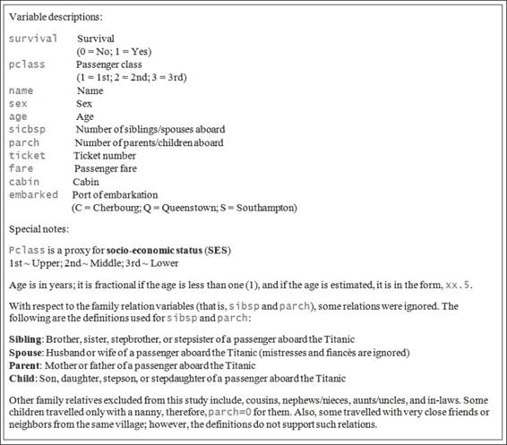

# 十一、附录 B：数据集——泰坦尼克号上乘客的生存

在探索过程之前，我们想介绍一下这里采用的例子。是由 ka ggle([https://www.kaggle.com/](https://www.kaggle.com/)，一个数据预测比赛的平台)提供的关于 RMS 泰坦尼克号上乘客的人口统计信息。我们正在调查的结果是船上的乘客是否能在海难中生还。

应用该数据集有两个原因:

*   皇家邮轮泰坦尼克号被认为是历史上最臭名昭著的海难，2224 名乘客和船员中有 1502 人死亡。然而，在船沉没后，乘客生还的机会不是偶然的；实际上，客舱等级、性别、年龄和其他因素也可能影响他们的生存机会。
*   数据集相对简单；您不需要将大部分时间花在数据管理上(除了在处理一些缺失值时)，但是您可以专注于探索性分析的应用。

下图是目标数据集的变量描述:

从对变量的描述来看，人们可能会想到一些问题，例如，“这个数据集中有没有丢失的值？”“泰坦尼克号上乘客的平均年龄是多少？”、“灾难中幸存的乘客比例是多少？”、“车上大部分乘客属于哪个社会阶层？”。这里提出的所有问题都将在[第二章](part0024_split_000.html#page "Chapter 2. Data Exploration with RMS Titanic")、*RMS 泰坦尼克号数据探索*中得到解答。

除了与描述性统计相关的问题之外，[第 2 章](part0024_split_000.html#page "Chapter 2. Data Exploration with RMS Titanic")、*RMS Titanic*的数据探索的最终目标是生成一个模型，以预测输入参数给出的生存机会。除此之外，我们将评估生成的模型的性能，以确定该模型是否适合该问题。

# 索引

## A

*   adabag 包装
    *   关于/ [用 bagging 方法对数据进行分类](part0097_split_000.html#page "Classifying data with the bagging method")
*   AdaBoost。M1 算法
    *   关于/ [用 boosting 方法对数据进行分类](part0099_split_000.html#page "Classifying data with the boosting method")
*   高级探索性数据分析
    *   关于/ [简介](part0024_split_000.html#page "Introduction")
*   凝聚层次聚类
    *   关于/ [它是如何工作的...](part0107_split_000.html#page "How it works...")
*   聚合函数
    *   关于/ [还有更多...](part0021_split_000.html#page "There's more...")
*   赤池信息标准(AIC)
    *   它是如何工作的...
*   替代假设(H1)
    *   关于/ [它是如何工作的...](part0039_split_000.html#page "How it works...")
*   亚马逊电子病历
    *   RHadoop，配置/ [准备好](part0149_split_000.html#page "Getting ready")，[怎么做...](part0149_split_000.html#page "How to do it...")，[工作原理...](part0149_split_000.html#page "How it works...")
    *   参考链接/ [怎么做...](part0149_split_000.html#page "How to do it...")
*   方差分析
    *   关于/ [进行单向方差分析](part0044_split_000.html#page "Conducting a one-way ANOVA")
    *   单向 ANOVA，conducting / [进行单向 ANOVA](part0044_split_000.html#page "Conducting a one-way ANOVA") ，[怎么做...](part0044_split_000.html#page "How to do it...")，[工作原理...](part0044_split_000.html#page "How it works...")
    *   参考链接/ [还有更多...](part0044_split_000.html#page "There's more...")
    *   双向方差分析，执行/ [执行双向方差分析](part0045_split_000.html#page "Performing a two-way ANOVA")，[怎么做...](part0045_split_000.html#page "How to do it...")，[工作原理...](part0045_split_000.html#page "How it works...")
*   先验规则
    *   关联，挖掘/ [用先验规则挖掘关联](part0121_split_000.html#page "Mining associations with the Apriori rule")，[怎么做...](part0121_split_000.html#page "How to do it...")，[工作原理...](part0121_split_000.html#page "How it works...")、[参见](part0121_split_000.html#page "See also")
*   曲线下面积
    *   关于/ [使用 ROCR 测量预测性能](part0093_split_000.html#page "Measuring prediction performance using ROCR")
*   联想分析
    *   关于/ [简介](part0118_split_000.html#page "Introduction")
*   联合
    *   displaying / [显示交易和关联](part0120_split_000.html#page "Displaying transactions and associations")，[怎么做...](part0120_split_000.html#page "How to do it...")，[工作原理...](part0120_split_000.html#page "How it works...")
    *   用 Apriori 规则/ [挖掘关联，用 Apriori 规则](part0121_split_000.html#page "Mining associations with the Apriori rule")，[怎么做...](part0121_split_000.html#page "How to do it...")、[工作原理...](part0121_split_000.html#page "How it works...")、[参见](part0121_split_000.html#page "See also")
*   协会规则
    *   可视化/ [可视化关联规则](part0123_split_000.html#page "Visualizing association rules")，[怎么做...](part0123_split_000.html#page "How to do it...")，[工作原理...](part0123_split_000.html#page "How it works...")、[参见](part0123_split_000.html#page "See also")
*   自动警报系统
    *   参考链接/ [准备就绪](part0149_split_000.html#page "Getting ready")

## B

*   装袋方法
    *   关于/ [简介](part0096_split_000.html#page "Introduction")
    *   用于对数据进行分类/ [用](part0097_split_000.html#page "Classifying data with the bagging method")、[的打包方法对数据进行分类，怎么做...](part0097_split_000.html#page "How to do it...")，[工作原理...](part0097_split_000.html#page "How it works...")
    *   用于执行交叉验证/ [使用 bagging 方法](part0098_split_000.html#page "Performing cross-validation with the bagging method")、[执行交叉验证工作原理...](part0098_split_000.html#page "How it works...")
*   bam 包
    *   使用/ [参见](part0057_split_000.html#page "See also")
*   巴特利特试验
    *   关于/ [还有更多...](part0043_split_000.html#page "There's more...")
*   基本探索性数据分析
    *   关于/ [简介](part0024_split_000.html#page "Introduction")
*   基本统计
    *   应用/ [应用基础统计](part0021_split_000.html#page "Applying basic statistics")、[怎么做...](part0021_split_000.html#page "How to do it...")，[工作原理...](part0021_split_000.html#page "How it works...")
*   贝叶斯定理
    *   参考链接/ [参见](part0071_split_000.html#page "See also")
*   二叉树类
    *   关于/ [参见](part0066_split_000.html#page "See also")
*   二项式模型
    *   为 GLM / [应用二项式模型进行广义线性回归](part0056_split_000.html#page "Applying the Binomial model for generalized linear regression")、[工作原理...](part0056_split_000.html#page "How it works...")
*   二项检验
    *   进行/ [进行精确的二项式测试](part0039_split_000.html#page "Conducting an exact binomial test")、[准备就绪](part0039_split_000.html#page "Getting ready")、[工作原理...](part0039_split_000.html#page "How it works...")
    *   零假设(H0) / [工作原理...](part0039_split_000.html#page "How it works...")
    *   替代假设(H1) / [它是如何工作的...](part0039_split_000.html#page "How it works...")
*   双标图
    *   用于可视化多元数据/ [使用双标图可视化多元数据](part0132_split_000.html#page "Visualizing multivariate data using biplot")，[如何操作...](part0132_split_000.html#page "How to do it...")，[工作原理...](part0132_split_000.html#page "How it works...")
*   二元聚类图
    *   绘图/ [绘制一个二元聚类图](part0110_split_000.html#page "Drawing a bivariate cluster plot")，[怎么做...](part0110_split_000.html#page "How to do it...")，[工作原理...](part0110_split_000.html#page "How it works...")
*   增压方法
    *   关于/ [简介](part0096_split_000.html#page "Introduction")
    *   用于对数据进行分类/ [用 boosting 方法对数据进行分类](part0099_split_000.html#page "Classifying data with the boosting method")，[怎么做...](part0099_split_000.html#page "How to do it...")，[工作原理...](part0099_split_000.html#page "How it works...")，[还有更多...](part0099_split_000.html#page "There's more...")
    *   用于进行交叉验证/ [用 boosting 方法](part0100_split_000.html#page "Performing cross-validation with the boosting method")、[进行交叉验证...](part0100_split_000.html#page "How to do it...")
*   布鲁施-帕甘试验
    *   关于/ [它是如何工作的...](part0053_split_000.html#page "How it works...")

## C

*   C50
    *   关于/ [参见](part0062_split_000.html#page "See also")
    *   URL / [参见](part0062_split_000.html#page "See also")
*   插入符号包
    *   还有更多...、[根据 nnet 训练的模型预测标签](part0082_split_000.html#page "Predicting labels based on a model trained by nnet")
    *   k-fold 交叉验证，执行/ [使用插入符号包执行交叉验证](part0086_split_000.html#page "Performing cross-validation with the caret package")，[工作原理...](part0086_split_000.html#page "How it works...")、[参见](part0086_split_000.html#page "See also")
    *   变量重要性，排名/ [用脱字符号包](part0087_split_000.html#page "Ranking the variable importance with the caret package")，[对变量重要性进行排名怎么做...](part0087_split_000.html#page "How to do it...")，[还有更多...](part0087_split_000.html#page "There's more...")
    *   高度相关的特性，搜索/ [用脱字符号包寻找高度相关的特性](part0089_split_000.html#page "Finding highly correlated features with the caret package")，[工作原理...](part0089_split_000.html#page "How it works...")
    *   特性，选择/ [使用脱字符号包选择特性](part0090_split_000.html#page "Selecting features using the caret package")，[怎么做...](part0090_split_000.html#page "How to do it...")，[工作原理...](part0090_split_000.html#page "How it works...")
    *   用于比较 ROC 曲线/ [使用 caret 包](part0094_split_000.html#page "Comparing an ROC curve using the caret package")、[比较 ROC 曲线如何做...](part0094_split_000.html#page "How to do it...")，[工作原理...](part0094_split_000.html#page "How it works...")
    *   用于测量型号之间的性能差异/ [用脱字包](part0095_split_000.html#page "Measuring performance differences between models with the caret package")、[测量型号之间的性能差异如何进行...](part0095_split_000.html#page "How to do it...")，[工作原理...](part0095_split_000.html#page "How it works...")
*   字符变量
    *   转换/ [在字符变量上转换类型](part0026_split_000.html#page "Converting types on character variables")，[怎么做...](part0026_split_000.html#page "How to do it...")、[工作原理...](part0026_split_000.html#page "How it works...")
*   分类
    *   关于/ [简介](part0060_split_000.html#page "Introduction")
    *   对比回归/ [简介](part0060_split_000.html#page "Introduction")
*   分类模型
    *   训练数据集，准备/ [准备训练和测试数据集](part0061_split_000.html#page "Preparing the training and testing datasets")，[工作原理...](part0061_split_000.html#page "How it works...")
    *   测试数据集，准备/ [准备训练和测试数据集](part0061_split_000.html#page "Preparing the training and testing datasets")，[工作原理...](part0061_split_000.html#page "How it works...")
    *   构建，用递归分割树/ [用递归分割树构建分类模型](part0062_split_000.html#page "Building a classification model with recursive partitioning trees")，[怎么做...](part0062_split_000.html#page "How to do it...")，[工作原理...](part0062_split_000.html#page "How it works...")
    *   构建，用条件推理树/ [构建分类模型用条件推理树](part0066_split_000.html#page "Building a classification model with a conditional inference tree")，[工作原理...](part0066_split_000.html#page "How it works...")
*   分类者
    *   边距，计算/ [计算一个分类器的边距](part0102_split_000.html#page "Calculating the margins of a classifier")，[怎么做...](part0102_split_000.html#page "How to do it...")，[工作原理...](part0102_split_000.html#page "How it works...")
*   Cloudera 快速启动虚拟机
    *   关于/ [准备 RHadoop 环境](part0139_split_000.html#page "Preparing the RHadoop environment ")
    *   用于准备 RHadoop 环境/ [如何做...](part0139_split_000.html#page "How to do it...")，[工作原理...](part0139_split_000.html#page "How it works...")
    *   URL / [怎么做...](part0139_split_000.html#page "How to do it...")
    *   网址，用于下载 VMW / [怎么做...](part0139_split_000.html#page "How to do it...")
    *   网址，用于下载 KVM / [怎么做...](part0139_split_000.html#page "How to do it...")
    *   网址，用于下载 VirtualBox / [怎么做...](part0139_split_000.html#page "How to do it...")
*   使聚集
    *   关于/ [简介](part0106_split_000.html#page "Introduction")
    *   层次聚类/ [简介](part0106_split_000.html#page "Introduction")
    *   k-means 聚类/ [简介](part0106_split_000.html#page "Introduction")
    *   基于模型的聚类/ [简介](part0106_split_000.html#page "Introduction")
    *   基于密度的聚类/ [简介](part0106_split_000.html#page "Introduction")
    *   方法，比较/ [比较聚类方法](part0111_split_000.html#page "Comparing clustering methods")，[怎么做...](part0111_split_000.html#page "How to do it...")，[工作原理...](part0111_split_000.html#page "How it works...")
    *   轮廓信息，提取/ [从聚类中提取轮廓信息](part0112_split_000.html#page "Extracting silhouette information from clustering")，[准备就绪](part0112_split_000.html#page "Getting ready")，[工作原理...](part0112_split_000.html#page "How it works...")
*   簇
    *   验证，外部/ [外部验证集群](part0117_split_000.html#page "Validating clusters externally")，[如何操作...](part0117_split_000.html#page "How to do it...")，[工作原理...](part0117_split_000.html#page "How it works...")
*   竞赛，卡格尔
    *   URL / [还有更多...](part0025_split_000.html#page "There's more...")
*   条件推理树
    *   分类模型，构建/ [用条件推理树构建分类模型](part0066_split_000.html#page "Building a classification model with a conditional inference tree")，[工作原理...](part0066_split_000.html#page "How it works...")
    *   可视化/ [可视化一棵条件推理树](part0067_split_000.html#page "Visualizing a conditional inference tree")，[怎么做...](part0067_split_000.html#page "How to do it...")、[工作原理...](part0067_split_000.html#page "How it works...")
    *   预测性能，测量/ [测量一棵条件推理树的预测性能](part0068_split_000.html#page "Measuring the prediction performance of a conditional inference tree")，[怎么做...](part0068_split_000.html#page "How to do it...")、[工作原理...](part0068_split_000.html#page "How it works...")
    *   优点/ [工作原理...](part0071_split_000.html#page "How it works...")
    *   缺点/ [工作原理...](part0071_split_000.html#page "How it works...")
*   置信区间
    *   参考链接/ [参见](part0049_split_000.html#page "See also")
*   混淆矩阵
    *   用于验证存活预测/ [用混淆矩阵](part0031_split_000.html#page "Validating the power of prediction with a confusion matrix")、[验证预测的功效如何...](part0031_split_000.html#page "How it works...")，[还有更多...](part0031_split_000.html#page "There's more...")
    *   用于测量预测性能/ [使用混淆矩阵测量预测性能](part0092_split_000.html#page "Measuring prediction performance with a confusion matrix")、[准备](part0092_split_000.html#page "Getting ready")、[工作原理...](part0092_split_000.html#page "How it works...")
*   困惑 _ 矩阵
    *   参考链接/ [参见](part0064_split_000.html#page "See also")
*   相关
    *   performing / [执行相关性和多变量分析](part0037_split_000.html#page "Performing correlations and multivariate analysis")，[怎么做...](part0037_split_000.html#page "How to do it...")，[工作原理...](part0037_split_000.html#page "How it works...")
*   成本复杂性参数
    *   关于/ [它是如何工作的...](part0062_split_000.html#page "How it works...")
*   约为 750 条
    *   URL / [怎么做...](part0016_split_000.html#page "How to do it...")，[工作原理](part0018_split_000.html#page "How it works")
    *   关于/ [安装和加载软件包](part0018_split_000.html#page "Installing and loading packages")
*   Crantastic
    *   关于/ [参见](part0018_split_000.html#page "See also")
*   交叉验证
    *   使用装袋方法/ [执行，使用装袋方法](part0098_split_000.html#page "Performing cross-validation with the bagging method")、[执行交叉验证，其工作原理...](part0098_split_000.html#page "How it works...")
    *   用 boosting 方法执行/ [用 boosting 方法执行交叉验证](part0100_split_000.html#page "Performing cross-validation with the boosting method")，[怎么做...](part0100_split_000.html#page "How to do it...")
*   cSPADE 算法
    *   用于，挖掘频繁序列模式/ [用 cSPADE 挖掘频繁序列模式](part0126_split_000.html#page "Mining frequent sequential patterns with cSPADE")，[怎么做...](part0126_split_000.html#page "How to do it...")，[工作原理...](part0126_split_000.html#page "How it works...")
*   树函数
    *   用于将数据分成簇/ [将树分成簇](part0108_split_000.html#page "Cutting trees into clusters")，[工作原理...](part0108_split_000.html#page "How it works...")，[还有更多...](part0108_split_000.html#page "There's more...")

## D

*   数据
    *   写作/ [读写数据](part0019_split_000.html#page "Reading and writing data")，[怎么做...](part0019_split_000.html#page "How to do it...")、[参见](part0019_split_000.html#page "See also")
    *   阅读/ [读写数据](part0019_split_000.html#page "Reading and writing data")，[怎么做...](part0019_split_000.html#page "How to do it...")、[参见](part0019_split_000.html#page "See also")
    *   操纵/ [准备](part0020_split_000.html#page "Getting ready")，[怎么做...](part0020_split_000.html#page "How to do it...")
    *   操纵，子集函数使用/ [怎么做...](part0020_split_000.html#page "How to do it...")
    *   合并/ [怎么做...](part0020_split_000.html#page "How to do it...")
    *   [用订货功能订货，怎么做...](part0020_split_000.html#page "How to do it...")
    *   可视化/ [可视化数据](part0022_split_000.html#page "Visualizing data")、[做好准备](part0022_split_000.html#page "Getting ready")、[怎么做...](part0022_split_000.html#page "How to do it...")，[工作原理...](part0022_split_000.html#page "How it works...")、[探索和可视化数据](part0029_split_000.html#page "Exploring and visualizing data")、[怎么做...](part0029_split_000.html#page "How to do it...")，[工作原理...](part0029_split_000.html#page "How it works...")，[还有更多...](part0029_split_000.html#page "There's more...")
    *   探索/ [探索和可视化数据](part0029_split_000.html#page "Exploring and visualizing data")，[怎么做...](part0029_split_000.html#page "How to do it...")，[工作原理...](part0029_split_000.html#page "How it works...")，[还有更多...](part0029_split_000.html#page "There's more...")
    *   分类，用 K-最近邻(knn)分类器/ [用 K-最近邻分类器](part0069_split_000.html#page "Classifying data with the k-nearest neighbor classifier")、[对数据进行分类怎么做...](part0069_split_000.html#page "How to do it...")、[工作原理...](part0069_split_000.html#page "How it works...")
    *   分类，用逻辑回归/ [分类数据用逻辑回归](part0070_split_000.html#page "Classifying data with logistic regression")，[怎么做...](part0070_split_000.html#page "How to do it...")，[工作原理...](part0070_split_000.html#page "How it works...")
    *   分类，用朴素贝叶斯分类器/ [用朴素贝叶斯分类器分类数据](part0071_split_000.html#page "Classifying data with the Naïve Bayes classifier")，[如何做...](part0071_split_000.html#page "How to do it...")，[工作原理...](part0071_split_000.html#page "How it works...")，[参见](part0071_split_000.html#page "See also")
    *   转换，转换成事务/ [将数据转换成事务](part0119_split_000.html#page "Transforming data into transactions")，[怎么做...](part0119_split_000.html#page "How to do it...")，[工作原理...](part0119_split_000.html#page "How it works...")
*   数据收集
    *   关于/ [简介](part0024_split_000.html#page "Introduction")
*   数据探索
    *   关于/ [简介](part0024_split_000.html#page "Introduction")
    *   正确提问，提问/ [简介](part0024_split_000.html#page "Introduction")
    *   资料收集/ [简介](part0024_split_000.html#page "Introduction")
    *   数据管理/ [简介](part0024_split_000.html#page "Introduction")
    *   基本探索性数据分析/ [简介](part0024_split_000.html#page "Introduction")
    *   高级探索性数据分析/ [简介](part0024_split_000.html#page "Introduction")
    *   模型评估/ [简介](part0024_split_000.html#page "Introduction")
*   使用 RMS Titanic 进行数据探索
    *   数据集，从 CSV 文件中读取/ [从 CSV 文件中读取泰坦尼克号数据集](part0025_split_000.html#page "Reading a Titanic dataset from a CSV file")，[怎么做...](part0025_split_000.html#page "How to do it...")，[还有更多...](part0025_split_000.html#page "There's more...")
    *   字符变量，转换/ [在字符变量上转换类型](part0026_split_000.html#page "Converting types on character variables")，[怎么做...](part0026_split_000.html#page "How to do it...")，[工作原理...](part0026_split_000.html#page "How it works...")
    *   缺失值，检测/ [检测缺失值](part0027_split_000.html#page "Detecting missing values")，[怎么做...](part0027_split_000.html#page "How to do it...")，[工作原理...](part0027_split_000.html#page "How it works...")，[还有更多...](part0027_split_000.html#page "There's more...")
    *   缺失值，输入/ [输入缺失值](part0028_split_000.html#page "Imputing missing values")，[怎么做...](part0028_split_000.html#page "How to do it...")，[工作原理...](part0028_split_000.html#page "How it works...")
    *   数据，探索/ [探索和可视化数据](part0029_split_000.html#page "Exploring and visualizing data")，[怎么做...](part0029_split_000.html#page "How to do it...")，[工作原理...](part0029_split_000.html#page "How it works...")，[还有更多...](part0029_split_000.html#page "There's more...")
    *   数据，可视化/ [探索和可视化数据](part0029_split_000.html#page "Exploring and visualizing data")，[怎么做...](part0029_split_000.html#page "How to do it...")、[工作原理...](part0029_split_000.html#page "How it works...")，[还有更多...](part0029_split_000.html#page "There's more...")
    *   乘客存活率，用决策树预测/ [用决策树预测乘客存活率](part0030_split_000.html#page "Predicting passenger survival with a decision tree")，[怎么做...](part0030_split_000.html#page "How to do it...")，[工作原理...](part0030_split_000.html#page "How it works...")，[还有更多...](part0030_split_000.html#page "There's more...")
    *   生存预测，用混淆矩阵验证/ [用混淆矩阵验证预测能力](part0031_split_000.html#page "Validating the power of prediction with a confusion matrix")，[工作原理...](part0031_split_000.html#page "How it works...")，[还有更多...](part0031_split_000.html#page "There's more...")
    *   生存预测，用 ROC 曲线评估/ [用 ROC 曲线评估业绩](part0032_split_000.html#page "Assessing performance with the ROC curve")，[怎么做...](part0032_split_000.html#page "How to do it...")，[工作原理...](part0032_split_000.html#page "How it works...")
*   数据管理
    *   关于/ [简介](part0024_split_000.html#page "Introduction")
*   数据采样
    *   关于/ [了解 R 中的数据采样](part0034_split_000.html#page "Understanding data sampling in R")，[是如何工作的...](part0034_split_000.html#page "How it works...")
*   资料组
    *   获取，用于机器学习/ [获取用于机器学习的数据集](part0023_split_000.html#page "Getting a dataset for machine learning")，[如何实现...](part0023_split_000.html#page "How to do it...")，[工作原理...](part0023_split_000.html#page "How it works...")
*   基于密度的噪声应用空间聚类
    *   关于/ [使用基于密度的方法对数据进行聚类](part0114_split_000.html#page "Clustering data with the density-based method")
    *   用于执行基于密度的聚类/ [用基于密度的方法](part0114_split_000.html#page "Clustering data with the density-based method")、[对数据进行聚类如何进行...](part0114_split_000.html#page "How to do it...")、[工作原理...](part0114_split_000.html#page "How it works...")、[参见](part0114_split_000.html#page "See also")
*   决策图表
    *   用于预测乘客存活率/ [用决策树预测乘客存活率](part0030_split_000.html#page "Predicting passenger survival with a decision tree")，[怎么做...](part0030_split_000.html#page "How to do it...")，[工作原理...](part0030_split_000.html#page "How it works...")，[还有更多...](part0030_split_000.html#page "There's more...")
*   基于密度的聚类
    *   关于/ [简介](part0106_split_000.html#page "Introduction")
    *   用于对数据进行聚类/ [用基于密度的方法对数据进行聚类](part0114_split_000.html#page "Clustering data with the density-based method")，[怎么做...](part0114_split_000.html#page "How to do it...")，[工作原理...](part0114_split_000.html#page "How it works...")、[参见](part0114_split_000.html#page "See also")
    *   使用 DBSCAN / [执行，使用基于密度的方法](part0114_split_000.html#page "Clustering data with the density-based method")、[对数据进行聚类如何执行...](part0114_split_000.html#page "How to do it...")，[工作原理...](part0114_split_000.html#page "How it works...")
*   描述统计学
    *   关于/ [简介](part0033_split_000.html#page "Introduction")
    *   一元描述性统计/ [在 R 中使用一元描述性统计](part0036_split_000.html#page "Working with univariate descriptive statistics in R")，[怎么做...](part0036_split_000.html#page "How to do it...")，[工作原理...](part0036_split_000.html#page "How it works...")
*   诊断图
    *   生成，回归模型/ [生成拟合模型的诊断图](part0050_split_000.html#page "Generating a diagnostic plot of a fitted model")，[工作原理...](part0050_split_000.html#page "How it works...")，[还有更多...](part0050_split_000.html#page "There's more...")
*   降维
    *   关于/ [简介](part0127_split_000.html#page "Introduction")
    *   特征提取/ [简介](part0127_split_000.html#page "Introduction")
    *   功能选择/ [介绍](part0127_split_000.html#page "Introduction")
    *   执行，使用 PCA/[使用 PCA 执行降维](part0129_split_000.html#page "Performing dimension reduction with PCA")，[工作原理...](part0129_split_000.html#page "How it works...")，[还有更多...](part0129_split_000.html#page "There's more...")
    *   表演，MDS 用/ [和 MDS 一起表演降维](part0133_split_000.html#page "Performing dimension reduction with MDS")，[怎么做...](part0133_split_000.html#page "How to do it...")，[工作原理...](part0133_split_000.html#page "How it works...")，[还有更多...](part0133_split_000.html#page "There's more...")
    *   执行时，使用奇异值分解/ [用奇异值分解降低维数](part0134_split_000.html#page "Reducing dimensions with SVD")，[怎么做...](part0134_split_000.html#page "How to do it...")，[工作原理...](part0134_split_000.html#page "How it works...")
*   相异矩阵
    *   关于/ [可视化相异矩阵](part0116_split_000.html#page "Visualizing a dissimilarity matrix")
    *   可视化/ [可视化一个相异矩阵](part0116_split_000.html#page "Visualizing a dissimilarity matrix")，[怎么做...](part0116_split_000.html#page "How to do it...")，[工作原理...](part0116_split_000.html#page "How it works...")，[还有更多...](part0116_split_000.html#page "There's more...")
*   距离函数
    *   [单联动/如何工作...](part0107_split_000.html#page "How it works...")
    *   完成联动/ [工作原理...](part0107_split_000.html#page "How it works...")
    *   [平均联动/工作原理...](part0107_split_000.html#page "How it works...")
    *   [结界法/它是如何工作的...](part0107_split_000.html#page "How it works...")
*   分裂层次聚类
    *   关于/ [它是如何工作的...](part0107_split_000.html#page "How it works...")

## E

*   e1071 包装
    *   k-fold 交叉验证，执行/ [使用 e1071 包执行交叉验证](part0085_split_000.html#page "Performing cross-validation with the e1071 package")，[如何执行...](part0085_split_000.html#page "How to do it...")、[工作原理...](part0085_split_000.html#page "How it works...")
*   Eclat 算法
    *   用于，挖掘频繁项集/ [用 Eclat 挖掘频繁项集](part0124_split_000.html#page "Mining frequent itemsets with Eclat")，[准备](part0124_split_000.html#page "Getting ready")，[怎么做...](part0124_split_000.html#page "How to do it...")，[工作原理...](part0124_split_000.html#page "How it works...")
*   集成学习
    *   关于/ [简介](part0096_split_000.html#page "Introduction")
    *   装袋方法/ [介绍](part0096_split_000.html#page "Introduction")
    *   升压方法/ [介绍](part0096_split_000.html#page "Introduction")
    *   随机森林/ [简介](part0096_split_000.html#page "Introduction")
*   集成方法
    *   误差演化，计算/ [计算误差演化的系综方法](part0103_split_000.html#page "Calculating the error evolution of the ensemble method")，[怎么做...](part0103_split_000.html#page "How to do it...")，[工作原理...](part0103_split_000.html#page "How it works...")
*   错误重置功能
    *   关于/ [估计不同分类器的预测误差](part0105_split_000.html#page "Estimating the prediction errors of different classifiers")
*   误差演变
    *   计算，系综方法/ [计算系综方法的误差演化](part0103_split_000.html#page "Calculating the error evolution of the ensemble method")，[怎么做...](part0103_split_000.html#page "How to do it...")，[工作原理...](part0103_split_000.html#page "How it works...")

## F

*   特征抽出
    *   关于/ [简介](part0127_split_000.html#page "Introduction")
*   特征选择
    *   关于/ [简介](part0127_split_000.html#page "Introduction")
    *   执行，使用的 f 选择器包/ [使用 f 选择器执行功能选择](part0128_split_000.html#page "Performing feature selection with FSelector")，[如何执行...](part0128_split_000.html#page "How to do it...")、[工作原理...](part0128_split_000.html#page "How it works...")、[参见](part0128_split_000.html#page "See also")
*   FP-增长
    *   关于/ [参见](part0124_split_000.html#page "See also")
    *   参考链接/ [参见](part0124_split_000.html#page "See also")
*   f 选择器包
    *   用于执行功能选择/ [使用 FSelector](part0128_split_000.html#page "Performing feature selection with FSelector") 、[执行功能选择如何操作...](part0128_split_000.html#page "How to do it...")，[工作原理...](part0128_split_000.html#page "How it works...")、[参见](part0128_split_000.html#page "See also")

## G

*   鲸鱼群
    *   关于/ [对数据拟合广义可加模型](part0057_split_000.html#page "Fitting a generalized additive model to data")
    *   数据拟合/ [数据拟合广义加法模型](part0057_split_000.html#page "Fitting a generalized additive model to data")、[准备就绪](part0057_split_000.html#page "Getting ready")、[工作原理](part0057_split_000.html#page "How it works")
    *   可视化/ [可视化一个广义可加模型](part0058_split_000.html#page "Visualizing a generalized additive model")，[怎么做...](part0058_split_000.html#page "How to do it...")，[工作原理...](part0058_split_000.html#page "How it works...")
    *   诊断/ [诊断一个广义加性模型](part0059_split_000.html#page "Diagnosing a generalized additive model")，[怎么做...](part0059_split_000.html#page "How to do it...")，[工作原理...](part0059_split_000.html#page "How it works...")，[还有更多...](part0059_split_000.html#page "There's more...")
*   通用交叉验证(GCV)
    *   关于/ [它是如何工作的...](part0059_split_000.html#page "How it works...")
*   ggplot2
    *   关于/ [参见](part0022_split_000.html#page "See also")
    *   URL / [参见](part0022_split_000.html#page "See also")
*   GLM
    *   关于/ [应用高斯模型进行广义线性回归](part0054_split_000.html#page "Applying the Gaussian model for generalized linear regression")
    *   拟合，用高斯模型/ [应用高斯模型进行广义线性回归](part0054_split_000.html#page "Applying the Gaussian model for generalized linear regression")，[准备](part0054_split_000.html#page "Getting ready")，[怎么做...](part0054_split_000.html#page "How to do it...")，[工作原理...](part0054_split_000.html#page "How it works...")
    *   使用泊松模型进行拟合/ [将泊松模型应用于广义线性回归](part0055_split_000.html#page "Applying the Poisson model for generalized linear regression")，[工作原理...](part0055_split_000.html#page "How it works...")
    *   使用二项式模型进行拟合/ [将二项式模型应用于广义线性回归](part0056_split_000.html#page "Applying the Binomial model for generalized linear regression")、[工作原理...](part0056_split_000.html#page "How it works...")
*   glm 函数
    *   使用/ [应用高斯模型进行广义线性回归](part0054_split_000.html#page "Applying the Gaussian model for generalized linear regression")
*   谷歌计算引擎
    *   URL / [参见](part0149_split_000.html#page "See also")
*   梯度推进
    *   关于/ [使用梯度增强对数据进行分类](part0101_split_000.html#page "Classifying data with gradient boosting")
    *   用于对数据进行分类/ [用梯度推进对数据进行分类](part0101_split_000.html#page "Classifying data with gradient boosting")，[怎么做...](part0101_split_000.html#page "How to do it...")、[工作原理...](part0101_split_000.html#page "How it works...")，[还有更多...](part0101_split_000.html#page "There's more...")
*   gsub 功能
    *   关于/ [还有更多...](part0020_split_000.html#page "There's more...")

## H

*   HDFS
    *   操作，使用 rhdfs 包/ [用 rhdfs 操作 hdfs](part0142_split_000.html#page "Operating HDFS with rhdfs") ，[怎么做...](part0142_split_000.html#page "How to do it...")，[工作原理...](part0142_split_000.html#page "How it works...")
*   异方差性
    *   关于/ [它是如何工作的...](part0053_split_000.html#page "How it works...")
*   分层聚类
    *   关于/ [简介](part0106_split_000.html#page "Introduction")
    *   用于对数据进行聚类/ [用层次聚类法对数据进行聚类](part0107_split_000.html#page "Clustering data with hierarchical clustering")，[怎么做...](part0107_split_000.html#page "How to do it...")，[工作原理...](part0107_split_000.html#page "How it works...")，[还有更多...](part0107_split_000.html#page "There's more...")
    *   凝聚层次聚类/ [工作原理...](part0107_split_000.html#page "How it works...")
    *   分裂式层次聚类/ [工作原理...](part0107_split_000.html#page "How it works...")
*   敬语条目
    *   参考链接/ [还有更多...](part0028_split_000.html#page "There's more...")
*   Hontonworks 沙盒
    *   URL / [参见](part0139_split_000.html#page "See also")
*   假设方法
    *   比例测试/ [还有更多...](part0043_split_000.html#page "There's more...")
    *   还有更多...
    *   巴特利特测试/ [还有更多...](part0043_split_000.html#page "There's more...")
    *   克鲁斯卡尔-沃利斯秩和检验/ [还有更多...](part0043_split_000.html#page "There's more...")
    *   夏皮罗-维尔克测试/ [还有更多...](part0043_split_000.html#page "There's more...")

## 我

*   形象
    *   压缩，使用 SVD/[用 SVD 压缩图像](part0135_split_000.html#page "Compressing images with SVD")，[怎么做...](part0135_split_000.html#page "How to do it...")，[工作原理...](part0135_split_000.html#page "How it works...")
*   推论统计
    *   关于/ [简介](part0033_split_000.html#page "Introduction")
*   安装，软件包
    *   关于/ [安装和加载包](part0018_split_000.html#page "Installing and loading packages")，[怎么做...](part0018_split_000.html#page "How to do it...")，[工作原理](part0018_split_000.html#page "How it works")
*   安装，plyrmr 包
    *   关于/ [安装 plyrmr](part0146_split_000.html#page "Installing plyrmr") ，[参见](part0146_split_000.html#page "See also")
*   安装，R
    *   关于/ [准备](part0016_split_000.html#page "Getting ready")，[怎么做...](part0016_split_000.html#page "How to do it...")、[工作原理...](part0016_split_000.html#page "How it works...")
    *   在 Windows / [上怎么做...](part0016_split_000.html#page "How to do it...")
    *   上 Mac OS X / [怎么做...](part0016_split_000.html#page "How to do it...")
    *   在 Ubuntu / [上怎么做...](part0016_split_000.html#page "How to do it...")
    *   关于 CentOS 5 / [怎么做...](part0016_split_000.html#page "How to do it...")
    *   关于 CentOS 6 / [怎么做...](part0016_split_000.html#page "How to do it...")
*   安装，rhdfs 软件包
    *   关于/ [安装 rhdfs](part0141_split_000.html#page "Installing rhdfs") ，[工作原理...](part0141_split_000.html#page "How it works...")
*   安装，rmr2 包
    *   关于/ [安装 rmr2](part0140_split_000.html#page "Installing rmr2") ，[怎么做...](part0140_split_000.html#page "How to do it...")、[参见](part0140_split_000.html#page "See also")
*   安装，RStudio
    *   关于/ [下载安装 RStudio](part0017_split_000.html#page "Downloading and installing RStudio") ，[怎么做...](part0017_split_000.html#page "How to do it...")，[工作原理](part0017_split_000.html#page "How it works")
*   集成开发环境(IDE)
    *   关于/ [下载并安装 RStudio](part0017_split_000.html#page "Downloading and installing RStudio")
*   四分位数间距(IQR)
    *   关于/ [怎么做...](part0036_split_000.html#page "How to do it...")
*   区间变量
    *   关于/ [它是如何工作的...](part0026_split_000.html#page "How it works...")
*   ipred 包
    *   关于/ [还有更多...](part0097_split_000.html#page "There's more...")、[估计不同分类器的预测误差](part0105_split_000.html#page "Estimating the prediction errors of different classifiers")
*   ISOMAP
    *   关于/ [简介](part0127_split_000.html#page "Introduction")
    *   非线性降维，执行/ [用 ISOMAP 执行非线性降维](part0136_split_000.html#page "Performing nonlinear dimension reduction with ISOMAP")，[怎么做...](part0136_split_000.html#page "How to do it...")、[工作原理...](part0136_split_000.html#page "How it works...")，[还有更多...](part0136_split_000.html#page "There's more...")
*   项目集
    *   关于/ [简介](part0118_split_000.html#page "Introduction")

## K

*   k 倍交叉验证
    *   用于评估模型性能/ [使用 k 重交叉验证评估模型性能](part0084_split_000.html#page "Estimating model performance with k-fold cross-validation")，[工作原理...](part0084_split_000.html#page "How it works...")
    *   使用 e1071 包执行/ [使用 e1071 包执行交叉验证](part0085_split_000.html#page "Performing cross-validation with the e1071 package")，[如何执行...](part0085_split_000.html#page "How to do it...")，[工作原理...](part0085_split_000.html#page "How it works...")
    *   执行，用脱字符包/ [执行交叉验证用脱字符包](part0086_split_000.html#page "Performing cross-validation with the caret package")，[工作原理...](part0086_split_000.html#page "How it works...")、[参见](part0086_split_000.html#page "See also")
*   k 均值聚类
    *   关于/ [简介](part0106_split_000.html#page "Introduction")
    *   用于聚类数据/ [用 k-means 方法聚类数据](part0109_split_000.html#page "Clustering data with the k-means method")，[怎么做...](part0109_split_000.html#page "How to do it...")，[工作原理...](part0109_split_000.html#page "How it works...")、[参见](part0109_split_000.html#page "See also")
    *   最佳聚类数，获取/ [获取 k-means 的最佳聚类数](part0113_split_000.html#page "Obtaining the optimum number of clusters for k-means")，[怎么做...](part0113_split_000.html#page "How to do it...")、[参见](part0113_split_000.html#page "See also")
    *   参考链接/ [参见](part0113_split_000.html#page "See also")
*   k-最近邻分类器
    *   关于/ [用 k-最近邻分类器分类数据](part0069_split_000.html#page "Classifying data with the k-nearest neighbor classifier")，[工作原理...](part0069_split_000.html#page "How it works...")
    *   数据，分类/ [用 k 近邻分类器](part0069_split_000.html#page "Classifying data with the k-nearest neighbor classifier")，[对数据进行分类怎么做...](part0069_split_000.html#page "How to do it...")，[工作原理...](part0069_split_000.html#page "How it works...")
    *   优点/ [工作原理...](part0069_split_000.html#page "How it works...")，[工作原理...](part0071_split_000.html#page "How it works...")
    *   缺点/ [工作原理...](part0069_split_000.html#page "How it works...")，[工作原理...](part0071_split_000.html#page "How it works...")
    *   URL / [参见](part0069_split_000.html#page "See also")
*   卡格尔
    *   URL / [从 CSV 文件中读取泰坦尼克号数据集](part0025_split_000.html#page "Reading a Titanic dataset from a CSV file")，[怎么做...](part0025_split_000.html#page "How to do it...")
*   凯泽方法
    *   用于确定主成分数/ [使用 Kaiser 方法确定主成分数](part0131_split_000.html#page "Determining the number of principal components using the Kaiser method")，[怎么做...](part0131_split_000.html#page "How to do it...")、[工作原理...](part0131_split_000.html#page "How it works...")
*   KDnuggets
    *   关于/ [参见](part0023_split_000.html#page "See also")
    *   URL / [参见](part0023_split_000.html#page "See also")
*   科尔莫戈罗夫-斯米尔诺夫检验
    *   执行/ [执行 Kolmogorov-Smirnov 测试](part0041_split_000.html#page "Performing the Kolmogorov-Smirnov test")、[如何执行...](part0041_split_000.html#page "How to do it...")，[工作原理...](part0041_split_000.html#page "How it works...")、[参见](part0041_split_000.html#page "See also")
    *   关于/ [它是如何工作的...](part0041_split_000.html#page "How it works...")
*   克鲁斯卡尔-沃利斯秩和检验
    *   关于/ [还有更多...](part0043_split_000.html#page "There's more...")

## L

*   标签
    *   预测，由 SVM / [训练的神经网络基于由支持向量机](part0076_split_000.html#page "Predicting labels based on a model trained by a support vector machine")、[训练的模型预测标签如何做...](part0076_split_000.html#page "How to do it...")、[工作原理...](part0076_split_000.html#page "How it works...")，[还有更多...](part0076_split_000.html#page "There's more...")
    *   通过 neuralnet / [预测经过训练的神经网络基于通过 neuralnet](part0080_split_000.html#page "Predicting labels based on a model trained by neuralnet") 、[训练的模型预测标签如何做到...](part0080_split_000.html#page "How to do it...")，[工作原理...](part0080_split_000.html#page "How it works...")
    *   预测，通过 nnet package 训练的神经网络/ [基于通过 nnet 训练的模型预测标签](part0082_split_000.html#page "Predicting labels based on a model trained by nnet")，[如何做...](part0082_split_000.html#page "How to do it...")，[工作原理...](part0082_split_000.html#page "How it works...")
*   libsvm
    *   关于/ [用支持向量机对数据进行分类](part0073_split_000.html#page "Classifying data with a support vector machine")
*   线性方法
    *   PCA / [简介](part0127_split_000.html#page "Introduction")
    *   MDS / [简介](part0127_split_000.html#page "Introduction")
    *   SVD / [简介](part0127_split_000.html#page "Introduction")
*   线性回归
    *   进行多元分析/ [操作线性回归和多元分析](part0038_split_000.html#page "Operating linear regression and multivariate analysis")、[准备](part0038_split_000.html#page "Getting ready")、[如何做...](part0038_split_000.html#page "How to do it...")，[工作原理...](part0038_split_000.html#page "How it works...")
*   线性回归模型
    *   拟合，用 lm 函数/ [拟合一个线性回归模型用 lm](part0047_split_000.html#page "Fitting a linear regression model with lm") ，[怎么做...](part0047_split_000.html#page "How to do it...")，[工作原理...](part0047_split_000.html#page "How it works...")
    *   信息获取、使用的汇总函数/ [汇总线性模型符合](part0048_split_000.html#page "Summarizing linear model fits")、[工作原理...](part0048_split_000.html#page "How it works...")、[参见](part0048_split_000.html#page "See also")
    *   用于预测未知值/ [用线性回归预测未知值](part0049_split_000.html#page "Using linear regression to predict unknown values")，[怎么做...](part0049_split_000.html#page "How to do it...")、[参见](part0049_split_000.html#page "See also")
    *   案例研究/ [研究滑动数据的线性回归案例](part0053_split_000.html#page "Studying a case of linear regression on SLID data")，[如何做...](part0053_split_000.html#page "How to do it...")，[工作原理...](part0053_split_000.html#page "How it works...")
*   LLE
    *   关于/ [简介](part0127_split_000.html#page "Introduction")
    *   非线性降维，执行/ [用局部线性嵌入执行非线性降维](part0137_split_000.html#page "Performing nonlinear dimension reduction with Local Linear Embedding")，[怎么做...](part0137_split_000.html#page "How to do it...")，[工作原理...](part0137_split_000.html#page "How it works...")
*   lm 函数
    *   用于拟合线性回归模型/ [用 lm](part0047_split_000.html#page "Fitting a linear regression model with lm") 、[拟合线性回归模型怎么做...](part0047_split_000.html#page "How to do it...")，[工作原理...](part0047_split_000.html#page "How it works...")
    *   用于拟合多项式回归模型/ [用 lm](part0051_split_000.html#page "Fitting a polynomial regression model with lm") 、[拟合多项式回归模型怎么做...](part0051_split_000.html#page "How to do it...")，[工作原理](part0051_split_000.html#page "How it works")
*   逻辑回归
    *   用于对数据进行分类/ [用逻辑回归对数据进行分类](part0070_split_000.html#page "Classifying data with logistic regression")，[怎么做...](part0070_split_000.html#page "How to do it...")、[工作原理...](part0070_split_000.html#page "How it works...")
    *   优势/ [工作原理...](part0071_split_000.html#page "How it works...")
    *   缺点/ [工作原理...](part0071_split_000.html#page "How it works...")

## M

*   机器学习
    *   关于/ [简介](part0015_split_000.html#page "Introduction")
    *   同 R / [简介](part0015_split_000.html#page "Introduction")
    *   数据集，获取/ [获取机器学习的数据集](part0023_split_000.html#page "Getting a dataset for machine learning")，[怎么做...](part0023_split_000.html#page "How to do it...")，[工作原理...](part0023_split_000.html#page "How it works...")
    *   用 RHadoop / [进行机器学习用 RHadoop](part0148_split_000.html#page "Conducting machine learning with RHadoop") ，[怎么做...](part0148_split_000.html#page "How to do it...")，[工作原理...](part0148_split_000.html#page "How it works...")
    *   关于算法/ [的参考链接，参见](part0148_split_000.html#page "See also")
*   mapR 沙盒
    *   URL / [另请参见](part0139_split_000.html#page "See also")
*   边缘
    *   关于/ [计算分类器的边距](part0102_split_000.html#page "Calculating the margins of a classifier")
    *   分类器的计算/ [计算分类器的边距](part0102_split_000.html#page "Calculating the margins of a classifier")，[怎么做...](part0102_split_000.html#page "How to do it...")，[工作原理...](part0102_split_000.html#page "How it works...")
*   mboost 包
    *   关于/ [还有更多...](part0101_split_000.html#page "There's more...")
*   master of dental surgery 牙科硕士
    *   关于/ [简介](part0127_split_000.html#page "Introduction")
    *   用于降维/ [用 MDS](part0133_split_000.html#page "Performing dimension reduction with MDS") 、[降维...](part0133_split_000.html#page "How to do it...")，[工作原理...](part0133_split_000.html#page "How it works...")、[还有更多...](part0133_split_000.html#page "There's more...")
*   最低支持
    *   关于/ [它是如何工作的...](part0126_split_000.html#page "How it works...")
*   缺少值
    *   检测/ [检测缺失值](part0027_split_000.html#page "Detecting missing values")，[怎么做...](part0027_split_000.html#page "How to do it...")、[还有更多...](part0027_split_000.html#page "There's more...")
    *   输入/ [输入缺失值](part0028_split_000.html#page "Imputing missing values")，[怎么做...](part0028_split_000.html#page "How to do it...")，[工作原理...](part0028_split_000.html#page "How it works...")
*   基于模型的聚类
    *   关于/ [简介](part0106_split_000.html#page "Introduction")
    *   用于对数据进行聚类/ [用基于模型的方法对数据进行聚类](part0115_split_000.html#page "Clustering data with the model-based method")，[怎么做...](part0115_split_000.html#page "How to do it...")，[工作原理...](part0115_split_000.html#page "How it works...")
*   模型评估
    *   关于/ [简介](part0024_split_000.html#page "Introduction")
*   模型评估
    *   关于/ [简介](part0083_split_000.html#page "Introduction")
*   多变量分析
    *   执行/ [执行相关性和多变量分析](part0037_split_000.html#page "Performing correlations and multivariate analysis")、[如何做...](part0037_split_000.html#page "How to do it...")、[工作原理...](part0037_split_000.html#page "How it works...")
    *   线性回归，进行/ [操作线性回归和多元分析](part0038_split_000.html#page "Operating linear regression and multivariate analysis")，[怎么做...](part0038_split_000.html#page "How to do it...")，[工作原理...](part0038_split_000.html#page "How it works...")
*   多元数据
    *   可视化，使用双标图/ [使用双标图可视化多元数据](part0132_split_000.html#page "Visualizing multivariate data using biplot")，[如何操作...](part0132_split_000.html#page "How to do it...")，[工作原理...](part0132_split_000.html#page "How it works...")

## 普通

*   北美(不可用)
    *   关于/ [做好准备](part0027_split_000.html#page "Getting ready")
*   NaN(非数字)
    *   关于/ [准备就绪](part0027_split_000.html#page "Getting ready")
*   朴素贝叶斯分类器
    *   数据，分类/ [用朴素贝叶斯分类器分类数据](part0071_split_000.html#page "Classifying data with the Naïve Bayes classifier")，[怎么做...](part0071_split_000.html#page "How to do it...")、[工作原理...](part0071_split_000.html#page "How it works...")、[参见](part0071_split_000.html#page "See also")
    *   优点/ [工作原理...](part0071_split_000.html#page "How it works...")
    *   缺点/ [工作原理...](part0071_split_000.html#page "How it works...")
*   神经网络
    *   神经网络(NN)，training / [用 neuralnet 训练一个神经网络](part0078_split_000.html#page "Training a neural network with neuralnet")，[怎么做...](part0078_split_000.html#page "How to do it...")，[工作原理...](part0078_split_000.html#page "How it works...")
    *   神经网络(NN)，可视化/ [可视化一个由 neuralnet 训练的神经网络](part0079_split_000.html#page "Visualizing a neural network trained by neuralnet")，[怎么做...](part0079_split_000.html#page "How to do it...")，[工作原理...](part0079_split_000.html#page "How it works...")
    *   标签，预测已训练的神经网络/ [基于由 neuralnet 训练的模型预测标签](part0080_split_000.html#page "Predicting labels based on a model trained by neuralnet")，[如何做...](part0080_split_000.html#page "How to do it...")、[工作原理...](part0080_split_000.html#page "How it works...")
*   神经网络
    *   关于/ [简介](part0072_split_000.html#page "Introduction")
    *   对阵 SVM / [简介](part0072_split_000.html#page "Introduction")
    *   训练，用 neuralnet / [用 neuralnet 训练一个神经网络](part0078_split_000.html#page "Training a neural network with neuralnet")，[怎么做...](part0078_split_000.html#page "How to do it...")，[工作原理...](part0078_split_000.html#page "How it works...")
    *   优点/ [工作原理...](part0078_split_000.html#page "How it works...")
    *   可视化，由 neuralnet / [可视化一个由 neuralnet](part0079_split_000.html#page "Visualizing a neural network trained by neuralnet") ，[训练的神经网络怎么做...](part0079_split_000.html#page "How to do it...")、[工作原理...](part0079_split_000.html#page "How it works...")
    *   训练，用 nnet 包/ [训练一个神经网络用 nnet](part0081_split_000.html#page "Training a neural network with nnet") ，[怎么做...](part0081_split_000.html#page "How to do it...")，[工作原理...](part0081_split_000.html#page "How it works...")
*   网络包
    *   用于训练神经网络(NN) / [用 nnet 训练神经网络](part0081_split_000.html#page "Training a neural network with nnet")，[怎么做...](part0081_split_000.html#page "How to do it...")，[工作原理...](part0081_split_000.html#page "How it works...")
    *   关于/ [用 nnet 训练神经网络](part0081_split_000.html#page "Training a neural network with nnet")
    *   标签，预测已训练的神经网络/ [根据由 nnet](part0082_split_000.html#page "Predicting labels based on a model trained by nnet") ，[训练的模型预测标签如何做...](part0082_split_000.html#page "How to do it...")，[工作原理...](part0082_split_000.html#page "How it works...")
*   名义可变因素
    *   关于/ [它是如何工作的...](part0026_split_000.html#page "How it works...")
*   非线性降维
    *   执行，用 ISOMAP / [执行非线性降维用 ISOMAP](part0136_split_000.html#page "Performing nonlinear dimension reduction with ISOMAP") ，[怎么做...](part0136_split_000.html#page "How to do it...")，[工作原理...](part0136_split_000.html#page "How it works...")，[还有更多...](part0136_split_000.html#page "There's more...")
    *   执行，用 LLE / [执行非线性降维用局部线性嵌入](part0137_split_000.html#page "Performing nonlinear dimension reduction with Local Linear Embedding")，[怎么做...](part0137_split_000.html#page "How to do it...")，[工作原理...](part0137_split_000.html#page "How it works...")
*   非线性方法
    *   ISOMAP / [简介](part0127_split_000.html#page "Introduction")
    *   LLE / [简介](part0127_split_000.html#page "Introduction")
*   零假设(H0)
    *   关于/ [它是如何工作的...](part0039_split_000.html#page "How it works...")

## O

*   单向方差分析
    *   进行/ [进行单向方差分析](part0044_split_000.html#page "Conducting a one-way ANOVA")，[怎么做...](part0044_split_000.html#page "How to do it...")，[工作原理...](part0044_split_000.html#page "How it works...")
*   订单功能
    *   使用/ [怎么做...](part0020_split_000.html#page "How to do it...")
*   序数变量
    *   关于/ [工作原理...](part0026_split_000.html#page "How it works...")

## P

*   包装
    *   loading / [安装和加载包](part0018_split_000.html#page "Installing and loading packages")，[怎么做...](part0018_split_000.html#page "How to do it...")，[工作原理](part0018_split_000.html#page "How it works")
    *   安装/ [安装和加载包](part0018_split_000.html#page "Installing and loading packages")，[怎么做...](part0018_split_000.html#page "How to do it...")、[工作原理](part0018_split_000.html#page "How it works")
*   派对套餐
    *   关于/ [还有更多...](part0030_split_000.html#page "There's more...")，[还有更多...](part0104_split_000.html#page "There's more...")
*   主成分分析
    *   关于/ [简介](part0127_split_000.html#page "Introduction")
    *   用于执行降维/ [使用 PCA 执行降维](part0129_split_000.html#page "Performing dimension reduction with PCA")，[工作原理...](part0129_split_000.html#page "How it works...")，[还有更多...](part0129_split_000.html#page "There's more...")
*   皮尔逊卡方检验
    *   关于/ [使用皮尔森卡方检验](part0043_split_000.html#page "Working with Pearson's Chi-squared test")
    *   指导/ [使用皮尔森卡方检验](part0043_split_000.html#page "Working with Pearson's Chi-squared test")、[如何操作](part0043_split_000.html#page "How to do it")、[工作原理...](part0043_split_000.html#page "How it works...")
*   plyrmr 包
    *   关于/ [简介](part0138_split_000.html#page "Introduction")
    *   安装/ [安装 plyrmr](part0146_split_000.html#page "Installing plyrmr") ，[工作原理...](part0146_split_000.html#page "How it works...")
    *   用于操作数据/ [用 plyrmr 操作数据](part0147_split_000.html#page "Manipulating data with plyrmr")，[怎么做...](part0147_split_000.html#page "How to do it...")、[参见](part0147_split_000.html#page "See also")
*   泊松模型
    *   应用，对于 GLM / [应用泊松模型进行广义线性回归](part0055_split_000.html#page "Applying the Poisson model for generalized linear regression")，[工作原理...](part0055_split_000.html#page "How it works...")
*   多元函数
    *   使用/ [用 lm](part0051_split_000.html#page "Fitting a polynomial regression model with lm") 拟合多项式回归模型
*   多项式回归模型
    *   拟合，用 lm 函数/ [用 lm 函数拟合一个多项式回归模型](part0051_split_000.html#page "Fitting a polynomial regression model with lm")，[怎么做...](part0051_split_000.html#page "How to do it...")，[工作原理](part0051_split_000.html#page "How it works")
*   装船港/ [怎么做...](part0028_split_000.html#page "How to do it...")
*   预计误差
    *   估计不同分类器的预测误差/ [估计不同分类器的预测误差](part0105_split_000.html#page "Estimating the prediction errors of different classifiers")，[怎么做...](part0105_split_000.html#page "How to do it...")
*   概率分布
    *   关于/ [运算 R 中的一个概率分布](part0035_split_000.html#page "Operating a probability distribution in R")
    *   生成/ [运算 R 中的一个概率分布](part0035_split_000.html#page "Operating a probability distribution in R")，[怎么做...](part0035_split_000.html#page "How to do it...")，[工作原理...](part0035_split_000.html#page "How it works...")
*   比例测试
    *   关于/ [还有更多...](part0043_split_000.html#page "There's more...")
*   修剪(决策树)
    *   参考链接/ [参见](part0065_split_000.html#page "See also")

## Q

*   分位数比较图
    *   关于/ [它是如何工作的...](part0059_split_000.html#page "How it works...")

## 稀有

*   稀有
    *   关于/ [简介](part0015_split_000.html#page "Introduction")
    *   使用，用于机器学习/ [简介](part0015_split_000.html#page "Introduction")
    *   下载/ [下载安装 R](part0016_split_000.html#page "Downloading and installing R") ，[怎么做...](part0016_split_000.html#page "How to do it...")，[工作原理...](part0016_split_000.html#page "How it works...")
    *   安装/ [下载安装 R](part0016_split_000.html#page "Downloading and installing R") ，[怎么做...](part0016_split_000.html#page "How to do it...")，[工作原理...](part0016_split_000.html#page "How it works...")
    *   URL / [准备就绪](part0016_split_000.html#page "Getting ready")
    *   如何在 Windows / [上安装...](part0016_split_000.html#page "How to do it...")
    *   在 Mac 上安装，OS X / [怎么做...](part0016_split_000.html#page "How to do it...")
    *   在 Ubuntu / [上安装，怎么做...](part0016_split_000.html#page "How to do it...")
    *   如何在 CentOS 5 / [上安装...](part0016_split_000.html#page "How to do it...")
    *   如何在 CentOS 6 / [上安装...](part0016_split_000.html#page "How to do it...")
    *   数据，操纵/ [用 R 来操纵数据](part0020_split_000.html#page "Using R to manipulate data")，[怎么做...](part0020_split_000.html#page "How to do it...")，[工作原理](part0020_split_000.html#page "How it works")
*   R-Forge
    *   关于/ [参见](part0018_split_000.html#page "See also")
*   随机森林
    *   关于/ [简介](part0096_split_000.html#page "Introduction")
    *   用于分类数据/ [用随机森林分类数据](part0104_split_000.html#page "Classifying data with random forest")、[准备](part0104_split_000.html#page "Getting ready")、[如何做...](part0104_split_000.html#page "How to do it...")、[工作原理...](part0104_split_000.html#page "How it works...")，[还有更多...](part0104_split_000.html#page "There's more...")
    *   ntree parameter / [工作原理...](part0104_split_000.html#page "How it works...")
    *   mtry parameter / [工作原理...](part0104_split_000.html#page "How it works...")
    *   优点/ [工作原理...](part0104_split_000.html#page "How it works...")
*   比率变量
    *   它是如何工作的...
*   原始数据
    *   关于/ [简介](part0024_split_000.html#page "Introduction")
*   接收机工作特性
    *   关于/ [使用 ROCR 测量预测性能](part0093_split_000.html#page "Measuring prediction performance using ROCR")
    *   参考链接/ [参见](part0093_split_000.html#page "See also")
*   递归划分树
    *   用于构建分类模型/ [用递归划分树构建分类模型](part0062_split_000.html#page "Building a classification model with recursive partitioning trees")，[如何做...](part0062_split_000.html#page "How to do it...")，[工作原理...](part0062_split_000.html#page "How it works...")
    *   可视化/ [可视化一棵递归划分树](part0063_split_000.html#page "Visualizing a recursive partitioning tree")，[怎么做...](part0063_split_000.html#page "How to do it...")，[工作原理...](part0063_split_000.html#page "How it works...")、[参见](part0063_split_000.html#page "See also")
    *   预测性能，测量/ [测量递归分区树的预测性能](part0064_split_000.html#page "Measuring the prediction performance of a recursive partitioning tree")，[工作原理...](part0064_split_000.html#page "How it works...")、[参见](part0064_split_000.html#page "See also")
    *   修剪/ [修剪一棵递归划分树](part0065_split_000.html#page "Pruning a recursive partitioning tree")，[怎么做...](part0065_split_000.html#page "How to do it...")，[工作原理...](part0065_split_000.html#page "How it works...")、[参见](part0065_split_000.html#page "See also")
    *   优点/ [工作原理...](part0071_split_000.html#page "How it works...")
    *   缺点/ [工作原理...](part0071_split_000.html#page "How it works...")
*   多余的规则
    *   修剪/ [修剪冗余规则](part0122_split_000.html#page "Pruning redundant rules")，[工作原理...](part0122_split_000.html#page "How it works...")、[参见](part0122_split_000.html#page "See also")
*   回归
    *   关于/ [简介](part0046_split_000.html#page "Introduction")
    *   类型/ [简介](part0046_split_000.html#page "Introduction")
    *   对比分类/ [简介](part0060_split_000.html#page "Introduction")
*   回归模型
    *   性能，测量/ [测量回归模型的性能](part0091_split_000.html#page "Measuring the performance of the regression model")，[做好准备](part0091_split_000.html#page "Getting ready")，[怎么做...](part0091_split_000.html#page "How to do it...")，[工作原理...](part0091_split_000.html#page "How it works...")
*   相对平方误差
    *   关于/ [测量回归模型的性能](part0091_split_000.html#page "Measuring the performance of the regression model")，[它是如何工作的...](part0091_split_000.html#page "How it works...")
*   整形函数
    *   关于/ [还有更多...](part0021_split_000.html#page "There's more...")
*   剩余自由度
    *   关于/ [它是如何工作的...](part0054_split_000.html#page "How it works...")
*   残差平方和
    *   关于/ [它的工作原理...](part0054_split_000.html#page "How it works...")
*   拉杜普
    *   关于/ [简介](part0138_split_000.html#page "Introduction")
    *   rmr 包/ [简介](part0138_split_000.html#page "Introduction")
    *   rhdfs 包/ [简介](part0138_split_000.html#page "Introduction")
    *   rhbase 套装/ [简介](part0138_split_000.html#page "Introduction")
    *   plyrmr 包/ [简介](part0138_split_000.html#page "Introduction")
    *   ravro 包/ [简介](part0138_split_000.html#page "Introduction")
    *   集成环境，准备/ [准备 RHadoop 环境](part0139_split_000.html#page "Preparing the RHadoop environment ")，[如何做...](part0139_split_000.html#page "How to do it...")，[工作原理...](part0139_split_000.html#page "How it works...")
    *   字数统计问题，实现/ [用 RHadoop 实现一个字数统计问题](part0143_split_000.html#page "Implementing a word count problem with RHadoop")，[怎么做...](part0143_split_000.html#page "How to do it...")，[工作原理...](part0143_split_000.html#page "How it works...")、[参见](part0143_split_000.html#page "See also")
    *   输入文件，URL / [准备就绪](part0143_split_000.html#page "Getting ready")
    *   Java MapReduce 程序，URL / [参见](part0143_split_000.html#page "See also")
    *   机器学习/ [用 RHadoop 进行机器学习](part0148_split_000.html#page "Conducting machine learning with RHadoop")，[怎么做...](part0148_split_000.html#page "How to do it...")，[工作原理...](part0148_split_000.html#page "How it works...")
    *   配置，在亚马逊 EMR / [上准备好](part0149_split_000.html#page "Getting ready")，[如何做...](part0149_split_000.html#page "How to do it...")，[工作原理...](part0149_split_000.html#page "How it works...")
*   rhbase 包
    *   关于/ [简介](part0138_split_000.html#page "Introduction")
*   rhdfs 包
    *   关于/ [简介](part0138_split_000.html#page "Introduction")
    *   安装/ [安装 rhdfs](part0141_split_000.html#page "Installing rhdfs") ，[工作原理...](part0141_split_000.html#page "How it works...")
    *   用于操作 HDFS / [用 rhdfs 操作 hdfs](part0142_split_000.html#page "Operating HDFS with rhdfs") ，[怎么做...](part0142_split_000.html#page "How to do it...")、[工作原理...](part0142_split_000.html#page "How it works...")
*   rlm 函数
    *   用于拟合稳健线性回归模型/ [用 rlm 拟合稳健线性回归模型](part0052_split_000.html#page "Fitting a robust linear regression model with rlm")、[工作原理](part0052_split_000.html#page "How it works")、[还有更多...](part0052_split_000.html#page "There's more...")
*   R MapReduce 程序
    *   比较，标准 R 程序/ [比较 R MapReduce 程序和标准 R 程序的性能](part0144_split_000.html#page "Comparing the performance between an R MapReduce program and a standard R program")，[工作原理...](part0144_split_000.html#page "How it works...")
    *   测试/ [测试和调试 rmr2 程序](part0145_split_000.html#page "Testing and debugging the rmr2 program")，[怎么做...](part0145_split_000.html#page "How to do it...")，[工作原理...](part0145_split_000.html#page "How it works...")
    *   调试/ [测试和调试 rmr2 程序](part0145_split_000.html#page "Testing and debugging the rmr2 program")，[怎么做...](part0145_split_000.html#page "How to do it...")、[工作原理...](part0145_split_000.html#page "How it works...")
*   rminer 包
    *   变量重要性，排名/ [用 rminer 包排名变量重要性](part0088_split_000.html#page "Ranking the variable importance with the rminer package")，[怎么做...](part0088_split_000.html#page "How to do it...")、[参见](part0088_split_000.html#page "See also")
*   rmr2 包
    *   安装/ [安装 rmr2](part0140_split_000.html#page "Installing rmr2") ，[怎么做...](part0140_split_000.html#page "How to do it...")、[参见](part0140_split_000.html#page "See also")
*   rmr 包
    *   关于/ [简介](part0138_split_000.html#page "Introduction")
*   RnavGraph 包
    *   还有更多的...
    *   URL / [还有更多...](part0136_split_000.html#page "There's more...")
*   稳健线性回归模型
    *   拟合，使用 rlm 函数/ [使用 rlm 拟合稳健的线性回归模型](part0052_split_000.html#page "Fitting a robust linear regression model with rlm")、[工作原理](part0052_split_000.html#page "How it works")、[还有更多...](part0052_split_000.html#page "There's more...")
*   受试者工作特征曲线
    *   用于评估生存预测/ [用 ROC 曲线评估业绩](part0032_split_000.html#page "Assessing performance with the ROC curve")，[怎么做...](part0032_split_000.html#page "How to do it...")，[工作原理...](part0032_split_000.html#page "How it works...")
*   ROCR 套餐
    *   用于测量预测性能/ [使用 ROCR 测量预测性能](part0093_split_000.html#page "Measuring prediction performance using ROCR")、[准备](part0093_split_000.html#page "Getting ready")、[工作原理...](part0093_split_000.html#page "How it works...")
    *   安装/ [怎么做...](part0093_split_000.html#page "How to do it...")
*   均方根误差(RMSE)
    *   关于/ [测量回归模型的性能](part0091_split_000.html#page "Measuring the performance of the regression model")
*   均方根误差(RMSE)
    *   它是如何工作的...
*   r 零件包
    *   关于/ [还有更多...](part0030_split_000.html#page "There's more...")
*   RStudio
    *   下载/ [下载安装 RStudio](part0017_split_000.html#page "Downloading and installing RStudio") ，[怎么做...](part0017_split_000.html#page "How to do it...")，[工作原理](part0017_split_000.html#page "How it works")
    *   安装/ [下载安装 RStudio](part0017_split_000.html#page "Downloading and installing RStudio") ，[怎么做...](part0017_split_000.html#page "How to do it...")，[工作原理](part0017_split_000.html#page "How it works")
    *   URL / [怎么做...](part0017_split_000.html#page "How to do it...")、[参见](part0017_split_000.html#page "See also")

## S

*   SAMME 算法
    *   关于/ [用 boosting 方法对数据进行分类](part0099_split_000.html#page "Classifying data with the boosting method")
*   比例位置图
    *   关于/ [工作原理...](part0050_split_000.html#page "How it works...")
*   碎石试验
    *   用于确定主成分的数量/ [使用筛选试验](part0130_split_000.html#page "Determining the number of principal components using the scree test")、[确定主成分的数量如何进行...](part0130_split_000.html#page "How to do it...")、[工作原理...](part0130_split_000.html#page "How it works...")
*   使用等价类的序列模式发现
    *   关于/ [用 cSPADE 挖掘频繁序列模式](part0126_split_000.html#page "Mining frequent sequential patterns with cSPADE")，[它是如何工作的...](part0126_split_000.html#page "How it works...")
*   夏皮罗-维尔克试验
    *   关于/ [还有更多...](part0043_split_000.html#page "There's more...")
*   轮廓信息
    *   关于/ [从聚类中提取轮廓信息](part0112_split_000.html#page "Extracting silhouette information from clustering")
    *   从聚类中提取/ [从聚类中提取轮廓信息](part0112_split_000.html#page "Extracting silhouette information from clustering")、[准备就绪](part0112_split_000.html#page "Getting ready")、[工作原理...](part0112_split_000.html#page "How it works...")
*   轮廓值
    *   参考链接/ [参见](part0112_split_000.html#page "See also")
*   标准 R 程序
    *   比较，到 R MapReduce 程序/ [比较 R MapReduce 程序和标准 R 程序的性能](part0144_split_000.html#page "Comparing the performance between an R MapReduce program and a standard R program")，[工作原理...](part0144_split_000.html#page "How it works...")
*   统计方法
    *   描述性统计/ [简介](part0033_split_000.html#page "Introduction")
    *   推断统计/ [简介](part0033_split_000.html#page "Introduction")
*   学生的 t 检验
    *   表演/ [表演学生的 t-test](part0040_split_000.html#page "Performing student's t-test") ，[准备](part0040_split_000.html#page "Getting ready")，[怎么做...](part0040_split_000.html#page "How to do it...")，[工作原理...](part0040_split_000.html#page "How it works...")
    *   关于/ [它是如何工作的...](part0040_split_000.html#page "How it works...")
*   子功能
    *   还有更多的...
*   子集函数
    *   使用/ [怎么做...](part0020_split_000.html#page "How to do it...")
*   汇总功能
    *   用于获取线性回归模型/ [的信息，总结线性模型符合](part0048_split_000.html#page "Summarizing linear model fits")、[的工作原理...](part0048_split_000.html#page "How it works...")、[参见](part0048_split_000.html#page "See also")
*   劳动力和收入动态调查(SLID)数据集
    *   关于/ [研究滑动数据线性回归的一个案例](part0053_split_000.html#page "Studying a case of linear regression on SLID data")
*   德拉贡诺夫狙击步枪（Snayperskaya Vinyovka Dragunov 的缩写）
    *   关于/ [简介](part0127_split_000.html#page "Introduction")、[用 SVD 降维](part0134_split_000.html#page "Reducing dimensions with SVD")
    *   用于执行降维/ [用奇异值分解](part0134_split_000.html#page "Reducing dimensions with SVD")、[降维如何进行...](part0134_split_000.html#page "How to do it...")，[工作原理...](part0134_split_000.html#page "How it works...")
    *   用于压缩图像/ [用奇异值分解压缩图像](part0135_split_000.html#page "Compressing images with SVD")，[怎么做...](part0135_split_000.html#page "How to do it...")、[工作原理...](part0135_split_000.html#page "How it works...")
*   SVM
    *   关于/ [简介](part0072_split_000.html#page "Introduction")
    *   对比神经网络(NN) / [简介](part0072_split_000.html#page "Introduction")
    *   数据，分类/ [用支持向量机分类数据](part0073_split_000.html#page "Classifying data with a support vector machine")，[怎么做...](part0073_split_000.html#page "How to do it...")，[工作原理...](part0073_split_000.html#page "How it works...")
    *   优势/ [工作原理...](part0073_split_000.html#page "How it works...")
    *   成本，选择/ [选择支持向量机的成本](part0074_split_000.html#page "Choosing the cost of a support vector machine")，[做好准备](part0074_split_000.html#page "Getting ready")，[怎么做...](part0074_split_000.html#page "How to do it...")，[工作原理...](part0074_split_000.html#page "How it works...")
    *   可视化/ [可视化 SVM 拟合](part0075_split_000.html#page "Visualizing an SVM fit")，[它是如何工作的...](part0075_split_000.html#page "How it works...")
    *   标签，测试数据集的预测/ [基于支持向量机训练的模型预测标签](part0076_split_000.html#page "Predicting labels based on a model trained by a support vector machine")，[怎么做...](part0076_split_000.html#page "How to do it...")，[工作原理...](part0076_split_000.html#page "How it works...")，[还有更多...](part0076_split_000.html#page "There's more...")
    *   [调优/](part0077_split_000.html#page "Tuning a support vector machine")、[调优一个支持向量机怎么做...](part0077_split_000.html#page "How to do it...")、[工作原理...](part0077_split_000.html#page "How it works...")
*   SVMLight
    *   关于/ [参见](part0073_split_000.html#page "See also")
    *   参考链接/ [参见](part0073_split_000.html#page "See also")
*   SVMLite
    *   关于/ [用支持向量机分类数据](part0073_split_000.html#page "Classifying data with a support vector machine")

## T

*   训练数据，Kaggle
    *   URL / [怎么做...](part0025_split_000.html#page "How to do it...")
*   处理
    *   数据，转换/ [将数据转换成事务](part0119_split_000.html#page "Transforming data into transactions")，[怎么做...](part0119_split_000.html#page "How to do it...")，[工作原理...](part0119_split_000.html#page "How it works...")
    *   displaying / [显示事务和关联](part0120_split_000.html#page "Displaying transactions and associations")，[怎么做...](part0120_split_000.html#page "How to do it...")，[工作原理...](part0120_split_000.html#page "How it works...")
    *   用时态信息创建/ [用时态信息创建事务](part0125_split_000.html#page "Creating transactions with temporal information")，[如何做...](part0125_split_000.html#page "How to do it...")，[工作原理...](part0125_split_000.html#page "How it works...")
*   双向方差分析
    *   Performing/[Performing a two-way ANOVA](part0045_split_000.html#page "Performing a two-way ANOVA")，[怎么做...](part0045_split_000.html#page "How to do it...")，[工作原理...](part0045_split_000.html#page "How it works...")

## U

*   UCI 机器学习知识库
    *   URL / [怎么做...](part0023_split_000.html#page "How to do it...")
*   无偏风险估计量(UBRE)
    *   关于/ [它是如何工作的...](part0059_split_000.html#page "How it works...")
*   单变量描述统计
    *   关于/ [使用 R 中的单变量描述性统计数据](part0036_split_000.html#page "Working with univariate descriptive statistics in R")
    *   与/ [一起工作准备](part0036_split_000.html#page "Getting ready")，[怎么做...](part0036_split_000.html#page "How to do it...")，[工作原理...](part0036_split_000.html#page "How it works...")

## V

*   可视化，数据
    *   关于/ [可视化数据](part0022_split_000.html#page "Visualizing data")、[做好准备](part0022_split_000.html#page "Getting ready")、[怎么做...](part0022_split_000.html#page "How to do it...")，[工作原理...](part0022_split_000.html#page "How it works...")

## W

*   Wilcoxon 秩和检验
    *   关于/ [理解 Wilcoxon 秩和与有符号秩检验](part0042_split_000.html#page "Understanding the Wilcoxon Rank Sum and Signed Rank test")
    *   执行/ [理解 Wilcoxon 秩和与有符号秩检验](part0042_split_000.html#page "Understanding the Wilcoxon Rank Sum and Signed Rank test")、[怎么做...](part0042_split_000.html#page "How to do it...")，[工作原理...](part0042_split_000.html#page "How it works...")
*   Wilcoxon 符号秩检验
    *   执行/ [理解 Wilcoxon 秩和与有符号秩检验](part0042_split_000.html#page "Understanding the Wilcoxon Rank Sum and Signed Rank test")，[如何做...](part0042_split_000.html#page "How to do it...")，[工作原理...](part0042_split_000.html#page "How it works...")
    *   关于/ [理解 Wilcoxon 秩和与有符号秩检验](part0042_split_000.html#page "Understanding the Wilcoxon Rank Sum and Signed Rank test")
*   类内平方和(WCSS)
    *   关于/ [它是如何工作的...](part0109_split_000.html#page "How it works...")

## X

*   XQuartz-2X.X.dmg
    *   网址，供下载/ [怎么做...](part0016_split_000.html#page "How to do it...")

## Z

*   z 检验
    *   关于/ [还有更多...](part0043_split_000.html#page "There's more...")