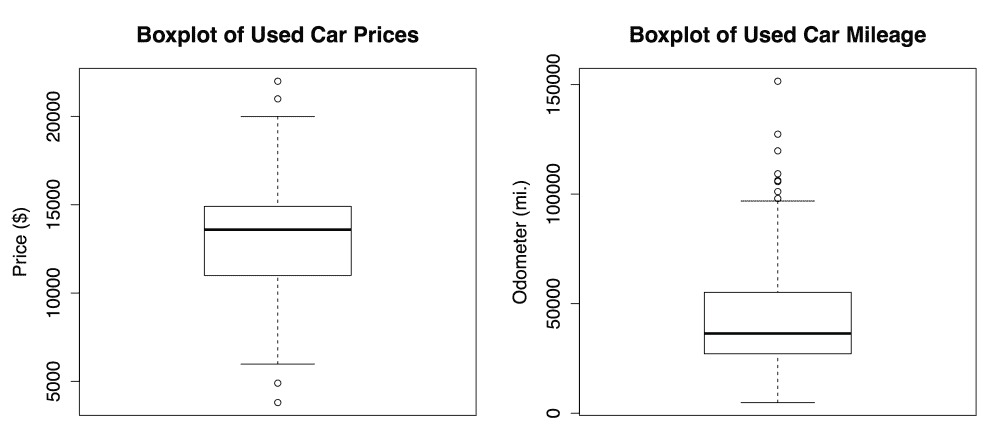
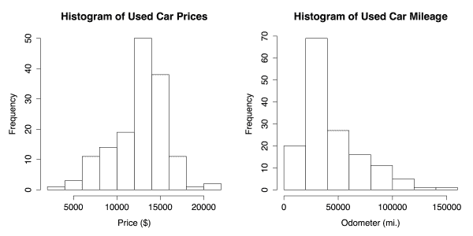
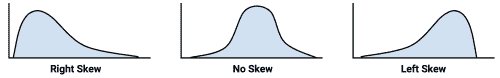
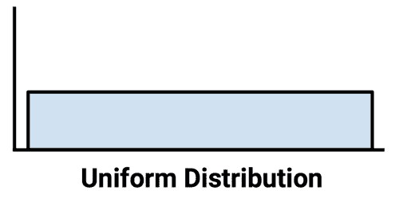
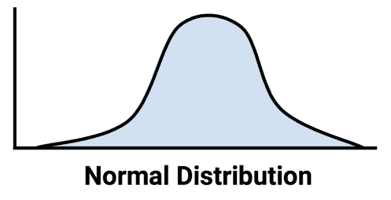
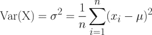
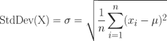
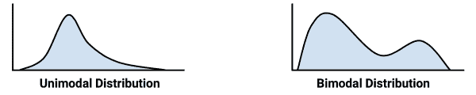
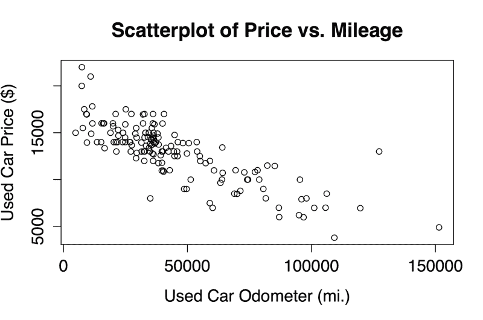
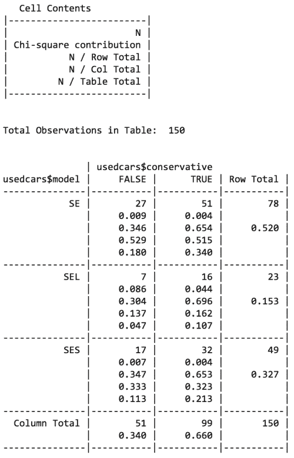

# 第二章。管理和理解数据

任何机器学习项目的早期关键组成部分都涉及管理和理解数据。虽然这可能不像构建和部署模型那样令人满意——在这个阶段，您开始看到您的劳动成果——但忽略这一重要的准备工作是不明智的。

任何学习算法都取决于它的输入数据，在许多情况下，输入数据是复杂的、杂乱的，并且分布在多个来源和格式中。由于这种复杂性，通常在机器学习项目中投入的最大部分精力都花在了数据准备和探索上。

本章从三个方面探讨了这些主题。第一部分讨论了 R 用来存储数据的基本数据结构。当您创建和操作数据集时，您将会非常熟悉这些结构。第二部分是实用的，因为它涵盖了几个有助于将数据导入和导出 r 的函数。在第三部分中，说明了在探索真实世界的数据集时理解数据的方法。

本章结束时，你会明白:

*   如何使用 R 的基本数据结构来存储和提取数据
*   将普通源格式的数据转换成 R 格式的简单函数
*   理解和可视化复杂数据的典型方法

因为 R 思考数据的方式将定义您处理数据的方式，所以在直接进入数据准备之前了解 R 的数据结构是有帮助的。但是，如果您已经熟悉 R 编程，可以直接跳到数据预处理一节。

# R 数据结构

在编程语言中有无数种类型的数据结构，每一种都有适合特定任务的优点和缺点。因为 R 是一种广泛用于统计数据分析的编程语言，所以它所使用的数据结构是在考虑到这种工作的情况下设计的。

机器学习中最常用的 R 数据结构是向量、因子、列表、数组和矩阵、数据帧。每一个都是为特定的数据管理任务定制的，这使得理解它们在 R 项目中如何交互变得非常重要。在接下来的部分中，我们将回顾它们的相似之处和不同之处。

## 矢量

基本的 R 数据结构是**向量**，它存储一组有序的值，称为**元素**。一个向量可以包含任意数量的元素，但是所有的元素必须是相同的**类型**的值。例如，向量不能同时包含数字和文本。要确定矢量`v`的类型，使用`typeof(v)`命令。

几种向量类型是机器学习中常用的:`integer`(无小数的数字)`double`(有小数的数字)`character`(文本数据)`logical` ( `TRUE`或`FALSE`值)。还有两个特殊值:`NULL`，用于表示没有任何值，以及`NA`，表示缺少值。

### 提示

一些 R 函数将把`integer`和`double`向量都报告为`numeric`，而其他函数将区分这两者。因此，虽然所有的`double`向量都是`numeric`，但并不是所有的`numeric`向量都是`double`类型。

手动输入大量数据很繁琐，但可以使用`c()`合并功能创建小矢量。还可以使用`<-`箭头操作符给向量命名，这是 R 赋值的方式，很像在许多其他编程语言中使用的`=`赋值操作符。

例如，让我们构造几个向量来存储三个医疗病人的诊断数据。我们将创建一个名为`subject_name`的`character`向量来存储三个病人的名字，一个名为`temperature`的`double`向量来存储每个病人的体温，一个名为`flu_status`的逻辑向量来存储每个病人的诊断结果(如果他或她患了流感，则为`TRUE`，否则为`FALSE`)。让我们看一下创建这三个向量的代码:

```
> subject_name <- c("John Doe", "Jane Doe", "Steve Graves")
> temperature <- c(98.1, 98.6, 101.4)
> flu_status <- c(FALSE, FALSE, TRUE)

```

因为 R 向量本身是有序的，所以可以通过计算集合中项目的编号来访问记录，从 1 开始，在向量名称后用方括号(即`[`和`]`)将该编号括起来。例如，要获得病人 Jane Doe 的体温(`temperature`向量中的第二个元素),只需输入:

```
> temperature[2]
[1] 98.6

```

r 提供了多种方便的方法来从向量中提取数据。使用(`:`)冒号运算符可以获得一系列值。例如，要获得 Jane Doe 和 Steve Graves 的体温，请键入:

```
> temperature[2:3]
[1] 98.6 101.4

```

可以通过指定负的物料编号来排除物料。要排除 Jane Doe 的`temperature`数据，请键入:

```
> temperature[-2]
[1]  98.1 101.4

```

最后，有时指定一个逻辑向量来指示是否应该包含每一项也是有用的。例如，要包括前两个`temperature`读数，但排除第三个读数，请键入:

```
> temperature[c(TRUE, TRUE, FALSE)]
[1] 98.1 98.6

```

很快您就会看到，vector 为许多其他 R 数据结构提供了基础。因此，各种向量运算的知识对于在 r。

### 提示

**下载示例代码**

您可以从您在[http://www.packtpub.com](http://www.packtpub.com)的账户下载您购买的所有 Packt 书籍的示例代码文件。如果你在别处购买了这本书，你可以访问 http://www.packtpub.com/support 并注册，文件会直接通过电子邮件发送给你。

这是本书第二版的新内容，示例代码也可以通过 GitHub 在 https://github.com/dataspelunking/MLwR/[获得。在这里查看最新的 R 代码，以及问题跟踪和公共 wiki。请加入社区！](https://github.com/dataspelunking/MLwR/)

## 因素

如果你还记得[第一章](ch01.html "Chapter 1. Introducing Machine Learning")、*介绍机器学习*中的，用值的类别来表示特征的特性被称为**名义**。虽然可以使用一个字符向量来存储名义数据，但是 R 提供了一个专门用于此目的的数据结构。一个**因子**是一个特殊的向量，仅用于表示分类或顺序变量。在我们正在构建的医疗数据集中，我们可能会使用一个因子来表示性别，因为它使用了两个类别:`MALE`和`FEMALE`。

为什么不用字符向量？因子的一个优点是类别标签只存储一次。例如，计算机可以存储`1`、`1`、`2`，而不是存储`MALE`、`MALE`、`FEMALE`，这减少了存储相同信息所需的内存大小。此外，许多机器学习算法以不同的方式对待名义数据和数字数据。通常需要编码为因子来通知 R 函数以适当地处理分类数据。

### 提示

因子不应该用于不是真正分类的字符向量。如果向量存储的主要是唯一值，如名称或标识字符串，则将其作为字符向量。

要从一个字符向量创建一个因子，只需应用`factor()`函数。例如:

```
> gender <- factor(c("MALE", "FEMALE", "MALE"))
> gender
[1] MALE   FEMALE MALE
Levels: FEMALE MALE

```

注意，当显示 John Doe 和 Jane Doe 的性别数据时，R 打印了关于`gender`因子的附加信息。`levels`变量包含了`factor`可能采用的类别集合，在本例中为:`MALE`或`FEMALE`。

当我们创建因子时，我们可以添加可能不会出现在数据中的额外级别。假设我们为血型添加了另一个因素，如下例所示:

```
> blood <- factor(c("O", "AB", "A"),
 levels = c("A", "B", "AB", "O"))
> blood[1:2]
[1] O  AB
Levels: A B AB O

```

请注意，当我们为三名患者定义`blood`因子时，我们使用`levels`参数指定了四种可能血型的附加向量。因此，尽管我们的数据只包含类型`O`、`AB`和`A`，但所有四种类型都存储有输出所指示的`blood`因子。存储额外的水平允许将来添加其他血型的数据的可能性。这也确保了如果我们要创建一个血型表，我们将知道`B`血型的存在，尽管它没有被记录在我们的数据中。

因子数据结构还允许我们包含关于一个名义变量的类别顺序的信息，这提供了一种存储顺序数据的便利方式。以为例，假设我们有一个患者的`symptoms`的严重程度数据，按照从轻度到中度再到重度的严重程度递增级别进行编码。我们通过以所需的顺序提供因子的`levels`来指示序数数据的存在，从最低到最高按升序列出，并将`ordered`参数设置为`TRUE`，如下所示:

```
> symptoms <- factor(c("SEVERE", "MILD", "MODERATE"),
 levels = c("MILD", "MODERATE", "SEVERE"),
 ordered = TRUE)

```

产生的`symptoms`因子现在包含了我们请求的订单信息。与我们之前的因素不同，该因素的等级值由`<`符号分隔，以表示从轻微到严重的顺序:

```
> symptoms
[1] SEVERE   MILD     MODERATE
Levels: MILD < MODERATE < SEVERE

```

有序因素的一个有用的特性是逻辑测试如你所愿地工作。例如，我们可以测试每个患者的症状是否大于中度:

```
> symptoms > "MODERATE"
[1]  TRUE FALSE FALSE

```

能够对有序数据建模的机器学习算法将期望有序因子，因此请确保相应地对您的数据进行编码。

## 列表

一个**列表**是一个数据结构，很像一个向量，因为它用于存储一组有序的元素。然而，当一个 vector 要求它的所有元素都是相同类型时，list 允许收集不同类型的元素。由于这种灵活性，列表通常用于存储各种类型的输入和输出数据以及机器学习模型的配置参数集。

为了说明列表，考虑我们已经用存储在六个向量中的三个患者的数据构建的医疗患者数据集。如果我们想显示 John Doe(主题 1)的所有数据，我们需要输入五个 R 命令:

```
> subject_name[1]
[1] "John Doe"
> temperature[1]
[1] 98.1
> flu_status[1]
[1] FALSE
> gender[1]
[1] MALE
Levels: FEMALE MALE
> blood[1]
[1] O
Levels: A B AB O
> symptoms[1]
[1] SEVERE
Levels: MILD < MODERATE < SEVERE

```

显示一个病人的医疗数据似乎需要做大量的工作。列表结构允许我们将患者的所有数据分组到一个可以重复使用的对象中。

与使用`c()`创建向量类似，使用`list()`函数创建一个列表，如下例所示。一个显著的区别是，当构造一个列表时，序列中的每个组件几乎总是有一个名称。名称在技术上不是必需的，但是允许以后通过名称而不是通过编号的位置来访问列表的值。要为第一个患者的所有数据创建包含命名组件的列表，请键入以下内容:

```
> subject1 <- list(fullname = subject_name[1],
 temperature = temperature[1],
 flu_status = flu_status[1],
 gender = gender[1],
 blood = blood[1],
 symptoms = symptoms[1])

```

该患者的数据现已收集在`subject1`列表中:

```
> subject1
$fullname
[1] "John Doe"

$temperature
[1] 98.1

$flu_status
[1] FALSE

$gender
[1] MALE
Levels: FEMALE MALE

$blood
[1] O
Levels: A B AB O

$symptoms
[1] SEVERE
Levels: MILD < MODERATE < SEVERE

```

请注意，这些值标有我们在前面的命令中指定的名称。但是，仍然可以使用类似于 vector 的方法来访问列表。要访问`temperature`值，使用以下命令:

```
> subject1[2]
$temperature
[1] 98.1

```

在 list 对象上使用 vector 样式操作符的结果是另一个 list 对象，它是原始 list 的子集。例如，前面的代码返回了一个只有一个`temperature`组件的列表。要以其本地数据类型返回单个列表项，请在尝试选择列表组件时使用双括号(`[[`和`]]`)。例如，下面返回一个长度为 1 的数字向量:

```
> subject1[[2]]
[1] 98.1

```

为了清楚起见，直接访问列表组件通常更容易，方法是在列表组件的名称后面附加一个`$`和值的名称，如下所示:

```
> subject1$temperature
[1] 98.1

```

像双括号符号一样，它以本地数据类型返回列表组件(在本例中，是一个长度为 1 的数字向量)。

### 提示

通过名称访问值还可以确保检索到正确的项目，即使列表元素的顺序后来发生了变化。

通过指定名称向量，可以在一个列表中获得几个项目。下面返回了`subject1`列表的一个子集，其中只包含了`temperature`和`flu_status`组件:

```
> subject1[c("temperature", "flu_status")]
$temperature
[1] 98.1

$flu_status
[1] FALSE

```

可以使用列表和列表的列表来构建整个数据集。例如，您可以考虑创建一个`subject2`和`subject3`列表，并将它们合并成一个名为`pt_data`的列表对象。然而，以这种方式构造数据集是很常见的，R 提供了一个专门用于这项任务的专用数据结构。

## 数据帧

到目前为止，机器学习中使用的最重要的 R 数据结构是数据帧，这是一种类似于电子表格或数据库的结构，因为它既有数据行也有数据列。在 R 术语中，数据帧可以被理解为向量或因子的列表，每个向量或因子具有完全相同数量的值。因为数据框实际上是矢量类型对象的列表，所以它结合了矢量和列表的各个方面。

让我们为患者数据集创建一个数据框。使用我们之前创建的患者数据向量，`data.frame()`功能将它们组合成一个数据帧:

```
> pt_data <- data.frame(subject_name, temperature, flu_status,
 gender, blood, symptoms, stringsAsFactors = FALSE)

```

您可能会注意到前面代码中的一些新内容。我们包括了一个额外的参数:`stringsAsFactors = FALSE`。如果我们不指定这个选项，R 会自动将每个字符向量转换成一个因子。

这个特性偶尔有用，但有时也是不必要的。例如，这里的`subject_name`字段肯定不是分类数据，因为名称不是值的类别。因此，将`stringsAsFactors`选项设置为`FALSE`允许我们仅在对项目有意义的情况下将字符向量转换为因子。

当我们显示`pt_data`数据框时，我们看到该结构与我们之前使用的数据结构非常不同:

```
> pt_data
 subject_name temperature flu_status gender blood symptoms
1     John Doe        98.1      FALSE   MALE     O   SEVERE
2     Jane Doe        98.6      FALSE FEMALE    AB     MILD
3 Steve Graves       101.4       TRUE   MALE     A MODERATE

```

与一维向量、因子和列表相比，数据框具有两个维度，并以矩阵格式显示。这个特定的数据框对于每个患者数据向量有一列，对于每个患者有一行。在机器学习术语中，数据框的列是要素或属性，行是示例。

要提取整列(向量)数据，我们可以利用数据帧只是向量列表这一事实。与列表类似，提取单个元素最直接的方法是通过名称引用它。例如，要获得`subject_name`向量，请键入:

```
> pt_data$subject_name
[1] "John Doe"     "Jane Doe"     "Steve Graves"

```

与列表类似，名称向量可用于从数据框中提取几列:

```
> pt_data[c("temperature", "flu_status")]
 temperature flu_status
1        98.1      FALSE
2        98.6      FALSE
3       101.4       TRUE

```

当我们以这种方式访问数据帧时，结果是数据帧包含所有请求列的所有数据行。或者，`pt_data[2:3]`命令也将提取`temperature`和`flu_status`列。但是，按名称请求列会产生一个清晰且易于维护的 R 代码，如果将来数据帧被重构，这个代码也不会中断。

为了提取数据框中的值，使用了类似于访问向量中的值的方法。然而，有一个重要的例外。因为数据框是二维的，所以必须指定要提取的所需行和列。首先指定行，后跟逗号，然后是列，格式如下:`[rows, columns]`。与向量一样，行和列从 1 开始计数。

例如，要提取患者数据帧的第一行第二列中的值(John Doe 的`temperature`值)，使用以下命令:

```
> pt_data[1, 2]
[1] 98.1

```

如果您喜欢多行或多列数据，请为所需的行和列指定向量。以下命令将从第一行和第三行以及第二列和第四列提取数据:

```
> pt_data[c(1, 3), c(2, 4)]
 temperature gender
1        98.1   MALE
3       101.4   MALE

```

要提取所有的行或列，只需将行或列部分留空。例如，要提取第一列的所有行:

```
> pt_data[, 1]
[1] "John Doe"     "Jane Doe"     "Steve Graves"

```

要提取第一行的所有列，请使用以下命令:

```
> pt_data[1, ]
 subject_name temperature flu_status gender blood symptoms
1     John Doe        98.1      FALSE   MALE     O   SEVERE

```

要提取所有内容，请使用以下命令:

```
> pt_data[ , ]
 subject_name temperature flu_status gender blood symptoms
1     John Doe        98.1      FALSE   MALE     O   SEVERE
2     Jane Doe        98.6      FALSE FEMALE    AB     MILD
3 Steve Graves       101.4       TRUE   MALE     A MODERATE

```

访问列表和向量中的值的其他方法也可用于检索数据框行和列。例如，可以通过名称而不是位置来访问列，并且可以使用负号来排除数据的行或列。因此，以下命令:

```
> pt_data[c(1, 3), c("temperature", "gender")]

```

相当于:

```
> pt_data[-2, c(-1, -3, -5, -6)]

```

为了更加熟悉数据框，尝试对患者数据集进行类似的操作，或者更好的是，使用您自己项目中的数据。这些类型的操作对于我们在接下来的章节中要做的大部分工作是至关重要的。

## 矩阵和阵列

除了数据帧，R 还提供了其他以表格形式存储值的结构。一个**矩阵**是一个数据结构，表示一个具有数据行和列的二维表格。像向量一样，R 矩阵可以包含任何一种类型的数据，尽管它们最常用于数学运算，因此通常只存储数字数据。

要创建一个矩阵，只需向`matrix()`函数提供一个数据向量，以及一个指定行数(`nrow`)或列数(`ncol`)的参数。例如，要创建一个存储数字 1 到 4 的 2 x 2 矩阵，我们可以使用`nrow`参数请求将数据分成两行:

```
> m <- matrix(c(1, 2, 3, 4), nrow = 2)
> m
 [,1] [,2]
[1,]    1    3
[2,]    2    4

```

这相当于使用`ncol = 2`生成的矩阵:

```
> m <- matrix(c(1, 2, 3, 4), ncol = 2)
> m
 [,1] [,2]
[1,]    1    3
[2,]    2    4

```

您会注意到 R 在加载第二列之前首先加载了矩阵的第一列。这被称为**列主顺序**，是 R 加载矩阵的默认方法。

### 提示

要覆盖此默认设置并按行加载矩阵，请在创建矩阵时设置参数`byrow = TRUE`。

为了进一步说明,让我们看看如果我们给矩阵增加更多的值会发生什么。

有六个值，请求两行创建一个有三列的矩阵:

```
> m <- matrix(c(1, 2, 3, 4, 5, 6), nrow = 2)
> m
 [,1] [,2] [,3]
[1,]    1    3    5
[2,]    2    4    6

```

请求两列会创建一个三行矩阵:

```
> m <- matrix(c(1, 2, 3, 4, 5, 6), ncol = 2)
> m
 [,1] [,2]
[1,]    1    4
[2,]    2    5
[3,]    3    6

```

与数据帧一样，矩阵中的值可以使用`[row, column]`符号提取。例如，`m[1, 1]`将返回值`1`，而`m[3, 2]`将从`m`矩阵中提取`6`。此外，可以请求整行或整列:

```
> m[1, ]
[1] 1 4
> m[, 1]
[1] 1 2 3

```

与矩阵结构密切相关的是**数组**，这是一个多维数据表。矩阵有值的行和列，数组有值的行、列和任意数量的附加层。虽然在接下来的章节中我们会偶尔用到矩阵，但是数组的使用超出了本书的范围。


# 用 R 管理数据

处理大规模数据集面临的挑战之一是收集、准备和管理来自各种来源的数据。虽然我们将在后面的章节中通过处理真实世界的机器学习任务来深入讨论数据准备、数据清理和数据管理，但是本节将重点介绍将数据输入和输出 r 的基本功能。

## 保存、加载和删除 R 数据结构

当你花了很多时间将一个数据帧转换成想要的格式时，你不需要每次重启 R 会话时都重新创建你的工作。要将一个数据结构保存到一个文件中，以便以后重新加载或传输到另一个系统，使用`save()`功能。`save()`函数将一个或多个 R 数据结构写入由`file`参数指定的位置。r 数据文件的扩展名为`.RData`。

假设您有三个名为`x`、`y`和`z`的对象，您希望将它们保存在一个永久文件中。不管它们是向量、因子、列表还是数据帧，我们都可以使用以下命令将它们保存到一个名为`mydata.RData`的文件中:

```
> save(x, y, z, file = "mydata.RData")

```

`load()`命令可以重新创建任何保存到`.RData`文件的数据结构。要加载我们在前面的代码中保存的`mydata.RData`文件，只需键入:

```
> load("mydata.RData")

```

这将重新创建`x`、`y`和`z`数据结构。

### 提示

小心你装的东西！使用`load()`命令导入的文件中存储的所有数据结构将被添加到您的工作区，即使它们覆盖了您正在处理的其他内容。

如果您需要快速结束您的 R 会话，`save.image()`命令会将您的整个会话写入一个名为`.RData`的文件。默认情况下，R 将在您下次启动 R 时查找这个文件，并且您的会话将像您离开时一样被重新创建。

在 R 会话上工作一段时间后，您可能已经积累了许多数据结构。`ls()`列表函数返回当前内存中所有数据结构的向量。例如，如果您一直遵循本章中的代码，`ls()`函数将返回以下内容:

```
> ls()
[1] "blood"        "flu_status"   "gender"       "m" 
[5] "pt_data"      "subject_name" "subject1"     "symptoms" 
[9] "temperature"

```

r 将在退出会话时自动从内存中删除这些数据，但是对于大型数据结构，您可能希望尽快释放内存。`rm()`移除功能可用于此目的。例如，要消除`m`和`subject1`对象，只需键入:

```
> rm(m, subject1)

```

`rm()`函数也可以提供一个字符向量来表示要删除的对象名称。这与`ls()`函数一起清除整个 R 会话:

```
> rm(list=ls())

```

在执行前面的命令时要非常小心，因为在您的对象被移除之前不会提示您！

## 从 CSV 文件导入和保存数据

公共数据集存储在文本文件中是非常常见的。文本文件几乎可以在任何计算机或操作系统上阅读，这使得这种格式几乎是通用的。它们还可以从 Microsoft Excel 等程序中导出和导入，从而提供了一种快速而简单的处理电子表格数据的方法。

一个**表格**(如“表格”)数据文件以矩阵形式构成，这样每行文本反映一个例子，并且每个例子具有相同数量的特征。每行上的特征值由预定义的符号分隔，称为**分隔符**。通常，表格数据文件的第一行列出数据列的名称。这条被称为**割台**线。

也许最常见的表格文本文件格式是 **CSV** ( **逗号分隔值**)文件，顾名思义，它使用逗号作为分隔符。CSV 文件可以导入和导出许多常见的应用。表示先前构建的医疗数据集的 CSV 文件可以存储为:

```
subject_name,temperature,flu_status,gender,blood_type
John Doe,98.1,FALSE,MALE,O
Jane Doe,98.6,FALSE,FEMALE,AB
Steve Graves,101.4,TRUE,MALE,A
```

给定位于 R 工作目录中的名为`pt_data.csv`的患者数据文件，可以使用`read.csv()`函数将文件加载到 R:

```
> pt_data <- read.csv("pt_data.csv", stringsAsFactors = FALSE)

```

这将把 CSV 文件读入名为`pt_data`的数据帧。正如我们之前在构建数据框时所做的那样，我们需要使用`stringsAsFactors = FALSE`参数来防止 R 将所有文本变量转换成因子。这一步最好留给你来完成，而不是 R。

### 提示

如果数据集位于 R 工作目录之外，那么在调用`read.csv()`函数时，可以使用 CSV 文件的完整路径(例如`/path/to/mydata.csv`)。

默认情况下，R 假设 CSV 文件包含一个标题行，其中列出了数据集中的要素名称。如果一个 CSV 文件没有标题，指定选项`header = FALSE`，如下面的命令所示，R 将在`V1`和`V2`表单中分配默认的特征名称，依此类推:

```
> mydata <- read.csv("mydata.csv", stringsAsFactors = FALSE, 
 header = FALSE)

```

`read.csv()`函数是`read.table()`函数的特例，它可以读取多种不同形式的表格数据，包括其他分隔格式，如**制表符分隔值** ( **TSV** )。关于`read.table()`系列功能的更多详细信息，使用`?read.table`命令参考至 R 帮助页面。

使用`write.csv()`功能将数据框保存为 CSV 文件。如果您的数据框名为`pt_data`，只需输入:

```
> write.csv(pt_data, file = "pt_data.csv", row.names = FALSE)

```

这将把一个名为`pt_data.csv`的 CSV 文件写入 R 工作文件夹。`row.names`参数覆盖了 R 的默认设置，即输出 CSV 文件中的行名。除非已将行名添加到数据框中，否则此输出是不必要的，只会增加结果文件的大小。


# 探索和理解数据

在收集了数据并将其加载到 R 的数据结构中后，机器学习过程的下一步涉及详细检查数据。在此步骤中，您将开始探索数据的特征和示例，并认识到使您的数据独一无二的特性。你越了解你的数据，你就越能更好地将机器学习模型与你的学习问题相匹配。

学习数据探索过程的最好方法是通过一个例子。在本节中，我们将探索`usedcars.csv`数据集，它包含最近在一个流行的美国网站上做广告出售的二手车的实际数据。

### 提示

`usedcars.csv`数据集可在本书的 Packt Publishing 支持页面上下载。如果您按照示例进行操作，请确保该文件已经下载并保存到您的 R 工作目录中。

由于数据集是以 CSV 形式存储的，我们可以使用`read.csv()`函数将数据加载到 R 数据框中:

```
> usedcars <- read.csv("usedcars.csv", stringsAsFactors = FALSE)

```

给定`usedcars`数据框架，我们现在将承担数据科学家的角色，其任务是理解二手车数据。尽管数据探索是一个流动的过程，但是可以将这些步骤想象成一种调查，在调查中回答关于数据的问题。具体的问题可能因项目而异，但问题的类型总是相似的。您应该能够对您喜欢的任何数据集(无论大小)调整该调查的基本步骤。

## 探索数据的结构

在调查新数据集时，首先要问的问题之一应该是数据集是如何组织的。如果幸运的话，您的数据源将提供一个 **数据字典**，这是一个描述数据集特性的文档。在我们的例子中，二手车数据没有附带这个文档，所以我们需要自己创建一个。

`str()`函数提供了一种显示 R 数据结构的方法，比如数据帧、向量或列表。它可以用来创建我们的数据字典的基本轮廓:

```
> str(usedcars)
'data.frame':   150 obs. of 6 variables:
 $ year        : int  2011 2011 2011 2011 ...
 $ model       : chr  "SEL" "SEL" "SEL" "SEL" ...
 $ price       : int  21992 20995 19995 17809 ...
 $ mileage     : int  7413 10926 7351 11613 ...
 $ color       : chr  "Yellow" "Gray" "Silver" "Gray" ...
 $ transmission: chr  "AUTO" "AUTO" "AUTO" "AUTO" ...

```

使用这样一个简单的命令，我们可以了解关于数据集的大量信息。语句`150 obs`告诉我们，数据包括 150 个**观察值**，这只是数据集包含 150 个记录或示例的另一种说法。观测值的个数往往被简单地缩写为 *n* 。既然我们知道数据描述的是二手车，我们现在可以假设我们有 *n = 150* 辆汽车要出售。

`6 variables`语句指的是记录在数据中的六个特征。这些功能在单独的行中按名称列出。查看名为`color`的特性行，我们可以注意到一些额外的细节:

```
$ color       : chr  "Yellow" "Gray" "Silver" "Gray" ...

```

在变量名之后，`chr`标签告诉我们该特征是`character`类型。在这个数据集中，三个变量是字符型的，三个标注为`int`，表示`integer`类型。尽管`usedcars`数据集只包含`character`和`integer`变量，但在使用非整数数据时，您也可能会遇到`num`或`numeric`类型。任何因素都会被列为`factor`类型。根据每个变量的类型，R 表示前几个特征值的序列。值`"Yellow" "Gray" "Silver" "Gray"`是`color`特征的前四个值。

将一点主题领域的知识应用于特性名称和值，允许我们对变量代表什么做出一些假设。`year`变量可以指车辆制造的年份，也可以指定广告发布的年份。我们将在后面更详细地研究这个特性，因为四个示例值(`2011 2011 2011 2011`)可以用来论证这两种可能性。`model`、`price`、`mileage`、`color`和`transmission`变量最有可能指的是待售汽车的特征。

尽管我们的数据似乎被赋予了有意义的变量名，但情况并非总是如此。有时数据集的特征具有无意义的名称或代码，如`V1`。在这些情况下，可能有必要进行额外的调查，以确定某个特征实际上代表了什么。尽管如此，即使有了有用的特性名称，对提供给你的标签持怀疑态度总是谨慎的。让我们进一步调查。

## 探索数字变量

为了调查二手车数据中的数字变量，我们将采用一组通用测量值来描述称为**汇总统计**的值。`summary()`功能显示几种常见的汇总统计数据。让我们来看一个单独的特性，`year`:

```
> summary(usedcars$year)
 Min.  1st Qu.  Median    Mean 3rd Qu.    Max.
 2000     2008     2009    2009   2010    2012

```

即使您还不熟悉汇总统计数据，您也可以从`summary()`输出之前的标题中猜出其中一些。暂时忽略这些值的含义，我们看到诸如`2000`、`2008`和`2009`这样的数字的事实可能会使我们相信`year`变量表示的是制造年份，而不是广告发布的年份，因为我们知道这些车辆是最近上市销售的。

我们还可以使用 `summary()`函数同时获得几个`numeric`变量的汇总统计数据:

```
> summary(usedcars[c("price", "mileage")])
 price           mileage 
 Min.   : 3800   Min.   :  4867 
 1st Qu.:10995   1st Qu.: 27200 
 Median :13592   Median : 36385 
 Mean   :12962   Mean   : 44261 
 3rd Qu.:14904   3rd Qu.: 55125 
 Max.   :21992   Max.   :151479

```

`summary()`函数提供的六个汇总统计数据是调查数据的简单而强大的工具。它们可以分为两种类型:中心测量和扩散测量。

### 测量集中趋势——平均值和中位数

**集中趋势的度量**是一类统计数据，用于识别位于一组数据中间的值。你很可能已经熟悉了一个常用的衡量标准:平均值。在一般情况下，当某样东西被认为是一般的，它就落在天平的两端之间。一个普通学生的分数可能落在他或她的同学中间；平均体重既不特别轻也不特别重。一个普通的物品是典型的，并且与组中的其他物品没有太大的不同。你可能会认为它是一个范例，所有其他人都是根据这个范例来判断的。

在统计学中，平均值也被称为**平均值**，它是一种测量方法，定义为所有值的总和除以值的数量。例如，要计算收入分别为 36，000 美元、44，000 美元和 56，000 美元的三人组的平均收入，请使用以下命令:

```
> (36000 + 44000 + 56000) / 3
[1] 45333.33

```

r 还提供了一个`mean()`函数，它计算数字向量的平均值:

```
> mean(c(36000, 44000, 56000))
[1] 45333.33

```

这群人的平均收入约为 45333 美元。从概念上讲，这可以想象为每个人的收入，如果总收入平均分配给每个人。

回想一下，前面的`summary()`输出列出了`price`和`mileage`变量的平均值。平均值表明，该数据集中的典型二手车标价为 12，962 美元，里程表读数为 44，261。关于我们的数据，这告诉了我们什么？由于平均价格相对较低，我们可能期望数据集包含经济舱汽车。当然，数据也可以包括高里程的新型豪华车，但相对较低的平均里程统计并没有提供证据来支持这个假设。另一方面，它也没有提供忽略这种可能性的证据。当我们进一步检查数据时，我们需要记住这一点。

尽管平均值是迄今为止最常引用的测量数据集中心的统计数据，但它并不总是最合适的。另一个常用的集中趋势度量是**中值**，它是一个有序值列表中出现的中间值。与均值一样，R 提供了一个`median()`函数，我们可以将它应用于我们的工资数据，如下例所示:

```
> median(c(36000, 44000, 56000))
[1] 44000

```

因为中间值是`44000`，收入中位数是 44000 美元。

### 提示

如果数据集有偶数个值，则没有中间值。在这种情况下，中值通常计算为有序列表中心的两个值的平均值。例如，值 1、2、3 和 4 的中值是 2.5。

乍一看，中间值和平均值似乎是非常相似的度量。当然，45，333 美元的平均值和 44，000 美元的中值差别不大。为什么有两个集中趋势的措施？原因是平均值和中值受范围远端值的影响不同。特别是，平均值对**异常值**或相对于大多数数据异常高或低的值高度敏感。因为平均值对异常值很敏感，所以它更有可能被少量的极值上移或下移。

再次回忆一下二手车数据集的`summary()`输出中报告的中值。尽管平均价格和中间价格非常相似(相差大约 5%)，但里程的平均价格和中间价格之间的差异要大得多。就里程数而言，44，261 英里的平均值比 36，385 英里的中值高出约 20%。由于平均值比中值对极值更敏感，平均值比中值高得多的事实可能会让我们怀疑数据集中有一些里程值极高的二手车。为了进一步研究这个问题，我们需要在我们的分析中添加额外的汇总统计数据。

### 测量分布——四分位数和五位数汇总

测量平均值和中值提供了一种快速汇总数值的方法，但是这些中间值的测量值并不能告诉我们测量值中是否存在差异。为了测量多样性，我们需要使用另一种类型的汇总统计，这种统计与数据的**分布**有关，或者值的间隔有多紧或多松。了解价差可以提供数据的高点和低点，以及大多数值是否与平均值和中值相似。

**五个数字的摘要**是一组五个统计数据，粗略描述了特性值的分布。所有五个统计数据都包含在`summary()`函数的输出中。按顺序排列，它们是:

1.  最小(`Min.`)
2.  第一个四分位数，或 Q1 ( `1st Qu.`)
3.  中位数，或 Q2 ( `Median`)
4.  第三个四分位数，或 Q3 ( `3rd Qu.`)
5.  最大值(`Max.`)

如您所料，最小值和最大值是最极端的特征值，分别表示最小值和最大值。r 提供了`min()`和`max()`函数来计算数据向量上的这些值。

最小值和最大值之间的跨度称为**范围**。在 R 中，`range()`函数返回最小值和最大值。将`range()`与`diff()`差分函数结合起来，您可以用一行代码检查数据范围:

```
> range(usedcars$price)
[1]  3800 21992
> diff(range(usedcars$price))
[1] 18192

```

第一个和第三个四分位数(Q1 和 Q3)是指低于或高于四分之一的值。与(Q2)中位数一起，**四分位数**将数据集分成四个部分，每个部分具有相同数量的值。

四分位数是一种特殊的统计类型，称为**分位数**，它是将数据分成相同大小数量的数字。除了四分位数，常用的分位数还包括**三分位数**(三份)**五分位数**(五份)**十分位数** (10 份)**百分位数** (100 份)。

### 提示

百分位数通常用来描述一个值的等级；例如，一个考试分数排在第 99 百分位数的学生比 99%的其他考生表现得更好，或者相当于 99%。

第一个四分位数和第三个四分位数之间的中间 50%的数据特别令人感兴趣，因为它本身是一个简单的分布度量。Q1 与 Q3 之差称为**四分位距** ( **IQR** )，可以用`IQR()`函数计算:

```
> IQR(usedcars$price)
[1] 3909.5

```

我们也可以通过计算*14904–10995 = 3909*，从`usedcars$price`变量的`summary()`输出中手工计算这个值。我们的计算和`IQR()`输出之间的微小差异是由于 R 自动舍入`summary()`输出。

`quantile()`函数提供了一个强大的工具来识别一组值的分位数。默认情况下，`quantile()`函数返回五个数字的摘要。将该函数应用于二手车数据会产生与前面相同的统计结果:

```
> quantile(usedcars$price)
 0%     25%     50%     75%    100% 
 3800.0 10995.0 13591.5 14904.5 21992.0

```

### 提示

在计算分位数时，有许多方法可以处理没有中间值的值和数据集之间的关系。通过指定`type`参数，`quantile()`功能允许您在九种不同的算法中进行指定。如果您的项目需要精确定义的分位数，使用`?quantile`命令阅读函数文档是很重要的。

如果我们使用一个表示分界点的向量来指定一个额外的`probs`参数，我们可以获得任意的分位数，例如第 1 个^(和第 99 个^(百分位数:))

```
> quantile(usedcars$price, probs = c(0.01, 0.99))
 1%      99% 
 5428.69 20505.00

```

`seq()`函数用于生成等间距值的向量。这使得获取其他数据片段变得容易，例如五分位数(五个组)，如以下命令所示:

```
> quantile(usedcars$price, seq(from = 0, to = 1, by = 0.20))
 0%     20%     40%     60%     80%    100% 
 3800.0 10759.4 12993.8 13992.0 14999.0 21992.0

```

配备了一个了解五数汇总，我们就可以重新审视二手车`summary()`产量了。在`price`变量上，最低为 3800 美元，最高为 21992 美元。有趣的是，最小值和 Q1 之间的差异约为 7000 美元，Q3 和最大值之间的差异也是如此；然而，从 Q1 到第三季度的中位数的差异大约是 2000 美元。这表明，较低和较高的 25%的值比中间的 50%的值更分散，中间的 50%的值似乎更紧密地集中在中心周围。我们在`mileage`变量上看到了类似的趋势，这并不奇怪。正如您将在本章后面了解到的，这种分布模式非常普遍，它被称为数据的“正态”分布。

`mileage`变量的分布还展示了另一个有趣的特性:Q3 和最大值之间的差异远远大于最小值和 Q1 之间的差异。换句话说，较大的值比较小的值分散得多。

这一发现解释了为什么平均值比中位数大得多。因为平均值对极端值敏感，所以它被拉得更高，而中间值相对保持在同一位置。这是一个重要的属性，当数据以可视化方式呈现时，这一点变得更加明显。

### 可视化数值变量–箱线图

可视化数字变量有助于诊断数据问题。五个数字汇总的常见可视化是**盒状图**，也称为**盒须图**。箱线图以一种格式显示数值变量的中心和分布，这种格式允许您快速获得一个变量的范围和偏斜的感觉，或者将其与其他变量进行比较。

让我们来看看二手车价格和里程数据的箱线图。为了获得变量的箱线图，我们将使用`boxplot()`函数。我们还将指定一对额外的参数，`main`和`ylab`，分别为图添加一个标题和标记 *y* 轴(垂直轴)。创建`price`和`mileage`箱线图的命令有:

```
> boxplot(usedcars$price, main="Boxplot of Used Car Prices",
 ylab="Price ($)")
> boxplot(usedcars$mileage, main="Boxplot of Used Car Mileage",
 ylab="Odometer (mi.)")

```

r 将产生如下数字:



方框图使用水平线和圆点描绘了五个数字的汇总值。当从底部到顶部阅读该图时，形成每个图中间的方框的水平线代表 Q1、Q2(中间值)和 Q3。中间值用黑线表示，纵轴上的 13，592 美元代表`price`和 36，385 英里。纵轴上为`mileage`。

### 提示

在简单的盒状图中，例如上图中的盒状图，盒状图和须状图的宽度是任意的，并不说明数据的任何特征。对于更复杂的分析，可以使用方框的形状和大小来促进几组数据的比较。要了解关于这些特性的更多信息，首先通过键入`?boxplot`命令检查 R `boxplot()`文档中的`notch`和`varwidth`选项。

最小值和最大值可以用延伸到盒子上下的触须来表示；然而，广泛使用的惯例只允许晶须延伸到 Q1 以下或 Q3 以上的 IQR 的 1.5 倍的最小值或最大值。任何超出此阈值的值都被视为异常值，用圆圈或圆点表示。例如，回想一下`price`变量的 IQR 是 3909，Q1 是 10995，Q3 是 14904。因此，异常值是指小于 *10995 - 1.5 * 3909= 5131.5* 或大于 *14904 + 1.5 * 3909 = 20767.5* 的任何值。

该图显示了高端和低端的两个异常值。在`mileage`箱线图上，低端没有异常值，因此底部晶须延伸至最小值 4867。在高端，我们看到一些超出 100，000 英里标记的异常值。这些异常值是我们早期发现的原因，我们注意到平均值远大于中值。

### 可视化数值变量–直方图

一个**直方图**是另一种方式来图形化描述一个数字变量的分布。它类似于箱线图，将变量值分成预定义数量的部分或**箱**作为值的容器。然而，他们的相似之处仅限于此。一方面，箱线图要求数据的四个部分必须包含相同数量的值，并根据需要扩大或缩小容器。另一方面，直方图使用相同宽度的任意数量的仓，但是允许仓包含不同数量的值。

我们可以使用`hist()`函数为二手车价格和里程数据创建一个直方图。正如我们对箱线图所做的那样，我们将使用`main`参数指定图形的标题，并用`xlab`参数标记 *x* 轴。创建直方图的命令有:

```
> hist(usedcars$price, main = "Histogram of Used Car Prices",
 xlab = "Price ($)")
> hist(usedcars$mileage, main = "Histogram of Used Car Mileage",
 xlab = "Odometer (mi.)")

```

这将生成下图:



直方图由一系列具有高度的条组成，指示落在划分值的每个等宽箱内的值的计数或**频率**。水平轴上标记的分隔条形的垂直线表示该条的值范围的起点和终点。

### 提示

您可能已经注意到，前面的直方图具有不同数量的条柱。这是因为`hist()`函数试图为变量范围确定合理数量的容器。如果你想覆盖这个默认值，使用`breaks`参数。提供一个像`breaks = 10`这样的整数将正好创建 10 个等宽的仓；提供一个像`c(5000, 10000, 15000, 20000)`这样的向量会创建在指定值处断开的容器。

在`price`柱状图上，10 根柱线中的每一根都跨越了 2，000 美元的区间，从 2，000 美元开始，到 22，000 美元结束。图中间最高的柱线覆盖了 12，000 美元到 14，000 美元的范围，频率为 50。因为我们知道我们的数据包括 150 辆汽车，所以我们知道所有汽车中有三分之一的价格在 12，000 美元到 14，000 美元之间。近 90 辆汽车——超过一半——的价格从 12000 美元到 16000 美元不等。

`mileage`直方图包括八个柱，每个柱表示 20，000 英里的柱，从 0 开始，到 160，000 英里结束。与价格直方图不同，最高的条形不在数据的中心，而是在图表的左侧。装在这个箱子里的 70 辆汽车的里程表读数在 20，000 到 40，000 英里之间。

您可能还注意到两个直方图的形状有些不同。二手车价格似乎倾向于平均分布在中间的两侧，而汽车里程数则进一步向右延伸。这种特性被称为**偏斜**，或者更确切地说是右偏斜，因为高端(右侧)的值远比低端(左侧)的值分散得多。如下图所示，倾斜数据的直方图看起来在一侧被拉伸:



快速诊断我们数据中的这种模式的能力是直方图作为数据探索工具的优势之一。随着我们开始研究数字数据的其他分布模式，这将变得更加重要。

### 了解数字数据——均匀分布和正态分布

描述中心和分布的直方图、箱线图和统计数据提供了检查变量值分布的方法。变量的**分布**描述了一个值落入不同范围的可能性。

如果所有的值出现的可能性相等，比如说，在一个记录了在一个公平的六面骰子上掷出的值的数据集中，这种分布被称为是**均匀的**。使用直方图很容易检测到均匀分布，因为条形的高度大致相同。当用直方图可视化时，它可能类似于下图:



需要注意的是，并非所有的随机事件都是一致的。例如，滚动一个加权的六面骰子会导致一些数字比其他数字出现得更频繁。虽然每次掷骰子都会产生一个随机选择的数字，但它们的可能性并不相同。

以二手车数据为例。这显然是不一致的，因为有些值似乎比其他值更有可能出现。事实上，在价格直方图上，随着远离中心棒线的两侧，值变得不太可能出现，导致数据呈钟形分布。这种特征在现实世界的数据中非常普遍，以至于它是所谓的**正态分布**的标志。正态分布的典型钟形曲线如下图所示:



虽然有许多类型的非正态分布，但许多现实世界的现象产生的数据可以用正态分布来描述。因此，正态分布的性质已经得到了非常详细的研究。

### 测量价差——方差和标准差

分布允许我们使用较少的参数表征大量的值。描述许多真实世界数据类型的正态分布可以用两个词来定义:中心和扩散。正态分布的中心由其平均值定义，我们之前已经使用过这个值。价差通过一种叫做**标准差**的统计方法来衡量。

为了计算标准差，我们必须首先获得**方差**，它被定义为每个值与平均值之间的平方差的平均值。在数学符号中， *x* 的一组 *n* 值的方差由以下公式定义。希腊字母 *mu* (外观类似于 a*m*或 *u* )表示平均值，方差本身由希腊字母 *sigma* 平方表示(类似于 a *b* 转向侧面):



标准差是方差的平方根，用*σ*表示，如下式所示:



`var()`和`sd()`函数可用于获得 r 中的方差和标准差。例如，计算我们的`price`和`mileage`变量的方差和标准差，我们发现:

```
> var(usedcars$price)
[1] 9749892
> sd(usedcars$price)
[1] 3122.482
> var(usedcars$mileage)
[1] 728033954
> sd(usedcars$mileage)
[1] 26982.1

```

在解释方差时，较大的数字表明数据围绕平均值分布得更广。标准偏差表明，平均而言，每个值与平均值相差多少。

### 提示

如果您使用前面图表中的公式手工计算这些统计数据，您将获得与内置 R 函数略有不同的结果。这是因为前面的公式使用总体方差(除以 *n* )，而 R 使用样本方差(除以 *n - 1* )。除了非常小的数据集，这种区别很小。

标准差可用于快速估计给定值在来自正态分布的假设下有多极端。 **68-95-99.7 规则**指出，正态分布中 68%的值落在平均值的一个标准偏差内，而 95%和 99.7%的值分别落在两个和三个标准偏差内。下图对此进行了说明:


将此信息应用于二手车数据，我们知道由于`price`的均值和标准差分别为 12，962 美元和 3，122 美元，假设价格呈正态分布，我们数据中大约 68%的汽车广告价格在*12，962 美元-3，122 美元= 9，840 美元*和*12，962 美元+3，122 美元= 16，804 美元*之间

### 提示

虽然，严格来说，68-95-99.7 规则只适用于正态分布，但基本原理适用于任何数据；偏离平均值超过三个标准偏差的值是极其罕见的事件。

## 探索分类变量

如果您还记得，二手车数据集有三个分类变量:`model`、`color`和`transmission`。因为我们在加载数据时使用了`stringsAsFactors = FALSE`参数，R 将它们保留为`character` ( `chr`)类型的向量，而不是自动将它们转换为`factor`类型。此外，我们可以考虑将年份变量视为分类变量；虽然它已经被加载为一个`numeric` ( `int`)类型向量，但是每年是一个可以应用于多辆汽车的类别。

与`numeric`数据相反，分类数据通常使用表格而非汇总统计数据进行检查。表示单个分类变量的表被称为**单向表**。`table()`函数可用于为我们的二手车数据生成单向表:

```
> table(usedcars$year)
2000 2001 2002 2003 2004 2005 2006 2007 2008 2009 2010 2011 2012 
 3    1    1    1    3    2    6   11   14   42   49   16    1
> table(usedcars$model)
 SE SEL SES 
78  23  49
> table(usedcars$color)
 Black   Blue   Gold   Gray  Green    Red Silver  White Yellow 
 35     17      1     16      5     25     32     16      3

```

`table()`输出列出了标称变量的类别以及属于该类别的数值数量。由于我们知道数据集中有 150 辆二手车，我们可以确定大约三分之一的汽车是在`2010`年制造的，因为 *49/150 = 0.327* 。

r 也可以通过在由`table()`功能产生的表格上使用`prop.table()`命令，直接执行表格比例的计算:

```
> model_table <- table(usedcars$model)
> prop.table(model_table)
 SE       SEL       SES 
0.5200000 0.1533333 0.3266667

```

`prop.table()`的结果可与其他 R 函数结合，以转换输出。假设我们想用带有一个小数位的百分比来显示结果。我们可以将比例乘以 100，然后在指定`digits = 1`的同时使用`round()`函数，如下例所示:

```
> color_pct <- table(usedcars$color)
> color_pct <- prop.table(color_table) * 100
> round(color_pct, digits = 1)
Black   Blue   Gold   Gray  Green    Red Silver  White Yellow 
 23.3   11.3    0.7   10.7    3.3   16.7   21.3   10.7    2.0

```

虽然这包括与默认`prop.table()`输出相同的信息，但更容易阅读。结果显示黑色是最常见的颜色，因为近四分之一(23.3%)的广告车是黑色。`Silver`以 21.3%紧随其后，`Red`以 16.7%位居第三。

### 测量集中趋势——模式

在统计学术语中，特征的**模式**是最常出现的值。像均值和中值一样，众数是集中趋势的另一种度量。它通常用于分类数据，因为名义变量没有定义平均值和中值。

例如，在二手车数据中，`year`变量的模式是 2010 年，而`model`和`color`变量的模式分别是`SE`和`Black`。一个变量可以有多个模式；单模态的变量为**单峰**，双模态的变量为**双峰**。具有多种模式的数据更为一般称为**多模式**。

### 提示

虽然您可能怀疑可以使用`mode()`函数，但是 R 使用它来获取变量的类型(如在`numeric`、`list`等中)，而不是统计模式。相反，要找到统计模式，只需查看具有最大数量值的类别的表输出。

一个或多个模式用于定性意义上，以获得对重要值的理解。然而，过分强调模式是危险的，因为最普遍的价值不一定是多数。例如，尽管`Black`是`color`变量最常见的值，但黑色汽车只占所有广告汽车的四分之一。

最好考虑与其他类别相关的模式。是有一个类别支配所有其他类别，还是有几个类别？从这里，我们可能会问，关于被测量的变量，最常见的值告诉我们什么。如果黑色和银色是常用的汽车颜色，我们可能会认为这些数据是针对豪华车的，因为豪华车往往以更保守的颜色出售。这些颜色也可以表示经济型汽车，这种汽车的颜色选择较少。在我们继续检查这些数据时，我们将牢记这个问题。

将模式视为公共值允许我们将统计模式的概念应用于数字数据。严格地说，连续变量不太可能有模式，因为没有两个值可能重复。然而，如果我们将众数视为直方图上最高的条，我们可以讨论变量的众数，如`price`和`mileage`。探索数字数据时考虑模式可能会有所帮助，尤其是检查数据是否是多模态的。



## 探索变量之间的关系

到目前为止，我们已经一次检查一个变量，只计算的**单变量**统计。在调查过程中，我们提出了当时无法回答的问题:

*   `price`数据是否意味着我们只调查经济型汽车，还是也有高里程数的豪华车？
*   `model`和`color`数据之间的关系提供了我们正在检查的汽车类型的洞察力吗？

这些类型的问题可以通过查看**双变量**关系来解决，双变量关系考虑两个变量之间的关系。多于两个变量的关系称为**多元关系。让我们从二元情况开始。**

### 可视化关系-散点图

**散点图**是一个图，它将两个变量的关系可视化。它是一个二维图形，其中使用一个特征的值在坐标平面上绘制点，以提供水平 *x* 坐标，并使用另一个特征的值提供垂直 *y* 坐标。点的布局模式揭示了这两个特征之间的潜在联系。

为了回答我们关于`price`和`mileage`之间关系的问题，我们将研究一个散点图。我们将使用`plot()`函数以及之前使用的`main`、`xlab`和`ylab`参数来标记图表。

要使用`plot()`，我们需要指定`x`和`y`向量，其中包含用于在图上定位点的值。尽管不管用于提供 *x* 和 *y* 坐标的变量是什么，结论都是相同的，但惯例规定 *y* 变量是被认为依赖于另一个变量的变量(因此被称为因变量)。由于卖家不能修改里程表的读数，里程数不太可能取决于汽车的价格。相反，我们的假设是，价格取决于里程表里程。因此，我们将使用`price`作为 *y* 或因变量。

创建散点图的完整命令是:

```
> plot(x = usedcars$mileage, y = usedcars$price,
 main = "Scatterplot of Price vs. Mileage",
 xlab = "Used Car Odometer (mi.)",
 ylab = "Used Car Price ($)")

```

这导致以下散点图:



使用散点图，我们注意到二手车价格和里程表读数之间有明显的关系。要阅读该图，请检查 *y* 轴变量的值如何随着 *x* 轴上的值增加而变化。在这种情况下，随着里程数的增加，汽车价格往往会降低。如果你曾经出售或购买过二手车，这并不是一个深刻的见解。

或许一个更有趣的发现是，除了 125，000 英里和 14，000 美元左右的特例之外，很少有汽车同时具有高价格和高里程。缺少更多这样的点提供了证据来支持一个结论，即我们的数据不太可能包括任何高里程数的豪华汽车。数据中所有最昂贵的汽车，尤其是那些超过 17，500 美元的汽车，似乎都有极低的里程数，这意味着我们可能会看到一种价格约为 20，000 美元的全新汽车零售类型。

我们发现汽车价格和里程数之间的关系被称为负相关，因为它形成了一条向下倾斜的线中的点的模式。一个积极的关联会出现在形成一条向上倾斜的线。一条平坦的线，或者看似随机散布的点，证明了这两个变量根本没有联系。两个变量之间线性关联的强度是通过一种叫做**相关性**的统计来衡量的。相关性在[第 6 章](ch06.html "Chapter 6. Forecasting Numeric Data – Regression Methods")、*预测数字数据-回归方法*中详细讨论，其中涵盖了线性关系的建模方法。

### 提示

记住，不是所有的联想都是直线。有时圆点形成一个 *U* 形，或一个 *V* 形；有时，随着`x`或`y`变量值的增加，模式似乎变弱或变强。这种模式意味着两个变量之间的关系不是线性的。

### 检查关系-双向交叉列表

为了检查两个名义变量之间的关系，使用了一个 **双向交叉表**(也称为**交叉表**或**列联表**)。交叉列表类似于散点图，它允许您检查一个变量的值如何随另一个变量的值而变化。格式是一个表格，其中的行是一个变量的级别，而列是另一个变量的级别。每个表格单元格中的计数表示属于特定行和列组合的值的数量。

为了回答我们之前关于汽车`model`和`color`之间是否存在关系的问题，我们将检查一个交叉表。在 R 中有几个函数可以产生双向表，包括我们用于单向表的`table()`。Gregory R. Warnes 的`gmodels`包中的`CrossTable()`选项可能是最用户友好的函数，因为它在一个表中显示了行、列和边距百分比，省去了我们自己组合这些数据的麻烦。要安装`gmodels`包，请键入:

```
> install.packages("gmodels")

```

软件包安装完成后，输入`library(gmodels)`来加载软件包。在计划使用`CrossTable()`功能的每个 R 会话中，您都需要这样做。

在继续我们的分析之前，让我们通过减少`color`变量中的级数来简化我们的项目。这个变量有九个级别，但我们并不真的需要这么多细节。我们真正感兴趣的是汽车的颜色是否保守。为此，我们将九种颜色分为两组:第一组包括保守色`Black`、`Gray`、`Silver`和`White`；第二组包括`Blue`、`Gold`、`Green`、`Red`和`Yellow`。我们将创建一个二进制指示变量(通常称为**虚拟变量**)，指示汽车的颜色是否符合我们的定义。如果为真，其值将为`1`，否则为`0`:

```
> usedcars$conservative <-
 usedcars$color %in% c("Black", "Gray", "Silver", "White")

```

您可能已经注意到这里有一个新命令:`%in%`操作符为操作符左侧向量中的每个值返回`TRUE`或`FALSE`，这取决于该值是否在右侧向量中找到。简单来说，你可以把这句话翻译成“二手车颜色是不是在`Black`、`Gray`、`Silver`、`White`的集合里？”

检查我们新创建的变量的`table()`输出，我们看到大约三分之二的汽车有保守的颜色，而三分之一没有保守的颜色:

```
> table(usedcars$conservative)
FALSE  TRUE
 51    99

```

现在，让我们来看一个交叉列表，看看保守颜色汽车的比例如何因车型而异。因为我们假设汽车的型号决定了颜色的选择，所以我们将保守的颜色指示器视为因变量(`y`)。因此,`CrossTable()`命令是:

```
> CrossTable(x = usedcars$model, y = usedcars$conservative)

```

前面的命令会生成下表:



在`CrossTable()`输出中有丰富的数据。顶部的图例(标有`Cell Contents`)指示如何解释每个值。表格中的行表示二手车的三种型号:`SE`、`SEL`和`SES`(加上一行表示所有型号的总数)。这些列表示汽车的颜色是否保守(加上一个横跨两种颜色的列)。每个单元格中的第一个值表示具有该型号和颜色组合的汽车数量。比例表示单元格的比例与卡方统计、行的总计、列的总计和表格的总计相关。

我们最感兴趣的是每款车型保守车型的排座比例。行的比例告诉我们，0.654 辆(65%)的`SE`汽车采用保守的颜色，而`SEL`汽车为 0.696 辆(70%)，而`SES`为 0.653 辆(65%)。这些差异相对较小，表明汽车型号选择的颜色类型没有实质性差异。

卡方值指的是在两个变量之间的独立性**皮尔森卡方检验中单元格的贡献。该测试测量表中细胞计数的差异仅由偶然因素引起的可能性。如果概率非常低，它提供了两个变量相关联的有力证据。**

您可以通过在调用`CrossTable()`函数时添加一个指定`chisq = TRUE`的附加参数来获得卡方测试结果。在这种情况下，概率约为 93 %,这表明细胞计数的变化很可能只是由于偶然，而不是由于模型和颜色之间的真实关联。


# 总结

在本章中，我们学习了在 r 中管理数据的基础知识。我们从深入了解用于存储各种类型数据的结构开始。基本的 R 数据结构是 vector，它被扩展并组合成更复杂的数据类型，比如列表和数据帧。数据框是一种 R 数据结构，对应于数据集的概念，具有要素和示例。r 提供了向类似电子表格的表格数据文件读写数据框的函数。

然后，我们探索了一个包含二手车价格数据的真实世界数据集。我们使用中心和扩散的普通汇总统计来检查数字变量，并用散点图来可视化价格和里程表读数之间的关系。我们使用表格检查名义变量。在检查二手车数据时，我们遵循了一个可用于理解任何数据集的探索性流程。本书中的其他项目都需要这些技能。

现在，我们已经花了一些时间来理解 R 的数据管理基础，您已经准备好开始使用机器学习来解决现实世界的问题。在下一章中，我们将使用最近邻方法处理我们的第一个分类任务。