# 七、黑盒方法——神经网络和支持向量机

已故科幻小说作家亚瑟·C·克拉克写道:“任何足够先进的技术都与魔法无异。”本章介绍了两种机器学习方法，乍看之下它们似乎很神奇。尽管它们非常强大，但它们的内部工作原理可能很难理解。

在工程中，这些被称为 **黑盒**过程，因为将输入转换为输出的机制被一个假想的盒子混淆了。例如，闭源软件的黑匣子有意隐藏专有算法，政治立法的黑匣子植根于官僚程序，香肠制作的黑匣子包含一点有目的的(但美味的)无知。在机器学习的情况下，黑盒是由于复杂的数学允许它们发挥作用。

虽然它们可能不容易理解，但盲目应用黑盒模型是危险的。因此，在这一章中，我们将窥视盒子内部，并调查拟合这种模型所涉及的统计香肠制作。你会发现:

*   神经网络模仿动物大脑的结构来模拟任意功能
*   支持向量机使用多维曲面来定义特征和结果之间的关系
*   尽管它们很复杂，但它们可以很容易地应用于现实世界的问题

幸运的话，你会意识到你不需要统计学黑带来解决黑盒机器的学习方法——没有必要被吓倒！

# 理解神经网络

一个**人工神经网络** ( **ANN** )使用一个模型对一组输入信号和一个输出信号之间的关系进行建模，该模型来自于我们对生物大脑如何对来自感官输入的刺激做出反应的理解。正如大脑使用称为 **神经元**的互联细胞网络来创建大规模并行处理器一样，ANN 使用人工神经元网络或**节点** 来解决学习问题。

人脑由大约 850 亿个神经元组成，从而形成了一个能够代表大量知识的网络。正如你所料，这让其他生物的大脑相形见绌。例如，一只猫大约有 10 亿个神经元，一只老鼠大约有 7500 万个神经元，而一只蟑螂只有大约 100 万个神经元。相比之下，许多人工神经网络包含的神经元要少得多，通常只有几百个，所以我们在不久的将来不会有创造人工大脑的危险——即使是拥有 100，000 个神经元的果蝇大脑也远远超过当前最先进的人工神经网络。

虽然完全模拟蟑螂的大脑是不可行的，但是神经网络仍然可以提供一个适当的关于蟑螂行为的启发式模型。假设我们开发了一种算法，可以模拟蟑螂被发现后如何逃跑。如果机器人蟑螂的行为令人信服，那么它的大脑是否像生物一样复杂又有什么关系呢？这个问题是备受争议的图灵测试(T1)的基础，图灵测试是由计算机科学家艾伦·图灵在 1950 年提出的，如果人类不能区分机器和生物的行为，就认为机器是智能的。

基本人工神经网络已经被用于模拟大脑解决问题的方法 50 多年了。起初，这包括学习简单的函数，如逻辑 AND 函数或逻辑 or 函数。这些早期练习主要用于帮助科学家理解生物大脑是如何运作的。然而，随着近年来计算机变得越来越强大，人工神经网络的复杂性也同样增加了很多，现在它们被频繁地应用于更实际的问题，包括:

*   语音和手写识别程序，如语音邮件转录服务和邮件分拣机使用的程序
*   智能设备的自动化，如办公楼的环境控制或无人驾驶汽车和无人驾驶飞机
*   天气和气候模式、拉伸强度、流体动力学和许多其他科学、社会或经济现象的复杂模型

广义地说，人工神经网络是多才多艺的学习器，可以应用于几乎任何学习任务:分类、数值预测，甚至无监督的模式识别。

### 提示

不管是否值得，人工神经网络学习者经常被媒体大肆报道。例如，谷歌开发的“*人工大脑*”最近因其识别 YouTube 上的猫视频的能力而受到吹捧。这种炒作可能与人工神经网络的独特之处关系不大，而与人工神经网络因其与生物思维的相似性而具有吸引力这一事实关系更大。

人工神经网络最适用于输入数据和输出数据定义明确或至少相当简单，但将输入与输出联系起来的过程极其复杂的问题。作为一种黑箱方法，它们对这类黑箱问题非常有效。

## 从生物神经元到人工神经元

因为人工神经网络被有意设计为人类大脑活动的概念模型，所以首先理解生物神经元的功能是有帮助的。如下图所示，细胞的**树突** 通过生化过程接收传入的信号。该过程允许根据脉冲的相对重要性或频率对其进行加权。随着**细胞体** 开始积累传入信号，达到阈值时，细胞触发，输出信号通过电化学过程向下传递到 **轴突**。在轴突的末端，电信号再次被处理为化学信号，通过称为突触的微小间隙传递给邻近的神经元。

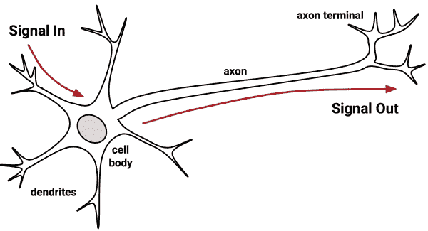

单个人工神经元的模型可以用与生物模型非常相似的术语来理解。如下图所示，有向网络图定义了树突接收的输入信号( *x* 变量)和输出信号( *y* 变量)之间的关系。就像生物神经元一样，每个树突的信号都根据其重要性进行加权( *w* 值)——暂时忽略这些权重是如何确定的。输入信号由单元体求和，并且信号根据由 *f* 表示的**激活函数**传递:

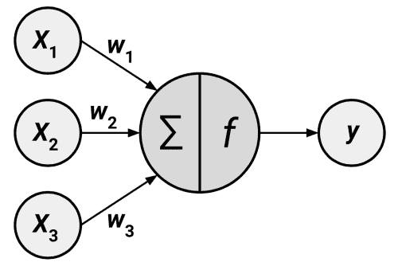

具有 *n* 个输入树突的典型人工神经元可以用下面的公式表示。 *w* 权重允许 *n* 个输入(由*x[I]表示)中的每一个对输入信号的总和做出更大或更小的贡献。激活函数 *f(x)* 使用净总数，并且产生的信号 *y(x)* 是输出轴突:*

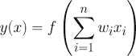

神经网络使用这样定义的神经元作为构建模块来构建复杂的数据模型。尽管神经网络有许多变体，但每一种都可以根据以下特征来定义:

*   **激活功能**，其将神经元的组合输入信号转换成单个输出信号，以在网络中进一步广播
*   一个**网络拓扑**(或架构)，其中描述了模型中神经元的数量以及它们连接的层数和方式
*   **训练算法**，即指定如何设置连接权重，以便与输入信号成比例地抑制或激发神经元

让我们来看看这些类别中的一些变化，看看它们如何用于构建典型的神经网络模型。

## 激活功能

激活功能是人工神经元处理传入信息并将其传递到整个网络的机制。正如人工神经元是模仿生物版本一样，激活功能也是模仿自然的设计。

在生物学的情况下，激活函数可以被想象为一个过程，该过程包括对总的输入信号求和，并确定它是否满足触发阈值。如果是这样，神经元传递信号；否则，它什么也不做。在人工神经网络术语中，这被称为 **阈值激活函数**，因为它仅在达到指定输入阈值时产生输出信号。

下图描述了一个典型的阈值函数；在这种情况下，当输入信号的和在最小为零时，神经元触发。因为其形状类似于楼梯，所以有时被称为 **单位步进激活功能**。

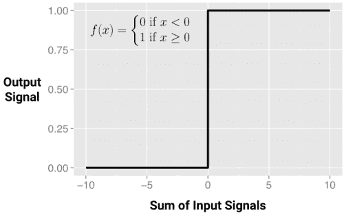

尽管阈值激活函数因其与生物学的相似性而令人感兴趣，但它很少用于人工神经网络。从生物化学的限制中解放出来，ANN 激活函数可以基于它们展示期望的数学特征和精确地模拟数据之间的关系的能力来选择。

也许最常用的替代方法是下图所示的 **乙状结肠激活函数**(更具体地说，是*逻辑*乙状结肠)。注意，在所示的公式中， *e* 是自然对数的底数(约为 2.72)。尽管它与阈值激活函数共享类似的台阶或“S”形，但输出信号不再是二进制的；输出值可以在 0 到 1 的范围内。此外，sigmoid 是**可微分的**，这意味着可以计算整个输入范围内的导数。您将在后面了解到，这个特性对于创建高效的人工神经网络优化算法至关重要。

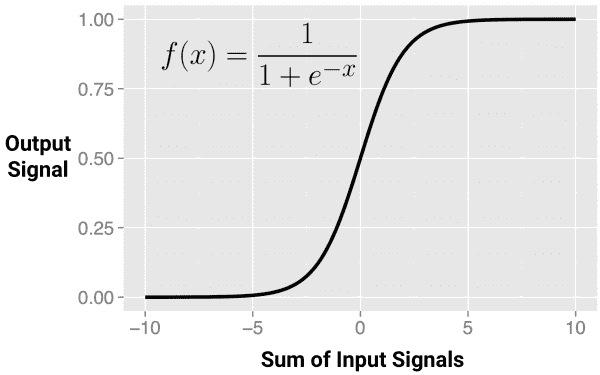

虽然 sigmoid 可能是最常用的激活函数，并且通常默认使用，但一些神经网络算法允许选择替代函数。下图显示了此类激活功能的选择:

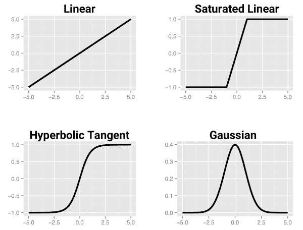

区分这些激活功能的主要细节是输出信号范围。通常，这是(0，1)，(-1，+1)或(-inf，+inf)之一。激活函数的选择偏向神经网络，使得它可以更合适地适合某些类型的数据，允许构建专门的神经网络。例如，线性激活函数产生与线性回归模型非常相似的神经网络，而高斯激活函数产生称为 **径向基函数** ( **RBF** )网络的模型。每一种都有更适合某些学习任务而不是其他任务的优势。

重要的是要认识到，对于许多激活函数来说，影响输出信号的输入值范围相对较窄。例如，在 sigmoid 的情况下，对于低于 *-5* 或高于 *+5* 的输入信号，输出信号总是接近 0 或 1。以这种方式压缩信号会在非常动态的输入的高端和低端产生饱和信号，就像吉他放大器音量调得太高会由于声波峰值的削波而导致声音失真一样。因为这实质上是将输入值压缩到一个更小的输出范围内，像 sigmoid 这样的激活函数有时被称为 **压缩函数**。

挤压问题的解决方案是转换所有神经网络输入，使特征值落在 0 附近的小范围内。通常，这包括标准化或规范化特性。通过限制输入值的范围，激活函数将在整个范围内起作用，防止大值特征(如家庭收入)支配小值特征(如家庭中孩子的数量)。一个附带的好处是，该模型也可以更快地训练，因为该算法可以更快地迭代通过输入值的可操作范围。

### 提示

尽管理论上神经网络可以通过多次迭代调整其权重来适应非常动态的特征。在极端情况下，许多算法会在这种情况发生之前很久就停止迭代。如果您的模型做出了没有意义的预测，请仔细检查您是否正确地标准化了输入数据。

## 网络拓扑

一个神经网络的学习能力根植于它的**拓扑**，或者互联神经元的模式和结构。尽管网络体系结构有无数种形式，但它们可以通过三个关键特征来区分:

*   层数
*   网络中的信息是否允许反向传播
*   网络每层中的节点数量

拓扑决定了网络可以学习的任务的复杂度。通常，更大和更复杂的网络能够识别更微妙的模式和复杂的决策边界。然而，网络的能力不仅仅是网络大小的函数，还与单元的排列方式有关。

### 层数

为了定义拓扑，我们需要,这是一个根据人工神经元在网络中的位置来区分它们的术语。下图展示了一个非常简单的网络的拓扑结构。一组称为 **的神经元输入节点**直接从输入数据中接收未经处理的信号。每个输入节点负责处理数据集中的单个要素；该特性的值将由相应节点的激活函数进行转换。输入节点发送的信号由输出节点接收，输出节点使用其自己的激活函数来生成最终预测(这里表示为 *p* )。

输入和输出节点排列在称为 **层**的组中。因为输入节点完全按照接收到的数据来处理输入数据，所以网络只有一组连接权重(这里标记为*w[1]、*w[2]和*w[3])。因此被称为**单层网络**。单层网络可用于基本模式分类，特别是线性可分的模式，但大多数学习任务需要更复杂的网络。***

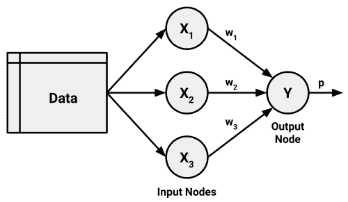

正如你所料，创建更复杂网络的一个显而易见的方法是添加额外的层。如这里所描述的，一个 **多层网络**增加了一个或多个**隐藏层**，在信号到达输出节点之前处理来自输入节点的信号。大多数多层网络都是**全连接**，这意味着一层中的每个节点都连接到下一层中的每个节点，但这不是必需的。

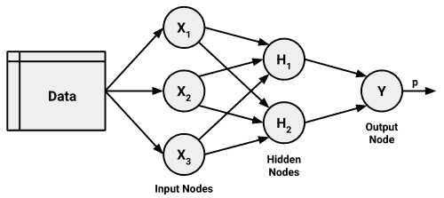

### 信息传播的方向

你可能已经注意到，在前面的例子中，箭头被用来表示信号只向一个方向传播。输入信号从一个连接到另一个连接沿一个方向连续馈送直到到达输出层的网络称为 **前馈**网络。

尽管信息流受到限制，前馈网络提供了惊人的灵活性。例如，级别和每个级别的节点数量可以变化，可以同时模拟多个结果，或者可以应用多个隐藏层。具有多个隐含层的神经网络被称为 **深度神经网络**(**【DNN】**)，训练这种网络的实践有时被称为 **深度学习**。

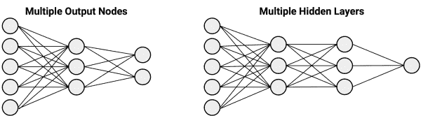

相比之下， **循环网络**(或**反馈网络**)允许信号使用环路在两个方向上传播。这一特性更接近于反映生物神经网络的工作方式，允许学习极其复杂的模式。短期记忆的增加，或者说**延迟**，极大地增加了循环网络的能力。值得注意的是，这包括理解一段时间内事件顺序的能力。这可以用于股票市场预测、语音理解或天气预报。一个简单的循环网络描述如下:

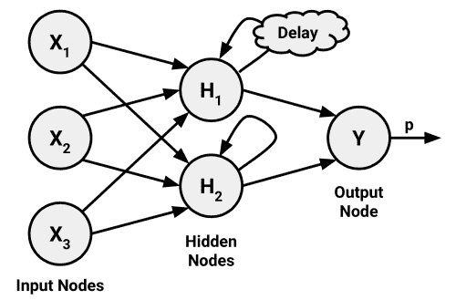

尽管有其潜力，循环网络仍然主要是理论上的，很少在实践中使用。另一方面，前馈网络已广泛应用于现实世界的问题。事实上，多层前馈网络，有时称为 **多层感知器** ( **MLP** )，是事实上的标准 ANN 拓扑。如果有人提到他们正在拟合神经网络，他们很可能指的是 MLP。

### 每层的节点数

除了层数和信息传播方向的变化之外，神经网络的复杂性也可能因每层中节点的数量而变化。输入结点的数量由输入数据中的要素数量预先确定。类似地，输出节点的数量由要建模的结果的数量或结果中的类级别的数量来预先确定。但是，隐藏节点的数量由用户在训练模型之前决定。

不幸的是，没有可靠的规则来确定隐藏层中神经元的数量。适当的数量取决于输入节点的数量、训练数据的数量、噪声数据的数量、学习任务的复杂性以及许多其他因素。

通常，具有大量网络连接的更复杂的网络拓扑允许学习更复杂的问题。更大数量的神经元将导致更接近地反映训练数据的模型，但是这存在过度拟合的风险；它可能不能很好地概括未来的数据。大型神经网络的计算成本也很高，训练速度也很慢。

最佳实践是在验证数据集中使用最少的节点来获得足够的表现。在大多数情况下，即使只有少量的隐藏节点，神经网络也能提供巨大的学习能力。

### 提示

已经证明，至少有一个足够神经元的隐层的神经网络是 **通用函数逼近器**。这意味着神经网络可以用来在有限的区间内以任意精度逼近任何连续函数。

## 用反向传播训练神经网络

网络拓扑是一张空白的石板，它本身没有学到任何东西。就像刚出生的孩子，必须用经验来训练。随着神经网络处理输入数据，神经元之间的连接被加强或削弱，类似于婴儿的大脑在他或她经历环境时的发展。网络的连接权重被调整以反映随时间观察到的模式。

通过调整连接权重来训练神经网络的计算量非常大。因此，尽管人工神经网络在几十年前就已经被研究过了，但直到 20 世纪 80 年代中后期，当一种训练人工神经网络的有效方法被发现时，它们才很少被应用到现实世界的学习任务中。该算法使用了误差反向传播策略，现在简称为 **反向传播**。

### 注意

巧合的是，几个研究团队几乎同时独立发现并发表了反向传播算法。其中，也许最常被引用的作品是:鲁梅尔哈特、辛顿戈、威廉姆斯·RJ。通过反向传播误差学习表征。*性质*。1986;323:533-566.

尽管相对于许多其他机器学习算法来说，反向传播方法仍然是众所周知的慢，但它重新引起了人们对人工神经网络的兴趣。因此，使用反向传播算法的多层前馈网络现在在数据挖掘领域很常见。这些模型有以下优点和缺点:

| 

强项

 | 

弱点

 |
| --- | --- |
| 

*   可适用于分类或数值预测问题
*   能够模拟比几乎任何算法更复杂的模式
*   对数据的底层关系做出很少假设

 | 

*   计算量极大，训练速度很慢，特别是如果网络拓扑复杂
*   很容易过拟合训练数据
*   导致复杂的黑盒模型，很难(如果不是不可能的话)解释

 |

在其最一般的形式中，反向传播算法通过两个过程的许多循环进行迭代。每个周期被称为一个**时期**。因为网络不包含*先验*(现有)知识，所以起始权重通常是随机设置的。然后，该算法迭代通过这些过程，直到达到停止标准。反向传播算法中的每个时期包括:

*   中的**正向阶段**，神经元从输入层到输出层依次被激活，沿途应用每个神经元的权重和激活函数。到达最后一层时，产生一个输出信号。
*   在中的**反向阶段**，由正向阶段产生的网络输出信号与训练数据中的真实目标值进行比较。网络输出信号和真实值之间的差异导致误差，该误差在网络中反向传播，以修改神经元之间的连接权重并减少未来的误差。

随着时间的推移，网络使用反向发送的信息来减少网络的总误差。然而还有一个问题:由于每个神经元的输入和输出之间的关系很复杂，算法如何确定权重应该改变多少？这个问题的答案涉及到一个叫做 **梯度下降**的技术。从概念上讲，它的工作原理类似于被困在丛林中的探险者如何找到通往水源的道路。通过检查地形，并沿着向下坡度最大的方向不断行走，探险家最终将到达最低的山谷，这很可能是一条河床。

在类似的过程中，反向传播算法使用每个神经元的激活函数的导数来识别每个传入权重方向上的梯度，因此具有可微分的激活函数非常重要。梯度表明了权重变化时误差的减小或增大程度。该算法将试图改变导致误差最大减少的权重，改变的量被称为 **学习速率**。学习率越大，算法尝试沿梯度下降的速度就越快，这可能会减少训练时间，但会有超过谷底的风险。

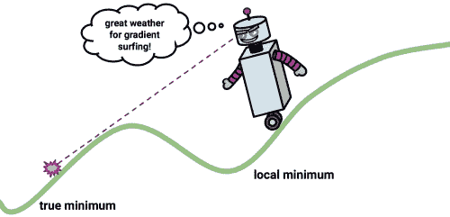

虽然这个过程看起来很复杂，但在实践中很容易应用。让我们将我们对多层前馈网络的理解应用于一个现实世界的问题。


# 例子——用人工神经网络模拟混凝土的强度

在工程领域，准确评估建筑材料的表现至关重要。为了制定建筑、桥梁和道路施工中所用材料的安全指南，需要进行这些估算。

估计混凝土的强度是一个特别有趣的挑战。尽管混凝土几乎用于每一个建筑项目，但由于各种成分以复杂的方式相互作用，混凝土的表现差异很大。因此，很难准确预测最终产品的强度。给定输入材料的成分列表，可以可靠地预测混凝土强度的模型可以产生更安全的施工实践。

## 第一步——收集数据

为了进行这种分析，我们将利用叶一诚捐赠给 UCI 机器学习数据库([http://archive.ics.uci.edu/ml](http://archive.ics.uci.edu/ml))的混凝土抗压强度数据。由于他发现了使用神经网络对这些数据建模的成功，我们将尝试使用 r。

### 注意

有关 Yeh 完成这项学习任务的方法的更多信息，请参阅:Yeh IC。基于人工神经网络的高表现混凝土强度建模。*水泥和混凝土研究*。1998;28:1797-1808.

根据该网站的说法，混凝土数据集包含 1030 个混凝土样本，其中八个特征描述了混合物中使用的成分。这些特征被认为与最终抗压强度有关，它们包括产品中使用的水泥、矿渣、灰、水、超塑化剂、粗骨料和细骨料的量(以千克/立方米计)以及老化时间(以天计)。

### 提示

按照这个例子，从 Packt Publishing 网站下载`concrete.csv`文件，并保存到您的 R 工作目录中。

## 第 2 步——探索和准备数据

像往常一样，我们将通过使用`read.csv()`函数将数据加载到 R 对象中来开始我们的分析，并确认它匹配预期的结构:

```
> concrete <- read.csv("concrete.csv")
> str(concrete)
'data.frame':   1030 obs. of  9 variables:
 $ cement      : num  141 169 250 266 155 ...
 $ slag        : num  212 42.2 0 114 183.4 ...
 $ ash         : num  0 124.3 95.7 0 0 ...
 $ water       : num  204 158 187 228 193 ...
 $ superplastic: num  0 10.8 5.5 0 9.1 0 0 6.4 0 9 ...
 $ coarseagg   : num  972 1081 957 932 1047 ...
 $ fineagg     : num  748 796 861 670 697 ...
 $ age         : int  28 14 28 28 28 90 7 56 28 28 ...
 $ strength    : num  29.9 23.5 29.2 45.9 18.3 ...

```

数据框中的九个变量对应于我们预期的八个特征和一个结果，尽管一个问题变得很明显。当输入数据被缩放到零附近的狭窄范围时，神经网络工作得最好，在这里，我们看到从零到超过一千的任何值。

通常，这个问题的解决方案是用一个正常化或标准化函数重新调整数据。如果数据遵循钟形曲线(第 2 章、*管理和理解数据*中描述的正态分布)，那么通过 R 的内置 scale()函数使用标准化可能是有意义的。另一方面，如果数据遵循均匀分布或者非常不正常，那么归一化到 0-1 范围可能更合适。在这种情况下，我们将使用后者。

在[第 3 章](ch03.html "Chapter 3. Lazy Learning – Classification Using Nearest Neighbors")、*惰性学习-使用最近邻分类*中，我们将自己的`normalize()`函数定义为:

```
> normalize <- function(x) {
 return((x - min(x)) / (max(x) - min(x)))
 }

```

执行这段代码后，我们的`normalize()`函数可以通过使用`lapply()`函数应用于具体数据帧中的每一列，如下所示:

```
> concrete_norm <- as.data.frame(lapply(concrete, normalize))

```

为了确认归一化有效，我们可以看到最小和最大强度现在分别为 0 和 1:

```
> summary(concrete_norm$strength)
 Min. 1st Qu.  Median    Mean 3rd Qu.    Max. 
 0.0000  0.2664  0.4001  0.4172  0.5457  1.0000

```

相比之下，最初的最小值和最大值分别为 2.33 和 82.60:

```
> summary(concrete$strength)
 Min. 1st Qu.  Median    Mean 3rd Qu.    Max. 
 2.33   23.71   34.44   35.82   46.14   82.60

```

### 提示

在训练模型之前应用于数据的任何变换将必须在以后反向应用，以便转换回原始测量单位。为了便于重新调整，明智的做法是保存原始数据或至少原始数据的汇总统计数据。

遵循 Yeh 在原始出版物中的先例，我们将数据划分为一个包含 75%的示例的训练集和一个包含 25%的测试集。我们使用的 CSV 文件已经按随机顺序排序，所以我们只需将它分成两部分:

```
> concrete_train <- concrete_norm[1:773, ]
> concrete_test <- concrete_norm[774:1030, ]

```

我们将使用训练数据集来构建神经网络，并使用测试数据集来评估模型对未来结果的概括程度。由于很容易过度拟合神经网络，这一步非常重要。

## 步骤 3–根据数据训练模型

为了对混凝土中使用的成分和成品强度之间的关系进行建模，我们将使用多层前馈神经网络。Stefan Fritsch 和 Frauke Guenther 的包提供了这种网络的标准和易于使用的实现。它还提供了绘制网络拓扑的功能。出于这些原因，`neuralnet`实现是学习更多关于神经网络的强大选择，尽管这并不是说它不能用于完成实际工作——它是一个非常强大的工具，您很快就会看到。

### 提示

还有其他几个常用的软件包来训练 R 中的 ANN 模型，每一个都有独特的优点和缺点。因为它是标准 R 安装的一部分，所以`nnet`包可能是最常被引用的 ANN 实现。它使用比标准反向传播稍微复杂一点的算法。另一个强有力的选择是`RSNNS`包，它提供了一套完整的神经网络功能，缺点是它更难学习。

由于`neuralnet`不包含在 base R 中，您需要通过键入`install.packages("neuralnet")`来安装它，并使用`library(neuralnet)`命令加载它。包含的`neuralnet()`函数可用于使用以下语法训练神经网络进行数值预测:

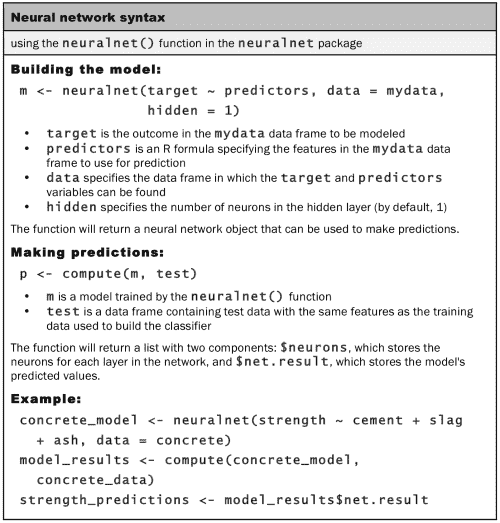

我们将从训练只有一个隐藏节点的最简单的多层前馈网络开始:

```
> concrete_model <- neuralnet(strength ~ cement + slag + ash + water + superplastic + coarseagg + fineagg + age, data = concrete_train)

```

然后，我们可以在生成的模型对象上使用`plot()`函数来可视化网络拓扑:

```
> plot(concrete_model)

```

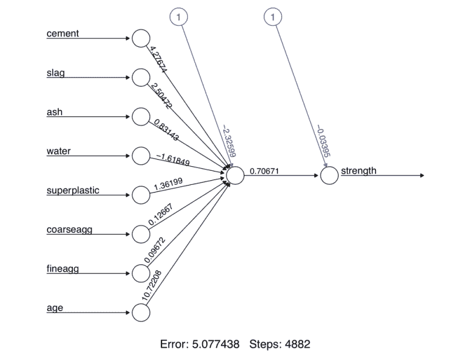

在这个简单的模型中，八个特征中的每一个都有一个输入节点，后面是一个隐藏节点和一个预测混凝土强度的输出节点。还描述了每个连接的权重，以及**偏置项**(由标有数字 **1** 的节点表示)。偏差项是数值常数，允许指定节点的值向上或向下移动，很像线性方程中的截距。

### 提示

具有单个隐藏节点的神经网络可以被认为是我们在第 6 章、*预测数字数据-回归方法*中研究的线性回归模型的远亲。每个输入节点和隐藏节点之间的权重类似于回归系数，偏差项的权重类似于截距。

在图的底部，R 报告了训练步骤的数量和一个称为**误差平方和** ( **SSE** )的误差度量，正如您所料，它是预测值减去实际值的平方和。更低的 SSE 意味着更好的预测表现。这有助于估计模型在训练数据上的表现，但很少告诉我们它在看不见的数据上将如何表现。

## 步骤 4–评估模型表现

网络拓扑图让我们看到了人工神经网络的黑盒，但它没有提供关于模型与未来数据拟合程度的更多信息。为了在测试数据集上生成预测，我们可以如下使用`compute()`:

```
> model_results <- compute(concrete_model, concrete_test[1:8])

```

`compute()`函数的工作方式与我们目前使用的`predict()`函数略有不同。它返回一个包含两个部分的列表:`$neurons`，它存储网络中每一层的神经元，以及`$net.result`，它存储预测值。我们想要后者:

```
> predicted_strength <- model_results$net.result

```

因为这是一个数值预测问题，而不是分类问题，我们不能使用混淆矩阵来检查模型的准确性。相反，我们必须测量我们预测的混凝土强度和真实值之间的相关性。这提供了对两个变量之间的线性关联强度的洞察。

回想一下，`cor()`函数用于获得两个数值向量之间的相关性:

```
> cor(predicted_strength, concrete_test$strength)
 [,1]
[1,] 0.8064655576

```

### 提示

如果你的结果不同，不要惊慌。因为神经网络从随机权重开始，所以预测可能因模型而异。如果您想精确匹配这些结果，在构建神经网络之前尝试使用`set.seed(12345)`。

相关性接近 1 表明两个变量之间有很强的线性关系。因此，这里大约 0.806 的相关性表示相当强的关系。这意味着我们的模型做得相当好，即使只有一个隐藏节点。

鉴于我们只使用了一个隐藏节点，我们很可能可以提高我们模型的表现。让我们努力做得更好一点。

## 第 5 步——提高模型表现

由于具有更复杂拓扑的网络能够学习更难的概念，让我们看看当我们将隐藏节点的数量增加到五个时会发生什么。我们像以前一样使用`neuralnet()`函数，但是添加了`hidden = 5`参数:

```
> concrete_model2 <- neuralnet(strength ~ cement + slag +
 ash + water + superplastic +
 coarseagg + fineagg + age,
 data = concrete_train, hidden = 5)

```

再次绘制网络图，我们看到连接数量急剧增加。我们可以看到这对表现的影响，如下所示:

```
> plot(concrete_model2)

```

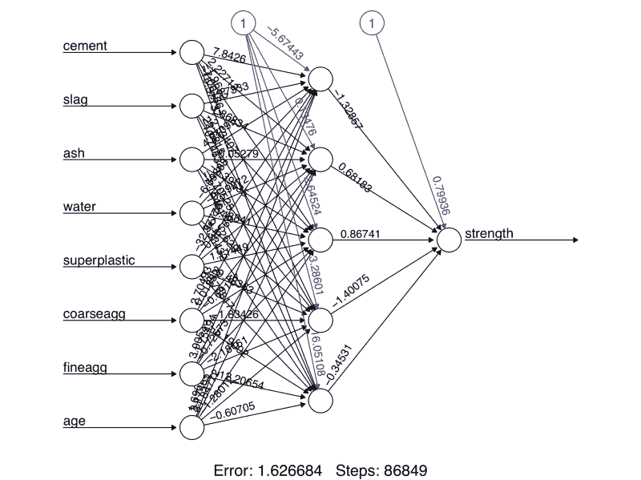

请注意，报告的误差(由 SSE 再次测量)已从之前模型中的 5.08 减少到此处的 1.63。此外，训练步骤的数量从 4，882 个增加到 86，849 个，考虑到模型变得更加复杂，这并不奇怪。更复杂的网络需要更多的迭代来找到最佳权重。

应用相同的步骤将预测值与真实值进行比较，我们现在获得了大约 0.92 的相关性，这比之前使用单个隐藏节点的 0.80 的结果有了相当大的改进:

```
> model_results2 <- compute(concrete_model2, concrete_test[1:8])
> predicted_strength2 <- model_results2$net.result
> cor(predicted_strength2, concrete_test$strength)
 [,1]
[1,] 0.9244533426

```

有趣的是，在最初的出版物中，Yeh 使用非常相似的神经网络报告了 0.885 的平均相关性。这意味着只需相对较少的努力，我们就能赶上主题专家的表现。如果您想更多地练习神经网络，可以尝试应用本章前面学到的原则，看看它如何影响模型表现。也许可以尝试使用不同数量的隐藏节点，应用不同的激活函数，等等。`?neuralnet`帮助页面提供了关于可调整的各种参数的更多信息。


# 了解支持向量机

一个**支持向量机** ( **SVM** )可以想象成一个表面，它在多维数据点之间创建一个边界，这些数据点代表范例和它们的特征值。SVM 的目标是创建一个名为 **超平面**的平坦边界，该超平面分割空间以在两侧创建相当均匀的分区。这样，SVM 学习结合了第 3 章[中介绍的基于实例的最近邻学习、*惰性学习-使用最近邻分类*和第 6 章](ch03.html "Chapter 3. Lazy Learning – Classification Using Nearest Neighbors")*预测数字数据-回归方法*中描述的线性回归建模的各个方面。这种组合非常强大，允许支持向量机对高度复杂的关系进行建模。

尽管驱动支持向量机的基础数学已经存在了几十年，但它们最近却大受欢迎。当然，这是基于它们最先进的表现，但也可能是因为获奖的 SVM 算法已经在许多编程语言(包括 R. SVMs)中的几个流行且受到良好支持的库中实现，因此被更广泛的受众所采用，否则可能无法应用实现 SVM 所需的复杂数学。好消息是，虽然数学可能很难，但基本概念是可以理解的。

支持向量机可以适用于几乎任何类型的学习任务，包括分类和数值预测。该算法的许多关键成功来自模式识别。值得注意的应用包括:

*   在生物信息学领域中对微阵列基因表达数据进行分类以识别癌症或其他遗传疾病
*   文本分类，如识别文档中使用的语言或按主题对文档进行分类
*   检测到罕见但重要的事件，如内燃机故障、安全漏洞或地震

当用于二元分类时，支持向量机是最容易理解的，这是这种方法的传统应用方式。因此，在接下来的章节中，我们将只关注 SVM 分类器。不过，不要担心，在将支持向量机应用于其他学习任务(如数值预测)时，您在这里学到的相同原则也将适用。

## 用超平面分类

如前所述，SVMs 使用一个称为超平面的边界将数据划分到相似类值的组中。例如，下图描绘了在二维和三维空间中分隔圆和正方形组的超平面。因为圆和正方形可以被直线或平面完美地分开，所以说它们是**线性可分的**。首先，我们将只考虑这是真的简单情况，但是支持向量机也可以扩展到点不是线性可分的问题。

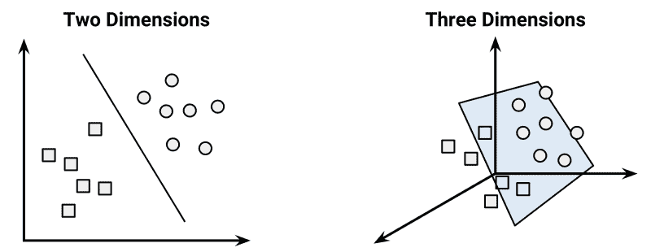

### 提示

为了方便起见，超平面传统上被描述为 2D 空间中的一条线，但这仅仅是因为很难在大于二维的空间中进行描述。事实上，超平面是高维空间中的一个平面——这是一个很难理解的概念。

在二维空间中，SVM 算法的任务是识别一条将两个类别分开的线。如下图所示，圆和正方形的组之间的分割线有多种选择。三种这样的可能性被标记为 **a** 、 **b** 和 **c** 。算法如何选择？

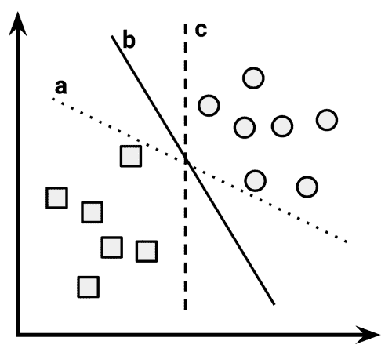

这个问题的答案包括寻找在两个等级之间产生最大分离的**(**【MMH】**)最大利润超平面。尽管分隔圆和正方形的三条线中的任何一条都可以正确地对所有数据点进行分类，但导致最大分隔的那条线很可能会将最好的数据归纳到未来的数据中。最大裕量将增加这样的机会，即尽管存在随机噪声，这些点仍将保持在边界的正确一侧。**

****支持向量**(在下图中由箭头指示)是来自每个类的最接近 MMH 的点；每个类必须至少有一个支持向量，但也可能有多个。单独使用支持向量，可以定义 MMH。这是支持向量机的一个关键特性；支持向量提供了一种非常紧凑的方法来存储分类模型，即使特征的数量非常大。**

****

**识别支持向量的算法依赖于向量几何，并且涉及一些相当复杂的数学，超出了本书的范围。然而，该过程的基本原理相当简单。**

### **注意**

**关于支持向量机数学的更多信息可以在经典论文中找到:Cortes C，Vapnik V. Support-vector network。*机器学习*。1995;20:273-297.初级水平的讨论可以在:贝内特 KP，坎贝尔 c。支持向量机:炒作或哈利路亚。SIGKDD 探索。2003;2:1-13.更深入的研究可以在:Steinwart I，Christmann A. *支持向量机*中找到。纽约:斯普林格；2008.**

### **线性可分数据的情况**

**理解如何在类是线性可分的假设下找到最大余量是最容易的。在这种情况下，MMH 尽可能远离两组数据点的外部边界。这些外部边界被称为 **凸包**。那么 MMH 就是两个凸包之间最短直线的垂直平分线。使用被称为 **二次优化**技术的复杂计算机算法能够以这种方式找到最大利润。**

**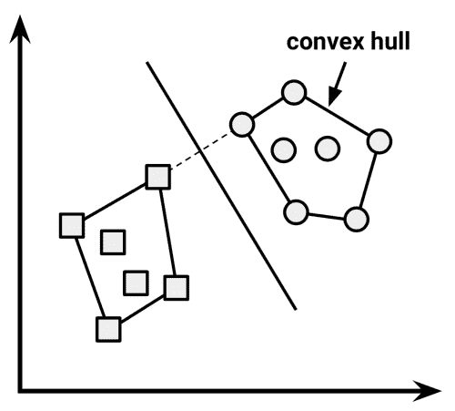**

**另一种替代(但等效)方法包括搜索每个可能的超平面的空间，以便找到两个平行平面的集合，这两个平行平面将点分成同类组，但它们本身尽可能远离。打个比方，你可以把这个过程想象成试图找到最厚的床垫，可以把楼梯井装到你的卧室里。**

**为了理解这个搜索过程，我们需要准确定义超平面的含义。在 *n* 维空间中，使用以下等式:**

**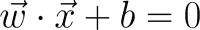**

**如果你不熟悉这个符号，字母上面的箭头表示它们是向量而不是单个数字。具体来说， *w* 是一个 *n* 权重的向量，即 *{w [1] ，w [2] ，...，w [n] }* ，和 *b* 是一个称为 **偏差**的单一数字。偏差在概念上等同于[第 6 章](ch06.html "Chapter 6. Forecasting Numeric Data – Regression Methods")、*预测数值数据-回归方法*中讨论的斜率截距形式中的截距项。**

### **提示**

**如果你想象飞机有困难，不要担心细节。简单地把这个方程想成一种指定表面的方法，就像斜率截距形式( *y = mx + b* )用于指定 2D 空间中的直线一样。**

**使用该公式，该过程的目标是找到指定两个超平面的一组权重，如下所示:**

**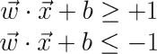**

**我们还将要求指定这些超平面，使得一个类的所有点落在第一个超平面之上，而另一个类的所有点落在第二个超平面之下。只要数据是线性可分的，这是可能的。**

**向量几何将这两个平面之间的距离定义为:**

**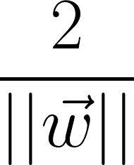**

**这里， *||w||* 表示 **欧几里德范数**(原点到向量的距离 *w* )。因为 *||w||* 在分母中，为了最大化距离，我们需要最小化 *||w||* 。该任务通常被重新表示为一组约束，如下所示:**

**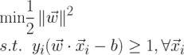**

**虽然这个看起来很乱，但是概念上理解起来真的不算太复杂。基本上，第一行暗示我们需要最小化欧几里德范数(平方并除以 2，以使计算更容易)。第二行注意到这受制于( *s.t.* )，即每个 *y [i]* 数据点被正确分类的条件。注意 *y* 表示类值(转换为+1 或-1 ),上下颠倒的“A”是“for all”的简写。**

**与寻找最大利润的其他方法一样，找到这个问题的解决方案是最好留给二次优化软件的任务。虽然它可能是处理器密集型的，但专门的算法能够快速解决这些问题，即使是在相当大的数据集上。**

### **非线性可分离数据的情况**

**当我们研究支持向量机背后的理论时，你可能想知道房间里的大象:如果数据不是线性可分的，会发生什么？这个问题的解决方案是使用一个 **松弛变量**，它创建了一个软边界，允许一些点落在边界的错误一侧。下图用相应的松弛项(用希腊字母 Xi 表示)说明了位于直线错误一侧的两点:**

**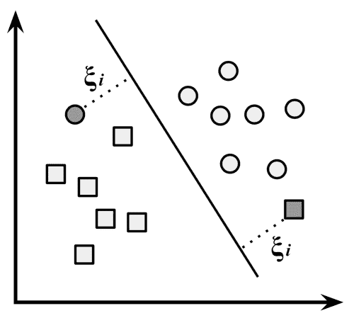**

**成本值(表示为 *C* )被应用于违反约束的所有点，并且该算法试图最小化总成本，而不是找到最大利润。因此，我们可以将优化问题修改为:**

**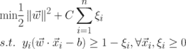**

**如果你仍然困惑，不要担心，你不是一个人。幸运的是，SVM 软件包会很高兴地为你优化这一点，你不必了解技术细节。需要理解的重要部分是添加了成本参数 *C* 。修改该值将调整惩罚，例如，落在超平面的错误一侧。成本参数越大，优化就越难实现 100%的分离。另一方面，较低的成本参数将强调更大的总体利润。为了创建一个能很好地概括未来数据的模型，在这两者之间取得平衡非常重要。**

## **使用非线性空间的内核**

**在许多实际应用中，变量之间的关系是非线性的。正如我们刚刚发现的，通过添加一个松弛变量，SVM 仍然可以在这样的数据上进行训练，这允许一些例子被错误分类。然而，这不是解决非线性问题的唯一方法。支持向量机的一个关键特性是它们能够使用一个被称为**内核技巧**的过程将问题映射到一个更高维的空间。在中，非线性关系可能突然变得非常线性。**

**虽然这看起来像废话，但实际上很容易举例说明。在下图中，左侧的散点图描绘了天气类别(晴天或下雪)与两个要素(纬度和经度)之间的非线性关系。地块中心的点是雪类的成员，而边缘的点都是阳光。这种数据可能是从一组天气报告中产生的，其中一些是从山顶附近的气象站获得的，而另一些是从山脚附近的气象站获得的。**

**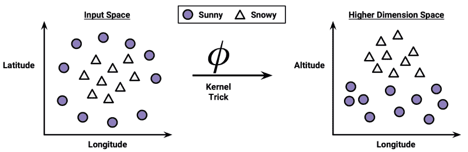**

**在图的右边，在应用了内核技巧之后，我们通过一个新的维度来观察数据:海拔。有了这个特性，这些类现在可以完全线性分离。这是可能的，因为我们对数据有了新的认识。在左图中，我们从鸟瞰的角度看这座山，而在右图中，我们从地面上的远处看这座山。在这里，趋势是显而易见的:下雪的天气出现在海拔较高的地方。**

**具有非线性核的支持向量机向数据添加了额外的维度，以便以这种方式创建分离。本质上，核心技巧包括构建新特征的过程，这些新特征表示测量特征之间的数学关系。例如，海拔特征可以用数学方法表示为纬度和经度之间的相互作用-该点越靠近这些尺度的中心，海拔越高。这使得 SVM 能够了解原始数据中没有明确测量的概念。**

**具有非线性核的支持向量机是非常强大的分类器，尽管它们也有一些缺点，如下表所示:**

| 

强项

 | 

弱点

 |
| --- | --- |
| 

*   可用于分类或数值预测问题
*   不受噪声数据的过度影响且不太容易过度拟合
*   可能比神经网络更易于使用，特别是由于存在几个得到良好支持的 SVM 算法
*   由于其高准确性和在数据挖掘竞赛中高调获胜而广受欢迎

 |  |

**一般来说，内核函数的形式如下。由希腊字母 phi(即ϕ(x)表示的函数是数据到另一个空间的映射。因此，通用内核函数对特征向量*x[I]和*x[j]进行一些变换，并使用**点积**将它们组合起来，该函数采用两个向量并返回一个数字。****

**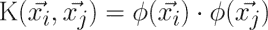**

**使用这种形式，已经为许多不同的数据领域开发了核函数。下面列出了一些最常用的内核函数。几乎所有的 SVM 软件包都将包含这些内核，以及其他许多内核。**

****线性内核**根本不转换数据。因此，它可以简单地表示为特性的点积:**

**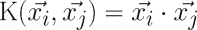**

**次数为 *d* 的 **多项式核**增加了一个简单的数据非线性变换:**

**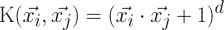**

****sigmoid 内核** 产生 SVM 模型，有点类似于使用 sigmoid 激活函数的神经网络。希腊字母 kappa 和 delta 用作内核参数:**

**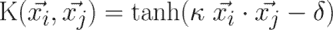**

****高斯 RBF 核** 类似于 RBF 神经网络。RBF 核在许多类型的数据上表现良好，被认为是许多学习任务的合理起点:**

**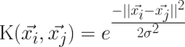**

**没有可靠的规则将内核与特定的学习任务相匹配。这种匹配很大程度上取决于要学习的概念以及训练数据的数量和特征之间的关系。通常，在一个验证数据集上训练和评估几个支持向量机需要一点试错。也就是说，在许多情况下，内核的选择是任意的，因为的表现可能会略有不同。为了了解这在实践中是如何工作的，让我们将我们对 SVM 分类的理解应用到一个现实世界的问题中。**

**<title>Example – performing OCR with SVMs</title>

# 示例–使用支持向量机执行 OCR

对于许多类型的机器学习算法来说，图像处理是一项困难的任务。将像素模式与更高概念联系起来的关系极其复杂，难以定义。例如，对人类来说，识别一张脸、一只猫或字母“A”很容易，但是用严格的规则来定义这些模式却很困难。此外，图像数据通常有噪声。根据拍摄对象的光线、方向和位置，拍摄图像的方式可能会有许多细微的变化。

支持向量机非常适合处理图像数据的挑战。他们能够学习复杂的模式，而不会对噪音过于敏感，他们能够以很高的准确度识别视觉模式。此外，支持向量机的关键弱点——黑盒模型表示——对于图像处理来说不太重要。如果 SVM 能区分猫和狗，那么它是如何做到的并不重要。

在本节中，我们将开发一个类似于桌面文档扫描仪中常用的**光学字符识别** ( **OCR** )软件核心所使用的模型。这种软件的目的是通过将印刷或手写文本转换成电子形式保存在数据库中来处理纸质文件。当然，由于手写风格和印刷字体的许多变体，这是一个困难的问题。即便如此，软件用户还是期望完美，因为在商业环境中，错误或打字错误会导致尴尬或代价高昂的错误。让我们看看我们的 SVM 是否能胜任这项任务。

## 第一步——收集数据

当 OCR 软件 first 处理文档时，它将纸张分成一个矩阵，这样网格中的每个单元格都包含一个单独的 **字形**，这只是一个指代字母、符号或数字的术语。接下来，对于每个单元格，软件将尝试将字形与其识别的所有字符进行匹配。最后，单个字符将被组合成单词，可以根据文档语言的字典对单词进行拼写检查。

在本练习中，我们将假设我们已经开发了将文档分割成矩形区域的算法，每个区域由一个字符组成。我们还将假设文档只包含英文字母字符。因此，我们将模拟一个将字形与 26 个字母 A 到 z 中的一个匹配的过程。

为此，我们将使用 W. Frey 和 D. J. Slate 捐赠给 UCI 机器学习数据仓库([http://archive.ics.uci.edu/ml](http://archive.ics.uci.edu/ml))的数据集。该数据集包含 26 个英文字母大写字母的 20，000 个示例，这些字母是使用 20 种不同的随机整形和扭曲的黑白字体打印的。

### 注意

有关该数据集的更多信息，请参考 Slate DJ，Frey W .使用荷兰式自适应分类器的字母识别*。机器学习。*一九九一年；6:161-182.

由 Frey 和 Slate 出版的下图提供了一些印刷字形的例子。以这种方式扭曲的字母对计算机来说很难识别，但人类却很容易识别:

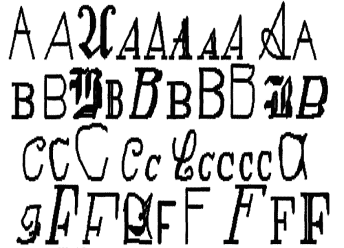

## 步骤 2——探索和准备数据

根据 Frey 和 Slate 提供的文档，当字形被扫描进计算机时，它们被转换成像素并记录 16 个统计属性。

这些属性测量诸如字形的水平和垂直尺寸、黑色(相对于白色)像素的比例以及像素的平均水平和垂直位置等特征。据推测，盒子不同区域的黑色像素浓度的差异应该提供了一种区分字母表中 26 个字母的方法。

### 提示

按照这个例子，从 Packt Publishing 网站下载`letterdata.csv`文件，并保存到您的 R 工作目录。

将数据读入 R 中，我们确认我们已经收到了具有 16 个特征的数据，这 16 个特征定义了字母类的每个例子。不出所料，信有 26 级:

```
> letters <- read.csv("letterdata.csv")
> str(letters)
'data.frame':  20000 obs. of 17 variables:
 $ letter: Factor w/ 26 levels "A","B","C","D",..
 $ xbox  : int  2 5 4 7 2 4 4 1 2 11 ...
 $ ybox  : int  8 12 11 11 1 11 2 1 2 15 ...
 $ width : int  3 3 6 6 3 5 5 3 4 13 ...
 $ height: int  5 7 8 6 1 8 4 2 4 9 ...
 $ onpix : int  1 2 6 3 1 3 4 1 2 7 ...
 $ xbar  : int  8 10 10 5 8 8 8 8 10 13 ...
 $ ybar  : int  13 5 6 9 6 8 7 2 6 2 ...
 $ x2bar : int  0 5 2 4 6 6 6 2 2 6 ...
 $ y2bar : int  6 4 6 6 6 9 6 2 6 2 ...
 $ xybar : int  6 13 10 4 6 5 7 8 12 12 ...
 $ x2ybar: int  10 3 3 4 5 6 6 2 4 1 ...
 $ xy2bar: int  8 9 7 10 9 6 6 8 8 9 ...
 $ xedge : int  0 2 3 6 1 0 2 1 1 8 ...
 $ xedgey: int  8 8 7 10 7 8 8 6 6 1 ...
 $ yedge : int  0 4 3 2 5 9 7 2 1 1 ...
 $ yedgex: int  8 10 9 8 10 7 10 7 7 8 ...

```

回想一下，SVM 学习者要求所有的特征都是数字，而且每个特征都被缩放到一个相当小的区间。在这种情况下，每个特征都是整数，因此我们不需要将任何因子转换成数字。另一方面，这些整数变量的某些范围显得相当宽。这表明我们需要对数据进行规范化或标准化。但是，我们现在可以跳过这一步，因为我们将用于拟合 SVM 模型的 R 包将自动执行重新缩放。

鉴于数据的准备工作已经基本完成，我们可以直接进入机器学习过程的训练和测试阶段。在前面的分析中，我们在训练集和测试集之间随机划分数据。虽然我们可以在这里这样做，但 Frey 和 Slate 已经随机化了数据，因此建议使用前 16，000 条记录(80%)来构建模型，并使用接下来的 4，000 条记录(20%)来测试。根据他们的建议，我们可以创建如下的训练和测试数据框架:

```
> letters_train <- letters[1:16000, ]
> letters_test  <- letters[16001:20000, ]

```

数据准备就绪后，让我们开始构建分类器。

## 第 3 步——根据数据训练模型

当谈到在 R 中安装 SVM 模型时，有几个优秀的软件包可供选择。维也纳技术大学(TU Wien)统计系的`e1071`包提供了获奖的 LIBSVM 库的 R 接口，LIBSVM 库是一个广泛使用的开源 SVM 程序，用 C++编写。如果您已经熟悉 LIBSVM，您可能希望从这里开始。

### 注意

有关 LIBSVM 的更多信息，请参考作者网站[http://www.csie.ntu.edu.tw/~cjlin/libsvm/](http://www.csie.ntu.edu.tw/~cjlin/libsvm/)。

类似地，如果您已经投资了 SVMlight 算法，来自多特蒙德理工大学(TU Dortmund)统计系的`klaR`包提供了直接在 r

### 注意

关于 SVMlight 的信息，请看一下[http://svmlight.joachims.org/](http://svmlight.joachims.org/)。

最后，如果你是从零开始，最好从`kernlab`包中的 SVM 函数开始。这个包的一个有趣的优点是它是用 R 而不是 C 或 C++开发的，这使得它很容易定制；没有一个内部是隐藏在幕后的。或许更重要的是，与其他选项不同，`kernlab`可以与`caret`包一起使用，后者允许使用各种自动化方法训练和评估 SVM 模型(在[第 11 章](ch11.html "Chapter 11. Improving Model Performance")、*提高模型表现*中有所涉及)。

### 注

关于 `kernlab`更全面的介绍，请参考作者在[http://www.jstatsoft.org/v11/i09/](http://www.jstatsoft.org/v11/i09/)的论文。

用`kernlab`训练 SVM 分类器的语法如下。如果您碰巧使用了其他软件包中的一个，那么命令基本上是相似的。默认情况下，`ksvm()`函数使用高斯 RBF 内核，但也提供了许多其他选项。

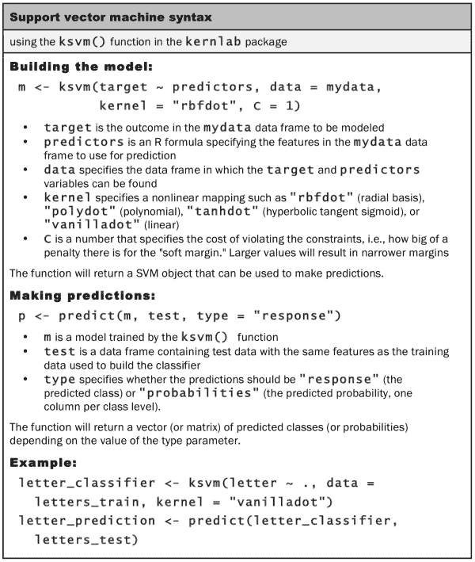

为了提供 SVM 表现的基线测量，让我们从训练一个简单的线性 SVM 分类器开始。如果还没有，使用`install.packages("kernlab")`命令将`kernlab`包安装到你的库中。然后，我们可以对训练数据调用`ksvm()`函数，并使用`vanilladot`选项指定线性(即普通)内核，如下所示:

```
> library(kernlab)
> letter_classifier <- ksvm(letter ~ ., data = letters_train,
 kernel = "vanilladot")

```

根据计算机的表现，此操作可能需要一段时间才能完成。完成后，键入存储模型的名称，以查看有关训练参数和模型拟合度的一些基本信息。

```
> letter_classifier
Support Vector Machine object of class "ksvm" 

SV type: C-svc  (classification) 
 parameter : cost C = 1 

Linear (vanilla) kernel function. 

Number of Support Vectors : 7037 

Objective Function Value : -14.1746 -20.0072 -23.5628 -6.2009 -7.5524 -32.7694 -49.9786 -18.1824 -62.1111 -32.7284 -16.2209...

Training error : 0.130062

```

这些信息很少告诉我们该模型在现实世界中的表现如何。我们需要检查它在测试数据集上的表现，以了解它是否能很好地推广到看不见的数据。

## 步骤 4–评估模型表现

`predict()`函数允许我们使用字母分类模型对测试数据集进行预测:

```
> letter_predictions <- predict(letter_classifier, letters_test)

```

因为我们没有指定类型参数，所以使用了默认的`type = "response"`。这将返回一个向量，其中包含测试数据中每行值的预测字母。使用`head()`函数，我们可以看到前六个预测字母分别是`U`、`N`、`V`、`X`、`N`和`H`:

```
> head(letter_predictions)
[1] U N V X N H
Levels: A B C D E F G H I J K L M N O P Q R S T U V W X Y Z

```

为了检验我们的分类器表现如何，我们需要将预测的字母与测试数据集中的真实字母进行比较。为此，我们将使用`table()`函数(这里只显示了整个表格的一部分):

```
> table(letter_predictions, letters_test$letter)
letter_predictions   A   B   C   D   E
 A 144   0   0   0   0
 B   0 121   0   5   2
 C   0   0 120   0   4
 D   2   2   0 156   0
 E   0   0   5   0 127

```

`144`、`121`、`120`、`156`和`127`的对角线值表示预测字母与真实值匹配的记录总数。同样，也列出了错误的数量。例如，行`B`和列`D`中`5`的值表示有五种情况，其中字母`D`被误识别为`B`。

单独观察每种类型的错误可能会揭示一些关于模型有问题的特定字母类型的有趣模式，但这很耗时。我们可以通过计算整体精度来简化我们的评估。这仅考虑预测是正确还是不正确，而忽略了错误的类型。

下面的命令返回一个向量的`TRUE`或`FALSE`值，指示模型的预测字母是否与测试数据集中的实际字母一致(即匹配):

```
> agreement <- letter_predictions == letters_test$letter

```

使用`table()`函数，我们看到分类器在 4，000 条测试记录中的 3，357 条中正确地识别了该字母:

```
> table(agreement)
agreement
FALSE  TRUE
643 3357

```

按百分比计算，准确率约为 84 %:

```
> prop.table(table(agreement))
agreement
 FALSE    TRUE
0.16075 0.83925

```

请注意，当 Frey 和 Slate 在 1991 年发表数据集时，他们报告的识别准确率约为 80%。仅仅使用几行 R 代码，我们就能够超越他们的结果，尽管我们也受益于二十多年的额外机器学习研究。考虑到这一点，我们很可能能够做得更好。

## 第 5 步——提高模型表现

我们之前的 SVM 模型使用了简单的线性核函数。通过使用更复杂的核函数，我们可以将数据映射到更高维度的空间，并潜在地获得更好的模型拟合。

然而，从众多不同的内核函数中进行选择是一项挑战。一个流行的惯例是从高斯 RBF 核开始，它已经被证明对许多类型的数据表现良好。我们可以训练一个基于 RBF 的 SVM，使用如下所示的`ksvm()`函数:

```
> letter_classifier_rbf <- ksvm(letter ~ ., data = letters_train,
 kernel = "rbfdot")

```

接下来，我们像前面一样进行预测:

```
> letter_predictions_rbf <- predict(letter_classifier_rbf,
 letters_test)

```

最后，我们将精度与线性 SVM 进行比较:

```
> agreement_rbf <- letter_predictions_rbf == letters_test$letter
> table(agreement_rbf)
agreement_rbf
FALSE  TRUE

  275  3725
> prop.table(table(agreement_rbf))
agreement_rbf
 FALSE    TRUE
0.06875 0.93125

```

### 提示

由于`ksvm` RBF 内核的随机性，您的结果可能与此处显示的不同。如果您希望它们完全匹配，在运行 ksvm()函数之前使用`set.seed(12345)`。

通过简单地改变核函数，我们能够将字符识别模型的准确率从 84%提高到 93%。如果这种表现水平对于 OCR 程序仍然不令人满意，则可以测试其他内核，或者可以改变约束参数 C 的成本来修改决策边界的宽度。作为练习，您应该试验这些参数，看看它们如何影响最终模型的成功。


# 总结

在这一章中，我们考察了两种机器学习方法，它们提供了巨大的潜力，但由于其复杂性而经常被忽视。希望你现在明白这个名声至少有点名不副实。驱动神经网络和支持向量机的基本概念相当容易理解。

另一方面，因为人工神经网络和支持向量机已经存在了几十年，它们中的每一个都有许多变体。这一章仅仅触及了这些方法的表面。通过利用您在这里学到的术语，您应该能够找出区别每天开发的许多进步的细微差别。

既然我们已经花了一些时间了解了从简单到复杂的许多不同类型的预测模型；在下一章，我们将开始考虑其他类型的学习任务的方法。这些无监督学习技术将揭示数据中令人着迷的模式。**