# 十、评估模型表现

当只有富人才能负担得起教育的时候，测试和考试不会评估学生的潜力。取而代之的是，家长们想知道他们的孩子是否学到了足够的东西来证明教师的工资是合理的。显然，这些年来这种情况已经改变了。现在，这种评估被用来区分成绩好的和差的学生，将他们过滤到职业和其他机会中。

鉴于这一过程的重要性，大量的努力被投入到开发准确的学生评估中。公平评估有大量的问题，涵盖广泛的主题，奖励真实的知识而不是侥幸的猜测。他们还要求学生思考他们从未面对过的问题。因此，正确的回答表明学生可以更广泛地概括他们的知识。

评估机器学习算法的过程和评估学生的过程非常相似。由于算法有不同的优点和缺点，测试应该区分不同的学习者。预测学习者对未来数据的表现也很重要。

本章提供评估机器学习者所需的信息，例如:

*   预测准确性不足以衡量表现的原因，以及您可以使用的表现衡量指标
*   确保表现度量合理反映模型预测或预报未知情况的能力的方法
*   如何使用 R 将这些更有用的度量和方法应用到前面章节中涉及的预测模型中

正如学习一个主题的最佳方式是尝试将它教给其他人一样，教授和评估机器学习者的过程将为您提供对您迄今为止所学方法的更大洞察力。

# 测量表现以进行分类

在前面的章节中，我们通过将正确预测的比例除以预测总数来衡量分类器的准确性。这表示学习者正确或错误的案例的百分比。例如，假设 100，000 名新生儿中有 99，990 名的分类器正确预测了他们是否是可治疗但潜在致命的遗传缺陷携带者。这意味着准确率为 99.99%，错误率仅为 0.01%。

乍一看，这似乎是一个非常准确的分类器。然而，在把你孩子的生活托付给测试之前，收集额外的信息是明智的。如果每 10 万个婴儿中只有 10 个发现基因缺陷会怎样？一个预测*没有缺陷*的测试，不管情况如何，对所有情况的 99.99%是正确的，但是对最重要的情况的 100%是不正确的。换句话说，即使预测非常准确，分类器对预防可治疗的出生缺陷也不是很有用。

### 提示

这是**类别不平衡问题**的一个后果，类别不平衡问题指的是与大部分记录属于单一类别的数据相关的问题。

尽管有许多方法来衡量分类器的表现，但最好的衡量方法总是能够捕捉到分类器是否成功达到其预期目的。为效用而不是原始准确性定义表现度量是至关重要的。为此，我们将开始探索从混淆矩阵中得出的各种替代表现测量。然而，在我们开始之前，我们需要考虑如何为评估准备一个分类器。

## 使用 R 中的分类预测数据

评估分类模型的目标是更好地理解其表现将如何外推至未来案例。由于在真实环境中测试一个尚未证实的模型通常是不可行的，我们通常通过要求模型对一个数据集进行分类来模拟未来的情况，该数据集由类似于未来要求它做的事情的案例组成。通过观察学习者对这次考试的反应，我们可以了解它的优点和缺点。

虽然我们已经在前面的章节中评估了分类器，但还是有必要思考一下我们可以处理的数据类型:

*   实际类别值
*   预测类别值
*   预测的估计概率

实际和预测的类值可能是不言而喻的，但它们是评价的关键。就像老师使用答案来评估学生的答案一样，我们需要知道机器学习者预测的正确答案。目标是维护两个数据向量:一个保存正确的或实际的类值，另一个保存预测的类值。两个向量必须以相同的顺序存储相同数量的值。预测值和实际值可以作为单独的 R 向量或列存储在单个 R 数据帧中。

获取这些数据很容易。实际的类值直接来自测试数据集中的目标要素。从基于训练数据构建的分类器中获得预测的类值，并将其应用于测试数据。对于大多数机器学习包来说，这涉及到将`predict()`函数应用于模型对象和测试数据的数据帧，比如:`predicted_outcome <- predict(model, test_data)`。

到目前为止，我们仅使用这两个数据向量检查了分类预测。然而，大多数模型可以提供另一条有用的信息。尽管分类器对每个示例都做出了单个预测，但它可能对某些决策比其他决策更有信心。例如，一个分类器可以 99%确定带有单词“免费”和“铃声”的 SMS 是垃圾邮件，但是只有 51%确定带有单词“今晚”的 SMS 是垃圾邮件。在这两种情况下，分类器都会将邮件分类为垃圾邮件，但对于其中一个决定，它要比另一个决定更加确定。

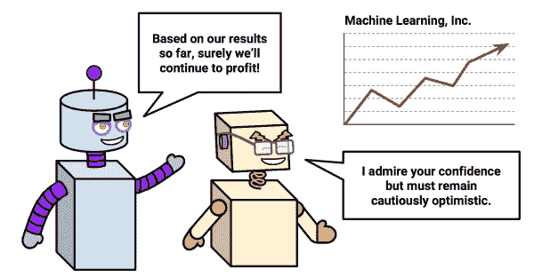

研究这些内部预测概率为评估模型的表现提供了有用的数据。如果两个模型犯了相同数量的错误，但其中一个更有能力准确评估其不确定性，那么它是一个更聪明的模型。最理想的是找到一个在做出正确预测时非常自信，但在面对疑问时却胆怯的学习者。信心和谨慎之间的平衡是模型评估的关键部分。

不幸的是，获得内部预测概率可能是棘手的，因为这样做的方法因分类器而异。一般来说，对于大多数分类器来说，`predict()`函数用于指定期望的预测类型。为了获得一个预测的类别，比如 spam 或 ham，通常需要设置`type = "class"`参数。为了获得预测概率，根据所使用的分类器，`type`参数应设置为`"prob"`、`"posterior"`、`"raw"`或`"probability"`之一。

### 提示

本书中介绍的几乎所有分类器都将提供预测概率。`type`参数包含在介绍各型号的语法框中。

例如，要输出[第 5 章](ch05.html "Chapter 5. Divide and Conquer – Classification Using Decision Trees and Rules")、*分而治之-使用决策树和规则分类*中内置的 C5.0 分类器的预测概率，使用`predict()`函数和`type = "prob"`如下:

```
> predicted_prob <- predict(credit_model, credit_test, type = "prob")

```

为了进一步说明评估学习算法的过程，让我们更仔细地看看在[第 4 章](ch04.html "Chapter 4. Probabilistic Learning – Classification Using Naive Bayes")、*概率学习-使用朴素贝叶斯分类*中开发的垃圾短信分类模型的表现。要输出朴素贝叶斯预测概率，使用`predict()`和`type = "raw"`,如下所示:

```
> sms_test_prob <- predict(sms_classifier, sms_test, type = "raw")

```

在大多数情况下，`predict()`函数会返回每一类结果的概率。例如，在 SMS 分类器这样的双结果模型的情况下，预测概率可能是如下所示的矩阵或数据帧:

```
> head(sms_test_prob)
 ham         spam
[1,] 9.999995e-01 4.565938e-07
[2,] 9.999995e-01 4.540489e-07
[3,] 9.998418e-01 1.582360e-04
[4,] 9.999578e-01 4.223125e-05
[5,] 4.816137e-10 1.000000e+00
[6,] 9.997970e-01 2.030033e-04

```

输出中的每一行都显示了分类器预测的概率`spam`和`ham`，它们的总和总是 1，因为只有这两个结果。构建评估数据集时，确保对感兴趣的类级别使用正确的概率非常重要。为了避免混淆，在二进制结果的情况下，您甚至可以考虑放弃两个选项之一的向量。

为了在评估过程中方便起见，构建一个包含预测类值、实际类值以及估计感兴趣概率的数据框会很有帮助。

### 提示

为简洁起见，省略了构建评估数据集所需的步骤，但这些步骤包含在 Packt Publishing 网站的本章代码中。按照这里的例子，下载`sms_results.csv`文件，并使用`sms_results <- read.csv("sms_results.csv")`命令加载到数据框。

`sms_results`数据帧很简单。它包含 1390 个值的四个向量。一个向量包含指示 SMS 消息的实际类型的值(`spam`或`ham`)，一个向量指示朴素贝叶斯模型的预测类型，第三和第四个向量分别指示消息是`spam`或`ham`的概率:

```
> head(sms_results)
 actual_type predict_type prob_spam prob_ham
1         ham          ham   0.00000  1.00000
2         ham          ham   0.00000  1.00000
3         ham          ham   0.00016  0.99984
4         ham          ham   0.00004  0.99996
5        spam         spam   1.00000  0.00000
6         ham          ham   0.00020  0.99980

```

对于这六个测试案例，预测的和实际的 SMS 消息类型是一致的；该模型正确地预测了它们的状态。此外，预测概率表明该模型对这些预测非常有信心，因为它们都接近于零或一。

当预测值和实际值离 0 和 1 更远时会发生什么？使用`subset()`函数，我们可以识别其中的一些记录。以下输出显示了模型估计`spam`的概率在 40%到 60%之间的测试案例:

```
> head(subset(sms_results, prob_spam > 0.40 & prob_spam < 0.60))
 actual_type predict_type prob_spam prob_ham
377         spam          ham   0.47536  0.52464
717          ham         spam   0.56188  0.43812
1311         ham         spam   0.57917  0.42083

```

该模型自己承认，在这些情况下，正确的预测实际上是抛硬币。然而这三个预测都是错误的——一个不幸的结果。让我们再看几个模型出错的例子:

```
> head(subset(sms_results, actual_type != predict_type))
 actual_type predict_type prob_spam prob_ham
53         spam          ham   0.00071  0.99929
59         spam          ham   0.00156  0.99844
73         spam          ham   0.01708  0.98292
76         spam          ham   0.00851  0.99149
184        spam          ham   0.01243  0.98757
332        spam          ham   0.00003  0.99997

```

这些案例说明了一个重要的事实，即一个模型可能非常自信，但也可能非常错误。所有这六个测试案例都是`spam`，分类器认为有不低于 98%的机会成为`ham`。

尽管有这样的错误，但是这个模型还有用吗？我们可以通过对评估数据应用各种误差指标来回答这个问题。事实上，许多这样的指标都是基于我们在前面章节中广泛使用的工具。

## 仔细查看混淆矩阵

一个**混淆** **矩阵**是根据预测值与实际值是否匹配来对预测值进行分类的表格。该表的一个维度指示预测值的可能类别，而另一个维度指示实际值的可能类别。虽然到目前为止我们只看到了 2 x 2 混淆矩阵，但是可以为预测任意数量的类值的模型创建一个矩阵。下图描述了两类二元模型的常见混淆矩阵以及三类模型的 3 x 3 混淆矩阵。

当预测值与实际值相同时，为正确分类。正确的预测落在混淆矩阵的对角线上(由 **O** 表示)。非对角矩阵单元(由 **X** 表示)表示预测值与实际值不同的情况。这些都是不正确的预测。分类模型的表现度量基于落在这些表的对角线上和对角线外的预测数:

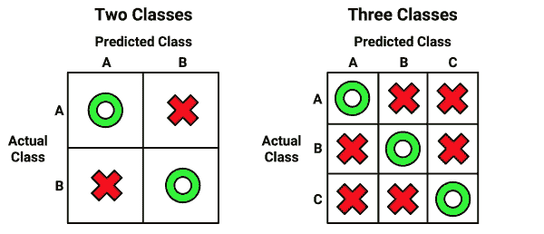

最常见的表现测量考虑模型辨别一个类与所有其他类的能力。感兴趣的类被称为**正**类，而所有其他类被称为**负**。

### 提示

术语“积极”和“消极”的使用并不意味着任何价值判断(即好与坏)，也不一定意味着结果存在或不存在(如出生缺陷与无缺陷)。积极结果的选择甚至可以是任意的，就像模型预测诸如晴天对雨天或狗对猫之类的类别一样。

正面类别预测和负面类别预测之间的关系可以描述为 2×2 混淆矩阵，该矩阵将预测是否属于以下四个类别中的一个列成表格:

*   **真阳性(TP)** :正确分类为感兴趣的类别
*   **真阴性(TN)** :正确分类为不感兴趣的类别
*   **假阳性(FP)** :错误分类为感兴趣的类别
*   **假阴性(FN)** :错误分类为不感兴趣的类别

对于垃圾邮件分类器，肯定的类别是`spam`，因为这是我们希望检测到的结果。然后我们可以想象如下图所示的混淆矩阵:

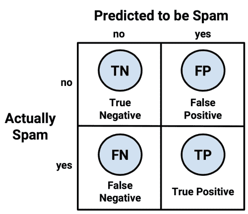

以这种方式呈现的混淆矩阵是模型表现的许多最重要的测量的基础。在下一节中，我们将使用这个矩阵来更好地理解准确性的含义。

## 使用混淆矩阵衡量表现

有了 2 x 2 混淆矩阵，我们可以将预测**准确性**(有时称为**成功率**)的定义形式化为:

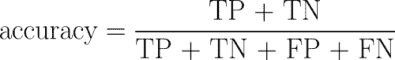

在这个公式中，术语 *TP* 、 *TN* 、 *FP* 和 *FN* 指的是模型预测落入这些类别的次数。因此，准确度是代表真阳性和真阴性的数量除以预测总数的比例。

**错误率**或错误分类样本的比例规定为:

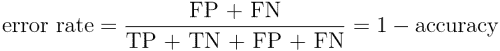

请注意，误差率可以计算为 1 减去精度。直觉上，这是有道理的；一个在 95%的时间里正确的模型，在 5%的时间里是不正确的。

将分类器的预测列表成混淆矩阵的一个简单方法是使用 R 的`table()`函数。为 SMS 数据创建混淆矩阵的命令如下所示。此表中的计数可用于计算准确性和其他统计数据:

```
> table(sms_results$actual_type, sms_results$predict_type)

 ham spam
 ham  1203    4
 spam   31  152

```

如果你想创建一个包含更多信息的混淆矩阵，那么`gmodels`包中的`CrossTable()`功能提供了一个可定制的解决方案。如果你还记得，我们在第二章、*管理和理解数据*中首次使用了这个函数。如果你当时没有安装软件包，你需要使用`install.packages("gmodels")`命令来安装。

默认情况下，`CrossTable()`输出包括每个单元格中的比例，该比例表示单元格计数占表格的行、列或总计数的百分比。输出还包括行和列的总计。如以下代码所示，语法类似于`table()`函数:

```
> library(gmodels)
> CrossTable(sms_results$actual_type, sms_results$predict_type)

```

结果是一个混乱矩阵，其中包含大量额外的细节:

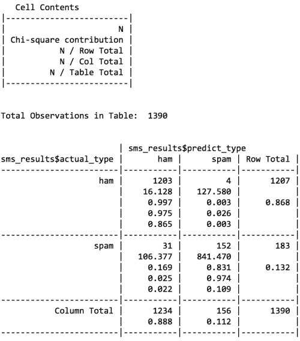

我们已经在前面几章中使用了`CrossTable()`，所以现在你应该对输出很熟悉了。如果您忘记了如何解释输出，只需参考键(标记为`Cell Contents`)，它提供了表格单元格中每个数字的定义。

我们可以使用混淆矩阵来获得准确性和错误率。由于精度是 *(TP + TN) / (TP + TN + FP + FN)* ，我们可以使用下面的命令来计算它:

```
> (152 + 1203) / (152 + 1203 + 4 + 31)
[1] 0.9748201

```

我们也可以将错误率 *(FP + FN) / (TP + TN + FP + FN)* 计算为:

```
> (4 + 31) / (152 + 1203 + 4 + 31)
[1] 0.02517986

```

这相当于 1 减去精度:

```
> 1 - 0.9748201
[1] 0.0251799

```

尽管这些计算看起来很简单，但练习思考混淆矩阵的组件如何相互关联是很重要的。在下一节中，您将看到如何以不同的方式组合这些相同的部分，以创建各种额外的表现评估。

## 超越准确性——表现的其他衡量标准

在医学、信息检索、市场营销和信号检测理论等各种不同的学科中，无数的表现测量已被开发并用于特定目的。涵盖所有这些内容可能会占据数百页，在这里进行全面的描述是不可行的。相反，我们将只考虑机器学习文献中最有用和最常引用的一些方法。

马克斯·库恩的分类和回归训练包`caret`包括计算许多这样的表现测量的函数。这个包提供了大量的工具来准备、训练、评估和可视化机器学习模型和数据。除了在这里使用之外，我们还将在[第 11 章](ch11.html "Chapter 11. Improving Model Performance")、*中广泛使用`caret`来提高模型表现*。在继续之前，您需要使用`install.packages("caret")`命令安装软件包。

### 提示

关于`caret`的更多信息，请参考:Kuhn M .使用 caret 包在 R 中构建预测模型。*统计杂志*软件。2008;28.

`caret`包添加了另一个函数来创建混淆矩阵。如下面的命令所示，语法类似于`table()`，但是有一点小的不同。因为`caret`提供了考虑分类正类的能力的模型表现的度量，所以应该指定一个`positive`参数。在这种情况下，由于 SMS 分类器旨在检测`spam`，我们将按如下方式设置`positive = "spam"`:

```
> library(caret)
> confusionMatrix(sms_results$predict_type,
 sms_results$actual_type, positive = "spam")

```

这导致了的如下输出:

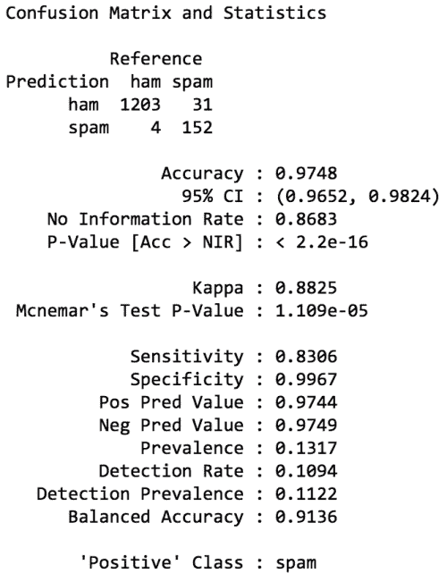

在输出的顶部是一个混淆矩阵，很像由`table()`函数产生的矩阵，但是被转置了。该输出还包括一套表现衡量标准。其中一些，如准确性，是熟悉的，而许多其他的是新的。让我们来看看几个最重要的指标。

### 卡帕统计

**kappa 统计量**(在之前的输出中标记为`Kappa`)通过单独考虑正确预测的可能性来调整准确性。这对于具有严重类别不平衡的数据集尤其重要，因为分类器可以简单地通过总是猜测最频繁的类别来获得高准确度。kappa 统计量只会奖励比这种简单策略更经常正确的分类器。

Kappa 值的范围从 0 到最大值 1，这表明模型的预测值与真实值完全一致。小于 1 的值表示不完全一致。根据模型的使用方式，对 kappa 统计的解释可能会有所不同。一种常见的解释如下所示:

*   不一致=小于 0.20
*   公平协议= 0.20 到 0.40
*   中度一致= 0.40 至 0.60
*   良好一致= 0.60 至 0.80
*   非常一致= 0.80 到 1.00

需要注意的是，这些类别是主观的。虽然“良好的一致”可能足以预测某人最喜欢的冰淇淋口味，但如果你的目标是识别出生缺陷，“非常好的一致”可能还不够。

### 提示

欲了解更多关于以前规模的信息，请参考:兰迪斯 JR，科赫 GG。分类数据观察者一致性的度量。*生物识别*。1997;33:159-174.

以下是计算 kappa 统计量的公式。在此公式中， *Pr(a)* 是指实际一致的比例，而 *Pr(e)* 是指分类器和真实值之间的预期一致，假设它们是随机选择的:

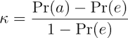

### 提示

定义 kappa 统计的方法不止一种。这里描述的最常见的方法使用**科恩的卡帕系数**，如论文中所述:科恩 j .名义尺度的一致系数。*教育和心理测量*。1960;20:37-46.

一旦你知道去哪里找，这些比例很容易从混乱矩阵中得到。让我们考虑用`CrossTable()`函数创建的 SMS 分类模型的混淆矩阵，为了方便起见，这里重复一遍:

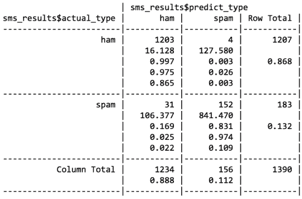

请记住，每个单元格中的底部值表示落入该单元格的所有实例的比例。因此，为了计算观察到的一致性 *Pr(a)* ，我们简单地将预测类型和实际 SMS 类型一致的所有实例的比例相加。因此，我们可以将 *Pr(a)* 计算为:

```
> pr_a <- 0.865 + 0.109
> pr_a
[1] 0.974

```

对于这个分类器来说，观察值和实际值在 97.4%的时间里是一致的——你会注意到这与精确度相同。kappa 统计调整相对于预期一致 *Pr(e)* 的准确度，预期一致是指在根据观察到的比例随机选择预测值和实际值的假设下，仅概率会导致预测值和实际值匹配的概率。

为了找到这些观察到的比例，我们可以使用我们在[第 4 章](ch04.html "Chapter 4. Probabilistic Learning – Classification Using Naive Bayes")、*概率学习-使用朴素贝叶斯分类*中学到的概率规则。假设两个事件是独立的(意味着一个事件不影响另一个事件)，概率规则指出两个事件发生的概率等于每个事件发生的概率的乘积。例如，我们知道双方选择火腿的概率是:

*Pr(实际类型为火腿)* Pr(预测类型为火腿)*

双方选择垃圾邮件的概率是:

*Pr(实际类型为垃圾邮件)* Pr(预测类型为垃圾邮件)*

预测或实际类型是垃圾邮件或 ham 的概率可以从行或列总计中获得。例如， *Pr(实际类型为火腿)= 0.868* 和 *Pr(预测类型为火腿)= 0.888* 。

*Pr(e)* 计算为预测值和实际值偶然一致的消息是垃圾邮件还是 ham 的概率之和。回想一下，对于互斥事件(不能同时发生的事件)，其中任何一个发生的概率都等于它们的概率之和。因此，要获得最终的 *Pr(e)* ，我们只需将两种产品相加，如以下命令所示:

```
> pr_e <- 0.868 * 0.888 + 0.132 * 0.112
> pr_e
[1] 0.785568

```

由于 Pr(e) 是 0.786，仅仅出于偶然，我们期望观察值和实际值在大约 78.6%的时间内是一致的。

这意味着我们现在有了完成卡帕公式所需的所有信息。将 *Pr(a)* 和 *Pr(e)* 值代入 kappa 公式，我们发现:

```
> k <- (pr_a - pr_e) / (1 - pr_e)
> k
[1] 0.8787494

```

kappa 约为 0.88，与之前`caret`输出的`confusionMatrix()`一致(小差是因为四舍五入)。使用建议的解释，我们注意到在分类器的预测和实际值之间有很好的一致性。

有几个 R 函数可以自动计算 kappa。可视化分类数据(`vcd)`包中的`Kappa()`函数(务必注意大写字母“K”)使用预测值和实际值的混淆矩阵。通过键入`install.packages("vcd")`安装软件包后，可以使用以下命令来获得 kappa:

```
> library(vcd)
> Kappa(table(sms_results$actual_type, sms_results$predict_type))
 value        ASE
Unweighted 0.8825203 0.01949315
Weighted   0.8825203 0.01949315

```

我们对未加权的卡帕头感兴趣。值 0.88 符合我们的预期。

### 提示

当存在不同程度的一致时，使用加权 kappa。例如，使用冷、冷、暖、热的等级，暖的值与热的一致性大于与冷的值的一致性。在两个结果事件的情况下，例如垃圾邮件和火腿，加权和未加权的 kappa 统计将是相同的。

评分者间可靠性(`irr`)包中的`kappa2()`函数可用于根据存储在数据帧中的预测值和实际值的向量计算 kappa。使用`install.packages("irr")`命令安装软件包后，可以使用以下命令获得 kappa:

```
> kappa2(sms_results[1:2])
 Cohen's Kappa for 2 Raters (Weights: unweighted)

 Subjects = 1390 
 Raters = 2 
 Kappa = 0.883 

 z = 33 
 p-value = 0

```

`Kappa()`和`kappa2()`函数报告相同的 kappa 统计，因此使用您更习惯的选项。

### 提示

注意不要使用内置的`kappa()`功能。与之前报道的 kappa 统计完全无关！

### 敏感性和特异性

找到一个有用的分类器通常需要在过于保守和过于激进的预测之间取得平衡。例如，一个电子邮件过滤器可以通过同时积极地清除几乎所有的垃圾邮件来保证清除所有的垃圾邮件。另一方面，要保证没有垃圾邮件被无意中过滤掉，可能需要我们允许大量垃圾邮件通过过滤器。一对表现指标捕捉到了这种权衡:敏感性和特异性。

一个模型的**敏感度**(也称为**真阳性率**)衡量被正确分类的阳性样本的比例。因此，如以下公式所示，它的计算方法是将正确分类(真阳性)和错误分类(假阴性)的阳性总数除以真阳性的数量:

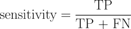

模型的**特异性**(也称为**真阴性率**)测量被正确分类的阴性样本的比例。与敏感度一样，敏感度的计算方法是真阴性的数量除以阴性总数，即真阴性加上假阳性:

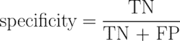

给定 SMS 分类器的混淆矩阵，我们可以很容易地手工计算这些度量。假设 spam 是肯定的类，我们可以确认`confusionMatrix()`输出中的数字是正确的。例如，敏感度的计算方法是:

```
> sens <- 152 / (152 + 31)
> sens
[1] 0.8306011

```

同样，对于特异性，我们可以计算:

```
> spec <- 1203 / (1203 + 4)
> spec
[1] 0.996686

```

`caret`包提供了直接从预测值和实际值的向量计算灵敏度和特异性的功能。注意要适当地指定`positive`或`negative`参数，如下面几行所示:

```
> library(caret)
> sensitivity(sms_results$predict_type, sms_results$actual_type,
 positive = "spam")
[1] 0.8306011

> specificity(sms_results$predict_type, sms_results$actual_type,
 negative = "ham")
[1] 0.996686

```

灵敏度和特异性的范围是从 0 到 1，接近 1 的值更理想。当然，在这两者之间找到适当的平衡是很重要的——这是一项经常与具体环境相关的任务。

例如，在这种情况下，敏感度 0.831 意味着 83.1%的垃圾邮件被正确地分类。类似地，0.997 的特异性意味着 99.7%的非垃圾邮件被正确分类，或者 0.3%的有效邮件被拒绝为垃圾邮件。拒绝 0.3%的有效短信的想法可能是不可接受的，或者考虑到垃圾邮件的减少，这可能是一个合理的权衡。

敏感性和特异性为思考这种权衡提供了工具。通常，会对模型进行更改，并测试不同的模型，直到找到一个符合所需灵敏度和特异性阈值的模型。可视化，如本章后面讨论的，也有助于理解敏感性和特异性之间的权衡。

### 精确度和召回率

与敏感性和特异性密切相关的是另外两个与分类折衷相关的表现指标:精确度和召回率。这些统计数据主要用于信息检索的上下文中，旨在提供模型结果的有趣程度和相关性的指示，或者预测是否被无意义的噪声所冲淡。

**精度**(也称为 **阳性预测值**)定义为确实为阳性的正例的比例；换句话说，当一个模型预测正类时，它的正确率是多少？精确的模型将仅在很可能是阳性的情况下预测阳性类别。会很值得信赖的。

想想如果模型非常不精确会发生什么。随着时间的推移，这些结果不太可能被信任。在信息检索的上下文中，这类似于 Google 这样的搜索引擎返回不相关的结果。最终，用户会转向必应这样的竞争对手。在垃圾短信过滤器的情况下，高精度意味着模型能够小心地只锁定垃圾短信，而忽略垃圾短信。

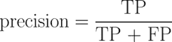

另一方面， **recall** 是对结果完整程度的度量。如以下公式所示，这被定义为真阳性的数量与阳性总数之比。你可能已经意识到这和敏感是一样的。然而，在这种情况下，解释略有不同。召回率高的模型捕获了大部分正面例子，这意味着它具有广泛的广度。例如，具有高召回率的搜索引擎返回大量与搜索查询相关的文档。类似地，如果大多数垃圾消息被正确识别，垃圾短信过滤器具有高召回率。

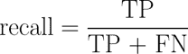

我们可以从混淆矩阵中计算精度和召回率。同样，假设`spam`是正类，精度是:

```
> prec <- 152 / (152 + 4)
> prec
[1] 0.974359

```

此次召回是:

```
> rec <- 152 / (152 + 31)
> rec
[1] 0.8306011

```

`caret`包可以用来从预测类和实际类的向量中计算这些度量。精度使用`posPredValue()`功能:

```
> library(caret)
> posPredValue(sms_results$predict_type, sms_results$actual_type,
 positive = "spam")
[1] 0.974359

```

虽然 recall 使用我们之前使用的`sensitivity()`功能:

```
> sensitivity(sms_results$predict_type, sms_results$actual_type, 
 positive = "spam")
[1] 0.8306011

```

类似于敏感性和特异性之间的内在权衡，对于现实世界中的大多数问题，很难建立一个同时具有高精度和高召回率的模型。如果你只瞄准容易摘到的果子，也就是容易分类的例子，那么很容易做到精确。类似地，一个模型很容易通过撒一个非常宽的网来获得高回忆，这意味着该模型在识别阳性病例时过于激进。相比之下，同时拥有高精度和高召回率是非常具有挑战性的。因此，为了找到满足项目需求的精确度和召回率的组合，测试各种模型是很重要的。

### F 值测量

将精确度和召回率结合成一个数字的模型表现的度量被称为**F-度量**(有时也被称为 **F [1] 分数**或**F-分数**)。F-measure 使用**调和平均值**结合了精度和召回，调和平均值是一种用于变化率的平均值。使用调和平均值而不是普通算术平均值，因为精确度和召回率都表示为 0 和 1 之间的比例，这可以解释为比率。以下是 F 值的计算公式:

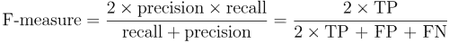

要计算 F 值，请使用之前计算的精度和召回值:

```
> f <- (2 * prec * rec) / (prec + rec)
> f
[1] 0.8967552

```

这与使用混淆矩阵中的计数得出的结果完全相同:

```
> f <- (2 * 152) / (2 * 152 + 4 + 31)
> f
[1] 0.8967552

```

由于 F-measure 用单个数字描述模型表现，因此它提供了一种并排比较多个模型的便捷方法。然而，这种假设认为精确度和召回率应该被赋予同等的权重，这种假设并不总是有效的。使用不同的权重来计算精确度和召回率的 F 分数是可能的，但是选择权重在最好的情况下可能是棘手的，在最坏的情况下可能是任意的。更好的做法是将 F-score 等指标与更全面地考虑模型优缺点的方法结合使用，如下一节所述。

## 可视化表现权衡

可视化有助于更详细地理解机器学习算法的表现。敏感性和特异性或精确度和回忆等统计数据试图将模型表现归结为一个数字，而可视化则描绘了学习者在各种条件下的表现。

因为学习算法具有不同的偏差，所以具有相似精度的两个模型可能在如何实现其精度方面存在巨大差异。一些模型可能会与其他人轻松做出的某些预测相冲突，同时轻松应对其他人无法做出正确预测的情况。可视化通过在单个图表中并排比较学习者，提供了理解这些权衡的方法。

`ROCR`包提供了一套易于使用的可视化函数，用于可视化分类模型的表现。它包括用于计算大量最常见的表现测量和可视化的函数。位于[http://rocr.bioinf.mpi-sb.mpg.de/](http://rocr.bioinf.mpi-sb.mpg.de/)的`ROCR`网站包括全套功能列表以及几个可视化功能的例子。在继续之前，使用`install.packages("ROCR")`命令安装软件包。

### 提示

有关 ROCR 发展的更多信息，请参见:Sing T，Sander O，Beerenwinkel N，Lengauer T . ROCR:r .*生物信息学*中的可视化分类器表现。2005;21:3940-3941.

要用`ROCR`创建可视化，需要两个数据向量。第一个必须包含预测的类值，第二个必须包含正类的估计概率。这些用于创建一个可通过`ROCR`的绘图功能检查的预测对象。

SMS 分类器的预测对象需要分类器估计的垃圾邮件概率和实际的分类标签。在以下行中使用`prediction()`功能组合这些:

```
> library(ROCR)
> pred <- prediction(predictions = sms_results$prob_spam,
 labels = sms_results$actual_type)

```

接下来，`performance()`函数将允许我们从刚刚创建的 `prediction`对象中计算表现度量，然后可以使用 R `plot()`函数可视化。给定这三个步骤，可以创建大量有用的可视化。

### ROC 曲线

**接收器工作特性(ROC)曲线**通常用于检查真阳性检测之间的权衡，同时避免假阳性。正如你可能从名字中怀疑的那样，ROC 曲线是由通信领域的工程师开发的。大约在第二次世界大战期间，雷达和无线电操作员使用 ROC 曲线来测量接收器区分真信号和假警报的能力。今天，同样的技术也可用于可视化机器学习模型的功效。

下图描述了典型 ROC 图的特征。曲线在图上定义，纵轴为真阳性的比例，横轴为假阳性的比例。因为这些值分别相当于灵敏度和(1–特异性)，所以该图也称为灵敏度/特异性图:

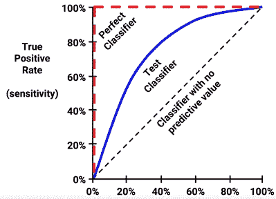

组成 ROC 曲线的点表示在不同假阳性阈值下的真阳性率。为了创建曲线，分类器的预测将按照模型对阳性类别的估计概率进行排序，最大值排在最前面。从原点开始，每个预测对真阳性率和假阳性率的影响将导致垂直(对于正确的预测)或水平(对于错误的预测)的曲线追踪。

为了说明这个概念，在前面的图中对比了三个假设的分类器。首先，从图的左下角到右上角的对角线代表一个没有预测值的**分类器。这种类型的分类器以完全相同的速度检测真阳性和假阳性，这意味着分类器无法区分两者之间的。这是判断其他分类器的基线。落在这条线附近的 ROC 曲线表明模型不是很有用。**完美分类器**有一条曲线以 100%的真阳性率和 0%的假阳性率通过该点。它能够在错误地分类任何阴性结果之前正确地识别所有阳性结果。大多数真实世界的分类器类似于测试分类器，它们介于完美和无用之间。**

曲线越接近完美的分类器，就越能识别正值。这可以使用 ROC 曲线下的面积(缩写为**AUC**)来测量。AUC 将 ROC 图视为二维正方形，并测量 ROC 曲线下的总面积。AUC 范围从 0.5(对于没有预测值的分类器)到 1.0(对于完美的分类器)。解释 AUC 分数的惯例使用类似于学术信函等级的系统:

*   **A** :突出= 0.9 到 1.0
*   **B** :优秀/良好= 0.8 到 0.9
*   **C** :可接受/一般= 0.7 到 0.8
*   **D** :差= 0.6 到 0.7
*   **E** :无歧视= 0.5 到 0.6

与大多数类似的量表一样，这些等级可能对某些任务比其他任务更有效；这种分类有些主观。

### 提示

还值得注意的是，两条 ROC 曲线的形状可能非常不同，但具有相同的 AUC。因此，单独的 AUC 可能会产生误导。最佳做法是将 AUC 与 ROC 曲线的定性检查结合使用。

用`ROCR`包创建 ROC 曲线包括从我们之前计算的`prediction`对象构建一个`performance`对象。由于 ROC 曲线绘制了真阳性率对假阳性率，我们只需调用`performance()`函数，同时指定`tpr`和`fpr`度量，如以下代码所示:

```
> perf <- performance(pred, measure = "tpr", x.measure = "fpr")

```

使用`perf`对象，我们可以用 R 的`plot()`函数可视化 ROC 曲线。如下面的代码行所示，可以使用许多调整可视化的标准参数，如`main`(添加标题)、`col`(更改线条颜色)和`lwd`(调整线条宽度):

```
> plot(perf, main = "ROC curve for SMS spam filter",
 col = "blue", lwd = 3)

```

尽管`plot()`命令足以创建一条有效的 ROC 曲线，但添加一条参考线来指示没有预测值的分类器的表现还是很有帮助的。

为了绘制这样一条线，我们将使用`abline()`函数。该功能可用于在斜率截距表中指定一条线，其中`a`是截距，`b`是斜率。由于我们需要一条穿过原点的身份线，我们将截距设置为`a=0`，斜率设置为`b=1`，如下图所示。`lwd`参数调整线条粗细，而`lty`参数调整线条类型。例如，`lty = 2`表示虚线:

```
> abline(a = 0, b = 1, lwd = 2, lty = 2)

```

最终结果是带有参考虚线的 ROC 图:

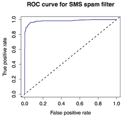

定性地，我们可以看到这条 ROC 曲线似乎占据了图表左上角的空间，这表明它比代表无用分类器的虚线更接近完美的分类器。为了定量证实这一点，我们可以使用 ROCR 软件包来计算 AUC。为此，我们首先需要创建另一个`performance`对象，这次指定`measure = "auc"`，如下面的代码所示:

```
> perf.auc <- performance(pred, measure = "auc")

```

由于`perf.auc`是一个 R 对象(具体称为 S4 对象)，我们需要使用一种特殊类型的符号来访问存储在其中的值。S4 对象在称为槽的位置保存信息。`str()`功能可用于查看对象的所有插槽:

```
> str(perf.auc)
Formal class 'performance' [package "ROCR"] with 6 slots
 ..@ x.name      : chr "None"
 ..@ y.name      : chr "Area under the ROC curve"
 ..@ alpha.name  : chr "none"
 ..@ x.values    : list()
 ..@ y.values    :List of 1
 .. ..$ : num 0.984
 ..@ alpha.values: list()

```

请注意，插槽以`@`符号为前缀。要访问 AUC 值，它作为列表存储在`y.values`槽中，我们可以使用`@`符号和`unlist()`函数，这将列表简化为一个数值向量:

```
> unlist(perf.auc@y.values)
[1] 0.9835862

```

SMS 分类器的 AUC 是 0.98，这是非常高的。但是我们如何知道这个模型对于另一个数据集是否也有同样好的表现呢？为了回答这样的问题，我们需要更好地理解我们可以在多大程度上超越测试数据来推断模型的预测。


# 评估未来表现

一些 R machine 学习包在模型构建过程中呈现了混淆矩阵和表现测量。这些统计数据的目的是提供关于模型的**替代误差**的信息，当训练数据被错误预测时，尽管模型是直接根据该数据构建的，也会出现这种情况。该信息可用作粗略的诊断，以识别明显表现不佳的人员。

重新替换错误不是未来表现的一个非常有用的标志。例如，一个使用死记硬背对每个训练实例进行完美分类且零替代错误的模型将无法将其预测推广到它从未见过的数据。由于这个原因，训练数据的错误率可以对模型的未来表现非常乐观。

不依赖于重置误差，更好的做法是根据尚未看到的数据评估模型的表现。在前面的章节中，当我们将可用数据分成一组用于训练和一组用于测试时，我们使用了这种方法。然而，在某些情况下，创建训练和测试数据集并不总是理想的。例如，在只有少量数据的情况下，您可能不想进一步减少样本。

幸运的是，还有其他方法可以根据看不见的数据来评估模型的表现。我们用来计算表现指标的`caret`软件包也提供了许多功能来估计未来的表现。如果您正在遵循 R 代码示例，并且还没有安装`caret`包，请安装。您还需要使用`library(caret)`命令将包加载到 R 会话中。

## 墨守法

我们在前面章节中使用的将数据划分为训练和测试数据集的过程被称为 **维持方法**。如下图所示，**训练数据集**用于生成模型，然后应用于**测试数据集**以生成评估预测。通常，大约三分之一的数据用于测试，三分之二用于训练，但这一比例会根据可用数据的数量而变化。为了确保训练和测试数据没有系统性差异，他们的例子被随机分为两组。

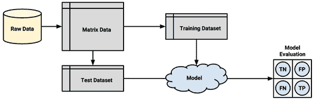

为了使维持方法能够真正准确地估计未来的表现，在任何时候都不能让测试数据集上的表现影响模型。根据重复测试的结果选择最佳模型很容易在不知不觉中违反这条规则。例如，假设我们在训练数据上建立了几个模型，并选择了在测试数据上具有最高准确性的模型。因为我们挑选了最好的结果，所以测试表现不是对看不见的数据的表现的无偏见的测量。

为了避免这个问题，最好是划分原始数据，以便除了训练数据集和测试数据集之外，还有一个**验证数据集**可用。验证数据集将用于迭代和改进所选的一个或多个模型，而测试数据集仅用作报告未来预测的估计误差率的最后一步。训练、测试和验证之间的典型比例分别为 50%、25%和 25%。

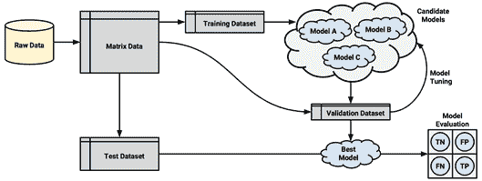

### 提示

敏锐的读者会注意到，前几章中使用了维持测试数据来评估模型和提高模型表现。这是为了说明的目的，但它确实会违反规则，如前所述。因此，显示的模型表现统计数据不是对未知数据的未来表现的有效估计，该过程可以更准确地称为验证。

创建维持样本的一种简单方法是使用随机数生成器将记录分配给分区。这种技术首次用于第 5 章、*分而治之——使用决策树和规则分类*来创建训练和测试数据集。

### 提示

如果您想了解以下示例，请从 Packt 发布网站下载`credit.csv`数据集，并使用`credit <- read.csv("credit.csv")`命令加载到数据框。

假设我们有一个名为 credit 的数据帧，有 1000 行数据。我们可以把它分成如下三个分区。首先，我们使用`runif()`函数创建一个从 1 到 1000 的随机排序的行 id 的向量，默认情况下，它生成 0 到 1 之间的指定数量的随机值。`runif()`函数因随机均匀分布而得名，在[第 2 章](ch02.html "Chapter 2. Managing and Understanding Data")、*管理和理解数据*中讨论过。

```
> random_ids <- order(runif(1000))

```

这里使用的`order()`返回一个向量，表示 1000 个随机数的排名顺序。例如，`order(c(0.5, 0.25, 0.75, 0.1))`返回序列`4 2 1 3`，因为最小的数字(0.1)出现在第四位，第二小的数字(0.25)出现在第二位，依此类推。

我们可以使用得到的随机 id 将`credit`数据帧分成 500、250 和 250 条记录，包括训练、验证和测试数据集:

```
> credit_train <- credit[random_ids[1:500], ]
> credit_validate <- credit[random_ids[501:750], ]
> credit_test <- credit[random_ids[751:1000], ]

```

维持采样的一个问题是，每个分区可能有更大或更小比例的某些类。在某些情况下，特别是在类只占数据集很小一部分的情况下，这可能会导致某个类从训练数据集中被忽略。这是一个重大的问题，因为模型将无法学习这个类。

为了减少这种情况的发生，可以使用一种叫做**分层随机抽样**的技术。虽然从长远来看，随机样本应包含与完整数据集大致相同比例的每个类值，但分层随机采样保证随机分区中每个类的比例与完整数据集几乎相同，即使某些类很小。

`caret`包提供了一个`createDataPartition()`函数，它将基于分层维持采样创建分区。以下命令显示了为`credit`数据集创建训练和测试数据分层样本的代码。要使用该函数，除了参数`p`之外，还必须指定类值的向量(这里，`default`指的是贷款是否违约)，该参数指定要包含在分区中的实例的比例。`list = FALSE`参数阻止结果以列表格式存储:

```
> in_train <- createDataPartition(credit$default, p = 0.75,
 list = FALSE)
> credit_train <- credit[in_train, ]
> credit_test <- credit[-in_train, ]

```

`in_train`向量指示训练样本中包括的行号。我们可以使用这些行号为`credit_train`数据框选择示例。类似地，通过使用负号，我们可以将在`in_train`向量中找不到的行用于`credit_test`数据集。

尽管分层抽样平均分配了各个阶层，但并不能保证其他类型的代表性。一些样本可能有太多或太少的困难案例、容易预测的案例或异常值。对于较小的数据集来说尤其如此，这些数据集可能没有足够大的案例部分来划分到训练集和测试集中。

除了可能有偏差的样本，维持方法的另一个问题是必须保留大部分的数据来测试和验证模型。由于这些数据不能用来训练模型，直到它的表现已被测量，表现估计可能过于保守。

### 提示

由于在较大数据集上训练的模型通常表现更好，所以常见的做法是在选择和评估最终模型之后，在完整数据集上重新训练模型(即训练加测试和验证)。

一种叫做**重复保持**的技术有时被用来缓解随机组成的训练数据集的问题。重复维持方法是维持方法的一个特例，它使用多个随机维持样本的平均结果来评估模型的表现。由于使用了多个维持样本，因此不太可能根据非代表性数据对模型进行定型或测试。我们将在下一节详细阐述这个想法。

### 交叉验证

重复维持是一种称为 **k 倍交叉验证**(或 **k 倍 CV** )的技术的基础，这种技术已经成为评估模型表现的行业标准。k-fold CV 将数据随机划分为 *k* 个部分，以完全分离被称为**折叠**的随机分区，而不是采取重复的随机样本，这些样本可能会多次使用同一个记录。

虽然 *k* 可以设置为任意数，但到目前为止，最常见的约定是使用 **10 重交叉验证** (10 重 CV)。为什么 10 折？原因是经验证据表明，使用更大的数字几乎没有增加收益。对于 10 个折叠中的每一个(每个折叠包括总数据的 10%)，机器学习模型建立在剩余的 90%的数据上。文件夹匹配 10%样本然后用于模型评估。训练和评估模型的过程发生 10 次后(10 个不同的训练/测试组合)，报告所有褶皱的平均表现。

### 提示

k-fold CV 的一个极端例子是**留一法**，它对每个数据实例使用一个 fold 来执行 k-fold CV。这确保了使用最大量的数据来训练模型。虽然这看起来很有用，但是计算量很大，所以很少在实践中使用。

可以使用`caret`包中的`createFolds()`函数创建交叉验证数据集。类似于分层随机维持采样，该函数将尝试在每个折叠中保持与原始数据集中相同的类别平衡。以下是创建 10 个折叠的命令:

```
> folds <- createFolds(credit$default, k = 10)

```

`createFolds()`函数的结果是一个向量列表，存储每个请求的`k = 10`折叠的行号。我们可以偷看一下内容，用`str()`:

```
> str(folds)
List of 10
 $ Fold01: int [1:100] 1 5 12 13 19 21 25 32 36 38 ...
 $ Fold02: int [1:100] 16 49 78 81 84 93 105 108 128 134 ...
 $ Fold03: int [1:100] 15 48 60 67 76 91 102 109 117 123 ...
 $ Fold04: int [1:100] 24 28 59 64 75 85 95 97 99 104 ...
 $ Fold05: int [1:100] 9 10 23 27 29 34 37 39 53 61 ...
 $ Fold06: int [1:100] 4 8 41 55 58 103 118 121 144 146 ...
 $ Fold07: int [1:100] 2 3 7 11 14 33 40 45 51 57 ...
 $ Fold08: int [1:100] 17 30 35 52 70 107 113 129 133 137 ...
 $ Fold09: int [1:100] 6 20 26 31 42 44 46 63 79 101 ...
 $ Fold10: int [1:100] 18 22 43 50 68 77 80 88 106 111 ...

```

这里，我们看到第一个折叠被命名为`Fold01`并存储了`100`整数，表示第一个折叠的信用数据帧中的 100 行。要创建训练和测试数据集来构建和评估模型，还需要一个额外的步骤。以下命令显示了如何为第一次折叠创建数据。我们将选定的 10%分配给测试数据集，并使用负号将剩余的 90%分配给训练数据集:

```
> credit01_test <- credit[folds$Fold01, ]
> credit01_train <- credit[-folds$Fold01, ]

```

为了执行完整的 10 倍 CV，该步骤将需要总共重复 10 次；构建模型，然后每次计算模型的表现。最后，将对表现指标进行平均，以获得整体表现。幸运的是，我们可以通过应用我们之前学到的一些技术来自动完成这项任务。

为了演示过程，我们将使用 10 倍 CV 来估计信贷数据的 C5.0 决策树模型的 kappa 统计量。首先，我们需要加载一些 R 包:`caret`(创建折叠)、`C50`(决策树)和`irr`(计算 kappa)。出于说明目的，选择了后两个包；如果您愿意，您可以使用不同的模型或不同的表现评估以及相同的一系列步骤。

```
> library(caret)
> library(C50)
> library(irr)

```

接下来，我们将像前面一样创建一个包含 10 个折叠的列表。这里使用`set.seed()`函数是为了确保如果再次运行相同的代码，结果是一致的:

```
> set.seed(123)
> folds <- createFolds(credit$default, k = 10)

```

最后，我们将使用`lapply()`功能对折叠列表应用一系列相同的步骤。如下面的代码所示，因为没有现有的函数能完全满足我们的需求，所以我们必须定义自己的函数来传递给`lapply()`。我们的自定义函数将信用数据框架分为训练数据和测试数据，使用`C5.0()`函数对训练数据构建决策树，从测试数据生成一组预测，并使用`kappa2()`函数比较预测值和实际值:

```
> cv_results <- lapply(folds, function(x) {
 credit_train <- credit[-x, ]
 credit_test <- credit[x, ]
 credit_model <- C5.0(default ~ ., data = credit_train)
 credit_pred <- predict(credit_model, credit_test)
 credit_actual <- credit_test$default
 kappa <- kappa2(data.frame(credit_actual, credit_pred))$value
 return(kappa)
 })

```

得到的 kappa 统计数据被编译成一个存储在`cv_results`对象中的列表，我们可以使用`str()`来检查它:

```
> str(cv_results)
List of 10
 $ Fold01: num 0.343
 $ Fold02: num 0.255
 $ Fold03: num 0.109
 $ Fold04: num 0.107
 $ Fold05: num 0.338
 $ Fold06: num 0.474
 $ Fold07: num 0.245
 $ Fold08: num 0.0365
 $ Fold09: num 0.425
 $ Fold10: num 0.505

```

10 倍 CV 过程只剩下一个步骤:我们必须计算这 10 个值的平均值。尽管您很想输入`mean(cv_results)`，因为`cv_results`不是一个数字向量，结果将是一个错误。相反，使用`unlist()`函数，它消除了列表结构，并将`cv_results`简化为一个数字向量。从这里，我们可以按预期计算平均 kappa:

```
> mean(unlist(cv_results))
[1] 0.283796

```

该 kappa 统计值相当低，对应于解释尺度上的“一般”,这表明信用评分模型的表现仅比随机机会稍好。在下一章中，我们将考察基于 10 重 CV 的自动化方法，这些方法可以帮助我们改进这个模型的表现。

### 提示

也许目前可靠估计模型表现的黄金标准方法是**重复 k 倍 CV** 。正如你可能从名字中猜到的，这涉及到重复应用 k-fold CV 并平均结果。常见的策略是执行 10 倍 CV 十次。虽然它是计算密集型的，但它提供了一个非常稳健的估计。

### 自助抽样

一种稍微不太常用的 k 倍 CV 替代方案被称为**自举采样**，简称**自举**或**自举**。一般来说，这些指的是使用数据的随机样本来估计更大集合的属性的统计方法。当这个原理应用于机器学习模型表现时，它意味着创建几个随机选择的训练和测试数据集，然后用于估计表现统计。然后对各种随机数据集的结果进行平均，以获得对未来表现的最终估计。

那么，这个程序和 k-fold CV 有什么不同呢？交叉验证将数据划分到单独的分区中，在这些分区中，每个示例只能出现一次，而 bootstrap 允许通过使用替换的**采样过程多次选择示例。这意味着从最初的 *n* 个示例的数据集，引导程序将创建一个或多个新的训练数据集，这些数据集也将包含 *n* 个示例，其中一些是重复的。然后，从没有为相应的训练数据集选择的一组例子中构建相应的测试数据集。**

使用如前所述的替换抽样，任何给定实例被包括在训练数据集中的概率是 63.2%。因此，任何实例出现在测试数据集中的概率是 36.8%。换句话说，训练数据仅代表 63.2%的可用示例，其中一些是重复的。与使用 90%的样本进行训练的 10 倍 CV 相比，bootstrap 样本不太能代表整个数据集。

因为只在 63.2%的训练数据上训练的模型可能比在更大的训练集上训练的模型表现更差，所以 bootstrap 的表现估计可能会大大低于稍后在完整数据集上训练模型时获得的表现估计。一个称为 **0.632 自举**的自举特例通过计算作为训练数据(过于乐观)和测试数据(过于悲观)表现函数的最终表现测量来说明这一点。最终误差率估计如下:

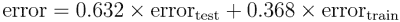

与交叉验证相比，bootstrap 的一个优势是它更适合非常小的数据集。此外，bootstrap 采样还具有表现测量以外的应用。特别是，在下一章中，我们将学习如何使用 bootstrap 抽样的原理来提高模型的表现。


# 总结

本章介绍了一些最常用的评估机器学习分类模型表现的方法和技术。虽然准确性提供了一种简单的方法来检查模型正确的频率，但在罕见事件的情况下，这可能会产生误导，因为此类事件的实际成本可能与它们出现的频率成反比。

基于混淆矩阵的许多措施更好地捕捉了各种类型的错误的成本之间的平衡。仔细检查灵敏度和特异性之间的权衡，或者精确度和回忆之间的权衡，对于思考现实世界中错误的含义是一个有用的工具。可视化，如 ROC 曲线，也有助于实现这一目标。

同样值得一提的是，有时衡量模型表现的最佳方法是考虑它满足或不满足其他目标的程度。例如，您可能需要用简单的语言解释模型的逻辑，这将排除一些模型。此外，即使它执行得非常好，一个太慢或难以扩展到生产环境的模型也是完全无用的。

测量表现的一个明显的扩展是识别自动的方法来为特定的任务找到最佳的模型。在下一章中，我们将在目前工作的基础上，通过系统地迭代、提炼和组合学习算法来研究制造更智能模型的方法。