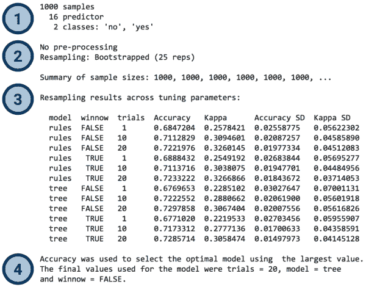
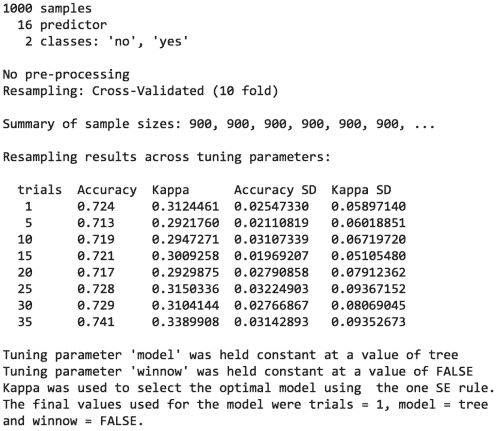
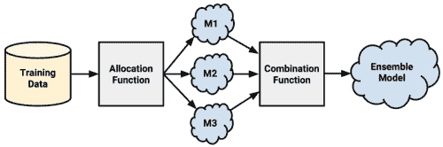
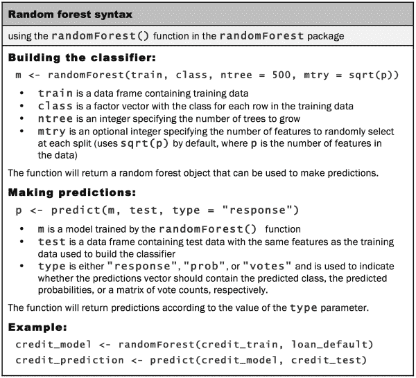

# 十、提高模型表现

当一个运动队没有达到它的目标时——无论目标是获得奥运会金牌、联赛冠军还是世界纪录——它必须寻找可能的改进。想象你是球队的教练。你会如何度过你的练习课？也许你会指导运动员更努力地训练或进行不同的训练，以最大限度地发挥他们的每一点潜力。或者，你可以强调更好的团队合作，更聪明地利用运动员的长处和短处。

现在想象你正在训练一个世界冠军机器学习算法。也许你希望在数据挖掘比赛中竞争，比如那些发布在 Kaggle(【http://www.kaggle.com/competitions】)上的比赛。也许你只是需要改善业务成果。你从哪里开始？尽管背景不同，人们用来提高运动队成绩的策略也可以用来提高统计学习者的成绩。

作为教练，你的工作是找到训练技巧和团队合作技能的结合，让你达到你的表现目标。本章以本书涵盖的材料为基础，介绍一套提高机器学习者预测表现的技术。您将了解到:

*   如何通过系统地搜索一组最佳的训练条件来自动进行模型表现调整
*   将模型组合成小组的方法，使用团队合作来解决困难的学习任务
*   如何应用决策树的一种变体，这种变体由于其令人印象深刻的表现而迅速流行起来

这些方法中没有一种能解决所有问题。然而，看看机器学习竞赛的获奖作品，你可能会发现其中至少有一个被雇用了。为了具有竞争力，你也需要将这些技能加入到你的技能中。

# 调整股票模型以获得更好的表现

一些学习问题非常适合前几章介绍的股票模型。在这种情况下，可能没有必要花太多时间迭代和细化模型；它可能已经表现得足够好了。另一方面，有些问题本来就更难。要学习的基本概念可能极其复杂，需要理解许多微妙的关系，或者它可能受到随机变化的影响，从而难以在噪声中定义信号。

开发在困难问题上表现极佳的模型既是一门科学，也是一门艺术。有时，当试图确定表现可以改进的领域时，一点直觉是有帮助的。在其他情况下，寻找改进将需要一个蛮力，尝试和错误的方法。当然，使用自动化程序可以帮助搜索许多可能的改进。

在[第 5 章](ch05.html "Chapter 5. Divide and Conquer – Classification Using Decision Trees and Rules")、*分而治之——使用决策树和规则分类*中，我们尝试了一个难题:识别可能违约的贷款。尽管我们能够使用表现调优方法获得大约 82%的可观分类精度，但是在第 10 章、*评估模型表现*中进行更仔细的检查后，我们意识到高精度有点误导。尽管具有合理的准确性，kappa 统计值仅为约 0.28，这表明该模型实际上表现不佳。在这一节中，我们将重温信用评分模型，看看我们是否可以改善结果。

### 提示

为了跟随示例，从 Packt 发布网站下载`credit.csv`文件，并将其保存到您的 R 工作目录中。使用命令`credit <- read.csv("credit.csv")`将文件加载到 R 中。

您会记得，我们首先使用股票 C5.0 决策树来构建信用数据的分类器。然后，我们试图通过调整`trials`参数来增加增强迭代的次数，从而提高它的表现。通过将迭代次数从默认值 1 增加到 10，我们能够提高模型的准确性。调整模型选项以确定最佳拟合的过程称为**参数** **调整**。

参数调整不限于决策树。例如，当我们搜索 k 的最佳值时，我们调整了 k-NN 模型。我们还调整了神经网络和支持向量机，调整了节点或隐藏层的数量，或者选择了不同的核函数。大多数机器学习算法允许调整至少一个参数，最复杂的模型提供了大量调整模型拟合的方法。虽然这使得模型能够紧密地适应学习任务，但所有可能选项的复杂性可能令人望而生畏。需要一种更系统的方法。

## 使用插入符号进行自动参数调整

与其为模型的每个参数选择任意的值——这项任务不仅乏味，而且有些不科学——还不如在许多可能的参数值中进行搜索，以找到最佳组合。

我们在[第 10 章](ch10.html "Chapter 10. Evaluating Model Performance")、*评估模型表现*中广泛使用的`caret`包提供了帮助自动参数调整的工具。核心功能由一个`train()`函数提供，该函数作为超过 175 个不同机器学习模型的标准化接口，用于分类和回归任务。通过使用该功能，可以选择评估方法和指标来自动搜索最佳模型。

### 提示

不要被大量的模型弄得不知所措——我们已经在前面的章节中介绍了很多。其他的是基本概念的简单变体或扩展。鉴于目前为止您所学的内容，您应该相信自己有能力理解所有可用的方法。

自动参数调整要求您考虑三个问题:

*   应该在数据上训练什么类型的机器学习模型(和具体实现)？
*   哪些模型参数可以调整，应该调整到什么程度才能找到最佳设置？
*   应该使用什么标准来评估模型以找到最佳候选？

回答第一个问题涉及到在机器学习任务和 175 个模型之一之间找到一个非常合适的匹配。显然，这需要对机器学习模型的广度和深度有所了解。这也有助于排除过程。根据任务是分类还是数值预测，可以淘汰将近一半的模型；基于数据的格式或避免黑盒模型的需要，可以排除其他的。在任何情况下，也没有理由不尝试几种方法并比较每种方法的最佳结果。

解决第二个问题在很大程度上取决于模型的选择，因为每个算法都使用一组独特的参数。下表列出了本书涵盖的预测模型可用的调整参数。请记住，虽然有些型号有未显示的附加选项，但只有那些在表中列出的选项受`caret`支持进行自动调谐。

| 

模型

 | 

学习任务

 | 

方法名称

 | 

因素

 |
| --- | --- | --- | --- |
| k-最近邻 | 分类 | `knn` | `k` |
| 朴素贝叶斯 | 分类 | `nb` | `fL`，`usekernel` |
| 决策树 | 分类 | `C5.0` | `model`、`trials`、`winnow` |
| OneR 规则学习者 | 分类 | `OneR` | 没有人 |
| RIPPER 规则学习者 | 分类 | `JRip` | `NumOpt` |
| 线性回归 | 回归 | `lm` | 没有人 |
| 回归树 | 回归 | `rpart` | `cp` |
| 模型树 | 回归 | `M5` | `pruned`、`smoothed`、`rules` |
| 神经网络 | 双重用途 | `nnet` | `size`，`decay` |
| 支持向量机(线性核) | 双重用途 | `svmLinear` | `C` |
| 支持向量机(径向基核) | 双重用途 | `svmRadial` | `C, sigma` |
| 随机森林 | 双重用途 | `rf` | `mtry` |

### 提示

关于`caret`涵盖的模型和相应调整参数的完整列表，请参考软件包作者 Max Kuhn 在[http://topepo.github.io/caret/modelList.html](http://topepo.github.io/caret/modelList.html)提供的表格。

如果您忘记了特定型号的调谐参数，可以使用`modelLookup()`功能找到它们。只需提供方法名，如 C5.0 模型所示:

```
> modelLookup("C5.0")
 model parameter                 label forReg forClass probModel
1  C5.0    trials # Boosting Iterations  FALSE     TRUE      TRUE
2  C5.0     model            Model Type  FALSE     TRUE      TRUE
3  C5.0    winnow                Winnow  FALSE     TRUE      TRUE

```

自动调谐的目标是搜索一组候选模型，包括参数组合的矩阵或**网格**。因为搜索每一个可能的组合是不切实际的，所以只使用一个可能性的子集来构建网格。默认情况下，`caret`为每个 *p* 参数最多搜索三个值。这意味着最多 *3^p* 候选车型将接受测试。比如默认情况下，K 近邻自动调优会将 *3^1 = 3* 候选模型与`k=5`、`k=7`、`k=9`进行比较。类似地，调整决策树将导致多达 27 个不同候选模型的比较，包括`model`、`trials`和`winnow`设置的 *3^3 = 27* 组合的网格。然而，实际上只有 12 个模型被测试。这是因为`model`和`winnow`参数只能取两个值(分别是`tree`对`rules`和`TRUE`对`FALSE`)，使得网格大小 *3 * 2 * 2 = 12* 。

### 提示

由于默认的搜索网格对于您的学习问题可能不理想，`caret`允许您提供一个由简单命令定义的自定义搜索网格，我们将在后面介绍。

自动模型调整的第三步也是最后一步涉及在候选模型中识别最佳模型。这使用了在[第 10 章](ch10.html "Chapter 10. Evaluating Model Performance")、*评估模型表现*中讨论的方法，例如选择用于创建训练和测试数据集的重采样策略，以及使用模型表现统计数据来测量预测准确性。

所有的重采样策略和我们所学的许多表现统计都受到`caret`的支持。这些包括诸如准确性和 kappa(对于分类器)以及 R 平方或 RMSE(对于数值模型)的统计数据。如果需要，也可以使用成本敏感指标，如灵敏度、特异性和 ROC 曲线下面积(AUC)。

默认情况下，`caret`将选择具有最大期望表现测量值的候选模型。由于这种做法有时会导致选择通过大幅增加模型复杂性来实现边际表现改善的模型，因此提供了替代的模型选择函数。

考虑到选项的多样性，许多默认值都是合理的，这很有帮助。例如，`caret`将使用 bootstrap 样本的预测精度来选择分类模型的最佳表现者。从这些默认值开始，我们可以调整`train()`函数来设计多种多样的实验。

### 创建简单的优化模型

为了说明调优模型的过程，让我们从观察当我们试图使用`caret`包的默认设置调优信用评分模型时会发生什么开始。从那里，我们将根据我们的喜好调整选项。

调整学习者最简单的方法是通过`method`参数指定一个模型类型。由于我们之前在信用模型中使用了 C5.0 决策树，我们将通过优化这个学习者来继续我们的工作。使用默认设置调整 C5.0 决策树的基本`train()`命令如下:

```
> library(caret)
> set.seed(300)
> m <- train(default ~ ., data = credit, method = "C5.0")

```

首先，`set.seed()`函数用于将 R 的随机数发生器初始化到设定的起始位置。您可能还记得，我们在前几章中使用过这个函数。通过设置`seed`参数(在本例中为任意数字 300)，随机数将遵循预定义的序列。这允许使用随机采样的模拟以相同的结果重复进行——如果您共享代码或试图复制先前的结果，这是一个非常有用的功能。

接下来，我们使用 R 公式接口将一棵树定义为`default ~ .`。该模型使用`credit`数据框中的所有其他特征对贷款违约状态(`yes`或`no`)进行建模。参数`method = "C5.0"`告诉`caret`使用 C5.0 决策树算法。

输入前面的命令后，在调整过程中可能会有很长时间的延迟(取决于计算机的表现)。即使这是一个相当小的数据集，也必须进行大量的计算。r 必须重复生成随机的数据样本，构建决策树，计算表现统计，并评估结果。

实验结果保存在名为`m`的对象中。如果你想检查对象的内容，`str(m)`命令会列出所有相关的数据，但这可能会让人不知所措。取而代之的是，只需输入对象的名称，就可以得到结果的简明摘要。例如，键入`m`会产生以下输出(注意，为了清楚起见，添加了标签):



标签突出显示了输出中的四个主要组件:

1.  **输入数据集**的简要描述:如果您熟悉自己的数据，并且已经正确应用了`train()`函数，那么这个信息应该不会令人惊讶。
2.  **应用的预处理和重采样方法的报告**:在这里，我们看到 25 个引导样本，每个包括 1000 个例子，用于训练模型。
3.  **已评估的候选模型列表**:在这一部分，我们可以确认根据三个 C5.0 调整参数——`model`、`trials`和`winnow`的组合，测试了 12 个不同的模型。还显示了每个候选模型的精确度和 kappa 统计的平均值和标准偏差。
4.  **最佳模型的选择**:如脚注所述，选择了精确度最高的模型。这是一个使用决策树的模型，有 20 个试验和设定`winnow = FALSE`。

在识别出最佳模型后，`train()`函数使用其调整参数在完整的输入数据集上构建一个模型，该模型作为`m$finalModel`存储在`m`列表对象中。在大多数情况下，你不需要直接使用`finalModel`子对象。相反，简单地使用`predict()`函数和`m`对象，如下所示:

```
> p <- predict(m, credit)

```

预测的结果向量如预期的那样工作，允许我们创建一个混淆矩阵来比较预测值和实际值:

```
> table(p, credit$default)

p      no yes
 no  700   2
 yes   0 298

```

在用于训练最终模型的 1000 个样本中，只有两个被错误分类。但是，值得注意的是，由于模型是建立在训练和测试数据的基础上的，这种准确性是乐观的，因此不应被视为对未知数据的表现的指示。73%的引导估计值(显示在摘要输出中)是对未来表现的更现实的估计。

除了自动参数调整之外，使用`train()`和`predict()`功能还有几个好处。

首先，`train()`功能应用的任何数据准备步骤将同样应用于用于生成预测的数据。这包括诸如居中和缩放以及缺失值插补之类的变换。允许`caret`处理数据准备将确保在部署模型时，有助于最佳模型表现的步骤将保持不变。

第二，`predict()`函数提供了一个标准化的接口，用于获取预测的类值和类概率，即使对于通常需要额外步骤来获取这些信息的模型类型也是如此。默认情况下提供预测类:

```
> head(predict(m, credit))
[1] no  yes no  no  yes no
Levels: no yes

```

要获得每个类别的估计概率，请使用`type = "prob"`参数:

```
> head(predict(m, credit, type = "prob"))
 no        yes
1 0.9606970 0.03930299
2 0.1388444 0.86115561
3 1.0000000 0.00000000
4 0.7720279 0.22797208
5 0.2948062 0.70519385
6 0.8583715 0.14162851

```

即使在基础模型引用使用不同字符串的预测概率的情况下(例如，`naiveBayes`模型的`"raw"`),`predict()`函数将在后台将`type = "prob"`转换为适当的字符串。

### 定制调谐过程

我们之前创建的决策树展示了`caret`包以最少的干预生成优化模型的能力。默认设置允许轻松创建优化模型。然而，也可以将默认设置更改为更具体的学习任务，这可能有助于释放高层次的表现。

模型选择过程中的每一步都可以定制。为了说明这种灵活性，让我们修改我们在信用决策树上的工作，以反映我们在第 10 章、*评估模型表现*中使用的流程。如果你还记得的话，我们曾经用 10 倍交叉验证来估计 kappa 统计。我们将在这里做同样的事情，使用 kappa 来优化决策树的 boosting 参数。请注意，决策树增强之前已在第 5 章、*分而治之——使用决策树和规则分类*中介绍过，本章后面也会详细介绍。

`trainControl()`功能用于创建一组配置选项，称为**控制对象**，其指导`train()`功能。这些选项允许管理模型评估标准，例如用于选择最佳模型的重采样策略和测量。虽然这个函数几乎可以用于修改调优实验的每个方面，但是我们将重点关注两个重要的参数:`method`和`selectionFunction`。

### 提示

如果您渴望了解更多细节，您可以使用`?trainControl`命令获得所有参数的列表。

对于`trainControl()`函数，`method`参数用于设置重采样方法，如维持采样或 k 倍交叉验证。下表列出了可能的方法类型以及用于调整样品大小和迭代次数的任何附加参数。尽管这些重采样方法的默认选项遵循流行的约定，但是您可以根据数据集的大小和模型的复杂性来选择调整这些选项。

| 

重采样方法

 | 

方法名称

 | 

附加选项和默认值

 |
| --- | --- | --- |
| 保持采样 | `LGOCV` | `p = 0.75`(训练数据比例) |
| k 倍交叉验证 | `cv` | `number = 10`(折叠次数) |
| 重复 k 倍交叉验证 | `repeatedcv` | `number = 10`(折叠次数)`repeats = 10`(迭代次数) |
| 自助抽样 | `boot` | `number = 25`(重采样迭代) |
| 0.632 自举 | `boot632` | `number = 25`(重采样迭代) |
| 留一交叉验证 | `LOOCV` | 没有人 |

`selectionFunction`参数用于指定在各种候选模型中选择最佳模型的功能。包括三个这样的函数。`best`函数简单地选择在指定的表现测量上具有最佳值的候选。这是默认使用的。其他两个函数用于选择最节省或最简单的模型，该模型在最佳模型表现的某个阈值内。`oneSE`功能在最佳表现的一个标准误差内选择最简单的候选，而`tolerance`在用户指定的百分比内使用最简单的候选。

### 提示

有些主观性与`caret`包简单的模型排序有关。有关如何排列模型的信息，请通过在 R 命令提示符下键入`?best`来查看选择功能的帮助页面。

要创建一个名为`ctrl`的控制对象，它使用 10 重交叉验证和`oneSE`选择函数，使用下面的命令(注意`number = 10`只是为了清楚起见；因为这是`method = "cv"`的默认值，所以可以省略):

```
> ctrl <- trainControl(method = "cv", number = 10,
 selectionFunction = "oneSE")

```

我们很快就会用到这个函数的结果。

同时，定义我们实验的下一步是创建要优化的参数网格。网格必须包含一个以所需模型中的每个参数命名的列，以句点为前缀。它还必须为每个所需的参数值组合包含一行。因为我们使用的是 C5.0 决策树，这意味着我们需要名为`.model`、`.trials`和`.winnow`的列。对于其他机器学习模型，请参考本章前面给出的表格，或使用`modelLookup()`功能，如前所述查找参数。

我们可以使用`expand.grid()`函数，从提供的所有值的组合中创建数据框，而不是逐个单元格地填充该数据框——如果参数值有许多可能的组合，这是一项繁琐的任务。例如，假设我们希望在搜索八个不同的试验值时保持常数`model = "tree"`和`winnow = "FALSE"`。这可以创建为:

```
> grid <- expand.grid(.model = "tree",
 .trials = c(1, 5, 10, 15, 20, 25, 30, 35),
 .winnow = "FALSE")

```

生成的格网数据框包含 *1 * 8 * 1 = 8* 行:

```
> grid
 .model .trials .winnow
1   tree       1   FALSE
2   tree       5   FALSE
3   tree      10   FALSE
4   tree      15   FALSE
5   tree      20   FALSE
6   tree      25   FALSE
7   tree      30   FALSE
8   tree      35   FALSE

```

`train()`函数将使用每行的模型参数组合构建一个候选模型进行评估。

给定这个搜索网格和之前创建的控制列表，我们准备运行一个完全定制的`train()`实验。正如我们之前所做的，我们将随机种子设置为任意数字`300`，以确保可重复的结果。但是这一次，我们将传递我们的控制对象和调整网格，同时添加一个参数`metric = "Kappa"`，指示模型评估函数要使用的统计数据——在本例中为`"oneSE"`。完整的命令如下:

```
> set.seed(300)
> m <- train(default ~ ., data = credit, method = "C5.0",
 metric = "Kappa",
 trControl = ctrl,
 tuneGrid = grid)

```

这将产生一个对象，我们可以通过键入其名称来查看它:

```
> m

```



尽管大部分输出类似于自动调优的模型，但还是有一些值得注意的差异。由于使用了 10 重交叉验证，构建每个候选模型的样本量减少到 900，而不是 bootstrap 中使用的 1000。按照我们的要求，测试了八个候选模型。此外，因为`model`和`winnow`保持不变，它们的值不再显示在结果中；相反，它们被列为脚注。

这里的最佳模型与之前的试验有很大不同。以前，最好的模型使用`trials = 20`，而在这里，它使用`trials = 1`。这个看似奇怪的发现是由于我们使用了`oneSE`规则而不是`best`规则来选择最佳模型。根据 kappa，即使 35 次试用的模型提供了最好的原始表现，1 次试用的模型以更简单的形式提供了几乎相同的表现。简单模型不仅计算效率更高，而且还减少了过度拟合训练数据的机会。


# 利用元学习提高模型表现

作为提高单个车型表现的替代方案，可以将几个车型组合成一个强大的团队。正如最好的运动队拥有互补而不是重叠技能的球员一样，一些最好的机器学习算法利用互补模型的团队。由于模型给学习任务带来了独特的偏见，它可能很容易学习一个子集的例子，但对另一个有困难。因此，通过聪明地使用几个不同团队成员的才能，有可能创建一个由多个弱学习者组成的强团队。

这种组合和管理多个模型预测的技术属于更广泛的一组 **元学习**方法，这些方法定义了涉及学习如何学习的技术。这包括从通过迭代设计决策来逐步提高表现的简单算法(例如，本章前面使用的自动参数调整)到高度复杂的算法(使用从进化生物学和遗传学借来的概念进行自我修改和适应学习任务)。

对于本章的剩余部分，我们将只关注元学习，因为它与几个模型的预测和期望的结果之间的关系建模有关。这里介绍的基于团队合作的技术非常强大，经常被用来构建更有效的分类器。

## 理解系综

假设你是一个电视问答节目的参赛者，该节目允许你选择一个由五个朋友组成的小组来帮助你回答最后一个问题，以获得百万美元的奖金。大多数人会尝试将小组与不同的主题专家组合在一起。一个由文学、科学、历史和艺术教授以及一位流行文化专家组成的小组将是一个安全而全面的团队。鉴于他们广博的知识，不太可能找到一个难住这个小组的问题。

元学习方法利用类似的原理创建一个多样化的专家团队，被称为 **ensemble** 。所有的集成方法都基于这样的思想，即通过组合多个较弱的学习器，创建一个较强的学习器。各种集合方法在很大程度上可以通过对这两个问题的回答来区分:

*   弱学习模型是如何选择和/或构建的？
*   如何将弱学习者的预测组合成一个单一的最终预测？

当回答这些问题时，根据下面的过程图来想象系综是有帮助的；几乎所有的集成方法都遵循这种模式:



首先，输入的训练数据用于建立多个模型。**分配函数**决定了每个模型接收多少训练数据。他们每个人都收到完整的训练数据集还是仅仅收到一个样本？他们每个人都收到每个功能或子集吗？

虽然理想的集成包括一组不同的模型，但是分配函数可以通过人为地改变输入数据来偏向最终的学习者来增加多样性，即使它们是相同的类型。例如，它可能使用 bootstrap 采样来构建唯一的训练数据集，或者将不同的特征子集或示例传递给每个模型。另一方面，如果集成已经包括一组不同的算法，如神经网络、决策树和 k-NN 分类器，分配函数可能会将数据相对不变地传递给每个算法。

在构建模型之后，它们可以用来生成一组预测，这些预测必须以某种方式进行管理。**组合函数**控制如何协调预测之间的不一致。例如，集成可以使用多数投票来确定最终预测，或者它可以使用更复杂的策略，如根据每个模型以前的表现对其投票进行加权。

一些集成甚至利用另一个模型从各种预测组合中学习组合函数。例如，假设当 *M1* 和 *M2* 都投票赞成时，实际的类值通常是否定的。在这种情况下，当他们同意时，合奏可以学习忽略 *M1* 和 *M2* 的投票。这个使用几个模型的预测来训练最终仲裁器模型的过程被称为**堆叠**。


使用集合的好处之一是，它们可以让你花更少的时间去追求一个最佳模型。相反，你可以培养一些相当强的候选人，并将他们结合起来。然而，便利性并不是基于集成的方法继续在机器学习竞赛中获胜的唯一原因；与单一型号相比，套装还具有许多表现优势:

*   对未来问题更好的概括能力:当几个学习者的意见被整合到一个单一的最终预测中时，没有一个单一的偏见能够占主导地位。这减少了过度适应学习任务的机会。
*   **提高大规模或微型数据集的表现**:当使用一组非常大的特征或示例时，许多模型会遇到内存或复杂性限制，这使得训练几个小模型比训练一个完整的模型更有效。相反，集成在最小的数据集上也做得很好，因为重采样方法，如 bootstrapping，是许多集成设计的固有部分。也许最重要的是，使用分布式计算方法并行训练集合通常是可能的。
*   **综合来自不同领域的数据的能力**:由于没有放之四海而皆准的学习算法，集成来自多种类型学习者的证据的能力越来越重要，因为复杂的现象依赖于来自不同领域的数据。
*   对困难的学习任务有更细致入微的理解:现实世界的现象通常极其复杂，有许多错综复杂的相互作用。将任务分成更小部分的模型可能更准确地捕捉单个全局模型可能错过的微妙模式。

如果你不能很容易地在 R 中应用集成方法，这些好处都不会有很大帮助，有许多软件包可以做到这一点。让我们来看看几种最流行的集成方法，以及如何使用它们来提高我们一直在研究的信用模型的表现。

## 装袋

获得广泛认可的第一批集成方法之一使用了一种被称为**引导聚合**或简称为或**打包**的技术。正如 Leo Breiman 在 1994 年所描述的，bagging 通过对原始训练数据进行 bootstrap 采样来生成大量训练数据集。这些数据集然后被用于使用单一学习算法生成一组模型。使用投票(用于分类)或平均(用于数值预测)来组合模型的预测。

### 注意

有关装袋的更多信息，请参考 Breiman L. *装袋预测值*。机器学习。1996;24:123-140.

虽然 bagging 是一个相对简单的集成，但只要与相对**不稳定的**学习器一起使用，它就可以表现得相当好，也就是说，当输入数据仅发生轻微变化时，那些生成的模型往往会发生实质性变化。尽管在引导训练数据集之间只有微小的变化，但是为了确保集合的多样性，不稳定模型是必不可少的。由于这个原因，bagging 经常与决策树一起使用，在输入数据发生微小变化的情况下，决策树往往会发生巨大的变化。

`ipred`包提供了袋装决策树的经典实现。为了训练模型，`bagging()`函数的工作方式类似于以前使用的许多模型。`nbagg`参数用于控制集合中决策树投票的数量(默认值为`25`)。根据学习任务的难度和训练数据的数量，增加该数字可能会在一定程度上提高模型的表现。缺点是这是以额外的计算开销为代价的，因为大量的树可能需要一些时间来训练。

安装完`ipred`包后，我们可以如下创建合奏。我们将坚持 25 个决策树的默认值:

```
> library(ipred)
> set.seed(300)
> mybag <- bagging(default ~ ., data = credit, nbagg = 25)

```

最终模型与`predict()`功能一起按预期工作:

```
> credit_pred <- predict(mybag, credit)
> table(credit_pred, credit$default)

credit_pred  no yes
 no  699   2
 yes   1 298

```

鉴于上述结果，该模型似乎非常好地拟合了训练数据。为了了解这如何转化为未来的表现，我们可以使用`caret`包中的`train()`函数使用 10 倍 CV 的袋装树。注意`ipred`袋装树函数的方法名是`treebag`:

```
> library(caret)
> set.seed(300)
> ctrl <- trainControl(method = "cv", number = 10)
> train(default ~ ., data = credit, method = "treebag",
 trControl = ctrl)

Bagged CART 

1000 samples
 16 predictor
 2 classes: 'no', 'yes' 

No pre-processing
Resampling: Cross-Validated (10 fold) 

Summary of sample sizes: 900, 900, 900, 900, 900, 900, ... 

Resampling results

 Accuracy  Kappa      Accuracy SD  Kappa SD 
 0.735     0.3297726  0.03439961   0.08590462

```

该模型的 kappa 统计值为 0.33，表明袋装树模型的表现至少与我们在本章前面调优的最佳 C5.0 决策树一样好。这说明了集合方法的力量；一组简单的学习者一起工作可以胜过非常复杂的模型。

为了超越决策树包，`caret`包还提供了一个更通用的`bag()`函数。它包含了对一些模型的原生支持，尽管它可以通过一点额外的努力适应其他类型。`bag()`功能使用控制对象来配置装袋过程。它需要三个函数的规范:一个用于拟合模型，一个用于进行预测，一个用于汇总投票。

例如，假设我们想要创建一个袋装支持向量机模型，使用我们在第 7 章[、*黑盒方法-神经网络和支持向量机*中使用的`kernlab`包中的](ch07.html "Chapter 7. Black Box Methods – Neural Networks and Support Vector Machines") `ksvm()`函数。`bag()`函数要求我们提供训练支持向量机、进行预测和计票的功能。

与我们自己编写这些不同，`caret`包的内置`svmBag`列表对象提供了三个函数供我们使用:

```
> str(svmBag)
List of 3
 $ fit      :function (x, y, ...) 
 $ pred     :function (object, x) 
 $ aggregate:function (x, type = "class")

```

通过查看`svmBag$fit`函数，我们看到它只是从`kernlab`包中调用`ksvm()`函数并返回结果:

```
> svmBag$fit
function (x, y, ...) 
{
 library(kernlab)
 out <- ksvm(as.matrix(x), y, prob.model = is.factor(y), ...)
 out
}
<environment: namespace:caret>

```

`svmBag`的`pred`和`aggregate` 功能也同样简单明了。通过研究这些函数并以相同的格式创建自己的函数，可以将 bagging 与任何您想要的机器学习算法一起使用。

### 提示

`caret`包还包括朴素贝叶斯模型(`nbBag`)、决策树(`ctreeBag`)和神经网络(`nnetBag`)包的示例对象。

应用`svmBag`列表中的三个函数，我们可以创建一个装袋控制对象:

```
> bagctrl <- bagControl(fit = svmBag$fit, 
 predict = svmBag$pred,
 aggregate = svmBag$aggregate)

```

通过将它与前面定义的`train()`函数和训练控制对象(`ctrl`)一起使用，我们可以如下评估袋装 SVM 模型(注意`kernlab`包对于它的工作是必需的；如果您以前没有安装过，您需要安装它):

```
> set.seed(300)
> svmbag <- train(default ~ ., data = credit, "bag",
 trControl = ctrl, bagControl = bagctrl)
> svmbag

Bagged Model
1000 samples
 16 predictors
 2 classes: 'no', 'yes' 

No pre-processing
Resampling: Cross-Validation (10 fold) 

Summary of sample sizes: 900, 900, 900, 900, 900, 900, ... 

Resampling results

 Accuracy  Kappa      Accuracy SD  Kappa SD 
 0.728     0.2929505  0.04442222   0.1318101

Tuning parameter 'vars' was held constant at a value of 35

```

给定 kappa 统计低于 0.30，似乎袋装 SVM 模型比袋装决策树模型表现更差。值得指出的是，与袋装决策树模型相比，kappa 统计的标准偏差相当大。这表明交叉验证中各折叠的表现相差很大。这种变化可能意味着通过增加集合中模型的数量可以进一步提高表现。

## 提升

另一种常见的基于集成的方法被称为**提升**，因为它提升弱学习者的表现，以达到强学习者的表现。这种方法主要基于 Robert Schapire 和 Yoav Freund 的工作，他们就这一主题发表了大量文章。

### 注

有关升压的更多信息，请参考 Schapire RE，Freund Y. *升压:基础与算法*。麻省剑桥，麻省理工学院出版社；2012.

与 bagging 类似，boosting 使用基于重采样数据训练的模型集合和投票来确定最终预测。有两个关键的区别。首先，boosting 中的重采样数据集是专门为生成互补学习器而构建的。第二，boosting 不是给每个学习者一个平等的投票，而是根据每个学习者过去的表现给他们的投票一个权重。表现更好的模型对集合的最终预测有更大的影响。

提升将导致表现通常更好，当然不会比集合中最好的模型差。由于集成中的模型被构建为互补的，假设每个分类器比随机机会表现得更好，则可以简单地通过向组中添加额外的分类器来将集成表现提高到任意阈值。鉴于这一发现的明显效用，boosting 被认为是机器学习中最重要的发现之一。

### 提示

虽然 boosting 可以创建满足任意低错误率的模型，但这在实践中可能并不总是合理的。首先，随着额外学习者的加入，表现增益逐渐变小，使得一些阈值实际上不可行。此外，追求纯粹的准确性可能会导致模型过度适应训练数据，而不能推广到看不见的数据。

称为 **AdaBoost** 或 **adaptive boosting** 的 boosting 算法是由 Freund 和 Schapire 在 1997 年提出的。该算法基于生成弱学习器的思想，该弱学习器通过更加关注(即，给予更多权重)频繁误分类的示例来迭代地学习难以分类的示例的更大部分。

从一个未加权的数据集开始，第一个分类器试图对结果进行建模。分类器正确预测的示例不太可能出现在后续分类器的训练数据集中，相反，难以分类的示例会更频繁地出现。随着更多轮弱学习者的加入，他们通过更难的例子接受数据训练。过程继续进行，直到达到所需的总错误率或表现不再提高。在这一点上，每个分类器的投票根据其在训练数据上的准确性进行加权。

虽然 boosting 原则可以应用于几乎任何类型的模型，但这些原则最常用于决策树。我们已经在[第 5 章](ch05.html "Chapter 5. Divide and Conquer – Classification Using Decision Trees and Rules")、*分而治之——使用决策树和规则分类*中以这种方式使用 boosting，作为一种提高 C5.0 决策树表现的方法。

**AdaBoost。M1** 算法为分类提供了另一种基于树的 AdaBoost 实现。 AdaBoost。M1 算法可以在`adabag`包中找到。

### 注意

关于`adabag`包的更多信息，请参考 Alfaro E，Gamez M，Garcia n .*ada bag–一个用于增压和装袋分类的 R 包*。统计软件杂志。2013;54:1-35.

让我们为信用数据创建一个`AdaBoost.M1`分类器。该算法的一般语法类似于其他建模技术:

```
> set.seed(300)
> m_adaboost <- boosting(default ~ ., data = credit)

```

像往常一样，将`predict()`函数应用于结果对象以进行预测:

```
> p_adaboost <- predict(m_adaboost, credit)

```

与惯例不同，它返回的不是预测向量，而是一个包含模型信息的对象。预测存储在名为`class`的子对象中:

```
> head(p_adaboost$class)
[1] "no"  "yes" "no"  "no"  "yes" "no"

```

在`confusion`子对象中可以找到混淆矩阵:

```
> p_adaboost$confusion
 Observed Class
Predicted Class  no yes
 no  700   0
 yes   0 300

```

你注意到 AdaBoost 模型没有出错吗？在你抱有希望之前，请记住，前面的混淆矩阵是基于模型在训练数据上的表现。由于提高允许错误率降低到任意低的水平，学习者简单地继续直到不再出错。这可能导致对训练数据集的过度拟合。

为了更准确地评估未知数据的表现，我们需要使用另一种评估方法。`adabag`包提供了使用 10 倍 CV 的简单功能:

```
> set.seed(300)
> adaboost_cv <- boosting.cv(default ~ ., data = credit)

```

根据您的计算机的能力，这可能需要一些时间来运行，在此期间，它会将每次迭代记录到屏幕上。在它完成之后，我们可以查看一个更合理的混淆矩阵:

```
> adaboost_cv$confusion
 Observed Class
Predicted Class  no yes
 no  594 151
 yes 106 149

```

我们可以使用`vcd`包找到 kappa 统计，如[第 10 章](ch10.html "Chapter 10. Evaluating Model Performance")、*评估模型表现*中所述。

```
> library(vcd)
> Kappa(adaboost_cv$confusion)
 value       ASE
Unweighted 0.3606965 0.0323002
Weighted   0.3606965 0.0323002

```

kappa 值约为 0.36，这是我们迄今为止表现最好的信用评分模型。让我们看看它如何与最后一个系综方法相比较。

### 提示

阿达布。通过指定`method = "AdaBoost.M1"`，可以在`caret`中调整 M1 算法。

## 随机森林

另一种基于集合的方法叫做**随机森林**(或**决策** **树森林**)只关注决策树的集合。这种方法由 Leo Breiman 和 Adele Cutler 倡导，它将 bagging 的基本原则与随机特征选择相结合，以增加决策树模型的多样性。在生成树的集合(森林)之后，模型使用投票来组合树的预测。

### 注意

关于随机森林是如何构建的更多细节，请参考 Breiman L. *随机森林*。机器学习。2001;45:5-32.

随机森林将多功能性和强大功能结合到一个单一的机器学习方法中。由于集成只使用完整特征集的一小部分随机部分，随机森林可以处理非常大的数据集，其中所谓的“维数灾难”可能会导致其他模型失败。同时，它在大多数学习任务中的错误率几乎与其他任何方法不相上下。

### 提示

尽管术语“随机森林”是由 Breiman 和 Cutler 注册的，但该术语有时被通俗地用来指任何类型的决策树集合。一个学究会使用更一般的术语“决策树森林”,除非提到 Breiman 和 Cutler 的具体实现。

值得注意的是，相对于其他基于集合的方法，随机森林非常有竞争力，并提供了相对于竞争对手的关键优势。例如，随机森林更容易使用，不容易过度适应。下表列出了随机森林模型的一般优点和缺点:

| 

强项

 | 

弱点

 |
| --- | --- |
| 

*   在大多数问题上表现良好的通用模型
*   可以处理噪音或缺失数据以及分类或连续特征
*   仅选择最重要的特征最重要的特征
*   可以用于具有大量特征或示例的数据

 | 

*   与决策树不同，模型不容易解释
*   可能需要一些工作来调整模型以适应数据

 |

由于它们的强大、多功能和易用性，随机森林正迅速成为最流行的机器学习方法之一。在本章的后面，我们将比较随机森林模型和增强的 C5.0 树。

### 训练随机森林

虽然有几个包可以在 R 中创建随机森林，但是`randomForest`包可能是最忠实于 Breiman 和 Cutler 规范的实现，并且也受`caret`支持自动调优。用于训练该模型的语法如下:



默认情况下，`randomForest()`函数会创建一个 500 棵树的系综，这些系综会在每次分割时考虑`sqrt(p)`个随机个特征，其中`p`是训练数据集中的特征数量，`sqrt()`是指 R 的平方根函数。这些默认参数是否合适取决于学习任务和训练数据的性质。一般来说，更复杂的学习问题和更大的数据集(更多的特征或更多的示例)与更多的树一起工作更好，尽管这需要与训练更多的树的计算开销相平衡。

使用大量树的目标是进行足够的训练，以便每个特征都有机会出现在几个模型中。这是`mtry`参数的`sqrt(p)`默认值的基础；使用该值充分限制了特征，使得从一棵树到另一棵树发生了相当大的随机变化。例如，由于信用数据有 16 个特征，每个树在任何时候都被限制为分裂 4 个特征。

让我们看看默认的`randomForest()`参数是如何处理信用数据的。我们将像对待其他学员一样训练这个模型。同样，`set.seed()`功能确保结果可以被复制:

```
> library(randomForest)
> set.seed(300)
> rf <- randomForest(default ~ ., data = credit)

```

要查看模型表现的摘要，我们只需键入结果对象的名称:

```
> rf

Call:
 randomForest(formula = default ~ ., data = credit) 
 Type of random forest: classification
 Number of trees: 500
No. of variables tried at each split: 4

 OOB estimate of error rate: 23.8%
Confusion matrix:
 no yes class.error
no  640  60  0.08571429
yes 178 122  0.59333333

```

输出指出，随机森林包括 500 棵树，并在每次分割时尝试了四个变量，正如我们所预期的那样。乍一看，根据混淆矩阵，你可能会对看起来很差的表现感到震惊——23.8%的错误率比迄今为止任何其他集成方法的重置错误都要差得多。然而，这个混淆矩阵并没有显示重置错误。相反，它反映了**出袋误差率**(在输出中列为`OOB estimate of error rate`)，与重置误差不同，它是对测试集误差的无偏估计。这意味着它应该是对未来表现的一个相当合理的估计。

在构建随机森林的过程中会计算出袋外估计值。从本质上讲，任何没有为单个树的引导样本选择的例子都可以用来测试模型在看不见的数据上的表现。在森林构建结束时，对每个示例每次进行的预测进行计数，并进行投票以确定该示例的最终预测。这种预测的总误差率成为袋外误差率。

### 评估随机森林表现

如前所述,`randomForest()`功能由`caret`支持，这允许我们优化模型，同时计算超出开箱误差率的表现指标。为了让事情变得有趣，让我们将自动调整的随机森林与我们开发的最佳自动调整增强 C5.0 模型进行比较。我们将把这个实验视为我们希望确定一个候选模型来提交给机器学习竞赛。

我们必须首先加载`caret`并设置我们的训练控制选项。为了最准确地比较模型表现，我们将使用重复 10 倍交叉验证，或重复 10 次的 10 倍 CV。这意味着模型将需要更长的时间来构建，并且评估将需要更多的计算，但是由于这是我们的最终比较，我们应该*非常*确定我们正在做出正确的选择；这场对决的获胜者将是我们唯一进入机器学习竞赛的机会。

```
> library(caret)
> ctrl <- trainControl(method = "repeatedcv",
 number = 10, repeats = 10)

```

接下来，我们将为随机森林设置调整网格。这个模型唯一的调整参数是`mtry`，它定义了在每次分割时随机选择多少个特征。默认情况下，我们知道随机森林将使用`sqrt(16)`，或者每棵树四个特征。为了彻底起见，我们还将测试值的一半、两倍以及全部 16 个特性。因此，我们需要创建一个值为`2`、`4`、`8`和`16`的网格，如下所示:

```
> grid_rf <- expand.grid(.mtry = c(2, 4, 8, 16))

```

### 提示

在每次分割时考虑全套特征的随机森林本质上与袋装决策树模型相同。

我们可以使用`ctrl`对象将结果网格提供给`train()`函数，如下所示。我们将使用 kappa 指标来选择最佳模型:

```
> set.seed(300)
> m_rf <- train(default ~ ., data = credit, method = "rf",
 metric = "Kappa", trControl = ctrl,
 tuneGrid = grid_rf)

```

前面的命令可能需要一些时间来完成，因为它有相当多的工作要做！当它完成时，我们将使用`10`、`20`、`30`和`40`迭代将其与提升的树进行比较:

```
> grid_c50 <- expand.grid(.model = "tree",
 .trials = c(10, 20, 30, 40),
 .winnow = "FALSE")
> set.seed(300)
> m_c50 <- train(default ~ ., data = credit, method = "C5.0",
 metric = "Kappa", trControl = ctrl,
 tuneGrid = grid_c50)

```

当 C5.0 决策树最终完成时，我们可以并排比较这两种方法。对于随机森林模型，结果是:

```
> m_rf

Resampling results across tuning parameters:

 mtry  Accuracy  Kappa      Accuracy SD  Kappa SD 
 2    0.7247    0.1284142  0.01690466   0.06364740
 4    0.7499    0.2933332  0.02989865   0.08768815
 8    0.7539    0.3379986  0.03107160   0.08353988
 16    0.7556    0.3613151  0.03379439   0.08891300

```

对于增强的 C5.0 模型，结果如下:

```
> m_c50

Resampling results across tuning parameters:

 trials  Accuracy  Kappa      Accuracy SD  Kappa SD 
 10      0.7325    0.3215655  0.04021093   0.09519817
 20      0.7343    0.3268052  0.04033333   0.09711408
 30      0.7381    0.3343137  0.03672709   0.08942323
 40      0.7388    0.3335082  0.03934514   0.09746073

```

kappa 约为 0.361，带`mtry = 16`的随机森林模型在这八个模型中胜出。它高于最好的 C5.0 决策树，其 kappa 约为 0.334，也略高于`AdaBoost.M1`模型，其 kappa 约为 0.360。基于这些结果，我们将提交随机森林作为我们的最终模型。如果不根据比赛数据对模型进行实际评估，我们就无法确切知道它最终是否会获胜，但根据我们的表现估计，这是更安全的选择。运气好的话，也许我们会得奖。


# 总结

读完这一章，你现在应该知道用来赢得数据挖掘和机器学习竞赛的基本技术。自动化调优方法有助于从单个模型中挤出所有的表现。另一方面，通过创建一起工作的机器学习模型组，表现增益也是可能的。

虽然本章旨在帮助你准备好比赛模型，但请注意，你的竞争对手也可以使用相同的技术。你将无法摆脱停滞不前；因此，继续将专有方法添加到您的锦囊妙计中。也许你可以带来独特的专业知识，或者你的优势包括在数据准备方面对细节的关注。无论如何，熟能生巧，所以利用公开比赛来测试、评估和提高你自己的机器学习技能。

在下一章，也是本书的最后一章，我们将使用 r 来鸟瞰将机器学习应用于一些高度专业化和困难领域的方法。您将获得将机器学习应用于该领域前沿任务所需的知识。