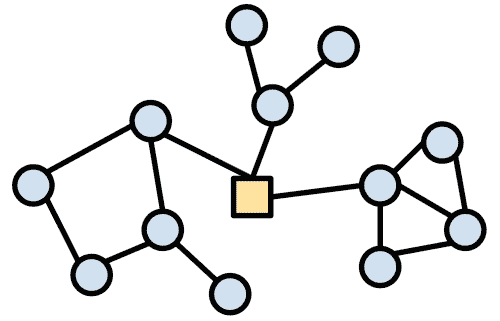
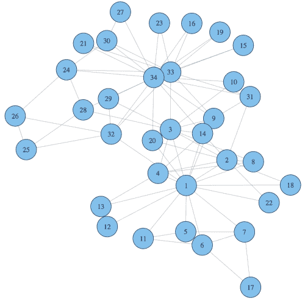
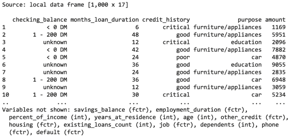
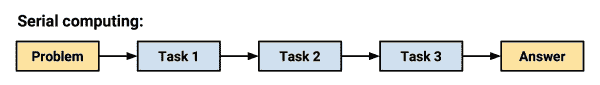
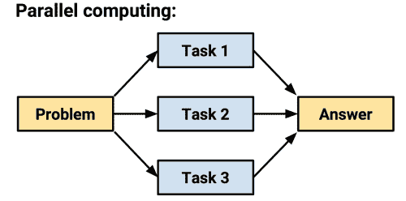
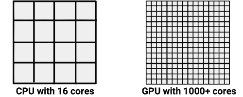

# 十二、特定的机器学习主题

祝贺你在机器学习的旅程中到达这一点！如果你还没有开始你自己的项目，你会很快开始的。在这样做的过程中，你可能会发现将数据转化为行动的任务比最初看起来更困难。

当您收集数据时，您可能已经意识到这些信息是以专有格式收集的，或者分散在 Web 上的各个页面中。更糟糕的是，在花了几个小时重新格式化数据后，也许你的电脑在内存耗尽后变慢了。也许 R 甚至使你的机器崩溃或死机。希望您没有被吓到，因为这些问题可以通过更多的努力来解决。

本章涵盖的技术可能不适用于每个项目，但对于解决此类专门问题将证明是有用的。如果您倾向于处理以下数据，您可能会发现这些信息特别有用:

*   以非结构化或专有格式存储，如网页、web APIs 或电子表格
*   从专业领域，如生物信息学或社会网络分析
*   太大而不适合内存，或者分析需要很长时间才能完成

如果你有这些问题，你并不孤单。虽然没有万灵药——这些问题是数据科学家的祸根，也是数据技能需求高的原因——但通过 R 社区的不懈努力，许多 R 包为解决该问题提供了良好的开端。

本章提供了这类解决方案的指南。即使你是一个经验丰富的 R 老手，你也可能会发现一个可以简化你工作流程的包。或者，也许有一天，你会创作一个软件包，使其他人的工作更容易！

# 使用专有文件和数据库

与本书中的例子不同，真实世界的数据很少被打包成可以从网站下载的简单的 CSV 格式。相反，需要做大量的工作来准备用于分析的数据。必须收集、合并、分类、过滤或重新格式化数据，以满足学习算法的要求。这个过程被非正式地称为**数据操纵**或**数据争论**。

数据准备已经变得更加重要，因为典型数据集的大小已经从兆字节增长到千兆字节，并且数据是从不相关和混乱的来源收集的，其中许多都存储在大规模数据库中。以下部分列出了用于检索和使用专有数据格式和数据库的几个包和资源。

## 读取和写入 Microsoft Excel、SAS、SPSS 和 Stata 文件

数据分析的一个令人沮丧的方面是从各种专有格式中提取和组合数据所需的大量工作。大量的数据存在于文件和数据库中的,只需要在 r 中使用。谢天谢地，包正是为了这个目的而存在的。

过去的是一个乏味而耗时的过程，需要跨多个 R 包的特定技巧和工具的知识，被一个相对较新的 R 包`rio`(R 输入和输出的缩写)变得微不足道。这个软件包由 Chung-hong Chan、Geoffrey CH Chan、Thomas J. Leeper 和 Christopher Gandrud 编写，被称为“数据的瑞士军刀”。它能够导入和导出多种文件格式，包括但不限于:制表符分隔(`.tsv`)、逗号分隔(`.csv`)、JSON ( `.json`)、Stata ( `.dta`)、SPSS ( `.sav`和`.por`)、Microsoft Excel ( `.xls`和`.xlsx`)、Weka ( `.arff`)和 SAS ( `.sas7bdat`和`.xpt`)。

### 注

关于可以导入和导出的文件类型的完整列表以及更详细的使用示例，请参见[http://cran . r-project . org/web/packages/Rio/vignettes/Rio . html](http://cran.r-project.org/web/packages/rio/vignettes/rio.html)。

`rio`包包含三个用于处理专有数据格式的函数:`import()`、`export()`和`convert()`。给定它们的名字，每一个都完全符合你的期望。与软件包保持简单的理念一致，每个函数都使用文件扩展名来猜测要导入、导出或转换的文件类型。

以为例，要从前面章节中导入信贷数据，其中以 CSV 格式存储，只需键入:

```
> library(rio)
> credit <- import("credit.csv")

```

该按预期创建了`credit`数据帧；作为的额外收获，我们不仅不用指定 CSV 文件类型，`rio`还会自动设置`stringsAsFactors = FALSE`以及其他合理的默认值。

要将`credit`数据框导出为 Microsoft Excel ( `.xlsx`)格式，使用`export()`功能，同时指定所需的文件名，如下所示。对于其他格式，只需将文件扩展名更改为所需的输出类型:

```
> export(credit, "credit.xlsx")

```

也可以使用`convert()`功能将 CSV 文件直接转换成另一种格式，无需导入步骤。例如，这会将`credit.csv`文件转换为 Stata ( `.dta`)格式:

```
> convert("credit.csv", "credit.dta")

```

尽管`rio`包涵盖了许多常见的专有数据格式，但它并不做所有的事情。下一节将介绍通过数据库查询将数据导入 R 的其他方法。

## 在 SQL 数据库中查询数据

大型数据集通常存储在**数据库管理系统**(**DBMS**)中，如 Oracle、MySQL、PostgreSQL、Microsoft SQL 或 SQLite。这些系统允许使用**结构化查询语言** ( **SQL** )访问数据集，这是一种旨在从数据库中提取数据的编程语言。如果您的 DBMS 被配置为允许**开放式数据库连接** ( **ODBC** )，Brian Ripley 的`RODBC`包可以用来将这些数据直接导入到 R 数据框架中。

### 提示

如果您在使用 ODBC 连接到您的数据库时遇到问题，您可以尝试一个 DMBS 特有的 R 包。这些包括`ROracle`、`RMySQL`、`RPostgresSQL`和`RSQLite`。尽管它们的功能与此处的说明非常相似，但请参考 CRAN 上的软件包文档，了解每个软件包的具体说明。

ODBC 是一个标准协议，用于连接到数据库，与操作系统或 DBMS 无关。如果您以前连接到一个 ODBC 数据库，您很可能会通过它的**数据源名称** ( **DSN** )来引用它。您将需要 DSN，加上一个用户名和密码(如果您的数据库需要的话)来使用`RODBC`。

### 提示

配置 ODBC 连接的指令高度特定于操作系统和 DBMS 的组合。如果您在建立 ODBC 连接时遇到问题，请咨询您的数据库管理员。另一种获得帮助的方式是通过`RODBC`包`vignette`，在安装`RODBC`包后，可以在 R 中用`vignette("RODBC")`命令访问它。

使用`my_dsn` DSN 为数据库打开一个名为`my_db`的连接，使用`odbcConnect()`函数:

```
> library(RODBC)
> my_db <- odbcConnect("my_dsn")

```

或者，如果您的 ODBC 连接需要用户名和密码，那么应该在调用`odbcConnect()`函数时指定它们:

```
> my_db <- odbcConnect("my_dsn",
 uid = "my_username",
 pwd = "my_password")

```

通过一个开放的数据库连接，我们可以使用`sqlQuery()`函数从 SQL 查询提取的数据库行中创建一个 R 数据框。这个函数和很多创建数据框的函数一样，允许我们指定`stringsAsFactors = FALSE`来阻止 R 自动将字符数据转换成因子。

`sqlQuery()`函数使用典型的 SQL 查询，如以下命令所示:

```
> my_query <- "select * from my_table where my_value = 1"
> results_df <- sqlQuery(channel = my_db, query = sql_query,
 stringsAsFactors = FALSE)

```

结果`results_df`对象是一个数据框，包含使用存储在`sql_query`中的 SQL 查询选择的所有行。

使用完数据库后，可以使用以下命令关闭连接:

```
> odbcClose(my_db)

```

虽然 R 会在 R 会话结束时自动关闭 ODBC 连接，但是显式地这样做是更好的做法。


# 使用在线数据和服务

随着来自网络来源的数据量不断增长，机器学习项目能够访问在线服务并与之互动变得越来越重要。r 能够原生地从在线资源中读取数据，但有一些限制。首先，默认情况下，R 无法访问安全网站(使用`https://`而非`http://`协议的网站)。其次，需要注意的是，大多数 web 页面并没有以 R 能够理解的形式提供数据。在有用之前，数据需要被 T21 解析，或者分解并重建成结构化的形式。我们将很快讨论解决方法。

然而，如果这些警告都不适用(也就是说，如果数据已经在一个不安全的网站上以表格形式在线，如 CSV，R 可以自然地理解)，那么 R 的`read.csv()`和`read.table()`函数将能够从 Web 访问数据，就像它在您的本地机器上一样。只需提供数据集的完整 URL，如下所示:

```
> mydata <- read.csv("http://www.mysite.com/mydata.csv")

```

R 还提供从网上下载其他文件的功能，即使 R 不能直接使用它们。对于文本文件，尝试如下的`readLines()`功能:

```
> mytext <- readLines("http://www.mysite.com/myfile.txt")

```

对于其他类型的文件，可以使用`download.file()`功能。要将文件下载到 R 的当前工作目录，只需提供 URL 和目标文件名，如下所示:

```
> download.file("http://www.mysite.com/myfile.zip", "myfile.zip")

```

除了这个基本功能之外，还有许多包扩展了 R 处理在线数据的能力。其中最基本的将在接下来的章节中介绍。由于网络是巨大的和不断变化的，这些部分远不是 R 可以连接到在线数据的所有方式的综合集合。从利基项目到大型项目，几乎有数百个软件包。

### 注意

有关最完整和最新的软件包列表，请参考定期更新的 http://cran.r-project.org/web/views/WebTechnologies.html[的 CRAN Web Technologies and Services 任务视图。](http://cran.r-project.org/web/views/WebTechnologies.html)

## 下载网页的完整文本

Duncan Temple Lang 的`RCurl`包通过提供一个 R 接口给**curl**(URL 客户端)实用程序，一个通过网络传输数据的命令行工具，提供了一个更健壮的访问网页的方式。curl 程序的行为很像一个可编程的网络浏览器；给定一组命令，它可以访问和下载网上几乎任何可用的内容。与 R 不同，它可以访问安全网站，也可以将数据发布到在线表格中。这是一个非常强大的工具。

### 注

正是因为它如此强大，一个完整的 curl 教程超出了这一章的范围。相反，请参考位于[http://www.omegahat.org/RCurl/](http://www.omegahat.org/RCurl/)的在线`RCurl`文档。

安装完`RCurl`包后，下载一个页面就像输入:

```
> library(RCurl) 
> packt_page <- ("https://www.packtpub.com/")

```

这将把 Packt Publishing 主页的全文(包括所有的 web 标记)保存到名为`packt_page`的 R character 对象中。如下行所示，这不是很有用:

```
> str(packt_page, nchar.max=200)
 chr "<!DOCTYPE html>\n<html xmlns=\"http://www.w3.org/1999/xhtml\" lang=\"en\" xml:lang=\"en\">\n\t<head>\n\t\t<title>Packt Publishing | Technology Books, eBooks & Videos</title>\n\t\t<script>\n\t\t\tdata"| __truncated__

```

页面的前 200 个字符看起来毫无意义的原因是因为网站是用超文本标记语言编写的，超文本标记语言将页面文本和特殊的标签结合在一起，告诉浏览器如何显示文本。这里的`<title>`和`</title>`标签包围了页面标题，告诉浏览器这是 Packt Publishing 主页。类似的标签用于表示页面的其他部分。

虽然 curl 是访问在线内容的跨平台标准，但是如果你经常在 R 中处理 web 数据，Hadley Wickham 的`httr`包建立在`RCurl`的基础上，使它更方便，更像 R。通过尝试使用`httr`包的`GET()`功能下载 Packt Publishing 主页，我们可以立即看到一些差异:

```
> library(httr)
> packt_page <- GET("https://www.packtpub.com")
> str(packt_page, max.level = 1)
List of 9
 $ url        : chr "https://www.packtpub.com/"
 $ status_code: int 200
 $ headers    : List of 11
 $ all_headers: List of 1
 $ cookies    : list()
 $ content    : raw [1:58560] 3c 21 44 4f ...
 $ date       : POSIXct[1:1], format: "2015-05-24 20:46:40"
 $ times      : Named num [1:6] 0 0.000071 0.000079 ...
 $ request    : List of 5

```

`RCurl`中的`getURL()`函数只下载了 HTML，而`GET()`函数除了 HTML 之外还返回了一个包含站点属性的列表。要访问页面内容本身，我们需要使用`content()`函数:

```
> str(content(packt_page, type="text"), nchar.max=200)
 chr "<!DOCTYPE html>\n<html xmlns=\"http://www.w3.org/1999/xhtml\" lang=\"en\" xml:lang=\"en\">\n\t<head>\n\t\t<title>Packt Publishing | Technology Books, eBooks & Videos</title>\n\t\t<script>\n\t\t\tdata"| __truncated__

```

为了在 R 程序中使用这些数据，有必要处理页面以将其转换为结构化格式，如列表或数据框。实现这一点的函数将在接下来的章节中讨论。

### 注

有关详细的`httr`文档和教程，请访问位于[https://github.com/hadley/httr](https://github.com/hadley/httr)的项目 GitHub 页面。快速入门指南对学习基本功能特别有帮助。

## 从网页中抓取数据

因为许多网页的 HTML 标签都有一致的结构，所以可以编写程序来寻找网页中想要的部分，并提取它们，以便将它们编译成数据集。这种从网站获取数据并将其转换成结构化形式的过程实践被称为网络搜集。

### 提示

虽然经常使用，但抓取应该被认为是从 Web 上获取数据的最后手段。这是因为对底层 HTML 结构的任何更改都可能破坏您的代码，需要努力进行修复。更糟糕的是，它可能会在数据中引入不为人知的错误。此外，许多网站的使用条款协议明确禁止自动数据提取，更不用说你的程序的流量可能会使他们的服务器过载。在你开始你的项目之前，一定要检查网站的条款；你甚至会发现该网站通过开发者协议免费提供数据。

Hadley Wickham 的`rvest`包(术语“收获”的双关语)使得网络搜集成为一个很容易的过程，假设你想要的数据可以在 HTML 中一致的地方找到。

让我们从一个使用 Packt Publishing homepage 的简单例子开始。我们像以前一样开始下载页面，使用`rvest`包中的`html()`函数。请注意，当提供 URL 时，这个函数只需调用 Hadley Wickham 的`httr`包中的`GET()`函数:

```
> library(rvest)
> packt_page <- html("https://www.packtpub.com")

```

假设我们想删除页面标题。查看前面的 HTML 代码，我们知道每页只有一个标题包装在`<title>`和`</title>`标签中。为了提取标题，我们向`html_node()`函数提供标签名称，如下所示:

```
> html_node(packt_page, "title")


```

这使得 HTML 格式保持不变，包括`<title>`标签和`&amp;`代码，这是 HTML 对&符号的指定。要将它转换成纯文本，我们只需通过`html_text()`函数运行它，如下所示:

```
> html_node(packt_page, "title") %>% html_text()
[1] "Packt Publishing | Technology Books, eBooks & Videos"

```

注意`%>%`操作符的使用。这就是所谓的管道，因为它本质上是将数据从一个函数“管道”到另一个函数。管道的使用允许创建强大的函数链来处理 HTML 数据。

### 注意

管道操作器是 Stefan Milton Bache 和 Hadley Wickham 的`magrittr`包的一部分，默认情况下与`rvest`包一起安装。这个名字是对勒内·马格里特著名的烟斗画的一种发挥(你可能记得在第一章*介绍机器学习*中看到过它)。有关该项目的更多信息，请访问位于 https://github.com/smbache/magrittr 的 GitHub 页面。

让我们试试一个稍微有趣一点的例子。假设我们想要在 CRAN 机器学习任务视图上抓取所有包的列表。我们以与前面相同的方式开始，使用`html()`函数下载 HTML 页面。由于我们不知道页面是如何构造的，我们还将通过键入我们创建的 R 对象的名称`cran_ml`来查看 HTML:

```
> library(rvest)
> cran_ml <- html("http://cran.r-project.org/web/views/MachineLearning.html")
> cran_ml

```

查看输出，我们发现一个部分似乎有我们感兴趣的数据。请注意，这里只显示了输出的一个子集:

```
 <h3>CRAN packages:</h3>
 <ul>
 <li><a href="../packages/ahaz/index.html">ahaz</a></li>
 <li><a href="../packages/arules/index.html">arules</a></li>
 <li><a href="../packages/bigrf/index.html">bigrf</a></li>
 <li><a href="../packages/bigRR/index.html">bigRR</a></li>
 <li><a href="../packages/bmrm/index.html">bmrm</a></li>
 <li><a href="../packages/Boruta/index.html">Boruta</a></li>
 <li><a href="../packages/bst/index.html">bst</a></li>
 <li><a href="../packages/C50/index.html">C50</a></li>
 <li><a href="../packages/caret/index.html">caret</a></li>

```

`<h3>`标签暗示了一个大小为 3 的头部，而`<ul>`和`<li>`标签分别指无序列表和列表项的创建。我们想要的数据元素被包围在`<a>`标签中，这些标签是链接到每个包的 CRAN 页面的超链接锚标签。

### 提示

因为 CRAN 页面是主动维护的，可能会随时更改，所以如果您的结果与此处显示的结果不同，请不要感到惊讶。

有了这些知识，我们可以像以前一样抓取链接。一个例外是，因为我们期望找到不止一个结果，所以我们需要使用`html_nodes()`函数返回结果的向量，而不是使用`html_node()`，后者只返回一个条目:

```
> ml_packages <- html_nodes(cran_ml, "a")

```

让我们用`head()`函数来看看结果:

```
> head(ml_packages, n = 7)
[[1]]
<a href="../packages/nnet/index.html">nnet</a> 

[[2]]
<a href="../packages/RSNNS/index.html">RSNNS</a> 

[[3]]
<a href="../packages/rpart/index.html">rpart</a> 

[[4]]
<a href="../packages/tree/index.html">tree</a> 

[[5]]
<a href="../packages/rpart/index.html">rpart</a> 

[[6]]
<a href="http://www.cs.waikato.ac.nz/~ml/weka/">Weka</a> 

[[7]]
<a href="../packages/RWeka/index.html">RWeka</a>

```

正如我们在第 6 行看到的，看起来像是一些其他项目的链接滑了进来。这是因为一些软件包超链接到其他网站；在这种情况下，`RWeka`包链接到 CRAN 及其主页。为了排除这些结果，您可以将这个输出链接到另一个函数，该函数可以在超链接中查找`/packages`字符串。

### 提示

总的来说，web 抓取总是一个迭代和精炼的过程，因为你要确定更多的特定标准来排除或包含特定的情况。最困难的情况甚至可能需要人眼达到 100%的准确性。

这些简单的例子仅仅触及了`rvest`包的表面。使用管道功能，可以查找嵌套在标签或特定 HTML 标签类中的标签。对于这些类型的复杂示例，请参考软件包文档。

### 解析 XML 文档

XML 是一种纯文本的、人类可读的、结构化的标记语言，许多文档格式都基于这种语言。它在某些方面采用了类似于 HTML 的标记结构，但在格式方面要严格得多。因此，存储结构化数据集是一种流行的在线格式。

Duncan Temple Lang 的`XML`包基于流行的基于 C 的`libxml2`解析器提供了一套 R 功能来读写 XML 文档。它是 R 中 XML 解析包的始祖，至今仍被广泛使用。

### 注意

关于这个`XML`包的信息，包括让你快速入门的简单例子，可以在位于[http://www.omegahat.org/RSXML/](http://www.omegahat.org/RSXML/)的项目网站上找到。

最近，Hadley Wickham 的`xml2`包作为一个更简单、更像 R 的接口出现在`libxml2`库上。本章前面提到的`rvest`包在幕后利用`xml2`来解析 HTML。此外，`rvest`也可以用来解析 XML。

### 注意

在[https://github.com/hadley/xml2](https://github.com/hadley/xml2)找到`xml2` GitHub 页面。

因为解析 XML 和解析 T21 HTML 关系非常密切，所以这里不讨论确切的语法。有关示例，请参考这些软件包的文档。

### 从 web APIs 解析 JSON

在线应用使用被称为**应用编程接口**(**API**)的网络访问功能相互通信。这些界面很像一个典型的网站；它们通过特定的 URL 接收来自客户端的请求，并返回响应。不同之处在于，普通网站返回的是用于在 web 浏览器中显示的 HTML，而 API 通常以结构化的形式返回数据，供机器处理。

尽管发现基于 XML 的 API 并不罕见，但也许今天最常见的 API 数据结构是 JavaScript 对象符号。像 XML 一样，它是一种标准的明文格式，最常用于 Web 上的数据结构和对象。这种格式最近变得流行起来，因为它源于基于浏览器的 JavaScript 应用，但尽管有血统，它的效用并不局限于 Web。JSON 数据结构易于被人类理解和被机器解析，这使得它成为许多类型项目的一种有吸引力的数据结构。

JSON 基于简单的`{key: value}`格式。`{ }`括号表示 JSON 对象，`key`和`value`参数表示对象的属性和属性的状态。一个对象可以有任意数量的属性，属性本身也可以是对象。例如，这本书的 JSON 对象可能如下所示:

```
{
  "title": "Machine Learning with R",
  "author": "Brett Lantz",
  "publisher": {
     "name": "Packt Publishing",
     "url": "https://www.packtpub.com"
  },
  "topics": ["R", "machine learning", "data mining"],
  "MSRP": 54.99
}
```

这个示例展示了对 JSON 可用的数据类型:数字、字符、数组(由`[`和`]`字符包围)和对象。未显示的是`null`和布尔值(`true`或`false`)。这些类型的对象从应用到应用以及从应用到 web 浏览器的传输是许多最流行的网站的动力。

### 注

有关 JSON 格式的详细信息，请访问[http://www.json.org/](http://www.json.org/)。

面向公众的 API 允许像 R 这样的程序系统地查询网站，使用像`RCurl`和`httr`这样的包检索 JSON 格式的结果。尽管关于使用 web APIs 的完整教程值得单独写一本书，但基本过程只依赖于几个步骤——细节比较棘手。

假设我们想要查询 Google Maps API 来定位法国埃菲尔铁塔的纬度和经度。我们首先需要查看 Google Maps API 文档，以确定进行该查询所需的 URL 和参数。然后，我们将这些信息提供给`httr`包的`GET()`函数，添加一个查询参数列表，以便应用搜索地址:

```
> library(httr)
> map_search <-
 GET("https://maps.googleapis.com/maps/api/geocode/json",
 query = list(address = "Eiffel Tower"))

```

通过键入结果对象的名称，我们可以看到有关请求的一些详细信息:

```
> map_search
Response [https://maps.googleapis.com/maps/api/geocode/json?address=Eiffel%20T ower]
 Status: 200
 Content-Type: application/json; charset=UTF-8
 Size: 2.34 kB
{
 "results" : [
 {
 "address_components" : [
 {
 "long_name" : "Eiffel Tower",
 "short_name" : "Eiffel Tower",
 "types" : [ "point_of_interest", "establishment" ]
 },
 {
...

```

为了访问由`httr`包自动解析的结果 JSON，我们使用了`content()`函数。为了简洁起见，这里只显示了几行:

```
> content(map_search)
$results[[1]]$formatted_address
[1] "Eiffel Tower, Champ de Mars, 5 Avenue Anatole France, 75007 Paris, France"

$results[[1]]$geometry
$results[[1]]$geometry$location
$results[[1]]$geometry$location$lat
[1] 48.85837

$results[[1]]$geometry$location$lng
[1] 2.294481

```

要单独访问这些内容，只需使用 list 语法引用它们。这些名称基于 Google API 返回的 JSON 对象。例如，整个结果集在一个名为`results`的对象中，每个结果都有编号。在这种情况下，我们将访问第一个结果的格式化地址属性，以及纬度和经度:

```
> content(map_search)$results[[1]]$formatted_address
[1] "Eiffel Tower, Champ de Mars, 5 Avenue Anatole France, 75007 Paris, France"

> content(map_search)$results[[1]]$geometry$location$lat
[1] 48.85837

> content(map_search)$results[[1]]$geometry$location$lng
[1] 2.294481

```

这些数据元素可以根据需要在 R 程序中使用。

### 提示

由于 Google Maps API 将来可能会更新，如果您发现您的结果与此处显示的结果不同，请查看 Packt Publishing 支持页面以获取更新的代码。

另一方面，如果您想在`httr`包之外进行 JSON 格式的转换，有很多包都添加了这个功能。

Alex Couture-Beil 的`rjson`包是最早允许 R 数据结构从 JSON 格式来回转换的包之一。语法很简单。在安装了`rjson`包之后，为了将 R 对象转换成 JSON 字符串，我们使用了`toJSON()`函数。请注意，引号字符已经使用`\"`符号进行了转义:

```
> library(rjson)
> ml_book <- list(book_title = "Machine Learning with R",
 author = "Brett Lantz")
> toJSON(ml_book)
[1] "{\"book_title\":\"Machine Learning with R\",
\"author\":\"Brett Lantz\"}"

```

要将 JSON 字符串转换成 R 对象，可以使用`fromJSON()`函数。字符串中的引号需要转义，如下所示:

```
> ml_book_json <- "{
 \"title\": \"Machine Learning with R\",
 \"author\": \"Brett Lantz\",
 \"publisher\": {
 \"name\": \"Packt Publishing\",
 \"url\": \"https://www.packtpub.com\"
 },
 \"topics\": [\"R\", \"machine learning\", \"data mining\"],
 \"MSRP\": 54.99
}"

> ml_book_r <- fromJSON(ml_book_json)

```

这产生了一个列表结构，其形式非常类似于原始的 JSON:

```
> str(ml_book_r)
List of 5
 $ title    : chr "Machine Learning with R"
 $ author   : chr "Brett Lantz"
 $ publisher:List of 2
 ..$ name: chr "Packt Publishing"
 ..$ url : chr "https://www.packtpub.com"
 $ topics   : chr [1:3] "R" "machine learning" "data mining"
 $ MSRP     : num 55

```

最近，两个新的 JSON 包已经到达现场。第一个是由 Duncan Temple Lang 编写的`RJSONIO`，它原本是`rjson`包的一个更快、更具可扩展性的版本，尽管它们现在实际上是一样的。第二个包`jsonlite`，由耶鲁安 Ooms 开发，它很快获得了声望，因为它创建了更加一致和类似 R 的数据结构，尤其是在使用来自 web APIs 的数据时。您使用这些软件包中的哪一个取决于您的偏好；所有这三个在实践中实际上是相同的，因为它们都实现了`fromJSON()`和`toJSON()`功能。

### 注意

有关`jsonlite`包的潜在好处的更多信息，请参见:Ooms j . JSON lite 包:JSON 数据和 R 对象之间的实用且一致的映射。2014.可在:[http://arxiv.org/abs/1403.2805](http://arxiv.org/abs/1403.2805)


# 处理特定领域的数据

毫无疑问，机器学习已经被应用于各个学科的问题。尽管所有领域的基本技术都是相似的，但有些技术非常专业，以至于形成了社区来开发该领域特有挑战的解决方案。这导致了只与特定领域问题相关的新技术和新术语的发现。

本节涵盖了广泛使用机器学习技术的两个领域，但需要专业知识来释放它们的全部潜力。因为已经有整本书都在讨论这些话题，所以它只是作为最简短的介绍。要了解更多详细信息，请查阅每一节中引用的资源所提供的帮助。

## 分析生物信息学数据

**生物信息学**的领域涉及计算机和数据分析在生物领域的应用，特别是关于更好地理解基因组。由于遗传数据与许多其他类型相比是独特的，生物信息学领域的数据分析提出了许多独特的挑战。例如，因为生物有大量的基因，而基因测序仍然相对昂贵，典型的数据集宽度远大于长度；也就是说，它们的特征(基因)比实例(已被测序的生物)多。这在试图将传统的可视化、统计测试和机器学习方法应用于这些数据时产生了问题。此外，专利**微阵列**“芯片实验室”技术的使用越来越多，这就需要高度专业化的知识来加载基因数据。

### 注意

一个 CRAN 任务视图，列出了一些 R 的统计遗传学和生物信息学的专业包，可以在[http://cran.r-project.org/web/views/Genetics.html](http://cran.r-project.org/web/views/Genetics.html)获得。

华盛顿西雅图弗雷德·哈钦森癌症研究中心的生物导体项目旨在通过提供一套分析基因组数据的标准化方法来解决这些问题。以 R 为基础，Bioconductor 在基础 R 软件上增加了生物信息学专用的软件包和文档。

Bioconductor 提供工作流程来分析来自 Affymetrix、Illumina、Nimblegen 和 Agilent 等常见微阵列平台的 DNA 和蛋白质微阵列数据。附加功能包括序列注释、多重测试程序、专门的可视化、教程、文档等等。

### 注

欲了解生物导体项目的更多信息，请访问项目网站[http://www.bioconductor.org](http://www.bioconductor.org)。

## 分析和可视化网络数据

社交网络数据和图形数据集由描述连接或**链接**(有时也称为**边**)的结构组成，这些连接或链接位于人或被称为**节点**的对象之间。利用 *N* 节点，可以创建一个潜在链接的*N*x*N = N[2]矩阵。随着节点数量的增长，这会产生巨大的计算复杂性。*

**网络分析** 的领域与识别有意义的连接模式的统计测量和可视化有关。例如，下图显示了三个圆形节点群集，它们都通过中心的方形节点连接在一起。网络分析可以揭示方形节点的重要性，以及其他关键指标。



由 Carter T. Butts、David Hunter 和 Mark S. Handcock 开发的包提供了一种专门的数据结构来处理网络。该数据结构是必要的，因为存储*N[2]潜在链接所需的矩阵将很快超过可用内存；`network`数据结构使用稀疏表示来仅存储现有的链接，如果大多数关系不存在，则节省大量内存。一个密切相关的包，`sna`(社交网络分析)，允许对`network`对象进行分析和可视化。*

### 注意

有关`network`和`sna`的更多信息，包括非常详细的教程和文档，请参考位于[http://www.statnet.org/](http://www.statnet.org/)的华盛顿大学主办的项目网站。

Gábor Csárdi 的`igraph`包提供了另一套可视化和分析网络数据的工具。它能够计算超大型网络的度量。`igraph`的另一个好处是，它有类似于 Python 和 C 编程语言的包，允许它在几乎任何地方执行分析。正如我们将很快演示的那样，它非常容易使用。

### 注

关于`igraph`包的更多信息，包括演示和教程，请访问[http://igraph.org/r/](http://igraph.org/r/)的主页。

在 R 中使用网络数据需要使用专门的格式，因为网络数据通常不存储在典型的表格数据结构中，如 CSV 文件和数据帧。如前所述，因为在 *N* 网络节点之间有*N[2]个潜在连接，所以对于除了最小的 *N* 值之外的所有值，表格结构将很快变得难以处理。相反，图形数据以一种只列出真正存在的连接的形式存储；缺少连接是从缺少数据中推断出来的。*

也许这种格式中最简单的是 **edgelist** ，它是一个文本文件，每个网络连接一行。每个节点必须被分配一个唯一的标识符，节点之间的链接是通过把连接的节点的标识符放在一个单独的行上用一个空格分开来定义的。例如，以下边列表定义了节点 0 与节点 1、2 和 3 之间的三个连接:

```
0 1
0 2
0 3
```

为了将网络数据加载到 R 中，`igraph`包提供了一个`read.graph()`函数，可以读取 edgelist 文件以及其他更复杂的格式，如**图形建模语言** ( **GML** )。为了说明这个功能，我们将使用一个数据集来描述一个小型空手道俱乐部成员之间的友谊。要跟进，请从 Packt Publishing 网站下载`karate.txt`文件，并保存在您的 R 工作目录中。在你安装了`igraph`包之后，空手道网络可以被读入 R，如下所示:

```
> library(igraph)
> karate <- read.graph("karate.txt", "edgelist", directed = FALSE)

```

这将创建一个稀疏矩阵对象，可用于制图和网络分析。注意，`directed = FALSE`参数强制网络在节点间使用无向或双向链路。由于空手道数据集描述了友谊，这意味着如果人 1 是人 2 的朋友，那么人 2 一定是人 1 的朋友。另一方面，如果数据集描述了战斗结果，则人 1 打败了人 2 的事实当然不会暗示人 2 打败了人 1。在这种情况下，应该设置`directed = TRUE`参数。

### 注意

这里使用的空手道网络数据集是由密歇根大学的 *M.E.J .纽曼*编制的。它首次出现在扎卡里 WW。*小群体中冲突和裂变的信息流模型*。人类学研究杂志。1977;33:452-473.

要检查图表，使用`plot()`功能:

```
> plot(karate)

```

这产生了下图:



检查网络可视化，很明显空手道俱乐部有几个高度连接的成员。节点 1、33 和 34 看起来比其他节点更中心，它们仍然在俱乐部外围。

使用`igraph`来计算图形度量，有可能分析性地展示我们的直觉。节点的**度**衡量它链接到多少个节点。`degree()`函数证实了我们的直觉，即节点 1、33 和 34 比其他节点分别具有`16`、`12`和`17`连接的连接更多:

```
> degree(karate)
 [1] 16  9 10  6  3  4  4  4  5  2  3  1  2  5  2  2  2  2
[19]  2  3  2  2  2  5  3  3  2  4  3  4  4  6 12 17

```

因为有些连接比其他连接更重要，所以已经开发了各种网络测量方法来测量节点连通性。称为**中间中心性**的网络度量旨在捕捉节点之间通过每个节点的最短路径的数量。真正位于整个图中心的节点将具有更高的介数中心值，因为它们充当了其他节点之间的桥梁。我们使用`betweenness()`函数获得中心性度量的向量，如下所示:

```
> betweenness(karate)
 [1] 231.0714286  28.4785714  75.8507937   6.2880952
 [5]   0.3333333  15.8333333  15.8333333   0.0000000
 [9]  29.5293651   0.4476190   0.3333333   0.0000000
[13]   0.0000000  24.2158730   0.0000000   0.0000000
[17]   0.0000000   0.0000000   0.0000000  17.1468254
[21]   0.0000000   0.0000000   0.0000000   9.3000000
[25]   1.1666667   2.0277778   0.0000000  11.7920635
[29]   0.9476190   1.5428571   7.6095238  73.0095238
[33]  76.6904762 160.5515873

```

由于节点 1 和 34 的介值比其他节点大得多，所以它们对于空手道俱乐部的友谊网来说更加重要。这两个人，有着广泛的个人友谊网络，可能是维系网络的“胶水”。

### 提示

中间中心性只是许多旨在捕捉节点重要性的度量之一，它甚至不是中心性的唯一度量。有关其他网络属性的定义，请参考`igraph`文档。

`sna`和`igraph`包能够计算许多这样的图形度量，然后可以用作机器学习功能的输入。例如，假设我们试图构建一个模型来预测谁将赢得俱乐部主席的选举。节点 1 和 34 连接良好的事实表明，它们可能具有这种领导角色所需的社会资本。这些可能是对选举结果极具价值的预测。

### 提示

通过将网络分析与机器学习相结合，脸书、Twitter 和 LinkedIn 等服务提供了大量网络数据来预测用户的未来行为。一个引人注目的例子是 2012 年美国总统竞选，首席数据科学家 Rayid Ghani 利用脸书数据确定可能被说服投票给巴拉克·奥巴马的人。


# 提高 R 的表现

r 以速度慢和内存效率低而闻名，这个名声至少是实至名归的。对于拥有成千上万条记录的数据集来说，这些故障在现代 PC 上基本上不会被注意到，但是拥有一百万条或更多记录的数据集可能会超过目前消费级硬件可能达到的极限。如果数据集包含许多要素或使用复杂的学习算法，问题会变得更加严重。

### 注

CRAN 拥有高表现计算任务视图，其中列出了推动 r 中可能实现的边界的包。可以在[http://CRAN . r-project . org/web/views/highperformancecomputing . html](http://cran.r-project.org/web/views/HighPerformanceComputing.html)上查看。

超越基础软件能力的软件包正在迅速开发。这项工作主要来自两个方面:一些软件包通过加快数据操作速度或允许数据大小超过可用的系统内存来增加管理超大型数据集的能力；其他人允许 R 更快地工作，也许是通过将工作分散到更多的计算机或处理器上，利用专门的计算机硬件，或提供针对大数据问题优化的机器学习算法。

## 管理超大型数据集

当系统耗尽存储数据的内存时，非常大的数据集会导致 R 陷入停顿。即使整个数据集可以放入可用的内存，数据处理也需要额外的内存开销。此外，非常大的数据集可能需要很长时间来分析，原因不外乎记录的数量；即使是快速操作，在执行数百万次后也会导致延迟。

几年前，许多人会用另一种编程语言在 R 之外执行数据准备，或者使用 R，但只对较小的数据子集执行分析。然而，这已经没有必要了，因为 R 已经提供了几个软件包来解决这些问题。

### 用 dplyr 概括表格数据结构

Hadley Wickham 和 Romain Francois 在 2014 年推出的`dplyr`包可能是开始在 r 中处理大型数据集的最直接的方法。尽管其他包可能在原始速度或数据的原始大小方面超出了它的能力，但`dplyr`仍然非常强大。更重要的是，在最初的学习曲线过去之后，它实际上是透明的。

### 注意

关于`dplyr`的更多信息，包括一些非常有用的教程，请参考该项目的 GitHub 页面，在[https://github.com/hadley/dplyr](https://github.com/hadley/dplyr)。

简单地说，这个包提供了一个名为`tbl`的对象，它是表格数据的抽象。它的作用很像数据框，但有几个重要的例外:

*   关键功能是用 C++编写的，根据作者的说法，这使得许多操作的表现提高了 20 到 1000 倍。
*   r 数据帧受到可用内存的限制。数据帧的`dplyr`版本可以透明地链接到基于磁盘的数据库，这些数据库可以超过内存的存储量。
*   `dplyr`包对数据帧做出合理的假设，优化您的工作和内存使用。它不会自动改变数据类型。并且，如果可能的话，它通过指向原始值来避免复制数据。
*   引入了新的操作符，允许用少得多的代码执行常见的数据转换，同时保持高可读性。

从数据帧转换到`dplyr`很容易。要将现有数据框转换成`tbl`对象，使用`as.tbl()`函数:

```
> library(dplyr)
> credit <- read.csv("credit.csv")
> credit_tbl <- as.tbl(credit)

```

键入表名可提供有关对象的信息。甚至在这里，我们看到了`dplyr`和典型的 R 行为之间的区别；传统的数据框会显示许多行数据，`dplyr`对象更能考虑现实世界的需求。例如，键入对象的名称会提供一个适合单个屏幕的摘要输出:

```
> credit_tbl

```



将`dplyr`连接到外部数据库也很简单。`dplyr`包提供了连接 MySQL、PostgreSQL 和 SQLite 数据库的函数。这些创建了一个连接对象，允许从数据库中提取`tbl`对象。

让我们使用`src_sqlite()`函数创建一个 SQLite 数据库来存储信用数据。SQLite 是一个简单的数据库，不需要服务器。它只是连接到一个数据库文件，我们称之为`credit.sqlite3`。由于文件还不存在，我们需要设置`create = TRUE`参数来创建文件。注意，为了使这一步生效，如果您还没有安装`RSQLite`包，您可能需要安装:

```
> credit_db_conn <- src_sqlite("credit.sqlite3", create = TRUE)

```

创建连接后，我们需要使用`copy_to()`函数将数据加载到数据库中。它使用`credit_tbl`对象在由`credit_db_conn`指定的数据库中创建一个数据库表。`temporary = FALSE`参数强制立即创建表。因为`dplyr`试图避免复制数据，除非它必须这样做，它将只在被明确要求时创建表:

```
> copy_to(credit_db_conn, credit_tbl, temporary = FALSE)

```

执行函数`copy_to()`会将数据存储在`credit.sqlite3`文件中，可以根据需要传输到其他系统中。要在以后访问该文件，只需重新打开数据库连接并创建一个`tbl`对象，如下所示:

```
> credit_db_conn <- src_sqlite("credit.sqlite3")
> credit_tbl <- tbl(credit_db_conn, "credit_tbl")

```

尽管事实上`dplyr`是通过数据库路由的，但这里的`credit_tbl`对象将像任何其他`tbl`对象一样工作，并将获得`dplyr`包的所有其他好处。

### 使用 data.table 加快数据帧的速度

Matt Dowle、Tom Short、Steve Lianoglou 和 Arun Srinivasan 的`data.table`包提供了一个数据帧的增强版本，称为**数据表**。对于子集化、连接和分组操作，`data.table`对象通常比数据帧快得多。对于最大的数据集——拥有数百万行的数据集——这些对象甚至可能比`dplyr`对象快得多。然而，因为它本质上是一个改进的数据帧，所以得到的对象仍然可以被任何接受数据帧的 R 函数使用。

### 注

`data.table`项目可以在[https://github.com/Rdatatable/data.table/wiki](https://github.com/Rdatatable/data.table/wiki)的 GitHub 上找到。

安装完`data.table`包后，`fread()`函数会将 CSV 之类的表格文件读入数据表对象。例如，要加载之前使用的信用数据，请键入:

```
> library(data.table)
> credit <- fread("credit.csv")

```

然后可以使用类似于 R 的`[row, col]`形式的语法来查询信用数据表，但是针对速度和一些额外的有用便利进行了优化。特别是，数据表结构允许`row`部分使用一个简短的子集化命令选择行，而`col`部分使用一个函数对选择的行做一些事情。例如，以下命令计算具有良好信用记录的人的平均贷款额:

```
> credit[credit_history == "good", mean(amount)]
[1] 3040.958

```

通过用这个简单的语法构建更大的查询，可以在数据表上执行非常复杂的操作。由于数据结构针对速度进行了优化，因此可用于大型数据集。

`data.table`结构的一个限制是，像数据帧一样，它们受到可用系统内存的限制。接下来的两节讨论克服这个缺点的包，代价是破坏了与许多 R 函数的兼容性。

### 提示

`dplyr`和`data.table`封装各有独特的优势。要进行深入的比较，请查看下面关于栈溢出的讨论，网址是[http://Stack Overflow . com/questions/21435339/data-table-vs-DP lyr-can-one-do-something-well-the-other-cant-or-does-poundly](http://stackoverflow.com/questions/21435339/data-table-vs-dplyr-can-one-do-something-well-the-other-cant-or-does-poorly)。也有可能两全其美，因为可以使用`tbl_dt()`函数将`data.table`结构加载到`dplyr`中。

### 使用 ff 创建基于磁盘的数据帧

Daniel Adler、Christian glser、Oleg 内纳迪奇、Jens oehlschgel 和 Walter Zucchini 的`ff`包提供了一种数据框架(`ffdf`)的替代方案，允许创建超过 20 亿行的数据集，即使这远远超过了可用的系统内存。

`ffdf`结构有一个物理组件和一个虚拟组件，物理组件以高效的形式将数据存储在磁盘上，虚拟组件的作用类似于典型的 R 数据帧，但透明地指向存储在物理组件中的数据。您可以将`ffdf`对象想象成一个指向磁盘上数据位置的地图。

### 注

`ff`项目在[http://ff.r-forge.r-project.org/](http://ff.r-forge.r-project.org/)的网页上。

数据结构的一个缺点是它们不能被大多数 R 函数直接使用。取而代之的是，数据必须以小块的形式进行处理，并且结果必须在以后进行组合。将数据分块的好处是，可以使用本章后面介绍的并行计算方法将任务同时分配给几个处理器。

安装完`ff`包后，要读入一个大的 CSV 文件，使用`read.csv.ffdf()`功能，如下所示:

```
> library(ff)
> credit <- read.csv.ffdf(file = "credit.csv", header = TRUE)

```

不幸的是，我们不能直接处理`ffdf`对象，因为试图像对待传统的数据帧一样对待它会导致错误消息:

```
> mean(credit$amount)
[1] NA
Warning message:
In mean.default(credit$amount) :
 argument is not numeric or logical: returning NA

```

Edwin de Jonge、Jan Wijffels 和 Jan van der Laan 的`ffbase`包通过使用`ff`对象添加基本分析功能，在一定程度上解决了这个问题。这使得直接使用`ff`对象进行数据探索成为可能。例如，在安装了`ffbase`包之后，均值函数按预期工作:

```
> library(ffbase)
> mean(credit$amount)
[1] 3271.258

```

该软件包还提供了其他基本功能，如数学运算符、查询函数、汇总统计数据和包装器，以与优化的机器学习算法(如`biglm`)一起工作(在本章稍后描述)。尽管这些并没有完全消除处理超大数据集的挑战，但它们让这个过程变得更加无缝。

### 注意

有关高级功能的更多信息，请访问位于 http://github.com/edwindj/ffbase[的`ffbase`项目网站](http://github.com/edwindj/ffbase)。

### 使用具有大内存的海量矩阵

Michael J. Kane、John W. Emerson 和 Peter Haverty 的`bigmemory`包允许使用超过可用系统内存量的超大矩阵。矩阵可以存储在磁盘或共享内存中，允许它们被同一台计算机上或网络上的其他进程使用。这为并行计算方法提供了便利，例如本章后面将要讨论的那些方法。

### 注

关于`bigmemory`包装的附加文件可在[http://www.bigmemory.org/](http://www.bigmemory.org/)找到。

因为`bigmemory`矩阵有意不同于数据帧，所以它们不能直接用于本书涵盖的大多数机器学习方法。它们也只能用于数字数据。也就是说，由于它们类似于典型的 R 矩阵，所以很容易创建可以转换成标准 R 数据结构的较小样本或块。

作者还提供了`bigalgebra`、`biganalytics`和`bigtabulate`软件包，允许对矩阵进行简单的分析。特别值得注意的是`biganalytics`包中的`bigkmeans()`函数，它执行 k-means 聚类，如[第 9 章](ch09.html "Chapter 9. Finding Groups of Data – Clustering with k-means")、*查找数据组-用 k-means 聚类*中所述。由于这些包的高度专业化，用例超出了本章的范围。

## 通过并行计算加快学习速度

在计算的早期，处理器以**序列**执行指令，这意味着处理器一次只能执行一个任务。前一条指令完成后，才能开始下一条指令。虽然众所周知，通过同时完成这些步骤可以更有效地完成许多任务，但这项技术当时还不存在。



这是通过开发**并行计算**方法来解决的，该方法使用一组两个或更多处理器或计算机来解决更大的问题。许多现代计算机是为并行计算而设计的。即使在只有一个处理器的情况下，它们通常也有两个或更多能够并行工作的**内核**。这允许任务彼此独立地完成。



被称为**集群**的多台计算机组成的网络也可以用于并行计算。大型集群可能包括各种硬件，并且相隔很远。在这种情况下，集群被称为网格。在极端情况下，运行商用硬件的数百或数千台计算机的集群或网格可能是一个非常强大的系统。

然而，问题是并不是每个问题都可以并行化。某些问题比其他问题更有利于并行执行。人们可能会认为增加 100 个处理器会在相同的时间内完成 100 倍的工作(也就是说，总的执行时间是 1/100)，但事实通常并非如此。原因是管理工人需要花费精力。工作必须被分成相等的、不重叠的任务，每个工人的结果必须被合并成一个最终答案。

所谓的**令人尴尬的平行**问题是理想的。将这些任务简化成不重叠的工作块并重新组合结果是很容易的。令人尴尬的并行机器学习任务的一个例子是 10 倍交叉验证；一旦划分了 10 个样本，这 10 个工作块中的每一个都是独立的，这意味着它们不会影响其他的。正如您将很快看到的，使用并行计算可以大大加快这项任务的速度。

### 测量执行时间

如果不能系统地测量节省了多少时间，那么加速 R 的努力将会白费。虽然秒表是一种选择，但更简单的解决方案是将代码包装在一个`system.time()`函数中。

例如，在我的笔记本上，`system.time()`函数指出，生成一百万个随机数大约需要`0.093`秒:

```
> system.time(rnorm(1000000))
 user  system elapsed 
 0.092   0.000   0.093

```

相同的函数可用于评估通过使用刚刚描述的方法或任何 R 函数获得的表现改进。

### 注意

值得一提的是，当第一版出版时，生成一百万个随机数只需要 0.13 秒。尽管我现在使用的是一台功能稍强的计算机，但仅仅两年后处理时间就减少了 30 %,这说明了计算机硬件和软件的进步有多快。

### 与多核和 snow 并行工作

现在包含在 R 版本 2.14.0 和更高版本中的`parallel`包降低了部署并行算法的门槛，因为提供了一个标准框架来设置可以同时完成任务的工作进程。它通过包含`multicore`和`snow`包的组件来实现这一点，每个组件对多任务处理采取不同的方法。

如果您的计算机相当新，您很可能能够使用并行处理。要确定您的机器拥有的内核数量，使用如下的`detectCores()`功能。请注意，根据您的硬件规格，您的输出会有所不同:

```
> library(parallel)
> detectCores()
[1] 8

```

`multicore`包由 Simon Urbanek 开发，允许在一台具有多个处理器或处理器内核的机器上并行处理。它利用计算机操作系统的多任务处理能力来分配共享相同内存的额外的 R 个会话。这可能是在 r 中开始并行处理的最简单的方法。不幸的是，因为 Windows 不支持分叉，所以这种解决方案并不是在所有地方都适用。

开始使用`multicore`功能的一个简单方法是使用`mclapply()`功能，它是`lapply()`的平行版本。例如，下面的代码块说明了如何在 1、2、4 和 8 个内核上分配生成一百万个随机数的任务。`unlist()`函数用于在每个内核完成其大块工作后，将并行结果(一个列表)组合成一个向量:

```
> system.time(l1 <- rnorm(1000000))
 user  system elapsed 
 0.094   0.003   0.097

> system.time(l2 <- unlist(mclapply(1:2, function(x) {
 rnorm(500000)}, mc.cores = 2)))
 user  system elapsed 
 0.106   0.045   0.076

> system.time(l4 <- unlist(mclapply(1:4, function(x) {
 rnorm(250000) }, mc.cores = 4)))
 user  system elapsed 
 0.135   0.055   0.063

> system.time(l8 <- unlist(mclapply(1:8, function(x) {
 rnorm(125000) }, mc.cores = 8)))
 user  system elapsed 
 0.123   0.058   0.055 

```

请注意，随着内核数量的增加，运行时间会减少，优势也会逐渐消失。虽然这是一个简单的例子，但它可以很容易地适用于许多其他任务。

Luke Tierney、A. J. Rossini、李娜和 H. Sevcikova 的`snow`包(简单的工作站网络)允许在多核或多处理器机器上进行并行计算，就像在多台机器的网络上一样。使用稍微困难一些，但是提供了更多的能力和灵活性。在安装`snow`之后，要在一台机器上设置集群，使用`makeCluster()`函数和要使用的内核数量:

```
> library(snow)
> cl1 <- makeCluster(4)

```

由于`snow`通过网络流量进行通信，根据您的操作系统，您可能会收到一条消息，要求您通过防火墙进行访问。

为了确认集群是否运行正常，我们可以要求每个节点报告其主机名。`clusterCall()`函数在集群中的每台机器上执行一个函数。在这种情况下，我们将定义一个简单地调用`Sys.info()`函数并返回`nodename`参数的函数:

```
> clusterCall(cl1, function() { Sys.info()["nodename"] } )
[[1]]
 nodename 
"Bretts-Macbook-Pro.local" 

[[2]]
 nodename 
"Bretts-Macbook-Pro.local" 

[[3]]
 nodename 
"Bretts-Macbook-Pro.local" 

[[4]]
 nodename 
"Bretts-Macbook-Pro.local"

```

不出所料，由于所有四个节点都运行在一台机器上，它们报告回相同的主机名。要让四个节点运行不同的命令，通过`clusterApply()`函数为它们提供一个唯一的参数。这里，我们将为每个节点提供一个不同的字母。然后，每个节点将对其字母并行执行一个简单的功能:

```
> clusterApply(cl1, c('A', 'B', 'C', 'D'),
 function(x) { paste("Cluster", x, "ready!") })
[[1]]
[1] "Cluster A ready!"

[[2]]
[1] "Cluster B ready!"

[[3]]
[1] "Cluster C ready!"

[[4]]
[1] "Cluster D ready!"

```

一旦我们完成了集群，重要的是终止它产生的进程。这将释放每个节点正在使用的资源:

```
> stopCluster(cl1)

```

使用这些简单的命令，有可能加速许多机器学习任务。对于更大的大数据问题，更复杂的`snow`配置是可能的。例如，你可能试图配置一个 **Beowulf 集群**——一个由许多消费级机器组成的网络。在拥有专用计算集群的学术和行业研究环境中，`snow`可以使用`Rmpi`包访问这些高表现**消息传递接口** ( **MPI** )服务器。使用这样的集群需要网络配置和计算硬件的知识，这超出了本书的范围。

### 注意

关于`snow`更详细的介绍，包括如何通过网络在几台计算机上配置并行计算的一些信息，请参见[http://home page . stat . uiowa . edu/~ Luke/classes/295-HPC/notes/snow . pdf](http://homepage.stat.uiowa.edu/~luke/classes/295-hpc/notes/snow.pdf)。

### 利用与 foreach 和 doParallel 的并行性

Revolution Analytics 的 Steve Weston 的`foreach`包可能提供了最简单的方式来开始使用并行计算，特别是如果你在 Windows 上运行 R 的话，因为其他一些包是特定于平台的。

这个包的核心是一个新的循环结构。如果您使用过其他编程语言，您可能会对它很熟悉。本质上，它允许循环遍历集合中的许多项，而无需显式计算项数；换句话说，*为集合中的每个*项目，*做*一些事情。

### 注意

除了`foreach`包，Revolution Analytics(最近被微软收购)还开发了高表现的企业级 R 版本。免费版本可供试用和学术使用。欲了解更多信息，请访问他们在 http://www.revolutionanalytics.com/的网站。

如果您认为 R 已经提供了一组 apply 函数来循环遍历项目集(例如，`apply()`、`lapply()`、`sapply()`等等)，那么您是正确的。然而，`foreach`循环有一个额外的好处:循环的迭代可以使用非常简单的语法并行完成。让我们看看这是如何工作的。

回想一下我们用来生成一百万个随机数的命令:

```
> system.time(l1 <- rnorm(1000000))
 user  system elapsed 
 0.096   0.000   0.096 

```

在`foreach`包安装好之后，可以用一个并行生成四组 25 万个随机数的循环来表示。`.combine`参数是一个可选设置，它告诉`foreach`应该使用哪个函数来组合每次循环迭代的最终结果集。在这种情况下，由于每次迭代都会生成一组随机数，我们只需使用`c()` concatenate 函数来创建一个单一的组合向量:

```
> library(foreach)
> system.time(l4 <- foreach(i = 1:4, .combine = 'c')
 %do% rnorm(250000))
 user  system elapsed 
 0.106   0.003   0.109 

```

如果你注意到这个功能并没有导致速度的提高，那就太好了！原因是默认情况下，`foreach`包串行运行每个循环迭代。`doParallel`姊妹包为`foreach`提供了一个并行的后端，它利用了包含在 R 中的`parallel`包，这在本章前面已经描述过了。安装封装`doParallel`后，只需注册内核数量并将`%do%`命令与`%dopar%`交换，如下所示:

```
> library(doParallel)
> registerDoParallel(cores = 4)
> system.time(l4p <- foreach(i = 1:4, .combine = 'c')
 %dopar% rnorm(250000))
 user  system elapsed 
 0.062   0.030   0.054

```

如输出所示，这段代码带来了预期的表现提升，几乎将执行时间减少了一半。

要关闭`doParallel`集群，只需输入:

```
> stopImplicitCluster()

```

虽然集群会在 R 会话结束时自动关闭，但最好是显式关闭。

### 使用 MapReduce 和 Hadoop 的并行云计算

谷歌开发了 **MapReduce** 编程模型，作为一种在大型网络计算机集群上处理数据的方式。MapReduce 将并行编程定义为一个两步过程:

*   一个**映射**步骤，其中一个问题被分成更小的任务，这些任务分布在集群中的计算机上
*   一个 **reduce** 步骤，在该步骤中，小块工作的结果被收集并合成为原始问题的最终解决方案

专有 MapReduce 框架的一个流行的开源替代方案是 Apache Hadoop。Hadoop 软件包括 MapReduce 概念，以及能够在计算机集群中存储大量数据的分布式文件系统。

### 注意

Packt Publishing 出版了大量关于 Hadoop 的书籍。要搜索当前的产品，请访问 https://www.packtpub.com/all/?search=hadoop。

几个为 Hadoop 提供 R 接口的 R 项目正在开发中。Revolution Analytics 的 RHadoop 项目为 Hadoop 提供了一个 R 接口。该项目提供了一个包`rmr`，旨在为 R 开发人员编写 MapReduce 程序提供一种简单的方式。另一个配套包`plyrmr`，提供了类似于`dplyr`包的功能来处理大型数据集。额外的 RHadoop 包提供 R 函数来访问 Hadoop 的分布式数据存储。

### 注

关于 RHadoop 项目的更多信息，见[https://github.com/RevolutionAnalytics/RHadoop/wiki](https://github.com/RevolutionAnalytics/RHadoop/wiki)。

另一个类似的项目是 Saptarshi Guha 的 RHIPE，它试图通过管理 R 和 Hadoop 之间的通信，将 Hadoop 的划分和重组哲学引入 R。

### 注意

CRAN 目前还没有`RHIPE`包，但是它可以从[http://www.datadr.org](http://www.datadr.org)的网站上获得。

## GPU 计算

并行处理的一种替代方法是使用计算机的**图形处理单元** ( **GPU** )来提高数学计算的速度。GPU 是一种专门的处理器，经过优化可以在计算机屏幕上快速显示图像。因为计算机经常需要显示复杂的 3D 图形(尤其是视频游戏)，所以许多 GPU 使用专为并行处理和极其高效的矩阵和矢量计算而设计的硬件。一个附带的好处是，它们可以用来有效地解决某些类型的数学问题。计算机处理器可能有 16 个内核，而 GPU 可能有数千个内核。



GPU 计算的缺点是，它需要许多计算机不包含的特定硬件。在大多数情况下，需要英伟达制造商的 GPU，因为他们提供了一个名为**完整统一设备架构** ( **CUDA** )的专有框架，使 GPU 可以使用 C++等通用语言进行编程。

### 注意

欲了解更多关于 Nvidia 在 GPU 计算中的角色的信息，请访问[http://www.nvidia.com/object/what-is-gpu-computing.html](http://www.nvidia.com/object/what-is-gpu-computing.html)。

乔希·巴克纳、马克·塞利格曼和贾斯汀·威尔森的`gputools`包实现了几个 R 函数，比如使用 Nvidia CUDA 工具包的矩阵运算、聚类和回归建模。该软件包需要 CUDA 1.3 或更高的 GPU，并安装 Nvidia CUDA 工具包。

## 部署优化的学习算法

本书中涉及的一些机器学习算法能够在相对较小的修改下处理极大的数据集。例如，使用前面几节中描述的大数据集的数据结构之一来实现朴素贝叶斯或 Apriori 算法是相当简单的。一些类型的学习器，比如集成，非常适合并行化，因为每个模型的工作可以分布在集群中的处理器或计算机上。另一方面，有些需要对数据或算法进行更大的更改，或者需要完全重新考虑，然后才能用于大规模数据集。

接下来的部分检查了一些包，这些包提供了我们到目前为止使用过的学习算法的优化版本。

### 用 biglm 建立更大的回归模型

Thomas Lumley 的`biglm`包提供了在数据集上训练回归模型的函数，这些数据集可能太大而不适合内存。它通过使用一个迭代过程来工作，在这个过程中，模型使用小块数据一点一点地更新。尽管这是一种不同的方法，但结果将与在整个数据集上运行传统的`lm()`函数所获得的结果几乎相同。

为了方便处理最大的数据集，`biglm()`函数允许使用 SQL 数据库代替数据框。该模型也可以用从前面描述的`ff`包创建的数据对象中获得的块来训练。

### 使用 bigrf 生成更大更快的随机森林

金鲁贤·林的`bigrf`包实现了随机森林的训练，用于对太大而不适合内存的数据集进行分类和回归。它使用本章前面描述的`bigmemory`对象。为了更快的森林生长，该软件包可以与前面描述的`foreach`和`doParallel`软件包一起使用，并行生长树木。

### 注意

更多的信息，包括例子和 Windows 安装说明，请看这个包的 wiki，它位于 https://github.com/aloysius-lim/bigrf 的 GitHub 上。

### 用 caret 并行训练和评估模型

Max Kuhn 的`caret`包(在[第 10 章](ch10.html "Chapter 10. Evaluating Model Performance")、*评估模型表现*和[第 11 章](ch11.html "Chapter 11. Improving Model Performance")、*提高模型表现*中有详细介绍)将透明地使用一个并行后端，如果已经使用前面描述的`foreach`包向 R 注册了一个。

让我们看一个简单的例子，在这个例子中，我们试图在信用数据集上训练一个随机森林模型。在没有并行化的情况下，训练模型需要大约 109 秒:

```
> library(caret)
> credit <- read.csv("credit.csv")
> system.time(train(default ~ ., data = credit, method = "rf"))
 user  system elapsed 
107.862   0.990 108.873

```

另一方面，另一方面，如果我们使用`doParallel`包来注册并行使用的四个内核，模型的构建时间不到 32 秒——不到时间的三分之一——并且我们甚至不需要修改`caret`代码的任何一行:

```
> library(doParallel)
> registerDoParallel(cores = 4)
> system.time(train(default ~ ., data = credit, method = "rf"))
 user  system elapsed 
114.578   2.037  31.362

```

训练和评估模型所涉及的许多任务，如创建随机样本和重复测试 10 倍交叉验证的预测，都是令人尴尬的并行任务，表现改进的时机已经成熟。考虑到这一点，在开始一个`caret`项目之前总是注册多个内核是明智的。

### 注意

关于在`caret`中实现并行处理所需的表现改进的配置说明和案例研究可在位于[http://topepo.github.io/caret/parallel.html](http://topepo.github.io/caret/parallel.html)的项目网站上获得。


# 总结

研究机器学习无疑是一个激动人心的时刻。并行和分布式计算相对未知的前沿领域正在进行的工作为挖掘大数据洪流中的知识提供了巨大的潜力。免费和开源的 R 编程语言为蓬勃发展的数据科学社区提供了便利，它提供了非常低的入门门槛——您只需要愿意学习。

您在本章和前面章节中学习的主题为理解更高级的机器学习方法提供了基础。现在，你有责任继续学习并增加你的工具库。在这个过程中，一定要记住*没有免费的午餐*定理——没有任何学习算法可以统治它们，它们都有不同的优点和缺点。出于这个原因，机器学习总是会有人类的因素，增加特定学科的知识和将适当的算法与手头的任务相匹配的能力。

在未来几年，随着机器学习和人类学习之间的界限变得模糊，人类方面将如何变化，这将是一件有趣的事情。亚马逊的机械土耳其人(Mechanical Turk)等服务提供众包智能，提供一群随时准备执行简单任务的人脑。也许有一天，就像我们用电脑来完成人类无法轻松完成的任务一样，电脑将雇佣人类来完成相反的任务。多么有趣的精神食粮啊！