# 一、Scala 机器学习简介

在本章中，我们将解释**机器学习** ( **ML** )的一些基本概念，这些概念将在后续所有章节中用到。我们将从简单介绍 ML 开始，包括基本的学习工作流程、ML 经验法则和不同的学习任务。然后，我们将逐步涵盖最重要的 ML 任务。

此外，我们将讨论 Scala 和基于 Scala 的 ML 库入门，为下一章快速入门。最后，我们通过解决一个现实生活中的问题开始使用 Scala 和 Spark ML。本章将简要介绍以下主题:

*   ML 概述
*   ML 任务
*   Scala 简介
*   Scala ML 库
*   使用 Spark ML 开始使用 ML


# 技术要求

你需要具备 Scala 和 Java 的基础知识。因为 Scala 也是一种基于 JVM 的语言，所以要确保在你的机器上安装并配置了 Java JRE 和 JDK。更具体地说，你需要安装 Scala 2.11.x 和 Java 1.8.x 版本。此外，您需要一个 IDE，比如 Eclipse、IntelliJ IDEA 或 Scala IDE，以及必要的插件。但是，如果你用的是 IntelliJ IDEA，Scala 就已经集成了。

本章的代码文件可以在 GitHub 上找到:

[https://github . com/packt publishing/Machine-Learning-with-Scala-Quick-Start-Guide/tree/master/chapter 01](https://github.com/PacktPublishing/Machine-Learning-with-Scala-Quick-Start-Guide/tree/master/Chapter01)

看看下面的视频，看看代码是如何运行的:
[http://bit.ly/2V3Id08](http://bit.ly/2V3Id08)


# ML 概述

ML 方法基于一组统计和数学算法，以便执行诸如分类、回归分析、概念学习、预测建模、聚类和有用模式挖掘之类的任务。使用 ML，我们的目标是自动改进整个学习过程，这样我们可能不需要完全的人类交互，或者我们至少可以尽可能地减少这种交互的水平。


# 学习算法的工作原理

Tom M. Mitchell 从计算机科学的角度解释了学习的真正含义:

如果一个计算机程序在某类任务 T 和性能测量 P 上的性能(由 P 测量)随着经验 E 而提高，则称它从经验 E 中学习。

基于这个定义，我们可以得出结论，计算机程序或机器可以做到以下几点:

*   从数据和历史中学习
*   随着经验而提高
*   迭代增强可用于预测问题结果的模型

由于上述几点是预测分析的核心，我们使用的几乎每一个 ML 算法都可以被视为一个优化问题。这是关于寻找最小化目标函数的参数，例如，两个项的加权和，如成本函数和正则化。通常，目标函数有两个组成部分:

*   正则化器，控制模型的复杂性
*   损失，衡量模型对训练数据的误差

另一方面，正则化参数定义了最小化训练误差和模型复杂性之间的权衡，以努力避免过度拟合问题。现在，如果这两个分量都是凸的，那么它们的和也是凸的。因此，当使用最大似然算法时，目标是获得在进行预测时返回最小误差的函数的最佳超参数。因此，通过使用凸优化技术，我们可以最小化该函数，直到它向最小误差收敛。

给定一个问题是凸的，通常更容易分析算法的渐近行为，这表明随着模型观察到越来越多的训练数据，它收敛得有多快。ML 的任务是训练一个模型，使它能够从给定的输入数据中识别复杂的模式，并以自动化的方式做出决策。

因此，推理就是根据新的(即未观察到的)数据测试模型，并评估模型本身的性能。然而，在整个过程中，为了使预测模型成功，数据在所有 ML 任务中充当一等公民。事实上，我们提供给机器学习系统的数据必须由数学对象组成，如向量，以便它们可以使用这些数据。例如，在下图中，原始图像在输入学习算法之前被嵌入到称为特征向量的数值中:

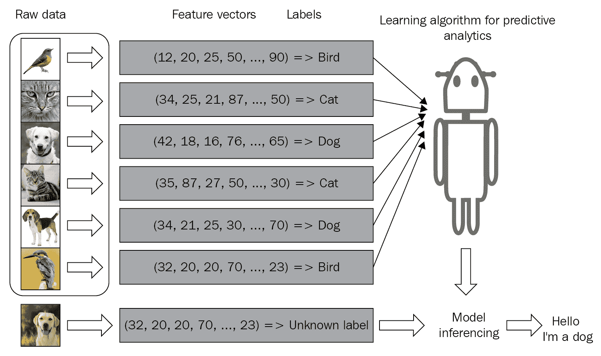

根据可用数据和要素类型的不同，预测模型的性能可能会大幅波动。因此，选择正确的特征是推理发生前最重要的步骤之一。这被称为特征工程，其中关于数据的领域知识被用于仅创建选择性的或有用的特征，这些特征有助于准备要使用的特征向量，以便机器学习算法工作。

例如，比较酒店是相当困难的，除非我们已经有住在多家酒店的亲身经历。然而，在 ML 模型的帮助下，它已经从成千上万的评论和特征中训练出质量特征(例如，酒店有多少星级、房间大小、位置、客房服务等等)，现在它是非常可行的。我们将在整个章节中看到几个例子。然而，在开发这样一个 ML 模型之前，了解一些 ML 概念也是很重要的。


# 一般机器学习的经验法则

一般机器学习的经验法则是，数据越多，预测模型越好。然而，拥有更多的要素通常会造成混乱，以至于性能会大幅下降，尤其是在数据集是高维数据集的情况下。整个学习过程需要输入数据集，这些数据集可以分为三种类型(或者已经这样提供了):

*   **训练集**是来自历史或实时数据的知识库，用于拟合 ML 算法的参数。在训练阶段，ML 模型利用训练集来寻找网络的最佳权重，并通过最小化训练误差来达到目标函数。这里，使用反向支持规则或优化算法来训练模型，但是需要在学习过程开始之前设置所有的超参数。
*   **验证集**是用于调整 ML 模型参数的一组示例。它确保模型得到良好的训练，并朝着避免过度拟合的方向推广。一些 ML 实践者称之为开发集或 dev 集。
*   **测试集**用于评估已训练模型在未知数据上的性能。这一步也被称为模型推理。在对测试集上的最终模型进行评估之后(也就是说，当我们对模型的性能完全满意时)，我们不必对模型进行任何进一步的调整，但是经过训练的模型可以部署到生产就绪环境中。

一种常见的做法是将输入数据(在必要的预处理和特性工程之后)分成 60%用于训练，10%用于验证，20%用于测试，但这实际上取决于用例。有时，我们还需要根据数据集的可用性和质量对数据执行上采样或下采样。

在不同类型的训练集上学习的经验法则在不同的机器学习任务中会有所不同，我们将在下一节中介绍。不过，在此之前，我们先来快速了解一下机器学习中的几个常见现象。


# 机器学习模型中的一般问题

当我们使用这些输入数据进行训练、验证和测试时，通常学习算法不能 100%准确地学习，这涉及训练、验证和测试错误(或损失)。在机器学习模型中可能会遇到两种类型的错误:

*   不可约误差
*   可减少的误差

即使使用最稳健、最复杂的模型，也无法减少不可约误差。然而，可减少的误差有两个组成部分，称为偏差和方差，可以减少**。**因此，为了理解模型(即预测误差)，我们只需要关注偏差和方差:

*   偏差是指预测值与实际值的差距。通常，如果平均预测值与实际值(标签)相差很大，则偏差较高。
*   一个 ML 模型会有很高的偏差，因为它不能对输入和输出变量之间的关系建模(不能很好地捕捉数据的复杂性)，变得非常简单。因此，具有高方差的过于简单的模型会导致数据拟合不足。

下图给出了一些高层次的见解，并展示了恰到好处的模型应该是什么样子:

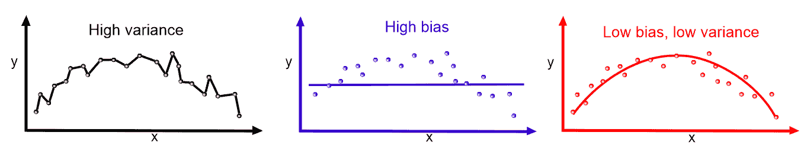

方差表示预测值和实际值之间的可变性(它们有多分散)。

**Identifying high bias and high variance**: If the model has a high training error as well as the validation error or test error is the same as the training error, the model has high bias. On the other hand, if the model has low training error but has high validation or high test error, the model has a high variance.

ML 模型通常在训练集上表现很好，但在测试集上表现不佳(因为高错误率)。最终，它导致了一个欠拟合模型。我们可以再次回顾一下过度拟合和欠拟合:

*   **欠拟合**:如果你的训练和验证误差相对相等并且非常高，那么你的模型很可能欠拟合你的训练数据。
*   **过度拟合**:如果你的训练误差低，而你的验证误差高，那么你的模型很可能过度拟合你的训练数据。恰到好处的模型学习得很好，在看不见的数据上也表现得更好。

**Bias-variance trade-off**: The high bias and high variance issue is often called bias-variance trade-off, because a model cannot be too complex or too simple at the same time. Ideally, we would strive for the best model that has both low bias and low variance.

现在我们知道了 ML 算法的基本工作原理。然而，基于问题类型和用于解决问题的方法，ML 任务可以是不同的，例如，监督学习、非监督学习和强化学习。我们将在下一节更详细地讨论这些学习任务。


# ML 任务

尽管每一个 ML 问题或多或少都是一个优化问题，但是它们的解决方式可以有所不同。事实上，学习任务可以分为三种类型:监督学习、非监督学习和强化学习。


# 监督学习

监督学习是最简单和最著名的自动学习任务。它基于许多预定义的示例，其中每个输入所属的类别都是已知的，如下图所示:

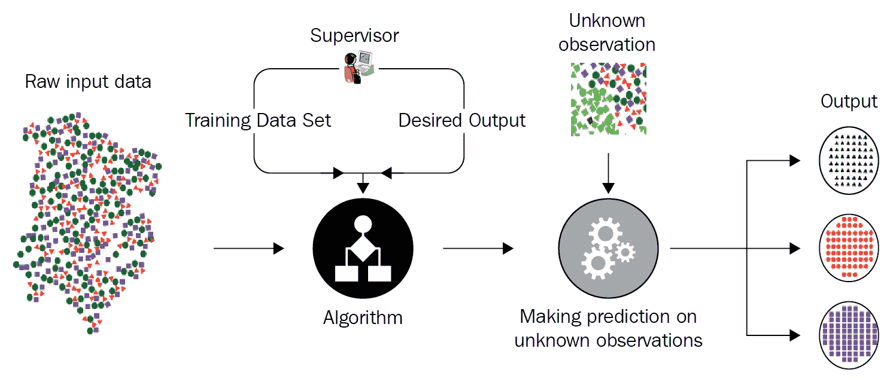

上图显示了监督学习的典型工作流程。一个参与者(例如，一个数据科学家或数据工程师)执行**提取转换加载** ( **ETL** )和必要的特征工程(包括特征提取、选择等等)来获得带有特征和标签的适当数据，以便将它们输入到模型中。然后，他将数据分成训练集、开发集和测试集。训练集用于训练 ML 模型，验证集用于针对过拟合问题和正则化来验证训练，然后参与者将在测试集(即，看不见的数据)上评估模型的性能。

但是，如果性能不令人满意，他可以执行额外的调优，以获得基于超参数优化的最佳模型。最后，他将在生产就绪环境中部署最佳模型。下图概括了这些步骤:

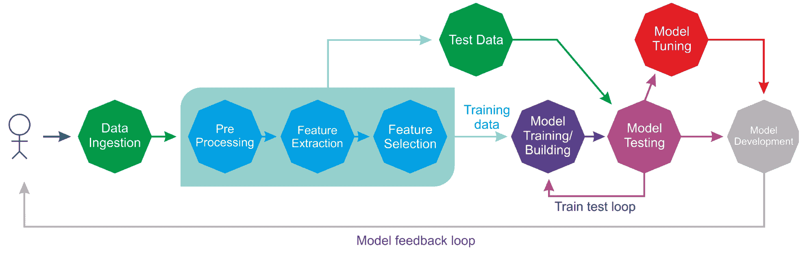

在整个生命周期中，可能会有许多参与者(例如，数据工程师、数据科学家或 ML 工程师)独立或协作地执行每个步骤。监督学习环境包括分类和回归任务；分类用于预测数据点属于哪个类(离散值)。它还用于预测类属性的标签。另一方面，回归用于预测连续值并对类属性进行数值预测。

在监督学习的上下文中，输入数据集所需的学习过程被随机分成三组，例如，60%用于训练组，10%用于验证组，剩余的 30%用于测试组。


# 无监督学习

如果没有给定标签，您将如何对数据集进行汇总和分组？您可能会尝试通过找到数据集的底层结构并测量统计属性(如频率分布、平均值、标准差等)来回答这个问题。如果问题是*，你将如何有效地以压缩格式表示数据？*你可能会回答说你会用一些软件来做压缩，尽管你可能不知道那个软件会怎么做。下图显示了无监督学习任务的典型工作流程:

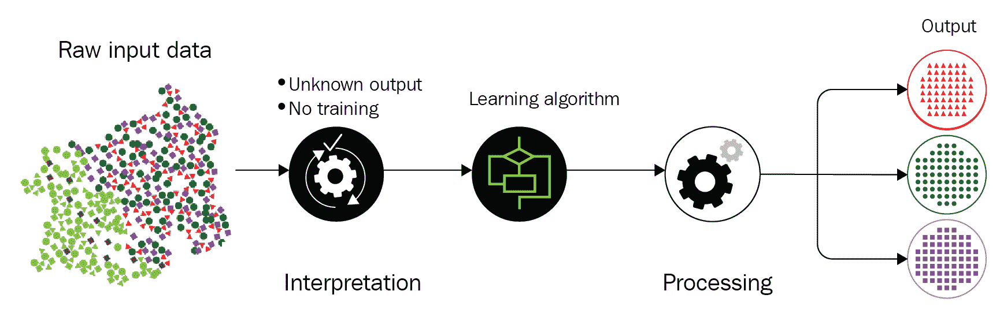

这正是无监督学习的两个主要目标，无监督学习在很大程度上是一个数据驱动的过程。我们称这种类型的学习*为无监督的*，因为你将不得不处理未标记的数据。以下引文来自人工智能研究主任 Yann LeCun(来源:预测学习，NIPS 2016，Yann LeCun，脸书研究):

*"Most of human and animal learning is unsupervised learning. If intelligence was a cake, unsupervised learning would be the cake, supervised learning would be the icing on the cake, and reinforcement learning would be the cherry on the cake. We know how to make the icing and the cherry, but we don't know how to make the cake. We need to solve the unsupervised learning problem before we can even think of getting to true AI".*

两种最广泛使用的无监督学习任务包括:

*   **聚类**:根据相似性(或统计特性)对数据点进行分组。例如，像 Airbnb 这样的公司经常把它的公寓和房子分成不同的社区，这样顾客就可以更容易地找到列出的那些。
*   **降维** **降维**:压缩数据，尽可能保留数据的结构和统计特性。例如，为了建模和可视化，通常需要减少数据集的维数。
*   **异常检测**:可用于多种应用，如识别信用卡欺诈检测、识别工业工程过程中的硬件故障，以及识别大规模数据集中的异常值。
*   **关联规则挖掘**:常用于购物篮分析，比如问哪些物品被聚集在一起，频繁出现。


# 强化学习

强化学习是一种人工智能方法，专注于通过系统与环境的交互来学习系统。在强化学习中，系统的参数根据从环境中获得的反馈进行调整，这反过来又对系统做出的决策提供反馈。下图显示了一个人为了到达目的地而做出的决定。让我们以你从家到工作的路线为例:

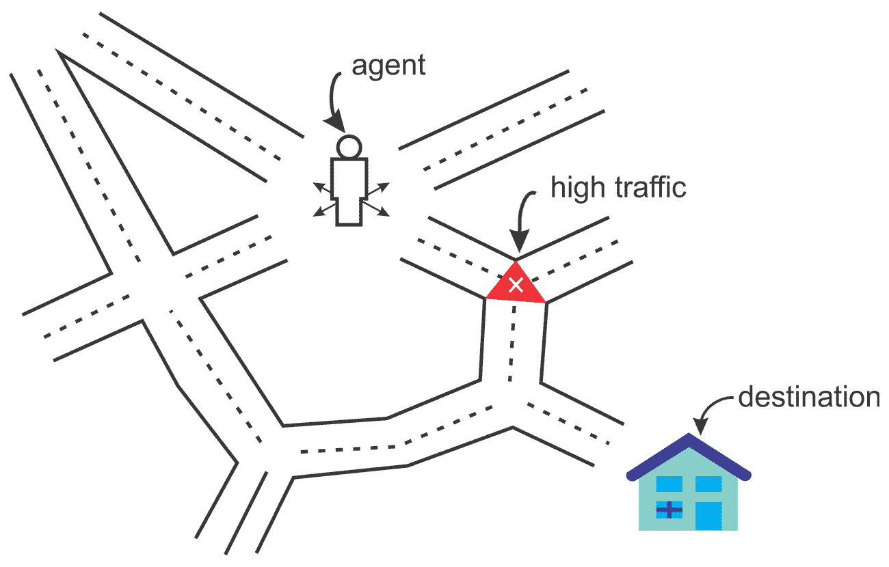

在这种情况下，你每天走同样的路线上班。然而，突然有一天，你感到好奇，决定尝试不同的路线，以期找到最短的路径。类似地，基于你的经验和不同路线所花费的时间，你会决定你是否应该更频繁地选择一条特定的路线。我们可以再看一个例子，用一个系统来模拟一个棋手。为了提高其性能，系统利用其先前移动的结果；这样的系统被称为强化学习系统。

到目前为止，我们已经学习了 ML 的基本工作原理和不同的学习任务。然而，每个学习任务的概要视图和一些示例用例是强制性的，我们将在下一小节中看到。


# 总结学习类型及应用

我们已经看到了 ML 算法的基本工作原理。然后，我们已经看到了什么是基本的 ML 任务，以及它们如何形成特定领域的问题。然而，这些学习任务中的每一个都可以使用不同的算法来解决。下图对此进行了简要介绍:

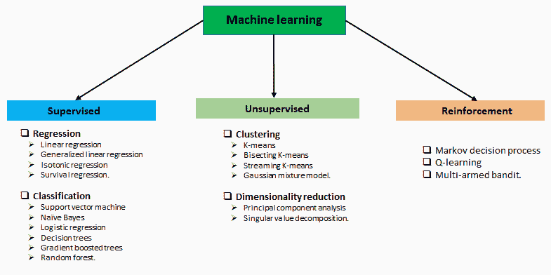

学习的类型及相关问题

下图总结了前面提到的 ML 任务和一些应用:

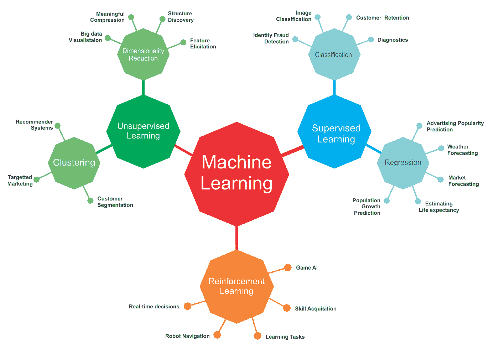

来自不同应用领域的 ML 任务和一些用例

然而，上图仅列出了一些使用不同 ML 任务的用例及应用。在实践中，ML 被用在许多用例及应用中。我们将在本书中尝试涵盖其中的一些。


# Scala 概述

Scala 是一种可伸缩的、函数式的、面向对象的编程语言，与 Java 关系最为密切。然而，Scala 被设计得更加简洁，并且具有函数式编程语言的特性。比如用 Scala 写的 Apache Spark，就是一个快速通用的大规模数据处理引擎。

Scala 的成功归功于许多因素:它有许多工具可以实现简洁的表达，它非常简洁，因为你需要更少的输入，因此它需要更少的阅读，它还提供了非常好的性能。这就是为什么与 R、Python 和 Java 相比，Spark 对 Scala 的支持更多，因为用 Scala 编写的 API 更多。Scala 的符号操作符易于阅读，与 Java 相比，大多数 Scala 代码都相对简洁易读；Java 太啰嗦了。Scala 中还提供了模式匹配和高阶函数等函数式编程概念。

开始使用 Scala 的最好方法是通过 **Scala 构建工具** ( **SBT** )使用 Scala，或者通过**集成开发环境** ( **IDE** )使用 Scala。无论哪种方式，第一个重要的步骤是下载、安装和配置 Scala。然而，由于 Scala 运行在 **Java 虚拟机** ( **JVM** )上，所以在您的机器上安装和配置 Java 是一个先决条件。因此，我不打算介绍如何做到这一点。而是提供一些有用的链接([https://en . Wikipedia . org/wiki/Integrated _ development _ environment](https://en.wikipedia.org/wiki/Integrated_development_environment))。

只需遵循在 https://www.scala-lang.org/download/的关于如何设置 Java 和 IDE(例如 IntelliJ IDEA)或构建工具(例如 SBT)的说明。如果你使用的是 Windows(比如 Windows 10)或者 Linux(比如 Ubuntu)，请访问[https://www . journal dev . com/7456/download-install-Scala-Linux-UNIX-Windows](https://www.journaldev.com/7456/download-install-scala-linux-unix-windows)。最后，这里是一些 macOS 指令:[http://sourabhbajaj.com/mac-setup/Scala/README.html](http://sourabhbajaj.com/mac-setup/Scala/README.html)。

由于 Scala 运行在 JVM 上，当 Java 程序员需要给他们的代码添加一些函数式编程味道时，他们通常更喜欢 Scala。谈到编辑器，还有各种其他选项。以下是一些可供选择的选项:

*   Scala IDE
*   Eclipse 的 Scala 插件
*   智能理念
*   Emacs
*   精力

使用众多 beta 插件、本地、远程和高级调试工具，以及 Scala 的语义高亮和代码完成，Eclipse 有几个优势。


# Scala 中的 ML 库

虽然与 Java 和 Python 相比，Scala 是一种相对较新的编程语言，但问题是，当我们拥有 Python 和 R 时，我们为什么需要考虑学习它。Python 和 R 是两种领先的编程语言，用于快速原型制作和数据分析，包括构建、探索和操作强大的模型。

但是 Scala 也正在成为功能产品开发中的关键语言，非常适合大数据分析。大数据应用通常需要稳定性、灵活性、高速、可扩展性和并发性。所有这些需求都可以用 Scala 来满足，因为 Scala 不仅是一种通用语言，也是数据科学的强大选择(例如，Spark MLlib/ML)。过去几年我一直在使用 Scala，我发现越来越多的 Scala ML 库正在开发中。接下来，我们将讨论可用于开发 ML 应用的可用且广泛使用的 Scala 库。

感兴趣的读者可以快速浏览一下这个，它列出了 15 个最受欢迎的用于 ML 和数据科学的 Scala 库:
[https://www . datasciencecentral . com/profiles/blogs/top-15-Scala-libraries-for-data-science-in-2018-1](https://www.datasciencecentral.com/profiles/blogs/top-15-scala-libraries-for-data-science-in-2018-1)


# 火花 MLlib 和 ML

MLlib 是一个库，提供了使用 Scala 实现的用户友好的 ML 算法。然后暴露相同的 API，为 Java、Python 和 r 等其他语言提供支持，Spark MLlib 为存储在单台机器上的本地向量和矩阵数据类型提供支持，以及由一个或多个**弹性分布式数据集** ( **RDDs** )支持的分布式矩阵。

RDD 是 Apache Spark 的主要数据抽象，通常称为 Spark Core，它代表一个不可变的、分区的元素集合，可以并行操作。弹性使 RDD 容错(基于 RDD 谱系图)。RDD 有助于分布式计算，即使数据存储在 Spark 集群的多个节点上。此外，RDD 可以转换为数据集，作为具有原始值(如元组或其他对象)的分区数据的集合。

Spark ML 是一组新的 ML APIs，允许用户在数据集之上快速组装和配置实用的机器学习管道，这使得将多种算法结合到单个管道中变得更加容易。例如，ML 算法(称为估计器)和一组转换器(例如，`StringIndexer`、`StandardScalar`和`VectorAssembler`)可以链接在一起，以分阶段执行 ML 任务，而无需顺序运行它们。

感兴趣的读者可以在[https://spark.apache.org/docs/latest/ml-guide.html](https://spark.apache.org/docs/latest/ml-guide.html)看看 Spark MLlib 和 ML 指南。

在这一点上，我必须告诉你一些非常有用的事情。因为我们也将在接下来的章节中使用 Spark MLlib 和 ML APIs。因此，提前解决一些问题是值得的。如果你是 Windows 用户，那么让我告诉你一个你在使用 Spark 时会遇到的非常奇怪的问题。问题是，Spark 可以在 Windows、macOS 和 Linux 上运行。在 Windows 上使用 Eclipse 或 IntelliJ IDEA 开发 Spark 应用时，您可能会遇到 I/O 异常错误，因此，您的应用可能无法成功编译，或者可能会被中断。

Spark 也需要一个在 Windows 上运行 Hadoop 的运行时环境。不幸的是，Spark 的二进制发行版(例如 v2.4.0)不包含 Windows 原生组件，如`winutils.exe`或`hadoop.dll`。但是，如果您无法确保运行时环境，则这些是在 Windows 上运行 Hadoop 所必需的(不是可选的),将会出现如下 I/O 异常:

```
03/02/2019 11:11:10 ERROR util.Shell: Failed to locate the winutils binary in the hadoop binary path
 java.io.IOException: Could not locate executable null\bin\winutils.exe in the Hadoop binaries.
```

有两种方法可以在 Windows 和 ide(如 Eclipse 和 IntelliJ IDEA)上解决这个问题:

1.  从[https://github.com/steveloughran/ winutils/tree/master/Hadoop-2 下载`winutls.exe`。7.1/bin/](https://github.com/steveloughran/winutils/tree/master/hadoop-2.7.1/bin/) 。
2.  下载并复制到 Spark 发行版的`bin`文件夹中——例如`spark-2.2.0-bin-hadoop2.7/bin/`。
3.  选择项目|运行配置...| Environment | New |并创建一个名为`HADOOP_HOME`的变量，然后将路径放在 Value 字段中。下面是一个例子:`c:/spark-2.2.0-bin-hadoop2.7/bin/` | OK | Apply | Run。


# ScalNet 和 DynaML

ScalNet 是一个围绕 Deeplearning4J 的包装器，旨在模拟一个类似 Keras 的 API 来开发深度学习应用。如果您已经熟悉神经网络架构，并且来自 JVM 背景，那么探索基于 Scala 的 ScalNet 库是值得的:

*   GitHub([https://GitHub . com/deep lear…/deep learning 4j/…/master/scal net](https://github.com/deeplearning4j/deeplearning4j/tree/master/scalnet?fbclid=IwAR01enpe_dySCpU1aPkMorznm6k31cDmQ49wE52_jAGQzcr-3CZs9NNSVas))
*   示例([https://github . com/…/sc…/org/deep learning 4j/scal net/examples](https://github.com/deeplearning4j/ScalNet/tree/master/src/test/scala/org/deeplearning4j/scalnet/examples?fbclid=IwAR2uMjTESm9KHAIZ_mZCHckZhRuZJByhmAbQDoUAn1vCVC1SoE0KmKDmQ9M))

DynaML 是一个 Scala 和 JVM ML 工具箱，用于研究、教育和工业。这个库提供了一种交互式的、端到端的、企业友好的开发 ML 应用的方式。如果你有兴趣，可以在 https://transcendent-ai-labs.github.io/DynaML/看更多。


# 斯卡兰普，维加斯和微风

Breeze 是 Scala 的主要科学计算库之一，它提供了一种快速有效的数据操作方式，例如用于创建、转置、填充数字、执行元素操作和计算行列式的矩阵和向量操作。

Breeze 支持基于`netlib-java`库的基本操作，可实现极快的代数计算。此外，Breeze 还提供了一种方式来执行处理数字信号所需的信号处理操作**、**。

以下是 GitHub 链接:

*   微风([https://github.com/scalanlp/breeze/](https://github.com/scalanlp/breeze/))
*   微风的例子([https://github.com/scalanlp/breeze-examples](https://github.com/scalanlp/breeze-examples))
*   微风快速入门([https://github.com/scalanlp/breeze/wiki/Quickstart](https://github.com/scalanlp/breeze/wiki/Quickstart))

另一方面，ScalaNLP 是一个科学计算、ML 和自然语言处理的套件，它也是几个库的保护伞项目，包括 Breeze 和 Epic。Vegas 是另一个用于数据可视化的 Scala 库，它允许绘制规范，比如过滤、转换和聚合。Vegas 比另一个数值处理库 Breeze 功能更强大。

有关使用 Vegas 和 Breeze 的更多信息和示例，请参考 GitHub:

*   维加斯([https://github.com/vegas-viz/Vegas](https://github.com/vegas-viz/Vegas))
*   微风([https://github.com/scalanlp/breeze](https://github.com/scalanlp/breeze))

虽然 Breeze 的可视化库由 Breeze 和 JFreeChart 提供支持，但 Vegas 可以被视为 Scala 和 Spark 缺少的 Matplotlib，因为它提供了几个选项来在交互式笔记本环境(如 Jupyter 和 Zeppelin)中渲染绘图。

请参考本书 GitHub 资源库中每一章的 Zeppelin 笔记本解决方案。


# 开始学习

在这一节中，我们将看到一个分类问题的真实例子。这个想法是开发一个分类器，给定性别、年龄、时间、疣的数量、类型和面积的值，将预测病人是否必须接受冷冻治疗。


# 数据集的描述

我们将使用最近从 UCI 机器学习库中添加的冷冻疗法数据集。数据集可以从[http://archive . ics . UCI . edu/ml/datasets/cryo therapy+Dataset+#](http://archive.ics.uci.edu/ml/datasets/Cryotherapy+Dataset+#)下载。

该数据集包含关于使用冷冻疗法的 90 名患者的疣治疗结果的信息。如果你不知道，疣是一种由人类乳头瘤病毒感染引起的皮肤问题。疣是典型的小而粗糙的硬块，与皮肤的其他部分颜色相似。

有两种方法可以解决这个问题:

*   **水杨酸**:一种含有水杨酸的凝胶，用于药物创可贴。
*   冷冻疗法:将一种冷冻液体(通常是氮气)喷洒在疣上。它会破坏受影响区域的细胞。冷冻治疗后，通常会出现水疱，最终变成痂，大约一周后脱落。

有 90 个样本或实例要么被建议进行冷冻治疗，要么未经冷冻治疗就被排出。数据集中有七个属性:

*   `sex`:患者性别，用`1`(男)或`0`(女)表示。
*   `age`:患者年龄。
*   `Time`:观察治疗时间，以小时为单位。
*   `Number_of_Warts`:疣数。
*   `Type`:疣的种类。
*   `Area`:受影响面积的大小。
*   `Result_of_Treatment`:处理的推荐结果，用`1`(是)或`0`(否)表示。它也是目标列。

你可以理解，这是一个分类问题，因为我们将不得不预测离散的标签。更确切地说，是一个二元分类问题。由于这是一个只有六个要素的小数据集，我们可以从一个称为逻辑回归的非常基本的分类算法开始，其中逻辑函数应用于回归，以获得它属于任一类的概率。我们将在[第三章](51712107-c5bc-4d7d-a84a-3039aafc8c0a.xhtml)、 *Scala 学习分类*中学习更多关于逻辑回归和其他分类算法的细节。为此，我们使用 Scala 中基于 Spark ML 的逻辑回归实现。


# 配置编程环境

我假设 Java 已经安装在您的机器上，并且也设置了`JAVA_HOME`。另外，我假设您的 IDE 已经安装了 Maven 插件。如果是这样，那么只需创建一个 Maven 项目并添加项目属性，如下所示:

```
<properties>
     <project.build.sourceEncoding>UTF-8</project.build.sourceEncoding>
     <java.version>1.8</java.version>
     <jdk.version>1.8</jdk.version>
     <spark.version>2.3.0</spark.version>
 </properties>
```

在前面的`properties`标签中，我指定了 Spark 版本(也就是`2.3.0`)，但是你可以调整。然后在`pom.xml`文件中添加以下依赖关系:

```
<dependencies>
     <dependency>
         <groupId>org.apache.spark</groupId>
         <artifactId>spark-core_2.11</artifactId>
         <version>${spark.version}</version>
     </dependency>
     <dependency>
         <groupId>org.apache.spark</groupId>
         <artifactId>spark-sql_2.11</artifactId>
         <version>${spark.version}</version>
         </dependency>
     <dependency>
         <groupId>org.apache.spark</groupId>
         <artifactId>spark-mllib_2.11</artifactId>
         <version>${spark.version}</version>
         </dependency>
     <dependency>
         <groupId>org.apache.spark</groupId>
         <artifactId>spark-graphx_2.11</artifactId>
         <version>${spark.version}</version>
     </dependency>
     <dependency>
         <groupId>org.apache.spark</groupId>
         <artifactId>spark-yarn_2.11</artifactId>
         <version>${spark.version}</version>
         </dependency>
     <dependency>
         <groupId>org.apache.spark</groupId>
         <artifactId>spark-network-shuffle_2.11</artifactId>
         <version>${spark.version}</version>
         </dependency>
    <dependency>
         <groupId>org.apache.spark</groupId>
         <artifactId>spark-streaming-flume_2.11</artifactId>
         <version>${spark.version}</version>
     </dependency>
     <dependency>
         <groupId>com.databricks</groupId>
         <artifactId>spark-csv_2.11</artifactId>
         <version>1.3.0</version>
         </dependency>
 </dependencies>
```

然后，如果一切顺利，所有的 JAR 文件将作为 Maven 依赖项下载到项目主目录中。好吧！然后我们就可以开始写代码了。


# Apache Spark 入门

既然您在这里学习如何用 Scala 解决现实生活中的问题，探索可用的 Scala 库将是值得的。不幸的是，除了 Spark MLlib 和 ML，我们没有太多的选择，它们可以非常容易和舒适地用于回归分析。重要的是，它将每个回归分析算法都实现为高级接口。我假设 Scala、Java 和您最喜欢的 IDE(如 Eclipse 或 IntelliJ IDEA)已经在您的机器上配置好了。我们将介绍 Spark 的一些概念，但不会提供太多细节，但我们也将在接下来的章节中继续学习。

首先我来介绍一下`SparkSession`，这是从 Spark 2.0 引入的一个 Spark 应用的统一入口。从技术上来说，`SparkSession`是与 Spark 的一些功能进行交互的网关，这些功能有一些构造，如`SparkContext`、`HiveContext`和`SQLContext`，它们都封装在一个`SparkSession`中。以前，您可能不知道如何创建这样的会话。嗯，一个`SparkSession`可以创建为一个构建器模式，如下所示:

```
import org.apache.spark.sql.SparkSession
val spark = SparkSession
      .builder // the builder itself
      .master("local[4]") // number of cores (i.e. 4, use * for all cores) 
      .config("spark.sql.warehouse.dir", "/temp") // Spark SQL Hive Warehouse location
      .appName("SparkSessionExample") // name of the Spark application
      .getOrCreate() // get the existing session or create a new one
```

前面的构建器将尝试获取一个现有的`SparkSession`或创建一个新的。那么新创建的`SparkSession`将被指定为全局默认值。

顺便说一下，当使用`spark-shell`时，您不需要显式地创建一个`SparkSession`，因为它已经创建好了，可以用`spark`变量访问。

创建数据帧可能是所有数据分析任务中最重要的任务。Spark 提供了一个`read()`方法，可以用来从各种格式的多个数据源读取数据，比如 CSV、JSON、Avro 和 JDBC。例如，以下代码片段显示了如何读取 CSV 文件并创建 Spark 数据帧:

```
val dataDF = spark.read
      .option("header", "true") // we read the header to know the column and structure
      .option("inferSchema", "true") // we infer the schema preserved in the CSV
      .format("com.databricks.spark.csv") // we're using the CSV reader from DataBricks
      .load("data/inputData.csv") // Path of the CSV file
      .cache // [Optional] cache if necessary 
```

一旦创建了 DataFrame，我们可以通过调用`show()`方法查看一些样本(即行),并使用`printSchema()`方法打印模式。调用`describe().show()`将显示关于数据帧的统计数据:

```
dataDF.show() // show first 10 rows 
dataDF.printSchema() // shows the schema (including column name and type)
dataDF.describe().show() // shows descriptive statistics
```

在很多情况下，我们不得不使用`spark.implicits._`包*，*这是最有用的进口货之一。它很方便，有很多隐式方法可以将 Scala 对象转换成数据集，反之亦然。一旦我们创建了数据帧，我们就可以分别使用`ceateOrReplaceTempView()`方法或`createGlobalTempView()`方法创建一个视图(临时或全局)来执行 SQL:

```
dataDF.createOrReplaceTempView("myTempDataFrame") // create or replace a local temporary view with dataDF
dataDF.createGlobalTempView("myGloDataFrame") // create a global temporary view with dataframe dataDF
```

现在可以发出 SQL 查询来查看表格格式的数据:

```
spark.sql("SELECT * FROM myTempDataFrame")// will show all the records
```

要删除这些视图，可分别调用`spark.catalog.dropTempView("myTempDataFrame")`或`spark.catalog.dropGlobalTempView("myGloDataFrame")`。顺便说一句，一旦你简单地调用了`spark.stop()`方法，它将破坏`SparkSession`和 Spark 应用分配的所有资源。感兴趣的读者可以在[https://](https://spark.apache.org/)[spark.apache.org/](https://spark.apache.org/)阅读详细的 API 文档以获取更多信息。


# 读取训练数据集

有一个`Cryotherapy.xlsx` Excel 文件，其中包含数据以及数据使用协议文本。所以，我只是复制了数据，保存在一个名为`Cryotherapy.csv`的 CSV 文件中。让我们从创建`SparkSession`——访问 Spark 的网关开始:

```
val spark = SparkSession
      .builder
      .master("local[*]")
      .config("spark.sql.warehouse.dir", "/temp")
      .appName("CryotherapyPrediction")
      .getOrCreate()

import spark.implicits._
```

那么我们来读一读训练集，一窥究竟:

```
var CryotherapyDF = spark.read.option("header", "true")
              .option("inferSchema", "true")
              .csv("data/Cryotherapy.csv")
```

让我们看看前面的 CSV 阅读器是否能够正确读取数据，包括头和类型:

```
CryotherapyDF.printSchema()
```

从下面的截图可以看出，Spark 数据帧的模式已经被正确识别。此外，正如所料，我的 ML 算法的所有特性都是数值型的(换句话说，以整数或双精度格式):

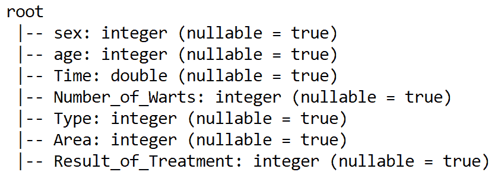

使用`show()`方法可以看到数据集的快照。我们可以限制行数；这里先说`5`:

```
CryotherapyDF.show(5)
```

前面一行代码的输出显示了数据帧的前五个样本:

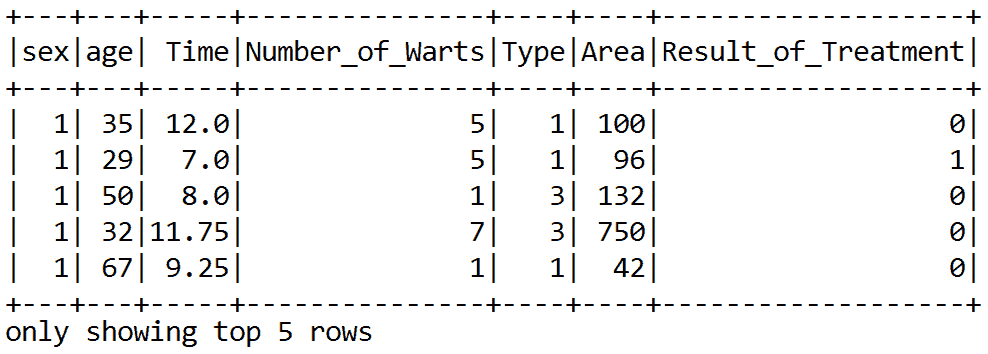


# 预处理和特征工程

根据 UCI 机器学习知识库上的数据集描述，没有空值。此外，基于 Spark ML 的分类器希望用数值来模拟它们。好的一面是，从模式中可以看出，所有必需的字段都是数字(即整数或浮点值)。另外，Spark ML 算法需要一个`label`列，在我们的例子中是`Result_of_Treatment`。让我们使用 Spark 提供的`withColumnRenamed()`方法将其重命名为`label`:

```
//Spark ML algorithm expect a 'label' column, which is in our case 'Survived". Let's rename it to 'label'
CryotherapyDF = CryotherapyDF.withColumnRenamed("Result_of_Treatment", "label")
CryotherapyDF.printSchema()
```

所有基于 Spark ML 的分类器都期望训练数据包含两个名为`label`(我们已经有了)和`features`的对象。我们已经看到我们有六个特征。然而，这些特征必须被组合以创建特征向量。这可以使用`VectorAssembler()`方法来完成。这是 Spark ML 库中的一种转换器。但是首先我们需要选择除了`label`列之外的所有列:

```
val selectedCols = Array("sex", "age", "Time", "Number_of_Warts", "Type", "Area")
```

然后我们实例化一个`VectorAssembler()`转换器，转换如下:

```
val vectorAssembler = new VectorAssembler()
          .setInputCols(selectedCols)
          .setOutputCol("features")
val numericDF = vectorAssembler.transform(CryotherapyDF)
                    .select("label", "features")
numericDF.show()
```

正如所料，前面代码段的最后一行显示了具有`label`和`features`的组合数据帧，这是训练 ML 算法所需要的:

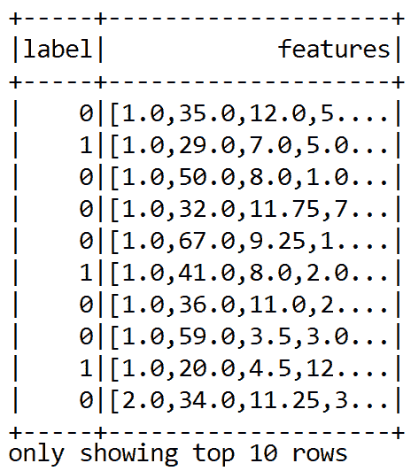


# 准备训练数据和训练分类器

接下来，我们分离训练集和测试集。假设训练集的 80%将用于训练，而另外 20%将用于评估已训练的模型:

```
val splits = numericDF.randomSplit(Array(0.8, 0.2))
val trainDF = splits(0)
val testDF = splits(1)
```

通过指定杂质、最大箱数和树的最大深度来实例化决策树分类器。另外，我们设置了`label`和`feature`列:

```
val dt = new DecisionTreeClassifier()
      .setImpurity("gini")
      .setMaxBins(10)
      .setMaxDepth(30)
      .setLabelCol("label")
      .setFeaturesCol("features")
```

现在数据和分类器都准备好了，我们可以进行训练了:

```
val dtModel = dt.fit(trainDF)
```


# 评估模型

由于这是一个二元分类问题，我们需要`BinaryClassificationEvaluator()`估计器来评估模型在测试集上的性能:

```
val evaluator = new BinaryClassificationEvaluator()
      .setLabelCol("label")
```

现在训练已经完成，我们有了一个经过训练的决策树模型，我们可以在测试集上评估经过训练的模型:

```
val predictionDF = dtModel.transform(testDF)
```

最后，我们计算分类精度:

```
val accuracy = evaluator.evaluate(predictionDF)
println("Accuracy =  " + accuracy)    
```

您应该体验到大约 96%的分类准确率:

```
Accuracy =  0.9675436785432
```

最后，我们通过调用`stop()`方法来停止`SparkSession`:

```
spark.stop()
```

我们已经用最少的努力达到了 96%的准确率。但是，还有其他性能指标，如精确度、召回率和 F1 值。我们将在接下来的章节中讨论它们。另外，如果你是 ML 的新手，还没有理解这个例子中的所有步骤，不要担心。我们将在其他章节中用各种例子来回顾所有这些步骤。


# 摘要

在这一章中，我们学习了 ML 的一些基本概念，它被用来解决一个现实生活中的问题。我们从简单介绍 ML 开始，包括基本的学习工作流程、ML 经验法则和不同的学习任务，然后我们逐渐涵盖了重要的 ML 任务，如监督学习、非监督学习和强化学习。此外，我们讨论了基于 Scala 的 ML 库。最后，我们已经看到了如何通过解决一个简单的分类问题来开始使用 Scala 和 Spark ML 进行机器学习。

现在我们知道了基本的 ML 和基于 Scala 的 ML 库，我们可以开始以一种更结构化的方式学习。在下一章，我们将学习回归分析技术。然后，我们将开发一个预测分析应用，使用线性回归和广义线性回归算法来预测交通中的慢度。