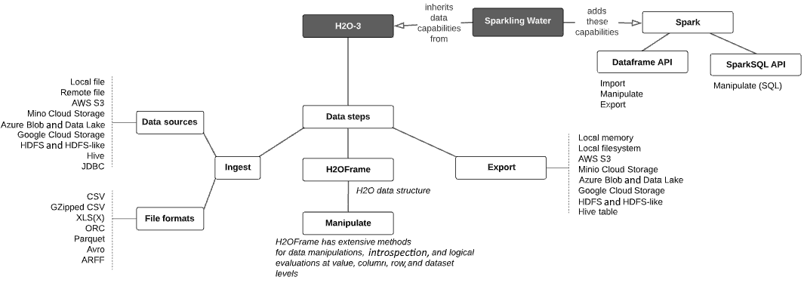
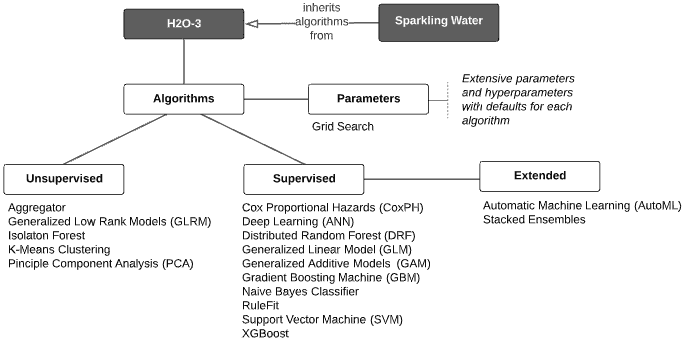

# 四、H2O 模型规模化建设——能力衔接

到目前为止，我们已经了解了如何按比例建立 H2O 模型的基本工作流程，但这是使用 H2O 最少的情况下完成的。在这一章中，我们将按比例调查 H2O 模型建筑的极其广泛的能力集。然后，我们将使用本章的知识，继续第二部分，*使用 H2O* 在大数据量上构建最先进的模型，在这里，我们将进入正题，使用先进的技术来构建和解释大规模的高度预测模型。

为了进行这项调查，我们将本章分为以下几个主题:

*   在模型构建过程中阐明 H2O 数据功能
*   H2O 机器学习算法综述
*   了解 H2O 建模功能

# 建模期间的 H2O 数据功能

回想一下，H2O 模型建造的规模是通过使用 H2O 3 或它的扩展——苏打水来完成的，它用火花能力包裹了 H2O 3。H2O 3 API 在模型构建过程中使用了广泛的数据功能，而苏打水 API 继承了这些功能，并增加了 Spark 的额外功能。这些功能分为以下三大类:

*   **将数据从源系统摄取到 H2O 集群**
*   **在 H2O 集群上操作数据**
*   **将数据**从 H2O 集群导出到外部目的地

如前几章所强调的，H2O 集群架构(H2O 3 或苏打水)允许无限规模的模型构建，但它是从通过在 IDE 中编码 H2O 来构建模型的数据科学家那里抽象出来的。

H2O 数据能力在下图中概述，随后详细说明:

图 4.1–H2O 数据功能

让我们从数据摄取开始。

## 将数据从源摄取到 H2O 集群

支持以下数据源:

*   **本地文件**
*   **远程文件**
*   **AWS S3**
*   **MinIO 云存储**
*   **天蓝色斑点和数据湖**
*   **谷歌云存储**
*   **HDFS**
*   **类 HDFS**:Alluxio FS 和 IBM HDFS
*   **蜂巢**(通过 Metastore/HDFS 或 JDBC)
*   **JDBC**

支持的源数据文件格式如下:

*   **CSV** (带有任何分隔符的文件，自动检测或指定)
*   **gzip CSV**
*   **XLS** 或 **XLSX**
*   **兽人**
*   **拼花地板**
*   **Avro**
*   **ARFF**
*   **SVMLight**

H2O 数据接收的一些重要特征如下:

*   数据直接从源接收到 H2O 群集内存，而不通过 IDE 客户端。
*   在所有情况下，数据都在内存中跨 H2O 集群进行分区。
*   除了本地文件、远程文件和 JDBC 源之外，数据被并行接收到每个分区。
*   H2O 集群上的数据在 IDE 中以二维**H2 of frame**的形式呈现给用户。

现在让我们看看，既然数据被输入到 H2O，并被表示为 H2OFrame，我们该如何操作数据。

## 操作 H2O 集群中的数据

H2O 3 API 提供了广泛的数据处理能力。正如前面的列表中提到的，内存中的数据集分布在 H2O 集群上，并在数据加载和后续数据操作后在 IDE 中具体表示为 H2OFrame。

H2OFrames 有一个广泛的方法列表，用于在值、列、行和完整数据集级别执行数学、逻辑和自省操作。一个 h2of 帧在体验上类似于**熊猫数据帧**或 **R 数据帧**。

以下示例只是可以在 H2Oframes 上完成的一些数据操作:

*   对**数据列**的操作:
    *   更改数据类型(例如，从 0 到 7 的整数作为分类值)。
    *   通过应用数学函数来聚合列(分组依据)。
    *   显示列名并用作模型中的特征。
*   对**数据行**的操作:
    *   组合一个或多个数据集中的行。
    *   通过指定行索引、行范围或逻辑条件来分割(筛选)数据集的行。
*   对**数据集**的操作:
    *   根据共享列名的公共值合并两个数据集。
    *   通过在列上旋转来转换数据集。
    *   将一个数据集拆分为两个或多个数据集(例如，定型、验证和测试)。
*   对**数据值**的操作:
    *   用相邻的行或列值向前或向后填充缺失值。
    *   通过用聚合结果进行估算来填充缺失值(例如，列的平均值)。
    *   基于逻辑条件替换数值。
    *   修剪值，操作字符串，返回数值符号，并测试值是否不适用。
*   **功能工程**操作:
    *   日期解析，例如，将一个日期列解析为年、月、日的单独列。
    *   从其他列以数学方式和有条件地派生出一个新列，包括使用 lambda 表达式。
    *   执行目标编码(即，用目标变量的平均值替换分类值)。
    *   对于**自然语言处理(NLP)** 问题，执行**字符串标记化**、**词频-逆文档频率(TF-IDF)** 计算，将 **Word2vec** 模型转换为H2OFrame进行数据操作。

有关 H2O 数据操作可能性的完整细节，请参见 H2O Python 文档([http://docs.h2o.ai/h2o/latest-stable/h2o-py/docs/frame.html](http://docs.h2o.ai/h2o/latest-stable/h2o-py/docs/frame.html))或 R 文档([http://docs . H2O . ai/H2O/latest-stable/H2O-R/docs/reference/index . html](http://docs.h2o.ai/h2o/latest-stable/h2o-r/docs/reference/index.html))。另外，关于数据操作的例子请参考*用 Python 和 H2O 进行机器学习*([http://H2O-release . S3 . Amazon AWS . com/H2O/rel-wheeler/2/docs-website/H2O-docs/booklets/Python booklet . pdf](http://h2o-release.s3.amazonaws.com/h2o/rel-wheeler/2/docs-website/h2o-docs/booklets/PythonBooklet.pdf))第四节。

处理数据是将其作为建模输入的关键。我们可能还想导出我们处理过的数据以备将来使用。下一节列出了 H2O 数据导出功能。

## 从 H2O 集群中导出数据

内存中的 H2OFrames可以导出到外部目标。这些目标系统如下:

*   **本地客户端内存**
*   **本地文件系统**
*   **AWS S3**
*   **MinIO 云存储**
*   **Azure Blob 和数据湖**
*   **谷歌云存储**
*   **HDFS**
*   **类似 HDFS 的** : Alluxio FS 和 IBM HDFS
*   **蜂巢桌** (CSV 或拼花，经由 JDBC)

当然，必须考虑导出数据的数量。例如，大量数据不适合本地客户机内存或文件系统。

现在让我们看看苏打水增加了哪些额外的数据功能。

## 苏打水提供的附加数据功能

苏打水继承了《H2O 3》的所有数据功能。重要的是，sparking Water通过利用 Spark DataFrame 和 Spark SQL APIs 增加了额外的数据功能，因此可以相应地导入、操作和导出数据。关于完整的 Spark DataFrame 和 Spark SQL 功能，请参见以下参考资料:[https://Spark . Apache . org/docs/latest/SQL-programming-guide . html](https://spark.apache.org/docs/latest/sql-programming-guide.html)。

使用苏打水的一个关键模式是利用 Spark 实现高级数据管理功能，然后将产生的 Spark 数据帧转换为 H2Oframe，然后使用 H2O 的机器学习算法建立最先进的模型，这将在下一节中介绍。这些算法可以用在 H2O 3 号或者气泡水中。

# H2O 机器学习算法

H2O 有广泛的**无监督**和**监督**学习算法，具有相似的可重用 API 构造——例如，相似的方式来设置超参数或调用可解释能力。从 H2O 3 或苏打水的角度来看，这些算法是相同的，如下图所示:

图 4.2–H2O 算法

每个算法都有一组广泛的参数和超参数可以设置或用作默认值。这些算法接受 H2OFrames 作为数据输入。请记住，H2OFrame 只是 IDE 客户端上的一个句柄，它指向算法处理数据的远程 H2O 集群上的分布式内存数据。

让我们来看看 H2O 的分布式机器学习算法。

## H2O 无监督学习算法

无监督算法不进行预测，而是试图发现数据中的聚类和异常，或者减少数据集的维度。H2O 有以下无监督学习算法可以大规模运行:

*   **聚合器**
*   **广义低秩模型(GLRM)**
*   **隔离林**
*   **扩展隔离林**
*   **K-均值聚类**
*   **主成分分析**

## H2O 监督学习算法

监督学习算法通过从标有结果的训练数据集中学习来预测结果。H2O 有以下监督学习算法可以大规模运行:

*   **Cox 比例风险(CoxPH)**
*   **深度学习(人工神经网络，或 ANN)**
*   **分布式随机森林(DRF)**
*   **广义线性模型(GLM)**
*   **最大 R 平方改进(MAXR)**
*   **广义可加模型(GAM)**
*   方差分析 GLM
*   **梯度推进机(GBM)**
*   **朴素贝叶斯分类器**
*   **规则匹配**
*   **支持向量机(SVM)**
*   **XGBoost**

## 参数和超参数

每个算法都有一组用于配置和调整的参数和超参数。指定大多数参数是可选的；如果未指定，将使用默认值。参数包括交叉验证参数、学习率、树深度、权重列、忽略列、早期停止参数、响应列的分布(例如，Bernoulli)、分类编码方案和许多其他规范。

你可以在[http://docs . H2O . ai/H2O/latest-stable/H2O-docs/data-science . html # algorithms](http://docs.h2o.ai/h2o/latest-stable/h2o-docs/data-science.html#algorithms)的 H2O 文档中深入了解 H2O 的算法及其参数。在 http://docs.h2o.ai/#h2o，H2O 网站还列出了其算法的教程和小册子。算法参数的完整列表，每一个都有描述、是否作为超参数的状态以及使用该参数的算法的映射，可在 H2O 的文档 [*附录*](B16721_Appendix_Final_SK_ePub.xhtml#_idTextAnchor268) 中找到，网址为[http://docs . H2O . ai/H2O/latest-stable/H2O-docs/parameters . html](http://docs.h2o.ai/h2o/latest-stable/h2o-docs/parameters.html)。

## 监督学习的 H2O 扩展

H2O 通过提供**自动机器学习(AutoML)** 和**堆叠集成**功能来扩展其监督学习算法。在下一节中，我们将进一步研究这些，我们将把 H2O 算法放在更大的模型能力环境中。

## 杂项

H2O 提供了一些工具来增强其算法的工作。**目标编码**帮助您处理分类值，并且有许多可配置的参数来简化这一过程。 **TF-IDF** 和 **Word2vec** 是 NLP 问题中常用的，它们也是很好配置的。最后，**排列变量重要性**是一种帮助了解您的要素对模型的贡献有多大的方法，并且可以帮助评估在您的最终训练数据集中使用哪些要素。

# H2O 的建模能力

H2O 的监督学习算法用于根据训练数据训练模型，根据验证数据调整模型，并根据测试或现场生产数据进行评分或预测。H2O 有广泛的能力来训练、评估、解释、评分和检查模型。下图对这些进行了总结:

图 4.3-H2O 监督学习能力

让我们进一步了解一下模型训练功能。

## H2O 模型训练能力

算法是模型训练的核心，但是除了算法本身之外，还有更大的一组功能需要考虑。H2O 提供以下模型训练能力:

*   **AutoML** :一个易于使用的界面和参数集，使用多种算法，自动训练和调整许多不同的模型，在短时间内创建大量的模型。
*   **交叉验证** : K-fold 验证用于针对验证拆分的折叠生成性能指标，折叠数等参数可以在算法的训练参数中指定。
*   检查点:一个新的模型是从一个先前训练过的，有检查点的模型的延续，而不是从零开始建立模型；例如，这在用新数据重新训练模型时非常有用。
*   **提前停止**:定义算法何时提前停止建模的参数，由指定的多个停止指标决定。
*   **网格搜索**:为指定的一系列超参数的每个组合建立模型，并根据性能指标对结果模型进行排序。
*   **正则化**:大多数算法都有参数设置来指定正则化技术，以防止过拟合，增加可解释性。
*   **分段训练**:根据相同的列值将训练数据划分成段，并为每个段建立单独的模型。
*   **堆叠集成**:将使用相同或不同算法的多个基础模型的结果组合成一个性能更好的单一模型。

在训练一个模型之后，我们想要评估它，以确定它的预测性能是否满足我们的需要。让我们看看 H2O 在这方面提供了什么。

## H2O 模型评估能力

H2O 公开了许多模型属性来评估模型性能。这些总结如下:

*   **AutoML 排行榜**:AutoML 模型结果按配置的性能指标或其他属性(如平均预测速度)进行排名，并显示其他指标。
*   **分类问题的性能指标**:对于分类问题，H2O 计算 **GINI 系数**、**绝对马太相关系数(MCC)** 、 **F1、**、 **F0.5** 、 **F2** 、**准确度**、 **Logloss** 、**ROC 曲线下面积(AUC)** 、**精确召回下面积**
*   **回归问题的性能度量**:对于回归问题，H2O 计算 **R 平方(R )** 、**均方误差(MSE)** 、**均方根误差(RMSE)** 、**均方根对数误差(RMSLE)** 和**平均绝对误差(MAE)** 度量。
*   **预测指标**:模型建立后，H2O 允许你预测叶节点分配(基于树的模型)、特征贡献、每个阶段的类概率(GBM 模型)以及预测路径上的特征频率(GBM 和 DRF)。
*   **学习曲线图**:这显示了学习过程中的模型性能指标，有助于诊断过拟合或欠拟合。

现在让我们探索解释 H2O 模型的方法。

## H2O 模型的可解释能力

H2O 展示了一个简单统一的界面来解释单个模型或多个模型，这些模型可以是单独构建的模型列表，也可以是对 AutoML 生成的模型的引用。最重要的是，H2O 允许你生成全局(即模型级)和局部(行或个体级)的解释。H2O 的可解释能力可以根据你的需求进行配置。输出是表格、图形或两者兼有，这取决于解释。

我们将用全部的*第 6 章*、*高级模型构建-第二部分*来更详细地探讨这个重要的主题，但是现在，这里有一个能力的快速列表:

*   **回归残差分析**
*   **分类混淆矩阵**
*   **可变重要性表和热图**
*   **模型关联热图**
*   **沙普利值**
*   **部分依赖图(PDP)**
*   **个体条件期望(ICE)**

现在让我们来完成我们对 H2O 大规模建模能力的调查，看看一旦我们的模型被训练、评估和解释后我们能做什么。

## H2O 受训模型神器

一旦模型被训练，它可以被导出并保存为评分工件。在*第 3 部分:将您的模型部署到生产环境中*中，我们将讨论为生产评分部署您的工件这个更大的主题。以下是导出的评分工件的基本功能:

*   **使用 MOJO** 进行预测:模型可以保存为称为 MOJO的自包含二进制 Java 对象，这些对象可以灵活地实现为不同系统上的低延迟生产评分工件(例如，REST 服务器、批处理数据库评分和 Hive UDFs)。MOJOs 也可以重新导入到 H2O 集群中，目的将在下一个要点中描述。
*   **使用 MOJO 检查模型**:可以将导出的 MOJO 重新导入到 H2O 聚类中，并用于对数据集进行评分，检查用于训练原始模型的超参数，查看评分历史，以及显示功能重要性。
*   与 POJO 相比的 MOJO:POJO 是 MOJO 的前身，现在被 H2O 弃用，但是某些算法仍然需要。

# 总结

在这一章中，我们对 H2O 大规模建模的能力进行了广泛的调查。我们了解了可以导入 H2O 集群的数据源以及支持的文件格式。我们了解了这些数据如何从源集群移动到 H2O 集群，以及 H2OFrame API 如何在 IDE 中提供单个句柄来将 H2O 集群上的分布式内存数据表示为单个二维数据结构。然后，我们学习了通过 H2OFrame API 操纵数据的许多方法，以及如何在需要时将数据导出到外部系统。

然后，我们调查了大规模 H2O 模型构建的核心——H2O 的许多最先进的分布式非监督和监督学习算法。然后，我们通过调查它们周围的模型能力，从训练、评估和解释模型，到使用模型工件重新训练、评分和检查模型，将它们放入上下文中。

有了这张地图，我们现在可以卷起袖子，开始按比例建造最先进的 H2O 模型。在下一章中，我们将从一个接一个地实现高级模型构建主题开始，然后将它们放在一个完全开发的用例中。