    

# 第一章。信用风险建模

这本书的所有章节都是实际应用。我们将每章开发一个应用程序。我们将了解应用程序，并选择合适的数据集来开发应用程序。分析数据集后，我们将为特定的应用程序构建基线方法。稍后，我们将开发一个修正的方法来解决基线方法的缺点。最后，我们将了解如何针对给定的应用使用适当的优化策略来开发最佳解决方案。在这个开发过程中，我们将学习关于机器学习技术的必要的关键概念。我建议我的读者运行本书中给出的代码。这会帮助你很好地理解概念。

在这一章中，我们将看看预测分析的许多有趣的应用之一。我已经选择了金融领域开始，我们将建立一个算法，可以预测贷款违约。这是金融领域中使用最广泛的预测分析应用程序之一。在这里，我们将看看如何开发一个预测贷款违约的最佳解决方案。我们将涵盖所有有助于我们构建这个应用程序的元素。

我们将在本章中讨论以下主题:

*   介绍问题陈述
*   了解数据集

    *   了解数据集属性
    *   数据分析

*   基线模型的特征工程
*   选择最大似然算法
*   训练基线模型
*   了解测试矩阵
*   测试基线模型
*   现有方法的问题
*   如何优化现有方法

    *   理解关键概念优化方法
    *   超参数调优

*   实施修订后的方法

    *   测试修订后的方法
    *   用修订后的方法理解问题

*   最好的方法
*   实施最佳方法
*   摘要

# 介绍问题陈述

首先，让我们试着去了解我们要开发的应用或者我们要解决的问题。一旦我们理解了问题陈述及其用例，我们开发应用程序就容易多了。所以让我们开始吧！

在这里，我们想帮助金融公司，如银行、NBFS、贷款机构等等。我们将制作一种算法，可以预测金融机构应该向谁提供贷款或信贷。现在你可能会问*这个算法的意义是什么？让我详细解释一下。当金融机构借钱给客户时，他们承担了某种风险。因此，在贷款之前，金融机构会检查借款人将来是否有足够的钱来偿还贷款。根据客户当前的收入和支出，许多金融机构进行某种分析，帮助他们决定借款人是否会成为该银行的好客户。这种分析是手动的且耗时的。所以，它需要某种自动化。如果我们开发出一种算法，将有助于金融机构高效、有效地评估他们的客户。你下一个问题可能是*我们算法的输出是什么？我们的算法将生成概率。这个概率值将表明借款人违约的几率。违约意味着借款人不能在一定时间内偿还贷款。这里，概率表示客户不按时支付贷款 EMI，导致违约的可能性。因此，较高的概率值表明该客户可能是金融机构的不良或不合适的借款人(客户)，因为他们可能在未来两年内违约。较低的概率值表示该客户将成为金融机构的良好或合适的借款人(客户),并且在未来 2 年内不会违约。**

这里，我已经给出了关于问题陈述及其输出的信息，但是这个算法还有一个重要的方面:它的输入。那么，让我们讨论一下我们的输入将是什么！

# 了解数据集

在这里，我们将讨论我们的输入数据集，以便开发应用程序。你可以在[https://github . com/jalajthanaki/credit-risk-modeling/tree/master/data](https://github.com/jalajthanaki/credit-risk-modelling/tree/master/data)找到数据集。

让我们详细讨论数据集及其属性。在这里，在数据集中，您可以找到以下文件:

*   `cs-training.csv`

    *   该文件中的记录用于训练，所以这是我们的训练数据集。

*   `cs-test.csv`

    *   这个文件中的记录是用来测试我们的机器学习模型的，所以这是我们的测试数据集。

*   `Data Dictionary.xls`

    *   这个文件包含关于数据集的每个属性的信息。因此，这个文件被称为我们的数据字典。

*   `sampleEntry.csv`

    *   这个文件让我们了解了为测试数据集生成最终输出所需的格式。如果您打开这个文件，那么您将看到我们需要生成测试数据集中出现的每个记录的概率。这个概率值表示借款人违约的几率。

## 了解数据集的属性

数据集有 11 个属性，如下所示:

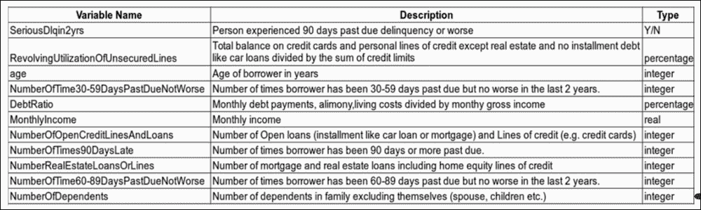

图 1.1:数据集的属性(变量)

我们将逐一查看每个属性，并理解它们在应用程序上下文中的含义:

1.  **seriousdlqin 2 yers**:

    *   在数据集中，该特定属性指示借款人在过去 2 年中是否经历过任何逾期还款，直到 90 天。
    *   如果借款人在过去的 2 年中经历了超过 90 天的逾期，则该属性的值为是。如果借款人在 EMI 到期日 90 天后仍未支付 EMI，则此标志值为“是”。
    *   如果借款人在过去 2 年内没有超过 90 天的逾期，则该属性的值为否。如果借款人在 EMI 到期日 90 天之前支付了 EMI，则此标志值为编号
    *   此属性具有目标标签。换句话说，我们将使用测试数据集的算法来预测这个值。

2.  **RevolvingUtilizationOfUnsecuredLines**:

    *   该属性表示借款人在排除当前任何贷款债务和房产后的信用卡额度。假设我有一张信用卡，它的信用额度是 1000 美元。在我的个人银行账户里，我有 1000 美元。我的信用卡余额是 1000 美元中的 500 美元。因此，我的信用卡和个人银行账户的最高余额是 1000 美元+1000 美元= 2000 美元；我已经使用了信用卡限额中的 500 美元，所以我的总余额是 500 美元(信用卡余额)+1，000 美元(个人银行账户余额)= 1，500 美元。
    *   如果账户持有人有房屋贷款或其他财产贷款并为这些贷款支付 EMI，那么我们不考虑财产贷款的 EMI 值。这里，对于这个数据属性，我们考虑了帐户持有人的信用卡余额和个人帐户余额。
    *   所以，RevolvingUtilizationOfUnsecuredLines 的值为= $ 1500/$ 2000 = 0.7500

3.  **年龄** :

    *   这个属性不言自明。它表明了借款人的年龄。

4.  **number of time 30-59 days spastduenotdebaster**:

    *   该属性的数字表示借款人延迟支付其 EMI，但在到期日之后 30 天或到期日之前 59 天支付的次数。

5.  **debratio**:

    *   这也是一个不言自明的属性，但是我们会用一个例子来试着更好的理解它。如果我每月的债务是 200 美元，我的其他支出是 500 美元，那么我每月的支出是 700 美元。如果我的月收入是 1000 美元，那么债务的价值就是 700 美元/1000 美元= 0.7000

6.  **月收入** :

    *   该属性包含借款人月收入的值。

7.  **NumberOfOpenCreditLinesAndLoans**:

    *   该属性表示未结贷款的数量和/或借款人持有的信用卡数量。

    
8.  **numberoftimes 90 day slate**:

    *   该属性表示借款人在其 EMIs 到期日后 90 天内已经支付了多少次欠款。

9.  **numberrealestatoleansorlines**:

    *   该属性表示借款人持有的房产贷款数量或借款人拥有的房屋贷款数量。

10.  **number of time 60-89 days spastduenotdebaster**:

    *   此属性表示借款人延迟支付其 EMIs 但在到期日 60 天后或到期日 89 天前支付的次数。

11.  **number of dependents**:

    *   这个属性也是不言自明的。它显示了借款人的受抚养家庭成员的数量。家属人数不包括借款人。

这些是数据集的基本属性描述，所以你对我们拥有的数据集有一个基本的概念。现在是动手的时候了。所以从下一节开始，我们将开始编码。我们将通过执行基本的数据分析来开始探索我们的数据集，以便我们可以找出数据集的统计属性。

## 数据分析

本节分为两大部分。您可以参考下图，了解我们将如何处理这一部分:

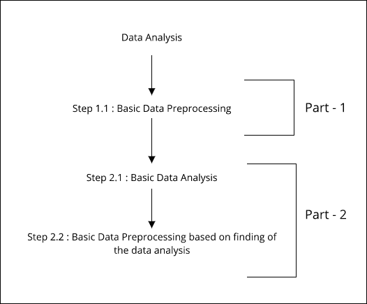

图 1.2:数据分析的部分和步骤

在第一部分，我们只有一步。在上图中，这被称为步骤 1.1。在第一步中，我们将进行基本的数据预处理。一旦我们完成了，我们将开始下一部分。

第二部分有两个步骤。在图*、*中，这被称为步骤 2.1。在这一步中，我们将使用统计和可视化技术执行基本的数据分析，这将有助于我们理解数据。通过这项活动，我们将了解数据集的一些统计事实。在此之后，我们将跳转到下一步，在*图 1.2* 中称为步骤 2.2。在这一步中，我们将再次执行数据预处理，但是，这一次，我们的预处理将主要基于我们在对给定的训练数据集进行基本数据分析后得出的发现。你可以在这个 GitHub 链接找到代码:[https://GitHub . com/jalajthanaki/credit-risk-modeling/blob/master/basic _ data _ analysis . ipynb](https://github.com/jalajthanaki/credit-risk-modelling/blob/master/basic_data_analysis.ipynb)。

所以让我们开始吧！

### 数据预处理

在这个部分，我们将执行最少量的基本预处理。我们将研究这些方法以及它们的实现。

#### 第一次变化

如果你打开`cs-training.csv`文件，那么你会发现有一列没有标题，所以我们会在那里添加一个标题。该属性的标题是`ID`。如果你想删除这一列，你可以，因为它只包含了记录的`sr.no`。

#### 秒变

这种改变不是强制性的。如果你想跳过它，你可以，但我个人喜欢进行这种预处理。更改与属性的标题有关，我们从标题中删除了“-”。除此之外，我将把所有的列标题转换成小写。例如，名为`NumberOfTime60-89DaysPastDueNotWorse`的属性将被转换为`numberoftime6089dayspastduenotworse`。当我们执行深入的数据分析时，这些种类的变化将有助于我们。在处理时，我们不需要注意这些连字符。

#### 实施变更

现在，您可能会问*我将如何执行所描述的更改？*嗯，有两种方法。一种是手动方式。在这种方法中，您将打开`cs-training.csv`文件并手动执行更改。这种方法当然不好。因此，我们将采取第二种方法。对于第二种方法，我们将使用 Python 代码来执行更改。您可以在下面的代码片段中找到所有的更改。

请参考下面的代码截图来执行第一个更改:

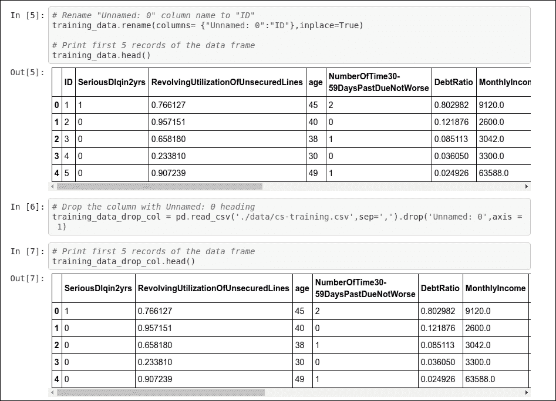

图 1.3:实现重命名或删除索引列的代码片段

对于第二个变化，可以参考*图 1.4:*

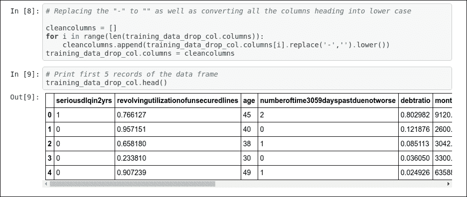

图 1.4:删除列标题中的“-”并将所有列标题转换成小写的代码片段

需要对`cs-test.csv`文件进行同样的预处理。这是因为给定的变化对于训练和测试数据集来说是共同的。

你可以点击这个链接在 GitHub 上找到完整的代码:[https://GitHub . com/jalajthanaki/credit-risk-modeling/blob/master/basic _ data _ analysis . ipynb](https://github.com/jalajthanaki/credit-risk-modelling/blob/master/basic_data_analysis.ipynb)。

你也可以跟着阅读一起动手。

我使用 Python 2.7 以及一堆不同的 Python 库来实现这段代码。你可以在 *README* 部分找到关于 Python 依赖和安装的信息。现在让我们转到基本数据分析部分。

### 基础数据分析后的数据预处理

让我们执行一些基本的数据分析，这将帮助我们找到训练数据集的统计属性。这种分析也被称为探索性数据分析(EDA)，它将帮助我们了解我们的数据集如何表示事实。在推导出一些事实后，我们可以用它们来推导特征工程。所以让我们来探究一些重要的事实！

从这一节开始，所有代码都是一个 iPython 笔记本的一部分。可以参考使用这个 GitHub 链接的代码:[https://GitHub . com/jalajthanaki/Credit-risk-modeling/blob/master/Credit % 20 risk % 20 analysis . ipynb](https://github.com/jalajthanaki/credit-risk-modelling/blob/master/Credit%20Risk%20Analysis.ipynb)。

以下是我们将要执行的步骤:

1.  列出统计属性
2.  寻找丢失的值
3.  替换丢失的值
4.  相互关系
5.  检测异常值

#### 列表统计属性

在此部分，我们将了解训练数据集的统计属性。利用熊猫的描述功能，我们可以找出以下基本的东西:

*   这将让我们了解训练数据集中的记录数量。
*   `mean`:该值为我们提供了每个数据属性平均值的指示。
*   `std`:该值表示每个数据属性的标准偏差。你可以参考这个例子:[http://www.mathsisfun.com/data/standard-deviation.html](http://www.mathsisfun.com/data/standard-deviation.html)。
*   `min`:这个值让我们知道每个数据属性的最小值是多少。
*   `25%`:该值表示第 25 个百分位数。它应该介于 0 和 1 之间。
*   `50%`:该值表示第 50 百分位。它应该介于 0 和 1 之间。
*   `75%`:该值表示第 75 百分位。它应该介于 0 和 1 之间。
*   `max`:这个值让我们知道每个数据属性的最大值是多少。

请看下图中的代码片段:

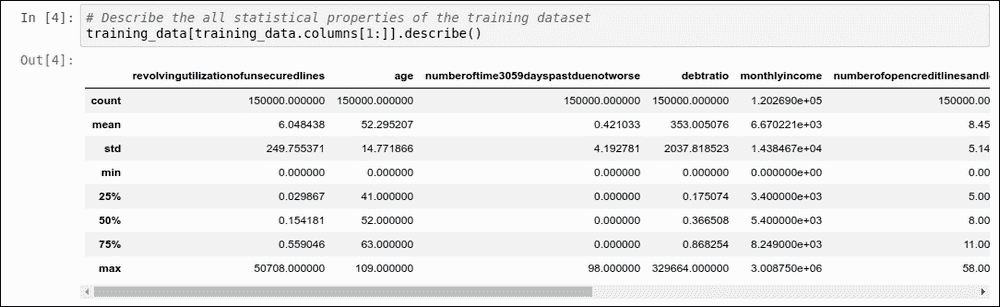

图 1.5:使用熊猫描述功能的基本统计属性

我们需要为我们的数据集找到一些其他的统计属性来帮助我们理解它。因此，在这里，我们将找到每个数据属性的中值和平均值。您可以在下图中看到寻找中间值的代码:

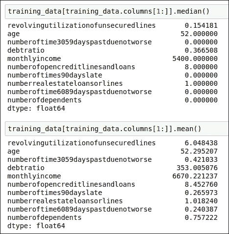

图 1.6:为每个数据属性生成中值和平均值的代码片段

现在让我们检查一下在我们的数据集中存在什么样的数据分布。我们绘制目标属性`seriousdlqin2yrs`的频率分布，以便理解训练数据集的目标变量的总体分布。这里，我们将使用`seaborn`可视化库。可以参考下面的代码片段:

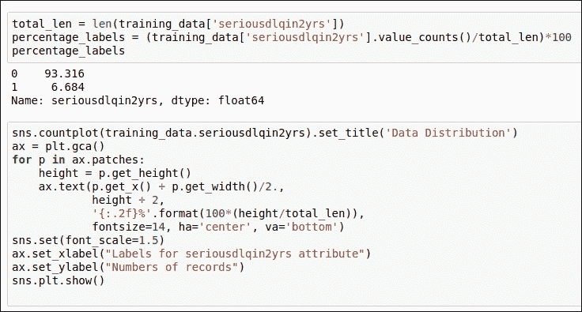

图 1.7:理解目标变量分布的代码片段，以及可视化分布的代码片段

您可以参考下图的可视化图表:

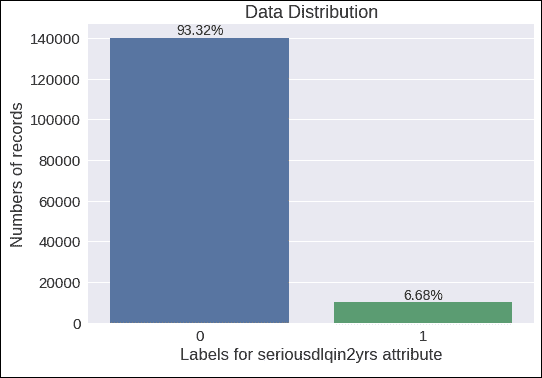

图 1.8:目标数据属性的变量分布的可视化

从这张图中可以看到，目标标签为 *0* 的记录很多，目标标签为 *1* 的记录较少。您可以看到，带有 *0* 标签的数据记录约占 93.32%，而带有 *1* 标签的数据记录占 6.68%。我们将在接下来的章节中使用所有这些事实。现在，我们可以认为我们的结果变量是不平衡的。

#### 查找缺失值

为了找到数据集中缺失的值，我们需要检查每一个数据属性。首先，我们将尝试识别哪个属性缺少值或值为空。一旦我们找到了数据属性的名称，我们将用一个更有意义的值替换丢失的值。有几个选项可用于替换丢失的值。我们将探索所有这些可能性。

让我们为第一步编写代码。在这里，我们将看到哪个数据属性有缺失值，并计算每个数据属性有多少个缺失值的记录。您可以在下图中看到代码片段:

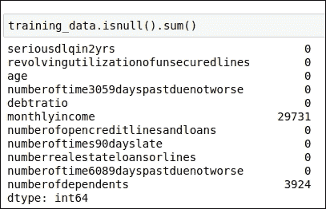

图 1.9:识别哪些数据属性有缺失值的代码片段

如上图所示，以下两个数据属性缺少值:

*   `monthlyincome`:该属性包含 29，731 条缺失值的记录。
*   `numberofdependents`:该属性包含 3924 条缺失值的记录。

您还可以参考下图中的代码片段，以获得迄今为止所描述的事实的图形表示:

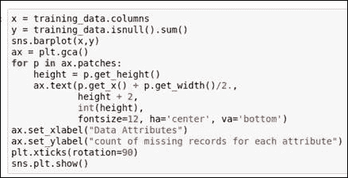

图 1.10:生成缺失值图表的代码片段

您可以在下面的图中查看图形本身:

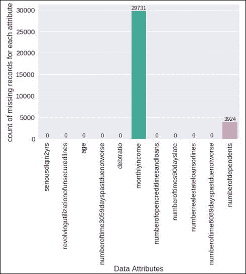

图 1.11:缺失值的图形表示

在这种情况下，我们需要用更有意义的值替换这些缺失的值。有各种各样的标准技术，我们可以用于此。我们有以下两种选择:

*   用该特定数据属性的平均值替换缺失值
*   用该特定数据属性的中值替换缺失值

在上一节中，我们已经导出了所有数据属性的平均值和中值，我们将使用它们。这里，我们的重点将放在名为`monthlyincome`和`numberofdependents`的属性上，因为它们缺少值。我们已经发现哪些数据属性有缺失值，所以现在是时候执行实际的替换操作了。在下一节中，您将看到我们如何用平均值或中值替换缺失值。

#### 替换缺失值

在前面的部分中，我们指出了训练数据集中哪些数据属性包含缺失值。我们需要用特定数据属性的平均值或中值替换缺失的值。因此，在本节中，我们将特别关注如何执行实际的替换操作。这种替换缺失值的操作也称为输入缺失数据。

在进入代码部分之前，我觉得你们可能会有这样的问题:*我应该用平均值或中值替换缺失值吗？* *还有其他选项吗？*我来一一回答这些问题。

第一个问题的答案实际上是一种试错法。因此，您首先用平均值替换缺失值，并在模型的训练过程中，衡量您是否在训练数据集上获得了良好的结果。然后，在第二次迭代中，我们需要尝试用中值替换这些值，并衡量您是否在训练数据集上获得了良好的结果。

为了回答第二个问题，有许多不同的插补技术可供使用，例如删除记录、用 KNN 法替换数值、用最频繁出现的数值替换数值等等。您可以选择这些技术中的任何一种，但是您需要训练模型并测量结果。如果没有实现一种技术，你就不能确定地说一种特定的插补技术对给定的训练数据集有效。在这里，我们讨论的是信用风险领域，所以我不会深入研究这个理论，但为了让你的概念更清晰，你可以参考以下文章:

*   [https://machine learning mastery . com/handle-missing-data-python/](https://machinelearningmastery.com/handle-missing-data-python/)
*   [http://sci kit-learn . org/stable/modules/generated/sk learn . preprocessing . inputr . html](http://scikit-learn.org/stable/modules/generated/sklearn.preprocessing.Imputer.html)
*   [https://www . analyticsvidhya . com/blog/2016/01/guide-data-exploration/](https://www.analyticsvidhya.com/blog/2016/01/guide-data-exploration/)

我们可以在下图中看到使用属性的平均值和中值替换缺失值的代码:

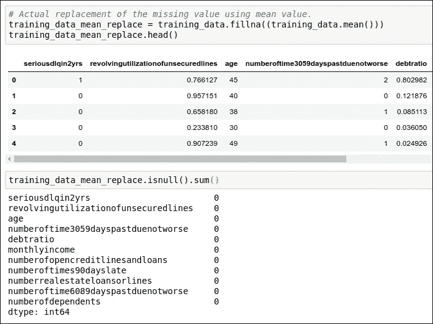

图 1.12:替换平均值的代码片段

在前面的代码片段中，我们用平均值替换了缺失值，在第二步中，我们验证了所有缺失值都已被该特定数据属性的平均值替换。

在下一个代码片段中，您可以看到我们用这些数据属性的中值替换缺失的值的代码。请参考下图:

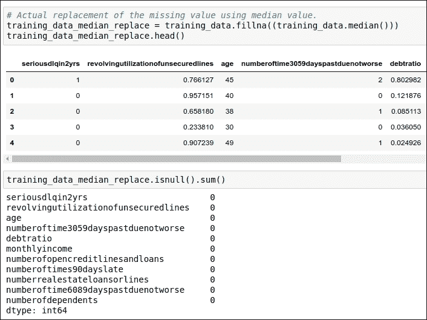

图 1.13:用中值替换缺失值的代码片段

在前面的代码片段中，我们已经用中值替换了缺失值，在第二步中，我们已经验证了所有缺失值都已经用特定数据属性的中值替换了。

在第一次迭代中，我想用中值替换缺失值。

在下一节中，我们将看到基本数据分析的一个重要方面:找到数据属性之间的相关性。所以，让我们从相关性开始。

#### 相关性

希望你基本知道机器学习中相关性表示什么。术语相关性是指数量之间的相互关系或关联。如果你想更新这方面的概念，你可以参考 https://www.investopedia.com/terms/c/correlation.asp 的。

因此，在这里，我们将找出不同数据属性之间存在何种关联。一些属性高度依赖于一个或多个其他属性。有时，特定属性的值相对于其依赖属性增加，而有时特定属性的值相对于其依赖属性减少。因此，相关性表示数据属性之间的积极和消极关联。您可以参考下面的代码片段来了解这种关联:

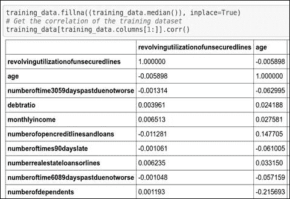

图 1.14:生成关联的代码片段

您可以在下面的图中看到关联的图形表示的代码片段:

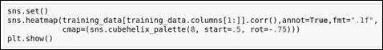

图 1.15:用于生成图形片段的代码片段

您可以在下图中看到相关关系图:

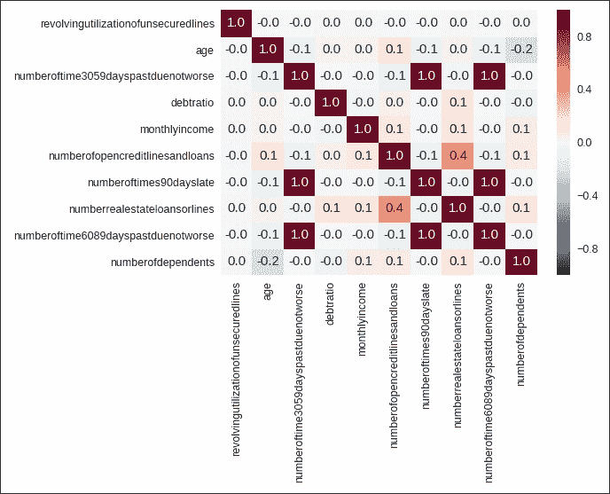

图 1.16:关联的热图

让我们看看前面的图表，因为它将帮助您以一种很好的方式理解相关性。从图表中可以得出以下事实:

*   值为 1.0 的单元格彼此高度关联。
*   每个属性与自身的相关度都非常高，所以所有的对角线值都是 1.0。
*   数据属性**number of times 3059 dayspastduenotdebaster**(指在竖线上或 *y* *轴*上给出的数据属性)与两个属性 **numberoftimes90dayslate** 和**number of times 6089 dayspastduenotdebaster**高度关联。这两个数据属性在 *x* *轴*上给出(或者在水平线上)。
*   数据属性 numberoftimes90dayslate 与 number of time 3059 dayspastduenotbaser 和 number of time 6089 dayspastduenotbaser 高度关联。这两个数据属性在 *x* 轴(或水平线)上给出。
*   数据属性 number of time 6089 dayspastduenotbrader 与 number of time 3059 dayspastduenotbrader 和 numberoftimes90dayslate 高度关联。这两个数据属性在 *x* 轴(或水平线)上给出。
*   数据属性**numberofpencreditlinesandloans**也与**numberrealestatoleansorlines**相关联，反之亦然。这里，数据属性 numberrealestateloansorlines 出现在 *x* 轴上(或水平线上)。

在继续之前，我们需要检查这些属性是否包含任何异常值或无关紧要的值。如果是这样，我们需要处理这些异常值，所以我们的下一部分是关于从我们的训练数据集中检测异常值。

#### 检测异常值

在本节中，您将学习如何检测异常值以及如何处理它们。该部分包括两个步骤:

*   离群点检测技术
*   处理异常值

首先，让我们从检测异常值开始。现在你们可能想知道*为什么我们要检测异常值*。为了回答这个问题，我举个例子。假设你有 5 岁儿童的体重。你测量了五个孩子的体重，你想知道他们的平均体重。这些孩子的体重分别是 15、12、13、10 和 35 公斤。如果你试着找出这些值的平均值，你会发现答案是 17 公斤。如果你仔细观察体重范围，那么你会发现最后一次观察与其他观察相比超出了正常范围。现在让我们删除最后一个观察值(值为 35 ),并重新计算其他观察值的平均值。新的平均体重是 12.5 公斤。与上一个平均值相比，这个新值更有意义。因此，异常值对准确性影响很大；因此，检测它们是很重要的。一旦完成，我们将在下一节处理异常值中探索处理它们的技术。

#### 离群点检测技术

这里，我们使用以下异常值检测技术:

*   基于百分位的异常检测
*   基于中值绝对偏差的异常检测
*   基于标准差的异常检测
*   基于多数投票的异常检测
*   离群值的可视化

#### 基于百分位的离群点检测

在这里，我们使用了基于百分位数的异常值检测，这是基于基本的统计理解。我们假设我们应该考虑位于 2.5 到 97.5 的百分位范围内的所有数据点。我们通过将阈值定为 95 得出了百分位数范围。可以参考下面的代码片段:

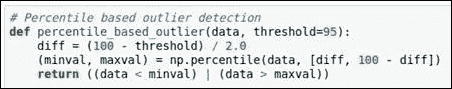

图 1.17:基于百分点的异常检测的代码片段

我们将对每个数据属性使用这种方法，并检测异常值。

#### 基于中位数绝对偏差(MAD)的离群点检测

MAD 是一个非常简单的统计概念。这包括四个步骤。这也称为修改的 Z 分数。步骤如下:

1.  找出特定数据属性的中间值。
2.  对于数据属性的每个给定值，减去之前找到的中值。这个减法是绝对值的形式。所以，对于每个数据点，你会得到绝对值。
3.  在第三步中，生成我们在第二步中导出的绝对值的中值。我们将对每个数据属性的每个数据点执行此操作。这个值称为 MAD 值。
4.  在第四步中，我们将使用下面的等式来导出修改后的 Z 分数: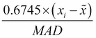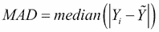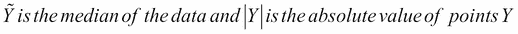

现在是参考以下代码片段的时候了:

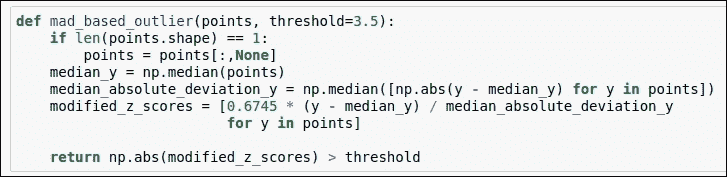

图 1.18:基于 MAD 的异常检测的代码片段

#### 基于标准差(STD)的异常值检测

在此部分，我们将使用标准差和平均值来找出异常值。这里，我们选择随机阈值 3。可以参考下面的代码片段:

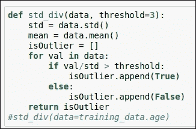

图 1.19:基于标准差(STD)的异常值检测代码

#### 基于多数投票的异常检测:

在此部分，我们将构建投票机制，以便我们可以同时运行所有之前定义的方法——如基于百分点的异常值检测、基于 MAD 的异常值检测和基于 STD 的异常值检测——并了解数据点是否应被视为异常值。到目前为止，我们已经看到了三种技术。因此，如果两种技术表明数据应该被视为异常值，那么我们认为该数据点是异常值；否则，我们没有。所以，我们需要的最低票数是两票。代码片段请参考下图:

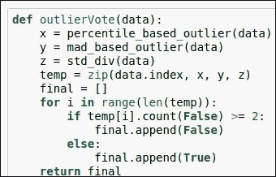

图 1.20:异常检测投票机制的代码片段

#### 离群值的可视化

在此部分，我们将绘制数据属性，以便直观地了解异常值。同样，我们使用`seaborn`和`matplotlib`库来可视化离群值。您可以在下图中找到代码片段:

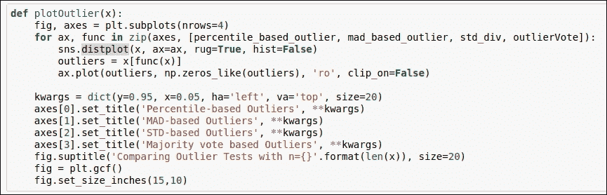

图 1.21:离群值可视化的代码片段

参考上图，了解我们定义的方法如何检测异常值。这里，我们选择了 5000 的样本量。这个样本是随机选取的。

图 1.22:异常值检测图

在这里，您可以看到所有已定义的技术将如何帮助我们从特定的数据属性中检测异常数据点。你可以在[https://GitHub . com/jalajthanaki/Credit-risk-modeling/blob/master/Credit % 20 risk % 20 analysis . ipynb](https://github.com/jalajthanaki/credit-risk-modelling/blob/master/Credit%20Risk%20Analysis.ipynb)看到这个 GitHub 链接上的所有属性可视化图形。

到目前为止，您已经学习了如何检测异常值，但是现在是时候处理这些异常点了。在下一节中，我们将看看如何处理异常值。

#### 处理异常值

在本部分，您将学习如何移除或替换异常数据点。这一特定步骤非常重要，因为如果您只是识别异常值，却不能正确处理它，那么在训练时，我们很可能会过度拟合模型。因此，让我们学习如何处理这个数据集的异常值。在这里，我将通过逐个查看数据属性来解释操作。

#### 无担保额度的循环使用

在这个数据属性中，当您绘制异常值检测图时，您会发现大于 0.99999 的值被视为异常值。因此，大于 0.99999 的值可以替换为 0.99999。所以对于这个数据属性，我们执行替换操作。我们已经为数据属性`revolvingutilizationofunsecuredlines`生成了新的值。

对于代码，可以参考下图:

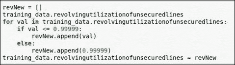

图 1.23:用 0.99999 替换异常值的代码片段

#### 年龄

在这个属性中，如果您浏览数据并看到基于百分位的异常值，那么您会看到有一个值为 0 的异常值，并且数据属性中的最小年龄是 21。所以，我们用 22 代替 0 的值。我们对条件进行编码，使得年龄应该大于 22。如果不是，那我们就把年龄换成 22。可以参考下面的代码和图形。

下图显示了数据集中年龄的频率分布。通过查看数据，我们可以得出 0 是异常值的事实:

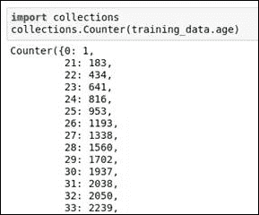

图 1.24:每个数据值的频率显示 0 是异常值

参考下图，该图显示了年龄的分布情况:

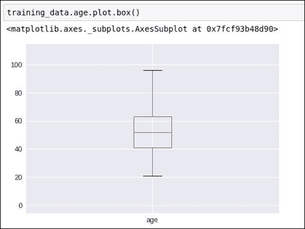

图 1.25:年龄数据属性的方框图

在去除异常值之前，我们得到了以下异常值检测图:

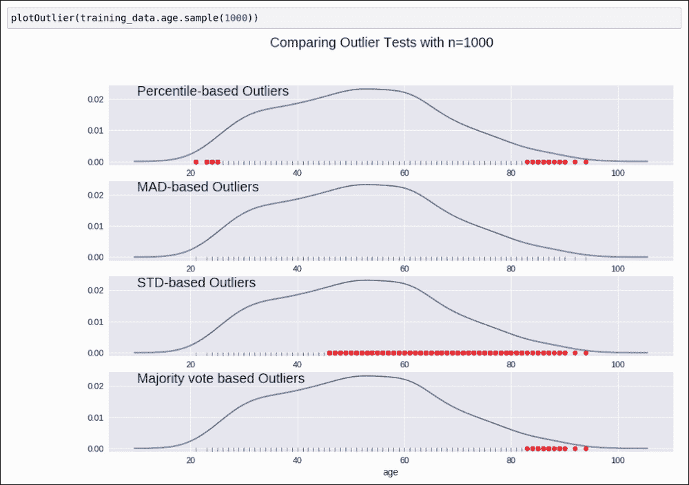

图 1.26:检测数据属性年龄异常值的图形表示

替换异常值的代码如下:

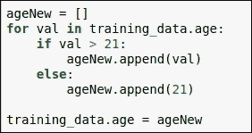

图 1.27:用最小年龄值 21 替换异常值

在代码中，您可以看到我们已经检查了年龄列的每个数据点，如果年龄大于 21，那么我们没有应用任何更改，但是如果年龄小于 21，那么我们已经用 21 替换了旧值。之后，我们将所有这些修改后的值放入原始数据帧中。

#### 过期 30-59 天的次数不会更糟

在这个数据属性中，我们研究数据并参考异常值检测图。完成后，我们知道值 96 和 98 是我们的异常值。我们用媒体值替换这些值。你可以参考下面的代码和图形来更好地理解这一点。

请参考下图中给出的异常值检测图:

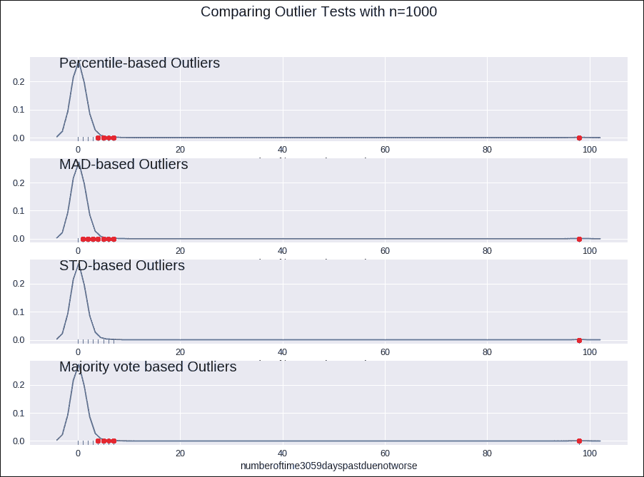

图 1.28:异常值检测图

请参考下图中数据的频率分析:

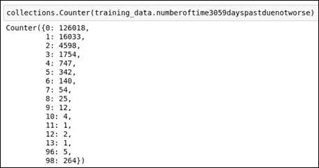

图 1.29:来自频率计算的异常值

下图给出了用中值替换异常值的代码片段:

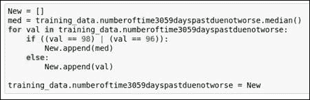

图 1.30:替换异常值的代码片段

#### 债务比率

如果我们看一下这个属性的异常值检测图，那就有点混乱了。请参考下图:

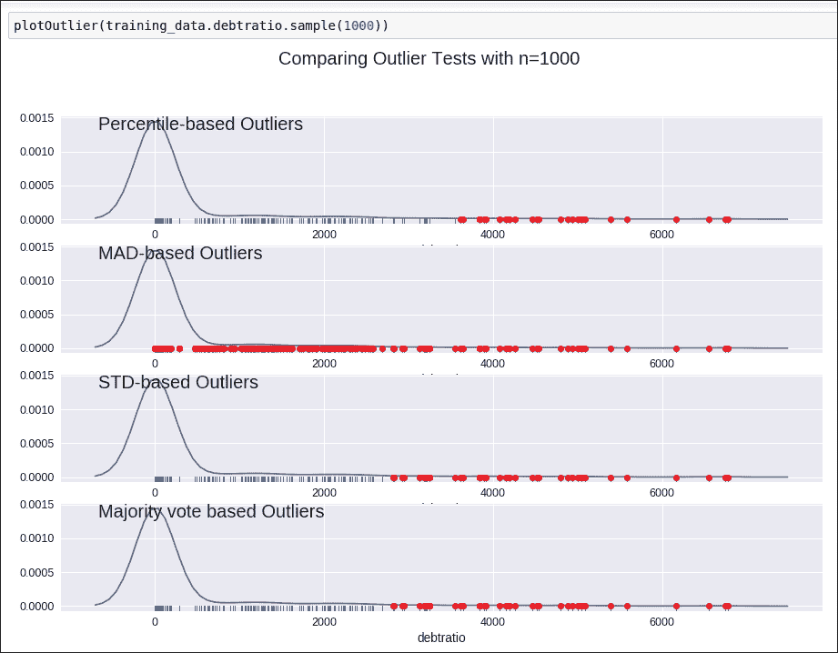

图 1.31:债务比率列的异常值检测图

为什么？这是令人困惑的,因为我们不确定我们应该考虑哪种离群点检测方法。因此，在这里，我们做一些比较分析，只是通过计算每种方法得出的异常值的数量。请参考下图:

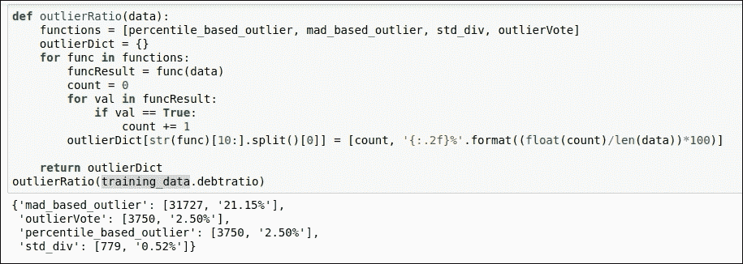

图 1.32:各种异常检测技术的比较

基于 MAD 的方法检测到了最大数量的离群值，因此我们将考虑该方法。这里，我们将找到最小上限值，以便替换异常值。最小上限是从异常值导出的最小值。请参考以下代码片段:

图 1.33:最小上限的代码

#### 月收入

对于这个数据属性，我们将选择基于投票的离群点检测方法，如下图所示:

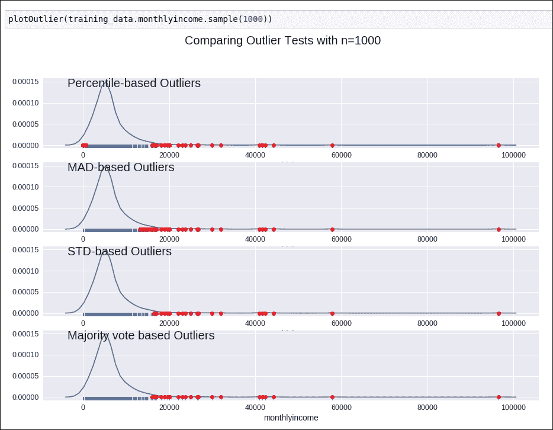

图 1.34:异常值检测图

为了让替换离群值，我们将使用与`debt ratio`数据属性相同的逻辑。我们通过生成最小上限值来替换异常值。可以参考下图给出的代码:

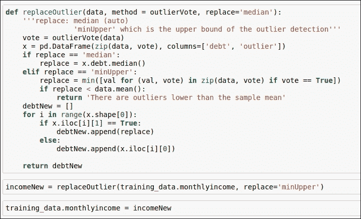

图 1.35:用最小上限值替换异常值

#### 已开授信额度和贷款数量

如果您参考下图中给出的图表，您将会看到该列中不存在高度偏离的异常值:

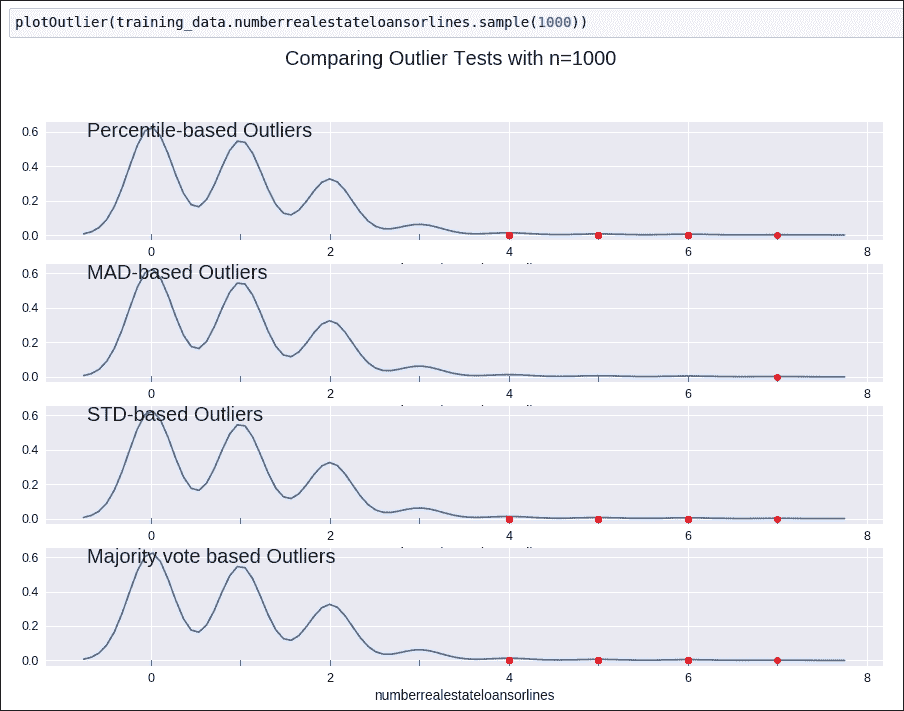

图 1.36:异常值检测图

因此，我们将不对该数据属性执行任何类型的替换操作。

#### 迟到 90 天的次数

对于这个属性，当您分析数据值频率时，您会立即看到值 96 和 98 是异常值。我们将用数据属性的中值替换这些值。

请参考下图中的频率分析代码片段:

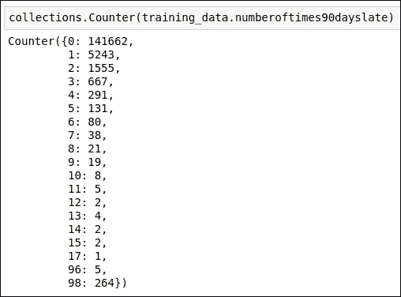

图 1.37:数据点的频率分析

异常值替换代码片段如下图所示:

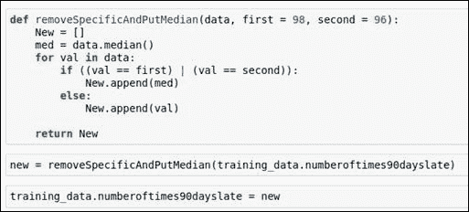

图 1.38:使用中值的异常值替换

#### 房地产贷款数量或额度

当我们看到数据属性中值出现的频率时，我们会知道超过 17 的频率值太少了。所以，在这里我们用 17 代替所有小于 17 的值。

可以参考下图中的代码片段:

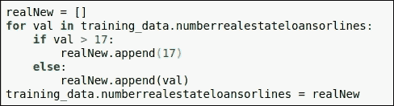

图 1.39:替换异常值的代码片段

#### 过期 60-89 天的次数不会更糟

对于这个属性，当您分析数据值频率时，您会立即看到值 96 和 98 是异常值。我们将用数据属性的中值替换这些值。

参见下图中的频率分析代码片段:

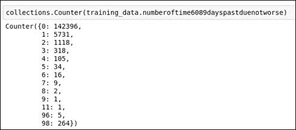

图 1.40:数据的频率分析

异常值替换代码片段如下图所示:

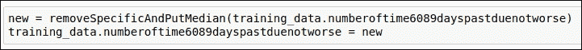

图 1.41:使用中值替换异常值的代码片段

可以参考*图 1.38 中的`removeSpecificAndPutMedian`方法代码。*

### 家属人数

对于这个属性，当您看到数据点的频率值时，您会立即看到大于 10 的数据值是异常值。我们用 10 代替大于 10 的值。

参考下图中的代码片段:

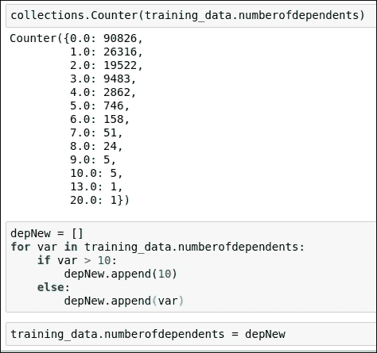

图 1.42:替换异常值的代码片段

这是离群值部分的结尾。在本节中，我们以更有意义的方式替换了数据点的值。我们也到达了基本数据分析部分的末尾。这种分析让我们对数据集及其值有了很好的理解。下一部分是关于特征工程的。因此，我们将首先从基础开始，在本章的稍后部分，您将了解特征工程将如何以积极的方式影响算法的准确性。

# 基线模型的特征工程

在本节中，您将学习如何选择重要的特性来开发预测模型。所以现在，首先，我们在这个阶段不会太专注于派生新特性，因为首先，我们需要知道哪些输入变量/列/数据属性/特性至少能给我们基线精度。因此，在第一次迭代中，我们的重点是从可用的训练数据集中选择特征。

## 找出特征重要性

我们需要知道哪些是重要的特征。为了找出答案，我们将使用随机森林分类器来训练模型。之后，我们将对我们的重要特性有一个粗略的了解。所以让我们直接进入代码。可以参考下图中的代码片段:

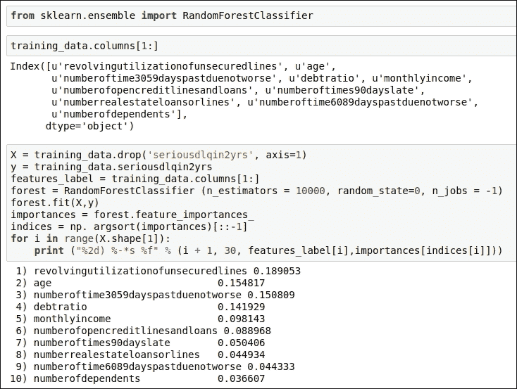

图 1.43:导出特性的重要性

在这段代码中，我们使用了 scikit-learn 中的随机森林分类器。我们使用`fit()`函数来执行训练，然后，为了生成特性的重要性，我们将使用`feature_importances`函数，该函数在 scikit-learn 库中可用。然后，我们将打印重要性值从最高到最低的特性。

让我们画一张图来更好地理解最重要的特性。您可以在下图中找到代码片段:

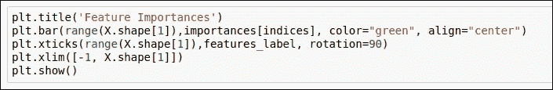

图 1.44:生成特性重要性图表的代码片段

在这段代码片段中，我们使用 matplotlib 库来绘制图形。这里，我们使用一个条形图并输入所有数据属性的值以及它们的重要性值，这些值是我们之前导出的。可以参考下图中的图表:

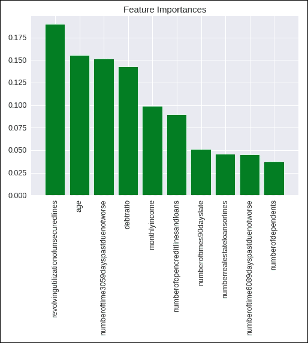

图 1.45:特征重要性图

对于的第一次迭代，我们在特性工程方面做了很多工作。在接下来的章节中，我们肯定会再次讨论特性工程。现在是时候实施机器学习算法来生成基线预测模型，这将让我们了解一个人在未来 2 年内是否会拖欠贷款。让我们跳到下一部分。

# 选择机器学习算法

这一节是最重要的一节。这里，我们将尝试几种不同的 ML 算法，以便了解哪种 ML 算法性能更好。此外，我们将进行一次训练准确性比较。

到这个时候，你一定会知道这个特殊的问题被认为是一个分类问题。我们将要选择的算法如下(这种选择是基于直觉):

*   k-最近邻(KNN)
*   逻辑回归
*   adaboost 算法
*   梯度推进
*   随机森林

我们的第一步是以某种格式生成训练数据。我们将把训练数据集分成训练和测试数据集。所以，基本上，我们正在为我们的培训准备输入。这对于所有的 ML 算法都是常见的。请参考下图中的代码片段:

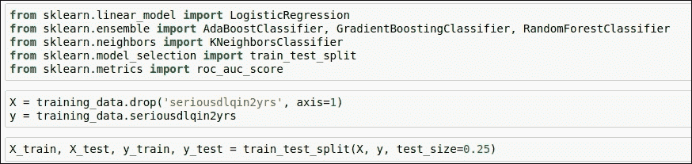

图 1.46:为训练生成键值格式的训练数据集的代码片段

正如您在代码中看到的，变量 x 包含除标题为`seriousdlqin2yrs`的目标列之外的所有列，因此我们删除了该列。删除该属性的原因是该属性包含每行的答案/目标/标签。ML 算法需要键-值对的输入，所以目标列是键，所有其他的列是值。我们可以说，某个值的模式将导致特定的目标值，我们需要使用 ML 算法来预测该目标值。

这里，我们也拆分了训练数据。我们将使用 75%的训练数据用于实际训练目的，一旦训练完成，我们将使用剩余的 25%的训练数据来检查我们训练的 ML 模型的训练准确性。因此，不浪费任何时间，我们将跳转到 ML 算法的编码，当我们向前推进时，我将向你们解释代码。请注意，在这里，我不会进入每个 ML 算法的数学解释，但我会解释代码。

## K 近邻(KNN)

在这个算法中，通常，我们的输出预测遵循与其邻居相同的趋势。k 是我们要考虑的邻居数量。如果 K=3，那么在预测输出期间，检查三个最近邻点，如果一个邻居属于 *X* 类别，两个邻居属于 *Y* 类别，那么预测标签将是 *Y，*因为大多数最近邻点属于 *Y* 类别。

让我们看看我们编码了什么。请参考下图:

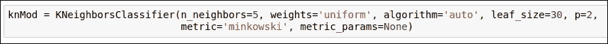

图 1.47:定义 KNN 分类器的代码片段

让我们一个一个地了解参数:

*   根据代码，K=5 意味着我们的预测基于五个最近的邻居。这里，`n_neighbors=5`。
*   权重被统一选择，这意味着每个邻域中所有点的权重相等。这里，权重= '统一'。
*   algorithm='auto ':该参数将尝试根据我们传递的值来决定最合适的算法。
*   leaf_size = 30:该参数影响模型和查询的构建速度。这里，我们使用默认值 30。
*   p=2:这表示闵可夫斯基度规的功率参数。这里，p=2 使用`euclidean_distance`。
*   metric='minkowski ':这是默认的距离度量，有助于我们构建树。
*   metric_params=None:这是我们使用的默认值。

## 逻辑回归

逻辑回归是最广泛使用的 ML 算法之一，也是最古老的算法之一。该算法使用 sigmod 和其他非线性函数为目标变量生成概率,以便预测目标标签。

让我们参考我们用于逻辑回归的代码和参数。可以参考下图给出的代码片段:

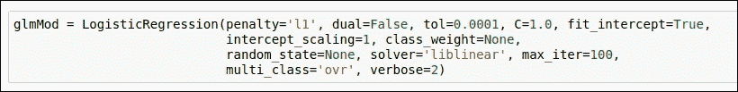

图 1.48:逻辑回归 ML 算法的代码片段

让我们一个一个地了解参数:

*   penalty='l1 ':该参数指示梯度下降算法的选择。这里，我们选择了牛顿共轭梯度法。
*   dual=False:如果我们有样本数量>特征数量，那么我们应该将该参数设置为 False。
*   tol=0.0001:这是算法的停止标准之一。
*   c=1.0:该值表示正则化强度的倒数。此参数必须是正浮点值。
*   fit_intercept = True:这是该算法的默认值。此参数用于指示算法的偏差。
*   solver='liblinear ':这个算法对于小数据集表现很好，所以我们选择了它。
*   intercept_scaling=1:如果我们选择 liblinear 算法并且 fit_intercept = True，那么这个参数帮助我们生成特征权重。
*   class_weight=None:没有与类标签相关联的权重。
*   random_state=None:这里，我们使用这个参数的默认值。
*   max_iter=100:这里，我们迭代 100 次，以便在给定的数据集上收敛我们的 ML 算法。
*   multi_class='ovr ':这个参数表示给定的问题是二元分类问题。
*   verbose=2:如果我们在 solver 参数中使用 liblinear，那么我们需要为 verbosity 输入一个正数。

## AdaBoost

AdaBoost 算法代表自适应增强。Boosting 是一种集成方法，其中我们将通过使用多个弱分类器来构建强分类器。AdaBoost 是一种 boosting 算法，对二分类问题有很好的效果。如果你想了解更多关于它的，那么参考这篇文章[https://machine learning mastery . com/boosting-and-AdaBoost-for-machine-learning/](https://machinelearningmastery.com/boosting-and-adaboost-for-machine-learning/)。

这个特定的算法有 N 次迭代。在第一次迭代中，我们从训练数据集中随机选取数据点并构建模型开始。每次迭代后，该算法都会检查分类器表现不佳的数据点。一旦这些数据点被基于误差率的算法识别，权重分布就被更新。因此，在下一次迭代中，该算法将有更多的机会选择先前分类较差的数据点，并学习如何对它们进行分类。对于您提供的给定迭代次数，该过程会一直运行。

让我们参考下图中给出的代码片段:

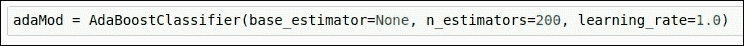

图 1.49:AdaBosst 分类器的代码片段

参数相关描述如下:

*   **base_estimator = None** :构建增强系综的基础估计器。
*   **n_estimators=200** :终止增强的估计器的最大数量。在 200 次迭代之后，算法将被终止。
*   learning_rate=1.0 :这个速率决定了我们的模型收敛的速度。

## 梯度推进

这个算法也是 ML 算法集合的一部分。在该算法中，我们使用基本回归算法来训练模型。训练后，我们将计算错误率，并找出算法表现不佳的数据点，在下一次迭代中，我们将采用引入错误的数据点，并重新训练模型以获得更好的预测。该算法使用已经生成的模型以及新生成的模型来预测数据点的值。

您可以在下图中看到代码片段:

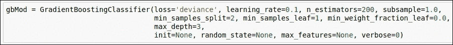

图 1.50:梯度增强分类器的代码片段

让我们来看一下分类器的参数:

*   **loss =‘deviance’**:这意味着我们使用逻辑回归进行概率输出分类。
*   **learning_rate = 0.1** :这个参数告诉我们模型需要多快收敛。
*   **n_estimators = 200** :该参数表示需要执行的升压级数。
*   **子样本= 1.0** :该参数有助于调整偏差和方差的值。选择子样本< 1.0 会导致方差减少，偏差增加。
*   **min_sample_split=2** :分割一个内部节点所需的最小样本数。
*   **min _ weight _ fraction _ leaf = 0.0**:样本重量相等，所以我们提供了值 0。
*   **max_depth=3** :表示单个回归估值器的最大深度。最大深度限制了树中节点的数量。
*   **init=None** :对于该参数，loss.init_estimator 用于初始预测。
*   **random_state=None** :该参数表示使用`numpy.random`函数生成随机状态。
*   **max_features=None** :该参数表示我们有 N 个特性。所以，`max_features=n_features`。
*   **verbose=0** :没有打印进度。

## 随机森林

这个特定的 ML 算法生成决策树的数量，并使用投票机制来预测目标标签。在这个算法中，生成了许多决策树，创建了一个树的森林，所以它被称为 RandomForest。

在下面的代码片段中，请注意我们是如何声明 RandomForest 分类器的:

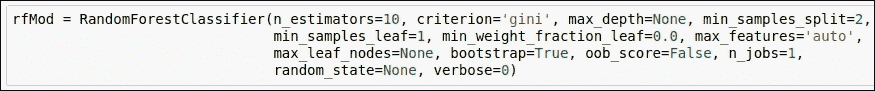

图 1.51:随机森林分类器的代码片段

让我们了解一下这里的参数:

*   `n_estimators=10`:表示森林中的树木数量。
*   `criterion='gini'`:获取的信息将由基尼系数计算。
*   `max_depth=None`:该参数表示节点被扩展，直到所有叶子都是纯的，或者直到所有叶子包含少于 min_samples_split 样本。
*   `min_samples_split=2`:该参数表示至少需要两个样本来执行分割以生成树。
*   `min_samples_leaf=1`:表示叶节点的样本大小。
*   `min_weight_fraction_leaf=0.0`:该参数表示在叶节点所需的(所有输入样本的)权重总和的最小加权分数。在这里，重量是平均分布的，所以样品重量为零。
*   `max_features='auto'`:该参数在使用自动策略时被考虑。我们选择 auto 值，然后选择 max_features=sqrt(n_features)。
*   `max_leaf_nodes=None`:该参数表示可以有无限数量的叶节点。
*   `bootstrap=True`:该参数表示构建树时使用引导样本。
*   `oob_score=False`:该参数表示是否使用随机样本来估计泛化精度。我们在这里不考虑随机抽样。
*   `n_jobs=1`:如果`n_job = 1`，适合和预测作业可以并行运行。
*   `random_state=None`:该参数表示使用`numpy.random`功能产生随机状态。
*   `verbose=0`:控制树构建过程的详细程度。0 表示我们不打印进度。

到目前为止，我们已经看到了如何声明我们的 ML 算法。我们还定义了一些参数值。现在，是时候在训练数据集上训练这个 ML 算法了。让我们来讨论一下。

# 训练基线模型

在此部分，我们将使用以下 ML 算法进行实际训练。这个步骤很耗时，因为它需要更多的计算能力。我们使用 75%的训练数据集进行实际训练，25%的数据集进行测试，以便测量训练的准确性。

您可以在下图中找到代码片段:

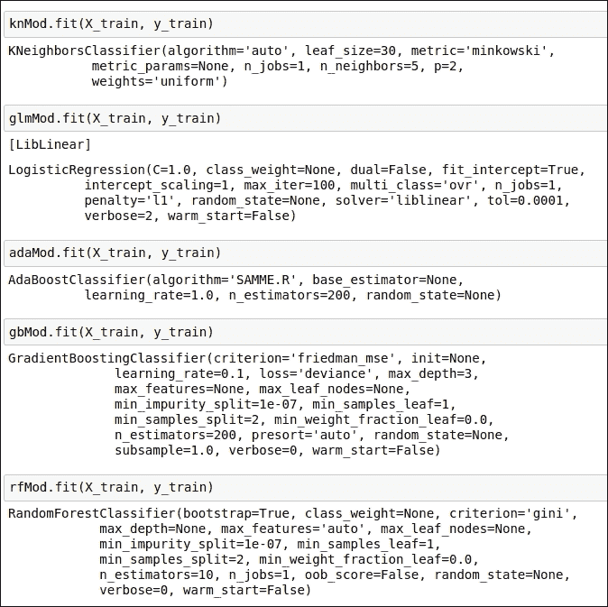

图 1.52:执行培训的代码片段

在前面的代码片段中，您可以看到我们使用 scikit-learn 库中的`fit()`函数执行了实际的训练操作。此函数使用给定的参数，并通过接受目标数据属性和其他要素列的输入来训练模型。

一旦你完成了这一步，你会看到我们不同的 ML 算法生成不同的训练模型。现在是时候检查我们训练好的模型在预测方面有多好了。我们可以在 25%的数据集上使用某些技术。在下一节中，我们将了解这些技术。

# 了解测试矩阵

在此部分，我们将查看一些广泛使用的测试矩阵，以便了解我们的训练模型的好坏。这个测试分数给了我们一个公平的想法，当预测 25%的数据时，哪个模型达到了最高的准确性。

这里，我们使用测试矩阵的两个基本级别:

*   训练模型的平均精度
*   ROC-AUC 评分

## 训练模型的平均精度

在此部分，我们将了解当我们使用 scikit-learn 函数`score()`生成训练准确度时，scikit-learn 如何计算准确度分数。函数 score()返回平均准确度。更准确地说，它使用剩余标准误差。剩余标准误差只不过是均方差的正平方根。这里，计算精度的公式如下:

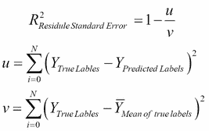

最好的可能分数是 1.0，并且模型也可以有负的分数(因为模型可以任意地更差)。如果常数模型总是预测 y 的期望值，而忽略输入特征，则它将得到 0.0 的残差标准误差分数。

## ROC-AUC 评分

ROC-AUC 分数用于找出分类器的准确性。ROC 和 AUC 是两个不同的术语。让我们逐一理解每一个术语。

### 中华民国

ROC 代表*接收机工作特性*。这是一种曲线。我们绘制 ROC 曲线来可视化二元分类器的性能。既然提到了 ROC 是曲线，你可能想知道它是哪种类型的曲线吧？ROC 曲线是一条二维曲线。它的 *x* *轴*代表*假阳性率* (FPR)，它的 y *轴*代表*真阳性率* (TPR)。TPR 也称为敏感性，FPR 也称为特异性(SPC)。FPR 和 TPR 可以参考下面的等式。

*TPR =真阳性/阳性样本数= TP / P*

*FPR =假阳性/阴性样本数= FP / N = 1 - SPC*

对于任何一个二元分类器，如果预测概率≥ 0.5，那么它会得到类别标签 X，如果预测概率为< 0.5, then it will get the class label Y. This happens by default in most binary classifiers. This cut-off value of the predicted probability is called the threshold value for predictions. For all possible threshold values, FPR and TPR have been calculated. This FPR and TPR is an x,y value pair for us. So, for all possible threshold values, we get the x,y value pairs, and when we put the points on an ROC graph, it will generate the ROC curve. If your classifier perfectly separates the two classes, then the ROC curve will hug the upper-right corner of the graph. If the classifier performance is based on some randomness, then the ROC curve will align more to the diagonal of the ROC curve. Refer to the following figure:

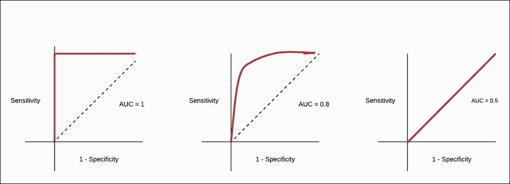

Figure 1.53: ROC curve for different classification scores

In the preceding figure, the leftmost ROC curve is for the perfect classifier. The graph in the center 则显示现实问题中准确率更好的分类器。最右边的图显示了其猜测非常随机的分类器。当我们画 ROC 曲线的时候，怎么量化呢？为了回答这个问题，我们将引入 AUC。

### AUC

AUC 代表曲线下的面积。为了量化 ROC 曲线，我们使用 AUC。这里，我们将看到 ROC 曲线覆盖了多少区域。如果我们获得一个完美的分类器，那么 AUC 分数是 1.0，如果我们有一个随机猜测的分类器，那么 AUC 分数是 0.5。在现实世界中，我们不期望 AUC 分数为 1.0，但是如果分类器的 AUC 分数在 0.6 到 0.9 的范围内，那么它将被认为是一个好的分类器。可以参考下图:

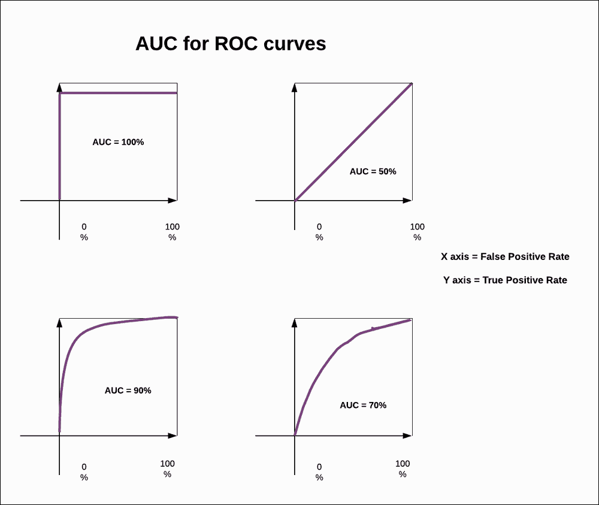

图 1.54:ROC 曲线的 AUC

在上图中，您可以看到曲线下覆盖了多少区域，并且成为我们的 AUC 分数。这给了我们一个分类器表现好坏的指标。

这是我们要用的两个矩阵。在下一节中，我们将实现代码的实际测试，并查看我们训练的 ML 模型的测试矩阵。

# 测试基线模型

在这个部分，我们将实现代码，这将让我们了解我们训练过的 ML 模型在验证集中的表现是好是坏。我们使用平均准确性评分和 AUC-ROC 评分。

这里，我们生成了五个不同的分类器，在验证数据集上对每个分类器执行测试后，我们将找出哪个 ML 模型工作得好，并给我们一个合理的基线分数，验证数据集是来自训练数据集的 25%的保留数据集。所以让我们看看代码:。

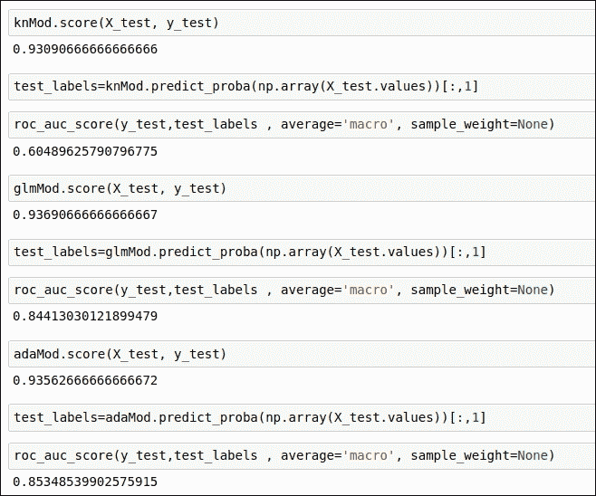

图 1.55:获取训练好的 ML 模型的测试分数的代码片段

在前面的代码片段中，您可以看到三个分类器的得分。

请参考下图中的代码片段:

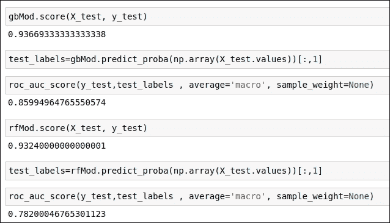

图 1.56:获取已训练的 ML 模型的测试分数的代码片段

在代码片段中，您可以看到两个分类器的得分。

使用 scikit-learn 的`score()`函数，您将获得平均准确度分数，而`roc_auc_score()`函数将为您提供 ROC-AUC 分数，这对我们来说更重要，因为平均准确度分数只考虑一个阈值，而 ROC-AUC 分数考虑了所有可能的阈值并给出分数。

正如您在上面给出的代码片段中看到的，AdaBoost 和 GradientBoosting 分类器在验证数据集上获得了很好的 ROC-AUC 分数。其他分类器，如逻辑回归、KNN 和随机森林，在验证集上表现不佳。从这个阶段开始，我们将使用 AdaBoost 和 GradientBoosting 分类器来提高它们的准确度。

在下一节中，我们将看到为了提高分类精度我们需要做些什么。我们需要列出可以做些什么来获得良好的准确性，以及分类器当前存在的问题。所以让我们分析一下现有分类器的问题，看看它们的解决方案。

# 现有方法的问题

我们使用 AdaBoost 和 GradientBoosting 分类器得到了基线分数。现在，我们需要提高这些分类器的准确性。为了做到这一点，我们首先列出所有可以即兴创作，但我们还没有广泛工作的领域。我们还需要列出基线方法可能存在的问题。一旦我们有了问题清单或我们需要努力的领域，我们就很容易实施修订后的方法。

在这里，我列出了一些我们在基线迭代中没有处理的区域或问题:

*   问题:我们没有广泛使用交叉验证技术来检查过度拟合问题。

    *   解决方案:如果我们恰当地使用交叉验证技术，那么我们将知道我们训练的 ML 模型是否遭受过拟合。这将有助于我们，因为我们不想建立一个甚至不能正确概括的模型。

*   问题:我们也没有关注超参数调优。在我们的基线方法中，我们主要使用默认参数。我们在分类器声明期间定义这些参数。您可以参考*图 1.52* 中给出的代码片段，在这里您可以看到分类器采用了一些在训练模型时使用的参数。我们没有改变这些参数。

    *   解决方案:我们需要调整这些超参数，以提高分类器的准确性。我们需要使用各种超参数调整技术。

在下一节中，我们将看看这些优化技术实际上是如何工作的，以及讨论我们将要采取的方法。所以让我们开始吧！

# 优化现有方法

在本部分，我们将了解关于交叉验证和超参数调整的基本技术。一旦我们理解了基础，我们就很容易实现它们。让我们从交叉验证和超参数调整的基本理解开始。

## 理解关键概念以优化方法

在这次修正迭代中，我们需要提高分类器的精度。在这里，我们将首先讨论基本概念，然后继续讨论实现部分。因此，我们将理解两个有用的概念:

*   交叉验证
*   超参数调谐

### 交叉验证

交叉验证也被称为旋转估计。它主要用于跟踪一个叫做过度拟合的问题。让我先从过度拟合问题开始，因为使用交叉验证的主要目的是避免过度拟合的情况。

基本上，当您使用训练数据集训练模型并检查其准确性时，您会发现您的训练准确性相当好，但当您将此训练模型应用于尚未看到的数据集时，您会发现训练模型在未看到的数据集上表现不佳，只是模仿了训练数据集在其目标标签方面的输出。因此，我们可以说，我们训练的模型不能正确地概括。这个问题叫做过拟合，为了解决这个问题，我们需要使用交叉验证。

在我们的基线方法中，我们没有广泛使用交叉验证技术。好的方面是，到目前为止，我们生成了 25%的训练数据集的验证集，并测量了分类器的准确性。这是一项基本技术，用于了解分类器是否过拟合。

还有许多其他交叉验证技术可以帮助我们做两件事:

*   使用 CV 跟踪过度拟合的情况:这将给我们一个关于过度拟合问题的完美想法。我们将使用 K-fold CV。
*   使用 CV:交叉验证的模型选择将帮助我们选择分类模型。这也会用到 K 折 CV。

现在让我们来看看将用于这两项任务的单一方法。你会发现实现很容易理解。

#### 使用简历的方法

scikit-learn 库提供了很好的交叉验证实现。如果要实现交叉验证，只需要导入交叉验证模块即可。为了提高准确性，我们将使用 K 倍交叉验证。这种 K 倍交叉验证基本上做了什么解释如下。

当我们使用训练-测试分割时，我们将使用 75%的数据来训练模型，并使用 25%的数据来验证模型。这种方法的主要问题是，实际上，我们没有使用整个训练数据集进行训练。因此，我们的模型可能无法遇到训练数据集中出现的所有情况。K-fold CV 已经解决了这个问题。

在 K-fold CV 中，我们需要为 K 提供正整数。在这里，您将训练数据集划分为 K 个子数据集。我给你举个例子。如果训练数据集中有 125 条数据记录，并且将值设置为 k = 5，则数据的每个子集都有 25 条数据记录。现在，我们有五个训练数据集子集，每个子集有 25 条记录。

让我们了解一下数据集的这五个子集将如何使用。基于所提供的 K 值，将决定我们需要迭代这些数据子集多少次。这里我们取 K=5。因此，我们对数据集 K-1 = 5-1 =4 次迭代。注意，K 倍 CV 中的迭代次数是通过等式 K-1 计算的。现在让我们看看每次迭代会发生什么:

*   **第一次迭代**:我们取一个子集用于测试，其余四个子集用于训练。
*   **第二次迭代**:我们取两个子集用于测试，其余三个子集用于训练。
*   **第三次迭代**:我们取三个子集用于测试，剩下的两个子集用于训练。
*   **第四次迭代**:我们取四个子集用于测试，剩下的子集用于训练。在这第四次迭代之后，我们没有任何子集留给训练或测试，所以我们在迭代 K-1 之后停止。

这种方法具有以下优点:

K-fold CV 使用所有数据点进行训练，因此我们的模型利用了使用所有数据点进行训练的优势。

*   在每次迭代之后，我们得到准确度分数。这将有助于我们决定模型的表现。
*   我们一般在所有迭代完成后再考虑交叉验证的均值和标准偏差值。对于每一次迭代，我们跟踪精确度分数，一旦所有迭代完成，我们取精确度分数的平均值，并从精确度分数中导出标准偏差(std)值。这个 CV 均值和标准差分数将帮助我们识别模型是否过度拟合。
*   如果您对多个算法执行此过程，那么根据此平均分数和标准分数，您还可以决定哪个算法最适合给定的数据集。

这种方法的缺点如下:

*   这种 k-fold CV 是一种耗时且计算量大的方法。

所以读完这篇文章后，你有希望理解这种方法，通过使用这种实现，我们可以确定我们的模型是否遭受过拟合。这项技术也将帮助我们选择最大似然算法。我们将在实现修改后的方法一节中检查它的实现。

现在让我们来看看下一项优化技术，即超参数调优。

### 超参数调谐

在本节中，我们将了解如何使用超参数调整技术来优化我们模型的准确性。有一些参数的值在训练过程中无法学习。这些参数表达了 ML 模型的高级属性。这些更高级别的参数被称为超参数。这些是 ML 模型的调谐旋钮。我们可以通过反复试验来获得超参数的最佳值。您可以使用以下链接了解更多信息:[https://machine learning mastery . com/difference-between-a-parameter-and-a-hyperparameter/](https://machinelearningmastery.com/difference-between-a-parameter-and-a-hyperparameter/)，如果我们得出超参数的最佳值，那么我们将能够为我们的模型实现最佳精度，但具有挑战性的部分是，我们不知道这些参数的确切值。这些参数是我们算法的调谐旋钮。因此，我们需要应用一些技术，为我们的超参数提供可能的最佳值，我们可以在进行训练时使用这些值。

在 scikit-learn 中，我们可以使用以下两个函数来查找这些超参数值:

*   网格搜索参数调整
*   随机搜索参数调整

#### 网格搜索参数调谐

在这个部分，我们将看看网格搜索参数调整是如何工作的。我们在名为 grid 的列表中指定参数值。在参数调整期间，已经考虑了网格中指定的每个值。。已经基于指定的网格值构建并评估了模型。该技术详尽考虑所有参数组合，并生成最终的最佳参数。

假设我们有五个想要优化的参数。使用这种技术，如果我们想要为每个参数尝试 10 个不同的值，那么将需要 105 次评估。假设平均来说，对于每个参数组合，训练需要 10 分钟；那么对于 105 的评价，就要好几年了。听起来很疯狂，对吧？这是这种技术的主要缺点。这项技术非常耗时。所以，更好的解决办法是随机搜索。'

#### 随机搜索参数调谐

直观的想法与网格搜索相同，但主要区别在于，我们不是尝试所有可能的组合，而是从网格的选定子集中随机选取参数。如果我想补充我之前的例子，那么在随机搜索中，我们将从 105 个值中选取一个随机子集值。假设我们仅从 105 个值中选取 1000 个值，并尝试为我们的超参数生成最佳值。这样，我们将节省时间。

在修正的方法中，我们将使用这种特殊的技术来优化超参数。

在下一节中，我们将看到 K-fold 交叉验证和超参数调优的实际实现。所以让我们开始实施我们的方法。

# 实施修订后的方法

在本节中，我们将看到我们修改后的方法的实际实现，这个修改后的方法将使用 K-fold 交叉验证和超参数优化。我把实现部分分成了两个部分，这样当你看到代码的时候就可以把它们联系起来。两个实现部分如下:

*   实施基于交叉验证的方法
*   实现超参数调谐

## 实施基于交叉验证的方法

在这个部分，我们将看到 K-fold CV 的实际实现。这里，我们使用 scikit-learn 交叉验证评分模块。所以，我们需要选择 K 倍的值。默认情况下，该值为 3。我用的是 K = 5 的值。可以参考下图给出的代码片段:

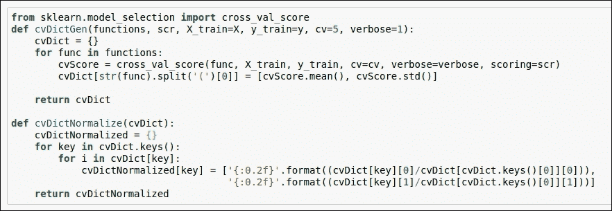

图 1.57:实现 K 重交叉验证的代码片段

正如您在上图中看到的，我们获得了`cvScore.mean()`和`cvScore.std()`分数来评估我们的模型性能。请注意，我们已经考虑了整个训练数据集。因此，这些参数的值是`X_train = X`和`y_train = y`。这里，我们定义了`cvDictGen`函数，它将跟踪精确度的平均值和标准偏差。我们还实现了`cvDictNormalize`函数，如果我们想要获得标准化的平均值和标准差(std)分数，就可以使用这个函数。暂时不打算用`cvDictNormalize`功能。

现在是运行`cvDictGen`方法的时间了。您可以在下图中看到输出:

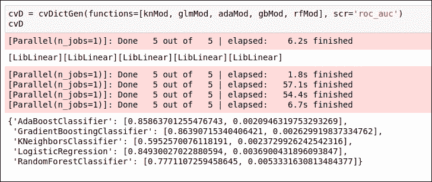

图 1.58:K-fold 交叉验证输出的代码片段

我们已经对五种不同的 ML 算法进行了交叉验证，以检查哪种 ML 算法效果更好。正如我们可以看到的，在上图给出的输出中，GradietBoosting 和 Adaboot 分类器工作得很好。我们已经使用了交叉验证分数来决定我们应该选择哪种 ML 算法，哪种不应该使用。除此之外，基于平均值和标准差值，我们可以得出结论，我们的 ROC-AUC 得分没有偏离太多，因此我们没有遭受过度拟合问题。

现在是时候看看超参数调优的实现了。

## 实施超参数调谐

在本节中，我们将研究如何获得超参数的最佳值。这里，我们使用`RandomizedSearchCV`超参数调整方法。我们已经为 AdaBoost 和 GradientBossting 算法实现了这个方法。您可以在下图中看到 Adaboost 算法的超参数调整的实现:

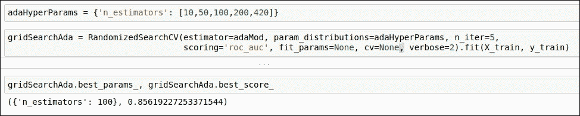

图 1.59:Adaboost 算法的超参数调整的代码片段

在给定的参数值上运行`RandomizedSearchCV`方法后，将生成最佳的参数值。正如您在上图中看到的，我们想要参数的最佳值；`n_estimators`。`RandomizedSearchCV`获得`n_estimators`的最佳值，即 100。

您可以在下图中看到 GradientBoosting 算法的超参数调整的实现:

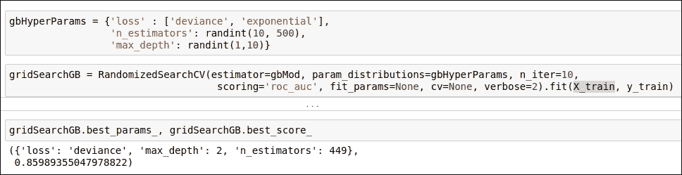

图 1.60:gradient boosting 算法的超参数调整的代码片段

如上图所示，`RandomizedSearchCV`方法获得了以下超参数的最佳值:

*   “损失”:“偏差”
*   “最大深度”:2
*   n_estimators': 449

现在是测试我们修改后的方法的时候了。让我们看看我们将如何测试这个模型，测试的结果会是什么。

## 实施和测试经修订的方法

这里，我们需要来插入超参数的最优值，然后我们将在验证数据集上看到 ROC-AUC 得分，这样我们就知道分类器的准确性是否会有任何提高。

通过参考下图，您可以了解实施情况以及我们如何使用最佳超参数进行培训:

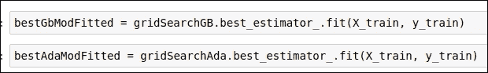

图 1.61:使用最佳超参数值进行训练的代码片段

完成训练后，我们可以使用训练好的模型来预测验证数据集的目标标签。在此之后，我们可以获得 ROC-AUC 得分，这让我们知道我们能够在多大程度上优化我们的分类器的准确性。这个分数也有助于验证我们的方向，所以如果我们不能提高我们的分类器准确性，那么我们可以在下一次迭代中识别问题并提高准确性。您可以在下图中看到 ROC-AUC 得分:

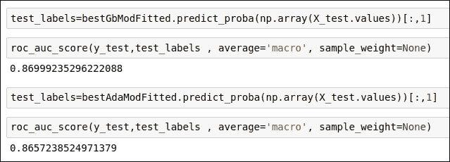

图 1.62:修正方法的 ROC-AUC 评分的代码片段

正如您在输出中看到的,在超参数调整后，与基线方法相比，我们的 ROC-AUC 得分有所提高。在我们的基线方法中，AdaBoost 的 ROC-AUC 评分为 0.85348539，而在超参数调整后，它为 0.86572352。在我们的基线方法中，GradientBoosting 的 ROC-AUC 得分为 0.85994964，而在超参数调整后，它为 0.86999235。这些分数表明我们正朝着正确的方向前进。

问题依然存在:*我们能否进一步提高分类器的准确性？*当然，总有改进的空间，所以我们会遵循同样的方法。我们列出了所有可能的问题或我们还没有触及的领域。我们试图探索它们，并生成最佳的可能方法，使我们在验证数据集和测试数据集上都具有良好的准确性。

因此，让我们看看在这个修订的方法中，我们尚未触及的领域将会是什么。

## 理解修订方法的问题

直到修改后的方法，我们没有在特性工程上花很多时间。因此，在我们最好的方法中，我们花时间在功能工程的转换上。我们需要实现一个投票机制，以便在实际的测试数据集上生成预测的最终概率，这样我们就可以获得最佳的准确度分数。

这是我们需要应用的两种技术:

*   特征转换
*   具有投票机制的集成 ML 模型

一旦我们实现了这些技术，我们将在验证数据集上检查我们的 ROC-AUC 分数。之后，我们将为真实测试数据集中的每条记录生成一个概率分数。先说实现。

# 最佳方法

如前一节所述，在本次迭代中，我们将重点关注特征转换以及实现一个将使用 AdaBoost 和 GradientBoosting 分类器的投票分类器。希望通过使用这种方法，我们将在验证数据集和真实测试数据集上获得最好的 ROC-AUC 分数。为了产生最佳结果，这是可能的最佳方法。如果你有任何创造性的解决方案，你也可以尝试一下。现在我们将跳到实现部分。

## 实施最佳方法

这里，我们将实现以下技术:

*   特征的对数变换
*   基于投票的集成模型

我们先实现特征转换。

### 特征的日志转换

我们将对我们的训练数据集应用对数变换。这背后的原因是，我们有一些非常倾斜的属性和一些数据属性，它们的值在本质上更加分散。因此，我们将采用 1 的自然对数加上输入特征数组。可以参考下图所示的代码片段:

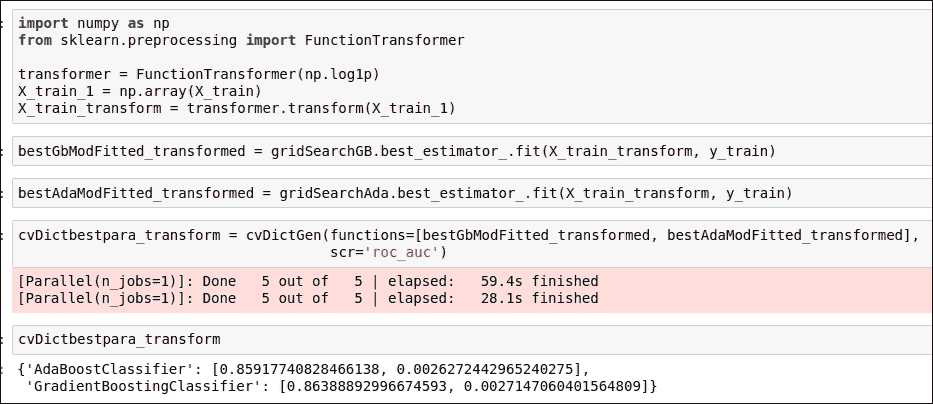

图 1.63:特征的 log(p+1)变换的代码片段。

我还在验证数据集上测试了 ROC-AUC 的准确性，这给了我们准确性上的微小变化。

### 基于投票的集成 ML 模型

在这个部分，我们将使用基于投票的集成分类器。scikit-learn 库已经有了一个可用于此的模块。因此，我们为未转换的特征和转换的特征实现了基于投票的 ML 模型。让我们看看哪个版本在验证数据集上得分更高。可以参考下图给出的代码片段:

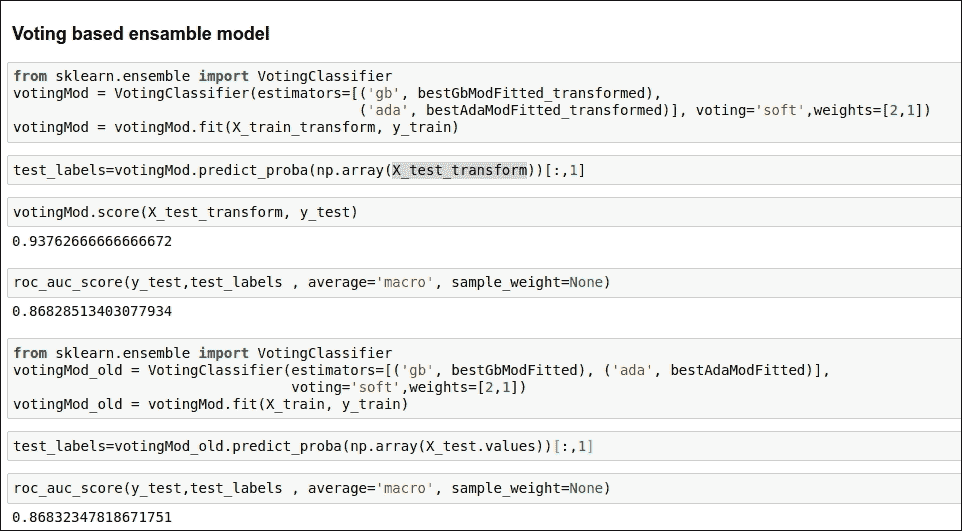

图 1.64:基于投票的集成分类器的代码片段

这里，我们使用两个参数:权重 2 用于 GradientBoosting，权重 1 用于 AdaBoost 算法。我还将投票参数设置为软，这样分类器可以更加协作。

我们几乎完成了使用投票机制来尝试我们的最佳方法。在下一节中，我们将在真实的测试数据集上运行我们的 ML 模型。所以我们来做一些真正的测试吧！

### 在真实测试数据上运行 ML 模型

这里，我们将在我们的测试数据集上测试基于投票的 ML 模型的准确性。在第一次迭代中，我们不会对测试数据集进行对数转换，在第二次迭代中，我们会对测试数据集进行对数转换。在这两种情况下，我们将为目标类生成概率。在这里，我们生成概率，因为我们想知道有多少机会有一个特定的人拖欠贷款在未来 2 年。我们将把预测的概率保存在一个`csv`文件中。

您可以在下图中看到执行测试的代码:

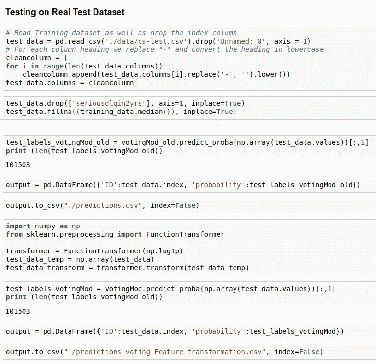

图 1.65:用于测试的代码片段

如果你能看到*图 1.64* 那么你就会知道，在这里，我们已经达到了 86%的准确率。按照行业标准，这个分数是迄今为止最有效的准确度。

# 总结

在本章中，我们学习了如何使用各种统计技术分析数据集。在那之后，我们获得了一个基本的方法，通过使用这个方法，我们开发了一个甚至没有达到基线的模型。因此，我们找出了方法中的错误，并尝试了另一种方法，这种方法解决了我们基线模型的问题。然后，我们评估了该方法，并使用交叉验证和集成技术优化了超参数，以实现该应用的最佳可能结果。最后，我们找到了最好的方法，这给了我们最先进的结果。你可以在 https://github.com/jalajthanaki/credit-risk-modelling 的 GitHub 上找到所有的代码。你可以在[https://github . com/jalajthanaki/credit-risk-modeling/blob/master/readme . MD](https://github.com/jalajthanaki/credit-risk-modelling/blob/master/README.md)找到所有与安装相关的信息。

在下一章，我们将看看分析领域的另一个非常有趣的应用:预测给定股票的股价。听起来是不是很有趣？我们还将使用一些现代机器学习(ML)和深度学习(DL)方法来开发股票价格预测应用程序，所以也要为此做好准备！