    

# 第二章。股票市场价格预测

在本章中，我们将介绍一个属于预测分析的惊人应用。我希望这一章的名字已经让你对这一章的内容有了大致的了解。我们将尝试预测股票指数的价格。我们将应用一些现代机器学习技术以及深度学习技术。

我们将在本章中讨论以下主题:

*   介绍问题陈述
*   收集数据集
*   了解数据集
*   数据预处理和数据分析
*   特征工程
*   选择机器学习(ML)算法
*   训练基线模型
*   了解测试矩阵
*   测试基线模型
*   探索现有方法的问题
*   理解修订方法

    *   理解概念和方法

*   实施修订方法

    *   测试修订方法
    *   理解修订方法的问题

*   最好的方法
*   摘要

所以，让我们开始吧！

# 介绍问题陈述

股票市场是一个你可以买卖公司所有权单位的地方，我们称之为**股票**。如果公司表现良好，增加了利润，那么你也会获得一些利润，因为你拥有该公司的股票，但如果该公司的利润下降，那么你将失去你在该公司的钱。所以，如果你在正确的时间把钱投资在正确的公司，它会让你赚很多钱。问题是你应该买哪家公司的股票？有没有什么方法可以让我们根据一家公司股票的历史价格来预测该公司股票的未来价格，这样我们就有更大的机会获得良好的回报？答案是肯定的。这就是我们将在本章探讨的内容。

如果你投资股票市场，那么你可能听说过股票价格是完全随机和不可预测的。这被称为*有效市场假说，*但是大多数大型金融公司，如 JP 摩根、花旗集团和高盛，都有数学和定量分析师，他们试图开发预测模型来帮助这些大公司决定何时投资和投资哪只股票。

在投资任何股票之前，我们都会做一些关于公司概况的基础研究。我们试图理解它的商业模式。我们还检查公司的资产负债表，以了解公司的损益情况。该公司将在未来几个月推出哪些产品？关于公司的什么样的新闻正在进来？目前的行业趋势是什么？在研究了所有这些参数后，如果我们觉得会获得一些利润，我们会把钱投资到某个特定公司的股票上；否则，我们不会投资那家公司。

我们依靠各种信息来源来了解我们是需要买股票还是卖股票。你不认为所有这些分析花了我们很多时间吗？我想向你提出两个问题。首先，我们能否利用这里讨论的一些数据点，建立一个能帮助我们找出未来股票价格的系统？还有我们能不能用历史股价来预测未来股价？这两个问题的答案都是肯定的:我们可以建立一个系统，使用历史股票价格和其他一些数据点，这样我们就可以预测股票的未来价格。根据有效市场假说，通过使用股票的历史价格和各种其他数据点，我们可以获得股票的未来价格，这将优于随机猜测。在本章中，我们将建立一个预测模型，该模型将预测股票的收盘价。在下一节中，我们将了解如何收集数据集来构建模型。所以，让我们开始吧！

# 收集数据集

为了让建立模型，首先我们需要收集数据。我们将使用以下两个数据点:

*   **道琼斯工业平均指数** ( **DJIA** )指数价格
*   新闻文章

DJIA 指数价格让我们对股票市场在某一天的走势有一个总体的了解，而新闻文章帮助我们发现新闻是如何影响股票价格的。我们将使用这两个数据点来构建我们的模型。现在让我们收集数据。

## 收集 DJIA 指数价格

为了收集 DJIA 指数价格，我们将使用雅虎财经。你可以访问这个链接:[https://finance.yahoo.com/quote/%5EDJI/history?周期 1=1196706600 &周期 2=1512325800 &间隔=1d &过滤=历史&频率=1d](https://finance.yahoo.com/quote/%5EDJI/history?period1=1196706600&period2=1512325800&interval=1d&filter=history&frequency=1d) 。一旦你点击这个链接，你可以看到价格数据显示出来。您可以更改时间段，点击**下载数据**链接即可；你可以拥有所有数据的`.csv`文件格式。参考以下雅虎财经 DJIA 指数价格页面截图:

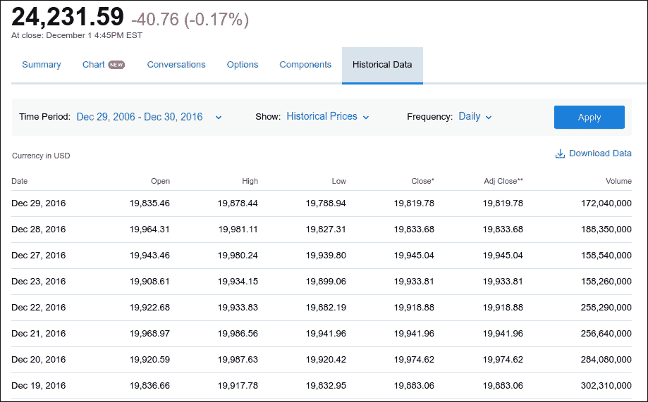

图 2.1:DJIA 指数价格的雅虎财经页面

在这里，我们已经下载了 2007-2016 年的数据集，这意味着我们有 10 年的 DJIA 指数价格数据。您也可以在*图 2.1* 中看到这一点。你可以使用这个 GitHub 链接找到这个数据集:[https://GitHub . com/jalaythanaki/stock _ price _ prediction/blob/master/data/DJIA _ 数据. csv](https://github.com/jalajthanaki/stock_price_prediction/blob/master/data/DJIA_data.csv) 。

请容忍我一会儿；我们将在本章的*了解数据集*一节中了解每个数据属性的含义。现在，让我们看看如何收集新闻文章。

## 收集新闻文章

我们希望收集新闻文章，以便我们可以建立新闻如何影响 DJIA 指数值之间的相关性。我们将对新闻文章进行情感分析。你可能想知道为什么我们需要进行情感分析。如果任何消息对金融市场有负面影响，那么股票价格可能会下跌，如果金融市场的消息是正面的，那么股票价格可能会上涨。对于这个数据集，我们将使用纽约时报的新闻文章。为了收集新闻文章的数据集，我们将使用纽约时报的开发者 API。所以，我们开始编码吧！

首先，在 NYTimes 开发者网站上注册自己，生成自己的 API 密匙。链接是[https://developer.nytimes.com/signup](https://developer.nytimes.com/signup)。我已经为归档 API 生成了 API 密钥。这里，我们使用了 *newsapi、JSON、请求*和 *sys* 依赖项。你也可以使用这个链接参考纽约时报开发者文档:[https://developer . NYTimes . com/archive _ API . JSON #/Documentation/GET/% 7 byear % 7D/% 7 bmonth % 7D . JSON](https://developer.nytimes.com/archive_api.json#/Documentation/GET/%7Byear%7D/%7Bmonth%7D.json)。

你可以在这个 GitHub 链接找到代码:[https://GitHub . com/jalaythanaki/stock _ price _ prediction/blob/master/get data _ ny times . py](https://github.com/jalajthanaki/stock_price_prediction/blob/master/getdata_NYtimes.py)。您可以在下面的屏幕截图中看到代码片段:

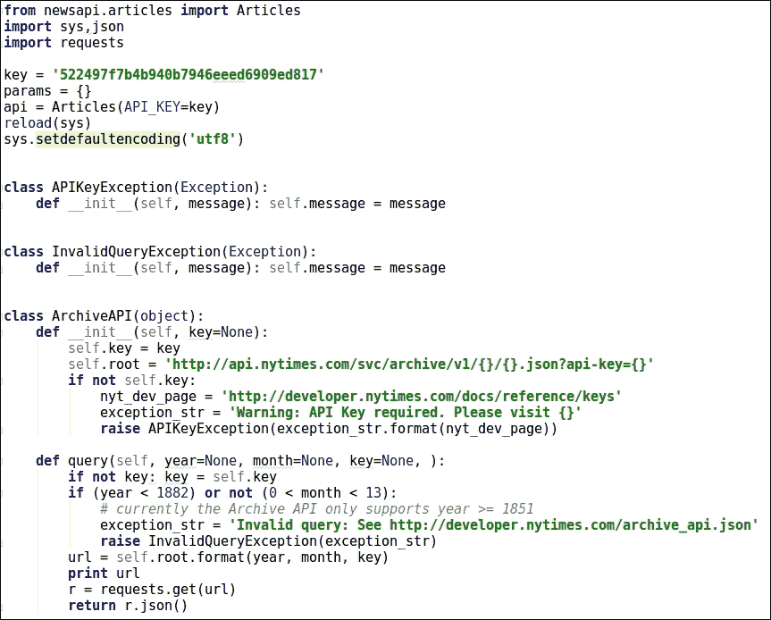

图 2.2:从纽约时报获取新闻文章数据的代码片段

正如您在代码中看到的，有三种方法。前两个方法用于异常，第三个方法检查有效性并请求可以为我们生成新闻文章数据的 URL。这个 NYTimes API URL 有三个参数，如下所示:

*   年
*   月
*   API 密钥

在这一步之后，我们将调用第三个函数并传递 2007 年到 2016 年的年份值。我们将以 *JSON* 格式保存数据。可以参考下面截图中的代码片段:

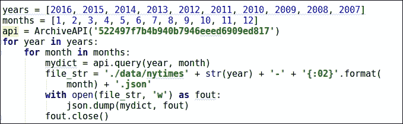

图 2.3:从纽约时报获取新闻文章数据的代码片段

你可以使用这个 GitHub 链接找到原始的 JSON 数据集:[https://GitHub . com/jalajthanaki/stock _ price _ prediction/blob/master/data/2016-01 . JSON](https://github.com/jalajthanaki/stock_price_prediction/blob/master/data/2016-01.json)。

现在让我们继续下一节，在这一节中，我们将了解到目前为止我们已经收集的数据集和属性。

# 了解数据集

在本节中，我们将了解数据属性的含义，这将有助于我们理解我们将要处理什么样的数据集，以及数据集需要什么样的预处理。我们通过两个部分来理解我们的数据集，这些部分如下所示:

*   了解 DJIA 数据集
*   了解纽约时报新闻文章数据集

## 了解 DJIA 数据集

在 DJIA 数据集中，我们有七个数据属性。它们非常容易理解，所以让我们一个一个地来看它们:

*   `Date`:第一列表示 YYYY-MM-DD 格式的日期。csv 文件。
*   `Open`:表示开市时的价格，因此是该特定交易日 DJIA 指数的开盘价。
*   `High`:这是某个交易日 DJIA 指数的最高价格。
*   `Low`:这是某个交易日 DJIA 指数的最低价。
*   `Close`:DJIA 指数交易日收盘时的价格。
*   `Adj close`:调整后收盘价(adj close price)以收盘价为起点，并考虑了股息、股票分割和新股发行等因素。可调收盘价代表了 DJIA 指数的真实反映。让我给你举个例子，这样你可以更好地理解 adj 收盘价:如果一家公司提供每股 5 美元的股息，如果该公司股票的收盘价是 100 美元，那么 adj 收盘价将变成 95 美元。因此，可调收盘价考虑了各种因素，并基于这些因素，产生了公司股票的真实价值。这里，我们看的是 DJIA 指数值，所以大多数时候，收盘价和调整收盘价是相同的。
*   `Volume`:这些数值表示某个交易日在交易所交易的指数数量。

这些是 DJIA 指数数据集的基本细节。我们使用历史数据，并试图预测 DJIA 指数的未来走势。

在下一节中，我们将查看纽约时报新闻文章数据集。

## 了解纽约时报新闻文章数据集

我们已经使用了纽约时报开发人员 API，并以 JSON 形式收集了新闻文章，因此，在这里，我们将查看 JSON 响应，以便我们可以确定最重要的数据属性，我们可以关注这些属性。在下图中，您可以看到我们从《纽约时报》获得的 JSON 响应:

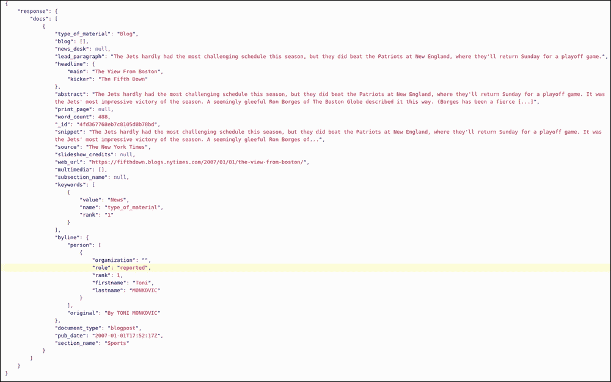

图 2.4:使用纽约时报开发工具对新闻文章的 JSON 响应

在这个图中，我们可以看到单个新闻文章的 JSON 响应。如您所见，有一个主数据属性响应，它携带所有其他数据属性。我们将关注 docs 数组中给出的数据属性。不用担心；我们不会使用所有的数据属性。这里，我们将重点关注以下数据属性:

*   `type_of_material`:这个属性表示一篇特定的新闻文章来源于一种特定的来源，无论是博客、新闻文章、分析等等。
*   `headlines`:标题数据属性有两个子数据属性。主数据属性包含新闻的实际标题，而 kicker 数据属性传达文章的重点。
*   `pub_date`:该数据属性表示新闻文章的发表。您可以在 doc 数组的倒数第二部分找到该属性。
*   `section_name`:该数据属性出现在上一部分的上一幅图像中。它提供了新闻文章的类别。
*   `news_desk`:该数据属性也表示新闻类别。当`section_name`在响应中不存在时，我们将引用该属性。

随着我们正确理解数据属性，我们应该继续下一部分，即数据预处理和数据分析部分。

# 数据预处理和数据分析

在这个部分，我们将主要介绍数据预处理和数据分析。作为数据预处理的一部分，我们正在准备我们的训练数据集。你可能想知道我说的是哪种数据准备，因为我们已经有了数据。请允许我告诉你，我们有两个不同的数据集，两个数据集都是独立的。因此，我们需要合并 DJIA 数据集和纽约时报新闻文章数据集，以便从这些数据集中获得有意义的见解。一旦我们准备好训练数据集，我们就可以使用不同的机器学习(ML)算法来训练数据。

现在，让我们开始编码以准备训练数据集。我们将使用`numpy`、`csv`、`JSON`和`pandas`作为我们的依赖库。这里，我们的代码分为两部分。首先，我们将为 DJIA 指数数据集准备数据集，然后我们将进入下一部分，即准备纽约时报新闻文章数据集。在准备训练数据集的过程中，我们还将编写基本的数据分析步骤。

## 准备 DJIA 训练数据集

你可以看到下面截图中的代码片段。你可以在这个 GitHub 链接找到代码:[https://GitHub . com/jalaythanaki/stock _ price _ prediction/blob/master/data prepare . ipynb](https://github.com/jalajthanaki/stock_price_prediction/blob/master/datapreparation.ipynb)。

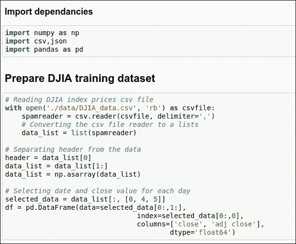

图 2.5:准备 DJIA 数据集的代码片段

正如你可以在前面的代码片段中看到的，我们正在读取之前从雅虎财经页面下载的 csv 文件。之后，我们将数据转换成列表格式。我们还将标题和实际数据从列表中分离出来。一旦我们有了列表格式的数据，我们就把数据转换成一个 numpy 数组。我们仅从 DIJA 数据集中选择了三列，如下所示:

*   日期
*   收盘价格
*   调整接近的价格

你心里可能有一个问题:为什么我们只考虑了 DJIA csv 文件中的收盘价和调整收盘价？让我澄清一下:我们知道开盘价大多是最后一天收盘价的近似值，所以我们没有考虑开盘价。我们没有考虑高价和低价，因为我们不知道这些高价和低价发生在哪个特定的时间戳。对于第一次迭代，预测股票指数何时达到高或低值是相当复杂的，因此，在此期间，我们忽略这两列。我们主要对 DJIA 指数的整体趋势感兴趣。如果我们精确地计算出趋势，我们就能预测以后的高价格和低价格。这里，我们的目标仅限于预测 DJIA 指数未来交易日的收盘价。

现在回到编码部分:我们以这样一种方式构建 pandas 数据框架，即日期列充当索引列，收盘价和调整收盘价是数据集的另外两列。你可以在*图 2.5* 给出的代码片段中看到以`df`变量形式定义的 dataframe 的输出。您可以在下图中看到数据帧 df 的输出:

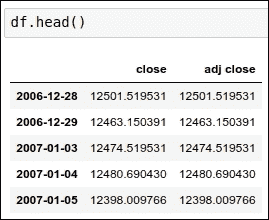

图 2.6:熊猫数据帧的输出，它在图 2.5 的代码片段中被定义为 *df* 变量

希望现在你已经清楚地了解到目前为止我们所遵循的步骤。我们已经创建了基本的数据框架，现在我们将进入 DJIA 数据集的基本数据分析部分。

## DJIA 数据集的基础数据分析

在本节中，我们将对 DJIA 数据集执行基本数据分析。这个数据集有日期值，但是如果您仔细查看日期的值，就会发现有一些日期缺失。假设 2006 年 12 月 30 日、2006 年 12 月 31 日、2007 年 1 月 1 日以及许多其他日期的数据丢失。在这种情况下，我们将添加缺少的日期值。你可以参考*图 2.7* 中给出的代码片段，也可以在这个 GitHub 上找到这个的代码:[https://GitHub . com/jalajthanaki/stock _ price _ prediction/blob/master/data prepare . ipynb](https://github.com/jalajthanaki/stock_price_prediction/blob/master/datapreparation.ipynb)。

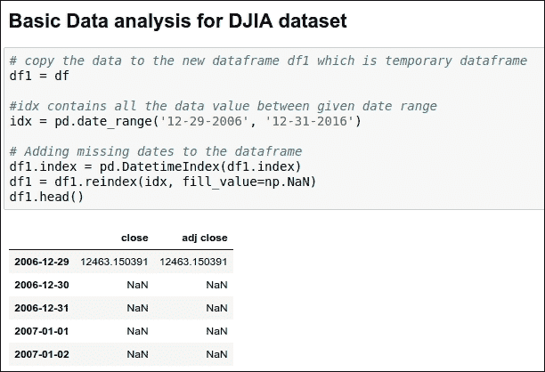

图 2.7:添加 DJIA 数据集中所有缺失日期值的代码片段

正如您在上图中看到的，在添加这些缺失的日期值后，我们遇到了另一个挑战。我们添加了日期值，但是没有对应于它们的收盘价或调整收盘价，所以我们需要逻辑地替换 NaN 值，而不是随机地替换。

为了替换收盘价和调整收盘价的 NaN 值，我们将使用熊猫插值功能。我们使用线性插值来生成 NaN 的缺失值。有许多类型的插值可用，但这里我们使用线性插值，线性插值的数学公式如下:

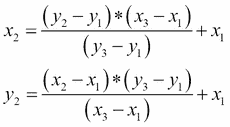

等式 2.1:线性插值数学公式

如果两个已知点由坐标(x1，y_1)和(x_3，y_3)给出，则线性插值函数是这两个点之间的直线。

可以参考下面截图中的代码片段:

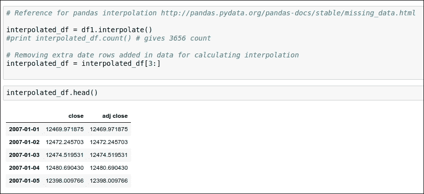

图 2.8:基本数据分析和插值实现的代码片段

这方面的代码可以在 GitHub 的 https://GitHub . com/jalaythanaki/stock _ price _ prediction/blob/master/data prepare . ipynb 上找到。

正如您在代码片段中看到的，我们还没有定义应该对数据集执行哪种类型的插值；在这种情况下，默认情况下会执行线性插值。因此，在应用线性插值后，我们可以用实际的逻辑值替换 NaN 值。我们还删除了 2006 年的三项记录。所以现在，我们总共有 3653 条记录。

这就是我们为 DJIA 指数数据集所做的基本数据预处理和数据分析。现在让我们转到纽约时报新闻文章数据集。我们需要首先准备训练数据集，所以让我们从它开始。

## 准备纽约时报新闻数据集

在本节中，我们将了解如何准备纽约时报新闻数据集。我们已经下载了整个新闻文章数据集，但是我们还没有为选择新闻文章类别设置过滤机制。准备纽约时报数据集时，请执行以下步骤:

1.  将出版日期转换为 YYYY-MM-DD 格式。
2.  按类别过滤新闻文章。
3.  实现过滤器功能并合并数据集。
4.  以 pickle 文件格式保存合并的数据集。

所以，让我们开始为每一步编码。

### 将出版日期转换为 YYYY-MM-DD 格式

首先，我们将把新闻文章的出版日期转换成 YYYY-MM-DD 格式，这样我们以后就可以合并 DJIA 和纽约时报的新闻文章数据集。为了实现这一点，您可以参考下面的代码片段:

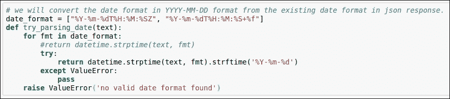

图 2.9:用于转换新闻文章发表日期的日期格式的代码片段

在这里，我们编写了一个函数，可以解析出版日期格式并将其转换为所需的 YYYY-MM-DD 格式。稍后，当我们读取存储了 JSON 响应的 JSON 文件时，我们将调用这个函数。

### 按类别过滤新闻文章

我们在这里要做的另一件事是按照新闻类别过滤我们的新闻文章数据集。我们已经下载了所有类型的新闻文章，但是对于股票市场价格预测应用程序，我们需要属于特定新闻类别的新闻文章。因此，我们需要实现过滤器来帮助我们提取新闻文章的必要子集。可以参考下面的代码片段:

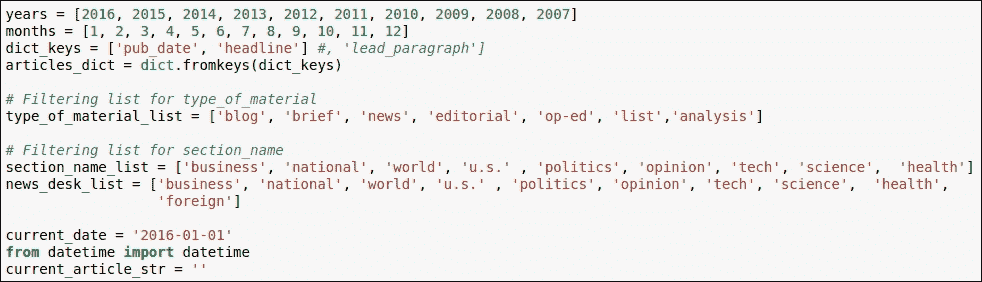

图 2.10:按类别过滤新闻文章的代码片段

你可以参考这个 GitHub 链接提供的代码:[https://GitHub . com/jalajthanaki/stock _ price _ prediction/blob/master/data prepare . ipynb](https://github.com/jalajthanaki/stock_price_prediction/blob/master/datapreparation.ipynb)。

如上图所示，我们正在提取属于以下新闻类别的新闻文章:

*   商业
*   国家的
*   世界
*   美国
*   政治
*   意见
*   技术
*   科学
*   健康
*   外国的

### 实施过滤器功能并合并数据集

现在，我们需要来迭代每个 JSON 文件，并提取新闻文章，这些新闻文章具有在上一节中定义的新闻类别之一。您可以参考实现过滤器功能的代码片段。在接下来的代码片段中，您还可以找到合并 DJIA 数据集和纽约时报新闻文章数据集的实现。为了合并这两个数据集，我们将每个新闻文章标题添加到 pandas 数据帧中，并由此生成最终的训练数据集。此功能显示在下面的屏幕截图中:

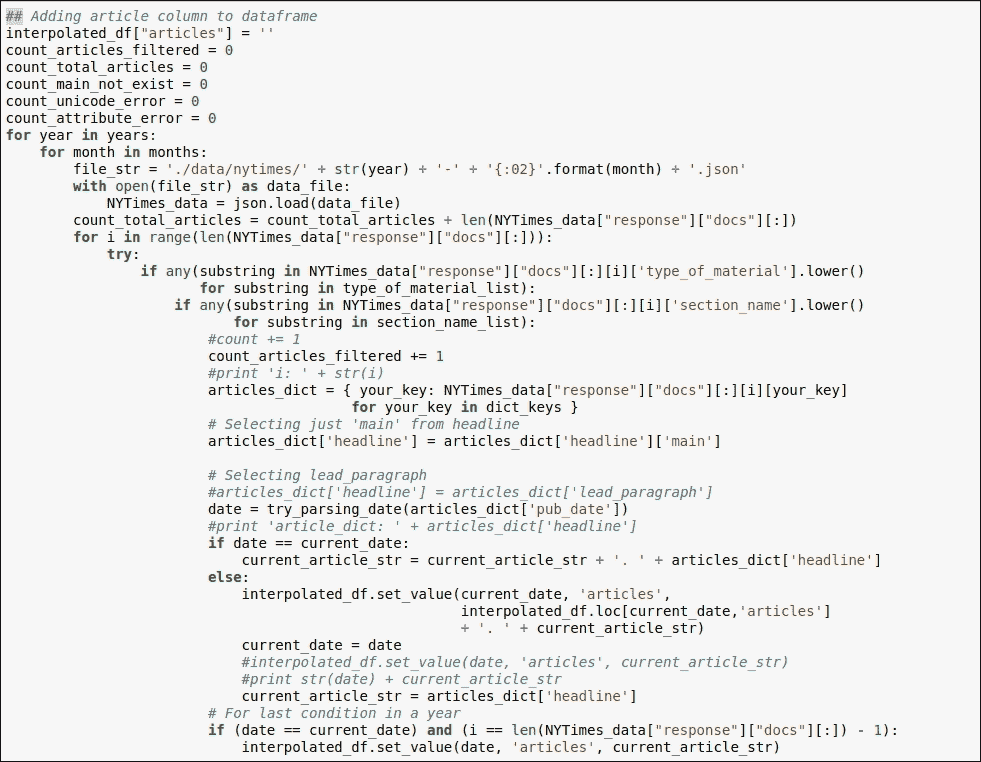

图 2.11:过滤和合并功能的代码片段

我们还编写了一些特殊处理功能的代码。这样做是为了如果任何 JSON 响应没有数据属性 section_name、news_desk 或 type_of_material 的值，那么这段代码将抛出一个异常。可以参考下面截图中的代码片段:

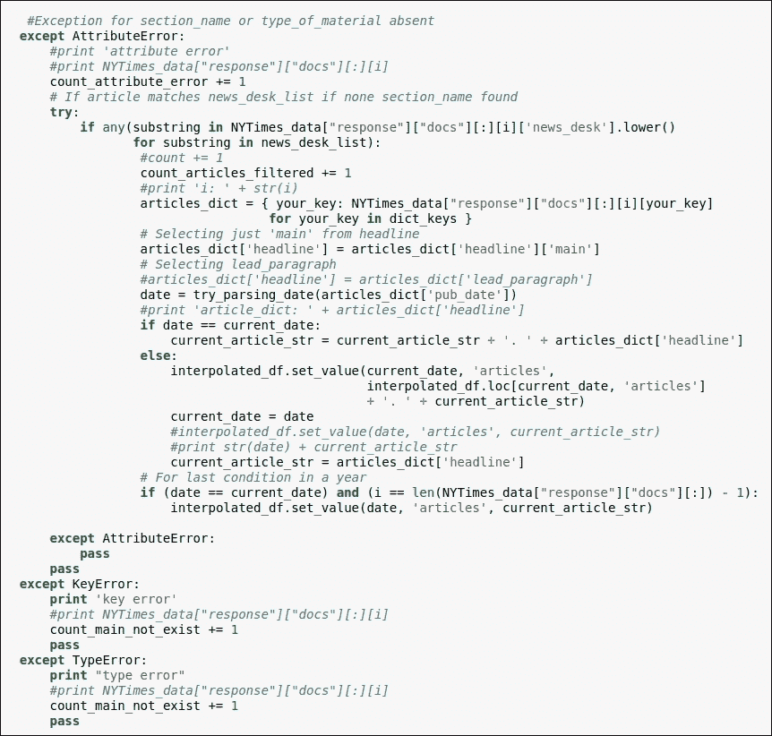

图 2.12:异常处理的实现

我们也会考虑没有`section_name`和`news_desk`的新闻文章。我们将把所有的新闻标题添加到我们的数据集中，并把它们放入熊猫数据框。你可以在下面的截图中看到代码片段:

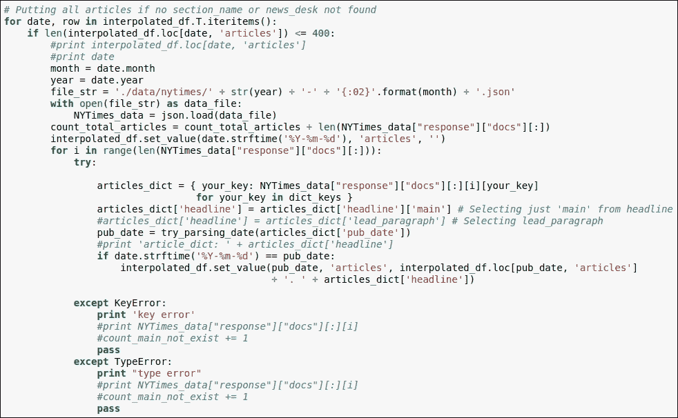

图 2.13:处理没有 section_name 和 news_desk 的新闻文章

您可以看到 pandas 数据帧形式的最终合并数据集，如以下屏幕截图所示:

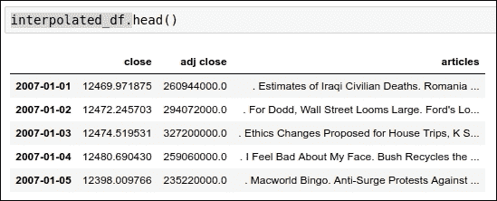

图 2.14:最终合并的训练数据集

在这里，对于每个日期，我们对应属于商业、国家、世界、美国、政治、观点、技术、科学和健康类别的所有新闻标题。我们已经下载了 1，248，084 篇新闻文章，从这些文章中，我们为我们的模型考虑了 461，738 篇新闻文章。

您可以使用这个 GitHub 链接访问代码:[https://GitHub . com/jalaythanaki/stock _ price _ prediction/blob/master/data prepare . ipynb](https://github.com/jalajthanaki/stock_price_prediction/blob/master/datapreparation.ipynb)。

### 以 pickle 文件格式保存合并的数据集

一旦我们合并数据，我们需要保存数据对象，所以我们将使用 Python 的 pickle 模块。Pickle 帮助我们序列化和反序列化数据。pickle 依赖库很快，因为它的大部分是用 C 编写的，就像 Python 解释器本身一样。在这里，我们将我们的训练数据集保存为一个`.pkl`文件格式。可以参考下面的代码片段 *:*

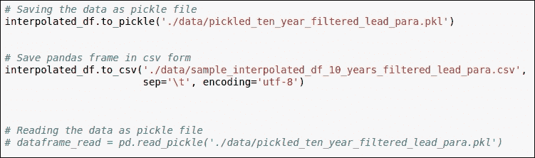

图 2.15:以 pickle 格式保存数据的代码片段

我们已经将数据集保存为文件。你可以在 GitHub 上的[https://GitHub . com/jalaythanaki/stock _ price _ prediction/blob/master/data prepare . ipynb](https://github.com/jalajthanaki/stock_price_prediction/blob/master/datapreparation.ipynb)找到代码。

在下一节中，我们将主要关注特性工程部分。我们还将执行一些次要的数据清理步骤。让我们跳到下一部分。

# 特色工程

正如前面讨论的，我们想要预测某个特定交易日 DJIA 指数的收盘价。在本节中，我们将根据我们的直觉为股票价格的基本预测模型选择特征。我们已经生成了训练数据集。所以，现在我们将加载保存的。pkl 格式化数据集，并执行要素选择和次要数据处理。我们还将为每篇过滤后的《纽约时报》新闻文章生成情绪得分，并将使用该情绪得分来训练我们的基线模型。我们将使用以下 Python 依赖项:

*   numpy
*   熊猫
*   nltk

本节有以下步骤:

1.  加载数据集
2.  次要预处理
3.  特征选择
4.  情感分析

所以，让我们开始编码吧！

## 加载数据集

我们已经用 pickle 格式保存了数据，现在我们需要从中加载数据。可以参考下面的代码片段 *:*

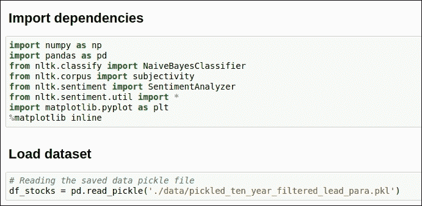

图 2.16:从 pickle 文件加载数据集的代码片段

可以点击这个 GitHub 链接参考代码:[https://GitHub . com/jalajthanaki/Stock _ Price _ prediction/blob/master/Stock _ Price _ prediction . ipynb](https://github.com/jalajthanaki/stock_price_prediction/blob/master/Stock_Price_Prediction.ipynb)。

如您所见，在 dataframe 输出中，有一个点(。)之前，所以我们需要删除这些点。我们将在下一节中执行这一更改。

## 次要预处理

作为次要预处理的一部分，我们将执行以下两项更改:

*   将调整收盘价转换为整数格式
*   删除最左边的点(。)来自新闻标题

### 将调整收盘价转换为整数格式

我们知道adj close 价格是浮动形式的。因此，这里我们将把浮点值转换成整数格式，并将转换后的值作为*价格*属性存储在我们的熊猫数据帧中。现在，你可能想知道为什么我们只考虑接近的价格。请耐心听我说，我会告诉你原因的。您可以在下面的屏幕截图中找到聚合代码片段:

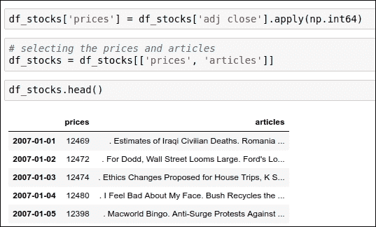

图 2.17:将 adj 收盘价转换成整数格式的代码片段

### 提示

可以参考这个 GitHub 链接的代码:[https://GitHub . com/jalajthanaki/Stock _ Price _ prediction/blob/master/Stock _ Price _ prediction . ipynb](https://github.com/jalajthanaki/stock_price_prediction/blob/master/Stock_Price_Prediction.ipynb)。

现在，让我们进入第二个变化。

### 删除新闻标题最左边的点

在这个部分，我们将看到移除最左边点的实现。我们将使用`lstrip()`功能来移除圆点。可以参考下面截图中的代码片段:

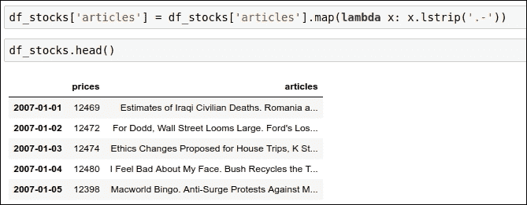

图 2.18:从新闻标题中删除点号*的代码片段*

### 提示

可以参考这个 GitHub 链接的代码:[https://GitHub . com/jalajthanaki/Stock _ Price _ prediction/blob/master/Stock _ Price _ prediction . ipynb](https://github.com/jalajthanaki/stock_price_prediction/blob/master/Stock_Price_Prediction.ipynb)。

现在，让我们进入下一部分，即特性工程。

## 特色工程

特征选择是特征工程和任何**机器学习** ( **ML** )应用最重要的方面之一。因此，这里我们将重点放在特征选择上。在上一节中，我提出了为什么我们只选择*调整收盘价*而不选择*收盘价的问题。*这个问题的答案在于特征选择。我们选择*调整收盘价*是因为这些价格让我们更好地了解 DJIA 指数的最后价格，包括股票、共同基金、股息等等。在我们的数据集中，*收盘价*大多与*调整收盘价*相同，并且在将来，如果我们考虑未见过的数据记录的*收盘价*，我们就不能导出*调整收盘价*，因为它可能等于*收盘价*或高于*收盘价，*DJIA 指数的*调整收盘价*可能高于 c *但是我们不知道对于我们刚刚考虑过收盘价的未知数据集，价格会高出多少。因此，如果我们考虑*调整收盘价*，那么我们将知道*收盘价*可能小于或等于*调整收盘价*，但不会大于*调整收盘价*。*调整收盘价*是收盘价的最大可能值。因此，我们考虑了开发的*调整接近价格*。对于基准模型，我们将考虑*调整收盘价*。我们已将该列重命名为*价格*。可以参考下面的代码片段:*

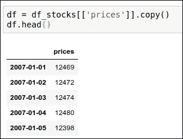

图 2.19:考虑 adj close 价格作为特性选择的一部分的代码片段

下一步，我们将对新闻文章数据集执行情感分析。我们可以在训练模型时使用情感分数。那么，让我们进入情绪分析部分。

## 对《纽约时报》新闻文章的情感分析

为了实现情感分析，我们使用 nltk 内置的情感分析模块。我们将获得负面、正面和复合情绪得分。我们使用了基于词典的方法。在基于词典的方法中，每个句子的单词被分析，并且基于`sentiwordnet`分数，每个单词被给予特定的情感分数；然后，决定合计句子级别分数。

### 注意

Sentiwordnet 是包含单词情感分数的字典。

我们将在[第五章](ch05.xhtml "Chapter 5. Sentiment Analysis")、*情感分析*中讲述与情感分析相关的细节。可以参考下面的感悟分析代码片段:

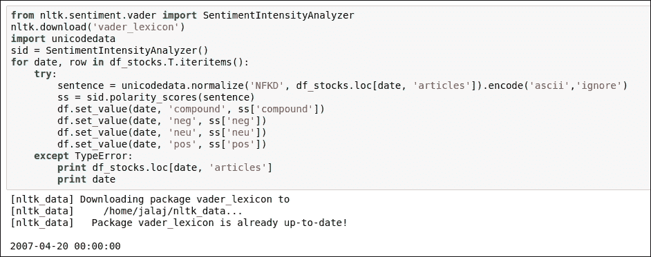

图 2.20:情感分析代码片段

前面代码生成的所有分数都存储在 dataframe 中，因此您可以在下面的截图 *:* 中看到新闻标题的总分数

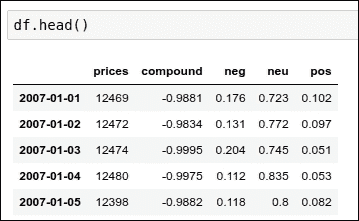

图 2.21:存储在数据框中的聚合情感分析得分

在本节结束时，我们将获得《纽约时报》新闻文章数据集的情感得分，并将这些情感得分合并为训练数据集的一部分。到目前为止，我们已经做了少量的预处理，根据我们的直觉选择了数据属性，并生成了情感评分。现在，我们将选择机器学习算法，并尝试建立基线模型。那么，让我们进入下一部分。

# 选择机器学习算法

在本节中，我们将根据我们的直觉选择机器学习(ML)算法，然后使用我们的训练数据集进行训练。这是这一章的第一个模型，所以训练好的模型是我们的基线模型，我们将在以后改进它。所以，让我们决定哪种 ML 算法适合这个股价预测应用程序。

股票价格预测应用程序是一个时间序列分析问题，我们需要预测时间序列中的下一个点。这种预测活动类似于线性回归，因此我们可以说这种应用程序是一种回归问题，回归系列中的任何算法都可以工作。让我们选择集成算法，即 *RandomForestRegressor* ，以开发我们的基线模型。因此，让我们训练我们的基线模型，并且，基于该模型的结果，我们将修改我们的方法。

# 训练基线模型

如你所知，我们选择了 RandomForestRegressor 算法。我们将使用 scikit-learn 库来训练模型。这些是我们需要遵循的步骤:

1.  拆分训练和测试数据集
2.  为定型和测试数据集拆分预测标签
3.  将情感分数转换为 numpy 数组
4.  训练 ML 模型

所以，让我们一个接一个地实现这些步骤。

## 拆分训练和测试数据集

我们有 10 年的数据值。因此，出于训练目的，我们将使用 8 年的数据，这意味着从 2007 年到 2014 年的数据集。出于测试的目的，我们将使用 2 年的数据，也就是 2015 年和 2016 年的数据。您可以参考下面截图中的代码片段来实现这一点:

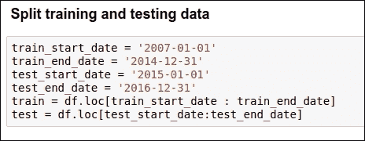

图 2.22:分割训练和测试数据集

正如您从前面的截图中看到的，我们的训练数据集已经存储在训练数据帧中，我们的测试数据集已经存储在测试数据帧中。

## 为训练和测试数据集拆分预测标签

当我们分割训练和测试数据集时，我们还需要单独存储调整收盘价格，因为我们需要预测这些*调整收盘价格*(在代码中表示为`prices`)；这些价格值是我们培训数据的标签，由于我们将以标签的形式提供实际价格，因此该培训成为监督培训。可以参考下面的代码实现:

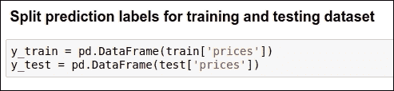

图 2.23:拆分训练和测试数据集的预测标签

这里，除了价格之外的所有属性都以特征向量的格式给出，价格以标签的形式给出。ML 算法采用这个特征向量，标记对，学习必要的模式，并预测看不见的数据的价格。

## 将情感分数转换为 numpy 数组

在我们开始训练之前，我们需要记住最后一点:我们将情感分析分数转换成 numpy 数组格式。这是因为一旦我们将价格属性设置为预测标签，我们的特征向量将只包含情感得分和日期。因此，为了生成一个合适的特征向量，我们已经将情感得分转换为一个 numpy 数组。下面的屏幕截图提供了实现这一点的代码片段:

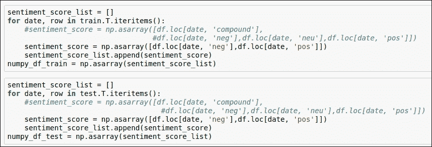

图 2.24:将情感分析分数转换成 numpy 数组的代码片段

正如您在代码片段中看到的，我们对数据集定型和数据集测试都执行了相同的转换操作。

### 注意

请注意，如果出现值错误，请检查数据集，因为数据集中的某一列可能有空值。

现在，让我们训练我们的模型！

## ML 模型的训练

在第一次迭代中，我们使用 RandomForestRegressor 算法，它是作为 scikit-learn 依赖项的一部分提供的。你可以在下面的截图中找到代码:

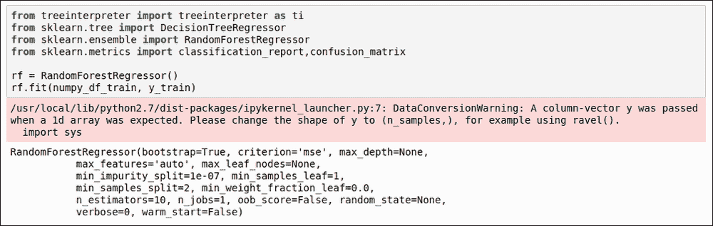

图 2.25:使用 RandomForestRegressor 进行训练的代码片段

正如您从前面的截图中看到的，我们已经使用了超参数的所有默认值。关于超参数更详细的描述，可以参考[http://sci kit-learn . org/stable/modules/generated/sk learn . ensemble . randomforestregressor . html](http://scikit-learn.org/stable/modules/generated/sklearn.ensemble.RandomForestRegressor.html)。

既然我们的模型已经被训练好了，我们需要使用我们的测试数据集来测试它。在我们测试之前，让我们讨论一下测试模型的方法。

# 了解测试矩阵

在本部分，我们将了解测试矩阵和可视化方法，以评估经过训练的 ML 模型的性能。让我们来理解这两种方法，如下所示:

*   默认测试矩阵
*   可视化方法

## 默认测试矩阵

我们正在使用 scikit 的默认分数 API 学习检查 ML 的执行情况。在该应用中，得分函数是误差平方和的系数。它也被称为 R2 系数，由下式定义:

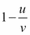

这里， *u* 表示残差平方和。 *u* 的方程式如下:

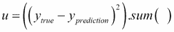

变量 *v* 表示总平方和。 *v* 的公式如下:

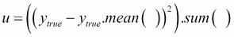

最好的可能分数是 1.0，也可以是负数。负的分数指示训练的模型可以任意地更差。忽略输入特征，始终预测标签 *y* 的期望值的常数模型将产生 0.0 的 R2 分数。

为了获得分数，我们只需要调用 score 函数。测试代码将与*测试基线模型*部分中的代码相同。现在让我们看看另一种测试方法，它对于理解真实测试标签的输出非常有帮助。所以，让我们来看看！

## 可视化方法

在这一部分，我们将探索一种有效的和直观的方法，这就是预测产出与实际产出的**可视化**。这种方法为您提供了很多洞察力，因为图表很容易理解，您可以决定接下来的步骤来改进模型。

在此应用中，我们将使用测试数据集的实际价格和测试数据集的预测价格，这将表明预测的好坏。您将在下一节中找到这个过程的代码和图表，名为*测试基线模型*。

# 测试基线模型

在此部分，我们将实施我们的测试方法，以便我们可以评估我们模型的准确性。我们将首先生成输出预测，然后开始测试它。我们将在此实施以下步骤:

1.  生成和解释输出
2.  生成分数
3.  可视化输出

## 生成和解释输出

为了生成预测，我们使用了`treeinterpreter`库。我们使用下面的代码预测每个测试数据集记录的价格值:

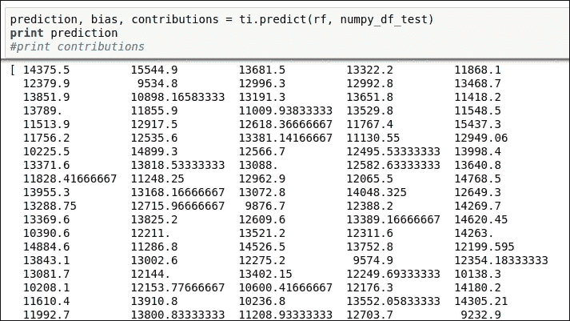

图 2.26:生成预测的代码片段

这里，*预测*是一个数组，其中的元素是测试数据集的所有记录的相应预测*调整收盘价*。现在，我们将这个预测的输出与测试数据集的实际*调整收盘价格*进行比较。通过这样做，我们将了解我们的第一个模型预测 *adj 收盘价*的准确程度。为了进一步评估，我们将生成准确度分数。

## 生成准确度分数

在此部分，我们将根据*默认测试矩阵*部分提供的等式生成准确度分数。这方面的代码如下:

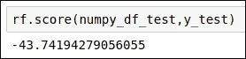

图 2.27:为测试数据集生成分数的代码片段

正如您在前面的代码片段中看到的，我们的模型做得不太好。在这一点上，我们不知道我们犯了什么错误或哪里出了问题。当你试图解决或建立一个 ML 模型时，这种情况很常见。使用可视化技术，我们可以更好地理解这个问题。

## 可视化输出

我们将在本节中使用可视化图表。使用该图，我们将识别我们已经犯下的错误的种类，以便我们可以在下一次迭代中修复该错误。我们将绘制一个图表，其中 *y 轴*代表*调整收盘价*，x 轴*代表*日期*。我们在图上绘制了*实际价格*和*预测价格*，这样我们就可以对我们的算法的执行情况有一个简单的了解。我们将使用以下代码片段来生成图表:*

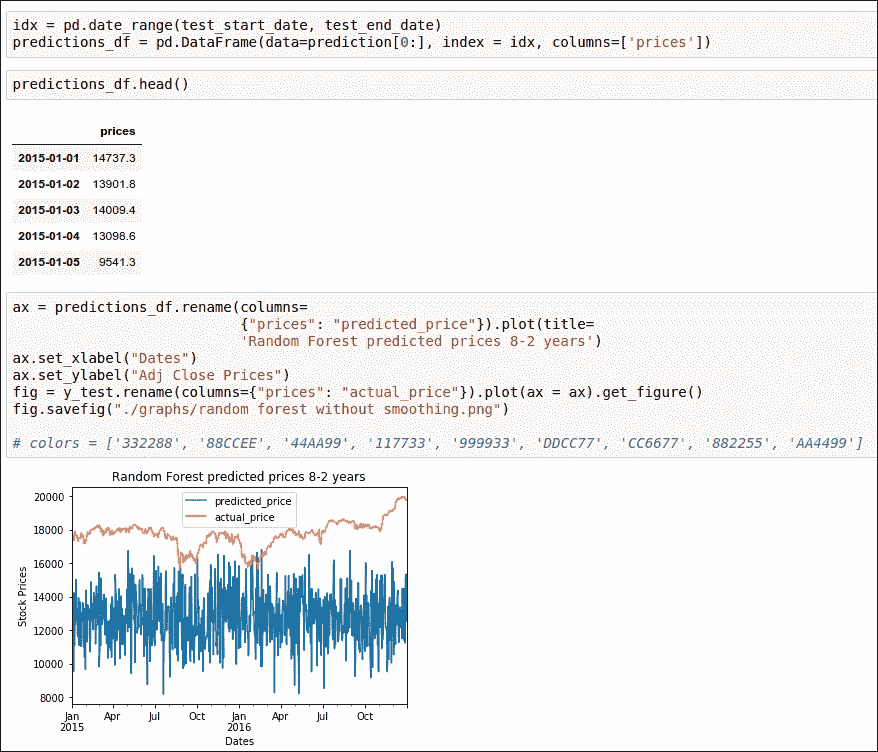

图 2.28:为预测价格和实际价格生成图表的代码片段。

正如你从上图中看到的，顶部的单线(橙色)代表实际价格，线下杂乱的尖峰(蓝色)代表预测价格。从这个图中，我们可以总结出我们的模型不能预测适当的价格。在这里，您可以看到实际价格和预测价格并不一致。我们需要解决这个问题。我们可以尝试一些技术，例如对齐、平滑和尝试不同的算法。因此，让我们在下一节讨论这种方法的问题。

### 注意

你可以从[https://GitHub . com/jalajthanaki/Stock _ Price _ prediction/blob/master/Stock _ Price _ prediction . ipynb](https://github.com/jalajthanaki/stock_price_prediction/blob/master/Stock_Price_Prediction.ipynb)上的 GitHub 链接获得关于这个主题的完整代码。

# 探索现有方法的问题

在这个部分，我们将讨论现有方法的问题。我们可能犯的错误主要有三个，如下所列:

*   对齐
*   缓和
*   尝试不同的 ML 算法

让我们逐一讨论每一点。

## 对齐

正如我们在图表中看到的，我们的实际价格和预测价格并不一致。这就成了问题。我们需要调整股票的价格。我们需要考虑数据集的平均值，基于此，我们将生成对齐。你可以在下一节*基于对齐的方法*中了解更多关于对齐的内容。

## 平滑

我觉得我们第一个模型的第二个问题是我们没有应用任何平滑技术。所以对于我们的模型，我们也需要应用平滑技术。我们将使用**指数加权移动平均** ( **EWMA** )技术进行平滑*。*该技术用于调整数据集的方差。

## 尝试不同的 ML 算法

对于我们的模型，我们使用了`RandomForestRegressor`算法。但是如果我们用不同的算法对我们的模型做同样的事情，比如说*逻辑回归*会怎么样呢？在下一节中，您将学习如何实现这个算法——当然是在应用了必要的对齐和平滑之后。

我们已经看到了我们的第一个基线方法可能存在的问题。现在，我们将尝试理解实现对齐、平滑和`Logistic Regression` 算法的方法。

# 了解修订后的方法

在此部分，我们将了解对齐和平滑的关键概念和方法。实现*逻辑回归*算法并没有那么难；我们将使用 scikit-learn API。因此，我们将从理解实现的概念和方法开始。

## 理解概念和方法

这里，我们将讨论对齐和平滑是如何工作的。一旦我们理解了对齐和平滑背后的技术细节，我们将关注基于逻辑回归的方法。

### 基于对齐的方法

使用这种方法，我们将使用一个常量值来增加价格，这样我们在测试数据集时的预测价格和实际价格将保持一致。假设我们考虑 10 天。我们将生成价格值的平均值。之后，我们为第一个 ML 模型预测的价格生成平均值。一旦我们生成了两个平均值，我们需要减去这些值，答案就是那些`10`天的对齐值。

让我们举一个直观的例子，它将帮助你理清思路。考虑从 2015 年 1 月 2 日到 2015 年 1 月 11 日的 10 天。对于每条记录，你将取平均值为的实际价格。假设数字为 17，676，预测价格值的平均值为 13，175。在这种情况下，您将获得 4，501 的差值，这是对齐的值。我们将把这个值添加到我们的测试数据集中，这样测试价格值和预测价格值将保持一致。您将在*实现修订方法*部分找到代码实现。

### 基于平滑的方法

在这种方法中，我们将使用 EWMA。 **EWMA** 代表**指数加权移动平均**。平滑方法基于加权平均概念。在概述中，加权移动平均值通过以下等式计算:

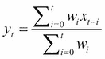

这里， *x [t]* 为输入， *y [t]* 为输出。使用以下公式计算重量:

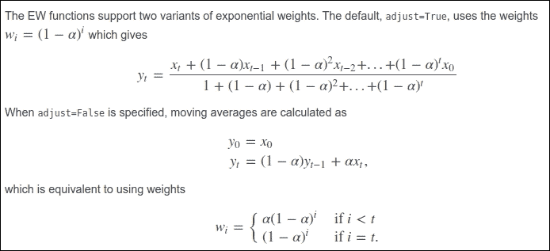

图 2.29:计算 EWMA 体重的方程式

图片来源:[http://pandas . pydata . org/pandas-docs/stable/computation . html #指数加权-windows](http://pandas.pydata.org/pandas-docs/stable/computation.html#exponentially-weighted-windows)

这里，α是平滑常数。如果平滑常数的值高，那么它将接近实际值，如果平滑常数低，那么它将更平滑但是不接近实际值。通常，在统计学中，平滑常数的范围在 0.1 和 0.3 之间。因此，我们可以使用平滑常数生成平滑值。

我们举个工作例子。取平滑常数= 0.3；如果实际值为 100，预测值为 110，则可以使用以下等式获得平滑值，即(平滑常数*实际值)+ (1-平滑常数)*预测值。我们将获得的值是*(0.3 * 100)+(1-0.3)* 110 = 107*。更多信息可以参考[http://pandas . pydata . org/pandas-docs/stable/computation . html #指数加权-windows](http://pandas.pydata.org/pandas-docs/stable/computation.html#exponentially-weighted-windows) 。

我们将在实现修订的方法一节中看到实际的代码级实现。pandas 已经有一个 API，所以我们可以很容易地实现 EWMA。

### 基于逻辑回归的方法

实现逻辑回归算法是一项简单的任务，因为我们只需要使用 scikit-learn API。对于测试数据集，我们将应用对齐和平滑。在评估准确性之后，我们将决定是否需要改变 ML 算法。我们从直觉开始，慢慢地我们改进了方法。我其实不需要解释逻辑回归算法本身，但是在实现过程中，我们会讨论其中的要点。

现在，是时候进入我们修订方法的实施部分了。那么，让我们来看看下一节。

# 实施修订后的方法

在此部分，我们将讨论实施的三个部分，具体如下:

*   履行
*   测试修订后的方法
*   理解修订方法的问题

## 实施

在这里，我们实现了以下内容:

*   对齐
*   缓和
*   逻辑回归

我们已经讨论了方法和关键概念，所以现在我们只关注这里的代码部分。你可以在这个 GitHub 链接找到所有代码:[https://GitHub . com/jalaythanaki/Stock _ Price _ prediction/blob/master/Stock _ Price _ prediction . ipynb](https://github.com/jalajthanaki/stock_price_prediction/blob/master/Stock_Price_Prediction.ipynb)。

### 实施校准

在测试数据集上执行对齐。可以参考下面的代码片段:

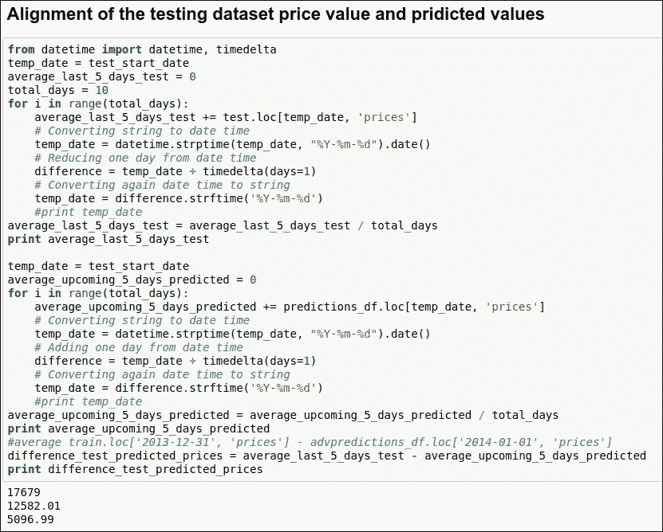

图 2.30:测试数据集上对齐的代码片段

正如您在前面的代码片段中看到的，我们使用过去 5 天的平均价格和预测未来 5 天的平均价格获得了 10 天的差价*调整收盘价*，以便调整测试数据。这里，我们还将日期从字符串转换成日期格式。如您所见，5096.99 是测试预测价格的差异，我们将把它添加到我们预测的*调整收盘价*值中。我们再次生成了图表，因此我们可以很容易地理解对齐方法得到了很好的实现。可以参考下面的代码片段:

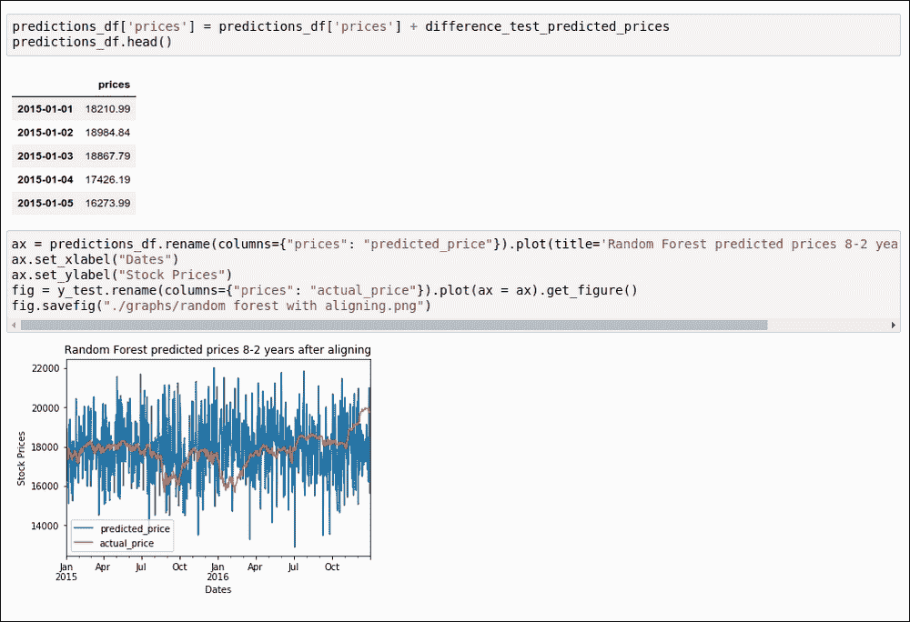

图 2.31:对齐方法的图形代码片段

正如您在前面的代码片段中所看到的，关联图显示我们的测试数据集价格和预测价格是一致的。对齐图的好处是，现在我们可以精确地定义`RandomForestRegressor`没有高精度地完成工作，因为它的性能对于所有数据记录来说都不是很好。排列图给了我们前一次迭代清晰的图像。因此，当我们现在训练逻辑回归时，我们将使用对齐来评估预测价格。

### 实现平滑

我们正在使用熊猫 EWMA API，使用 60 天的时间跨度和频率时间 *D.* 这个“D”表示我们正在处理数据集中的日期时间格式。您可以在下面的代码片段中看到代码实现:

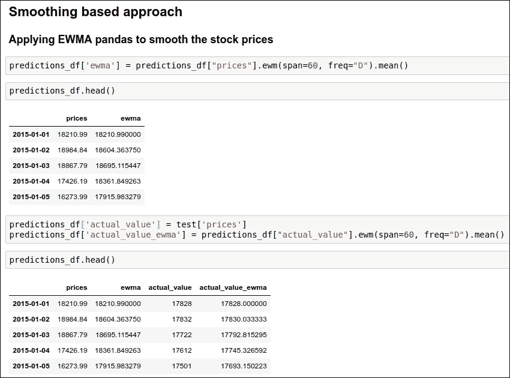

图 2.32:EWMA 平滑的代码片段

我们还将生成一个图表，在该图表中，我们将*预测价格、平均预测价格、实际价格*和*平均实际价格*。可以参考下面的代码和图形:

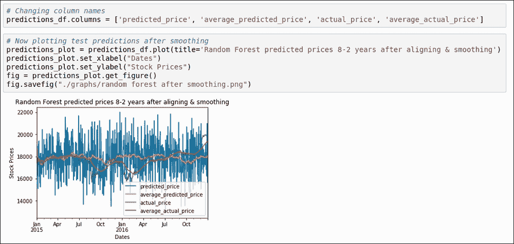

图 2.33:平滑后生成图形的代码片段

在这个图中，你可以看到平滑*平均预测价格后，*曲线跟随*实际价格*趋势。虽然准确度不是很大，但是我们会朝着积极的方向前进。如果我们想要调整我们的算法，平滑技术将对我们有用。*平均预测价格与实际价格可以参考下图:*

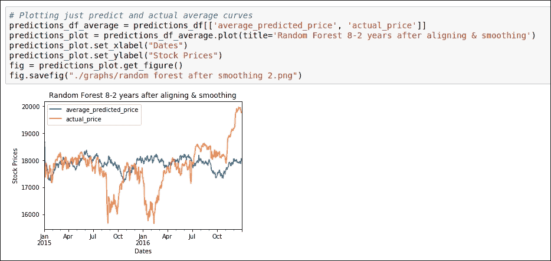

图 2.34:图表的代码片段，表示平均预测价格与实际价格的对比

通过参考前面的图表，我们可以指出我们应用了对齐和平滑，因为它有助于为下一次迭代调整我们的 ML 模型。

### 实施逻辑回归

在这个部分，我们将实现逻辑回归。看一下下面的截图:

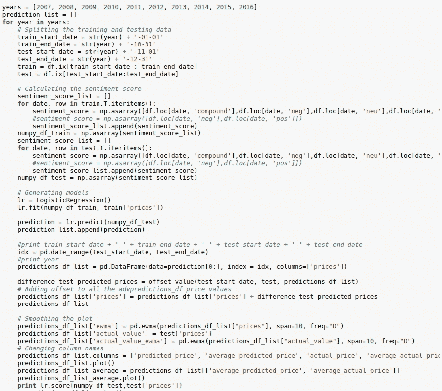

图 2.35:逻辑回归的代码片段

这里，我们使用逻辑回归 ML 算法再次训练了模型。我们还实现了测试数据集的对齐和平滑。现在，让我们评估逻辑回归模型。

## 测试修订后的方法

我们已经检验了逻辑回归模型。您可以参考图表形式的可视化，显示这种修改的方法肯定优于*randomforestregressor(无对齐和平滑)，*，但它并未达标:

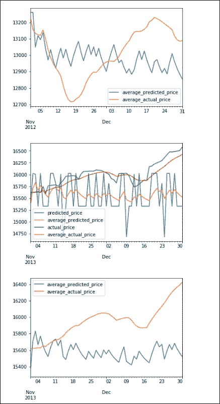

图 2.36:年度预测图

正如您在前面的截图中看到的，我们已经为*逻辑回归*生成了一个年度图表；使用这个模型，我们可以看到一个微小的改进。我们也使用了对齐和平滑，但它们并不太有效。

现在，让我们讨论一下这个修改后的方法有什么问题，然后我们就可以实施最佳方法了。

## 用修改后的方法理解问题

在本部分，我们将讨论为什么我们修改后的方法没有给我们带来好的结果。ML 模型不起作用，因为数据集没有被归一化。第二个原因是，即使在对齐和平滑之后，*RandomForestRegression*ML 模型也面临过拟合问题。对于最佳方法，我们需要处理标准化和过度拟合。我们可以使用基于神经网络的 ML 算法来解决这个问题。所以在我们的最后一次迭代中，我们将开发出能给我们最好精度的神经网络。

# 最佳方法

在这里，我们将要实现基于神经网络的算法**多层感知器** ( **MLP** )。可以参考下面的代码片段:

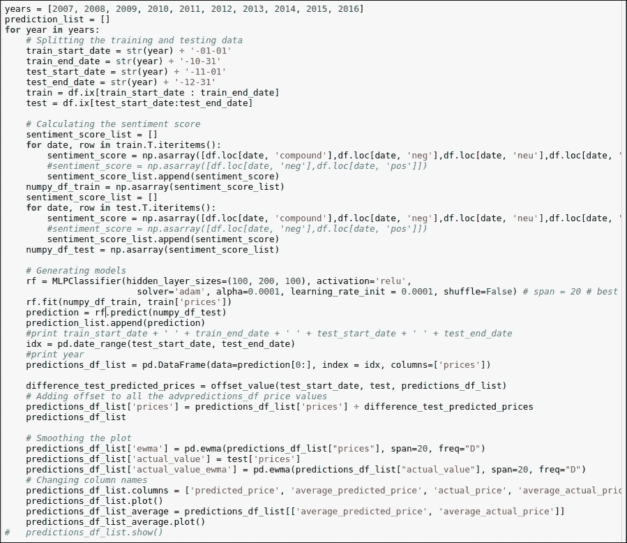

图 2.37:多层感知器的代码片段

这里你可以看到我们使用的是 Relu 激活函数，梯度下降解算器函数是 ADAM。我们使用 0.0001 的学习率。您可以通过参考下图来评估结果:

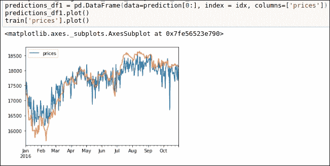

图 2.38:为实际价格和预测价格生成图表的代码片段

此图显示所有数据记录的预测价格都遵循实际价格模式。你可以说我们的 MLP 模型很好地预测了股票市场价格。你可以在这个 GitHub 链接找到代码:[https://GitHub . com/jalaythanaki/Stock _ Price _ prediction/blob/master/Stock _ Price _ prediction . ipynb](https://github.com/jalajthanaki/stock_price_prediction/blob/master/Stock_Price_Prediction.ipynb)。

# 总结

在本章中，你学习了如何预测股票价格。我们讨论了在这方面可以帮助我们的不同机器学习算法。我们尝试了随机森林回归、逻辑回归和多层感知器。我们发现多层感知器工作得非常好。我真的想讨论一些超出我们目前所做的事情。如果你的印象是，使用新闻情绪分析和预测方法，我们现在可以百分之百准确地预测股票市场价格，那么你就错了。我们无法百分之百准确地预测股票价格。许多社区、金融组织和学术研究人员都在朝着这个方向努力，以便建立一个高度准确的股票市场价格预测模型。这是一个活跃的研究领域。

因此，如果你对研究和自由职业感兴趣，那么你可以加入一些非常酷的社区。有两个社区非常受欢迎。其中之一就是量子乌托邦([https://www.quantopian.com/](https://www.quantopian.com/))。在这个社区中，你可以提交你的股票价格预测算法，如果它优于其他竞争对手的算法，那么你将赢得一个现金价格，如果你获得了你的算法的许可，那么你将从通过你的许可算法完成的交易中获得一些利润。第二个社区是 numer . ai(【https://numer.ai/】)。这个社区类似于 quantopian。因此，这种应用的可能性是无限的。两个社区都提供了一些很棒的教程。所以尝试一些不同的东西，希望你会想出一个伟大的算法。

在下一章，我们将挖掘零售或电子商务领域，并尝试找出一些关于用户行为数据集和用户社交足迹的有趣事实。这将有助于我们了解该公司应该如何改变他们的网站或网站上的一些功能。电子邮件营销活动进展顺利的可能性有多大？哪种类型的用户会对这一营销活动做出回应？继续看这本书！我们将在下一章讨论所有这些事情。