    

# 四、电子商务推荐系统

在前三章中，我们已经介绍了许多可以用来构建各种类型的分析产品的技巧和诀窍。在这一章中，我们将为电子商务领域构建一个推荐引擎。让我们回顾一下推荐系统的一些背景。然后，我们将在本章中讨论我们试图解决的问题陈述。

让我们从现实生活中举一个相关的例子。我们几乎每天都在 YouTube 上浏览视频，对吗？假设你昨晚在 YouTube 上看到了一些与摇滚音乐相关的视频。今天早上，当你打开你的 YouTube 时，你可能会发现有几个推荐的 YouTube 频道有很好的摇滚音乐视频。YouTube 其实是根据你的观看习惯来改变它的建议的。你想知道算法是如何工作的吗？让我们再举一个可能对本章有用的例子。我们大多数人从各种电子商务网站上买东西。假设你正试图从亚马逊购买一本书。当你搜索一本书的时候，会有一个部分推荐相同类型的其他书。这一节的标题是*买了这个物品的顾客也买了*；你可能会发现这些建议很有用，也可以再买一本书。看一下下面的截图:

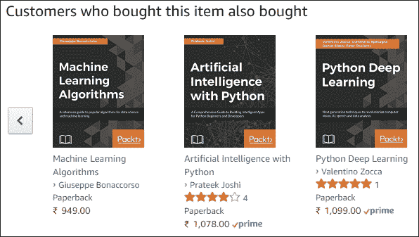

图 4.1:亚马逊上的书籍建议

你在电子商务网站上找到的所有这些建议都使用了一种特定的算法，而这种算法被称为推荐算法。这一章是关于如何使用不同类型的机器学习(ML)算法来构建推荐系统。除了电子商务之外，还有许多领域使用了推荐系统；例如，网飞和 YouTube 使用推荐算法来推荐我们可能喜欢的视频，Airbnb 根据我们在他们网站上的活动提供推荐。零售银行领域也使用推荐引擎的逻辑向他们的客户提供各种类型的信用卡和优惠。这个列表是永无止境的，所以现在让我们来学习如何建立一个推荐系统。

在本章中，我们将讨论以下主题:

*   介绍问题陈述
*   了解数据集
*   构建基线方法:

    *   了解基本概念
    *   实施基线方法
    *   了解测试矩阵
    *   测试基线方法的结果
    *   基线方法的问题
    *   优化基线方法

*   构建修订方法:

    *   实施修订方法
    *   测试修订方法
    *   修订方法存在的问题
    *   了解如何改进修订方法

*   最佳方法:

    *   理解关键概念
    *   实施最佳方法

*   摘要

因此，让我们讨论问题陈述，并从推荐系统的基本概念开始。

# 介绍问题陈述

如你所知，在这一章中，我们试图建立一个推荐系统。主要使用推荐系统的一个领域是电子商务。因此，在我们的推荐引擎的基本版本中，我们将构建一个算法，它可以根据产品的类别来建议产品的名称。一旦我们知道了推荐引擎的基本概念，我们将构建一个推荐引擎，它可以像亚马逊网站一样推荐书籍。

我们将构建三个版本的推荐算法。基线方法简单而直观，因此读者可以了解推荐算法到底能够做什么。基线很容易实现。在第二和第三种方法中，我们将使用 ML 算法构建图书推荐引擎。

让我们来看看用于构建推荐系统的基本方法或途径。您可以在下图中找到两种主要方法:

图 4.2:推荐引擎的方法

我们将使用这两种方法，尽管还有其他方法，如基于知识的方法或混合方法。但是在这一章中，我们将集中讨论给出的两种方法。

现在，让我们看看我们将要使用的数据集。

# 了解数据集

在本章中，我们使用两个数据集，如下所示:

*   电子商务项目数据
*   图书交叉数据集

## 电子商务项目数据

该数据集包含取自实际库存单位(SKU)的数据项。它来自一个户外服装品牌的产品目录。我们正在为这个户外服装品牌的产品目录构建推荐引擎。您可以使用以下链接访问数据集:[https://www.kaggle.com/cclark/product-item-data/data](https://www.kaggle.com/cclark/product-item-data/data)。

这个数据集包含 500 个数据项。数据集中有两列。

*   **ID** :该列表示数据项的索引。通俗地说，就是数据集的序号。
*   **描述**:这个专栏有所有关于产品的必要描述，我们需要使用这些数据来构建推荐引擎。

可以参考下图:

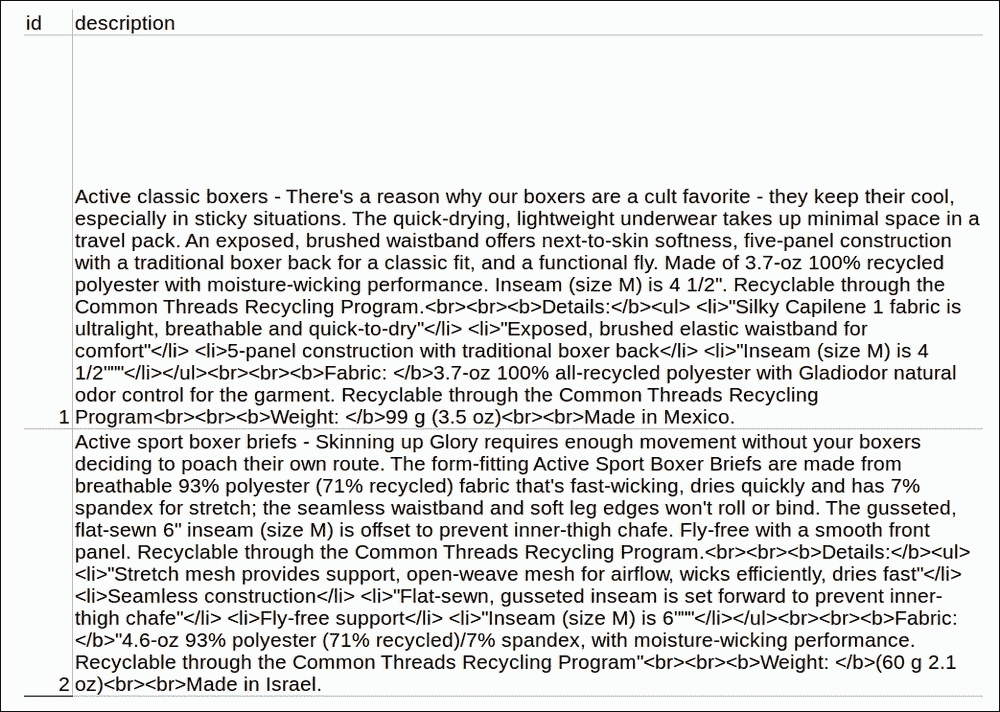

图 4.3:电子商务商品数据片段

正如您所看到的，description 列有文本数据，我们需要处理这个文本数据集，以便构建推荐引擎。现在让我们转到下一个数据集。

## 跨书数据集

图书交叉数据集被广泛用于构建推荐系统。你可以在 http://www2.informatik.uni-freiburg.de/~cziegler/BX/找到它。该数据集有以下两种格式:

*   SQL 转储
*   CSV 转储

我们使用数据集的 CSV 转储。两种格式都有三个具有不同数据属性的表格。这三个文件的名称如下:

*   `BX-Book-Ratings.csv`
*   `BX-Books.csv`
*   `BX-Users.csv`

让我们研究一下每个数据表中给出的数据。

### BX-图书-收视率. csv

该 CSV 文件包含与该书的评级相关的数据。该表包含三个数据属性，如下所示:

*   **User-ID** :该数据属性表示唯一的用户 ID。该列有一个数值。用户 ID 的长度是六位。
*   **ISBN**:ISBN 的全称是国际标准书号。该数据属性指示图书的唯一标识号。
*   **图书评分**:该数据属性表示用户对图书的评分。这本书的等级从 0 到 10 不等。0，0 表示升值较少，10.0 表示升值最高。

### BX-Books.csv

这个文件包含了关于这些书的所有细节。表格包含以下数据属性:

*   **国际标准书号**:国际标准书号用于识别图书。所有无效的书号已经被删除。该数据表仅包含有效的 ISBNs。
*   **Book-Title** :该数据属性包含图书的名称。
*   **图书作者**:该数据属性包含图书作者的姓名。
*   **出版年份**:表示图书出版的年份，格式为 YYYY。
*   **出版商**:这个数据列有出版这本书的出版商的名字。
*   **Image-URL-S** :这个数据属性有图书封面图片的 URL。s 表示封面图像尺寸较小。
*   **Image-URL-M** :这个数据属性有图书封面图片的 URL。m 表示封面图像的中等尺寸。
*   **Image-URL-L** :这个数据属性有图书封面图片的 URL。l 表示封面图像尺寸较大。

现在我们来看看前面数据表的细节。

### BX-用户. csv

这是跨书数据集的第三个数据表。该文件包含用户信息。

这个特定的数据文件包含以下数据属性:

*   **User-ID** :该数据列表示用户 ID，为六位整数。
*   **位置**:该数据是关于用户的人口统计细节的一部分。位置表示城市的名称和缩写。并非所有用户的位置详细信息都可用，因此您将找到那些位置尚未找到的用户的`null` 值。
*   **年龄**:这也是一个人口统计学数据点。如果用户的年龄被跟踪，那么它存在于数据集中；如果不是，那么年龄的值就是`null`。

我们已经收集了关于这两个数据集的基本信息。我们将致力于构建推荐引擎的基本版本。

# 建立基线方法

从这个部分开始，我们将关注如何构建推荐引擎的基本版本(这意味着本章上下文中的推荐系统)。为了开发基线方法，我们将使用基于内容的方法。这些是我们将要讨论的主题:

*   理解基本概念
*   实施基线方法
*   了解测试矩阵
*   测试基线方法的结果
*   基线方法的问题
*   学习基线方法的优化技巧

不浪费任何时间，让我们看看如何使用基于内容的方法来构建推荐引擎。

## 理解基本概念

正如我前面提到的，我们使用的是基于内容的方法。你一定想知道这是什么方法，我是如何决定使用它的。为了找到这些问题的答案，我们需要先了解方法，然后才能讨论我为什么选择它。

### 了解基于内容的方法

这个算法背后的直觉很简单。如果您正在购买或对某一类型的商品感兴趣，那么您可能也会喜欢类似的产品。我们举个例子。如果你正在买一条牛仔裤，那么很有可能你也会喜欢买 t 恤或上衣，以及正式的裤子或其他类型的裤子。基本上，对产品的推荐是基于你已经探索、购买或感兴趣的内容。当每个项目的上下文和属性可以很容易地确定时，这种方法很有效。这种推荐系统用于向用户推荐视频和音频内容。

当你在 YouTube 上观看一个喜剧视频时，你可能会注意到有其他搞笑片段和喜剧视频的建议。这是因为根据你的观看和浏览历史，你很有可能会喜欢类似的内容。你可以借助下图来理解这个例子:

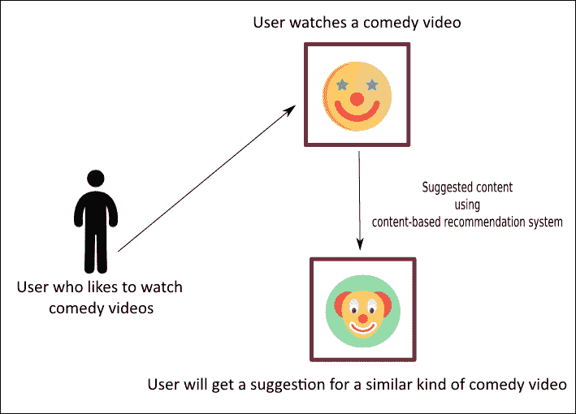

图 4.4:基于内容的方法思想的图示

所以，当我们需要建立一个可以推荐与用户购买模式或浏览模式相似的物品或产品的系统时，我们使用这种方法。选择这种方式的原因是这种类型的推荐不受其他用户选择的影响。这将为用户提供个性化的体验。推荐完全基于用户喜欢的项目及其特性。这种方法有助于电子商务公司事半功倍地增加销售额。它需要更少的手动工作，这是这里值得注意的一点。也可以用电商平台新推出的产品。

为了实现这种方法，我们需要关注它的架构部分，并了解基本概念，如 TF-IDF 和余弦相似性。我们将在下一节探讨所有这些主题。

## 实施基线方法

在这个部分，我们将设计基于内容的推荐系统的架构。之后，我们将看看如何构建一个简单的推荐系统。因此，我们将在这里讨论两个副主题:

*   推荐系统的体系结构
*   实施基线方法的步骤

### 推荐系统的架构

在这个部分，我们将介绍基于内容的推荐系统的基本架构。请参考下图，该图更详细地解释了这些组件:

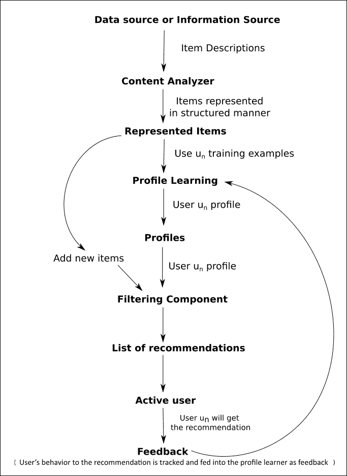

图 4.5:基于内容的推荐系统的架构

如您所见，为了构建推荐系统，我们需要使用许多组件。我们使用数据源或信息源来存储关于商品或产品的详细信息。内容分析器将项目描述转换成某种格式，以便推荐引擎可以使用这些信息。我们有所有的产品或项目相关的信息。现在我们需要知道用户在电子商务平台上浏览、购买或搜索什么。该用户相关信息被用作推荐系统的训练示例。这些训练示例是简档学习模块的输入，该模块实际分析年龄、性别、在网站上花费的时间，以及其他人口统计和基于用户活动的信息。

这些收集的信息将被传递给过滤组件。基于电子商务平台上可用的产品的信息和用户的活动，我们将向客户推荐商品列表。

这里介绍了推荐引擎的逻辑。我们会把推荐推送给电商平台的活跃用户。在这里，活跃用户是指那些在上个月购买了该产品或更频繁地浏览该平台的用户。我们需要跟踪用户的活动，作为推荐引擎的反馈。

在反馈中，我们可以跟踪用户在推荐列表中点击的项目数量。他们是否购买了推荐列表中的任何商品？这种反馈是有用的，因为基于这种反馈，我们可以微调推荐引擎的逻辑。我们会将反馈发送给个人资料学习者，并利用这一点，我们将更新每个用户的兴趣区，以便将来我们可以给他们更多关于运动服的建议，如果这个人以前浏览过运动鞋的话。现在您已经理解了组件及其工作方式，让我们来看一下基线方法的一步一步的实现。

### 实施基准方法的步骤

在这个部分，我们将介绍基本推荐引擎的编码。可以用这个 GitHub 链接参考代码:[https://GitHub . com/jalajthanaki/Basic _ Ecommerce _ recommendation _ System](https://github.com/jalajthanaki/Basic_Ecommerce_Recomendation_System)

这些是我们需要遵循的步骤:

1.  加载数据集
2.  使用 TF-IDF 余弦相似性矩阵生成特征
3.  生成预测

#### 加载数据集

我们在这里使用的是电子商务商品数据集。在这个数据集中，有一个我们需要使用的项目描述。我们将使用`pandas` 库来加载数据集。可以参考以下截图:

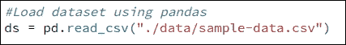

图 4.6:加载数据集的代码片段

#### 使用 TF-IDF 生成特征

我们将使用 TF-IDF 的概念，这是一种简单而有效的统计特征技术。TF-IDF 代表术语频率-逆文档频率。我简单解释一下。

TF-IDF 由两部分组成:词频和逆文档频。让我们从词频开始。这个术语是不言自明的，但是我们无论如何都要浏览这个概念。术语频率表示每个单词在文档或数据集中出现的频率。TF 的计算公式如下:

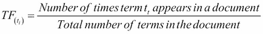

图 4.7:TF 方程

现在我们来谈谈逆文档频率。IDF 表明该词对文档的重要性。这是因为当我们计算 TF 时，我们对每个单词都给予同等的重视。如果单词*更频繁地出现在数据集中，那么它的词频(TF)值很高，但是该单词对于文档来说并不重要。如果单词*和*在文档中出现 100 次，那么这意味着与数据集中不太频繁的单词相比，它没有携带那么多信息。因此，我们需要定义一些常用词的权重，同时增加不常用词的权重，这决定了每个词的重要性。我们将通过使用以下公式中给出的等式来实现这一点:*

*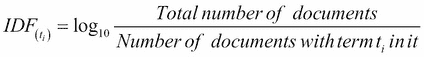

图 4.8:IDF 的等式* 

*因此，计算 TF-IDF 的最终公式如下:*

*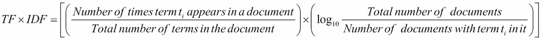

图 4.9:TF-IDF 方程* 

*如果你想详细看这个，那么我会推荐你从这本书里看这个题目:[第五章](ch05.xhtml "Chapter 5. Sentiment Analysis")， *Python 自然语言处理*。为此，你可以参考这个链接:[https://www . packtpub . com/big-data-and-business-intelligence/python-natural-language-processing](https://www.packtpub.com/big-data-and-business-intelligence/python-natural-language-processing)*

*这个概念的实际实现相当容易。我们使用 scikit-learn 库对此进行编码。可以参考以下截图:*

*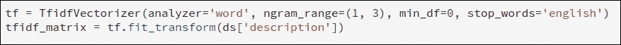

图 4.10:使用 TF-IDF 生成特征的代码片段* 

*这里，我们使用了`TfidfVectorizer` API，并为项目描述生成了 TF-IDF 向量。我们已经使用`stop_words`参数删除了英文停用词。这里，我们提供了从 1 到 3 的`ngram_range`。现在让我们建立余弦相似矩阵。*

#### *构建余弦相似矩阵*

*在本节中，我们将构建余弦相似度矩阵，这实际上是构建基于内容的推荐引擎所需的主要步骤。该矩阵表明一种产品的描述与另一种产品的描述有多相似。这里，我们将检查所有产品的 TF-IDF 向量之间的余弦相似性。我们需要找到两个 TF-IDF 向量之间的角度。这个角度表示 TF-IDF 矢量之间的距离。为此，我们需要通过使用以下等式来获得 TF-IDF 向量之间的点积:*

*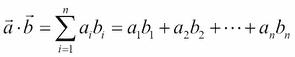

图 4.11:点积方程* 

*现在，借助于给定的余弦方程，我们可以生成这些向量之间的角度。可以参考下面公式中的等式:*

*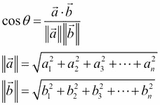

图 4.12:余弦相似性方程和向量范数* 

*现在让我们看一个基本的例子，这样你就能理解它背后的基本数学原理。为此，您需要参考以下等式:*

*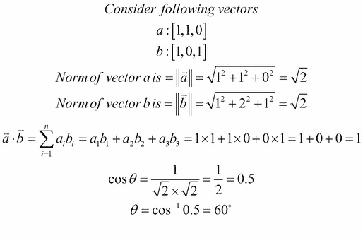

图 4.13:基本余弦相似性示例* 

*正如你在上图中看到的，有两个向量；每一个都有三个要素。首先，我们计算它们的范数，然后对它们执行点积。之后，我们使用余弦相似性公式，找到这些向量之间的角度。注意，我们可以测量两个非零向量的余弦相似性。余弦角的间隔为*【0，2π】*。*

*这方面的编码实现非常简单。可以参考下面截图中显示的代码片段:*

*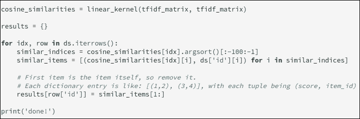

图 4.14:生成余弦相似度的代码片段* 

*这里，我们已经将所有的推荐存储在一个字典中，字典中已经存储了每个项目及其对应的推荐。我们的数据集中有 500 个项目，对于每一个项目，我们都生成了一个可以推荐给用户的项目列表。现在是生成预测的时候了。*

#### *生成预测*

*在本节中，我们将为给定的`item_id`生成推荐列表。我们需要通过从 1 到 500 的任何一个`item_id`。系统将获得五个不同的建议，它们被称为推荐项目。这些推荐的项目类似于我们已经将其`item_id`传递给算法的项目。您可以在下面的屏幕截图中看到代码片段:*

*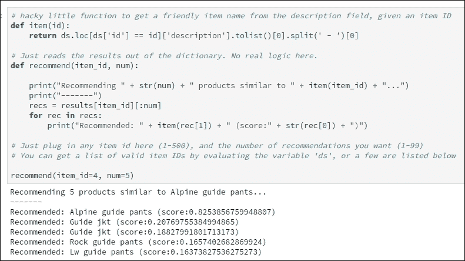

图 4.15:用于生成预测的代码片段* 

*如您所见，我们从字典中检索结果。我们已经打印了 cos θ的值作为我们的得分值。如果分数接近 1，那么可以说这些项目更相似，并且用户喜欢该推荐的可能性更高。如果分数更接近 0 或-1，那么项目对用户的吸引力就更小。所以只需要注意，在这里，分数表示 cos θ的值，而不是直接表示角度。*

*现在让我们看看测试矩阵，它可以帮助我们评估这种方法以及我们将在本章中实现的其他方法。*

## *了解测试矩阵*

*在本节中，我们将探索基于内容的推荐引擎的测试或发展矩阵。在这里，余弦相似度分数是对我们最大的测试分数。这是因为在该分数的帮助下，我们可以很容易地了解该算法是否可以建议余弦相似性分数接近 1 接近 0 的项目。*

*对于某些项目，我们将获得接近 1 的分数，而对于其他项目，我们将获得接近 0 的分数。因此，我们需要关注这个余弦值，以便了解推荐引擎做得是好是坏。可以参考下图:*

*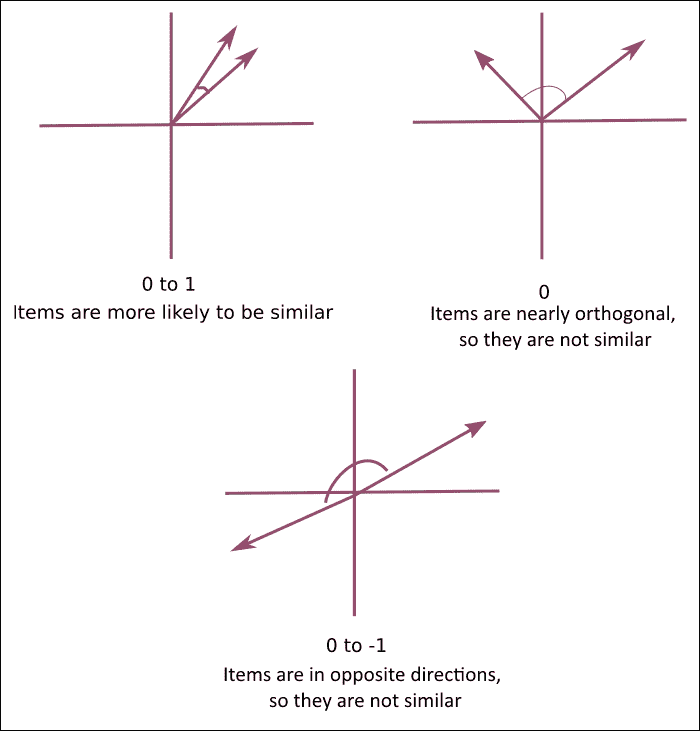

图 4.16:对余弦相似度分数和角度的理解* 

*正如我们可以在前面的图中看到的，我们需要使用余弦分数来测试这种方法。我们可以执行以下步骤进行测试。我们需要计算超过一定分数的项目的数量，这意味着我们可以决定余弦相似性分数的阈值，并计算推荐引擎建议的超过该阈值的项目的数量。我给你举个例子。假设我们决定 0.15 的截止分数。在这种情况下，所有余弦值在 0.15 以上的项目都被认为是好的推荐。这里的技巧是，您需要试验这个阈值，因为根据用户的活动，您可能会在以后更改它。这个参数对我们来说将是一个可调参数。在下一节中，我们将看看测试的代码。*

## *测试基线方法的结果*

*在这一节中，我们将看看我们如何实现阈值的逻辑。之后，我们将比较不同项目的结果。可以参考下面截图中显示的代码片段:*

*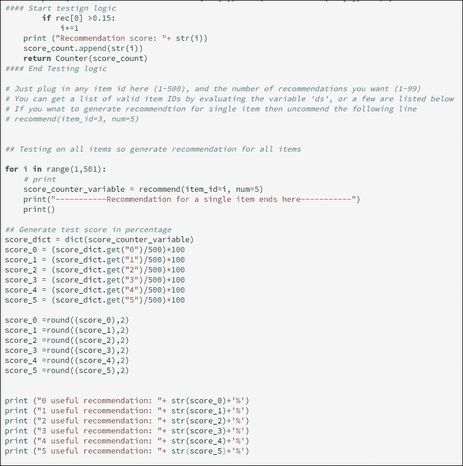

图 4.17:用于测试的代码片段* 

*现在您可以看到不同`item_ids`的结果。你可以找到三项的结果。我随机拿起了`item_id`。看一下下面的截图:*

*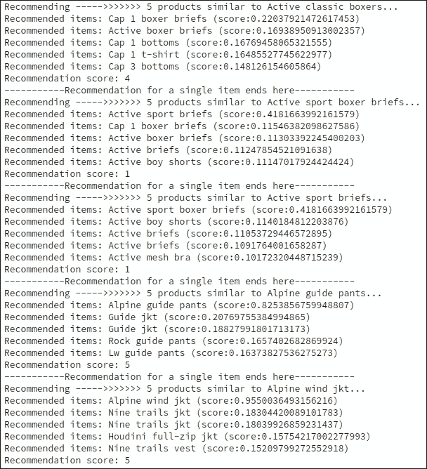

图 4.18:项目的结果* 

*看看下面的代码片段:*

*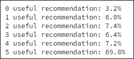

图 4.19:基于有用建议的分析* 

*正如您在前面的图中看到的，这种方法在 69.8%的情况下为我们提供了有用的建议，在 7.2%的情况下提供了四个有用的建议。看完对结果的分析，我们可以说基线方法做得很好，我们肯定可以在另一种方法的帮助下改进结果。*

*在下一节中，我们将讨论这种基线方法存在的问题以及如何解决它们。*

## *基线方法的问题*

*在本部分，我们将讨论基线方法中的一些问题。我们需要了解这些问题，以便在修订后的方法中处理它们。这种方法的问题如下:*

*   ***有限内容分析**:如果我们没有足够的信息来更准确地区分项目，那么推荐引擎将不会给出有用或更精确的建议。*
*   ***过度专门化**:基于内容的系统是基于用户档案和他们正在浏览的项目，所以如果用户一次又一次地浏览同样的东西，他们会得到同样的建议。用户找不到不同的或新奇的物品。这是不好的，因为如果我们更频繁地提供相同的推荐，那么对用户来说就没有惊喜的成分，他们也不会有购买的动机。这个问题叫做过度专业化。*
*   ***新用户**:如果有一个新用户正在探索电子商务平台，而我们关于该用户的信息非常有限，那么我们最初无法给他们一个好的推荐。这种情况的发生是由于缺乏一个坚实的轮廓。*

*前面所有的问题都是基于内容的推荐引擎。为了解决这些问题，我们可以尝试一些其他的方法。与此相关的细节将在下一节给出。*

## *优化基线方法*

*在这里，我们将概述如何解决我们在上一节中遇到的问题。在基线方法中，我们基本上依赖于用户简档和项目描述，但是这种方法结果并不好。为了改善这一点，我们将使用两种方法。在修订后的方法中，我们将使用基于修正的方法。之后，我们将尝试基于协同过滤的方法。*

*这种基于相关性的方法依赖于用户的活动，而不依赖于项目的内容或描述。这有助于我们解决新用户、过度专业化和内容分析有限的问题。我们使用相关系数来构建推荐引擎。这是一个非常有用的简单统计技术。当我们开始构建修改后的方法时，将描述对实现很重要的基本概念。*

*因此，让我们建立一个修正的方法。*

 *# 构建修订的方法

在这个迭代中，我们将使用一个叫做相关性的统计概念来构建推荐引擎。我们将关注用户的活动和选择是如何相互关联的。我们试图从用户在电子商务平台上的活动和行为中发现模式。

这里，我们将使用图书交叉数据集。构建推荐系统的一个关键参数是图书评级属性。我将解释这些概念以及实现部分，这样你会很容易理解。

## 实施修订后的方法

为了实施修订后的方法，我们需要执行以下步骤。可以参考 GitHub 上的代码:[https://GitHub . com/jalaythanaki/Book _ recommendation _ system/blob/master/correlation _ based _ recommendation _ system . ipynb](https://github.com/jalajthanaki/Book_recommendation_system/blob/master/correlation_based_recommendation_system.ipynb)

1.  加载数据集
2.  **图书评级数据文件的探索性数据分析** ( **EDA** )
3.  探索图书数据文件
4.  用户数据文件的 EDA
5.  实现推荐引擎的关联逻辑

### 加载数据集

作为第一个步骤，我们将使用`pandas` 库来加载我们的图书交叉数据集。正如您已经知道的，这个数据集有三个数据文件。我们正在装载它们。可以参考下面的代码片段:

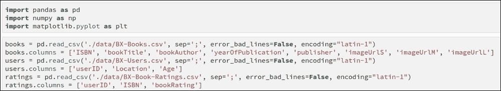

图 4.20:加载数据的代码片段

我们的数据分隔符是分号，我们使用 latin-1 作为编码。我们定义了三个`pandas` 数据帧。

现在让我们跳到下一步，这是所有三个数据文件的 EDA 步骤。

### 图书评级数据文件的 EDA

对于该数据文件，我们已经生成了评级数据帧。我们需要知道这个数据文件具有什么样的数据分布。这意味着我们需要检查有多少本书得到了满分 10 分，有多少本书得到了满分 5 分，以及有多少本书根本没有任何评级。请参考下面的代码片段来为我们生成这些信息:

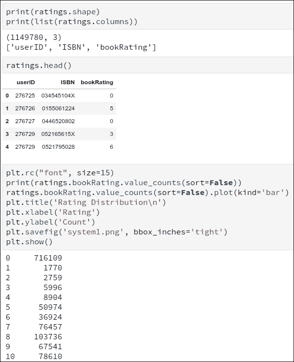

图 4.21:图书评级数据文件的 EDA 的代码片段

您可以在下图中找到条形图:

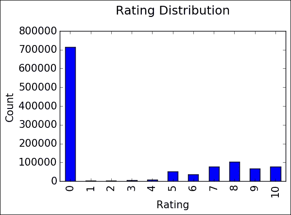

图 4.22:图书评分分布条形图

正如我们所看到的，有 716109 本书的评分为零，而有 103736 本书的评分为八。基于这个分析，我们可以推断有很多书的评分是零，所以这里的数据分布是有偏差的。我们需要记住这一点。

### 探索图书数据文件

在这个部分，我们将执行图书数据文件的 EDA。我们还需要检查数据属性并格式化数据。对于这个数据文件，不需要应用其他技巧。看看下面截图中的代码片段:

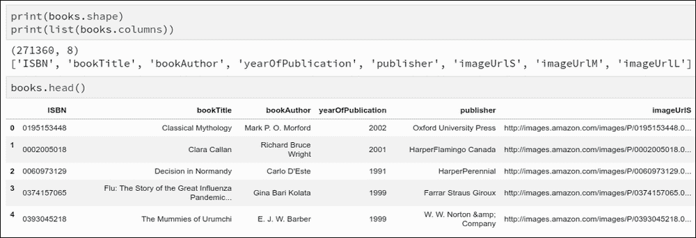

图 4.23:探索图书数据文件的代码片段

您可以看到我们已经检查了 book 数据文件的形状和列列表。为了构建推荐引擎，我们不需要考虑太重要的事情。

### 用户数据文件的 EDA

这里，我们需要来执行用户数据文件的分析。这个数据文件很重要，因为我们将经常使用它来推导这种方法的一些重要事实。首先，我们需要获得年龄分布。年龄分布是我们在构建推荐系统时的关键数据点之一，因为相似年龄组的用户具有相似的阅读模式，如果我们获得了这种模式，那么我们可以为我们的用户生成更有效的推荐。可以参考下面截图中显示的代码片段:

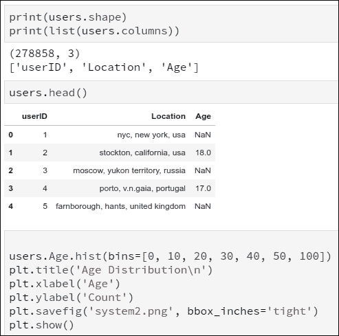

图 4.24:生成年龄分布的代码片段

可以参考箱线图，箱线图表示如下图所示的年龄分布:

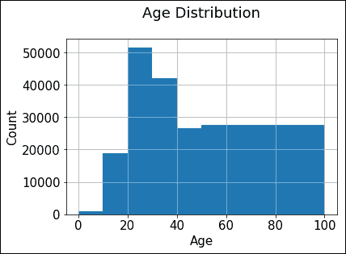

图 4.25:年龄分布的箱形图

基于这种分布，我们可以得出这样一个事实，即大多数用户的年龄在 20 到 40 岁之间。因此，如果我们关注他们的阅读和浏览模式，那么我们的工作将变得更容易。

### 实现推荐引擎的关联逻辑

在这一部分，我们将介绍推荐引擎的核心逻辑。逻辑可以分为两部分:

*   基于书籍评级的建议
*   基于相关性的建议

所以我们开始吧！

#### 基于书籍评级的推荐

为了建立一个基于图书评分的图书推荐系统，所有评分都由读者提供。因此，为了实现这种方法，我们将提取评分最高的前五本书，这意味着我们需要从读者那里获得评分最高的书的列表。下图显示了其代码片段:

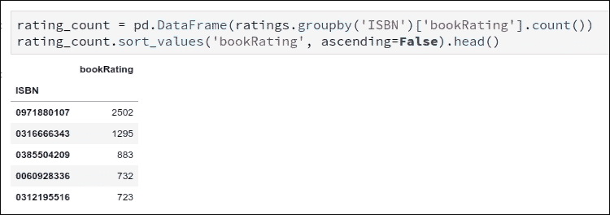

图 4.26:根据图书评分生成前五本书的代码片段

我们已经生成了图书评分排名前五的图书的 ISBN，但是我们还需要检查这些图书的名称以及每本书的平均评分。您可以通过合并图书和图书评级数据框来查找图书的名称。你可以在下面的截图中看到代码:

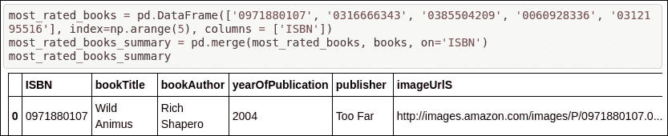

图 4.27:生成前 5 本书名称的代码片段

现在，您可能想知道这种方法的好处是什么。让我告诉你，我们有一个根据图书评级降序排列的图书列表。如果用户根据这本书的评级来购买这本书，那么我们可以推荐其他具有相同评级的书。这样，用户得到的建议比以前的方法更准确。

如果你看看前五本书的结果，那么你会知道最高评级是针对里奇·沙佩罗的书`Wild Animus`。这五本书都是小说。如果有人想买`Wild Animus`，那么用户也可以买`The Lovely Bones: A Novel`。这就是这种方法有意义的原因。

现在我们来看看基于相关性的推荐引擎。

#### 基于相关性的建议

我们使用双变量相关性和**皮尔逊相关系数** ( **PCC** )。这也被称为`Person's r`。这种相关性提供了两个变量`a and b`之间线性校正的测量。这里，我们考虑两本书的评级，并对它们应用 PCC 技术。人的`r` 值在`+1` 到 `–1`的范围内。该相关值的解释如下:

*   **+1** :该值表示总的正线性相关。这意味着如果变量 1 的值增加，那么变量 2 也会增加。
*   **0** :该值表示没有线性相关性。这意味着这两个变量不相关。
*   **-1** :该值表示总体负线性相关。这意味着如果变量 1 的值增加，那么变量 2 就减少。

PCC 的公式如下式所示:

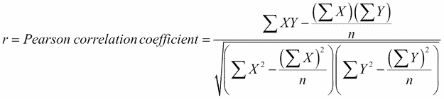

图 4.28:PCC 或人的 r 的等式

让我们考虑一个简单的数学例子，这样你就知道我们是如何计算人的 r 的。让我们看一下下面的等式:

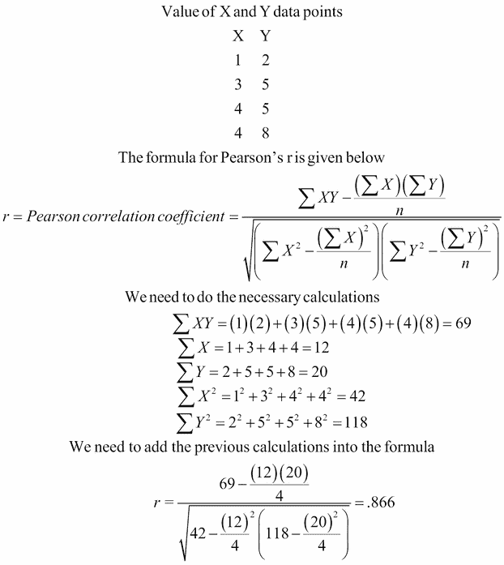

图 4.29:个人简历的数学示例

### 注意

注意:我们正在考虑这两本书的评级，以便找到它们之间的相关性。

首先，我们需要获得所有书籍的平均评级。下面的截图中给出了代码片段:

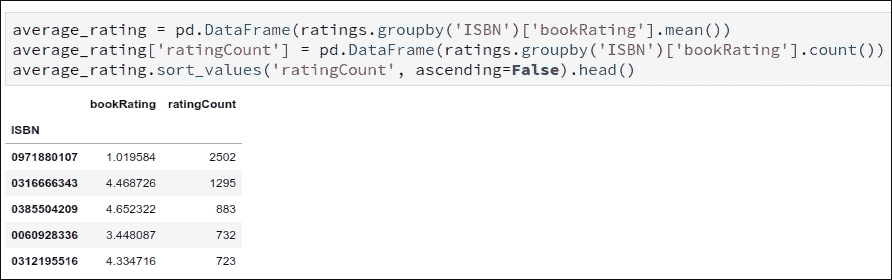

图 4.30:生成图书平均评分的代码片段

请注意，获得最多评分的书并不是那些评分很高的书。这意味着有些书的读者更经常分享他们的反馈，但这并不意味着这些书的评价很高。也许有些书被 100 个用户评分，但这本书的评分是 4.3。这是我需要强调的最重要的一点，因为这是可能出错的地方。为了建立一个更好的系统，我们需要考虑图书评级计数和图书评级分数。

在这里，我们将排除提供少于 200 个评分的用户以及获得少于 100 个评分的书籍。这意味着我们正在设立一个门槛，这样我们就可以建立一个更好的系统。我们可以通过使用下面截图中给出的代码片段来实现这一点:

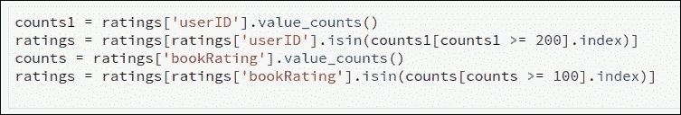

图 4.31:设置考虑用户和图书的阈值的代码片段

现在我们正在将收视率数据框架转换成 2D 矩阵。这个矩阵是一个稀疏矩阵，因为不是每个用户都为每本书提供了评级。你可以在下面的截图中看到代码:

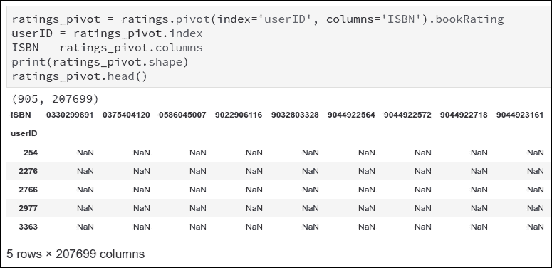

图 4.32:为评级生成稀疏矩阵的代码片段

我们已经完成了一些基本工作，现在是时候找出与排名第二的书*《可爱的骨头:小说》相关的书了。*我想引用这本书的摘要，摘自维基百科:[https://en.wikipedia.org/wiki/The_Lovely_Bones](https://en.wikipedia.org/wiki/The_Lovely_Bones)

> “这是一个少女的故事，她在被强奸和谋杀后，从她的个人天堂看着她的家人和朋友努力继续他们的生活，而她却接受了自己的死亡”。

现在我们需要获得一本书，如果用户想买这本书，可以推荐给他们。下面的截图中给出了可以帮助我们获得推荐的代码:

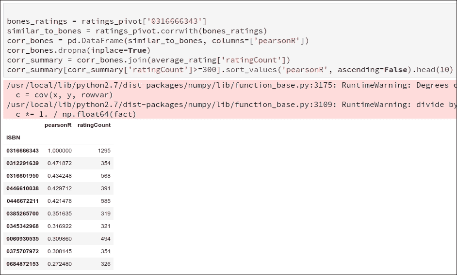

图 4.33:生成基于相关性的推荐的代码片段

在这里，您可以看到我们正在使用一个稀疏矩阵，并且已经应用了`corrwith` API 来生成一个关联。可能会有一些运行时警告。它们与浮点数据类型相关。除此之外，我们还对我们需要的条件进行了编码，以便推荐用户评分超过或等于 300 的书籍。我们使用前面的代码获得了 ISBN。因此，我们还需要获得书籍的名称。为此，我们需要使用下面截图中给出的代码片段:

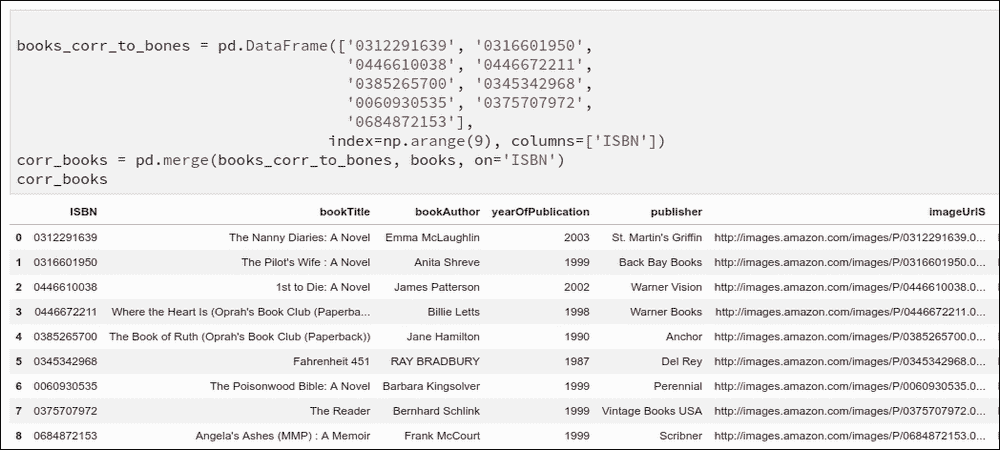

图 4.34:生成书名的代码片段

让我们选出这本书的前三个推荐:*《保姆日记:一部小说*、*《飞行员的妻子:一部小说*、*和《第一次去死:一部小说*。《保姆日记》从孩子的看护者的角度批判了曼哈顿的上层社会。飞行员的妻子:小说是由写《可爱的骨头》的同一个作者写的。《第一个去死》是女性谋杀俱乐部系列的第一本书。

如果你真的看了这三本书的内容，那么我们可以看到所有这些建议都是有道理的。

## 测试修订后的方法

我们已经获得了推荐，如果我们使用这种修改的方法检查推荐的书籍，那么我们会看到这种简单的基于相关性的方法工作得相当好。我们进行了手动测试，并评估了推荐的质量，这些建议对用户来说出乎意料地更加合理和有用。

在下一部分，我们将讨论这种方法存在的问题，以及如何进一步改进这种方法。在实施优化之前，我们需要讨论我们将关注的要点。所以，让我们列出所有的问题或需要改进的地方。

## 修订方法的问题

在此部分，我们需要列出问题或需要改进的地方，以便我们改进修订后的方法。以下是需要改进的地方:

*   基于相关性的方法并不适用于所有情况，因此我们需要一种更复杂的方法。基本上，如果模型在训练期间看到了类似的数据示例，基于相关性的方法表现得非常好。对于看不见的数据示例，它可能不会产生好的结果。
*   我们不能总是做手工测试，所以我们需要一个易于开发、构建和测试的推荐引擎。新的方法还可以适应未来的变化，这意味着新的方法应该易于我们在需要时进行更改或修改。

现在，让我们看看如何改进这种经过修改的方法。

### 了解如何改进修订后的方法

为了改进修改后的方法，我们将使用著名的推荐算法——协同过滤(CF)。我们将使用机器学习(ML)算法 K-最近邻(KNN)。这是我们如何改进修订方法的基本纲要。

在 CF 算法和 ML 算法的帮助下，我们可以很容易地测试算法以及根据我们的要求修改算法。你可能知道 KNN 是如何工作的，所以我们不会深入 KNN 算法的细节，但我们肯定会尝试理解 KNN 算法背后的直觉。我们还将详细了解基于 CF 的推荐引擎是如何工作的，以便在实现过程中您的所有概念都是清楚的。在这些算法的帮助下，我们将建立最好的图书推荐系统。我们将把我们算法的结果与亚马逊进行比较。

在下一节中，我们将首先介绍算法，然后开始实现我们的方法。

# 最好的方法

在这个部分，我们试图建立最好的推荐引擎。本节包括两个部分:

*   理解关键概念
*   实施最佳方法

我们的第一部分涵盖了基本概念，如 CF 和 KNN 算法如何工作，我们需要选择什么样的功能，等等。在第二部分，我们将使用 KNN 和 CF 算法实现推荐引擎。我们将生成准确性分数以及书籍推荐。所以让我们开始吧！

## 理解关键概念

在此部分，我们将了解协同过滤的概念。这涵盖了推荐系统的很多方面。所以，我们来探索一下 CF。

### 协同过滤

协作过滤有两种主要类型如下:

*   基于记忆的 CF:

    *   用户-用户协同过滤
    *   项目-项目协同过滤

*   基于模型的 CF:

    *   基于矩阵分解的算法
    *   深度学习

我们将从基于内存的 CF 开始，然后转向基于模型的 CF。

#### 基于记忆的 CF

基于内存的 CF进一步分为两段。我已经在前面定义了这些部分。参见*介绍问题陈述*部分。在这里，我们需要理解这些概念。我们将从用户-用户 CF 开始，然后研究项目-项目 CF。

##### 用户-用户协同过滤

在用户-用户 CF 中，我们考虑一个特定的用户。现在我们需要找到与我们的特定用户相似的用户。我们通过观察他们对商品的购买模式和评价模式来找到相似的用户。基于评分和购买模式的相似性，我们向相似类型的用户推荐产品。为了了解用户-用户 CF，可以参考下图:

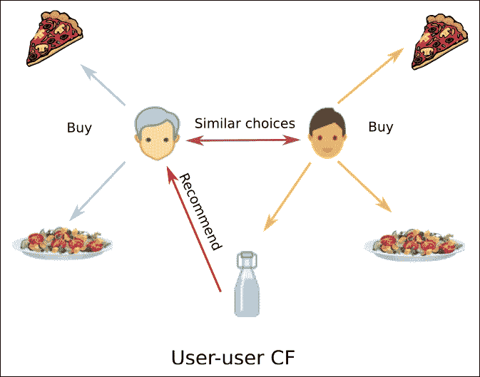

图 4.35:用户-用户 CF 的图示

但是，项目-项目 CF 的工作方式不同。

##### 项目-项目协同过滤

在项目-项目 CF 中，我们考虑项目。我们找到喜欢某个特定商品的用户，以及该用户或类似用户也喜欢并购买的其他商品。因此，我们推荐该商品以及用户正在寻找的特定商品。这里，我们需要将项目作为输入，并生成项目列表作为推荐。可以参考下图:

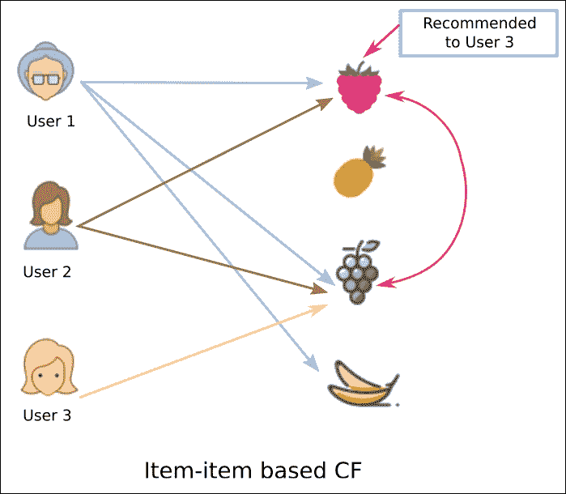

图 4.36:表示项目-项目 CF 的图像

这两种方法可以总结如下:

*   **Item-item CF** :我们考虑喜欢过 x item 和 y 的用户
*   **用户-用户 CF** :我们考虑和你一样，也喜欢 x 和 y 商品的用户

基于记忆的模型使用基于相似性的技术。在这种方法中，没有优化技术，如梯度下降，所以它很容易实现。我们可以使用 KNN 最大似然算法，因为它不使用基于梯度下降的优化策略。因此，在实施过程中，我们将使用 KNN 算法。

KNN 算法背后的思想很简单。我们需要获得每个用户或物品的重量。我们可以通过一个余弦相似度或者一个人的相关系数来生成这个权重。我们使用相似性值，但是我们需要限制相似用户的数量，因为我们不能认为所有用户都相似。这个数目用 K 表示，这里 K 表示我们需要考虑的相似邻居或用户的数目。这就是为什么该算法被称为 K-最近邻(KNN)的原因。如果你想了解更多关于 KNN 算法的细节，那么你可以参考这篇文章:[https://www . analyticsvidhya . com/blog/2018/03/introduction-k-neighbors-algorithm-clustering/](https://www.analyticsvidhya.com/blog/2018/03/introduction-k-neighbours-algorithm-clustering/)

#### 基于模型的 CF

在这个方法中，我们将使用基于 ML 的技术来预测对用户的推荐，尤其是那些未评级的项目。为此，我们可以使用矩阵分解方法或基于深度学习的方法。这里重点讲一下矩阵因式分解法。

那么，我们来看看矩阵分解。

##### 基于矩阵分解的算法

基于矩阵分解的算法背后的主要思想是用户的偏好可以通过矩阵运算来确定。我们需要定义少量隐藏或潜在的因素。我们可以把这个矩阵称为因子或嵌入。让我们举个例子来更好地理解它。

我们需要定义嵌入矩阵。这里，值被随机初始化，然后我们执行这个嵌入矩阵和图书嵌入矩阵的点积。结果矩阵是以这样一种方式生成的，即我们可以预测哪本书可以推荐给哪个用户。对于矩阵分解，我们需要结果矩阵中的非负元素。我们将使用奇异值分解(SVD)模型来识别潜在因素。也可以使用其他一些技术，比如概率矩阵分解、非负矩阵分解等等。我们将实现这种矩阵分解技术。

##### 基于内存的 CF 和基于模型的 CF 的区别

基于内存的 CF 和基于模型的 CF 的主要区别在于，在基于内存的方法中，不涉及优化技术，而在基于模型的方法中，涉及优化策略和其他优化功能，可以在一段时间内提高模型的准确性。现在我们将实现基于 CF 的方法。

## 实施最佳方法

我们将通过以下步骤实施这种方法。可以参考 GitHub 上的代码:[https://GitHub . com/jalajthanaki/Book _ re commendation _ system/blob/master/KNN _ based _ re commendation _ system . ipynb](https://github.com/jalajthanaki/Book_recommendation_system/blob/master/KNN_based_recommendation_system.ipynb)。

1.  加载 aset
2.  合并数据框
3.  用于合并数据帧的 EDA
4.  基于地理位置过滤数据
5.  应用 KNN 算法
6.  使用 KNN 算法的推荐
7.  应用矩阵分解
8.  使用矩阵分解的推荐

### 加载数据集

就像我们在修改后的方法中加载数据集一样，我们也需要在这里实现它。看一下下面的截图:

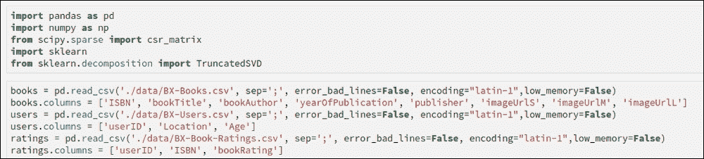

图 4.37:加载数据集的代码片段

### 合并数据帧

我们需要合并书籍和收视率数据框。我们将生成迄今为止每本书的总评分。这方面的代码片段如下:

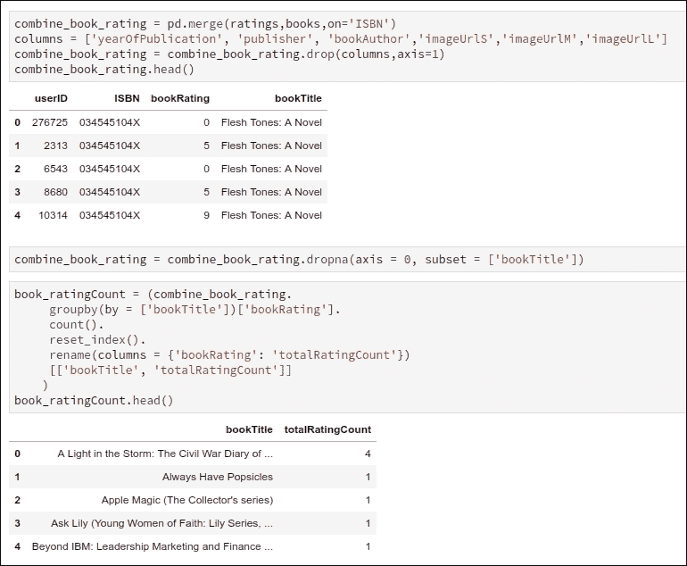

图 4.38:生成评级计数的代码片段

在那之后，我们也将为生成图书评分。参考以下截图:

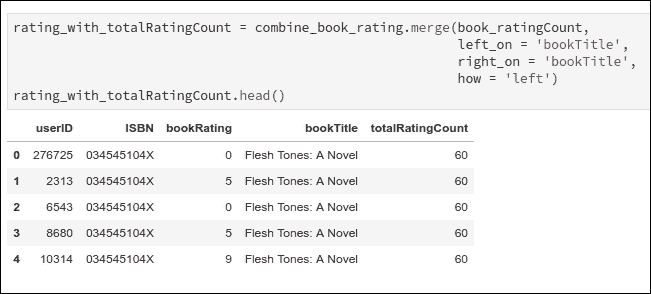

图 4.39:生成图书评分的代码片段

### 用于合并数据帧的 EDA

这里，我们将对总评分进行数据分析。之后，我们需要获得图书评级的分位数值。这个分位数值给了我们一个关于数据分布的好主意。可以参考下面截图中显示的代码片段:

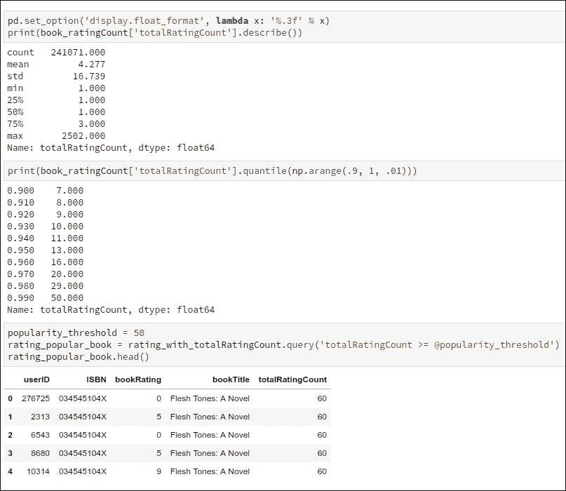

图 4.40:图书总评分 EDA 的代码片段

正如你所看到的，只有 1%的书得到了 50 分以上的用户评分。这个数据集中有很多书，但是我们只考虑其中的 1%。独特图书总数为 2713 本。

### 根据地理位置过滤数据

我们将把我们的用户数据限制在美国和加拿大地区。这个过滤器加速了计算。我们需要将用户数据和图书总评分数据结合起来。为此，代码如下面的屏幕截图所示:

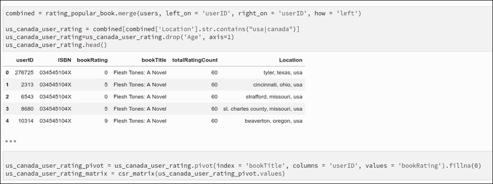

图 4.41:基于地理位置过滤的代码片段

如你所见，现在我们有来自美国和加拿大的用户。

### 应用 KNN 算法

是时候应用主逻辑了。我们将使用`sklearn` 库来应用 KNN 算法。我们的主要目标是确定数据实例的接近程度。您可以看看下面截图中显示的代码片段:

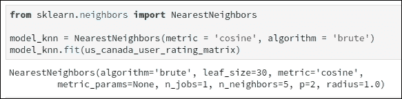

图 4.42:实现 KNN 算法的代码片段

我们使用余弦相似度作为 KNN 矩阵参数，并且我们正在考虑五个最近的邻居。这意味着 K=5 时的值。在模型被训练之后，我们需要使用它们来获得推荐。

### 使用 KNN 算法的推荐

这里，我们需要使用刚刚训练好的KNN 算法来获得推荐。代码如下面的截图所示:

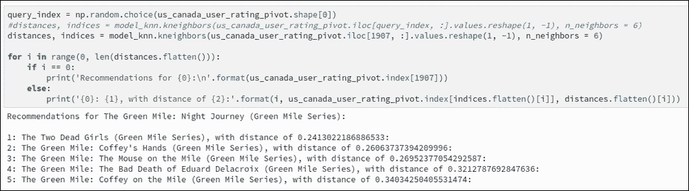

图 4.43:使用 KNN 获得建议的代码片段

出于推荐的目的，我们选择了 K = 6 的值，这意味着我们正在考虑向任何用户推荐这本书的六个最近的邻居。这里，我们从`us_canada_user_rating_pivot`数据框中随机选择了这本书。

这些建议看起来很棒。这里推荐所有的绿色里程系列书籍。

### 应用矩阵分解

现在让我们实现矩阵分解方法。我们将把美国和加拿大的用户评级数据框架转换成 2D 矩阵。这个矩阵也被称为效用矩阵。我们已经用 0 替换了缺少的值。可以参考下面截图中给出的代码:

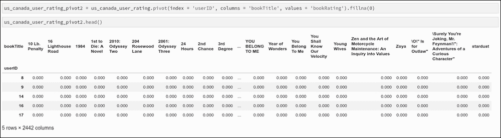

图 4.44:生成效用矩阵的代码片段

现在我们需要转置效用矩阵。`bookTitles` 变成行，`userID` 被转换成列。之后我们会应用`TruncatedSVD` 进行降维。这个操作是在列上执行的——在`userID`上——因为我们需要在之后使用书名。可以参考下面截图中显示的代码:

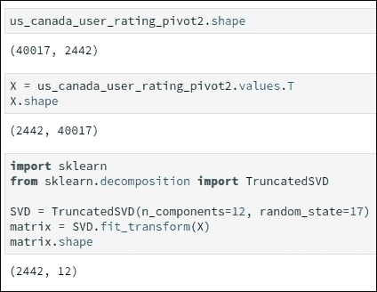

图 4.45:奇异值分解降维的代码片段

这里，我们选择了`n_components`的值为 12。如你所见，我们的数据框架的维度减少了很多。早先数据框的尺寸是 40017 x 2442，现在变成了 2442 x 12。

现在，我们对最终矩阵中的每个图书对执行皮尔逊相关系数。我们将把结果与 KNN 算法进行比较。基本上，我们应该得到我们之前用 KNN 算法得到的建议。

### 使用矩阵分解的推荐

这里，我们需要使用矩阵分解技术生成一个推荐。我们将列出绿色里程:夜间旅程(绿色里程系列)的所有推荐。该算法应该建议高度相关的书籍。我们已经为相关性应用了一个阈值。只有那些相关性分数大于 0.9 小于 1 的书籍才使用这种方法列出。可以参考下面截图中给出的代码片段:

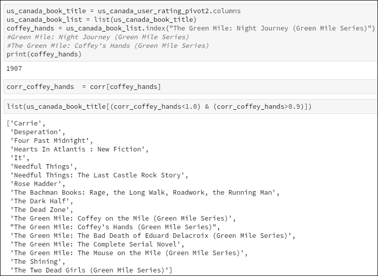

图 4.46:使用矩阵分解生成建议的代码片段

正如你所看到的，使用基于 KNN 的方法推荐的所有书籍的推荐也出现在这里。因此，这个基于 CF 的推荐系统以最好的方式工作。你也可以在亚马逊上找到类似的推荐。参考以下截图:

图 4.47:亚马逊上的推荐

我们可以确认我们的推荐引擎运行良好。

# 总结

这是分析领域的最后一章。到目前为止，您已经学习了许多概念，这些概念可以帮助我们构建令人惊叹的分析应用。在本章中，您学习了如何为电子商务产品制作推荐引擎。在基线方法中，我们使用了 TF-IDF 和余弦相似性的概念。在修改后的方法中，我们建立了一个使用相关性概念的图书推荐系统。在最佳方法中，我们使用 KNN 算法来构建推荐引擎，该引擎使用基于协作过滤的方法。我们研究了所有方法的优缺点。您还了解了推荐系统的架构。这些话题都有助于你理解和建立自己的推荐系统。你也可以建立一个基于计算机视觉的推荐引擎。这种推荐引擎真正改变了向用户推荐内容的方式。所以不要犹豫去建立新类型的推荐系统。

从下一章开始，我们将讨论属于自然语言处理领域或自然语言生成领域的应用。下一章是关于情感分析，这是一个众所周知的简单的 NLP 应用。我们将使用各种机器学习算法来达到最好的结果。*