    

# 五、情感分析

到目前为止，我们已经在分析领域探索了一些非常酷的应用。在这一章中，我们将探索著名的自然语言处理(NLP)技术，因为这一章的名字，你可能已经猜到了。完全正确；我们将构建一个基于情感分析的应用。总的来说，每个人都熟悉基于情感分析的应用。如果你不是，那么不要担心。我们将讨论并了解所有必要的细节。

首先，我想给你一个关于情感分析的基本思路。我将提供一个例子，这样你会很容易理解。不管我们住在哪里，我们都看电影。如今，我们在各种社交媒体平台上阅读评论或其他人的观点。之后，如果大多数人对这部电影的看法是好的，那么我们就看这部电影。如果这些观点不令人印象深刻，我们可能不会看这部电影。所以在整个过程中，我们的大脑会分析这些意见，并将它们分为积极的意见、消极的意见或中立的意见。在这一章中，我们将进行同样的分析。

我来介绍一下情感分析的正式定义。情感分析是一种技术，其中我们考虑自然语言形式的句子、段落、文档或任何信息，并确定该文本的情感基调是积极的、消极的还是中性的。我们将应用机器学习和深度学习来构建情感分析应用。

我们将在本章中讨论以下主题:

*   介绍问题陈述
*   了解数据集
*   为基线模型构建训练和测试数据集
*   基线模型的特征工程
*   选择机器学习(ML)算法
*   训练基线模型
*   了解测试矩阵
*   测试基线模型
*   现有方法的问题
*   如何优化现有方法

    *   了解优化方法的关键概念

*   实施修订方法

    *   测试修订方法
    *   理解修订方法的问题

*   最佳方法

    *   实施最佳方法

*   摘要

# 引入问题陈述

我们生活在一个竞争激烈的世界。在购买任何产品和投资我们的时间或金钱之前，我们试图了解其他人对该产品或服务的看法。我们试图分析他们的评论或意见。如果我们发现他们是积极的、值得信赖的，那么我们就会购买产品，并在特定的服务上投入金钱或时间。另一方面，如果我们发现这些意见或评论是负面的，那么我们可能不会购买该产品，也不会在该特定服务上投入金钱或时间。在当前的互联网时代，很容易在社交媒体平台、博客、新闻来源等等上找到评论。这种分析评论的活动对消费者以及产品制造商或服务提供商都是有用的。这是因为，根据客户的评论，他们可以有效地改变他们的产品，为客户提供更多的满意度，并从该产品或服务中获得丰厚的利润。我已经给了你情感分析的正式定义，所以我不会再用它来烦你了。让我们试着去理解本章的重点是什么。

我们将为电影评论开发一个情感分析应用。在训练期间，我们将考虑与每个电影评论相关的标签，以便我们可以基于给定的标签训练我们的机器学习算法。经过训练后，当我们通过任何看不见的电影评论时，那么我们训练过的机器学习算法将预测情绪，这意味着提供的电影评论是表明积极的情绪还是消极的情绪。

我们将考虑一个 IMDb(互联网电影数据库)电影评论数据集，以开发电影评论的情感分析。我们将在下一节中查看关于数据集的详细信息。

# 了解数据集

在这一部分，我们将研究我们的数据集。我们考虑了一个 IMDb 数据集，你可以在:[http://ai.stanford.edu/~amaas/data/sentiment/](http://ai.stanford.edu/~amaas/data/sentiment/)下载。点击这个链接后，可以看到页面上提供了一个链接。这个链接的标题是大电影评论数据集 v1.0 我们需要点击它。这样，我们可以下载 IMDb 数据集。下载完数据集后，您需要提取. tar.gz 文件。解压`.tar.gz`文件后，可以看到解压后的文件夹内有两个文件夹和一些其他文件。让我们在下一节中来看看它们。

## 了解数据集的内容

提取完数据集文件后，我们会看到里面有一些文件夹和文件。我们将讨论所有内容的含义以及我们将用于训练目的的内容。该数据集有两个文件夹和三个文件:

*   火车文件夹
*   测试文件夹
*   `imdb.vocab`文件
*   `imdbEr.txt`
*   自述文件

### 列车文件夹

该文件夹包含用于训练的数据。在这个文件夹中，有两个主要文件夹。`pos`文件夹包含正面的电影评论，而`neg`文件夹包含负面的电影评论。在`pos`文件夹里，有 12500 条积极的电影评论。在`neg`文件夹里面，有 12500 条负面影评。所以总的来说，我们有 25000 条影评。通过使用它们，我们将训练我们的机器学习(ML)模型。出于测试目的，我们可以使用`unsup`文件夹中提供的电影评论。这些电影评论是未标记的，所以我们可以使用它们进行测试，或者将我们标记的数据分成训练和测试组，这样我们就可以很容易地找到我们训练的 ML 模型是如何工作的。

train 文件夹中还有其他文件，但我们不打算使用它们。这些文件携带的数据已经具备了单词包(BOW)特征。为了清楚地了解文件夹结构，您可以参考下图中提供的代码片段:

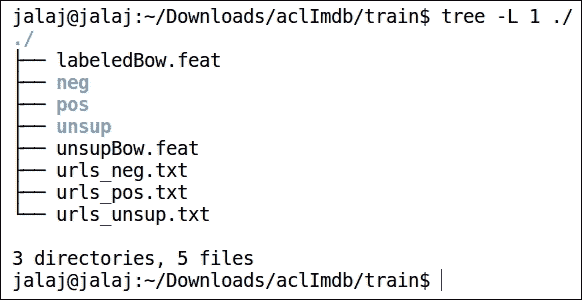

图 5.1:列车文件夹的文件夹结构

如果你想更详细地探索数据集，那么你可以参考以下网址提供的文档:[http://www . paddle paddle . org/docs/0 . 10 . 0/documentation/en/tutorials/sensation _ analysis/index _ en . html](http://www.paddlepaddle.org/docs/0.10.0/documentation/en/tutorials/sentiment_analysis/index_en.html)。

### 测试文件夹

该文件夹包含测试数据。在这个文件夹里面，有`pos`和`neg`文件夹，分别包含正面和负面的影评。每个文件夹包含 12，500 条电影评论，因此我们总共有 25，000 条电影评论要测试。这些电影评论被标记为一，所以我们可以使用这个数据集来测试我们的训练模型。还有其他的`BOW`文件和`url`文件，我们不会用到。您可以在下图中看到测试文件夹的文件夹结构:

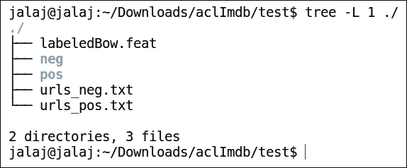

图 5.2:测试文件夹的文件夹结构

### imdb.vocab 文件

这个文件包含所有电影评论中使用的唯一单词，因此它是用于`IMDb`数据集的词汇文件。如果您打开这个文件，那么您可以看到单词，并观察到它们都是唯一的。您可以在下图中看到该文件的内容:

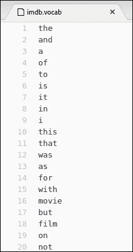

图 5.3:IMDB . vocab 文件的内容

### imdbEr.txt 文件

该文件指示`imdb.vocab`文件中每个令牌的预期评级。这意味着所有这些数值都表示在`imdb.vocab`文件中提供的每个单词的分数。如果这个字是正数，那么这个数值就是一个正浮点数。如果这个字是负的，那么这个数值就是一个负的浮点值。您可以在下图中看到该文件的内容:

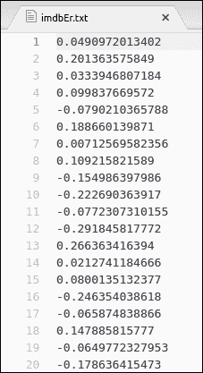

图 5.4:imdber . txt 文件，它对 imdb.vocab 文件中给出的每个单词都有一个分数

### 自述文件

该文件包含关于数据集的文档。你可以通过这个文件获得基本信息。

请注意，为了开发这个情感分析应用，我们将只考虑来自`train`文件夹的数据，因为处理多达 50，000 条电影评论需要大量的计算能力，所以我们将只考虑来自`train`文件夹的 25，000 条电影评论，而不是 50，000 条电影评论，并且我们将拿出一些电影评论进行测试。现在让我们试着理解电影评论文件的内容是如何提供的。

## 了解电影评论文件的内容

在`pos`和`neg`文件夹中，有`.txt`文件包含电影评论。`pos`文件夹内的所有`.txt`文件都是正面影评。可以参考下图提供的样本内容:

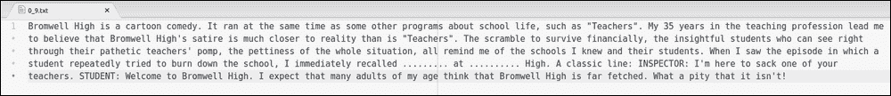

图 5.5:pos 文件夹中的示例电影评论；文件名是 0_9.txt

电影评论以简单的纯文本形式提供。这里，我们将只执行一个小的预处理更改，其中我们将`pos`和`neg`文件夹名称分别重命名为`positiveReviews`和`negativeReviews`。这个`IMDb`数据集已经过预处理，所以我们不执行任何大范围的预处理。你可以使用这个 GitHub 链接下载最终的训练数据集:[https://GitHub . com/jalajthanaki/sensation _ Analysis/blob/master/data . tar . gz .](https://github.com/jalajthanaki/Sentiment_Analysis/blob/master/data.tar.gz)

现在我们需要开始为我们的情感分析应用构建 ML 模型。我们将执行以下步骤:

*   构建训练和测试数据集
*   基线模型的特征工程
*   选择机器学习算法
*   训练基线模型
*   了解测试矩阵
*   测试基线模型

所以让我们试着理解所有这些步骤。

# 为基线模型构建训练和测试数据集

在这个部分，我们将生成训练数据集和测试数据集。我们将遍历数据集的文件，并将名称以数字 12 开头的所有文件视为我们的测试数据集。因此，大约 90%的数据集被视为训练数据集，10 %的数据集被视为测试数据集。您可以参考下图中的代码:

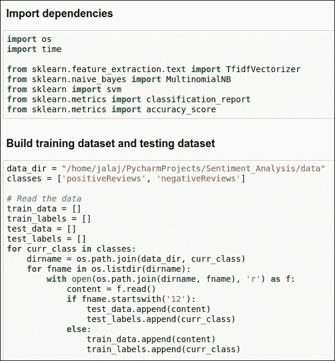

图 5.6:构建训练和测试数据集的代码片段

正如您所看到的，如果文件名以 12 开头，那么我们将这些文件的内容视为测试数据集。除此之外的所有文件都被视为训练数据集。你可以在这个 GitHub 链接找到代码:[https://GitHub . com/jalaythanaki/情操 _ 分析/blob/master/基线 _ 方法. ipynb](https://github.com/jalajthanaki/Sentiment_Analysis/blob/master/Baseline_approach.ipynb) 。

# 基线模型的特征工程

对于这个应用，我们将使用一个基本的统计特征提取概念，以便从原始文本数据中生成特征。在 NLP 领域，我们需要将原始文本转换成数字格式，这样 ML 算法就可以应用于数字数据。有许多可用的技术，包括索引、基于计数的向量化、**词频-逆文档频** ( **TF-IDF** )等等。我已经在第 4 章、*使用 TF-IDF 生成特征*中讨论了 TF-IDF 的概念:

### 注意

索引主要用于快速数据检索。在索引中，我们提供一个唯一的标识号。该唯一标识号可以按字母顺序或基于频率来分配。可以参考这个链接:[http://sci kit-learn . org/stable/modules/generated/sk learn . preprocessing . label encoder . html](http://scikit-learn.org/stable/modules/generated/sklearn.preprocessing.LabelEncoder.html)

基于计数的矢量化按字母顺序对单词进行排序，如果某个特定单词存在，则其矢量值将变为 1，否则为 0。向量的大小与我们的训练数据集的词汇大小相同。可以使用此链接参考简单代码:[https://github . com/jalajthanaki/nl python/blob/6 c 74 DDE CAC 03 b 9 AEC 740 AE 2e 11 DD 8 b 52 f 11 c 0623/ch5/bagofwordsdemo/bow demo . py](https://github.com/jalajthanaki/NLPython/blob/6c74ddecac03b9aec740ae2e11dd8b52f11c0623/ch5/bagofwordsdemo/BOWdemo.py)

这里，我们使用 scikit-learn 的 TF-IDF 矢量器技术。`TfidfVectorizer`函数将原始文档的集合转换成 TF-IDF 特征的矩阵。如果你是 TF-IDF 新手，那么我会推荐你参考[http://www.tfidf.com/](http://www.tfidf.com/)或者[https://www . packtpub . com/mapt/book/big _ data _ and _ business _ intelligence/9781787121423/5](https://www.packtpub.com/mapt/book/big_data_and_business_intelligence/9781787121423/5)。

您可以参考下图中提供的代码片段:

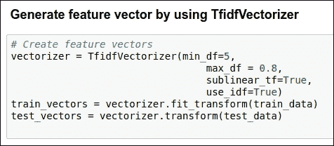

图 5.7:使用 TF-IDF 生成特征向量的代码片段

正如您在前面使用 TF-IDF 生成特征向量的代码片段中看到的，我们已经定义了一些参数，我想适当地解释一下:

*   `min_df`:该参数为文档频率提供了一个严格的下限。我们将该参数设置为 5。因此，在数据集中出现少于 5 次的术语将不被考虑用于生成 TF-IDF 向量。
*   `max_df`:此参数忽略文档频率严格高于给定阈值的术语。如果这个参数的值是 float，那么它代表文档的一部分。我们将参数值设置为 0.8，这意味着我们考虑了 80%的数据集。
*   `sublinear_tf`:该参数用于应用缩放。默认情况下，该参数的值为 False。如果其值为真，那么 tf 的值将替换为 *1+log(tf)* 公式。这个公式将帮助我们扩大词汇量。
*   `use_idf`:该参数表示 IDF 重新加权机制是否启用。默认情况下，启用 IDF 重新加权，因此该参数的标志值为真。

这里使用了两种方法，如下所示:

*   `fit_transform()`:通过使用这个方法，你已经学习了词汇和 IDF，这个方法返回的是 term-document 矩阵。
*   `transform()`:这个方法将文档转换成一个文档术语矩阵。该方法使用从 fit_transform 方法中学习的词汇和文档频率。

你可以在这个 GitHub 链接[https://GitHub . com/jalajthanaki/情操 _ 分析/blob/master/Baseline _ approach . ipynb](https://github.com/jalajthanaki/Sentiment_Analysis/blob/master/Baseline_approach.ipynb)找到前面的代码。

现在让我们看看哪种算法最适合构建基线模型。

# 选择机器学习算法

情感分析是一个分类问题。有些算法对我们真的很有帮助。在影评中，你可能会发现有些短语出现得相当频繁。如果这些频繁使用的短语表示某种情绪，最有可能的是，它们是表示积极情绪或消极情绪的短语。我们需要找到表达情感的短语。一旦我们找到表明情绪的短语，我们只需要将情绪分为积极情绪类或消极情绪类。为了找出实际的情感类别，我们需要识别最可能的正面短语和最可能的负面短语的概率，以便基于更高的概率值，我们可以识别给定的电影评论属于正面还是负面情感。我们要考虑的概率是先验和后验概率值。这是朴素贝叶斯算法的基础。因此，我们将使用多项式朴素贝叶斯算法。除此之外，我们将使用**支持向量机** ( **SVM** )算法。我们将用不同类型的内核技巧来实现它。

如果你想了解更多关于朴素贝叶斯的知识，那么你可以参考[http://www.saedsayad.com/naive_bayesian.html](http://www.saedsayad.com/naive_bayesian.html)，如果你想了解更多关于 SVM的知识，那么你可以参考:[https://www . analyticsvidhya . com/blog/2017/09/understanding-support-vector-machine-example-code/](https://www.analyticsvidhya.com/blog/2017/09/understaing-support-vector-machine-example-code/)或者[https://www . packtpub . com/mapt/book/big _ data _ and _ business _ intelligence/中](https://www.packtpub.com/mapt/book/big_data_and_business_intelligence/9781787121423/8/ch08lvl1sec77/understanding-ml-algorithms-and-other-concepts)

在下一节中，我们将看看帮助我们执行训练的代码。

# 训练基线模型

在此部分，我们将查看帮助我们在训练数据集上执行实际训练的代码。我们先来看看实现，然后我会一步一步解释代码。在这里，我们将实现朴素贝叶斯和 SVM 算法。为了实现，我们将使用 scikit-learn 库。你可以在这个 GitHub 链接找到代码:[https://GitHub . com/jalaythanaki/情操 _ 分析/blob/master/Baseline _ approach . ipynb](https://github.com/jalajthanaki/Sentiment_Analysis/blob/master/Baseline_approach.ipynb)。

## 实施基线模型

为了理解基线模型的实现，你可以参考下面的代码片段:

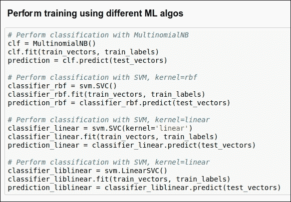

图 5.8:使用朴素贝叶斯和 SVM 进行训练的代码片段

我们在这里实现了以下四种算法:

*   多项式朴素贝叶斯
*   基于核 rbf 的 c-支持向量分类
*   核线性 c-支持向量分类
*   线性支持向量分类

### 多项式朴素贝叶斯

正如您在前面的代码片段中看到的，我们使用了多项式朴素贝叶斯。多项式朴素贝叶斯分类器适用于具有离散特征的分类，这意味着如果特征是字数或 TF-IDF 向量，那么我们可以使用该分类器。多项式分布通常需要整数特征计数。但是，分数计数(如 TF-IDF)也可能有效。所以，我们要把这个算法应用到`train_vectors`上。`fit()`方法是进行实际训练的步骤。在这里，我们默认使用所有的超级参数。

### 基于核 rbf 的 C-支持向量分类

我们也用 *rbf* 内核实现了 SVM。内核是一个帮助训练算法的函数。 *rbf* 核函数的等式如下:

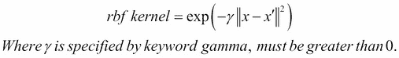

### 核线性 C-支持向量分类

我们已经用线性内核实现了 SVM。线性核函数的公式如下:

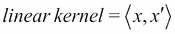

### 线性支持向量分类

我们已经也使用了线性支持向量分类。我们将使用`LinearSVC()`方法类型来实现这个分类。这类似于具有参数 kernel= *linear* 的 SVC，但是根据 liblinear 而不是`libsvm`来实现，因此它在选择惩罚和损失函数方面具有更大的灵活性，并且应该更好地扩展到大量样本。

对于前面所有的 ML 算法，我们都提供了输入，分别是`train_vectors`和`train_labels`。我们将通过使用测试向量并将预测标签与实际标签进行比较来测试 ML 模型的准确性`test_labels`。在进行测试之前，我们将决定使用哪种测试参数。让我们看看测试矩阵。

# 了解测试矩阵

在本节中，我们将查看我们应该考虑的测试矩阵，以便评估经过训练的 ML 模型。对于基线方法，我们将使用以下五个测试矩阵:

*   精确
*   回忆
*   f1-分数
*   支持
*   训练准确性

在我们理解这些术语之前，让我们先了解一些有助于理解前面术语的基本术语。

*   **真实正面**(**TP**)—如果分类器预测给定的电影评论带有正面情绪，并且该电影评论在实际场景中具有正面情绪，则这些类型的测试用例被认为是 TP。因此，您可以定义 TP，就好像测试结果是一个在条件实际存在时检测到条件的结果。
*   **真负面**(**TN**)—如果分类器预测给定的电影评论带有负面情绪，并且该电影评论在实际场景中具有负面情绪，则这些类型的测试案例被认为是真负面(TN)。因此，您可以将 TN 定义为，当条件实际上不存在时，测试结果不会检测到该条件。
*   **假阳性**(**FP**)—如果分类器预测给定的电影评论带有正面情绪，而该电影评论在实际场景中具有负面情绪，则这些类型的测试用例被认为是假阳性(FP)。因此，您可以定义 FP，就好像测试结果是一个在条件实际上不存在时检测到该条件的结果。这就像一个谎言。
*   **假阴性**(**FN**)—如果分类器预测给定的电影评论带有负面情绪，并且该电影评论在实际场景中具有正面情绪，则这些类型的测试用例被认为是假阴性(FN)。因此，您可以将 FN 定义为，当条件实际存在时，测试结果不会检测到该条件。这是某些条件被忽略的情况。

现在，我们将看看使用 TP、TN、FP 和 FN 术语的所有五个主要测试矩阵。

## 精度

精度是分类器为原本属于正类标签的样本分配正类标签的能力。Precision 不会为最初属于负类的给定样本分配正类。生成精度分数的公式如下:

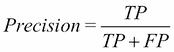

## 回忆

召回是分类器找到所有阳性样本的能力。产生召回分数的公式如下:

## F1-得分

F1-score 是精确和回忆的调和手段。所以你可以找到如下等式:

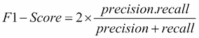

## 支持

支持度是每个类在真实目标标签中出现的次数。support 的值有助于计算精确度、召回率和 F1 分数的平均值。您可以看到计算精确度、召回率和 F1 得分平均值的公式如下:

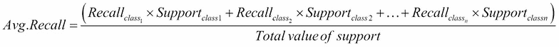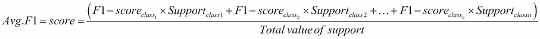

使用前述公式的实际计算将在*测试基线模式*部分中提供。所以请耐心等待一段时间，我们将看到实际的测试结果。

## 训练准确度

训练准确性指导我们获得开发任何 ML 应用的正确方向。我们在测试数据集上测试训练好的 ML 模型。当我们执行这个测试时，我们有每个测试记录的情感类别的实际标签，我们也有所有测试记录的预测情感类别，因此我们可以比较结果。因此，为测试数据集预测的标签集必须与实际测试数据集中的相应标签集完全匹配。我们对预测标签与实际标签相同的记录进行计数，然后将计数转换为百分比。

在下一节中，我们将看到每个已实现的 ML 算法的所有测试矩阵，然后我们将决定哪个算法执行得好。因此，让我们看看测试基线模型的实现。

# 测试基线模型

这里，我们将看看执行实际测试的代码片段。我们将获得到目前为止已经解释过的所有测试矩阵。我们将测试所有不同的最大似然算法，以便我们可以比较准确度得分。

## 多项式朴素贝叶斯的检验

您可以在下图中看到多项式朴素贝叶斯算法的测试结果:

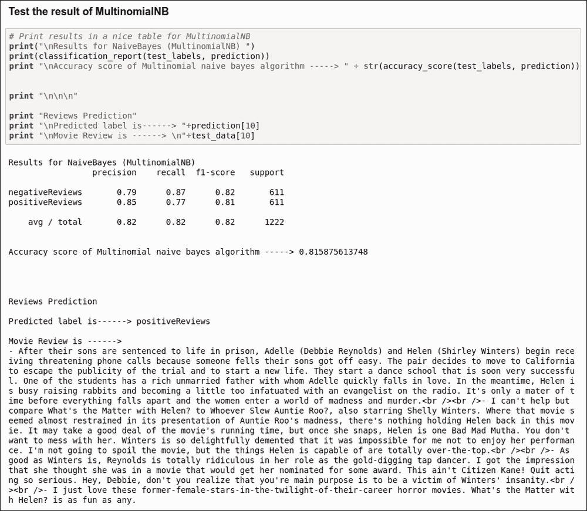

图 5.9:测试多项式朴素贝叶斯算法的代码片段

正如你所看到的，使用这种算法，我们已经达到了 81.5%的准确率。

## 用 rbf 核测试 SVM

在下图中可以看到用 rbf 核算法对 SVM 的测试结果:

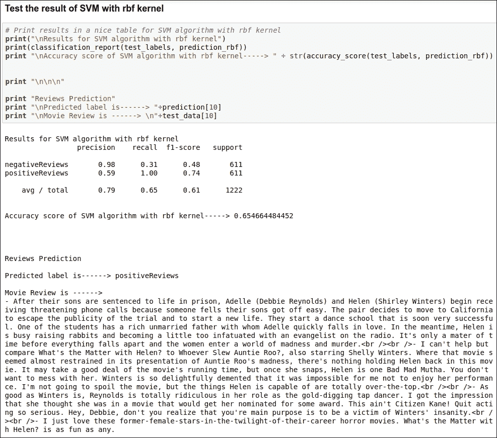

图 5.10:用 rbf 内核测试 SVM 的代码片段

如您所见，我们已经在测试数据集上执行了测试，获得了 65.4%的准确率。

## 用线性核测试 SVM

下图中可以看到线性核算法对 SVM 的测试结果:

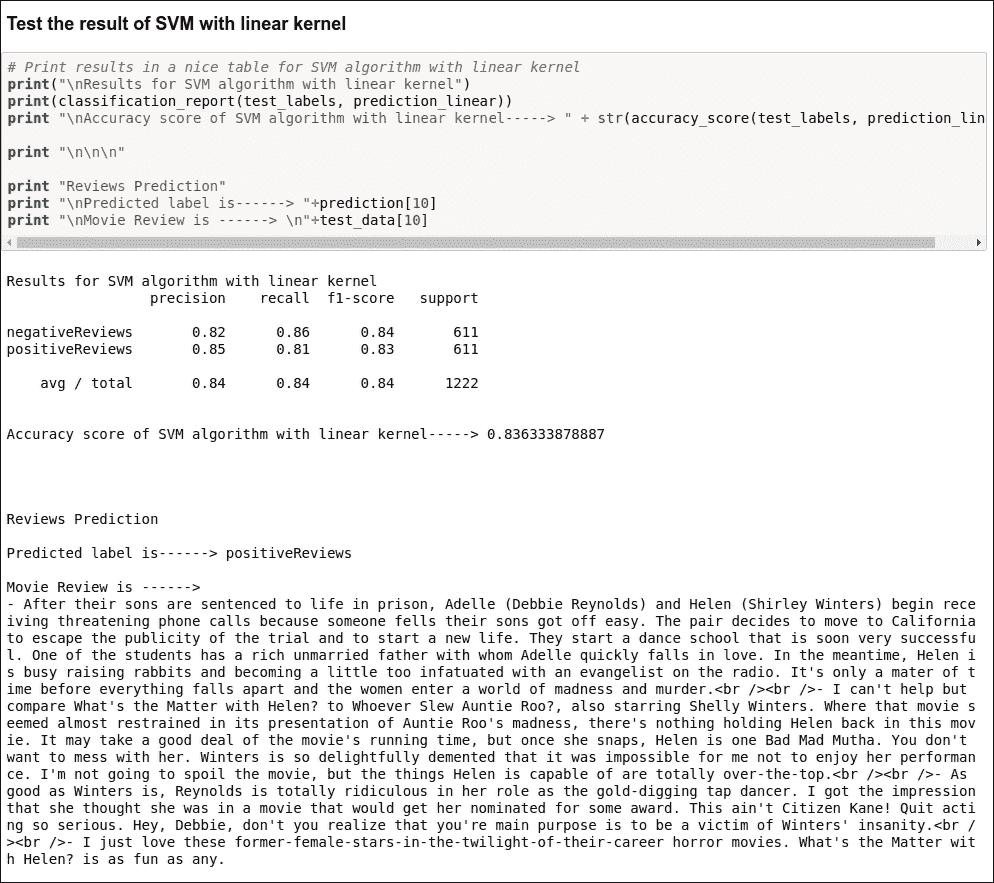

图 5.11:用线性内核测试 SVM 的代码片段

如您所见，我们已经在测试数据集上执行了测试，获得了 83.6%的准确率。

## 用 linearSVC 测试 SVM

你可以在下图中看到 linearSVC 内核算法对 SVM 的测试结果:

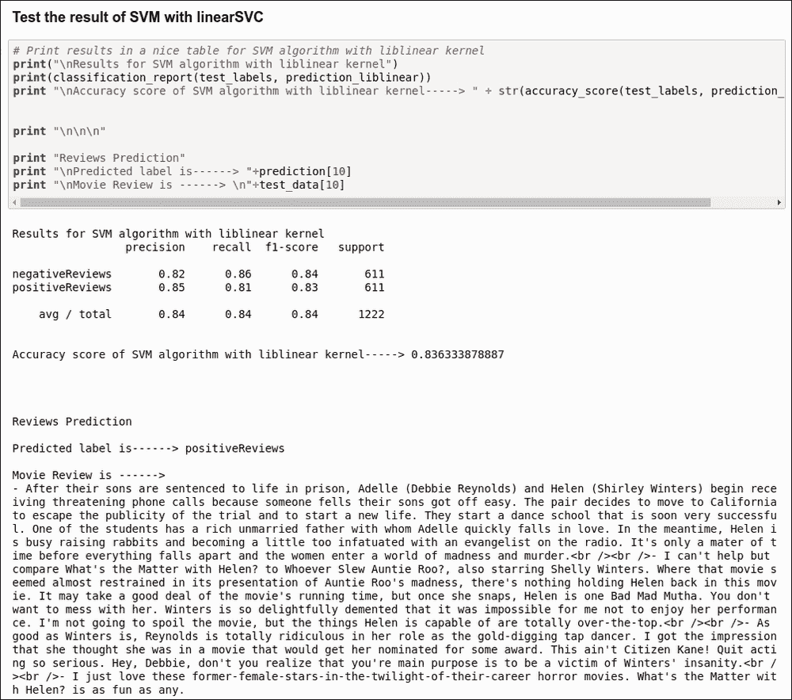

图 5.12:用 linearSVC 内核测试 SVM 的代码片段

我们在这里的测试数据集上进行了测试，获得了 83.6%的准确率。

因此，在看到每个实现的算法的准确度分数后，我们可以说，具有线性核和 linearSVC 的 SVM 执行得非常好。现在，你可能想知道我们是否能提高精确度。我们肯定能做到。所以让我们讨论一下这种基线方法中存在的问题。

# 现有方法的问题

在基线方法中，我们获得了很高的精确度。但是，我们忽略了以下几点，这些我们可以在我们修改后的方法中实施:

*   我们没有关注基于单词嵌入的技术
*   **深度学习**(**DL**)CNN 等算法可以对我们有所帮助

我们需要关注这两点，因为基于单词嵌入的技术确实有助于保留文本的语义。因此，我们应该使用这些技术以及基于 DL 的算法，这有助于我们提供更高的准确性，因为当涉及嵌套数据结构时，DL 算法表现良好。我所说的嵌套数据结构是什么意思？嗯，这意味着任何由短语组成的书面句子或口头句子，由单词组成的短语，等等。所以，自然语言有一个嵌套的数据结构。DL 算法帮助我们理解文本数据集中句子的嵌套结构。

# 如何优化现有方法

有一些技术可以帮助我们改进这个应用。可以帮助我们随机应变基线方法的关键技术如下:

*   我们可以使用基于单词嵌入的技术，比如 Word2Vec、glove 等等
*   我们还应该实现**卷积神经网络** ( **CNN** )来了解深度学习算法如何帮助我们

所以在修订后的方法中，我们将专注于单词嵌入技术和深度学习算法。我们将在 TensorFlow 后端使用 Keras。实施前，让我们详细了解一下修改后的办法。

## 理解优化方法的关键概念

在本节中，我们将详细了解修改后的方法，因此我们知道我们应该实施哪些步骤。我们正在使用 Keras，这是一个深度学习库，它为我们提供了高级 API，因此我们可以轻松地实现 CNN。涉及以下步骤:

*   **导入依赖项**:在这一步，我们将使用 TensorFlow 后端导入不同的依赖项，比如 Numpy 和 Keras。我们将使用属于 Keras 库的不同 API。
*   **下载和加载 IMDb 数据集**:在这一步，我们将下载 IMDb 数据集，并使用 Keras APIs 加载该数据集
*   **选择顶级单词和最大文本长度**:在这个阶段，我们将设置我们的词汇表的值，我们可以在单词嵌入阶段使用它。所以，我们选出了前 10000 个单词。之后，我们将电影评论的长度限制在 1600 条以内。
*   **实现单词嵌入**:在代码的这个阶段，我们将使用 Keras 的默认嵌入技术，并生成长度为 300 的单词向量。
*   **构建 CNN** :在这个阶段，我们将制作三层神经网络，其中第一层有 64 个神经元，第二层有 32 个神经元，最后一层有 16 个神经元。这里，我们使用 sigmoid 作为激活函数。激活函数将非线性引入神经网络，以便我们可以使用数学函数为每个类别生成概率分数。
*   **训练并获得准确率**:最后，我们训练模型并生成准确率得分。我们已经将纪元值设置为 3，并将 adam 设置为优化函数，我们的损失函数为`binary_crossentropy`。Epoch 基本上表示我们需要对整个数据集执行多少次训练。交叉熵损失衡量分类器的性能，其输出是 0 和 1 之间的概率值。交叉熵损失随着预测概率不同于实际标签而增加。经过训练，我们将生成模型的准确性。这个训练阶段可能需要时间以及大量的计算能力。

现在让我们看看下一节的代码。

# 实施经修订的方法

在这个部分，我们将看到代码片段形式的实现。我们将遵循我们在上一节中看到的相同步骤。所以，没有任何延迟，让我们看看代码。你可以通过这个 GitHub 链接来参考这段代码:[https://GitHub . com/jalajthanaki/情操 _ 分析/blob/master/Revised _ approach . ipynb](https://github.com/jalajthanaki/Sentiment_Analysis/blob/master/Revised_approach.ipynb)。

## 导入依赖关系

您可以参考下图中的代码片段，在这里您也可以找到导入的依赖项:

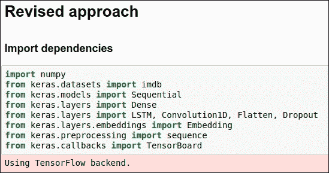

图 5.13:我们可以看到导入的依赖项的代码片段

如你所见，我们已经将 TensorFlow 后端用于 Keras 库。

## 下载并加载 IMDb 数据集

您可以参考下图中的代码片段，在这里您也可以找到下载和加载 IMDb 数据集的代码:

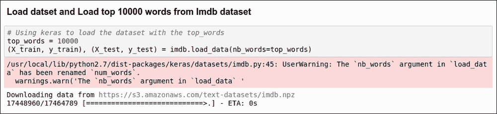

图 5.14:下载和加载 IMDb 数据集的代码片段

我们还设置了词汇表的值。

## 选择顶部单词和最大文本长度

在这个阶段，我们已经设置了顶部单词值以及最大文本长度值。可以参考下图中的代码片段:

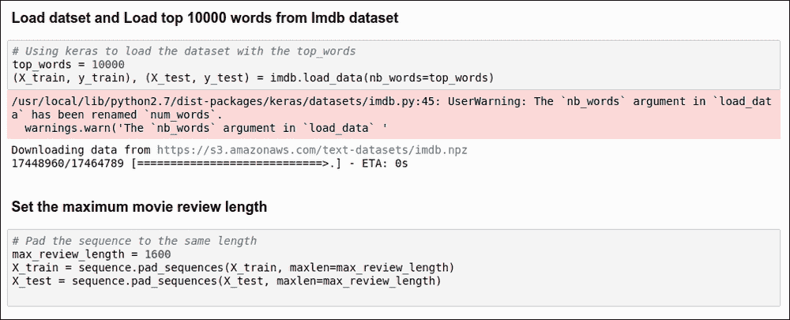

图 5.15:设置词汇值和最大文本长度值的代码片段

在代码的第一部分，我们将 top_word 参数设置为 10，000，在代码的第二部分，我们将电影评论的长度设置为 1，600。top_word 表示词汇量。从我们的数据集中，我们挑选了前 10，000 个独特的单词。大多数电影评论都有我们词汇中的词汇。在这里，我们不处理很长的电影评论，因为这个原因，我们设置了电影评论的长度。

## 实现单词嵌入

在这个阶段，我们已经实现了默认的 Keras 单词嵌入方法，以便获得大小为 300 的特征向量。可以参考下面的代码片段:

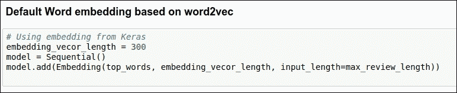

图 5.16:基于单词嵌入技术获取单词特征向量的代码片段

## 构建卷积神经网络(CNN)

在这个部分，你可以参考代码，这将帮助你理解神经网络的架构。这里，我们使用了 CNN，因为它可以很好地处理更高级的功能或数据集的嵌套结构。可以参考下图中的代码片段:

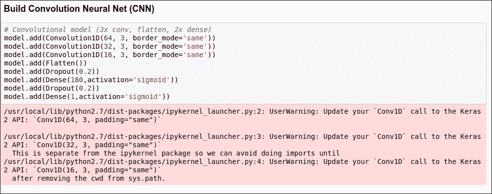

图 5.17:构建 CNN 的代码片段

这里，我们已经建立了具有两个密集层的神经网络。

## 训练并获得准确度

在此阶段，我们已经进行了训练。您可以参考下图中的代码:

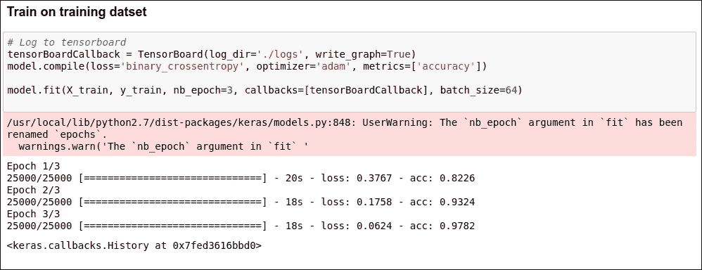

图 5.18:在训练数据集上执行训练的代码片段

这里，我们将执行三次训练，因为我们的纪元值被设置为 3。由于情感分析是一个二元问题，我们使用了`binary_crossentropy`作为损失函数。如果你有基于 GPU 的电脑，那么训练时间会少一些；否则，这个步骤是耗时的，并且消耗计算能力。

一旦训练完成，我们就可以获得训练精度。对于训练的准确性，可以参考下图:

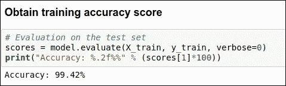

图 5.19:获得训练准确性的代码片段

这里的精度是训练精度。现在我们需要获得测试的准确性，因为这将给我们一个关于训练模型在看不见的数据上表现如何的实际想法。那么我们来看看测试精度如何。

## 测试修改后的方法

在此部分，我们将获得测试数据集的准确性。可以参考下图中的代码片段:

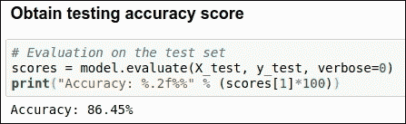

图 5.20:获得测试准确性的代码片段

在获得测试精度后，我们得到了 86.45%的精度值。这种测试精度优于我们的基线方法。现在，让我们看看我们可以改进哪些方面，以便提出最佳方法。

## 理解问题与修正方法

在此部分，我们将讨论修订后的方法中我们可以改进的地方。为了获得最佳方法，我们可以实施以下几点:

*   我们可以使用预先训练的 Word2Vec 或 glove 模型来生成单词向量
*   我们应该使用带有 LSTM 的循环神经网络来获得更好的输出

在本节中，我们将了解并实现最佳方法，其中我们将加载预训练手套(全局词向量)模型，并使用 RNN 和 LSTM 网络。

# 最佳方法

为了获得最佳可能的方法，我们可以遵循一些步骤。在这种方法中，我们使用了手套预训练模型，并使用 RNN 和 LSTM 网络训练该模型。手套模型已经在大型数据集上进行了预训练，以便它可以为单词生成更准确的向量值。这就是我们在这里使用手套的原因。在下一节中，我们将研究最佳方法的实现。你可以在这个 GitHub 链接找到所有代码:[https://GitHub . com/jalaythanaki/personence _ Analysis/blob/master/Best _ approach _ personence _ Analysis . ipynb](https://github.com/jalajthanaki/Sentiment_Analysis/blob/master/Best_approach_sentiment_analysis.ipynb)。

## 实施最佳方法

为了实施最佳方法，我们将执行以下步骤:

*   加载手套模型
*   加载数据集
*   预处理
*   加载预先计算的 ID 矩阵
*   拆分训练和测试数据集
*   构建神经网络
*   训练神经网络
*   加载训练好的模型
*   测试训练好的模型

### 加载手套模型

为了让获得最佳表现，我们将使用预训练手套模型。你可以在 https://nlp.stanford.edu/projects/glove/.[下载](https://nlp.stanford.edu/projects/glove/.)我们已经生成了二进制文件，并将该文件保存为`.npy`扩展名。该文件与`wordsList.npy`文件在一起。可以参考下图中的代码片段:

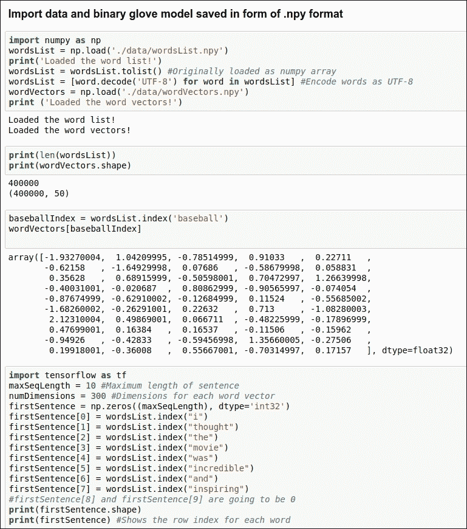

图 5.21:加载手套预训练模型的代码片段

单词向量的维度是 50，并且该模型包含 400，000 个单词的单词向量。

### 加载数据集

你可以参考下面的代码片段:

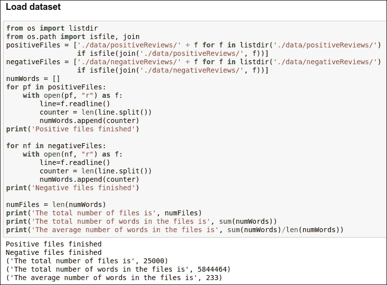

图 5.22:加载数据集的代码片段

我们总共考虑了 25000 条影评。

### 预处理

可以参考下图的代码片段:

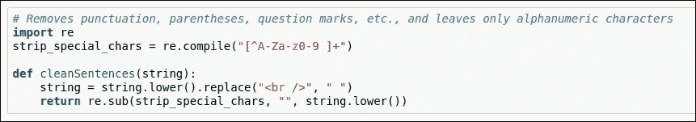

图 5.23:执行预处理的代码片段

### 加载预先计算的 ID 矩阵

在这个部分，我们为每个单词生成索引。这个过程计算量很大，所以我已经生成了索引矩阵，并准备好加载。可以参考下图中的代码片段:

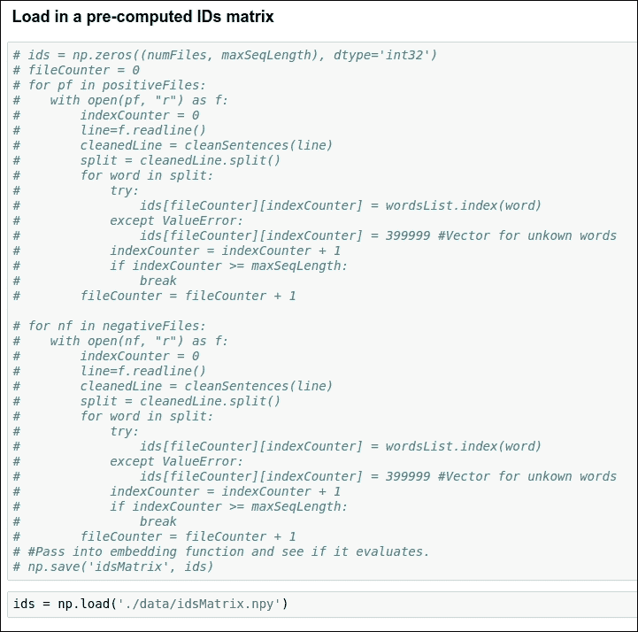

图 5.24:为单词 id 生成矩阵的代码片段

### 拆分训练和测试数据集

在这个部分，我们将看到生成训练和测试数据集的代码片段。可以参考下图中的代码片段:

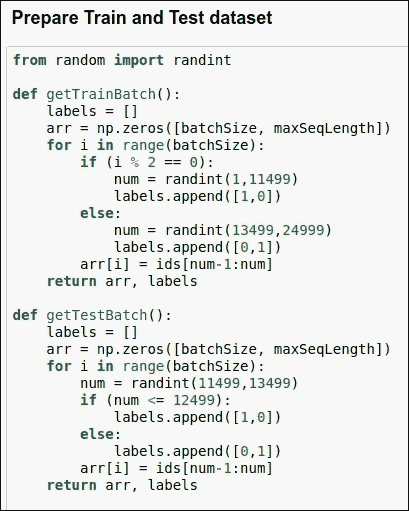

图 5.25:将数据集分成训练和测试数据集的代码片段

### 构建神经网络

我们使用了一个**循环神经网络** ( **RNN** )和**长短期记忆单元** ( **LSTMs** )细胞作为它们隐藏状态的一部分。LSTM 单元用于存储顺序信息。如果你有多个句子，那么 LSTM 会存储前一个或前一个句子的上下文，这有助于我们改进这个应用。如果你想详细了解 LSTM，那么你可以参考 http://colah.github.io/posts/2015-08-Understanding-LSTMs/的。

可以参考下图中的代码片段:

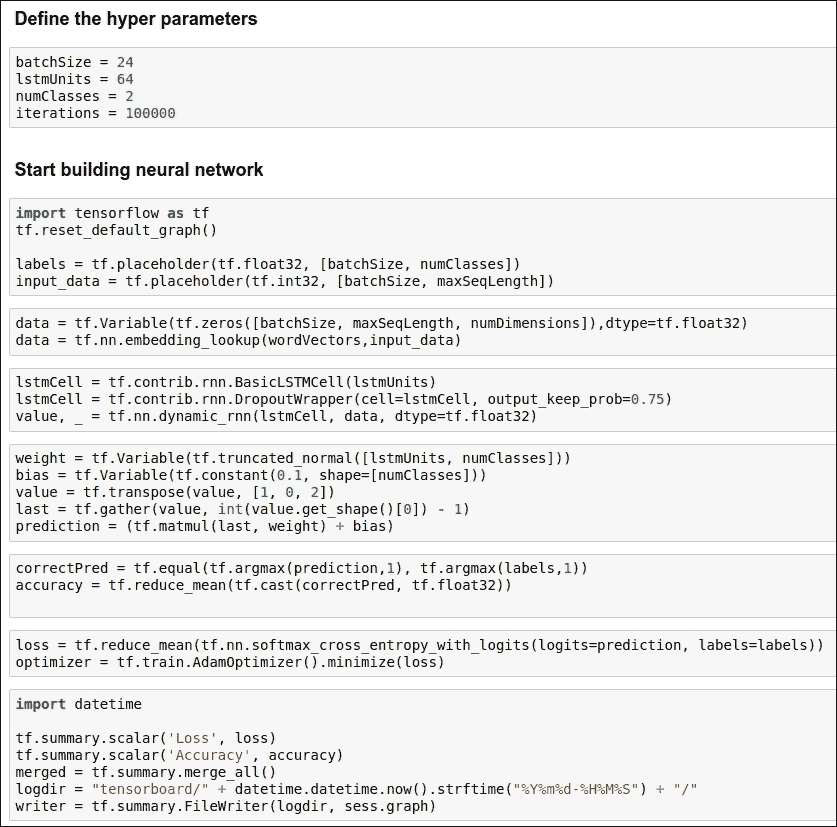

图 5.26:用 LSTM 构建 RNN 的代码片段

首先，我们定义超参数。我们将批量大小设置为 64，LSTM 单位设置为 64，类的数量设置为 2，然后我们执行 100，000 次迭代。

### 训练神经网络

在此部分，您可以参考下图中用于执行训练的代码片段:

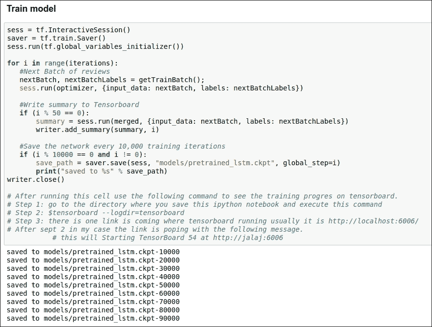

图 5.27:执行训练的代码片段

在每 10，000 次迭代之后，我们保存模型。在训练过程中，您可以使用 TensorBoard 监控进度。您可以参考下图，该图显示了训练期间的进度。您可以在训练过程中监控准确性和丢失百分比，以便了解 DL 模型在训练过程中是如何收敛的:

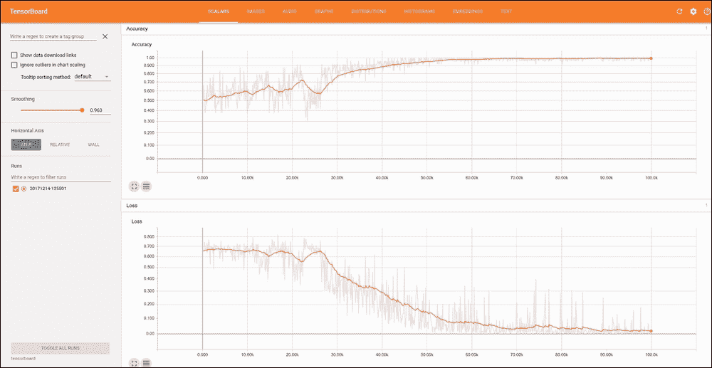

图 5.28:在 TensorBoard 上训练时生成的准确度和损失图

训练是耗时且计算昂贵的，所以用 GPU 训练模型可能需要 2- 3 个小时。因此，您可以通过从 GitHub 下载预训练模型来使用它，网址:[https://GitHub . com/jalajthanaki/情操 _ 分析/blob/master/models.tar.gz](https://github.com/jalajthanaki/Sentiment_Analysis/blob/master/models.tar.gz) 。

### 加载训练好的模型

一旦训练完成，我们就可以保存训练好的模型。在加载这个模型之后，我们也可以检查它的准确性。可以参考下图中的代码片段:

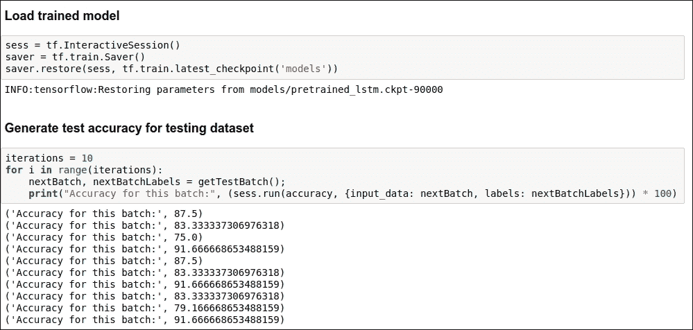

图 5.29:生成测试准确性的代码片段

这里我们已经生成了 91.66%的测试准确率。

### 测试训练好的模型

在这个部分，我们将传递新的电影评论，通过加载训练好的模型，我们将生成情感预测。可以参考下图中的代码片段:

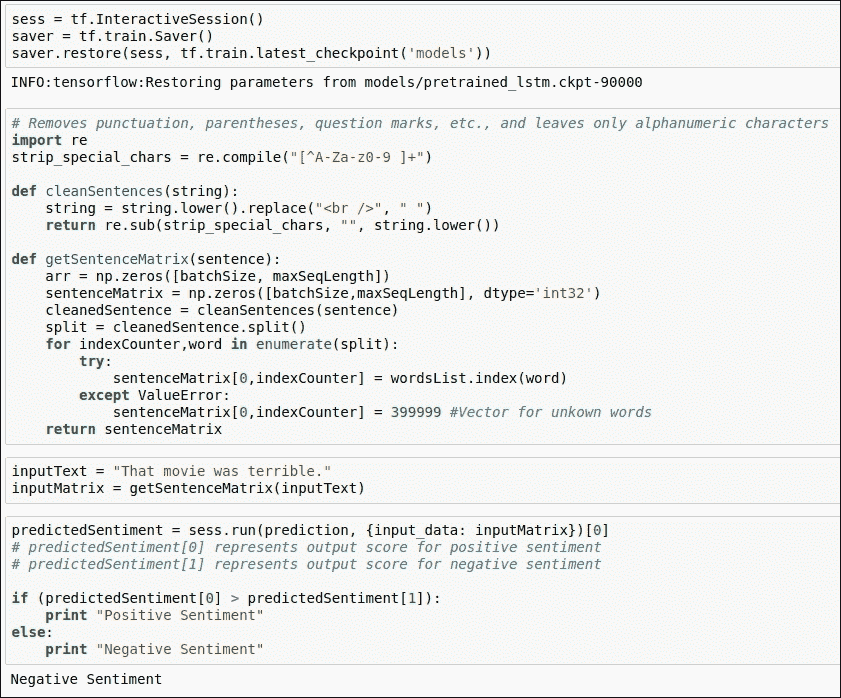

图 5.30:加载训练好的模型并为电影评论的给定句子生成情感的代码片段

在这个片段中，我们通过了一个句子作为电影评论的一部分，我们训练的模型将其识别为负面情绪。您还可以参考下图中的代码片段，该代码片段为包含否定词的句子生成一个情感:

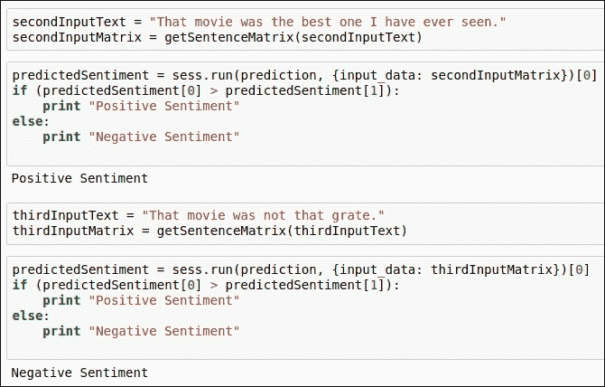

图 5.31:加载训练好的模型并为电影评论的给定句子生成情感的代码片段

这种方法给你很好的结果。

# 摘要

在这一章中，我们研究了如何建立一个情感分析模型，为我们提供最先进的结果。我们使用了一个有正面和负面电影评论的 IMDb 数据集，并理解了该数据集。我们应用机器学习算法来获得基线模型。之后，为了优化基线模型，我们改变了算法并应用了基于深度学习的算法。我们使用手套，RNN 和 LSTM 技术，以达到最佳效果。我们学习了如何使用深度学习构建情感分析应用。我们使用 TensorBoard 来监控模型的训练进度。我们还谈到了现代机器学习算法以及用于开发情感分析的深度学习技术，深度学习方法在这里效果最好。

我们使用 GPU 来训练神经网络，所以如果你发现你需要更多的计算能力来训练模型，那么你可以使用谷歌云或**亚马逊网络服务** ( **AWS** )基于 GPU 的实例。我已经上传了预训练模型，所以你也可以直接使用。你可以在这个 GitHub 链接找到预训练的模型:[https://GitHub . com/jalajthanaki/perspective _ Analysis/blob/master/models . tar . gz](https://github.com/jalajthanaki/Sentiment_Analysis/blob/master/models.tar.gz)。

在下一章中，我们将构建一个工作推荐系统，它将帮助人们找到工作，尤其是与他们感兴趣的工作简介相关的工作。对于工作推荐系统，我们将使用各种资源来链接简历、工作搜索查询等等。同样，我们将使用机器学习和深度学习系统来开发这个系统。