    

# 六、工作推荐引擎

我们已经在[第 4 章](ch04.xhtml "Chapter 4. Recommendation Systems for E-Commerce")、*电子商务推荐系统*中了解了如何为电子商务产品开发推荐系统，现在，我们将应用您在[第 4 章](ch04.xhtml "Chapter 4. Recommendation Systems for E-Commerce")、*电子商务推荐系统*中学到的相同概念，但数据集的类型和格式不同。基本上，我们会建立一个工作推荐引擎。对于这个应用，我们已经考虑了文本数据集。构建推荐引擎的主要概念不会改变，但是这一章给了你一个如何将相同的概念应用于不同类型的数据集的清晰思路。

在本章中，我们将讨论以下主题:

*   介绍问题陈述
*   了解数据集
*   构建基线方法

    *   实施基线方法
    *   了解测试矩阵
    *   基线方法的问题
    *   优化基线方法

*   构建修订方法

    *   实施修订方法
    *   测试修订方法
    *   修订方法存在的问题
    *   了解如何改进修订方法

*   最佳方法

    *   实施最佳方法

*   摘要

那么，我们来讨论一下问题陈述。

# 介绍问题陈述

在这章中，我们将构建一个引擎，可以向任何用户推荐工作。这是我们想达到的最简单的目标。我们将如何建造它？为了回答这个问题，让我给你一个想法，我们将采取什么样的方法来建立一个工作推荐系统。

对于我们的基线方法，我们将抓取虚拟用户的简历，并尝试基于抓取的数据集构建工作推荐引擎。我们收集数据集的原因是，大多数时候，许多数据科学应用都没有可用的数据集。假设您还没有找到任何数据集。那你会怎么做？我想为这种情况提供一个解决方案。因此，您将学习如何收集数据并构建基线解决方案。

在修改后的方法中，我们将使用 Kaggle 托管的数据集。使用基于内容的方法，我们将建立一个工作推荐引擎。对于最好的方法，我们将使用基于用户的协同过滤的概念，并建立最终的工作推荐系统。

现在，让我们来看看数据集。

# 了解数据集

这里，我们使用的两个数据集。两个数据集如下:

*   抓取的数据集
*   工作推荐挑战数据集

让我们从抓取的数据集开始。

## 抓取的数据集

对于这个数据集，我们从 indeed.com 搜集了虚拟简历(我们使用这些数据只是为了学习和研究)。我们将下载用户的 PDF 格式的简历。这些将成为我们的数据集。GitHub 链接中给出了相关代码:[https://GitHub . com/jalajthanaki/Basic _ job _ recommendation _ engine/blob/master/indeed _ scrap . py](https://github.com/jalajthanaki/Basic_job_recommendation_engine/blob/master/indeed_scrap.py)。

看看下面截图中给出的代码:

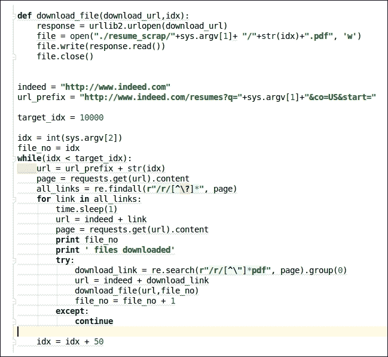

图 6.1:抓取数据的代码片段

使用前面的代码，我们可以下载简历。我们已经使用了`requests` 库和`urllib` 来抓取数据。所有这些下载的简历都是 PDF 格式的，所以我们需要解析它们。为了解析 PDF 文档，我们将使用一个叫做`PDFminer`的 Python 库。我们需要从PDF 文档中提取以下数据属性:

*   工作经验
*   教育
*   技能
*   奖金；奖品
*   证书
*   附加说明

您可以看看下面截图中显示的代码片段:

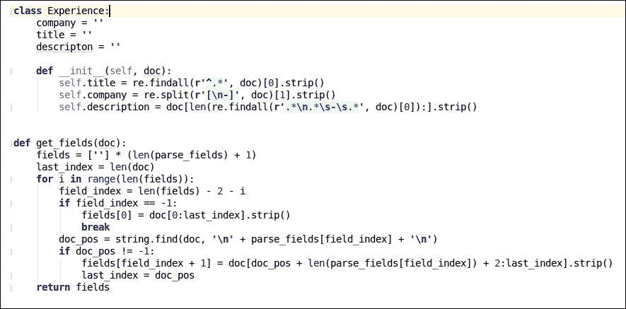

图 6.2:解析 PDF 文档的代码片段

基本上，`PDFminer` 就是把PDF 的内容转换成文本。一旦我们使用正则表达式获得了文本数据，我们就可以获取必要的细节。使用这个 GitHub 链接可以看到完整的代码:[https://GitHub . com/jalajthanaki/Basic _ job _ recommendation _ engine/blob/master/pdf _ parse . py](https://github.com/jalajthanaki/Basic_job_recommendation_engine/blob/master/pdf_parse.py)。

一旦我们获取了所有必要的信息，我们就会以 pickle 格式保存数据。现在，您不需要废弃数据并获取所有必要的信息。我已经在这个 GitHub 链接上传了 pickle 文件格式的数据:[https://GitHub . com/jalajthanaki/Basic _ job _ recommendation _ engine/blob/master/resume _ data . pkl](https://github.com/jalajthanaki/Basic_job_recommendation_engine/blob/master/resume_data.pkl)

我们将使用`resume_data.pkl`文件作为基线方法。

## 职位推荐挑战数据集

这个数据集由[www.careerbuilder.com](http://www.careerbuilder.com)提供，托管在 Kaggle 上。你可以使用这个链接下载数据集:【https://www.kaggle.com/c/job-recommendation/data[。这些是数据文件，我们将使用它们来改进我们的最佳方法。这些数据文件中给出的所有值都用制表符分隔:](https://www.kaggle.com/c/job-recommendation/data)

*   `apps.tsv`
*   `users.tsv`
*   `jobs.zip`
*   `user_history.tsv`

## apps.tsv

该数据文件包含用户作业申请的记录。它表示特定用户申请的工作职位。工作职位由 JobID 列描述。下面的屏幕截图给出了关于该数据文件的所有必要信息:

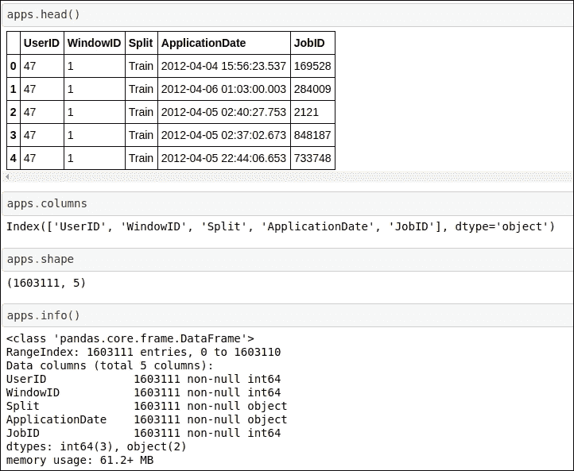

图 6.3:关于 apps.tsv 的数据信息

有五个数据列:

*   `UserId`:表示给定用户的唯一 ID。通过使用这个 ID，我们可以访问用户的个人资料。
*   `WindowsID`:这是常量值为 1 的掩码数据属性。这个数据属性对我们来说并不重要。
*   `Split`:该数据属性表示我们应该考虑哪些数据记录用于训练和测试。
*   `Application date`:这个是用户申请作业的时间戳。
*   `JobID`:该属性表示用户自己提名的`JobIds` 。使用这个`JobId`，我们可以访问特定工作的其他信息。

## 用户. tsv

该数据文件包含用户配置文件和所有用户相关信息。您可以在下面的屏幕截图中找到所有必要的信息:

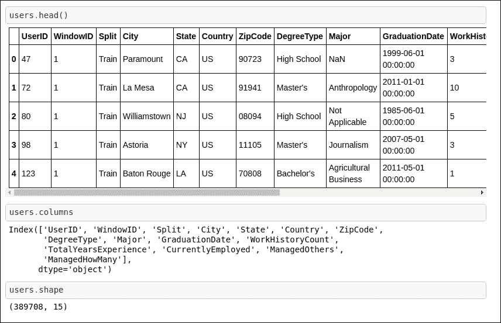

图 6.4 关于用户的数据信息. tsv

这些是数据属性:

*   `UserID`:该数据属性表示用户的唯一标识号。
*   `WindowID`:这是掩码数据属性，常数值为 1。这个数据属性对我们来说并不重要。
*   `Split`:该数据属性表示我们应该考虑哪些数据记录用于训练和测试。
*   `City`:该属性表示用户当前所在的城市。
*   `State`:该属性表示用户的状态。
*   Country:这个属性表示用户的国家。
*   `ZipCode`:该数据属性表示用户的邮政编码。
*   `DegreeType`:该数据栏表示用户的学位；无论用户是高中毕业生还是拥有学士学位。
*   `Major`:该数据属性表示用户拥有学位的主修科目。
*   `GraduationDate`:该数据属性表示用户的毕业日期。
*   `WorkHistoryCount`:该数据属性表示用户工作过的公司数量。
*   `TotalYearsExperience`:该数据栏表示用户的总经验年限。
*   `CurrentlyEmployed`:该数据属性为二进制值。如果用户当前有工作，则值为*是*；如果不是，则值为*否*。
*   `ManagedOthers`:这个数据属性也有一个二进制值。如果用户正在管理其他人，则该列的值为*是*；如果用户没有管理其他人，则该列的值为*否*。
*   `ManagedHowMany`:该数据属性有一个数值。此列的值指示由用户管理的人数。如果用户没有管理任何人，则该值为 0。

## Jobs.zip

当您提取这个 ZIP 文件时，您可以获得`jobs.tsv` 文件。以下截图提供了更多信息:

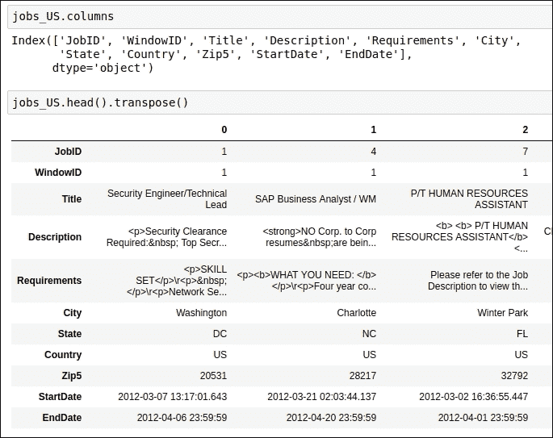

图 6.5:关于 jobs.tsv 的数据信息

*   `JobID`:这是数据集中每个作业的唯一 ID。
*   `WindowID`:这是常量值为 1 的掩码数据属性。这个数据属性对我们来说并不重要。
*   `Title`:该数据属性表示职位名称。
*   `Description`:该数据属性表示工作描述。
*   `Requirements`:该数据属性表示工作要求。
*   `City`:该数据字段表示工作地点所在的城市。
*   `State`:该数据域根据状态指示工作位置。
*   `Country`:该数据域表示国家的工作地点。
*   `Zip5`:该数据域表示工作地点的邮政编码。
*   `StartDate`:此日期表示职位发布或开放申请的时间。
*   `EndDate`:这个日期是工作申请的截止日期。

## user_history.tsv

`user_history.tsv`文件包含用户的作业历史。在下面的截图中有更多的信息:

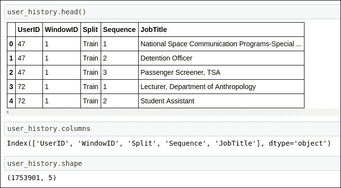

图 user _ history.tsv 的数据信息

此数据文件只有两个新列。

*   `Sequence`:该序列是一个数值字段。该数字指示用户作业的顺序。
*   `JobTitle`:该数据域表示用户的职务。

我们已经涵盖了数据文件中的所有属性；现在让我们开始构建基线方法。

# 建立基线方法

在这一部分，我们将构建基线方法。我们将使用抓取的数据集。我们将使用的主要方法是 TF-IDF(术语频率，逆文档频率)和余弦相似度。这两个概念在[第四章](ch04.xhtml "Chapter 4. Recommendation Systems for E-Commerce")、*电子商务推荐系统中已经有所描述。*相关部分的名称是*使用 TF-IDF 生成特征*和*构建余弦相似矩阵*。

因为这个应用有更多的文本数据，所以我们可以使用 TF-IDF、CountVectorizers、余弦相似度等等。没有适用于任何工作的评分。因此，我们不使用其他矩阵分解方法，如奇异值分解，或基于相关系数的方法，如皮尔逊相关。

对于基线方法，我们试图找出简历之间的相似性，因为这是我们知道用户简档有多相似的方法。通过利用这一事实，我们可以向所有拥有相似专业背景的用户推荐工作。对于基线模型，我们的上下文是生成简历之间的相似性得分。

## 实施基线方法

为了开发一个简单的工作推荐系统，我们需要执行以下步骤:

*   定义常数
*   加载数据集
*   定义助手函数
*   生成 TF-IDF 向量和余弦相似度

### 定义常数

我们将定义一些常量值。这些值基于我们收集的数据集。在我们的数据集中，我们收集了七家公司的虚拟简历，通过分析简历我们生成了七个数据属性。我们认为 100 份简历是我们的第一个训练数据集，50 份简历是我们的测试数据集。我们的第二个训练数据集的大小是 50。可以参考下面截图中显示的代码片段:

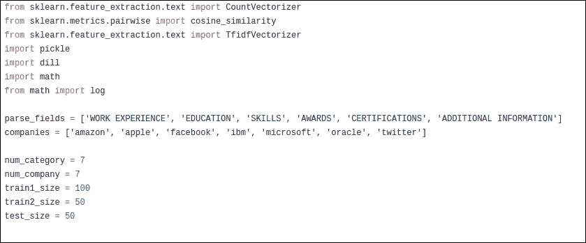

图 6.7:定义常数的代码片段

在这一步之后，我们将加载数据集。

### 加载数据集

如你所知，我们已经分析了 PDF 文件格式的简历。我们将解析后的数据存储为 pickle 格式，并需要加载 pickle 文件。我们将使用`dill`库来加载 pickle 文件。可以参考下面截图中显示的代码片段:

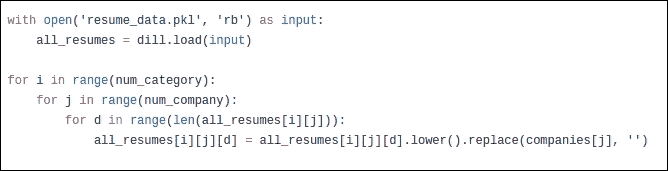

图 6.8:加载数据集的代码片段

我们已经恢复了数据集。下一步，我们需要定义功能，这样我们就可以建立一个基本的工作推荐系统。

### 定义助手功能

有各种各样对我们有用的辅助功能。这种方法总共有三个辅助函数:

*   `my_normalize`
*   `get_sim_vector`
*   `get_class`

第一个函数用于标准化测试分数。我们将以矩阵的形式得到测试分数。您可以看看下面截图中显示的代码片段:

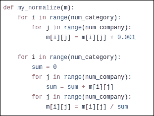

图 6.9:助手函数 my_normalize 的代码片段

这个归一化就是测试得分矩阵的加权平均。因此，它采用测试得分矩阵并生成标准化的测试得分矩阵。请容忍我一会儿；当我们生成这个基线方法的结果时，我们将看到测试得分矩阵是什么样子的。

第二个函数基本上将 TF-IDF 向量矩阵和数据集作为输入。作为输出，它生成余弦相似性得分。可以参考下面截图中给出的代码片段:

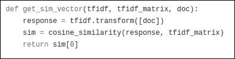

图 6.10:帮助函数 get_sim_vector 的代码片段

第三个函数基本上将余弦相似性数组作为输入，并对其进行迭代，以便从余弦相似性数组中获得最大余弦值。您可以在下面的屏幕截图中找到代码片段:

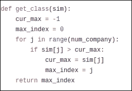

图 6.11:帮助器函数 get_class 的代码片段

我们已经理解了助手函数的输入、输出和工作。现在，当我们生成 TF-IDF 向量和余弦相似性时，是时候看看它们的用法了。那么，让我们进入下一部分。

### 生成 TF-IDF 向量和余弦相似度

在这一部分，我们将开发基线方法的核心逻辑。我们将使用一个简单的 TF-IDF 概念。为了使用简单的 TF-IDF 构建工作推荐引擎，我们需要执行以下步骤:

*   构建训练数据集
*   为训练数据集生成 IF-IDF 向量
*   构建测试数据集
*   生成相似性得分

让我们建立训练数据集。

#### 构建训练数据集

基本上，我们没有将数据集分为训练和测试。因此，对于训练，我们需要使用下面屏幕截图中显示的代码片段来生成训练数据集:

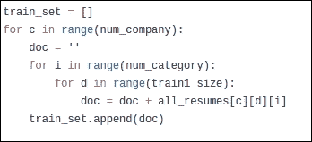

图 6.12:生成训练数据集的代码片段

代码很容易理解。如您所见，我们已经使用了前面定义的`train1_size`常量值，因此我们可以生成 100 份简历用于训练目的。

现在，让我们进入下一步。

#### 为训练数据集生成 IF-IDF 向量

为了生成 TF-IDF 向量，我们将使用 scikit-learn 的`TfidfVectorizer` API。这基本上将我们的文本数据转换成数字格式。您可以看看下面截图中给出的代码片段:

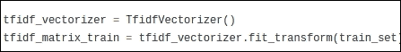

图 6.13:生成 TF-IDF 的代码片段

通过使用前面的代码，我们可以将文本训练数据集转换为矢量化格式。当我们生成用于测试数据集的预测时，使用 TF-IDF 矩阵。现在，让我们构建测试数据集。

#### 构建测试数据集

我们已经训练好了模型。现在，我们需要构建测试数据集，以便我们可以检查我们的训练模型在测试数据集上的表现如何。出于训练目的，我们已经使用了数据集中的 100 份简历，所以现在，我们需要使用不属于训练数据集的简历。为了生成测试数据集，我们将执行以下代码，以便生成测试数据集。可以参考下面截图中显示的代码片段:

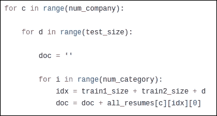

图 6.14:生成测试数据集的代码片段

正如您所看到的，我们已经使用简历的索引生成了测试数据集，并且只提取了那些不属于训练的文档。

#### 生成相似性得分

在这个部分中，首先，我们将测试数据集作为输入，并为它们生成 TF-IDF 向量。一旦生成了 TF-IDF 向量矩阵，我们将使用余弦相似性 API 来生成相似性得分。对于这个 API，我们将传递两个 TF-IDF 矩阵。一个矩阵是我们最近使用测试数据集生成的，第二个矩阵是我们使用训练数据集生成的。当我们传递这两个矩阵时，我们将得到余弦相似度数组作为输出。可以参考下面截图中给出的代码片段:

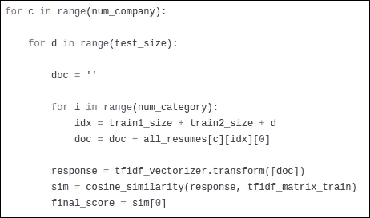

图 6.15:为测试数据集生成余弦相似性的代码片段

作为输出，我们可以生成余弦相似性数组，如下图所示:

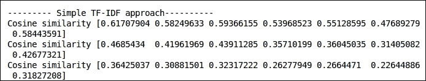

图 6.16:余弦相似性数组

前面屏幕截图中显示的数组有七个元素。每个元素都表明了七家公司简历的相似性。因此，如果最高余弦值出现在第 0 个索引中，那么这意味着给定的简历与在亚马逊工作的其他用户的简历更相似。因此，我们将向该特定用户推荐亚马逊的职位空缺，因为他们的简历与在亚马逊工作的其他员工更相似。

现在，让我们探索一些与测试矩阵相关的事实。

## 了解测试矩阵

当我们使用 TF-IDF、计数矢量器和余弦相似度构建推荐引擎时，我们实际上是在构建基于内容的推荐引擎。没有可用于生成准确度分数的预定义测试矩阵。在这种情况下，要么我们需要手动检查我们的推荐相关性，要么我们可以采用启发式方法来获得基本的直观分数。在[第 4 章](ch04.xhtml "Chapter 4. Recommendation Systems for E-Commerce")、*电子商务推荐系统*中，对于基线方法，我们实现了一些基本的基于阈值的试探法，以了解推荐引擎的工作情况。建议你参考[第四章](ch04.xhtml "Chapter 4. Recommendation Systems for E-Commerce")、*电子商务推荐引擎*中*测试基线接近结果*部分。

## 基线方法的问题

基线方法存在许多问题。我将一一列举:

*   数据集中没有足够的数据属性来构建一个好的工作推荐系统。
*   基线方法不能真正提供准确的工作建议，因为我们只有用户简历的数据集，基于此，我们可以说类似于“你的简历看起来像亚马逊的其他员工，所以请在亚马逊申请职位空缺”。现在，问题是确定我们需要向用户推荐什么样的工作:我们是应该推荐亚马逊的所有职位空缺，还是其中的一些。
*   在我看来，由于数据集的质量和数量，基线解决方案无法为我们提供完整的画面。

这些问题的解决方案将在下一节讨论。

## 优化基线方法

在前面的部分，我们列出了基线方法的缺点。在这一节中，我们将看看如何克服这些缺点。我们正面临一个主要问题，因为我们没有对数据集使用适当的质量和数量。因此，首先，我们需要使用数据集，其中有关于用户资料的信息以及关于职位空缺的信息。在这里，我们不再收集更多的简历或发布工作信息。我们使用的是职业建设者发布的数据集。我们已经在本章前面看到了关于这个数据集的基本信息。

为了构建修改后的方法，我们将使用这个新的数据集。现在，让我们开始构建修改后的方法。

# 构建修订的方法

在本节中，我们将使用现成的工作推荐挑战数据集。我们已经介绍了这个数据集的数据属性。我们将使用基于上下文的方法来构建推荐引擎。为了构建修改后的方法，我们需要执行以下步骤。这个 GitHub 链接给出了修改后的方法的代码:[https://GitHub . com/jalajthanaki/Job _ re commendation _ engine/blob/master/Job _ re commendation _ engine . ipynb](https://github.com/jalajthanaki/Job_recommendation_engine/blob/master/Job_recommendation_engine.ipynb)

让我们实施以下步骤:

*   加载数据集
*   拆分训练和测试数据集
*   探索性数据分析
*   使用作业数据文件构建建议引擎

## 加载数据集

如您所知，数据集位于不同的文件中。我们需要加载所有这些文件。记住所有的数据文件都是`.tsv`格式的，所以我们需要使用`\t`分隔符作为参数。可以参考下面截图中显示的代码片段:

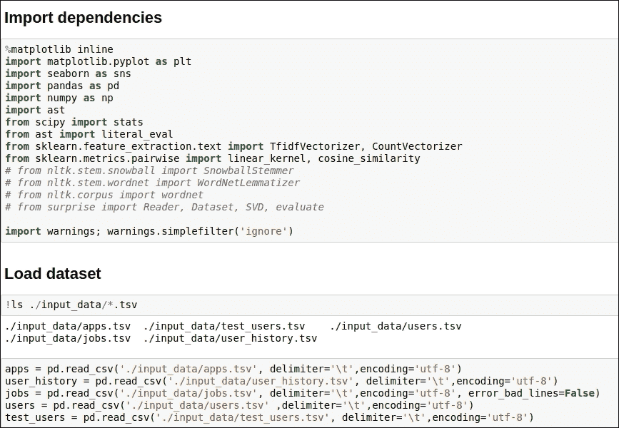

图 6.17:加载数据集的代码片段

如您所见，我们使用了熊猫`read_csv`方法，将分隔符作为参数，并以五种不同数据帧的形式加载数据集。

## 拆分训练和测试数据集

有三个数据文件，其中存在训练和测试两种类型的数据记录。这些数据帧如下:

*   应用
*   用户历史记录
*   用户

在前面的数据帧中，一些记录被标记为`Train` ，一些记录被标记为`Test`。数据属性`Split` 指示哪些数据记录被视为训练数据集的一部分，哪些被用于测试。所以，我们需要过滤我们的数据集。您可以看看下面截图中给出的代码片段:

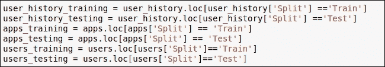

图 6.18:分割训练和测试数据集的代码片段

我们已经对所有三个数据帧应用了简单的过滤操作，并将它们的输出存储在新的数据帧中。

现在，让我们转到**探索性数据分析** ( **EDA** )部分。

## 探索性数据分析

在这一节中，我们将执行一些基本的分析，以便我们可以找出我们的数据集中存在什么样的数据。对于修订版方法，我们正在使用工作数据框架中给出的数据属性构建推荐系统。因此，在使用它构建推荐引擎之前，我们将检查数据记录的质量。我们需要检查数据集中是否存在任何空值。除此之外，我们还需要检查这个数据帧的数据分布。

我们将专门针对地理位置数据属性执行 EDA。这里，我们对三个数据列执行了分组操作:城市、州和国家。您可以看看下面截图中给出的代码片段:

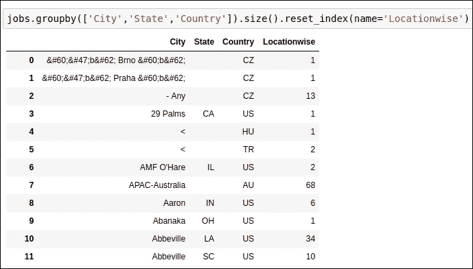

图 6.19:根据城市、州和国家的操作进行分组

正如您在代码片段中看到的，有许多记录中没有州名。我们需要照顾他们。

除此之外，我们还需要统计每个国家的数据记录，这样我们就可以发现每个国家有多少数据记录。可以参考下面截图中显示的代码片段:

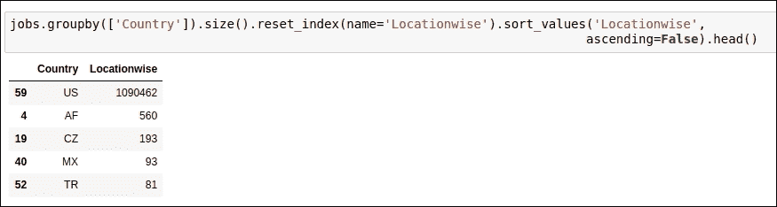

图 6.20:按国家统计数据记录的代码片段

正如您在前面的代码片段中看到的，美国地区大约有 100 万个工作岗位。我们可以说，在我们的数据集中，大多数工作的国家地点是美国。为了让我们的生活更容易，我们只是在考虑美国所在国家的工作。可以参考下面截图中给出的代码片段:

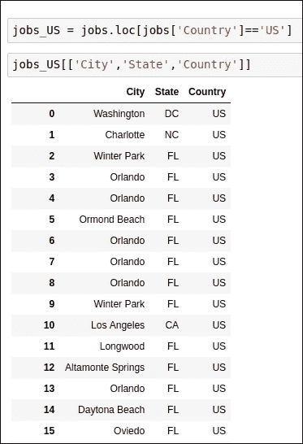

图 6.21:国家为美国的所有数据记录的代码片段

这里，我们需要检查城市或州数据列是否存在空数据值。在观察前面代码的输出后，我们可以看到没有缺少城市或州名的数据记录。

现在，让我们看看我们拥有最多职位空缺的州。请记住，我们只考虑了国家/地区在美国的工作。为了找出各州的作业数量，您可以参考下面截图中给出的代码片段:

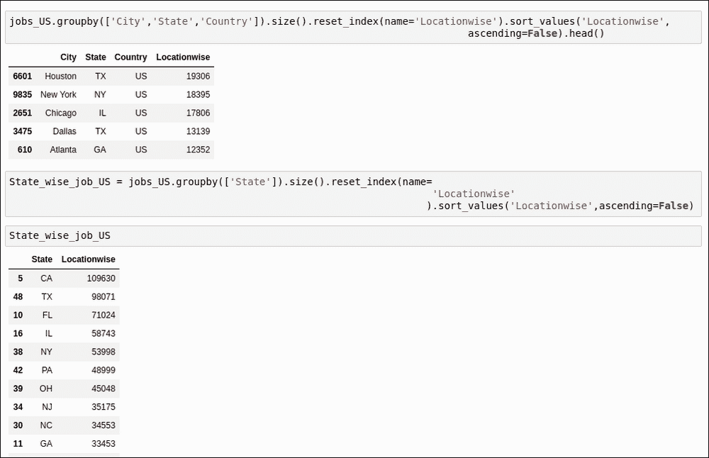

图 6.22:生成状态数量的作业的代码片段

也可以参考下面截图所示的图表:

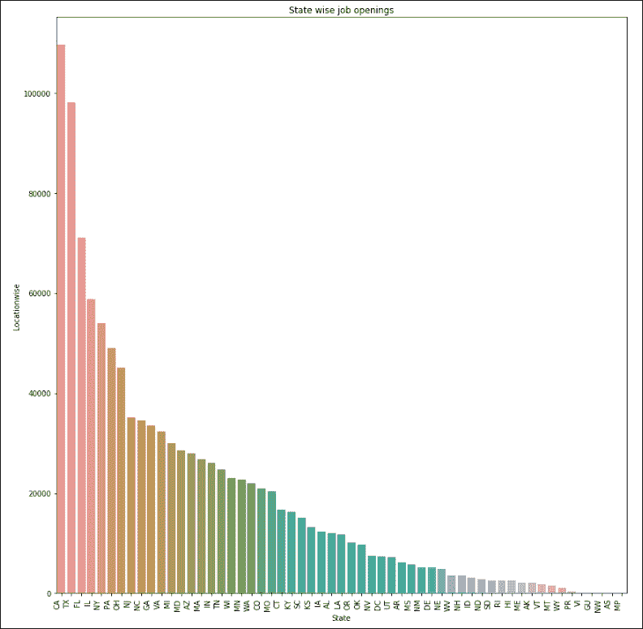

图 6.23:各州作业数量的图表

如你所见，加利福尼亚、德克萨斯、佛罗里达、伊利诺斯和纽约有最多的工作机会。我们已经为修改后的方法做了足够多的 EDA。现在，我们将开始构建推荐引擎。

## 使用作业数据文件构建推荐引擎

在这一节中，我们将研究代码，看看如何构建一个工作推荐引擎。我们将使用 TF-IDF 和余弦相似度概念来构建推荐引擎。

这里我们已经把`jobs_US dataframe`考虑进去了。此数据框架包含国家为美国的职位。所以，我们没有任何垃圾数据记录。我们将只考虑 10，000 条数据记录进行训练，因为训练 100 万条数据记录非常耗时。可以参考下面截图中显示的代码:

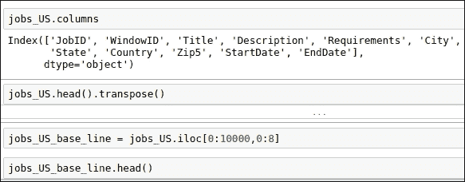

图 6.24:构建修订方法的 jobs 数据集的代码片段

这里，我们将重点关注职位名称和职位描述，以便构建推荐引擎。因为我们使用的是作业的元数据，所以这是基于内容的方法。我们对职位和职位描述应用连接操作，并用一个空字符串值替换`nan value`。可以参考下面截图中给出的代码:

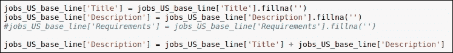

图 6.25:应用串联操作的代码片段

现在，我们将为连接的字符串生成 TF-IDF 向量。我们将使用 TF-IDF 向量矩阵来生成余弦相似性得分。我们将使用 scikit-learn 中的`linear_kernel`函数来生成余弦相似度。与花费较长时间的 scikit-learn 的`cosine_similarity`函数相比，该函数可以在更短的时间内生成余弦相似度。可以参考下面截图中显示的代码片段:

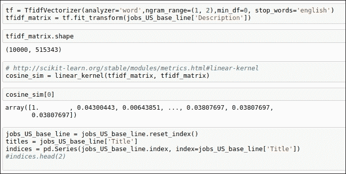

图 6.26:生成 TF-IDF 和余弦相似度的代码片段

如您所见，我们在这里生成了一个高维的 TF-IDF 矩阵。通过使用`linear_kernel`，我们也生成了余弦相似性得分。

由于我们已经完成了修订方法的实施，现在需要测试建议。

## 测试修订后的方法

在本节中，我们将根据任何给定的职位生成类似的职位推荐。我们在这里将职位作为输入传递，在余弦相似性分数的帮助下，我们可以生成任何用户都可以申请的前 10 个相似类型的职位。

例如，假设一个人是 SAP 业务分析师。那个人可能想要申请类似的工作，所以在这里，我们的函数将把职位作为输入，并为该特定用户生成前 10 个类似的工作。下面的屏幕截图给出了生成 10 大职位推荐的代码:

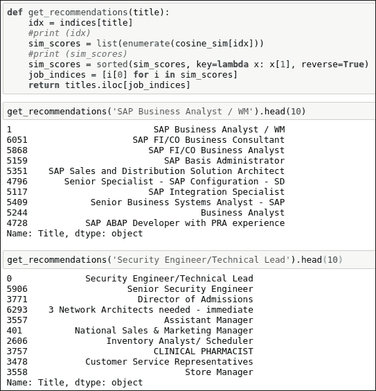

图 6.27:生成 10 大工作建议的代码片段

当我们看到输出时，建议开始变得有意义。SAP 业务分析师将获得工作推荐，如 SAP FI/合作业务分析师。修订后的方法的结果令我们满意，建议似乎是相关的。

## 修订后的方法存在的问题

在本节中，我们将讨论修改后的方法存在的问题。在最好的方法中，我们可以解决这个问题。在修改后的方法中，我们只使用了 jobs 数据属性。我们还没有考虑用户的个人资料或者用户的偏好。在实施最佳方法的过程中，我们还会考虑用户的概况，并根据用户的概况向他们推荐工作。

在下一节中，我们将看看如何优化修改后的方法的直观想法。

## 了解如何改进修订后的方法

到目前为止，我们已经使用了作业数据文件中给出的数据属性，但是我们还没有使用来自`users` 数据文件和`apps` 数据文件的数据属性。`users` 数据文件包含用户的配置文件信息，而`apps` 数据文件包含关于哪个用户申请了哪些工作的信息。

最佳方法有三个简单的步骤:

1.  首先，在用户档案的帮助下，我们将找到并生成前 10 名相似用户。
2.  我们将设法找出这 10 个人申请的工作。然后我们可以生成`JobIDs`。
3.  现在，我们将使用`JobIDs`生成职位名称。

这里，我们考虑了用户的个人资料，所以推荐更针对特定的用户群。现在，让我们开始实施它。

# 最佳方法

我们已经看到了我们将如何构建最佳方法的直观方法。这里，我们将使用与我们在修正方法中使用的技术相同的技术。在这种方法中，我们添加了更多的数据属性，以使推荐引擎更加准确。可以用这个 GitHub 链接参考代码:[https://GitHub . com/jalajthanaki/Job _ recommendation _ engine/blob/master/Job _ recommendation _ engine . ipynb](https://github.com/jalajthanaki/Job_recommendation_engine/blob/master/Job_recommendation_engine.ipynb)。

## 实施最佳方法

为了实施最好的方法，我们需要采取以下步骤:

*   过滤数据集
*   准备训练数据集
*   应用串联操作
*   生成 TF-IDF 和余弦相似性得分
*   生成建议

让我们开始实施列出的每一个步骤。

### 过滤数据集

在这一步，我们需要过滤用户的数据帧。我们正在对国家数据列应用过滤器。我们需要考虑美国用户，因为美国以外的用户约有 30 万，其他用户来自世界其他地方。下面的屏幕截图给出了过滤用户数据帧的代码:

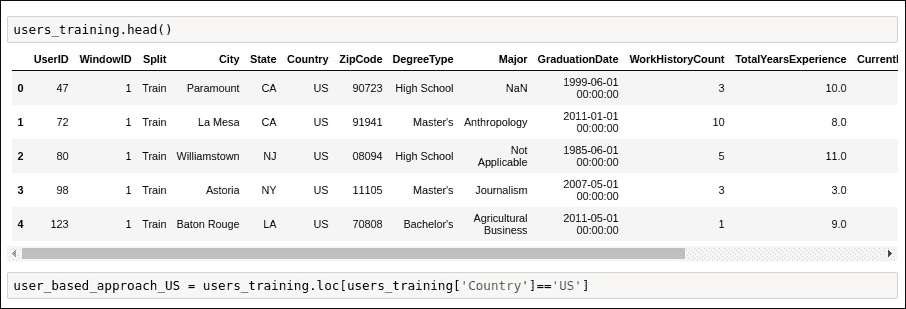

图 6.28:过滤用户数据帧的代码片段

现在，让我们准备训练数据集。

### 准备训练数据集

有 30 万用户，但由于训练时间和计算能力有限，我们没有考虑所有的用户。这里，我们只考虑 10，000 个用户。如果你有更多的计算资源，那么你可以考虑更多的用户。可以参考下面截图中显示的代码 snipp.et:

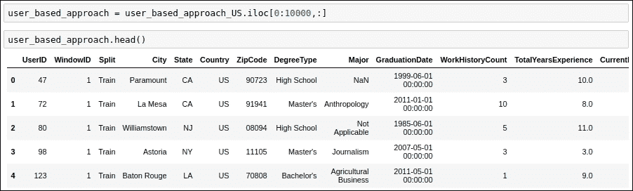

图 6.29:为训练选择数据记录的代码片段

现在，让我们进入下一步。

### 应用连接操作

在这一步中，我们基本上是在执行连接操作。为了找到相似的用户资料，我们将连接用户的学位类型、专业和工作经验。我们将为这个连接的数据值生成 TF-IDF 和余弦相似度。可以参考下面截图中给出的代码片段:

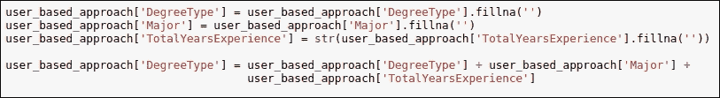

图 6.30:应用串联操作的代码片段

现在，我们将使用这个连接的数据值生成 TF-IDF 和余弦相似性得分。

### 生成 TF-IDF 和余弦相似性得分

在本节中，我们将使用 scikit-learn API 生成 TF-IDF 和余弦相似性得分。我们使用的 API 与修改后的方法中使用的 API 相同。这里，我们没有改变技术，但是我们将改变数据属性。可以参考下面截图中显示的代码片段:

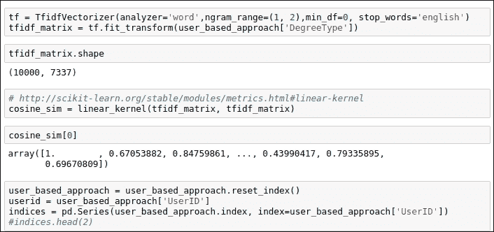

图 6.31:生成 TF-IDF 和余弦相似度的代码片段

正如您所看到的，我们已经生成了余弦相似性得分，因此基于此，我们可以生成一个相似的用户档案，并根据他们的工作申请跟踪记录向他们提供工作建议。

### 生成建议

为了生成工作推荐，我们需要执行以下步骤:

*   **步骤 1** :为了生成前 10 个相似的用户配置文件，我们需要传递 UserID，作为输出，我们得到与输入 UserID 最相似的 10 个 UserID。可以参考以下截图: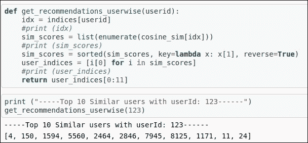

    图 6.32:生成前 10 名相似用户

    的代码片段
*   **第 2 步**:我们将获取在第 1 步中生成的`userIDs` 列表，并尝试在应用数据帧中找到相同的`UserIDs`。这种搜索操作的目的是我们需要知道哪个用户申请了哪个工作职位。通过使用应用数据框架，我们得到了`JobIDs`。
*   **步骤 3** :一旦我们获得`JobIDs`，我们将使用 jobs 数据框架获得职称。

下面的屏幕截图给出了步骤 2 和步骤 3 的代码片段:

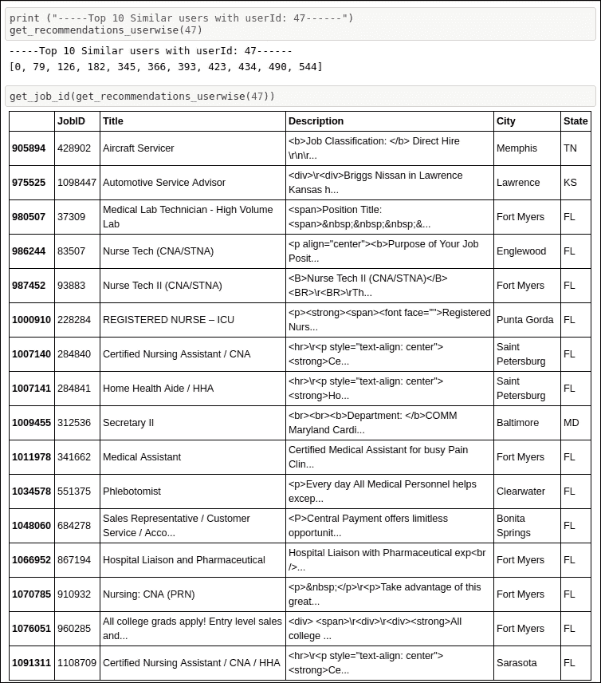

图 6.33:获取工作 id 和职位的代码片段

正如你所看到的，我们已经为`UserID 47`获得了相似的用户，正如我们在工作推荐中看到的，我们根据用户的个人资料和他们的教育资格获得了相当相关的工作。在推荐中，我们可以看到佛罗里达州医疗领域的工作。这是因为，在我们的用户群中，大多数用户的个人资料都来自医学背景。由于我们考虑了用户资料和工作资料，我们能够得到最相关的工作推荐。

# 总结

在这一整章中，我们使用了基于内容的方法来开发工作推荐引擎，您了解了如何废弃数据集并构建基线工作推荐引擎。之后，我们探索了另一个数据集。对于修改后的最佳方法，我们使用了现成的数据集。在改进方法的开发过程中，我们考虑了工作的元数据，并建立了一个工作良好的推荐系统。对于最佳方法，我们试图找出相似的用户配置文件。基于用户的档案，我们向用户组推荐工作。

在下一章，我们将构建一个摘要应用。在那里，我们将看一下医学领域的文档，并尝试对它们进行总结。我们将使用深度学习算法来构建应用。所以，继续读！