    

# 第七章。文本摘要

在本章中，我们将构建摘要应用程序。我们将特别关注文本数据集。我们的主要目标是对医疗记录执行汇总任务。基本上，这个想法是想出一个好的解决方案来总结医疗转录文档。

这种汇总应用程序极大地帮助了医生。你问怎么做？我们举个例子。假设一个病人患有某种疾病有 10 年的病史，10 年后，他咨询一个新的医生以获得更好的结果。第一天，患者需要将他们最近 10 年的医疗处方交给这位新医生。之后，医生需要研究所有这些文件。医生也依赖于他与病人的谈话。通过使用医疗记录和与病人的交谈，医生可以了解病人的健康状况。这是一个相当冗长的方法。

但是，如果我们可以生成患者病历的摘要，并将这些摘要文档提供给医生，会怎么样呢？这似乎是一个有前途的解决方案，因为这样，我们可以节省医生的时间和精力。医生能够以有效和准确的方式了解病人的问题。患者可以从第一次见医生开始接受治疗。这对双方来说是一个双赢的局面，这种解决方案正是我们在这里努力建立的。因此，在本章中，我们将讨论以下主题:

*   了解总结的基础知识
*   介绍问题陈述
*   了解数据集
*   构建基线方法:

    *   实施基线方法
    *   基线方法的问题
    *   优化基线方法

*   构建修订方法:

    *   实施修订方法
    *   修订方法存在的问题
    *   了解如何改进修订方法

*   最佳方法:

    *   实施最佳方法

*   最佳方法:为亚马逊评论构建一个摘要应用程序
*   摘要

# 了解总结的基础

在这一部分，我们将重点关注总结的基本概念。在当今快速发展的信息时代，文本摘要已经成为一种重要的工具。人类很难为大型文本文档生成摘要。如今网上有很多可用的文档。因此，我们需要一个能够高效、准确、智能地自动生成文档摘要的解决方案。这个任务被称为自动文本摘要。

自动文本摘要就是在很短的时间内从大量的文本文档中找到相关的信息。基本上，有两种类型的总结:

*   摘录摘要
*   抽象概括

我们一个一个来看总结的类型。

## 摘要摘要

在提取摘要方法中，我们将通过从原始文档中选择单词、短语或句子来生成文档摘要。我们将使用诸如**术语频率、逆向文档频率** ( **TF-IDF** )、计数矢量器、余弦相似性和排序算法等概念来生成这种类型的摘要。

我们已经在[第 4 章](ch04.xhtml "Chapter 4. Recommendation Systems for E-Commerce")、*电子商务推荐系统*、章节*了解 TF-IDF* 中介绍了 TF-IDF、计数矢量器和余弦相似性等概念。当我们在本章中实现代码时，我们将会看到排名机制。

## 抽象概括

在抽象摘要方法中，我们将尝试让机器学习内部语言表示，以便它可以通过转述生成更像人类的摘要。

为了实现这种类型的摘要，我们将使用深度学习算法，例如带有注意机制的序列对序列模型。你将在本章的后面学习算法和概念。

# 介绍问题陈述

在本章开始时，我们已经看了问题陈述的概述。在这里，我们将深入研究进一步的细节。我们想建立一个自动文本摘要应用程序。我们将提供一份医疗转录文件作为输入。我们的目标是生成本文档的摘要。注意，在这里，我们将提供一个文档作为输入，作为输出，我们将生成这个文档的摘要。我们希望为文档生成一个信息摘要。信息摘要是一种摘要类型，其中就信息的汇聚而言，摘要文档是原始文档的替代物。这是因为我们正在处理医疗领域。

最初，我们在我们的方法中使用提取摘要方法。我们将为医疗文档生成摘要。在这一章的后面，我们还将开发一个可以生成亚马逊评论的抽象摘要的解决方案。

现在，是时候探索数据集，看看我们在访问数据集时所面临的挑战了。

# 了解数据集

本节分为两部分。在第一部分，我们需要讨论我们为了生成数据集所面临的挑战。在后面的部分，我们将讨论数据集的属性。

## 获取数据集的挑战

众所周知，卫生领域在获取数据集方面是一个高度管制的领域。以下是我想强调的一些挑战:

*   对于摘要，理想情况下，我们需要一个包含原始文本以及该文本摘要的语料库。这就是所谓的平行语料库。不幸的是，没有好的、免费的平行语料库可用于医学文档摘要。我们需要为英语语言获取这种并行数据集。
*   有一些免费的数据集可用，如 MIMIC II 和 MIMIC III 数据集，但它们不包含医学转录的摘要。我们可以从这个数据集中获取医疗记录。访问该数据集是一个漫长而耗时的过程。

为了解决前面的挑战，专业人士、研究人员、学者和大型科技公司需要站出来，为医疗领域提供高质量、免费的数据集。现在让我们看看如何获得医学转录数据集。

## 了解医疗转录数据集

您可能想知道如果我们没有并行数据集，那么我们将如何构建汇总应用程序？这里有一个解决方法。我有一份来自 MIMIC-II 数据集的医学转录样本。我们将使用它们并生成文档的摘要。除此之外，我们将参考 www.mtsamples.com[的](http://www.mtsamples.com)，以便了解我们可能拥有的不同种类的医学转录。借助最少数量的文档，我们将构建摘要应用程序。您可以在下图中看到这些医疗记录的样子:

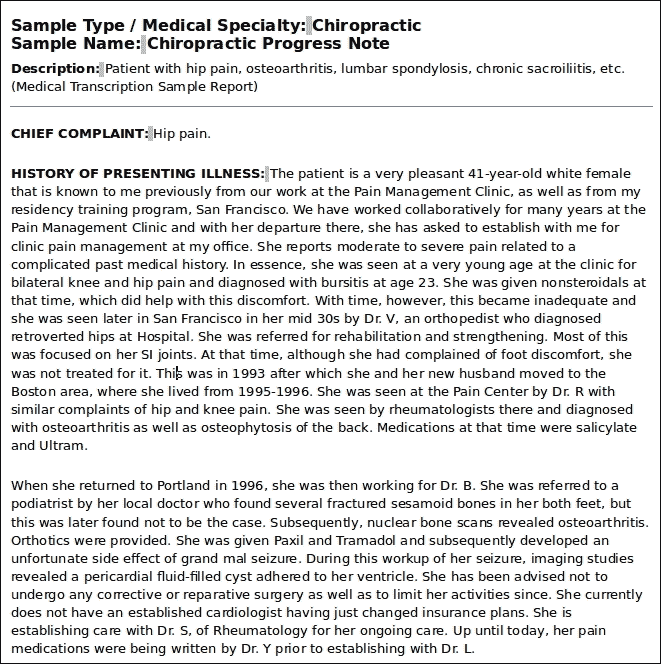

图 7.1:医疗记录样本

一般来说，在医学转录中，有几个部分，它们如下:

*   **主诉**:此部分描述患者面临的主要问题或疾病
*   **病史** **患者疾病史**:本节详细描述了患者的医疗状况和其类似疾病或其他种类疾病的病史
*   **既往病史**:此部分描述了患者过去所患疾病的名称
*   **既往手术史**:如果患者过去做过任何手术，那么这些手术的名称会在此处提及
*   **家族史**:如果任何家庭成员患有相同类型的疾病或家族中有某种疾病史，那么这些都会在本节中提及
*   **药物**:该部分描述了药物名称
*   **体检**:本部分有所有与体检相关的描述
*   **评估**:此部分包含在考虑了所有前述参数后，患者可能患有的潜在疾病的详细信息。
*   **建议**:本部分描述了针对患者投诉的建议解决方案
*   **关键字**:这一部分具有可以恰当地描述整个文档的关键字，因此数据集也可以用于主题建模任务

这种转录在某些章节是随机的。一些转录包含所有前面的部分，一些没有。因此，这种文档的节数可能会有很大变化。

现在让我们来看看与亚马逊评论数据集相关的细节。

## 了解亚马逊的评论数据集

在本章的后面，我们将使用 Amazon review 数据集来生成抽象摘要。因此，如果您了解这个数据集的基本数据属性，会更好。首先，你可以使用这个链接下载那个数据集:[https://www . ka ggle . com/Currie 32/summarying-text-with-Amazon-reviews/data](https://www.kaggle.com/currie32/summarizing-text-with-amazon-reviews/data)。你需要下载的文件名称是`Reviews.csv`。

可以参考下面的截图来看看这个数据集的内容:

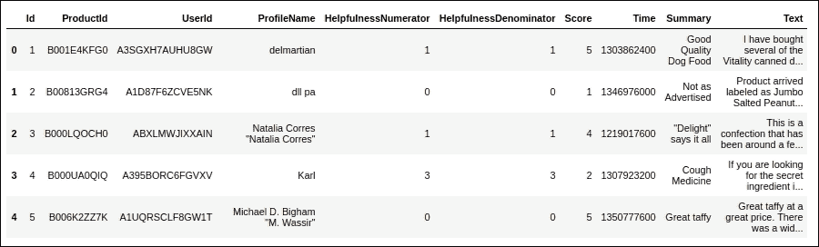

图 7.2:来自亚马逊评论数据集的数据记录

让我们来理解这个数据集的每个数据属性:

*   `ID`:该属性表示数据记录的序号。
*   `ProductId`:该属性表示特定产品的唯一 ID。
*   `UserId`:该属性表示已共享其对特定产品的评论的用户的唯一用户 ID。
*   `ProfileName`:该数据属性是用户的配置文件名称。使用这个档案名称，用户将提交他们的审查。
*   `HelpfulnessNumerator`:此属性表示有多少其他用户认为此评论非常有用。
*   `HelpfulnessDenominator`:该属性表示投票决定该评论是否有用的用户总数。
*   `Score`:这是特定产品的分数。零表示用户不喜欢，五表示用户非常喜欢。
*   `Time`:该属性表示提交评审的时间戳。
*   `Summary`:这个属性非常有用，因为它表示整个评审的摘要。
*   `Text`:该属性是任何给定产品的长文本评论。

现在我们已经查看了两个数据集。让我们继续下一部分。

# 建立基线方法

在本节中，我们将为摘要应用程序实施基线方法。我们将使用医疗记录来生成摘要。这里我们将使用一个小型试验 MIMIC-II 数据集，它包含一些样本医疗文档和用于获取医疗转录的[www.mtsamples.com](http://www.mtsamples.com)。你可以用这个 GitHub 链接找到代码:[https://GitHub . com/jalajthanaki/medical _ notes _ extractive _ summary/tree/master/Base _ line _ approach](https://github.com/jalajthanaki/medical_notes_extractive_summarization/tree/master/Base_line_approach)。

让我们开始构建基线方法。

## 实施基线方法

在这里，我们将执行以下步骤来构建基线方法:

*   安装 python 依赖项
*   编写代码并生成摘要

### 安装 python 依赖项

为了开发摘要应用程序，我们将使用两个非常容易使用的 python 依赖项。一个是`PyTeaser`，第二个是`Sumy`。您需要执行以下命令来安装这两个依赖项:

```
$ sudo pip install pyteaser
$ sudo pip install sumy or $ sudo pip3 install sumy

```

### 注

请注意，`PyTeaser`库只适用于`python 2.7`。Sumy 可以和`python 2.7`和`python 3.3+`一起工作。

现在让我们写代码。

### 编写代码并生成摘要

Sumy 库`PyTeaser`和都有很好的特性。它们将任何 weburl 作为输入，并为给定的 weburl 生成摘要。可以参考下面截图中给出的代码片段:

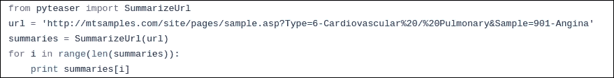

图 7.3:使用 PyTeaser 生成摘要的代码片段

如你所见，我们正在传递来自[www.mtsamples.com](http://www.mtsamples.com)的样本医疗记录的网址。`PyTeaser` 库将生成文档的前五个句子作为摘要。要查看输出，您可以看看下面的屏幕截图:

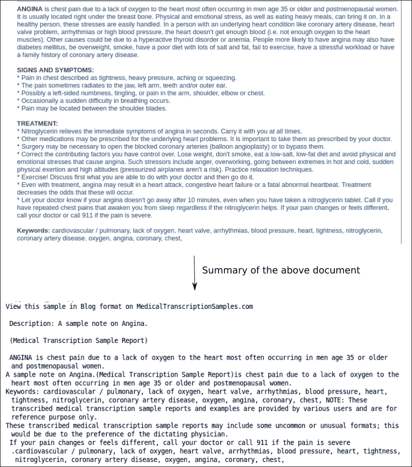

图 7.4:使用 PyTeaser 的医学转录摘要

现在让我们试试`Sumy`库。你可以参考下面截图给出的代码:

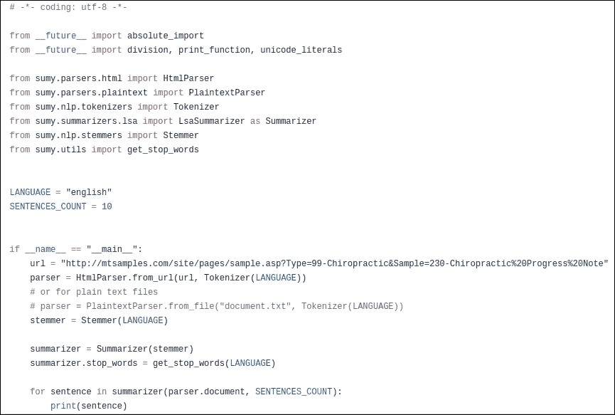

图 7.5:使用 Sumy 生成摘要的代码片段

在`Sumy` 库中，我们需要将 weburl 作为输入传递，但是有一点不同。正如您可以在前面的代码中看到的，我们提供了`SENTENCES_COUNT = 10`，这意味着我们的摘要或输出有 10 个句子。我们可以通过使用`SENTENCES_COUNT`参数来控制语句的数量。您可以参考下图中给出的输出:

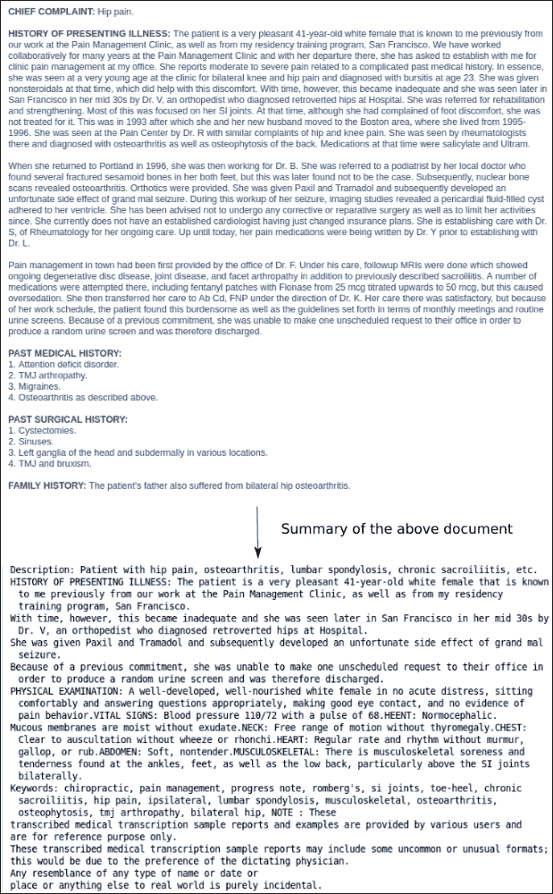

图 7.6:使用 Sumy 的医学转录摘要

如果您查看并比较了`Sumy`和`PyTeaser`库的输出，那么您可以说`Sumy`库比`PyTeaser`库表现得更好。如您所见，这两个库都获得了给定文档的基本摘要。这些库使用排序算法和单词的频率来获得摘要。我们无法控制它们的内部机制。您可能想知道我们是否可以做自己的总结，以便在需要的时候优化代码。答案是肯定的；我们可以为这项任务开发代码。在此之前，让我们讨论一下这种方法的缺点，然后我们将使用修改后的方法构建自己的代码。

## 基线方法的问题

在这里，我们将讨论基线方法的缺点，以便我们可以在下一次迭代中处理这些缺点:

*   如前所述，我们对这些库的代码没有完全的所有权。因此，我们不能轻易改变或增加功能。
*   我们已经获得了一种基本的总结，所以我们需要改进总结的结果。
*   由于缺乏平行语料库，我们无法构建一个能够为医学文档生成抽象摘要的解决方案。

这是基线方法的三个主要缺点，我们需要解决它们。在这一章中，我们将关注第一个和第二个缺点。对于第三个缺点，我们无能为力。所以，我们不得不忍受这个缺点。

让我们讨论一下我们将如何优化这种方法。

## 优化基线方法

在这一部分，我们将讨论如何优化基线方法。我们将实现一个简单的总结算法。这种算法背后的思想很简单:这种方法也为医疗文档生成摘要。我们需要执行以下步骤:

1.  首先，我们需要确定单词在给定文档中的出现频率。
2.  然后，我们把文档分成一系列的句子。
3.  为了生成摘要，我们选择使用频率较高的句子。
4.  最后，我们对总结句子进行重新排序，以便生成的输出与原始文档一致。

前面的算法可以解决我们的两个缺点，尽管我们可能需要第三个缺点的帮助，因为现在没有可用的数据集可用于摘要任务，特别是在医学领域。对于这一章，我们不得不忍受这个缺点(不幸的是，我们没有任何其他选择)，但不要担心。这并不意味着我们不会学习如何生成抽象的摘要。为了学习如何生成抽象摘要，我们将在本章后面使用 Amazon review 数据集。

现在让我们实现我们在本节中描述的算法的步骤。

# 构建修订的方法

现在我们将编写我们在上一节讨论过的算法。在实现之后，我们将检查我们的算法执行的好坏。这个算法很容易实现，所以让我们从代码开始。你可以在这个 GitHub 链接找到代码:[https://GitHub . com/jalajthanaki/medical _ notes _ extractive _ summary/tree/master/Revised _ approach](https://github.com/jalajthanaki/medical_notes_extractive_summarization/tree/master/Revised_approach)。

## 实施修订后的方法

在这一部分，我们将逐步实现总结算法。这些是我们将在这里构建的功能:

*   get _ summarized 函数
*   reorder_sentences 函数
*   汇总功能

让我们从第一个开始。

### get _ summaryed 函数

基本上，这个函数执行汇总任务。首先，它将文档的内容作为字符串形式的输入。之后，这个函数生成单词的频率，所以我们需要将句子标记成单词。之后，我们将从给定的文档中生成前 100 个最常用的单词。对于小数据集，前 100 个最常用的单词可以很好地描述给定数据集的词汇，所以我们不考虑更多的单词。如果您有大型数据集，那么您可以根据数据集的大小考虑前 1000 个或前 10000 个最常用的单词。可以参考下图给出的代码:

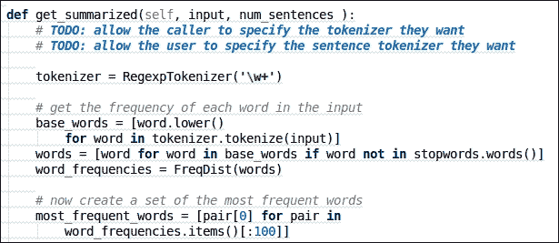

图 7.7:从给定的输入文档中生成最常用单词的代码片段

现在让我们编写第二步的代码。我们需要把文件分成句子。我们将把这些句子转换成小写。我们将在这里使用 NLTK 句子分割器。可以参考下图给出的代码:


图 7.8:从输入文档生成句子的代码片段

在第三步中，我们将迭代最频繁单词的列表，并找出包含更高数量的频繁单词的句子。可以参考下图所示的代码:

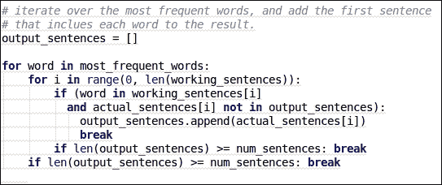

图 7.9:生成包含大量常用词的句子的代码片段

现在是时候重新排列句子，使句子顺序与原始输入文档一致。

### reorder _ sentences 函数

这个功能基本上是对摘要的句子进行重新排序，使得所有的句子与原始文档的句子的顺序一致。我们将考虑摘要句子和原始文档中的句子，并执行排序操作。可以参考下图给出的代码:

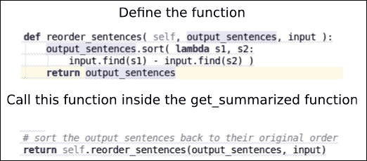

图 7.10:对摘要句子重新排序的代码片段

现在让我们进入最后一步。

### 总结功能

这个函数主要生成摘要。这是我们可以从任何其他文件中调用的方法。这里需要传递输入的数据和我们在总结内容中需要的句子数量。您可以参考下图中显示的代码:

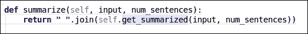

图 7.11:定义可以在类外调用的函数的代码片段

### 生成摘要

现在让我们看一下这段代码的演示，并为文档生成摘要。我们将传递来自[www.mtsamples.com](http://www.mtsamples.com)的文本内容，然后尝试生成内容摘要。可以参考下图给出的代码片段:

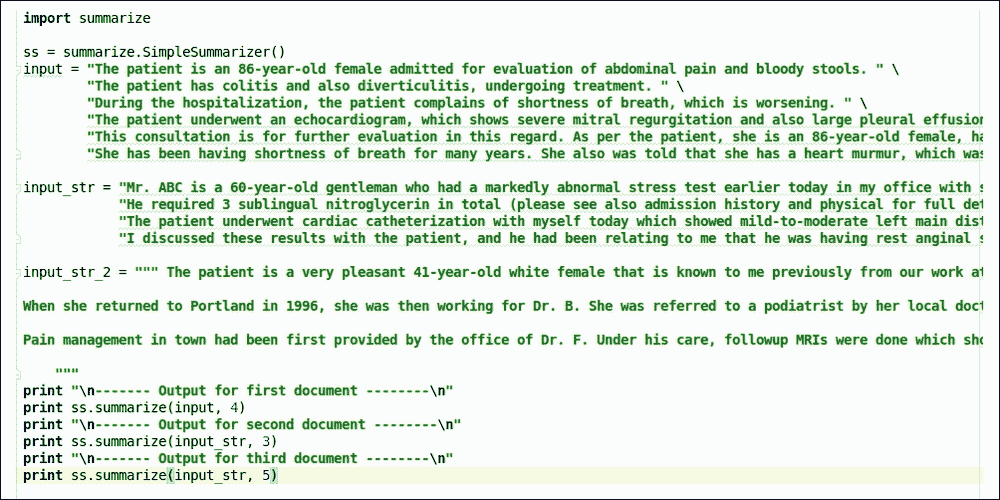

图 7.12:调用汇总函数的代码片段

下图给出了上述代码的输出:

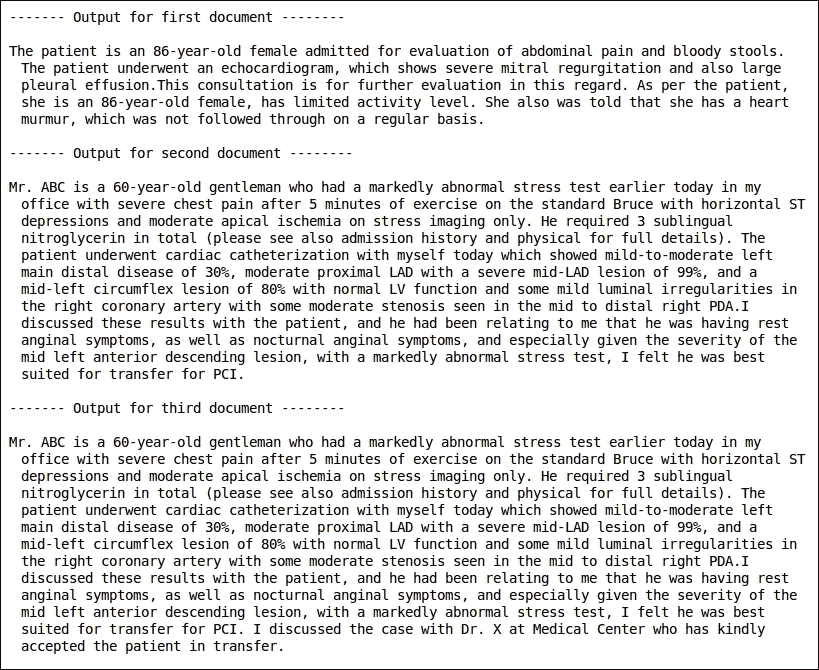

图 7.13:修订方法的输出

如您所见，输出比基线方法更相关。我们知道迄今为止我们所采取的步骤的方法。这种方法让我们清楚地知道如何为医学转录生成摘要。这种方法的好处是我们不需要任何并行摘要语料库。

现在让我们讨论一下修改后的方法的缺点。

## 修订方法的问题

在本节中，我们将讨论修订方法的缺点，如下所示:

*   修改后的方法没有根据句子的重要性对句子进行排序的排序机制。
*   到目前为止，我们已经考虑了词频；我们没有考虑它们相对于其他单词的重要性。假设单词 *a* 在文档中出现了一千次。这并不意味着它更重要。

现在让我们看看如何克服这些缺点。

## 了解如何改进修订后的方法

在本节中，我们将讨论我们应该采取的步骤，以改进修订后的方法。为了获得最佳的摘要结果，我们需要使用 TF-IDF 和句子排序机制来生成摘要。我们已经在[第 4 章](ch04.xhtml "Chapter 4. Recommendation Systems for E-Commerce")、*电子商务推荐系统*和*使用 TF-IDF 生成特性*部分介绍了 TF-IDF。我们将通过使用余弦相似度和 LSA(潜在语义分析)来建立排名机制。我们已经在[第 4 章](ch04.xhtml "Chapter 4. Recommendation Systems for E-Commerce")、*电子商务推荐系统*中看到了余弦相似度。让我们探索一下 LSA 算法。

### LSA 算法

LSA 算法类似于余弦相似度。我们将通过使用文档段落中出现的单词来生成矩阵。矩阵的行将代表每个段落中出现的独特单词，列代表每个段落。您可以在下图中查看 LSA 算法的矩阵表示:

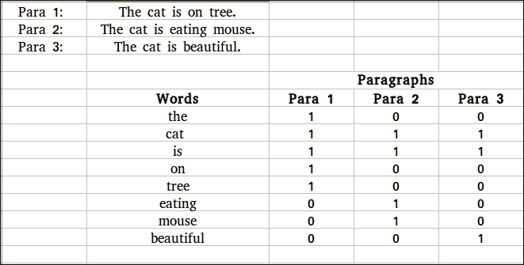

图 7.14:LSA 算法的矩阵表示

LSA 算法的基本假设是，意义相近的单词将出现在相似的文本中。从前面的例子可以看出，如果我们说单词对(cat，is)出现的频率更高，就意味着它比(cat，mouse)单词对承载的语义更高。这就是算法背后假设的意义。我们生成上图中给出的矩阵，然后尝试使用**单值分解** ( **SVD** )方法减少矩阵的行数。奇异值分解基本上是矩阵的分解。

### 注

你可以通过这个链接阅读更多关于奇异值分解的内容:【https://en.wikipedia.org/wiki/Singular-value_decomposition 。

这里我们是减少行数(也就是字数)，同时保留列间的相似结构(也就是段落)。为了生成词对之间的相似性得分，我们使用余弦相似性。为了构建摘要应用程序，记住这一点已经足够了。

现在，让我们讨论一下我们正在采取的方法，以便为医疗文档生成摘要构建最佳的解决方案。

### 最佳方法背后的想法

为了建立最佳方法，我们将执行以下步骤:

1.  首先，我们将以字符串的形式获取文档的内容。
2.  我们将解析句子，之后，我们将删除停用词和特殊字符。我们将把缩写转换成它们的完整形式。
3.  之后，我们将生成单词的词条和它们的**词性** ( **POS** )标签。Lemma 是除了单词的词根形式之外什么也不是，而 POS 标签表明该单词是用作动词、名词、形容词还是副词。有许多 POS 标签可用。你可以在这个网站找到 POS 标签列表:[https://www . ling . upenn . edu/courses/Fall _ 2003/ling 001/Penn _ tree bank _ POS . html](https://www.ling.upenn.edu/courses/Fall_2003/ling001/penn_treebank_pos.html)。
4.  我们将为单词生成 TF-IDF 向量的矩阵。
5.  对于给定的 TF-IDF 矩阵，我们将使用`SciPy`库生成 SVD 矩阵。
6.  最后，使用余弦相似度，我们可以对句子进行排序并生成摘要。

现在让我们看看这些步骤的实现。

# 最佳方法

在此部分，我们将了解最佳方法的实施。我们还将讨论代码的结构。因此，不浪费时间，让我们从实现开始。你可以用这个 GitHub 链接找到代码:[https://GitHub . com/jalajthanaki/medical _ notes _ extractive _ summary/tree/master/Best _ approach](https://github.com/jalajthanaki/medical_notes_extractive_summarization/tree/master/Best_approach)。

## 实施最佳方法

为了使执行代码，您需要采取的步骤如下:

1.  了解项目的结构
2.  理解助手功能
3.  生成摘要

让我们从第一步开始。

### 了解项目的结构

这个项目的结构在这里相当重要。我们将在四个不同的文件中编写代码。您可以在下图中看到项目的结构:

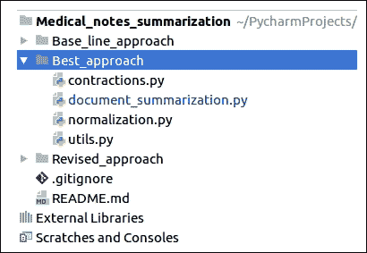

图 7.15:项目代码文件的结构

有四个代码文件。我将逐一解释它们的用法:

*   `Contractions.py`:这个文件包含了所有缩写的详细列表，尤其是语法缩写。可以看一下下图的列表缩写: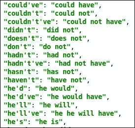

    图 7.16:缩写及其全称形式列表

*   `Normalization.py`:这个文件包含预处理步骤的各种帮助函数
*   `Utils.py`:此文件包含帮助函数，用于计算 TF-IDF，并获得给定 TF-IDF 矩阵的 SVD 矩阵
*   `Document_summarization.py`:该文件使用已经定义好的帮助函数，为文档生成一个摘要

现在让我们看看我们在每个文件中定义了什么样的帮助函数。

### 了解助手功能

我们将逐文件讨论帮助函数，这样你就能知道哪个帮助函数是哪个文件的一部分。

#### 正常化. py

这个文件包含许多帮助函数。我将根据使用顺序来解释每个助手函数:

*   `parse_document`:此函数将文档内容作为输入，并逐句对其进行标记。这意味着我们要一句一句地分割字符串。这里我们只考虑 Unicode 字符串。可以参考下图给出的代码片段: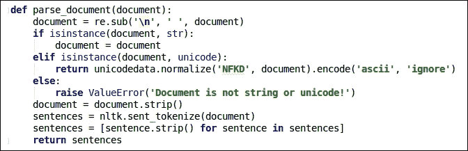

    图 7.17:解析文档的代码片段

*   `remove_special_characters`:该功能将删除字符串中的特殊字符。你可以参考下图给出的代码片段更好的理解: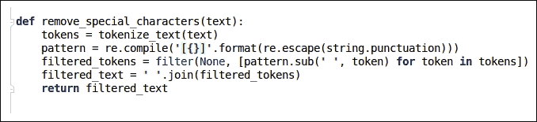

    图 7.18:去除字符串

    中特殊字符的代码片段
*   `remove_stopwords`:该功能将删除句子中的停用词。可以参考下图给出的代码片段: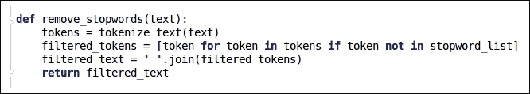

    图 7.19:去除停用词的代码片段

*   `unescape_html`:这个函数从句子中移除 HTML 标签。可以参考下图给出的代码片段: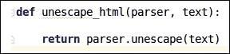

    图 7.20:去除 HTML 标签的代码片段

*   `pos_tag_text`:该函数将句子分词，然后为这些词提供词性标签。可以参考下图给出的代码片段: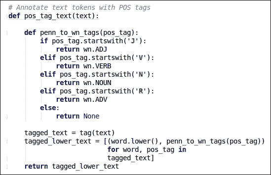

    图 7.21:生成 POS 标签

    的代码片段
*   `lemmatize_text`:这个函数将把句子分词，然后生成单词的词条。可以参考下图给出的代码: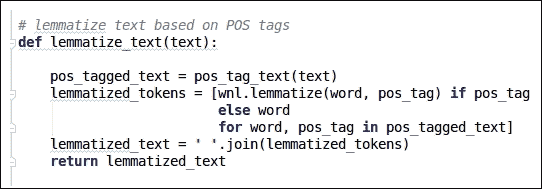

    图 7.22:生成

    词语引理的代码片段
*   `expand_contractions`:这个函数查看缩写。如果在给定的句子中有任何缩写出现在我们的列表中，那么我们将用它的完整形式替换该缩写。可以参考下图显示的代码: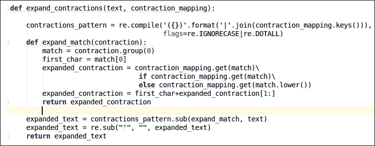

    图 7.23:用全称替换缩写的代码片段

*   `normalize_corpus`:这个函数调用前面所有的辅助函数，生成预处理后的句子。可以参考下图给出的代码: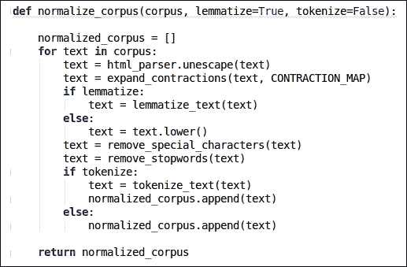

    图 7.24:生成预处理语句的代码片段

现在让我们看看我们在`utils.py`文件中定义了哪些函数。

#### Utils.py

在这个文件中，只有两个帮助函数。这里对它们进行了描述。

*   `build_feature_matrixs`:该函数使用 scikit-learn `Tfidfvectorizer` API 生成 TF-IDF 向量。我们提供预处理的文本作为输入，作为输出，我们有矩阵。这个矩阵包含给定单词的矢量化值。可以参考下图提供的代码片段: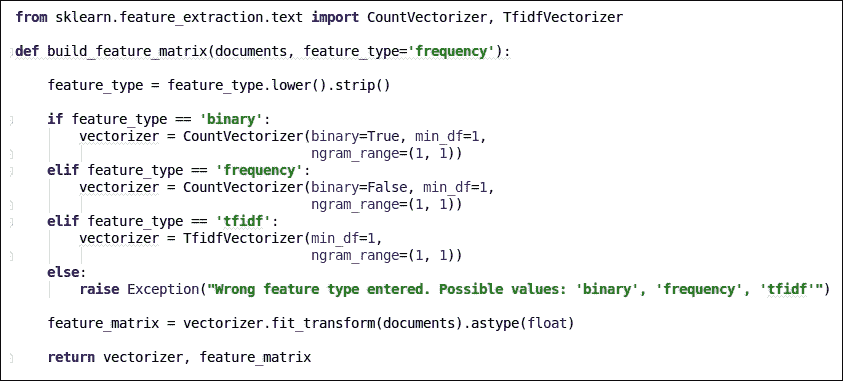

    图 7.25:生成 TF-IDF 向量的代码片段

*   `low_rank_svd`:这个特定函数使用 python 的`SciPy`库中的 API。它对 TF-IDF 矩阵进行奇异值分解，然后获得余弦相似性得分。根据分数，我们将对句子进行排序。在这里，我们只定义可以为 TF-IDF 矩阵生成 SVD 的函数。可以参考下图给出的代码片段: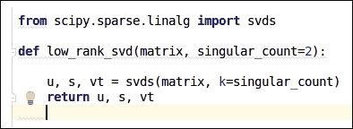

    图 7.26:生成 SVD

    的代码片段

现在让我们使用所有这些帮助函数来生成摘要。

### 生成摘要

在这一节中，我们将看看`document_summarization.py`文件中给出的代码。有两种方法负责为给定文档生成摘要。它们如下:

*   `textrank_text_summarizer`:该方法将预处理后的文档作为输入，通过使用`build_feature_matrix`辅助函数，我们将生成 TF-IDF 矩阵。之后，我们将生成相似性得分。基于相似性得分，我们将对句子进行排序，并为它们提供一个排名。作为输出，我们将显示这些排序后的句子。在这里，句子序列与原始文档对齐，所以我们不需要担心这一点。你可以看看下图给出的代码片段: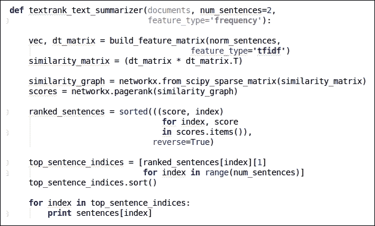

    图 7.27:使用 textrank _ text _ summarizer 方法

    生成摘要的代码片段
*   `lsa_text_summarizer:`该函数将预处理后的文本作为输入，生成 TF-IDF 矩阵。之后，对矩阵应用`low_rank_svd`方法，我们得到我们的分解矩阵。我们将使用这些分解矩阵生成相似性得分。在根据这个相似性分数对句子进行排序之后，我们可以生成摘要。可以参考下图显示的代码片段:

    图 7.28:使用 LSA _ text _ summarizer

    生成摘要的代码片段

我们将调用这些函数并生成输出。下图给出了其代码片段:

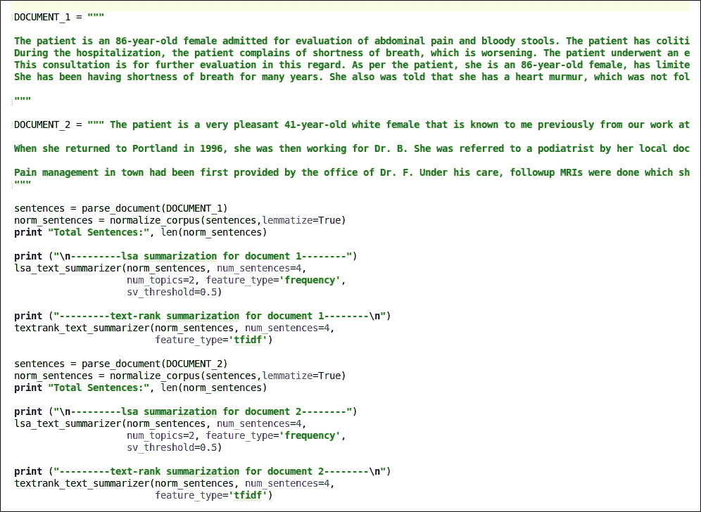

图 7.29:生成输出摘要的代码片段

你可以看一下下图所示的输出:

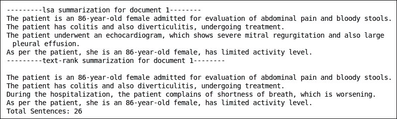

图 7.30:文档 1 的输出摘要

下图给出了另一个文档的输出:

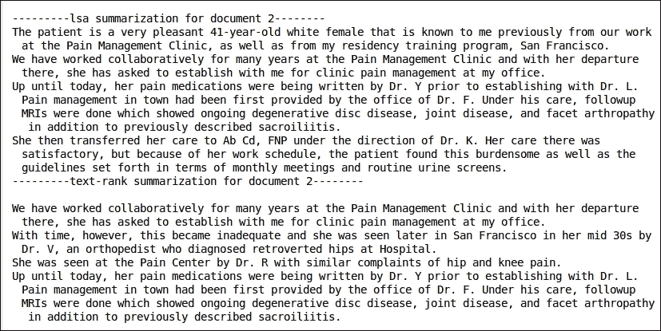

图 7.31:文档 _2 的输出摘要

正如您所看到的，与修改后的方法相比，我们将获得给定文档的更相关的摘要类型。现在让我们使用 Amazon 的产品评论数据集来构建抽象摘要应用程序。

## 使用亚马逊评论构建摘要应用程序

我们正在构建这个应用程序，以便您可以学习如何使用并行语料库来为文本数据集生成抽象摘要。我们已经在本章前面解释了与数据集相关的基本内容。在这里，我们将介绍如何使用深度学习(DL)算法构建一个抽象的摘要应用程序。可以参考使用这个 GitHub 链接的代码:[https://GitHub . com/jalajthanaki/Amazon _ review _ summary/blob/master/summary _ reviews . ipynb](https://github.com/jalajthanaki/Amazon_review_summarization/blob/master/summarize_reviews.ipynb)。

您也可以使用此链接下载预先训练好的模型:[https://drive.google.com/open?id = 1 inexmtqr 6 krdd V7 nhr 4 ldwtyy 7 _ hMALg](https://drive.google.com/open?id=1inExMtqR6Krddv7nHR4ldWTYY7_hMALg)。

对于此应用程序，我们将执行以下步骤:

*   加载数据集
*   探索数据集
*   准备数据集
*   构建 DL 模型
*   训练 DL 模型
*   测试 DL 模型

### 加载数据集

在本节中，我们将看到如何加载数据集的代码。我们的数据集是 CSV 文件格式。我们将使用熊猫来读取数据集。可以参考下图给出的代码片段:


图 7.32:加载数据集的代码片段

### 探索数据集

在本节中，我们将对数据集进行一些基本分析。我们将检查是否存在任何空条目。如果有，我们会删除它们。可以参考下图给出的代码片段:


图 7.33:删除空数据条目的代码片段

现在，让我们准备可用于训练模型的数据集。

### 准备数据集

为了准备数据集，我们将执行以下步骤:

*   我们将用缩写的全称来代替文中出现的缩写
*   我们将从评论数据列中删除特殊字符、URL 和 HTML 标签
*   我们将从评论中删除停用词

我们已经执行了前面所有的步骤，并生成了无垃圾评论。可以参考下图给出的代码片段:

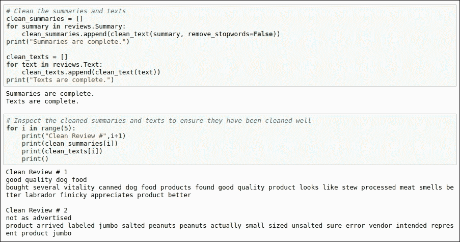

图 7.34:执行评审预处理的代码片段

在这里，有 132，884 个独特的词。你可以在运行代码时找到词汇表的大小。这些独特的单词是这个应用程序的词汇表，我们需要将这些单词转换成矢量格式。单词的矢量格式称为单词嵌入。您可以使用 Word2vec、Numberbatch 或 GloVe 来生成单词嵌入。这里，我们将使用 Numberbatch 的嵌入预训练模型，以便为该应用程序生成单词嵌入。Numberbatch 的预训练模型比 GloVe 更加优化和快速，所以我们使用 Numberbatch 的模型。可以参考下图给出的代码片段:

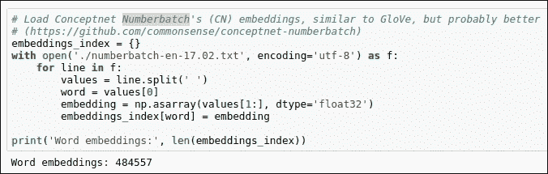

图 7.35:使用 Numberbatch 的预训练模型生成单词嵌入的代码片段

如果你想了解更多关于 word2vec 的知识，那么可以参考我之前的书， *Python 自然语言处理*，特别是[第六章](ch06.xhtml "Chapter 6. Job Recommendation Engine")，*高级特征工程和 NLP 算法*。链接是[https://www . packtpub . com/mapt/book/big _ data _ and _ business _ intelligence/9781787121423/6](https://www.packtpub.com/mapt/book/big_data_and_business_intelligence/9781787121423/6)。

### 构建 DL 模型

在这个部分，我们将构建 DL 算法。我们用的是 seq2seq 神经网络。基本上，seq2seq 模型用于处理顺序数据。语言或句子是单词的序列。在这个算法中，有一个接受单词嵌入并学习语言表示的编码器。这一层的输出被馈送到解码层。在这里，我们也将使用注意机制。注意力机制会集中在句子中最重要的部分。它将存储句子的语义表示。对于注意力机制，我们将使用具有循环神经网络架构的 LSTM 细胞，该细胞学习语言的复杂语义表示，并将其存储在 LSTM 网络中。当我们生成最终输出时，我们将使用解码器单元的权重以及 LSTM 单元的权重，并将生成最终的字嵌入。基于单词嵌入，我们将生成摘要。

为了实现这一点，我们需要使用带有注意力机制的**循环神经网络** ( **RNN** )来构建 seq2seq。可以参考下图给出的代码:

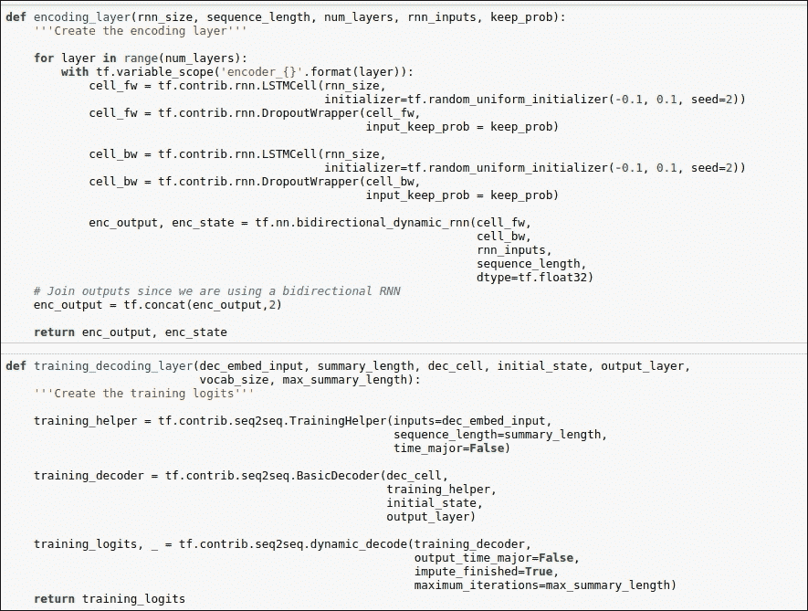

图 7.36:构建 RNN 编码层的代码片段

您可以参考下图给出的代码片段:

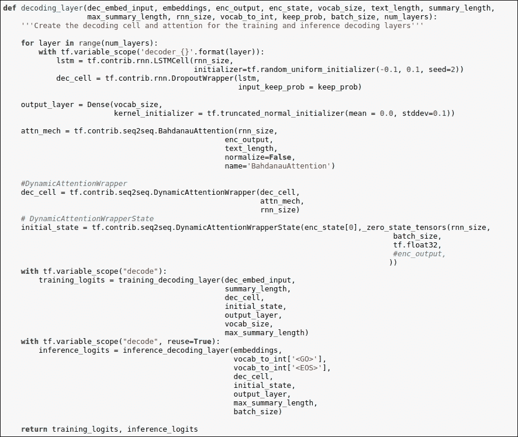

图 7.37:构建 RNN 解码层的代码片段

下图给出了构建 seq2seq 模型的代码片段:

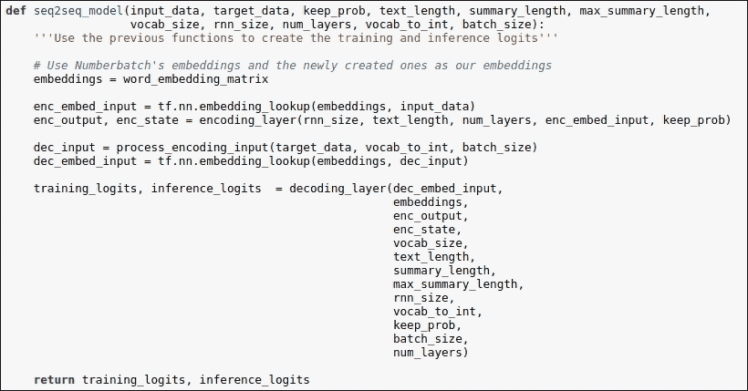

图 7.38:构建 seq2seq 的代码片段

现在我们来训练模型。

### 训练 DL 模型

基本上，我们已经建立了神经网络，现在是开始训练的时候了。在本节中，我们将定义所有超参数的值，例如学习率、批量大小等等。可以参考下图给出的代码:

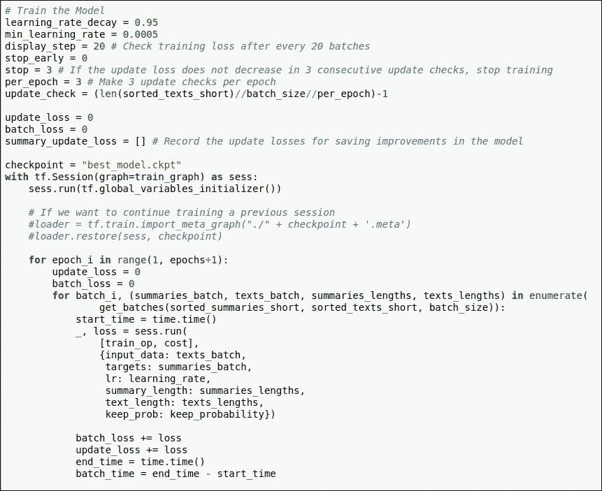

图 7.39:训练模型的代码片段

在训练期间，我们将跟踪损失函数并使用梯度下降算法，我们将尝试最小化损失函数的值。可以参考下图给出的代码片段:

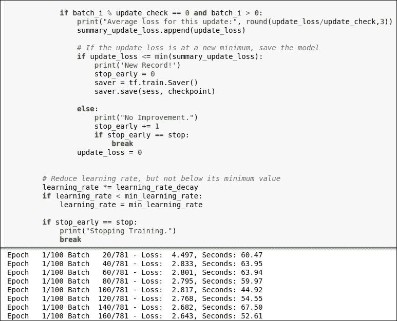

图 7.40:追踪损失函数的代码片段

这里，我们有在 CPU 上训练模型 6 到 8 小时，我们有损失值 1.413。你也可以训练模型更多的时间。现在让我们测试训练好的模型。

### 测试 DL 模型

在这一部分，我们加载训练好的模型，并为随机选择的评审生成摘要。可以参考下图给出的代码片段:

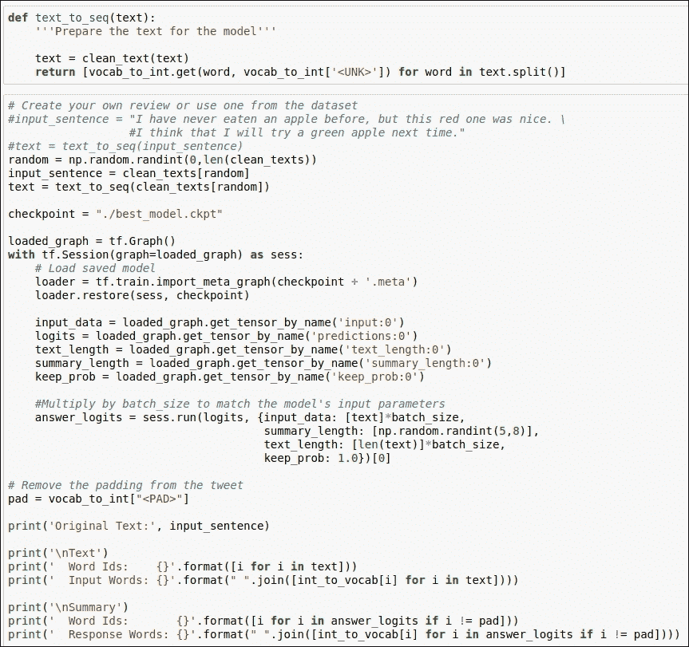

图 7.41:为给定的评审生成摘要的代码片段

前面代码的输出如下图所示:

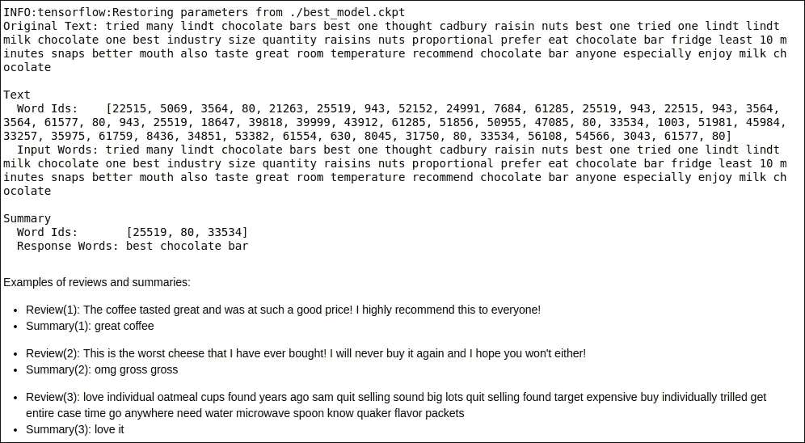

图 7.42:给定评审的摘要

如果我们想为给定的文本数据生成一行摘要，这种方法非常好。将来，如果我们有并行的医学转录数据集用于摘要任务，那么这种方法将会工作得很好。

# 摘要

在这一章中，我们为医学转录构建了摘要应用程序。首先，我们列出了为医学领域的摘要任务生成良好的并行语料库所面临的挑战。之后，对于我们的基线方法，我们使用了已经可用的 Python 库，比如`PyTeaser` 和`Sumy`。在修改后的方法中，我们使用词频来生成医学文档的摘要。在最佳可能的方法中，我们结合了基于词频的方法和排序机制，以便为医学笔记生成摘要。

最后，我们开发了一个解决方案，其中我们使用了亚马逊的评论数据集，这是用于摘要任务的并行语料库，我们建立了基于深度学习的摘要模型。我建议研究人员、社区成员和其他所有人都来构建高质量的数据集，这些数据集可用于构建健康和医疗领域的一些伟大的数据科学应用程序。

在下一章，我们将建立聊天机器人。过去几年，聊天机器人或虚拟助手已经成为数据科学领域的热门话题。因此，在下一章中，我们将考虑一个电影对话数据集和脸书`bAbI`数据集。在这些数据集的帮助下，通过使用深度学习算法，我们将构建聊天机器人。所以，如果你想学习如何为自己打造一个，那就继续读下去吧！