    

# 第八章。开发聊天机器人

2017 年是聊天机器人的天下，2018 年仍将如此。聊天机器人一点都不新鲜。聊天机器人的概念从 20 世纪 70 年代就有了。有时，聊天机器人应用也被称为问答系统。这是聊天机器人的一个更具体的技术术语。让我们走进历史。Lunar 是第一个基于规则的问答系统。利用这个系统，地质学家可以从阿波罗任务中询问有关月球岩石的问题。为了即兴创作阿波罗任务中使用的基于规则的系统，我们必须找到一种方法来编码基于模式的问题和答案。为此，使用了**人工智能标记语言**，也称为 **AIML** 。这有助于程序员编写更少的代码行，以获得与我们使用基于硬编码模式的系统相同的结果。随着最近在**机器学习** ( **ML** )领域的进展，我们可以构建一个没有硬编码响应的聊天机器人。

聊天机器人现在用于应用中，因为它们有许多好处；例如，用户不需要在手机上安装不同种类的应用。如果有一个聊天机器人为你提供新闻，那么你可以在 CNN 或《经济时报》上寻找新闻。大型科技巨头，如脸书、Hike、微信、Snapchat、Slack 等，都提供聊天机器人来提高客户参与度。他们通过制作聊天机器人来实现这一点，人们可以引导他们的客户进行一些操作；它还提供了关于产品及其平台的有用信息。

聊天机器人提供不同的服务。通过使用脸书聊天机器人平台，你可以订购鲜花，还可以看到新闻。听起来是不是很酷？从技术上来说，这些聊天机器人是当前时代的新应用。我已经简要地讨论了聊天机器人的好处，但是我们将在本章中详细地讨论它们。

在本章中，我们将讨论以下主题:

*   介绍问题陈述
*   了解数据集
*   构建聊天机器人的基础版本:

    *   了解基于规则的系统
    *   了解方法
    *   了解架构

*   实现基于规则的聊天机器人系统
*   测试基于规则的聊天机器人
*   现有方法的问题:

    *   了解优化方法的关键概念

*   实施修改后的方法:

    *   数据准备
    *   实施顺序对顺序(seq2seq)模型

*   测试修订版方法:

    *   了解测试指标
    *   测试聊天机器人的修订版

*   问题与修正方法:

    *   理解关键概念

*   最佳方法:

    *   实施最佳方法

*   摘要

# 介绍问题陈述

在这一章中，我们的主要目标是了解如何构建聊天机器人。聊天机器人，或者说**问答系统** ( **QA 系统**)，真的很有帮助。让我们考虑一个有趣的例子。假设你是一名学生，你有五本书要读。阅读和理解五本书可能需要时间。如果你能把这五本书的内容都输入电脑，并且只问相关的问题，会怎么样？通过这样做，学生可以更快地学习概念和新信息。众所周知，各大互联网产品公司都在整理信息，以便于获取。聊天机器人或问答系统将帮助我们理解这些信息背后的含义。这是聊天机器人成为 2017 年流行语的主要原因。无论你能想到什么应用，你都可以为它制作一个聊天机器人。现在很多消息平台都托管了开发者搭建的聊天机器人，包括 Facebook Messenger、Slack、微信等等。聊天机器人是新的应用，因为它们已经存在于你一天可能会使用十几次的已安装应用中。使用脸书聊天机器人 API 开发的聊天机器人位于 Facebook Messenger 应用内。您可能一天要使用 Messenger 十几次。因此，用户不需要为特定功能安装单独的应用。这将有助于公司更好地吸引客户。

在我们继续之前，我想介绍几个重要的术语，它们可以帮助我们理解本章中我们针对的是哪种聊天机器人开发。首先，让我们了解一下开发聊天机器人的不同方法:

*   基于检索的方法
*   基于生成的方法

## 基于检索的方法

在基于检索的方法中，我们需要定义一组预定义的响应，我们将对预定义的响应应用某种试探法，以便聊天机器人可以为给定的问题生成最佳可能的答案。答案在很大程度上取决于输入问题和输入问题的上下文。

早些时候，在基于检索的模型的开发过程中，我们只使用了表达式匹配，这可以帮助我们获得适当的答案，但在这里，只使用表达式匹配对我们没有帮助。所以最近，研究人员和程序员已经开始使用表达式匹配和高级机器学习(ML)分类器技术。让我们举一个例子来了解机器学习分类器如何有助于构建基于检索的聊天机器人。

假设爱丽丝需要在她的朋友生日时送花给他们。她的一个朋友艾玛喜欢玫瑰，另一个朋友露西喜欢百合。爱丽丝使用一个订购鲜花的聊天机器人来预订她的订单。她写道，*我想预订一束多色玫瑰花束和一束百合花*。因此，在这种情况下，如果我们实现一个基本的 ML 分类器，聊天机器人可以很容易地识别出 Alice 预订了两个不同的订单，并且它还能够解释每个订单的数量。聊天机器人还会询问不同的地址等等。通过使用 ML 技术，我们可以编写更复杂的试探法，这可以帮助我们生成更合适的聊天机器人答案。脸书信使聊天机器人 API 就是一个例子。

还有一个有趣的例子可以通过使用 ML 试探法来解决。比方说，你问一个聊天机器人，*今天是星期几？或者*、*今天是什么日子？如果我们已经实现了先进的 ML 技术，那么它可以识别出两个问题的措辞不同，但意图相同。在聊天机器人的开发过程中，意图和上下文检测是更复杂的任务，可以通过 ML 技术和使用一些试探法来实现。*

现在让我们转到更难的方法，即基于生成的方法。

## 基于生成的方法

在基于生成的方法中，聊天机器人没有任何预定义的响应。聊天机器人从头开始生成响应。为了构建基于生成的聊天机器人，我们需要提供大量数据，机器将学习如何通过查看数据来回答用户提出的问题。2015 年，谷歌研究人员 Oriol Vinyals 和 Quoc V. Le 提出了一种叫做*神经对话网络的方法。*你可以参考位于:[https://arxiv.org/pdf/1506.05869v2.pdf](https://arxiv.org/pdf/1506.05869v2.pdf)的论文。

在这篇论文中，研究人员使用了康奈尔大学的电影对话数据集。这个数据集已经被输入到机器中，这样它就可以学习基本的英语。为此，他们使用了**序列到序列** ( **seq2seq** )神经网络架构。之后，他们使用 IT 支持数据集，这样机器就有了领域知识。一旦一台机器接受了这方面的训练，他们已经在 IT 支持部门测试了聊天机器人，这个聊天机器人将能够非常准确地回答问题。在接下来的部分，我们将建立自己的神经对话网络。这种方法耗时较少，并且克服了我们在基于检索的模型中所面临的挑战，例如意图识别、上下文识别等等。

这里我们需要讨论一些其他的重要术语。在开发聊天机器人之前，我们需要考虑一些重要的约束条件。第一个与会话领域相关:

*   开放域
*   闭域

## 开域

首先，我们来了解一下什么是开放域。对话有时是模糊和不确定的。我给你举个例子。假设你遇到一个多年不见的老校友。在对话过程中，你不知道你们俩会谈论哪个特定的话题。在这种情况下，对话可以在任何地方进行。所以，对话的领域不是固定的。你可以谈论生活、工作、旅行、家庭等等。你可以谈论无数的话题。这种谈话，我们不能限制我们谈论的领域，这种谈话被称为开放领域。开发一个开放领域的聊天机器人是困难的，因为理想情况下，这种聊天机器人可以以人类水平的准确性回答任何领域的所有问题。

目前，这种聊天机器人还没有制造出来。当我们能够制造这种聊天机器人时，它必须通过图灵测试。让我给你看一下图灵测试，这样你可以更好地理解这个解释。这个实验是伟大的计算机科学家艾伦·图灵在 1950 年创造的。在这个实验中，一个叫做法官的人向一个人和一台机器问了一系列问题。现在，法官不会知道哪个答案来自人类，哪个来自机器。但在看到或听到答案后，如果法官无法区分哪些答案来自人类，哪些答案来自机器，那么机器通过了图灵测试，我们可以说机器展现了人类水平的智能，因为它的行为和人类一样智能。到目前为止，还没有一个聊天机器人以人类水平的准确度通过了图灵测试。你可以通过访问[https://en.wikipedia.org/wiki/Turing_test](https://en.wikipedia.org/wiki/Turing_test)了解更多关于图灵测试的信息。这一技术领域发展迅速，因此未来五年可能会令人兴奋。

谷歌在开发开放域名聊天机器人方面相当积极。它正在以谷歌协助的形式构建这一产品，但通过图灵测试的准确性水平和功能仍然有限。现在让我们来了解第二种类型的域。

## 封闭域

封闭域与开放域相反。对于一个封闭域，我们需要限制对话主题。举个例子:在办公室，我们有时会开会。在会议之前，与会者知道将要讨论的主题。所以在会议期间，我们只关注那些话题。在这里，我们不会有无限多的话题和领域来谈论。这种谈话，我们已经限制了我们可以谈论的领域，被称为一个封闭的领域。

如果银行等金融机构为其客户推出聊天机器人，那么开发的聊天机器人无法回答诸如*你能告诉我* *新加坡今天的天气如何？但是它可以帮助你检查申请信用卡的程序，这是因为聊天机器人可以理解与特定领域相关的问题。一个封闭领域的聊天机器人肯定是可能的，而且有许多公司正在开发特定领域的聊天机器人，因为这有利于吸引客户群。因此，在本章中，我们将重点关注封闭域聊天机器人。*

让我们试着理解最后一个约束；对话长度，这意味着我们将从聊天机器人那里得到的答案的长度。基于此，我们需要理解以下术语:

*   短对话
*   长谈

## 简短的对话

这种类型的聊天机器人可以生成简短的答案。在聊天机器人的开发过程中，我们需要问自己，我们是否期待一个简短的对话。如果我们期待一个简短的回答，那么你应该感到高兴，因为这个基于简短对话的聊天机器人很容易构建。简短对话的一个例子是，如下所示:

人类:嗨

机器:喂

人类:你好吗？

机器:我很好

这个例子显示了聊天机器人生成的简短对话。

## 长谈

这种聊天机器人可以生成很长的答案。机器很难学习长时间的对话，因此构建一个可以生成长时间对话的聊天机器人很困难。让我们来看一个长对话的例子:

人类:我想给你讲个故事。

机器:请继续。

人类:给你。约翰去了市场。丹尼尔要去印度旅行。Siri 有一个苹果。Siri 在厨房。所以我的问题是，Siri 在哪里？

机器:根据你的故事，我认为 Siri 在厨房里。

正如您在这个示例中看到的，为了生成正确的答案，机器还应该存储和处理给定的事实，以便能够生成正确的答案。因此，长时间的对话和基于推理的聊天机器人有点难以开发。

到目前为止，你已经学了很多术语。现在让我们看看当我们开发聊天机器人时，它们将如何影响我们。根据不同的方法和领域类型，我们可以构建不同类型的聊天机器人。

### 开放领域和基于生成的方法

我们希望使用基于生成的方法来构建一个聊天机器人，它在开放领域上运行。这意味着聊天机器人需要从头开始学习如何回答任何领域的问题。在这里，对话可以向任何方向进行。这种聊天机器人是人工智能的一个例子，而我们还没到那一步。

因此，开发这种类型的聊天机器人不属于本章的内容。

### 开放领域和基于检索的方法

如果我们想要建立一个聊天机器人，它可以使用基于检索的方法在开放域上运行，那么作为编码人员，我们需要硬编码几乎所有的响应和可能的问题以及变化。这种方法消耗了大量的时间，所以这种聊天机器人也不是本章的一部分。

### 封闭领域和基于检索的方法

我们已经明白了不能在开域上操作，但是闭域呢？我们当然可以在封闭领域工作，因为用户可以向聊天机器人提出有限数量的问题，而聊天机器人可以回答这些问题。如果我们对一个封闭的领域使用基于检索的方法，那么我们可以编写相对容易的问题。我们可以集成一些 NLP 工具，比如一个解析器，**名称实体识别** ( **NER** 等等，以便生成最准确的答案。

我们举个例子。假设我们想要建立一个聊天机器人，它可以为我们提供任何地点的实时天气信息。如果我们使用基于检索的方法来构建聊天机器人，那么用户肯定会得到诸如*孟买天气如何之类问题的准确答案。加利福尼亚的天气怎么样？今天有可能下雨吗？聊天机器人会很好地回答前两个问题，但在第三个问题中，它会感到困惑，因为我们没有提供降雨机会的位置。如果聊天机器人使用了一些启发式方法，那么你就有可能得到回应。聊天机器人可能会问你想知道降雨几率的位置，但大多数情况下，这不会发生。聊天机器人直接告诉你，比如说，加利福尼亚的降雨几率。现实中，我想知道孟买降雨的几率。因此，这种与上下文相关的问题对于基于检索的方法来说是常见的。我们需要实施基于生成的方法来克服与上下文相关的问题。*

### 封闭领域和基于生成的方法

当我们对封闭领域使用基于生成的方法时，这种聊天机器人的开发需要更少的编码时间，并且答案的质量也提高了。如果我们希望我们的聊天机器人理解用户一系列问题的长上下文和意图，那么基于生成的方法是正确的选择。在对大型语料库进行训练和优化后，聊天机器人可以理解问题的上下文和意图，并能够提出推理类型的问题。聊天机器人的开发空间对于研究和实现新想法来说是令人兴奋和有趣的。

我们举个的例子。假设我们构建了一个聊天机器人，向银行申请住房贷款。当用户运行这个聊天机器人时，它可能会问这些问题:我的房屋贷款申请处于什么状态？我这边还有什么文档需要上传吗？我能否在接下来的两天内获得批准？你收到我的税单和工资条了吗？最后一个问题的上下文依赖于第二个问题。这些类型的问题及其答案可以很容易地用基于生成的方法生成。

参考下图，这将有助于我们总结前面的所有讨论:

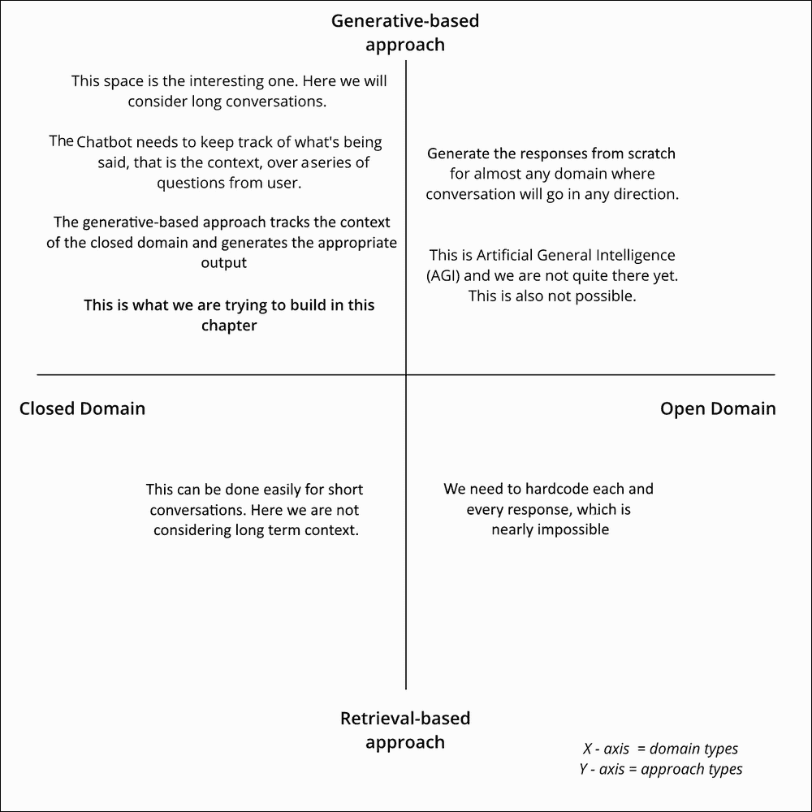

图 8.1:开发聊天机器人方法的图示

在这章中，我们将构建一个基于封闭领域的聊天机器人，使用基于检索和基于生成的方法。

现在让我们来看看我们将在本章中使用的数据集。

# 了解数据集

为了开发聊天机器人，我们使用了两个数据集。这些数据集如下:

*   康奈尔电影对话数据集
*   bAbI 数据集

## 康奈尔电影对话数据集

这个数据集已经被广泛用于开发聊天机器人。可以从这个链接下载康奈尔电影-对话语料库:[https://www . cs . Cornell . edu/~ cristian/Cornell _ Movie-Dialogs _ corpus . html](https://www.cs.cornell.edu/~cristian/Cornell_Movie-Dialogs_Corpus.html)。这个语料库包含了从原始电影剧本中提取的大量元数据丰富的虚构对话。

该语料库具有 10，292 对电影角色之间的 220，579 次会话交流。它涉及 617 部电影中的 9035 个角色。总共有 304，713 个话语。该数据集还包含电影元数据。元数据有以下几种类型:

*   电影相关元数据包括以下详细信息:

    *   电影类型
    *   上映年份
    *   IMDb 评分

*   与角色相关的元数据包括以下细节:

    *   3774 个角色的性别
    *   电影中的角色总数

当你下载这个数据集时，你会注意到有两个文件我们将在本章中使用。文件的名称是`movie_conversations.txt`和`movie_lines.txt`。我们来看看每个文件的内容细节。

### 电影 _ 对话. txt 的内容详情

这个文件包含了`movie_lines.txt`文件的`line_id`。可以在下图中看到`movie_conversations.txt`的内容:

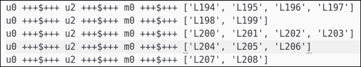

图 8.2:movie _ conversations . txt 文件的示例内容

正如您在前面的图中看到的，该文件包含行号，对话的实际内容出现在 *movie_lines.txt* 中。*++ ++ $ +++*充当分隔符。你一定很想知道如何处理这个数据集；请耐心听我说一会儿，我们将在接下来的章节中讨论这方面的内容。

现在让我们看看下一个文件的内容。

### movie _ lines . txt 内容详情

这个文件包含了实际的电影对话框。下图中可以看到`movie_lines.txt`的样本内容:

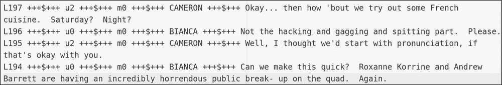

图 8.3:movie _ lines . txt 的示例内容

如上图所示，每条线路都有一个唯一的对话线路 ID。这个`line_id`指的是`movie_conversations.txt`文件。该文件包含相同的行分隔符和对话中涉及的角色的名称。

如果你把这两个文件放在一起看，对你来说可能更有意义。在`movie_conversations.txt`文件中，参考 *line_id 194、195、196* 和 *197* 上的对话。所有这些对话都可以在`movie_lines.txt.`中找到在上图中，你可以看到 *line_id* *194* 中包含了这个问题:*我们能不能速战速决？罗克珊·科林和安德鲁·巴雷特在校园里举行了一场骇人听闻的公开分手。又来了。*另一方面， *line_id* *195* 包含了答案:*嗯，我想我们先从发音开始，如果你同意的话。*

在将数据集输入机器之前，我们需要以问答格式准备数据集。我们将在使用数据准备步骤进行训练之前实施它。

现在让我们看看 bAbI 数据集。

## bAbI 数据集

这个数据集是由脸书人工智能研究所(FAIR)建立的，其中 AI 代表人工智能。这个数据集属于 bAbI 项目。你可以从 https://research.fb.com/downloads/babi/[下载数据集。这是一个维护良好的数据集。bAbI 项目的目标是试图建立一个自动文本理解和推理系统。该数据集由以下子数据集组成:](https://research.fb.com/downloads/babi/)

*   (20) QA bAbI 任务
*   (6)对话框 bAbI 任务
*   儿童图书测试
*   电影对话数据集
*   维基视频数据集
*   基于对话的语言学习数据集
*   简单问题数据集
*   HITL 对话模拟器

这里我们将只使用一个子集，即(20) QA bAbI 任务，因为它是对构建聊天机器人最有用的一个。

### (20)QA bAbI 任务

让我们详细看看这个子数据集。这里，使用这个(20) QA bAbI 数据集执行了 20 个不同的任务。让我们看看这些任务是什么。这些任务赋予机器执行一些推理的能力，基于此，机器可以回答一个问题。您可以参考下图中给出的任务名称:

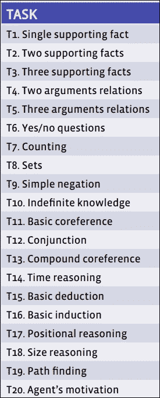

图 8.4: (20) QA bAbI 任务详细信息

图片来源:http://www . thespermwhale . com/jaseweston/babi/abor des-iclr . pdf

脸书研究人员 Jason Weston、Antoine Bordes、Sumit Chopra、Alexander M. Rush、Bart van merrinboer、Armand Joulin 和 Tomas Mikolov 发表了一篇论文，他们在论文中提出了一个有趣的基于人工智能的问答系统。你可以去 https://arxiv.org/abs/1502.05698 的[看看他们的研究论文。在本章中，我们将尝试获得任务 T1 的结果，并重新生成其结果。](https://arxiv.org/abs/1502.05698)

该数据集包含英语和印地语两种语言的语料库。这里有两种类型的文件夹:名为*恩*的文件夹有 1000 个训练样本，而*恩-10K* 有 10000 个训练样本。下图给出了每个任务数据集的格式:

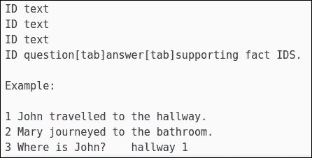

图 8.5:单个支持 QA bAbI 任务的格式

支持的事实被称为故事。基于故事，用户可以向机器提问，机器应该给出逻辑上正确的答案，该答案可以从提供的支持文本中推导出来。这是一项艰巨的任务，因为在这种情况下，机器应该记住它可以在需要时使用的长上下文。我们将很快使用这个有趣的数据集。

现在让我们开始构建 chatbot 基线版本。

# 构建聊天机器人的基本版本

在这个部分，我们将构建一个聊天机器人的基本版本。如今，获取数据对任何公司来说都不是问题，但获取特定领域的对话数据集却具有挑战性。

有这么多公司的目标是制造一个创新的特定领域聊天机器人，但他们的主要挑战是获得正确的数据。如果你正面临同样的问题，那么这个基本方法可以帮助你。这个聊天机器人的基本版本基于封闭域和基于检索的方法，使用基于规则的系统。因此，让我们开始了解基于规则的系统的各个方面。

## 为什么基于规则的系统能够发挥作用？

正如我前面提到的，基于规则的系统是实现基于检索的方法的途径。现在，你可能想知道为什么我们需要一个基于规则的系统。考虑到我们生活在机器学习(ML)的时代，听起来是不是很老了？我来和大家分享一下我的亲身经历。我与许多初创企业密切合作。他们有的在财务领域工作，有的在人力资源领域工作，还有的在法律领域工作。在这个聊天机器人的时代，初创公司确实热衷于开发能够帮助用户的特定领域的聊天机器人。最初，他们处理一些通用数据集，以便机器可以学习语言并为他们生成符合逻辑的随意答案，但他们很快意识到，他们没有足够的特定领域数据来帮助他们构建一个好的聊天机器人。我给你举个例子。

我与一家金融科技初创公司合作，我们需要建立一个聊天机器人。聊天机器人的具体要求是，它应该帮助想要申请住房贷款的客户以及已经申请并需要一些帮助的客户。现在，这项金融科技在一年半前刚刚起步。因此，他们没有关于客户可能会有的查询的大型聊天日志。简而言之，该公司没有足够的特定领域数据，例如房屋贷款申请人可能会提出什么样的查询，以及如何将这些客户查询与这家金融科技公司遵循的贷款程序同步。在这种情况下，我们需要关注两件主要事情:

*   我们需要建立一个最小可行的聊天机器人，可以帮助客户解决基本的常见问题
*   在这个最小可行聊天机器人的帮助下，你也可以了解人们在问什么样的问题，并根据这些问题，聊天机器人可以被调整

在这种情况下，我们没有特定领域的数据集，基于规则或基于检索的模型将为我们工作。从下一节开始，我们将探索基于规则的系统和开发基本聊天机器人及其架构的方法。

## 了解基于规则的系统

在这一节，我们将介绍基于规则的系统，这样当我们开始开发基于检索的聊天机器人时，你就不会感到被忽略了。基于 ( **RB** )的**规则** - **系统定义如下:利用现有的知识或规则，我们开发一个使用规则的系统，在语料库上应用现有的系统规则，并尝试生成或推断结果。从聊天机器人的角度来看，RB 系统有所有可能的问题和答案，并且是硬编码的。我们完全可以使用正则表达式和模糊逻辑来实现某种启发式算法，以使 RB 系统更加精确。**

参考下图，这将让您了解使用基于检索的方法的聊天机器人的工作流程:

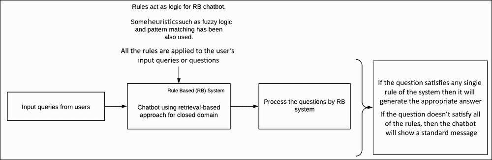

图 8.6:基于规则的聊天机器人的工作流程

根据上图，您知道在 RB 系统中，我们将手动编写所有可能的问题和答案，并实现正则表达式和模糊逻辑，这将使聊天机器人能够生成适当的答案。根据业务需求，可以在该系统中添加和删除问题。现在让我们来讨论我们的方法，基于这种方法，我们将构建一个聊天机器人的基本版本。

## 了解方法

在这一节中，我们将看看帮助我们实现聊天机器人基本版本的步骤。在这里，我正在为金融领域构建一个聊天机器人，它将帮助用户申请房屋贷款。我们将对一些问题进行编码，以便您了解如何开发基于规则的聊天机器人。我们需要执行以下步骤:

1.  列出可能的问题和答案。
2.  决定标准信息。
3.  理解架构。

## 列出可能的问题和答案

首先，我们需要代表用户列出所有我们能想到的问题。一旦我们决定了问题，那么我们需要一个接一个地决定这些问题的答案。假设我们要求用户提供他们的全名、电子邮件 ID、电话号码和贷款金额，这样万一用户中途退出，客户经理可以给他们回电。之后，我们会询问用户他们需要什么样的帮助，然后他们可以提出问题。他们可能会询问资格标准、申请状态、文档要求等等。在第一次迭代中，您需要添加用户经常问的最少的问题。一旦我们决定了问题和答案，我们就很容易对它们进行编码。

比方说，我在这个金融领域聊天机器人的基础版本中包含了以下问题:

*   请让我知道获得房屋贷款的资格标准
*   请让我知道我的贷款申请的状态
*   让我知道我需要提交的文件清单

对这些问题的回答如下:

*   我们需要至少 3 年的工作经验，3 年的 IT 回报，以及超过 35 万卢比的最低收入
*   您的申请由我们的信用风险管理团队处理
*   您需要提交过去 6 个月的工资单、身份证明、3 年的 it 回报以及房屋租赁文件。

我们还需要确定一些标准消息，这将在下一节中介绍。

## 决定标准信息

我们需要决定标准消息，例如，来自聊天机器人的欢迎消息。如果用户问了一个聊天机器人无法回答的问题，那么应该弹出什么消息？我们还需要决定用户结束聊天时的消息。

这些标准消息帮助用户理解他们可以问聊天机器人什么，不能问什么。现在让我们来看看聊天机器人基础版的架构部分。

## 了解架构

在这个部分，我们来谈谈建筑。当我们构建一个特定领域的基于规则的聊天机器人时，我们需要存储用户提出的任何问题。我们还需要建立一个快速和可扩展的聊天机器人。在这种方法中，我们构建 web 服务。web 服务 REST APIs 将很容易与网站和前端集成。我们需要一个可以存储用户对话的数据库。当我们试图即兴创作聊天机器人或将其用于 ML 训练时，这些对话数据将是有帮助的。我正在使用的库如下所示:

*   用于实现 web 服务和 REST APIs 的 Flask
*   MongoDB 来存储对话。选择 NoSQL 数据库的原因是对话没有特定的格式。NoSQL 是存储无模式数据的好选择。我们需要存储原始对话，所以 NoSQL 是一个不错的选择。

可以参考下图，有助于理解整个架构和流程:

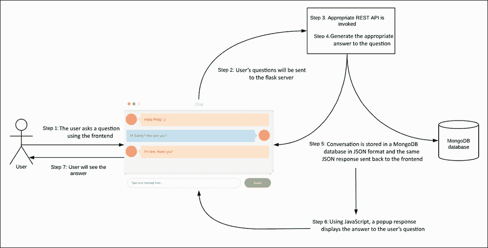

图 8.7:聊天机器人基础版本的架构设计

基于这个架构，你会发现一个聊天机器人基础版的流程是相当简单的。这个流程包括七个简单的步骤:

1.  用户将向聊天机器人提问。
2.  聊天机器人的基于规则的引擎将处理该问题。这里调用了 REST API 来生成响应。
3.  如果问的问题对于 RB 系统是可用的，那么用户将得到适当的答案。
4.  如果问的问题对于 RB 系统是不可用的，那么用户将不会得到答案，而是一个标准的错误消息。
5.  用户的对话将存储在 MongoDB 数据库中。这个响应是 JSON 格式的。
6.  相同的 JSON 响应由 REST API 发送到前端。在前端，JavaScript 解析这个响应并弹出适当的答案。
7.  当用户得到答案时，他们可能会结束聊天或问另一个问题。

我想强调的另一个要点是，在将数据存储到 MongoDB 之前，我们需要最终确定 JSON 响应的属性，当我们使用 JavaScript 解析 JSON 响应时，这些属性将真正帮助我们。可以参考下面的截图，可以帮助你了解我决定用哪种 JSON 模式:

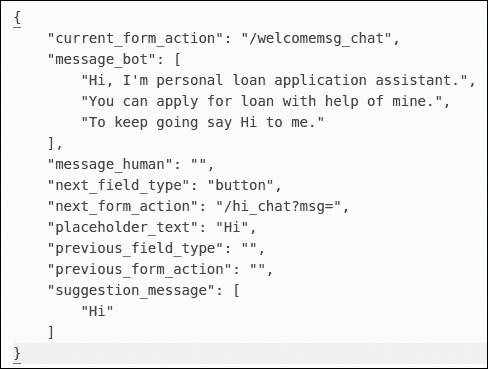

图 8.8:理解 JSON 响应属性

每个 JSON 属性的用法如下:

*   `current_form_action:`这个属性表示当前正在调用哪个 REST API。
*   `message_bot:`这个字段携带来自机器人的答案。
*   `message_human:`该字段携带用户的查询。
*   `next_field_type:`如果我们需要在下一个问题中填充文本框或按钮，这对于生成动态 HTML 组件很有用。
*   `next_form_action:`这个属性表示我们应该在即将到来的请求中调用哪个 REST API。
*   `placeholder_text:`如果你想在文本框中放置水印文本，那么这个属性可以帮助你实现 HTML 功能。
*   `previous_field_type:`这个属性跟踪最后一个字段类型是什么。
*   `previous_form_action:`这个属性跟踪我们调用的最后一个 REST API 是什么。
*   `suggestion_message:`有时，我们需要一条消息来调用特定的规则。这与您说 *OK Google* 并调用 Google home assistance 时的相同。这个属性基本上指导用户在询问他们的查询时他们需要期待什么。

现在让我们开始实现基于规则的聊天机器人。

# 实现基于规则的聊天机器人

在这一节，我们将了解聊天机器人的实现。这个实现分为两部分。你可以通过访问[https://github.com/jalajthanaki/Chatbot_Rule_Based](https://github.com/jalajthanaki/Chatbot_Rule_Based)找到这个代码:

*   实现对话流
*   使用 flask 实现 RESTful APIs

## 实施对话流程

为了实现对话逻辑，我们正在编写一个单独的 Python 脚本，这样无论何时我们需要添加或删除一些逻辑，对我们来说都很容易。在这里，我们创建了一个 Python 包，将这个对话逻辑放在其中。文件名是 *conversationengine.py* ，它使用 JSON、BSON 和 re 作为 Python 依赖项。

在这个文件中，我们以函数的形式实现了每个对话。当用户第一次打开聊天机器人时，应该会弹出一条欢迎消息。可以参考下面截图中给出的代码:

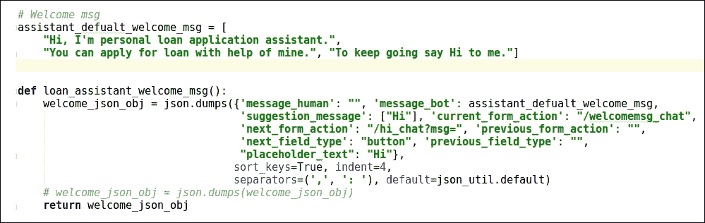

图 8.9:欢迎消息的代码片段

现在用户需要输入 **Hi** 来开始对话。当用户键入 **hi** 时，`start_coversation_action`功能将被调用，聊天机器人将询问一些信息，以便给用户一个更准确、个性化的答案。首先，它询问用户的姓名，然后询问他们的电子邮件 ID 和电话号码。可以参考以下截图:

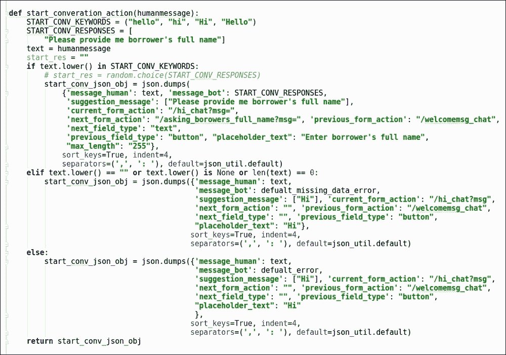

图 8.10:询问基本用户信息的代码片段

同样的还有`borrowers_name_asking`、`borrowers_email_id_asking`和`mobilenumber_asking`功能，要求用户提供他们的姓名、电子邮件 ID 和电话号码。除此之外，还有一些问题可以帮助用户了解他们的贷款申请状态。如果客户是新客户，他们可以问一些问题，如*申请住房贷款需要什么样的文件？*您可以在`other_cases`功能中找到这些与状态和文档相关的问题。可以参考下面截图中该函数的代码:

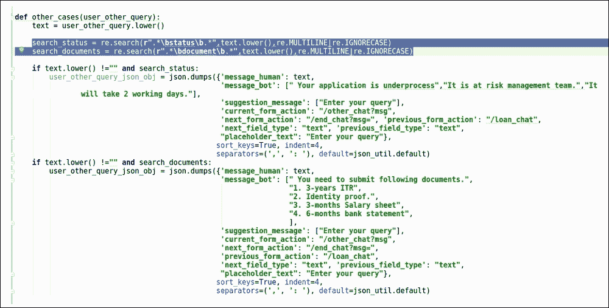

图 8.11:与贷款申请状态和申请房屋贷款所需文档相关的问题的代码片段

正如您在前面的图*中看到的那样，*我们在这里使用了一个正则表达式，这样聊天机器人就可以回答与状态和文档相关的问题。这是完全使用基于关键字的逻辑编码的。

现在让我们看看如何使用 flask 构建具有该功能的 web 服务。

## 使用 flask 实现 RESTful APIs

到目前为止，我们只编写了接受用户输入查询并基于该查询调用适当函数的函数。为了更好的维护和易于集成，我们需要使用 flask 实现 RESTful APIs。为了实现这一点，我们使用了`flask`、`json`、`os`、`uuid`、`datetime`、`pytz`和`flsk_pymongo` 库。Flask 是一个易于使用的 web 框架。您可以在下图中找到代码片段:

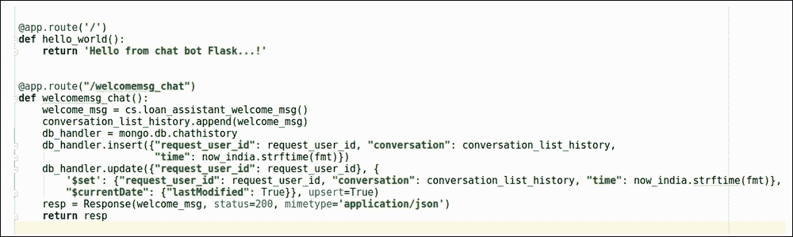

图 8.12:为聊天机器人制作 RESTful API 的代码片段

正如您在前面的图中所看到的，每条路线调用不同的方法，这是我们前面提到的`conversationengine.py`文件的一部分。为了运行这个 flask 引擎，我们需要使用 flask `app.run ()`命令。访问:[https://github . com/jalajthanaki/Chatbot _ Rule _ Based/blob/master/flaskengin . py](https://github.com/jalajthanaki/Chatbot_Rule_Based/blob/master/flaskengin.py)可以找到所有 API 及其函数。

现在让我们测试这个基于规则的聊天机器人。

# 测试基于规则的聊天机器人

在这个部分，我们将测试聊天机器人的基本版本。让我们从聊天机器人向用户询问的基本个人信息开始。这里，我将生成由 flask RESTful API 生成的 JSON 响应。如果我们将这些 API 与前端集成，我们需要一个 JavaScript 来解析这个 JSON 响应。这里不解释前端集成部分，让我们分析一下 JSON 响应。

欢迎信息请参考以下截图:

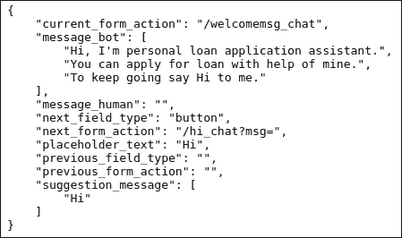

图 8.13:欢迎消息的 JSON 响应

下图给出了聊天机器人询问用户名时的 JSON 响应:

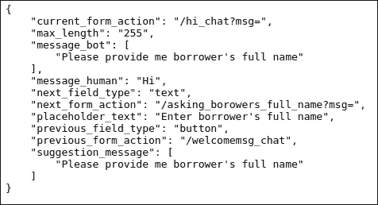

图 8.14:询问用户名的 JSON 响应

如果用户询问他的应用的状态，那么他们将得到如下图所示的 JSON 响应:

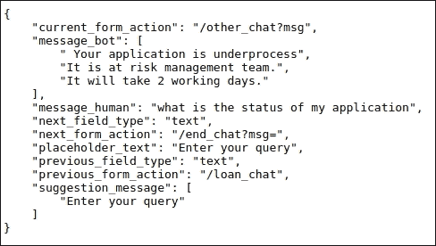

图 8.15:获取状态相关信息的 JSON 响应

如果用户用混合的印度语-英语(Hinglish)询问状态相关的问题，并且如果他们在查询中使用单词 *status* ，那么聊天机器人将生成响应。您可以在下图中看到响应:

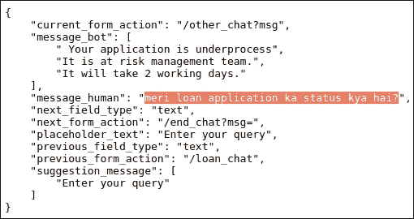

图 8.16:获取印地语-英语(Hinglish)语言状态相关信息的 json 响应

如果用户询问未编码的查询，那么它将生成以下 json 响应:

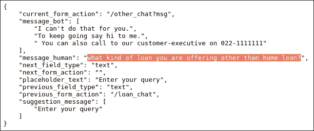

图 8.17:未知问题的 JSON 响应

经过测试，我们了解到已经编码的查询工作正常，但是这个聊天机器人的基本版本对于我们没有编码的问题不能正常工作。我想指出基于规则的聊天机器人测试后的一些优点。然而，这种方法也有各种各样的缺点，我们将在下一节讨论。

## 基于规则的聊天机器人的优势

你可以参考基于规则的聊天机器人的以下优点:

*   易于编码。
*   需要更少的计算能力。
*   使用模式匹配方法，因此如果用户在对话中使用英语和其他语言，他们仍然会得到答案。这是因为聊天机器人会识别用户在问题中提供的关键词。假设用户用英语问，*你能提供我需要提交的文档列表吗？*另一个用户可以用印地语提问:*Kya AAP mujhe bata sakte hain mujhe kaun se 文档提交 karne hain？*对于这个问题，聊天机器人将生成答案，因为它从用户查询中找到特定的关键字，如果这些关键字存在，那么聊天机器人将生成答案，而不管语言如何。

现在让我们来看看为了改进聊天机器人，我们需要解决的与这种方法相关的问题。

# 现有方法的问题

在这一节中，我们将讨论我们的聊天机器人的基本版本的问题。正如我们已经知道的，对于看不见的查询，这种方法不起作用，这意味着基本方法不能正确地概括用户的问题。

我在这里列出了一些问题:

*   耗时，因为我们需要硬编码每个场景，这根本不可行
*   它不能用于看不见的用例
*   用户应该处理对话的严格流程
*   它不能理解长上下文

这些问题中的大部分可以使用基于生成的方法来解决。让我们看看有助于我们随机应变这种方法的关键概念。

## 理解优化方法的关键概念

在这一部分，我们将讨论可以帮助我们即兴创作聊天机器人基础版的关键概念。我们之前列出的问题可以通过使用**深度学习** ( **DL** )技术来解决，这些技术可以帮助我们在更短的时间内构建一个更通用的聊天机器人。

在继续之前，我们需要决定在我们修改的方法中使用哪种 DL 技术。DL 帮助我们取得巨大的成就。这里，我们需要使用端到端的 DL 方法，它对数据、对话结构和用例没有任何假设。这就是我们想要的。为了实现这一点，我们将使用**循环神经网络** ( **RNN** )。现在你可能会问为什么 RNN 有用。让我用一个例子来解释一下。假设我们想把温度分为热或冷两类；为了做到这一点，我们将使用前馈神经网络来将温度分类为热或冷，但对话不是固定的大小。对话是一系列的单词。我们需要使用神经网络来帮助我们处理单词序列。RNN 最适合处理这类序列。在 RNN，我们将数据反馈到输入中，同时在一个循环中训练它。

在修改后的方法中，我们将使用 TensorFlow 的序列对序列(seq2seq)模型。所以，让我们讨论一下序列模型。

### 了解 seq2seq 模型

使用 seq2seq 模型的好处是我们不需要执行特性工程。像大多数 DL 技术一样，它自己生成特性。我们将简单讨论 seq2seq 模型。seq2seq 模型由两个**长短期记忆** ( **LSTM** )循环神经网络组成。第一个神经网络是一个*编码器*。它处理输入。第二个神经网络是一个*解码器*。它产生输出。通常，DL 算法需要一个固定大小的输入和输出维度，但是在这里，我们接受一个句子中的单词序列并输出一个新的单词序列。因此，我们需要一个序列模型来学习具有长范围记忆依赖性的数据。LSTM 的建筑最适合这一点。编码器 LSTM 将可变长度的输入句子转换成固定维度的向量表示。我们可以将此视为*思维向量*或*上下文向量*。我们使用 LSTM 的原因是它能记住序列中很久以前的单词；这里，我们正在处理 seq2seq 模型的大序列注意机制，它有助于解码器选择性地查看序列中最相关的部分，以获得更高的准确性。

可以参考下图中 seq2seq 模型的架构:

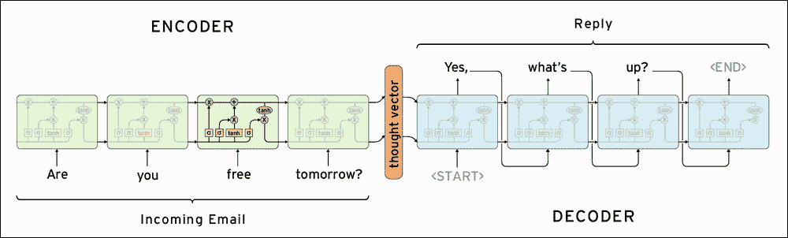

图 8.18:seq 2 seq 模型的架构

图片来源:[http://suriyadeepan.github.io/img/seq2seq/seq2seq2.png](http://suriyadeepan.github.io/img/seq2seq/seq2seq2.png)

当我们提供一个足够大的问题和回答数据集时，它会识别问题集的接近程度，并将它们表示为一个单一的思维向量。这种表示有助于机器理解问题的意图，而不管句子的结构如何，因此机器可以识别诸如“现在几点了？”以及“几点了？”有相同的意图，所以他们会陷入一个单一的思想向量。训练之后，我们不仅会有一大堆突触权重，还会有思维向量。之后，当我们训练模型时，我们需要使用额外的超参数以及适当的损失函数。一旦我们训练了模型，我们就可以和它聊天了。

如果你想了解 seq2seq 模型的更多细节，那么你应该参考谷歌研究人员发表的一篇名为*一种神经对话模型*的研究论文。你也可以在 https://arxiv.org/pdf/1506.05869v3.pdf 的[查阅这篇论文，如果你想在 http://colah.github.io/posts/2015-08-Understanding-LSTMs/](https://arxiv.org/pdf/1506.05869v3.pdf)的[了解更多关于 LSTM 的信息，也可以参考这篇精彩的文章。](http://colah.github.io/posts/2015-08-Understanding-LSTMs/)

现在让我们使用 seq2seq 模型实现聊天机器人。

# 实施修订后的方法

在这个部分，我们将讨论实现的每个部分。你可以通过 GitHub 链接找到代码:[https://github.com/jalajthanaki/Chatbot_tensorflow](https://github.com/jalajthanaki/Chatbot_tensorflow)。注意，这里我用的是 tensor flow 0 . 12 . 1 版。我在 GeForce GTX 1060 6GB GPU 上进行了几个小时的训练。在这个实现中，我们不需要生成特征，因为 seq2seq 模型为句子中给定的单词序列生成其内部表示。我们实现部分有以下步骤:

*   数据准备
*   实现 seq2seq 模型

让我们开始编码吧。

## 数据准备

在这个实现过程中，我们将使用康奈尔电影对话数据集。首先，我们需要以一种可以用于训练的格式准备数据。有一个用于执行数据准备的 Python 脚本。可以在:[https://github . com/jalaythanaki/Chatbot _ tensor flow/blob/master/data/prepare _ data _ script/data . py](https://github.com/jalajthanaki/Chatbot_tensorflow/blob/master/data/prepare_data_script/data.py)找到脚本。

数据准备可细分为以下步骤:

*   生成问答对
*   预处理数据集
*   将数据集分成训练数据集和测试数据集
*   为训练和测试数据集构建词汇表

### 生成问答对

为了从康奈尔电影对话数据集生成问答对，我们使用了`movie_lines.txt`和`movie_conversations.txt` 文件。`movie_lines.txt` 文件给了我们每个对话的 *line_id* 以及真实对话的信息，而`movie_conversations.txt` 只有*line _ id*。在这种情况下，我们需要从数据集中生成适当的问答对话对。为此，我们将合并这两个文件。在 Python 脚本中，有一些函数可以帮助我们组合这些文件。与功能相关的详细信息如下:

*   `get_id2line():`这个函数帮助我们使用++++＄+++模式拆分数据。我们对`movie_lines.txt`文件执行分割。分割之后，在这个函数的帮助下，我们创建了一个字典，我们把 *line_id* 作为键，电影对话作为值。所以， *key = line_id* 和 *value = text*
*   `get_conversations():`该函数分割`movie_conversations.txt` 文件中给出的数据。这将帮助我们创建一个列表。该列表包含*线路标识*列表。
*   `gather_dataset():`这个函数实际上是生成问答对。在这个函数中，应用了一个简单的逻辑。我们得到了列表*line _ id*并且我们知道最后一个元素表示答案。所以，我们把问题和答案分开。在`get_id2line()`功能的帮助下，我们搜索问题及其对应的答案。这里，我们使用关键字的值来搜索问题和答案。

你可以参考下面的截图看实际编码:


图 8.19:用于生成问答配对的函数

现在让我们探索数据预处理部分。

### 预处理数据集

这里涉及到一些预处理和过滤步骤。作为预处理的一部分，我们执行以下步骤:

*   我们使用内置的字符串函数`lower()`将对话转换成小写。
*   我们也删除垃圾字符和太短或太长的对话。为此，我们使用基于列表的方法来删除垃圾字符，使用`filter_data()`函数来删除太短或太长的对话。当我们对数据集应用`filter_data()`函数时，数据集的 *28%* 被过滤。
*   我们还会过滤掉很多未知的对话。这里，数据集的 *2%* 受到了影响。为此，我们使用了`filter_unk()`方法。
*   我们也标记句子。在这个过程中，我们将【文本行】的*列表*转换为的*列表【行字】。这种标记化是有帮助的，因为在训练期间，机器可以处理句子的单个单词，并且在单词 ID 的帮助下，数据检索变得更快。*

可以参考下面截图中给出的代码:

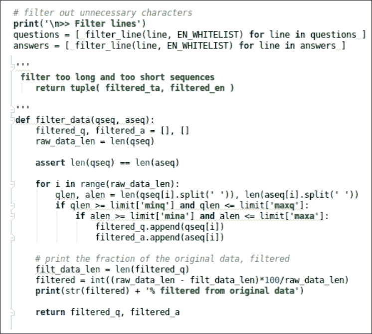

图 8.20:预处理的代码片段

### 将数据集分为训练数据集和测试数据集

在预处理之后，我们将数据分成训练数据集和测试数据集，为此，我们将使用以下函数:

*   我们可以使用`prepare_seq2seq_files()`函数保存训练和测试数据集
*   您可以从这个 GitHub 链接直接访问`train.enc`、`train.dec`、`test.enc`、`test.dec`数据文件:[https://GitHub . com/jalajthanaki/Chatbot _ tensor flow/tree/master/data](https://github.com/jalajthanaki/Chatbot_tensorflow/tree/master/data)

### 为训练和测试数据集构建词汇表

现在是从数据集生成词汇的时候了。对于词汇生成，我们将执行以下步骤:

*   使用`data_utils.py`文件的`prepare_custom_data()`函数，我们可以生成词汇表，并在训练时将其输入 seq2seq 模型。
*   您可以使用此链接访问`data_uti` `ls.py`文件:[https://github . com/jalajthanaki/Chatbot _ tensor flow/blob/master/data _ utils . py](https://github.com/jalajthanaki/Chatbot_tensorflow/blob/master/data_utils.py)
*   注意，词汇文件是在我们开始训练时生成的。
*   词汇文件的文件名为`train.enc.ids20000`、`train.dec.ids20000`、`test.enc.ids20000`、`test.dec.id`、`s20000`。这里，20000 表示我们提供的词汇量的大小。
*   您可以在以下位置访问该文件:[https://github . com/jalaythanaki/Chatbot _ tensor flow/tree/master/data](https://github.com/jalajthanaki/Chatbot_tensorflow/tree/master/data)

您可以在下面的截图中看到`prepare_custom_data()`函数的代码:

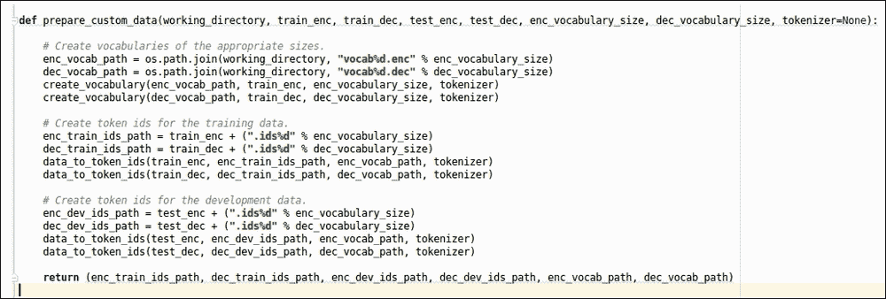

图 8.21:生成词汇表的代码片段

现在让我们使用 TensorFlow 实际实现 seq2seq 模型。

## 实施 seq2seq 模型

在本节中，我们将使用 seq2seq 模型进行实际训练。我们将使用 TensorFlow 来实现 seq2seq 模型。在开始训练之前，让我们先来看看 hyper parameters 配置文件，您可以使用这个 GitHub 链接来访问它:[https://GitHub . com/jalaythanaki/Chatbot _ tensor flow/blob/master/seq 2 seq . ini](https://github.com/jalajthanaki/Chatbot_tensorflow/blob/master/seq2seq.ini)。

在“聊天机器人开发:seq2seq 模型，构建”训练中，我们的脚本使用这些文件和它们的参数。该配置文件中包含以下参数:

*   这可以是训练，也可以是测试
*   `train_enc:`包含编码器训练数据集的路径。
*   `train_dec:`这包含了解码器的训练数据集的路径。
*   `test_enc:`这包含编码器测试数据集的路径。
*   `test_dec:`这包含了解码器测试数据集的路径。
*   `Working_directory:`这是我们可以存储检查点、词汇和临时数据文件的文件夹
*   `enc_vocab_size:`该数字定义了编码器的词汇大小。我们把词汇量定为 20000。
*   `dec_vocab_size:`这个数字定义了解码器的词汇大小。我们把词汇量定为 20000。
*   `num_layers:`这表示 LSTM 层数。在这里，我们将其设置为 3。
*   `layer_size:`这表示 seq2seq 模型中的层数。我们把它设为 256。
*   `steps_per_checkpoint:`在检查点，保存模型的参数，评估模型，并打印结果。
*   `learning_rate:`这表明我们训练模型的快慢。我们现在将该值设置为 0.5。

为了获得可能的最佳结果，可以改变前面的大多数参数。在训练期间，我们需要将模式设置为 train 并运行以下命令:

```
$ python execute.py
```

现在是时候了解 execute.py 文件内部的内容了。你可以使用这个 GitHub 链接来访问这个文件:[https://GitHub . com/jalajthanaki/Chatbot _ tensor flow/blob/master/execute . py](https://github.com/jalajthanaki/Chatbot_tensorflow/blob/master/execute.py)。

在这个脚本中，我们将 TensorFlow API 称为。该脚本可分为以下几个部分:

*   创建模型
*   训练模型

### 创建模型

我们在这里使用 TensorFlow 的`Seq2SeqModel()` 函数。该函数读取配置文件，并使用配置文件中定义的值。为了存储列车模型，我们使用了`saver.restore()`函数，为了获得检查点的状态，我们使用了`get_checkpoint_state()`函数。可以参考下图给出的代码片段:

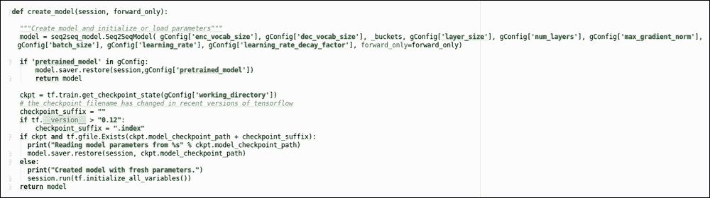

图 8.22:创建 seq2seq 模型的代码片段

### 训练模型

我们在`execute.py`文件中定义了`train()`方法。此函数初始化 TensorFlow 会话并开始训练。可以参考下面截图中给出的代码片段:

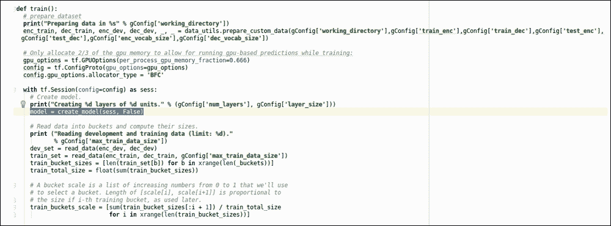

图 8.23:训练模型的代码片段

现在是训练模型的时候了。当我们执行`python execute.py` 命令时，您将看到下面截图中给出的输出:

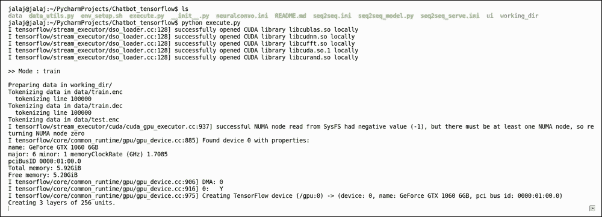

图 8.24:使用 TensorFlow 训练 seq2seq 模型

这里，训练是在 GPU 上进行的。我花了 3 个小时训练这个模型。我已经为 15000 个检查站训练了这个模型。你可以参考下面的例子:

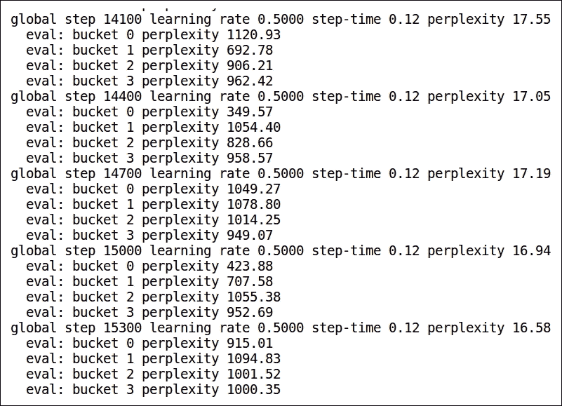

图 8.25:seq 2 seq 训练的输出

在一个 CPU 上，训练会花很多时间，所以我也上传了预先训练好的模型给你用。你可以使用这个 GitHub 链接下载它们:[https://GitHub . com/jalajthanaki/Chatbot _ tensor flow/tree/master/working _ dir](https://github.com/jalajthanaki/Chatbot_tensorflow/tree/master/working_dir)。

现在是时候理解帮助我们评估训练模型的测试指标了。

# 测试修订后的方法

在本节中，我们将对修改后的方法进行测试。在进行实际测试和查看聊天机器人对话的好坏之前，我们需要了解我们将用于这种方法和最佳方法的基本测试指标。这些测试指标帮助我们评估模型的准确性。让我们首先理解测试标准，然后我们将继续对修改后的方法进行测试。

## 了解测试指标

在此部分，我们需要了解以下测试指标:

*   困惑
*   失败

### 困惑

在 NLP 领域，困惑是也称为每个单词的困惑。困惑是一种度量标准，用来衡量一个经过训练的模型对未知数据的输出预测有多好。它也用于比较概率模型。低困惑度表明概率分布很好地预测了样本。甚至在训练期间，你可以看到，对于每个检查点，困惑是减少的。理想情况下，当困惑没有变化时，我们需要停止训练。在 seq2seq 模型的训练中，我在 3 个小时后停止训练，所以当你从你的一端训练模型时，你可以等到困惑停止进一步减少。

困惑是使用熵的概念。如果你想了解困惑，那么你可以参考 https://www.youtube.com/watch?v=BAN3NB_SNHY 的[。每个单词的困惑是基于熵的。所以，为了理解熵，你可以参考以下链接:](https://www.youtube.com/watch?v=BAN3NB_SNHY)

*   【https://www.youtube.com/watch?v=Bd15qhUrKCI 
*   [https://www.youtube.com/watch?v=K-rQ8KnmmH8](https://www.youtube.com/watch?v=K-rQ8KnmmH8)
*   [https://www.youtube.com/watch?v=ICKBWIkfeJ8&list = plawxtw 4 syapk qxg 8 tkvdivyv 4 HF LG 7 SiH](https://www.youtube.com/watch?v=ICKBWIkfeJ8&list=PLAwxTw4SYaPkQXg8TkVdIvYv4HfLG7SiH)

一旦你理解了熵，你就很容易理解困惑的等式。请参考下图中给出的等式:

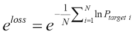

图 8.26:困惑的方程式

图片来源:https://www.tensorflow.org/tutorials/recurrent

这里，N 是样本数，P 是概率函数。我们正在使用自然对数函数计算熵。现在让我们看看另一个测试指标。

### 损失

训练损失表示训练进行的方向。通常，当我们开始训练时，损失值高，训练精度低，但在训练过程中，损失值下降，训练精度上升。DL 算法中使用了许多误差函数。这里，我们使用交叉熵作为损失函数。交叉熵和 log loss 根据上下文略有不同，但在机器学习中，计算 0 到 1 之间的错误率时，它们是一回事。可以参考下图给出的等式:

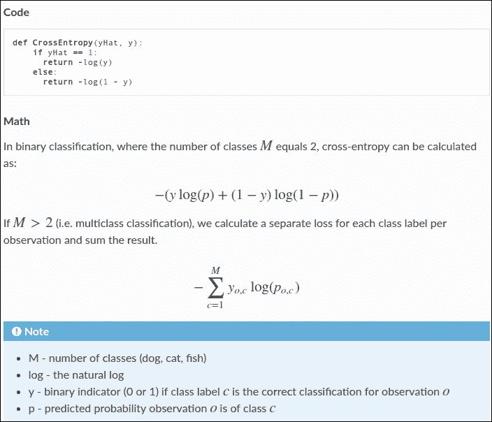

图 8.27:交叉熵方程

图片来源:http://ml-cheat sheet . readthedocs . io/en/latest/loss _ functions . html #交叉熵

如果想探究交叉熵损失函数，那么可以参考:[http://neuralnetworksanddeeplearning.com/chap3.html](http://neuralnetworksanddeeplearning.com/chap3.html)。

我们在这里没有进入很大的数学细节，因为仅仅通过跟踪训练过程，你就会知道损失的价值是增加还是减少。如果它在训练时间的周期内减少，那么训练就朝着正确的方向发展。这也适用于困惑。最初，困惑值是巨大的，但是在训练期间它逐渐下降，并且在某个点上它既不增加也不减少。那时，我们需要停止训练。现在我们来测试一下改版后的聊天机器人。

## 测试聊天机器人的修订版

在这一部分，我们将对修改后的聊天机器人进行测试。我在 GPU 上只训练了 3 个小时；现在让我们看看我们的聊天机器人能告诉我们多少。为了测试，我们需要在`seq2seq.ini`配置文件中做一个小小的改变。我们需要将模式的*值设置为测试*，然后执行`python execute.py`命令。

执行给定的命令后，您将获得下图中给出的输出:

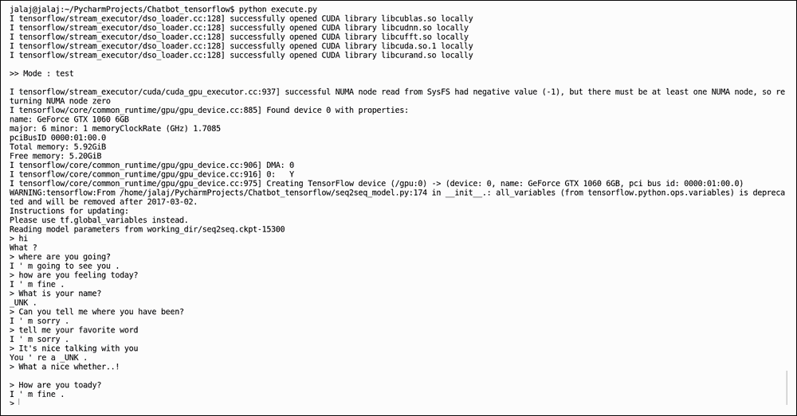

图 8.28:测试修订方法的输出

如果你训练的时间更长，那么你会得到更令人印象深刻的结果。我觉得如果我们想使用基于生成的方法来构建聊天机器人，DL 算法会对我们有所帮助。现在让我们来讨论一下如何即兴发挥这种经过修改的方法。

# 修订后的方法存在的问题

在这一部分，我们将讨论修改后的方法存在哪些问题。我们有什么方法可以优化修改后的方法吗？首先，让我们讨论一下需要改进的地方，以便在接下来的方法中，我们可以专注于这一点。

我想强调的几点如下:

*   在我们之前的聊天机器人版本中，缺乏推理，这意味着聊天机器人无法通过应用基本推理来回答问题。这是我们需要改进的地方。
*   我给你举个例子。假设我给聊天机器人讲了一个故事:*约翰在厨房。丹尼尔在浴室里。之后，比方说，我问聊天机器人这个问题:*约翰在哪里？*我们迄今为止构建的聊天机器人将无法回答这个简单的问题。我们人类很好地回答了这类问题。*
*   我们试图在下一个方法中实现这种功能，这样我们就可以在聊天机器人中启用人工智能的一些功能

让我们看看可以帮助我们构建人工智能聊天机器人的重要概念。

## 理解关键概念以解决现有问题

脸书人工智能研究小组发表了一篇论文，提出了一种记忆网络，可以证明机器也可以回答基于推理的问题。你当然可以参考这篇题为《走向人工智能——完整问答:一组先决玩具任务》的论文。链接是:[https://arxiv.org/pdf/1502.05698.pdf](https://arxiv.org/pdf/1502.05698.pdf)。你也可以在[https://arxiv.org/pdf/1410.3916.pdf](https://arxiv.org/pdf/1410.3916.pdf)的记忆网上参考这篇论文。

在这里，我们将使用 bAbI 数据集，并基于临时记忆网络训练模型。一旦训练完成，我们将检查我们的聊天机器人是否能够使用简单的推理能力回答问题。我们将重现脸书研究论文的结果。在我们进入实现部分之前，我们需要了解什么是记忆网络，以及我们如何才能建立一个使用逻辑来回答问题的系统。那么，让我们简单地看一下记忆网络。

### 记忆网络

在这一节中，我们将探索内存网络，以便我们在下一节中实现它时能够理解幕后实际发生的事情。

基本上，在 LSTM 网络中，记忆是用隐藏状态和权重来编码的。这些隐藏的状态和权重对于极长的数据序列来说太小了，不管是一本书还是一部电影。因此，在语言翻译应用中，多个 LSTM 统计数据与注意力机制一起使用，以便选择适合上下文的适当翻译工作。脸书的研究人员开发了另一种策略，称为记忆网络，在问答系统中胜过 LSTMs。

记忆网络背后的基本思想是允许神经网络使用外部数据结构作为记忆存储，并且它学习以受监督的方式从该外部记忆结构中检索所需的记忆。可以参考下图给出的内存网络架构:

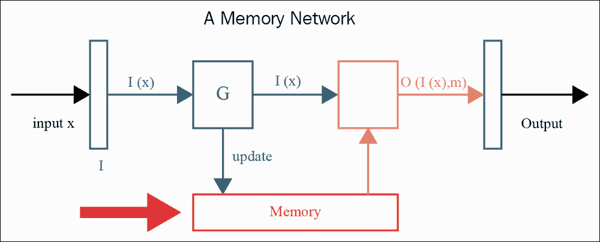

图 8.29:内存网络的架构

当涉及到从生成的少量数据中回答问题时，使用内存网络处理信息非常容易，但是在现实世界中，让数据处理长依赖关系是一项具有挑战性的任务。在 Kaggle 上，有一场名为艾伦人工智能科学挑战赛的比赛，获胜者使用了一种特殊的内存网络变体，称为动态内存网络(DMN)，这就是我们用来构建聊天机器人的东西。

#### 动态记忆网络(DMN)

DMN 的架构如下图所示:

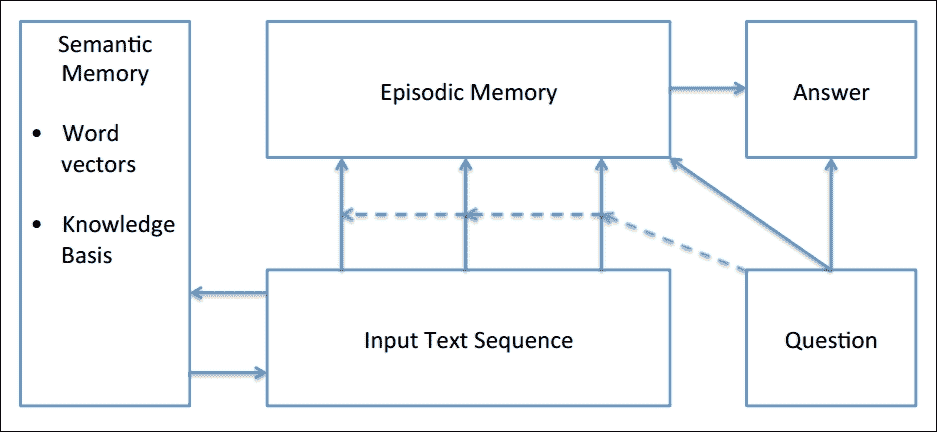

图 8.30:DMN 的建筑

图片来源:https://yerevann . github . io/public/2016-02-06/DMN-high-level . png

DMN 的架构定义了两种类型的存储器，如下所示:

*   语义记忆:我们正在使用预训练的手套模型，它将为输入数据生成向量。这些向量是我们的 DMN 模型的输入，并被用作语义记忆。
*   情节记忆:这种记忆包含其他知识。这种记忆的灵感来自我们大脑的海马体功能。它能够检索由响应触发的时间状态，例如图像或声音。我们一会儿会看到这种情景记忆的用法。

这些是我们需要了解的一些重要模块:

*   输入模块
*   问题模块
*   情节记忆模块

在我开始解释这些模块之前，请参考下图以便更好地理解:

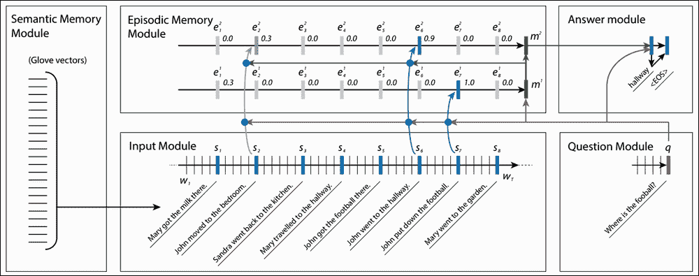

图 8.31:每个 DMN 模块的详细信息

图片来源:https://yerevann . github . io/public/2016-02-06/DMN-details . png

##### 输入模块

输入模块是一个 GRU(门控递归单元),运行在一系列的字向量上。GRU 细胞有点像 LSTM 细胞，但它的计算效率更高，因为它只有两个门，不使用存储单元。这两个门控制内容何时更新，何时删除。GRU 只执行两个任务:一个是*更新*，另一个是*复位*。你可以参考下图描绘的 LSTM 和 GRU:

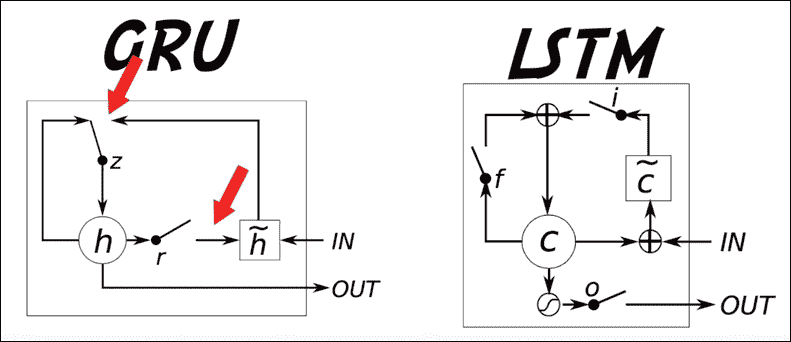

图 8.32:LSTM 和 GRU 的图示

图片来源:https://cdn-images-1.medium.com/max/1200/0*1udenjz1XCZ5cHU4

输入模块的隐藏状态以向量的形式表示输入过程。它在每句话后输出隐藏状态，这些输出在论文中被称为事实，因为它们代表了所输入内容的本质。你可能想知道隐藏状态是如何在 GRU 中计算的。为此，你可以参考下面的等式:

Ht = GRU(Xt，ht-1)

这里，Ht 是当前时间步长，ht-1 是前一时间步长，Xt 是给定的字向量。前面的等式是 GRU 隐藏状态计算的简单格式。您可以在下图中看到更详细和复杂的方程:

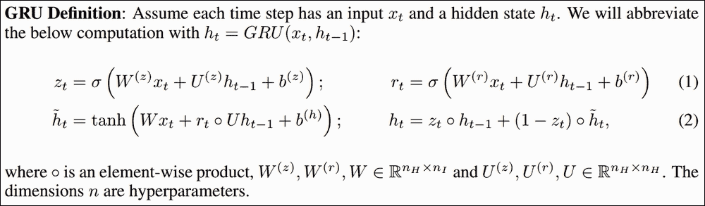

图 8.33:计算 GRU 隐藏状态的方程式

图片来源:https://yerevann.github.io/public/2016-02-06/gru.png

在这个等式中，借助于给定的单词向量和先前的时间步长向量，我们计算当前的时间步长向量。这次更新给了我们一个单层神经网络。我们对矩阵乘法求和，并加入偏差项。然后，sigmoid 将它压缩成 0 到 1 之间的值列表，这就是我们的输出向量。我们用不同的权重集这样做两次，然后我们使用重置门，它将在必要时学习忽略过去的时间步长。例如，如果下一个句子与之前的句子无关，更新门也是类似的，它可以学习完全忽略当前的时间步长。也许当前的句子与答案无关，而先前的句子与答案无关。

##### 问题模块

这个模块逐字处理问题，并使用与输入模块相同的 GRU 和相同的权重输出一个向量。我们需要为输入语句(输入数据)和我们将要提出的问题进行编码。我们可以通过为它们实现嵌入层来编码它们。现在我们需要为两者创建一个情景记忆表示。

##### 情景记忆

正如我之前所描述的，情景记忆的概念来源于我们大脑的海马体功能。事实和问题向量都从输入中提取出来，并输入到情景存储模块中。它由两个嵌套的 gru 组成。内在的 GRU 产生了所谓的插曲。它通过传递来自输入模块的事实来做到这一点。当更新它的内部状态时，它考虑当前事实上的注意函数的输出。注意力函数给每个事实一个 0 到 1 之间的分数，因此 GRU 忽略分数低的事实。在训练期间，在所有可用事实的每个完整传递之后，内部 GRU 输出一个片段，然后被馈送到外部 GRU。我们需要多个片段，以便我们的模型可以学习它应该注意句子的哪个部分。在第二遍的时候，GRU 意识到句子中还有别的东西也很重要。在多次传递的帮助下，我们可以收集越来越多的相关信息。

这是对 DMN 的简要说明。也可以参考这篇很棒的文章:[https://yerevann . github . io/2016/02/05/implementing-dynamic-memory-networks/](https://yerevann.github.io/2016/02/05/implementing-dynamic-memory-networks/)。

现在让我们来看看它的实现。

# 最佳方法

我们已经涵盖了可以帮助我们实现基于 DMN 的聊天机器人的整个概念。为了实现这种方法，我们将在 TensorFlow 后端使用 Keras。不浪费任何时间，我们将跳到实现部分。使用这个 GitHub 链接可以参考这种方法的代码:[https://GitHub . com/jalajthanaki/Chatbot _ based _ on _ bAbI _ dataset _ using _ Keras](https://github.com/jalajthanaki/Chatbot_based_on_bAbI_dataset_using_Keras)。

## 实施最佳方法

这里，我们将在给定的 bAbI task 1 数据集上训练我们的模型。首先，我们需要解析故事并建立词汇。可以参考下图的代码:

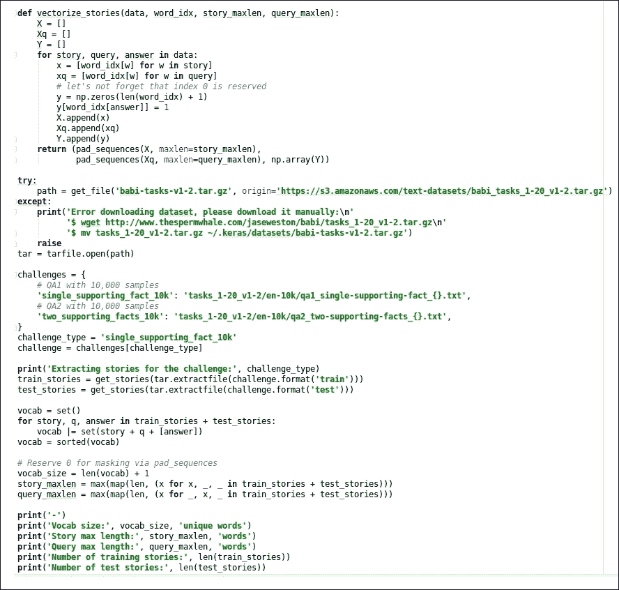

图 8.34:用于解析故事和构建词汇的代码片段

我们可以初始化我们的模型，并使用 Keras 中的 RMSprop 通过随机梯度下降实现将其损失函数设置为分类交叉熵。可以参考以下截图:

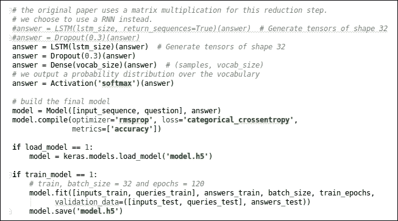

图 8.35:构建模型的代码片段

在训练之前，我们需要设置一个超参数。借助超参数脚本的值，我们将决定是在训练模式还是测试模式下运行脚本。在下图中，您可以看到我们在训练过程中需要设置的所有超参数:

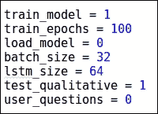

图 8.36:训练的超参数值

这里我们使用了三个超参数。我们可以用它们做实验。让我们花点时间来讨论它们:

*   train_epochs:该参数表示训练样本在神经网络中完成正向传递和反向传递的次数。一个时期意味着训练示例的一次向前传递和一次向后传递。这里我们设置了 100 次 train_epochs。你可以增加它，但是训练时间也会增加。
*   batch_size:该参数表示一次正向和反向传递中训练样本的数量。较大的批量需要更多的内存，所以我们将这个值设置为 32。如果你有更多的可用内存，那么你可以增加批量大小。请参见下面信息框中给出的简单示例。
*   lstm_size:这个参数表示我们的神经网络中存在的 lstm 细胞的数量。您可以减少和增加 LSTM 单元格的数量。在我们的例子中，少于 64 个 LSTM 单元不会给我们好的输出，所以我将 lstm_size 设置为 64。

### 注意

如果您有 1000 个训练示例，并且您的批量大小为 500，那么将需要 2 次迭代来完成 1 个时期。

我在 GPU 上训练过这个模型。如果你没有使用 GPU，那么这可能会花很多时间。您可以通过执行此命令开始训练:`python main.py`。下图给出了训练的结果:


图 8.37:训练输出的代码片段

一旦我们训练了模型，我们就可以加载并测试它。有两种测试模式可用:

*   随机测试模式
*   用户交互测试模式

### 随机测试模式

在这个模式下，脚本本身会加载一个随机的故事，给你它的答案。您可以在下图中看到超参数的值:

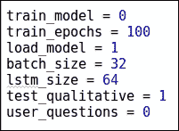

图 8.38，随机测试模式的超参数值。

测试时，执行`python main.py`命令，可以看到测试结果。这些结果如下图所示:


图 8.39:随机测试模式的结果

#### 用户交互测试模式

在这种模式下，如果测试用户可以给出自己的故事并提出自己的问题，聊天机器人将生成该问题的答案。你只需要记住，在每个单词之前，你需要提供空间。您可以参考下图中用户交互测试模式的超参数值:

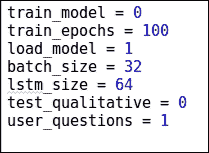

图 8.40:用户交互测试模式的超参数值

对于测试，执行`python main.py`命令，可以看到测试结果。这些结果如下图所示:

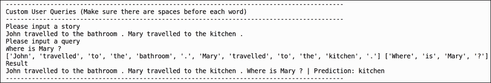

图 8.41:用户交互测试模式的结果

如果您想测试所有其他任务，那么您可以使用这个 web 应用:[https://ethancaballero.pythonanywhere.com/](https://ethancaballero.pythonanywhere.com/)。

这种方法给了我们高达 92%到 95%的准确率。这种方法有助于我们构建人工智能聊天机器人。

# 讨论混合方法

在现实生活中，为了构建聊天机器人，我们还可以结合这里描述的一些技术。根据业务需求，我们可以使用混合方法。

我们来举一个的例子。假设您正在为金融领域构建一个聊天机器人。如果一个用户询问他账户中的可用余额，那么我们只需要一个基于规则的系统，它可以查询数据库并为该用户生成账户余额详细信息。如果用户询问如何从一个账户向另一个账户转账，聊天机器人可以通过生成如何转账的分步信息来帮助用户。这里，我们将使用基于深度学习的生成方法。我们应该有一个包括基于规则的引擎和深度学习算法的系统，以产生最佳可能的输出。在这个系统中，用户的问题首先进入基于规则的系统。如果该问题的答案可以由基于规则的系统生成，那么答案将被传递给最终用户。如果答案不是由基于规则的系统生成的，那么问题将进一步传递给深度学习算法，它将生成答案。最后，最终用户将看到对其问题的回答。

# 总结

在本章中，我们引用了不同的数据集来制作聊天机器人。您了解了在没有任何数据集的情况下可以使用的基于规则的方法。您还了解了开放域和封闭域。之后，我们使用基于检索的方法来构建聊天机器人的基本版本。在修正的方法中，我们使用张量流。这种修改后的方法对我们来说非常好，因为与基本方法相比，它节省了时间。我们在康奈尔电影对话数据集上实现了谷歌的神经对话模型论文。对于最佳方法，我们建立了一个模型，使用脸书巴比数据集，并建立了基本的推理功能，帮助我们为我们的聊天机器人产生良好的结果。虽然修正方法和最佳方法的训练时间确实很长，但那些希望在云平台上训练模型的人可以选择这样做。到目前为止，我喜欢亚马逊网络服务(AWS)和谷歌云平台。我还上传了一个预先训练好的模型到我的 GitHub 库，这样你就可以重现结果了。如果你是一个初学者，想做一个真正好的聊天机器人，那么谷歌的 API。AI 是一个很好的聊天机器人开发平台。它现在被称为 Dialogflow，可以在 https://dialogflow.com/的[获得。你也可以参考 IBM Watson API，地址:【https://www.ibm.com/watson/how-to-build-a-chatbot/】T4](https://dialogflow.com/)。这些 API 可以在构建聊天机器人的过程中帮助你很多；另外，它需要较少的编码知识。

在下一章中，我们将构建一个基于计算机视觉的应用，它将帮助我们识别图像和视频中的命名对象。这个应用将实时检测物体。对象检测应用用于构建无人驾驶汽车、机器人等等，所以请继续阅读！