    

# 第九章。构建实时物体识别应用程序

在这一章中，我们将构建一个可以检测物体的应用程序。这个应用程序将帮助我们识别出现在图像或视频中的物体。我们将使用实时输入，例如来自网络摄像头的实时视频流，我们的实时对象检测应用程序将检测视频流中存在的对象。我们将使用现场视频流，这是这种物体检测被称为**实时物体检测** 的主要原因。在本章中，我们将使用**迁移学习**方法来构建实时物体检测。我将在本章的课程中详细解释迁移学习。

在本章中，我们将讨论以下主题:

*   介绍问题陈述
*   了解数据集
*   迁移学习
*   设置编码环境
*   基线模型的特征工程
*   选择**机器学习** ( **ML** )算法
*   构建基线模型
*   了解测试指标
*   测试基线模型
*   现有方法的问题
*   如何优化现有方法

    *   了解优化过程

*   实施修订方法

    *   测试修订方法
    *   理解修订方法

    中的问题
*   最佳方法

    *   实施最佳方法

*   摘要

# 介绍问题陈述

在这章中，我们将构建一个物体检测应用程序。我们不仅仅是检测物体，我们还将构建实时检测物体的应用程序。这种应用可以用于自动驾驶汽车，用于农业领域的隔离任务，甚至可以用于机器人领域。让我们了解我们的目标以及我们实际上在构建什么。

我们希望建立一个应用程序，其中我们将提供直播网络摄像头视频流或直播视频流作为输入。我们的应用程序将使用预训练的机器学习模型，这将帮助我们预测视频中出现的对象。这意味着，如果视频中有一个人，那么我们的应用程序可以将这个人识别为一个人。如果视频包含一把椅子、一个杯子或一部手机，那么我们的应用程序应该以正确的方式识别所有这些对象。因此，我们在这一章的主要目标是建立一个应用程序，可以检测图像和视频中的对象。在本章中，你还将学习迁移学习的概念。我们所有的方法都基于深度学习技术。

在下一部分，我们将讨论数据集。

# 了解数据集

在这一部分，我们将涵盖深度学习模型已经被训练的数据集。当我们尝试构建对象检测应用程序时，有两个数据集被大量使用，这些数据集如下:

*   COCO 数据集
*   PASCAL VOC 数据集

我们将逐一查看每个数据集。

## COCO 数据集

可可代表上下文中常见的对象。因此，这个数据集的简称是 COCO 数据集。许多科技巨头，如谷歌、脸书、微软等等都在使用 COCO 数据来构建令人惊叹的应用程序，用于对象检测、对象分割等等。您可以在官方网页上找到关于该数据集的详细信息:

[http://cocodataset.org/#home](http://cocodataset.org/#home)

COCO 数据集是一个大规模的对象检测、分割和字幕数据集。在这个数据集中，总共有 330，000 幅图像，其中超过 200，000 幅被标记。这些图像包含 80 个对象类别的 150 万个对象实例。所有带标签的图像都有五种不同的标题；因此，我们的机器学习方法能够有效地推广目标检测和分割。

通过使用 COCO Explorer，我们可以探索 COCO 数据集。您可以使用[http://cocodataset.org/#explore](http://cocodataset.org/#explore)URL 来浏览数据集。可可探险家是伟大的用户界面。你只需要选择 objects 标签，比如*我想看图片中有一个人、一辆自行车和一辆公共汽车的图片*，浏览器会为你提供图片中有一个人、一辆自行车和一辆公共汽车的图片。可以参考下图:

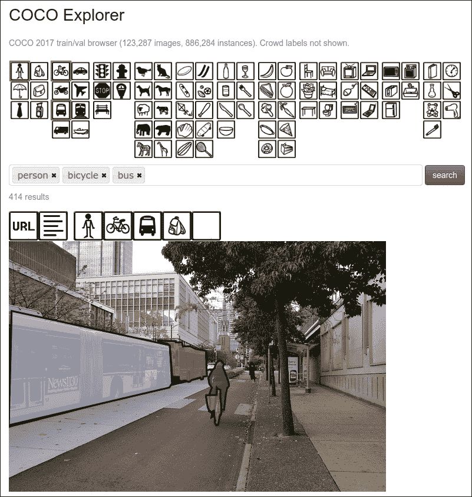

图 9.1: COCO 数据集资源管理器片段

在每个图像中，已经为每个主要对象提供了适当的对象边界。这是如果你想从零开始构建你自己的计算机视觉应用程序，这个数据集非常棒的主要原因。

在这里，我们不是下载数据集，因为如果我们需要在这个数据集上从头开始训练模型，那么它将需要大量的时间和大量的 GPU 来获得良好的准确性。因此，我们将使用预训练的模型，并使用迁移学习，我们将实现实时对象检测。现在，我们来看看 PASCAL VOC 数据集。

## PASCAL VOC 数据集

PASCAL 代表模式分析、统计建模和计算学习，VOC 代表可视对象类。在这个数据集中，图像被标记为 20 类用于对象检测。动作类和个人布局标签也是可用的。在 person layout taster 标签中，边界框是关于人的每个部分(头、手、脚)的标签。你可以在 http://host.robots.ox.ac.uk/pascal/VOC/voc2012/index.html 的[查阅这个数据集的详细资料。](http://host.robots.ox.ac.uk/pascal/VOC/voc2012/index.html)

### 帕斯卡 VOC 类

图像被分为四大类:

*   人
*   动物
*   车辆
*   室内的

每个图像都用前面的主要类别进行标记，另外还有给图像中的对象的特定标记。上述四个类别中的每一个都有特定的标签，我在下面的列表中描述了这些标签:

*   **人物**:人物
*   **动物**:鸟、猫、牛、狗、马、羊
*   **交通工具**:飞机、自行车、轮船、公共汽车、汽车、摩托车、火车
*   **室内**:瓶子、椅子、餐桌、盆栽、沙发、电视/显示器

可以参考下图，帮助你理解这个 PASCAL VOC 数据集中的标注:

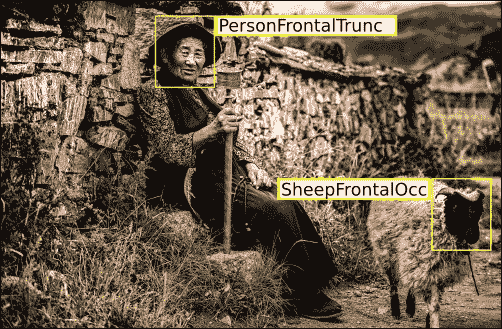

图 9.2: PASCAL VOC 标记图像示例

正如你在前面的图中看到的，两个主要的类被标记:人和动物。对于图像中出现的物体，即人和羊，已经给出了特定的标记。我们不下载此数据集；我们将使用预训练模型，该模型是使用此数据集训练的。

到目前为止，你已经听到了很多关于迁移学习和预训练模型的术语。我们来了解一下它们是什么。

# 迁移学习

在本节中，我们将了解什么是迁移学习，以及在我们构建实时对象检测时，它将如何对我们有用。我们将本节分为以下几个部分:

*   什么是迁移学习？
*   什么是预训练模型？
*   为什么要使用预先训练好的模型？
*   如何使用预先训练好的模型？

先说第一个问题。

## 什么是迁移学习？

我们将首先着眼于迁移学习背后的直觉，然后，我们将涵盖它的技术定义。让我通过一个简单的师生类比来解释这个概念。教师在教授某些特定的课题或科目方面有多年的经验。无论老师有什么信息，他们都会传递给学生。所以，教学的过程就是把知识从老师传递给学生。可以参考下图:

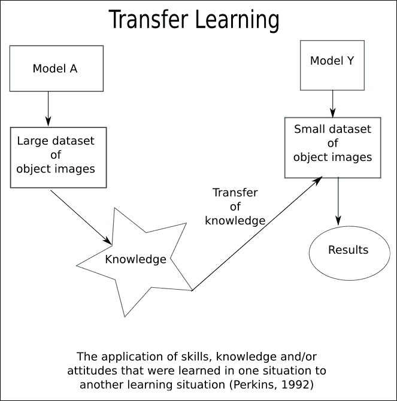

图 9.3:迁移学习概述

现在，记住这个类比；我们将把它应用于神经网络。当我们训练神经网络时，它从给定的数据集中获取知识。这个经过训练的神经网络有一些权重，帮助它从给定的数据集学习；训练之后，我们可以用二进制格式存储这些权重。我们以二进制格式存储的权重可以提取出来，然后传输到任何其他神经网络。因此，我们不是从头开始训练神经网络，而是转移先前训练的模型获得的知识。我们正在将学习到的特征转移到新的神经网络中，这将节省我们很多时间。如果我们已经有了一个特定应用的训练模型，那么我们将把它应用到新的但是相似类型的应用中，这反过来将有助于节省时间。

现在，是时候用更专业的术语来定义迁移学习了。迁移学习是机器学习中的一个研究问题，它专注于存储在解决特定问题时获得的知识，并将其应用于不同但相关的问题。有时候，迁移学习也叫归纳迁移。我们举一个实实在在的例子来固化你的视野。如果我们建立一个在学习识别汽车时获得知识的机器学习模型，它也可以应用于我们试图识别卡车的时候。在本章中，我们将使用迁移学习来构建这个实时对象检测应用程序。

## 什么是预训练模型？

我想给你一个简单的解释。预训练模型是由其他人创建和构建的，用于解决特定问题。这意味着我们正在使用一个已经被训练好的模型，并插入和使用它。通过使用预先训练的模型，我们可以构建具有相似领域的新应用程序。

我举个例子:假设我们想制造一辆自动驾驶汽车。为了建造它，我们的第一步是建造一个像样的物体识别系统。你可以花一年或更长时间从零开始构建像样的图像和对象识别算法，或者你可以使用预先训练好的模型，如谷歌 inception 模型或 YOLO 模型，后者是使用 PASCAL VOC 数据集构建的。

使用预先训练的模型有一些优势，如下所示:

*   一个预先训练好的模型不一定能给你 100%的准确率，但却省了不少力气。
*   你可以优化你正在处理的真实问题的准确性，而不是从头开始做一个算法；正如我们有时所说，没有必要重新发明轮子。
*   有许多可用的库可以帮助我们保存训练好的模型，因此我们可以在需要时轻松地加载和使用它们。

除了预训练模型为我们提供的优势之外，我们还需要理解为什么我们应该使用预训练模型的其他真正原因。因此，让我们在下一节讨论这个问题。

## 为什么要使用预先训练好的模型？

当我们专注于以不同的方式开发现有算法时，我们的目标将是构建一个优于所有其他现有算法的算法，并使其更加高效。如果我们只关注研究部分，那么这可能是一个开发高效和准确算法的好方法，但是如果你的愿景是开发一个应用程序，并且这个算法是整个应用程序的一部分，那么你应该关注如何快速有效地构建应用程序。我们通过一个例子来理解这一点。

在这一章中，我们想要建立实时物体检测技术。现在，我的主要精力将放在构建一个能够实时检测物体的应用程序上。不仅如此；我还需要结合对象检测和实时跟踪活动。如果我忽略了我的主要目标，开始开发新的但是有效的目标检测算法，那么我将会失去注意力。我的重点将是构建整个实时对象检测应用程序，而不仅仅是某个算法。

有时，如果我们失去了重点，试图从头开始构建算法，那么这将花费大量时间。我们也会白费力气，因为世界上有些聪明人可能已经为我们建造好了。当我们使用这个已经开发的算法时，我们将节省时间并专注于我们的应用。在构建了我们实际应用程序的原型之后，我们将有时间对它进行即兴创作，以便它可以被许多其他人使用。

让我告诉你我的故事。几个月前，我开始构建一个可用于安全领域的图像检测应用程序。当时我不想用一个预先训练好的模型，因为我想探索一下从零开始构建一个算法需要付出多大的努力。所以，我开始自己做一个。我尝试了几种不同的算法，比如 SVM、**多层感知器** ( **MLP** )、以及**卷积神经网络** ( **CNN** 模型，但是我得到的准确率真的很低。我不再专注于构建一个可用于安全领域的图像检测算法应用程序，而是开始专注于改进算法。过了一段时间，我意识到，如果我使用一个带有优化技术的预训练模型会更好，这将节省我的时间，并使我能够构建一个更好的解决方案。这次经历之后，我试图探索在我正在解决的问题陈述中使用迁移学习的选项，如果我发现没有迁移学习的余地，那么我会从头开始制作算法；否则，我更喜欢使用预先训练好的模型。因此，在构建算法之前，一定要探索所有的选项。了解应用程序的使用情况，并在此基础上构建您的解决方案。假设你正在打造自己的自动驾驶汽车；然后，实时物体检测将成为自动驾驶汽车的重要组成部分，但它将只是整个应用程序的一部分；因此，如果我们使用预先训练好的模型来检测物体，那会更好，这样我们就可以利用我们的时间来建造一辆优质的自动驾驶汽车。

## 如何使用预先训练好的模型？

一般来说，预训练模型是二进制格式的，可以下载并在我们的应用程序中使用。有些库，比如 Keras、TensorFlow、Darknet 等等，已经有了那些预模型，您可以加载这些预模型并与某些可用的 API 一起使用。这些预先训练的网络能够通过迁移学习来概括不属于 PASCAL VOC 或 COCO 数据集的图像。我们可以通过微调模型来修改预先存在的模型。我们不想过多地修改权重，因为它已经在使用大量 GPU 的大型数据集上进行了训练。预训练的模型具有概括对象的预测和分类的能力，因此我们知道这个预训练的模型可以被概括到足以给我们最好的可能结果。但是，如果我们想从零开始训练模型，我们可以更改一些超参数。这些参数可以是学习速率、时期、层大小等等。让我们来讨论其中的一些:

*   学习率:学习率基本上控制了我们应该更新多少神经元的权重。我们可以使用固定学习率、递减学习率、基于动量的方法或自适应学习率。
*   历元数:历元数表示整个训练数据集应该通过神经网络的次数。为了减少测试误差和训练误差之间的差距，我们需要增加历元的数量。
*   批量大小:对于卷积神经网络，小批量通常更可取。对于卷积神经网络，16 到 128 的范围确实是一个不错的选择。
*   激活函数:正如我们所知，激活函数给模型引入了非线性。ReLU 激活函数是卷积神经网络的首选。您也可以使用其他激活函数，如 tanh、sigmoid 等。
*   正则化的放弃:正则化技术用于防止过度拟合问题。Dropout 是深度神经网络的正则化技术。在这项技术中，我们去掉了神经网络中的一些神经元或单元。神经元的退出是基于概率值的。默认值为 0.5，这是一个不错的选择，但我们可以在观察训练误差和测试误差后更改正则化的值。

在这里，我们将使用预训练模型，如 Caffe 预训练模型，TensorFow 对象减损模型，以及**你只看一次** ( **YOLO** )。对于来自网络摄像头的实时流，我们使用 OpenCV，这对于绘制边界框也很有用。所以首先，让我们设置 OpenCV 环境。

# 设置编码环境

在这一节中，我们将列出运行即将到来的代码所需的库和设备。你需要一个网络摄像头，至少可以清晰地播放视频。我们将使用 OpenCV、TensorFlow、YOLO、Darkflow 和 Darknet 库。我不打算解释如何安装 TensorFlow，因为这是一个简单的过程，你可以通过点击[https://www.tensorflow.org/install/install_linux](https://www.tensorflow.org/install/install_linux)找到安装的文档。

在这一节中，我们将首先看看如何设置 OpenCV，在接下来的几节中，我们将看到如何设置 YOLO、暗流和暗网。

## 设置和安装 OpenCV

OpenCV 代表开源计算机视觉。它是为计算效率而设计的，非常注重实时应用。在本节中，您将学习如何设置 OpenCV。我用的是 Ubuntu 16.04，有 GPU，所以已经装了 CUDA 和 CUDNN。如果你还没有安装 CUDA 和 CUDNN，那么你可以参考这个 GitHub 链接:[https://gist . GitHub . com/vbalnt/a 0 f 789d 788 a 99 bfb 62 b 61 CB 809246d 64](https://gist.github.com/vbalnt/a0f789d788a99bfb62b61cb809246d64)。完成后，开始执行以下步骤:

1.  这将更新软件和库:`$ sudo apt-get update`
2.  这将升级操作系统并安装操作系统级更新:`$ sudo apt-get upgrade`
3.  这是用来编译软件的:`$ sudo apt-get install build-essential`
4.  这个命令安装 OpenCV 的先决条件:`$ sudo apt-get install cmake git libgtk2.0-dev pkg-config libavcodec-dev libavformat-dev libswscale-dev`
5.  这个命令安装 OpenCV 的可选先决条件:`$ sudo apt-get install python-dev python-numpy libtbb2 libtbb-dev libjpeg-dev libpng-dev libtiff-dev libjasper-dev libdc1394-22-dev`
6.  使用以下命令创建一个目录:`$ sudo mkdir ~/opencv`
7.  跳转到我们刚刚创建的目录:`$ cd ~/opencv`
8.  从 GitHub 的 opencv 目录中克隆以下 OpenCV 项目:

    1.  `$ sudo git clone https://github.com/opencv/opencv.git`
    2.  `$ sudo git clone https://github.com/opencv/opencv_contrib.git`

9.  在 opencv 文件夹中，创建另一个名为 build: `$ sudo mkdir ~/opencv/build`的目录
10.  跳转到构建目录或文件夹:`$ cd ~/opencv/build`
11.  一旦您进入构建文件夹位置，运行这个命令。这可能需要一些时间。如果运行此命令没有任何错误，则继续下一步:

    ```
    $ sudo cmake -D CMAKE_BUILD_TYPE=RELEASE \ -D CMAKE_INSTALL_PREFIX=/usr/local \ -D INSTALL_C_EXAMPLES=ON \ -D INSTALL_PYTHON_EXAMPLES=ON \ -D WITH_TBB=ON \ -D WITH_V4L=ON \ -D WITH_QT=ON \ -D WITH_OPENGL=ON \ -D OPENCV_EXTRA_MODULES_PATH=../../opencv_contrib/modules \ -D BUILD_EXAMPLES=ON ..
    ```

12.  使用以下命令确定您有多少个 CPU 核心。:`$ nproc`
13.  一旦知道了 CPU 的核心数，就可以用它来处理多线程了。我已经分配了四个 CPU 内核，这意味着有四个线程同时运行。这个命令是`$ make -j4`,它为 OpenCV 编译所有用 C 编写的类。
14.  现在，执行这个命令来实际安装 OpenCV: `$ sudo make install`
15.  将路径添加到配置文件:`$ sudo sh -c 'echo "/usr/local/lib" >> /etc/ld.so.conf.d/opencv.conf'`
16.  使用以下命令检查配置是否正确:`$ sudo ldconfig`

一旦你成功安装了 OpenCV，我们就可以使用这个库来传输实时视频。现在，我们将开始构建基线模型。我们开始吧！

# 特征工程为基线模型

为了构建基线模型，我们将使用带有预训练权重的 Google MobileNet SSD 检测网络的 Caffe 实现。该模型已经在 PASCAL VOC 数据集上进行了训练。因此，在这一节中，我们将看看谷歌训练这个模型的方法。我们将了解 MobileNet SSD 背后的基本方法，并使用预先训练的模型来帮助节省时间。为了创建这种精确的模型，我们需要大量的 GPU 和训练时间，所以我们使用预训练的模型。这个预先训练好的 MobileNet 模型使用**卷积神经网络** ( **CNN** )。

让我们看看MobileNet 如何使用 CNN 提取特征。这将帮助我们理解 CNN 背后的基本理念，以及 MobileNet 是如何被使用的。CNN 网络由多个层组成，当我们向 CNN 提供图像时，它会扫描图像的区域，并尝试使用区域提议方法提取可能的对象。然后，它找到带有对象的区域，使用扭曲区域，并生成 CNN 特征。这些特征可以是像素的位置、边缘、边缘的长度、图像的纹理、区域的比例、图片的亮度或暗度、对象部分等等。CNN 网络自己学习这些类型的特征。可以参考下图:

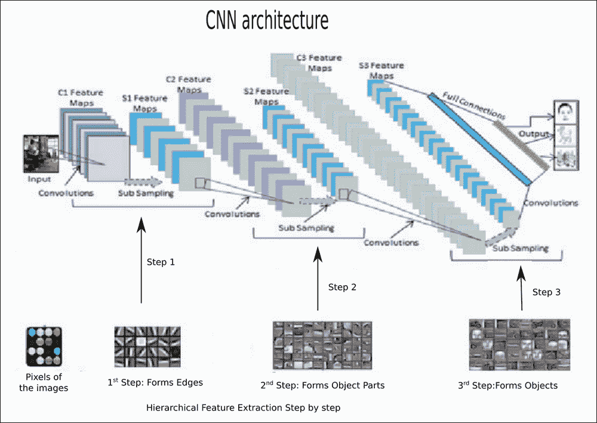

图 9.4:理解 CNN 中的特征提取

正如你在前面的图中看到的，图像的区域已经被扫描，由 C1 和 S1 组成的第一个 CNN 图层将生成这些特征。这些特征可以识别最终构建整个对象的边缘的表示。在第二阶段，CNN 层学习可以帮助神经网络识别物体部分的特征表示。在的最后阶段，它学习所有必要的特征，以识别给定输入图像中存在的物体。如果你想探索 CNN 网络的每一个方面，你可以参考[http://cs231n.github.io/convolutional-networks/](http://cs231n.github.io/convolutional-networks/)。不用担心；我们将在接下来的章节中介绍 CNN 架构的概述，以便您能够理解对象检测是如何工作的。现在，是时候探索 CNN 了。

# 选择机器学习算法

我们已经知道我们正在使用**卷积神经网络** ( **CNN** )来开发这个应用程序。你可能想知道为什么我们选择了 CNN 而不是另一个神经网络。你可能已经知道这个问题的答案了。我们选择 CNN 有三个原因:

*   如今，大量的视觉数据被小心地手工标注
*   负担得起的计算机器，通过它 GPU 打开了优化的大门
*   CNN 的各种结构优于其他算法

由于这些原因，我们选择了带 SSD 的 CNN。在基线模型的开发过程中，我们将使用 MobileNet，它使用 CNN，下面有**单发探测器** ( **SSD** )技术。因此，在这一节中，我们将看看在 MobileNet 开发过程中使用的 CNN 的架构。这将有助于我们理解预先训练的模型。

## MobileNet SSD 模型的架构

MobileNet SSD 速度很快，并且在图像和视频中很好地完成了对象检测的工作。这个模型比**基于区域的卷积神经网络** ( **R-CNN** )更快。SSD 达到这个速度是因为它扫描图像和视频帧的方式非常不同。

在 R-CNN 中，模型在两个不同的步骤中执行区域提议和区域分类，如下所示:

*   首先，他们使用区域提议网络来生成感兴趣的区域
*   之后，全连接层或正敏感构成层对所选区域中的对象进行分类。

这些步骤与 R-CNN 相同，但是 SSD 在单次拍摄中执行它们，这意味着它同时预测边界框和出现在边界框中的对象的类别。当图像或视频流和一组基本事实标签作为输入被给出时，SDD 执行以下步骤:

*   将图像通过一系列卷积层，这些卷积层以不同大小的矩阵形式生成特征映射集。输出可以是 10×10 矩阵、6×6 矩阵或 3×3 矩阵的形式。
*   对于每个特征图中的每个位置，使用 3×3 卷积滤波器来评估一小组默认边界框。这些生成的默认边界框相当于锚框，是使用更快的 R-CNN 生成的。
*   对于每个框，同时预测对象的边界框偏移和类别概率。
*   在培训过程中，将基本事实框与这些预测框相匹配。这种匹配是通过使用并集交集(IoU)来执行的。最佳预测框将被标记为正边界框。每个边界框都会发生这种情况。这里已经考虑了具有超过 50%真实值的借据。

请看下图的图形表示。MobileNets 具有流线型的架构，该架构使用深度方向可分离的卷积，以便为移动和嵌入式视觉应用构建轻量级深度神经网络。对于计算机视觉应用，MobileNets 是一种更有效的 ML 模型。你也可以参考 MobileNet 在[https://arxiv.org/pdf/1704.04861.pdf](https://arxiv.org/pdf/1704.04861.pdf)的原始论文。

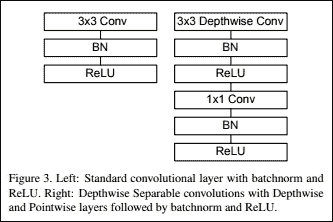

图 9.5:MobileNet SSD 的基本架构构建模块

图片来源:https://arxiv.org/pdf/1704.04861.pdf

正如你在前面的图中看到的，我们使用了标准卷积网络和深度卷积网络。SDD 移动网络使用 ReLU 激活功能。可以参考下图，了解一下这个网络是什么样的滤波器形状:

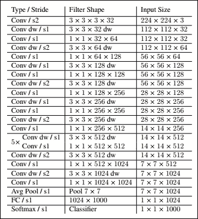

图 9.6，MobileNet 主体架构

图片来源:https://arxiv.org/pdf/1704.04861.pdf

如果你想解读这个表格，那么让我们考虑一个例子。如果我们有一个像素为 224×224 的原始图像，那么这个 Mobilenet 网络将图像缩小到 7×7 像素；它还有 1024 个频道。在此之后，有一个平均池层，它作用于所有图像并生成 1×1×1，024 大小的向量，这实际上只是 1，024 个元素的向量。如果您想了解有关 MobileNet SSD 的更多信息，请参考以下资源:

*   [http://cs231n.github.io/convolutional-networks/](http://cs231n.github.io/convolutional-networks/)
*   [https://towardsdatascience . com/deep-learning-for-object-detection-a-comprehensive-review-73930816 d8d 9](https://towardsdatascience.com/deep-learning-for-object-detection-a-comprehensive-review-73930816d8d9)
*   [https://medium . com/ilenze-com/object-detection-using-deep-learning-for-advanced-users-part-1-183 bbbb 08 b 19](https://medium.com/ilenze-com/object-detection-using-deep-learning-for-advanced-users-part-1-183bbbb08b19)
*   [http://machine think . net/blog/Google s-mobile-net-architecture-on-iphone/](http://machinethink.net/blog/googles-mobile-net-architecture-on-iphone/)

现在，让我们转到实现部分。

# 建立基线模型

在这个部分，我们将看看编码部分。可以参考这个 GitHub 链接给出的代码:[https://GitHub . com/jalajthanaki/Real _ time _ object _ detection/tree/master/base _ line _ model](https://github.com/jalajthanaki/Real_time_object_detection/tree/master/base_line_model)。

首先，按照本章前面给出的信息，从给定的链接下载项目并安装 OpenCV。当你下载这个项目文件夹的时候，有一个预训练的 MobileNet SSD 已经使用 caffe 库实现了，但是在这里，我们使用的是预训练的二进制模型。我们使用 OpenCV 加载预训练模型，并从网络摄像头传输视频。

在代码中，首先，我们指定需要导入的库，并定义将用于运行脚本的命令行参数。我们需要提供参数文件和预训练的模型。参数文件名为`MobileNetSSD_deploy.prototxt.txt`，预训练模型的文件名为`MobileNetSSD_deploy.caffemodel`。我们还定义了模型可以识别的类。之后，我们将使用 OpenCV 加载预训练的模型。您可以在下面的截图中参考到此阶段的编码:

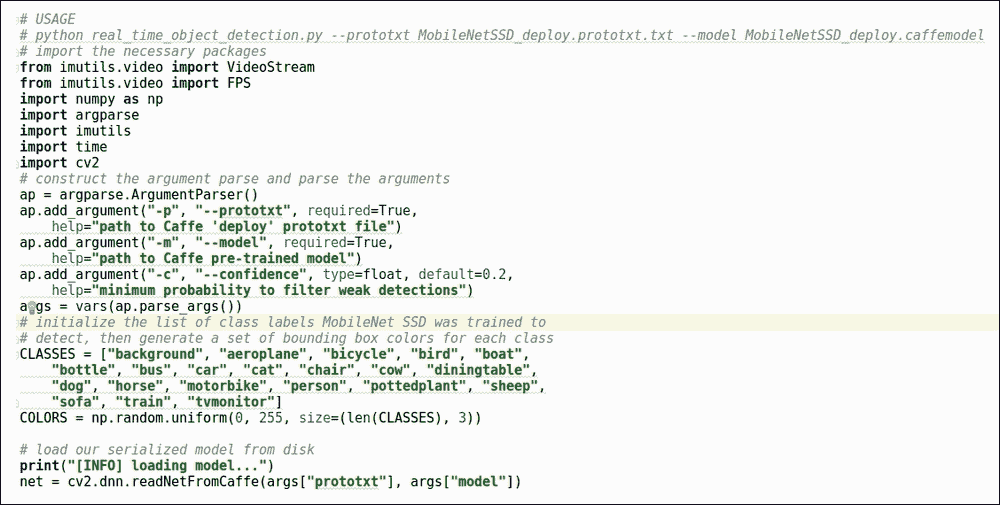

图 9.7:基线模型的代码片段

现在，让我们看看如何通过网络摄像头传输视频。在这里，我们使用库`imutils`和它的视频 API 从网络摄像头传输视频。使用 start 函数，我们将开始流式传输，之后，我们将定义帧大小。我们获取帧大小并将其转换为 blob 格式。该代码始终验证检测到的对象置信分数将高于最小置信分数或置信分数的最小阈值。一旦我们得到了更高的置信度，我们将为这些对象绘制边界框。我们可以看到目前已经探测到的物体。基线模型的视频流可以参考下图:

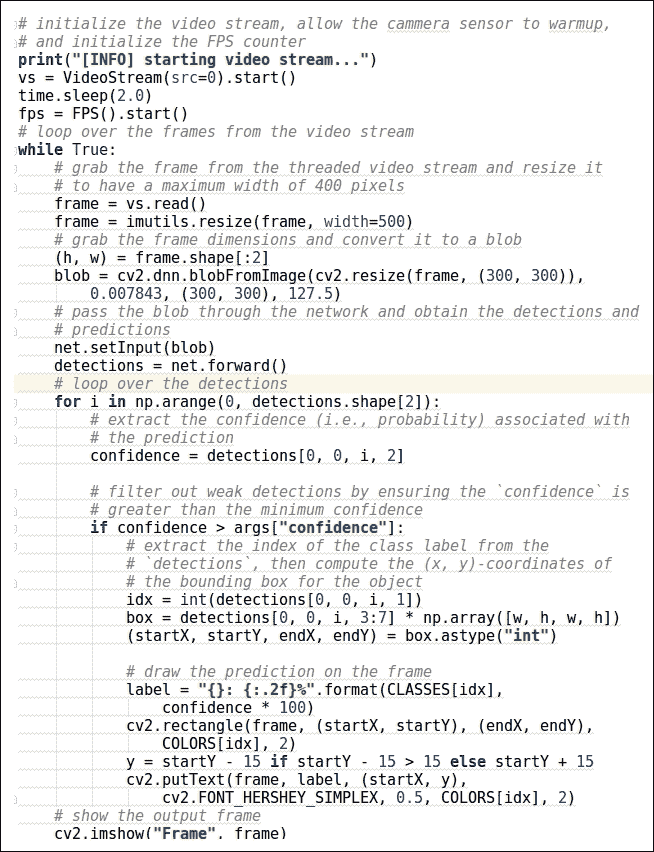

图 9.8:基线模型视频流的代码片段

为了停止流，我们需要通过按 Q 或 Ctrl + C 来打破循环，并且我们需要注意当我们关闭程序时，所有的窗口和进程将适当地停止。你可以在下面的截图中看到这一点:

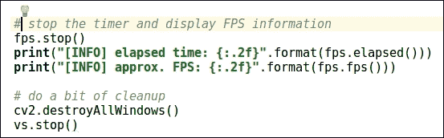

图 9.9:结束脚本的代码片段

在我们运行脚本测试之前，让我们了解对象检测应用程序的测试指标。一旦我们理解了测试标准，我们将运行代码并检查我们得到了多少准确性。

# 理解测试指标

在这个部分，我们将介绍测试指标。我们将看看这两个矩阵，它们将帮助我们理解如何测试对象检测应用程序。这些测试矩阵如下:

*   并集上的交集
*   平均精度

## 并集上的交集(IoU)

对于检测，使用 IoU以查明对象提议是否正确。这是确定对象检测是否完美完成的常规方法。IoU 通常采用建议对象像素组 A 和真实对象像素组 B，并根据以下公式计算 IoU:

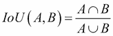

通常，IoU >0.5，这意味着是命中或者它识别了对象的对象像素或边界框；否则，它会失败。这是对借据更正式的理解。现在，让我们看看直觉和它背后的意义。让我们以一个图像作为参考，帮助我们理解这个矩阵背后的直觉。可以参考以下截图:

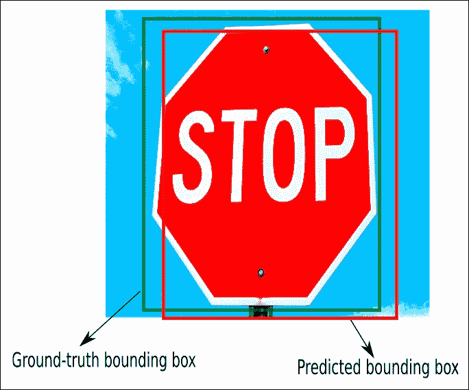

图 9.10:理解欠条背后的直觉

前面的截图是检测图像中停车标志的一个例子。预测边界框以红色绘制，属于该红色框的像素被视为集合 A 的一部分，而地面实况边界框以绿色绘制，属于该绿色框的像素被视为集合 b 的一部分。我们的目标是计算这些边界框之间的交集。因此，当我们的应用程序绘制一个边界框时，它应该与地面实况边界框匹配至少 50%以上，这被认为是一个好的预测。下图给出了 IoU 的计算公式:

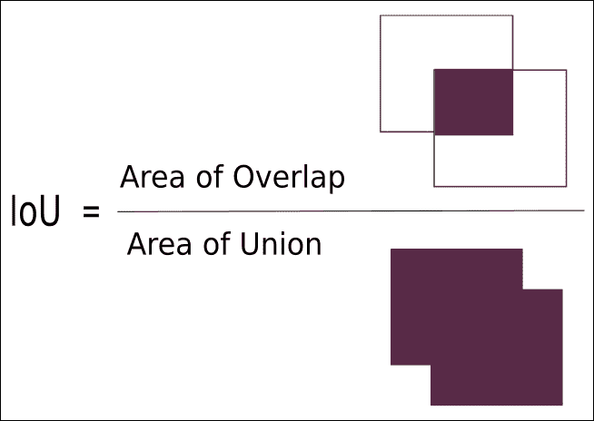

图 9.11:基于直觉理解的 IoU 方程

现实中，我们预测的边界框的(x，y)坐标与真实边界框的(x，y)坐标精确匹配的机会很少。在下图中，您可以看到差、好、优借条的各种例子:

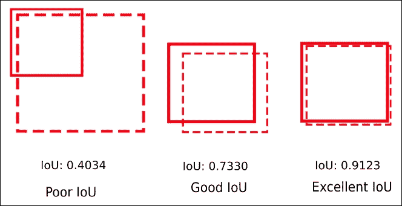

图 9.12:各种 IoU 边界框示例

IoUs 帮助我们确定应用程序识别对象边界和区分不同对象的能力。现在，是时候了解下一个测试指标了。

## 平均精度均值

在此部分，我们将涵盖**平均精度** ( **图**)。在对象检测中，首先，我们识别对象边界框，然后我们将其分类。这些类别有一些标签，我们为被识别的对象提供适当的标签。现在，我们需要测试应用程序如何分配这些标签，这意味着我们如何将对象分类到不同的预定义类别中。对于每个类别，我们将计算以下内容:

*   真正 TP(c):一个预测的类是 C，并且该对象实际上属于类 C
*   误报 FP(c):预测的类别是 C，但实际上，该对象不属于类别 C
*   C 类的平均精度由以下等式给出: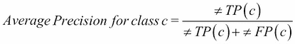

因此，对于所有的类，我们需要计算 mAP，等式如下:

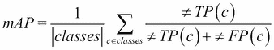

如果我们想要更好的预测，那么我们需要将 IoU 从 0.5 提高到更高的值(提高到 1.0，这将是完美的)。我们可以用这个等式来表示:mAP [@p] ，其中 p ∈ (0，1)是 IoU。mAP [@[0.5:0.95]] 表示在多个阈值上计算 mAP，然后再次对其进行平均。

现在，让我们测试基线模型并检查这个实现的映射。

# 测试基线模型

在本节中，我们将运行基线模型。为了运行该脚本，我们需要跳转到放置名为`real_time_object_detection.py`的脚本的位置，并且在命令提示符下，我们需要执行以下命令:

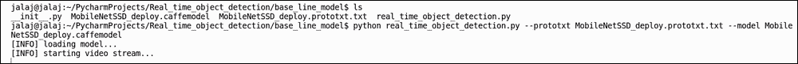

图 9.13:基线方法的执行

看一下下图。在这里，我只是放置了示例图像，但是当您运行脚本时，您可以看到整个视频。下面是使用基线方法进行实时物体检测的完整视频的链接:[https://drive . Google . com/drive/folders/1 rwkeueaxtexefdrsjsy 44 nugqgzatn _ BX？usp =分享](https://drive.google.com/drive/folders/1RwKEUaxTExefdrSJSy44NugqGZaTN_BX?usp=sharing)。

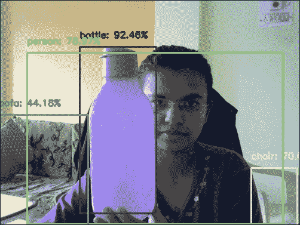

图 9.14:基线方法的输出(图像是视频流的一部分)

这里，MobileNet SSD 的图为 71.1%。在下一节中，您将了解如何优化这种方法。首先，我们将列出我们在下一次迭代中可以改进的点。那么，让我们跳到下一部分。

# 现有方法的问题

虽然 MobileNet SSD 速度很快，给了我们很好的结果，但它仍然无法识别杯子、钢笔等类别。所以，我们需要使用已经在各种对象上训练过的预训练模型。在即将到来的迭代中，我们需要使用预训练模型，例如 TensorFlow 对象检测 API，它将能够识别与基线方法相比不同的对象。现在，让我们看看我们将如何优化现有的方法。

# 如何优化现有方法

正如前面提到的，为了优化现有的方法，我将使用 TensorFlow 对象检测 API。你可以在下面的链接参考 Google 关于这个 API 的 tensor flow GitHub repo:[https://GitHub . com/tensor flow/models/tree/master/research/object _ detection](https://github.com/tensorflow/models/tree/master/research/object_detection)。该 API 使用 COCO 数据集和 PASCAL VOC 数据集进行训练；因此，它将具有识别各种类别的能力。

## 了解优化流程

对我们来说，最重要的部分是如何使用各种预先训练好的模型。步骤如下:

1.  首先，使用以下链接获取 TensorFlow 模型存储库:[https://github.com/tensorflow/models](https://github.com/tensorflow/models)
2.  一旦您提取了存储库，您就可以找到我提到的 iPython 笔记本，以便了解如何使用预训练模型，并在[https://github . com/tensor flow/models/blob/master/research/object _ detection/object _ detection _ tutorial . ipynb](https://github.com/tensorflow/models/blob/master/research/object_detection/object_detection_tutorial.ipynb)中找到 iPython 笔记本的链接。
3.  这里用的是带 MobileNet 的 SSD，但是我们用的是检测模型 zoo。该模型在 COCO 数据集上训练，并且基于模型的速度和性能给出它们的版本。可以从这个链接下载预训练好的模型:[https://github . com/tensor flow/models/blob/master/research/object _ detection/g3doc/detection _ model _ zoo . MD](https://github.com/tensorflow/models/blob/master/research/object_detection/g3doc/detection_model_zoo.md)。我已经把这些部分都放在一起了，所以大家很容易实现代码。
4.  最重要的是，这个模型是使用 SSD 方法训练的，但它采用了 kitti 数据集和 Open Image 数据集等数据集。因此，该模型能够检测更多的目标，具有更好的通用性。Kitti 数据集的链接是[http://www.cvlibs.net/datasets/kitti/](http://www.cvlibs.net/datasets/kitti/)，Open Image 数据集的链接是[https://github.com/openimages/dataset](https://github.com/openimages/dataset)。

一旦我们下载了存储库和预训练模型，我们将加载预训练模型。众所周知，在 TensorFlow 中，模型被保存为. pb 文件。一旦我们加载了模型，我们将使用 OpenCV 来传输视频。在接下来的部分中，我们将为修改后的方法实现代码。

# 实施修订后的方法

在本节中，我们将了解修改后的方法的实施。可以参考这个 GitHub 链接:[https://GitHub . com/jalajthaaki/Real _ time _ Object _ detection/tree/master/revised _ approach](https://github.com/jalajthanaki/Real_time_object_detection/tree/master/revised_approach)，里面有预先训练好的模型和 TensorFlow 的对象检测文件夹。在我们开始编写代码之前，我将提供关于这种方法的文件夹结构的信息。可以参考下图:

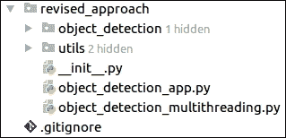

图 9.15:理解修订方法的文件夹结构

下面是从 TensorFlow 模型库下载的对象检测文件夹:[https://github . com/tensor flow/models/tree/master/research/object _ detection](https://github.com/tensorflow/models/tree/master/research/object_detection)。在`utils`文件夹中，有一些帮助器功能可以帮助我们流式播放视频。帮助我们运行脚本的主脚本是`object_detection_app.py`。预训练模型已保存在对象检测文件夹中。预训练模型在该文件夹中的路径是:`~/PycharmProjects/Real_time_object_detection/revised_approach/object_detection/ssd_mobilenet_v1_coco_11_06_2017/frozen_inference_graph.pb`。

现在，让我们一步一步地看编码实现。在第一步中，我们将导入依赖库并加载预先训练好的模型。可以参考下图:

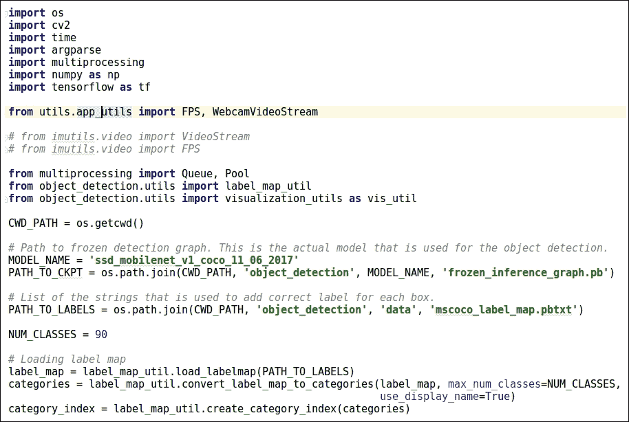

图 9.16:在修订的方法中加载预训练模型的代码片段

在这个模型中，有 90 种不同类型的物体可以被识别。一旦我们加载了模型，下一步就是`detect_objects()`函数，它用于识别对象。一旦对象被识别，该对象的边界框被绘制，并且我们同时对这些对象运行预先训练的模型，以便我们可以获得该对象的识别标签，无论它是杯子、瓶子、人等等。可以参考下图:

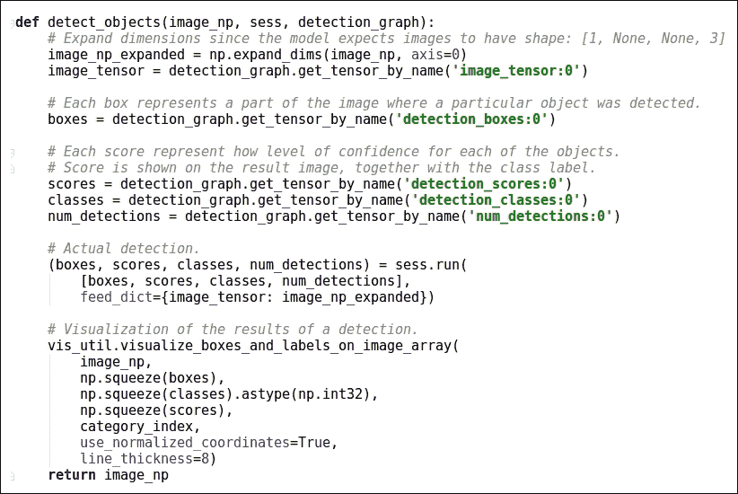

图 9.17:detect _ objects()函数的代码片段

在这之后，我们有了`worker()`函数，它帮助我们流式传输视频以及执行一些 GPU 内存管理。可以参考下图:

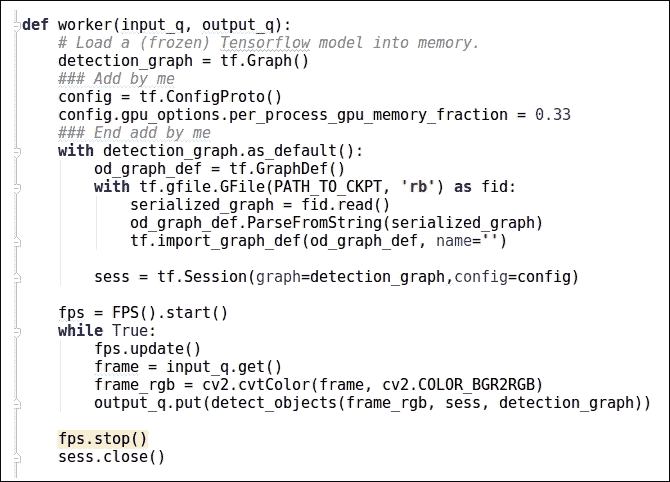

图 9.18:worker()函数的代码片段

正如你所看到的，我们已经定义了 GPU 内存份额，以及当它检测到物体时使用的颜色种类。现在，让我们看看脚本的主要功能。在 main 函数中，我们定义了一些可选参数及其默认值。这些参数列表如下:

*   摄像机的设备索引:`--source=0`
*   视频流中帧的宽度`--width= 500`
*   视频流中帧的高度`--height= 500`
*   工人数量`--num-workers=2`
*   队列的大小`--queue-size=5`

可以参考下图所示主要功能的实现:

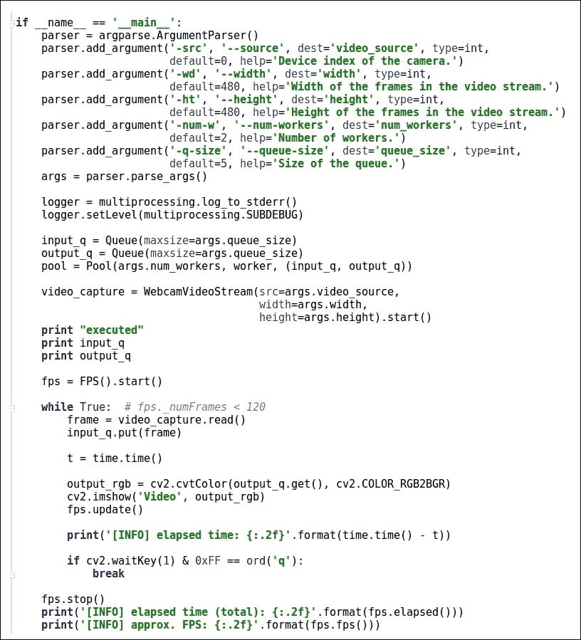

图 9.19:主函数的代码片段

当我们运行脚本时，我们可以看到下图中给出的输出。在这里，我们放置了图像，但您可以通过以下链接观看视频:

[https://drive . Google . com/drive/folders/1 rwkeueaxtexefdrsjsy 44 nugqgzatn _ BX？usp =共享](https://drive.google.com/drive/folders/1RwKEUaxTExefdrSJSy44NugqGZaTN_BX?usp=sharing)

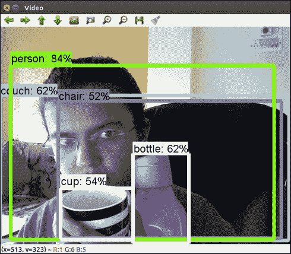

图 9.20:修订方法的输出

一旦我们结束视频，资源和流程也应该结束。为此，我们将使用通过下图提供给我们的代码:

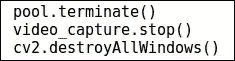

图 9.21:脚本终止后释放资源的代码片段

## 测试修订后的方法

一旦我们执行了这种方法，我们就可以识别诸如杯子、钢笔等物体。因此，我们可以说，我们的基线方法绝对是即兴的，有一些修改过的标签，如沙发(在这种方法中，标识为沙发)。除此之外，如果我们谈论这个预训练模型的地图，那么根据文档，在 COCO 数据集上，这个模型获得大约 52.4%的准确性。在我们的输入中，我们将获得大约 73%的准确率。这种方法可以识别更多不同类别的对象，这是一个很大的优势。

在接下来的部分，我们将讨论可以用来提出最佳解决方案的要点。

## 了解修订方法的问题

我们已经尝试了快速、准确的方法，但是我们需要一种快速、准确、优化的方法。在开发最佳解决方案时，我们需要牢记以下几点:

*   基于 SSD 的方法很好，但当您使用 COCO 或 PASCAL VOC 数据集训练自己的模型时，就不那么准确了。
*   TensorFlow 检测模型 zoo 在 COCO 测试数据集上的 mAP 得分将从 20%到 40%。因此，我们需要探索其他技术来帮助我们在处理和对象检测准确性方面给出更好的结果。

因此，在接下来的部分中，我们将看看可以帮助我们优化修订方法的方法。

# 最佳方法

在这一部分，我们将尝试名为 **YOLO** 的方法。YOLO 代表你只看一眼。这个技术给了我们很好的准确性，很快，并且它的内存管理很容易。本节将分为两部分:

*   了解 YOLO
*   使用 YOLO 实施最佳方法

在第一部分，我们将了解关于 YOLO 的基本知识。在实施过程中，我们将使用 YOLO 和预训练的 YOLO 模型。那么，让我们开始吧！

## 了解 YOLO

YOLO 是一个最先进的实时物体探测系统。在 GPU Titan X 上，它以 40-90 FPS 的速度处理图像，在 PASCAL VOC 数据集上的映射为 78.6%，在 coco test-dev 数据集上的映射为 48.1%。所以，现在，我们将看看 YOLO 是如何工作和处理图像来识别物体的。我们使用的是 YOLOv2 (YOLO 版本 2)，因为它是一个更快的版本。

## YOLO 的工作

YOLO 重构了物体探测问题。它认为对象识别任务是一个单一的回归问题，从图像像素到包围盒坐标和类概率。单个卷积网络同时预测多个边界框和这些框的类别概率。YOLO 在全图像上训练，直接优化检测性能。与传统方法相比，这种方法有以下几个优点:

*   YOLO 速度极快。这个是因为，在 YOLO，帧检测是一个回归问题，我们不需要使用复杂的流水线。
*   我们可以简单地在测试时对新图像运行我们的神经网络来预测检测。我们的基础网络在 Titan X GPU 上以每秒 45 帧的速度运行，没有批处理，快速版本的运行速度超过 150 fps。这意味着我们可以实时处理流视频，延迟不到 25 毫秒。

当 YOLO 对有关类别及其外观的信息进行预测时，它会对图像进行全局处理。它还学习对物体的概括。

YOLO 把输入图像分成一个 S×S 的网格。如果一个物体的中心落在一个网格单元中，那么这个网格单元负责检测这个物体。每个网格单元预测 B 边界框和这些框的置信度得分。这些置信度得分反映了模型对盒子包含对象的置信度，以及它认为它预测的盒子有多准确。所以，形式上，我们可以用这个符号来定义 YOLO 的信任机制。我们将置信度定义为 Pr(object) * IoU。如果该单元中不存在任何对象，则置信度得分应该为零；否则，我们希望置信度得分等于预测框和实际情况之间的 IoU。每个边界框由五个预测组成:x、y、w、h 和置信度。(x，y)坐标表示相对于网格单元边界的盒子中心。w 和 h 代表宽度和高度。它们被预言与整个图像相关。最后，信心分数代表欠条。对于每个网格单元，它预测 C 个条件类概率， *Pr(Classi|Object)* 。这些概率取决于包含对象的网格单元。我们只预测每个网格单元的一组类别概率，而不考虑边界框 b 的数量。在测试时，我们将条件类别概率与由以下等式定义的单个框置信度预测相乘:

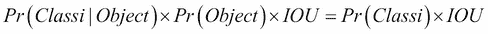

前面的等式给出了每个盒子的特定于类别的置信度得分。这个分数包含类出现在框中的概率以及预测的框与对象的匹配程度。YOLO 整个过程的图示如下图所示:

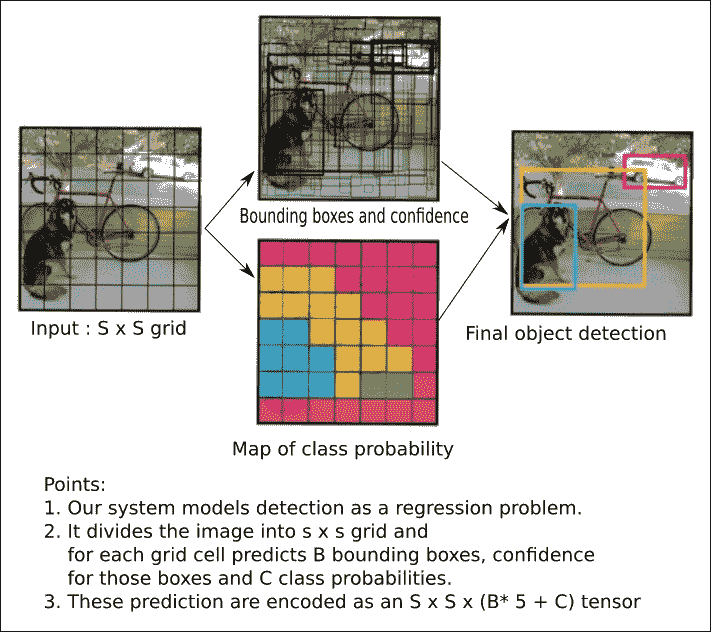

图 9.22:YOLO 物体探测的图示

现在，让我们来了解一下 YOLO 建筑的基本知识。

## YOLO 的建筑

在这一部分，你将学习关于 YOLO 建筑的基础知识。在 YOLO，有 24 个卷积层，后面是两个全连接层。YOLO 没有使用谷歌网络使用的初始模块，而是简单地使用 1×1 缩减层，然后是 3×3 卷积层。快速 YOLO 使用卷积层数较少的神经网络。我们用 9 层而不是 24 层。我们也在这些层中使用较少的过滤器。除此之外，在训练和测试期间，YOLO 和快速 YOLO 的所有参数都是相同的。可以参考下图的架构:

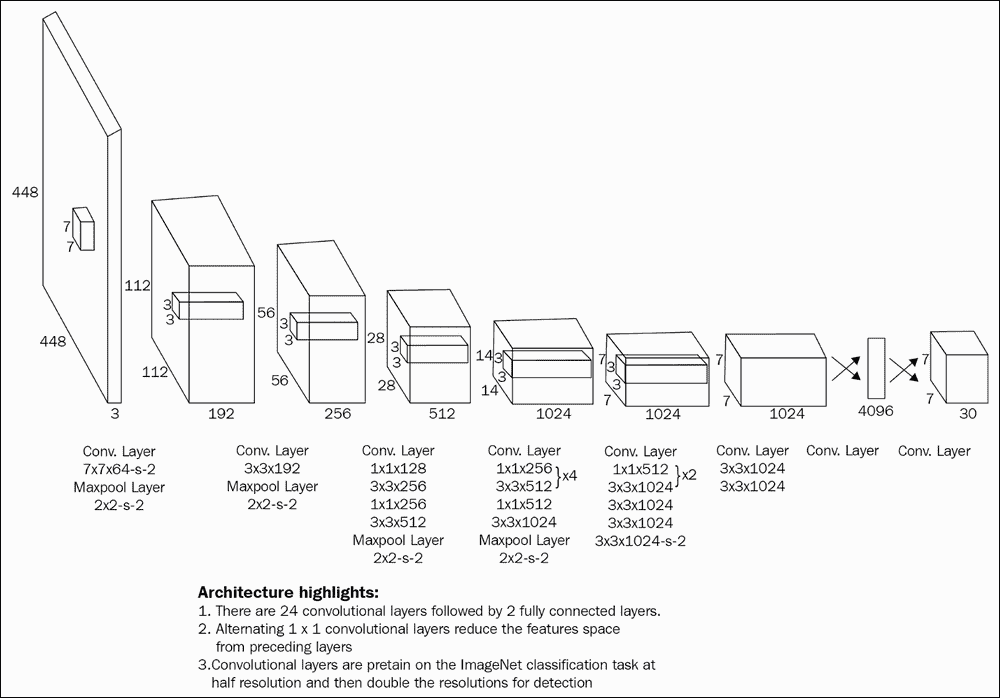

图 9.23:YOLO 的建筑

现在，让我们转到实现部分。

## 使用 YOLO 实施最佳方法

为了实现 YOLO，我们需要安装 Cython 模块。除此之外，您可以使用 Darknet 或 Darkflow，它是 Darknet 上的 TensorFlow 包装器。Darknet 是用 C 和 CUDA 写的，所以还是挺快的。在这里，我们将实现这两个选项。在实现之前，我们需要设置环境。这里的实现部分应该分为两个部分:

*   使用暗网实现
*   使用暗流实现

所有代码可以参考这个 GitHub 资源库:[https://GitHub . com/jalajthanaki/Real _ time _ object _ detection _ with _ YOLO](https://github.com/jalajthanaki/Real_time_object_detection_with_YOLO)。

### 使用暗网实现

为了使用 Darknet 实现 YOLO，我们遵循这些步骤:

*   暗网的环境设置
*   编译暗网
*   下载预先训练的重量
*   对图像运行对象检测
*   对视频流运行对象检测

#### 暗网环境设置

在这一步，我们需要下载 Darknet 的 GitHub 库。我们可以使用下面的命令来实现。您可以从任何路径下载该存储库:

```
$ git clone https://github.com/pjreddie/darknet
```

一旦运行这个命令，就会创建名为 Darknet 的目录。之后就可以跳到下一步了。

#### 编译暗网

一旦我们下载了暗网，我们需要跳转到名为暗网的目录。之后，我们需要编译暗网。因此，我们需要依次执行以下命令:

```
$ cd darknet
$ make

```

#### 下载预训练体重

配置文件已经在 darknet 目录下的`cfg/`子目录中。因此，通过执行以下命令，您可以下载 YOLO 模型的预训练权重:

```
$ wegt https://pjreddie.com/media/files/yolo.weights
```

此下载可能需要一些时间。一旦我们有了预先训练好的重量，我们就可以运行暗网了。

#### 对图像进行目标检测

如果你想识别图像中的物体，那么你需要执行下面的命令:

```
./darknet detect cfg/yolo.cfg yolo.weights data/dog.jpg
```

你可以参考下图中这个命令的输出:

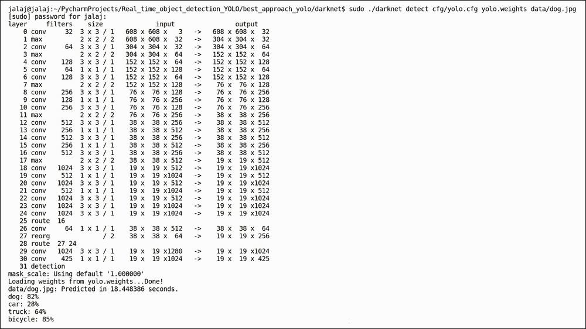

图 9.24:使用暗网对图像进行对象检测的输出

现在，让我们在视频流上实现 YOLO。

#### 对视频流运行目标检测

我们可以使用以下命令在视频流上运行 YOLO:

```
./darknet detector demo cfg/coco.data cfg/yolo.cfg yolo.weights <video file>
```

这里，我们需要传递视频的路径。更多信息可以参考这个暗网文档:【https://pjreddie.com/darknet/yolo/[。现在，让我们来了解一下 Darkflow 的实现。](https://pjreddie.com/darknet/yolo/)

### 使用暗流实现

在这个实现中，您需要引用名为 Darkflow 的文件夹中给出的代码。我们需要按照步骤执行:

1.  安装 Cython
2.  构建已经提供的安装文件
3.  测试环境
4.  加载模型并在图像上运行对象检测
5.  加载模型并在视频流上运行对象检测

#### 安装 Cython

为了安装 Cython，我们需要执行以下命令。之所以需要这个 Cython 包，是因为 Darkflow 是一个 Python 包装器，它使用了 Darknet 中的 C 代码:

```
$ sudo apt-get install Cython
```

一旦安装了 Cython，我们就可以构建另一个设置。

#### 构建已经提供的设置文件

在这个阶段，我们将执行为我们建立必要的 Cython 环境的命令。该命令如下所示:

```
$ python setup.py build_ext --inplace
```

当我们执行这个命令时，我们将不得不在克隆的 Darkflow 目录中使用`./flow`而不是 flow，因为 Darkflow 不是全局安装的。一旦这个命令成功运行，我们需要测试我们是否完美地安装了所有的依赖项。您可以使用以下命令下载预训练体重:

```
$ wegt https://pjreddie.com/media/files/yolo.weights
```

#### 测试环境

在这个阶段，我们将测试 Darkflow 是否完美运行。为了检查这一点，我们需要执行以下命令:

```
$ ./flow --h
```

可以参考下图:


图 9.25:暗流的成功测试结果

一旦您可以看到前面的输出，您就会知道您已经成功地配置了暗流。现在，让我们运行它。

#### 加载模型并在图像上运行对象检测

我们可以在图像上运行暗流。为此，我们需要加载 YOLO 预训练的权重、配置文件和图像路径，以便您可以执行以下命令:

```
./flow --imgdir sample_img/ --model cfg/yolo.cfg --load ../darknet/yolo.weights
```

如果您想以 json 格式保存对象检测，那么这也是可能的。您需要执行以下命令:

```
./flow --imgdir sample_img/ --model cfg/yolo.cfg --load ../darknet/yolo.weights --json
```

您可以在`sample_img/out`文件夹中看到输出；请参考下图:

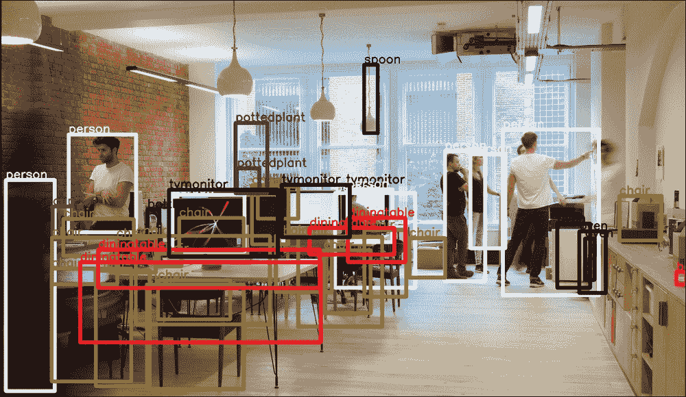

图 9.26:使用暗流输出带有预测对象的图像

你也可以参考下图:

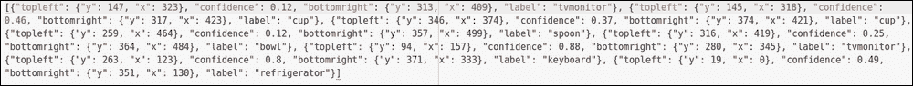

图 9.27:图像中检测到的对象的 json 输出

#### 加载模型并在视频流上运行对象检测

在这一节中，我们将对视频流进行对象检测。首先，我们将了解如何使用网络摄像头和执行对象检测。该命令如下所示:

```
./flow --model cfg/yolo.cfg --load ../darknet/yolo.weights --demo camera --saveVideo --gpu 0.60
```

可以参考下图。可以在这个链接看到视频:[https://drive . Google . com/drive/folders/1 rwkeueaxtexefdrsjsy 44 nugqgzatn _ BX？usp =分享](https://drive.google.com/drive/folders/1RwKEUaxTExefdrSJSy44NugqGZaTN_BX?usp=sharing)

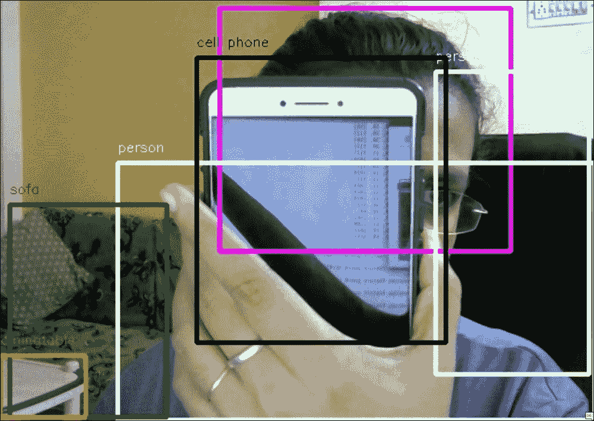

图 9.28:使用暗流对网络摄像头视频流进行对象检测的输出

我们也可以为预先录制的视频运行暗流。为此，您需要运行以下命令:

```
./flow --model cfg/yolo.cfg --load ../darknet/yolo.weights --demo ~/Downloads/Traffic.avi --saveVideo --gpu 0.60
```

可以参考下图。可以在这个链接看到视频:[https://drive . Google . com/drive/folders/1 rwkeueaxtexefdrsjsy 44 nugqgzatn _ BX？usp =分享](https://drive.google.com/drive/folders/1RwKEUaxTExefdrSJSy44NugqGZaTN_BX?usp=sharing)。

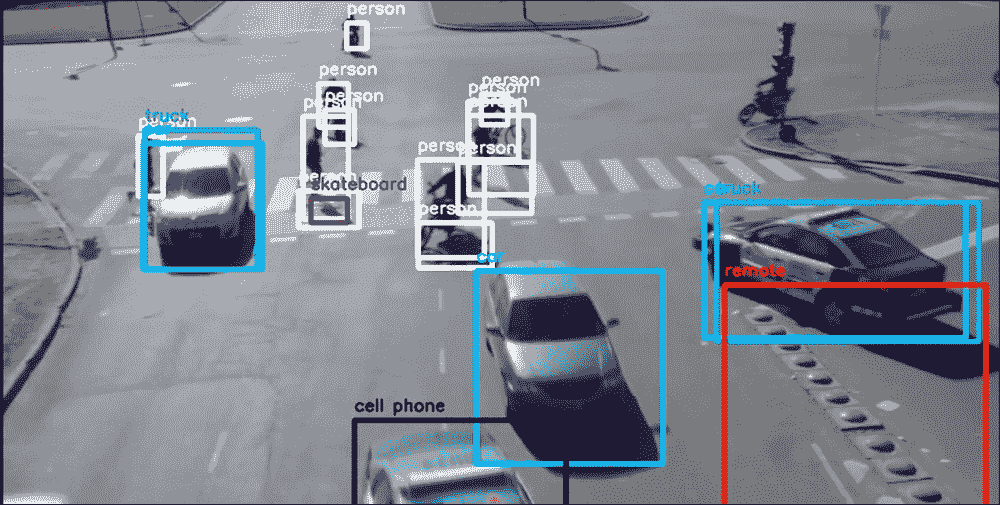

图 9.29:使用暗流对预先录制的视频进行对象检测的输出

在两个命令中，我们都使用了—save Video 标志来保存视频，并使用了—gpu 0.60 标志，该标志使用了 60%的 gpu 内存。使用这种方法，我们将获得 78%的准确率。

# 摘要

在本章中，你学习了迁移学习。我们探索了不同的库和方法来构建实时对象检测应用程序。您了解了如何设置 OpenCV，并了解了它在构建基线应用程序中的作用。在这种基线方法中，我们使用了使用 caffe 深度学习库训练的模型。在那之后，我们使用 TensorFlow 来建立实时对象检测，但最终，我们使用了预训练的 YOLO 模型，它优于其他所有方法。这种基于 YOLO 的方法为我们提供了对象检测应用的更一般化的方法。如果您对构建计算机视觉的创新解决方案感兴趣，那么您可以报名参加 VOC 挑战赛。这会提升你的技能，给你一个学习的机会。更多信息可以参考这个链接:[http://host.robots.ox.ac.uk/pascal/VOC/](http://host.robots.ox.ac.uk/pascal/VOC/)(PASCAL VOC Challenges 2005-2012)。你也可以构建自己的算法，检查结果，并将结果与现有方法进行比较，如果结果优于现有方法，你肯定可以在知名期刊上发表论文。通过使用 YOLO 方法，我们在 PASCAL VOC 数据集上获得了 78%的平均精度，当您将该模型应用于任何视频或图像时，它都可以很好地工作。这一章的代码归功于阿德里安·罗斯布鲁克、达特·特兰和特里厄。我们根据 COCO 数据集或 PASCAL VOC 数据集的图谱定义了图谱得分。

在下一章，我们将探索另一个属于计算机视觉领域的应用:人脸检测和面部表情检测。为了构建这个应用程序，我们将使用深度学习技术。所以，继续读！