    

# 十、人脸识别和人脸情感识别

在前一章中，我们研究了如何使用卷积神经网络和 YOLO(你只看一次)算法来检测汽车、椅子、猫和狗等物体。在这一章中，我们将检测人脸。除此之外，我们将会看到人脸的表情，比如人脸看起来是快乐的、中性的、悲伤的，等等。所以，这一章将会很有趣，因为我们将会把重点放在人脸检测和人脸情感识别的一些最新技术上。我们将本章分为两部分:

*   人脸检测
*   人脸情感识别

首先，我们将介绍人脸检测的工作原理，之后，我们将继续讨论人脸情感识别部分。一般来说，我们将在本章中讨论以下主题:

*   介绍问题陈述
*   设置编码环境
*   理解人脸识别的概念
*   实现人脸识别的方法
*   理解用于人脸情感识别的数据集
*   理解人脸情感识别的概念
*   建立人脸情感识别模型
*   了解测试矩阵
*   测试模型
*   现有方法的问题
*   如何优化现有方法

    *   了解优化过程

*   最佳方法

    *   实施最佳方法

*   摘要

# 介绍问题陈述

我们想开发两个应用。一个应用将识别人脸，另一个将识别人脸的情感。我们将在本节中讨论这两个问题。我们将看看我们到底想要开发什么。

## 人脸识别应用

这个应用基本上应该从图像或实时视频流中识别人脸。参考下面这张照片；它将帮助您理解我所说的从图像或实时视频流中识别人脸的含义:

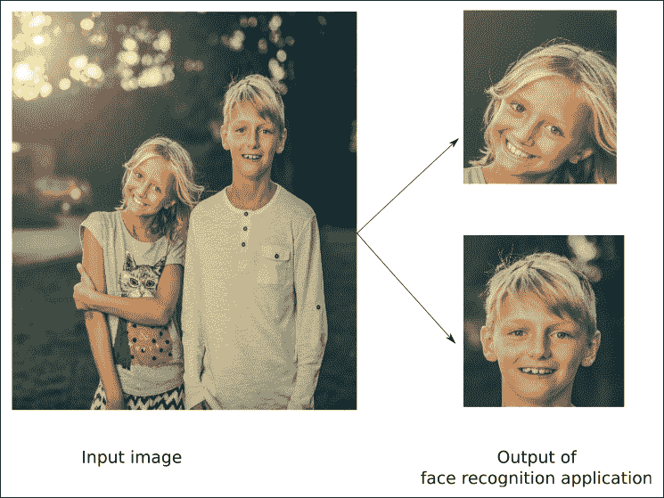

图 10.1:用于理解人脸识别应用的演示输出

图片来源:https://unsplash.com/photos/Q13lggdvtVY

正如您在前面的图(图 10.1)中看到的，当我们提供任何图像作为输入时，在第一步中，机器可以识别图像中出现的人脸数量。作为输出，我们可以得到面部的裁剪图像。

除此之外，我还希望应用能够根据人脸识别人名。我想你对这种应用很熟悉。让我提醒你。当你在脸书上上传一张图片时，脸书的人脸识别机制会立即识别出图片中人物的名字，并建议你在图片中添加标签。我们将在人脸识别应用方面开发类似的功能。现在让我们转到应用的另一部分。

## 人脸情感识别应用

在应用的这个部分，我们想要构建一个可以检测人脸情绪类型的应用。我们将尝试识别以下七种情绪:

*   愤怒
*   厌恶
*   害怕
*   快乐
*   悲哀
*   惊喜
*   中立的

所以，我们将面部情绪分为这七种类型。这种应用将有助于知道这个人正在经历什么样的感觉，并且这种洞察力将有助于执行情绪分析、身体语言分析等等。

这里，我们将首先构建人脸识别应用，之后，我们将继续讨论人脸情感识别应用。

# 设置编码环境

在本节中，我们将为人脸识别应用设置编码环境。我们将看看如何安装依赖项。我们将安装以下两个库:

*   dlib
*   人脸识别

让我们开始安装过程。

## 安装 dlib

为了安装 dlib 库，我们需要执行以下步骤。我们可以在 Linux 操作系统(OS)或 macOS 上安装这个库。让我们遵循逐步说明:

1.  通过执行此命令下载 dlib 的源代码:

    ```
     sudo git clone https://github.com/davisking/dlib.git.
    ```

2.  现在通过执行这个命令跳转到`dlib` 目录:`cd dlib`。
3.  现在我们需要构建主`dlib` 库，所以我们需要逐步执行以下命令:

    1.  `sudo mkdir build`。
    2.  `cd build`。
    3.  `cmake .. -DDLIB_USE_CUDA=0 -DUSE_AVX_INSTRUCTIONS=1`。
    4.  `cmake --build`。

成功构建项目后，您可以进入下一个安装步骤。你还需要安装 **OpenCV** 。OpenCV 的安装步骤已经在[第十章](ch10.xhtml "Chapter 10. Face Recognition and Face Emotion Recognition") *实时物体检测*中给出。

## 安装面部识别

为了让安装`face_recognition`库，我们需要执行以下命令:

```
$ sudo pip install face_recognition (This command is for python 2.7)
$ sudo pip3 install face_recognition (This command is for python 3.3+)
```

只有在我们已经完美安装了`dlib`的情况下，前面的命令才会安装`face_recognition`库。

一旦安装了前面的两个库，我们就可以进入下一部分，在这一部分中，我们将讨论人脸识别的关键概念。

# 了解人脸识别的概念

在这一部分，我们将了解人脸识别的主要概念。这些概念将包括以下主题:

*   了解人脸识别数据集
*   人脸识别算法

## 了解人脸识别数据集

你可能会奇怪为什么我到现在还没有讨论过任何与数据集相关的东西。这是因为我不想通过提供关于两个不同应用的数据集的所有细节来迷惑您。我们将在这里介绍的数据集将用于**人脸识别**。

如果您想从头开始构建人脸识别引擎，那么您可以使用以下数据集:

*   CAS-PEAL 人脸数据集
*   野外被贴上标签的面部

让我们更详细地讨论它们。

### CAS-PEAL 人脸数据集

这是一个用于人脸识别任务的庞大数据集。它有各种类型的人脸图像。它包含具有不同变化来源的人脸图像，特别是用于人脸识别任务的姿势、情感、配件和照明(PEAL)。

该数据集包含 1040 个个体的 99594 幅图像，其中 595 个是男性个体，445 个是女性个体。捕捉到的个人图像有不同的姿势、情绪、配件和灯光。参考下面的照片来看这个。如果你想看样本数据集，也可以参考下面的链接:[http://www.jdl.ac.cn/peal/index.html](http://www.jdl.ac.cn/peal/index.html)。

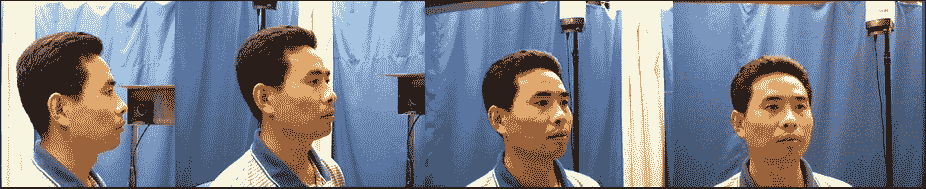

图 10.2: CAS-PEAL 人脸数据集样本图像

图片来源:http://www . jdl . AC . cn/peal/Image/Pose _ normal/normal combination-9-camera . jpg

您可以从以下链接下载该数据集:[http://www.jdl.ac.cn/peal/download.htm](http://www.jdl.ac.cn/peal/download.htm)

### 野外贴标签的面部

这个数据集也被称为 LFW 数据集。它在`face_recognition`库中使用。我们将使用这个库来构建我们的人脸识别应用。该数据集包含从网络上收集的 13，000 多张人脸图像。每张脸上都标有照片中人的名字。因此，数据集是一个带标签的数据集。在数据集中，有 1680 个人用两张或更多不同的面部图像拍照。您可以使用下图来参考样本数据集:

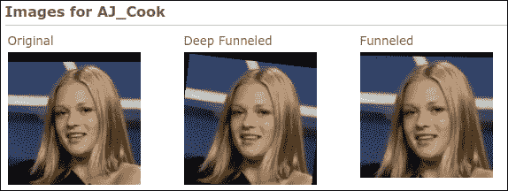

图 10.3:来自 LFW 数据集的样本图像

图片来源:http://vis-www.cs.umass.edu/lfw/person/AJ_Cook.html

### 注意

点击[http://vis-www.cs.umass.edu/lfw/index.html](http://vis-www.cs.umass.edu/lfw/index.html)，你可以了解更多关于这个数据集的信息。您也可以使用相同的链接下载数据集。您也可以通过点击[http://www . vision . Caltech . edu/Image _ Datasets/Caltech _ 10K _ web faces/](http://www.vision.caltech.edu/Image_Datasets/Caltech_10K_WebFaces/)来参考加州理工 10，000 web faces 数据集。你也应该参考 INRIA 个人数据集，这将是非常有用的。http://pascal.inrialpes.fr/data/human/ INRIA 人数据集的链接是。

为了构建人脸识别应用，我们将使用`face_recognition`库。我们使用该库通过其 API 提供的预训练模型。我们肯定会探索这个预训练模型和库背后的算法和概念。所以让我们开始吧！

## 人脸识别算法

在本节中，我们将了解用于人脸识别的核心算法。该算法的名称是**方向梯度直方图** ( **HOG** )。我们将看到 HOG 如何用于人脸识别任务。人脸识别(FR)任务基本上是一个分类任务，因为我们从图像中检测人脸，并试图在人脸的帮助下识别人名。猪是一个很好的选择。

另一种方法是使用卷积神经网络(CNN)。在这一部分，我们将也报道 CNN 的 FR 任务。所以，让我们从猪开始吧！

### 梯度方向直方图(HOG)

HOG 算法是人脸识别的最佳方法之一。HOG 方法是由 Dalal 和 Triggs 在他们 2005 年的开创性论文中提出的，可在[http://lear . inrialpes . fr/people/Triggs/pubs/Dalal-cvpr 05 . pdf](http://lear.inrialpes.fr/people/triggs/pubs/Dalal-cvpr05.pdf)上查阅。HOG 图像描述符和线性支持向量机可用于训练能够对人类检测器进行分类的高精度分类器。因此，HOG 也可以应用于 FR 任务。首先，我们将介绍算法背后的基本直觉。

HOG 是一种特征描述符。特征描述符是图像的表示，它通过提取有用的信息并忽略这些信息来简化图像。在这里，我们的重点将只放在面部。因此，我们将忽略其他对象，如果有的话。LWF 数据集的噪声较少，因此生成准确的要素描述符的任务相对容易。分步过程如下:

**第一步**:为了找到图像中的人脸，我们将从把彩色图像转换成黑白图像开始，因为我们不需要彩色数据来识别人脸。请参考下图:


图 10.4:将彩色图像转换为黑白图像

第二步:在这一步，我们将一次查看图像中的每一个像素。对于每一个单独的像素，我们想要查看直接围绕它的像素。请参考下图:

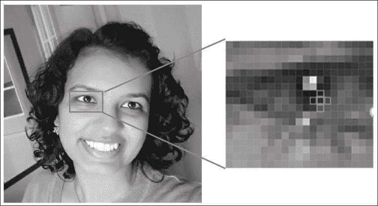

图 10.5:扫描图像每个像素的过程

步骤 3:这里，我们的目标是找出当前像素相对于它周围的像素有多暗。我们需要画一个箭头，指示图像像素变暗的方向。为了实现这一点，我们扫描整个图像。请参考下图:

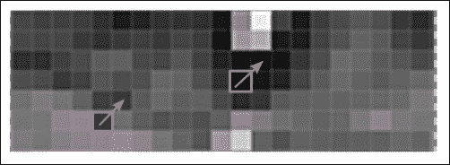

图 10.6:从亮像素到暗像素的箭头方向

正如您在上图中看到的，我们已经考虑了一个像素和它周围的其他像素。通过观察像素，我们可以很容易地发现箭头指向较暗的像素。

步骤 4:如果我们对图像中的每一个像素重复这个过程，那么我们将会用箭头代替每一个像素。这些箭头被称为*梯度*。这些*梯度*显示了整个图像中从亮到暗像素的流动。请参考下图:

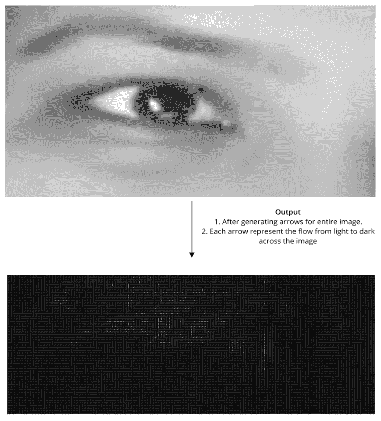

图 10.7:整个图像的渐变箭头

在前面的图中，你可以看到我们为输入图像生成渐变后得到的输出。扫描整个图像看起来像是一件随机的事情，但是用渐变替换像素是有原因的。如果我们直接分析原始像素值，那么同一个人的真正暗的图像和真正亮的图像将具有完全不同的像素值，这使得当我们试图识别人的面部时事情变得更加复杂。这里，我们考虑的是像素亮度变化的方向。我们发现，同一个人的非常暗的图像和非常亮的图像最终会得到完全相同的面部图像。就人脸识别任务而言，这种表征对我们来说很容易处理。这是为整个图像生成渐变的主要原因。不过，有一个挑战，我们将在下一步讨论。

步骤 5:保存每个像素的梯度给了我们太多的信息，我们可能会低效地使用这些信息。因此，我们需要获得我们将用于 FR 任务的最低限度的信息。我们将通过在一个更高的层次上考虑亮度或暗度的基本流动来实现这一点，这样我们就可以看到图像的基本模式。实现这一点的过程在步骤 6 中给出。

第六步:我们将把这张图片分成 16 x16 像素的小方块。在每个正方形中，我们将计算每个主要方向上的梯度点的数量，这意味着我们将计算有多少个箭头指向上、指向下、指向右、指向左等等。计算之后，我们将用最强的箭头方向替换图像中的方块。最终的结果是，我们将原始图像转换成一个简单的表示，它捕捉到了人脸的基本结构。请参考下图:

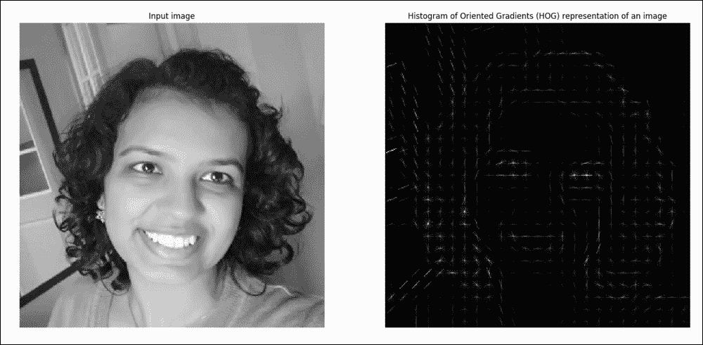

图 10.8:HOG 版本中的简单人脸表示

对于 FR 任务，这种表示易于处理；它被称为图像的猪版本。它代表了我们将在 FR 任务中考虑的特征，这就是为什么这个表示被称为作为 HOG 特征描述符的原因。

步骤 7:为了找出这张 HOG 图像中的人脸，我们必须找出图像中与从一堆其他训练人脸中提取的已知 HOG 模式最相似的部分。请参考下图:

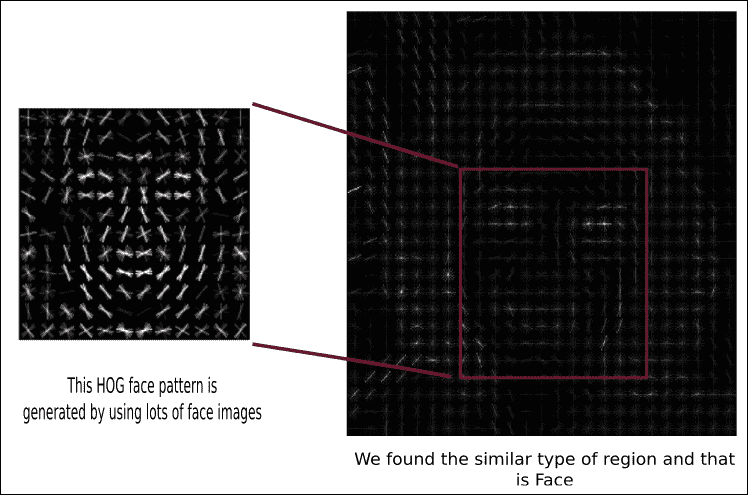

图 10.9:使用 HOG 版本的图像识别人脸的过程

使用这种技术，我们可以轻松识别任何图像中的人脸。

### 卷积神经网络(CNN)用于 FR

在这个部分，我们将看看如何使用 CNN 从图像中识别人脸。本节分为两部分:

*   简单的 CNN 架构
*   了解 CNN 如何为 FR 工作

#### 简单的 CNN 架构

我不想深入了解 CNN 是如何工作的，因为我已经在第九章[、*构建实时物体检测*中提供了大部分必要的细节；然而，我想提醒你关于 CNN 的一些必要的东西。首先，参考下图:](ch09.xhtml "Chapter 9. Building a Real-Time Object Recognition App")

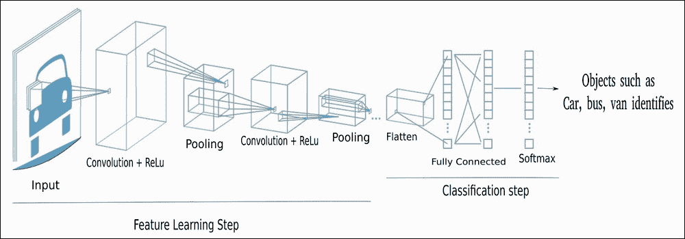

图 10.10:CNN 架构

正如您在上图中看到的，有一个卷积层、一个池层、一个全连接层和一个输出层。涉及到不同的激活函数、惩罚和 SoftMax 函数。这是高级信息。对于这个 FR 任务，我们可以使用三个带有 ReLU 的卷积层和池层作为激活函数。您可以添加更多的层，但训练的计算成本会变得更高。

#### 了解 CNN 如何为 FR 工作

直观地说，CNN 模型执行以下步骤来构建一个好的 FR 应用。基本流程如下:

第一步:看图。裁剪仅包含面部的图像。

第二步:现在，在这一步中，我们专注于一张脸，并试图理解即使一张脸转向一个怪异的方向，或者在光线不好的情况下拍摄一张图像，我们也需要确定这张脸在这种图像中的正确位置。第三步会给我们一个解决方案。

步骤 3:为了从任何图像中识别人脸，无论该图像是在恶劣的光照条件下拍摄的，还是人脸的方向看起来完全怪异，我们都需要识别人脸。为了做到这一点，我们挑选出面部的独特特征，用来告诉我们这个人面部的独特之处。借助这些独特的特征，我们可以识别同一个人的脸，也可以识别不同人的脸。这些特征可以包括眼睛有多大、脸有多长等等。有 68 个具体要点需要考虑；它们被称为地标。这些点是基于面部标志估计来定义的。参考下面的文章来获得更多的细节:[http://www.csc.kth.se/~vahidk/papers/KazemiCVPR14.pdf](http://www.csc.kth.se/~vahidk/papers/KazemiCVPR14.pdf)。请看下图:

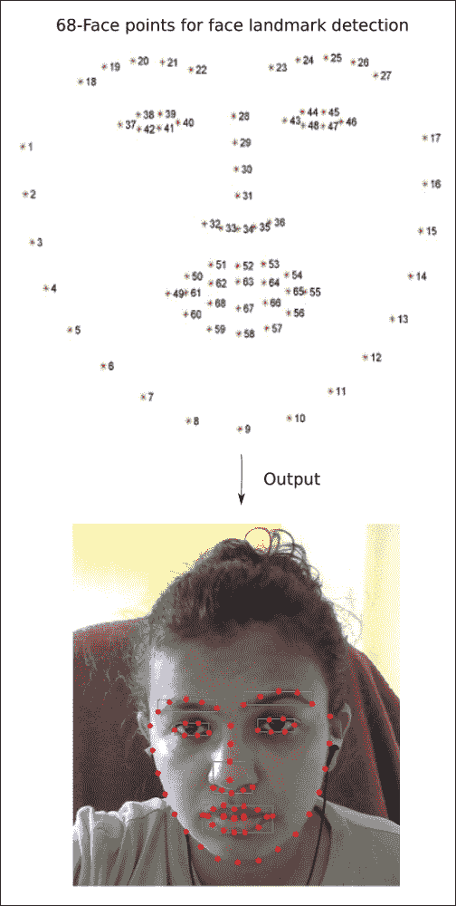

图 10.11:面部标志估计的 68 个点

第四步:我们需要用名字来识别这个人的脸，所以为了实现这一点，我们将把这张脸的独特特征与我们在中已经认识的所有人进行比较，以确定这个人的名字。假设您添加了比尔·盖茨、巴拉克·奥巴马等的图像。你已经为他们的脸生成了独特的特征，现在我们将他们独特的面部特征与这些已经生成的面部特征进行比较，如果特征相似，那么我们就知道这个人的名字，这是给定图像中的巴拉克·奥巴马或比尔·盖茨。基于面部特征的身份识别是一个分类问题，CNN 可以很容易地解决这个问题。我们正在生成一个尺寸为 128 的人脸嵌入向量。作为输入，我们应该提供这个人脸嵌入向量。一旦我们完成训练，我们的应用将准备好识别这个人的名字。

第五步:经过训练的模型查看我们过去测量过的所有人脸，并查看与我们的人脸测量值最接近的人。那是我们的比赛。

前面的方法用于我们的基于 CNN 的 FR 和实时人脸识别任务。我们已经介绍了 FR 任务中使用的算法背后的基本概念和思想。现在让我们开始实现。

# 实现人脸识别的方法

在本节中，我们将实施 FR 应用。我们正在使用`face_recognition`库。我们已经为此配置了环境。我们将在此实施以下方法:

*   以猪为基础的方法
*   基于 CNN 的方法
*   实时人脸识别

现在我们开始编码吧！

## 实施基于 HOG 的方法

在这种方法中，我们使用 HOG 算法来找出两件事:图像中人脸的总数和步伐。我们使用的是`face_recgnition`库的 API。你可以点击下面的 GitHub 链接找到代码:[https://GitHub . com/jalajthanaki/Face _ recognition/blob/master/Face _ detection _ example . py](https://github.com/jalajthanaki/Face_recognition/blob/master/face_detection_example.py)。下图中提供了代码片段:


图 10.12:基于 HOG 的 FR 方法的代码片段

在前面的图中，我们给出了一张图像作为输入，在`face_recognition`库的 API 的帮助下，我们可以找到图像中人脸的像素位置。在这里，我们还将计算一幅图像中有多少张人脸，在`Image` 库的帮助下，我们可以从给定的图像中裁剪出人脸。您可以在下图中找到该脚本的输出:

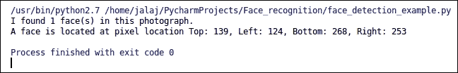

图 10.13:基于 HOG 的 FR 方法的输出

参考下面截图中的裁剪人脸输出:

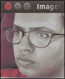

图 10.14:裁剪后的人脸输出

正如您在最后一个输出图中看到的，借助一个简单的 API，我们可以构建一个简单的人脸识别应用。这种方法对我们来说是一种基线方法。

现在让我们转向基于 CNN 的方法。与基于 CNN 的方法相比，基于 HOG 的方法不太准确。如果我们将 GPU 用于基于 CNN 的方法，那么我们可以在更少的时间内训练模型。现在让我们看看基于 CNN 的方法的代码。

## 实施基于 CNN 的方法

在这个方法中，我们将使用`face_recognition`库，在那里我们指定了模型的名称。我们的模型名字叫`cnn`。这个特定的方法将通过`face_recognition` API 加载预训练的模型，我们可以生成更准确的输出。你可以点击下面的 GitHub 链接找到代码:[https://GitHub . com/jalajthanaki/Face _ recognition/blob/master/Face _ detection _ GPU _ example . py](https://github.com/jalajthanaki/Face_recognition/blob/master/face_detection_GPU_example.py)。请参考下图中给出的代码片段:

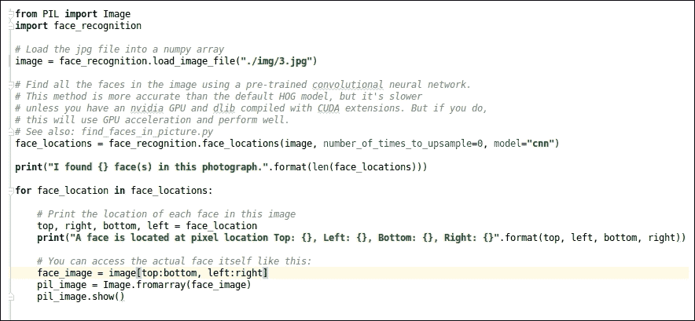

图 10.15:基于 CNN 的 FR 方法的代码片段

这里，的实现代码与前面的几乎相同，但不同的是，我们在 API 调用过程中提供了模型名称`cnn` 。您可以在下图中看到该实现的输出:

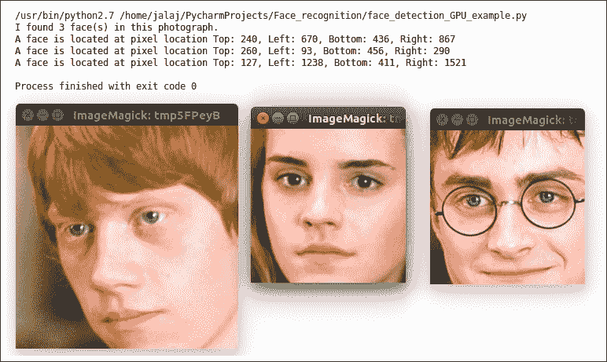

图 10.16:基于 CNN 的 FR 方法的输出

该实施的输出与上一个实施的输出相同。这个版本的实现速度很快，并且具有更好的准确性。现在让我们尝试为实时视频流实现 FR 任务。

## 实现实时人脸识别

在本节中，我们将为实时视频流实现 FR 任务。我们将尝试识别视频中出现的的名字。听起来是不是很有趣？我们开始吧。你可以点击下面的 GitHub 链接找到代码:[https://GitHub . com/jalajthanaki/Face _ recognition/blob/master/Real _ time _ Face _ detection . py](https://github.com/jalajthanaki/Face_recognition/blob/master/Real_time_face_detection.py)。

同样，我们使用的是`face_recognition`库的 API。我们也在使用`OpenCV` 。首先，我们需要给这个人的样本图像输入这个人的名字，这样机器就可以在测试过程中学习这个人的名字并识别它。在这个实现中，我填充了巴拉克·奥巴马和乔·拜登的图像。你也可以添加你的图片。如果人脸特征是熟悉的，并且与已经输入的图像匹配，那么脚本返回该人的名字，如果人脸特征对于给定的图像不熟悉，那么该人的脸被标记为*未知。*参考下图中的实现:

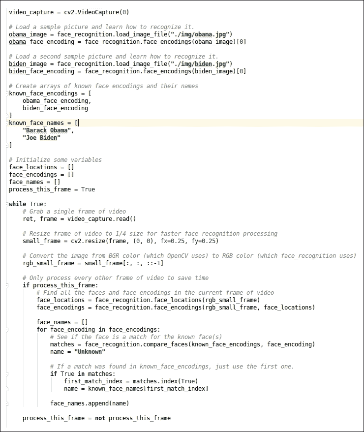

图 10.17:实时 FR 的实现

正如您在前面的代码中看到的，我提供了巴拉克·奥巴马和乔·拜登的样本图像。我还提供了一些人的名字，我把他们的图片输入到我的脚本中。我在视频流中使用了相同的人脸识别 API 来检测和识别人脸。当你运行这个脚本时，你的网络摄像头会传输你的实时视频，这个脚本会检测出这个人的脸，如果你提供了这个人的图像，这个机器就能识别出这个人。请参考下图:

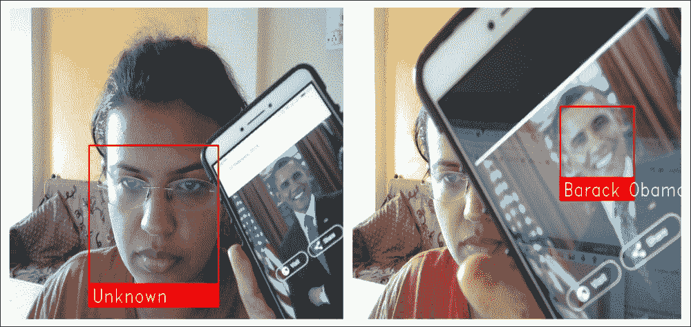

图 10.18:实时 FR 的输出

如你所见，我没有向机器提供我的图像，所以它将我识别为**未知**，而它可以识别巴拉克·奥巴马的图像。你也可以点击[https://github . com/jalaythanaki/Face _ recognition/blob/master/img/demo . gif](https://github.com/jalajthanaki/Face_recognition/blob/master/img/Demo.gif)找到动画图片。

我们已经完成了本章的第一部分，这需要开发一个可以识别人脸的应用，并根据人脸识别人名。我们实现了 FR 的三种不同变体。

在接下来的部分，我们将看看如何开发一个人脸情感识别(FER) 应用。我们需要不同种类的数据集来构建这个应用，所以我们将从理解 FER 的数据集开始。

# 理解人脸情感识别数据集

为了开发一个 FER 应用，我们正在考虑数据集。你可以从[https://www . ka ggle . com/c/challenges-in-re presentation-learning-face-expression-recognition-challenge/data](https://www.kaggle.com/c/challenges-in-representation-learning-facial-expression-recognition-challenge/data)下载这个数据集。我们需要来了解这个数据集的基本细节。作为一个正在进行的研究项目的一部分，数据集的功劳属于皮埃尔-吕克·卡里尔和亚伦·库维尔。

该数据集由 48x48 像素的人脸灰度图像组成。任务是根据在图像中以面部表情的形式表现出来的情感对每张脸进行分类。这七个类别如下，每个类别都有一个数字标签来表示情绪的类别:

*   `0` =愤怒
*   `1` =厌恶
*   `2` =恐惧
*   `3` =幸福
*   `4` =悲伤
*   `5` =惊喜
*   `6` =中性

该数据集具有`fer2013.csv`文件。这个 csv 文件将用作我们的训练数据集。现在让我们看看文件的属性。该文件有三列，如下所示:

*   **情感**:此栏包含面部表情的数字标签。出于担心，该列包含值`2`；对于 sadness，该列包含值`4`，以此类推。
*   **像素**:该列包含各个图像的像素值。它代表图像的像素值矩阵。
*   **用法**:该列包含关于特定数据记录是用于训练目的还是测试目的的一般标签。此栏有三个标签，分别是*训练*、*公共测试*和*私人测试*。出于训练目的，有 28，709 个数据样本。公共测试集包括 3，589 个数据样本，私有测试集包括另外 3，589 个数据样本。

现在让我们来看看有助于我们开发 FER 应用的概念。

# 理解人脸情感识别的概念

我们正在使用卷积神经网络(CNN)开发 FER 应用。之前，我们看了 CNN 的基本架构。为了开发 FER 应用，我们将使用以下 CNN 架构和优化器。我们正在建造两层的 CNN。我们将使用两个完全连接的层和 SoftMax 函数来对面部情绪进行分类。

我们将使用由卷积层、ReLU(校正线性单位)层和 max pooling 层组成的几个层。参考下图，这将有助于你概念化的 CNN 层的安排。让我们看看 CNN 的工作。我们将涵盖以下几层:

*   卷积层
*   ReLU 层
*   汇集层
*   完全连接的层
*   SoftMax 层

## 了解卷积层

在这一层，我们将以像素值的形式来填充我们的图像。我们使用的是一个 3 x 3 尺寸的滑动窗口，它可以在整个图像中滑动。滑动窗口选择的区域被称为*感受野*。它是图像的补丁。滑动窗口只是一个 3 x 3 维的矩阵，它可以扫描整个图像。通过使用滑动窗口，我们使用 3×3 维度的矩阵扫描图像的 9 个像素值。这个感受野或一段图像就是卷积网络的输入。

请参考下图:

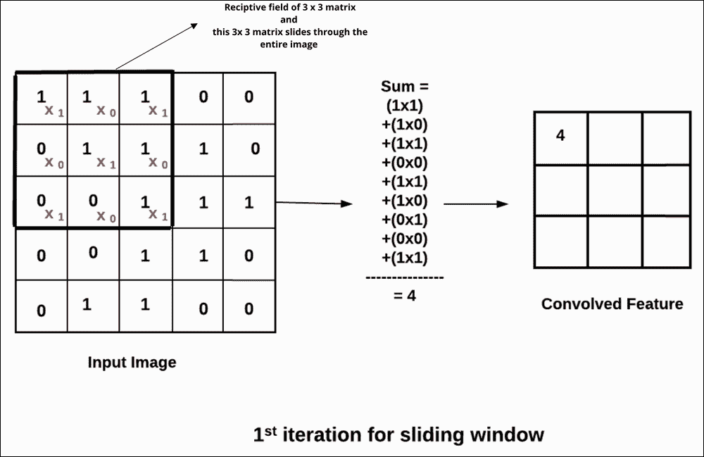

图 10.19:滑动窗口和感受野

这个接收域以输入图像的像素值的形式携带数值。这些像素值被称为特征映射、特征、过滤器、权重矩阵或内核。我们已经有了一个 3 x 3 的矩阵，它被称为特征图。特征图的大小是超参数之一。我们可以取 n×n 矩阵，其中 n > =1。这里，我们考虑了一个 3×3 矩阵来理解操作。现在该执行一个简单的数学运算了，步骤如下:

第一步:获取特征图。这里，特征图意味着以感受野的形式生成的图像块。

步骤 2:我们需要执行特征图和整个图像之间的点积。同样，我们使用滑动窗口扫描整个图像，并生成点积的值。

第 3 步:我们需要来合计我们从获得点积中得到的所有值。

步骤 4:我们需要将点积的和的值除以特征中的像素总数。在这个解释中，我们总共有 9 个像素，所以我们将总和除以 9。作为输出，我们得到的图像被称为特征图像。

请参考下图:

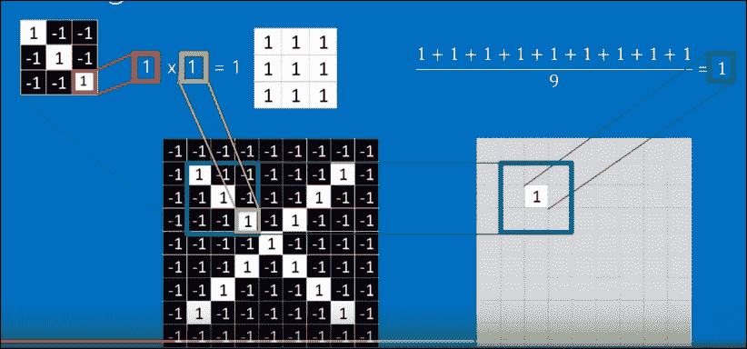

图 10.20:卷积层的数学运算

我们将对图像几乎所有可能的位置重复这个操作，我们将尝试所有可能的组合，这就是为什么这个操作被称为卷积的原因。现在我们来看看 ReLU 层。

## 了解 ReLU 层

这一层基本上给卷积网络引入了非线性。这里，我们需要使用`activation`函数。对于这种应用，我们选择整流线性单位作为激活函数。这一层对我们的特征地图进行某种标准化。让我们看看它对我们的特征地图有什么影响:

步骤 1:这一层将特征图作为由卷积层生成的输入。

第二步:这一层只是将负值转化为零。

请参考下图:

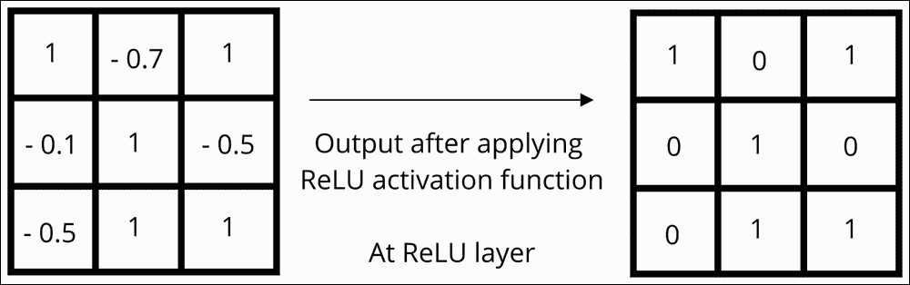

图 10.21:ReLU 层执行的操作

现在是时候看看池层了。

## 了解池层

使用这个层，我们缩小图像。我们将在这里使用最大池操作。我们需要执行以下步骤:

第一步:我们需要将特征图作为输入，这一次，ReLU 层的输出作为该层的输入。

第二步:我们需要选择窗口大小。一般我们拿起 2 x 2 像素或者 3 x 3 像素的尺寸。我们将把 2 x 2 作为我们的窗口大小。

第三步:我们基于这个窗口大小扫描整个图像，我们将从四个像素值中取最大值。

参考下图可以了解操作:

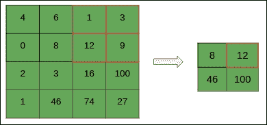

图 10.22:最大池层执行的操作

我们可以根据需要对这些层进行深度堆叠。你可以重复卷积层、ReLU 层和池层 n 次，以使 CNN 更深。

## 了解全连接层

所有层的输出被传递到完全连接的层。这一层有一个投票机制。所有图像补片都被考虑用于投票。2×2 矩阵的图像块以水平方式排列。投票取决于一个值预测面部表情的强烈程度。如果该层的某些值较高，则表示它们接近 1，如果该层的某些值较低，则表示它们接近 0。对于每个类别，某些单元格值接近 1，而其他单元格值为 0，这样，我们的网络将预测该类别。请参考下图:

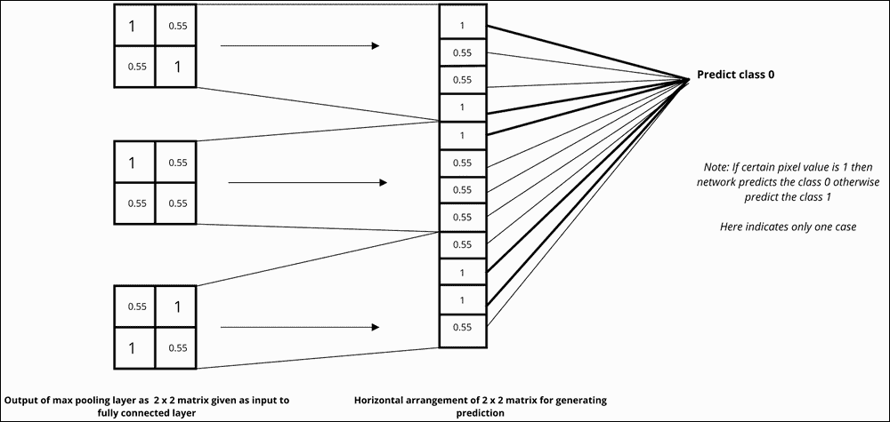

图 10.23:对全连接层的直观理解

这里只执行了一次数学运算。我们取平均值。正如您在上图中看到的，完全连接图层的第一、第四、第五、第十和第十一个单元格预测的是一个类别，因此我们需要对这些单元格中的所有值求和，并求出它们的平均值。这个平均值告诉我们我们的网络在预测类时有多自信。我们可以堆叠任意多的完全连接的层。这里，神经元的数量是超参数。

## 了解 SoftMax 层

我们也可以使用 SoftMax 图层，它将特征的值转换成概率值。这个等式如下:

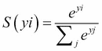

图 10.24:soft max 方程

该层获取特征值，并使用前面的等式生成概率值。请参考下图:

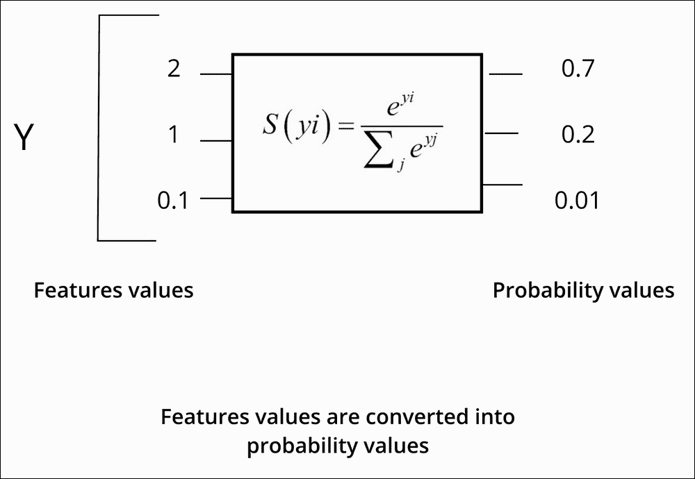

图 10.25:计算 SoftMax 函数的过程

## 基于反向传播更新权重

CNN 网络的权重已经基于反向传播技术进行了更新。我们将测量我们的预测答案和实际答案之间的差异。基于这种误差测量，我们计算损失函数的梯度，这告诉我们是否应该增加或减少权重。如果预测的答案和实际的答案相同，那么权重将不会改变。

我们已经理解了 CNN 的大部分核心概念，我们将用于开发人脸情感识别模型。

# 建立人脸情感识别模型

在这个部分，我们将使用 CNN 实现 FER 的应用。出于编码目的，我们将使用`TensorFlow`、 `TFLearn`、 `OpenCV`和`Numpy`库。可以用这个 GitHub 链接找到代码:[https://GitHub . com/jalajthanaki/face _ emotion _ recognition _ using _ tensor flow。](https://github.com/jalajthanaki/Facial_emotion_recognition_using_TensorFlow)这些是我们需要遵循的步骤:

1.  准备数据
2.  加载数据
3.  训练模型

## 准备数据

在本节中，我们将准备可以在我们的应用中使用的数据集。如你所知，我们的数据集是灰度的。我们有两个选择。一个是我们只需要使用黑白图像，如果我们使用黑白图像，那么将有两个通道。第二种选择是，我们可以将灰度像素值转换为 RGB(红、绿、蓝)图像，并构建具有三个通道的 CNN。为了我们的开发目的，我们使用两个通道，因为我们的图像是灰度的。

首先，我们正在加载数据集，并将其转换为`numpy` 数组。转换之后，我们将把它保存为一个`.npy`格式，这样我们就可以在需要的时候加载数据集。我们将实际数据记录保存在一个文件中，并将它们的数据记录标签保存在另一个文件中。我们的输入数据文件名是`fer2013.csv`。包含数据的输出文件是`data_set_fer2013.npy`，标签出现在`data_labels_fer2013.npy`文件中。执行这个任务的脚本名是`csv_to_numpy.py`。可以用这个 GitHub 链接参考它的代码:[https://GitHub . com/jalajthanaki/face _ emotion _ recognition _ using _ tensor flow/tree/master/data](https://github.com/jalajthanaki/Facial_emotion_recognition_using_TensorFlow/tree/master/data)

请参考下图中用于加载数据集的代码片段:

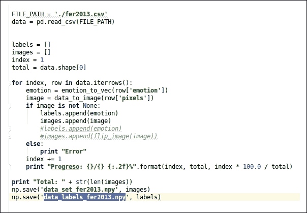

图 10.26:加载数据集的代码片段

下图给出了`helper`功能的代码:

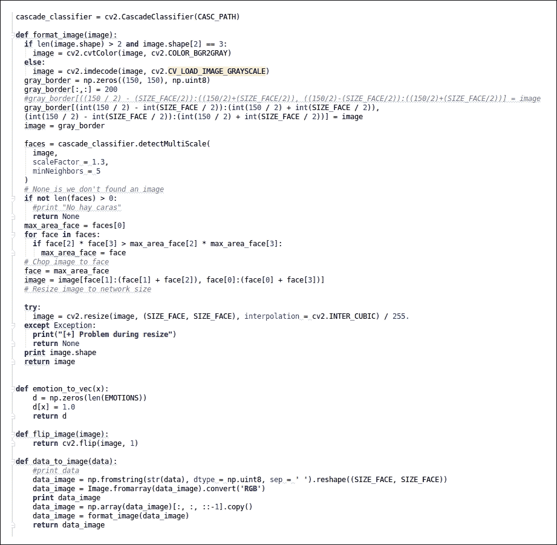

图 10.27:助手函数的代码片段

现在让我们看看如何加载以`.npy`格式保存的数据。

## 加载数据

在本节中，我们将了解如何使用我们准备好的数据集，以便我们可以将其用于训练。这里，我们创建一个单独的脚本来帮助我们加载数据。在这里，我们定义了一个将在测试中使用的测试数据集。

这是一个简单明了的代码。您可以在下图中找到代码片段:

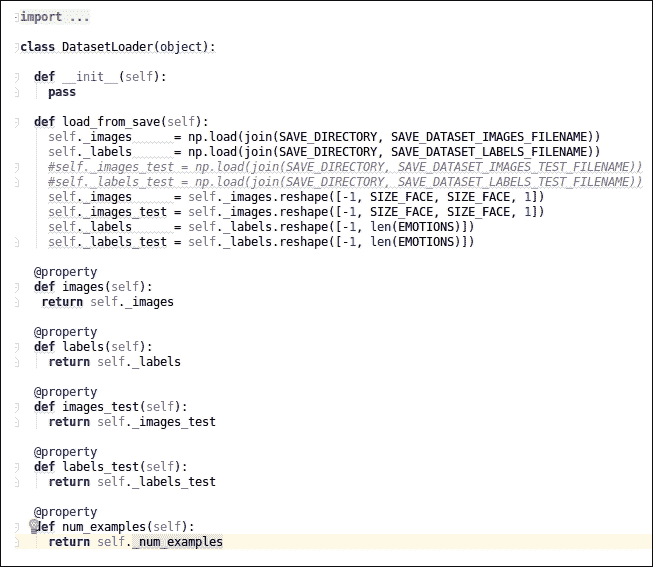

图 10.28:数据加载器脚本的代码片段

当我们为训练编写脚本时，将会用到这个类及其方法。使用这个 GitHub 链接可以看到这个脚本的代码:[https://GitHub . com/jalajthanaki/face _ emotion _ recognition _ using _ tensor flow/blob/master/dataset _ loader . py](https://github.com/jalajthanaki/Facial_emotion_recognition_using_TensorFlow/blob/master/dataset_loader.py)。

## 训练模型

在这一节，我们将看看如何训练模型，使其能够识别面部情绪。这些是我们将要执行的步骤。可以参考这个 GitHub 链接找到这个训练步骤的代码:[https://GitHub . com/jalajthanaki/face _ emotion _ recognition _ using _ tensor flow/blob/master/emotion _ recognition . py](https://github.com/jalajthanaki/Facial_emotion_recognition_using_TensorFlow/blob/master/emotion_recognition.py)。

### 使用 dataset_loader 脚本加载数据

在这里，我们在我们在上一节中编写并理解的脚本的帮助下加载数据集。您可以在下图中找到代码片段:

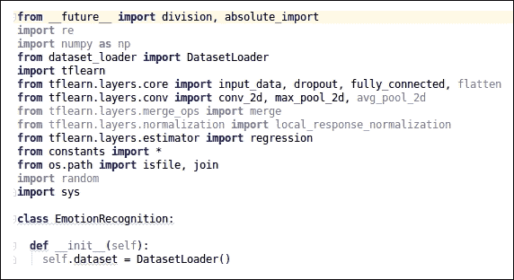

图 10.29:在模型训练期间加载数据

现在让我们构建实际用于训练的 CNN。

### 构建卷积神经网络

在这一步中，我们将构建用于训练目的的 CNN。这里，我们有卷积网络的三个层，ReLU 层和池层。前两层有 64 个神经元，最后一层有 128 个神经元。我们已经添加了辍学层。对于某些神经元，dropout 层将值设置为零。这一层选择长时间不改变权重，或者长时间不被激活的神经元。这将使我们的训练更加有效。我们有两个完全连接的层，一个完全连接的层使用 SoftMax 函数来导出面部情感类别的概率。我们使用`momentum`功能来执行梯度下降。这里，我们的损失函数是分类交叉熵。请参考下图中的代码片段:

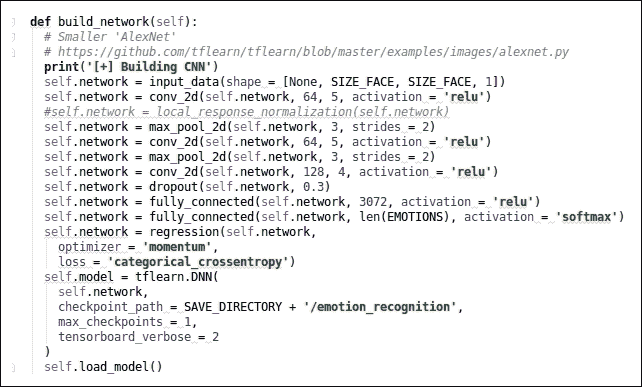

图 10.30:构建 CNN 的代码片段

现在我们来看一下如何进行训练。

### FER 应用训练

在这一步中，我们需要开始训练，以便我们的模型可以学习预测面部情绪。在这一步中，我们将为训练定义一些超参数。请参考下图中的代码片段:

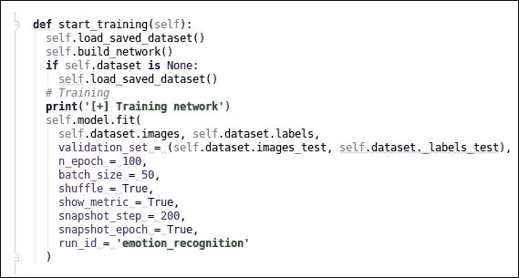

图 10.31:执行训练的代码片段

正如您在前面的图表中看到的，我们已经将纪元设置为`100`。训练批量为`50`。我们可以看到`shuffle` 参数，它作为标志。这个参数的值是`true`，它表示我们在训练过程中对数据集进行了洗牌。

开始训练的命令是`$ python emotion_recognition.py train`。

### 预测并保存训练好的模型

在这一步，我们正在定义`predict` 方法。这个方法帮助我们生成一个预测。我们还定义了可以帮助我们保存训练模型的方法。我们需要保存模型，因为我们可以在测试需要时加载它。您可以在下图中找到代码片段:

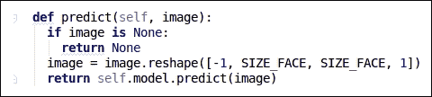

图 10.32:预测类的代码片段

请参考下图中的代码片段:

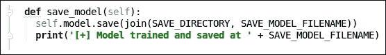

图 10.33:保存训练模型的代码片段

现在是时候看看测试矩阵了。之后，我们需要测试我们训练好的模型。因此，在测试我们的模型之前，我们应该理解测试矩阵。

# 了解测试矩阵

在这一节中，我们将看看面部情感应用的测试矩阵。测试的概念真的很简单。我们需要开始观察训练步骤。我们正在跟踪损失和准确性的值。基于此，我们可以决定我们的模型的准确性。这听起来是不是很简单？我们已经为这个模型训练了 30 个时期。这种训练需要三个多小时。我们取得了 63.88%的训练准确率。请参考下图中的代码片段:

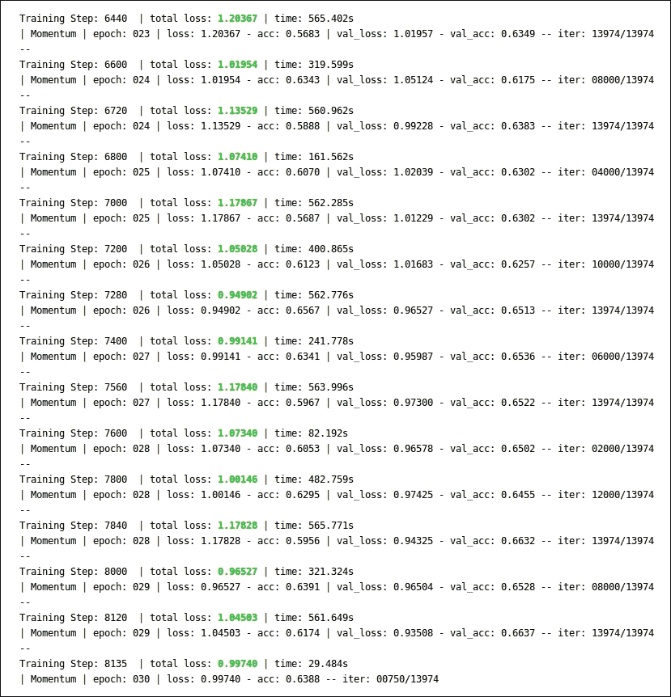

图 10.34:了解训练准确性的训练进度

这就是训练的准确性。如果我们想要检查验证数据集的准确性，那么也要在训练步骤中给出。我们已经定义了验证集。在该验证数据集的帮助下，训练好的模型生成其预测。我们比较预测的类别和实际的类别标签。之后，我们生成验证准确性，您可以在上图中看到。这里，`val_acc`是 66.37%，很棒。迄今为止，该应用已经能够实现高达 65%到 70%的准确率。

# 测试模型

现在我们需要加载训练好的模型并测试它。在这里，我们将使用视频流。FER 应用将根据我的面部表情来检测情绪。可以参考使用这个 GitHub 链接的代码:[https://GitHub . com/jalajthanaki/face _ emotion _ recognition _ using _ tensor flow/blob/master/emotion _ recognition . py](https://github.com/jalajthanaki/Facial_emotion_recognition_using_TensorFlow/blob/master/emotion_recognition.py)。

您可以在下图中找到它的代码片段:

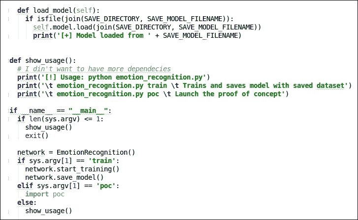

图 10.35:加载训练好的模型并执行测试的代码片段

为了开始测试，我们需要执行以下命令:

`$ python emotion_recognition.py poc`

这个测试将使用你的网络摄像头。我有一些演示文件，我想在这里分享。请参考下图:


图 10.36:识别厌恶情绪的 FER 应用的代码片段

另请参考下图:


图 10.37:识别快乐情绪的 FER 应用

参考下图中的代码片段:


图 10.38:识别中性情绪的 FER 应用的代码片段

参考下图给出的代码片段:


图 10.39:识别愤怒情绪的 FER 应用的代码片段

现在让我们看看我们如何改进这种方法。

# 现有方法的问题

在这一部分，我们将列出所有产生问题的点。我们应该努力改进它们。以下是我认为我们可以改进的地方:

*   如果你发现班级抽样不适合你的情况，那么你可以采用抽样方法
*   我们可以给我们的神经网络增加更多层

我们可以尝试不同的梯度下降技术。

在这种方法中，训练花费大量时间，这意味着训练在计算上是昂贵的。当我们训练模型时，我们使用了 GPU，尽管 GPU 训练需要很长时间。我们可以使用多个 GPU，但这是昂贵的，并且具有多个 GPU 的云实例是负担不起的。所以，如果我们能在这个应用中使用迁移学习，或者使用预先训练好的模型，那么我们会取得更好的效果。

# 如何优化现有方法

正如你在上一节看到的，由于缺乏计算硬件，我们已经达到了 66%的准确率。为了进一步提高精度，可以使用预先训练好的模型，这样会更方便。

## 了解优化流程

有几个问题我已经在前面的章节中描述过了。我们可以给 CNN 增加更多的层，但这会增加计算量，所以我们不打算这么做。我们已经对数据集进行了很好的采样，所以我们不需要担心这个问题。

作为优化过程的一部分，我们将使用通过使用`keras` 库训练的预训练模型。该模型使用多层 CNN。它将在多个 GPU 上接受训练。因此，我们将使用这个预先训练好的模型，并检查结果如何。

在接下来的部分中，我们将实现可以使用预训练模型的代码。

# 最佳方法

我们已经达到了大约 66%的准确率；对于 FER 应用，最佳精度大约为 69%。我们将通过使用预先训练的模型来实现这一点。因此，让我们来看看实现，以及我们如何使用它来实现可能的最佳结果。

## 实施最佳方法

在这个部分，我们将为 FER 应用实现最好的方法。这个预训练模型是通过使用密集和深度卷积层建立的。由于六层深度 CNN，并借助于随机梯度下降(SGD)技术，我们可以建立预训练模型。每层的神经元数量分别为 32、32、64、64、128、128、1024 和 512。所有层都使用 ReLU 作为激活函数。3×3 矩阵将用于生成初始特征图，2×2 矩阵将用于生成最大池。你可以从这个 GitHub 链接下载模型:[https://GitHub . com/jalajthanaki/face _ emotion _ recognition _ using _ Keras](https://github.com/jalajthanaki/Facial_emotion_recognition_using_Keras)

您可以通过参考下图来查看代码:

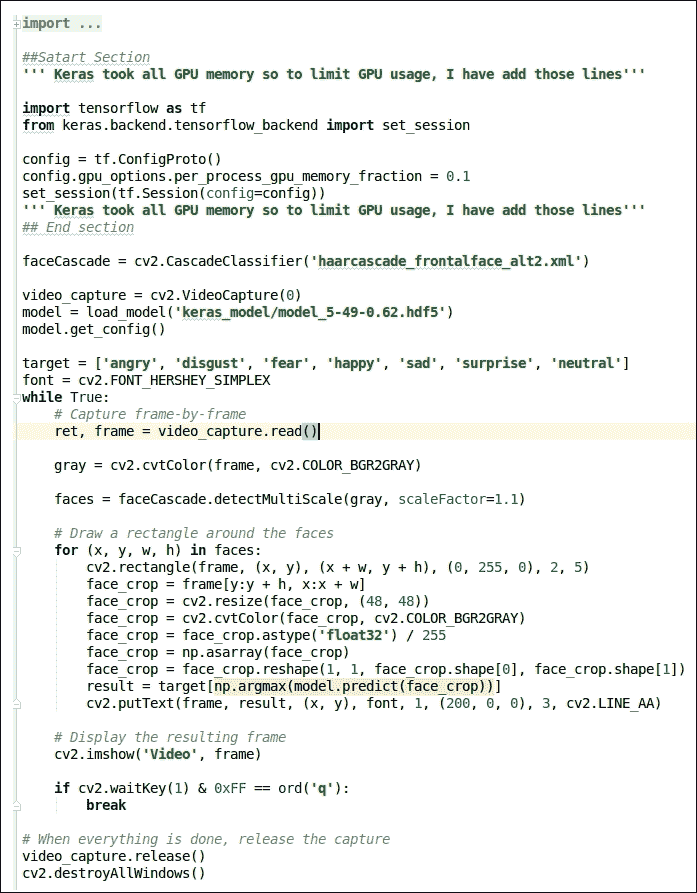

图 10。40:使用预训练 FER 模型的代码片段

在前面的代码中，我们加载了预训练的`keras` 模型。我们提供两种供应。我们可以使用这个脚本来检测图像中的面部表情，也可以通过提供视频流来检测。

如果您想测试任何图像中出现的面部表情，那么我们需要执行`$ python image_test.py tes.jpg`命令。我已经把它应用到这个模型的`tes.jpg`图像上。您可以看到如下输出图像:

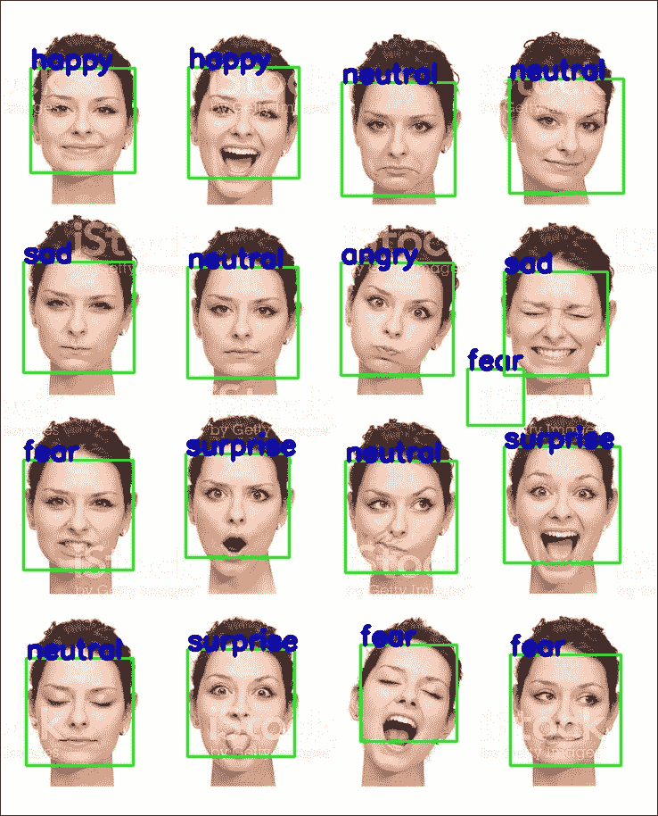

图 10.41:图像的 FER 应用的输出

如果你想为视频流测试模型，那么你需要执行这个命令:`$python realtime_facial_expression.py`。

参考下图中的输出:

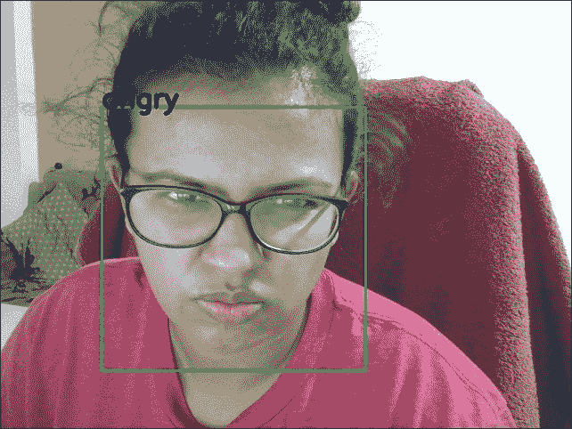

图 10.42:FER 应用对视频流的输出

您可以在下图中找到输出文件:

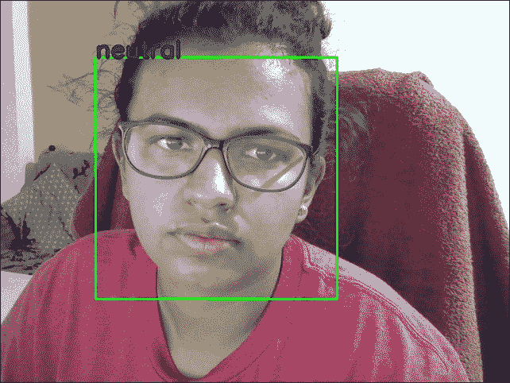

图 10.43:FER 应用对视频流的输出

这个应用为我们提供了大约 67%的准确率，这非常好。

# 总结

在本章中，我们看了如何使用`face_recognition`库开发人脸检测应用，它使用基于 HOG 的模型来识别图像中的人脸。我们还使用了预训练的卷积神经网络，它可以从给定的图像中识别人脸。我们开发了实时人脸识别来检测人名。对于人脸识别，我们使用了预先训练的模型和已经可用的库。在这一章的第二部分，我们开发了人脸情感识别应用，它可以检测出人脸可以表达的七种主要情感。为了建立人脸情感识别模型，我们使用了`TensorFlow`、`OpenCV`、`TFLearn`和`Keras`。该模型对人脸情绪的预测具有较好的准确性。我们达到了 67%的最高准确率。

目前，计算机视觉领域在研究方面进展迅速。你可以探索许多新鲜和酷的概念，如脸书人工智能研究小组的`deepfakes` 和 3D 人体姿势估计(机器视觉)。可以点击这里查阅`deepfakes` GitHub 资源库:[https://github.com/deepfakes/faceswap](https://github.com/deepfakes/faceswap)。点击此链接可以参考关于 3D 人体姿态估计的论文:[https://arxiv.org/pdf/1705.03098.pdf](https://arxiv.org/pdf/1705.03098.pdf)。这两个概念都很新，很新鲜，可以参考一下，做一些好玩的应用。

下一章将是本书的最后一章。在本章的过程中，我们将尝试制作一个游戏机器人。本章将大量使用强化学习技术。我们将开发一个可以自己玩雅达利游戏的机器人。所以继续读吧！