    

# 第十一章。构建游戏机器人

在前几章中，我们讨论了属于计算机视觉领域的应用。在这一章中，我们将制作一个游戏机器人。我们将介绍构建游戏机器人的不同方法。这些游戏机器人可以用来玩各种雅达利游戏。

让我们快速回顾一下过去的两年。先从 2015 年说起。总部位于伦敦的一家名为 DeepMind 的小公司发表了一篇题为“用深度强化学习玩雅达利”的研究论文，可在[https://arxiv.org/abs/1312.5602](https://arxiv.org/abs/1312.5602)获得。在这篇论文中，他们演示了计算机如何学习和玩雅达利 2600 视频游戏。电脑只需观察屏幕像素就能玩游戏。当游戏分数增加时，我们的电脑游戏代理(电脑游戏玩家)将获得奖励。本文给出的结果是显著的。这篇论文引起了很多关注，这是因为每个游戏都有不同的评分机制，而这些游戏的设计方式使得人类很难获得最高分。这篇研究论文的美妙之处在于，我们可以使用概念和给定的模型架构，无需任何更改就可以学习不同的游戏。这种模型架构和算法被应用到七个游戏中，在其中的三个游戏中，算法表现得比人类更好！这是人工智能领域的一大飞跃，因为我们希望能够建立一个能够掌握许多任务的单一算法，以及在未来几十年的某个时候建立一个通用人工智能或人工通用智能(AGI)系统。你可以在[https://en . Wikipedia . org/wiki/Artificial _ general _ intelligence](https://en.wikipedia.org/wiki/Artificial_general_intelligence)了解更多关于 AGI 的信息。我们都知道 DeepMind 马上就被谷歌收购了。

2017 年，谷歌 DeepMind 和 OpenAI 实现了一个重要的里程碑，这让我们希望 AGI 很快就会发生。先从 Google DeepMind 说起；你一定听说过谷歌 DeepMind 的 AlphaGo AI(一个游戏机器人)在与世界最佳围棋选手的三场比赛中获胜。围棋是一种复杂的游戏，因为一步棋有大量的排列和组合。你可以点击这个 YouTube 视频观看这场比赛的视频:[https://www.youtube.com/watch?v=vFr3K2DORc8](https://www.youtube.com/watch?v=vFr3K2DORc8)。现在来说说 OpenAI。如果这是你第一次听说 OpenAI，这是一个简短的介绍。OpenAI 是一个非营利性的人工智能研究组织，由埃隆·马斯克(Elon Musk)共同创立，该组织试图构建安全的人工智能，并确保人工智能(AI)系统的好处尽可能广泛而均匀地分布。2017 年，OpenAI 的游戏机器人击败了世界上最优秀的 Dota 2 玩家。你可以看这段 YouTube 视频做参考:【https://www.youtube.com/watch?v=7U4-wvhgx0w[。这一切都是由科技巨头创造的 AGI 系统环境实现的。制造 AGI 系统的目标是一个单一的系统可以执行各种复杂的任务。理想的 AGI 系统可以帮助我们解决医疗保健、农业、机器人等领域的许多复杂任务，而无需对其算法进行任何更改。因此，如果我们能够理解基本概念，以便开发 AGI 系统，对我们来说是更好的。](https://www.youtube.com/watch?v=7U4-wvhgx0w)

在本章中，首先，我们将尝试制作一个可以玩简单 Atari 游戏的游戏机器人。我们将通过使用强化学习来实现这一点。

总的来说，我们将在本章中讨论以下主题:

*   介绍问题陈述
*   设置编码环境
*   理解强化学习(RL)
*   探路者的基本雅达利游戏机器人

    *   理解关键概念

*   实现游戏机器人的基本版本
*   构建太空入侵者游戏机器人

    *   理解关键概念

*   实现太空入侵者游戏机器人
*   构建 Pong 游戏机器人

    *   理解关键概念

*   实现 Pong 游戏机器人
*   只是为了好玩——实现 Flappy Bird 游戏机器人
*   摘要

# 介绍问题陈述

我们知道我们正在试图开发一个游戏机器人:一个可以玩简单的 Atari 游戏的程序。如果我们提供足够的时间和计算资源，那么它可以胜过擅长玩某些游戏的人类。我将列出一些著名的 Atari 游戏，这样你就可以知道我说的是哪种类型的游戏。你肯定玩过这些游戏中的一个。一些著名的雅达利游戏是赌场，太空入侵者，吃豆人，太空战争，乒乓，等等。简而言之，我们试图解决的问题陈述是，我们如何才能构建一个可以学习玩 Atari 游戏的机器人？

在这一章中，我们将使用已经内置的使用`gym` 和`dqn` 库的游戏环境。所以，我们不需要创造一个游戏视觉环境，我们可以专注于制作最好的游戏机器人。首先，我们需要设置编码环境。

# 设置编码环境

在这个部分，我们将介绍如何建立一个编码环境来帮助我们实现我们的应用程序。我们需要安装体育馆图书馆。这些是你可以遵循的步骤。我用`Ubuntu 16.04 LTS`作为我的操作系统:

*   第一步:通过执行命令`$ sudo git clone` `https://github.com/openai/gym.gi` `t`从 GitHub 中克隆健身房库
*   步骤 2:通过执行这个命令跳转到健身房目录:`$ cd gym`
*   步骤 3:执行该命令，安装`gym` : `$ sudo pip install -e`所需的最小数量的库
*   步骤 4:通过执行以下命令为 Atari 游戏安装游戏环境:`$ sudo pip install gym[atari]`
*   第五步:这一步是可选的。如果你想安装所有的游戏环境，那么你可以执行以下命令:

    *   `$ sudo apt-get install -y python-numpy python-dev cmake zlib1g-dev libjpeg-dev xvfb libav-tools xorg-dev python-opengl libboost-all-dev libsdl2-dev swig`
    *   `$ sudo pip install gym[all]`

这就是你如何安装`gym` 机器学习库的方法，我们将用它来开发游戏机器人。我们将使用`dqn` 库的 TensorFlow 实现，所以不需要单独安装`dqn` ，但是你可以参考这个安装说明:[https://github.com/deepmind/dqn](https://github.com/deepmind/dqn)。

当我们准备好环境设置后，我们需要进入下一部分，这将帮助我们理解开发游戏机器人的有用技术。所以让我们开始吧！

# 了解强化学习(RL)

在这一章中，我们正在强化学习技术的帮助下制作一个游戏机器人。强化学习背后的动机很简单。RL 给机器或任何软件代理一个机会，根据这个代理从环境接收的反馈来学习它的行为。这种行为可以一次学会，或者你可以随着时间不断适应。

让我们用一个有趣的孩子学说话的例子来理解 RL。这些是孩子在学习说话时会采取的步骤:

*   第一步:第一件事是孩子开始观察你；你如何说话，以及你如何与他或她互动。孩子听你说的基本单词和句子，并学习他们也能发出类似的声音。所以，孩子试图模仿你。
*   第二步:孩子想说完整的句子或单词，但他们可能不明白，即使在说句子之前，他们也需要学习简单的单词！这是一个挑战，当他们试图说话的时候。现在孩子试图发出声音，有些声音很滑稽或怪异，但他们仍然决心说出单词和句子。
*   第三步:孩子面临的另一个挑战是，他们需要理解并记住他们试图说的话背后的含义。但是孩子设法克服了这一挑战，学会了说他们最初的几个词，这些词非常简单，比如妈妈、爸爸、爸爸、爸爸、妈妈等等。他们通过不断观察周围环境来学习这项任务。
*   第四步:真正的挑战开始于如何使用一个特定的单词，何时使用哪个单词，以及记住他们第一次听到的所有单词。尝试灌输所有单词的含义以及孩子需要使用它们的上下文。听起来像是一项具有挑战性的任务，不是吗？

对于一个孩子来说，这是一项艰巨的任务，但一旦它开始理解语言并练习句子，那么它就会成为孩子生活的一部分。在 2-3 年内，孩子可以有足够的练习，开始轻松地互动。如果我们认为自己在说话，对我们来说这是一个简单的任务，因为我们已经足够了解如何在我们的环境中互动。

现在，让我们试着把这些点联系起来。借助前面的例子，我们将尝试理解强化学习的概念。给定例子的问题陈述是说话，其中儿童是试图通过采取行动(这里，行动是说话)来操纵环境(儿童先说哪个词)的代理人，他们试图说一个词或另一个词。当他们完成任务的一个子模块时，孩子会得到一份奖励——比如一块巧克力，这意味着他们在一天内会说一些单词，当他们什么也不会说时，就不会得到任何巧克力。这是强化学习的简化描述。可以参考下图:

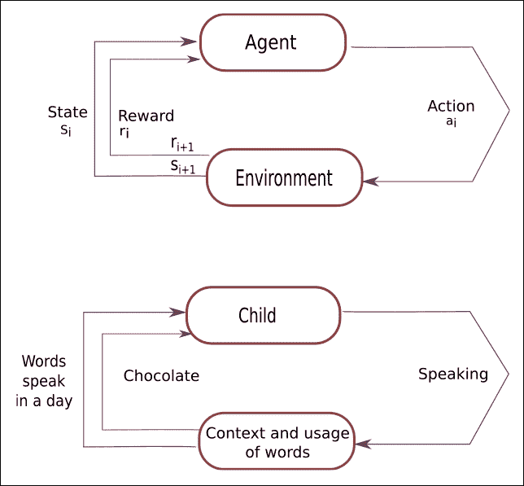

图 11.1:RL 基本概念的图示

因此，基本上，RL 允许机器和软件代理在特定任务或特定上下文中自动确定理想的和最佳的可能行为，以便最大化软件代理的性能。简单的奖励反馈是代理学习其行为所必需的，这就是所谓的强化信号。每当软件代理试图采取某种行动以获得最大回报时。最终，它会学习所有的动作或移动，引导智能体找到任务的最优解，从而成为任务的主人。RL 的算法学习对环境做出反应。

为了建造游戏机器人，RL 算法是完美的选择，这背后是有原因的。假设有许多随机支付的老虎机，你想赢得最大金额的钱。你如何赢得最大金额的钱？一个天真的方法是选择一台机器，整天拉它的杠杆，它可能会给你一些回报。如果你足够幸运，那么你可能会中大奖。为了尝试这种方法，你可能会损失一些钱。这种方法叫做*纯粹剥削*的方法*纯粹剥削*。这不是最佳方法。

让我们采取另一种方法。在这种方法中，我们将拉动每一台吃角子老虎机的控制杆，祈祷其中至少有一台中头奖。这也是一种幼稚的方法。在这种方法中，我们需要整天拉杠杆。这种方法被称为*纯探索方法*。这种方法也不是最优的，所以我们需要在这两种方法之间找到一个适当的平衡，以获得最大的回报。这被称为 RL 的探索与开发困境。现在我们需要解决这个问题。为此，我们需要一个数学框架来帮助我们获得最优解，这个数学方法就是*马尔可夫决策过程(MDP)* 。我们来探讨一下这个。

## 马尔可夫决策过程(MDP)

马尔可夫决策过程使用以下参数:

*   组状态， *S*
*   一组动作，*一个*
*   奖励功能， *R*
*   政策， *π*
*   值， *V*

为了执行一个状态到结束状态 *(S)* 的转换，我们必须采取一个动作 *(A)* 或一系列动作。我们的每一个行动都会得到回报。我们的行为可以给我们带来积极的回报，也可以带来消极的回报。我们采取的一系列行动决定了我们的政策。我们在完成每项行动后得到的回报定义了我们的价值。我们的目标是通过选择正确的政策来获得最大的回报。我们可以通过采取尽可能好的行动来做到这一点。从数学上来说，我们可以这样表达，如下图所示:

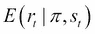

图 11.2:马尔可夫决策过程的数学表示

我们将对时间 t 内的所有可能的值应用前面的等式。我们有一组状态和动作。我们需要考虑将代理从一种状态转换到另一种状态的这些状态、动作和规则。当我们执行一个动作来改变游戏代理的状态时，代理会因此得到奖励。状态、行动和获得回报的整个过程构成了马尔可夫决策过程(MDP)。一轮比赛被认为是 MDP 的一集*。这个过程包括状态、行动和奖励的有限序列。请看下面的等式来表示这个过程:*

S0，a0，r1，s1，a1，r2，s2，a2，r3，…，sn-1，an-1，rn，sn

这里 s [i] 代表状态，ai 是动作，r [i+1] 是我们执行动作后会得到的奖励。sn 表示特定的一集以结束状态结束，这发生在屏幕上的**游戏出现时。马尔可夫决策过程基于马尔可夫假设，下一个状态 s [i+1] 的概率取决于当前状态 s [i] ，并且所执行的动作 ai 和不依赖于先前的状态或动作。**

## 未来折扣奖励

从长远来看，如果我们希望我们的游戏代理做得好，那么我们需要考虑眼前的回报，但我们也需要考虑我们的代理将获得的未来奖励。我们应该如何处理这个场景？好吧，答案就在未来回报折现的概念里。

给定一集《MDP 》,我们可以使用下面的等式计算出一集的总报酬:

R = r1 + r2 + r3 + … + rn

基于前面的等式，我们可以计算从时间戳 *t* 开始的*总未来奖励*，这可以由给定的等式表示:

Rt = rt + rt+1 + rt+2 + rt+3 + … + rn

在这里，我们处理的是一个随机的游戏环境，我们不能确定下一次我们在玩一个特定的游戏时是否会得到同样的回报。你对未来想得越多，它就会变得越不一致。出于这个原因，我们最好使用*贴现的未来报酬*而不是总报酬:

Rt = rt+ γrt+1 + γ2rt+2+ … + γn-1 rn

这里，γ是贴现因子。其值在 *0 到 1* 之间。很容易理解，在特定时间步长 t 的贴现未来报酬可以借助于当前凝视的报酬加上时间步长 *t+1* 的报酬来表示:

Rt = Rt+γ(Rt+1+γ(Rt+2+…)= Rt+γRt+1

现在让我告诉你调整这个折扣因子的实际意义是什么:如果我们将折扣因子γ的值设为 0，那么我们的博弈策略将是短视的，我们只基于眼前的回报做出博弈决策。我们需要在眼前的回报和未来的回报之间找到一个平衡点，所以我们应该将折扣因子的值设置为大于 0.7 的值。

例如，我们可以将值设置为γ = 0.9。如果我们的游戏环境是确定性的，我们知道相同的行为总是导致相同的回报，那么我们可以设置折扣因子γ =1。对于一个游戏代理人来说，一个好的策略是总是选择一个最大化未来折扣回报的行动。

我们已经介绍了 RL 的基础知识。从现在开始，我们将开始实现我们的游戏机器人。所以让我们准备好来点乐子吧！

# 基本的雅达利游戏机器人

在这一章中，我们正在尝试一种动手的方法来构建一些基本的游戏机器人。我们选择了一些著名的 Atari 游戏，这些游戏几乎每个人都玩过。我们选择 Atari 游戏是因为我们知道如何玩它们，这让我们的生活变得简单，因为我们可以了解我们的机器人应该执行什么样的操作，以便在一段时间内变得更好。

在这一部分，我们将构建自己的游戏。这个游戏很简单，所以我们可以看看如何应用 Q 学习算法。在这里，我们将自己设计游戏世界。我们开始吧！

## 理解关键概念

在这个部分，我们将会看到很多在编码时对我们有帮助的重要方面，所以在这里，我们将会涵盖以下主题:

*   游戏规则
*   了解 Q 学习算法

### 游戏规则

在我们开始基本概念或算法之前，我们需要理解我们正在构建的游戏规则。这个游戏很简单，很容易玩。这个游戏的规则如下:

*   *游戏规则:*游戏代理人的意思是一个黄色的盒子必须到达其中一个目标才能结束游戏:它可以是一个绿色的细胞或一个红色的细胞。这意味着黄色方框应该到达绿色单元格或红色单元格。
*   *奖励:*每一步给我们- 0.04 的负奖励。如果我们的游戏代理到达红细胞，那么红细胞给我们负奖励- 1。如果我们的游戏代理到达绿色单元格，那么绿色单元格给我们+1 的正奖励。
*   *状态:*每个单元格都是代理的一个状态，它用来找到它的目标。
*   *动作:*这个游戏只有四个动作:上方向，下方向，右方向，左方向。

我们需要`tkinter` 库来实现这种方法。我已经在这个 GitHub 链接上提供了关于如何安装的描述:[https://GitHub . com/jalajthanaki/Q _ learning _ for _ simple _ atari _ game/blob/master/readme . MD](https://github.com/jalajthanaki/Q_learning_for_simple_atari_game/blob/master/README.md)。

现在让我们看看 Q 学习算法，我们将在本章中使用它来构建游戏机器人。

### 了解 Q 学习算法

这个算法最初由 DeepMind 在两篇论文中发表。第一篇发表在 NIPS 2013 上，题目是*用深度强化学习*玩雅达利。论文链接是[https://arxiv.org/pdf/1312.5602.pdf](https://arxiv.org/pdf/1312.5602.pdf)。第二篇发表于 2015 年《自然》杂志，题目是*通过深度强化学习实现人类水平的控制*。这篇论文的链接是[http://www.davidqiu.com:8888/research/nature14236.pdf](http://www.davidqiu.com:8888/research/nature14236.pdf)。你绝对应该看看这些论文。我已经为你简化了这些论文的主要概念。

在 Q-learning 中，我们需要定义一个 *Q (s，a)* 函数，它表示当我们在状态 *s* 中执行动作 *a* 时的折扣因子奖励，并且它从该点向前继续最优。你可以在下面的屏幕截图中看到帮助我们选择最大奖励的等式:

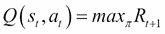

图 11.3:Q 函数方程

我们可以认为 Q (s，a)函数在游戏结束时在特定状态下执行动作 *a* 后给我们最好的分数。这个函数是 Q 函数，因为它表示在某个给定状态下某个动作的*质量*。

让我为你简化一下。假设你处于状态 *s* 并在考虑是否应该执行动作 *a* 或 *b* 。你真的想以高分赢得比赛。所以，为了实现你的目标，你要在游戏结束时选择给你最高分的动作。如果你有这个 Q 函数，那么行动的选择就变得很容易，因为你只需要选择具有最高 Q 值的行动。您可以在下面的屏幕截图中看到可用于获得最高 Q 值的等式:

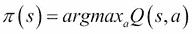

图 11.4:使用 Q 函数选择最大回报的等式

在这里，π代表政策。政策表明了游戏规则和行动。在策略的帮助下，我们可以选择在每个状态下可以使用什么样的典型动作。我们的下一步是获得这个 Q 函数。为此，我们需要专注于一个转变。这个过渡由四个状态构成: *< s，a，r，s’>*。记住折扣因子 reward，这里我们可以用下一个状态*s’*的 Q 值来表示当前状态 *s* 和当前动作 *a* 的 Q 值。下面的屏幕截图提供了计算奖励的公式:

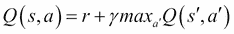

图 11.5:计算奖励的贝尔曼方程

前面的方程被称为贝尔曼方程，它是 Q 学习算法背后的主要思想。这个等式非常符合逻辑，它表明这个状态和动作的最大未来回报是当前回报和下一个状态的最大未来回报的总和。

主要的直觉是，在近似步骤之后的 *n 次迭代的帮助下，我们可以生成 Q 函数的值。我们将通过使用*贝尔曼方程*来达到这个目的。在最简单的情况下，Q 函数以表格的形式实现，其中状态是它的行，动作是它的列。这个 Q 学习算法的伪步骤很简单。你可以看看它们，如下:看看它们，如下:*

*   步骤 1:任意初始化 Q[状态数，动作数]
*   步骤 2:观察初始状态
*   第三步:重复

    ```
    Select and perform an action a Observe two things: reward r and new state s' Q [s, a] = Q [s, a] + α (r + γmaxa' Q [s', a'] - Q [s, a]) s = s'
    ```

*   直到终止

我们需要遵循这些步骤，其中α是学习率。学习率验证了先前的 Q 值和新提出的 Q 值之间的差异。这个差值被考虑在内，以便我们可以检查我们的模型何时收敛。在学习率的帮助下，我们可以调节训练的速度，这样我们的模型不会变得太慢而无法收敛，也不会变得太快而无法收敛以至于无法学习任何东西。我们将使用*maxa ' Q[s]，a']* 来更新 *Q [s，a]* ，以便最大化奖励。这是我们需要执行的唯一操作。这个估计操作将会给我们更新的 Q 值。在训练的早期阶段，当我们的代理学习时，可能会出现我们的估计完全错误的情况，但是随着每次迭代，估计和更新的 Q 值变得越来越准确。如果我们执行这个过程足够多次，那么 Q 函数将会收敛。它代表真实和优化的 Q 值。为了更好地理解，我们将实现前面的算法。参考下面截图中给出的代码片段:

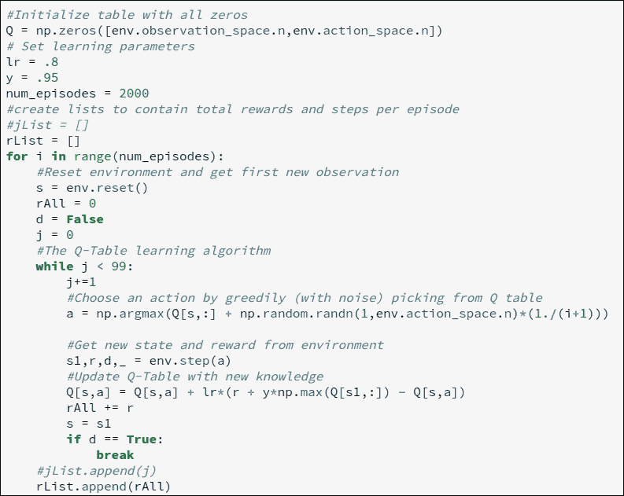

图 11.6:构建和更新 Q 表的代码片段

您可以在下面的屏幕截图中看到 Q 表形式的输出:

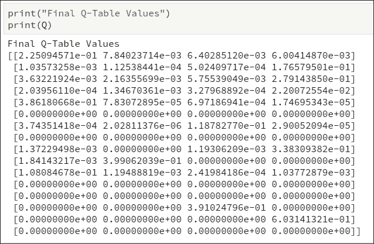

图 11.7: Q 表值

可以参考这个 GitHub 链接看到前面算法的实现:[https://GitHub . com/jalajthanaki/Q _ learning _ for _ simple _ atari _ game/blob/master/Demo _ Q _ table . ipynb](https://github.com/jalajthanaki/Q_learning_for_simple_atari_game/blob/master/Demo_Q_table.ipynb)。

现在让我们开始实现游戏。

# 实现游戏机器人的基本版本

在本节中，我们将实现一个简单的游戏。我已经定义了这个游戏的规则。只是为了快速提醒你，我们的代理，黄色块试图达到红色块或绿色块。如果代理到达绿色方块，我们将获得+ 1 作为奖励。如果它到达红色方块，我们得到-1。代理人将采取的每一步都将被视为- 0.04 的奖励。如果你愿意的话，你可以翻一页，参考比赛规则。可以通过参考这个 GitHub 链接来参考这个游戏机器人基础版的代码:[https://GitHub . com/jalajthanaki/Q _ learning _ for _ simple _ atari _ game](https://github.com/jalajthanaki/Q_learning_for_simple_atari_game)。

对于这个游戏，游戏世界或游戏环境已经建立，所以我们不需要担心它。我们需要通过使用 import 语句来包含这个游戏世界。我们正在运行的主脚本是`Lerner.py`。下面的屏幕截图给出了这段代码的代码片段:

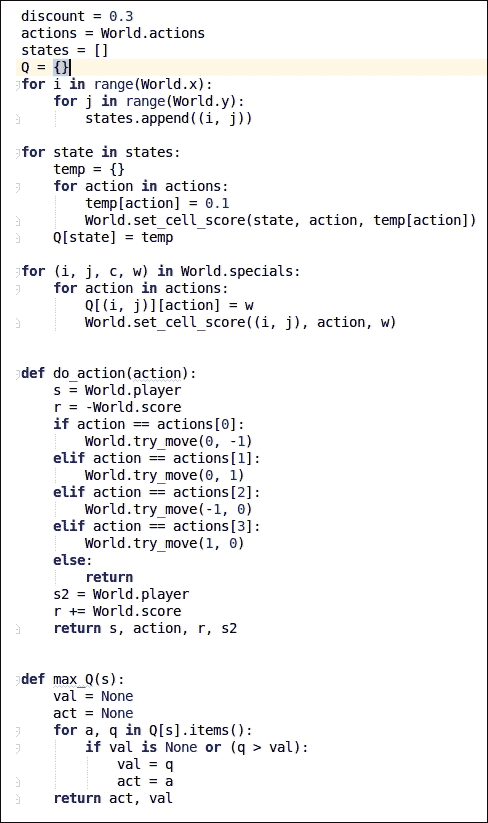

图 11.8:基本版游戏机器人 I 的代码片段

正如你在前面的代码中看到的，我们借助循环中给出的代码来跟踪代理的状态和动作。之后，我们将定义这个游戏的四个可能的行动，并以此为基础，我们将计算奖励值。我们还定义了`max_Q`函数，它为我们计算最大 Q 值。也可以参考以下截图:

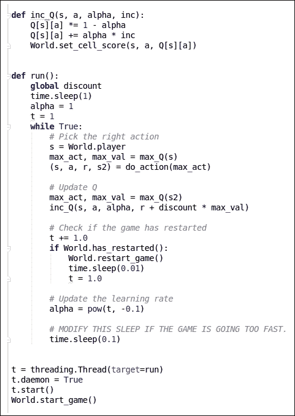

图 11.9:基本版游戏机器人 II 的代码片段

正如您在前面的代码片段中看到的，helper 函数使用了`inc_Q`方法来更新 Q。通过使用`run` 函数，我们可以更新 Q 值，这样我们的 bot 将学习如何获得最佳解决方案。您可以通过执行以下命令来运行该脚本:

```
$ python Learner.py

```

当你运行脚本时，你可以看到下面的输出窗口，在 1-2 分钟内，这个机器人会找到最优解。您可以在下面的屏幕截图中找到 bot 的初始状态和最终状态输出:

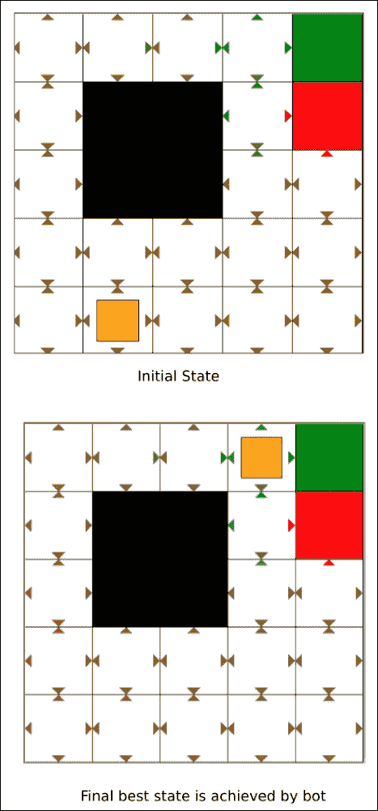

图 11.10:游戏机器人基本版本的输出

您可以使用奖励分数来跟踪机器人的进度。可以参考下面的截图:

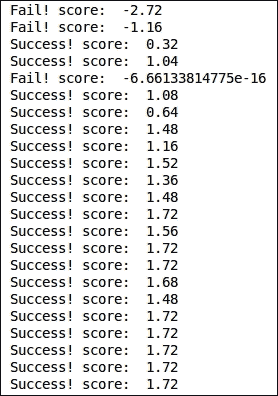

图 11.11:跟踪游戏机器人的进度

正如你所看到的，在最初的迭代中，游戏机器人在一些迭代后表现不佳，机器人开始学习如何根据它获得的经验采取行动。当奖励分数没有显著提高时，我们停止了代码。这是因为我们的游戏机器人能够实现最佳解决方案。

现在让我们构建一个更复杂的游戏机器人；我们将使用深度 Q 网络进行培训。让我们开始吧。

# 建造太空入侵者游戏机器人

我们将建造一个可以玩太空入侵者的游戏机器人。你们大多数人可能玩过这个游戏，或者至少听说过它。如果你没玩过或者此刻想不起来，那就看看下面的截图吧:

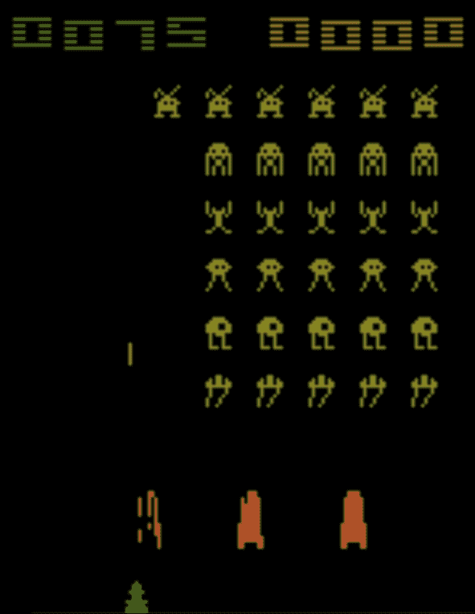

图 11.12:太空入侵者游戏片段

希望你现在还记得这个游戏以及它是怎么玩的。首先，我们将看看概念，我们将使用它来构建这个版本的游戏机器人。我们开始吧！

## 理解关键概念

在这个版本的游戏机器人中，我们将使用深度 Q 网络来训练我们的机器人。所以在实现这个算法之前，我们需要理解其中的概念。看一下以下概念:

*   理解深度 Q 网络(DQN)
*   理解体验回放

### 了解深度 Q-网络(DQN)

深度Q-网络算法基本上是两个概念的结合。它将 Q 学习逻辑用于深度神经网络。这就是为什么它被称为深度 Q 网络(DQN)的原因。

每个游戏世界都有不同的环境。所以，说，超级马里奥看起来不同于太空入侵者。我们不能每次都为一个单独的游戏提供整个游戏环境，所以首先，我们需要决定所有游戏的通用表示，以便我们使用它们作为 DQN 算法的输入。屏幕像素是输入的显而易见的选择，因为它们显然包含了游戏世界及其现状的所有相关信息。没有屏幕像素的帮助，我们无法捕捉游戏代理的速度和方向。

如果我们将 DeepMind 论文中提到的相同预处理步骤应用于游戏屏幕，那么我们需要遵循以下步骤:

第一步:我们需要考虑游戏的最后四个屏幕图像作为输入。

第二步:我们需要将它们调整到 84 x 84，并转换成 256 灰度级的灰度。这意味着我们将有 256 个^(84×84×4)，这大约是 10 个 ^(67970 个)可能的游戏状态。这意味着我们在假想的 Q 表中有 10 ^(67970) 行，这是一个很大的数字。你可能会争辩说，许多像素组合或状态从来没有出现过，所以我们可以用一个稀疏矩阵来表示它。这个稀疏矩阵只包含被访问的状态。然而，大多数州很少有人去。因此，Q 表收敛需要很长时间。老实说，我们也想很好地猜测代理之前从未见过的状态的 Q 值，以便我们可以为游戏代理生成合理的好行动。这是深度学习的切入点。

第三步:神经网络非常适合为高度结构化的数据生成良好的特征。在神经网络的帮助下，我们可以表示我们的 Q 函数。这个神经网络将状态(即四个游戏屏幕和动作)作为输入，并生成相应的 Q 值作为输出。或者，我们可以只将游戏屏幕作为输入，并为每个可能的动作生成 Q 值作为输出。这种方法有一个很大的优点。让我解释一下。我们在这里主要做两件事。首先，我们需要获得更新的 Q 值。其次，我们需要选择 Q 值最高的动作。

因此，如果我们有所有可能行动的 Q 值，那么我们可以很容易地更新 Q 值。我们也可以轻松地选择 Q 值最高的动作。有趣的是，我们可以通过在网络中执行正向传递来生成所有动作的 Q 值。在一次向前传递之后，我们可以得到所有可能动作的 Q 值列表。这种向前传递将节省大量时间，并给予游戏代理良好的回报。

#### DQN 的建筑

您可以找到下图所示的深度 Q 网络的最佳架构:

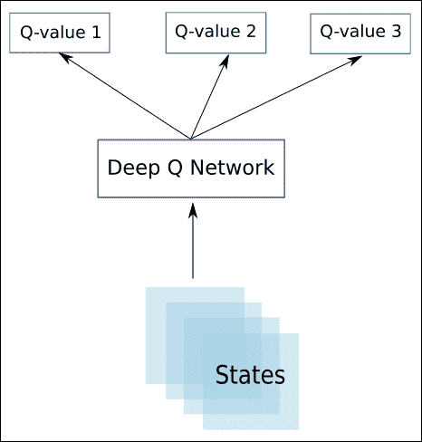

图 11.13:DQN 的建筑

前面的架构在 DeepMind 的一篇论文中被使用和发表。神经网络的体系结构如下面的屏幕截图所示:

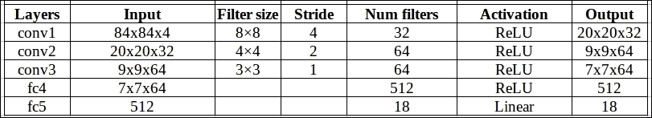

图 12.14:DQN 架构

所提供的架构使用经典的卷积神经网络(CNN)。有三个卷积层，后面是两个完全连接的层，这是我们在 CNN 架构中看到的，用于对象检测和人脸识别 CNN 具有池层。这里，那里没有池层。这是因为使用池层的主要动机是它们使神经网络对位置不敏感。这意味着，如果我们使用池层，那么神经网络不会考虑图像中对象的位置。这种位置不敏感性对于分类任务是有意义的，但是对于游戏，游戏环境中对象的位置是重要的。它们帮助我们决定行动和潜在的回报，我们不想丢弃这些信息。因此，我们在这里没有使用池层。

#### DQN 算法的步骤

让我们看看DQN 算法的步骤:

*网络输入:*四个 84 x 84 灰度游戏画面像素。

*网络的输出:*作为输出，我们将为每个可能的动作生成 Q 值。q 值接受任何实数，这意味着它可以是你能想象到的任何实数，这使得它成为一个回归任务。我们知道可以通过简单的平方误差损失来优化回归函数。误差损失的等式如下面的屏幕截图所示:

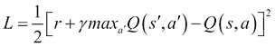

图 11.15:误差损失函数的等式

*Q 表更新步骤:*有过渡 *< s，a，r，s’>*，但是这一次，更新 Q 表的规则与 Q 学习不一样。有一些变化。因此，更新 Q 表的步骤如下:

*   步骤 1:我们需要对当前状态 *s* 执行前馈传递，以便获得所有动作的预测 Q 值。
*   步骤 2:对下一状态*s’*执行前馈传递，并计算所有网络输出的最大值*maxa’q(s)，a’)。*
*   步骤 3:为行动 *a* 到 *r + γmaxa'Q(s)，a')* 设置 Q 值目标。这里，我们可以使用已经在步骤 2 中计算的 *maxa'Q(s '，a')* 值。对于所有其他操作，设置最初来自步骤 1 的 Q 值，使这些输出的误差为零。
*   步骤 4:我们需要使用反向传播来更新神经网络的权重。

现在我们来看看体验回放的概念。

### 理解体验回放

我们用两个概念来估计每个州的未来回报。我们使用 Q 学习并使用卷积神经网络来逼近 Q 函数。这里，使用非线性函数来完成 Q 值的近似，并且该函数对于收敛模型来说不是非常稳定。所以，我们需要试验各种超参数。这需要很长时间:在单个 GPU 上训练游戏机器人几乎需要一周时间。

我们将使用一个叫做体验回放的概念。在训练期间，所有的经验 *< s，a，r，s’>*都存储在重放存储器中。当我们执行训练时，网络将使用重放存储器中的随机样本，而不是最近的转换。这样训练时间会少一些，再加上还有一个好处。在经验重放的帮助下，我们的训练任务将变得更类似于通常的监督学习。现在，我们可以轻松地对算法执行调试和测试操作。在重播记忆的帮助下，我们可以存储我们所有的人类游戏体验，然后基于这个数据集训练模型。

因此，DQN 使用的最终 Q 学习算法的步骤如下。该算法摘自 https://arxiv.org/pdf/1312.5602.pdf[的 DQN 论文原文:](https://arxiv.org/pdf/1312.5602.pdf)

*   步骤 1:我们需要初始化重放存储器 D
*   步骤 2:我们需要用随机权重初始化动作值函数 Q
*   步骤 3:观察初始状态的值
*   第四步:重复

    ```
    Choose an action a        with probability ε we need to select a random action        otherwise we need to select a = argmaxa'Q(s,a')    Perform action a    Check reward r and new state s'    store the gameplay experience <s, a, r, s'> in replay memory D    sample random transitions <ss, aa, rr, ss'> from replay memory D    calculate target for each minibatch transition        if ss' is terminal state then tt = rr        otherwise tt = rr + γmaxa'Q(ss', aa')    We need to train the Q network using (tt - Q(ss, aa))^2 as loss    s = s' until terminated
    ```

我们正在使用 Q-learning 和 DQN 来实现太空入侵者游戏机器人。所以我们开始编码吧。

# 实现太空入侵者游戏机器人

在这个部分，我们将使用 DQN 和 Q-learning 编写太空入侵者游戏。对于编码，我们将使用`gym`、 `TensorFlow`和`virtualenv`库。你可以通过这个 GitHub 链接查阅完整的代码:[https://github.com/jalajthanaki/SpaceInvaders_gamingbot](https://github.com/jalajthanaki/SpaceInvaders_gamingbot)。

我们使用的是卷积神经网络(CNN)。这里，我们在一个单独的文件中定义了 CNN。这个文件的名字是`convnet.py`。看看下面的截图:如下图:

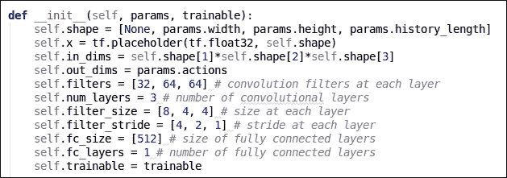

图 11.16:convnrt . py 的代码片段

可以参考使用这个 GitHub 链接的代码:[https://GitHub . com/jalaythanaki/space inviders _ gaming bot/blob/master/conv net . py](https://github.com/jalajthanaki/SpaceInvaders_gamingbot/blob/master/convnet.py)。

我们正在`dqn.py`脚本中定义 DQN 算法。可以参考下面截图中显示的代码片段:

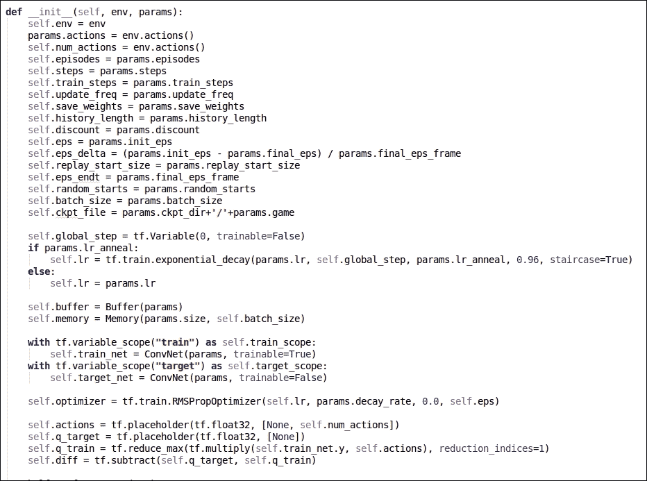

图 11.17:dqn . py 的代码片段

对于训练，我们已经在`train.py`中定义了我们的训练逻辑。可以参考下面截图中显示的代码片段:

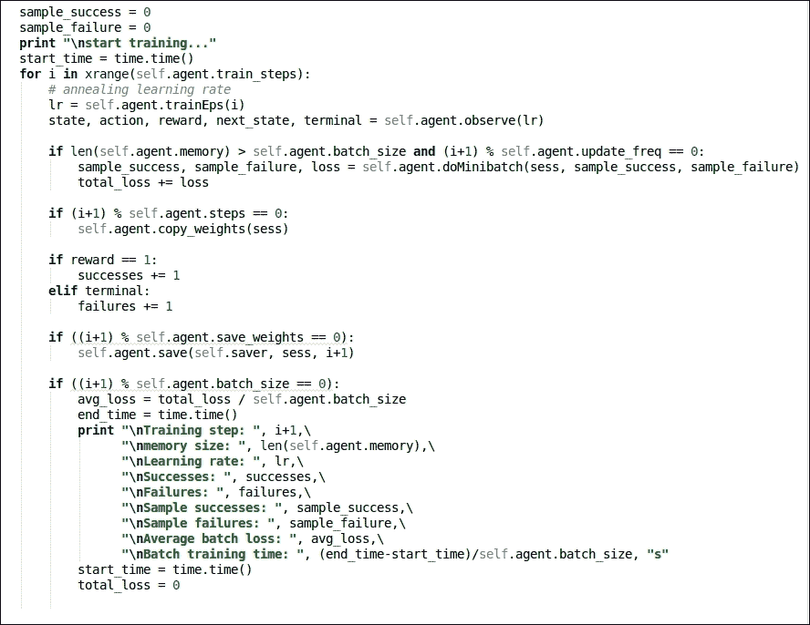

图 11.18:train . py 的代码片段

最后，我们将所有这些独立的脚本导入到主`atari.py`脚本中，并在该脚本中定义所有的参数值。可以参考下面截图中给出的代码片段:

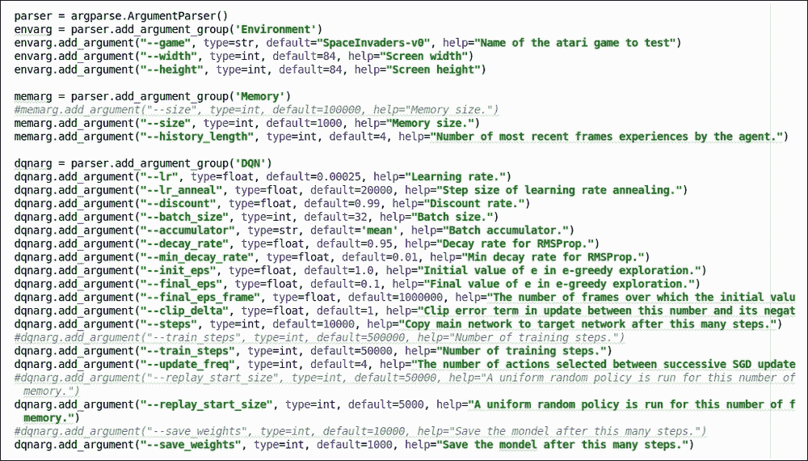

图 11.19:atari . py 的代码片段

您可以通过执行以下命令开始训练:

`$ python atari.py --game SpaceInvaders-v0 --display true`

训练这个机器人通过人类水平的表现需要至少 3-4 天的训练。我没有提供那么多的训练，但是你绝对可以做到。你可以看看下面截图中训练的输出:如下图:

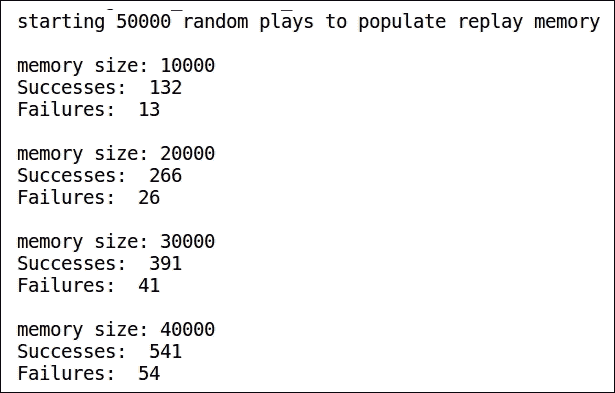

图 11.20:培训步骤-I 的输出片段

您可以通过参考下面的截图来参考游戏环境初始分数的代码片段:

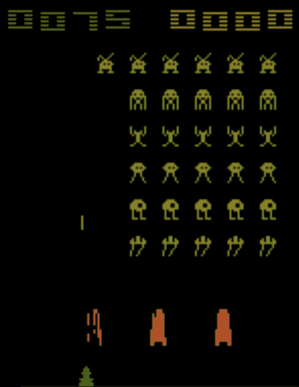

图 11.21:游戏机器人最初几个游戏的分数代码片段

要停止训练，将有两个参数:要么我们可以在我们的损失函数值在几次迭代中变成常数时结束我们的训练，要么我们完成所有的训练步骤。在这里，我们定义了 50000 个训练步骤。可以参考下面截图中训练输出的代码片段:

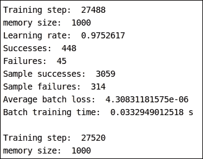

图 11.22:培训日志的代码片段

你可以通过下面的截图来看到游戏机器人在 1000 次迭代后的分数:

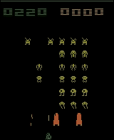

图 11.23:游戏机器人经过 1000 次迭代后的代码片段

我已经为你上传了预先训练好的模型。可以用这个 GitHub 链接下载:[https://GitHub . com/jalajthanaki/space inviders _ gaming bot/tree/master/model](https://github.com/jalajthanaki/SpaceInvaders_gamingbot/tree/master/model)。

现在是时候为乒乓游戏制作游戏机器人了。如果你使用单个 GPU 训练这个机器人一周，它可以击败游戏制造团队编写的人工智能规则。所以，我们的代理肯定会比电脑代理表现得更好。

# 构建乒乓游戏机器人

在这一节中，我们将看看如何构建一个能够学习 Pong 游戏的游戏机器人。在我们开始之前，我们将看看我们将用于构建 Pong 游戏机器人的方法和概念。

## 理解关键概念

在本部分，我们将介绍构建 Pong 游戏机器人的一些方面，如下所示:

*   游戏机器人的架构
*   游戏机器人的方法

### 游戏机器人的架构

为了开发 Pong 游戏机器人，我们选择了基于神经网络的方法。我们神经网络的架构至关重要。让我们一步一步地看看架构组件:

1.  我们将游戏屏幕作为输入，并按照 DQN 算法对其进行预处理。
2.  我们将这个预处理过的屏幕传递给神经网络(NN。)
3.  我们使用梯度下降来更新神经网络的权重。
4.  Weight [1]:这个矩阵保存传入隐藏层的像素的权重。尺寸将为[200 x 80 x 80]–[200 x 6400]。
5.  Weight [2]:这个矩阵保存传入输出的隐藏层的权重。尺寸将为[1 x 200]。

可以参考下图:

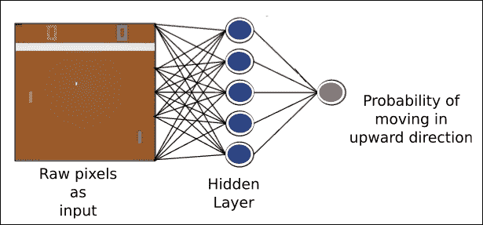

图 11.24:Pong 游戏机器人的神经网络架构

当我们看到这个游戏机器人的详细方法时，NN 的每个组件的任务更有意义。

### 游戏机器人的方法

为了构建 Pong 游戏机器人，我们将使用以下方法:

*   为了实现，我们使用预处理的图像向量，它是一个[6400 x 1]维的数组。
*   在神经网络的帮助下，我们可以计算向上移动的概率。
*   在概率分布的帮助下，我们将决定代理是否向上移动。
*   如果游戏回合结束，这意味着游戏代理以及对手错过了球。在这种情况下，我们需要找出我们的游戏代理是赢了还是输了。
*   当集结束时，这意味着如果任何一个玩家得到 21 分，我们需要传递结果。借助于损失函数，我们可以找出误差值。我们应用梯度下降算法来找出我们的神经网络的权重应该更新的方向。基于反向传播算法，我们将误差传播回网络，以便我们的网络可以更新权重。
*   一旦 10 集结束，我们需要对梯度求和，之后，我们在梯度的方向上更新权重。
*   重复这个过程，直到我们的网络权重被调整，我们可以打败计算机。

现在让我们来看看编码步骤。

# 实现乒乓游戏机器人

这些是我们需要遵循的实施步骤:

*   参数的初始化
*   以矩阵形式存储的权重
*   更新权重
*   如何移动代理
*   使用神经网络理解过程

你可以通过这个 GitHub 链接查阅完整的代码:[https://github.com/jalajthanaki/Atari_Pong_gaming_bot](https://github.com/jalajthanaki/Atari_Pong_gaming_bot)。

## 参数的初始化

首先，我们定义并初始化我们的参数:

*   这个参数表示在更新我们网络的权重之前，我们应该玩多少轮游戏。
*   `gamma:`这是贴现因子。我们用这个来贴现游戏的旧动作对最终结果的影响。
*   `decay_rate:`该参数用于更新权重。
*   `num_hidden_layer_neurons:`该参数表示我们应该在隐藏层中放置多少个神经元。
*   `learning_rate:` 这是我们的游戏代理从结果中学习的速度，以便我们可以计算新的权重。较高的学习率意味着我们对结果的反应更强烈，而较低的学习率意味着我们对每个结果的反应不多。

可以参考下面截图中显示的代码片段:

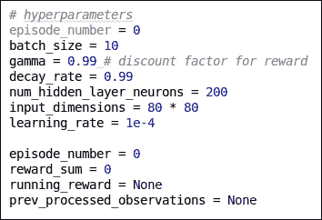

图 11.25:参数初始化

## 以矩阵形式存储的权重

神经网络的权重以矩阵的形式存储。NN 的第一层是一个 200 x 6400 的矩阵，代表我们隐藏层的权重。如果我们使用符号 *w1_ij* ，那么这将意味着我们代表第 1 层中输入像素 *j* 的第*I^(th)神经元的权重。第二层是代表权重的 200×1 矩阵。这些权重是隐藏层的输出。对于层 2，元素 *w2_i* 表示对隐藏层中第 *i ^个和*个神经元的激活所赋予的权重。*

可以参考下面截图中给出的代码片段:

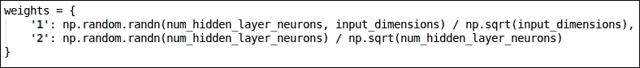

图 11.26:权重矩阵

## 更新权重

为了更新权重，我们将使用 RMSprop。您可以参考本文以了解关于此功能的更多详细信息:

http://sebastian ruder . com/optimizing-gradient-descent/index . html # rms prop。下图参考下图。

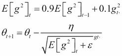

图 11.27:rms prop 的等式

代码如下面的截图所示:

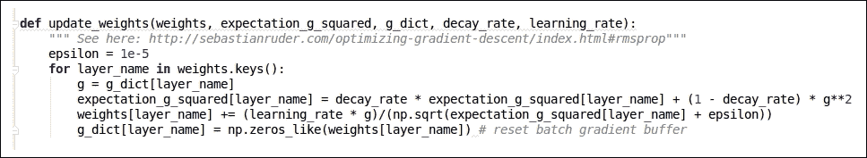

图 11.28:更新权重的代码片段

## 如何移动代理

在预处理输入的帮助下，我们将权重矩阵传递给神经网络。我们需要创造机会让我们的代理人升职。可以参考下面截图中显示的代码片段:

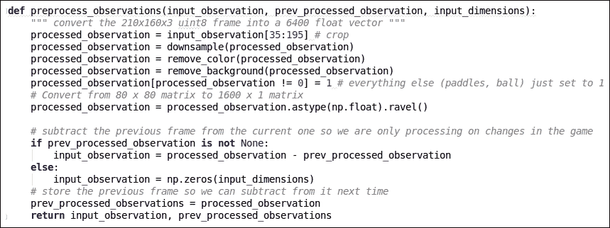

图 11.29:移动代理的代码片段

我们已经完成了所有主要的助手功能。我们需要将所有这些逻辑应用于神经网络，这样它就可以进行观察，并生成我们的游戏代理人向上发展的概率。

## 使用神经网络了解流程

这些步骤可以帮助我们为我们的代理生成概率，以便它可以决定他们何时应该向上移动

*   我们需要通过应用权重[1]和`observation_matrix`之间的点积来计算隐藏层的值。权重[1]是一个 200 x 6400 的矩阵，`observation_matrix`是一个 6400 x 1 的矩阵。输出矩阵的维数是 200 x 1。这里，我们用了 200 个神经元。Q 函数的每一行代表一个神经元的输出。
*   我们将非线性函数 ReLU 应用于隐藏层值。
*   我们使用隐藏层激活值来计算输出层的值。同样，我们在`hidden_layer_values` [200 x 1]和权重[2] [1 x 200]之间执行点积。这个点积给出了单值[1 x 1]。
*   最后，我们将 sigmoid 函数应用于输出值。这将从概率上给我们答案。输出的值介于 0 和 1 之间。

可以参考下面截图所示的代码片段:

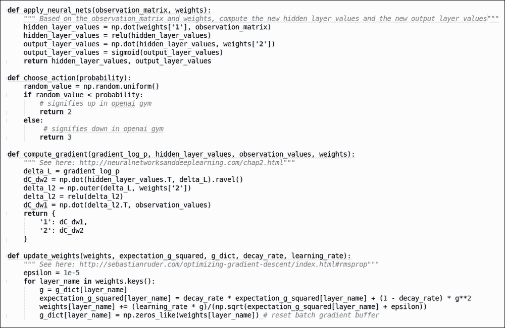

图 11.30:使用 NN 的流程代码片段

要运行这段代码，您需要执行以下命令:

```
$ python me_Pong.py
```

如果你想造一个能打败电脑的 bot，那么你需要在单个 GPU 上训练它至少三到四天。可以参考下面截图中 bot 的输出:

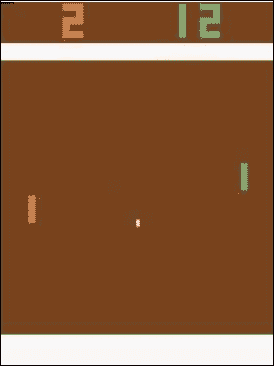

图 11.31:Pong 游戏机器人输出

你可以在下面的截图中看到训练日志:

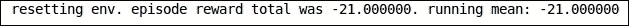

图 11.32:Pong 游戏机器人的训练日志

现在让我们建造一个游戏机器人，只是为了好玩。这个机器人使用 Flappy Bird 游戏环境。

# 只是为了好玩——实现 Flappy Bird 游戏机器人

在这个部分，我们将构建 Flappy Bird 游戏机器人。这个游戏机器人是用 DQN 制造的。你可以在这个 GitHub 链接找到完整的代码:[https://github.com/jalajthanaki/DQN_FlappyBird](https://github.com/jalajthanaki/DQN_FlappyBird)。

这个机器人有一个预训练的模型，所以你使用预训练的模型来测试它。为了运行这个机器人，您需要执行以下命令:

```
$ python deep_q_network.py
```

您可以在下面的屏幕截图中看到输出:

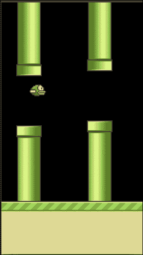

图 11.33:Flappy Bird 游戏机器人的输出

在这个实现中，您可以看到我们到目前为止已经学习过的所有概念的组合，所以请确保您研究了这个代码。就当这是你本章的练习。

# 总结

恭喜你，读者们；你已经坚持到最后了！在这一章中，我们讨论了与强化学习相关的基本概念。您了解了构建游戏机器人的各种概念和算法。您还了解了深度 Q 学习器算法的工作原理。使用`gym` 库，我们加载了游戏世界。通过使用`dqn` 库，我们将能够训练模型。训练一个能打败人类专家的游戏机器人需要很多时间。所以，我只训练了几个小时。如果你想训练更多的时间，你绝对可以做到。我们试图构建各种简单的 Atari 游戏，如简单的探路者游戏机器人、太空入侵者、Pong 和 Flappy Bird。您可以将这种基本方法扩展到更大的游戏环境中。如果你想让自己得到更新和贡献，那么你可以看看 OpenAI GitHub 库，网址:[https://github.com/openai](https://github.com/openai)。深度思维新闻和博客部分在这个链接:[https://deepmind.com/blog/](https://deepmind.com/blog/)。

在下一节中，您会发现一个附录，可以帮助您获得一些额外的信息。当您构建机器学习(ML)应用程序或参加黑客马拉松或其他竞赛时，这些额外的信息将对您有所帮助。我还提供了一些备忘单，可以在您构建 ML 应用程序时帮助您。