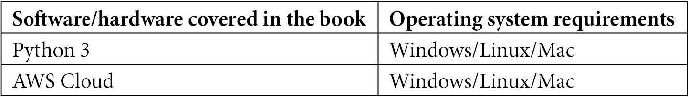

# 前言

流数据是数据科学和机器学习领域值得关注的新顶级技术。随着业务需求变得更加苛刻，许多用例需要实时分析以及实时机器学习。这本书将让你快速掌握流数据的数据分析，并重点关注使机器学习和其他分析适应流数据的情况。

您将首先了解流和实时机器学习的架构。然后你会看到流数据的最先进的框架，比如 River。

您将了解流数据的各种工业用例，例如在线异常检测。然后，你将深入探讨挑战，以及如何减轻挑战。然后，您将了解有助于您使用流数据生成实时见解的最佳实践。

在完成这本书后，你将对在你的机器学习模型中使用流数据充满信心。

# 这本书是给谁的

具有机器学习基础、以实践和技术为导向，并希望通过现代技术的实践示例学习如何将机器学习应用于流数据的数据科学家和机器学习工程师将从本书中受益。您需要了解基本的 Python 和机器学习概念，但不需要预先了解流媒体。

# 这本书涵盖了什么

[*第一章*](B18335_01_ePub.xhtml#_idTextAnchor014) *，流数据*介绍，解释什么是流数据，为什么不同于批量数据。本章还解释了我们可能会遇到的挑战以及使用流数据的优势。

[*第 2 章*](B18335_02_ePub.xhtml#_idTextAnchor029) *，流媒体和实时机器学习的架构*，描述了可用于设置流媒体的各种架构，以及如何利用它们。

[*第 3 章*](B18335_03_ePub.xhtml#_idTextAnchor051) *，流数据的数据分析*，探讨流数据的数据分析，包括实时洞察、实时描述性统计、实时可视化和基本的警报系统。

[*第 4 章*](B18335_04_ePub.xhtml#_idTextAnchor083) *，用 River* 在线学习，涵盖了在线学习的核心概念，也向您介绍了 River 库，这是串流的基础部分。

[*第 5 章*](B18335_05_ePub.xhtml#_idTextAnchor097) *，在线异常检测*，涵盖了在线异常检测，解释了它的用处，还提供了一个用例，涉及构建一个程序来检测流数据中的异常。

[*第 6 章*](B18335_06_ePub.xhtml#_idTextAnchor129) *，在线分类*，涵盖了在线分类，解释了它是如何有用的，还提供了一个用例，涉及构建一个用于分类流数据的程序。

[*第 7 章*](B18335_07_ePub.xhtml#_idTextAnchor146) *，在线回归*，涵盖了在线回归，它是如何有用的，还提供了一个用例，涉及构建一个程序来检测流数据中的回归。

[*第八章*](B18335_08_ePub.xhtml#_idTextAnchor160) *，强化学习*，为你介绍强化学习。我们将探索一些关键算法，还将探索使用 Python 的一些用例。

[*第九章*](B18335_09_ePub.xhtml#_idTextAnchor184) *，漂移和漂移检测*，重点帮助我们在在线学习中了解漂移，学习如何构建检测漂移的解决方案。

[*第 10 章*](B18335_10_ePub.xhtml#_idTextAnchor201) *，特征转换和缩放*，向我们展示了如何构建一个处理实时和流数据的特征转换管道。

[*第 11 章*](B18335_11_ePub.xhtml#_idTextAnchor215) *，灾难性遗忘*，探讨了什么是灾难性遗忘，并用实例用例向我们展示了如何处理它。

[*第 12 章*](B18335_12_ePub.xhtml#_idTextAnchor228) *，结论和最佳实践*，作为本书的回顾，结合了本书中探讨的所有概念，以便我们根据需要进行修改和重温。

# 充分利用这本书

为了跟随这本书，你可以使用在线笔记本环境，比如 Google Colab，Kaggle Notebooks，或者你自己的本地 Jupyter 笔记本环境。此外，少量练习将需要一个(免费)AWS 帐户。



**如果你使用的是这本书的数字版，我们建议你自己输入代码或者从这本书的 GitHub 库中获取代码(下一节有链接)。这样做将帮助您避免任何与复制和粘贴代码相关的潜在错误。**

# 下载示例代码文件

你可以从 GitHub 的 https://GitHub . com/packt publishing/Machine-Learning-for-Streaming-Data-with-Python 下载本书的示例代码文件。如果代码有更新，它会在 GitHub 库中更新。

我们在 https://github.com/PacktPublishing/也有丰富的书籍和视频目录中的其他代码包。看看他们！

# 下载彩色图像

我们还提供了一个 PDF 文件，其中有本书中使用的截图和图表的彩色图像。你可以在这里下载:【https://packt.link/6rZ0m[。](https://packt.link/6rZ0m)

# 习惯用法

本书通篇使用了许多文本约定。

`Code in text`:表示文本中的码字、数据库表名、文件夹名、文件名、文件扩展名、路径名、伪 URL、用户输入和 Twitter 句柄。下面举个例子:“这里没有 predict_many 函数，需要用 predict_one 反复做一个循环。”

代码块设置如下:

```
def self_made_decision_tree(observation): 
```

```
    if observation.can_speak: 
```

```
        if not observation.has_feathers: 
```

```
            return 'human'     
```

```
    return 'not human'  
```

```
for i,row in data.iterrows(): 
```

```
    print(self_made_decision_tree(row)) 
```

当我们希望将您的注意力吸引到代码块的特定部分时，相关的行或项目以粗体显示:

```
from sklearn.datasets import make_blobs 
```

```
X,y=make_blobs(shuffle=True,centers=2,n_samples=2000) 
```

**粗体**:表示一个新术语、一个重要单词或您在屏幕上看到的单词。例如，菜单或对话框中的单词以**粗体**显示。下面是一个例子:“从**管理**面板中选择**系统信息**”

提示或重要注意事项

像这样出现。

# 取得联系

我们随时欢迎读者的反馈。

**总体反馈**:如果你对这本书的任何方面有疑问，请发邮件到 customercare@packtpub.com 给我们，并在邮件主题中提到书名。

**勘误表**:虽然我们已经尽力确保内容的准确性，但错误还是会发生。如果你在这本书里发现了一个错误，请告诉我们，我们将不胜感激。请访问 www.packtpub.com/support/errata 并填写表格。

**盗版**:如果您在互联网上遇到我们作品的任何形式的非法拷贝，如果您能提供我们的地址或网站名称，我们将不胜感激。请联系我们在 copyright@packt.com 与材料的链接。

如果你有兴趣成为一名作家:如果有一个你擅长的主题，并且你有兴趣写一本书或者为一本书投稿，请访问 authors.packtpub.com。

# 分享你的想法

一旦您阅读了使用 Python 进行数据流学习的*机器学习*，我们很想听听您的想法！请点击此处，直接进入该书的亚马逊评论页面，并分享您的反馈。

您的评论对我们和技术社区非常重要，将有助于我们确保提供高质量的内容。