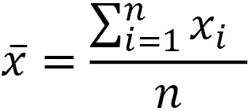
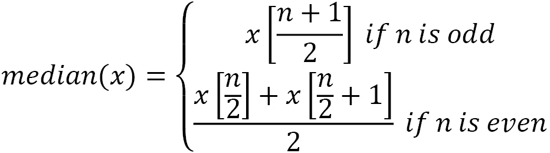
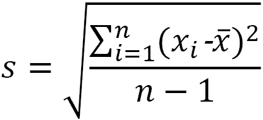
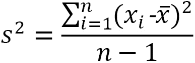
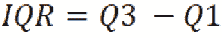
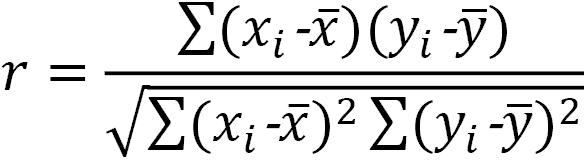

# 三、流式数据的数据分析

现在你已经看到了流式数据和流用例的介绍，以及流架构的介绍，是时候进入这本书的核心了:分析和机器学习。

你可能知道，描述性统计和数据分析是机器学习的切入点，但它们也经常被用作独立的用例。在这一章中，你将首先从传统统计学的观点发现描述统计学。当只有部分数据可用时，传统统计学的某些部分侧重于对描述性统计进行正确的估计。

在流式处理中，您将会遇到比批量数据更有影响的问题。通过连续的数据收集过程，您的描述性统计数据将在每个新的数据点上不断变化。本章将提出一些解决方案。

您还将基于这些描述性统计数据构建数据可视化。毕竟，人类大脑的构造方式使得视觉呈现比数据矩阵更容易阅读。数据可视化是一个需要掌握的重要工具，并且在处理流式数据时需要考虑一些额外的反映。

本章将以对统计过程控制的简短介绍结束。统计的这个子域集中于分析一个连续的测量流。虽然在过程控制发明的时候，流分析还不是一个东西，但它已经成为那些分析方法的一个新的、重要的用例。

本章涵盖以下主题:

*   流式数据的描述性统计
*   抽样理论介绍
*   主要描述性统计概述
*   实时可视化
*   基本警报系统

# 技术要求

你可以在 GitHub 上找到这本书的所有代码，链接如下:[https://GitHub . com/packt publishing/Machine-Learning-for-Streaming-Data-with-Python](https://github.com/PacktPublishing/Machine-Learning-for-Streaming-Data-with-Python)。如果您还不熟悉 Git 和 GitHub，下载笔记本和代码示例的最简单方法如下:

1.  转到存储库的链接。
2.  点击绿色的**代码**按钮。
3.  选择**下载压缩文件**。

当您下载 ZIP 文件时，将其解压缩到您的本地环境中，您将能够通过您喜欢的 Python 编辑器访问代码。

## Python 环境

要阅读本书，您可以下载存储库中的代码，并使用您喜欢的 Python 编辑器执行它。

如果你还不熟悉 Python 环境，我建议你去看看 Anaconda([https://www.anaconda.com/products/individual](https://www.anaconda.com/products/individual))，它带有 Jupyter Notebook 和 JupyterLab，这两个工具都非常适合执行笔记本。它还带有 Spyder 和 VSCode，用于编辑脚本和程序。

如果你在你的机器上安装 Python 或相关程序有困难，你可以看看谷歌 Colab(【https://colab.research.google.com/】)或 Kaggle 笔记本([【https://www.kaggle.com/code】](https://www.kaggle.com/code))，它们都允许你在网上免费运行 Python 代码，不需要做任何设置。

注意

书中的代码通常会使用带有 Python 版本 3.7.13 的 Colab 和 Kaggle 笔记本，您可以设置自己的环境来模拟这种情况。

# 流式数据的描述性统计

计算描述性统计数据通常是统计学和数据分析课程中首先涉及的内容之一。描述性统计是数据从业者非常熟悉的测量方法，因为它们允许您在一小组指标中总结数据集。

## 为什么流式数据上的描述性统计不同？

在常规数据集上，您可以使用几乎任何统计软件，使用众所周知的公式轻松获得描述性统计数据。不幸的是，在流式数据集上，这一点并不明显。

对流式数据应用描述性统计的问题在于，这些公式是为寻找固定的测量值而制定的。在流式数据中，您会继续接收新数据，不幸的是，这可能会改变您的值。当你没有一个变量的所有数据时，你不能确定它的值。在下一节中，您将了解抽样理论的介绍，该领域处理从数据样本中估计参数。

# 采样理论简介

在深入研究流式数据中的描述性统计之前，了解常规数据中描述性统计的基础很重要。使用数据样本处理描述性统计估计的领域称为**抽样理论**。

## 比较总体和样本

在常规统计中，总体和样本的概念非常重要。在深入研究之前，让我们先看一下定义:

*   **个人**:个人是研究中包含的个人对象或个人。如果你的研究着眼于生产线上的产品，而你衡量的是产品的特性，那么个人就是产品。如果你正在做一个网站销售的研究，你跟踪每个网站访问者的数据，那么你的个人就是网站访问者。
*   **人口**:统计人口通常被定义为从中抽取样本的人群。人群包括理论上有资格参与研究的任何个体。在生产线的例子中，人口是所有的产品。在网站示例中，人口将是所有网站访问者。
*   **样本**:样本被定义为您将要进行研究的人群的子集。在大多数统计研究中，你使用的是样本；你没有世界上所有可能个体的数据，但是你有一个子集，你希望它足够大。有许多统计工具可以帮助你判断是否是这种情况。

## 总体参数和样本统计

当对一个样本进行描述性统计时，它们被称为**样本统计**。样本统计基于一个样本，尽管它们通常是对总体的可靠估计，但它们对总体并不完美。

对于群体，使用的术语是**群体参数**。它们是精确的，这里没有测量误差。然而，在大多数情况下，它们是不可能衡量的，因为你永远没有足够的时间和金钱来衡量人口中的每一个人。

样本统计允许您估计总体参数。

## 抽样分布

抽样分布是统计数据的分布。想象一下，一群网站客户在你的网站上平均花费 300 秒(5 分钟)。如果你从你的网站访问者中随机抽取 100 个样本，然后计算每个样本的平均值，你可能会得到 100 个不同的估计值。

那些估计值的分布称为 **抽样分布**。它将遵循正态分布，其中平均值应相对接近总体平均值。抽样分布的标准偏差称为 **标准误差**。标准误差用于估计样本的稳定性或代表性。

## 样本量计算和置信水平

在传统统计中，样本大小计算可用于定义样本中需要的元素数量，以确保样本的可靠性。您需要为特定的统计数据定义置信水平和样本量计算公式。总之，它们将允许您使用样本统计来确定可靠估计总体参数所需的样本大小。

## 来自流式的滚动描述性统计

在流分析中，随着时间的推移，你将拥有越来越多的数据。有可能在接收到新的数据点时重新计算总体统计数据。在某些时候，与过去的大量数据点相比，新数据点的影响非常小。如果流中发生了变化，将需要一段时间才能将这种变化反映到描述性统计数据中，因此，这通常不是最好的方法。

对流式数据进行描述性统计的一般方法是使用滚动窗口来计算和重新计算描述性统计。一旦决定了窗口的定义，就可以计算窗口中所有观察的统计数据。

一个例子可以是选择最近 25 个产品的窗口。这样，每次新的产品测量值进入您的分析应用时，您就可以计算该产品与之前 24 种产品的平均值。

你在窗口中的观察越多，你上一次观察的影响就越小。如果你想避免假警报，这可能很好，但是如果你想让每一个产品都完美，这可能很危险。如果您的描述性统计数据中存在变异，则在您的窗口中选择少量个体将使您的描述性统计数据发生重大变化。

在尝试微调描述性统计数据时，调整窗口期是一个很好的练习。通过尝试不同的方法，您可以找到最适合您的用例的方法。

## 指数权重

另一个工具是指数加权，可以用来微调流式数据的描述性统计数据。指数加权以指数方式增加最近观察值的权重，减少过去观察值的权重。这允许您在不影响最近观察的重要性的情况下，接受更多的历史观察。

## 跟踪收敛作为附加 KPI

当跟踪流式数据上的 描述性统计数据时，可以报告您的测量的多个时间窗口。例如，您可以构建一个仪表板，通知您的客户一天的平均值，但同时，您可以报告上一小时的平均值和上 15 分钟的平均值。

通过这样做，你可以，例如，给你的客户这样的信息，该日和该小时总体上是顺利的(日和小时的平均值符合规格)，但是在最后 15 分钟，你的产品开始出现问题，并且最后 15 分钟的平均值不符合规格。有了这些信息，操作人员可以根据自己的需要快速干预、停止或改变过程，而不必担心当天早些时候的生产。

# 主要描述性统计概述

现在让我们来看看最常用的描述性统计，看看如何将它们应用于任何流式数据的滚动窗口。当然，正如你在前一章看到的，流分析可以在多种工具上执行。重要的是要理解使用哪种描述性分析，并有一个可以适应不同流输入工具的基础。

## 中庸

将涉及的第一个描述性统计数据是平均值。平均值是最常用的中心性度量。

### 解释和使用

与中心性的其他度量一起，如中位数和众数，其目标是描述变量分布的中心。如果分布完全对称，则均值、中值和众数将相等。如果存在偏态分布，平均值将受到异常值的影响，并向偏态或异常值的方向移动。

### 公式

样本平均值的公式如下:



在这个公式中， *n* 是样本大小， *x* 是样本中变量的值。

### 密码

有许多 Python 函数可以用于均值。其中之一是名为`mean`的`numpy`函数。你可以在这里看到一个例子:

代码块 3-1

```
values = [10,8,12,11,7,10,8,9,12,11,10]
```

```
import numpy as np
```

```
np.mean(values)
```

你应该获得一个`9.8181`的结果。

## 中位数

中位数是变量或分布中心性的第二个度量。

### 解释和使用

与平均值一样，中值用于表示中心。然而，与平均值不同的是，中位数对异常值不敏感，对偏态分布也不敏感。

这一点很重要的一个例子是在研究一个国家人口的工资时。众所周知，工资遵循一种强烈倾斜的分布。大多数人的收入在最低工资和平均工资之间。很少有人赚很多钱。当计算平均值时，它将太高，无法代表总体人口，因为它被高收入者推高了。使用中位数是更明智的，因为它将更接近地代表许多人。

中位数代表 50%的人收入低于这个数额，50%的人收入高于这个数额。

### 公式

中值的公式阅读起来相对复杂，因为它不处理实际值，而是在将所有值从低到高排序后取中间值。如果有偶数个值，则没有中间值，因此将取两个中间值的平均值:



这里， *x* 是一个有序列表，括号表示这个列表上的索引。

### 密码

您可以如下计算中值:

代码块 3-2

```
values = [10,8,12,11,7,10,8,9,12,11,10]
```

```
import numpy as np
```

```
np.median(values)
```

这个计算的结果应该是`10`。

## 模式

众数是描述统计学中常用的第三种中心性度量。本节将解释它在 Python 中的使用和实现。

### 解释和使用

模式代表数据中最常出现的值。如果您有一个连续(数字)变量，那么您通常会在计算模式之前创建箱来重组您的数据。这样，你就可以确保它具有代表性。

### 公式

找到模式的最简单方法是计算每组或每个值出现的次数，并将出现次数最多的值作为模式。这将适用于分类变量和数值变量。

### 密码

您可以使用代码后面的来查找 Python 中的模式:

代码块 3-3

```
values = [10,8,12,11,7,10,8,9,12,11,10]
```

```
import statistics
```

```
statistics.mode(values)
```

得到的结果应该是`10`。

## 标准偏差

现在，您将看到一个编号的可变性描述性统计数据，从标准偏差开始。

### 解释和使用

标准偏差是可变性的常用度量。可变性测量显示了数据中围绕中心的分布。例如，当平均值可以表示人口的平均工资时，它不会告诉你每个人都接近这个值还是每个人都非常远。可变性的测量允许你获得这些信息。

### 公式

样本标准偏差可计算如下:



### 密码

您可以按如下方式计算样本标准差:

代码块 3-4

```
values = [10,8,12,11,7,10,8,9,12,11,10]
```

```
import numpy as np
```

```
np.std(values, ddof=1)
```

您应该获得一个结果`1.66`。

## 方差

方差是可变性的另一个度量，它与标准差密切相关。让我们看看它是如何工作的。

### 解释和使用

方差就是标准差的平方。有时使用方差公式更容易，因为它不涉及求平方根。因此，它在一些数学运算中更容易处理。标准偏差通常更容易用于解释。

### 公式

方差公式如下:



### 密码

您可以使用下面的代码来计算样本方差:

代码块 3-5

```
values = [10,8,12,11,7,10,8,9,12,11,10]
```

```
import numpy as np
```

```
np.var(values, ddof=1)
```

得到的结果应该是`2.76`。

## 四分位和四分位间范围

涵盖的可变性的第三个衡量标准是 **四分位距** ( **IQR** )。这将结束描述可变性的统计。

### 解释和使用

IQR 是一个在某种程度上与中位数相关的指标。如果你还记得，中位数是 50%的值比它低，50%的值比它高的点；这确实是一个中间点。

用 25/75%的分割代替 50/50%的分割也可以做到这一点。在这种情况下，它们被称为四分位数。通过计算第一个四分位数(25%较低，75%较高)和第三个四分位数(75%较低，25%较高)，您也可以了解数据的可变性。第三个四分位数和第一个四分位数之间的差异称为 IQR。

### 公式

IQR 的公式就是第三和第一个四分位数之差，如下所示:



### 密码

您可以使用下面的Python 代码来计算 IQR:

代码块 3-6

```
values = [10,8,12,11,7,10,8,9,12,11,10]
```

```
import scipy.stats
```

```
scipy.stats.iqr(values)
```

你应该找一个`2.5`的 IQR。

## 相关性

相关性是描述多个变量之间关系的描述性统计量。让我们看看它是如何工作的。

### 解释和使用

现在你已经看到了对中心性和可变性的多种度量，你将会发现一个描述性统计，它允许你研究两个变量之间的关系。对此的主要描述性统计是**相关性**。相关性有多种公式和定义，但在这里，你会看到最常见的一种:皮尔逊相关。

相关系数为`-1`表示强负相关，`1`表示强正相关，`0`表示不相关，或者介于两者之间。

### 公式

皮尔逊相关系数的公式如下所示:



### 密码

您可以使用下面的代码在 Python 中轻松地计算它:

代码块 3-7

```
values_x = [10,8,12,11,7,10,8,9,12,11,10]
```

```
values_y = [12,9,11,11,8,11,9,10,14,10,9]
```

```
import numpy as np
```

```
np.corrcoef(values_x,values_y)
```

你应该得到一个相关矩阵，从中你可以读到相关系数是`0.77`。这表明两个变量之间呈正相关。

既然您已经看到了一些描述数据的数字方法，那么探索一些以更加用户友好的方式可视化这些数据的方法将会非常有用。下一节将对此进行更深入的探讨。

# 实时可视化

在这一部分，你将看到如何使用 Plotly 的 Dash 建立一个简单的实时可视化。对于数据科学家来说，这个工具是一个很好的仪表板工具，因为它很容易学习，除了 Python 环境之外不需要太多。

代码有点太长，无法在书中展示，但是您可以在 GitHub 资源库中找到 Python 文件(名为`ch3-realtimeviz.py`)。

在代码中，您可以看到一个简单的实时图形是如何构建的。代码的一般设置是有一个 app。您可以使用类似 HTML 的构建块在应用中定义布局。在这种情况下，布局包含一个 div(一个内容块),其中有一个图表。

主要组件是在该布局中使用`Interval`功能。使用它将使仪表板以给定的频率自动更新。将这些视为实时更新已经足够快了。

回调修饰写在它下面的函数(`update_graph`)。通过这种方式装饰，应用知道它必须在每次更新完成时调用这个函数(由布局中的`Interval`触发)。`update_graph`函数返回一个更新的图形。

## 打开仪表板

一旦在本地机器上运行代码，您将看到以下信息:


图 3.1–仪表板的输出

通过此链接，您可以访问正在实时更新的仪表板。它看起来像这样:


图 3.2–plot ly 仪表板

## 对比 Plotly 的 Dash 和其他实时可视化工具

还有许多其他的数据可视化工具。常见的例子有 Power BI、QlikView 和 Tableau。关于 Plotly 的 Dash 的伟大之处在于，如果您已经处于 Python 环境中，它非常容易上手。它是免费的，不需要安装。

如果你想成为**商业智能** ( **BI** )的专业人士，值得去看看其他工具。它们中的许多都有实时更新的能力，每个工具的特定文档将指导您使用它。

在构建仪表板或数据可视化系统时，考虑您的整体架构也很重要。正如上一章所讨论的，在许多情况下，您将拥有一个数据生成系统和一个能够实时管理它的架构。就像任何其他分析构建块一样，您需要确保您的仪表板可以插入到您的数据生成流程中，或者您可能需要构建一个中间数据存储或数据通信层。

我们现在将转移到描述性统计的下一个用例:构建基本的警报系统。

# 建立基本的警报系统

在本章前面的部分，你已经看到了描述性统计和可视化的介绍。

基本警报系统将作为最后一个数据分析使用案例进行介绍。在这一部分中，您将看到如何在流式数据上使用基本的警报系统。为此，您将看到如何利用描述性统计数据和业务规则来实时自动生成警报。警报系统的示例方法如下:

*   极端值警报系统
*   过程稳定性警报系统
*   不断变化的警报系统
*   统计过程控制和精益六适马控制图

## 警告系统出现极端值

关于流式数据的警报和监控系统的第一个例子是您在前面章节中看到的用例:编写一个业务规则，一旦观察到的值超出硬编码的边界，就发送警报。

该示例在前面的章节中编码如下:

代码块 3-9

```
import pandas as pd
```

```
data_batch = pd.DataFrame({
```

```
    'temperature': [10, 11, 10, 11, 12, 11, 10, 9, 10, 11, 12, 11, 9, 12, 11],
```

```
    'pH': [5, 5.5, 6, 5, 4.5, 5, 4.5, 5, 4.5, 5, 4, 4.5, 5, 4.5, 6]
```

```
})
```

```
data_batch
```

您将看到以下数据被打印出来:


图 3.3–数据批次

现在让我们编写函数并遍历数据，在每个数据点上执行函数:

代码块 3-10

```
def super_simple_alert(datapoint):
```

```
  if datapoint['temperature'] < 10:
```

```
    print('this is a real time alert. Temp too low')
```

```
  if datapoint['pH'] > 5.5:
```

```
    print('this is a real time alert. pH too high')
```

```
data_iterable = data_batch.iterrows()
```

```
for i,new_datapoint in data_iterable:
```

```
  print(new_datapoint.to_json())
```

```
  super_simple_alert(new_datapoint)
```

生成的打印输出显示已经启动了许多警报:


图 3.4–警报系统的打印结果

这个例子是进入警报和监控系统的第一步:流式数据的一个常见用例。让我们看看如何在这个例子的基础上添加越来越复杂的静态逻辑。

## 过程稳定性警报系统(平均值和中值)

在某些情况下，添加平均值的逻辑可能比将业务逻辑应用于单个值更好。在许多情况下，如果只有一个观察值超出规格，则没有必要发送警报。然而，当几个产品的平均值超出规格时，您很可能有一个需要解决的结构问题。

您可以将编码成这样一个例子:

代码块 3-11

```
import numpy as np
```

```
def super_simple_alert(hist_datapoints):
```

```
  print(hist_datapoints)
```

```
  if np.mean(hist_datapoints['temperature']) < 10:
```

```
    print('this is a real time alert. temp too low')
```

```
  if np.mean(hist_datapoints['pH']) > 5.5:
```

```
    print('this is a real time alert. pH too high')
```

```
data_iterable = data_batch.iterrows()
```

```
# create historization for window
```

```
hist_temp = []
```

```
hist_ph = []
```

```
for i,new_datapoint in data_iterable:
```

```
  hist_temp.append([new_datapoint['temperature']])
```

```
  hist_ph.append([new_datapoint['pH']])
```

```
  hist_datapoint = {
```

```
      'temperature': hist_temp[-3:],
```

```
      'pH': hist_ph[-3:]
```

```
  }
```

```
  super_simple_alert(hist_datapoint)
```

在本例中，您会看到对最后 10 次观察计算的窗口平均值。这允许您在最近三次观察的平均值达到硬编码的警报阈值时发出警报。您应该观察到以下输出:


图 3.5–改进的打印输出

你可以观察到使用三次观察的平均值的事实使得它不太可能收到警报。如果你在你的窗口中使用更多的观察，这将会减少更多。微调应该取决于业务案例。

## 不断变化(标准差和方差)的警报系统

你可以对可变性做同样的。正如在描述性统计一节中所讨论的，一个过程通常由中心性和可变性来描述。即使您的平均值在规格范围内，也可能存在较大的可变性；如果可变性很大，这可能也是你的一个问题。

您可以使用平均值的窗口计算来提醒系统的可变性。这可以用于仪表板，也可以用于警报系统等等。

您可以按如下方式编写代码:

代码块 3-12

```
import numpy as np
```

```
def super_simple_alert(hist_datapoints):
```

```
  print(hist_datapoints)
```

```
  if np.std(hist_datapoints['temperature']) > 1:
```

```
    print('this is a real time alert. temp variations too high')
```

```
  if np.std(hist_datapoints['pH']) > 1:
```

```
    print('this is a real time alert. pH variations too high')
```

```
data_iterable = data_batch.iterrows()
```

```
# create historization for window
```

```
hist_temp = []
```

```
hist_ph = []
```

```
for i,new_datapoint in data_iterable:
```

```
  hist_temp.append([new_datapoint['temperature']])
```

```
  hist_ph.append([new_datapoint['pH']])
```

```
  hist_datapoint = {
```

```
      'temperature': hist_temp[-3:],
```

```
      'pH': hist_ph[-3:]
```

```
  }
```

```
  super_simple_alert(hist_datapoint)
```

注意，警报现在不是基于平均值，而是基于可变性。对于此示例，您将收到以下输出:


图 3.6–进一步改善打印输出

## 使用统计过程控制的基本警报系统

如果你想在这种类型的警报系统上更进一步，你可以使用统计过程控制的方法。这个统计领域的重点是控制过程或生产方法。源于这个领域的主要工具是，称为**控制图**。

在控制图中，您绘制了一段时间内的统计数据，但添加了控制界限。标准控制图是在一段时间内绘制样本平均值，并根据标准差添加控制限的图。然后，您计算并观察一些极端值，当一定数量的重复事件发生时，您会发出警报。

您将在*进一步阅读*部分找到一个链接，以了解控制图和统计过程控制的更多详细信息。

# 总结

在本章中，您已经学习了对流式数据进行数据分析的基础知识。您已经看到，对流式数据进行描述性统计与对批量数据进行描述性统计的工作方式不同。可以使用来自批量数据的估计理论，但是您必须对数据进行窗口处理，以获得更大或更小的历史数据窗口。

窗口设置会对结果产生很大影响。更大的窗口将考虑更多的数据，并将考虑更早的数据。然而，他们对新的数据点不太敏感。毕竟，窗口越大，一个新数据点的影响就越小。

您还学习了如何使用 Plotly 的 Dash 构建数据可视化。这个工具很棒，因为它非常强大，并且仍然可以在 Python 环境中使用。还有许多其他可视化工具，但最重要的是至少掌握其中一种。本章向您展示了可视化流式数据的功能需求，如果需要，您将能够在其他数据可视化工具上重现这些需求。

本章的最后一部分介绍了统计过程控制。到目前为止，您一直在使用静态规则或描述性统计来构建简单的警报系统。统计过程控制是一个有趣的领域，用于建立更高级的警报系统，这些系统仍然相对容易理解和实现。

在下一章，你将开始发现在线机器学习。一旦你对在线机器学习有了总体的了解，在后面的章节中，你将会看到如何用基于机器学习的异常检测模型来代替静态的决策规则。你在本章中看到的数据分析方法是朝着这个方向迈出的重要的第一步。

# 延伸阅读

*   *估计理论*:[https://en.wikipedia.org/wiki/Estimation_theory](https://en.wikipedia.org/wiki/Estimation_theory)
*   *采样*:[https://en . Wikipedia . org/wiki/Sampling _(statistics)](https://en.wikipedia.org/wiki/Sampling_(statistics))
*   *开窗*:[https://software mill . com/Windowing-in-big-data-streams-spark-flink-Kafka-akka/](https://softwaremill.com/windowing-in-big-data-streams-spark-flink-kafka-akka/)
*   *使用 Python Dash 和 Plotly 绘制实时图形*:[https://www . geeks forgeeks . org/Plot-live-graphs-using-Python-Dash-and-Plotly/](https://www.geeksforgeeks.org/plot-live-graphs-using-python-dash-and-plotly/)
*   Plotly Dash 文档:[https://plotly.com/](https://plotly.com/)
*   控制图:[https://en.wikipedia.org/wiki/Control_chart](https://en.wikipedia.org/wiki/Control_chart)
*   *《工程统计手册》第 6.3 章单变量和多变量控制图*:[https://www . ITL . NIST . gov/div 898/Handbook/PMC/section 3/pm C3 . htm](https://www.itl.nist.gov/div898/handbook/pmc/section3/pmc3.htm)