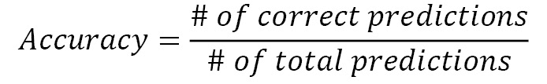
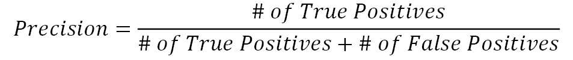
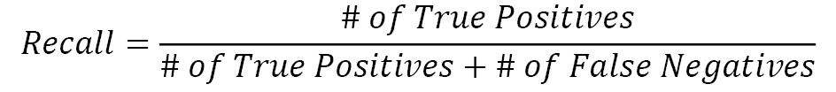
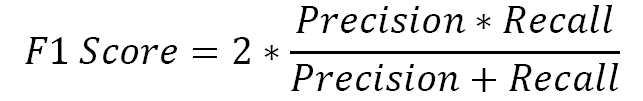

# *第五章*:在线异常检测

异常检测是对流式数据进行机器学习的良好起点。由于流数据提供连续的数据点流，监控实时解决方案的用例是首先想到的。

在许多领域中，监控是必不可少的。在 IT 解决方案中，通常会持续记录系统中发生的事情，这些日志可以作为流数据进行分析。

在**物联网** ( **IoT** )中，传感器数据有时会在大量传感器上收集。然后对这些数据进行实时分析和使用。

在这种使用情况下，实时和在线异常检测可以通过发现远离预期测量范围或意外的值来增加价值。及时发现它们会有很大的价值。

在这一章中，您将首先深入了解异常检测以及在实现它时需要考虑的理论因素。然后，您将看到如何使用 Python 中的 River 包实现在线异常检测。

本章涵盖以下主题:

*   定义异常检测
*   异常检测的用例
*   异常检测和不平衡分类的比较
*   河流异常检测算法
*   异常检测更进一步

# 技术要求

你可以在 GitHub 上找到这本书的所有代码，链接如下:[https://GitHub . com/packt publishing/Machine-Learning-for-Streaming-Data-with-Python](https://github.com/PacktPublishing/Machine-Learning-for-Streaming-Data-with-Python)。如果您还不熟悉 Git 和 GitHub，下载笔记本和代码示例的最简单方法如下:

1.  转到存储库的链接。
2.  转到绿色的**代码**按钮。
3.  选择**下载 ZIP 文件**。

当您下载 ZIP 文件时，在您的本地环境中解压缩它，您将能够通过您喜欢的 Python 编辑器访问代码。

## Python 环境

为了跟随本书，您可以下载存储库中的代码，并使用您喜欢的 Python 编辑器执行它。

如果你还不熟悉 Python 环境，我建议你去看看 Anaconda([https://www.anaconda.com/products/individual](https://www.anaconda.com/products/individual))，它带有 Jupyter Notebooks 和 JupyterLabs，这两个工具都非常适合执行笔记本。它还带有 Spyder 和 VSCode，用于编辑脚本和程序。

如果你在你的机器上安装 Python 或相关程序有困难，你可以看看谷歌 Colab([https://colab.research.google.com/](https://colab.research.google.com/))或 Kaggle 笔记本([https://www.kaggle.com/code](https://www.kaggle.com/code))，它们都允许你免费在在线笔记本上运行 Python 代码，不需要做任何设置。

# 定义异常检测

让我们从开始，了解什么是**异常检测**。异常检测也称为异常值检测，是识别数据集中罕见观察值的过程。那些罕见的观察值被称为**异常值**或**异常值**。

异常检测的目标是使用统计方法和/或机器学习建立能够自动检测异常值的模型。这种模型可以使用多个变量来判断某个观察值是否应该被视为异常值。

## 离群值是个问题吗？

离群值出现在许多数据集中。毕竟，如果你考虑一个服从正态分布的变量，看到远离平均值的数据点是正常的。让我们考虑一个标准的正态分布(具有均值`0`和标准差`1`的正态分布):

代码块 5-1

```
import matplotlib.pyplot as plt
```

```
import numpy as np
```

```
import scipy.stats as stats
```

```
x = np.linspace(-4,4, 100)
```

```
plt.plot(x, stats.norm.pdf(x, 0, 1))
```

您可以看到如下结果图:


图 5.1–正态分布

这个标准的正态分布在`0`附近有很多观察结果。然而，在分布的尾部观察到一些观察结果是正常的。如果你有一个真正遵循这种分布的变量，并且你的样本量足够大，那么在远离中心的地方进行一些观察实际上不能被认为是坏事。

在下面的代码中，您将看到如何从标准正态分布中抽取 1000 万个观察值的样本:

代码块 5-2

```
import numpy as np
```

```
import matplotlib.pyplot as plt
```

```
data = np.random.normal(size=10000000)
```

```
plt.hist(data, bins=25)
```

数据很好地遵循了正态曲线。您可以在下图中看到这一点:


图 5.2–正态分布直方图

现在，让我们使用下面的代码来看看这个示例的最高值和最低值是多少:

代码块 5-3

```
min(data), max(data)
```

在当前绘制中，观察到最小`5.11`和最大`5.12`。这些是不是异常值？答案很复杂。当然，这两个值在正态分布的范围内是完美的。另一方面，它们是极端值。

这个例子说明了定义一个异常值并不总是容易的，需要仔细考虑您的具体用例。现在，我们将看到一些异常检测的用例。

# 探索异常检测的用例

在继续讨论异常检测的一些特定算法之前，让我们首先考虑一些异常检测经常使用的用例。

## 金融机构中的欺诈检测

异常检测的一个非常常见的用例是检测金融机构中的欺诈行为。银行通常拥有大量数据，因为几乎每个人都有一个或多个定期使用的银行账户。所有这些使用产生了大量的数据，可以帮助银行改善服务和提高利润。欺诈检测是银行数据科学应用的关键组成部分，还有许多其他使用案例。

欺诈检测的一个常见用例是自动检测信用卡欺诈。假设您的卡或卡的详细信息被盗，有人正在欺诈性地使用它们。这会导致欺诈性交易，这可以通过机器学习算法自动检测出来。然后，银行会自动冻结你的卡，并要求你验证是否是你或某人欺诈性地进行了这些支付。

这既符合银行的利益，也符合用户的利益，因此这是异常检测的一个很好的用例。其他处理信用卡和支付数据的公司也可能使用这些方法。

流式模型非常适合欺诈检测。通常会有大量数据以连续的支付流和其他数据的形式流入。流模型允许您在欺诈情况发生时直接采取行动，而不是等待下一批欺诈发生。

如果您想了解有关金融机构欺诈检测的更多信息，可以查看以下链接:

*   [https://www . mitek systems . com/blog/how-do-machine-learning-help-with-fraud-detection-in-banks](https://www.miteksystems.com/blog/how-does-machine-learning-help-with-fraud-detection-in-banks)
*   [https://www . SAS . com/en _ us/software/detection-investigation-for-banking . html](https://www.sas.com/en_us/software/detection-investigation-for-banking.html)

## 对您的日志数据进行异常检测

异常检测的第二个用例是日志分析。许多软件应用会生成大量日志，其中包含有关程序执行的所有类型的信息。这些日志通常被临时或长期存储，以供进一步分析。在某些情况下，这些分析可能是手动搜索软件中某一点发生的特定信息，但在其他时候，它们可能是自动日志处理程序。

日志中异常检测的困难之一是日志数据通常是非结构化的。通常，它们只是文本文件中一个接一个的打印语句。很难理解这些数据。

如果您成功地对日志数据进行了正确的结构化和分类，那么您就可以使用机器学习技术来自动检测软件执行中的问题。这让你可以立即采取行动。

使用流式分析而不是批量分析在这里也很重要。有些软件是任务关键型的，停机对公司来说往往意味着问题。这些可能是不同类型的问题，包括合同问题和收入损失。如果一家公司能够自动检测缺陷，这就允许他们快速行动，迅速修复问题。问题修复得越快，公司的问题就越少。

有关日志数据异常检测的更深入的用例文献，您可以查看以下链接:

*   [https://www . zebrium . com/blog/using-machine-learning-to-detect-anomalies-in-logs](https://www.zebrium.com/blog/using-machine-learning-to-detect-anomalies-in-logs)
*   https://arxiv.org/abs/2202.04301

## 制造和生产线中的故障检测

生产线故障检测的一个例子是工业食品生产业务。很多生产线几乎都是全自动化的，也就是说从原料产品的输入到最终产品的输出之间几乎没有人为干预。这样做的风险是，可能会出现无法作为最终产品接受的缺陷。

在生产线上使用传感器数据有助于检测生产中的异常情况。当生产线的一些参数出现问题时，传感器与流系统和实时警报系统相结合，可以让您立即停止生产有问题的产品。这可以节省很多钱，因为制造废物是非常昂贵的。

在这里使用流和实时分析也很重要。你对一个问题反应的时间越长，产生的浪费就越多，损失的金钱也就越多。在制造和生产线上实施实时和流式分析系统可以获得巨大的投资回报。

以下链接将帮助您了解有关此使用案例的更多信息:

*   https://www . irect.com/science/article/pii/S2212827119301908 科学
*   [https://www.merl.com/publications/docs/TR2018-097.pdf](https://www.merl.com/publications/docs/TR2018-097.pdf)

## 计算机网络中的黑客检测(网络安全)

针对网络安全的自动化威胁检测是异常检测的另一个重要用例。就像其他用例一样，与负面用例相比，正面事件非常少。然而，这些正面案例的重要性远比负面案例更有影响力。

随着最近的发展，网络安全问题和泄露对公司的影响比以前大得多。个人数据可以卖很多钱，黑客经常试图窃取这些信息，认为他们可以在自己的计算机后保持匿名。

威胁和异常检测系统是使用机器学习来检测非正常行为和可能代表入侵的自动化系统。如果公司能够对此类事件的发生做出快速反应，他们就可以避免大规模的公开羞辱活动和花费大量金钱的潜在诉讼。

流媒体和实时系统在这里也很重要，因为尽可能少地给入侵者留下行动时间将大大降低您组织中发生任何网络犯罪的风险。

以下两篇文章深入探讨了这类用例:

*   [https://securityboulevard . com/2021/07/什么是网络安全中的异常检测/](https://securityboulevard.com/2021/07/what-is-anomaly-detection-in-cybersecurity/)
*   [https://www.xenonstack.com/insights/cyber-network-security](https://www.xenonstack.com/insights/cyber-network-security)

## 健康数据中的医疗风险

在过去的几年里，医学界见证了大量的发明。其中一部分是个人工具，如智能手表和其他连接的健康设备，允许您实时测量自己的健康 KPI。其他用例可以在医院和其他专业医疗保健应用中找到。

当您的健康 KPI 出现异常时，立即进行干预通常是至关重要的。健康 KPI 信号甚至在我们作为人类开始注意到我们的健康正在恶化之前就经常出现。即使是在事件发生后不久，这些信息也能够让您获得正确的护理，而无需花费太多时间寻找问题原因的资源。

一般来说，你的大部分健康指标都是好的，或者至少是可以接受的，直到有一个指标告诉你确实出了问题，你需要帮助。在这种情况下，使用流式分析而不是批量分析非常重要。毕竟，如果数据在下一个小时或第二天到达，对您来说可能就太晚了。这是使用流式分析而不是批量分析的另一个有力论据。

你可以在这里了解更多信息:

*   [https://medinform.jmir.org/2021/5/e27172/](https://medinform.jmir.org/2021/5/e27172/)
*   [https://arxiv.org/pdf/2012.02364.pdf](https://arxiv.org/pdf/2012.02364.pdf)

## 预测性维护和传感器数据

这里将讨论的最后一个用例是预测性维护的用例。许多公司都有需要预防性维护的关键系统；如果什么东西坏了，这将花费很多钱，甚至更糟。

航空业就是一个例子。如果一架飞机坠毁了，会有很多人丧生。当然，没有一家公司能够预测所有的异常情况，但是任何能够在崩溃发生之前检测到的异常情况都将是一个巨大的胜利。

异常检测可用于许多具有类似问题的部门的预测性维护；如果您可以预测您的关键系统将很快出现故障，您就有足够的时间对需要它的部分进行维护，并避免更大的问题。

预测性维护有时可以批量完成，但它也可以受益于流。这完全取决于检测到异常和需要干预之间的时间。

如果你有一个预测维护模型，可以预测从现在到 30 分钟之间的飞机发动机故障，你就非常需要尽快将这些数据提供给你的飞行员。如果你有预测系统告诉你一个零件需要在下个月更换，你也可以使用批量分析。

要了解有关此用例的更多信息，您可以查看以下链接:

*   [https://www . knime . com/blog/anomaly-detection-for-predictive-maintenance-EDA](https://www.knime.com/blog/anomaly-detection-for-predictive-maintenance-EDA)
*   [https://www . e3s-conferences . org/articles/E3 sconf/pdf/2020/30/E3 sconf _ evf 2020 _ 02007 . pdf](https://www.e3s-conferences.org/articles/e3sconf/pdf/2020/30/e3sconf_evf2020_02007.pdf)

在下一节中，您将看到异常检测模型如何与不平衡分类进行比较。

# 比较异常检测和不平衡分类

对于针对阴性病例检测阳性病例，标准的常用方法是分类。对于所描述的问题，只要你有至少几个正反例的历史数据，你就可以使用分类算法。但是，你有一个很常见的问题:只有极少数的观测值是异常的。这就是通常所说的**不平衡数据**的问题。

## 不平衡数据的问题

不平衡数据集是目标类出现次数分布非常不均匀的数据集。一个经常发生的例子是网站销售:在 1000 个访问者中，你通常至少有 900 个访问者只是在看和浏览，而不是 100 个真正买东西的人。

对不平衡数据不小心使用分类方法容易出错。假设您有一个分类模型，需要为每个网站访问者预测他们是否会买东西。如果你创建了一个非常糟糕的模型，只预测每个访问者不购买，那么你仍然对 1000 个访问者中的 900 个是正确的，你的准确性指标将是 90%。

有许多针对这种不平衡数据的标准方法，包括使用 F1 分数和使用 SMOTE 过采样。

## F1 的分数

在数据不平衡的情况下，F1 分数是准确性分数的绝佳替代品。准确性的计算方法是正确预测的数量除以做出的预测的总数。

这是精确度的公式:



然而，F1 的分数考虑了你的模型的精确度和召回率。模型的精度是实际正确的预测值的百分比。你的模型的回忆显示了你实际上能够检测到的阳性百分比。

这是精确度的公式:



这是回忆的公式:



F1 分数使用以下公式将这两个指标合并为一个指标:



使用这个度量进行评估，您将避免将非常差的模型解释为好模型，尤其是在数据不平衡的情况下。

## SMOTE 过采样

SMOTE 过采样是第二种可以用来抵消数据不平衡的方法。这是一种创建*假*数据点的方法，这些数据点与你的正类中的数据点非常相似。通过创建大量数据点，您的模型将能够更好地了解阳性类，并且通过使用原始阳性作为源，您可以保证新生成的数据点不会相差太远。

## 异常检测与分类

虽然不平衡分类问题有时可以很好地解决异常检测问题，但异常检测被视为机器学习的一个单独类别是有原因的。

主要区别在于理解正(异常)类的重要性。在分类模型中，您希望模型能够轻松地区分两个(正面和负面)或更多类别。为此，您希望您的模型了解每个类的样子。该模型将搜索描述一个类的变量，以及描述另一个类的其他变量或值。

在异常检测中，您并不真正关心异常类是什么样子的。你更需要的，是你的模型学习什么是*正常的*。只要你的模型很好的理解了正常，负类，它就能很好的陈述正常和异常。这在任何方向和任何意义上都可能是异常现象。模型不需要以前见过这种类型的异常，只需知道它不正常。

在第一个异常的情况下，标准分类模型不知道这个观察结果应该被分类到什么类别。如果你幸运的话，它可以进入异常类，但你没有理由相信它会。然而，一个异常检测模型，如果关注的是它所知道的而不是它所不知道的，那么它就能够将这个异常检测为它以前没有见过的东西，并因此将其归类为异常。

在下一节中，您将看到 Python 的 River 包中提供的许多异常检测算法。

# 河流异常检测算法

在本章中，您将再次使用 River 进行在线机器学习算法。还有其他的库，但是 River 是在线学习(除了强化学习)的首选 Python 包。

您将看到 River 当前(版本 0.9.0)包含的两个用于异常检测的在线机器学习算法，如下所示:

*   `OneClassSVM`:一个线上改编的离线版一级 SVM
*   `HalfSpaceTrees`:一个隔离林的在线改编

您还将看到如何使用常量阈值和分位数阈值。

## 阈值在河流异常检测中的应用

让我们先来看看阈值的使用，因为它们将围绕实际的异常检测算法。

异常检测算法通常会返回一个在`0`和`1`之间的分数，以向模型表明观察值在多大程度上是异常的。接近`1`的分数更可能是异常值，接近`0`的分数被认为更正常。

在实践中，您需要为每个观察值确定一个阈值，以表明您是否期望它是异常值。要将连续的`0`到`1`标度转换为是/否答案，您需要使用一个阈值。

### 恒定阈值

常量阈值是您凭直觉想到的最简单的方法。您将给出一个常数值，该常数值将根据高于或低于该常数，将具有连续(`0`至`1`)异常分数的观察结果分为是/否异常。

例如，如果您指定一个值`0.95`作为您的常量阈值，则异常值高于该值的每个观察值都将被视为异常，而得分低于该值的每个数据点都不会被视为异常。

### 分位数阈值

分位数阈值稍微高级一些。您指定的是分位数，而不是常数。在描述性统计这一章中，你已经看到了分位数。分位数意味着 95%的观察值低于该值，5%的观察值高于该值。

想象一下你使用了一个恒定的阈值`0.95`，但是模型没有检测到高于`0.95`的点。在这种情况下，常量阈值将不会将任何观测值划分到异常类中。分位数阈值`0.95`仍然会给你正好 5%的异常观察值。

首选行为将取决于您的用例，但至少您有两个选项准备好在 River 中进行异常检测。

## 异常检测算法 1–一类 SVM

现在让我们继续讨论第一个异常检测算法:一类 SVM。您将首先看到单级 SVM 如何用于异常检测的概述。之后，您将看到它是如何适应 River 中的在线上下文的，并且您将使用 Python 中的一类虚拟机来做一个 Python 用例。

### 一类 SVM 在异常检测中的一般应用

单类 SVM 是一种基于**支持向量机** ( **SVM** )分类算法的无监督离群点检测算法。

支持向量机是分类或其他监督学习的常用模型。在监督学习中，它们因使用核技巧而闻名，核技巧将输入映射到高维特征空间。通过这个过程，支持向量机能够生成非线性分类。

如前所述，异常检测算法需要理解什么是正常的，但它们不必理解非正常类。因此，一类 SVM 是常规支持向量机的一种改进。在常规的有监督的支持向量机中，您需要指定类(目标变量)，但是在单类 SVM 中，您表现得好像所有数据都在一个类中。

基本上，单类 SVM 将正好适合 SVM，在该模型中，它尝试将所有变量作为同一目标类来拟合最佳预测模型。当模型拟合良好时，最大个体的预测误差较低。

对于最佳拟合模型具有高误差分数的个体很难使用与其他个体相同的模型来预测。你可以考虑他们可能需要另一个模型，因此，假设这些人不是来自同一个数据生成过程。因此，它们很可能是异常现象。

误差用作分割个体的阈值分数。具有高误差分数的个体可以被分类为异常，而具有低误差分数的个体可以被认为是正常的。这种分割通常是用分位数阈值来完成的，这在前面已经介绍过了。

### 在线一级 SVM 在河

River 中的`OneClassSVM`模型在文档中被描述为单级 SVM 的随机实现，不幸的是，它不会完全匹配算法的离线定义。如果找到准确的结果对您的用例很重要，您可以尝试在线和离线实现，看看它们有多大的不同。

通常，离群点检测是一项无人监督的任务，很难完全确定模型的最终答案和精度。只要你监控结果，认真对待 KPI 选择和业务结果的跟踪，这就不是问题。

### 用例上的应用

现在让我们应用使用 River 的一级 SVM 的在线训练流程。

对于本例，让我们创建自己的数据集，这样我们就可以确定哪些数据应该被视为异常值:

1.  让我们用`0`和`1`之间的 1000 个观察值创建一个均匀分布变量:

代码块 5-4

```
import numpy as np
normal_data = np.random.rand(1000)
```

1.  当前运行的直方图可以如下准备，但是它会由于随机性而改变:

代码块 5-5

```
import matplotlib.pyplot as plt
plt.hist(normal_data)
```

结果图将显示如下直方图:


图 5.3-正常数据图

1.  因为我们非常了解这个分布，所以我们知道会发生什么:在`0`和`1`之间的任何数据点都是正常的，而在`0`到`1`之外的每个数据点都是异常值。现在让我们将 1%的异常值添加到数据中。我们来做 0.5%的容易检测的异常值(随机 int 在`2`和`3`之间，`-1`和`-2`之间)，这个值离我们的正态分布非常远。让我们也让 0.5%的异常值更难检测(在`0`和`-1`之间以及`1`和`2`之间)。

通过这种方式，我们可以挑战模型，看看它的表现如何:

代码块 5-6

```
hard_to_detect = list(np.random.uniform(1,2,size=int(0.005*1000))) + \
                  list(np.random.uniform(0,-1,size=int(0.005*1000)))
easy_to_detect = list(np.random.uniform(2,3,size=int(0.005*1000))) + \
                  list(np.random.uniform(-1,-2,size=int(0.005*1000)))
```

1.  让我们将所有的数据放在一起，并编写代码以流的方式将它交付给模型，如下所示:

代码块 5-7

```
total_data = list(normal_data) + hard_to_detect + easy_to_detect
import random
random.shuffle(total_data)
for datapoint in total_data:
  pass
```

1.  现在，剩下唯一要做的事情就是将模型添加到循环中:

代码块 5-8

```
# Anomaly percentage for the quantile thresholder
expected_percentage_anomaly = 20/1020
expected_percentage_normal = 1 - expected_percentage_anomaly
```

1.  在这里，你可以拟合模型:

代码块 5-9

```
!pip install river
from river import anomaly
model = anomaly.QuantileThresholder(
    anomaly.OneClassSVM(),
    q=expected_percentage_normal
    )
for datapoint in total_data:
    model = model.learn_one({'x': datapoint})
```

运行这段代码时，您已经在我们的合成数据点上训练了一个在线一级 SVM！

1.  让我们试着了解一下它是如何工作的。在下面的代码中，您将看到如何获得每个人的分数以及分配给各个类别的分数:

代码块 5-10

```
scores = []
for datapoint in total_data:
    scores.append(model.score_one({'x': datapoint}))
```

1.  因为我们知道实际结果，我们现在可以比较答案是否正确。为此，您可以使用以下代码:

代码块 5-11

```
import pandas as pd
results = pd.DataFrame({'data': total_data , 'score': scores})
results['actual_outlier'] = (results['data'] > 1 ) | (results ['data'] < 0)
# there are 20 actual outliers
results['actual_outlier'].value_counts()
```

结果如下所示:


图 5.4–代码块 5-11 的结果

1.  下面的代码块将计算算法检测到的数值计数:

代码块 5-12

```
# the algo detected 22 outliers
results['score'].value_counts()
```

下图显示检测到 22 个异常值:


图 5.5–代码块 5-12 的结果

1.  我们现在应该计算有多少检测到的异常值是真正的异常值，以及有多少不是真正的异常值。这是在下面的代码块中完成的:

代码块 5-13

```
# in the 22 detected otuliuers, 10 are actual outliers, but 12 are not actually outliers
results.groupby('actual_outlier')['score'].sum()
```

结果是，在 22 个检测到的异常值中，10 个是实际异常值，但 12 个不是实际异常值。这可以从下图中看出:


图 5.6–代码块 5-13 的结果

所获得的结果并不太坏:至少一些异常值被正确地检测到了，这可能是一个很好的最小可行产品，可以开始对这个特定用例进行自动化异常检测。让我们看看我们能否用不同的异常检测算法击败它！

## 异常检测算法 2–半空间树

第二个主要异常检测算法是隔离森林的在线替代方案，这是一种常用的高性能异常检测算法。

### 隔离林在异常检测中的一般用途

隔离林的工作方式与大多数异常检测算法略有不同。如本章所述，许多模型通过首先理解*正常*数据点，然后决定一个数据点是否与其他正常点相对相似来进行异常检测。如果不是，则被认为是异常值。

隔离森林是一项伟大的发明，因为它们反过来工作。他们试图对所有不正常的事物建模，并试图将这些点与其他点隔离开来。

为了隔离观察值，隔离林将随机选择要素，然后在最小值和最大值之间分割要素。分离样本所需的分裂数被认为是对观察结果的**分离分数**的良好描述。

如果很容易隔离它(隔离的短路径，相当于用很少的分裂来隔离该点)，那么它可能是一个相对隔离的数据点，我们可以将其归类为异常值。

### 它是如何随河流变化的？

在 River 中，模型必须在线训练，他们必须做一些调整才能让它工作。事实上，在《河流》中把这个模型叫做`HalfSpaceTrees`是因为它已经被改编了。

需要记住的是，为了使模型工作良好，异常必须在数据集中展开。此外，模型需要所有值都在`0`和`1`之间。

### 半空间树在异常检测用例中的应用

我们将按如下方式实施:

1.  现在让我们将半空间树应用于相同的单变量用例，看看会发生什么:

代码块 5-14

```
from river import anomaly
model2 = anomaly.QuantileThresholder(
    anomaly.HalfSpaceTrees(),
    q=expected_percentage_normal
    )
for datapoint in total_data:
    model2 = model2.learn_one({'x': datapoint})
scores2 = []
for datapoint in total_data:
    scores2.append(model2.score_one({'x': datapoint}))

import pandas as pd
results2 = pd.DataFrame({'data': total_data, 'score': scores2})
results2['actual_outlier'] = (results2 ['data'] > 1 ) | (results2['data'] < 0)
# there are 20 actual outliers
results2['actual_outlier'].value_counts()
```

该代码块的结果如下图所示。似乎有 20 个实际异常值:


图 5.7–代码块 5-14 的结果

1.  现在，您可以使用以下代码计算模型检测到了多少异常值:

代码块 5-15

```
# the algo detected 29 outliers
results2['score'].value_counts()
```

似乎该算法检测到 29 个异常值。这可以从下图中看出:


图 5.8–代码块 5-15 的结果

1.  我们现在将计算这 29 个检测到的异常值中有多少实际上是异常值，以查看我们的模型是否有任何好处:

代码块 5-16

```
# the 29 detected outliers are not actually outliers
results2.groupby('actual_outlier')['score'].sum()
```

结果显示，我们检测到的 29 个异常值并不是真正的异常值，这表明该模型不是该任务的一个好选择。这真的没有问题。毕竟，这正是进行模型基准测试的确切原因:


图 5.9–代码块 5-16 的结果

如您所见，该模型在当前用例中性能较差。总之，在从`0`到`1`的 1000 个均匀分布的样本中，一级 SVM 在识别异常方面表现更好。

# 进一步进行异常检测

为了进一步了解异常检测用例，您可以尝试使用不同的数据集，甚至是您自己用例的数据集。正如您在示例中看到的，数据点作为字典输入。在当前示例中，您使用了单变量数据点:字典中只有一个条目。

在实践中，您通常会遇到多变量问题，并且您的输入中会有多个变量。在这种用例中，模型可能更适合。

# 总结

在本章中，您已经了解了异常检测在流和非流环境中的工作原理。这种类型的机器学习模型采用了许多关于情况的变量，并使用这些信息来检测特定的数据点或观察值是否可能与其他数据点或观察值不同。

您已经大致了解了这方面的不同用例。其中一些是 IT 系统的监控，或者制造业中的生产线传感器数据。每当有一个数据点与其他数据点相差太大而出现问题时，异常检测就具有很大的附加值。

您已经通过实现一个模型基准完成了这一章，其中您已经对 River 库中的两个在线异常检测模型进行了基准测试。您已经看到一个模型能够检测到部分异常，而另一个模型的性能要差得多。这不仅向您介绍了异常检测，还介绍了模型基准和模型评估。

在下一章，你会看到更多关于这些主题的内容。您将在在线分类模型上工作，并且您将再次看到如何实现模型基准和度量，但是这一次是为了分类而不是异常检测。正如您在本章中看到的，分类有时也可以用于异常检测，使两个用例相互关联。

# 延伸阅读

*   *异常检测*:[https://en.wikipedia.org/wiki/Anomaly_detection](https://en.wikipedia.org/wiki/Anomaly_detection)
*   *河 ML 恒阈值器*:[https://riverml.xyz/latest/api/anomaly/ConstantThresholder/](https://riverml.xyz/latest/api/anomaly/ConstantThresholder/)
*   *河流 ML 分位数阈值*:[https://riverml.xyz/latest/api/anomaly/QuantileThresholder/](https://riverml.xyz/latest/api/anomaly/QuantileThresholder/)
*   *支持向量机*:[https://en.wikipedia.org/wiki/Support-vector_machine](https://en.wikipedia.org/wiki/Support-vector_machine)
*   *Scikit Learn One Class SVM*:[https://Scikit-Learn . org/stable/modules/generated/sk Learn . SVM . oneclasssvm . html](https://scikit-learn.org/stable/modules/generated/sklearn.svm.OneClassSVM.html)
*   【https://riverml.xyz/latest/api/anomaly/OneClassSVM/】河 ML 一班:[SVM](https://riverml.xyz/latest/api/anomaly/OneClassSVM/)
*   *隔离林*:[https://en.wikipedia.org/wiki/Isolation_forest](https://en.wikipedia.org/wiki/Isolation_forest)
*   *河 ML 半空间树*:[https://riverml.xyz/latest/api/anomaly/HalfSpaceTrees/](https://riverml.xyz/latest/api/anomaly/HalfSpaceTrees/)