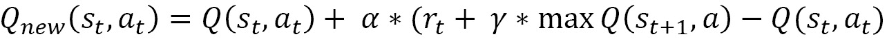

# *第八章*:强化学习

强化学习范式与标准的机器学习非常不同，甚至与我们在前面章节中提到的在线机器学习方法也非常不同。尽管对于许多用例来说，强化学习并不总是比“常规”学习更好的选择，但它是处理再学习和模型适应的强大工具。

在强化学习中，我们赋予模型很大的决策权来进行再学习和更新决策过程的规则。模型将直接决定要采取的行动，而不是让模型做出预测并对该预测要采取的行动进行硬编码。

对于动作被有效自动化的自动化机器学习管道，这可能是一个很好的选择。当然，这必须辅之以不同类型的日志记录、监控等等。对于我们需要预测而不是行动的情况，强化学习是不合适的。

虽然在正确的用例中非常强大，但强化学习目前并不是常规机器学习的标准选择。在未来，强化学习很可能会在更多的用例中流行起来。

在这一章中，你将首先被彻底地介绍强化学习背后的不同概念。然后，您将看到 Python 中强化学习的实现。

本章涵盖以下主题:

*   定义强化学习
*   强化学习模型的主要步骤
*   探究 Q-学习
*   深度 Q 学习
*   对流式数据使用强化学习
*   强化学习的用例
*   在 Python 中实现强化学习

# 技术要求

你可以在 GitHub 上找到这本书的所有代码，链接如下:[https://GitHub . com/packt publishing/Machine-Learning-for-Streaming-Data-with-Python](https://github.com/PacktPublishing/Machine-Learning-for-Streaming-Data-with-Python)。如果您还不熟悉 Git 和 GitHub，下载笔记本和代码示例的最简单方法如下:

1.  转到存储库的链接。
2.  转到绿色的**代码**按钮。
3.  选择**下载压缩文件**。

当您下载 ZIP 文件时，您将它解压缩到您的本地环境中，您将能够通过您喜欢的 Python 编辑器访问代码。

## Python 环境

要阅读本书，您可以下载存储库中的代码，并使用您喜欢的 Python 编辑器执行它。

如果您还不熟悉 Python 环境，我建议您查看一下 Jupyter 笔记本附带的 Anaconda([https://www.anaconda.com/products/individual](https://www.anaconda.com/products/individual))和 JupyterLab，这两个工具都非常适合执行笔记本。它还带有 Spyder 和 VSCode，用于编辑脚本和程序。

如果你在你的机器上安装 Python 或相关程序有困难，你可以看看谷歌 Colab(【https://colab.research.google.com/】)或 Kaggle 笔记本([【https://www.kaggle.com/code】](https://www.kaggle.com/code))，它们都允许你免费在在线笔记本上运行 Python 代码，无需任何设置。

注意

书中的代码通常会使用带有 Python 版本 3.7.13 的 Colab 和 Kaggle 笔记本，您可以设置自己的环境来模拟这种情况。

# 定义强化学习

强化学习是机器学习的一个子域，专注于创建做出决策的机器学习模型。有时，模型不被称为模型，而是被称为智能代理。

从远处看，你可能会认为强化学习非常接近机器学习。我们可以说，它们都是人工智能内部的方法，试图提供智能黑盒，能够像人类一样学习特定的任务，而且往往更好。

然而，如果我们仔细观察，我们会发现一些重要的差异。在前面的章节中，您已经看到了异常检测、分类和回归等机器学习模型。它们都使用许多变量，并能够基于这些变量对目标变量进行实时预测。

您已经看到了许多指标，这些指标使我们数据科学家能够决定一个模型是否好。在线模型还能够通过重新学习和不断考虑自己的误差指标来适应不断变化的数据。

强化学习不止于此。RL 模型不仅做出预测，还会采取行动。你可以说，离线模型在从错误中重新学习方面没有任何自主权，在线模型会立即考虑错误，强化学习模型旨在犯错误并从中学习。

在线模型可以适应他们的错误，就像强化学习一样。然而，当您构建一个在线模型的第一个版本时，您确实希望它在开始时具有可接受的性能，并且您会根据一些历史数据来训练它。然后，它可以适应数据漂移或其他变化的情况。

另一方面，强化学习模型一开始完全是幼稚和无知的。它会尝试一些动作，犯一些错误，然后在某个时候纯粹冒险，它也会做出一些好的决定。此时，强化模型将获得奖励，并开始记住这些奖励。

## 比较在线和离线强化学习

强化学习通常是在线学习:智能代理通过重复行动进行学习，对好的预测给予奖励。这种情况可以无限期地持续下去，至少只要对决策的反馈不断输入到模型中。

但是，强化学习也可以离线进行。在这种情况下，模型将在一段给定的时间内学习，然后在某一点上，反馈回路被切断，因此模型(决策规则)在该点之后保持不变。

一般来说，当使用强化学习时，是因为我们对持续的再学习感兴趣。所以，网上的变种是最常见的。

## 强化学习中反馈循环的更详细概述

现在，让我们更深入强化学习的细节。首先，理解一般强化学习模型的反馈回路是如何工作的很重要。以下模式显示了通过反馈循环学习模型的逻辑。


图 8.1–RL 中的反馈环路

在这个模式中，您会观察到以下元素:

*   **RL 代理**:我们的模型是不断学习和决策。
*   **环境**:代理可以做出一组特定决策的固定环境。
*   **动作**:代理每次做决定，都会改变环境。
*   **奖励**:如果决策产生了好的结果，那么代理人将获得奖励。
*   **状态**:智能体做出决策所需的环境信息。

作为一个简化的例子，假设代理是一个正在学习走路的人类婴儿。在每一个时间点，婴儿都在尝试能让他们走路的东西。更具体地说，他们正在激活身体的几块肌肉。

当这样做的时候，婴儿在观察他们是否在走路。此外，当他们越来越接近正确行走时，他们的父母会给他们加油。这是给婴儿的奖励，表明他们正在以正确的方式学习。

然后，婴儿将再次尝试使用几乎相同的肌肉走路，但略有不同。如果情况有所好转，他们会认为这是一件积极的事情，并继续朝那个方向前进。

现在，让我们来看看所有这些工作所必需的剩余步骤。

# 强化学习模式的主要步骤

代理的动作是它可以做出的决定。这是一组有限的决定。正如你所理解的，代理只是一段代码，所以它的所有决定都需要被编程来控制它自己的行为。

如果我们把它想象成一个电脑游戏，那么你就会明白，作为一个玩家，你可以执行的动作受到你可以在游戏控制台上按下的按钮的限制。所有这些组合在一起仍然允许非常广泛的选择，但它们在某些方面受到限制。

我们人类宝宝学走路也是一样。他们只能控制自己的身体，所以除此之外他们不能执行任何动作。这给出了大量人类可以做的事情，但仍然是一组固定的动作。

## 做决策

现在，当您的增援代理接收到关于其环境(州)的信息时，它需要将这些信息转换成决策。这和机器学习模型需要把自变量映射成目标变量是一个思路。

在强化学习的情况下，这种决策映射通常被称为策略。该策略通常会通过估计预期回报来决定最佳行动，然后执行具有最高预期回报的行动。

## 更新决策规则

这个大图的最后一部分对强化学习的描述是政策的更新:基本上就是学习本身。模型有很多种，都有各自的特殊性，但无论如何还是要试着得出一个大概。

此时，您已经看到代理从一组固定动作中采取了一个动作。代理已经估计出哪一个最有可能获得最大的回报。这个任务执行后，模特会获得一定的奖励。这将用于改变策略，改变的方式取决于你使用的强化学习的确切方法。

在下一节中，您将通过探索 Q-learning 算法更详细地了解如何做到这一点。

# 探索 Q-学习

尽管强化学习有许多变体，但是前面的解释应该已经给了你大多数强化模型如何工作的一个很好的总体概述。现在是时候深入到强化学习的特定模型中了:Q-learning。

Q-learning 是一种强化学习算法，即所谓的无模型算法。无模型强化学习算法可以被视为纯粹的试错算法:它们没有对环境的先验概念，而仅仅是尝试行动，并了解他们的行动是否会产生正确的结果。

另一方面，基于模型的算法使用不同的理论方法。他们不只是基于行动来学习结果，而是试图通过某种形式的模型来了解他们的环境。一旦代理人了解了环境是如何工作的，它就可以根据这一知识采取行动优化奖励。

虽然基于模型的方法可能看起来更容易执行，但无模型的方法(如 Q-learning)实际上非常好。

## Q-学习的目标

Q-learning 算法的目标是找到一个策略，使从当前状态开始的一系列连续步骤中获得的预期回报最大化。

在常规语言中，这意味着 Q-learning 查看当前状态(其环境的变量)，然后使用这些信息在未来采取最佳步骤。该模型不考虑过去发生的事情，只考虑未来。

该模型使用 Q 值来计算状态-动作组合的质量:也就是说，对于每个状态，都有一个潜在动作的列表。潜在的状态和潜在的动作的每个组合被称为状态-动作组合。当状态为给定状态时，Q 值指示该动作的质量。

在强化学习过程的开始，Q 的值以某种方式(随机或固定)初始化，然后在每次收到奖励时更新。代理根据 Q 值处理模型，当奖励(对行动的反馈)开始出现时，这些 Q 值会改变。代理仍然继续遵循 Q 值，但是随着它们的更新，代理的行为也发生变化。

这个算法的核心是贝尔曼方程:一个 Q 值的更新规则，使用新旧 Q 值的加权平均值。因此，旧的信息会在某个时候被遗忘，此时已经发生了大量的学习。这样就避免了被之前的行为“卡住”。

贝尔曼方程的公式如下:



## Q 学习算法的参数

在这个贝尔曼方程中，有几个你可以调整的重要参数。让我们简要介绍一下:

*   学习率是机器学习算法中非常常用的超参数。它通常定义了优化器的步长大小，其中大的步长可以使您在优化空间中更快地移动，但是太大的步长也可能导致问题进入狭窄的优化。
*   贴现因子是金融和经济学中经常使用的一个概念。在强化学习中，它指示模型需要以何种速率优先考虑短期或长期奖励。

在概述了 Q-learning 之后，下一节将介绍这种方法的一个更复杂的替代版本，称为深度 Q-learning。

# 深度 Q 学习

既然您已经看到了强化学习的基础知识和最基本的强化学习模型 Q-learning，那么是时候继续学习一个性能更好、更常用的模型了，这就是深度 Q-learning。

深度 Q-learning 是 Q-learning 的一种变体，其中 Q 值不仅仅是状态和动作的每个组合的预期 Q 值列表，由贝尔曼方程更新。相反，在深度 Q 学习中，这种估计是使用(深度)神经网络来完成的。

如果你不熟悉，神经网络是一类机器学习模型，在性能方面属于最先进的。一般来说，神经网络主要用于人工智能、机器学习和数据科学中的许多用例。深度神经网络是一种允许许多数据科学用例的技术，如**自然语言处理** ( **NLP** )、计算机视觉等等。

神经网络背后的想法是通过称为神经元的节点网络传递输入数据点，每个节点都执行非常简单的操作。事实上，有许多这样的简单操作正在进行，权重应用于其间，这意味着神经网络是一个强大的学习算法，用于将输入数据映射到目标变量。

下面的示例显示了神经网络的标准描述。这些模型可以简单，也可以复杂。你可以去大量的隐藏层，并为每个隐藏层添加尽可能多的节点。每个箭头都是一个系数，需要估计。因此，必须记住，估计这种模型需要大量的数据。

神经网络的示例示意图如下所示:


图 8.2–神经网络架构

对于强化学习，这必须在 Q 学习范式中应用。本质上，深度学习模型只是一种比标准 Q 学习方法更好的估计 Q 值的方法(或者至少这是它渴望的)。

你可以看到如下的类比。在标准 Q-learning 中，有一个相对简单的存储和更新机制，用于新奖励的到来和更新策略。您可以看到它被描绘成一个表格，如下所示:


图 8.3–表格格式示例

在深度 Q 学习中，输入和输出过程基本相同，然而状态被转录为输入到神经网络的多个变量。神经网络然后输出每个动作的估计 Q 值。

下图显示了如何将状态作为输入添加到神经网络中。


图 8.4–将状态作为输入添加到神经网络

现在您已经理解了强化学习背后的理论，下一节将会更有应用性，因为它将呈现许多关于流数据的强化学习的示例用例。

# 对流式数据使用强化学习

正如在前面章节中所讨论的，在流数据上建立模型的挑战是找到能够增量学习并且能够在模型漂移或数据漂移的情况下适应的模型。

强化学习是一个潜在的候选者，可以很好地应对这两个挑战。毕竟，强化学习有一个反馈回路，允许它在出现许多错误时改变策略。因此，它能够在发生变化时进行自我调整。

强化学习可以被视为在线学习的一个子案例。与此同时，强化学习的第二个特点是它专注于学习行为，而常规的在线模型专注于做出准确的预测。

这两个领域之间的分歧实际上存在于用例类型和应用领域中，但许多流式用例有可能从强化学习中受益，这是一个需要掌握的很好的工具集。

如果你想寻找更多的深度和例子，可以看看下面这篇有见地的文章:[https://www . researchgate . net/publication/337581742 _ Machine _ learning _ for _ streaming _ data _ state _ of _ the _ art _ challenges _ and _ opportunities](https://www.researchgate.net/publication/337581742_Machine_learning_for_streaming_data_state_of_the_art_challenges_and_opportunities)。

在下一节中，我们将探索强化学习证明至关重要的几个关键用例。

# 强化学习的用例

强化学习的用例几乎和在线学习一样多。与标准的离线和在线模型相比，这是一种不太常用的技术，但随着过去几年机器学习领域的变化，它仍然是一种很好的候选技术，可能在未来几年变得巨大。

让我们看一些用例，以便更好地了解适合强化学习的用例类型。在各种类型的示例中，有一些是更传统的强化学习用例，还有一些是更具体的流数据用例。

## 用例一——交易系统

作为强化学习的第一个用例，我们来谈谈股市交易。股票市场用例已经在回归一章的预测用例中讨论过了。强化学习是它的替代解决方案。

在回归分析中，在线模型用于构建预测工具。使用这些预测工具，股票交易员可以预测特定股票在不久的将来的价格发展，并使用这些预测来决定购买或出售股票。

使用强化学习，用例的开发会略有不同。聪明的代理人将学会如何做决定，而不是预测价格。例如，您可以给代理三个动作:销售、购买或持有(持有意味着什么都不做/忽略)。

代理将接收关于其环境的信息，包括过去的股票价格、宏观经济信息等等。该信息将与策略一起使用，该策略决定何时买入、卖出或持有。

通过长时间训练这个代理人，并使用大量数据，包括所有类型的市场场景，代理人可以很好地学习如何交易市场。然后你将获得一个有利可图的“交易机器人”，无需太多干预就能赚钱。如果成功，这显然是优于回归模型的优势，因为它们只预测价格，不采取任何行动。

关于这个主题的更多信息，您可以查看以下链接:

*   【https://arxiv.org/pdf/1911.10107.pdf 号
*   [http://cslt . riit . Tsinghua . edu . cn/mediawiki/images/a/aa/07407387 . pdf](http://cslt.riit.tsinghua.edu.cn/mediawiki/images/a/aa/07407387.pdf)

## 用例二——社交网络排名系统

强化学习的第二个用例是社交网络上的帖子排名。这背后发生的事情的一般想法是创建大量的帖子，最相关的必须显示给每个特定的用户，基于他们的偏好。

有许多机器学习方法可以用于此，强化学习是其中之一。基本上，模型最终会对显示给用户的帖子做出决定，因此，通过这种方式，这是一个真正的行动。

这个动作也会产生反馈。如果用户喜欢、评论、分享、点击、暂停或以其他方式与帖子互动，代理将获得奖励，并了解到用户确实对这种类型的帖子感兴趣。

通过反复试验，代理可以向每个用户发布不同类型的帖子，并了解哪些决定是好的，哪些是坏的。

在这里，实时响应非常重要，从错误中快速学习也很重要。如果用户收到许多不相关的帖子，这将对他们的用户体验不利，模型应该尽快知道它的预测是不正确的。因此，在线学习或强化学习非常适合这个用例。

有关此类用例的更多信息，您可以在这里找到一些资料:

*   https://arxiv.org/abs/1601.00667
*   [https://rbcdsai . iitm . AC . in/blogs/finding-influencers-in-social-networks-reinforcement-learning-shows-the-way/](https://rbcdsai.iitm.ac.in/blogs/finding-influencers-in-social-networks-reinforcement-learning-shows-the-way/)

## 用例三——无人驾驶汽车

强化学习也被提出用于自动驾驶汽车的用例。你可能知道，无人驾驶汽车在过去几年里越来越受到关注。目标是制造可以取代人类驾驶员行为的机器学习或人工智能模型。

很容易理解，这个模型的本质部分将是采取行动:加速、减速、刹车、转弯等等。如果能够建立一个足够好的强化学习模型来获得所有这些技能，它将是制造自动驾驶汽车的一个很好的候选对象。

自动驾驶汽车需要对大量关于环境的数据流做出响应。例如，他们需要在多个摄像机拍摄的连续视频流中检测汽车、道路、路标等，还可能需要其他传感器。

在这种情况下，实时响应是关键。实时重新训练模型可能会有更多的问题，因为您可能希望确保模型在旅途中不会应用试错法。

有关这方面的更多信息可在以下链接中找到:

*   [https://arxiv.org/ftp/arxiv/papers/1901/1901.00569.pdf](https://arxiv.org/ftp/arxiv/papers/1901/1901.00569.pdf)
*   [https://www . ingentaconnect . com/content one/ist/ei/2017/00002017/0000019/art 00012？crawler = true&mime type = application/pdf](https://www.ingentaconnect.com/contentone/ist/ei/2017/00002017/00000019/art00012?crawler=true&mimetype=application/pdf)

## 用例四——聊天机器人

另一个非常不同但也非常先进的机器学习用例是聊天机器人的开发。智能聊天机器人仍然很少见，但我们可以期待在不久的将来看到聊天机器人变得更加智能。

聊天机器人需要能够在处理用户提供给它的信息的同时对一个人做出回应。因此，聊天机器人正在执行一种动作:回复人类。

强化学习结合自然语言处理领域的其他技术可以很好地解决这类问题。通过让聊天机器人与用户交谈，人类用户可以以例如对他们互动的有用性进行评估的形式给予奖励。然后，这种奖励可以帮助强化学习代理调整其策略，并在未来的交互中做出更合适的回复。

聊天机器人需要能够实时响应，因为没有人想等待聊天机器人交互的回答。学习可以以在线或离线的方式进行，但强化学习无疑是合适的选择之一。

您可以在此阅读更多关于此使用案例的:

*   [https://arxiv.org/abs/1709.02349](https://arxiv.org/abs/1709.02349)
*   [https://arxiv.org/pdf/1908.10331.pdf](https://arxiv.org/pdf/1908.10331.pdf)

## 用例五——学习游戏

作为强化学习的最后一个用例例子，我们来说说学习游戏的用例。对于商业来说，它可能没有那么有价值，但它仍然是强化学习的一个有趣的用例。

在过去的几年里，强化学习代理已经学会了玩一些游戏，包括国际象棋和围棋。每一步都有一套清晰的步骤，通过玩许多模拟(或真实)游戏，模型可以了解哪种政策(采取哪一步的决策规则)是最好的。

最后，代理拥有如此强大的策略，它经常可以在这种游戏中击败世界上最好的人类玩家。

您可以在以下链接中找到更多关于此的示例:

*   [https://www.science.org/doi/10.1126/science.aar6404](https://www.science.org/doi/10.1126/science.aar6404)
*   [https://arxiv.org/pdf/1912.10944.pdf](https://arxiv.org/pdf/1912.10944.pdf)

既然我们已经探索了强化学习的一些用例，在下一节中，让我们使用 Python 来实现它。

# 在 Python 中实现强化学习

现在让我们来看一个例子，其中流数据用于 Q 学习。我们将使用的数据是股票价格的模拟数据:

1.  数据在下面的代码块中生成。

首先生成的值列表是一个包含 30，000 个连续值的列表，这些值代表股票价格。数据生成过程是 0 的起点，在每个时间步，都有一个随机值加到这个起点上。随机正常值以 0 为中心，这表明价格将基于标准差 1 以步长大小上升或下降。

这个过程通常被称为随机漫步，它可以向上或向下走很远。之后，这些值再次被标准化为正态分布。

代码块 8-1

```
import numpy as np
import matplotlib.pyplot as plt
import random
starting = 0
values = [starting]
for i in range(30000):
    values.append(values[-1] + np.random.normal())
values = (values - np.mean(values)) / np.std(values)
plt.plot(values)
```

由此产生的图可以在下面的中看到:


图 8.5–前面代码块的结果图

1.  现在，对于一个强化问题，有必要有一个有限数量的状态。当然，如果我们考虑的股票价格，我们可以收集到无限个小数。数据四舍五入到 1 位小数，以限制可能的状态数据点数:

代码块 8-2

```
rounded_values = []
for value in values:
    rounded_values.append(round(value, 1))
plt.plot(rounded_values)
```

生成的图形如下图所示:


图 8.6–前面代码块生成的图形

1.  我们现在可以将状态的潜在值设置为过去发生的所有值。我们也可以启动一项政策。

正如在本章的理论部分所看到的，策略代表了强化学习代理的规则。在某些情况下，有一个非常具体的规则集，但在 Q-learning 中，对于状态和动作的每个组合，只有一个 Q 值(质量)。

在我们的例子中，让我们考虑一个一次只能做两件事的股票交易机器人 *t* 。交易机器人要么在时间 *t* 买入并在 *t+1* 卖出，要么在时间 *t* 卖出并在时间 *t+1* 平仓。在不太深入股票交易的情况下，需要了解的重要事情如下:

*   当代理购买时，它应该这样做，因为它预计股市会上涨。
*   当代理人打开一个卖单，它应该这样做，因为它预计股市将下跌。

作为信息，我们的股票交易员将非常有限。状态中唯一的数据点是时间 t 时的价格。这里的目标不是建立一个伟大的模型，而是在一个股票交易示例上展示构建强化学习代理的原理。实际上，你需要更多的州信息来决定你的行动:

代码块 8-3

```
states = set(rounded_values)
import pandas as pd
policy = pd.DataFrame(0, index=states, columns=['buy', 'sell'])
```

1.  下文定义的函数是如何基于 Q 表获得一个动作(卖出或买入)。将 Q 表称为策略并不完全正确，但它确实使它更容易理解。

所选择的动作是对于给定状态具有最高 Q 值的动作(状态是股票的当前值):

代码块 8-4

```
def find_action(policy, current_value):

    if policy.loc[current_value,:].sum() == 0:
        return random.choice([ 'buy', 'sell'])
    return policy.columns[policy.loc[current_value,:].argmax()]
```

1.  还需要定义一个更新规则。在本例中，更新规则基于前面解释的贝尔曼方程。但是，请记住，代理相当简单，折扣部分并不真正相关。折扣有助于使代理人更喜欢短期收益而不是长期收益。当前代理人总是在一个时间步长内获得收益，因此贴现没有附加值。在一个真正的股票交易机器人中，这将非常重要:如果你能在一年内翻倍，你不会把你的钱放在一只将在 20 年内翻倍的股票上:

代码块 8-5

```
def update_policy(reward, current_state_value, action):

    LEARNING_RATE = 0.1
    MAX_REWARD = 10
    DISCOUNT_FACTOR = 0.05

    return LEARNING_RATE * (reward + DISCOUNT_FACTOR * MAX_REWARD - policy.loc[current_state_value,action])
```

1.  我们现在开始执行模型的。我们首先将`past_state`设置为 0，将`past_action`设置为`buy`。总的奖励被初始化为 0，并且奖励的累加器列表被实例化。

然后，代码将遍历舍入后的值。这是一个复制数据流的过程。如果数据一个接一个地到达，代理将能够以完全相同的方式学习。本质上是在每个学习步骤更新 Q 表。

在每次迭代中，模型将执行最佳操作，其中最佳操作基于 Q 值表(策略)中的 Q 值。该模型还将从时间步长 t-1 获得奖励，因为这被定义为股票交易机器人的唯一选项。这些奖励将用于更新 Q 表，以便下一轮可以有更新的信息:

代码块 8-6

```
past_state_value = 0
past_action = 'buy'
total_reward = 0.
rewards = []
for i, current_state_value in enumerate(rounded_values):

    # do the action
    action = find_action(policy, current_state_value)

    # also compute reward from previous action and update state
    if past_action == 'buy':
        reward = current_state_value - past_state_value

    if past_action == 'sell':
        reward = past_state_value - current_state_value

    total_reward = total_reward + float(reward)

    policy.loc[current_state_value, action] = policy.loc[current_state_value, action] + update_policy(reward, current_state_value,action)

    #print(policy)
    rewards.append(total_reward)

    past_action = action
    past_state_value = current_state_value
```

1.  在下面的图中，你可以看到这个模型是如何得到回报的。开始时，总奖励长时间为负，然后结束时为正。请记住，我们是在学习假设的、代表随机行走的输入数据。如果我们想要一个真正的智能股票交易机器人，我们需要给它更多更好的数据:

代码块 8-7

```
plt.plot(rewards)
```

结果图如下所示:


图 8.7–前面代码块生成的图形

1.  下图显示了 Q 值相对于策略的热图。当股票价格较低时，表顶部的值是优选动作，当股票价格较高时，表底部的值是优选动作。浅黄色表示高质量的动作，黑色表示低质量的动作:

代码块 8-8

```
import seaborn as sns
sns.heatmap(policy.sort_index())
```

生成的热图如下所示:


图 8.8–前面代码块产生的热图

有趣的是，模型似乎已经开始学习股票交易的一个基本规则:低买高卖。这可以从高价卖的黄多，低价买的黄多看出来。显然，这个规则在模拟的随机漫步数据上也是成立的。

为了学习更高级的规则，代理需要在状态中有更多的数据，因此 Q 表也会变得更重。你可以添加的一个例子是价格的滚动历史，这样代理就知道你是处于上升趋势还是下降趋势。你还可以添加宏观经济因素、情绪估计或任何其他数据。

你也可以让动作结构更高级。与其只有一天的买卖交易，不如有一个可以在代理决定的任何时间买卖其投资组合中任何股票的模型更有意思。

当然，您还需要提供足够的数据，以允许模型对所有这些场景进行估计。您考虑的场景越多，代理学习如何正确行为所需的时间就越长。

# 总结

在这一章中，你首先了解了强化学习的基础。您看到了强化学习模型专注于采取行动，而不是做出预测。

您还看到了两种广为人知的强化学习算法。这始于 Q-learning，它是强化学习的基础算法，以及它更强大的改进，深度 Q-learning。

强化学习通常用于聊天机器人或自动驾驶汽车等更高级的用例，但也可以非常好地用于数字数据流。通过一个用例，您看到了如何将强化学习应用于金融数据流。

通过这一章，你已经结束了发现与在线学习最相关的机器学习模型。在接下来的章节中，你将会发现一些额外的工具，这些工具是你在在线学习中需要考虑的，并且在传统的 ML 中没有真正的对应物。你将首先深入研究所有类型的数据和模型漂移，然后发现如何处理因灾难性遗忘而完全偏离方向的模型。

# 延伸阅读

*   强化学习应用:【https://neptune.ai/blog/reinforcement-learning-applications 
*   q-learning:[https://en.wikipedia.org/wiki/Q-learning](https://en.wikipedia.org/wiki/Q-learning)
*   深度 Q 学习:[https://en.wikipedia.org/wiki/Deep_reinforcement_learning](https://en.wikipedia.org/wiki/Deep_reinforcement_learning)