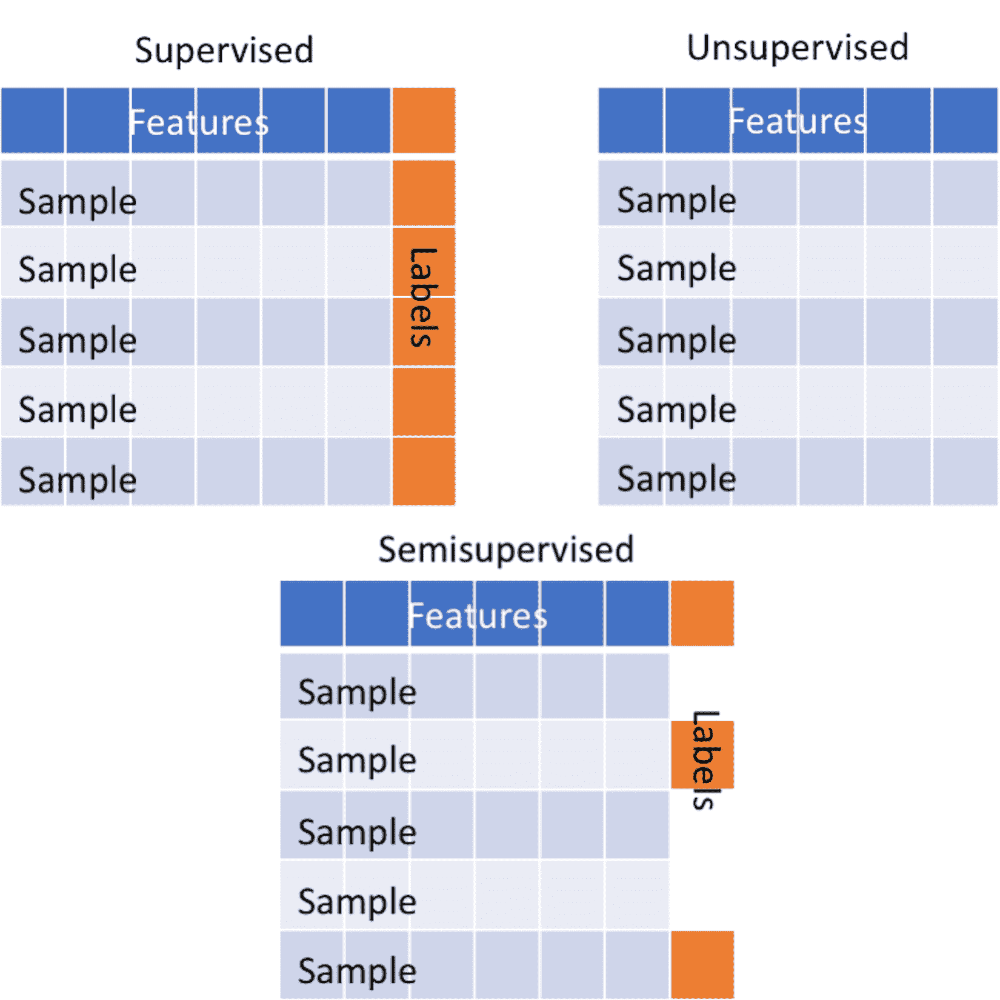
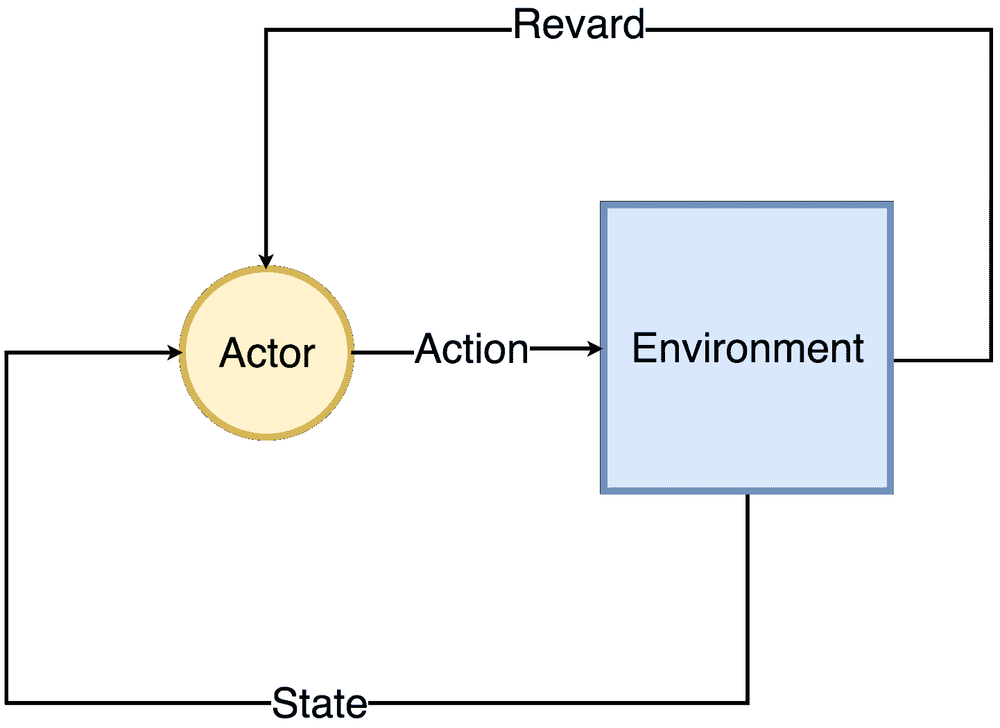
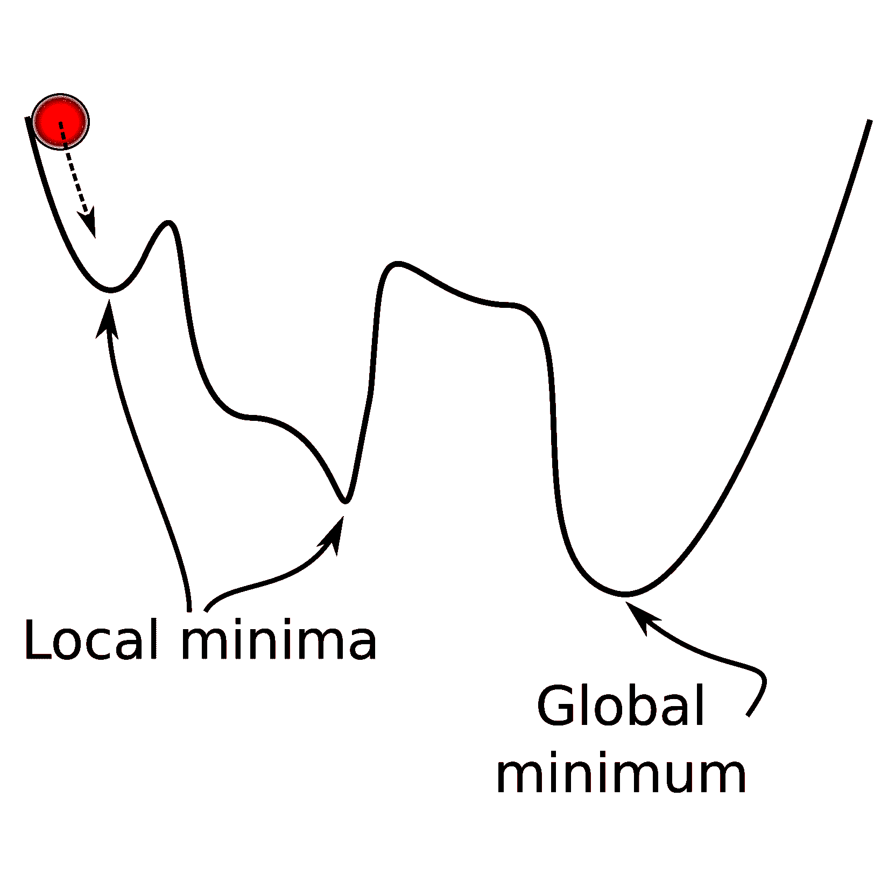

# 机器学习入门

我们生活在激动人心的时代。**人工智能** ( **AI** )和**机器学习** ( **ML** )从晦涩难懂的数学和科幻话题变成了大众文化的一部分。谷歌、脸书、微软和其他公司竞相成为第一个给予世界通用人工智能的公司。2015 年 11 月，谷歌通过 TensorFlow 开源了其 ML 框架，该框架适用于在超级计算机和智能手机上运行，自那以来赢得了广泛的社区。不久之后，其他大公司也纷纷效仿。2016 年最佳 iOS 应用(苹果选择)，病毒性照片编辑器 Prisma 将其成功完全归功于一种特殊的 ML 算法:**卷积神经网络** ( **CNN** )。这些系统早在 90 年代就被发明了，但直到 21 世纪初才开始流行。移动设备在 2014/2015 年才获得足够的计算能力来运行它们。事实上，人工神经网络对于实际应用变得如此重要，以至于在 iOS 10 中，苹果在 metal 和 accelerate 框架中添加了对它们的原生支持。苹果还向第三方开发者开放了 Siri，并推出了 GameplayKit，这是一个为你的电脑游戏添加人工智能功能的框架。在 iOS 11 中，苹果推出了 Core ML，这是一个在供应商的设备上运行预训练模型的框架，以及用于常见计算机视觉任务的 Vision framework。

开始学习 ML 的最佳时间是 10 年前。下一个最好的时间就是现在。

在本章中，我们将讨论以下主题:

*   理解 AI 和 ML 是什么
*   ML 的基本概念:模型、数据集和学习
*   ML 任务的类型
*   ML 项目生命周期
*   通用 ML 与移动 ML

# AI 是什么？

"我不能创造的东西，我不明白。"

–*理查德·费曼*

人工智能是一个关于建造智能机器的知识领域，不管你赋予智能这个词什么意思。研究人员中有两种不同的人工智能概念:强人工智能和弱人工智能。

强人工智能(Strong AI)，或称**人工通用智能** ( **AGI** )，是一种完全能够模仿人类水平智能的机器，包括意识、感觉和思维。据推测，它应该能够成功地将其智能应用于任何任务。这种类型的人工智能就像一个地平线——我们总是把它视为一个目标，但我们仍然不在那里，尽管我们努力奋斗。这里的重要角色扮演了**人工智能效应**:昨天被认为是强人工智能特征的事情今天被认为是理所当然和微不足道的。在六十年代，人们认为像下棋一样玩棋盘游戏是强 AI 的特征。今天，我们拥有超越最优秀的人类棋手的程序，但我们离强大的人工智能还很远。从 80 年代的角度来看，我们的 iPhones 可能是一个人工智能:你可以与它们交谈，它们可以在几秒钟内回答你的问题，并提供任何主题的信息。因此，将强人工智能作为一个遥远的目标，研究人员专注于手头的事情，并将它们称为**弱人工智能**:具有一些智能特征的系统，可以应用于一些狭窄的任务。这些任务包括自动推理、规划、创造力、与人类的交流、对周围世界的感知、机器人和情感模拟。我们将在本书中触及这些任务中的一些，但我们将主要关注 ML，因为这一人工智能领域近年来已经在移动平台上找到了许多实际应用。

# ML 背后的动机

先打个比方。学习一门不熟悉的语言有两种方法:

*   用心学习语言规则，使用教科书、字典等等。大学生一般都是这样的。
*   观察现场语言:通过与以英语为母语的人交流、读书和看电影。小孩子就是这么干的。

在这两种情况下，你在头脑中建立了语言模型，或者像有些人喜欢说的那样，发展了语感。

在第一种情况下，你试图建立一个基于规则的逻辑系统。在这种情况下，你会遇到许多问题:规则的例外，不同的方言，从其他语言借用，习语，等等。别人，而不是你，为你推导和描述了语言的规则和结构。

在第二种情况下，您可以从可用数据中推导出相同的规则。你甚至可能没有意识到这些规则的存在，而是逐渐调整自己适应隐藏的结构，了解规律。你用你那被称为**镜像神经元**的特殊脑细胞，试图模仿说母语的人。这种能力是经过数百万年进化磨练出来的。一段时间后，当面对错误的单词用法时，你只是觉得有些不对劲，但你不能立即说出具体是什么。

无论如何，下一步是在现实世界中应用生成的语言模型。结果可能不同。在第一种情况下，你每次找到丢失的连字符或逗号都会遇到困难，但也许能在出版社找到一份校对的工作。在第二种情况下，一切将取决于你接受培训的数据的质量、多样性和数量。想象一下，在纽约市中心有一个人通过莎士比亚学习英语。他能和周围的人正常交谈吗？

现在我们将把计算机放在我们例子中的人的位置上。在这种情况下，两种方法代表了两种编程技术。第一种对应于编写由条件、循环等组成的特定算法，程序员通过这些算法来表达规则和结构。第二个表示 ML，在这种情况下，计算机自己根据可用数据识别底层结构和规则。

这个类比比乍看起来更深刻。对于许多任务来说，由于现实世界的可变性，直接构建算法是不可能的。这可能需要该领域专家的工作，他们必须明确地描述所有的规则和边界情况。由此产生的模型可能是脆弱和僵硬的。另一方面，同样的任务可以通过让计算机自己从合理数量的数据中找出规则来解决。这种任务的一个例子是人脸识别。用传统的命令式算法和数据结构来形式化人脸识别几乎是不可能的。只是最近在 ML 的帮助下才成功解决了任务。

# ML 是什么？

人工智能是人工智能的一个子域，在过去的十年里已经取得了重大进展，并且仍然是一个热门的研究课题。它是一个知识分支，与构建算法有关，这些算法可以从数据中学习，并根据它们执行的任务来改进自己。ML 允许计算机推导出某项任务的算法，或者从数据中提取隐藏的模式。在不同的研究社区中，ML 有几个不同的名称:预测分析、数据挖掘、统计学习、模式识别等等。有人可能会说这些术语有一些细微的差别，但本质上，它们都有重叠，以至于可以互换使用。

缩写 ML 可能指 AI 领域之外的很多东西；比如有一个函数式编程语言就是这个名字。然而，这个缩写被广泛用于图书馆和会议的名称中，指的是 ML。在整本书中，我们也是这样使用它的。

ML 已经在我们身边无处不在。搜索引擎、定向广告、人脸和语音识别、推荐系统、垃圾邮件过滤、无人驾驶汽车、银行系统中的欺诈检测、信用评分、自动视频字幕和机器翻译——所有这些东西在没有 ML 的情况下都是无法想象的。

近年来，ML 的成功归功于几个因素:

*   不同形式的大量数据(大数据)
*   可获得的计算能力和专用硬件(云和 GPU)
*   开源和开放获取的兴起
*   算法进步

任何 ML 系统都包括三个基本组成部分:数据、模型和任务。数据是作为模型的输入提供的。模型是一种执行任务的数学函数或计算机程序。例如，您的电子邮件是数据，垃圾邮件过滤器是模型，区分垃圾邮件和非垃圾邮件是一项任务。ML 中的*学习*代表根据数据调整你的模型的过程，以便模型在它的任务中变得更好。这种设置的明显后果体现在统计学家们广为人知的智慧中<q>“你的模型和你的数据一样好”</q>。

# ML 的应用

在许多领域中，ML 是不可或缺的成分，其中一些是机器人学、生物信息学和推荐系统。虽然没有什么可以阻止您在 Swift 中为 macOS 或 Linux 编写生物信息软件，但我们将把本书中的实际例子限制在更适合移动设备的领域。出现这种情况的明显原因是，目前，iOS 仍然是大多数日常使用 Swift 的程序员的主要目标平台。

为了方便起见，我们将根据移动开发者最常处理的数据类型，将他们感兴趣的所有 ML 应用大致分为三个领域:

*   数字信号处理(传感器数据、音频)
*   计算机视觉(图像、视频)
*   自然语言处理(文本、语音)
*   其他应用和数据类型

# 数字信号处理(DSP)

此类别包括输入数据类型为信号、时间序列和音频的任务。数据的来源是传感器、健康工具包、麦克风、可穿戴设备(例如，Apple Watch 或脑机接口)和物联网设备。这里 ML 问题的例子包括:

*   用于活动识别的运动传感器数据分类
*   语音识别和合成
*   音乐识别和合成
*   生物信号(心电图、脑电图和手颤)分析

我们将在[第三章](2b7ead7c-0a64-4ab2-af65-8607707cf7c2.xhtml)、 *K 近邻分类器*中构建一个运动识别 app。

严格来说，图像处理也是 DSP 的一个子域但我们在这里不要过于细致。

# 计算机视觉

与图像和视频相关的一切都属于这一类。我们将在[第九章](b98ecc66-71f3-40da-aa70-6bb3e8101ccc.xhtml)、*卷积神经网络*中开发一些计算机视觉 app。计算机视觉任务的例子有:

*   **光学字符识别** ( **OCR** )和手写输入
*   人脸检测和识别
*   图像和视频字幕
*   图象分割法
*   三维场景重建
*   生成性艺术(艺术风格转移、深度梦境等等)

# 自然语言处理

NLP 是语言学、计算机科学和统计学交叉的一个知识分支。我们将在第十章、*自然语言处理*中讨论最常见的自然语言处理技术。NLP 的应用包括以下内容:

*   自动翻译、拼写、语法和风格纠正
*   情感分析
*   垃圾邮件检测/过滤
*   文档分类
*   聊天机器人和问答系统

# ML 的其他应用

您可以想出更多难以归类的应用。如果你有足够的数据，ML 可以在几乎任何数据上完成。一些特殊的数据类型有:

*   空间数据:GPS 位置([第四章](77d34cdb-fa68-42f9-a36c-7ef985bc146e.xhtml)， *K-Means* *聚类*)，UI 对象坐标，触摸
*   树状结构:文件夹和文件的层次结构
*   类似网络的数据:照片中人们在一起的次数，或者网页之间的超链接
*   应用日志和用户应用内活动数据([第五章](848b7d83-6d0a-46d3-a9b5-18caf49b4c74.xhtml)、*关联规则学习*)
*   系统数据:可用磁盘空间、电池电量等
*   调查结果

# 使用 ML 构建更智能的 iOS 应用

正如我们从新闻报道中所知，苹果使用 ML 进行欺诈检测，并从 beta 测试报告中挖掘有用的数据；然而，在我们的移动设备上看不到这些例子。你的 iPhone 本身的操作系统内置了一些 ML 模型，以及一些帮助执行各种任务的原生应用。一些用例是众所周知和突出的，而另一些是不明显的。最明显的例子是 Siri 语音识别、自然语言理解和语音生成。相机应用使用面部检测进行对焦，照片应用使用面部识别将同一个人的照片分组到一个相册中。在 2016 年 6 月展示新的 iOS 10 时，Craig Federighi 提到了它的预测键盘，它使用 LSTM 算法(一种循环神经网络)从上下文中建议下一个单词，以及 Photos 如何使用深度学习来识别物体和对场景进行分类。iOS 本身使用 ML 来延长电池寿命，提供上下文建议，将社交网络和邮件中的档案与通讯录中的记录进行匹配，并在互联网连接选项之间进行选择。在 Apple Watch 上，ML 模型被用来识别用户运动活动类型和手写输入。

在 iOS 10 之前，苹果提供了一些 ML APIs，如语音或动作识别，但只是作为黑盒，没有调整模型或将其重新用于其他目的的可能性。如果你想做一些稍微不同的事情，比如检测运动的类型(这不是苹果预先定义的)，你必须从头开始构建自己的模型。在 iOS 10 中，CNN 构建模块被同时添加到两个框架中:作为 Metal API 的一部分，以及作为 Accelerate 框架的子库。还有，第一个真正的 ML 算法被引入 iOS SDK:GameplayKit 中的决策树学习器。

随着 iOS 11 的发布，ML 功能继续扩展。在 2017 年 WWDC 上，苹果展示了核心 ML 框架。它包括用于运行预训练模型的 API，并附有用于将使用一些流行的 ML 框架训练的模型转换为苹果自己格式的工具。尽管如此，目前它还不提供在设备上训练模型的可能性，所以你的模型不能在运行时被改变或更新。

在 App Store 中搜索*人工智能*、*深度学习*、 *ML* 等类似的词汇，你会发现很多应用，其中一些相当成功。以下是几个例子:

*   Google Translate 在做语音识别和合成，OCR，手写识别，自动化翻译；有些是线下完成的，有些是线上完成的。
*   Duolingo 验证发音，推荐最佳学习材料，并使用聊天机器人进行语言学习。
*   Prisma，Artisto 和其他人使用神经艺术风格转移算法将照片变成绘画。Snapchat 和 Fabby 使用图像分割、对象跟踪和其他计算机视觉技术来增强自拍。也有自动给黑白照片上色的应用。
*   Snapchat 的视频自拍滤镜使用 ML 进行实时人脸跟踪和修改。
*   Aipoly Vision 帮助盲人，大声说出它通过摄像头看到的东西。
*   几个卡路里计数器应用通过摄像头识别食物。还有类似的 app 可以识别狗的品种、树和商标。
*   数十个人工智能个人助理和聊天机器人，具有从奶牛疾病诊断到配对和股票交易的不同能力。
*   预测键盘、拼写检查器和自动更正，例如快速键。
*   向用户学习的游戏和角色/单位不断进化的游戏。
*   也有新闻、邮件等适应用户使用 ML 的习惯和喜好的 app。
*   在 ML 的帮助下，脑机接口和健身可穿戴设备可以识别不同的用户条件，如注意力、睡眠阶段等。至少他们的一些补充手机 app 是做 ML 的。
*   通过移动医疗应用进行医疗诊断和监控。例如，OneRing 利用可穿戴设备的数据监测帕金森病。

所有这些应用都建立在大量的数据收集和处理之上。即使应用本身没有收集数据，它使用的模型也是在一些通常很大的数据集上训练的。在下一节中，我们将讨论 ML 应用中与数据相关的所有事情。

# 了解您的数据

多年来，研究人员一直在争论数据和算法哪个更重要。但现在，看起来数据的重要性超过了算法，这在 ML 专家中已被普遍接受。在大多数情况下，我们可以假设拥有更好数据的人通常会击败拥有更先进算法的人。垃圾进，垃圾出——这个规则在 ML 中比在其他任何地方都适用。要在这个领域取得成功，一个人不仅需要有数据，还需要了解自己的数据，知道用数据做什么。

最大似然数据集通常由单个观察值组成，称为样本、案例或数据点。在最简单的情况下，每个样本都有几个特征。

# 特征

当我们在 ML 的上下文中谈论特征时，我们的意思是我们正在研究的对象或现象的一些特征属性。

在一些出版物中，同一概念的其他名称有解释变量、独立变量和预测变量。

特征用于区分对象并测量它们之间的相似性。

例如:

*   如果我们感兴趣的对象是书籍，那么特征可以是标题、页数、作者姓名、出版年份、流派等等
*   如果感兴趣的对象是图像，特征可以是每个像素的强度
*   如果对象是博客文章，特征可以是语言、长度或某些术语的存在

将数据想象成电子表格是很有用的。在这种情况下，每个样本(数据点)就是一行，每个特征就是一列。例如，表 1.1 显示了一个很小的图书数据集，由四个样本组成，每个样本有八个特征。

表 1.1:一个 ML 数据集的例子(虚拟图书):

| **标题** | **作者姓名** | **页面** | **年** | **流派** | **普通读者评论得分** | **发布者** | **有货** |
| 21 天学会 ML | 机器学习者 | 354 | 2018 | 科幻小说 | 3.9 | 未命名的联合 | 错误的 |
| 在小行星撞击中幸存的 101 个技巧 | 恩里克操练 | 124 | 2021 | 自助 | 4.7 | 真空书 | 真实的 |
| 睡在键盘上 | 杰西卡的猫 | 458 | 2014 | 非虚构 | 3.5 | JhGJgh 公司 | 真实的 |
| 量子螺丝刀:遗产 | 耶森尼亚·普尔尼玛 | 1550 | 2018 | 科幻小说 | 4.2 | 真空书 | 真实的 |

# 特征的类型

在图书示例中，您可以看到几种类型的功能:

*   **分类或无序**:标题、作者、流派、出版商。它们类似于 Swift 中没有原始值的枚举，但有一点不同:它们有级别而不是案例。重要:你不能命令他们或说一个比另一个大。
*   **二元**:某物的存在或不存在，只是真或假。在我们的例子中，库存中的*是*的特征。
*   **实数**:页数，年份，平均读者评论分数。这些可以表示为 float 或 double。

还有其他的，但是这些是最常见的。

最常见的 ML 算法要求数据集由许多样本组成，其中每个样本由一个实数向量(特征向量)表示，并且所有样本具有相同数量的特征。将分类特征转换成实数的最简单(但不是最好的)方法是用数字代码代替它们(表 1.2)。

表 1.2:简单预处理后的虚拟图书数据集:

| **标题** | **作者姓名** | **页** | **年份** | **流派** | **普通读者评论评分** | **发布者** | **有货** |
| 0.0 | 0.0 | 354.0 | 2018.0 | 0.0 | 3.9 | 0.0 | 0.0 |
| 1.0 | 1.0 | 124.0 | 2021.0 | 1.0 | 4.7 | 1.0 | 1.0 |
| 2.0 | 2.0 | 458.0 | 2014.0 | 2.0 | 3.5 | 2.0 | 1.0 |
| 3.0 | 3.0 | 1550.0 | 2018.0 | 0.0 | 4.2 | 1.0 | 1.0 |

这是一个在将数据集输入 ML 算法之前，数据集的外观示例。稍后，我们将讨论特定应用的数据预处理的具体细节。

# 选择一组好的特性

出于 ML 的目的，有必要选择一组合理的特性，不要太多也不要太少:

*   如果特征太少，这些信息可能不足以使模型达到所需的质量。在这种情况下，您希望根据现有要素构建新要素，或者从原始数据中提取更多要素。
*   如果你有太多的特征，你想只选择最有信息和辨别能力的，因为你有越多的特征，你的计算就变得越复杂。

你如何判断哪些特性是最重要的？有时候常识会有帮助。例如，如果您正在构建一个为您推荐书籍的模型，那么这本书的流派和平均评级可能是比页数和出版年份更重要的特性。但是，如果你的特征只是一张图片的像素，而你正在建立一个人脸识别系统呢？对于大小为 1024 x 768 的黑白图像，我们会得到 786，432 个特征。哪些像素最重要？在这种情况下，你必须应用一些算法来提取有意义的特征。例如，在计算机视觉中，边缘、拐角和斑点是比原始像素更具信息量的特征，因此有大量算法来提取它们(*图 1.1* )。通过让你的图像通过一些过滤器，你可以去掉不重要的信息，显著减少特征的数量；从几十万到几百，甚至几十。帮助选择最重要特征子集的技术被称为**特征选择**，而**特征提取**技术导致新特征的创建:

图 1.1:边缘检测是计算机视觉中一种常见的特征提取技术。尽管右图中的物体包含的信息比左图中的少得多，但您仍然可以认出它。

特征提取、选择和组合是一种被称为**特征工程**的技术。这不仅需要黑客和统计技能，还需要领域知识。在接下来的章节中，我们将在实际应用中看到一些特征工程技术。我们还将步入令人兴奋的**深度学习**世界:一种让计算机能够从低级特征中提取高级抽象特征的技术。

每个样本的特征数量(或特征向量长度)通常被称为问题的**维度**。很多问题都是高维的，有几百个甚至几千个特征。更糟糕的是，其中一些问题很少出现；也就是说，对于每个数据点，大多数特征为零或缺失。这是推荐系统中常见的情况。例如，假设您正在构建电影评级数据集:行是电影，列是用户，在每个单元格中，您都有一个由电影用户给出的评级。表格中的大多数单元格将保持为空，因为大多数用户将永远不会观看大部分电影。相反的情况叫做**密集，**这是大部分值都到位的时候。自然语言处理和生物信息学中的很多问题都是高维的、稀疏的，或者两者兼有。

特征选择和提取有助于在不显著损失信息的情况下减少特征的数量，因此我们也称它们为**降维算法**。

# 获取数据集

数据集可以从不同的来源获得。对我们来说重要的是:

*   经典数据集，如 Iris(r . Fisher 在 1936 年编写的花卉植物学测量)、MNIST(1998 年发表的 60，000 个手写数字)、泰坦尼克号(泰坦尼克号乘客的个人信息，来自《泰坦尼克百科全书》和其他来源)等。许多经典数据集可以作为 Python 和 R ML 包的一部分获得。它们代表了一些经典类型的 ML 任务，对于算法演示非常有用。同时，Swift 没有类似的库。实现这样一个库很简单，对于任何想在 GitHub 上获得成功的人来说都是唾手可得的。
*   开放和商业数据集存储库。许多机构在不同的许可下根据每个人的需要发布他们的数据。您可以使用这些数据来训练生产模型或收集自己的数据集。

一些公共数据集存储库包括:

*   *   https://archive.ics.uci.edu/ml/datasets.html UCI ML 仓库:

    *   Kaggle 数据集:[https://www.kaggle.com/datasets](https://www.kaggle.com/datasets)

    *   数据集分享社交网络 data . world:[https://data . world](https://data.world)

要了解更多信息，请访问 KDnuggets 的知识库列表:[http://www.kdnuggets.com/datasets/index.html](http://www.kdnuggets.com/datasets/index.html)。或者，你会在维基百科找到一个数据集列表:[https://en . Wikipedia . org/wiki/List _ of _ datasets _ for _ machine _ learning _ research](https://en.wikipedia.org/wiki/List_of_datasets_for_machine_learning_research)。

*   **数据收集(采集)**如果现有数据无法帮助您解决问题，则需要收集数据。如果您必须临时收集数据，这种方法在资源和时间上都很昂贵；但是，在许多情况下，数据是一些其他过程的副产品，您可以通过从数据中提取有用的信息来组成数据集。例如，可以通过抓取维基百科或新闻网站来组成文本语料库。iOS 会自动收集一些有用的数据。HealthKit 是用户健康测量的统一数据库。核心运动允许获取用户运动活动的历史数据。ResearchKit 框架提供了评估用户健康状况的标准化例程。CareKit 框架使投票标准化。另外，在某些情况下，可以从 app 日志挖掘中获得有用的信息。
    *   在许多情况下，收集数据是不够的，因为原始数据并不适合许多 ML 任务。所以，数据收集之后的下一步就是数据标注。例如，您已经收集了图像的数据集，所以现在您必须为每个图像附加一个标签:该图像属于哪个类别？这可以手动(通常要花钱)、自动(有时不可能)或半自动完成。人工标注可以通过众包平台的方式进行规模化，比如亚马逊 Mechanical Turk。
*   随机**数据生成**可以用于快速检查你的想法，或者与 TDD 方法结合使用。此外，有时向真实数据中添加一些可控的随机性可以提高学习的结果。这种方法被称为**数据增强**。例如，这种方法被用来在谷歌翻译移动应用中构建光学字符识别功能。为了训练他们的模型，他们需要大量带有不同语言字母的真实世界照片，而他们没有这些照片。工程团队通过创建一个带有人工反射、污迹和各种腐败的大型字母数据集来绕过这个问题。这显著提高了识别质量。
*   **实时数据源**，如惯性传感器、GPS、摄像头、麦克风、仰角传感器、接近传感器、触摸屏、force touch 和 Apple Watch 传感器，可用于收集独立数据集或动态训练模型。

实时数据源对于称为**在线 ML** 的特殊类别的 ML 模型尤为重要，它允许模型嵌入新数据。这种情况的一个很好的例子是垃圾邮件过滤，其中模型应该动态地适应新数据。这与批量学习相反，在批量学习中，整个训练数据集应该从一开始就可用。

# 数据预处理

数据中的有用信息通常被称为**信号**。另一方面，代表不同种类的误差和不相关数据的数据片段被称为**噪声**。在测量、信息传输过程中，或者由于人为错误，数据中可能会出现错误。数据清理程序的目标是提高信噪比。在这一阶段，您通常会将所有数据转换为一种格式，删除带有缺失值的条目，并检查可疑的异常值(它们可能是噪声也可能是信号)。ML 工程师普遍认为，数据预处理阶段通常会占用 ML 项目 90%的时间。然后，算法调整又消耗了 90%的时间。这种说法只是部分(大概 10%左右)是笑话。在第 13 章、*最佳实践*中，我们将讨论数据的常见问题以及如何修复它们。

# 选择模型

假设您已经定义了一个任务，并且有一个数据集。下一步是什么？现在，您需要选择一个模型，并在数据集上训练它来执行该任务。

模型是 ML 的核心概念。ML 基本上是一门使用数据建立真实世界模型的科学。术语*模型*指的是被建模的现象，而*地图*指的是真实的地域。根据情况的不同，它可以扮演一个很好的近似，一个过时的描述(在快速变化的环境中)，甚至是自我实现的预言(如果模型影响了建模的对象)。<q>“所有的模型都是错的，但有些是有用的”</q>是统计学中一句众所周知的谚语。

# ML 算法的类型

ML 模型/算法通常根据输入类型分为三组:

*   监督学习
*   无监督学习
*   强化学习

这种划分是相当模糊的，因为一些算法属于这两类，而另一些则不属于任何一类。还有一些中间状态，比如半监督学习。

这三组中的算法可以执行不同的任务，因此可以根据模型的输出分成子组。*表 1.3* 显示了最常见的 ML 任务及其分类。

# 监督学习

监督学习可以说是最常见和最容易理解的 ML 类型。所有的监督学习算法都有一个共同的前提:你应该有一个带标签的数据集来训练它们。这里，数据集是一组样本，加上每个样本的预期输出(标签)。这些标签在培训过程中扮演监督者的角色。

在不同的出版物中，你会看到标签的不同同义词，包括因变量、预测变量和解释变量。

监督学习的目标是得到一个函数，对于每个给定的输入返回一个期望的输出。在最简化的版本中，监督学习过程包括两个阶段:训练和推理。在第一阶段，您使用已标记的数据集来训练模型。在第二阶段，你用你的模型做一些有用的事情，比如做预测。例如，给定一组标记的图像(数据集)，可以训练神经网络(模型)来预测(推断)先前未看到的图像的正确标签。

使用监督学习，你通常会解决两个问题之一:分类或回归。区别在于标签的类型:第一种是分类的，第二种是实数。

分类意味着简单地从预定义的集合中分配一个标签。二元分类是一种特殊的分类，当你只有两个标签(阳性和阴性)时。分类任务的一个例子是给信件分配*垃圾邮件* / *非垃圾邮件*标签。我们将在下一章训练我们的第一个分类器，在本书中，我们将为许多现实世界的任务应用不同的分类器。

回归是将一个实数分配给一个给定案例的任务。例如，在给定员工特征的情况下预测工资。我们将在第[章](734779ff-f5d8-4ef7-aeec-7cd14e652148.xhtml) 6、*线性回归和梯度下降*和[第 7 章](008b17c3-cc77-41b8-b879-3dc0456af2cb.xhtml)、*线性分类器和逻辑回归*中更详细地讨论回归。

如果任务是以某种顺序对对象进行排序(输出一个排列，称之为组合)，并且标签不是真正的实数，而是对象的顺序，排序学习就在眼前。当你打开 iOS 上的 Siri 建议菜单时，你会看到排名算法在起作用。列表中的每个应用都是根据它与你的相关性排列的。

如果标签是复杂的对象，如图形或树，分类或回归都没有用。结构化预测算法是解决这些问题的算法类型。将英语句子解析成句法树就是这种任务的一个例子。

排名和结构化学习超出了本书的范围，因为它们的用例不像分类或回归那样常见，但至少现在你知道在需要的时候谷歌搜索什么了。

# 无监督学习

在无监督学习中，您没有数据集中案例的标签。用无监督学习解决的任务类型有:聚类、异常检测、维数减少和关联规则学习。

有时，您没有数据点的标签，但您仍然希望以某种有意义的方式对它们进行分组。你可能知道也可能不知道确切的组数。这是使用聚类算法的设置。最明显的例子是将用户分成一些组，比如学生、家长、游戏玩家等等。这里重要的细节是，一个组的意义不是从一开始就预先定义的；只有在完成样品分组后才能命名。聚类还可以用于从数据中提取附加特征，作为监督学习的初步步骤。我们将在[第四章](77d34cdb-fa68-42f9-a36c-7ef985bc146e.xhtml)、*中讨论聚类*。

**异常值** / **异常检测**算法在目标是发现数据中的一些异常模式、异常数据点时使用。这对于自动欺诈或入侵检测尤其有用。离群点分析也是数据清理的一个重要细节。

**降维**是一种从数据中提取最有用信息的方法，同时也是一种简洁的表示方法。目标是在不丢失重要信息的情况下减少一些要素。它可以用作监督学习或数据可视化之前的预处理步骤。

**关联规则学习**寻找用户行为的重复模式和项目的特殊共现。零售实践中的一个例子:如果一个顾客买了牛奶，他不是更有可能也会买麦片吗？如果是的话，那么也许最好移动货架，把麦片放在离牛奶货架更近的地方。有了这样的规则，企业主可以做出明智的决定，并根据客户的需求调整他们的服务。在软件开发的背景下，这可以实现预期设计——当应用似乎知道你下一步想做什么，并相应地提供建议。在第五章、*的[中，关联规则学习](848b7d83-6d0a-46d3-a9b5-18caf49b4c74.xhtml)*我们将先验地实现一个最著名的规则学习算法:

图 1.2:三种学习类型的数据集:有监督的、无监督的和半监督的

手动标记数据通常是一件成本很高的事情，尤其是在需要特殊鉴定的情况下。当只有部分样本被标记而其他样本未被标记时，半监督学习会有所帮助(见下图)。它是监督学习和非监督学习的混合。首先，它寻找未标记的实例，以无监督的方式类似于已标记的实例，并将它们包含在训练数据集中。在这之后，可以以典型的监督方式在这个扩展的数据集上训练算法。

# 强化学习

强化学习的特殊之处在于它不需要数据集(见下图)。相反，它涉及一个采取行动的主体，改变环境的状态。每走一步，它都会得到奖励或惩罚，这取决于状态和之前的行为。目标是获得最大的累积奖励。它可以用来教电脑玩视频游戏或驾驶汽车。如果你想想，强化学习是我们的宠物训练我们人类的方式:通过摇尾巴奖励我们的行为，或者用刮花的家具惩罚我们。

强化学习的中心话题之一是探索-利用困境——如何在探索新选项和使用已知内容之间找到良好的平衡:

图 1.3:强化学习过程

表 1.3: ML 任务:

| **任务** | **输出类型** | **问题例题** | **算法** |
| **监督学习** |
| 回归 | 实数 | 预测房价，鉴于其特点 | 线性回归和多项式回归 |
| 分类 | 绝对的 | 垃圾邮件/非垃圾邮件分类 | KNN、朴素贝叶斯、逻辑回归、决策树、随机森林和 SVM |
| 等级 | 自然数(序数变量) | 按相关性对搜索结果排序 | 有序回归 |
| 结构化预测 | 结构:树、图等等 | 词性标注 | 循环神经网络和条件随机场 |
| **无监督学习** |
| 使聚集 | 对象组 | 建立一个生命有机体之树 | 层次聚类，*k*-表示和 GMM |
| 降维 | 给定特征的紧凑表示 | 找到大脑活动中最重要的部分 | PCA、t-SNE 和 LDA |
| 异常值/异常检测 | 不符合模式的对象 | 欺诈检测 | 局部异常因素 |
| 关联规则学习 | 规则组 | 智能家居入侵检测 | 推理的 |
| **强化学习** |
| 控制学习 | 具有最大期望回报的政策 | 学习玩电子游戏 | q 学习 |

# 数学优化——学习是如何进行的

学习过程背后的魔力是由一个叫做**数学优化**的数学分支传递的。有时，被称为数学规划也有些误导；这个术语远在广泛的计算机编程之前就被创造出来了，与计算机编程没有直接关系。最优化是在可利用的选择中选择最佳选项的科学；比如选择最好的 ML 模型。

从数学上讲，ML 模型是函数。作为一名工程师，您根据自己的喜好选择函数族:线性模型、树、神经网络、支持向量机等等。学习是从家庭中挑选最适合你目标的功能的过程。最佳模型的概念通常由另一个函数定义，即**损失函数**。它根据一些标准估计模型的良好程度；例如，模型与数据的吻合程度，模型的复杂程度，等等。你可以把损失函数想象成竞赛中的裁判，他的职责是评估模型。学习的目标是找到这样一个模型，该模型提供损失函数的最小值(最小化损失)，因此整个学习过程在数学上被形式化为函数最小化的任务。

函数最小值可以用两种方法找到:解析方法(微积分)或数值方法(迭代法)。在 ML 中，我们经常进行数值优化，因为损失函数对于解析解来说太复杂了。

一个很好的关于数值优化的互动教程可以在这里找到:【http://www.benfrederickson.com/numerical-optimization/[。](http://www.benfrederickson.com/numerical-optimization/)

从程序员的角度来看，学习是一个调整模型参数直到找到最优解的迭代过程。实际上，经过多次迭代后，算法停止改进，因为它陷入局部最优或已达到全局最优(见下图)。如果算法总是找到局部或全局最优，我们说它*收敛*。另一方面，如果你看到你的算法越来越摇摆不定，永远不会接近一个有用的结果，它就会偏离:

图 1.4:学习者在复杂表面上表现为一个球:他可能会陷入局部极小值，永远不会到达全局极小值

# 移动与服务器端 ML

大多数 Swift 开发者正在为 iOS 编写他们的应用。我们当中那些为 macOS 或服务器端开发 Swift 应用的人在 ML 方面处于一个幸运的位置。他们可以使用任何他们想要的库和工具，依靠强大的硬件和与可解释语言的兼容性。大多数 ML 库和框架在开发时都考虑到了服务器端(或者至少是强大的桌面)。在本书中，我们主要讨论 iOS 应用，因此大多数实际例子都考虑了手持设备的局限性。

但是如果移动设备的能力有限，我们可以在服务器端完成所有的 ML，不是吗？为什么有人会费心在移动设备上做 ML 呢？客户端-服务器架构至少有三个问题:

*   客户端应用只有在连接到互联网时才能充分发挥作用。在发达国家，这可能不是一个大问题，但这会极大地限制你的目标受众。想象一下你的翻译软件在国外旅行时无法使用。
*   向服务器发送数据并获得响应会带来额外的时间延迟。当你的数据被上传、处理和再次下载时，谁喜欢看进度条，或者更糟，看无限旋转器？如果您需要立即获得这些结果，并且不消耗您的互联网流量，该怎么办？客户-服务器体系结构使得诸如实时视频和音频处理这样的 ML 应用几乎是不可能的。
*   隐私问题:你上传到网上的任何数据都不再是你的了。在全面监控的时代，你怎么知道你今天上传到云端的那些有趣的自拍明天不会被用来训练人脸识别，或者用于一些有趣目的的目标跟踪算法，比如杀手无人机？许多用户不喜欢他们的个人信息被上传到一些服务器上，并可能被分享/出售/泄露给一些第三方。苹果还主张尽可能减少数据收集。

有些应用可能存在这些限制，但大多数开发人员希望他们的应用始终响应迅速、安全且有用。这是只有在设备上的 ML 才能提供的。

对我来说，最重要的论点是我们可以在没有服务器端的情况下进行 ML。硬件能力每年都在增加，移动设备上的 ML 是一个热门的研究领域。现代移动设备对于许多 ML 算法来说已经足够强大。如今，智能手机是最个性化的设备，也可以说是最重要的设备，因为它们无处不在。编写 ML 代码既有趣又酷，为什么要让服务器端开发人员独享乐趣呢？

当在移动端实现 ML 时，你得到的额外奖励是免费的计算能力(你不用支付电费)和独特的营销点(我们的应用将人工智能的力量放在你的口袋里)。

# 了解移动平台的局限性

现在，如果我已经说服你在移动设备上使用 ML，你应该意识到一些限制:

*   计算复杂性限制。CPU 负载越多，电池就死得越快。在一些 ML 算法的帮助下，很容易将你的 iPhone 改造成一个紧凑的加热器。
*   有些模型需要很长时间来训练。在服务器上，你可以让你的神经网络训练几个星期；但是在移动设备上，即使几分钟也太长了。iOS 应用可以在后台模式下运行和处理一些数据，如果他们有一些好的理由，比如播放音乐。不幸的是，ML 不在好的原因列表中，所以最有可能的是，您将无法在后台模式下运行它。
*   有些模型需要很长时间运行。你应该考虑每秒帧数和良好的用户体验。
*   内存限制。一些模型在训练过程中增长，而其他模型保持固定大小。
*   模型尺寸限制。一些训练好的模型可能需要几百兆甚至几十亿字节。但是如果你的应用如此庞大，谁愿意从应用商店下载呢？
*   本地存储的数据大多限于不同类型的用户个人数据，这意味着您将无法聚合不同用户的数据并在移动设备上执行大规模的 ML。
*   许多开源 ML 库构建在可解释语言之上，如 Python、R 和 MATLAB，或者 JVM 之上，这使得它们与 iOS 不兼容。

这些只是最明显的挑战。当我们开始开发真正的 ML 应用时，你会看到更多。不过不用担心，有办法把这头大象一块一块吃掉。花费在 it 上的努力得到了巨大的用户体验和用户的喜爱。平台限制并不是移动设备独有的。自主设备(如无人机)的开发者、物联网开发者、可穿戴设备开发者以及许多其他人都面临着同样的问题，并成功应对了这些问题。

通过在功能强大的硬件上训练模型，然后将它们部署到移动设备上，可以解决其中的许多问题。你也可以选择两种型号的折中方案:一个较小的在设备上用于离线工作，一个较大的在服务器上。对于离线工作，您可以选择具有快速推理的模型，然后对它们进行压缩和优化，以便并行执行；比如在 GPU 上。我们将在第 12 章、*为移动设备优化神经网络*中详细讨论这一点。

# 摘要

在这一章中，我们学习了 ML 的主要概念。

我们讨论了人工智能的不同定义和子域，包括 ML。ML 是从数据中提取知识的科学和实践。我们也解释了 ML 背后的动机。我们简要概述了它的应用领域:数字信号处理、计算机视觉和自然语言处理。

我们学习了 ML 中的两个核心概念:数据和模型。你的模型和你的数据一样好。典型的 ML 数据集由样本组成；每个样本都由特征组成。有许多类型的特征和许多从特征中提取有用信息的技术。这些技术被称为特征工程。对于监督学习任务，数据集还包括每个样本的标签。我们概述了数据收集和预处理。

最后，我们学习了三种常见的 ML 任务:监督、非监督和强化学习。在下一章，我们将构建我们的第一个 ML 应用。

# 文献学

1.  good o .(2015 . 7 . 29)，*Google Translate 如何将深度学习挤到手机上*，检索自 Google Research 博客:[https://Research . Google Blog . com/2015/07/How-Google-Translate-squeezes-deep . html](https://research.googleblog.com/2015/07/how-google-translate-squeezes-deep.html)