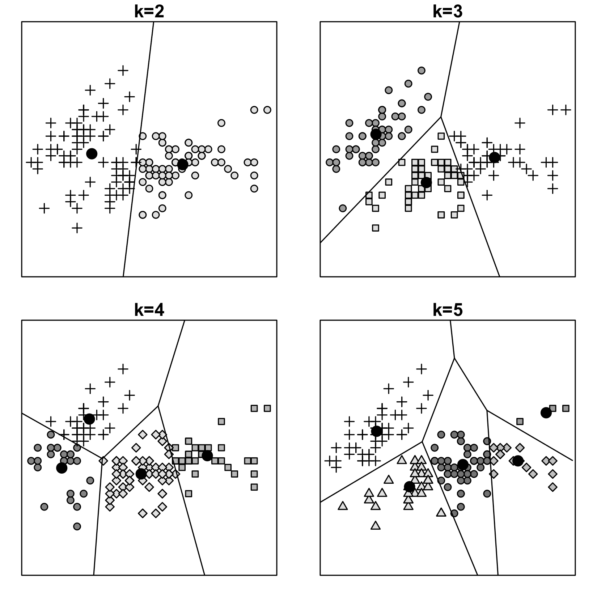
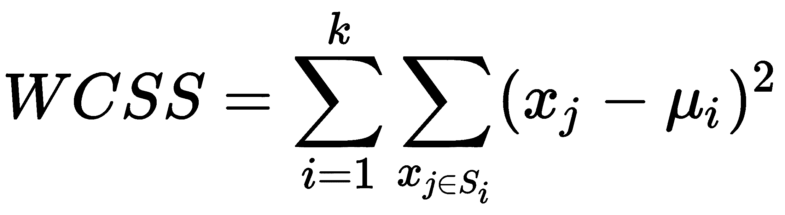
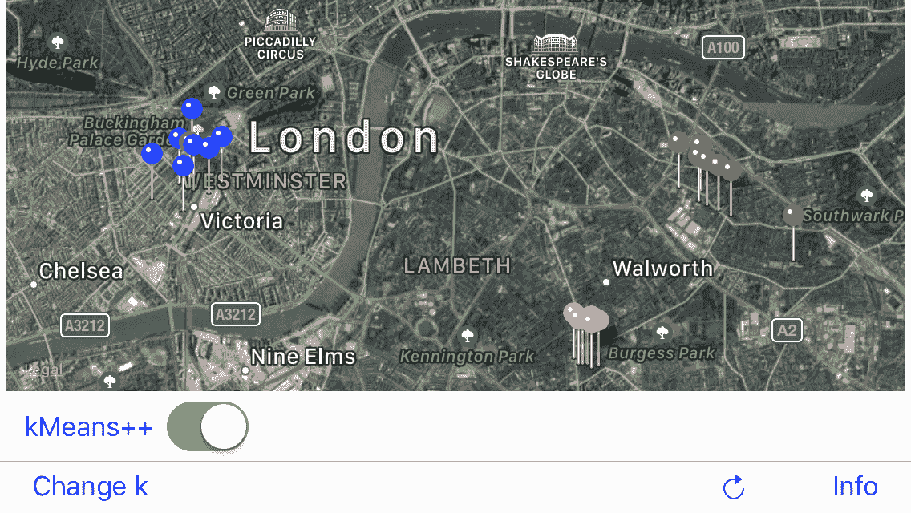
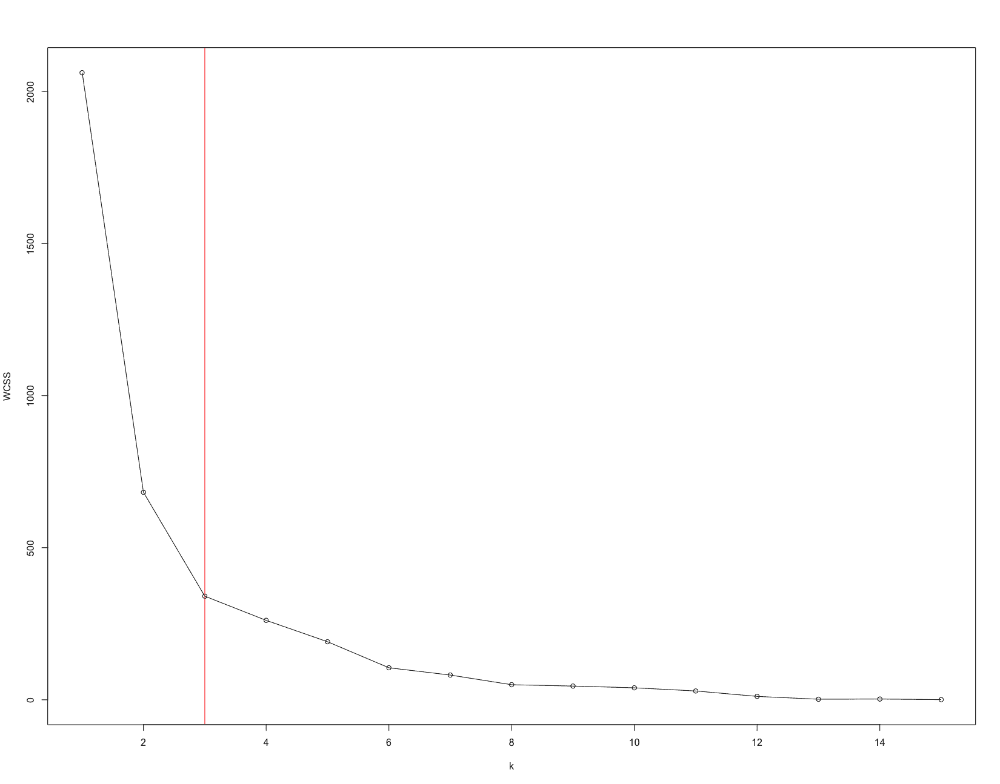
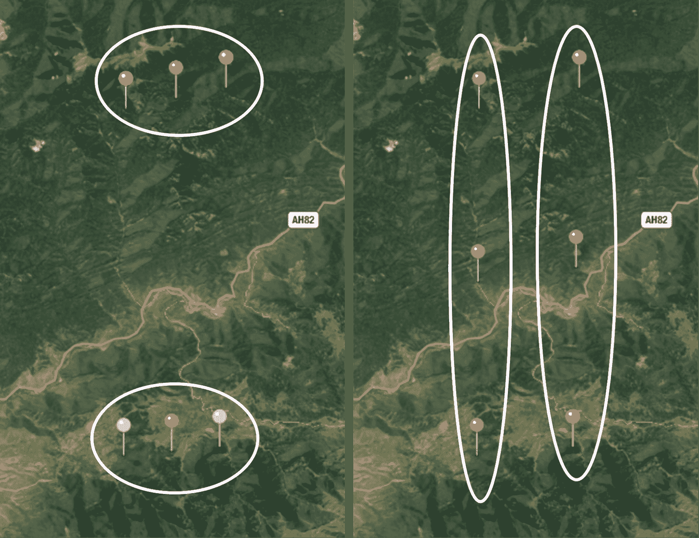
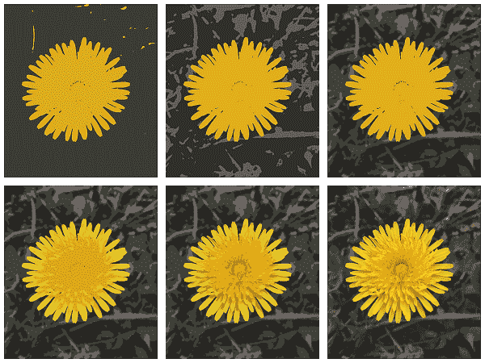

# 四、K 均值聚类

在这一章中，我们将把注意力从监督学习转移到非监督学习。我们将在本章中讨论和实现的算法是 k-means 和 k-means++聚类。

在本章中，我们将讨论以下主题:

*   基于实例的 k-均值聚类算法
*   k-means 的缺点以及如何用 k-means++修正它们
*   哪里可以用 k-means，哪里不应该用
*   聚类在信号量化中的应用
*   如何选择聚类数


# 无监督学习

无监督学习是一种使数据中隐藏的模式可见的方法:

*   聚类查找相似对象的组或层次
*   无监督异常检测发现异常值(奇怪的样本)
*   降维可以发现哪些数据细节是最重要的
*   因子分析揭示了影响观察变量行为的潜在变量
*   规则挖掘发现数据中不同实体之间的关联

通常，这些任务经常重叠，许多实际问题存在于有监督和无监督学习之间的中间地带。

我们将在这一章关注聚类，在下一章关注规则挖掘。其他的大部分都超出了本书的范围，但是在第十章、*自然语言处理*中，我们还是会简要讨论一下自编码器；它们可用于降维和异常检测。

以下是一些真实任务的示例，在这些任务中，集群是您的首选工具:

*   根据所描绘的人的身份对脸部照片进行聚类
*   使用客户交易数据库(市场细分)寻找目标广告的客户群
*   有了一组文本文档，根据作者的个人风格(风格学)(作者归属)或根据主题(主题建模)将它们分类到一个文件夹中
*   具有亲缘关系的 DNA 标记，构建系统发育或家族树(等级聚类；在这种情况下集群是嵌套的)

请注意，只有在没有预先定义组/类别/集群的情况下，这些才是集群任务。一旦有了预定义的对象类别，使用分类算法会更好。

在移动开发环境中，哪里需要集群？在地图上聚集图钉可能看起来是最自然的想法。有了用户位置的聚类，你可以猜测他的重要位置的位置，比如房子和工作场所。我们将从这里开始，稍后讨论更复杂的集群应用。现在，我们将专注于经典的聚类算法: *k* -means。


# K 均值聚类

这种算法的名称来自于样本被划分成的 *k* 个聚类，以及每个聚类围绕某个平均值分组的事实，即聚类的**质心**。这个质心作为一个类的原型。每个数据点属于质心最近的聚类。

该算法是 1957 年在贝尔实验室发明的。

在该算法中，每个数据点只属于一个聚类。作为该算法的结果，我们将特征空间划分为 Voronoi 单元。

由于其名称中的 *k* ，该算法经常与 KNN 算法混淆，但是正如我们已经看到的 *k* 折叠交叉验证，并不是所有的 *k* 都是相同的。你可能会奇怪，为什么机器学习的人对这个字母如此着迷，以至于把它放在每个算法的名字里。我现在不知道。



图 4.1:使用 *k* -means 算法对相同数据进行聚类的四种不同方法。光秃秃的黑点是星团的质心。样本来自经典的虹膜数据集，绘制了花瓣长度与花瓣宽度的关系。

让我们更正式地定义算法的目标。如果 *n* 是你的数据点(样本，表示为长度为 *d* 的实向量)的数量，那么 k-means 算法将它们分成 *k* 个集合(聚类， *k* < *n* )，这样在每个聚类内，从点到中心的距离之和(平均值)最小。换句话说，该算法的目标是找到一组具有最小 WCSS 的聚类:



其中:

*   *k* 是一组数
*   *S* [*i*] 簇， *i* =1，2，...， *k* ，
*   *x[j]是样本(向量)，*
*   *μ [i]*

开始时，我们通常随机初始化质心，或者用数据集中一些随机样本的值初始化质心。算法是迭代的，每次迭代包括两个步骤:

1.  计算每个簇的质心
2.  根据最近的质心将样本重新分配给聚类

当经过一些迭代后，质心的坐标没有改变(达到收敛)或经过一些预定义的步骤后，算法结束。


# 在 Swift 中实施 k-means

类似于上一章的 KNN，我们将有一个结构来表示一个算法并保存它的所有超参数:

```
struct KMeans { 
  public let k: Int 
```

标准 k-means 算法被设计为仅用于欧几里德距离:

```
internal let distanceMetric = Euclidean.distance 
```

我们需要几个数组在集群期间存储不同种类的数据。

样品储存:

```
internal var data: [[Double]] = [] 
```

质心坐标:

```
public var centroids: [[Double]] = [] 
```

将每个样本与其分类相匹配的数组。它应该与数据的长度相同，并且对于每个样本，它在`centroids`数组中存储一个质心索引:

```
private(set) var clusters: [Int] = [] 
```

**类内平方和**是一个我们稍后将用来评估结果质量的指标:

```
internal var WCSS: Double = 0.0 
```

目前，我们在初始化时传递的唯一参数是集群的数量:

```
public init (k: Int) { 
  self.k = k 
}
} 
```

与 KNN 不同，k-means 的接口只有一个方法:`train(data:)`，返回聚类的结果，每个样本所属的聚类的索引:

```
public mutating func train(data: [[Double]]) -> [Int] { 
```

在开始实际计算之前，有几个不可避免的仪式要进行。

数据点计数应大于或等于`k`，样本数(`n`)应大于零:

```
let n = data.count     
precondition(k <= n) 
precondition(n > 0) 
```

计算样本的维数(每个样本中的特征数)并检查其是否大于零:

```
let d = data.first!.count 
precondition(d > 0) 
```

如果一切正常，存储数据:

```
self.data = data 
```

如果聚类的数量等于数据点的数量，那么我们可以为每个数据点创建一个聚类，并返回结果:

```
if k == n { 
  centroids = data 
  clusters = Array<Int>(0..<k) 
  return clusters 
} 
```

用零填充`clusters`数组:

```
clusters = [Int](repeating: 0, count: n) 
```

k-means 的重要细节是质心的初始选择。取决于初始化步骤，算法的结果可能显著不同。现在我们不要过多考虑它，继续进行随机初始化:

```
chooseCentroidsAtRandom() // The function body will be described later. 
```

该算法的主要部分是 while 循环，当满足收敛条件时，该循环中断:

```
while true { 
```

在这些循环中，算法由两个步骤组成:更新步骤和分配步骤。

**类内平方和** ( **WCSS)** 是 k-means 的重要性能度量。我们在每次迭代开始时将它设置为零，并且当它每次都改变时，我们更新聚类质心:

```
WCSS = 0.0 
```


# 更新步骤

在初始选择质心之后，我们需要迭代数据点，并根据到最近质心的距离更新关于聚类分配的信息:

```
for (pointIndex, point) in data.enumerated() { 
  var minDistance = Double.infinity 
  for (clusterID, centroid) in centroids.enumerated() { 
    let distance = pow(distanceMetric(point, centroid), 2) 
```

如果新计算的距离小于先前保存的相应数据点的最小距离，请记住该距离:

```
    if minDistance > distance { 
      clusters[pointIndex] = clusterID 
      minDistance = distance 
    } 
  } 
```

保存有关 WCSS 的信息以备将来使用:

```
  WCSS += minDistance 
} 
```


# 分配步骤

计算簇的新质心:

```
var centroidsCount = [Double](repeating: 0.0, count: k) 
let rowStub = [Double](repeating: 0.0, count: d) 
var centroidsCumulative = [[Double]](repeating: rowStub, count: k) 

for (point, clusterID) in zip(data, clusters) { 
  centroidsCount[clusterID] += 1 
  centroidsCumulative[clusterID] = vecAdd(centroidsCumulative[clusterID], point) 
} 

var newCentroids = centroidsCumulative 
for (j, row) in centroidsCumulative.enumerated() { 
  for (i, element) in row.enumerated() { 
    let new = element/centroidsCount[j] 
    assert(!new.isNaN) 
    newCentroids[j][i] = new 
  } 
} 
```

在这之后，我们必须检查新的质心是否与先前计算的不同。如果它们不同，我们执行另一次优化迭代，如果不是，我们已经达到收敛并可以打破循环:

```
var convergence = false 
convergence = zip(centroids, newCentroids).map{$0.0 == $0.1}.reduce(true, and)  
// and(_: Bool, _:Bool) was added for convenience 
if convergence { break } 
centroids = newCentroids 
} 

return clusters 
} 
```

还记得吗，我们已经跳过了集群质心的初始化实现？所以，事情是这样的:

```
internal mutating func chooseCentroidsAtRandom() { 
  let uniformWeights = [Double](repeating: 1.0, count: data.count) 
  let randomIndexesNoReplacement = Random.Weighted.indicesNoReplace(weights:uniformWeights, count: k) 

  var centroidID = 0 
  for index in randomIndexesNoReplacement { 
    centroids.append(data[index]) 
    clusters[index] = centroidID 
    centroidID += 1 
  } 
} 
```

这个`Random.Weighted.indicesNoReplace(weights:uniformWeights, count: k)`看起来很神秘，但它只是一个从数组中用预定义的权重进行随机采样的实用函数。它不进行替换采样，并返回一个索引数组。在这种情况下，所有权重都相等，因此每个元素被采样的概率相等。稍后，我们将对此进行更改，以提高聚类质量和收敛速度。我从 R 标准库中移植了这个函数。


# 对地图上的对象进行聚类

在移动开发的背景下，哪里可以应用 k-means？在地图上聚集图钉可能看起来是最自然的想法。有了用户位置的聚类，您就可以猜测用户的重要位置，例如家和工作场所。我们将实现 pin 聚类来可视化 k-means，它的一些不幸的属性，并展示为什么这样的应用可能不是最好的主意。

在补充代码的`4_kmeans/MapKMeans`文件夹下可以找到一个演示应用。一切有趣的事情都发生在`ViewController.swift`。聚类发生在`clusterize()`方法中:

```
func clusterize() { 
  let k = Settings.k 
  colors = (0..<k).map{_ in Random.Uniform.randomColor()} 
  let data = savedAnnotations.map{ [Double]($0.coordinate) } 
  var kMeans = KMeans(k: k) 
  clusters = kMeans.train(data: data) 
  centroidAnnotations = kMeans.centroids 
    .map { CLLocationCoordinate2D(latitude: $0[0], longitude: $0[1]) } 
    .map { coordinate in 
      let annotation = MKPointAnnotation() 
      annotation.coordinate = coordinate 
      annotation.title = "(coordinate)" 
      return annotation 
    } 
} 
```

`CLLocationCoordinate2D`通过以下方式转换为`Double`:

```
extension Array where Element == Double { 
  init(_ coordinates: CLLocationCoordinate2D) { 
    self.init(arrayLiteral: Double(coordinates.latitude), Double(coordinates.longitude)) 
  } 
} 
```

该应用显示地图，你可以通过点击它放入任意多的大头针。尝试形成几个集群，并通过多次按下圆形箭头按钮来运行算法。注意，算法的结果通常是不稳定的:它每次都能给出不同的结果。检查当您选择其他数量的分类时，结果有何不同。



图 4.2:演示应用工作的结果。结合照片库元数据中的位置，您可以猜测用户在哪里生活、工作和度过空闲时间。

现在来谈谈对地理空间数据使用 k-means 的问题。你可能会注意到，看起来算法对待水平和垂直空间是不平等的。那是因为经度的一度总是大约 111 公里，但是纬度的一度有不同的长度，这取决于你离赤道有多远。基本上，你不应该使用地理坐标作为欧几里德距离的特征。更重要的是，如果你把一些点放在阿拉斯加和俄罗斯的边界上，你会发现 KNN 把俄罗斯的点和靠近阿拉斯加的点区别对待。这是由于 180°子午线。基本上，我们可以说使用 k-means 进行 pin 聚类是一个错误。它可以在相对较小的规模上发挥作用。例如，它可以在城市范围内运行良好。只是不要用在世界地图比例尺上。地图是典型的 k-means 问题演示的理想选择。

但是等等。切，难道我们不能用其他的距离度量来代替欧几里得距离吗，就像我们在前一章对 KNN 所做的那样？不，不幸的是这次没有。严格来说，k-means 不是一个基于距离的算法。该算法的目标是最小化组内方差(或平方误差)。方差公式恰好与欧几里得距离公式相同。这使得无法插入到您的自定义距离度量中，因为算法可能会停止收敛。对于 pin 聚类，最好选择一些其他的算法，对于 k-means 最好选择一些其他的应用，我们确实会这样做。但首先，让我们讨论一些在我们第一次实验后变得明显的问题:

*   [https://data science . stack exchange . com/questions/761/clustering-geo-location-coordinates-lat-long-pairs](https://datascience.stackexchange.com/questions/761/clustering-geo-location-coordinates-lat-long-pairs)
*   [https://stats . stack exchange . com/questions/81481/why-k-means-clustering-algorithm-use-only-euclidean-distance-metric](https://stats.stackexchange.com/questions/81481/why-does-k-means-clustering-algorithm-use-only-euclidean-distance-metric)


# 选择聚类的数量

如果你事先不知道你有多少个集群，那么你如何选择最优的 *k* ？这本质上是一个先有蛋还是先有鸡的问题。几种方法是流行的，我们将讨论其中的一种:肘方法。

你还记得我们在 k-means 的每次迭代中计算的那些神秘的 WCSS 吗？这个度量告诉我们每个聚类中有多少点与它们的质心不同。我们可以计算几个不同的 k 值，并画出结果。它通常看起来有点类似于下图中的曲线:



图 4.3: WCSS 相对于集群数量的曲线

这个图应该让你想起第三章、*K-最近邻分类器*中类似的损失函数图。它显示了我们的模型与数据的吻合程度。肘方法的思想是选择 *k* 值，在此之后结果不会再有明显的改善。名字来源于剧情与手臂的相似性。我们选择肘部的点，在图上用红线标出。

有关更多信息，请参考以下链接:

*   [https://en . Wikipedia . org/wiki/Determining _ the _ number _ of _ clusters _ in _ a _ data _ set](https://en.wikipedia.org/wiki/Determining_the_number_of_clusters_in_a_data_set)
*   [http://stack overflow . com/questions/18042290/implementing-the-elbow-method-for-find-optimum-number of-clusters-for-k-m](http://stackoverflow.com/questions/18042290/implementing-the-elbow-method-for-finding-the-optimum-number-of-clusters-for-k-m)


# k-均值聚类-问题

有关 k-means 和 k-means++的更多信息，请参考以下内容:

*   [https://en.wikipedia.org/wiki/K-means_clustering](https://en.wikipedia.org/wiki/K-means_clustering)
*   [https://en.wikipedia.org/wiki/K-means%2B%2B](https://en.wikipedia.org/wiki/K-means%2B%2B)

K-means 算法至少有两个缺点:

*   该算法在最坏情况下的时间复杂度是输入大小的超多项式，这意味着它不受任何多项式的限制
*   与最佳聚类相比，标准算法的性能可能会很差，因为它只能找到真正最佳聚类的近似值

自己尝试一下:在地图上放四个大头针，如下图所示。运行几次聚类分析后，您可能会注意到算法通常会收敛到次优解:



图 4.4:同一数据集上的最佳和非最佳聚类结果


# k-表示++的意思

2007 年提出了一种改进的算法。K-means++通过引入一个额外的步骤来实现良好的质心初始化，从而解决了次优聚类的问题。

初始中心选择的改进算法如下:

1.  随机选择任意数据点作为第一个中心
2.  对于所有其他数据点，计算到第一个中心 *d* ( *x* )的距离
3.  从加权概率分布中抽取下一个中心，每个数据点成为下一个中心的概率与距离的平方成正比*d*(*x*)²
4.  重复步骤 2 和步骤 3，直到选择了 *k* 中心
5.  继续标准的 k-means 算法

在 Swift 中，它看起来像这样:

```
internal mutating func chooseCentroids() { 
  let n = data.count 

  var minDistances = [Double](repeating: Double.infinity, count: n) 
  var centerIndices = [Int]() 
```

`clusterID`是一个分类的整数标识符:第一个分类的标识符为 0，第二个分类的标识符为 1，依此类推:

```
for clusterID in 0 ..< k { 
  var pointIndex: Int 
  if clusterID == 0 { 
```

从数据点中随机选择第一个质心:

```
pointIndex = Random.Uniform.int(n) 
} else { 
```

在所有其他情况下，从加权分布中选择中心，与到最近质心的距离的平方成比例:

```
if let nextCenter = Random.Weighted.indicesNoReplace(weights: minDistances, count: 1).first { 
  pointIndex = nextCenter 
} else { 
  fatalError() 
} 
} 
centerIndices.append(pointIndex) 
let center = data[pointIndex] 
centroids.append(center) 
```

到最近中心的距离为零。因此，再次采样的概率也为零:

```
minDistances[pointIndex] = 0.0 
clusters[pointIndex] = clusterID 
```

在此之后，我们必须执行一次分配步骤的迭代，以便当我们继续使用通常的 k-means 算法时，所有点都被分配到相应的聚类中。

计算每个数据点到质心的距离:

```
var nextI = (0, centerIndices.first ?? Int.max) 
for (pointIndex, point) in data.enumerated() { 
```

如果数据点已经被选为中心，则跳过该数据点:

```
if pointIndex == nextI.1 { 
```

检查是否所有质心都被关注:

```
if nextI.0 < clusterID { 
  let nextIndex = nextI.0+1 
  nextI = (nextIndex, centerIndices[nextIndex]) 
} 
continue 
} 
```

如果数据点还没有被选作中心，计算从它到最后选择的中心的距离:

```
let distance = pow(distanceMetric(point, center), 2) 
```

如果新计算的距离小于先前为相应数据点保存的最小距离，请记住该距离:

```
let currentMin = minDistances[pointIndex] 
if currentMin > distance { 
  minDistances[pointIndex] = distance 
  clusters[pointIndex] = clusterID 
} 
} 
} 
} 
```

就是这样。现在，不要忘记更新剩余的代码，以使用++部分:

```
public struct KMeans { 
  public enum InitializationMethod { 
    case random 
    case plusplus 
  } 
  ... 
  public var initialization: InitializationMethod = .plusplus 
  ... 
} 

public mutating func train(data: [[Double]]) -> [Int] { 
  ... 
  switch initialization { 
    case .random: 
    chooseCentroidsAtRandom() 
    case .plusplus: 
    chooseCentroids() 
  } 
  ... 
} 
```


# 基于 k-均值的图像分割

k-means 算法是在数字信号处理领域中发明的，并且仍然在该领域中普遍用于信号量化。对于此任务，它的性能要比 pin 聚类好得多。让我们看看下图中的一个例子。可以使用色彩空间量化将图片分割成有意义的部分。我们选择聚类的数量，然后对每个像素的 RGB 值运行 k-means，并找到聚类的质心。然后，我们将每个像素替换为其对应质心的颜色。这可以在图像编辑中用于从背景中分离对象或用于有损图像压缩。在[第 12 章](d015f90c-90f8-45ba-916f-0dd892d92648.xhtml)、*为移动设备优化神经网络*中，我们将使用这种方法进行深度学习神经网络压缩:



图 4.5:使用 K 均值的图像分割

下面是一个 Objective-C++代码示例，使用 k-means 的快速 OpenCV 实现。您可以在文件夹`4_kmeans/ImageSegmentation`中找到整个 iOS 应用:

```
- (cv::Mat)kMeansClustering:(cv::Mat)input withK:(int)k { 
  cv::cvtColor(input, input, CV_RGBA2RGB); 
  cv::Mat samples(input.rows * input.cols, 3, CV_32F); 

  for (int y = 0; y < input.rows; y++){ 
    for (int x = 0; x < input.cols; x++){ 
      for (int z = 0; z < 3; z++){ 
        samples.at<float>(y + x*input.rows, z) = input.at<cv::Vec3b>(y,x)[z]; 
      } 
    } 
  } 

  int clusterCount = k; 
  cv::Mat labels; 
  int attempts = 5; 
  cv::Mat centers; 
  kmeans(samples, clusterCount, labels, cv::TermCriteria(CV_TERMCRIT_ITER|CV_TERMCRIT_EPS, 100, 0.01), attempts, cv::KMEANS_PP_CENTERS, centers); 

  cv::Mat outputMatrix( input.rows, input.cols, input.type()); 

  for (int y = 0; y < input.rows; y++) { 
    for (int x = 0; x < input.cols; x++) { 
      int cluster_idx = labels.at<int>(y + x*input.rows,0); 
      outputMatrix.at<cv::Vec3b>(y,x)[0] = centers.at<float>(cluster_idx, 0); 
      outputMatrix.at<cv::Vec3b>(y,x)[1] = centers.at<float>(cluster_idx, 1); 
      outputMatrix.at<cv::Vec3b>(y,x)[2] = centers.at<float>(cluster_idx, 2); 
    } 
  } 

  return outputMatrix; 
} 
```


# 摘要

在这一章中，我们讨论了一个重要的无监督学习任务:聚类。最简单的聚类算法是 k-means。它不能提供稳定的结果，并且计算复杂，但这可以使用 k-means++来改进。该算法可以应用于欧几里德距离是有意义的度量的任何数据，但是应用它的最佳领域是信号量化。例如，我们已经把它用于图像分割。对于不同类型的任务，存在更多的聚类算法。

在下一章，我们将更深入地探索无监督学习。具体来说，我们将讨论在数据中发现关联规则的算法:关联学习。