# 六、线性回归和梯度下降

在前面的章节中，我们已经实现了非参数模型，包括 kNN 和 *k* -means 以及它们在监督分类和非监督聚类中的应用。在这一章中，我们将通过讨论回归算法来继续进行监督学习，这一次重点是参数模型。**线性回归**是完成这类任务的简单而强大的工具。线性回归是历史上第一个机器学习算法，所以它背后的数学已经很发达了，你可以找到许多专门研究这一主题的书籍。我们将看到何时使用线性回归，何时不使用，如何分析其误差，以及如何解释其结果。至于 Swift 部分，我们将尝试苹果的数字库——**加速框架**。

线性回归将作为一个例子来解释一个重要的数学优化技术，**梯度下降**。这种迭代算法将一直困扰着我们，直到这本书的最后，因为它被大量用于训练人工神经网络。

本章要讨论和实现的算法有:

*   具有一个要素的数据集的简单线性回归
*   具有多个要素的数据集的多元线性回归
*   梯度下降算法
*   数据标准化


# 了解回归任务

回想一下，回归任务是监督学习的一个特例，其中实数代替了标签。这是与分类的主要区别，在分类中，所有标签都是类别。你可以用回归分析来研究两个或更多变量之间的相互作用；例如，个人电脑的价格取决于电脑的特性，如 CPU 核心的数量和类型、内存大小、显卡特性以及存储类型和大小。在回归的背景下，我们通常称特征*为自变量*，标签*为因变量*。在我们的例子中，自变量是计算机的特征，因变量是它的价格。有了回归模型，我们可以预测买哪台机器更好。此外，回归允许您对每个特性对最终价格的贡献做出有根据的猜测。可能是下一个病毒应用的想法。

回归分析是统计学的一个分支，研究因变量的变化如何依赖于自变量的变化。它还可以用来确定哪些自变量是必要的，哪些不是必要的。在某些情况下，回归分析甚至可以用来推断变量之间的因果关系。

几个 Swift 库实现了不同的回归算法:AIToolbox、MLKit、multilinear-math 和 YCML。


# 简单线性回归简介

线性回归是一种蒸汽朋克机器学习。它是在夏洛克·福尔摩斯的时代发明的，远早于第一台电子计算机的发明和术语*机器学习*的创造。术语*回归*及其计算算法是由英国学者弗朗西斯·高尔顿爵士于 1886 年在名为*回归遗传身材平庸*的出版物中提出的。高尔顿在研究如何创造完美的人类时提出了这个概念。回归的任务来自于根据父母的身体测量值预测孩子身体参数的需要。所以如今，高尔顿爵士在人们的记忆中大多是优生学之父，而不是第一个机器学习算法的发明者。在这一章的后面，我们将跟随高尔顿的脚步(但不会太远)，并采用线性回归来预测一些生物学数据。线性回归通常是健身应用的机器学习算法的最佳选择。你可以用它来模拟各种简单的依赖关系:肌肉生长依赖于训练；体重减轻取决于卡路里的摄入；以此类推:

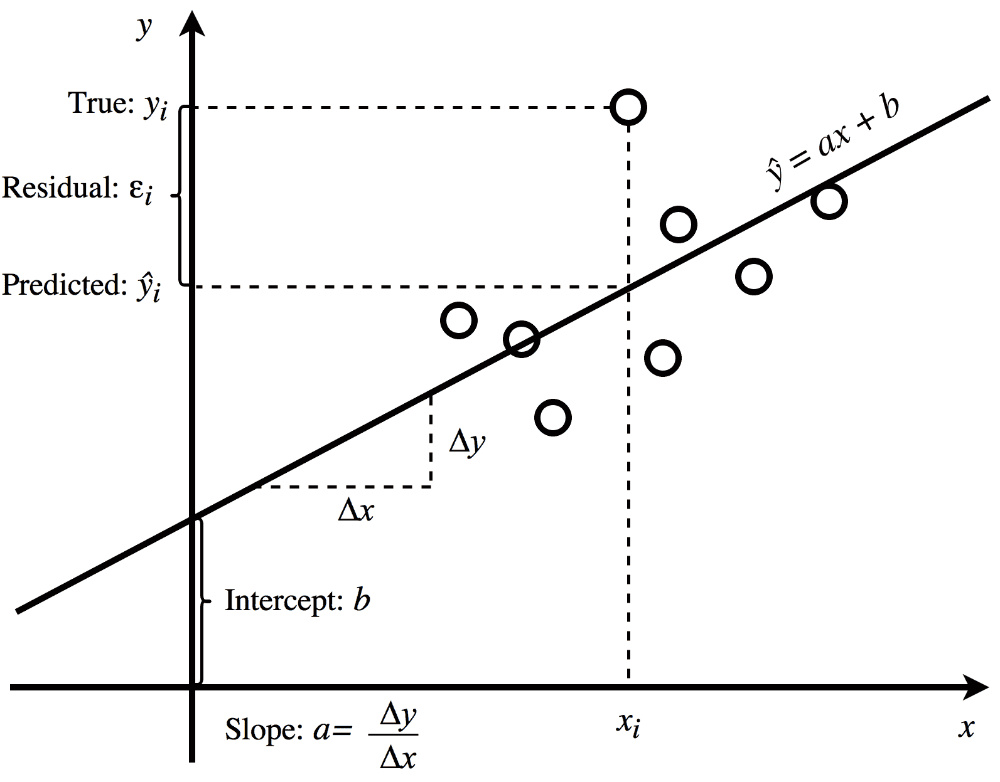

图 6.1:线性回归术语

从上图中，您可以找到以下内容:

*   **x** :自变量或特征
*   **y** :因变量或目标
*   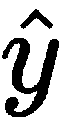:因变量的预测值
*   **易**:给定数据点因变量的真值
*   ** i** :给定数据点的因变量预测值
*   **a** :斜率——单位增长 **x** 中 **y** 得分的预测变化率
*   **b**:**y**-截距——当 **x** 为零时 **y** 的预测值
*   **ε[1]:给定数据点的残差(误差)**

线性回归的思想很简单。正如我们从上一章中所记得的，监督学习中的模型是一个数学函数 *f* ( *x* )，它为输入特征 *x* (父母的身高)预测输出标签 *y* (儿子的身高，在高尔顿的研究中)。也许，每个读者都保留着关于直线的一个简单公式的美好学校记忆: *y = ax + b* ，其中系数 *a* 调节直线的斜率，b 项是 a*y*-截距。假设 *x* 和 *y* 之间的依赖关系是线性的，我们可以假设数据集下面的函数是*y[I]= ax[I]+b+ε[I]*，其中ε代表误差(在测量或任何其他种类中)。直线在任务中起到模型(或假设函数， *h* ( *x* ))的作用。现在，让我们集中讨论当 *y* 仅由一个特征 *x* 决定时的情况。这种回归称为**简单线性回归**。要开始预测某个东西，我们需要参数 *a* 和 *b* 。事实上，学习过程的目标是为我们的模型选择最佳参数，以便该线以最佳方式拟合数据集。换句话说，最好的参数允许做出最准确的预测。为了区分准确的预测和不准确的预测，我们使用另一个函数:损失(或相同的成本)函数。弗朗西斯·高尔顿爵士使用最小二乘法来估计模型参数。

线性回归算法非常依赖线性代数。为了在 Swift 中实现，我们使用了 Accelerate 框架。不要忘记导入它:

```swift
import Accelerate 
```

Accelerate 框架 Accelerate 包含针对 Apple 硬件上的最高性能而优化的低级功能。vDSP 子库包含矢量运算和数字信号处理功能。我们将在[第 11 章](dc502f3c-ae07-4291-8cfe-4ea4bef76e24.xhtml)、*机器学习库*中深入讨论 Accelerate 和其他低级数值库的细节，就目前而言，你需要知道的只是它很快而且是低级的。

首先，让我们创建一个类`SimpleLinearRegression`。它包含两个双变量:模型参数`slope` ( *a* )和`intercept` ( *b* ):

```swift
class SimpleLinearRegression { 
var slope = 1.0 
var intercept = 0.0 
} 
```

该类的主要功能是训练模型，然后使用它进行预测。为此，我们需要添加以下方法:

*   `predict()`，有两种形式:一个样本(取特征值 *x* 并返回预测 *h* ( *x* ))和一个样本数组(取样本的`Double`数组并返回预测的`Double`数组)
*   `train()`，取等长的样本向量`xVec`和标签向量`yVec`，更新参数`slope`和`intercept`

两个`predict()`函数都只是调用相应的假设函数，如下面的代码所示。稍后，我们将为它们添加更多功能:

```swift
func predict(x: Double) -> Double { 
    return hypothesis(x: x) 
} 
```

对于几个样品:

```swift
func predict(xVec: [Double]) -> [Double] { 
    return hypothesis(xVec: xVec) 
} 
```

现在我们添加假设函数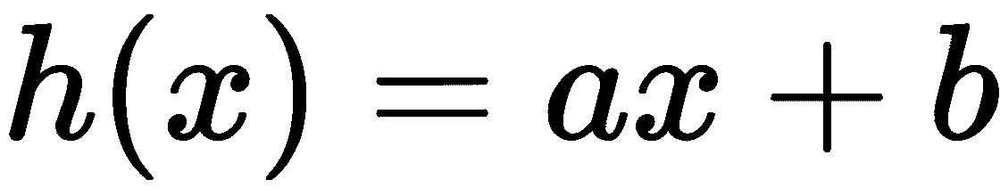如下:

```swift
func hypothesis(x: Double) -> Double { 
    return slope*x + intercept 
} 
```

以矢量化的形式，一次对几个样本:

```swift
func hypothesis(xVec: [Double]) -> [Double] { 
    let count = UInt(xVec.count) 
    var scaledVec = [Double](repeating: 0.0, count: Int(count)) 
    vDSP_vsmulD(UnsafePointer(xVec), 1, &slope, &scaledVec, 1, count) 
    var resultVec = [Double](repeating: 0.0, count: Int(count)) 
    vDSP_vsaddD(UnsafePointer(scaledVec), 1, &intercept, &resultVec, 1, count) 
    return resultVec 
} 
```

该模型可以被训练如下:

```swift
func train(xVec: [Double], yVec: [Double], learningRate: Double, maxSteps: Int) { 
        precondition(xVec.count == yVec.count) 
        precondition(maxSteps > 0)  
// The goal of training is to minimize cost function. 
} 
```

损失函数我们已经在[第一章](71afcfb5-3c3b-4d79-9eb8-e6b759dbb2ff.xhtml)、*机器学习入门*(参见*数学优化*部分)中给出了损失函数的定义，但这里是我们第一次在代码中实际实现实值损失函数，所以让我们来刷新一下我们已经知道的。
在机器学习中，损失函数(或成本函数)将模型参数映射到实值成本上。


# 使用最小二乘法拟合回归线

正如您在[第 1 章](71afcfb5-3c3b-4d79-9eb8-e6b759dbb2ff.xhtml)、*机器学习入门*中所记得的，对于监督学习，我们需要两个函数:模型和损失函数。我们将使用最小平方损失函数来评估模型的质量。该方法是卡尔·弗里德里希·高斯在 17 世纪末提出的。它的本质是最小化数据点到回归线的距离。真实值*y[I]与预测值*h*(*x[I]T24)之差(偏差)称为**残差**，记为 *ε [i]* 。我们的损失函数 *J* 将是一个**残差** **平方和** ( **RSS** )，稍加修改即可。如果有特征*x[I]和标签*y[I]的 *n* 个样本，那么 RSS 可以计算为:****

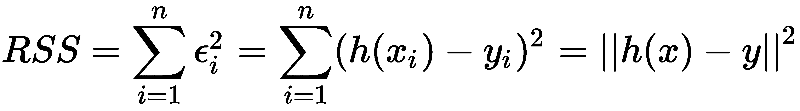

注意，所有残差在求和前都要平方，以防止符号相反的残差相互抵消。为了使其与数据集的大小无关，我们将把 *RSS* 除以 *n* 。此外，为了使一些未来的计算更简单，我们将它们除以 2。

用 Swift 写的最终损失函数如下:

```swift
func cost(trueVec: [Double], predictedVec: [Double]) -> Double { 
    let count = UInt(trueVec.count) 
```

现在让我们计算平方欧几里德距离，如下所示:

```swift
    var result = 0.0 
    vDSP_distancesqD(UnsafePointer(trueVec), 1, UnsafePointer(predictedVec), 1, &result, 1) 
```

您可以通过向量长度进行规范化，如以下代码所示:

```swift
    result /= (2*Double(count)) 
    return result 
} 
```

它显示了我们的假设与数据的吻合程度。我们的目标是最小化这个函数:改变参数 *a* 和 b 找到损失函数的最小值: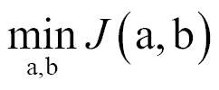。使用一点微积分(或查看维基百科)，可以表明产生损失函数最小值的 *a* 和 *b* 可以使用以下公式计算:

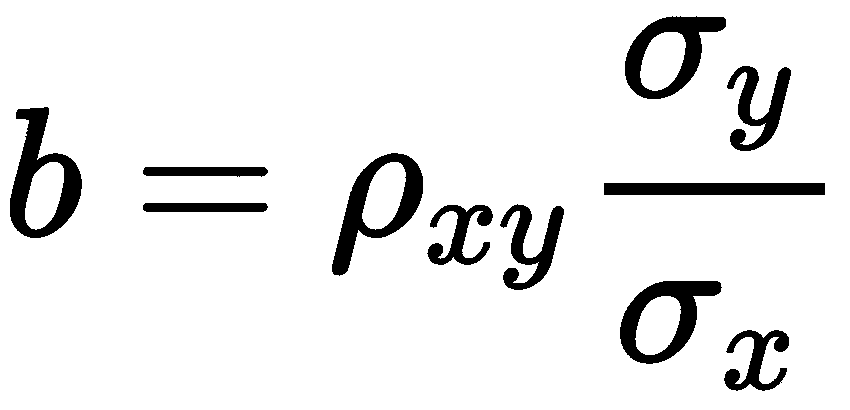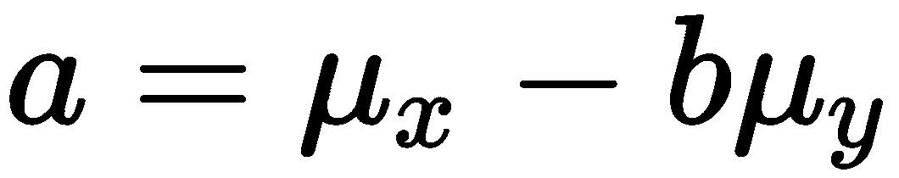

在这些公式中，ρ是相关系数，σ是标准差，μ是平均值。


# 哪里使用 GD 和正规方程

如果目标只是将线性回归添加到您的应用中，此时您就完成了；然而，还有另一种更有趣的方法来获得相同的系数——一种被称为**梯度下降**的优化技术。梯度下降算法及其多个后代用于在许多机器学习算法中寻找损失函数最小值，包括深度神经网络，其中不可能有直接的解析解，如线性回归。所以，我们最好在一个简单的例子上试试，比如线性回归，这样当我们讨论更复杂的算法时，我们已经很熟悉它了。


# 使用梯度下降进行函数最小化

如果机器学习算法是一辆汽车，那么优化算法就是它的引擎。更多信息请参考[http://www . pyimagesearch . com/2016/10/10/gradient-descent-with-python/](http://www.pyimagesearch.com/2016/10/10/gradient-descent-with-python/)。

从你们的数学课上，你们应该记得几何解释是函数的导数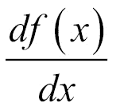*f(x)*是函数任意给定点( *x)* 的斜率。现在，如果我们有一个两个参数的函数 *f(x，y)* ，我们不能像以前那样计算导数。尽管如此，我们还是可以计算偏导数: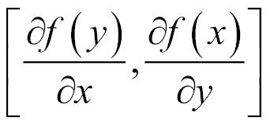。由这些偏导数组成的矢量称为梯度，相应的算子用纳布拉符号∇.表示

回归损失函数 *J(a，b)* 的梯度是向量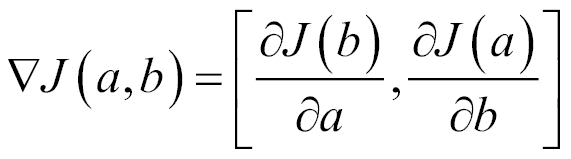。类似地，导数是曲线在每个点的斜率，梯度是高度图，向量显示了图中每个点的最陡方向。

线性回归的损失函数呈碗状(见*图 6.2* )。想象一只蜗牛坐在碗的边缘。它没有很好的视力，它只能感知表面坡度的方向。怎么能够到碗底？蜗牛只需要在最陡的方向上迈出一小步，这正好与路径上每个给定点的梯度方向相反。

线性回归的梯度下降算法的工作方式如下:

1.  随机初始化 *a* 和 *b* (或用一些预定义的值)
2.  在与渐变指向相反的方向迈出*α*(α)一步
3.  你的终点的坐标是你新的 *a* 和 *b*
4.  从步骤 2 开始重复，直到收敛

在数学符号中，它可以表示为:

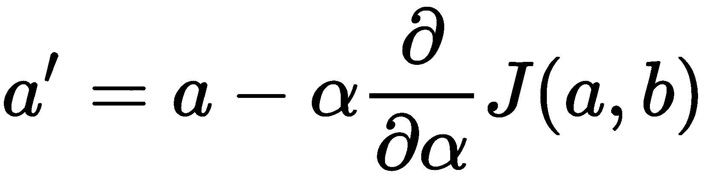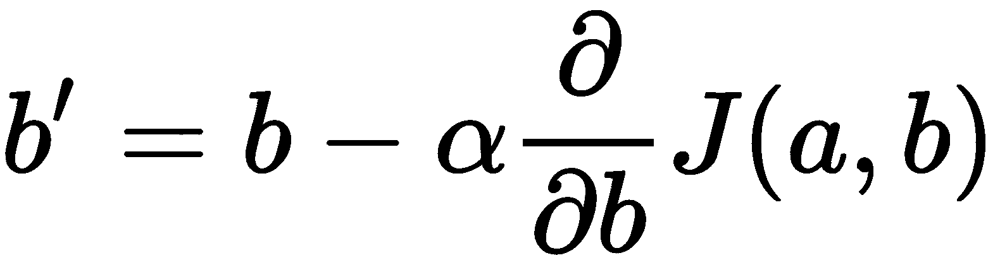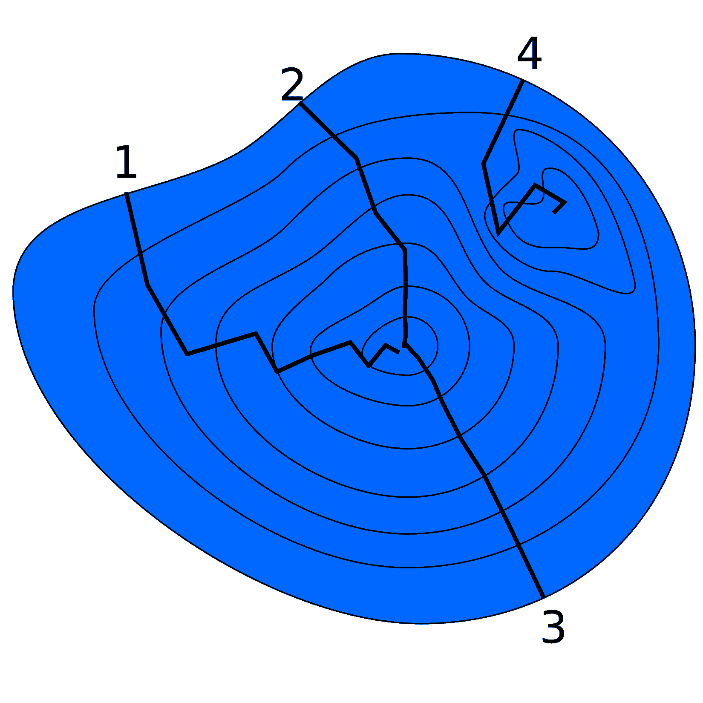

图 6.2:两个变量的一些假设函数的梯度下降轨迹。这是一张高度图，左侧为 3D 表面，右侧为 3D 表面

现在让我们在 Swift 中实现相同的算法。梯度下降是一种迭代算法，所以我们将利用一个循环和一些停止条件:`maxSteps`(算法迭代的最大次数)，将检查收敛条件。该函数显式地取输入向量 *x* 和 *y* ，一个学习率 *α* ，并隐式地修改权重 *a* 和 *b* :

```swift
func gradientDescent(xVec: [Double], yVec: [Double], α: Double, maxSteps: Int) { 
    for _ in 0 ..< maxSteps { 
        let (newSlope, newIntercept) = gradientDescentStep(xVec: xVec, yVec: yVec, α: α) 
        if (newSlope==slope && newIntercept==intercept) { break } // convergence 
        slope = newSlope 
        intercept = newIntercept 
    } 
} 
```

注意 *a* 和 *b* ( `slope`和`intercept`)应该同时更新。

以下是梯度下降的一个步骤:

```swift
// alpha is a learning rate 
func gradientDescentStep(xVec: [Double], yVec: [Double], α: Double) -> (Double, Double) { 
    // Calculate hypothesis predictions. 
    let hVec = hypothesis(xVec: xVec) 
    // Calculate gradient with respect to parameters. 
    let slopeGradient = costGradient(trueVec: yVec, predictedVec: hVec, xVec: xVec) 
    let newSlope = slope + α*slopeGradient 

    let dummyVec = [Double](repeating: 1.0, count: xVec.count) 
    let interceptGradient = costGradient(trueVec: yVec, predictedVec: hVec, xVec: dummyVec) 
    let newIntercept = intercept + α*interceptGradient 

    return (newSlope, newIntercept) 
} 
```

这里，成本函数的导数是我们用纸笔简单推导出来的:

```swift
// derivative of a cost function 
func costGradient(trueVec: [Double], predictedVec: [Double], xVec: [Double]) -> Double { 
    let count = UInt(trueVec.count) 

    var diffVec = [Double](repeating: 0.0, count: Int(count)) 
    vDSP_vsubD(UnsafePointer(predictedVec), 1, UnsafePointer(trueVec), 1, &diffVec, 1, count) 

    var result = 0.0 
    vDSP_dotprD(UnsafePointer(diffVec), 1, UnsafePointer(xVec), 1, &result, count) 

    // Normalize by vector length. 
    return result/Double(count) 
} 
func gradientDescentStep(x: Vector<Double>,  
y: Vector<Double>, α: Double) -> (Double, Double) { 
    let new = Vector([b, a]) - α*cost_d(x: x, y: y)     
    return (new[1], new[0]) 
} 
```

别忘了更新`train`功能:

```swift
func train(xVec: [Double], yVec: [Double], learningRate: Double, maxSteps: Int) { 
    gradientDescent(xVec: xVec, yVec: yVec, α: learningRate, maxSteps: maxSteps) 
} 
```

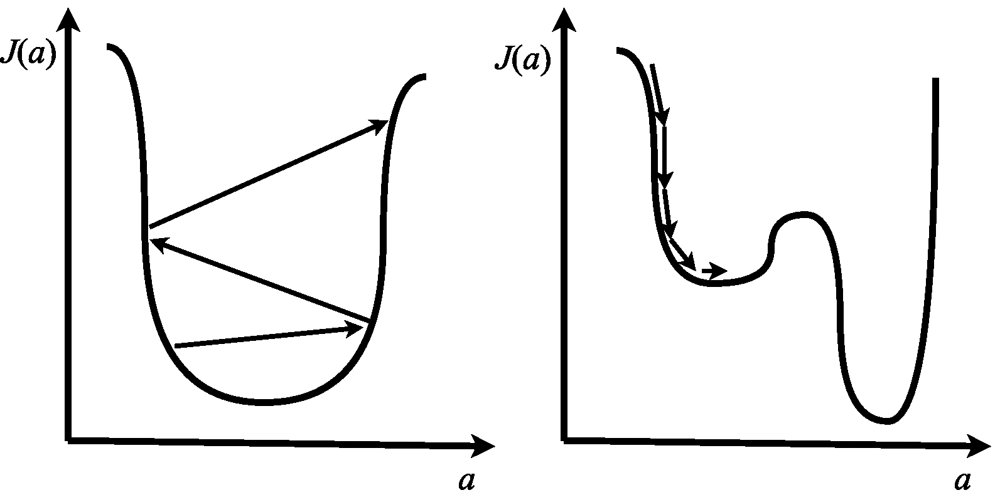

图 6.3:该图显示了一些损失函数与参数 w 的关系图。学习率α:在左侧，它太大，导致超调；在右边，它太小，导致收敛缓慢和陷入局部最小值


# 用简单线性回归预测未来

在写这本书的时候，我用简单的线性回归来估计大概的完成日期。我时不时地记录下截至那一刻我写的总页数，然后将数据纳入线性回归。这里的页数是一个特征，日期是一个标签。

对于任何处理一些渐进过程或任务的应用来说，线性趋势都是一个有用的特性，尤其是在与图表结合使用时。在本章的后面，我们将学习如何构建非线性趋势线，即多项式趋势线。

让我们做一些预测:

```swift
let xVec: [Double] = [2,3,4,5] 
let yVec: [Double] = [10,20,30,40] 

let regression = SimpleLinearRegression() 
regression.train(xVec: xVec, yVec: yVec, learningRate: 0.1, maxSteps: 31) 

regression.slope 
regression.intercept 

regression.predict(x: 7) 
regression.cost(trueVec: yVec, predictedVec: regression.predict(xVec: xVec)) 
```


# 特征缩放

如果您有几个特征，并且它们的范围相差很大，许多机器学习算法可能已经用您的数据教授了时间:大的特征可能会淹没具有小绝对值的特征。处理这一障碍的标准方法是**特征缩放**(也称为**特征/数据标准化)**。有几种方法来执行它，但两个最常见的是重新调整和标准化。在将数据输入学习者之前，这是您想要做的预处理步骤。

最小二乘法几乎等同于两点间的欧几里德距离。如果我们想计算两个点有多近，我们希望每个维度对结果的贡献相等。在线性回归特征的情况下，贡献取决于每个特征的绝对值。这就是为什么在线性回归之前，特征缩放是必须的。稍后，当我们谈论深度学习神经网络时，我们会遇到类似的技术批量规范化。

输入数据中的要素可以有不同的范围。例如:用户年龄 0 到 120 岁，用户身高 0 到 5 米。许多损失函数在处理这些数据时会有问题。在欧几里德距离下，具有大绝对值的特征将抑制具有小绝对值的特征。这就是为什么通常情况下，在将数据传递给机器学习算法之前，我们希望对它们进行规范化。我们是这样做的:

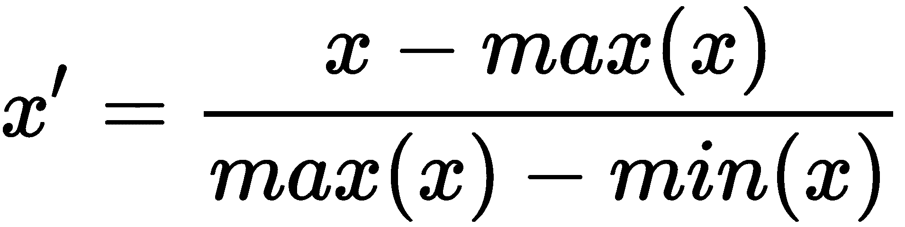

要了解 scikit-learn，请点击此链接:[http://scikit-learn.org/stable/modules/preprocessing.html](http://scikit-learn.org/stable/modules/preprocessing.html)。


# 特征标准化

另一种方法是功能标准化:

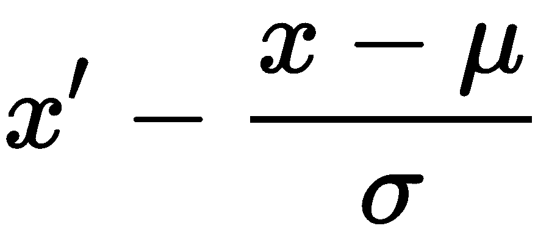

在你的应用中使用哪一个由你决定，但请确保至少使用其中一个。

像往常一样，我们有一个加速函数:

```swift
func normalize(vec: [Double]) -> (normalizedVec: [Double], mean: Double, std: Double) { 
    let count = vec.count 
    var mean = 0.0 
    var std = 0.0 
    var normalizedVec = [Double](repeating: 0.0, count: count) 
    vDSP_normalizeD(UnsafePointer(vec), 1, &normalizedVec, 1, &mean, &std, UInt(count)) 
    return (normalizedVec, mean, std) 
} 
```

现在我们需要更新`train`方法:

```swift
func train(xVec: [Double], yVec: [Double], learningRate: Double, maxSteps: Int) { 
    precondition(xVec.count == yVec.count) 
    precondition(maxSteps > 0) 
    if normalization { 
        let (normalizedXVec, xMean, xStd) = normalize(vec: xVec) 
        let (normalizedYVec, yMean, yStd) = normalize(vec: yVec) 

        // Save means and std-s for prediction phase. 
        self.xMean = xMean 
        self.xStd = xStd 
        self.yMean = yMean 
        self.yStd = yStd 

        gradientDescent(xVec: normalizedXVec, yVec: normalizedYVec, α: learningRate, maxSteps: maxSteps) 
    } else { 
        gradientDescent(xVec: xVec, yVec: yVec, α: learningRate, maxSteps: maxSteps) 
    } 
} 
```

您还必须更新`predict`方法:

```swift
func predictOne(x: Double) -> Double { 
    if normalization { 
        return hypothesis(x: (x-xMean)/xStd) * yStd + yMean 
    } else { 
        return hypothesis(x: x) 
    } 
} 
```

对于矢量化的情况，它看起来有点复杂，但本质上它做的是同样的事情:平移-缩放，非平移:

```swift
func predict(xVec: [Double]) -> [Double] { 
    if normalization { 
        let count = xVec.count 
        // Normalize 
        var centeredVec = [Double](repeating: 0.0, count: count) 
        var negMean = -xMean 
        vDSP_vsaddD(UnsafePointer(xVec), 1, &(negMean), &centeredVec, 1, UInt(count)) 

        var scaledVec = [Double](repeating: 0.0, count: count) 
        vDSP_vsdivD(UnsafePointer(centeredVec), 1, &xStd, &scaledVec, 1, UInt(count)) 

        // Predict 
        let hVec = hypothesis(xVec: scaledVec) 

        // Denormalize 
        var unScaledVec = [Double](repeating: 0.0, count: count) 
        vDSP_vsmulD(UnsafePointer(hVec), 1, &yStd, &unScaledVec, 1, UInt(count)) 
        var resultVec = [Double](repeating: 0.0, count: count) 
        vDSP_vsaddD(UnsafePointer(unScaledVec), 1, &yMean, &resultVec, 1, UInt(count)) 
        return resultVec 
    } else { 
        return hypothesis(xVec: xVec) 
    } 
} 
```

让我们做一些预测:

```swift
let xVec: [Double] = [2,3,4,5] 
let yVec: [Double] = [10,20,30,40] 

let regression = SimpleLinearRegression() 
regression.normalization = true 
regression.train(xVec: xVec, yVec: yVec, learningRate: 0.1, maxSteps: 31) 

regression.slope 
1.0 
regression.intercept 
-1.970.... 
regression.xMean 
3.5 
regression.xStd 
1.1180... 
regression.yMean 
25.0 
regression.yStd 
11.18033987... 
regression.predict(x: 7) 
60.0 
regression.cost(trueVec: yVec, predictedVec: regression.predict(xVec: xVec)) 
1.5777218... 
```


# 多元线性回归

如果我们在具有多个特征的数据集上有一个回归任务，我们不能使用简单的线性回归，但是我们可以应用它的推广:**多元线性回归**。进行预测的公式现在看起来像这样:

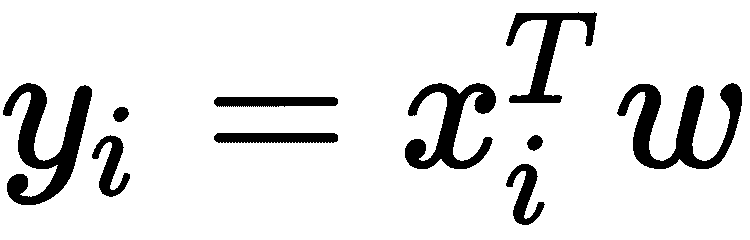

在这个公式中，*x[I]*^(*T*)是具有 *m* 个特征的样本(特征向量)，而 *w* 是长度为 *m* 的权重行向量。因变量 y [i] 是一个标量。

损失最小化的任务变为:

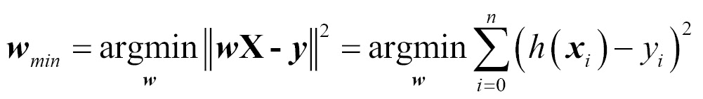

在这个公式中，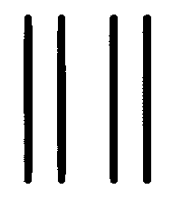是欧几里德范数(向量的长度):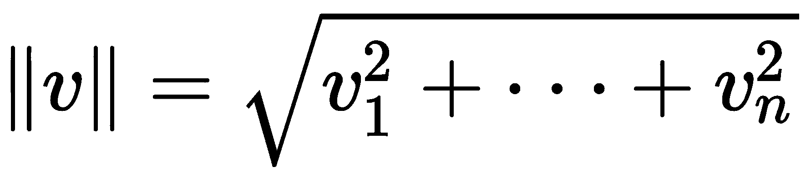。注意，这与矢量 *wx* 和 *y* 之间的欧几里德距离相同。

还可以将多元线性回归拟合视为线性方程组的解，其中每个系数是特征值，每个变量是相应的权重值:

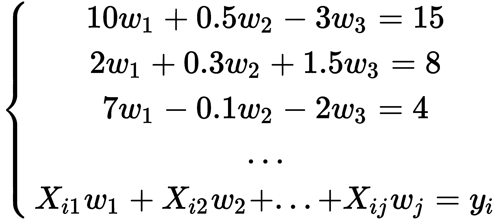

或者:

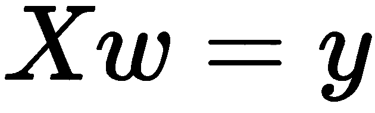

这里的问题是，这样一个系统可能没有精确的解，所以我们希望得到一个解，如果不精确，但在某种程度上是最优的。


# 在 Swift 中实现多元线性回归

`MultipleLinearRegression`类包含一个权重向量，以及用于数据标准化的人员:

```swift
class MultipleLinearRegression { 
public var weights: [Double]! 
public init() {} 
public var normalization = false 
public var xMeanVec = [Double]() 
public var xStdVec = [Double]() 
public var yMean = 0.0 
public var yStd = 0.0 
... 
} 
```

假设和预测:

```swift
public func predict(xVec: [Double]) -> Double { 
if normalization { 
    let input = xVec 
    let differenceVec = vecSubtract([1.0]+input, xMeanVec) 
    let normalizedInputVec = vecDivide(differenceVec, xStdVec) 

    let h = hypothesis(xVec: normalizedInputVec) 

    return h * yStd + yMean 
} else { 
    return hypothesis(xVec: [1.0]+xVec) 
} 
} 

private func hypothesis(xVec: [Double]) -> Double { 
var result = 0.0 
vDSP_dotprD(xVec, 1, weights, 1, &result, vDSP_Length(xVec.count)) 
return result 
} 

public func predict(xMat: [[Double]]) -> [Double] { 
let rows = xMat.count 
precondition(rows > 0) 
let columns = xMat.first!.count 
precondition(columns > 0) 

if normalization { 
    let flattenedNormalizedX = xMat.map{ 
        return vecDivide(vecSubtract($0, xMeanVec), xStdVec) 
        }.reduce([], +) 

    // Add a column of ones in front of the matrix. 
    let basisExpanded = prepentColumnOfOnes(matrix: flattenedNormalizedX, rows: rows, columns: columns) 

    let hVec = hypothesis(xMatFlattened: basisExpanded) 
    let outputSize = hVec.count 
    let productVec = vecMultiply(hVec, [Double](repeating: yStd, count: outputSize)) 
    let outputVec = vecAdd(productVec, [Double](repeating: yMean, count: outputSize)) 

    return outputVec 
} else { 
    // Flatten and prepend a column of ones. 
    let flattened = xMat.map{[1.0]+$0}.reduce([], +) 
    return hypothesis(xMatFlattened: flattened) 
} 
} 

private func hypothesis(xMatFlattened: [Double]) -> [Double] { 
let matCount = xMatFlattened.count 
let featureCount = weights.count 
precondition(matCount > 0) 
let sampleCount = matCount/featureCount 
precondition(sampleCount*featureCount == matCount) 
let labelSize = 1 
let result = gemm(aMat: xMatFlattened, bMat: weights, rowsAC: sampleCount, colsBC: labelSize, colsA_rowsB: featureCount) 
return result 
}  
```

最小二乘成本函数，与简单回归几乎相同:

```swift
public func cost(trueVec: [Double], predictedVec: [Double]) -> Double { 
let count = trueVec.count 
// Calculate squared Euclidean distance. 
var result = 0.0 
vDSP_distancesqD(trueVec, 1, predictedVec, 1, &result, 1) 
// Normalize by vector length. 
result/=(2*Double(count)) 
return result 
}  
```


# 多元线性回归的梯度下降

多元线性回归的梯度下降可计算如下:

```swift
 // derivative of a cost function 
    private func costGradient(trueVec: [Double], predictedVec: [Double], xMatFlattened: [Double]) -> [Double] { 
        let matCount = xMatFlattened.count 
        let featureCount = weights.count 
        precondition(matCount > 0) 
        precondition(Double(matCount).truncatingRemainder(dividingBy: Double(featureCount)) == 0) 
        let sampleCount = trueVec.count 
        precondition(sampleCount > 0) 
        precondition(sampleCount*featureCount == matCount) 
        let labelSize = 1 

        let diffVec = vecSubtract(predictedVec, trueVec) 

        // Normalize by vector length. 
        let scaleBy = 1/Double(sampleCount) 
        let result = gemm(aMat: xMatFlattened, bMat: diffVec, rowsAC: featureCount, colsBC: labelSize, colsA_rowsB: sampleCount, transposeA: true, α: scaleBy) 

        return result 
    } 

    // alpha is a learning rate 
    private func gradientDescentStep(xMatFlattened: [Double], yVec: [Double], α: Double) -> [Double] { 

        // Calculate hypothesis predictions. 
        let hVec = hypothesis(xMatFlattened: xMatFlattened) 
        // Calculate gradient with respect to parameters. 
        let gradient = costGradient(trueVec: yVec, predictedVec: hVec, xMatFlattened: xMatFlattened) 
        let featureCount = gradient.count 

        // newWeights = weights - α*gradient 
        var alpha = α 
        var scaledGradient = [Double](repeating: 0.0, count: featureCount) 
        vDSP_vsmulD(gradient, 1, &alpha, &scaledGradient, 1, vDSP_Length(featureCount)) 

        let newWeights = vecSubtract(weights, scaledGradient) 

        return newWeights 
    } 

    private func gradientDescent(xMatFlattened: [Double], yVec: [Double], α: Double, maxSteps: Int) { 
        for _ in 0 ..< maxSteps { 
            let newWeights = gradientDescentStep(xMatFlattened: xMatFlattened, yVec: yVec, α: α) 
            if newWeights==weights { 
                print("convergence") 
                break 
            } // convergence 
            weights = newWeights 
        } 
    } 
```


# 训练多元回归

现在让我们看看如何训练多元回归:

```swift
 private func prepentColumnOfOnes(matrix: [Double], rows: Int, columns: Int) -> [Double] { 
let weightsCount = columns+1 

var withFirstDummyColumn = [Double](repeating: 1.0, count: rows * (columns+1)) 
for row in 0..<rows { 
    for column in 1..<weightsCount { 
        withFirstDummyColumn[row*weightsCount + column] = matrix[row*columns + column-1] 
    } 
} 
return withFirstDummyColumn 
} 

public func train(xMat: [[Double]], yVec: [Double], learningRate: Double, maxSteps: Int) { 
precondition(maxSteps > 0, "The number of learning iterations should be grater then 0.") 
let sampleCount = xMat.count 
precondition(sampleCount == yVec.count, "The number of samples in xMat should be equal to the number of labels in yVec.") 
precondition(sampleCount > 0, "xMat should contain at least one sample.") 
precondition(xMat.first!.count > 0, "Samples should have at least one feature.") 
let featureCount = xMat.first!.count 
let weightsCount = featureCount+1 

weights = [Double](repeating: 1.0, count: weightsCount) 
// Flatten and prepend a column of ones. 
let flattenedXMat = xMat.reduce([], +) 

if normalization { 
    let (normalizedXMat, xMeanVec, xStdVec) = matNormalize(matrix: flattenedXMat, rows: sampleCount, columns: featureCount) 
    let (normalizedYVec, yMean, yStd) = vecNormalize(vec: yVec) 

    // Save means and std-s for prediction phase. 
    self.xMeanVec = xMeanVec 
    self.xStdVec = xStdVec 
    self.yMean = yMean 
    self.yStd = yStd 

    // Add first column of ones to matrix 
    let designMatrix = prepentColumnOfOnes(matrix: normalizedXMat, rows: sampleCount, columns: featureCount) 

    gradientDescent(xMatFlattened: designMatrix, yVec: normalizedYVec, α: learningRate, maxSteps: maxSteps) 
} else { 
    gradientDescent(xMatFlattened: flattenedXMat, yVec: yVec, α: learningRate, maxSteps: maxSteps) 
} 
} 
```


# 线性代数运算

现在我们来看看如何执行线性代数运算:

```swift
 // Add two vectors. Equivalent to zip(a, b).map(+) 
func vecAdd(_ a: [Double], _ b: [Double]) -> [Double] { 
    let count = a.count 
    assert(count == b.count, "Vectors must be of equal length.") 
    var c = [Double](repeating: 0.0, count: count) 
    vDSP_vaddD(a, 1, b, 1, &c, 1, vDSP_Length(count)) 
    return c 
} 

// Subtract vector b from vector a. Equivalent to zip(a, b).map(-) 
func vecSubtract(_ a: [Double], _ b: [Double]) -> [Double] { 
    let count = a.count 
    assert(count == b.count, "Vectors must be of equal length.") 
    var c = [Double](repeating: 0.0, count: count) 
    vDSP_vsubD(b, 1, a, 1, &c, 1, vDSP_Length(count)) 
    return c 
} 

// Multiply two vectors elementwise. Equivalent to zip(a, b).map(*) 
func vecMultiply(_ a: [Double], _ b: [Double]) -> [Double] { 
    let count = a.count 
    assert(count == b.count, "Vectors must be of equal length.") 
    var c = [Double](repeating: 0.0, count: count) 
    vDSP_vmulD(a, 1, b, 1, &c, 1, vDSP_Length(count)) 
    return c 
} 

// Divide vector a by vector b elementwise. Equivalent to zip(a, b).map(/) 
func vecDivide(_ a: [Double], _ b: [Double]) -> [Double] { 
    let count = a.count 
    assert(count == b.count, "Vectors must be of equal length.") 
    var c = [Double](repeating: 0.0, count: count) 
    // Note that parameters a and b are swapped. 
    vDSP_vdivD(b, 1, a, 1, &c, 1, vDSP_Length(count)) 
    return c 
} 

func vecNormalize(vec: [Double]) -> (normalizedVec: [Double], mean: Double, std: Double) { 
    let count = vec.count 
    var mean = 0.0 
    var std = 0.0 
    var normalizedVec = [Double](repeating: 0.0, count: count) 
    vDSP_normalizeD(vec, 1, &normalizedVec, 1, &mean, &std, vDSP_Length(count)) 
    return (normalizedVec, mean, std) 
} 
// C←αAB + βC 
// Pass flattened matrices in row-major order. 
// rowsAC, colsBC, colsA_rowsB - Count of rows/columns AFTER transpose. 
func gemm(aMat: [Double], bMat: [Double], cMat: [Double]? = nil, 
          rowsAC: Int, colsBC: Int, colsA_rowsB: Int, 
          transposeA: Bool = false, transposeB: Bool = false, 
          α: Double = 1, β: Double = 0) -> [Double] { 
    var result = cMat ?? [Double](repeating: 0.0, count: rowsAC*colsBC) 

    // C←αAB + βC 
    cblas_dgemm(CblasRowMajor, // Specifies row-major (C) or column-major (Fortran) data ordering. 
        transposeA ? CblasTrans : CblasNoTrans, // Specifies whether to transpose matrix A. 
        transposeB ? CblasTrans : CblasNoTrans, // Specifies whether to transpose matrix B. 
        Int32(rowsAC), // Number of rows in matrices A and C. 
        Int32(colsBC), // Number of columns in matrices B and C. 
        Int32(colsA_rowsB), // Number of columns in matrix A; number of rows in matrix B. 
        α, // α. 
        aMat, // Matrix A. 
        transposeA ? Int32(rowsAC) : Int32(colsA_rowsB), // The size of the first dimention of matrix A; if you are passing a matrix A[m][n], the value should be m. 
        bMat, // Matrix B. 
        transposeB ? Int32(colsA_rowsB) : Int32(colsBC), // The size of the first dimention of matrix B; if you are passing a matrix B[m][n], the value should be m. 
        β, // β. 
        &result, // Matrix C. 
        Int32(colsBC) // The size of the first dimention of matrix C; if you are passing a matrix C[m][n], the value should be m. 
    ) 
    return result 
} 
```


# 特征标准化

特征标准化可以计算如下:

```swift

// Calculates mean for every matrix column. 
func meanColumns(matrix: [Double], rows: Int, columns: Int) -> [Double] { 
    assert(matrix.count == rows*columns) 

    var resultVec = [Double](repeating: 0.0, count: columns) 

    matrix.withUnsafeBufferPointer{ inputBuffer in 
        resultVec.withUnsafeMutableBufferPointer{ outputBuffer in 
            let inputPointer = inputBuffer.baseAddress! 
            let outputPointer = outputBuffer.baseAddress! 
            for i in 0 ..< columns { 
                vDSP_meanvD(inputPointer.advanced(by: i), columns, outputPointer.advanced(by: i), vDSP_Length(rows)) 
            } 
        } 
    } 
    return resultVec 
} 

// Calculates standard deviation for every matrix column. 
func stdColumns(matrix: [Double], rows: Int, columns: Int) -> [Double] { 
    assert(matrix.count == rows*columns) 

    let meanVec = meanColumns(matrix: matrix, rows: rows, columns: columns) 

    var varianceVec = [Double](repeating: 0.0, count: columns) 
    var deviationsMat = [Double](repeating: 0.0, count: rows*columns) 

    // Calculating the variance for each column. 
    matrix.withUnsafeBufferPointer{ inputBuffer in 
        deviationsMat.withUnsafeMutableBufferPointer{ deviationsBuffer in 
            varianceVec.withUnsafeMutableBufferPointer{ outputBuffer in 
                for i in 0 ..< columns { 
                    let inputPointer = inputBuffer.baseAddress!.advanced(by: i) 
                    let devPointer = deviationsBuffer.baseAddress!.advanced(by: i) 
                    let outputPointer = outputBuffer.baseAddress!.advanced(by: i) 

                    var mean = -meanVec[i] 
                    // Deviations of each column from its mean. 
                    vDSP_vsaddD(inputPointer, columns, &mean, devPointer, columns, vDSP_Length(rows)) 
                    // Squared deviations. 
                    vDSP_vsqD(devPointer, columns, devPointer, columns, vDSP_Length(rows)) 
                    // Sum for every column. Note, that parameters should be passed in a reverse order. 
                    vDSP_sveD(devPointer, columns, outputPointer, vDSP_Length(rows)) 
                } 
            } 
        } 
    } 

    // -1 for Bessel's correction. 
    var devideBy = Double(rows) - 1 
    vDSP_vsdivD(varianceVec, 1, &devideBy, &varianceVec, 1, vDSP_Length(columns)) 

    // Calculating the standard deviation. 
    var length = Int32(columns) 
    var stdVec = varianceVec 
    vvsqrt(&stdVec, &varianceVec, &length) 

    return stdVec 
} 
//(x-μ)/σ
func matNormalize(matrix: [Double], rows: Int, columns: Int) -> (normalizedMat: [Double], meanVec: [Double], stdVec: [Double]) { 
    var meanVec = meanColumns(matrix: matrix, rows: rows, columns: columns) 
    var stdVec = stdColumns(matrix: matrix, rows: rows, columns: columns) 

    var result = [Double](repeating: 0.0, count: rows*columns) 

    matrix.withUnsafeBufferPointer{ inputBuffer in 
        result.withUnsafeMutableBufferPointer{ resultBuffer in 
            for i in 0 ..< columns { 
                let inputPointer = inputBuffer.baseAddress!.advanced(by: i) 
                let resultPointer = resultBuffer.baseAddress!.advanced(by: i) 

                var mean = -meanVec[i] 
                var std = stdVec[i] 
                // Substract standard deviation. 
                vDSP_vsaddD(inputPointer, columns, &mean, resultPointer, columns, vDSP_Length(rows)) 
                // Devide by mean. 
                vDSP_vsdivD(resultPointer, columns, &std, resultPointer, columns, vDSP_Length(rows)) 
            } 
        } 
    } 

    return (result, meanVec, stdVec) 
} 

```


# 多元线性回归的正规方程

如果要在生产代码中实现回归，不要显式使用矩阵求逆运算。它的问题是数值效率非常低。相反，您可以使用其中一个函数来求解线性方程组，这本质上与寻找回归系数是一样的。LAPACK 包(Accelerate 框架的一部分)中最适合的是 QR 分解函数。


# 理解和克服线性回归的局限性

在建立预测模型之前，您应该始终执行探索性分析。通过确定特性和样本的关系和影响，它将帮助您选择正确的模型。线性回归有一大堆前提条件和隐藏的假设。要获得准确的结果，您需要确保满足所有这些条件，并且所有假设都为真:

*   线性回归假设所有要素都是数值变量。如果有分类特征，则不能使用线性回归。这里需要小心，因为分类变量通常用数字表示；例如，食品添加剂的国家代码或 E 号(在欧盟的所有食品标签上都可以找到，例如 E260 代表醋酸)。换句话说，线性回归只能应用于数量(某物的数量)，而不能应用于类别、有序列表、标度或数字代码。
*   线性回归模型线性关系；这意味着要素应该与标注线性相关。构建一个散点图，以确保您拥有的数据可以使用该线进行建模。在这种情况下，我最喜欢引用 https://xkcd.com/1725/的兰道尔·门罗的名言:

“当从散点图中猜测相关性的方向比在散点图上发现新的星座更难时，我不相信线性回归。”

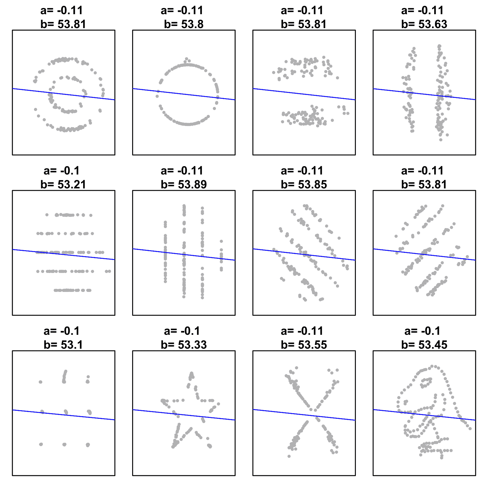

图 6.4: Datasaurus 打的[1]显示了非常不同的数据集可以有非常相似的描述性统计数据。请注意，线性回归参数( *a* 和 *b* )在这些数据集之间的变化并不显著。线性回归对于非线性数据来说是一个糟糕的模型

*   线性回归对异常值敏感(见图 6.5)；换句话说，这是一种不稳定的算法——它对有噪声的数据给出了不好的结果。你需要多少离群值才能完全破坏模型？一个离群值就够了。如果您有异常值，一定要通过构建两个回归来检查它们如何影响您的模型:一个有异常值，一个没有异常值。有一些回归算法是专门为噪声数据开发的，如稳健回归、RANSAC 及其变体:

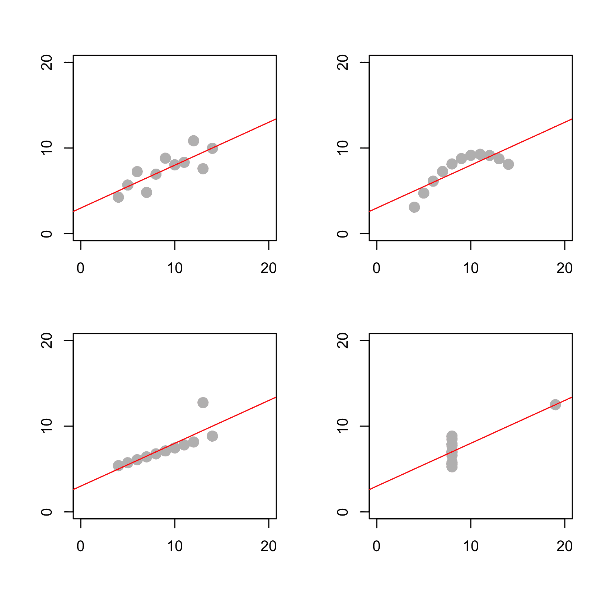

图 6.5: Anscombe 的四重奏[2]通常用于证明线性回归的局限性。第一张图显示了可以通过线性回归建模的数据集。第二个显示了数据的非线性。第三和第四个显示了算法的不稳定性:一个异常值就足以完全破坏模型

*   线性回归对误差也有一些要求。误差应该是独立的、同质的，并且正态分布在回归线周围(见*图 6.6* )。同方差要求意味着整个数据集的误差方差保持不变:

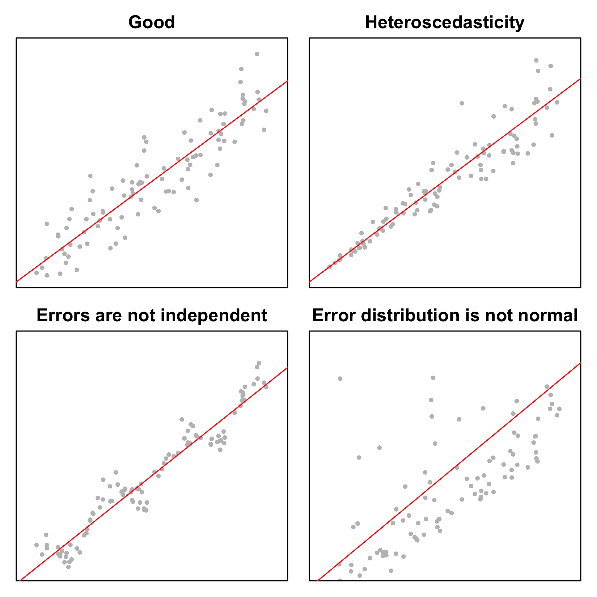

图 6.6:误差分布

打破线性回归的咒语有三种:多重共线性(要素之间的相关性)、自相关性(样本之间的相关性)、异方差性(误差方差变化)。对策是正则化、通过逐步回归选择最重要的特征、向前选择和向后消除。


# 用正则化修正线性回归问题

正如我们所见，一个异常值就足以打破最小二乘回归。这种不稳定性是过度拟合问题的表现。帮助防止模型过度拟合的方法通常被称为**正则化**技术。通常，正则化是通过对模型施加附加约束来实现的。这可能是损失函数、噪声注入或其他因素中的附加项。我们之前已经实现了一个这样的技术，在[第三章](2b7ead7c-0a64-4ab2-af65-8607707cf7c2.xhtml)，*K-最近邻分类器*中。DTW 算法中的局部约束 *w* 本质上是一种正则化结果的方式。在线性回归的情况下，正则化对权重向量值施加约束。


# 岭回归和 Tikhonov 正则化

在标准最小二乘法下，获得的回归系数可能变化很大。我们可以将最小二乘回归公式化为优化问题:

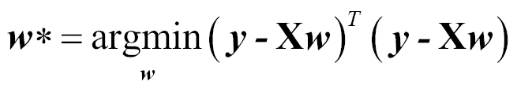

右边的是一个标量积形式的 RSS。吉洪诺夫正则化最小二乘回归增加了一个额外的惩罚项——权重向量的平方*L*2 范数:

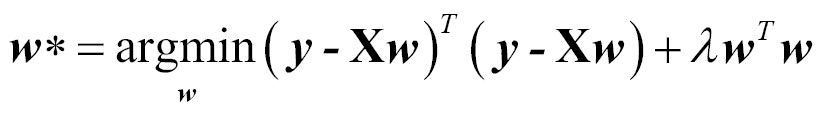

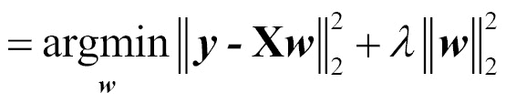

其中 *L* [2] 范数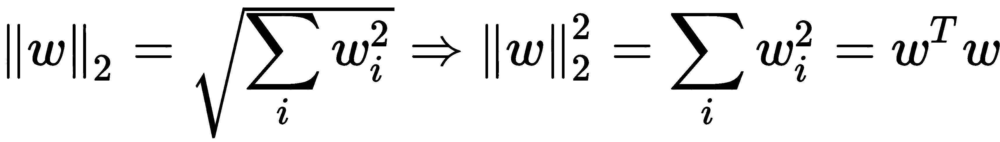，λ为标量收缩参数。它允许控制重量变化，并保持低。与其他超参数类似，λ需要单独定义，通常使用保留数据或交叉验证。它越大，回归系数(权重)就越小。

这种优化问题具有封闭形式的解，类似于正规方程:

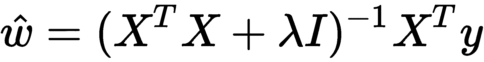

*I* 是一个单位矩阵，其中主对角线元素等于 *1* ，所有其他元素等于 *0* 。

以这种方式正则化的线性回归被称为**岭回归**。其优点之一是，即使训练数据中的要素高度相关(多重共线性)，也可以使用它。与通常的线性回归不同，岭回归不假设误差的正态分布。它减少了特征的绝对值，但它们不会达到零，这意味着如果有不相关的特征，这种回归也表现很差。


# 套索回归

为了解决具有不相关特征的问题，可以在惩罚项中用*L*1 范数代替*L*2 范数，而不是惩罚回归系数的平方，而是惩罚它们的绝对值:


其中*L*1 定额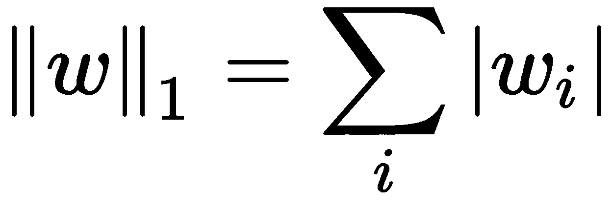。这就是所谓的**最小绝对收缩和选择算子** ( **套索**)回归。在这样的惩罚下，一些权重系数可以精确地变为零，这可以被认为是一种特征选择。如果数据集中有多个高度相关的要素，LASSO 会选取其中一个并将所有其他要素设置为零。这也意味着 LASSO 通常会产生稀疏的权重向量。

这种回归也没有假设误差分布的正态性。


# 弹性网络回归

ElasticNet 回归是脊和套索方法的组合:将两个惩罚项添加到通常的最小二乘损失函数中，您将得到 ElasticNet 回归。它还有两个收缩参数:

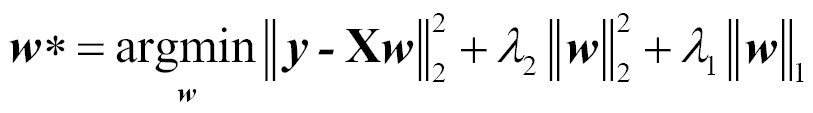

当您有多个相关的要素时，这尤其有用。当两个特征相关时，LASSO 倾向于随机选择其中之一，而 ElasticNet 则两者都保留。与岭回归相似，ElasticNet 在许多情况下也更稳定:

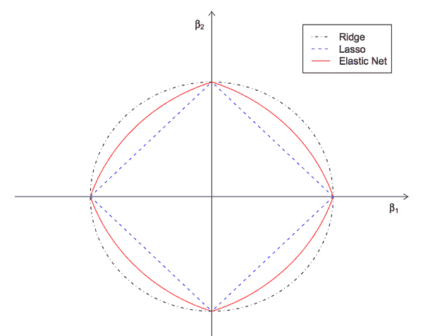

图 6.7:模型参数空间中的惩罚项。

正则化线性回归在多个机器学习包中可用，包括用于与 Core ML 集成的 Scikit-learn 和用于设备上训练的 AIToolbox。


# 摘要

在这一章中，我们探讨了线性回归和梯度下降。线性回归是一个简单的参数模型。它对数据形状和误差分布做了一定的假设。我们也熟悉 Accelerate 框架，这是一个强大的硬件加速框架，由苹果公司开发，用于数值计算。

在下一章中，我们将继续在线性回归的基础上构建不同的、更复杂的模型:多项式回归、正则化回归和逻辑回归。


# 文献学

1.  Justin Matejka，(2017)，*相同的统计量，不同的图形:通过模拟退火生成具有不同外观和相同统计量的数据集*，CHI 2017 年会议录:ACM SIGCHI 计算系统中人的因素会议
2.  F.J. Anscombe，*统计分析中的图表*，美国统计学家，V-27 (1): 17-21 (1973)，JSTOR 2682899