# 2

# 用 Python 进行时间序列分析

时间序列分析围绕着熟悉一个数据集，并提出想法和假设。它可以被认为是“为数据科学家讲故事”，是机器学习中的一个关键步骤，因为它可以在训练机器学习模型时告知并帮助形成试验性结论以进行测试。粗略来说，时间序列分析和机器学习的主要区别在于，时间序列分析不包括正式的统计建模和推理。

虽然这可能令人望而生畏，看起来很复杂，但它通常是一个非常结构化的过程。在本章中，我们将学习 Python 中处理时序模式的基础知识。在 Python 中，我们可以通过使用手边的许多工具交互式查询数据来进行时间序列分析。这从创建和加载时间序列数据集到识别趋势和季节性开始。我们将通过示例概述时间序列分析的结构，以及 Python 中理论和实践的组成部分。

主要的例子将使用伦敦和德里的空气污染数据集。您可以在本书的 GitHub 资源库中找到这个 Jupyter 笔记本的例子。

我们将讨论以下主题:

*   什么是时间序列分析？
*   在 Python 中处理时间序列
*   理解变量
*   揭示变量之间的关系
*   识别趋势和季节性

我们将从时间序列分析的特征和定义开始。

# 什么是时间序列分析？

**时间序列分析** ( **TSA** )是指时间序列的统计方法或趋势和季节性的分析。这通常是一种临时的*探索和分析，通常包括可视化分布、趋势、循环模式以及特征之间和特征与目标之间的关系。*

更一般地说，我们可以说 TSA 大致是**探索性数据分析** ( **EDA** )也就是针对时序数据的特定。然而，这种比较可能会产生误导，因为 TSA 可能包括描述性和探索性元素。

让我们快速看看描述性分析和探索性分析之间的区别:

*   **描述性分析**总结数据集的特征
*   **探索性分析**分析模式、趋势或变量之间的关系

因此，TSA 是对数据集的初步调查，目标是发现模式，特别是趋势和季节性，并获得初步见解，测试假设，提取有意义的汇总统计数据。

定义:时间序列分析(TSA)是从时间序列中提取摘要和其他统计信息的过程，最重要的是趋势和季节性分析。

由于 TSA 的一个重要部分是收集统计数据，并通过可视化以图形方式表示数据集，因此我们将在本章中绘制大量图表。本章中描述的许多统计数据和图表都是针对 TSA 的，所以即使你熟悉 EDA，你也会发现一些新的东西。

TSA 的一部分是收集和审查数据，检查变量(和变量类型)的分布，并检查错误、异常值和缺失值。一些错误、变量类型和异常可以被纠正，因此 EDA 经常与预处理和特征工程一起进行，其中选择和转换列和字段。从数据加载到机器学习的整个过程是高度迭代的，可能涉及不同点的多个 TSA 实例。

以下是处理时间序列的几个关键步骤:

*   导入数据集
*   数据清理
*   理解变量
*   揭示变量之间的关系
*   识别趋势和季节性
*   预处理(包括特征工程)
*   训练机器学习模型

可以在 TSA 之前考虑导入数据，数据清理、特征工程和训练机器学习模型严格来说不是 TSA 的一部分。

导入数据包括解析，例如提取日期。TSA 的三个核心步骤是理解变量，揭示变量之间的关系，识别趋势和季节性。关于它们中的每一个都有很多要说的，在这一章中，我们将在它们的专门章节中更详细地讨论它们。

属于 TSA 并导致预处理(特征工程)和机器学习的步骤是高度迭代的，并且可以在下面的时序机器学习飞轮中直观地理解:

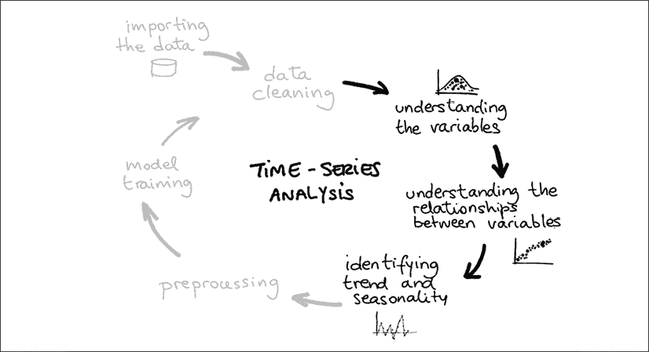

图 2.1:时序机器学习飞轮

这个飞轮强调工作的迭代性质。例如，数据清理通常发生在加载数据之后，但是在我们对变量有了新的发现之后又会出现。我用黑色突出显示了 TSA，而严格来说不属于 TSA 的步骤是灰色的。

来过点实际的吧！我们将从加载数据集开始。在导入数据之后，我们会问这样的问题，数据集的大小是多少(观察的数量)？我们有多少功能或栏目？列的类型有哪些？

我们通常会看直方图或分布图。为了评估特征和目标变量之间的关系，我们会计算相关性并将它们可视化为相关性热图，其中变量之间的相关性强度被映射到颜色。

我们会寻找丢失的值——在电子表格中，这些将是空的单元格——我们会清理并纠正这些不规则的地方。

我们将分析变量之间的关系，在 TSA 中，它的一个特点是我们需要研究每个变量与时间的关系。

一般来说，区分不同类型技术的一个有用的方法是单变量和多变量分析，以及图形和非图形技术。**单变量分析**意味着我们关注单个变量。这意味着我们可以检查值以获得平均值和方差，或者——对于图形方面——绘制分布图。我们在*理解变量*部分总结了这些技巧。

另一方面，**多变量分析**意味着我们正在计算变量之间的相关性，或者——对于图形侧——例如，绘制散点图。我们将在*揭示变量之间的关系*一节中深入研究这些技术。

在我们继续之前，让我们先了解一下 Python 时间序列的一些基础知识。这将包括时间序列数据作为介绍的基本操作。之后，我们将通过一个实际的数据集来研究 Python 命令。

# 在 Python 中处理时间序列

Python 有很多针对时间序列的库和包，比如`datetime`、`time`、`calendar`、`dateutil`、`pytz`，对于初学者来说可能非常混乱。同时，还有许多不同的数据类型，如`date`、`time`、`datetime`、`tzinfo`、`timedelta`、`relativedelta`等等。

当谈到使用它们的时候，问题就出在细节上。仅举一个例子:许多类型对时区不敏感。不过，您应该放心，知道要开始，熟悉这些库和数据类型的一小部分就足够了。

## 要求

在本章中，我们将使用几个库，我们可以从终端(或者类似地从 Anaconda Navigator)快速安装它们:

```
pip install -U dython scipy numpy pandas seaborn scikit-learn 
```

我们将从 Python(或 IPython)终端执行命令，但同样我们也可以从 Jupyter 笔记本(或不同的环境)执行它们。

如果我们至少知道 datetime 和 pandas 这两个非常著名的库，这将是一个好的开始，我们将在接下来的两节中介绍这两个库。我们将创建基本的对象，并对它们进行简单的操作。

## 日期时间

在 Python 中，`date`和`datetime`数据类型并不像数字(`float`和`int`、`string`、`list`、`dictionary`、`tuple`或`file`那样是原始类型。为了使用`date`和`datetime`对象，我们必须导入 datetime，这是 Python 标准库的一部分，以及 CPython 和其他主要 Python 发行版默认提供的库。

datetime 带有诸如`date`、`datetime`、`time`和`timedelta`等对象。`datetime`和`date`对象的区别在于`datetime`对象除了日期还包括时间信息。

要约会，我们可以这样做:

```
from datetime import date 
```

要获取今天的日期:

```
today = date.today() 
```

要获取其他日期:

```
other_date = date(2021, 3, 24) 
```

如果我们想要一个`datetime`对象(一个时间戳),我们也可以这样做:

```
from datetime import datetime

now = datetime.now() 
```

这将获得当前的时间戳。我们还可以为特定的日期和时间创建一个`datetime`:

```
some_date = datetime(2021, 5, 18, 15, 39, 0)

some_date.isoformat() 
```

我们可以得到等格式的字符串输出:

```
'2021-05-18T15:39:00' 
```

isoformat 是 ISO 8601 格式的缩写，是表示日期和时间的国际标准。

我们还可以使用`timedelta`处理时差:

```
from datetime import timedelta 

year = timedelta(days=365) 
```

这些`timedelta`对象可以添加到其他对象中进行计算。我们可以用`timedelta`对象进行计算，例如:

```
year * 10 
```

这将为我们提供以下输出:

```
datetime.timedelta(days=3650) 
```

datetime 库可以将字符串输入解析为`date`和`datetime`类型，并将这些对象输出为`string`:

```
from datetime import date

some_date = date.fromisoformat('2021-03-24') 
```

或者:

```
some_date = datetime.date(2021, 3, 24) 
```

我们可以用字符串格式选项格式化输出，例如:

```
some_date.strftime('%A %d. %B %Y') 
```

这将给我们:

```
'Wednesday 24\. March 2021' 
```

类似地，我们可以从字符串中读入一个`date`或`datetime`对象，并且我们可以使用相同的格式选项:

```
from datetime import datetime

dt = datetime.strptime('24/03/21 15:48', '%d/%m/%y %H:%M') 
```

您可以在这里找到一个格式选项的完整列表，既可以用来解析字符串，也可以用来打印`datetime`对象:[https://strftime.org/](https://strftime.org/)。

下表列出了几个重要的例子:

| 格式字符串 | 意义 |
| %Y | 4 位数的年份 |
| %y | 两位数的年份 |
| %m | 数字形式的月份 |
| %d | 一天 |
| %H | 2 位数的小时 |
| %M | 分钟为 2 位数 |

图 2.2:日期的格式字符串

记住这些带格式选项的字符串很有用。例如，用斜线分隔的美国日期的格式字符串如下所示:

```
'%d/%m/%Y' 
```

## 熊猫

我们在前一章介绍了 pandas 库。pandas 是 Python 数据科学生态系统中最重要的库之一，用于数据操作和分析。最初于 2008 年发布，它是 Python 成功的主要驱动力。

pandas 具有重要的时间序列功能，如日期范围生成、频率转换、移动窗口统计、日期移动和滞后。

让我们来看一下这些基础知识。我们可以创建如下时间序列:

```
import pandas as pd

pd.date_range(start='2021-03-24', end='2021-09-01') 
```

这给了我们这样一个`DateTimeIndex`:

```
DatetimeIndex(['2021-03-24', '2021-03-25', '2021-03-26', '2021-03-27',

               '2021-03-28', '2021-03-29', '2021-03-30', '2021-03-31',

               '2021-04-01', '2021-04-02',

               ...

               '2021-08-23', '2021-08-24', '2021-08-25', '2021-08-26',

               '2021-08-27', '2021-08-28', '2021-08-29', '2021-08-30',

               '2021-08-31', '2021-09-01'],

              dtype='datetime64[ns]', length=162, freq='D') 
```

我们还可以创建如下时间序列:

```
pd.Series(pd.date_range("2021", freq="D", periods=3)) 
```

这会给我们一个这样的时间序列:

```
0   2021-01-01

1   2021-01-02

2   2021-01-03

dtype: datetime64[ns] 
```

正如你所看到的，这种类型被称为`DatetimeIndex`。这意味着我们可以使用这种数据类型来索引数据集。

最重要的功能之一是解析来自`string`或单独列的`date`或`datetime`对象:

```
import pandas as pd

df = pd.DataFrame({'year': [2021, 2022],

    'month': [3, 4],

    'day': [24, 25]}

)

ts1 = pd.to_datetime(df)

ts2 = pd.to_datetime('20210324', format='%Y%m%d') 
```

我们创造了两个时间序列。

您可以采用滚动窗口进行计算，如下所示:

```
s = pd.Series([1, 2, 3, 4, 5])

s.rolling(3).sum() 
```

你能猜出这的结果吗？如果没有，为什么不把这个放到你的 Python 解释器里呢？

时间序列通常是一个索引，包含一个时间对象和一个或多个数字或其他类型的列，如下所示:

```
import numpy as np 

rng = pd.date_range('2021-03-24', '2021-09-01', freq='D')

ts = pd.Series(np.random.randn(len(rng)), index=rng) 
```

我们可以看看我们的时间序列:

```
2021-03-24   -2.332713

2021-03-25    0.177074

2021-03-26   -2.136295

2021-03-27    2.992240

2021-03-28   -0.457537

                 ...

2021-08-28   -0.705022

2021-08-29    1.089697

2021-08-30    0.384947

2021-08-31    1.003391

2021-09-01   -1.021058

Freq: D, Length: 162, dtype: float64 
```

我们可以像任何其他熊猫系列或数据框架一样索引这些时间序列数据集。`ts[:2].index`会给我们:

```
DatetimeIndex(['2021-03-24', '2021-03-25'], dtype='datetime64[ns]', freq='D') 
```

有趣的是，我们可以直接用字符串或日期时间对象进行索引。例如，`ts['2021-03-28':'2021-03-30']`给了我们:

```
2021-03-28   -0.457537

2021-03-29   -1.089423

2021-03-30   -0.708091

Freq: D, dtype: float64 
```

您可以使用`shift`方法在时间上前后移动或延迟时间序列中的值。这将改变数据的对齐方式:

```
ts.shift(1)[:5] 
```

我们还可以改变时序对象的分辨率，例如:

```
ts.asfreq('M') 
```

请注意`datetime`和`pd.DateTimeIndex`的区别。尽管它们编码的是同一类信息，但它们是不同的类型，它们可能并不总是能很好地相互配合。因此，我建议在进行比较时总是显式地转换类型。

在下一节中，让我们看一个导入时间序列数据集、获取汇总统计数据和绘制一些变量的基本示例。

# 理解变量

我们将加载一个空气污染的时间序列数据集，然后我们将对变量进行一些非常基本的检查。

这一步骤是对每个变量单独执行的(单变量分析),可以包括每个变量的汇总统计数据、直方图、查找缺失值或异常值以及测试稳定性。

连续变量最重要的描述符是均值和标准差。提醒一下，这里是平均值和标准差的公式。我们将在这些公式的基础上建立更复杂的公式。**平均值**通常指算术平均值，是最常用的平均值，定义为:

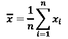

**标准偏差**是平均值的平均平方差的平方根:

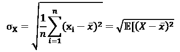

**标准误差** ( **SE** )是采样数据标准偏差的近似值。它测量样本均值在总体均值周围的离差，但通过样本大小的根进行标准化。计算中涉及的数据点越多，标准误差就越小。SE 等于标准偏差除以样本大小的平方根:

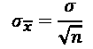

SE 的一个重要应用是估计均值的置信区间。**置信区间**给出了参数值的范围。例如，第 95 ^个百分位上置信限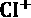定义为:

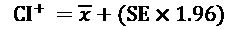

类似地，用减号代替加号，置信区间下限定义为:

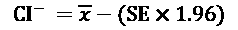

**中值**是另一个平均值，当数据不能用平均值和标准差准确描述时特别有用。这是当有一个长尾巴，几个峰值，或一个或另一个方向倾斜的情况。中位数定义为:

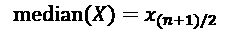

这里假设 *X* 是按升序或降序排列的。然后，位于中间的值，正好在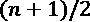处，就是中值。中间值是第 50 ^个个**百分位**，这意味着它比 *X* 中的点的一半或 50%要高。其他重要的百分位数是第 25 个^第和第 75 个^第，这也是第一个**四分位数**和第三个四分位数。这两者之间的差异是，称为**四分位距**。

这些是最常见的描述符，但绝不是唯一的描述符。我们不会在这里深入讨论更多细节，但是稍后我们会看到更多的描述符。

让我们用一些代码来弄脏我们的手吧！

稍后我们将导入 datetime、pandas、matplotlib 和 seaborn 来使用它们。Matplotlib 和 seaborn 是用于绘图的库。这是这样的:

```
import datetime

import pandas as pd

import matplotlib.pyplot as plt 
```

然后我们将读入一个 CSV 文件。这些数据来自“我们的数据世界”网站，这是一个关于世界现状的统计数据和文章的集合，由牛津大学经济学研究主任 Max Roser 维护。

我们可以加载本地文件或互联网上的文件。在这种情况下，我们将从 GitHub 加载一个数据集。这是一个空气污染物的数据集。在 pandas 中，您可以将 URL 直接传递给`read_csv()`方法:

```
pollution = pd.read_csv(

    'https://raw.githubusercontent.com/owid/owid-datasets/master/datasets/Air%20pollution%20by%20city%20-%20Fouquet%20and%20DPCC%20(2011)/Air%20pollution%20by%20city%20-%20Fouquet%20and%20DPCC%20(2011).csv'

)

len(pollution) 
```

```
331 
```

```
pollution.columns 
```

```
Index(['Entity', 'Year', 'Smoke (Fouquet and DPCC (2011))',

       'Suspended Particulate Matter (SPM) (Fouquet and DPCC (2011))'],

      dtype='object') 
```

如果下载文件有问题，可以从图书的 GitHub 库的`chapter2`文件夹手动下载。

现在我们知道了数据集的大小(331 行)和列名。列名有点长，让我们通过重命名来简化它，然后继续:

```
pollution = pollution.rename(

    columns={

        'Suspended Particulate Matter (SPM) (Fouquet and DPCC (2011))':            'SPM',

           'Smoke (Fouquet and DPCC (2011))' : 'Smoke',

        'Entity': 'City'

    }

)

pollution.dtypes 
```

以下是输出结果:

```
City                                object

Year                                 int64

Smoke                              float64

SPM                                float64

dtype: object 
```

```
pollution.City.unique() 
```

```
array(['Delhi', 'London'], dtype=object) 
```

```
pollution.Year.min(), pollution.Year.max() 
```

最小和最大年份是:

```
(1700, 2016) 
```

pandas 提供了许多方法来探索和发现您的数据集—`min()`、`max()`、`mean()`、`count()`和`describe()`都非常方便。

城市、烟雾和 SPM 是变量的更清晰的名称。我们了解到，我们的数据集涵盖了伦敦和德里两个城市，时间跨度为 1700 年至 2016 年。

我们将把我们的年份列从`int64`转换为`datetime`。这将有助于绘图:

```
pollution['Year'] = pollution['Year'].apply(

    lambda x: datetime.datetime.strptime(str(x), '%Y')

)

pollution.dtypes 
```

```
City             object

Year     datetime64[ns]

Smoke           float64

SPM             float64

dtype: object 
```

Year 现在是一个`datetime64[ns]`类型。是 64 位的`datetime`。每个值描述一纳秒，默认单位。

让我们检查缺少的值，并获得列的描述性汇总统计信息:

```
pollution.isnull().mean() 
```

```
City                               0.000000

Year                               0.000000

Smoke                              0.090634

SPM                                0.000000

dtype: float64 
```

```
pollution.describe() 
```

```
 Smoke    SPM

count    301.000000    331.000000

mean     210.296440    365.970050

std      88.543288     172.512674

min      13.750000     15.000000

25%      168.571429    288.474026

50%      208.214286    375.324675

75%      291.818182    512.609209

max      342.857143    623.376623 
```

烟雾变量有 9%的缺失值。现在，我们可以只关注 SPM 变量，它没有任何缺失值。

pandas `describe()`方法为我们提供了非空值、平均值和标准偏差、第 25、50 和 75 个百分点的计数，以及最小值和最大值的范围。

由卡尔·皮尔逊首先提出的**直方图**是对一系列被称为区间(或桶)的范围内的值的计数。首先将变量划分为一系列区间，然后对落入每个区间的所有点进行计数(bin 计数)。我们可以用柱状图直观地展示这些计数。

让我们绘制 SPM 变量的直方图:

```
n, bins, patches = plt.hist(

    x=pollution['SPM'], bins='auto',

    alpha=0.7, rwidth=0.85

)

plt.grid(axis='y', alpha=0.75)

plt.xlabel('SPM')

plt.ylabel('Frequency') 
```

这是我们得到的情节:

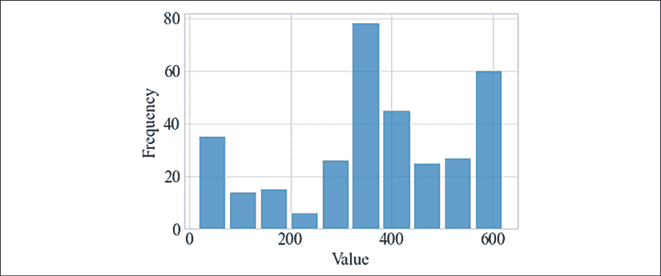

图 2.3:SPM 变量的直方图

如果您有连续的测量，并且想要了解数值的分布，直方图会有所帮助。此外，直方图可以指示是否存在异常值。

我们的 TSA 的第一部分到此结束。稍后我们将回到我们的空气污染数据集。

# 揭示变量之间的关系

如果我们处理的不是只有一个变量的单变量时间序列，那么就需要研究变量之间的关系。这包括任何相关性的方向和粗略大小。这对于避免特征泄漏和共线性非常重要。

**特征泄漏**是指变量无意中泄露了目标。例如，名为`amount_paid`的变量会泄露标签`has_paid.`一个更复杂的例子是，如果我们正在分析一个在线超市的数据，我们的数据集由客户变量组成，如年龄、过去购买次数、访问时间，以及最终他们购物车中的内容。我们想要预测的是，我们的目标是，他们的购买决策结果是放弃(当他们取消购买时)还是支付。我们可以发现，购买与购物车中的袋子高度相关，因为袋子是在最后一步添加的。然而，当顾客登陆我们的网站时，得出我们应该向他们提供袋子的结论可能会错过要点，因为他们停留的时间可能实际上是决定性的变量，通过小工具或客户服务代理进行干预可能会更有效。

**共线性**表示自变量(特征)相关。在线性模型中，后一种情况可能是有问题的。所以，如果进行线性回归，发现两个变量之间高度相关，就要去掉其中一个，或者使用主成分分析(PCA)等降维技术。

皮尔逊相关系数是由卡尔·皮尔逊提出的，我们在上一章中已经讨论过他，以他的名字命名是为了与其他相关系数相区别。两个变量 *X* 和 *Y* 之间的皮尔逊相关系数定义如下:

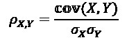

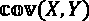是两个变量之间的协方差，定义为各点对变量均值的差之间的期望值(均值):

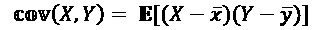

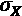是变量 *X* 的标准差。

展开后，公式如下所示:

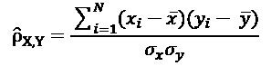

有三种类型的相关性:正相关性、负相关性和无相关性。正相关意味着当一个变量增加时，另一个变量也会增加。在皮尔逊相关系数的情况下，一个变量对另一个变量的增加应该是线性的。

如果我们观察从 1800 年开始的全球预期寿命图，我们会发现时间轴上的寿命增加了。你可以看到基于 OWID 数据的全球预期寿命图:

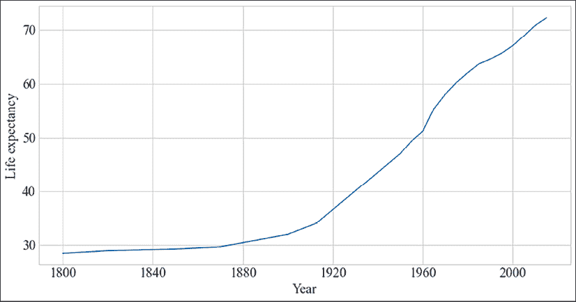

图 2.4:从 1800 年到今天的预期寿命

我们可以看到，从 19 世纪末到今天，预期寿命一直在稳步增长。

这个图被称为**运行图**或时间**线图**。

为了计算 Pearson 相关性，我们可以使用 SciPy 中的一个函数:

```
from scipy import stats

def ignore_nans(a, b):

    index = ~a.isnull() & ~b.isnull()

    return a[index], b[index]

stats.pearsonr(*ignore_nans(pollution['Smoke'], pollution['SPM'])) 
```

这是皮尔逊相关和表示显著性的 p 值(越低，越显著)

```
(0.9454809183096181, 3.313283689287137e-10 
```

我们看到时间与预期寿命有非常强的正相关性，0.94，具有非常高的显著性(回报中的第二个数字)。您可以在 OWID 网站上找到有关数据集的更多详细信息。

相反，我们会看到时间与儿童死亡率呈负相关——随着年份的增加，儿童死亡率下降。该图显示了来自 OWID 的数据中每 1000 名儿童的死亡率:

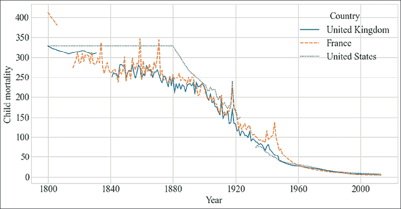

图 2.5:英国、法国和美国从 1800 年至今的儿童死亡率

在这张图中，我们可以看到从 19 世纪开始到今天，这三个国家的儿童死亡率都在下降。

以美国为例，我们会发现儿童死亡率和时间之间的负相关系数为-0.95。

我们还可以将国家相互比较。我们可以计算每个特征之间的相关性。在这种情况下，每个要素都包含三个国家的值。

这给出了一个 3x3 的**相关矩阵**，我们可以将其可视化为热图:

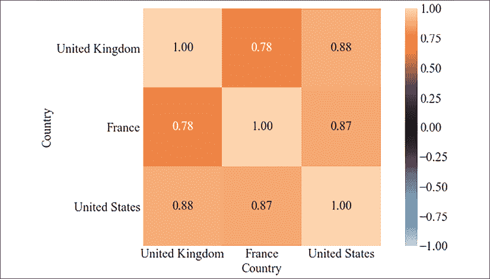

图 2.6:英国、法国和美国儿童死亡率的相关热图

在这张相关性热图中，我们可以看到国家之间的相关性很高(例如，法国和英国之间的相关性为 0.78)。

相关矩阵的对角线始终为 1.0，矩阵沿对角线对称。因此，有时我们只显示对角线下方的下三角形(或有时显示上三角形)。我们可以看到英国的儿童死亡率比法国更接近美国。

这是否意味着英国经历了与美国相似的发展？这些统计数据和可视化数据通常会产生需要回答的问题，或者我们可以测试的假设。

如前所述，GitHub 上提供了不同数据集的完整笔记本，但是，以下是热图的片段:

```
import dython

dython.nominal.associations(child_mortality[countries], figsize=(12, 6)); 
```

相关系数与非线性或非连续增长的情况，或者(由于平方项)存在异常值的情况相抗争。例如，如果我们看看 18 世纪以来的空气污染，我们会看到来自煤炭的空气污染物急剧增加，而随着蒸汽机的引入，污染物减少了。

**散点图**可用于显示和比较数值。它绘制了两个变量的值。通常，变量是数字——否则，我们称之为表格。散点图在某些区域可能会很拥挤，因此，如果不能从视觉上欣赏，散点图就具有欺骗性。添加抖动和透明度在一定程度上有所帮助，但是，我们可以将散点图与我们绘制的变量直方图结合起来，这样我们就可以看到一个或另一个变量上显示了多少个点。散点图通常会叠加一条最佳拟合线，以直观显示一个变量是另一个变量的函数。

下面是一个示例，展示了如何使用污染数据集中两个变量的边际直方图绘制散点图:

```
plt.figure(figsize=(12, 6))

sns.jointplot(

    x="Smoke", y="SPM",

    edgecolor="white",

    data=pollution

)

plt.xlabel("Smoke")

plt.ylabel("SPM"); 
```

这是结果图:

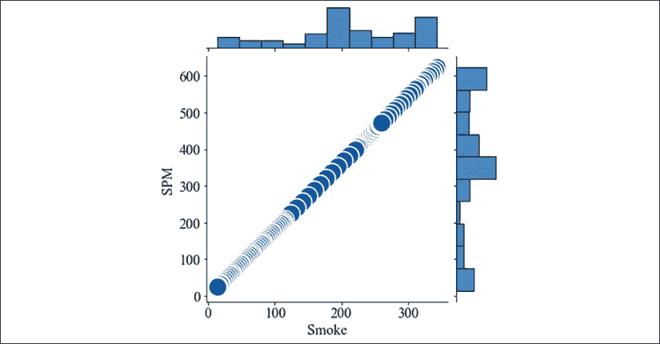

图 2.7:烟雾与 SPM 的边缘直方图散点图

在散点图中，我们可以看到这两个变量非常相似——值都在对角线上。这两个变量之间的相关性是完美的，1.0，这意味着它们实际上是相同的。

我们之前看过**悬浮颗粒物** ( **SPM** )的数据集。让我们在时间上绘制 SPM:

```
pollution = pollution.pivot("Year", "City", "SPM")

plt.figure(figsize=(12, 6))

sns.lineplot(data=pollution)

plt.ylabel('SPM'); 
```

剧情是这样的:

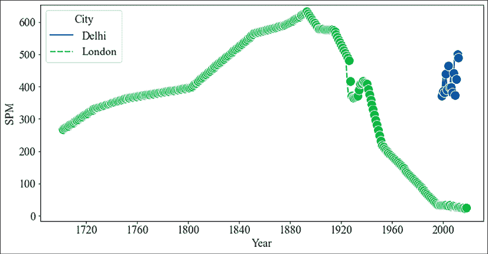

图 2.8:从 18 世纪至今的悬浮颗粒物质

我们可以在图中看到，直到 1880 年左右，伦敦的空气质量(以悬浮颗粒物质衡量)一直在恶化(大概是因为木材和煤炭等取暖材料)，但此后一直在改善。

我们发现相关系数为-0.36，具有很高的显著性。污染物从 1880 年开始急剧下降，主导了 180 年的缓慢增长。如果我们分别从 1700 年到 1880 年和从 1880 年到现在，我们会分别发现 0.97 和-0.97，这是非常强的相关性和非常强的反相关性的例子。

与皮尔森相关系数相比，**斯皮尔曼等级相关**可以更好地处理异常值和非线性关系——尽管它不能处理如上所述的非连续情况。Spearman 相关性是 Pearson 相关性，只对变量值的等级应用，而不是直接应用变量值。空气污染时间序列的 Spearman 相关系数为-0.19，而对于 1880 年前后的两个时间段，我们分别得到 0.99 和-0.99。

在斯皮尔曼相关系数的情况下，数值差异被忽略，重要的是点的顺序。在这种情况下，两个时间段内的点的顺序几乎完全一致。

在下一部分，我们将讨论趋势和季节性。

# 识别趋势和季节性

趋势、季节性和周期性变化是时间序列最重要的特征。一个**趋势**是序列中长期增加或减少的存在。**季节性**是一种变化，以不到年的特定固定间隔发生。季节性可能发生在不同的时间跨度，例如每天、每周、每月或每年。最后，**周期变化**是不具有固定频率的上升和下降。

时间序列的一个重要特征是**平稳性**。这是指时间序列的一个特性，即不会随时间改变分布，或者换句话说，产生时间序列的过程不会随时间改变。不随时间变化的时间序列称为**平稳**(或**平稳过程**)。许多模型或测量方法假设平稳性，如果数据不是平稳的，可能无法正常工作。因此，使用这些算法，时间序列应首先分解成主信号，然后是季节和趋势分量。在这种分解中，我们将从原始时间序列中减去趋势和季节成分。

在本节中，我们将首先通过一个示例来了解如何使用曲线拟合来估计趋势和季节性。然后，我们将看看有助于发现趋势、季节性和周期性变化的其他工具。这些包括统计，如自相关和扩展的 Dickey-Fuller 检验，以及可视化，如自相关图(也称为:滞后图)和周期图。

让我们从一个简单明了的例子开始，用几行 Python 代码就可以估计出季节性和趋势。为此，我们将回到美国宇航局发布的 GISS 地表温度分析数据集。我们将加载数据集，并进行曲线拟合，这在 NumPy 中是现成的。

我们将从 Datahub([https://datahub.io/core/global-temp](https://datahub.io/core/global-temp))下载数据集，或者你可以从这本书的 GitHub 资源库中找到(在`chapter2`文件夹中)。

然后，我们可以把它装起来，然后旋转它:

```
temperatures = pd.read_csv('/Users/ben/Downloads/monthly_csv.csv')

temperatures['Date'] = pd.to_datetime(temperatures['Date'])

temperatures = temperatures.pivot('Date', 'Source', 'Mean') 
```

现在我们可以使用 NumPy 的 polyfit 功能。它符合以下形式的多项式:

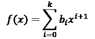

在这个公式中， *k* 是多项式的次数， *b* 是我们要寻找的系数。

它只是 NumPy 中的一个函数来拟合系数。我们可以使用相同的函数来拟合季节变化和趋势。由于趋势可以支配季节性，在估计季节性之前，我们去除趋势:

```
from numpy import polyfit

def fit(X, y, degree=3):

    coef = polyfit(X, y, degree)

    trendpoly = np.poly1d(coef)

    return trendpoly(X)

def get_season(s, yearly_periods=4, degree=3):

    X = [i%(365/4) for i in range(0, len(s))]

    seasonal = fit(X, s.values, degree)

    return pd.Series(data=seasonal, index=s.index)

def get_trend(s, degree=3):

    X = list(range(len(s)))

    trend = fit(X, s.values, degree)

    return pd.Series(data=trend, index=s.index) 
```

让我们在全球气温上升的基础上绘制季节性和趋势图！

```
import seaborn as sns

plt.figure(figsize=(12, 6))

temperatures['trend'] = get_trend(temperatures['GCAG'])

temperatures['season'] = get_season(temperatures['GCAG'] - temperatures['trend'])

sns.lineplot(data=temperatures[['GCAG', 'season', 'trend']])

plt.ylabel('Temperature change'); 
```

这是我们得到的图:

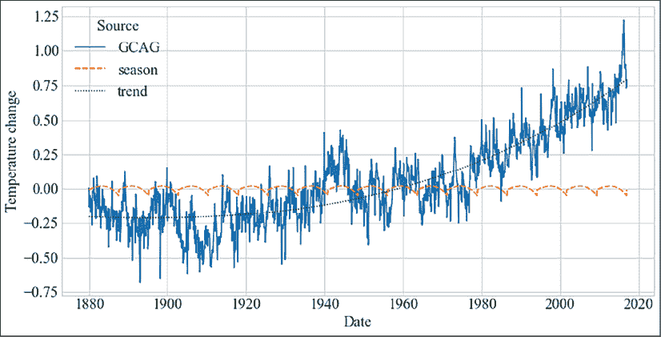

图 2.9:从 19 世纪末到今天的气温变化

这是为了说明您可以使用 NumPy 中的插件功能进行曲线拟合，以便找到趋势和季节性。如果你想做进一步的实验，你可以试试多项式的次数或者季节性成分，看看你是否能得到更好的拟合，或者找到另一个季节性成分。我们可以使用其他库中的功能，比如`statsmodels`中的`seasonal.seasonal_decompose()`，或者脸书的 Prophet，它使用傅立叶系数分解季节成分。

现在我们已经看到了如何估计季节性和趋势，让我们继续其他统计和可视化。继续污染数据集，并选取我们在*第一章*中看到的脑电图数据集，我们将用 Python 实际展示如何获得这些统计数据和图表，以及如何识别趋势和季节性。

**自相关**是信号与其自身滞后版本的相关性。自相关图将自相关绘制为滞后的函数。自相关图有助于找到重复模式，常用于信号处理。自相关可以帮助发现周期信号。让我们画出污染数据的自相关图:

```
pollution = pollution.pivot("Year", "City", "SPM")

pd.plotting.autocorrelation_plot(pollution['London']) 
```

这是我们得到的图:

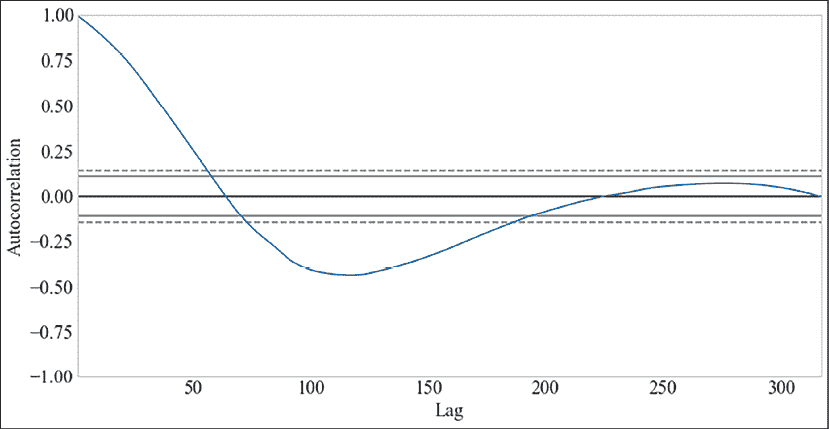

图 2.10:伦敦污染的自相关图

我们可以看到仅滞后几年的高度自相关。在大约 100 年时有一个负自相关，此后自相关保持在 0 左右。

SPM 的曲线图清楚地表明空气污染不是一个稳定的过程，因为自相关不是平坦的。你也可以比较污染的运行，显示有一个**趋势**，因此平均值也发生变化——这是该系列不稳定的另一个迹象。

我们也可以用统计数据来检验这一点。对平稳性的测试是增强的 Dickey-Fuller 测试:

```
from statsmodels.tsa import stattools

stattools.adfuller(pollution['London']) 
```

```
(-0.33721640804242853,

 0.9200654843183897,

 13,

 303,

 {'1%': -3.4521175397304784,

  '5%': -2.8711265007266666,

  '10%': -2.571877823851692},

 1684.6992663493872) 
```

第二个返回值是 p 值，其给出的显著性或获得测试结果的概率至少与给定零假设的观察值一样极端。当 p 值低于 5%或 0.05 时，我们通常会拒绝零假设，我们可以假设我们的时间序列是平稳的。在我们的例子中，我们不能假设级数是平稳的。

我们在*第一章*、*用 Python* 介绍时间序列中看到**脑电图** ( **EEG** )信号的图形，我们提到过 EEG 信号在几个频率范围显示脑电波。

我们可以很好地想象这个。让我们用 Python 一步步来。我们首先需要做一些导入工作:

```
import pandas as pd

import matplotlib.pyplot as plt

from matplotlib.dates import DateFormatter

import seaborn as sns

from sklearn.datasets import fetch_openml 
```

OpenML 是一个提供基准数据集和比较机器学习算法的网站的项目。scikit-learn 库提供了一个 OpenML 接口，允许我们从 OpenML 中获取数据。整个测量跨越 117 秒。因此，我们需要在熊猫中正确设置这个索引:

```
eeg = fetch_openml(data_id=1471, as_frame=True)

increment = 117 / len(eeg['data'])

import numpy as np

index = np.linspace(

    start=0,

    stop=increment*len(eeg['data']),

    num=len(eeg['data'])

)

ts_index = pd.to_datetime(index, unit='s')

v1 = pd.Series(name='V1', data=eeg['data']['V1'].values, index=ts_index) 
```

我们可以直接分割数据集。请注意`DatetimeIndex`是在 1970 年锚定的，但是我们在这里可以安全地忽略这一点:

```
slicing = (v1.index >= '1970-01-01 00:00:08') & (v1.index <='1970-01-01 00:01:10.000000000')

v1[slicing] 
```

这是切片:

```
1970-01-01 00:00:08.006208692    4289.74

1970-01-01 00:00:08.014019627    4284.10

1970-01-01 00:00:08.021830563    4280.00

1970-01-01 00:00:08.029641498    4289.74

1970-01-01 00:00:08.037452433    4298.46

                                  ...   

1970-01-01 00:01:09.962547567    4289.74

1970-01-01 00:01:09.970358502    4283.08

1970-01-01 00:01:09.978169437    4284.62

1970-01-01 00:01:09.985980373    4289.23

1970-01-01 00:01:09.993791308    4290.77

Name: V1, Length: 7937, dtype: float64 
```

这种切片避免了在 1:20 左右出现的伪影，即强尖峰。

我们在*第一章*中看到的图表，我们可以绘制如下:

```
date_formatter = DateFormatter("%S")

ax = v1[slicing].plot(figsize=(12, 6))

ax.xaxis.set_major_formatter(date_formatter)

plt.ylabel('voltage') 
```

这是图表:

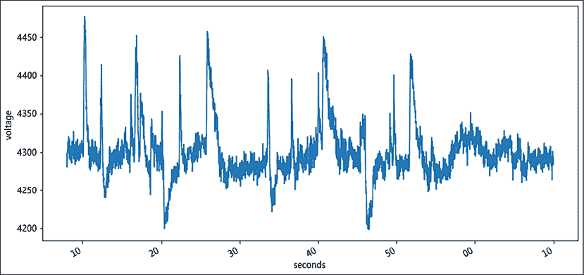

图 2.11:脑电图信号中电压随时间的变化

这是脑电图信号随时间变化的曲线图。

我们还可以对数据进行重新采样，以更粗略的方式查看序列，分辨率更低，例如:

```
plt.subplot(311)

ax1 = v1[slicing].resample('1s').mean().plot(figsize=(12, 6))

ax1.xaxis.set_major_formatter(date_formatter)

plt.subplot(312)

ax1 = v1[slicing].resample('2s').mean().plot(figsize=(12, 6))

ax1.xaxis.set_major_formatter(date_formatter)

plt.subplot(313)

ax2 = v1[slicing].resample('5s').mean().plot(figsize=(12, 6))

ax2.xaxis.set_major_formatter(date_formatter) 

plt.xlabel('seconds'); 
```

这是一个图表，其中有三个子曲线，我们分别从 1 秒、2 秒和 5 秒的频率重采样中获得:

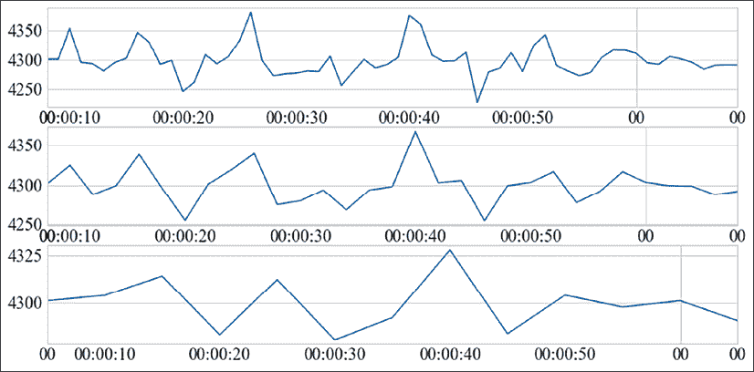

图 2.12:重新采样的 EEG 信号

根据应用，图中每个重采样的信号对分析可能或多或少有用。对于高频分析，我们根本不应该进行重采样，而如果我们试图尽可能多地消除噪声，我们应该以更粗的时间分辨率进行重采样。

我们可以在光谱密度图上看到周期性活动。我们可以通过傅立叶变换来实现。这里，我们使用 Welch 方法,该方法在应用离散傅里叶变换之前对时间进行平均:

```
from scipy import signal

fs = len(eeg['data']) // 117

f, Pxx_den = signal.welch(

    v1[slicing].values,

    fs,

    nperseg=2048,

    scaling='spectrum'

)

plt.semilogy(f, Pxx_den)

plt.xlabel('frequency [Hz]')

plt.ylabel('PSD [V**2/Hz]') 
```

光谱密度图，即**周期图**，看起来像这样:

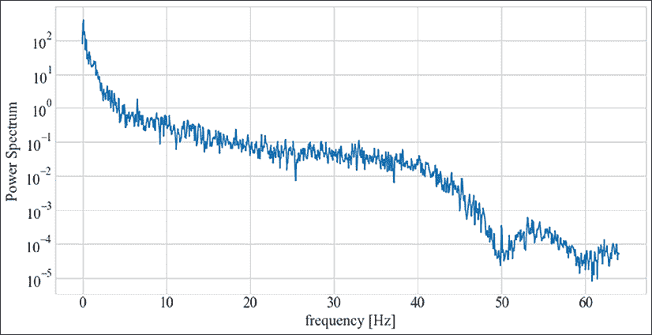

图 2.13:脑电图信号的周期图

此图中的信息类似于我们为污染绘制的自相关图，然而，它给了我们关于某些频率有多突出的信息。在这种情况下，我们看到低频特别强大。换句话说，信号显示出缓慢的振荡。

本章到此结束。让我们总结一下我们已经讲过的内容。

# 摘要

在这一章中，我们介绍了从时间序列中提取摘要和其他统计信息的过程。我们将这一过程分解为理解变量、揭示变量之间的关系以及识别趋势和季节性。

我们介绍了 datetime 和 pandas，TSA 中的必要条件库*和它们的时间序列功能；比如重采样。在本章中，我们列出并定义了许多汇总统计数据，包括均值、标准差、中位数、SE、置信区间、皮尔逊相关和协方差。*

我们还谈到了季节性、周期性变化和平稳性的概念。我们讨论了为什么平稳性很重要，以及如何测试平稳性。

我们还展示了 Matplotlib 和 Seaborn 的绘图功能，以及如何生成不同的图，如运行图、时间线图、相关热图、直方图、散点图、自相关图和周期图。在实际例子中，我们使用了自相关图和周期图，前者显示了不同时间步长之间的相关性，后者显示了功率谱密度。