# 四

# 时间序列的机器学习导论

在前几章中，我们已经讨论了时间序列、时间序列分析和预处理。在这一章，我们将讨论时间序列的机器学习。**机器学习**是通过经验改进算法的研究。这些算法或模型可以基于数据做出系统的、可重复的、有效的决策。本章旨在介绍我们将在本书剩余部分使用的大部分内容的上下文和技术背景。

我们将讨论机器学习在时间序列中的不同类型的问题和应用，以及与机器学习和时间序列分析相关的分析类型。我们将解释时间序列的主要机器学习问题，如预测、分类、回归、分割和异常检测。然后我们将回顾与时间序列相关的机器学习的基础知识。然后，我们将看看时间序列的机器学习的历史和当前用途。

我们将讨论以下主题:

*   基于时间序列的机器学习
    *   监督、非监督和强化学习
    *   机器学习的历史
*   机器学习工作流
    *   交叉验证
    *   时间序列的误差度量
    *   比较时间序列
*   时间序列的机器学习算法

我们将从时间序列的机器学习的一般介绍开始。

# 基于时间序列的机器学习

在这一节中，我将介绍时间序列机器学习的应用和主要类别。

时间序列的机器学习方法在经济学、医学、气象学、人口学等领域至关重要。时序数据集无处不在，出现在医疗保健、经济学、社会科学、物联网应用、运营管理、数字营销、云基础设施、机器人系统模拟等不同领域。这些数据集具有巨大的实际重要性，因为它们可以用来更有效地预测和预测异常检测，从而支持决策制定。

时间序列机器学习的技术应用在技术上比比皆是。一些应用如下:

*   曲线拟合
*   回归
*   分类
*   预测
*   细分/聚类
*   异常检测
*   强化学习

我们将在本书中研究这些技术应用。这些不同的应用程序背后有不同的统计方法和模型，它们可以重叠。

让我们简单地浏览一下这些应用程序，以便在接下来的章节中对它们有一个大致的了解。

**曲线拟合**是将一个数学函数(一条曲线)拟合到一系列点的任务。该数学函数由参数定义，并且这些参数通过优化来适应时间序列。曲线拟合可用作图表上的视觉辅助或用于推断(外推法)。

**回归**是一个总括术语，指用于寻找自变量(特征)和自变量(目标)之间关系的统计方法。例如，我们可以根据二氧化碳和甲烷的释放来预测准确的温度。如果有一个以上的结果变量，这被称为多目标(或多输出)。这方面的一个例子是同时预测不同位置的温度。

当问题是给一个时间序列(或其一部分)分配标签时，这被称为**分类**。回归的主要区别在于预测是分类的而不是连续的。用于分类的模型通常被称为分类器。当恰好有两个类别时，分类可以是二元的；当有更多类别时，分类可以是多类别的。一个例子是在 EEG 信号中检测眼球运动或癫痫。

对未来做出预测被称为预测。预测只能基于时间序列值本身或其他变量。这些技术可以从曲线拟合到外推，从当前趋势和可变性的分析到复杂的机器学习技术。例如，我们可以根据过去 100 年的数据预测全球气温，或者我们可以预测一个国家的经济状况。预测的反义词是**回溯**，我们对过去做出预测。在我们有数据可用之前，我们可以回溯温度。

**分段**或**聚类**，是将部分时间序列分组为不同状态、行为或基线的聚类(或段)的过程。一个例子是脑电波的不同活动水平。

在时间序列的背景下，**异常检测**，也称为**异常检测**，是识别罕见或异常事件的任务。这些可能是新奇的，政权的变化，噪音，或者只是例外。一个相当简单的例子是电压突然下降时可以检测到的电网断电。举例来说，更微妙的可能是在某段时间内呼叫中心的呼叫数量的增加。在这两种情况下，异常检测都可以提供可操作的业务洞察。异常检测技术的范围从简单的阈值或统计到一组规则，再到基于时间序列分布的基于模式的方法。

最后，**强化学习**是基于从一系列决策中获得最大预期回报的学习实践。强化学习算法被用在高度不确定的环境中。这可能意味着条件不稳定(高度变化)或普遍缺乏信息。应用程序是股票交易或一般拍卖中的投标和定价算法，以及控制任务。

让我们深入了解一下这些术语的含义。

## 监督、非监督和强化学习

机器学习可以大致分为有监督、无监督和强化学习，如下图所示:

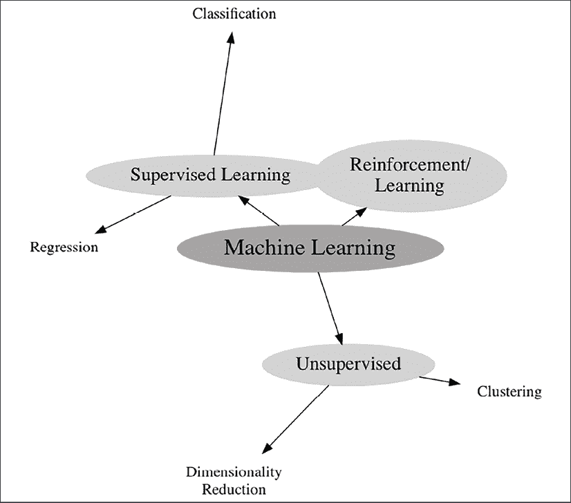

图 4.1:将机器学习分类

在**监督**学习中，特征在一个被称为**预测**的过程中被映射到结果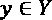(有时是**推理**)。

在有监督的情况下，参数是从标记的观察值中估计的。我们需要将每个观察的结果作为**目标**列(或复数列)提供。

因此，机器学习算法找到了从 X 到 y 的映射。

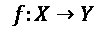

函数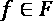只是输入分布 X 到输出分布 y 的一种可能的映射或模型

监督机器学习可以分为分类和回归。在回归中，我们的目标是连续的，目标是预测值。

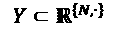

目标 Y 可以是实值，可以是单个值，也可以是更高维度(多输出)。

标注在长度上与数据集匹配，但是每个观测值也可以有多个标注(多输出)。

一个例子是某一天商店售出的产品数量或下个月通过管道输送的石油数量。这些特征可以包括当前销售、需求或一周中的某一天。

在**分类**中，目标是预测观察值的类别。在这种情况下，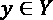可以从分类分布中提取，分类分布由序数值组成，例如，像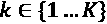中的整数。

有时，我们希望找到一个函数，它能给出给定观察值的概率或分数:

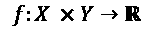

在实践中，回归和分类是非常相似的问题，通常回归和分类算法可以互换使用。然而，理解这种区别对于以适当的方式处理任何特定的问题是至关重要的。

在时间序列**预测**中，将历史值外推至未来。唯一的特征是过去的值。例如，我们可以根据过去两年的呼叫量来估计下个月呼叫中心的呼叫量。预测任务可以是单变量的，依赖并推断单个特征，或者是多变量的，其中多个特征被预测到未来。

在**无监督**学习中，算法的任务是根据观察值的特征对其进行分类。无监督学习的例子是聚类或推荐算法。

在本书的大部分内容中，我们将讨论有监督的算法，尽管我们也将讨论无监督的任务，如变化检测和聚类。

映射函数 f 预测一个结果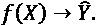每个函数由一组参数指定，并且优化产生一组使 Y 和之间的失配最小化的参数。通常，这是启发式的。

Y 和之间的匹配(不匹配)由误差函数测量，因此优化包括估算函数 f 的参数，使误差最小化:

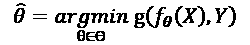

在这个公式中，由于误差函数是优化的一部分，被称为**目标函数**。

在**强化学习**中，智能体通过行动与环境互动，并以奖励的形式获得反馈。你可以在*第十一章*、*时序强化学习*中找到更多关于时序强化学习的内容。

与监督学习中的情况相反，没有标记的数据可用，而是基于对累积回报的期望来探索和利用环境。

**机器学习**，对随着经验而改进的算法的研究，可以追溯到 20 世纪 60 年代，那时统计方法(在*第 1 章*、*用 Python* 讨论)被发现。让我们从机器学习的简史开始，给出一些背景。这将提供更多的术语和机器学习主要方向的基本概念。我们将在适当的章节中给出一些更详细的上下文。

## 机器学习的历史

1943 年，沃伦·麦卡洛克和沃尔特·皮茨将生物神经网络概念化为一种数学模型，这是人工神经网络的基础。

弗兰克·罗森布拉特(Frank Rosenblatt)在 1958 年开发了所谓的**感知器**，用今天的话来说就是**全连接前馈神经网络**。这个示意图显示了一个带有两个输入神经元和一个输出神经元的感知器(基于维基共享资源上的一张图片):

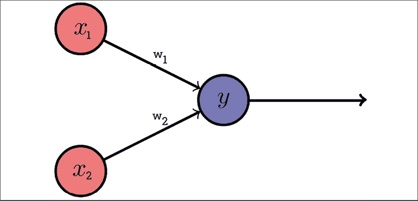

图 4.3:感知器

到输出神经元 *y* 的连接具有权重*w*1 和*w*2。这是一个简单的线性模型。

另一个重要的步骤是错误如何通过网络向后传播。亨利·j·凯利不久后(1960 年)出版了《反向传播基础知识》( T33)作为训练这些网络的机制。

然而，当马文·明斯基和西蒙·派珀特在 1969 年出版了《感知机》*一书时，这项研究受到了严重的打击，这本书简单地证明了线性函数(如在 2 层感知机中)不能模拟非线性函数。根据作者的说法，这意味着感知器在实践中不会有用或有趣。感知机可以有两层以上，其参数可以通过反向传播来学习，这一事实在书中被掩盖了。人工神经网络的研究直到 20 世纪 80 年代才再次兴起。*

 *最近邻算法是由 Evelyn Fix 和 Joseph Hodges 在 1951 年描述的，然后在 1967 年由 Thomas Cover 和 Peter E. Hart 扩展。最近邻算法可以应用于分类和回归。它通过检索新数据点和数据集中所有已知实例之间的 k 个最相似实例来工作(k 是一个参数)。在分类的情况下，算法投票给最频繁的标签；在回归的情况下，它对标签进行平均。

另一个重要的里程碑是决策树算法的发展。ID3 决策树算法(迭代二分法 3)由 Ross Quinlan 在 1979 年的一篇论文中发表，是今天使用的决策树的前身。

**CART** 算法(**分类和回归树**)由 Leo Breiman 于 1984 年发表。ID3 的后代 **C4.5** 算法于 1992 年问世(Ross Quinlan)，今天被视为机器学习的里程碑。

决策树的革命性之处在于它由阶跃函数组成，这些函数将数据点的特征空间划分为具有相似结果的口袋。虽然许多机器学习算法在有许多交互需要考虑时会遇到困难，但决策树在这些情况下会茁壮成长。下图说明了决策树的样子:

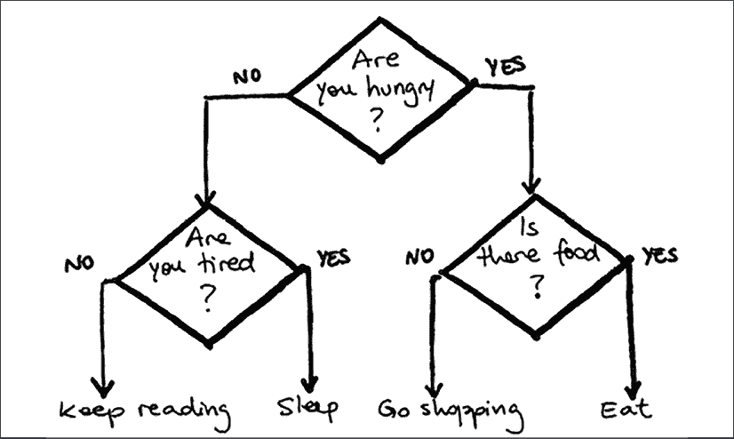

图 4.4:决策树

树中的每个节点或分割是基于特性值的单个问题。在树构造期间的每次迭代中，应用称为分裂标准的统计函数来决定要查询的最佳特征。分割标准的典型选择是基尼系数或信息熵，这两者都可以最小化分支内目标的可变性。

决策树反过来又构成了集成技术的基础，如随机森林或梯度提升树。主要有两种合奏技术:提升和装袋。 **Boosting** 是罗伯特·沙皮雷在 1990 年发明的，由一个级联的增量式增加基础学习者组成。一个**基础学习器**(也叫**弱学习器**)是一个非常简单的模型，它本身与目标只有微弱的关联。每次向现有基础学习者添加新的基础学习者时，训练集中数据点的重要性(权重)都会重新平衡。

这意味着在每次迭代中，算法会处理越来越多的样本，从而提高基础学习者的精确度。

这形成了自适应增强算法 **AdaBoost** 的基础，该算法为其发明者 Yoav Freund 和 Robert Schapire 赢得了哥德尔奖，这是对理论计算机科学领域杰出论文的著名认可。

此图(来自维基百科)显示了每个基本分类器随后如何在数据集的不同子集上进行训练，其中每个新训练的权重都有所变化:

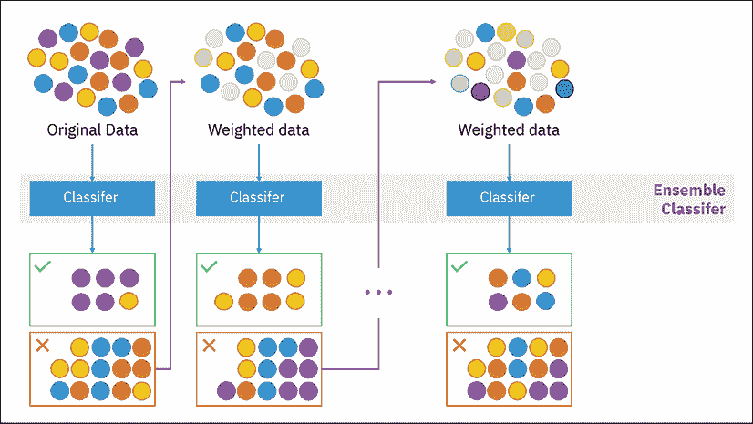

图 4.5:增强

**装袋**是随机森林的基础，1994 年由 Leo Breiman 发明。打包由两部分组成，引导和聚集。 **Bootstrapping** 是用来自训练集的替换对进行采样。可以对每个样本单独训练一个单独的模型。这些模型共同组成了一个整体。然后，可以将单个模型的预测汇总成一个组合决策，例如，通过取平均值。

下图(来源:维基百科)显示了如何训练袋装集合并用于预测。这就是一个**随机森林** (Leo Breiman，2001)如何以决策树作为基础学习者来学习。

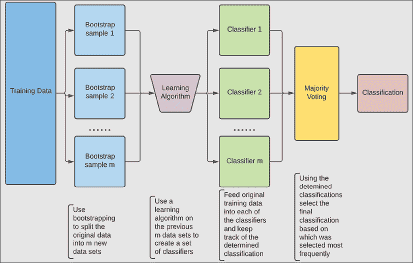

图 4.6:装袋

下表显示了装袋和增压的主要区别:

|  | 制袋材料 | 提升 |
| 基础学习者接受培训: | 独立学习(可以并行学习) | 继续地 |
| 重量为: | 保持不变 | 每次迭代后都改变 |
| 基础学员的权重为: | 平等地 | 根据训练表现 |

图 4.7:装袋和增压之间的区别

**梯度增强**(由 Friedman 等人开发)是使用非 hyphenate 的增强的进一步扩展。在梯度增强中，以与损失函数的负梯度最大相关的方式添加新的弱学习器。以下是梯度增强树的一些流行实现:

*   CatBoost(Yandex 的安德烈·谷林和其他人)
*   光梯度推进机(微软的 LightGBM)
*   XGBoost

反向传播在 1986 年被大卫·鲁梅尔哈特、杰弗里·辛顿和罗纳德·j·威廉姆斯重新发现。不久之后，更深层次的网络被开发出来，可以应用于更有趣的吸引注意力的问题。

1995 年至 1997 年间，塞普·霍克雷特(Sepp Hochreiter)和于尔根·施密德胡伯(Jürgen Schmidhuber)提出了一种循环神经网络架构，即**长短期记忆** ( **LSTM** )。多年来，LSTMs 为语音识别、翻译等许多应用提供了最先进的。今天，循环神经网络已经在很大程度上被变压器或神经网络所取代，甚至用于序列建模任务。随着 LSTM 对计算资源的高需求，一些人甚至认为 LSTM 已经过时了。

**支持向量机** ( **SVMs** )是由 Vladimir Vapnik 和他的同事基于 Vapnik 和 Chervonenkis 描述的统计学习框架于 20 世纪 90 年代早期在贝尔实验室开发的。在分类中，支持向量机最大化投影空间中两个类别之间的距离。作为训练的一部分，构建了一个超平面，称为支持向量，用于分离正例和负例。

在下一节中，我们将介绍机器学习建模的基础知识和模型验证的科学实践。

# 机器学习工作流

在下一节中，我们将介绍时间序列和机器学习的基础知识。

机器学习主要处理数字数据，这些数据以表格形式显示为大小为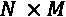的矩阵。布局一般是每行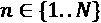代表一个观察，每列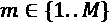代表一个特征。

在时序问题中，与时间相关的列不一定作为特征，而是作为对数据集进行切片和排序的索引。然而，时间列可以被转换成特征，正如我们将在第 3 章、*预处理时间序列*中看到的。

每个观察由 M 个特征的向量来描述。虽然一些机器学习算法可以在内部处理非数字数据，但通常情况下，每个特征要么是数字，要么在输入机器学习算法之前被转换为数字。转换的一个例子是将男性表示为 0，女性表示为 1。简而言之，每个特性可以定义如下:

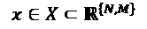

机器学习工作流程可以分为三个过程，如下图所示。我添加了数据加载和时间序列分析，这通知了机器学习。

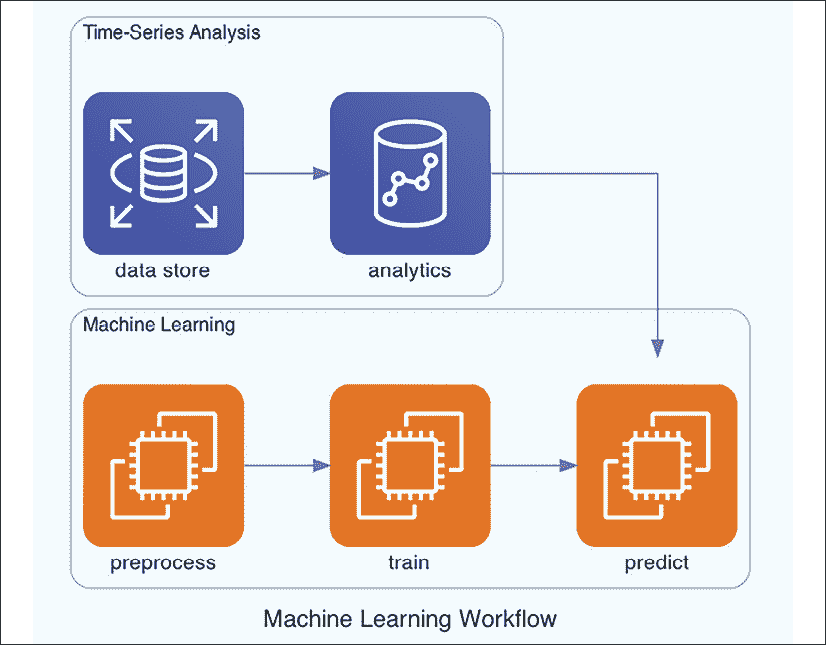

图 4.8:机器学习工作流程

我们首先必须转换(或预处理)我们的数据，训练或拟合模型，然后我们可以将训练好的模型应用于新数据。这个图表，可能非常简单，把重点放在机器学习过程的三个不同阶段。对于时序数据来说，每个阶段都有自己的挑战和特殊性。

这也有助于思考从输入到转换到训练再到预测的数据流。我们应该记住可用的历史数据及其局限性，以及用于预测的未来数据点。

在下一节中，我们将讨论交叉验证的一般原则。

## 交叉验证

乔治·博克斯在《机器学习》中有一句名言，我们在本书中已经见过他几次:“所有的模型都是错的，但有些是有用的。”

机器学习算法可以做出可重复的决策，如果控制正确，这些决策可以摆脱人类决策中的认知偏见。重点是通过验证性能来确保我们的模型是有用的。在机器学习中，对训练中没有见过的数据测试模型的过程称为交叉验证(有时，**样本外测试**)。

为了确保在有限大小的数据集上估计的参数对于更多的数据仍然有效，我们必须通过验证来确保质量。为了验证，我们通常将数据集分成至少两部分，训练集和测试集。我们在训练集上估计参数，然后在测试集上运行模型，以了解模型在看不见的数据点上的质量。下图对此进行了说明:

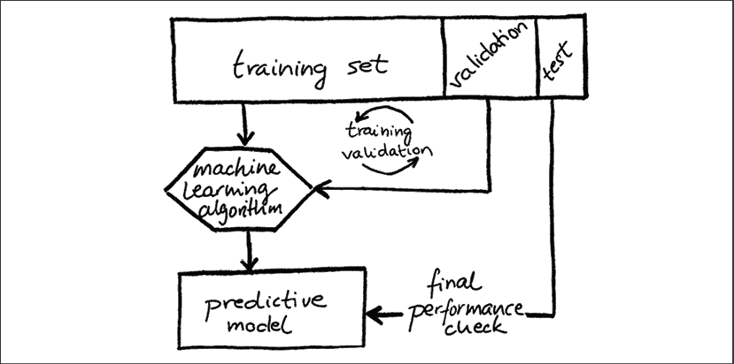

图 4.9:交叉验证

通常，在机器学习中，我们会在训练和测试之间分开之前随机洗牌。然而，在时间序列中，我们会用旧的数据点进行训练，用新的数据点进行测试。例如，有了 1 年的客户电子邮件打开倾向数据，我们将在 9 个月的数据上训练模型，在 2 个月的数据上验证我们的模型，并在数据集上测试最终性能。

在测试集检查涉及验证数据集的主测试过程的意义上，验证和测试的使用可以被视为嵌套过程。通常，验证集和测试集的分离会被忽略，因此数据集只分为定型集和测试集。

关于术语的一个注意事项:当一个**损失函数**是用于训练你的模型的优化的部分时，一个**度量**是用于评估你的模型的。评估可以是事后的、培训后的或培训期间的，作为附加信息。在这一节中，我们将讨论度量和损失函数。

在项目开始时评估如何度量性能是一个好的实践。我们需要选择如何衡量绩效，以将业务问题转化为衡量标准或损失。有些算法允许灵活选择目标函数，有些则不允许，但是我们可以用不同的度量来衡量性能。

接下来，我们将讨论回归和分类的误差和损失度量。

## 时间序列的误差度量

时序数据被定义为一组包含不同时间点细节的数据点。通常，时间序列数据包含以相等的时间间隔采样或观察的数据点。

对于我们之前讨论的不同应用程序，我们需要能够量化模型的性能，无论是回归、分类还是其他类型的模型，并选择一个度量来捕获我们想要实现的性能。一旦我们为模型选择了度量标准，我们就可以构建和训练模型来改进它们。通常，我们会从一个更简单的模型开始，然后尝试改进这个更简单模型的性能作为基线。最后，我们希望根据我们的度量找到最好的模型。

在这一部分，我们将讨论常用的性能指标及其属性。通常，对于一个误差度量，值越小，预测(或预报)越好。在改变我们模型的参数时，我们想减少误差。

对于任何任意应用程序或数据集来说，都没有一个合适的指标。根据数据集的不同，您可能需要搜索和尝试不同的误差指标，看看哪一个最能抓住您的目标。在某些情况下，您甚至可能想要定义自己的度量标准。

### 回归

时间序列回归的任务是识别与时间序列行为相关的特征中的模式和信号，例如，技能如何随着实践投入的时间而提高。

在训练期间，当您的回归模型给出训练集的结果时，我们可以利用一个将模型输出与训练集值进行比较的指标，并且在验证期间，我们可以计算相同的度量，以了解我们的回归预测符合验证集目标的程度。误差度量总结了机器学习模型预测的值与实际值之间的差异。

如果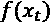是的预测，时间步长 *t* 的模型，实际目标值是*y*t，直观上，对于我们数据集的某个特定点 *t* ，预测误差**(也称为**预测误差**或**残差**)是目标的实际值与我们的模型预测值之间的差值:**

**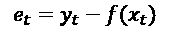

这将实际目标 Y 与预测目标进行比较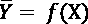。根据该公式，如果预测值比实际目标值高，则误差为负。残差的**平方和** (SS，也称**残差平方和**)忽略了误差的方向:

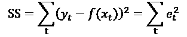

虽然残差和残差平方和已经可以用来衡量时间序列的预测性能，但它们通常不被用作回归度量或损失。

让我们从最常用的回归度量标准开始:决定系数**。这是一个相对简单的公式，基于残差的平方和 SS 与总平方和 TSS 的比值，TSS 是可变性的一种度量:**

**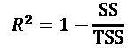

在这个分数中，提名者是残差的平方和，SS，无法解释的方差。

分母是 TSS，平方和。这被定义为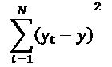，其中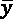是数列的平均值，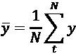。总平方和代表时间序列的解释方差。

基本上，我们测量的是残差平方和与时间序列总方差的关系。这个分数介于 0 和 1 之间，其中 0 是最好的，没有任何误差，通过从 1 中减去来反转，因此最终 0 是最差的，1 是最好的。

展开后，如下所示:

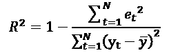

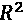表示从自变量可预测的因变量方差的比例。如上所述，它介于 0 和 1 之间，其中 1 表示有完美的关系，0 表示没有任何关系。

决定系数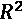不是一个误差测量值，因为误差测量值表示残差的分布，因此高是坏的，低是好的。然而，我们可以表达一个误差度量，让我们称之为的**r-误差(RE)** ，与上面的非常相似，如下所示:

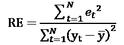

这个在实际中很少用到。与 re 非常相似的一个误差度量是**平均相对绝对误差** ( **MRAE** )，我们将在后面进一步讨论。

天真地说，我们可以取平均误差，取预测误差的平均值——平均误差:

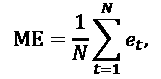

这里， *N* 是点数(或离散时间步数)。我们计算每个点的误差，然后取所有这些误差的平均值。

如果 ME 是正的，模型系统地低估了目标，如果它是正的，它总体上高估了目标。虽然这很有用，但是对于误差度量来说，这是一个严重的问题，因为正负误差的影响会相互抵消。因此，较低的 ME 并不意味着预测是好的，而是平均值接近于零。

此外，大多数回归模型包含一个等于目标平均值的常数项，因此该值正好为 0。总之，我们的天真措施在实际环境中毫无用处。

我已经包括了 ME，用于讨论为什么大多数常用的度量放弃了错误的方向，以及强调基本错误度量的主要组成部分的重要性:

*   剩余操作
*   整合

在 ME 的情况下，残差操作是 identify 函数，这意味着残差不会改变。更多情况下，使用平方或绝对值函数。误差的积分通常是(算术)平均值，但有时是中值；然而，它可以是更复杂的操作。

实际上，最常见的误差指标是均方误差(MSE)、平均绝对误差(MAE)和均方根误差(RMSE)。下表定义了这些最重要的误差指标:

| 度量名称 | 定义 |
| 均方误差 | 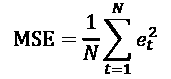 |
| 平均绝对误差 | 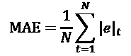 |
| 均方根误差 | 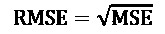 |

图 4.10:流行的回归度量

使用**均方误差(MSE)** ，我们计算每个点的残差，然后将它们平方，这样正负误差就不会相互抵消。然后我们取这些平方误差的平均值。MSE 为 0 表示性能完美。这可能发生在玩具数据集上，你可以拿它来玩玩；然而，在实践中，只有当您在构建数据集或验证时犯了错误，才会发生这种情况，因为现实生活总是比您可以用模型捕捉到的更复杂。

**平均绝对误差(MAE)** 与 MSE非常相似，只是我们不是对残差求平方，而是取它们的绝对值。与 MSE 相反，所有误差都是线性比例的(而不是平方的)。

取绝对值和取平方的主要区别在于如何处理异常值或极值。平方函数对差异很大的值施加较高的权重。对于 MSE，误差以二次方增长，而不是像 MAE 那样以线性增长。这意味着 MSE 对极值的惩罚要强烈得多，因此，与 MAE 相比，它对数据集中的异常值不太稳健。在选择适合工作的误差度量时，误差的分布是一个主要考虑因素。

另一个常见指标是**均方根误差(RMSE)** ，或**均方根偏差(RMSD)**，顾名思义，就是 MSE 的平方根。从这个意义上说，RMSE 是 MSE 的缩小版。在两者之间选择哪一个是一个表示选择——两者都会导致相同的模型。

作为一种选择，RMSE 的有趣之处在于它与预测变量具有相同的单位和比例，这使得它更加直观。最后，RMSE 相当于标准差或误差。标准偏差和误差分布之间的这种联系非常有意义，您可以用标准误差或置信区间等其他度量来总结误差分布(这两者我们已经在*第 2 章*、*使用 Python 进行时间序列分析*中讨论过)。

还有更多的指标，它们都有自己的用途。下表总结了时间序列建模中一些比较流行的误差指标:

| 度量名称 | 定义 |
| 中位数绝对误差 | 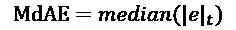 |
| 平均绝对百分比误差 | 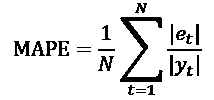 |
| 对称平均绝对百分比误差 | 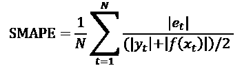 |
| 归一化均方误差 |  |

图 4.11:回归的更多度量

**中值绝对误差(MdAE)** 与 MAE相似。然而，代替积分的平均运算，采用了不同的平均值，即中值。由于中位数不受尾部值的影响，这种方法甚至比 MAE 更稳健。

**平均百分比误差(MAPE)** 是由目标标准化的平均误差。0 代表完美的模型，高于 1 意味着模型的预测系统地高于目标。MAPE 没有上限。此外，由于它根据目标(缩放或除以目标)处理百分比，正残差和负残差被不同地处理。因此，如果预测值大于目标值，则 MAPE 会高于另一个方向上相同误差的值。因此，根据残差的符号，MAPE 更高或更低！

分母的共同选择是目标；但是，您也可以通过预测和目标的平均值进行缩放。这被称为**对称平均绝对百分比误差(SMAPE)** 。SMAPE 不仅有一个下限，还有一个上限，这使得百分比更容易解释。

缩放也有不同的好处。如果您想要比较在不同数据集上验证的模型，前面介绍的方法不会有帮助。定型集、验证集和测试集之间的划分是随机的，因此当您比较模型性能时，任何这些度量都会混淆验证集中数据集方差的影响和模型性能本身的影响。

因此，**归一化均方误差(NMSE)** 比 MSE 更直观，因为它用偏差来衡量模型的性能。NMSE 对除以目标方差后获得的 MSE 进行归一化。

还有很多其他的误差测量方法。一些误差测量将预测与返回平均目标值的简单模型的预测进行比较。

这个简单模型的预测性能是:

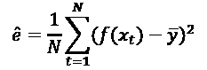

我们可以通过将预测误差除以这个假设的预测误差来归一化预测误差。

这样，我们可以定义其他几个度量:

| **公制名称** | **定义** |
| 平均相对绝对误差 | 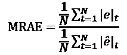 |
| 中值相对绝对误差 | 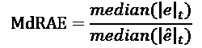 |
| 相对均方根误差 | 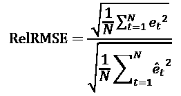 |

图 4.12:标准化回归度量

如果您对天真模型有所了解，并且希望通过除法比较具有相同误差度量的天真模型的性能，那么所有这些度量都应该是直观的。

**平均相对绝对误差** ( **MRAE** )与决定系数非常相似，唯一的区别是MRAE 取平均值而不是总和。

另一个误差是**均方根对数误差** ( **RMSLE** )。

| **度量名称** | **定义** |
| 均方根对数误差 | T38 |

图 4.13:均方根对数误差

在 RMSLE 的情况下，您将残差的对数作为基本操作。这是为了避免在预测值和真实值都非常高的情况下，对误差中的较大差异进行惩罚。由于对数的拐点在 1，RMLSE 具有独特的性质，它对实际值低估的惩罚比对高估的惩罚更严重。当误差分布不遵循类似于我们在*第 3 章*、*预处理时间序列*中讨论的缩放操作的正态分布时，这可能是有用的。

如果我们考虑基于熵的度量，比如泰尔的不确定性，我们可以扩展度量的数量。**泰尔的 U** 是总预测误差的标准化度量。u 介于 0 和 1 之间，其中 0 表示完全适合。它基于条件熵的概念，也可以用作不确定性的度量，甚至可以用作分类-分类情况下的相关性度量。

正如这些标题所说，前两个集中于量化模型的性能。最后一部分对于基于距离的模型很有用，它通常被用作性能的坚实基线。

让我们切换到分类任务的错误度量。

### 分类

许多度量特定于更多的二进制分类(其中正好有两个类)，尽管其中一些可以扩展到多类分类的情况，其中类的数量大于两个。

在二元分类中，我们可以在**混淆矩阵**中将预测与实际结果进行对比，其中预测与实际结果交叉列表如下:

|  |  | **实际结局** |
|  |  | 假 | 真 |
| **预测结果** | 假 | 真阴性(TN) | 假阴性(FN) |
| 真 | 假阳性(FP) | 真阳性(TP) |

图 4.14:混淆矩阵

对于分类任务来说，这是一个至关重要的可视化，许多措施都是基于总结这一点。

分类的两个最重要的指标是精确度和召回率。**召回**是所有阳性实例中正确预测的阳性实例数量的比率。我们也可以用混淆矩阵来说明这一点，如下所示:

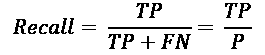

召回率也被称为**真阳性率**或**灵敏度**。它专注于真实的预测，忽略了负面的实例；然而，我们可能也想知道积极的预测有多准确。这个就是**精度**定义为:

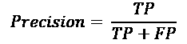

我们可以将这两个指标形象化如下:

图 4.15:假阳性(FP)、真阳性(TP)和假阴性(FN)

在该图中，显示了**假阳性** ( **FP** )、**真阳性** ( **TP** )和**假阴性** ( **FN** )。您可以看到实际为真的实例，被模型分类为为真的实例，以及两个为真且被模型分类为真的实例的交集。

我们可以快速统计和计算精度和召回率。我们有四个真阳性和六个假阳性。因此，本例的精度为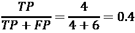。

我们有四个假阴性。召回是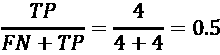。

查全率和查准率显然都很重要，为什么不整合呢？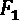分数是精度和灵敏度的调和平均值:

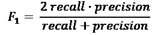

我们还可以参数化召回和精度的相对重要性。这是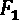分数的一般化版本，即分数:

另一个非常有用的指标来自**接受者操作者曲线(ROC)** ，它绘制了在不同阈值设置下**真阳性率** ( **TPR** )对假阳性率 ( **FPR** )。**假阳性率**，也称为**假警报率**，与真阳性率(召回)类似地定义为:

ROC 图显示了敏感性和特异性之间的关系，一般认为很难同时做到这两者，并找到所有的阳性实例(敏感性)并正确地做。通常情况下，你必须在敏感性和特异性之间做出妥协。这个图说明了你的模型如何处理这个问题。曲线下的**区域总结了该图，是实践中经常使用的度量标准。**

另一个不太常见的度量是T42 相关比率，它是由卡尔·皮尔逊引入的，作为分类-连续关联的度量:

其中是类别 *x* 中的观察数量，我们定义:

相关比率基于单个类别内的方差和整个群体的方差。在[0，1]范围内，其中 0 表示类别不相关，1 表示类别与绝对确定性相关。

在下一节中，我们将检查时间序列之间的相似性度量。

## 比较时间序列

相似性度量在搜索、聚类、预测、回归和分类的时间序列索引中有应用，但是如果我们想要确定两个时间序列是否相似，我们如何度量相似性？

最简单的是使用皮尔逊相关系数；然而，其他措施可以提供更多信息。

我们将通过一系列的方法来比较一对时间序列:

*   欧几里得距离
*   动态时间扭曲
*   格兰杰因果关系

**欧几里德距离**，一种通用的距离，适用于任何一对向量，包括时间序列:

欧几里德距离可能是有用的；然而，在实践中，对于时间序列，你可以做得更好。您可以在通过快速傅立叶变换转换到频域的时间序列上获取欧几里德距离。

直观上，时间序列中事件的确切时间位置及其持续时间可以变化。**动态时间弯曲** ( **DTW** )是用于测量两个时间序列之间相似性的算法之一，这两个时间序列的速度可能不同。直观上，时间序列中事件的确切时间位置及其持续时间可以变化。时间序列之间的相似性度量应该能够处理这些类型的移动和延长。

总的来说，DTW 是一种根据启发法计算两个具有特定限制和规则的给定时间序列之间的最佳匹配的方法。基本上，它尝试将第一个序列的索引与另一个序列的索引进行匹配。DTW 是一个编辑距离——它表示将序列 t1 转换为 t2 的成本。

DTW 因其处理不同速度的能力而被应用于自动语音识别。然而，DTW 未能量化非匹配序列之间的差异。

DTW 被独立地应用于每个特征维度，然后可以对距离求和。或者，通过将两点之间的距离计算为所有维度上的欧几里德距离，扭曲可以同时覆盖所有特征。因此，这种依赖变形()是一种多元方法。

**格兰杰因果关系**决定了一个时间序列是否可以帮助预测另一个时间序列。虽然衡量标准中的真正因果关系问题是有争议的，但衡量标准认为一个序列的值在时间上优先于另一个序列的值，可以认为衡量标准显示了时间关系或预测意义上的关系。

格兰杰因果关系的概念和表述都非常直观。它的两个原则是(简化的):

1.  原因必须先于结果
2.  原因对结果有独特的影响

因此，如果我们可以拟合一个模型，表明 X 和 Y 有一种关系，其中 Y 系统地跟随 X，这就意味着 X 格兰杰原因 Y。

# 时间序列的机器学习算法

时间序列的机器学习中的一个重要区别是单变量和多变量之间的区别，其中算法是单变量的，这意味着它们只能处理单个特征，或者是多变量的，这意味着它们可以处理许多特征。

在单变量数据集中，每个事例都有一个系列和一个类标签。早期的模型(经典建模)侧重于单变量数据集和应用。这也反映在数据集的可用性上。

时间序列数据集最重要的存储库之一， **UCR** ( **加州大学河滨分校**)档案馆于 2002 年首次发布，为单变量时间序列提供了宝贵的资源。它现在包含大约 120 个数据集，但缺乏多元数据集。此外，M 竞赛(特别是 M3，4 和 5)有很多可用的时间序列数据集。

多元时间序列是具有多个特征维度的数据集。许多现实生活中的数据集本质上是多变量的——在实践中，多变量的情况比单变量的情况更常见。示例包括人体活动识别、基于**心电图** ( **心电图**)、**脑电图** ( **脑电图**)、**脑磁图** ( **脑磁图**)和系统监控。

直到最近(Anthony Bagnall 等人，2018)才创建了 **UAE** ( **东安格利亚大学**)档案库，拥有 30 个多元数据集。另一个多元数据集存档是 MTS 存档。

在下一节中，我们将简要讨论基于距离的方法。

## 基于距离的方法

在我们之前提到的 k-nearest-neighborhood方法(简称 kNN)中，训练样本被存储，然后，在需要对新数据点进行预测的推断时间，预测基于最近的 k 个邻居。这就需要例子之间的距离度量。

在本章的前面，我已经介绍了时间序列的两个度量标准，**动态时间弯曲** ( **DTW** )和欧几里德距离。许多基于距离的方法都采用这两者之一作为距离度量。

已经尝试的另一种方法是从时间序列中提取特征，然后存储这些提取的特征，以便用 kNN 进行检索。这些特征包括 shapelets 或**尺度不变特征** ( **SIFT** )。SIFT 特征是从时间序列中提取的极值周围的形状(阿狄丽娜·拜伊等人，2015)。

我们已经在*第 3 章*、*预处理时间序列*的单独章节中讨论了 shapelets 和 ROCKET，因此我们将保持它们的描述简短，但重点关注它们在机器学习中的应用。

## Shapelets

我们已经在*第 3 章*、*预处理时序*中讨论了 shapelets，所以我们在这里将保持简短。时间序列的 shape let 在研究论文“*时间序列 shape let*:*中提出，这是一种允许准确、可解释和快速分类的新技术*”(叶乐翔和埃蒙，2011)。shape let 的基本思想是将时间序列分解成不同的子部分(称为**shape let**)。已经提出了一些基于 shapelet 特征的方法。

**Shapelet 变换分类器**(**STC**；Hills 等人，2014)包括将 shape let 作为特征变换，然后将 shape let 输入到机器学习算法中。他们测试了 C4.5 决策树、朴素贝叶斯、1NN、SVM 和旋转森林，但在分类设置中没有发现这些方法之间的任何显著差异。

**广义随机小形森林**(**gRFS**)；Karlsson 等人，2016)遵循随机森林的思想。每个树都建立在一组不同的随机长度的 shapelets 上，这些 shapelets 是从每个树的一个随机维度中提取的。在这些 shapelets 的基础上训练决策树。这些随机的 shapelet 树然后被集成为集合模型，这就是 gRFS。

## 火箭

我们已经在第三章*、*预处理时序*中解释过火箭。每个输入特征分别由 10，000 个随机核进行变换(这个数字可以改变)。实际上，这是一个非常快速的过程。这些转换后的特征可以输入到机器学习算法中。其发明者 Angus Dempster、Franç ois Petitjean 和 Geoff Webb 在原始出版物(2019)中推荐了一个线性模型。*

最近，一个新的变种 MINIROCKET 发布了，它比 ROCKET 快了大约 75 倍，同时保持了大致相同的精度——*mini ROCKET:一个非常快速(几乎)确定性的时间序列分类变换* ( *Angus Dempster，Daniel F. Schmidt 和 Geoff Webb，2020* )。

在机器学习研究中，**临界差异(CD)图**是比较多种算法结果的强大可视化工具。平均等级表示算法之间的相互关系(等级越低越好)。算法结果进行统计比较——一条水平线链接算法，它们之间的差异不能从统计上分开。

这里有一个关键的差异图说明了 MiniRocket 与其他算法的比较性能(来自 Dempster 等人的 MiniRocket repo):

图 4.16:在 UCR 档案馆的 109 个数据集上，与其他最先进的方法相比，MiniRocket 在准确性方面的平均排名

这些数字显示了该算法在测试中 109 个数据集上的排名。我们可以看到 MiniRocket 比 Rocket 好，但比 TS-CHIEF 和 HIVE-COTE 差，虽然两者之间的差异在统计上并不显著。

我们将在*第十章*、*时序深度学习*中讨论开始时间。下面几节将介绍提到的一些其他方法。

## 时序森林和典型区间森林

的主要创新点**时序林**(**TSF**；邓厚涛等人，2013)引入了入口增益作为树节点的分割标准。他们表明，基于简单特征(如均值、偏差和斜率)的集成分类器在计算效率(由于并行性)方面优于具有 DTW 的 1NN 分类器。

Geoff Webb 领导的一组研究人员引入的**邻近森林(PF)** 是一种基于每个时间序列与一组参考时间序列的相似性(基于距离的特征)的树集合。他们发现 PF 达到了与 BOSS 和 Shapelet 变换相当的分类性能。

**TS-CHIEF** ，是**异构和集成嵌入森林**的时间序列组合的缩写，来自同一个组的(Ahmed Shifaz，Charlotte Pelletier，Franç ois Petitjean 和 Geoff Webb，2020)，它用基于字典(BOSS)和基于区间(RISE)的拆分器扩展了 PF，同时保留了 PF 引入的原始特性。作者声称，根据数据集的大小，它可以比 HIVE-COTE 快 900 倍到 46，000 倍。

**规范区间森林的理念**(**CIF**；由 Matthew Middlehurst，James Large 和 Anthony Bagnall 于 2020 年完成)是用 catch22 特性来扩展 TSF。它是基于 22 个捕获 22 特征和从相位相关间隔提取的汇总统计的时间序列树的集合。他们还对树使用了入口增益标准。

在下一节中，我们将描述符号方法的演变，从 BOSS 到**时态字典集合** ( **TDE** )。

## 象征方法

符号方法是将数字时间序列转换为字母表中的符号的方法。

**符号聚合近似** ( **SAX** )是由埃蒙·基奥和杰西卡·林在 2002 年首次发表的。它扩展了**分段聚合近似** ( **PAA** )，后者计算时间序列相等段内的平均值。在 SAX 中，这些平均值随后被量化(装箱)，因此字母表对应于原始数值的区间。两个重要的参数是 PAA 中的段的数量和仓的数量。

下面的图(来自 GitHub 上 Thach Le Nguyen 的 MrSEQL 库)说明了 SAX 的工作原理:

图 4.17: SAX

您可以看到区段是沿 *x* 轴的网格，而箱是沿 *y* 轴的网格。然后用平均值替换每个片段。通过在每个片段中用 bin ID(图中的字母)替换时间序列，将时间序列离散化。

**符号傅立叶近似**(**SFA**；Patrick Schä fer 和 Mikael hqvist，2012)也将时间序列转换为符号表示，但使用了频域。首先通过执行离散傅立叶变换、低通滤波、然后量化来降低数据集的维度。

SFA 符号的**包(BOSS**Patrick sch fer，2015 和 2016)基于 n-grams 的直方图，从 SFA 表示中形成**模式包** ( **BoP** )。BOSS 已经在向量空间中扩展为**BOSS(**BOSS VS**)。BOSS VS 分类器比现有技术快一到四个数量级，并且比 1-NN DTW 更精确。**

合约 BOSS(cBOSS；Matthew Middlehurst，William Vickers，and Anthony Bagnall，2019)通过引入一个限制基本模型数量的新参数来加速 BOSS。

**SEQL** (Thach Le Nguyen，Severin Gsponer，and Georgiana Ifrim，2017)是一种符号序列学习算法，使用贪婪梯度下降为线性模型选择最具鉴别性的子序列。这里举例说明了这一点(来自 MrSEQL GitHub repo):

图 4.18: SEQL

多重表示序列学习器(**Mrs eql**)；Thach Le Nguyen、Severin Gsponer、Iulia Ilie 和 Georgiana Ifrim，2019)正在通过选择多分辨率和多域的变换特征来扩展 SEQL。

**黄鼠狼+缪斯**(Patrick sch fer 和 Ulf Leser，2017 和 2018)由两个阶段的组成。WEASEL 代表**用于时间序列分类的单词提取**，MUSE 代表**多元无监督符号和导数**。这一点值得强调——虽然 WEASEL 是一个单变量方法，但 MUSE 将该方法扩展到了多变量问题。

在第一步中，WEASEL 从截断傅立叶变换和离散化的多个长度的窗口中导出特征。这类似于低通滤波器，只保留第一个 *l* 系数。然后这些系数被离散成固定大小的字母表，并在直方图中作为**模式包** ( **BOP** )计数。这是针对每个功能单独完成的。

在第二步(MUSE)中，直方图特征跨维度连接，并且统计测试(χ2 测试)用于基于过滤器的特征选择，从而产生更小但更具鉴别性的特征集。

然后将这些 bop 输入逻辑回归算法进行分类。

## 蜂巢

基于变换的集成的**分层投票集合** ( **HIVE-COTE** )在分类准确性方面是当前的技术状态。

它于 2016 年提出，并于 2020 年被采用(Anthony Bagnall 和其他人，2020 年)，是一种集合方法，结合了不同方法的异构集合:

*   **Shapelet 变换分类器** ( **STC** )
*   **时序森林** ( **TSF** )
*   **符号-傅立叶近似符号的可收缩包** ( **CBOSS** )
*   **随机区间光谱集合** ( **上升**)

**随机区间光谱集成(RISE** )是一种基于树的时间序列分类算法，最初作为**随机区间特征** ( **RIF** )与 HIVE-COTE 同时推出(Jason Lines，Sarah Taylor，and Anthony Bagnall，2016)。在 RISE 的每次迭代中，提取一组傅立叶、自相关和部分自相关特征，并训练决策树。RISE 的运行时复杂度是级数长度的二次方，这可能是个问题，已经发布了新版本， **c-RISE** ( *c* 为*契约*)，其中算法可以更早的停止。

HIVE-COTE 的运行时间复杂性是该系列长度的二次运行时间，是其采用的最大障碍之一。STC 和另一个模型**弹性系综** ( **EE** )是2016 年开始的原始算法中最慢的两个基础模型。新版本(1.0)的一个主要区别包括丢弃 EE。他们重新实现了 STC 和 BOSS，让它们更高效，他们用 c-RISE 代替了 RISE。

每个基础学习者都单独接受培训。基于 a **交叉验证** **准确度加权概率集合** ( **CAWPE** )结构对基础学习器进行概率加权(James Large、Jason Lines 和 Anthony Bagnall，2019)。

在发布的 HIVE-COTE 1.0 中，该小组表明，当用 TSF (2020)代替 CIF，用**时态字典集成** ( **TDE** ，2021)代替 BOSS 时，集成甚至更强。

在下一节中，我们将讨论不同方法的性能和权衡。

## 讨论

通常，在准确性和预测时间之间存在权衡，在这些方法中，时间复杂性和模型准确性存在巨大差异。这个图表说明了这个折衷(来自 Patrick Schä fer 的 SFA 的 GitHub 库):

图 4.19:机器学习算法:查询时间与准确度

特征可能是简单操作的结果，也可能是机器学习模型的结果。我们可以将二阶特征想象为原始特征的组合，将三阶特征想象为二阶特征的组合，以此类推，这是一个潜在的大型预处理管道，在其中组合和创建特征。

我们可以在这个表格中总结出种不同的算法:

| 类型 | 单变量的 | 多变量的 |
| 基于距离的 | DTW，邻近森林 | DTW D |
| 基于字典/符号 | 老板，CBOSS，S-BOSS，黄鼠狼，时态字典合奏(TDE)，萨克斯-VSM，老板 | 鼬+缪斯 |
| Shapelets | Shapelet 变换分类器(STC) |  |
| 基于区间和频谱 | 时间序列森林(TSF)，随机区间光谱集合(RISE) |  |
| 深度学习 | FCN 雷斯内特，最初时间 | TapNet |
| 全体 | 基于变换集成的分层投票集合(HIVE-COTE)，异构和集成嵌入森林的时序组合(TS-CHIEF) |  |

图 4.20:时序机器学习算法的详细分类

这个分类远非完美，但希望是有用的。TDE 既是一个整体，也是一个基于字典的模型。HIVE-COTE 基于 BOSS 特性。此外，两种特征化方法——随机卷积核变换(ROCKET)和规范时间序列特征(Catch22 ),分别对特征进行操作；然而，基于这些特征作为输入进行训练和预测的机器学习算法因此可以在多变量设置中工作。火箭特征与线性分类器一起确实被发现与多元方法相比具有很强的竞争力。由于维数高，机器学习模型可能会考虑原始特征之间的相互作用。

我向读者强烈推荐的一篇综述论文是亚历杭德罗·帕索斯·鲁伊斯、迈克尔·弗林和安东尼·巴格纳尔(2020)的《*多变量时间序列分类大赛*》。它在来自阿联酋档案的 26 个多元数据集上比较了最先进的算法(其中 16 个包含在分析中)。这些方法包括以下内容:

*   动态时间扭曲
*   缪斯+鼬
*   升高
*   CBOSS
*   TSF
*   gRSF
*   火箭
*   蜂巢 1.0
*   到岸价(Cost Insurance and Freight)
*   雷斯内特
*   卫星追踪委员会(Satellite Tracking Committee)

临界差异图(见[timeseriesclassification.com](http://timeseriesclassification.com))显示了测试中 26 个数据集的算法排名。算法之间的联系表明，它们之间的差异在统计上无法分开(基于 Wilcoxon 秩和检验):

图 4.21 时序分类算法的临界差异图

他们发现了一个由表现最好的分类器组成的小团体，其中排名最高的 ROCKET 在至少少一个数量级的时间内实现了相当大的改进。ROCKET 之后是 HIVE-COTE 和 CIF。

在 2019 年的一项研究中，哈桑·法瓦兹(Hassan Fawaz)和其他人比较了 MTSC 档案馆 12 个多元数据集的时间序列的深度学习算法。全连接卷积网络(FCN)是最好的，其次是 ResNet——在 UCR 知识库的 85 个单变量数据集上，ResNet 击败 FCN 成为第一名(在 85 个数据集的 50 个数据集上获胜)。在一项单独的比较中，仅涉及 ResNet 与一些最先进的非深度学习方法在单变量和多变量数据集上的比较，他们发现 ResNet 的性能落后于 HIVE-COTE，尽管在数据集上没有明显恶化，但击败了其他方法，如 BOSS 和 1NN 与 DTW(后者在统计上达到了显著的程度)。我们将在*第十章*、*时间序列的深度学习*中详细讨论这篇论文。

在另一项对来自 MTSC 档案馆的 20 个数据集的多变量时间序列分类的比较研究中(Bhaskar Dhariyal、Thach Le Nguyen、Severin Gsponer 和 Georgiana Ifrim，2020 年)，确定 ROCKET 在 14 个数据集上获胜，比大多数深度学习算法好得多，同时也是最快的方法——ROCKET 在 20 个数据集上的运行时间为 34 分钟，而 DTW 运行了几天。

以下是根据他们的结果使用 Hassan Fawaz 的 Python 脚本创建的关键图:

图 4.22:多元时间序列分类的临界差异图

人们尝试了许多不同的特性集，其中最好的(`9_stat_MulPAA`)并没有太大的变化。

## 履行

伟大的算法如果没有软件来提供，使它们在公司的生产环境中易于使用和可靠使用，那么在实践中就没有多大价值。或者，从头开始实现算法可能需要时间，并且不是没有复杂性。因此，Python 中有许多可靠、可用的实现是一件好事。

下表总结了回归和分类监督算法的实现:

| 算法 | sktime | Pyts |
| 自回归综合移动平均(ARIMA) | X |  |
| DTW | X | X |
| 蝙蝠 | X |  |
| 缪斯+鼬 | X | X |
| MrSEQL | X |  |
| 火箭 | X | X |
| 老板 | X | X |
| 向量空间中的 SFA 符号包(BOSSVS) |  | X |
| CBOSS | X |  |
| 萨克斯-VSM |  | X |
| 升高 | X |  |
| 蜂巢 | X |  |
| 时序森林 | X | sktime 有这么多实现也不是偶然。东安格利亚大学 Anthony Bagnall 周围的小组在研究活动中积极使用它。Pyts 由约翰·法乌齐和希查姆·贾纳蒂负责维护，他们是巴黎脑研究所和巴黎**应用数学中心** ( **CMAP** )的博士后。约翰·法乌齐也是 tslearn 库的负责人，该库实现了时间序列分析和特征提取算法。 |

Figure 4.23: Pyts versus SkTime implementations of machine learning algorithms

我从表中省略了深度学习算法，它们通常作为不同库的一部分来实现。请注意，sktime 允许通过相同的界面使用 prophet forecaster。比如 sktime-DL 库实现了 ResNet、InceptionTime、TapNet 算法，dl-4-tsc 实现了十几个深度学习模型。我们将在*第 10 章*、*时间序列的深度学习*中讨论深度学习模型的实现。

脸书的先知包含单一模型，是**广义可加模型** ( **GAM** )的特例。Statsmodels 库包含GAM 以及线性回归模型和**广义线性模型**(**)**移动平均**(**MA**)**自回归综合移动平均**(**ARIMA**)**向量自回归** ( **VAR** )。**

 **Darts 库为时序处理和预测的多个模型提供了一致的接口。它包括经典和深度学习算法:

指数平滑法

*   ARIMA
*   时间卷积网络
*   变压器
*   n 拍
*   这就结束了我们对 Python 中时序机器学习库的概述。

摘要

# 在这一章中，我们已经讨论了时间序列机器学习的背景和技术背景。机器学习算法或模型可以基于数据做出系统的、可重复的、有效的决策。我们解释了时间序列的主要机器学习问题，如预测、分类、回归、分割和异常检测。然后，我们回顾了与时间序列相关的机器学习的基础知识，并查看了时间序列的机器学习的历史和当前用途。

我们根据所使用的方法和特性讨论了不同类型的方法。此外，我们讨论了许多算法，集中在最先进的机器学习方法。

我将在专门的章节中讨论包括深度学习或经典模型(如自回归和移动平均)在内的方法(例如，在*第 5 章*、*用移动平均和自回归模型进行时间序列预测*，以及*第 10 章*、*时间序列的深度学习*)。

I will discuss approaches including deep learning or classical models, such as autoregressive and moving averages, in chapters dedicated to them (for example, in *chapter 5*, *Time-Series Forecasting with Moving Averages and Autoregressive Models*, and *chapter 10*, *Deep Learning for Time-Series*).*******