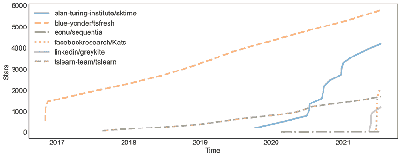
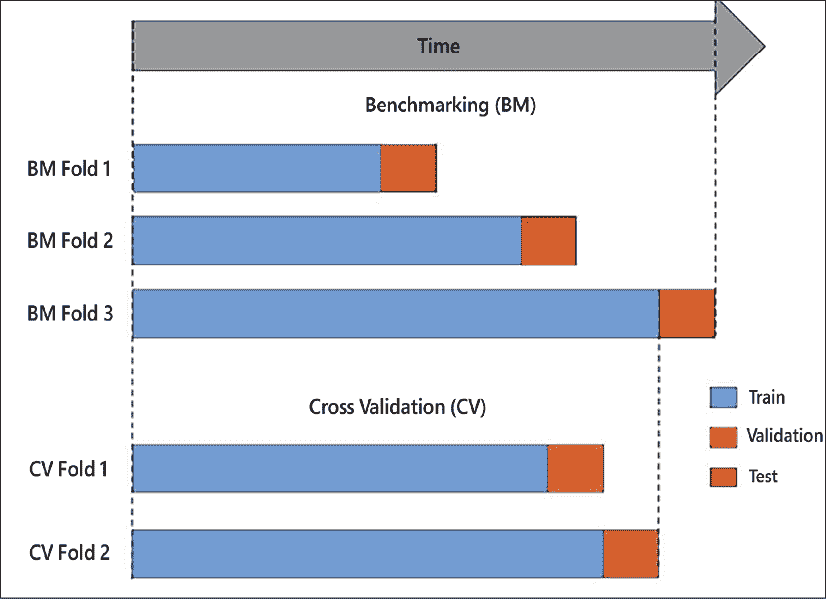
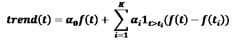
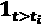
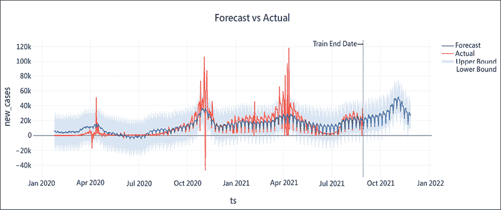
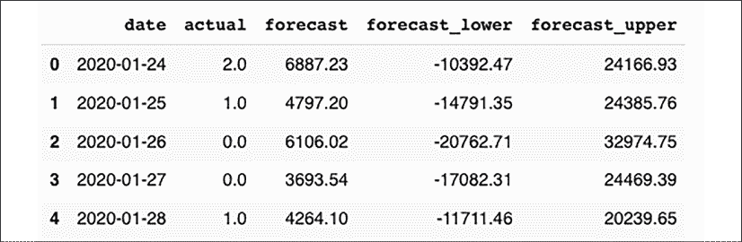
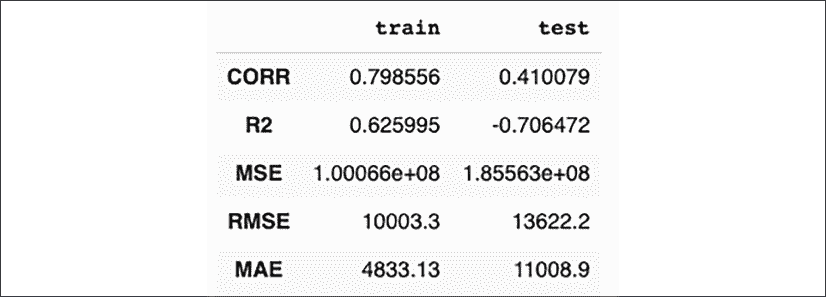
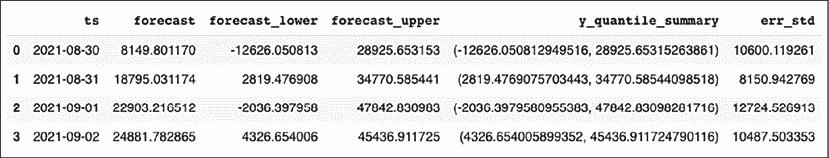
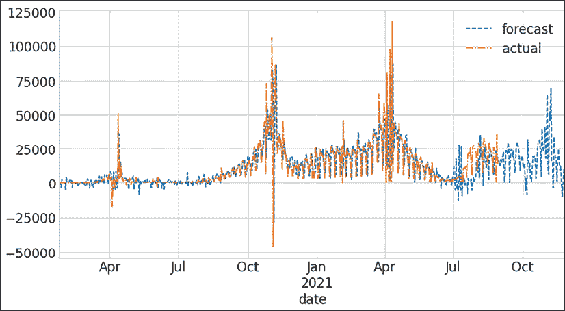
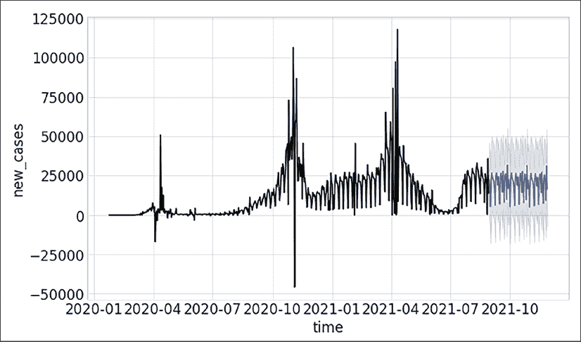

# 七

# 时间序列的机器学习模型

近年来，机器学习已经取得了很大进展，这反映在可用于时间序列预测的方法中。我们已经在*第四章*、*时序机器学习简介*中介绍了一些最先进的时序机器学习方法。在本章中，我们将介绍更多的机器学习方法。

我们将介绍通常用作基线方法的方法，或者在性能、易用性或适用性方面表现突出的方法。我将引入 k-最近邻，使用动态时间扭曲和梯度提升作为时间序列的基线，我们还将介绍其他方法，如 Silverkite 和梯度提升。最后，我们将使用其中的一些方法进行应用练习。

我们将讨论以下主题:

*   时间序列的更多机器学习方法
*   具有动态时间弯曲的 k-最近邻
*   银风筝
*   梯度推进
*   Python 练习

如果你在寻找关于最先进的机器学习算法的讨论，请参考*第 4 章*、*时序的机器学习介绍*。对算法的讨论将假设那一章的一些信息。我们将在接下来的章节中介绍的算法对于预测和预报任务来说都是极具竞争力的。

我们将在这里更详细地讨论算法。

# 时间序列的更多机器学习方法

我们将在本节中介绍的算法对于预测和预报任务来说都是极具竞争力的。如果你在寻找关于最先进的机器学习算法的讨论，请参考*第 4 章*、*时间序列的机器学习介绍*。

在前一章中，我们已经简要讨论了其中的一些算法，但我们将在这里更详细地讨论它们，我们还将介绍其他我们以前没有讨论过的算法，如 Silverkite、梯度增强和 k-最近邻。

我们将为 2021 年发布的一个库(facebook 的 Kats)专门开辟一个单独的练习区。Kats 提供了许多高级功能，包括超参数调整和集成学习。在这些特性之上，它们实现了基于 TSFresh 库的特征提取，并包含了许多模型，包括 Prophet、SARIMA 等。他们声称，与其他超参数调优算法相比，他们针对时间序列的超参数调优在基准测试中要快 6-20 倍。

该图提供了所选时间序列机器学习库的受欢迎程度的概述:



图 7.1:时序机器学习库的流行程度

截至 2021 年年中，Kats 和 GreyKite 最近才发布，尽管它们在 GitHub 上获得了一些明星，但它们还没有积累到足以与 TSFresh 的人气相匹敌的水平。我已经包含了 TSFresh，尽管它是一个用于特性生成而不是预测的库。我发现看到它与我们在这章使用的其他库相比有多重要是很有趣的。在 TSFresh 之后，SKTime 位居第二，它在相对较短的时间内吸引了大量明星。

我们将在本章的实际例子中使用其中的一些库。

另一个重要的问题是验证，值得单独讨论这个问题。

## 确认

我们之前在*第 4 章*、*时序机器学习介绍*中讨论过验证。通常，在机器学习任务中，我们使用 k-fold 交叉验证，其中对数据的分割是伪随机执行的，因此训练和测试/验证数据集可以来自数据的任何部分，只要它没有用于训练(**样本外数据**)。

对于时间序列数据，这种验证方式可能会导致对模型性能的过度自信，因为实际上，时间序列往往会根据趋势、季节性和时间序列特征的变化而随时间发生变化。

因此，对于时间序列，通常在所谓的**前推验证**中执行验证。这意味着我们根据过去的数据训练模型，我们将在最新的数据上测试它。这将消除乐观偏见，并在模型部署后为我们提供更现实的性能评估。

在训练、验证和测试数据集方面，这意味着我们将完全在训练和验证数据集上调整模型参数，并且我们将基于一组时间上更先进的数据对我们的测试进行基准测试，如下图所示(来源:Greykite 库的 GitHub 库):



图 7.2:步行验证

在逐步验证中，我们在数据的初始段进行训练，然后在训练集之后的一段时间进行测试。接下来，我们向前滚动并重复该过程。这样，我们就有了多个样本期外的结果，并且可以合并这些期内的结果。有了步行向前，我们不太可能遭受过度拟合。

# 具有动态时间弯曲的 k-最近邻

k-最近邻是一种众所周知的机器学习方法(有时也打着基于案例推理的幌子)。在 kNN 中，我们可以使用距离度量来查找相似的数据点。然后，我们可以将这些最近邻居的已知标签作为输出，并使用函数以某种方式整合它们。

*图 7.3* 举例说明了 kNN 用于分类的基本思想(来源——维基共享:[https://Commons . WikiMedia . org/wiki/File:kNN classification . SVG](https://commons.wikimedia.org/wiki/File:KnnClassification.svg)):


图 7.3:分类的 K-最近邻

我们已经知道一些数据点。在上图中，这些点表示为正方形和三角形，它们分别代表两个不同类别的数据点。给定一个新的数据点，用圆圈表示，我们找到最接近它的已知数据点。在这个例子中，我们发现新点类似于三角形，所以我们可以假设新点也属于三角形类。

虽然这种方法在概念上非常简单，但它经常作为一种强大的基线方法，或者有时甚至可以与更复杂的机器学习算法相媲美，即使我们只比较最近的邻居 *(* *、𝑘* *=1)* 。

该算法中的重要超参数是:

*   输出所基于的相邻要素的数量(k)
*   积分函数(例如，平均值或最频繁出现的值)
*   用于查找最近数据点的距离函数

我们在*第 4 章*、*时间序列机器学习介绍*中讨论了动态时间弯曲，作为一种可用于比较两个时间序列之间相似性(或等价地，距离)的度量。这些序列甚至可以有不同的长度。动态时间弯曲已经被证明是时间序列的一种非常强的距离度量。

我们可以使用 kNN 结合动态时间弯曲作为距离度量来寻找相似的时间序列，这种方法已经被证明是难以超越的，尽管目前的技术水平已经超越了它。

# 银风筝

Silverkite 算法与 LinkedIn 发布的 Greykite 库一起发布。它被明确地设计成快速、准确和直观的目标。该算法在 2021 年的一份出版物中进行了描述(“生产系统的灵活预测模型”，作者 Reza Hosseini 等人)。

根据 LinkedIn 的说法，它可以处理不同类型的趋势和季节性，如每小时、每天、每周、重复事件和假期，以及短期影响。在 LinkedIn 中，它既用于短期预测，例如 1 天的头部，也用于长期预测范围，例如 1 年以后。

LinkedIn 中的用例包括优化预算决策、设置业务指标目标，以及提供足够的基础设施来处理高峰流量。此外，一个使用案例是对新冠肺炎疫情的恢复进行建模。

时间序列被建模为趋势、变化点和季节性的叠加组合，其中季节性包括假日/事件影响。然后，趋势建模如下:



其中 K 是变化点的数量，并且*t*I 是第 I 个变化点的时间索引。因此，是第 I 个变化点的指示函数。函数 f(t)可以是线性的、平方根的、二次的、任意组合的或者完全自定义的。

Silverkite 还为假期构造了指示器变量。假日可以按名称或国家指定，甚至可以完全自定义。

可以手动指定变化点，也可以使用回归模型自动检测候选点，然后使用自适应套索算法进行选择(周惠，2006)。

除了趋势、季节性和节假日，Silverkite 还包括一个自回归项，该自回归项是基于窗口平均值而不是独立获取滞后值计算的(*选择降水过程的二元马尔可夫模型*)，Reza Hosseini 等人，2011 年)。

这个自回归术语是使用 Pasty 库指定的，使用一个公式小型语言，其形式如下:

```
y ~ a + a:b + np.log(x) 
```

在这个公式中，左边的 y 被定义为三项之和，`a`、`a:b`和`np.log(x)`。术语`a:b`是两个因素 a 和 b 之间的交互。Pasty 中的模型模板本身是高度可定制的，因此该接口提供了高度的灵活性。

最后，Silverkite 提供了几种模型类型，如岭回归、弹性网和增强树，支持损失函数、MSE 和稳健回归的分位数损失。

根据 LinkedIn 在几个数据集上的基准测试，Silverkite 在预测误差方面优于 auto-Arima(pmdarima 库)和 Prophet。然而，Silverkite 的速度大约是 Prophet 的四倍，我们将在第 9 章、*概率模型*中介绍。

# 梯度推进

**XGBoost**(**极端梯度推进**的简称)是对分类和回归问题梯度推进的一种高效实现(Jerome Friedman，“*Greedy function approximation:a Gradient Boosting machine*”，2001)。梯度推进又称为**梯度推进机** ( **GBM** )或**梯度推进回归树** ( **GBRT** )。一个特例是 LambdaMART，用于排名应用程序。除了 XGBoost 其他的实现还有微软的光照梯度提升机(LightGBM)，Yandex 的 Catboost。

渐变提升树是树的集合体。这类似于随机森林等装袋算法；然而，由于这是一种提升算法，因此计算每棵树都是为了逐渐减小误差。随着每一次新的迭代，贪婪地选择一棵树，并且基于权重项将其预测添加到先前的预测中。还有一个正则项惩罚复杂性并减少过度拟合，类似于正则化的贪婪森林(RGF)。

**XGBoost** 算法于 2016 年由陈天琦和 Carlos guest rin(*XGBoost:一个可扩展的树提升系统*”)发表，并在许多分类和回归基准上推动了发展。它被用在许多解决卡吉尔问题的成功方案中。事实上，在 2015 年，29 个挑战获奖的解决方案中，有 17 个解决方案使用了 XGBoost。

它的设计是高度可扩展的，具有针对加权分位数的梯度提升算法的扩展，以及基于更智能的缓存模式、分片和稀疏处理的可扩展性和并行化的改进。

作为回归的特例，XGBoost 可用于预测。在这种情况下，基于过去的值训练模型以预测未来的值，这可以应用于单变量以及多变量时间序列。

# Python 练习

让我们把本章学到的东西付诸实践。

关于需求，在这一章中，我们将分别为每个部分安装需求。可以从终端、笔记本或 anaconda navigator 执行安装。

在接下来的几节中，我们将演示预测中的分类，因此其中一些方法是不可比的。读者被邀请使用每种方法做预测和分类，然后比较结果。

需要注意的是，Kats 和 Greykite(在撰写本文时)都是非常新的库，所以可能仍然会频繁地改变依赖关系。他们可能会钉住你的 NumPy 版本或者其他常用的库。因此，我建议您在虚拟环境中为每个部分分别安装它们。

我们将在下一节介绍这个设置。

## 虚拟环境

在 Python 虚拟环境中，安装在其中的所有库、二进制文件和脚本都与安装在其他虚拟环境中的库、二进制文件和脚本以及安装在系统中的库、二进制文件和脚本相隔离。这意味着我们可以安装不同的库，比如 Kats 和 Greykite，而不必担心它们之间或与我们计算机上安装的其他库之间的兼容性问题。

让我们浏览一下一个使用 anaconda 的 Jupyter 笔记本使用虚拟环境的快速教程介绍(同样，您可以使用 virtualenv 或 pipenv 之类的工具)。

在*第 1 章*、*Python 时序介绍*中，我们介绍了 Anaconda 的安装，所以我们将跳过安装。请参考该章节或前往 conda.io 获取说明。

要创建虚拟环境，您必须指定一个名称:

```
conda create --name myenv 
```

这将创建一个同名目录(`myenv`)，所有的库和脚本都将安装在这个目录中。

如果我们想要使用这个环境，我们必须首先激活它，这意味着我们设置`PATH`变量来包含我们新创建的目录:

```
conda activate myenv 
```

我们现在可以使用像 pip 这样的工具，默认使用 conda 捆绑的工具，或者直接使用 conda 命令来安装库。

我们可以将 Jupyter 或 Jupyter labs 安装到我们的环境中，然后启动它。这意味着我们的 Jupyter 环境将包含所有的依赖项，因为我们已经单独安装了它们。

让我们从带有动态时间扭曲的 kNN 算法开始。正如我提到的，这种算法经常作为比较的一个不错的基线。

## Python 中动态时间弯曲的 k 近邻算法

在这一节中，我们将根据一段时间内机器人的力和扭矩测量结果对故障进行分类。

我们将使用一个非常简单的分类器 kNN，并且也许我们应该提醒一下，这种方法涉及到逐点距离，这通常会成为计算的瓶颈。

在这一节中，我们将把 TSFresh 在管道中的特征提取与 kNN 算法结合起来。正如您在阅读代码片段时会发现的那样，时序管道确实有助于使事情变得简单。

让我们安装 tsfresh 和 tslearn:

```
pip install tsfresh tslearn 
```

我们将在 tslearn 中使用 kNN 分类器。我们甚至可以在 scikit-learn 中使用 kNN 分类器，它允许指定一个定制的度量。

在这个例子中，我们将从 UCI 机器学习库中下载一个机器人执行失败的数据集，并将其存储在本地。该数据集包含故障检测后机器人上的力和扭矩测量值。对于每个样本，任务是对机器人是否会报告故障进行分类:

```
from tsfresh.examples import load_robot_execution_failures

from tsfresh.examples.robot_execution_failures import download_robot_execution_failures

download_robot_execution_failures()

df_ts, y = load_robot_execution_failures() 
```

这些列包括时间和来自传感器`F_x`、 `F_y`、 `F_z`、 `T_x`、 `T_y`和 `T_z`的信号的六个时间序列。目标变量`y`可以取值 True 或 False，指示是否有故障。

检查这两种课程的频率总是很重要的:

```
print(f"{y.mean():.2f}") 
```

y 的平均值是 0.24。

我们可以然后使用 TSFresh 提取时间序列特征，如*第 3 章，预处理时间序列*中所述。我们可以估算缺失值，并根据与目标的相关性选择特征。在 TSFresh 中，统计测试的 p 值用于计算特征显著性:

```
from tsfresh import extract_features

from tsfresh import select_features

from tsfresh.utilities.dataframe_functions import impute

extracted_features = impute(extract_features(df_ts, column_id="id", column_sort="time"))

features_filtered = select_features(extracted_features, y) 
```

我们可以继续使用`features_filtered`数据帧，它包含了我们的特征——之前的传感器信号和 TSFresh 特征。

让我们通过进行网格搜索来找到一些较好的邻居数量值:

```
from sklearn.model_selection import TimeSeriesSplit, GridSearchCV

from tslearn.neighbors import KNeighborsTimeSeriesClassifier

knn = KNeighborsTimeSeriesClassifier()

param_search = {

    'metric' : ['dtw'],

    'n_neighbors': [1, 2, 3]

}

tscv = TimeSeriesSplit(n_splits=2)

gsearch = GridSearchCV(

    estimator=knn,

    cv=tscv,

    param_grid=param_search

)

gsearch.fit(

    features_filtered,

    y

) 
```

我们正在使用 scikit-learn 的`TimeSeriesSplit`来分割时间序列。这是为了网格搜索。

或者，我们可以让基于一个索引进行拆分。

我们可以尝试很多参数，尤其是 kNN 分类器中的距离度量。如果您想尝试一下，请参见`TSLEARN_VALID_METRICS`了解 tslearn 支持的指标的完整列表。

下面做几个 COVID 案例的预测。在下一节中，我们将从 Silverkite 算法开始。Silverkite 自带 LinkedIn 2021 年发布的 Greykite 库。

## 银风筝

在撰写本文时，Greykite 的版本是 0 . 1 . 1——它还没有完全稳定。它的依赖关系可能与常用库的新版本冲突，包括 Jupyter 笔记本。不要担心，如果你安装在你的虚拟环境或谷歌 Colab 库。

继续安装该库及其所有依赖项:

```
pip install greykite 
```

既然安装了 Greykite，我们就可以使用它了。

我们将从*我们的世界数据*数据集加载 COVID 案例，这可能是可用 COVID 数据的最佳来源之一:

```
import pandas as pd

owid_covid = pd.read_csv("**https://covid.ourworldindata.org/data/owid-covid-data.csv**")

owid_covid["**date**"] = pd.to_datetime(owid_covid["**date**"])

df = owid_covid[owid_covid.location == "**France**"].set_index("**date**", drop=True).resample('**D**').interpolate(method='**linear**') 
```

我们正在关注法国的案例。

我们从设置 Greykite 元数据参数开始。然后，我们将这个对象传递到预测器配置中:

```
from greykite.framework.templates.autogen.forecast_config import (

    ForecastConfig, MetadataParam

)

metadata = MetadataParam(

    time_col="date",

    value_col="new_cases",

    freq="D"

) 
```

我们的时间列是`date`，我们的值列是`new_cases`。

我们现在将创建`forecaster`对象，它创建预测并存储结果:

```
import warnings

from greykite.framework.templates.forecaster import Forecaster

from greykite.framework.templates.model_templates import ModelTemplateEnum

forecaster = Forecaster()

    warnings.filterwarnings("ignore", category=UserWarning)

    result = forecaster.run_forecast_config(

        df=yahoo_df,

        config=ForecastConfig(

            model_template=ModelTemplateEnum.SILVERKITE_DAILY_90.name,

            forecast_horizon=90,

            coverage=0.95,

            metadata_param=metadata

        )

    ) 
```

预测范围为 90 天；我们将预测未来 90 天。我们的预测区间是 95%。Silverkite 和 Prophet 都支持通过预测区间来量化不确定性。95%的覆盖率意味着 95%的实际值应该落在预测区间内。在 Greykite 中，_ `components.uncertainty`模型提供了关于不确定性的附加配置选项。

我添加了一行来忽略训练期间的`UserWarning`类型的警告，否则，在目标列中大约有 500 行关于 0 的警告。

让我们从结果对象中画出原始的时间序列。我们可以覆盖我们的预测:

```
forecast = result.forecast

forecast.plot().show(renderer="**colab**") 
```

如果你不在 Google Colab 上，请省去`renderer`参数！

我们得到如下的情节:



图 7.4:预测与实际时间序列(Silverkite)

预测在`forecast` 对象的`df`属性中:

```
forecast.df.head().round(2) 
```

这些是预测的置信区间上限和下限:



图 7.5:预测与实际时间序列表(Silverkite)

我们可能想要为我们的模型获得一些性能指标。我们可以在维持测试集上获得历史预测的性能，如下所示:

```
from collections import defaultdict

backtest = result.backtest

backtest_eval = defaultdict(list)

for metric, value in backtest.train_evaluation.items():

    backtest_eval[metric].append(value)

    backtest_eval[metric].append(backtest.test_evaluation[metric])

metrics = pd.DataFrame(backtest_eval, index=["train", "test"]).T

metrics.head() 
```

我们的绩效指标如下所示:



图 7.6:拒绝数据的性能指标(Silverkite)

我已经将指标截为前五个。

我们可以将我们的模型方便地应用于新数据，如下所示:

```
model = result.model

future_df = result.timeseries.make_future_dataframe(

    periods=4,

    include_history=False

)

model.predict(future_df) 
```

预测看起来是这样的:



图 7.7:预测数据框架(Silverkite)

请注意，您的结果可能会有所不同。

我们可以通过改变预测器运行配置中的`model_template`参数来使用其他预测器模型。例如，我们可以将设置为`ModelTemplateEnum.PROPHET.name`，以便采用脸书的先知模型。

我们的银风筝之旅到此结束。接下来，我们将通过使用 XGBoost 应用监督回归方法进行预测。让我们做一些梯度推进！

## 梯度推进

我们也可以使用监督机器学习进行时间序列预测。为此，我们可以使用日期和以前的值来预测未来。

首先，我们需要安装 XGBoost:

```
pip install xgboost 
```

在这个例子中，我们将使用雅虎每日收盘数据，就像在本章的其他练习部分一样。

让我们一步一步地进行准备和建模。

我们首先需要特征化数据。这里，我们将通过提取日期特征来做到这一点，但请参见 kNNs 上的部分，这里使用的是 TSFresh 的特征提取。您可能希望通过组合这两种特征提取策略或者完全依赖 TSFresh 来改变这个示例。

我们将像以前一样从数据数据集中的*我们的世界中重新加载新的 COVID 病例:*

```
import pandas as pd

owid_covid = pd.read_csv("**https://covid.ourworldindata.org/data/owid-covid-data.csv**")

owid_covid["**date**"] = pd.to_datetime(owid_covid["**date**"])

df = owid_covid[owid_covid.location == "**France**"].set_index("**date**", drop=True).resample('**D**').interpolate(method='**linear**').reset_index() 
```

对于特征提取，变压器是方便的。转换器基本上是一个具有`fit()`和`transform()`方法的类，这些方法可以使转换器适应数据集并相应地转换数据。下面是根据日期注释数据集的`DateFeatures`转换器的代码:

```
from sklearn.base import TransformerMixin, BaseEstimator

class DateFeatures(TransformerMixin, BaseEstimator):

    features = [

        "hour",

        "year",

        "day",

        "weekday",

        "month",

        "quarter",

    ]

    def __init__(self):

        super().__init__()

    def transform(self, df: pd.DataFrame):

        Xt = []

        for col in df.columns:

            for feature in self.features:

                date_feature = getattr(

                    getattr(

                        df[col], "dt"

                    ), feature

                )

                date_feature.name = f"{col}_{feature}"

                Xt.append(date_feature)

        df2 = pd.concat(Xt, axis=1)

        return df2

    def fit(self, df: pd.DataFrame, y=None, **fit_params):

        return self 
```

这个转换器相对简单，因为它提取日期列的一系列特性，比如小时、年、日、工作日、月、一年中的周和季度。这些特征对于在机器学习环境中描述或注释时间序列数据可能是非常强大的。

你可以在 GitHub 上找到这个例子的完整代码。我提供了一个额外的转换器，用于本章中省略的循环特性。

我们将如下的变压器应用于数据帧的`date`列:

```
from sklearn.compose import ColumnTransformer

from sklearn.pipeline import Pipeline, make_pipeline

preprocessor = ColumnTransformer(

    transformers=[(

        "**date**",

        make_pipeline(

            DateFeatures(),

            ColumnTransformer(transformers=[

                ("**cyclical**", CyclicalFeatures(),

                  ["**date_day**", "**date_weekday**", "**date_month**"]

                )

            ], remainder="passthrough")

        ), ["**date**"],

  ),], remainder="passthrough"

) 
```

在我们想要为预测提供额外的外部特征的情况下，设置`remainder="passthrough"`参数。

我们可以定义这些预处理步骤的流水线以及一个模型，以便它可以被拟合并应用于预测:

```
from xgboost import XGBRegressor

pipeline = Pipeline(

    [

        ("**preprocessing**", preprocessor),

         ("xgb", XGBRegressor(objective="**reg:squarederror**", n_estimators=**1000**))

    ]

) 
```

预测器是一个 XGBoost 回归器。在调整方面，我没有做太多的努力。我们唯一要改变的参数是估计量的数量。我们将使用 1000 的集合大小(树的数量)。

现在是时候将数据集分成训练集和测试集了。这包括两个问题:

*   我们需要提前将特性与值结合起来
*   我们需要根据截止时间将数据集一分为二

我们先为此设置基本参数。首先，我们想预测给定时间范围内的未来。其次，我们需要决定用于训练和测试的数据点数量:

```
TRAIN_SIZE = int(len(df) * **0.9**)

HORIZON = **1**

TARGET_COL = "**new_cases**" 
```

我们将 90%的分数用于训练，我们预测未来 90 天:

```
X_train, X_test = df.iloc[HORIZON:TRAIN_SIZE], df.iloc[TRAIN_SIZE+HORIZON:]

y_train = df.shift(periods=HORIZON).iloc[HORIZON:TRAIN_SIZE][TARGET_COL]

y_test = df.shift(periods=HORIZON).iloc[TRAIN_SIZE+HORIZON:][TARGET_COL] 
```

这既做了对齐又做了水平。因此，我们有了用于测试和训练的数据集，包括我们希望用 XGBoost 预测的特征和标签。

现在，我们可以训练我们的 XGBoost 回归模型，根据我们用转换器生成的特性和当前值来预测未来的值。

我们可以按照以下方式安装管道:

```
FEATURE_COLS = ["date"]

pipeline.fit(X_train[FEATURE_COLS], y_train) 
```

我们可以看到以下管道参数:


图 7.8:管道参数

如果我们从头到尾创建一系列日期，我们可以获得整个时间段的模型预测:

```
MAX_HORIZON = **90**

X_test_horizon = pd.Series(pd.date_range(

    start=df.date.**min()**, 

    periods=**len**(df) + MAX_HORIZON,

    name="**date**"

)).reset_index() 
```

应用于`X_test`的管道的`predict()`方法给了我们预测:

```
forecasted = pd.concat(

    [pd.Series(pipeline.predict(X_test_horizon[FEATURE_COLS])), pd.Series(X_test_horizon.date)],

    axis=1

)

forecasted.columns = [TARGET_COL, "**date**"] 
```

我们可以对实际案例做同样的事情:

```
actual = pd.concat(

    [pd.Series(df[TARGET_COL]), pd.Series(df.date)],

    axis=1

)

actual.columns = [TARGET_COL, "**date**"] 
```

现在，我们可以将预测值与实际值`y_test`进行对比，绘制成图:

```
fig, ax = plt.subplots(figsize=(12, 6))

forecasted.set_index("date").plot(linestyle='--', ax=ax)

actual.set_index("date").plot(linestyle='-.', ax=ax)

plt.legend(["forecast", "actual"]) 
```

这是我们得到的情节:



图 7.9:预测与实际(XGBoost)

我们可以像这样提取测试期间的性能指标:

```
from sklearn.metrics import mean_squared_error

test_data = actual.merge(forecasted, on="**date**", suffixes=("**_actual**", "**_predicted**"))

mse = mean_squared_error(test_data.new_cases_actual, test_data.new_cases_predicted, squared=False)  # RMSE

**print("The root mean squared error (RMSE) on test set: {:.2f}".format(mse))** 
```

我们应该会看到这样的情况:

```
The root mean squared error (RMSE) on test set: 12753.41 
```

接下来，我们将为 Kats 中的时间序列预测创建一个集成模型。

## 带有 kat 的套装

Kats 的安装应该非常简单，只需两步。首先，我们安装 fbprophet，这是脸书先知库的旧版本:

```
conda install -c conda-forge fbprophet 
```

现在我们用 pip 安装 Kats:

```
pip install kats 
```

或者，在 Colab 上，我们可以像这样安装 kat:

```
!MINIMAL=1 pip install kats

!pip install "numpy==1.20" 
```

我们将像以前一样加载 COVID 案例数据集。这是最后一行:

```
df = owid_covid[owid_covid.location == "**France**"].set_index("**date**", drop=True).resample('**D**').interpolate(method='**linear**').reset_index() 
```

我们将配置我们的集合模型，拟合它，然后做一个预测。

首先，我们合奏的配置:

```
from kats.models.ensemble.ensemble import EnsembleParams, BaseModelParams

from kats.models.ensemble.kats_ensemble import KatsEnsemble

from kats.models import linear_model, quadratic_model

model_params = EnsembleParams(

            [

                BaseModelParams("linear", linear_model.LinearModelParams()),

                BaseModelParams("quadratic", quadratic_model.QuadraticModelParams()),

            ]

        ) 
```

这里，我们只包括两个不同的模型，但是我们可以包括其他和更多的模型，并且我们可以定义更好的参数。这只是一个例子；对于一个更现实的练习，我留给读者，我建议添加 ARIMA 和θ模型。我们需要为每个预测模型定义超参数。

我们还需要创建集合参数，定义如何计算集合集合以及分解应该如何工作:

```
KatsEnsembleParam = {

    "**models**": model_params,

    "**aggregation**": "**weightedavg**",

    "**seasonality_length**": 30,

    "**decomposition_method**": "**additive**",

} 
```

要使用 Kats 的时间序列，我们必须将数据从 DataFrame 或序列转换成 Kats 时间序列对象。我们可以将 COVID 病例数据转换如下:

```
from kats.consts import TimeSeriesData

TARGET_COL = "new_cases"

df_ts = TimeSeriesData(

    value=df[TARGET_COL], time=df["date"]

) 
```

对于转换来说，重要的是 Kats 可以推断出指数的频率。这个可以用`pd.infer_freq()`测试。在我们的例子中，`pd.infer_freq(df["date"])`应该为每日频率返回`D` 。

现在我们可以创建我们的`KatsEnsemble` 并安装它:

```
m = KatsEnsemble(

    data=df_ts, 

    params=KatsEnsembleParam

).fit() 
```

我们可以使用`predict()`方法对每个模型进行单独的预测。如果我们想要得到集合输出，我们必须在`predict()`之后调用`aggregate()`:

```
m.predict(steps=90)

m.aggregate()

m.plot()

plt.ylabel(TARGET_COL) 
```

我们预测未来 90 天。这些预测被存储为模型的一部分，因此我们不需要捕获返回的预测。然后，我们可以汇总每个模型的预测。同样，我们不需要获取返回的 DataFrame，因为它存储在模型对象(`m.fcst_df`)中。

最后，我们使用 Kats 便利函数绘制聚合数据帧:



图 7.10: Kats 集合模式预报

因为我们可以通过改变基本模型参数和添加新模型来调整这个集合模型，这可以给我们很多改进的空间。

是时候总结一下我们所学的知识来结束这一章了。

# 摘要

在这一章中，我们已经讨论了 Python 中流行的时序机器学习库。然后，我们讨论并尝试了一种用于机器人故障分类的具有动态时间弯曲的 k-最近邻算法。我们讨论了时间序列预测中的验证，并尝试了三种不同的方法来预测 COVID 案例:Silverkite、使用 XGBoost 的梯度增强和 Kats 中的集合模型。