# 十一、时间序列的强化学习

强化学习是一种不需要标记数据的控制问题和函数优化的广泛成功的范例。这是一个强大的经验驱动的自主学习框架，其中代理通过采取行动直接与环境交互，并通过试错提高效率。自从总部位于伦敦的谷歌旗下公司 DeepMind 在复杂游戏方面取得突破以来，强化学习就变得特别受欢迎。

在这一章中，我们将讨论时间序列特别是经济学中的**强化学习** ( **RL** )方法的分类，并且我们将处理基于 RL 的时间序列模型的准确性和适用性。

我们将从与时间序列相关的 RL 中的核心概念和算法开始，我们将讨论当前深度 RL 模型中的开放问题和挑战。

我将讨论以下主题:

*   强化学习简介
*   时间序列的强化学习
*   强盗算法
*   深度 Q 学习
*   Python 实践

让我们从强化学习的介绍和主要概念开始。

# 强化学习简介

强化学习是与监督和非监督方法并列的机器学习的主要范式之一。一个主要的区别是，有监督或无监督的方法是被动的，对变化做出反应，而 RL 是主动改变环境并寻找新数据。事实上，从机器学习的角度来看，强化学习算法可以被视为在寻找好数据和对这些数据进行监督学习之间交替进行。

基于强化学习的计算机程序已经突破了障碍。在人工智能的一个分水岭时刻，2016 年 3 月，DeepMind 的 AlphaGo 击败了职业围棋棋手 Lee Sedol。以前，围棋被认为是人类创造力和智力的标志，太复杂了，机器无法学习。

有人认为，它正在让我们向人工智能靠拢。例如，在他们的论文“*奖励足够了*”(2021)中，David Silver、Satinder Singh、Doina Precup 和 Richard S. Sutton 认为，奖励导向的学习足以获取知识、学习、感知、社交、理解和产生语言、归纳和模仿。更重要的是，他们指出强化学习代理可以构成 AGI 的解决方案。

人工通用智能是一个智能代理理解或学习任何需要智能的智力任务的假设能力。然而什么是**智能**？通常，这被定义为任何人类能做或认为困难的事情。根据图灵奖获得者计算机科学家约翰·麦卡锡的说法(“*什么是人工智能？*《1998》，*智力是实现世界目标能力的计算部分。*”

在强化学习中，主体通过行动与环境互动，并以奖励的形式获得反馈。与监督学习中的情况相反，没有标记的数据可用，而是基于对累积回报的期望来探索和利用环境。行动和奖励的反馈循环如下图所示:

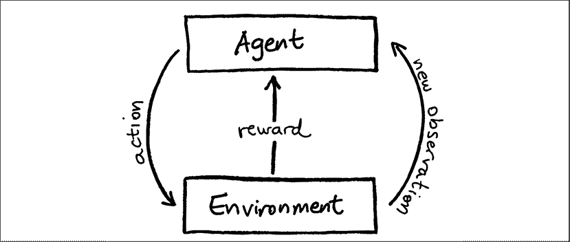

图 11.1:强化学习中的反馈循环

强化学习关注的是回报最大化的目标。通过与环境的互动，代理获得反馈并学习采取更好的行动。通过优化累积奖励，代理人发展目标导向的行为。

**强化学习** ( **RL** )是一种智能体通过采取行动直接与环境交互的方法。代理人通过反复试验来学习，以使回报最大化。

如果你已经阅读了*第 8 章*、*时间序列的在线学习*，你可能会对强化学习和在线学习之间的区别感到困惑，并且可能值得比较考虑这两种方法。一些最著名的强化学习算法，Q 学习和时间差异(TD)学习，仅举几个例子，是在线算法，它们更新价值函数的方式。

然而，强化学习并不关注预测，而是关注与环境的交互。在**在线学习**中，信息被连续处理，问题被清楚地定义为什么是正确的，什么是不正确的。在强化学习中，目标是在与环境相互作用的许多步骤中优化延迟奖励。这是两种方法之间的主要区别，尽管每种技术的支持者都声称有许多特殊的细节。其中一些我们将在本章后面讨论，比如探索与开发和体验回放。

强化问题由三个主要部分定义:环境ε、主体 *A* 和累积目标。代理是一个决策实体，它可以观察环境的当前状态并采取行动。通过执行动作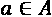，代理从一个状态转换到另一个状态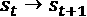。在特定状态下执行一个动作会给代理提供一个奖励，这个奖励是一个数字分数。奖励是对目标进展的即时测量。

环境处于某一状态，该状态取决于当前状态和所采取的动作的某种组合，尽管某些改变可能是随机的。代理的目标是最大化累积奖励函数。此累积奖励目标可以是多个步骤的奖励总和、折扣金额或一段时间内的平均奖励。

更正式地说，在 RL 环境中的代理是一个系统(或程序)，它在时间 *t* 接收环境的观察*O*t 并输出一个动作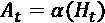给定它的经历历史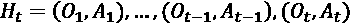。

同时，环境是另一个系统。它在时间 *t* 接收动作*A*t[t]，并根据动作历史和过去状态以及随机过程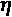改变其状态。代理在一定程度上可以访问该状态，为了简化，我们可以声明: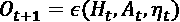。

最后，奖励是一个标量观测值，由环境在每个时间步 *t* 发出，向代理提供关于它做得如何的即时反馈。

强化学习代理的核心是一个模型，该模型估计环境状态的值或建议环境中的下一个动作。这是强化学习的两个主要类别:在**基于价值的**学习中，模型用价值函数(模型)逼近行动的结果或环境状态的值，行动选择减少到采取具有最佳预期结果的行动。在基于策略的学习中，我们关注于更直接的目标，即通过从环境状态中预测行动来选择行动。

强化学习还有另一个转折:探索与开发的两难困境。你可以决定继续做你知道最有效的事情(开发)或者尝试新的途径(探索)。尝试新事物可能会在短期内导致更糟糕的结果，但可能会给你重要的教训，你可以在未来从中吸取教训。

平衡这两者的一个简单的方法是**ε贪婪**。这是一个简单的方法，通过在探索和利用之间随机选择来平衡探索和利用:要么我们遵循模型的建议，要么我们不遵循。ε是一个参数，表示我们做了一个不被模型认为是最好的行为的概率；ε越大，模型的行为越随机。

**深度强化学习** ( **DRL** )技术是强化学习方法的一个子集，其中的模型是一个深度神经网络(或者，在一个松散的意义上，一个多层感知器)。

在下一节中，我们将研究 RL 如何应用于时间序列！

# 时间序列的强化学习

强化学习(RL)可以并且已经被应用于时间序列，然而，问题必须以某种方式被框定。对于强化学习，我们需要在系统的预测和正在进行的(动作)之间有重要的反馈。

为了将 RL 应用于时间序列预测或预测，预测必须以行动为条件，因此状态演变取决于当前状态和代理的行动(以及随机性)。假设，奖励可以是一个关于预测准确性的性能指标。但是，预测好坏的后果并不影响原有的环境。本质上，这相当于一个监督学习问题。

更有意义的是，如果我们想把我们的情况框定为一个 RL 问题，系统的状态应该受到代理人决策的影响。例如，在与股票市场互动的情况下，我们会根据对运动的预测进行买卖，并包括我们影响的一些东西，如我们在该州的投资组合和基金，或者(只有当我们是做市商时)我们对股票运动的影响。

总之，RL 非常适合处理随时间变化的过程，尽管 RL 处理的是那些可以控制或影响的过程。时间序列的一个核心应用是在工业过程和控制中——事实上，Box 和 Jenkins 已经在他们的经典著作“*时间序列分析:预测和控制*”中指出了这一点。

我们可以想到很多强化学习的应用。股票市场上的交易是业务增长的主要驱动力，不确定性和风险的存在建议将其作为强化学习用例。在定价方面，例如在保险或零售行业，强化学习可以帮助客户探索价值主张的空间，从而产生高销售额，同时优化利润。最后，拍卖机制，例如广告的在线竞价，是另一个领域。在拍卖中，强化代理必须在其他参与者在场的情况下做出反应。

让我们更详细地讨论几个算法——首先，土匪。

# 强盗算法

一个**多臂土匪** ( **MAB** )是一个经典的强化学习问题，其中一个玩家面对一个有 *k* 个杠杆(手臂)的老虎机(土匪)，每个杠杆都有不同的奖励分配。代理商的目标是在逐个试验的基础上最大化其累积的回报。由于单克隆抗体是一个简单但强大的算法框架，可以在不确定的情况下随着时间的推移做出决策，因此大量的研究文章都致力于此。

Bandit learning 指的是旨在优化单个未知稳定目标函数的算法。代理从一组动作中选择一个动作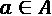。环境在时间 *t* 显示所选动作的奖励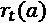。随着多轮信息的积累，代理可以为每只手臂构建一个良好的价值(或奖励)分布表示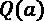。

因此，一个好的政策可能会收敛，使手臂的选择变得最优。根据一项政策， **UCB1** (由 Peter Auer、nicolóCesa-Bianchi 和 Paul Fischer 于 2002 年出版的《*多武装土匪问题的有限时间分析*》)，给定每个行动的期望值，选择最大化该标准的行动:

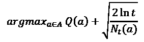

第二项是指基于我们积累的信息的奖励值的置信上限。这里， *t* 表示到目前为止的迭代次数，时间步长，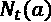表示到目前为止已经执行的动作 *a* 的次数。这意味着等式中的提名者随着时间以对数方式增加，分母随着我们每次从行动中获得奖励信息而增加。

当可用奖励是二元的(赢或输，是或否，收费或不收费)时，这可以用贝塔分布来描述。贝塔分布有两个参数，和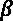，分别代表赢和输。平均值为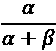。

在 **Thompson 采样**中，我们从每个动作(arm)的 Beta 分布中采样，并选择具有最高估计回报的动作。贝塔分布随着尝试次数的增加而变窄，因此不常尝试的动作分布更广。因此，贝塔抽样模拟了估计的平均回报和估计的置信度。在**狄利克雷抽样**中，我们不是从贝塔分布中抽样，而是从狄利克雷分布(也称为多元贝塔分布)中抽样。

**情境强盗**结合关于更新奖励期望的环境的信息。如果你考虑广告，这个上下文信息可能是关于旅行的广告。上下文土匪的优势是代理可以编码更丰富的环境信息。

在情境强盗中，代理选择一只手臂，奖励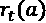被揭示，代理对奖励的期望被更新，但是带有情境特征: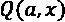，其中 *x* 是对环境进行编码的一组特征。在许多实现中，上下文通常限于离散值，然而，至少在理论上，它们可以是分类的或数字的。价值函数可以是任何机器学习算法，例如神经网络(NeuralBandit)或随机森林(BanditForest)。

强盗们在其他领域中发现了在信息检索模型中的应用，例如在搜索引擎或消费者网站中使用的推荐和排名系统。**概率排序原则**(PRP；根据 S.E. Robertson 的文章“*IR 中的概率排序原则*”，1977)形成了概率模型的理论基础，概率模型一直主导着 IR。PRP 指出，文章应该按照相关性概率的降序排列。这是我们在练习部分的练习中要经历的。

现在我们来深入探讨一下 Q-learning 和深度 Q-learning。

# 深度 Q 学习

Q-learning 是由 Chris Watkins 在 1989 年提出的，是一种在特定状态下学习动作值的算法。Q-learning 围绕着表示在给定状态下采取行动的预期回报。

状态-动作组合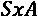的期望回报由 Q 函数近似:

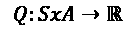

*Q* 被初始化为固定值，通常是随机的。在每个时间步 *t* ，代理选择一个动作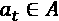并看到一个新的环境状态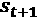作为结果并收到一个奖励。

然后，价值函数 *Q* 可以根据贝尔曼方程更新为旧值和新信息的加权平均值:

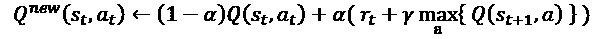

权重由决定，即学习率——学习率越高，Q 函数的适应性越强。折扣因子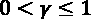是根据即时性来衡量回报——折扣因子越高，代理人就越没有耐心(短视)。

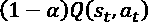代表当前奖励。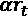为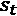获得的奖励，按学习率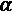加权，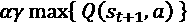为从状态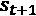可获得的加权最大奖励。

最后一部分可以递归地分解成更简单的子问题，如下所示:

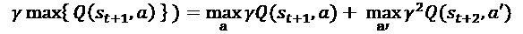

在最简单的情况下， *Q* 可以是一个查找表，称为 Q 表。

2014 年，谷歌 DeepMind 申请了一项名为**深度 Q-learning** 的算法专利。该算法在自然论文“*通过深度强化学习的人类水平控制*中介绍，并在 Atari 2600 游戏中应用。

在深度 Q 学习中，神经网络作为非线性函数逼近器用于 Q 函数。他们使用卷积神经网络从像素值中学习预期回报。他们引入了一种叫做**体验回放**的技术，通过随机抽取的先前行为样本来更新 Q。这样做是为了减少 Q 更新的学习不稳定性。

Q-learning 可以用伪代码大致表示如下:

```py
import numpy as np

memory = []

for episode in range(N):

  for ts in range(T):

    if eps np.random.random() > epsilon:

      a = A[np.argmax([Q(a) for a in A])]

    else:

      a = np.random.choice(A)

    r, s_next = env.execute(a)

    memory.append((s, a, r, s_next))

    learn(np.random.choice(memory, L) 
```

这实现了一个ε贪婪策略，根据概率`epsilon`进行随机(探索性)选择。假设给出了更多的变量。环境的句柄`env`，允许我们执行一个动作。我们有一个学习函数，它根据贝尔曼方程对 Q 函数应用梯度下降来学习更好的值。参数`L`是用于学习的先前值的数量。

记忆回放部分明显简化。实际上，我们会有一个最大的内存容量，一旦达到内存容量，我们会用新的来替换旧的状态、动作和奖励的关联。

我们现在将把其中一些付诸实践。

# Python 实践

让我们进入建模。我们首先给使用单克隆抗体的用户一些建议。

## 推荐

在这个例子中，我们将根据用户的笑话偏好，在我们的网站上模拟对推荐笑话的反馈。我们将利用这些反馈来调整我们的建议。我们想选出 10 个最好的笑话呈现给访问我们网站的人。这些建议将由 10 个单克隆抗体产生，每个单克隆抗体的臂数与笑话数一样多。

这改编自 Kenza-AI 在 GitHub 上的`mab-ranking`库中的一个例子。

这是一个方便的库，附带了不同土匪的实现。我已经简化了这个库在我的库的 fork 中的安装，所以我们将在这里使用我的 fork:

```py
pip install git+https://github.com/benman1/mab-ranking 
```

这件事结束后，我们就可以开始了！

我们将从 S3 下载带有笑话偏好的`jester`数据集。位置如下:

```py
URL = 'https://raw.githubusercontent.com/PacktPublishing/Machine-Learning-for-Time-Series-with-Python/main/chapter11/jesterfinal151cols.csv' 
```

我们将使用熊猫下载它们:

```py
import pandas as pd

jester_data = pd.read_csv(URL, header=None) 
```

我们会做一些表面上的调整。行表示用户，列表示笑话。我们可以说得更清楚些:

```py
jester_data.index.name = "users" 
```

选择的编码有点奇怪，所以我们也要解决这个问题:

```py
for col in jester_data.columns:

    jester_data[col] = jester_data[col].apply(lambda x: 0.0 if x>=99 or x<7.0 else 1.0) 
```

所以要么人们选择了这个笑话，要么没有。我们将排除那些根本没有选择任何笑话的人:

```py
jester_data = jester_data[jester_data.sum(axis=1) > 0] 
```

我们的数据集现在看起来像这样:

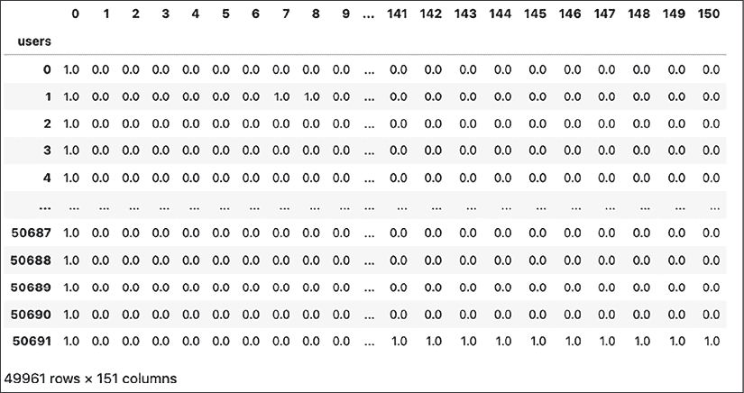

图 11.2: Jester 数据集

我们将如下设置我们的强盗:

```py
from mab_ranking.bandits.rank_bandits import IndependentBandits

from mab_ranking.bandits.bandits import DirichletThompsonSampling

independent_bandits = IndependentBandits(

    num_arms=jester_data.shape[1],

    num_ranks=10,

    bandit_class=DirichletThompsonSampling

) 
```

我们从贝塔分布中选择汤普森抽样的独立强盗。我们推荐最好的 10 个笑话。

然后我们可以开始我们的模拟。我们假设的网站有大量的访问，我们将得到关于 10 个笑话的反馈，我们将展示由我们的独立强盗选择的笑话:

```py
from tqdm import trange

num_steps = 7000

hit_rates = []

for _ in trange(1, num_steps + 1):

    selected_items = set(independent_bandits.choose())

    # Pick a users choices at random

    random_user = jester_data.sample().iloc[0, :]

    ground_truth = set(random_user[random_user == 1].index)

    hit_rate = len(ground_truth.intersection(selected_items)) / len(ground_truth)

    feedback_list = [1.0 if item in ground_truth else 0.0 for item in selected_items]

    independent_bandits.update(selected_items, feedback_list)

    hit_rates.append(hit_rate) 
```

我们正在模拟 7000 次迭代(访问)。在每次访问中，我们将根据更新的奖励预期来改变我们的选择。

我们可以绘制用户选择的笑话的点击率，如下所示:

```py
import matplotlib.pyplot as plt

stats = pd.Series(hit_rates)

plt.figure(figsize=(12, 6))

plt.plot(stats.index, stats.rolling(200).mean(), "--")

plt.xlabel('Iteration')

plt.ylabel('Hit rate') 
```

我引入了滚动平均值(超过 200 次迭代)来获得更平滑的图形:

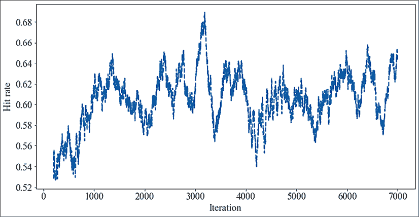

图 11.3:一段时间内的命中率(狄利克雷抽样)

mab-ranking 库支持上下文信息，所以我们可以尝试给出额外的信息。让我们把这些信息想象成不同的用户群。我们可以想象用户在我们想象的网站上使用不同的搜索或过滤功能，比如说“最新的笑话”或“最受欢迎的”或者，他们可以来自不同的地区。或者它可以是时间戳类别，对应于用户访问我们网站的一天中的时间。

让我们提供分类用户组信息，即上下文。我们将根据用户的偏好对他们进行聚类，并将聚类用作上下文:

```py
from sklearn.cluster import KMeans

from sklearn.preprocessing import StandardScaler

scaler = StandardScaler().fit(jester_data)

kmeans = KMeans(n_clusters=5, random_state=0).fit(scaler.transform(jester_data))

contexts = pd.Series(kmeans.labels_, index=jester_data.index) 
```

这创建了 5 个用户组。

我们必须重置我们的强盗:

```py
independent_bandits = IndependentBandits(

    num_arms=jester_data.shape[1],

    num_ranks=10,

    bandit_class=DirichletThompsonSampling

) 
```

然后，我们可以重做我们的模拟。现在，我们将提供用户上下文:

```py
hit_rates = []

for _ in trange(1, num_steps + 1):

    # Pick a users choices at random

    random_user = jester_data.sample().iloc[0, :]

    context = {"previous_action": contexts.loc[random_user.name]}

    selected_items = set(independent_bandits.choose(

        context=context

    ))

    ground_truth = set(random_user[random_user == 1].index)

    hit_rate = len(ground_truth.intersection(selected_items)) / len(ground_truth)

    feedback_list = [1.0 if item in ground_truth else 0.0 for item in selected_items]

    independent_bandits.update(selected_items, feedback_list, context=context)

    hit_rates.append(hit_rate) 
```

我们可以再次直观显示命中率随时间的变化:

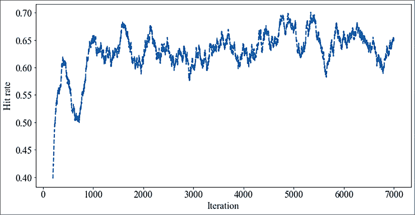

图 11.4:一段时间内的命中率(带上下文的狄利克雷采样)

我们可以看到命中率比以前高了一点。

这个模型忽略了我们假设的网站上推荐笑话的顺序。还有其他的 bandit 实现对行列进行建模。

我将把它留给读者，让他们来更多地研究这个问题。一个有趣的练习是创建一个回报预期的概率模型。

在下一个部分，我们将玩一个深度 Q 学习交易机器人。这是一个更复杂的模型，需要更多的关注。我们将把这个应用于加密货币交易。

## 与 DQN 的贸易

这是基于 TensorTrade 库的教程，我们将在这个例子中使用它。TensorTrade 是一个使用强化学习构建、训练、评估和部署稳健交易算法的框架。

TensorTrade 依靠 OpenAI Gym、Keras 和 TensorFlow 等现有工具来实现算法交易策略的快速实验。我们会像往常一样用 pip 安装。我们将确保安装来自 GitHub 的最新版本:

```py
pip install git+https://github.com/tensortrade-org/tensortrade.git 
```

我们还可以安装`ta`库，它可以提供对交易有用的额外信号，但是我们将把它留在这里。

让我们来解决一些导入问题:

```py
import pandas as pd

import tensortrade.env.default as default

from tensortrade.data.cdd import CryptoDataDownload

from tensortrade.feed.core import Stream, DataFeed

from tensortrade.oms.exchanges import Exchange

from tensortrade.oms.services.execution.simulated import execute_order

from tensortrade.oms.instruments import USD, BTC, ETH

from tensortrade.oms.wallets import Wallet, Portfolio

from tensortrade.agents import DQNAgent

%matplotlib inline 
```

这些进口涉及(模拟)交易所、投资组合和环境的公用事业。此外，还有用于数据加载并将其输入模拟的实用程序，用于货币转换的常数，最后，还有一个 deep Q-agent，它由 Deep Q-Network (DQN)组成。

请注意，需要 matplotlib 魔法命令`(%matplotlib inline`)才能按预期显示 Plotly 图表。

作为第一个步骤，让我们加载一个历史加密货币价格的数据集:

```py
cdd = CryptoDataDownload()

data = cdd.fetch("Bitstamp", "USD", "BTC", "1h")

data.head() 
```

该数据集由以美元计算的每小时比特币价格组成。看起来是这样的:

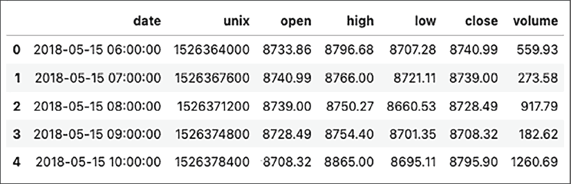

图 11.5:加密数据集

我们将添加一个相对强弱指标信号，一个金融市场的技术指标。它通过比较最近一个交易期的收盘价来衡量市场的强弱。我们还将添加一个**移动平均线收敛/发散** ( **MACD** )指标，旨在揭示趋势的强度、方向、动量和持续时间的变化。

这两个定义如下:

```py
def rsi(price: Stream[float], period: float) -> Stream[float]:

    r = price.diff()

    upside = r.clamp_min(0).abs()

    downside = r.clamp_max(0).abs()

    rs = upside.ewm(alpha=1 / period).mean() / downside.ewm(alpha=1 / period).mean()

    return 100*(1 - (1 + rs) ** -1)

def macd(price: Stream[float], fast: float, slow: float, signal: float) -> Stream[float]:

    fm = price.ewm(span=fast, adjust=False).mean()

    sm = price.ewm(span=slow, adjust=False).mean()

    md = fm - sm

    signal = md - md.ewm(span=signal, adjust=False).mean()

    return signal 
```

或者，在这里我们可以使用来自`ta`库的交易信号。

我们现在将设置用于我们决策的 feed:

```py
features = []

for c in data.columns[1:]:

    s = Stream.source(list(data[c]), dtype="float").rename(data[c].name)

    features += [s]

cp = Stream.select(features, lambda s: s.name == "close") 
```

我们选择收盘价作为特征。

现在，我们将添加我们的指标作为附加功能:

```py
features = [

    cp.log().diff().rename("lr"),

    rsi(cp, period=20).rename("rsi"),

    macd(cp, fast=10, slow=50, signal=5).rename("macd")

]

feed = DataFeed(features)

feed.compile() 
```

除了 RSI 和 MACD，我们还增加了一个趋势指标(LR)。

我们可以看看数据馈送中的前五行:

```py
for i in range(5):

    print(feed.next()) 
```

下面是我们的交易信号特征:

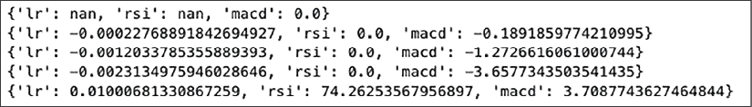

图 11.6:交易的数据馈送

让我们来设置代理:

```py
bitstamp = Exchange("bitstamp", service=execute_order)(

    Stream.source(list(data["close"]), dtype="float").rename("USD-BTC")

) 
```

交易所是让我们执行订单的接口。一个交易所需要一个名称、一个执行服务和价格数据流。目前，TensorTrade 支持使用模拟或随机数据的模拟执行服务。

现在我们需要一个投资组合:

```py
portfolio = Portfolio(USD, [

    Wallet(bitstamp, 10000 * USD),

    Wallet(bitstamp, 10 * BTC)

]) 
```

投资组合可以是交易所和交易所支持的工具的任意组合。

TensorTrade 包括许多监控工具，称为渲染器，可以附加到环境中。例如，他们可以绘制图表(`PlotlyTradingChart`)或记录文件(`FileLogger`)。这是我们的设置:

```py
renderer_feed = DataFeed([

    Stream.source(list(data["date"])).rename("date"),

    Stream.source(list(data["open"]), dtype="float").rename("open"),

    Stream.source(list(data["high"]), dtype="float").rename("high"),

    Stream.source(list(data["low"]), dtype="float").rename("low"),

    Stream.source(list(data["close"]), dtype="float").rename("close"), 

    Stream.source(list(data["volume"]), dtype="float").rename("volume") 

]) 
```

最后，这里是交易环境，这是 OpenAI Gym 的一个实例(OpenAI Gym 提供了各种各样的模拟环境):

```py
env = default.create(

    portfolio=portfolio,

    action_scheme="managed-risk",

    reward_scheme="risk-adjusted",

    feed=feed,

    renderer_feed=renderer_feed,

    renderer=default.renderers.PlotlyTradingChart(),

    window_size=20

) 
```

如果你以前做过强化学习，你可能会对健身房的环境很熟悉。

我们来看看健身房的视频:

```py
env.observer.feed.next() 
```

以下是结果:

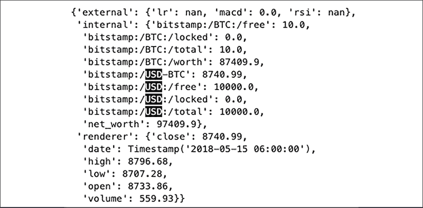

图 11.7:交易机器人的环境数据馈送

这就是交易机器人在执行交易时能够依赖的决策。

现在我们可以建立和训练我们的 DQN 贸易代理:

```py
agent = DQNAgent(env)

agent.train(n_steps=200, n_episodes=2, save_path="agents/") 
```

这可能是一个很好的点来解释一个时代和一个插曲之间的区别。读者可能会熟悉一个纪元，它是对所有训练示例的一次遍历，而一个插曲是特定于强化学习的上下文的。一集是一系列的状态、动作和奖励，以一个终结状态结束。

我们从渲染器中获得大量绘图输出。这是我得到的第一个输出(你的可能有点不同):

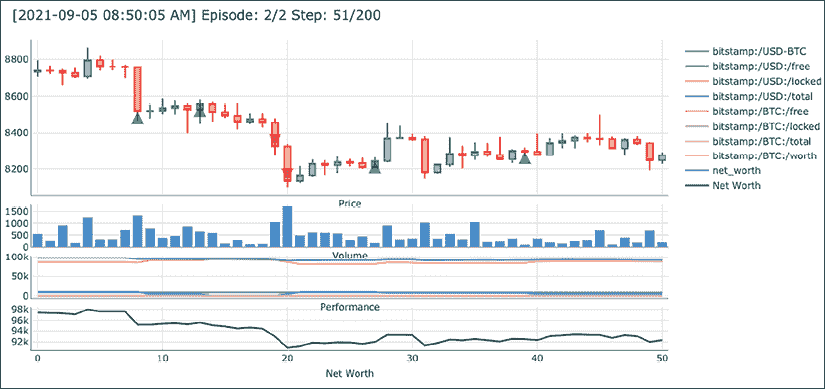

图 11.8:PlotlyPlotRenderer–第 2/2 集第 51/200 步

这个图给出了我们的交易机器人的市场运作概况。第一个副图显示了价格的上下波动。然后第二个副图显示了投资组合中的股票数量，在最底部的副图中，你可以看到投资组合的净值。

如果您想查看一段时间内的净值(不仅仅是上面的第一个快照)，您也可以绘制如下图:

```py
performance["net_worth"].plot() 
```

以下是一段时间内的投资组合净值:

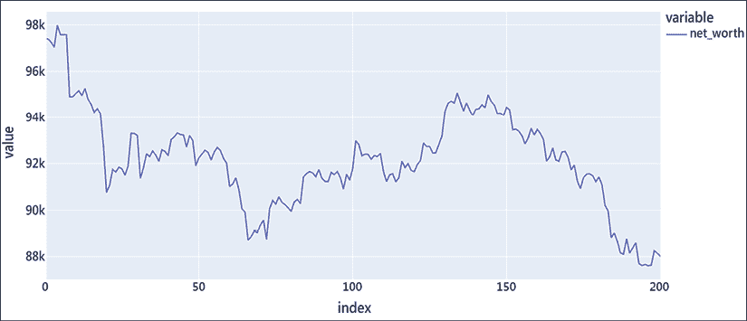

图 11.9:一段时间内的投资组合价值

看起来我们的交易机器人在被释放之前需要更多的训练。我亏损了，所以我很高兴没有真钱。

这都是乡亲。我们总结一下。

# 摘要

我们在*第八章*、*中谈到的在线学习，针对时间序列的在线学习*是针对传统的监督学习，而强化学习则试图应对环境。在这一章中，我介绍了与时间序列相关的强化学习概念，我们也讨论了许多算法，比如深度 Q 学习和 **MABs** 。

强化学习算法在某些情况下非常有用，比如推荐、交易或更普遍的控制场景。在实践部分，我们使用单克隆抗体和一个带 DQN 的交易机器人实现了一个推荐器。

在下一章，我们将看时间序列的案例研究。除此之外，我们将关注能源需求的多元预测。