# 12

# 多元预测

如果你一直在关注这本书，现在你会发现，时间序列领域在过去十年里取得了很多进展。将机器学习应用于时间序列的许多扩展和新技术已经出现。在每一章中，我们都讨论了许多不同的问题，包括预测、异常和漂移检测、回归和分类，以及各种方法，包括传统方法、带有梯度增强和其他方法的机器学习、强化学习、在线学习、深度学习和概率模型。

在这一章中，我们将更深入地将其中一些付诸实践。到目前为止，我们已经讨论了大部分单变量时间序列，但是在这一章中，我们将研究预测在能源需求中的应用。随着世界各地能源或供应危机的持续，这是一个非常及时的主题。我们将使用多元时间序列，并使用不同的方法进行多步预测。

我们将讨论以下主题:

*   预测多元时间序列
*   时间序列的下一步是什么？

第二部分将对时间序列应用和研究的未来进行展望。但我们先从多元数列的讨论开始。然后我们将应用几个模型进行能源需求预测。

# 预测多元时间序列

时间序列预测是学术界一个活跃的研究课题。预测长期趋势不仅是一个有趣的挑战，而且对现实世界应用中的战略规划和运营研究具有重要意义，如 IT 运营管理、制造和网络安全。

多变量时间序列有多个因变量。这意味着每个因变量不仅依赖于它自己的过去值，还可能依赖于其他变量的过去值。这就引入了共线性这样的复杂性，在共线性中，因变量不是独立的，而是相关的。共线性违反了许多线性模型的假设，因此求助于能够捕捉特征交互的模型更有吸引力。

此图显示了一个多变量时间序列的示例，即不同国家的 COVID 死亡数(来自英文维基百科关于新冠肺炎疫情的文章):

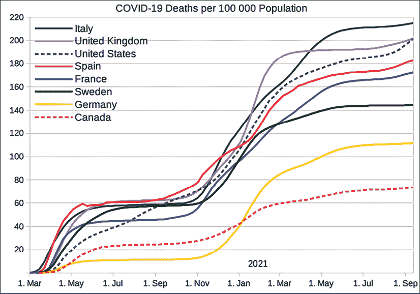

图 12.1:作为多变量时间序列的一个例子，新冠肺炎每 100，000 人中的死亡人数。

不同国家之间的 COVID 死亡率是相关的，尽管它们可能会发生转移，或者它们可能属于不同的组。

我们在*第五章*、*时序机器学习介绍*中提到过 Makridakis 竞赛。主要组织者 Spyros Makridakis 是尼科西亚大学的教授，专门研究时间序列预测。这些竞赛作为最佳算法的基准，研究人员和从业者相互竞争现金价格。这个比赛的希望是，它可以激励机器学习，并作为机器学习的催化剂，为未来的工作开辟方向。

M4 竞赛使用了 100，000 个多元时间序列(来自前甲板数据库)，涵盖了不同的应用领域和时间尺度，结果于 2020 年公布。49 名参赛者或团队提交了分数预测，以测试主要 ML 和统计方法的准确性。

M4 的组织者 Spyros Makridakis、Evangelos Spiliotis 和 Vassilios Assimakopoulos 观察到("*M4 竞赛:100，000 个时间序列和 61 种预测方法"*，2020)，大多数成熟的统计方法的组合(混合或集成)往往比纯统计或纯 ML 方法更准确，后者表现相当差，大多位于该领域的后半部分。尽管在解决预测挑战方面越来越多地采用机器学习方法，但统计方法仍然很强大，尤其是在处理低粒度数据时。然而，应该指出的是，数据集不包括外生变量或时间戳。深度学习和其他机器学习方法也许可以更好地利用更高维度，特别是在存在共线性的情况下，所以这些额外的信息也许会提高这些模型的性能。

然而，来自优步技术公司的 Slawek Smyl 获得了第一名，将€9000 带回家，这是一个循环神经网络和统计时间序列模型(霍尔特-温特斯指数平滑)的混合体。使用梯度下降同时拟合这两个分量。作为一名经验丰富的时间序列从业者，Smyl 之前在使用循环神经网络预测 2016 年国际时间序列竞赛中赢得了*计算智能奖。可以认为，这一结果表明，以机器学习(以及作为延伸的深度学习)为基础的实用主义可以获得回报。*

经济学家长期以来一直致力于混合预测，如高斯混合模型或 GARCH 混合模型。`Skaters`库为集合提供了各种功能，也提供 ARMA 和类似模型的集合。您可以在 microprediction 时间序列排行榜上找到不同系综模型的概述:[https://micro prediction . github . io/time series-elo-ratings/html _ leaderboards/overall . html](https://microprediction.github.io/timeseries-elo-ratings/html_leaderboards/overall.html)

在机器学习方面，集成的一种常见方法，特别是在 bagging 中，是训练几个模型，并根据它们的性能加权它们的预测。Bagging 使用带替换的采样来创建适合基本模型的训练样本。袋外(OOB)误差是模型对不属于训练集的训练样本的平均预测误差。

集成也可以由不同类型的基础模型组成，称为异构集成。Scikit-learn 为回归和分类提供栈，其中最终模型可以找到加权到基础模型预测的系数，以组合基础模型预测。

时间序列分析的行业工作流程中仍然存在许多痛点。其中最主要的是支持多元预测的软件库不多。

截至 2021 年 9 月，尽管多变量预测在路线图上，但它不是 Kats 库的一部分(尽管支持多变量分类)。`statsmodels`库中有`VAR`和`VARMAX`型号；然而，没有人支持对多元时间序列进行去季节化。

Salesforce 的 Merlion 库声称支持多变量预测，但它似乎不是当前功能的一部分。`Darts`库提供了几个适用于多元预测的模型。

神经网络和集成(如随机森林或增强决策树)支持在多变量时间序列上进行训练。在*第 7 章*、*时间序列的机器学习模型*中，我们与 XGBoost 合作创建了一个用于时间序列预测的集成模型。在本书附带的 GitHub 资源库中，我附上了一个笔记本，展示了如何将 scikit-learn 管道和多输出回归器应用于多变量预测。然而，在本章中，我们将重点关注深度学习模型。

东安格利亚大学(英国诺福克诺里奇)的亚历杭德罗·帕索斯·鲁伊斯(Alejandro Pasos Ruiz)及其同事在他们的论文“*The great variable time-series class ification bake off:a review and experimental evaluation of recent algorithm advances*”(2020)中强调了多元应用是如何被忽视的。人们非常关注单变量数据集的建模，这不仅体现在软件解决方案的可用性上，也体现在数据集、以前的竞争和研究中。

他们对来自 UEA 数据集的 30 个多元时间序列运行了时间序列分类的基准。他们发现有三种分类器比动态时间规整算法要精确得多:HIVE-COTE、CIF 和 ROCKET(请参考*第四章*、*时间序列的机器学习介绍*，了解关于这些方法的详细信息)；然而，深度学习方法 ResNet 离这些领先者并不远。

在 *Hassan Ismail Fawaz* 等人(2019)的论文“*时间序列分类的深度学习:综述*”中，基准测试的一个发现是，一些深度神经网络可以与其他方法竞争。他们后来通过显示神经网络集成与 HIVE-COTE 在相同数据上不相上下来跟进这一点(*用于时间序列分类的深度神经网络集成*，“2019”)。

*Pedro Lara-Benitez*等人(2021)在他们的论文“*时间序列预测深度学习架构的实验综述*”中做了另一个比较他们运行了一个回声状态网络(ESN)、一个卷积神经网络(CNN)、一个时间卷积网络(TCN)、一个全连接的前馈网络(MLP)和几个递归架构，如Elman 循环网络、门控递归单元(GRU)网络和长短期记忆(LSTM)网络。

从统计上看，根据平均排名，CNN、MLP、LSTM、TCN、GRU 和 ESN 在 T21 不可同日而语。

总的来说，深度学习模型非常有前途，由于其灵活性，它们可以填补多变量预测的现有空白。我希望在这一章中展示它们是多么有用。

我们将在本章中应用以下模型:

*   n 拍
*   亚马逊的 DeepAR
*   循环神经网络(LSTM)
*   变压器
*   时间卷积网络(TCN)
*   高斯过程

我们在第 10 章、*时间序列的深度学习*中详细介绍了这些方法中的大多数，但我将依次简要介绍每种方法的主要特征。

**用于可解释时间序列预测的神经基础扩展分析** ( **N-BEATS** )，在 2020 年 ICLR 会议上提出，比 M4 竞赛的获胜者提高了 3%。作者展示了一种没有任何时间序列 s 特定成分的纯深度学习方法，在挑战数据集(如 M3 和 M4 比赛数据集和旅游数据集)方面优于统计方法。这种方法的另一个优点是它是可解释的(尽管在本章中我们不会关注这方面)。

DeepAR 是来自德国亚马逊研究院的概率自回归循环网络模型。他们比较了三个不同数据集的分位数预测的准确性，并且只比较了因子分解技术(MatFact)和两个数据集(交通和电力)的预测准确性。

**长短期模型** ( **LSTM** )网络用于序列建模。LSTMs 等循环神经网络的一大卖点是，它们可以学习数据点的长期序列。

**变形金刚**是基于注意力的神经网络，最初在 2017 年的论文“*注意力是你所需要的全部*”中提出它们的关键特征是特征数量的线性复杂性和长期记忆，使我们能够直接访问序列中的任何一点。转换器优于循环神经网络的一个优点是，它们是并行执行的，而不是顺序执行的，因此在训练和预测中运行得更快。

变压器被设计用来解决自然语言处理任务中的序列问题；然而，它们同样可以应用于时间序列问题，包括预测，尽管这种应用没有利用更具体的句子特征，如位置编码。

一个**时间卷积网络** ( **TCN** )由具有相同输入和输出长度的扩张的、因果的 1D 卷积层组成。我们使用的实现包括白等人(2018)提出的残差块。

这些方法中的最后一种，**高斯过程**不能令人信服地归类为深度学习模型；然而，它们相当于单层全连接神经网络，在其参数上具有独立且相同分布的先验。它们可以被视为多元正态分布的无限维推广。

一个有趣的额外的方面——尽管我们在此不再赘述——是许多方法允许使用额外的解释变量(外生变量)。

我们将使用不同州的 10 维能源需求时间序列。数据集来自 2017 年全球能源预测竞赛(GEFCom2017)。

每个变量记录特定区域的能源使用情况。这强调了长期记忆的问题——为了突出这一点，我们将做一个多步预测。

您可以在 GitHub 上的一个存储库中找到模型的`tensorflow/keras`实现以及数据的效用函数，我创建这个存储库是为了演示的目的，其中包含用于多变量和多步预测、回归和分类的时间序列模型:[https://github.com/benman1/time-series](https://github.com/benman1/time-series)。

让我们直接开始吧。

## Python 实践

我们将加载能源需求数据集，并应用几种预测方法。我们正在使用一个大数据集，其中一些模型非常复杂，因此训练可能需要很长时间。我建议你使用 Google Colab 并打开 GPU 支持，或者减少迭代次数或数据集的大小。我将在相关的时候提到性能调整。

让我们从上面提到的 GitHub 库安装库开始:

```
!pip install git+https://github.com/benman1/time-series 
```

这不会花很长时间。由于需求包括`tensorflow`和`numpy`，我建议将它们安装到虚拟环境中。

然后，我们将使用库中的实用方法加载数据集，并将其包装在一个`TrainingDataSet`类中:

```
from time_series.dataset.utils import get_energy_demand

from time_series.dataset.time_series import TrainingDataSet

train_df = get_energy_demand()

tds = TrainingDataSet(train_df) 
```

如果想加快训练速度，可以减少训练样本的数量。例如，你可以说:`tds = TrainingDataSet(train_df.head(500))`，而不是前面的一行。

我们稍后将为`GaussianProcess`这样做，它不能处理完整的数据集。

对于这些模型中的大多数，我们将使用 TensorFlow 图模型，它依赖于非急切执行。我们必须显式禁用急切执行。此外，对于其中一个模型，我们需要设置中间体的输出，以避免张量流问题:`Connecting to invalid output X of source node Y which has Z outputs`:

```
from tensorflow.python.framework.ops import disable_eager_execution

import tensorflow as tf

disable_eager_execution()  # for graph mode

tf.compat.v1.experimental.output_all_intermediates(True) 
```

我已经设置了我们将用于所有生成的预测的指标和绘图方法。我们可以从时间序列库中加载它们:

```
from time_series.utils import evaluate_model 
```

我们还会将训练中的时期数设置为`100`——每个型号都一样:

```
N_EPOCHS = 100 
```

如果您发现训练花费的时间很长，您可以将其设置为一个较低的值，这样训练会提前结束。

让我们依次讨论不同的预测方法，首先是`DeepAR`:

```
from time_series.models.deepar import DeepAR

ar_model = DeepAR(tds)

ar_model.instantiate_and_fit(verbose=1, epochs=N_EPOCHS) 
```

我们会看到模型的总结，然后是一段时间内的训练误差(此处省略):

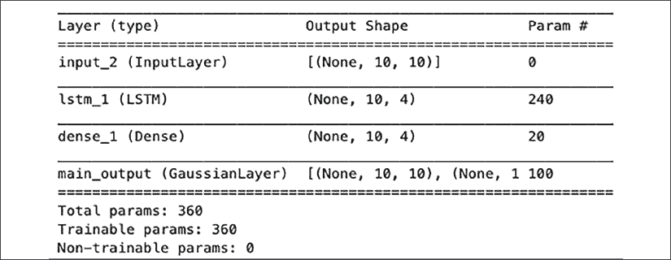

图 12.2: DeepAR 模型参数。

这个模型相对简单，我们可以看到:只有`360`个参数。显然，我们可以调整这些参数并添加更多参数。

然后，我们将对测试数据集进行预测:

```
y_predicted = ar_model.model.predict(tds.X_test)

evaluate_model(tds=tds, y_predicted=y_predicted,

    columns=train_df.columns, first_n=10) 
```

我们将看到误差——首先是总体误差，然后是每个`10`尺寸的误差:

```
MSE: 0.4338

----------

CT: 0.39

MASS: 1.02

ME: 1.13

NEMASSBOST: 1.48

NH: 1.65

RI: 1.48

SEMASS: 1.65

TOTAL: 1.45

VT: 1.23

WCMASS: 1.54 
```

我们将在第一个`10`时间步看到剧情:

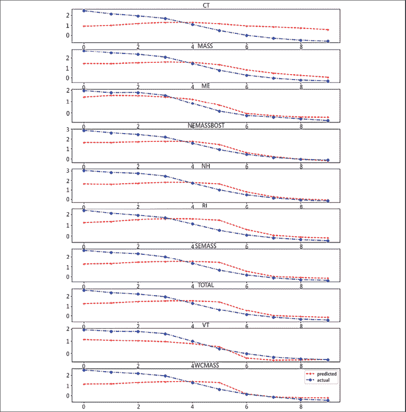

图 12.3: DeepAR 对 10 个时间步长的预测。

让我们把移到下一个方法:N 拍:

```
from time_series.models.nbeats import NBeatsNet

nb = NBeatsNet(tds)

nb.instantiate_and_fit(verbose=1, epochs=N_EPOCHS)

y_predicted = nb.model.predict(tds.X_test)

evaluate_model(tds=tds, y_predicted=y_predicted,

    columns=train_df.columns, first_n=10) 
```

N-BEATS 训练两个网络。前向网络有`1,217,024`参数。

让我们看看预测:

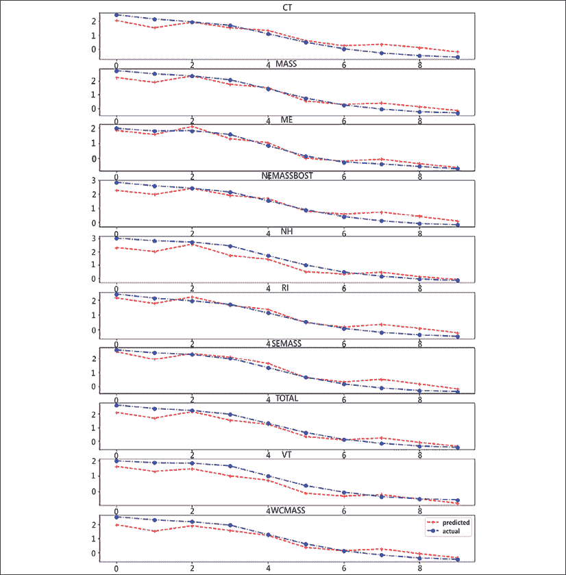

图 12.4: N 节拍预测。

LSTM 接下来是:

```
from time_series.models.LSTM import LSTM

lstm = LSTM(tds)

lstm.instantiate_and_fit(verbose=1, epochs=N_EPOCHS)

y_predicted = lstm.model.predict(tds.X_test)

evaluate_model(tds=tds, y_predicted=y_predicted,

    columns=train_df.columns, first_n=10) 
```

这个模型比 DeepAR 需要更多的参数:

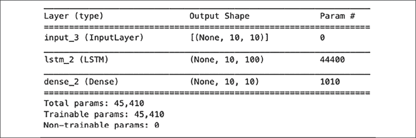

图 12.5: LSTM 模型参数。

`45,000`参数–这意味着这比`DeepAR`需要更长的训练时间。

这里我们再次看到预测:

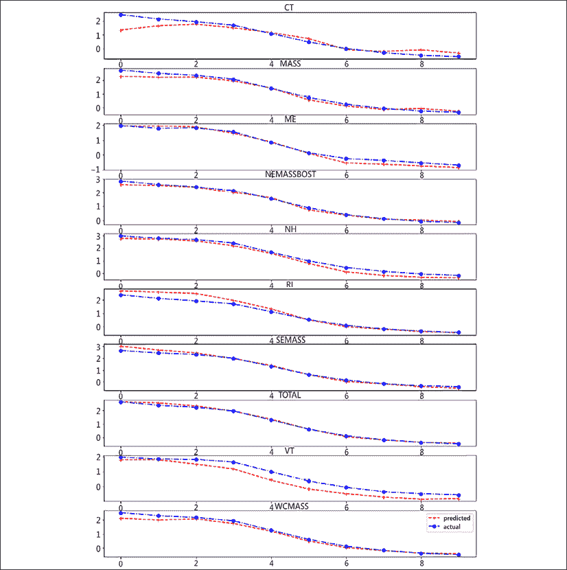

图 12.6: LSTM 预测。

让我们做变压器:

```
trans = Transformer(tds)

trans.instantiate_and_fit(verbose=1, epochs=N_EPOCHS)

y_predicted = trans.model.predict(tds.X_test)

evaluate_model(tds=tds, y_predicted=y_predicted,

    columns=train_df.columns, first_n=10) 
```

这是预测图:

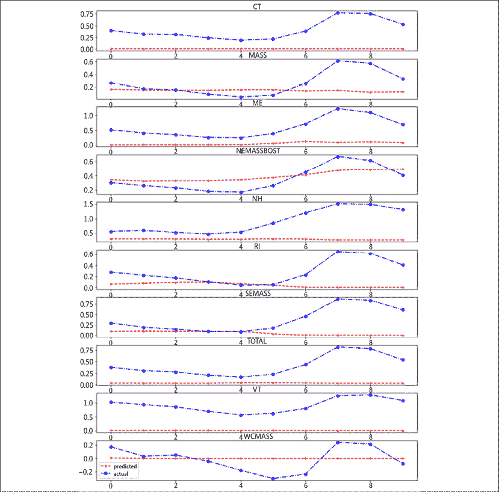

图 12.7:变压器预测。

这款车型需要很长时间来训练，性能是所有车型中最差的。

我们最后一个深度学习模型是 TCN:

```
from time_series.models.TCN import TCNModel

tcn_model = TCNModel(tds)

tcn_model.instantiate_and_fit(verbose=1, epochs=N_EPOCHS)

print(tcn_model.model.evaluate(tds.X_test, tds.y_test))

y_predicted = tcn_model.model.predict(tds.X_test)

evaluate_model(tds=tds, y_predicted=y_predicted, columns=train_df.columns, first_n=10 
```

预测如下:

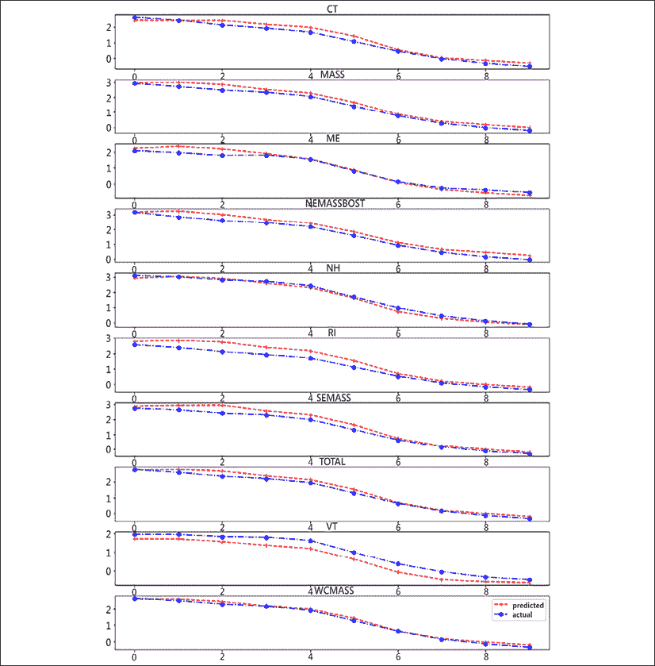

图 12.8: TCN 预测。

不幸的是，高斯过程不能处理我们的数据集——因此，我们将只加载一小部分。高斯过程也依赖于急切执行，所以我们必须重启内核，重做导入，然后执行它。如果你对如何做到这一点有疑问，请看看本书 GitHub 资源库中的`gaussian_process`笔记本。

我们开始吧:

```
from time_series.models.gaussian_process import GaussianProcess

tds2d = TrainingDataSet(train_df.head(500), train_split=0.1, two_dim=True)

gp = GaussianProcess(tds2d)

gp.instantiate_and_fit(maxiter=N_EPOCHS)

y_predicted = gp.predict(tds2d.X_test)[0].numpy().reshape(-1, tds.dimensions, tds.n_steps)

evaluate_model(tds=tds, y_predicted=y_predicted,

    columns=train_df.columns, first_n=10) 
```

天气预报是这样的:

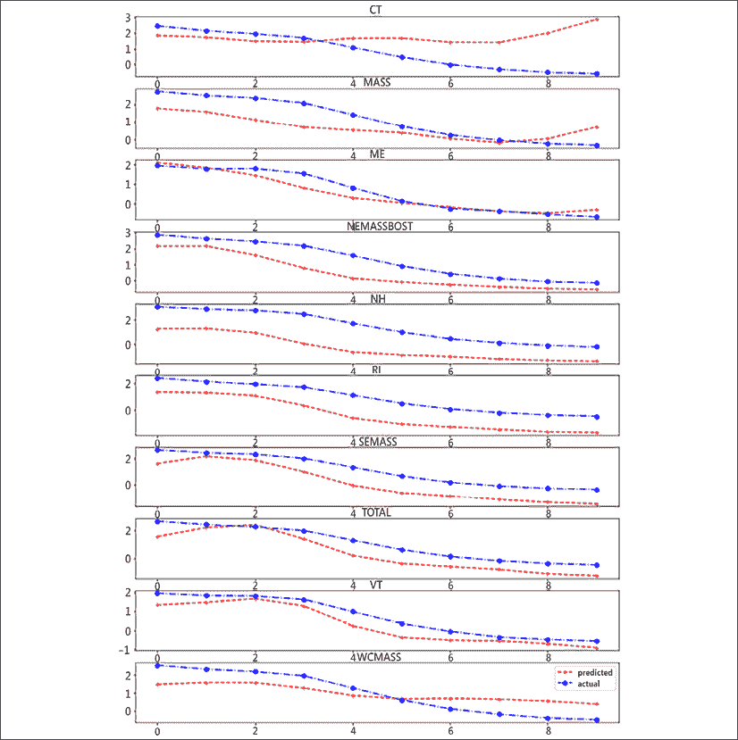

图 12.9:高斯过程预测。

所有算法(除了高斯过程)都在`99336`数据点上进行训练。如上所述，我们已经将训练时期设置为`100`，但是有一个提前停止规则，如果训练损失在`5`迭代内没有改变，它将停止训练。

模型在测试集上进行了验证。

让我们来看看统计数据:

|  | 因素 | MSE(测试) | 纪元 |
| 迪帕尔 | 360 | 0.4338 | 100 |
| n 拍 | 1,217,024 | 0.1016 | 100 |
| LSTM | 45,410 | 0.1569 | 100 |
| 变压器 | 51,702 | 0.9314 | 55 |
| TCN | 145,060 | 0.0638 | 100 |
| 高斯过程 | 8 | 0.4221 | 100 |
| 萨尔瓦多 | 一 | 11.28 | - |

鉴于深度学习方法之间的巨大差异，transformer 的实现可能会有一些问题——我会在某个时候尝试解决这个问题。

我在组合中加入了一种基线方法，**指数平滑法** ( **ES** )。你可以在时序库中找到这个代码。

这是本章和本书的结尾。如果你想更好地了解引擎盖下发生的事情，可以看看回购协议。您也可以调整模型参数。

# 时间序列的下一步是什么？

我们已经在这本书里研究了时间序列的许多方面。如果你已经做到了这一步，你应该已经学会了如何分析时间序列，以及如何应用传统的时间序列预测。这往往是市场上其他书籍的主要关注点；然而，我们远远不止于此。

我们研究了与机器学习相关的时间序列的预处理和转换。我们查看了许多在无监督和有监督环境中应用机器学习进行预测和其他预测、异常检测以及漂移和变点检测的示例。我们深入研究了在线学习、强化学习、概率模型和深度学习等技术。

在每一章中，我们都在看最重要的库，有时甚至是最前沿的库，最后是流行的工业应用程序。我们已经研究了 HIVE-COTE 等最先进的模型、ROCKET 等预处理方法以及适应漂移的模型(自适应在线模型),并回顾了一些异常检测方法。

我们甚至还研究了一些场景，比如在多个武装匪徒的时间序列模型之间切换，或者用反事实进行因果分析。

由于它们的普及，时间序列建模和预测在多个领域是至关重要的，并且具有巨大的经济重要性。虽然传统和成熟的方法一直占据主导地位，但时间序列的机器学习是一个相对较新的研究领域，刚刚真正走出婴儿期，深度学习是这场革命的一个非常活跃的前沿。

对好模式的探索将会继续，延伸到更大的新挑战。其中之一，正如我希望在本章的前一节所展示的，是使多元方法成为一个更实际的命题。

下一场 Makridakis 竞赛在 M5 举行，重点是沃尔玛提供的分层时间序列(42，000 个时间序列)。最终结果将于 2022 年公布。机器学习模型可以在时间序列的分层回归方面表现出色，在具有 61 组不同波动率的时间序列的基准测试中，优于文献中一些成熟的模型，如*马赫迪·阿布加塞米*和其他人(*机器学习在时间序列分层预测中的应用*，2019)。时间序列预测的混合效应模型(适用于组和层次)也是一个活跃的研究领域。

M6 竞赛的特色是对 S&P500 美股和国际 ETF 的实时金融预测。未来的竞争可能会集中在非线性上，如黑天鹅事件，厚尾时间序列，以及对风险管理和决策非常重要的分布。


[packt.com](http://packt.com)

订阅我们的在线数字图书馆，获取超过 7，000 本书籍和视频，以及行业领先的工具，帮助您规划个人发展和推进职业发展。欲了解更多信息，请访问我们的网站。

# 为什么要订阅？

*   利用 4，000 多名行业专家提供的实用电子书和视频，减少学习时间，增加编码时间
*   借助专为您打造的技能计划，更好地学习
*   每月获得一份免费的电子书或视频
*   完全可搜索，便于访问重要信息
*   复制和粘贴、打印和书签内容

你知道吗，Packt 提供每本出版书籍的电子书版本，有 PDF 和 ePub 文件。你可以在[www.Packt.com](http://www.Packt.com)升级到电子书版本，作为纸质书的客户，你有权享受电子书版本的折扣。更多详情，请致电 customercare@packtpub.com[与我们联系。](http://customercare@packtpub.com)

在[www.Packt.com](http://www.Packt.com)，你还可以阅读一系列免费的技术文章，订阅一系列免费的时事通讯，并获得 Packt 书籍和电子书的独家折扣和优惠。

# 你可能喜欢的其他书籍

如果您喜欢这本书，您可能会对 Packt 的其他书籍感兴趣:

[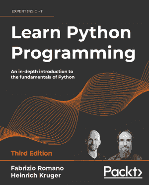](https://www.packtpub.com/product/learn-python-programming-third-edition/9781801815093)

**学习 Python 编程——第三版**

法布里齐奥·罗马诺

海因里希·克鲁格

国际标准书号:978-1-80181-509-3

*   让 Python 在 Windows、Mac 和 Linux 上运行
*   在任何情况下编写优雅、可重用和高效的代码
*   避免常见的陷阱，如重复、复杂的设计和过度工程化
*   了解何时使用函数式或面向对象的编程方法
*   用 FastAPI 构建一个简单的 API，用 Tkinter 编写 GUI 应用程序
*   初步了解更复杂的主题，如数据持久性和加密
*   获取、清理和操作数据，有效利用 Python 的内置数据结构

[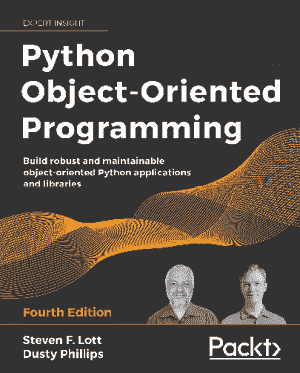](https://www.packtpub.com/product/python-object-oriented-programming-fourth-edition/9781801077262)

**Python 面向对象编程——第四版**

史蒂文·洛特

达斯丁·菲利普斯

国际标准书号:978-1-80107-726-2

*   通过创建类和定义方法在 Python 中实现对象
*   使用继承扩展类功能
*   使用异常干净利落地处理异常情况
*   理解什么时候使用面向对象的特性，更重要的是，什么时候不使用它们
*   探索几种广泛使用的设计模式，以及它们是如何在 Python 中实现的
*   揭示单元和集成测试的简单性，并理解它们为什么如此重要
*   学习静态类型检查你的动态代码
*   理解 asyncio 的并发性以及它如何加速程序

[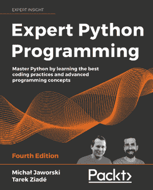](https://www.packtpub.com/product/expert-python-programming-fourth-edition/9781801071109)

**专业 Python 编程–第四版**

米哈尔·贾沃斯基

塔里克·齐亚代

国际标准书号:978-1-80107-110-9

*   探索建立可重复且一致的 Python 开发环境的现代方法
*   有效地打包 Python 代码以供社区和生产使用
*   学习 Python 编程的现代语法元素，如 f 字符串、枚举和 lambda 函数
*   用元类揭开 Python 中元编程的神秘面纱
*   用 Python 编写并发代码
*   用用 C 和 C++编写的代码扩展和集成 Python

# Packt 正在寻找像你这样的作者

如果你有兴趣成为 Packt 的作者，请访问[authors.packtpub.com](http://authors.packtpub.com)并立即申请。我们与成千上万像您一样的开发人员和技术专家合作，帮助他们与全球技术社区分享他们的见解。你可以做一个一般性的申请，申请一个我们正在招聘作者的特定热门话题，或者提交你自己的想法。

# 分享你的想法

现在你已经用 Python 完成了*时间序列的机器学习，我们很想听听你的想法！如果您从亚马逊购买了这本书，请[点击此处直接进入该书的亚马逊评论页面](https://packt.link/r/1801819629)，分享您的反馈或在您购买该书的网站上留下评论。*

您的评论对我们和技术社区非常重要，将有助于我们确保提供高质量的内容。


索引

A

激活功能 [264](Chapter_10.xhtml#_idIndexMarker777)

激活功能 [266](Chapter_10.xhtml#_idIndexMarker790)

101

适应性学习 [222](Chapter_8.xhtml#_idIndexMarker672)

方法 [222](Chapter_8.xhtml#_idIndexMarker673)

自适应 XGBoost [222](Chapter_8.xhtml#_idIndexMarker674)

ADWIN(自适应窗口) [220](Chapter_8.xhtml#_idIndexMarker669)

经纪人 [98](Chapter_4.xhtml#_idIndexMarker266)

赤池信息标准(AIC) [140](Chapter_5.xhtml#_idIndexMarker437)

赤池信息标准(AIC) [156](Chapter_5.xhtml#_idIndexMarker496)

AlexNet [265](Chapter_10.xhtml#_idIndexMarker786)

亚马逊 [169](Chapter_6.xhtml#_idIndexMarker520)

anaconda 文档

参考链接 [22](Chapter_1.xhtml#_idIndexMarker044)

年金 [7](Chapter_1.xhtml#_idIndexMarker015)

异常检测 [95](Chapter_4.xhtml#_idIndexMarker248) ， [164](Chapter_6.xhtml#_idIndexMarker507) ， [165](Chapter_6.xhtml#_idIndexMarker508) ， [166](Chapter_6.xhtml#_idIndexMarker511) ， [167](Chapter_6.xhtml#_idIndexMarker512) ， [168](Chapter_6.xhtml#_idIndexMarker513) ， [178](Chapter_6.xhtml#_idIndexMarker546) ， [179](Chapter_6.xhtml#_idIndexMarker548) ， [180](Chapter_6.xhtml#_idIndexMarker552)

亚马逊 [169](Chapter_6.xhtml#_idIndexMarker519)

脸书 [170](Chapter_6.xhtml#_idIndexMarker524)

谷歌分析 [169](Chapter_6.xhtml#_idIndexMarker518)

实现 [170](Chapter_6.xhtml#_idIndexMarker531) 、 [171](Chapter_6.xhtml#_idIndexMarker532) 、 [172](Chapter_6.xhtml#_idIndexMarker533)

微软 [168](Chapter_6.xhtml#_idIndexMarker515) ， [169](Chapter_6.xhtml#_idIndexMarker516)

推特 [170](Chapter_6.xhtml#_idIndexMarker526)

防盗系统 [146](Chapter_5.xhtml#_idIndexMarker465)

应用统计学 [17](Chapter_1.xhtml#_idIndexMarker035)

ARCH(自回归条件异方差) [143](Chapter_5.xhtml#_idIndexMarker453)

曲线下面积 [115](Chapter_4.xhtml#_idIndexMarker339)

人工通用智能(AGI) [298](Chapter_11.xhtml#_idIndexMarker850)

天文学 [11](Chapter_1.xhtml#_idIndexMarker020) ， [12](Chapter_1.xhtml#_idIndexMarker021)

自相关 [58](Chapter_2.xhtml#_idIndexMarker143) ， [59](Chapter_2.xhtml#_idIndexMarker144)

自编码器(AEs) [272](Chapter_10.xhtml#_idIndexMarker808) ， [273](Chapter_10.xhtml#_idIndexMarker812)

自动特征提取 [88](Chapter_3.xhtml#_idIndexMarker233) ， [89](Chapter_3.xhtml#_idIndexMarker234)

自回归(AR) [135](Chapter_5.xhtml#_idIndexMarker411) ， [136](Chapter_5.xhtml#_idIndexMarker416)

自回归条件异方差(ARCH) [146](Chapter_5.xhtml#_idIndexMarker466)

自回归综合移动平均线(ARIMA) [129](Chapter_4.xhtml#_idIndexMarker399)

自回归综合移动平均模型(ARIMA) [138](Chapter_5.xhtml#_idIndexMarker423)

自回归模型 [135](Chapter_5.xhtml#_idIndexMarker412)

自回归移动平均(ARMA) [137](Chapter_5.xhtml#_idIndexMarker421)

B

回播 [95](Chapter_4.xhtml#_idIndexMarker245)

反向传播 [99](Chapter_4.xhtml#_idIndexMarker271) 、 [103](Chapter_4.xhtml#_idIndexMarker289) 、 [264](Chapter_10.xhtml#_idIndexMarker780)

装袋 [100](Chapter_4.xhtml#_idIndexMarker279) 、 [101](Chapter_4.xhtml#_idIndexMarker283)

对比增压 [102](Chapter_4.xhtml#_idIndexMarker286)

图案袋 [122](Chapter_4.xhtml#_idIndexMarker371)

图案袋 [123](Chapter_4.xhtml#_idIndexMarker378)

SFA 符号包(BOSS) [122](Chapter_4.xhtml#_idIndexMarker370)

强盗算法 [302](Chapter_11.xhtml#_idIndexMarker861) 、 [303](Chapter_11.xhtml#_idIndexMarker863)

基础学习者 [100](Chapter_4.xhtml#_idIndexMarker280)

贝叶斯信息准则(BIC) [140](Chapter_5.xhtml#_idIndexMarker438)

贝叶斯结构时间序列(BSTS)模型 [236](Chapter_9.xhtml#_idIndexMarker697) ， [242](Chapter_9.xhtml#_idIndexMarker726) ， [243](Chapter_9.xhtml#_idIndexMarker727) ， [244](Chapter_9.xhtml#_idIndexMarker728)

在 Python 中实现 [256](Chapter_9.xhtml#_idIndexMarker758) 、 [257](Chapter_9.xhtml#_idIndexMarker761) 、 [259](Chapter_9.xhtml#_idIndexMarker764)

生物 [10](Chapter_1.xhtml#_idIndexMarker018)

增压 [100](Chapter_4.xhtml#_idIndexMarker278)

自举 [101](Chapter_4.xhtml#_idIndexMarker284)

向量空间中的 BOSS(BOSS VS)[122](Chapter_4.xhtml#_idIndexMarker372)

鲍克斯-考克斯变换 [72](Chapter_3.xhtml#_idIndexMarker178) 、 [81](Chapter_3.xhtml#_idIndexMarker217) 、 [82](Chapter_3.xhtml#_idIndexMarker219)

工作日

提取，月份 [88](Chapter_3.xhtml#_idIndexMarker232)

C

C4.5 算法 [100](Chapter_4.xhtml#_idIndexMarker275)

索理论 [263](Chapter_10.xhtml#_idIndexMarker772)

典型区间森林(CIF) [121](Chapter_4.xhtml#_idIndexMarker366)

CART 算法(分类和回归树) [100](Chapter_4.xhtml#_idIndexMarker274)

因果滤波器 [74](Chapter_3.xhtml#_idIndexMarker190)

单元格 [265](Chapter_10.xhtml#_idIndexMarker781)

中心极限定理 [12](Chapter_1.xhtml#_idIndexMarker023)

CMAP 应用数学中心 [129](Chapter_4.xhtml#_idIndexMarker394)

变点检测(CPD) [172](Chapter_6.xhtml#_idIndexMarker534) 、 [173](Chapter_6.xhtml#_idIndexMarker535) 、 [174](Chapter_6.xhtml#_idIndexMarker537) 、 [175](Chapter_6.xhtml#_idIndexMarker539) 、 [176](Chapter_6.xhtml#_idIndexMarker540) 、 [180](Chapter_6.xhtml#_idIndexMarker554) 、 [181](Chapter_6.xhtml#_idIndexMarker555) 、 [182](Chapter_6.xhtml#_idIndexMarker558)

经典款 [132](Chapter_5.xhtml#_idIndexMarker400) 、 [133](Chapter_5.xhtml#_idIndexMarker401)

ARCH(自回归条件异方差)143

自回归(AR) [134](Chapter_5.xhtml#_idIndexMarker405) 、 [135](Chapter_5.xhtml#_idIndexMarker410) 、 [136](Chapter_5.xhtml#_idIndexMarker415)

GARCH(广义 ARCH) [144](Chapter_5.xhtml#_idIndexMarker457)

型号选择 [139](Chapter_5.xhtml#_idIndexMarker430)

移动平均线 [134](Chapter_5.xhtml#_idIndexMarker404)

订单 [139](Chapter_5.xhtml#_idIndexMarker429) 、 [140](Chapter_5.xhtml#_idIndexMarker436)

向量自回归模型 [144](Chapter_5.xhtml#_idIndexMarker458) ， [145](Chapter_5.xhtml#_idIndexMarker461)

分类 [95](Chapter_4.xhtml#_idIndexMarker243) 、 [97](Chapter_4.xhtml#_idIndexMarker259) 、 [113](Chapter_4.xhtml#_idIndexMarker325)

聚类 [95](Chapter_4.xhtml#_idIndexMarker246) 、 [176](Chapter_6.xhtml#_idIndexMarker541) 、 [177](Chapter_6.xhtml#_idIndexMarker542)

决定系数 [107](Chapter_4.xhtml#_idIndexMarker306) ， [108](Chapter_4.xhtml#_idIndexMarker307)

共线性 [50](Chapter_2.xhtml#_idIndexMarker115)

复杂单元格 [265](Chapter_10.xhtml#_idIndexMarker783)

概念漂移 [217](Chapter_8.xhtml#_idIndexMarker660)

康达 [22](Chapter_1.xhtml#_idIndexMarker043)

置信区间 [45](Chapter_2.xhtml#_idIndexMarker101)

混乱矩阵 [114](Chapter_4.xhtml#_idIndexMarker326)

语境盗匪 [303](Chapter_11.xhtml#_idIndexMarker866)

应急表 [220](Chapter_8.xhtml#_idIndexMarker668)

连续时间马尔可夫链(CTMC) [239](Chapter_9.xhtml#_idIndexMarker716)

通讯网络 [276](Chapter_10.xhtml#_idIndexMarker823)

卷积神经网络(CNN) [322](Chapter_12.xhtml#_idIndexMarker900)

[77](Chapter_3.xhtml#_idIndexMarker206) 卷积神经网络

关联热图 [53](Chapter_2.xhtml#_idIndexMarker124)

相关矩阵 [52](Chapter_2.xhtml#_idIndexMarker123)

相关比率 [115](Chapter_4.xhtml#_idIndexMarker340) 、 [116](Chapter_4.xhtml#_idIndexMarker341)

协变量漂移 [217](Chapter_8.xhtml#_idIndexMarker656)

临界差异(CD)图 [119](Chapter_4.xhtml#_idIndexMarker361)

交叉验证 [105](Chapter_4.xhtml#_idIndexMarker295)

交叉验证准确度加权概率集成(CAWPE) [124](Chapter_4.xhtml#_idIndexMarker383)

曲线拟合 [94](Chapter_4.xhtml#_idIndexMarker241)

周期性变化 [56](Chapter_2.xhtml#_idIndexMarker131)

D

数据帧 [30](Chapter_1.xhtml#_idIndexMarker059)

数据预处理

关于 [68](Chapter_3.xhtml#_idIndexMarker159) 、 [69](Chapter_3.xhtml#_idIndexMarker164)

数据预处理，技术

特征工程 [68](Chapter_3.xhtml#_idIndexMarker162)

特征转换 [68](Chapter_3.xhtml#_idIndexMarker160)

数据集移位 [216](Chapter_8.xhtml#_idIndexMarker652)

日期和时间相关功能 [75](Chapter_3.xhtml#_idIndexMarker193)

日期标注 [85](Chapter_3.xhtml#_idIndexMarker226) ， [86](Chapter_3.xhtml#_idIndexMarker227)

日期时间 [39](Chapter_2.xhtml#_idIndexMarker082) ， [40](Chapter_2.xhtml#_idIndexMarker085) ， [41](Chapter_2.xhtml#_idIndexMarker087)

决策树 [100](Chapter_4.xhtml#_idIndexMarker276)

解码器 [273](Chapter_10.xhtml#_idIndexMarker811)

DeepAR [236](Chapter_9.xhtml#_idIndexMarker693) ， [274](Chapter_10.xhtml#_idIndexMarker818)

DeepAR 型号 [325](Chapter_12.xhtml#_idIndexMarker908) 、 [326](Chapter_12.xhtml#_idIndexMarker909)

深度学习 [261](Chapter_10.xhtml#_idIndexMarker765) ， [262](Chapter_10.xhtml#_idIndexMarker767)

深度学习方法

类型学 [268](Chapter_10.xhtml#_idIndexMarker792)

深度学习，对于时间序列 [269](Chapter_10.xhtml#_idIndexMarker793) ， [270](Chapter_10.xhtml#_idIndexMarker800) ， [271](Chapter_10.xhtml#_idIndexMarker806)

深度 Q-学习 [303](Chapter_11.xhtml#_idIndexMarker869) 、 [304](Chapter_11.xhtml#_idIndexMarker870) 、 [305](Chapter_11.xhtml#_idIndexMarker873)

深 Q 网(DQN) [311](Chapter_11.xhtml#_idIndexMarker883)

深度强化学习(DRL) [301](Chapter_11.xhtml#_idIndexMarker858)

深度状态 [236](Chapter_9.xhtml#_idIndexMarker694)

人口统计 [6](Chapter_1.xhtml#_idIndexMarker012) 、 [7](Chapter_1.xhtml#_idIndexMarker014) 、 [8](Chapter_1.xhtml#_idIndexMarker016) 、 [9](Chapter_1.xhtml#_idIndexMarker017)

树突 [263](Chapter_10.xhtml#_idIndexMarker773)

描述性分析 [36](Chapter_2.xhtml#_idIndexMarker071)

差异 [138](Chapter_5.xhtml#_idIndexMarker425)

扩张因果卷积神经网络 [292](Chapter_10.xhtml#_idIndexMarker845) 、 [293](Chapter_10.xhtml#_idIndexMarker846) 、 [294](Chapter_10.xhtml#_idIndexMarker847) 、 [295](Chapter_10.xhtml#_idIndexMarker848)

狄利克雷采样 [303](Chapter_11.xhtml#_idIndexMarker865)

离散时间马尔可夫链(DTMC) [239](Chapter_9.xhtml#_idIndexMarker715)

基于距离的方法 [118](Chapter_4.xhtml#_idIndexMarker353)

dl-4-tsc [271](Chapter_10.xhtml#_idIndexMarker805)

漂移 [216](Chapter_8.xhtml#_idIndexMarker651) 、 [217](Chapter_8.xhtml#_idIndexMarker654) 、 [218](Chapter_8.xhtml#_idIndexMarker663) 、 [219](Chapter_8.xhtml#_idIndexMarker664)

概念漂移 [217](Chapter_8.xhtml#_idIndexMarker661)

协变量漂移 [217](Chapter_8.xhtml#_idIndexMarker655)

概率漂移 [217](Chapter_8.xhtml#_idIndexMarker659)

漂移检测 [224](Chapter_8.xhtml#_idIndexMarker677) 、 [225](Chapter_8.xhtml#_idIndexMarker678)

方法 [219](Chapter_8.xhtml#_idIndexMarker665) 、 [220](Chapter_8.xhtml#_idIndexMarker670) 、 [222](Chapter_8.xhtml#_idIndexMarker671)

漂移检测方法(DDM) [220](Chapter_8.xhtml#_idIndexMarker666)

漂移过渡 [216](Chapter_8.xhtml#_idIndexMarker653)

脱落 [282](Chapter_10.xhtml#_idIndexMarker832)

动态时间扭曲

使用，在 K-最近邻 [189](Chapter_7.xhtml#_idIndexMarker567)

动态时间扭曲(DTW) [116](Chapter_4.xhtml#_idIndexMarker345)

动态时间扭曲(DTW) [118](Chapter_4.xhtml#_idIndexMarker354) ， [270](Chapter_10.xhtml#_idIndexMarker798)

动态时间卷绕

k-最近邻，在 Python 中 [193](Chapter_7.xhtml#_idIndexMarker585) ， [194](Chapter_7.xhtml#_idIndexMarker588) ， [195](Chapter_7.xhtml#_idIndexMarker590)

E

提前停止 [282](Chapter_10.xhtml#_idIndexMarker833)

回声状态网络 [322](Chapter_12.xhtml#_idIndexMarker899)

ECL(用电负荷) [279](Chapter_10.xhtml#_idIndexMarker830)

经济学 [13](Chapter_1.xhtml#_idIndexMarker025) ， [14](Chapter_1.xhtml#_idIndexMarker026)

弹性系综 [124](Chapter_4.xhtml#_idIndexMarker382)

[心电图 118](Chapter_4.xhtml#_idIndexMarker349)

脑电图 [118](Chapter_4.xhtml#_idIndexMarker350)

脑电图 [16](Chapter_1.xhtml#_idIndexMarker032) 、 [17](Chapter_1.xhtml#_idIndexMarker034) 、 [60](Chapter_2.xhtml#_idIndexMarker149)

电子数字积分器和计算机(ENIAC) [15](Chapter_1.xhtml#_idIndexMarker029) 、 [16](Chapter_1.xhtml#_idIndexMarker030)

编码器 [273](Chapter_10.xhtml#_idIndexMarker810)

ε-贪婪的 [301](Chapter_11.xhtml#_idIndexMarker857)

误差度量

对于时间序列 [106](Chapter_4.xhtml#_idIndexMarker299)

ETT(电力变压器温度) [279](Chapter_10.xhtml#_idIndexMarker829)

欧几里德距离 [116](Chapter_4.xhtml#_idIndexMarker343)

体验重放技术 [304](Chapter_11.xhtml#_idIndexMarker872)

勘探与开采的两难境地 [301](Chapter_11.xhtml#_idIndexMarker856)

探索性分析 [36](Chapter_2.xhtml#_idIndexMarker072)

探索性数据分析(EDA) [36](Chapter_2.xhtml#_idIndexMarker069)

指数平滑 [140](Chapter_5.xhtml#_idIndexMarker439) ， [141](Chapter_5.xhtml#_idIndexMarker441) ， [142](Chapter_5.xhtml#_idIndexMarker445)

指数平滑法 [269](Chapter_10.xhtml#_idIndexMarker795) 、 [275](Chapter_10.xhtml#_idIndexMarker821) 、 [335](Chapter_12.xhtml#_idIndexMarker919)

指数平滑模型 [157](Chapter_5.xhtml#_idIndexMarker499) ， [158](Chapter_5.xhtml#_idIndexMarker500)

用于创建预测 [157](Chapter_5.xhtml#_idIndexMarker498)

极端学生化偏差 [170](Chapter_6.xhtml#_idIndexMarker528)

F

脸书 [170](Chapter_6.xhtml#_idIndexMarker523)

虚警率 [115](Chapter_4.xhtml#_idIndexMarker338)

假阴性(FN) [115](Chapter_4.xhtml#_idIndexMarker333)

假阳性率(FPR) [115](Chapter_4.xhtml#_idIndexMarker337)

假阳性(FP) [115](Chapter_4.xhtml#_idIndexMarker332)

特征工程 [68](Chapter_3.xhtml#_idIndexMarker163)

关于 [74](Chapter_3.xhtml#_idIndexMarker188) 、 [75](Chapter_3.xhtml#_idIndexMarker192)

日期和时间相关功能 [75](Chapter_3.xhtml#_idIndexMarker194)

火箭特征 [76](Chapter_3.xhtml#_idIndexMarker196) 、 [77](Chapter_3.xhtml#_idIndexMarker201)

小形状 [77](Chapter_3.xhtml#_idIndexMarker207)

特征泄漏 [49](Chapter_2.xhtml#_idIndexMarker112)

特征转换 [68](Chapter_3.xhtml#_idIndexMarker161)

关于 [69](Chapter_3.xhtml#_idIndexMarker165)

插补 [73](Chapter_3.xhtml#_idIndexMarker184)

日志转换 [71](Chapter_3.xhtml#_idIndexMarker172)

动力转换 [71](Chapter_3.xhtml#_idIndexMarker174)

缩放比例 [70](Chapter_3.xhtml#_idIndexMarker167)

前馈传播 [264](Chapter_10.xhtml#_idIndexMarker778)

过滤器 [76](Chapter_3.xhtml#_idIndexMarker199)

预报

创建指数平滑模型 [156](Chapter_5.xhtml#_idIndexMarker497)

预测误差 [107](Chapter_4.xhtml#_idIndexMarker304)

预测 [95](Chapter_4.xhtml#_idIndexMarker244)

预测 [6](Chapter_1.xhtml#_idIndexMarker011)

全连接前馈神经网络 [98](Chapter_4.xhtml#_idIndexMarker270)

全连通网络 [281](Chapter_10.xhtml#_idIndexMarker831) 、 [282](Chapter_10.xhtml#_idIndexMarker835) 、 [283](Chapter_10.xhtml#_idIndexMarker836) 、 [284](Chapter_10.xhtml#_idIndexMarker837) 、 [285](Chapter_10.xhtml#_idIndexMarker838) 、 [286](Chapter_10.xhtml#_idIndexMarker839) 、 [288](Chapter_10.xhtml#_idIndexMarker841)

全连接网络 [273](Chapter_10.xhtml#_idIndexMarker815)

全卷积神经网络(FCN) [273](Chapter_10.xhtml#_idIndexMarker816)

模糊建模 [240](Chapter_9.xhtml#_idIndexMarker720) 、 [241](Chapter_9.xhtml#_idIndexMarker723) 、 [242](Chapter_9.xhtml#_idIndexMarker725)

模糊集合论 [240](Chapter_9.xhtml#_idIndexMarker721)

模糊时间序列

在 Python 中实现 [252](Chapter_9.xhtml#_idIndexMarker748) ， [253](Chapter_9.xhtml#_idIndexMarker749) ， [254](Chapter_9.xhtml#_idIndexMarker752) ， [255](Chapter_9.xhtml#_idIndexMarker753) ， [256](Chapter_9.xhtml#_idIndexMarker756)

G

GARCH(广义 ARCH) [144](Chapter_5.xhtml#_idIndexMarker456)

门控循环单元(GRU) [323](Chapter_12.xhtml#_idIndexMarker902)

高斯过程 [333](Chapter_12.xhtml#_idIndexMarker917) ， [334](Chapter_12.xhtml#_idIndexMarker918)

高斯过程 [271](Chapter_10.xhtml#_idIndexMarker804)

广义加性模型(GAM) [129](Chapter_4.xhtml#_idIndexMarker395) ， [170](Chapter_6.xhtml#_idIndexMarker525) ， [238](Chapter_9.xhtml#_idIndexMarker702)

广义线性模型(GLM) [19](Chapter_1.xhtml#_idIndexMarker038)

广义线性模型(GLM) [129](Chapter_4.xhtml#_idIndexMarker398)

广义随机形状森林(gRFS) [119](Chapter_4.xhtml#_idIndexMarker358)

生成敌对网络 [261](Chapter_10.xhtml#_idIndexMarker766)

全球最大池 [77](Chapter_3.xhtml#_idIndexMarker202)

全球温度时间序列

参考链接 [57](Chapter_2.xhtml#_idIndexMarker136)

胶子 271

谷歌分析 [169](Chapter_6.xhtml#_idIndexMarker517)

梯度推进回归树(GBRT) [191](Chapter_7.xhtml#_idIndexMarker573)

梯度增强树

实施 [102](Chapter_4.xhtml#_idIndexMarker288)

梯度升压 [102](Chapter_4.xhtml#_idIndexMarker287) 、 [191](Chapter_7.xhtml#_idIndexMarker571) 、 [192](Chapter_7.xhtml#_idIndexMarker576) 、 [199](Chapter_7.xhtml#_idIndexMarker605) 、 [200](Chapter_7.xhtml#_idIndexMarker606) 、 [201](Chapter_7.xhtml#_idIndexMarker609) 、 [202](Chapter_7.xhtml#_idIndexMarker611) 、 [203](Chapter_7.xhtml#_idIndexMarker615) 、 [204](Chapter_7.xhtml#_idIndexMarker617)

梯度增压机 [191](Chapter_7.xhtml#_idIndexMarker572)

格兰杰因果关系 [117](Chapter_4.xhtml#_idIndexMarker346)

图形处理单元 [265](Chapter_10.xhtml#_idIndexMarker787)

H

异类系综 [321](Chapter_12.xhtml#_idIndexMarker897)

隐马尔可夫模型 [239](Chapter_9.xhtml#_idIndexMarker718)

基于变换的集成的分层投票集合(HIVE-COTE) [123](Chapter_4.xhtml#_idIndexMarker379)

HIVE-COTE(基于变换的集成的分层投票集合) [270](Chapter_10.xhtml#_idIndexMarker799)

赫夫丁树 [215](Chapter_8.xhtml#_idIndexMarker647)

保持 [212](Chapter_8.xhtml#_idIndexMarker635)

节日特色 [83](Chapter_3.xhtml#_idIndexMarker223) 、 [84](Chapter_3.xhtml#_idIndexMarker224) 、 [85](Chapter_3.xhtml#_idIndexMarker225)

霍尔茨-温特斯法 [142](Chapter_5.xhtml#_idIndexMarker444)

我

识别功能 [266](Chapter_10.xhtml#_idIndexMarker791)

插补 [82](Chapter_3.xhtml#_idIndexMarker220) 、 [83](Chapter_3.xhtml#_idIndexMarker222)

插补技术 [73](Chapter_3.xhtml#_idIndexMarker185)

开始时间 [273](Chapter_10.xhtml#_idIndexMarker813) ， [274](Chapter_10.xhtml#_idIndexMarker817)

推论 [96](Chapter_4.xhtml#_idIndexMarker255)

告密者 [278](Chapter_10.xhtml#_idIndexMarker827) ， [279](Chapter_10.xhtml#_idIndexMarker828)

集成开发环境 [27](Chapter_1.xhtml#_idIndexMarker054)

集成 [138](Chapter_5.xhtml#_idIndexMarker424)

四分位数范围 [45](Chapter_2.xhtml#_idIndexMarker104)

J

JupyterLab [26](Chapter_1.xhtml#_idIndexMarker052) ， [27](Chapter_1.xhtml#_idIndexMarker053)

Jupyter 笔记本 [26](Chapter_1.xhtml#_idIndexMarker050)

K

k 武装匪徒 [212](Chapter_8.xhtml#_idIndexMarker638)

Kats 安装 [205](Chapter_7.xhtml#_idIndexMarker619) 、 [206](Chapter_7.xhtml#_idIndexMarker621) 、 [207](Chapter_7.xhtml#_idIndexMarker623)

内核 [76](Chapter_3.xhtml#_idIndexMarker198)

k-最近邻

带动态时间扭曲 [189](Chapter_7.xhtml#_idIndexMarker566)

带动态时间换行，在 Python 中 [193](Chapter_7.xhtml#_idIndexMarker584) 、 [194](Chapter_7.xhtml#_idIndexMarker587) 、 [195](Chapter_7.xhtml#_idIndexMarker591)

L

标签漂移 [217](Chapter_8.xhtml#_idIndexMarker662)

最小二乘算法 [144](Chapter_5.xhtml#_idIndexMarker455)

最小二乘法 [12](Chapter_1.xhtml#_idIndexMarker022)

简约法 [139](Chapter_5.xhtml#_idIndexMarker432)

图书馆

安装 [22](Chapter_1.xhtml#_idIndexMarker042) 、 [23](Chapter_1.xhtml#_idIndexMarker045) 、 [25](Chapter_1.xhtml#_idIndexMarker048)

生命表 [7](Chapter_1.xhtml#_idIndexMarker013)

光梯度推进机(LightGBM) [191](Chapter_7.xhtml#_idIndexMarker574)

线性四速率 [220](Chapter_8.xhtml#_idIndexMarker667)

线性回归 [238](Chapter_9.xhtml#_idIndexMarker705)

线图 [51](Chapter_2.xhtml#_idIndexMarker119)

日志转换 [71](Chapter_3.xhtml#_idIndexMarker171) ， [82](Chapter_3.xhtml#_idIndexMarker218)

日志转换 [78](Chapter_3.xhtml#_idIndexMarker210) 、 [79](Chapter_3.xhtml#_idIndexMarker212) 、 [81](Chapter_3.xhtml#_idIndexMarker214)

长短期记忆【LSTM】[103](Chapter_4.xhtml#_idIndexMarker290)， [265](Chapter_10.xhtml#_idIndexMarker785)

长短期记忆(LSTM) [323](Chapter_12.xhtml#_idIndexMarker903) ， [329](Chapter_12.xhtml#_idIndexMarker911)

长期短期模型 [269](Chapter_10.xhtml#_idIndexMarker796)

损失函数 [106](Chapter_4.xhtml#_idIndexMarker297)

M

机器学习 [93](Chapter_4.xhtml#_idIndexMarker238) ， [98](Chapter_4.xhtml#_idIndexMarker267)

历史 [98](Chapter_4.xhtml#_idIndexMarker268) ， [99](Chapter_4.xhtml#_idIndexMarker272)

用时间序列 [94](Chapter_4.xhtml#_idIndexMarker239)

工作流程 [103](Chapter_4.xhtml#_idIndexMarker292) 、 [104](Chapter_4.xhtml#_idIndexMarker293) 、 [105](Chapter_4.xhtml#_idIndexMarker294)

机器学习算法

对于时间序列 [117](Chapter_4.xhtml#_idIndexMarker347)

查询时间，对比准确度 [124](Chapter_4.xhtml#_idIndexMarker385) ， [125](Chapter_4.xhtml#_idIndexMarker386)

机器学习方法

对于时间序列 [186](Chapter_7.xhtml#_idIndexMarker559) 、 [187](Chapter_7.xhtml#_idIndexMarker561)

脑磁图 [118](Chapter_4.xhtml#_idIndexMarker351)

马尔科夫假设 [239](Chapter_9.xhtml#_idIndexMarker714)

马尔科夫 [239](Chapter_9.xhtml#_idIndexMarker712)

马尔可夫模型 [239](Chapter_9.xhtml#_idIndexMarker710)

隐马尔可夫模型 [239](Chapter_9.xhtml#_idIndexMarker717)

在 Python 中实现 [251](Chapter_9.xhtml#_idIndexMarker743) ， [252](Chapter_9.xhtml#_idIndexMarker745)

马尔可夫过程 [239](Chapter_9.xhtml#_idIndexMarker713)

马尔科夫属性 [239](Chapter_9.xhtml#_idIndexMarker711)

马尔可夫转换模型

在 Python 中实现 [248](Chapter_9.xhtml#_idIndexMarker737) 、 [249](Chapter_9.xhtml#_idIndexMarker739) 、 [250](Chapter_9.xhtml#_idIndexMarker741)

最大似然估计(MLE) [139](Chapter_5.xhtml#_idIndexMarker434)

最大池 [77](Chapter_3.xhtml#_idIndexMarker203)

平均值 [44](Chapter_2.xhtml#_idIndexMarker097)

平均绝对误差 [109](Chapter_4.xhtml#_idIndexMarker310) 、 [110](Chapter_4.xhtml#_idIndexMarker314) 、 [228](Chapter_8.xhtml#_idIndexMarker682)

平均绝对百分比误差(MAPE) [238](Chapter_9.xhtml#_idIndexMarker709)

平均百分比误差(MAPE) [111](Chapter_4.xhtml#_idIndexMarker318)

平均相对绝对误差(MRAE) [108](Chapter_4.xhtml#_idIndexMarker309) ， [113](Chapter_4.xhtml#_idIndexMarker322)

均方误差 [109](Chapter_4.xhtml#_idIndexMarker311) ， [110](Chapter_4.xhtml#_idIndexMarker313)

均方差 [229](Chapter_8.xhtml#_idIndexMarker685)

中位 [45](Chapter_2.xhtml#_idIndexMarker102)

中位数绝对偏差 [165](Chapter_6.xhtml#_idIndexMarker510)

中值绝对误差(MdAE) [111](Chapter_4.xhtml#_idIndexMarker317)

药品 [16](Chapter_1.xhtml#_idIndexMarker031) 、 [17](Chapter_1.xhtml#_idIndexMarker033)

气象学 [14](Chapter_1.xhtml#_idIndexMarker027)

公制 [106](Chapter_4.xhtml#_idIndexMarker298)

微观预测时间序列排行榜

参考链接 [321](Chapter_12.xhtml#_idIndexMarker895)

微软 [168](Chapter_6.xhtml#_idIndexMarker514)

小型火箭 [119](Chapter_4.xhtml#_idIndexMarker360) 、 [120](Chapter_4.xhtml#_idIndexMarker362)

最小-最大缩放比例 [70](Chapter_3.xhtml#_idIndexMarker169)

基于模型的插补 [73](Chapter_3.xhtml#_idIndexMarker187)

建模

在 Python 中 [148](Chapter_5.xhtml#_idIndexMarker474) ， [149](Chapter_5.xhtml#_idIndexMarker479) ， [150](Chapter_5.xhtml#_idIndexMarker480) ， [151](Chapter_5.xhtml#_idIndexMarker485) ， [152](Chapter_5.xhtml#_idIndexMarker487) ， [153](Chapter_5.xhtml#_idIndexMarker489) ， [154](Chapter_5.xhtml#_idIndexMarker491) ， [155](Chapter_5.xhtml#_idIndexMarker492)

型号选择 [139](Chapter_5.xhtml#_idIndexMarker431) 、 [230](Chapter_8.xhtml#_idIndexMarker687) 、 [231](Chapter_8.xhtml#_idIndexMarker688) 、 [232](Chapter_8.xhtml#_idIndexMarker689)

模型堆叠 [74](Chapter_3.xhtml#_idIndexMarker189)

单调性 [71](Chapter_3.xhtml#_idIndexMarker175)

移动平均线 [134](Chapter_5.xhtml#_idIndexMarker406)

移动平均线(MA) [129](Chapter_4.xhtml#_idIndexMarker396) 、 [238](Chapter_9.xhtml#_idIndexMarker704)

MrSEQL [123](Chapter_4.xhtml#_idIndexMarker374)

多臂土匪 [212](Chapter_8.xhtml#_idIndexMarker637)

多臂土匪(MAB) [302](Chapter_11.xhtml#_idIndexMarker862)

多层感知器(MLP) [238](Chapter_9.xhtml#_idIndexMarker706)

倍增季节性 [142](Chapter_5.xhtml#_idIndexMarker450)

多变量分析 [38](Chapter_2.xhtml#_idIndexMarker079)

多元时间序列 [4](Chapter_1.xhtml#_idIndexMarker003)

多元时间序列

预测 [320](Chapter_12.xhtml#_idIndexMarker892) 、 [321](Chapter_12.xhtml#_idIndexMarker894) 、 [322](Chapter_12.xhtml#_idIndexMarker898) 、 [323](Chapter_12.xhtml#_idIndexMarker904) 、 [324](Chapter_12.xhtml#_idIndexMarker906)

多元时间序列分类

临界差异图 [127](Chapter_4.xhtml#_idIndexMarker391)

多元时间序列 [273](Chapter_10.xhtml#_idIndexMarker814)

多元无监督符号和衍生物 [123](Chapter_4.xhtml#_idIndexMarker377)

普通

自然语言处理 [269](Chapter_10.xhtml#_idIndexMarker794)

n 拍 [275](Chapter_10.xhtml#_idIndexMarker819)

最近邻算法 [99](Chapter_4.xhtml#_idIndexMarker273)

可解释时间序列预测的神经基扩展分析(N-BEATS) [323](Chapter_12.xhtml#_idIndexMarker905) ， [327](Chapter_12.xhtml#_idIndexMarker910)

神经突 [262](Chapter_10.xhtml#_idIndexMarker769)

神经元 [262](Chapter_10.xhtml#_idIndexMarker768) 、 [263](Chapter_10.xhtml#_idIndexMarker770) 、 [264](Chapter_10.xhtml#_idIndexMarker774)

非线性方法 [70](Chapter_3.xhtml#_idIndexMarker166)

归一化均方误差(NMSE) [112](Chapter_4.xhtml#_idIndexMarker320)

标准化回归指标 [112](Chapter_4.xhtml#_idIndexMarker321)

编号 [28](Chapter_1.xhtml#_idIndexMarker055) 、 [29](Chapter_1.xhtml#_idIndexMarker057)

O

目标函数 [98](Chapter_4.xhtml#_idIndexMarker264)

离线学习 [210](Chapter_8.xhtml#_idIndexMarker628)

对比在线学习 [210](Chapter_8.xhtml#_idIndexMarker632) 、 [211](Chapter_8.xhtml#_idIndexMarker634)

在线算法 [213](Chapter_8.xhtml#_idIndexMarker639) 、 [214](Chapter_8.xhtml#_idIndexMarker644) 、 [215](Chapter_8.xhtml#_idIndexMarker650)

在线学习 [210](Chapter_8.xhtml#_idIndexMarker629)

用例 [210](Chapter_8.xhtml#_idIndexMarker630)

对比离线学习 [210](Chapter_8.xhtml#_idIndexMarker631) 、 [211](Chapter_8.xhtml#_idIndexMarker633)

在线意味着 [213](Chapter_8.xhtml#_idIndexMarker641)

在线差异 [213](Chapter_8.xhtml#_idIndexMarker642)

我们的数据世界(OWID) [46](Chapter_2.xhtml#_idIndexMarker107)

异常值检测 [95](Chapter_4.xhtml#_idIndexMarker249)

出袋(OOB)错误 [321](Chapter_12.xhtml#_idIndexMarker896)

样品外测试 [105](Chapter_4.xhtml#_idIndexMarker296)

P

熊猫 [30](Chapter_1.xhtml#_idIndexMarker058) ， [31](Chapter_1.xhtml#_idIndexMarker062) ， [41](Chapter_2.xhtml#_idIndexMarker089) ， [42](Chapter_2.xhtml#_idIndexMarker092) ， [43](Chapter_2.xhtml#_idIndexMarker094)

发薪日

获取 [86](Chapter_3.xhtml#_idIndexMarker228)

皮尔逊相关系数 [50](Chapter_2.xhtml#_idIndexMarker116)

百分位数 [45](Chapter_2.xhtml#_idIndexMarker105)

感知器 [98](Chapter_4.xhtml#_idIndexMarker269) ， [264](Chapter_10.xhtml#_idIndexMarker779)

感知器模型 [264](Chapter_10.xhtml#_idIndexMarker775)

周期图 [64](Chapter_2.xhtml#_idIndexMarker158)

[分段聚合近似(PAA)121](Chapter_4.xhtml#_idIndexMarker368)

匹普 [25](Chapter_1.xhtml#_idIndexMarker047)

Pmdarima [146](Chapter_5.xhtml#_idIndexMarker464)

基于政策的学习 [300](Chapter_11.xhtml#_idIndexMarker854)

正比例值(PPV) [77](Chapter_3.xhtml#_idIndexMarker204)

动力功能 [71](Chapter_3.xhtml#_idIndexMarker176)

动力转换 [78](Chapter_3.xhtml#_idIndexMarker211) 、 [79](Chapter_3.xhtml#_idIndexMarker213) 、 [81](Chapter_3.xhtml#_idIndexMarker215)

鲍克斯-考克斯变换 [72](Chapter_3.xhtml#_idIndexMarker179)

约-约翰逊变换 [72](Chapter_3.xhtml#_idIndexMarker181)

动力转换 [71](Chapter_3.xhtml#_idIndexMarker173)

精度 [114](Chapter_4.xhtml#_idIndexMarker331)

预测 [96](Chapter_4.xhtml#_idIndexMarker256)

预测误差 [107](Chapter_4.xhtml#_idIndexMarker302)

前期评估 [212](Chapter_8.xhtml#_idIndexMarker636)

主成分分析 [272](Chapter_10.xhtml#_idIndexMarker809)

概率库 [237](Chapter_9.xhtml#_idIndexMarker698)

概率模型 [236](Chapter_9.xhtml#_idIndexMarker691)

对于时间序列 [236](Chapter_9.xhtml#_idIndexMarker692)

概率 [235](Chapter_9.xhtml#_idIndexMarker690)

概率漂移 [217](Chapter_8.xhtml#_idIndexMarker658)

概率排序原理(PRP) [303](Chapter_11.xhtml#_idIndexMarker868)

先知型号 [236](Chapter_9.xhtml#_idIndexMarker695) 、 [237](Chapter_9.xhtml#_idIndexMarker700)

预测模型 [237](Chapter_9.xhtml#_idIndexMarker701) ， [238](Chapter_9.xhtml#_idIndexMarker703)

在 Python 中实现 [245](Chapter_9.xhtml#_idIndexMarker731) 、 [246](Chapter_9.xhtml#_idIndexMarker733) 、 [247](Chapter_9.xhtml#_idIndexMarker735)

邻近森林(PF) [121](Chapter_4.xhtml#_idIndexMarker364)

修剪精确线性时间(毛皮) [174](Chapter_6.xhtml#_idIndexMarker536)

pytest 文档

参考链接 [33](Chapter_1.xhtml#_idIndexMarker067)

计算机编程语言

最佳实践 [31](Chapter_1.xhtml#_idIndexMarker063) 、 [32](Chapter_1.xhtml#_idIndexMarker064)

对于时间序列 [18](Chapter_1.xhtml#_idIndexMarker036) 、 [19](Chapter_1.xhtml#_idIndexMarker037) 、 [21](Chapter_1.xhtml#_idIndexMarker040) 、 [22](Chapter_1.xhtml#_idIndexMarker041)

造型 [148](Chapter_5.xhtml#_idIndexMarker475) ， [149](Chapter_5.xhtml#_idIndexMarker478) ， [150](Chapter_5.xhtml#_idIndexMarker481) ， [151](Chapter_5.xhtml#_idIndexMarker484) ， [152](Chapter_5.xhtml#_idIndexMarker486) ， [153](Chapter_5.xhtml#_idIndexMarker488) ， [154](Chapter_5.xhtml#_idIndexMarker490) ， [155](Chapter_5.xhtml#_idIndexMarker493)

练习 [177](Chapter_6.xhtml#_idIndexMarker543)

Python 练习 [245](Chapter_9.xhtml#_idIndexMarker729)

关于 [192](Chapter_7.xhtml#_idIndexMarker577)

BSTS 模型，实现 [256](Chapter_9.xhtml#_idIndexMarker757) ， [257](Chapter_9.xhtml#_idIndexMarker760) ， [258](Chapter_9.xhtml#_idIndexMarker762) ， [259](Chapter_9.xhtml#_idIndexMarker763)

模糊时间序列模型，实现 [252](Chapter_9.xhtml#_idIndexMarker747) ， [253](Chapter_9.xhtml#_idIndexMarker750) ， [254](Chapter_9.xhtml#_idIndexMarker751) ， [255](Chapter_9.xhtml#_idIndexMarker754) ， [256](Chapter_9.xhtml#_idIndexMarker755)

梯度增压 [199](Chapter_7.xhtml#_idIndexMarker604) 、 [200](Chapter_7.xhtml#_idIndexMarker607) 、 [201](Chapter_7.xhtml#_idIndexMarker608) 、 [202](Chapter_7.xhtml#_idIndexMarker610) 、 [203](Chapter_7.xhtml#_idIndexMarker614) 、 [204](Chapter_7.xhtml#_idIndexMarker616)

Kats 安装 [205](Chapter_7.xhtml#_idIndexMarker618) 、 [206](Chapter_7.xhtml#_idIndexMarker620) 、 [207](Chapter_7.xhtml#_idIndexMarker624)

k-最近邻，具有动态时间卷绕 [193](Chapter_7.xhtml#_idIndexMarker583) 、 [194](Chapter_7.xhtml#_idIndexMarker586) 、 [195](Chapter_7.xhtml#_idIndexMarker589)

马尔可夫切换模型，实现 [248](Chapter_9.xhtml#_idIndexMarker736) 、 [249](Chapter_9.xhtml#_idIndexMarker738) 、 [250](Chapter_9.xhtml#_idIndexMarker740) 、 [251](Chapter_9.xhtml#_idIndexMarker742) 、 [252](Chapter_9.xhtml#_idIndexMarker744)

先知模型，实现 [245](Chapter_9.xhtml#_idIndexMarker730) 、 [246](Chapter_9.xhtml#_idIndexMarker732) 、 [247](Chapter_9.xhtml#_idIndexMarker734)

银雀 [195](Chapter_7.xhtml#_idIndexMarker592) 、 [197](Chapter_7.xhtml#_idIndexMarker594) 、 [198](Chapter_7.xhtml#_idIndexMarker598) 、 [199](Chapter_7.xhtml#_idIndexMarker600)

虚拟环境 [192](Chapter_7.xhtml#_idIndexMarker579) 、 [193](Chapter_7.xhtml#_idIndexMarker581)

Python 库 [145](Chapter_5.xhtml#_idIndexMarker462)

日期时间 [39](Chapter_2.xhtml#_idIndexMarker083) ， [40](Chapter_2.xhtml#_idIndexMarker084) ， [41](Chapter_2.xhtml#_idIndexMarker086)

熊猫 [41](Chapter_2.xhtml#_idIndexMarker090) 、 [42](Chapter_2.xhtml#_idIndexMarker091) 、 [43](Chapter_2.xhtml#_idIndexMarker093) 、 [44](Chapter_2.xhtml#_idIndexMarker095)

要求 [39](Chapter_2.xhtml#_idIndexMarker081)

统计模型 [146](Chapter_5.xhtml#_idIndexMarker467) 、 [147](Chapter_5.xhtml#_idIndexMarker471)

Python 实践

关于 [305](Chapter_11.xhtml#_idIndexMarker874)

异常检测 [178](Chapter_6.xhtml#_idIndexMarker545) 、 [179](Chapter_6.xhtml#_idIndexMarker547) 、 [180](Chapter_6.xhtml#_idIndexMarker551)

变点检测 [180](Chapter_6.xhtml#_idIndexMarker553) 、 [181](Chapter_6.xhtml#_idIndexMarker556) 、 [182](Chapter_6.xhtml#_idIndexMarker557)

推荐 [305](Chapter_11.xhtml#_idIndexMarker875) 、 [306](Chapter_11.xhtml#_idIndexMarker876) 、 [307](Chapter_11.xhtml#_idIndexMarker877) 、 [308](Chapter_11.xhtml#_idIndexMarker878) 、 [309](Chapter_11.xhtml#_idIndexMarker879) 、 [310](Chapter_11.xhtml#_idIndexMarker880)

要求 [177](Chapter_6.xhtml#_idIndexMarker544)

交易，用 DQN [310](Chapter_11.xhtml#_idIndexMarker882) ， [311](Chapter_11.xhtml#_idIndexMarker884) ， [312](Chapter_11.xhtml#_idIndexMarker885) ， [313](Chapter_11.xhtml#_idIndexMarker886) ， [314](Chapter_11.xhtml#_idIndexMarker887) ， [315](Chapter_11.xhtml#_idIndexMarker889) ， [316](Chapter_11.xhtml#_idIndexMarker890) ， [317](Chapter_11.xhtml#_idIndexMarker891)

Python 练习 [223](Chapter_8.xhtml#_idIndexMarker676)

py torch-预测 [271](Chapter_10.xhtml#_idIndexMarker807)

Q

分位数转换 [73](Chapter_3.xhtml#_idIndexMarker183)

四分位数 [45](Chapter_2.xhtml#_idIndexMarker103)

稀有

随机森林[第 102 章](Chapter_4.xhtml#_idIndexMarker285)

随机区间特征(RIF) [124](Chapter_4.xhtml#_idIndexMarker381)

随机间隔光谱系综(上升) [124](Chapter_4.xhtml#_idIndexMarker380)

召回 [114](Chapter_4.xhtml#_idIndexMarker327)

接收器操作曲线(ROC) [115](Chapter_4.xhtml#_idIndexMarker335)

循环神经网络 [289](Chapter_10.xhtml#_idIndexMarker842) 、 [290](Chapter_10.xhtml#_idIndexMarker843) 、 [291](Chapter_10.xhtml#_idIndexMarker844)

循环神经网络 [275](Chapter_10.xhtml#_idIndexMarker820)

回归 [95](Chapter_4.xhtml#_idIndexMarker242) ， [97](Chapter_4.xhtml#_idIndexMarker258) ， [107](Chapter_4.xhtml#_idIndexMarker301) ， [225](Chapter_8.xhtml#_idIndexMarker679) ， [226](Chapter_8.xhtml#_idIndexMarker680) ， [228](Chapter_8.xhtml#_idIndexMarker683) ， [229](Chapter_8.xhtml#_idIndexMarker684)

正规化的贪婪森林(RGF) [191](Chapter_7.xhtml#_idIndexMarker575)

强化学习 [95](Chapter_4.xhtml#_idIndexMarker250) ， [98](Chapter_4.xhtml#_idIndexMarker265)

强化学习 [96](Chapter_4.xhtml#_idIndexMarker253)

强化学习

关于 [298](Chapter_11.xhtml#_idIndexMarker849) 、 [299](Chapter_11.xhtml#_idIndexMarker851) 、 [301](Chapter_11.xhtml#_idIndexMarker855)

对于时序 [301](Chapter_11.xhtml#_idIndexMarker859)

r-误差(RE) [108](Chapter_4.xhtml#_idIndexMarker308)

剩余 [107](Chapter_4.xhtml#_idIndexMarker303)

剩余平方和 [107](Chapter_4.xhtml#_idIndexMarker305)

ResNets [266](Chapter_10.xhtml#_idIndexMarker788)

河库 [214](Chapter_8.xhtml#_idIndexMarker645)

火箭 [119](Chapter_4.xhtml#_idIndexMarker359)

火箭特征 [76](Chapter_3.xhtml#_idIndexMarker197) 、 [90](Chapter_3.xhtml#_idIndexMarker235) 、 [91](Chapter_3.xhtml#_idIndexMarker236)

均方根误差(RMSE) [109](Chapter_4.xhtml#_idIndexMarker312) ， [110](Chapter_4.xhtml#_idIndexMarker315) ， [238](Chapter_9.xhtml#_idIndexMarker708)

均方根偏差(RMSD) [110](Chapter_4.xhtml#_idIndexMarker316)

均方根对数误差 [113](Chapter_4.xhtml#_idIndexMarker323)

运行图 [51](Chapter_2.xhtml#_idIndexMarker120)

S

尺度不变特征(SIFT) [118](Chapter_4.xhtml#_idIndexMarker355)

缩放方法 [70](Chapter_3.xhtml#_idIndexMarker168)

散点图 [54](Chapter_2.xhtml#_idIndexMarker125)

scikit-learn [214](Chapter_8.xhtml#_idIndexMarker643)

scikit-learn 项目

参考链接 [33](Chapter_1.xhtml#_idIndexMarker066)

科学新闻 [28](Chapter_1.xhtml#_idIndexMarker056)

季节

获取，具体日期 [87](Chapter_3.xhtml#_idIndexMarker229)

季节性 ARIMA(萨里玛) [238](Chapter_9.xhtml#_idIndexMarker707)

季节性自回归(SAR) [138](Chapter_5.xhtml#_idIndexMarker427)

季节性自回归综合移动平均模型(SARIMA) [138](Chapter_5.xhtml#_idIndexMarker426)

季节性 [56](Chapter_2.xhtml#_idIndexMarker129)

识别 [56](Chapter_2.xhtml#_idIndexMarker135) ， [57](Chapter_2.xhtml#_idIndexMarker138) ， [58](Chapter_2.xhtml#_idIndexMarker142) ， [59](Chapter_2.xhtml#_idIndexMarker146) ， [60](Chapter_2.xhtml#_idIndexMarker148) ， [61](Chapter_2.xhtml#_idIndexMarker153) ， [63](Chapter_2.xhtml#_idIndexMarker155) ， [64](Chapter_2.xhtml#_idIndexMarker157)

季节性移动平均线(SMA) [139](Chapter_5.xhtml#_idIndexMarker428)

分割 [95](Chapter_4.xhtml#_idIndexMarker247)

自组织映射 [242](Chapter_9.xhtml#_idIndexMarker724)

灵敏度 [114](Chapter_4.xhtml#_idIndexMarker330)

SEQL [123](Chapter_4.xhtml#_idIndexMarker373)

小形状 [78](Chapter_3.xhtml#_idIndexMarker208) 、 [91](Chapter_3.xhtml#_idIndexMarker237)

优势 [78](Chapter_3.xhtml#_idIndexMarker209)

小形状 [119](Chapter_4.xhtml#_idIndexMarker356)

Shapelet 变换分类器(STC) [119](Chapter_4.xhtml#_idIndexMarker357)

银风筝 [195](Chapter_7.xhtml#_idIndexMarker593) ， [197](Chapter_7.xhtml#_idIndexMarker595) ， [198](Chapter_7.xhtml#_idIndexMarker599) ， [199](Chapter_7.xhtml#_idIndexMarker601)

Silverkite 算法 [190](Chapter_7.xhtml#_idIndexMarker569) 、 [191](Chapter_7.xhtml#_idIndexMarker570) 、 [236](Chapter_9.xhtml#_idIndexMarker696)

简单单元格 [265](Chapter_10.xhtml#_idIndexMarker782)

简单指数平滑法 [140](Chapter_5.xhtml#_idIndexMarker440) ， [141](Chapter_5.xhtml#_idIndexMarker443) ， [142](Chapter_5.xhtml#_idIndexMarker446) ， [143](Chapter_5.xhtml#_idIndexMarker451)

简单移动平均线 [134](Chapter_5.xhtml#_idIndexMarker407)

跳过连接 [266](Chapter_10.xhtml#_idIndexMarker789)

Sktime-DL [271](Chapter_10.xhtml#_idIndexMarker801)

斯皮尔曼等级相关性 [56](Chapter_2.xhtml#_idIndexMarker127)

标准偏差 [44](Chapter_2.xhtml#_idIndexMarker098)

标准误差(SE) [45](Chapter_2.xhtml#_idIndexMarker099)

平稳性 [6](Chapter_1.xhtml#_idIndexMarker008) 、 [56](Chapter_2.xhtml#_idIndexMarker133) 、 [136](Chapter_5.xhtml#_idIndexMarker418) 、 [137](Chapter_5.xhtml#_idIndexMarker419)

静止过程 [136](Chapter_5.xhtml#_idIndexMarker417)

平稳过程 [56](Chapter_2.xhtml#_idIndexMarker134)

Statsmodels [146](Chapter_5.xhtml#_idIndexMarker463) ， [147](Chapter_5.xhtml#_idIndexMarker472)

统计模型库

用于建模 [147](Chapter_5.xhtml#_idIndexMarker473)

结构化查询语言 [30](Chapter_1.xhtml#_idIndexMarker060)

PEP 8 的风格指南

参考链接 [32](Chapter_1.xhtml#_idIndexMarker065)

日照时间

获取，具体日期 [87](Chapter_3.xhtml#_idIndexMarker231)

监督算法，用于回归和分类

实现 [128](Chapter_4.xhtml#_idIndexMarker392) 、 [129](Chapter_4.xhtml#_idIndexMarker393)

监督学习 [96](Chapter_4.xhtml#_idIndexMarker251) ， [97](Chapter_4.xhtml#_idIndexMarker257)

支持向量机 [103](Chapter_4.xhtml#_idIndexMarker291) ， [271](Chapter_10.xhtml#_idIndexMarker803)

悬浮颗粒物 [55](Chapter_2.xhtml#_idIndexMarker126)

符号聚合近似(SAX) [121](Chapter_4.xhtml#_idIndexMarker367)

[122](Chapter_4.xhtml#_idIndexMarker369) 符号傅立叶近似

对称平均绝对百分比误差(SMAPE) [111](Chapter_4.xhtml#_idIndexMarker319)

突触 [263](Chapter_10.xhtml#_idIndexMarker771)

T

时态卷积网络(TCN) [276](Chapter_10.xhtml#_idIndexMarker824) ， [322](Chapter_12.xhtml#_idIndexMarker901) ， [331](Chapter_12.xhtml#_idIndexMarker915) ， [333](Chapter_12.xhtml#_idIndexMarker916)

时态字典集成(TDE) [124](Chapter_4.xhtml#_idIndexMarker384)

时间差(TD)学习 [299](Chapter_11.xhtml#_idIndexMarker852)

时间融合变压器 [278](Chapter_10.xhtml#_idIndexMarker826)

泰尔的 U [113](Chapter_4.xhtml#_idIndexMarker324)

θ方法 [141](Chapter_5.xhtml#_idIndexMarker442)

汤普森取样 [303](Chapter_11.xhtml#_idIndexMarker864)

时间序列 [3](Chapter_1.xhtml#_idIndexMarker002)

特性 [4](Chapter_1.xhtml#_idIndexMarker005) 、 [5](Chapter_1.xhtml#_idIndexMarker007)

比较 [116](Chapter_4.xhtml#_idIndexMarker342)

机器学习方法，使用 [186](Chapter_7.xhtml#_idIndexMarker560) 、 [187](Chapter_7.xhtml#_idIndexMarker562)

在 Python 中使用 [38](Chapter_2.xhtml#_idIndexMarker080)

时序 [335](Chapter_12.xhtml#_idIndexMarker920) 、 [336](Chapter_12.xhtml#_idIndexMarker921)

参考链接 [324](Chapter_12.xhtml#_idIndexMarker907)

强化学习(RL) [301](Chapter_11.xhtml#_idIndexMarker860)

无监督方法 [162](Chapter_6.xhtml#_idIndexMarker502) 、 [163](Chapter_6.xhtml#_idIndexMarker504) 、 [164](Chapter_6.xhtml#_idIndexMarker505)

时间序列 [6](Chapter_1.xhtml#_idIndexMarker010)

离线学习[第 210 章](Chapter_8.xhtml#_idIndexMarker627)

在线学习 [210](Chapter_8.xhtml#_idIndexMarker626)

时间序列分析 [6](Chapter_1.xhtml#_idIndexMarker009)

时间序列分析(TSA) [36](Chapter_2.xhtml#_idIndexMarker068) 、 [37](Chapter_2.xhtml#_idIndexMarker074) 、 [38](Chapter_2.xhtml#_idIndexMarker076)

时间序列分类算法

临界差异图 [126](Chapter_4.xhtml#_idIndexMarker389) 、 [127](Chapter_4.xhtml#_idIndexMarker390)

异构和集成嵌入森林的时序组合(TS-CHIEF) [121](Chapter_4.xhtml#_idIndexMarker365)

时序数据

例子 [2](Chapter_1.xhtml#_idIndexMarker001)

时序数据 [2](Chapter_1.xhtml#_idIndexMarker000)

时间序列数据集 [94](Chapter_4.xhtml#_idIndexMarker240)

时间序列预测 [97](Chapter_4.xhtml#_idIndexMarker262)

时序森林(TSF) [120](Chapter_4.xhtml#_idIndexMarker363)

时间序列机器学习算法

详细分类 [125](Chapter_4.xhtml#_idIndexMarker387) ， [126](Chapter_4.xhtml#_idIndexMarker388)

时序机器学习飞轮 [38](Chapter_2.xhtml#_idIndexMarker075)

时间序列回归 [107](Chapter_4.xhtml#_idIndexMarker300)

变压器 [330](Chapter_12.xhtml#_idIndexMarker913) 、 [331](Chapter_12.xhtml#_idIndexMarker914)

变压器架构 [277](Chapter_10.xhtml#_idIndexMarker825)

趋势 [56](Chapter_2.xhtml#_idIndexMarker130)

识别 [56](Chapter_2.xhtml#_idIndexMarker132) ， [57](Chapter_2.xhtml#_idIndexMarker137) ， [58](Chapter_2.xhtml#_idIndexMarker140) ， [59](Chapter_2.xhtml#_idIndexMarker145) ， [60](Chapter_2.xhtml#_idIndexMarker147) ， [61](Chapter_2.xhtml#_idIndexMarker152) ， [62](Chapter_2.xhtml#_idIndexMarker154) ， [63](Chapter_2.xhtml#_idIndexMarker156)

三重指数平滑 [142](Chapter_5.xhtml#_idIndexMarker448)

真实阳性率 [114](Chapter_4.xhtml#_idIndexMarker329)

真阳性率 [115](Chapter_4.xhtml#_idIndexMarker336)

真阳性(TP) [115](Chapter_4.xhtml#_idIndexMarker334)

推特 [170](Chapter_6.xhtml#_idIndexMarker527)

U

阿联酋(东安格利亚大学) [118](Chapter_4.xhtml#_idIndexMarker352)

UCR(加州大学河滨分校) [118](Chapter_4.xhtml#_idIndexMarker348)

单位插补 [73](Chapter_3.xhtml#_idIndexMarker186) ， [82](Chapter_3.xhtml#_idIndexMarker221)

单变量分析 [38](Chapter_2.xhtml#_idIndexMarker078)

一元数列 [4](Chapter_1.xhtml#_idIndexMarker004)

米纳斯吉拉斯联邦大学 [252](Chapter_9.xhtml#_idIndexMarker746)

无监督学习 [96](Chapter_4.xhtml#_idIndexMarker252) ， [97](Chapter_4.xhtml#_idIndexMarker263)

无监督方法

对于时序 [162](Chapter_6.xhtml#_idIndexMarker501) 、 [163](Chapter_6.xhtml#_idIndexMarker503) 、 [164](Chapter_6.xhtml#_idIndexMarker506)

V

验证 [187](Chapter_7.xhtml#_idIndexMarker563) 、 [188](Chapter_7.xhtml#_idIndexMarker565)

基于价值的学习 [300](Chapter_11.xhtml#_idIndexMarker853)

变量 [44](Chapter_2.xhtml#_idIndexMarker096) ， [45](Chapter_2.xhtml#_idIndexMarker100) ， [46](Chapter_2.xhtml#_idIndexMarker108) ， [47](Chapter_2.xhtml#_idIndexMarker109) ， [48](Chapter_2.xhtml#_idIndexMarker110) ， [49](Chapter_2.xhtml#_idIndexMarker111)

关系 [49](Chapter_2.xhtml#_idIndexMarker114) 、 [50](Chapter_2.xhtml#_idIndexMarker118) 、 [52](Chapter_2.xhtml#_idIndexMarker121)

向量自回归模型 [144](Chapter_5.xhtml#_idIndexMarker459) ， [145](Chapter_5.xhtml#_idIndexMarker460)

向量自回归(VAR) [129](Chapter_4.xhtml#_idIndexMarker397)

向量自回归(VAR) [133](Chapter_5.xhtml#_idIndexMarker402)

非常快速的决策树(VFDT) [215](Chapter_8.xhtml#_idIndexMarker648)

虚拟环境 [193](Chapter_7.xhtml#_idIndexMarker580)

W

行走验证 [188](Chapter_7.xhtml#_idIndexMarker564)

弱学习者 [100](Chapter_4.xhtml#_idIndexMarker281)

黄鼠狼+缪斯 [123](Chapter_4.xhtml#_idIndexMarker375)

基于窗口的功能 [75](Chapter_3.xhtml#_idIndexMarker191)

沃尔德分解 [137](Chapter_5.xhtml#_idIndexMarker420)

用于时间序列分类的单词提取 [123](Chapter_4.xhtml#_idIndexMarker376)

Y

约-约翰逊变换 [72](Chapter_3.xhtml#_idIndexMarker182)

Z

z 分数标准化 [70](Chapter_3.xhtml#_idIndexMarker170)

# 索引