# 一、使用 Python 的实用机器学习介绍

在科技行业，分析和挖掘商业数据的技能变得越来越重要。所有与网络世界相关的公司都会产生数据，这些数据可以用来改善他们的业务，或者卖给其他公司。这些大量的信息可能具有商业用途，需要使用数据科学(或数据挖掘)专业人员的专业知识进行重组和分析。数据科学采用称为机器学习算法的技术来转换模型中的数据，这些模型能够预测商业环境高度重视的某些实体的行为。这本书是关于这些算法和技术，这些算法和技术在今天的技术商业世界中是如此重要，以及如何在一个真实的商业环境中有效地部署它们。你将学习最相关的机器学习技术，并有机会在一系列旨在提高商业意识的练习和应用中使用它们，通过本书中学习的技能，这些可以用于你的专业经验。您应该已经熟悉 Python 编程语言、线性代数和统计方法，以完全掌握本书中讨论的主题。

*   网上有许多关于这些主题的教程和课程，但是我们建议您阅读 Python 官方文档(【https://docs.python.org/】)、A. Bluman 的《T4 初等统计学》和 G. Casella 和 R. L. Berger 的《T6 统计推断》来了解统计的主要概念和方法，以及 G. Strang 的《T8 线性代数及其应用》来了解线性代数。

这一介绍性章节的目的是让你熟悉 Python 中的机器学习专业人员使用的更高级的库和工具，例如如 **NumPy** 、 **pandas、**和 **matplotlib、**，这将帮助你掌握必要的技术知识来实现以下章节中介绍的技术。在继续本书中使用的教程和库的描述之前，我们想澄清机器学习领域的主要概念，并给出一个机器学习算法如何在真实上下文中预测有用信息的实际例子。

# 一般机器学习概念

在本书中，最相关的机器学习算法将被讨论并在练习中使用，以使您熟悉它们。为了解释这些算法并理解本书的内容，我们需要了解一些基本概念，这些概念将在下文中描述。

首先，机器学习的良好定义是从模式识别、人工智能和计算学习理论领域发展而来的计算机科学的子领域。机器学习也可以被视为一种数据挖掘工具，它更专注于数据分析方面，以理解所提供的数据。这一学科的目的是开发程序，这些程序能够通过可调参数(通常是双精度值的数组)从以前看到的数据中学习 T2，这些参数被设计为自动调整以改善最终的预测。通过这种方式，计算机可以预测一种行为，*概括*数据的底层结构，而不是像通常的数据库系统那样仅仅存储(或检索)值。由于这个原因，机器学习与计算静力学相关联，计算静力学也试图根据以前的数据预测行为。机器学习算法的常见工业应用是垃圾邮件过滤、搜索引擎、光学字符识别和计算机视觉。既然我们已经定义了学科，我们可以更详细地描述每个机器学习问题中使用的术语。

任何学习问题都是从一组 *n* 个样本的数据集开始的，用来预测未来未知数据的属性。每个样本通常由多个单个值组成，因此它是一个向量。这个向量的分量被称为*特征*。例如，假设根据二手车的特征(制造年份、颜色、引擎大小等等)来预测二手车的价格。数据集中的每辆汽车 *i* 都是一个特征向量 *x(i)* ，对应于它的颜色、引擎大小和许多其他特征。在这种情况下，还有一个*目标*(或标签)变量与每辆车 *i* 、 *y(i)* 相关联，即二手车价格。一个*训练样本*由一对 *(x(i)，y(i))* 组成，因此用于学习的 *N 个*数据点的完整集合称为一个*训练数据集{(x(i)，y(I))；i=1，…，N}* 。符号 *x* 表示特征(输入)值的空间，符号 *y* 表示目标(输出)值的空间。为解决这个问题而选择的机器学习算法将由一个数学模型来描述，其中一些参数将在训练集中进行调整。训练阶段完成后，使用另外两个集来评估预测的性能:验证集和测试集。验证集用于在多个模型中选择返回最佳结果的模型，而测试集通常用于确定所选模型的实际精度。通常，数据集分为 50%的训练集、25%的验证集和 25%的测试集。

学习问题可以分为两大类(这两类都在本书中有广泛涉及):

*   **无监督学习**:训练数据集由输入特征向量 *x* 给出，没有任何对应的标签值。通常的目标是使用聚类算法在数据中找到相似的例子，或者将数据从高维空间投影到几个维度(盲信号分离算法，如主成分分析)。由于每个训练示例通常没有目标值，因此不可能直接从数据中评估模型的误差；您需要使用一种技术来评估每个集群中的元素之间的相似性以及与其他集群成员之间的差异。这是无监督学习和有监督学习的主要区别之一。
*   **监督学习**:每个数据样本都是成对给出的，由一个输入特征向量和一个标签值组成。任务是推断参数以预测测试数据的目标值。这几类问题可以进一步分为:

    *   **分类**:其中的数据目标属于两个或两个以上的类，目标是学习如何从训练集中预测未标记数据的类。分类是监督学习的离散(与连续相对)形式，其中标签具有有限数量的类别。分类问题的一个实际例子是手写数字识别例子，其中目标是将每个特征向量与有限数量的离散类别之一进行匹配。
    *   **回归**:标签是一个连续的变量。例如，根据孩子的年龄和体重来预测他的身高，这是一个回归问题。

我们将在[第 2 章](ch02.html "Chapter 2. Unsupervised Machine Learning")、*中重点讨论无监督学习方法:无监督学习、*，而最相关的监督学习算法将在[第 3 章](ch03.html "Chapter 3. Supervised Machine Learning")、*中讨论监督机器学习*。[第 4 章](ch04.html "Chapter 4. Web Mining Techniques")， *Web 挖掘技术*将探讨 Web 挖掘技术领域，该领域也可被视为监督和非监督方法。推荐系统也是监督学习类别的一部分，在[第 5 章](ch05.html "Chapter 5. Recommendation Systems")、*推荐系统*中描述。然后在[第 6 章](ch06.html "Chapter 6. Getting Started with Django")、*Django 入门、*中介绍了、 **Django** web 框架，然后在[第 7 章](ch07.html "Chapter 7. Movie Recommendation System Web Application")、*电影推荐系统 web 应用*中详细介绍了一个推荐系统示例(使用 Django 框架和[第 5 章](ch05.html "Chapter 5. Recommendation Systems")、*推荐系统*中解释的算法)。我们用一个 Django web 挖掘应用的例子来结束本书，使用了在第 4 章、 *Web 挖掘技术*中学到的一些技术。到本书结束时，你应该能够理解不同的机器学习方法，并能够使用 Django 将它们部署到一个真正的工作 web 应用中。

我们继续第章，给出一个机器学习如何用于实际业务问题和 Python 库(NumPy、pandas 和 matplotlib)教程的例子，这对将后面每一章中学习的算法付诸实践是必不可少的。

## 机器学习的例子

为了进一步解释机器学习可以对真实数据做什么，我们考虑下面的例子(下面的代码可以在作者的 GitHub 图书文件夹[https://GitHub . com/ai 2010/machine _ learning _ for _ the _ web/tree/master/chapter _ 1/](https://github.com/ai2010/machine_learning_for_the_web/tree/master/chapter_1/)中找到)。我们从*加州大学欧文分校*([http://archive.ics.uci.edu](http://archive.ics.uci.edu))的机器学习知识库*中获取了*互联网广告数据集*。网络广告是从各种网页中收集的，每个网页都被转换成一个数字特征向量。从`ad.names`文件中我们可以看到，前三个特征代表页面中的图像大小，其他特征与图像的 URL 上或文本中的特定单词或短语的存在有关(总共 1558 个特征)。标签值要么是`ad`要么是`nonad`，这取决于页面是否有广告。作为一个例子，`ad.data`中的网页由下式给出:*

`125, 125, ...., 1\. 0, 1, 0, ad.`

基于这些数据，一个经典的机器学习任务是找到一个模型来预测哪些页面是广告，哪些不是(分类)。首先，我们考虑数据文件`ad.data`，它包含了完整的特征向量和标签，但是它也缺少用`?`表示的值。我们可以使用 pandas Python 库将`?`转换为`-1`(参见下一段获得关于 pandas 库的完整教程):

```py
import pandas as pd
df = pd.read_csv('ad-dataset/ad.data',header=None)
df=df.replace({'?': np.nan})
df=df.replace({'  ?': np.nan})
df=df.replace({'   ?': np.nan})
df=df.replace({'    ?': np.nan})
df=df.replace({'     ?': np.nan})
df=df.fillna(-1)

```

用来自`ad.data`文件的数据创建一个**数据帧** ，每个`?`首先被替换为 an 值(`replace`函数)，然后被替换为`-1``fillna`函数)。现在，每个标签都必须转换成数值(数据中的所有其他值也是如此):

```py
adindices = df[df.columns[-1]]== 'ad.'
df.loc[adindices,df.columns[-1]]=1
nonadindices = df[df.columns[-1]]=='nonad.'
df.loc[nonadindices,df.columns[-1]]=0
df[df.columns[-1]]=df[df.columns[-1]].astype(float)
df.apply(lambda x: pd.to_numeric(x))

```

每个`ad.`标签都被转换为`1`，而`nonad.`值被替换为`0`。所有的列(特征)需要是数字和浮点类型(通过`lambda`函数使用`astype`函数和`to_numeric`函数)。

我们要用`scikit-learn`库提供的**支持向量机** ( **SVM** )算法(见[第三章](ch03.html "Chapter 3. Supervised Machine Learning")，*监督机器学习*)来预测数据中 20%的标签。首先，我们将数据分成两组:训练集(80%)和测试集(20%):

```py
import numpy as np
dataset = df.values[:,:]
np.random.shuffle(dataset)
data = dataset[:,:-1]
labels = dataset[:,-1].astype(float)
ntrainrows = int(len(data)*.8)
train = data[:ntrainrows,:]
trainlabels = labels[:ntrainrows]
test = data[ntrainrows:,:]
testlabels = labels[ntrainrows:]

```

使用 Numpy 提供的库(下一段将提供教程)，数据在被分割之前被混洗(函数`random.shuffle`)，以确保两个集合中的行是随机选择的。`-1`符号表示数组的最后一列不被考虑。

现在，我们使用训练数据来训练我们的 SVM 模型:

```py
from sklearn.svm import SVC
clf = SVC(gamma=0.001, C=100.)
clf.fit(train, trainlabels)

```

我们已经定义了用参数值声明 SVM 模型的`clf`变量。然后调用函数`fit`来用训练数据拟合模型(更多细节参见[第 3 章](ch03.html "Chapter 3. Supervised Machine Learning")、*监督机器学习*)。使用分数函数，预测 20%测试用例的平均准确度如下执行:

```py
score=clf.score(test,testlabels)
print 'score:',score

```

运行前面的代码(完整代码可在作者 GitHub 帐户的`chapter_1`文件夹中获得)给出了 92%的准确率，这意味着预测标签的测试用例有 92%与真实标签一致。这就是机器学习的力量:从以前的数据中，我们能够推断出一个页面是否会包含广告。为了实现这一点，我们已经使用 NumPy 和 pandas 库准备和操作了数据，然后使用`scikit-learn`库对清理后的数据应用了 SVM 算法。由于本书将大量使用`numpy`和`pandas`(以及一些`matplotlib`)库，以下段落将讨论如何安装这些库，以及如何使用这些库操作(甚至创建)数据。

### 安装和导入模块(库)

在继续讨论库之前，我们需要澄清如何安装我们想在 Python 中使用的每个模块。安装模块的常用方法是使用终端通过`pip`命令:

```py
>>> sudo pip install modulename

```

然后，通常使用语句将模块导入到代码中:

```py
import numpy as np

```

这里，`numpy`是库名，`np`是引用名，从这里可以使用`np.X`而不是`numpy.X`访问库中的任何函数 *X* 。我们将假设所有的库(`scipy`、`scikit-learn`、`pandas`、`scrapy`、`nltk`和所有其他库)都已经以这种方式安装和导入。


# 准备、操作和可视化数据——NumPy、pandas 和 matplotlib 教程

大多数数据都是以一种非常不实用的形式来应用机器学习算法的。正如我们在示例(在前面的段落中)中看到的那样，数据可能有缺失值或非数字列，这些数据不适合输入到任何机器学习技术中。因此，机器学习专业人员通常会花费大量时间清理和准备数据，以将其转换为适合进一步分析或可视化的形式。本节将教授如何使用`numpy`和`pandas`在 Python 中创建、准备和操作数据，而`matplotlib`段落将提供在 Python 中绘制图形的基础。Python shell 被用来讨论 NumPy 教程，尽管 IPython 笔记本中所有版本的代码和普通 Python 脚本都可以在作者的 GitHub 的`chapter_1`文件夹中获得。使用 IPython 笔记本讨论 pandas 和 matplotlib。

## 使用 NumPy

Numerical Python 或 NumPy，是 Python 的开源扩展库，是数据分析和高性能科学计算所需的基础模块。库特性支持 Python 处理大型多维数组和矩阵，并为数值例程提供预编译函数。此外，它提供了一个大型的数学函数库来操作这些数组。

该库提供以下功能:

*   用于向量算术运算的快速多维数组
*   标准数学函数，用于对整个数据阵列进行快速运算
*   线性代数
*   排序、唯一和集合操作
*   统计和汇总数据

与标准 Python 操作相比，NumPy 的主要优势是常规数组操作的速度。例如，10000000 个元素的传统总和:

```py
>>> def sum_trad():
>>>   start = time.time()
>>>   X = range(10000000)
>>>   Y = range(10000000)
>>>   Z = []
>>>   for i in range(len(X)):
>>>       Z.append(X[i] + Y[i])
>>>   return time.time() - start

```

将其与 Numpy 函数进行比较:

```py
>>> def sum_numpy():
>>> 
start = time.time()
>>>   X = np.arange(10000000) 
>>>   Y = np.arange(10000000) 
>>>   Z=X+Y
>>>   return time.time() - start
>>> print 'time sum:',sum_trad(),'  time sum numpy:',sum_numpy()
time sum: 2.1142539978   time sum numpy: 0.0807049274445

```

使用的时间分别为`2.1142539978`和`0.0807049274445`。

### 阵法创制

数组对象是 NumPy 库提供的主要特性。数组相当于 Python 列表，但是数组的每个元素都有相同的数值类型(通常是 float 或 int)。通过使用下面的代码，可以使用函数 array 从列表中定义数组转换。向它传递两个参数:要转换的列表和新生成的数组的类型:

```py
>>> arr = np.array([2, 6, 5, 9], float)
>>> arr
array([ 2., 6., 5., 9.])
>>> type(arr)
<type 'numpy.ndarray'>

```

反之亦然，可以通过以下代码将数组转换为列表:

```py
>>> arr = np.array([1, 2, 3], float)
>>> arr.tolist()
[1.0, 2.0, 3.0]
>>> list(arr)
[1.0, 2.0, 3.0]

```

### 注

将一个数组赋给一个新数组不会在内存中创建一个新的副本，它只会将新名称链接到同一个原始对象。

要从现有对象创建一个新对象，需要使用`copy`函数:

```py
>>> arr = np.array([1, 2, 3], float)
>>> arr1 = arr
>>> arr2 = arr.copy()
>>> arr[0] = 0
>>> arr
array([0., 2., 3.])
>>> arr1
array([0., 2., 3.])
>>> arr2
array([1., 2., 3.])

```

或者，可以通过以下方式用单个值填充数组:

```py
>>> arr = np.array([10, 20, 33], float)
>>> arr
array([ 10., 20., 33.])
>>> arr.fill(1)
>>> arr
array([ 1., 1., 1.])

```

也可以使用`random`子模块随机创建数组。例如，给定一个数组的长度作为函数的输入，`permutation`会找到一个随机的整数序列:

```py
>>> np.random.permutation(3)
array([0, 1, 2])

```

另一种方法`normal`，将从正态分布中抽取一系列数字:

```py
>>> np.random.normal(0,1,5)
array([-0.66494912,  0.7198794 , -0.29025382,  0.24577752,  0.23736908])

```

`0`是分布的平均值，而`1`是标准偏差，而`5`是要绘制的数组元素的数量。为了使用均匀分布，随机函数将返回在`0`和`1`之间的数字(不包括):

```py
>>> np.random.random(5)
array([ 0.48241564,  0.24382627,  0.25457204,  0.9775729 ,  0.61793725])

```

NumPy 还提供了许多创建二维数组(矩阵)的函数。例如，要创建给定维度的单位矩阵，可以使用以下代码:

```py
>>> np.identity(5, dtype=float)
array([[ 1.,  0.,  0.,  0.,  0.],
 [ 0.,  1.,  0.,  0.,  0.],
 [ 0.,  0.,  1.,  0.,  0.],
 [ 0.,  0.,  0.,  1.,  0.],
 [ 0.,  0.,  0.,  0.,  1.]])

```

`eye`函数返回沿第 k 条对角线为 1 的矩阵:

```py
>>> np.eye(3, k=1, dtype=float)
array([[ 0.,  1.,  0.],
 [ 0.,  0.,  1.],
 [ 0.,  0.,  0.]])

```

创建新数组(1 维或 2 维)最常用的函数是`zeros`和`ones`，它们创建用这些值填充的指定维的新数组。这些是:

```py
>>> np.ones((2,3), dtype=float)
array([[ 1., 1., 1.],
 [ 1., 1., 1.]])
>>> np.zeros(6, dtype=int)
array([0, 0, 0, 0, 0, 0])

```

`zeros_like`和`ones_like`函数创建一个与现有数组类型相同、维数相同的新数组:

```py
>>> arr = np.array([[13, 32, 31], [64, 25, 76]], float)
>>> np.zeros_like(arr)
array([[ 0.,  0.,  0.],
 [ 0.,  0.,  0.]])
>>> np.ones_like(arr)
array([[ 1.,  1.,  1.],
 [ 1.,  1.,  1.]])

```

创建二维数组的另一种方法是使用`vstack`(垂直合并)合并一维数组:

```py
>>> arr1 = np.array([1,3,2])
>>> arr2 = np.array([3,4,6])
>>> np.vstack([arr1,arr2])
array([[1, 3, 2],
 [3, 4, 6]])

```

使用`random`子模块，使用分布创建二维数组也是可能的。例如，`0`和`1`之间均匀分布的随机矩阵 2x3 由以下命令创建:

```py
>>> np.random.rand(2,3)
array([[ 0.36152029,  0.10663414,  0.64622729],
 [ 0.49498724,  0.59443518,  0.31257493]])

```

另一种常用的分布是多元正态分布:

```py
>>> np.random.multivariate_normal([10, 0], [[3, 1], [1, 4]], size=[5,])
array([[ 11.8696466 ,  -0.99505689],
 [ 10.50905208,   1.47187705],
 [  9.55350138,   0.48654548],
 [ 10.35759256,  -3.72591054],
 [ 11.31376171,   2.15576512]])

```

列表`[10,0]`是均值向量，`[[3, 1], [1, 4]]`是协方差矩阵，`5`是要抽取的样本数。

| 

方法

 | 

描述

 |
| --- | --- |
| `tolist` | 函数将 NumPy 数组转换为列表 |
| `copy` | 函数复制 NumPy 数组值 |
| `ones`，`zeros` | 函数创建一个由 0 或 1 组成的数组 |
| `zeros_like`，`ones_like` | 函数创建与输入列表形状相同的二维数组 |
| `fill` | 函数来用某个值替换一个数组条目 |
| `identity` | 函数创建单位矩阵 |
| `eye` | 函数创建一个沿第 k 条对角线有一个元素的矩阵 |
| `vstack` | 函数将数组合并成二维数组 |
| 随机子模块:`random`、`permutation`、`normal`、`rand`、`multivariate_normal`等 | 随机子模块创建数组，从分布中抽取样本 |

### 阵列操作

所有访问、切片和操作 Python 列表的常规操作都可以以相同的方式应用，或者以类似的方式应用于数组:

```py
>>> arr = np.array([2., 6., 5., 5.])
>>> arr[:3]
array([ 2., 6., 5.])
>>> arr[3]
5.0
>>> arr[0] = 5.
>>> arr
array([ 5., 6., 5., 5.])

```

也可以使用`unique`选择唯一值:

```py
>>> np.unique(arr)
array([ 5., 6., 5.])

```

也可以使用`sort`对数组的值进行排序，并使用`argsort`对其索引进行排序:

```py
>>> np.sort(arr)
array([ 2.,  5.,  5.,  6.])
>>> np.argsort(arr)
array([0, 2, 3, 1])

```

也可以使用`shuffle`函数随机重新排列数组元素的顺序:

```py
>>> np.random.shuffle(arr)
>>> arr
array([ 2.,  5.,  6.,  5.])

```

NumPy 还有一个内置的比较数组的函数`array_equal`:

```py
>>> np.array_equal(arr,np.array([1,3,2]))
False

```

然而，多维数组与列表不同。事实上，维度列表是使用逗号(而不是列表的括号)指定的。例如，二维数组(即矩阵)的元素以下列方式访问:

```py
>>> matrix = np.array([[ 4., 5., 6.], [2, 3, 6]], float)
>>> matrix
array([[ 4., 5., 6.],
 [ 2., 3., 6.]])
>>> matrix[0,0]
4.0
>>> matrix[0,2]
6.0

```

在切片的初始值和结束值之间使用冒号`:`符号对每个维度应用切片:

```py
>>> arr = np.array([[ 4., 5., 6.], [ 2., 3., 6.]], float)
>>> arr[1:2,2:3]
array([[ 6.]])

```

而单个`:`意味着考虑沿该轴的所有元素:

```py
>>> arr[1,:]
array([2, 3, 6])
>>> arr[:,2]
array([ 6., 6.])
>>> arr[-1:,-2:]
array([[ 3., 6.]])

```

使用`flatten`函数可以从多维数组中获得一维数组:

```py
>>> arr = np.array([[10, 29, 23], [24, 25, 46]], float)
>>> arr
array([[ 10.,  29.,  23.],
 [ 24.,  25.,  46.]])
>>> arr.flatten()
array([ 10.,  29.,  23.,  24.,  25.,  46.])

```

也可以检查一个数组对象以获得关于其内容的信息。使用属性 shape 可以找到数组的大小:

```py
>>> arr.shape
(2, 3)

```

在这种情况下，`arr`是两行三列的矩阵。`dtype`属性返回存储在数组中的值的类型:

```py
>>> arr.dtype
dtype('float64')

```

`float64`是存储双精度(8 字节)实数的数值类型(类似于常规 Python 中的`float`类型)。还有其他数据类型，如`int64`、`int32`、`string,`，数组可以从一种类型转换为另一种类型。例如:

```py
>>>int_arr = matrix.astype(np.int32)
>>>int_arr.dtype
dtype('int32')

```

`len`函数在数组中使用时返回第一维的长度:

```py
>>>arr = np.array([[ 4., 5., 6.], [ 2., 3., 6.]], float)
>>> len(arr)
2

```

像在 Python for 循环中一样，`in`字可以用来检查一个值是否包含在数组中:

```py
>>> arr = np.array([[ 4., 5., 6.], [ 2., 3., 6.]], float)
>>> 2 in arr
True
>>> 0 in arr
False

```

可以使用函数`reshape`在不同的维度上重新排列一个数组的元素。例如，具有八行一列的矩阵可以被重新调整为具有四行两列的矩阵:

```py
>>> arr = np.array(range(8), float)
>>> arr
array([ 0., 1., 2., 3., 4., 5., 6., 7.])
>>> arr = arr.reshape((4,2))
>>> arr
array([[ 0.,  1.],
 [ 2.,  3.],

[ 4.,  5.],
 [ 6.,  7.]])
>>> arr.shape
(4, 2)

```

此外，可以创建转置矩阵；也就是说，使用转置函数可以获得最终二维被交换的新数组:

```py
>>> arr = np.array(range(6), float).reshape((2, 3))
>>> arr
array([[ 0., 1., 2.],
 [ 3., 4., 5.]])
>>> arr.transpose()
array([[ 0., 3.],
 [ 1., 4.],
 [ 2., 5.]])

```

数组也可以使用`T`属性进行转置:

```py
>>> matrix = np.arange(15).reshape((3, 5))
>>> matrix
array([[ 0, 1, 2, 3, 4], 
 [ 5, 6, 7, 8, 9], 
 [10, 11, 12, 13, 14]]) 
>>>matrix .T
array([[ 0, 5, 10],
 [ 1, 6, 11],
 [ 2, 6, 12],

[ 3, 8, 13],
 [ 4, 9, 14]])

```

重新排列数组元素的另一种方法是使用`newaxis`函数来增加维度:

```py
>>> arr = np.array([14, 32, 13], float)
>>> arr
array([ 14.,  32.,  13.])
>> arr[:,np.newaxis]
array([[ 14.],
 [ 32.],
 [ 13.]])
>>> arr[:,np.newaxis].shape
(3,1)
>>> arr[np.newaxis,:]
array([[ 14.,  32.,  13.]])
>>> arr[np.newaxis,:].shape
(1,3)

```

在本例中，在每种情况下，新数组都有两个维度，由`newaxis`生成的维度长度为一。

连接数组是由 NumPy 中的`concatenate`函数执行的操作，语法取决于数组的维数。多个一维数组可以被链接，指定要作为元组连接的数组:

```py
>>> arr1 = np.array([10,22], float)
>>> arr2 = np.array([31,43,54,61], float)
>>> arr3 = np.array([71,82,29], float)
>>> np.concatenate((arr1, arr2, arr3))
array([ 10.,  22.,  31.,  43.,  54.,  61.,  71.,  82.,  29.])

```

使用多维数组时，需要指定连接多个数组的轴。否则，默认情况下，NumPy 沿第一维连接:

```py
>>> arr1 = np.array([[11, 12], [32, 42]], float)

```

```py
>>> arr2 = np.array([[54, 26], [27,28]], float)
>>> np.concatenate((arr1,arr2))
array([[ 11.,  12.],
 [ 32.,  42.],
 [ 54.,  26.],
 [ 27.,  28.]])
>>> np.concatenate((arr1,arr2), axis=0)
array([[ 11.,  12.],
 [ 32.,  42.],
 [ 54.,  26.],
 [ 27.,  28.]])
>>> np.concatenate((arr1,arr2), axis=1)
array([[ 11.,  12.,  54.,  26.],
 [ 32.,  42.,  27.,  28.]])

```

通常将大量数据保存为二进制文件，而不是使用直接格式。NumPy 提供了一个函数`tostring`，用于将数组转换为二进制字符串。当然还有相反的操作，使用`fromstring`例程支持二进制字符串到数组的转换。例如:

```py
>>> arr = np.array([10, 20, 30], float)
>>> str = arr.tostring()
>>> str
'\x00\x00\x00\x00\x00\x00$@\x00\x00\x00\x00\x00\x004@\x00\x00\x00\x00\x00\x00>@'
>>> np.fromstring(str)
array([ 10., 20., 30.])

```

| 

方法

 | 

描述

 |
| --- | --- |
| `unique` | 函数从一个数组中只选择唯一的值 |
| `random`，`shuffle` | 函数来随机重新排列数组中的元素 |
| `sort`，`argsort` | `sort`按升序对数组值的顺序进行排序，而`argsort`对数组的索引进行排序，使数组按升序排列 |
| `array_equal` | 比较两个数组并返回一个 True id(否则它们等于 False) |
| `flatten` | 将二维数组转换成一维数组 |
| `transpose` | 计算二维数组的转置 |
| `reshape` | 将二维数组的条目重新排列成不同的形状 |
| `concatenate` | 将二维数组连接成一个矩阵 |
| `fromstring`，`tostring` | 将一个数组转换成一个二进制字符串 |

### 阵列操作

NumPy 中明显支持常见的数学运算。例如:

```py
>>> arr1 = np.array([1,2,3], float)
>>> arr2 = np.array([1,2,3], float)
>>> arr1 + arr2
array([2.,4., 6.])
>>> arr1–arr2
array([0., 0., 0.])
>>> arr1 * arr2
array([51, 4., 9.])
>>> arr2 / arr1
array([1., 1., 1.])
>>> arr1 % arr2
array([0., 0., 0.])
>>> arr2**arr1
array([1., 4., 9.])

```

因为任何操作都是按元素方式应用的，所以要求数组具有相同的大小。如果不满足此条件，将返回一个错误:

```py
>>> arr1 = np.array([1,2,3], float)
>>> arr2 = np.array([1,2], float)
>>> arr1 + arr2
Traceback (most recent call last):
File "<stdin>", line 1, in <module>
ValueError: shape mismatch: objects cannot be broadcast to a single shape

```

该错误指出对象不能是`broadcasted`，因为对不同大小的数组执行操作的唯一方法称为广播。这意味着数组具有不同的维数，维数较小的数组将被重复，直到它与另一个数组的维数相匹配。请考虑以下情况:

```py
>>> arr1 = np.array([[1, 2], [3, 4], [5, 6]], float)
>>> arr2 = np.array([1, 2], float)
>>> arr1
array([[ 1., 2.],
 [ 3., 4.],
 [ 5., 6.]])
>>> arr2
array([1., 1.])
>>> arr1 + arr2
array([[ 2., 4.],
 [ 4., 6.],
 [ 6., 8.]])

```

数组`arr2`被*广播*到一个匹配`arr1`大小的二维数组。因此，对`arr1`的每个维度重复`arr2`，相当于数组:

```py
array([[1., 2.],[1., 2.],[1., 2.]])

```

如果我们想使数组的广播方式显式，那么`newaxis`常量允许我们指定我们想要如何广播:

```py
>>> arr1 = np.zeros((2,2), float)
>>> arr2 = np.array([1., 2.], float)
>>> arr1
array([[ 0., 0.],[ 0., 0.]])
>>> arr2
array([1., 2.])
>>> arr1 + arr2
array([[-1., 3.],[-1., 3.]])
>>> arr1 + arr2[np.newaxis,:]
array([[1., 2.],[1., 2.]])
>>> arr1 + arr2[:,np.newaxis]
array([[1.,1.],[ 2., 2.]])

```

与 Python 列表不同，可以使用条件来查询数组。一个典型的例子是使用布尔数组来过滤元素:

```py
>>> arr = np.array([[1, 2], [5, 9]], float)
>>> arr >= 7
array([[ False, False],
[False, True]], dtype=bool)
>>> arr[arr >= 7]
array([ 9.])

```

可以使用多个布尔表达式作为数组的子集:

```py
>>> arr[np.logical_and(arr > 5, arr < 11)]
>>> arr
array([ 9.])

```

整数数组可用于指定索引，以选择另一个数组的元素。例如:

```py
>>> arr1 = np.array([1, 4, 5, 9], float)
>>> arr2 = np.array([0, 1, 1, 3, 1, 1, 1], int)
>>> arr1[arr2]
array([ 1., 4., 4., 9., 4., 4., 4.])

```

`arr2`表示从数组`arr1`中选择元素的有序索引:`arr1`的第 0、第 1、第 1、第 3、第 1、第 1、第 1 个元素已被依次选择。列表也可以用于相同的目的:

```py
>>> arr = np.array([1, 4, 5, 9], float)
>>> arr[[0, 1, 1, 3, 1]]
array([ 1., 4., 4., 9., 4.])

```

为了用多维数组复制相同的操作，必须将多个一维整数数组放入选择括号中，每个一维一个。

第一个选择数组表示矩阵条目中第一个索引的值，而第二个选择数组中的值表示矩阵条目的列索引。下面的例子说明了这个想法:

```py
>>> arr1 = np.array([[1, 2], [5, 13]], float)
>>> arr2 = np.array([1, 0, 0, 1], int)
>>> arr3 = np.array([1, 1, 0, 1], int)
>>> arr1[arr2,arr3]
array([ 13.,   2.,   1.,  13.])

```

`arr2`上的值是`arr1`条目的第一个索引(行),而`arr3`是第二个索引(列)值，因此`arr1`上第一个选择的条目对应于第 1 行第 1 列，即`13`。

函数`take`可用于将您的选择应用于整数数组，其工作方式与括号选择相同:

```py
>>> arr1 = np.array([7, 6, 6, 9], float)
>>> arr2 = np.array([1, 0, 1, 3, 3, 1], int)
>>> arr1.take(arr2)
array([ 6.,  7.,  6.,  9.,  9.,  6.])

```

在`take`函数上指定轴参数，可以沿着给定的维度选择多维数组的子集:

```py
>>> arr1 = np.array([[10, 21], [62, 33]], float)
>>> arr2 = np.array([0, 0, 1], int)
>>> arr1.take(arr2, axis=0)
array([[ 10.,  21.],
 [ 10.,  21.],
 [ 62.,  33.]])
>>> arr1.take(arr2, axis=1)
array([[ 10.,  10.,  21.],
 [ 62.,  62.,  33.]])

```

`put`函数与`take`函数相反，它从数组中取值，并将它们放在调用`put`方法的数组中的指定索引处:

```py
>>> arr1 = np.array([2, 1, 6, 2, 1, 9], float)
>>> arr2 = np.array([3, 10, 2], float)
>>> arr1.put([1, 4], arr2)
>>> arr1
array([ 2.,  3.,  6.,  2.,  10.,  9.])

```

我们在结束这一节时注意到，对于二维数组，乘法仍然是基于元素的(不对应于矩阵乘法):

```py
>>> arr1 = np.array([[11,22], [23,14]], float)
>>> arr2 = np.array([[25,30], [13,33]], float)
>>> arr1 * arr2
array([[ 275.,  660.],
 [ 299.,  462.]])

```

| 

方法

 | 

描述

 |
| --- | --- |
| `take` | 从第二个数组给出的索引中选择一个数组的值 |
| `put` | 在给定位置用另一个数组的值替换一个数组中的值 |

### 线性代数运算

矩阵间最常见的运算是矩阵与其转置的内积， *X ^T X* ，使用`np.dot`:

```py
>>> X = np.arange(15).reshape((3, 5))
>>> X
array([[ 0, 1, 2, 3, 4], 
 [ 5, 6, 7, 8, 9], 
 [10, 11, 12, 13, 14]]) 
>>> X.T
array([[ 0, 5, 10],
 [ 1, 6, 11],
 [ 2, 6, 12],
 [ 3, 8, 13],
 [ 4, 9, 14]])
>>>np.dot(X .T, X)#X^T X
array([[ 2.584 , 1.8753, 0.8888], 
 [ 1.8753, 6.6636, 0.3884], 
 [ 0.8888, 0.3884, 3.9781]])

```

有一些函数可以直接计算数组(即矩阵或向量)上不同类型的乘积(`inner`、`outer`和`cross`)。

对于一维数组(向量),内积对应于点积:

```py
>>> arr1 = np.array([12, 43, 10], float)
>>> arr2 = np.array([21, 42, 14], float)
>>> np.outer(arr1, arr2)
array([[  252.,   504.,   168.],
 [  903.,  1806.,   602.],
 [  210.,   420.,   140.]])
>>> np.inner(arr1, arr2)
2198.0
>>> np.cross(arr1, arr2)
array([ 182.,   42., -399.])

```

NumPy 还包含一个子模块，`linalg`,它有一系列在矩阵上执行线性代数计算的函数。矩阵的行列式可以计算如下:

```py
>>> matrix = np.array([[74, 22, 10], [92, 31, 17], [21, 22, 12]], float)
>>> matrix
array([[ 74.,  22.,  10.],
 [ 92.,  31.,  17.],
 [ 21.,  22.,  12.]])
>>> np.linalg.det(matrix)
-2852.0000000000032

```

同样矩阵的逆矩阵可以使用函数`inv`生成:

```py
>>> inv_matrix = np.linalg.inv(matrix)
>>> inv_matrix
array([[ 0.00070126,  0.01542777, -0.02244039],
 [ 0.26192146, -0.23772791,  0.11851332],
 [-0.48141655,  0.4088359 , -0.09467041]])
>>> np.dot(inv_matrix,matrix)
array([[  1.00000000e+00,   2.22044605e-16,   4.77048956e-17],
 [ -2.22044605e-15,   1.00000000e+00,   0.00000000e+00],
 [ -3.33066907e-15,  -4.44089210e-16,   1.00000000e+00]])

```

计算矩阵的特征值和特征向量很简单:

```py
>>> vals, vecs = np.linalg.eig(matrix)
>>> vals
array([ 107.99587441,   11.33411853,   -2.32999294])
>>> vecs
array([[-0.57891525, -0.21517959,  0.06319955],
 [-0.75804695,  0.17632618, -0.58635713],
 [-0.30036971,  0.96052424,  0.80758352]])

```

| 

方法

 | 

描述

 |
| --- | --- |
| `dot` | 两个数组之间的点积 |
| `inner` | 多维数组间的内部积 |
| `linalg`模块，具有`linalg.det`、`linalg.inv`、`linalg.eig`等功能 | `linalg`是一个模块，它集合了几种线性代数方法，其中有矩阵的行列式(`det`)、矩阵的逆矩阵(`inv`)和矩阵的特征值、特征向量(`eig`) |

### 统计和数学函数

NumPy 提供了一组函数来计算数组中包含的数据的统计信息。聚合类型的运算(如求和、均值、中值和标准差)可作为数组的属性。例如，创建一个随机数组(来自正态分布)，有两种方法可以计算平均值:

```py
>>> arr = np.random.rand(8, 4)
>>> arr.mean()
0.45808075801881332
>>> np.mean(arr)
0.45808075801881332
>>> arr.sum()
14.658584256602026

```

下表显示了功能的完整列表:

| 

方法

 | 

描述

 |
| --- | --- |
| `mean` | 表示元素的。如果数组为空，平均值默认设置为`Na` `N`。 |
| `std`，`var` | 函数计算数组的标准差(`std`)和方差(`var`)。可以指定可选的自由度参数(默认为数组的长度)。 |
| `min`，`max` | 函数确定数组中包含的最小值(`min`)和最大值(`max`)。 |
| `argmin`，`argmax` | 这些函数返回最小元素(`argmin`)和最大元素(`argmax`)的索引。 |

## 了解熊猫模块

pandas 是一个强大的 Python 模块，它包含了大量分析数据结构的函数。pandas 依赖于 NumPy 库，它旨在使数据分析操作简单快捷。这个模块提供了关于普通 Python 函数的高性能，特别是对于读或写文件或创建数据库；pandas 是执行数据操作的最佳选择。以下段落讨论了探索数据中包含的信息的主要方法，以及如何对数据执行操作。我们首先描述数据如何存储在 pandas 中，以及如何将数据加载到 pandas 中。

### 注意

在本书的其余部分，我们对`pandas`使用以下导入约定:

```py
       import pandas as pd
```

因此，每当代码包含字母`pd`，它指的是`pandas`。

### 探索数据

为了将名为 **DataFrame** 的数据库结构引入到 pandas 中，我们需要描述一维数组状的对象，该对象包含任何 NumPy 数据类型的数据以及一个名为其索引的相关数据标签数组。这种结构称为`Series`，一个简单的例子是:

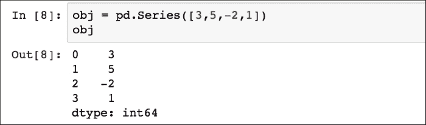

`obj`对象由两个值组成，左边是索引，右边是关联值。假设数据的长度等于 *N，*默认索引从`0`到 *N-1* 。`Series`的数组和索引对象可以分别使用它的值和索引属性获得:

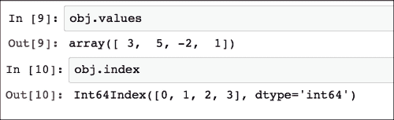

通过应用 NumPy 数组操作(如标量乘法、用布尔数组过滤或应用数学函数)来保留索引:

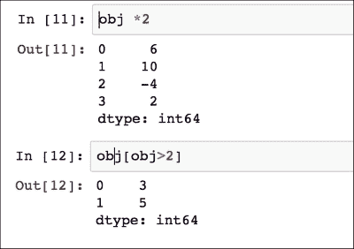

Python 字典可以转换成`Series`，但是索引将对应于键值:

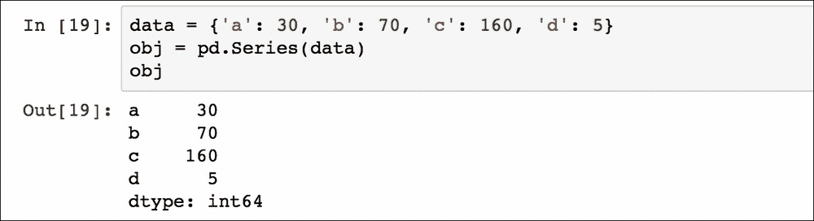

可以指定一个单独的列表作为索引:

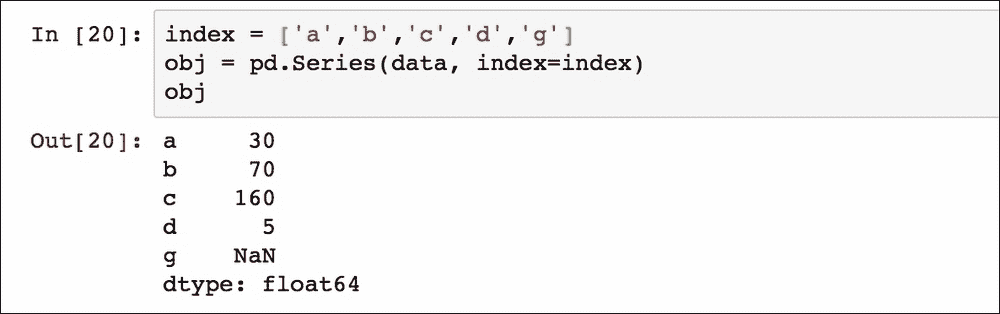

在这种情况下，最后一个索引值`g`还没有得到相关联的对象值，因此通过默认插入一个**而不是一个数字** ( **NaN** )。

术语*缺失*或 *NA* 将用于指代缺失数据。为了找到丢失的数据，可以在 pandas 中使用`isnull`和`notnull`函数:


我们现在可以开始将 CSV 文件加载到数据帧结构中。DataFrame 表示包含一组有序列的数据结构，每一列可以是不同的值类型(数值、字符串、布尔值等)。DataFrame 有两个索引(一个行和一个列索引),它可以被看作是共享相同索引(列)的`Series`的字典。出于本教程的目的，我们正在使用存储在[http://archive.ics.uci.edu](http://archive.ics.uci.edu)网站(位于[http://archive . ics . UCI . edu/ml/datasets/Internet+Advertisements](http://archive.ics.uci.edu/ml/datasets/Internet+Advertisements))中的`ad.data`文件中包含的数据，正如前面的机器学习示例中已经解释的那样。

使用终端以下列方式加载数据(在这种情况下，路径是`data_example/ad-dataset/ad-data`):

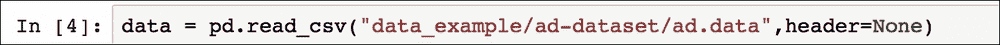

该文件没有标题(设置为`none`)，所以列名是数字，我们可以通过对对象数据使用`describe`函数获得数据帧的摘要:

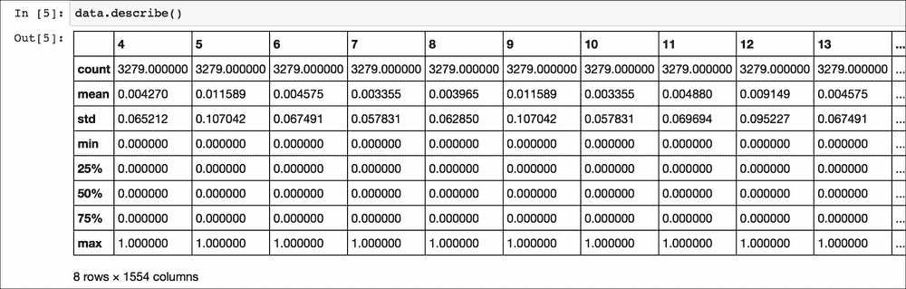

这概括了定量信息。我们可以看到有`1554`数字列(由于没有标题，所以用数字表示)和`3279`行(每列称为`count`)。每列都有一个统计参数列表(平均值、标准偏差、最小值、最大值和百分位数)，有助于获得数据中包含的定量信息的初始估计值。

可以使用`columns`属性获得列名:

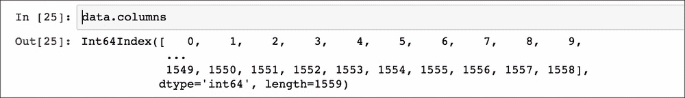

所以所有的列名都是类型`int64`，下面的命令返回所有列的实际类型:

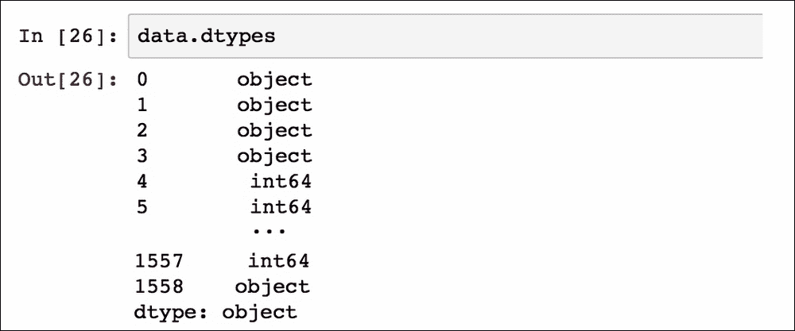

前四个列和标签(最后一列)属于类型`object,`，而其他属于类型`int64`。可以通过两种方式访问列。第一种方法是像字典中的键一样指定列名:

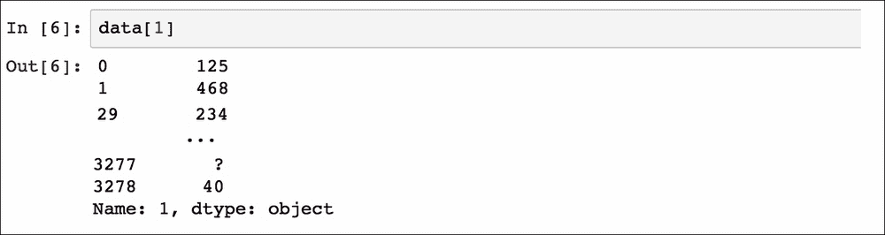

通过用列名指定多个列的列表，可以获得多个列:

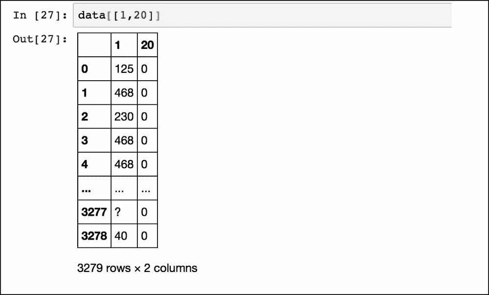

访问列的另一种方式是使用*点*语法，但是只有当列名也可以是 Python 变量名(即没有空格)时，如果它与 DataFrame 属性或函数名(如 count 或 sum)不同，并且名称是字符串类型(不是本例中的`int64`)时，这种方式才有效。

要简要了解数据帧的内容，可使用函数`head()`。默认情况下，返回一列中的前五项(或数据帧中的前五行):

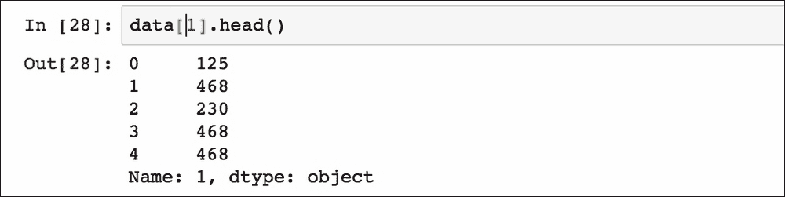

相反的方法是`tail()`，默认返回最后五个项目或行。在`tail()`或`head()`功能上指定一个数字，将返回所选列中的前 *n* 项:

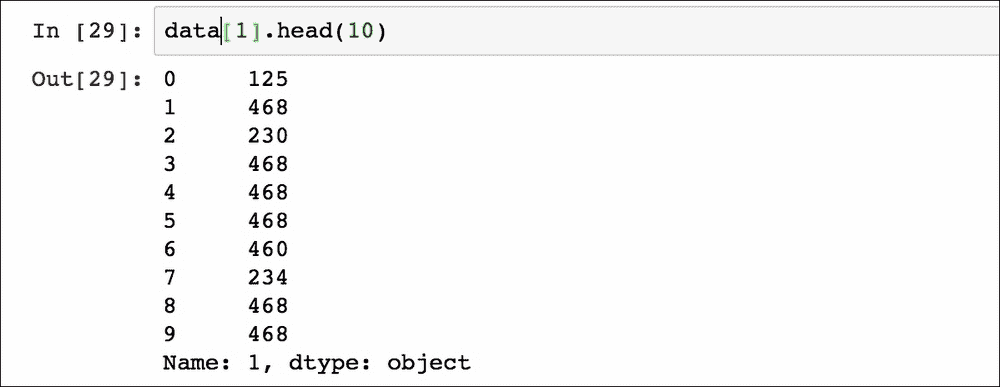

还可以使用 Python 的常规切片语法来获得数据帧的一定数量的行:

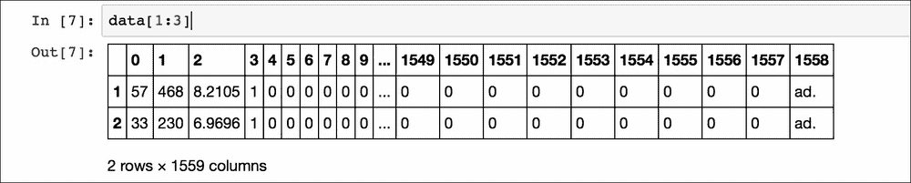

该示例仅显示了从`1`到`3`的行。

### 操纵数据

有可能以不同的方式选择行，例如指定如下的索引或条件:

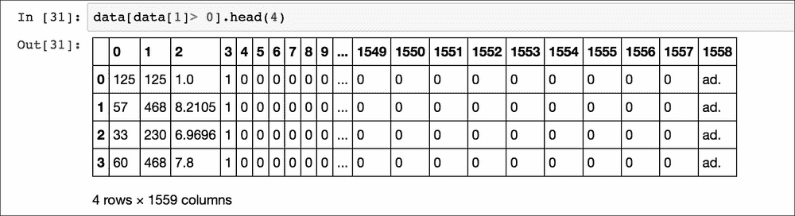

或者指定多个条件:

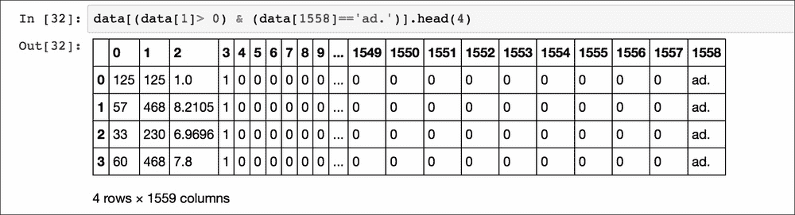

返回的数据是特征`1`大于`0`并包含广告的网页。

`ix`方法允许我们选择指定所需索引的行:

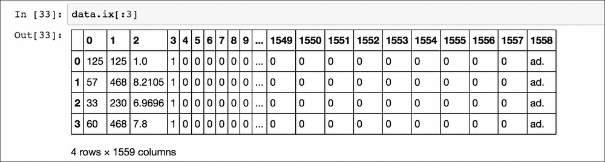

或者，可以使用功能`iloc`:

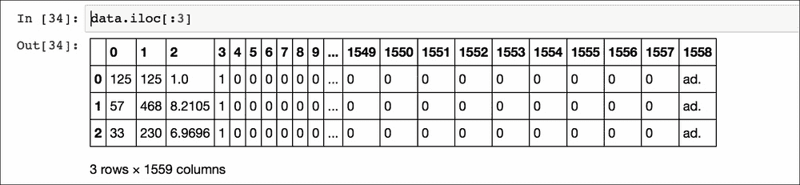

区别在于`ix`作用于索引列中的标签，而`iloc`作用于索引中的位置(因此它只接受整数)。因此，在本例中，`ix`查找从`0`开始直到标签`3`出现的所有行，而`iloc`函数返回数据帧中第一个`3`位置的行。还有第三个函数来访问数据帧中的数据，`loc`。该函数查看与行相关联的索引名称，并返回它们的值。例如:

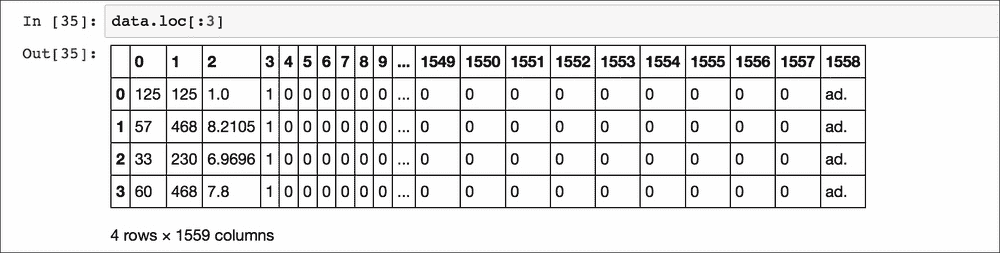

注意，这个函数的行为与 Python 中的普通切片不同，因为起始行和结束行都包含在结果中(索引为`3`的行包含在输出中)。

可以将整个列设置为一个值:

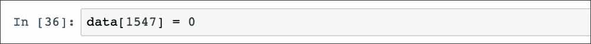

要将特定的单元格值也设置为所需的值:


或将整行转换为一组值(在本例中为`0`和`1`以及`ad.`标签之间的随机值):

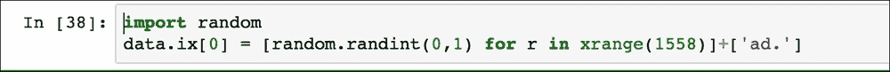

在转换一个`Series`对象中的数值数组后，可以在数据帧的末尾添加一行:

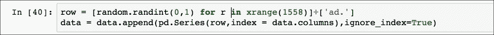

或者，可以使用`loc`函数(如 NumPy 中所示)在最后一行添加一行:

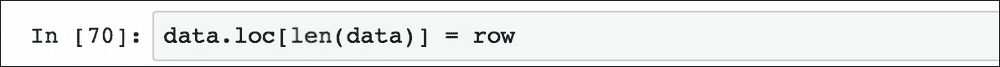

在数据帧中添加列很容易，只需将新列名赋给一个值:

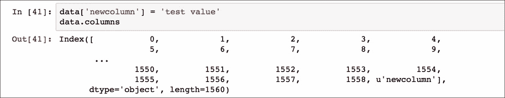

在这种情况下，新列中的所有条目都分配给了*测试值*。类似地，可以使用`drop`功能删除该列:

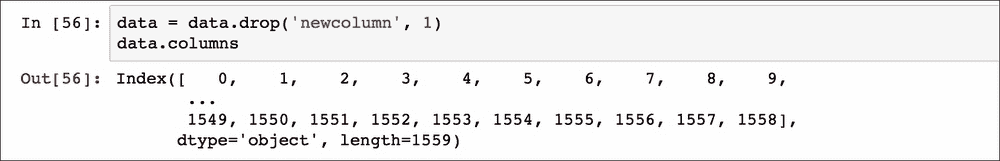

由于各种原因，数据集可能包含重复项，因此 pandas 提供了方法`duplicated`来指示每一行是否重复:


不过，更有用的是，`drop_duplicates`函数返回的数据帧只有唯一的值。例如，对于标签，唯一值为:

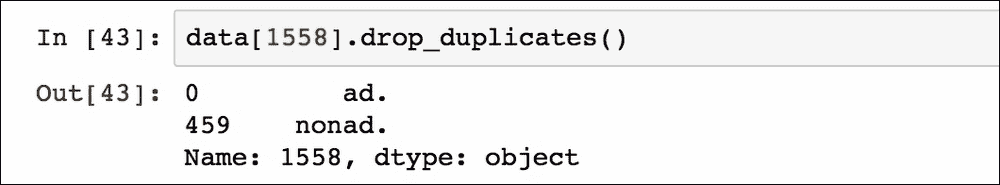

可以将结果转换成列表:

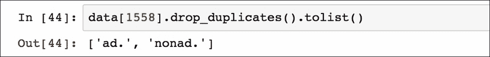

正如我们在机器学习示例中所做的那样，可以使用前面示例中解释的方法将这些标签转换为数值:

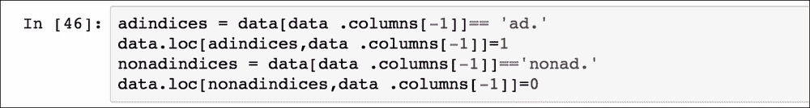

标签列仍然是`object`类型:

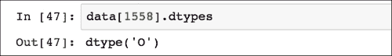

所以列现在可以转换成 float 类型:

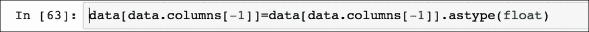

前四列包含混合值(字符串、`?`和浮点数)，因此我们需要删除字符串值以将列转换为数字类型。我们可以使用函数`replace`将`?`(缺失值)的所有实例替换为`NaN`:

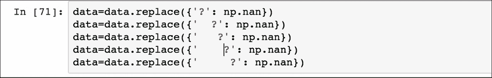

现在我们可以用两种方法处理这些丢失数据的行。第一种方法是使用`dropna`删除有缺失值的行:

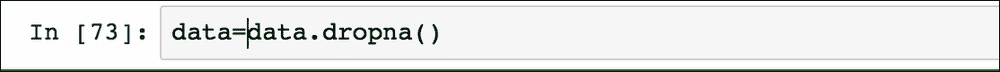

可以填充空条目，而不是删除丢失数据的行(这可能导致删除重要信息)。在大多数情况下，可以用`fillna`方法在空单元格中插入一个常数值:


现在所有的值都是数字，可以应用`astype`函数将列设置为类型`float,`。或者，我们可以应用一个`lambda`函数将 DataFrame 中的每一列转换为数字类型:

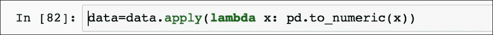

每个 *x* 实例是一个列，并且`to_numeric`函数将其转换为最接近的数字类型(在本例中为`float`)。

为了本教程的完整性，我们想展示如何连接两个数据帧，因为这个操作在实际应用中很有用。让我们用随机值创建另一个小数据帧:

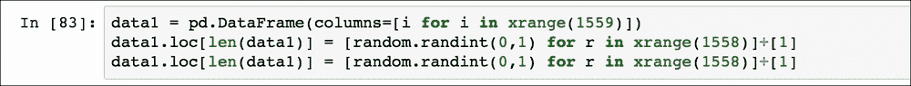

使用`concat`功能，将`data1`的行放在`data`的底部，可以将这个有两行的新表与原始数据帧合并:

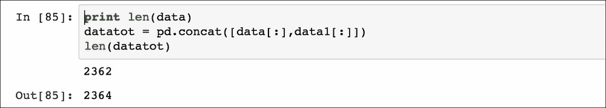

`datatot`的行数现在相对于`data`增加了两行(注意行数与开始时不同，因为我们去掉了带`NaN`的行)。

## Matplotlib 教程

`matplotlib.pyplot`是一个库，它收集了一系列绘制数据的方法，类似于 **MATLAB** 。因为接下来的章节将使用这个库来可视化一些结果，这里的一个简单的例子将解释所有的`matplotlib`代码，你将在本书中继续看到:

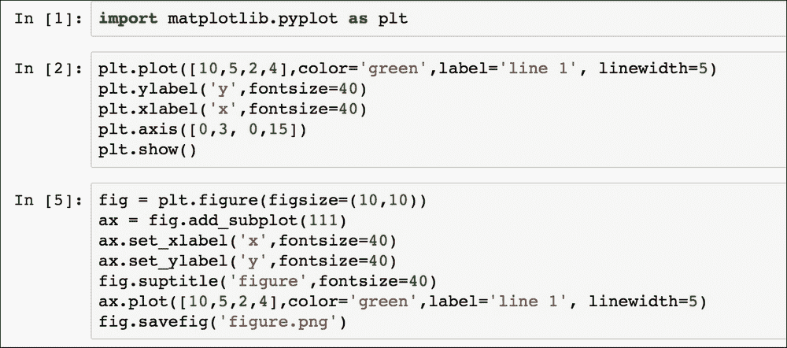

在导入库(作为`plt`)后，初始化`figure`对象(`fig`，并添加一个`axis`对象(`ax`)。通过命令`ax.plot()`绘制到`ax`对象中的每一行被称为句柄。随后所有后续指令由`matplotlib.pyplot`记录并绘制在`figure`对象中。在这种情况下，分别使用命令`plt.show()`和`fig.savefig()`从终端显示绿色线条并保存为`figure.png`文件。结果等于:

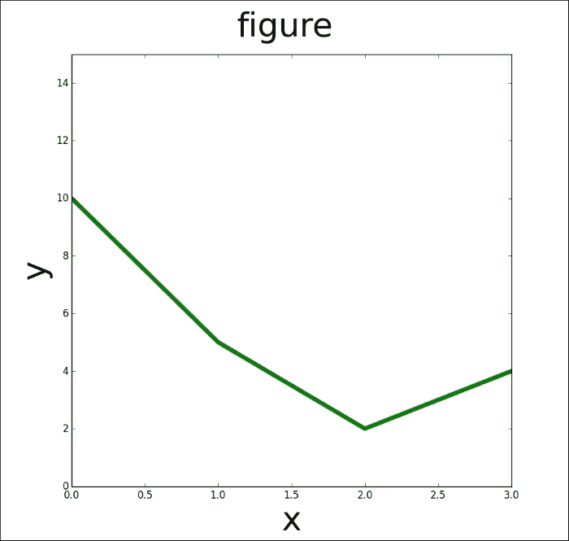

简单绘图示例

下一个示例说明了使用 Numpy 数组在一个命令中绘制具有不同格式样式的几行:

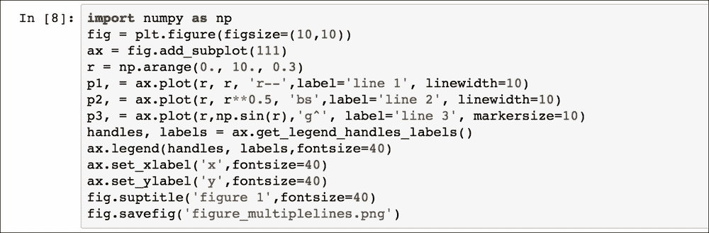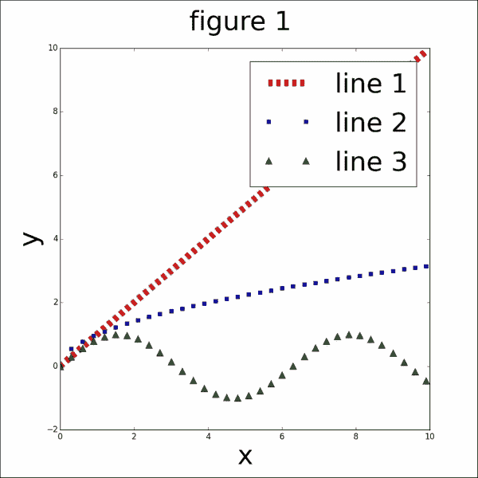

多线绘图示例

请注意，函数`get_legend_handles_labels()`返回存储在对象`ax`中的句柄和标签列表，它们被传递给要绘制的函数图例。符号`'r--'`、`'bs'`和`'g^'`表示点的形状和颜色(分别为红色矩形、蓝色正方形和绿色三角形)。`linewidth`参数设置线条的粗细，而`markersize`设置点的大小。

另一个用于可视化结果的图是散点图，其中显示了一组数据(使用数字 T21 子模块生成的数据)的典型两个变量的值:

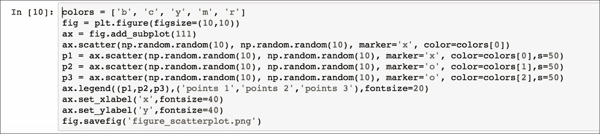

`s`选项代表点的大小，`colors`是对应于每组点的颜色，手柄直接传递给图例函数(`p1`、`p2`、`p3`):

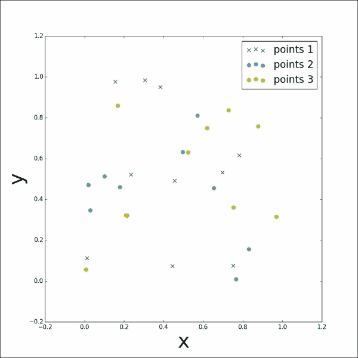

随机分布点的散点图

关于如何使用`matplotlib`的更多细节，我们建议读者阅读【http://matplotlib.org/users/pyplot_tutorial.html】[等](http://matplotlib.org/users/pyplot_tutorial.html)在线资料和教程。


# 科学图书馆中使用的书

在本书中，某些库对于实现每章中讨论的机器学习技术是必要的。我们将简要描述下面使用的最相关的库:

*   **SciPy** 是基于 NumPy 数组对象的数学方法的集合。这是一个开源项目，所以它利用了世界各地开发人员不断编写的其他方法。采用 SciPy 例程的 Python 软件是高级项目或应用的一部分，可与类似框架相媲美，如 MATLAB、 **Octave** 或 **RLab** 。从操纵和可视化数据函数到并行计算例程，有许多方法可以增强 Python 语言的多功能性和潜力。
*   **scikit-learn**(**sk learn**)是 Python 编程语言的开源机器学习模块。它实现了各种算法，例如聚类、分类和回归，包括支持向量机、**朴素贝叶斯**、**决策树**、**随机森林**、 **K 均值**和**基于密度的应用空间聚类(带噪声)** ( **DBSCAN** )，并且它与 numerical Python 库(例如 nu)进行本地交互虽然大部分例程都是用 Python 写的，但是有些函数是用 **Cython** 实现的以获得更好的性能。例如，支持向量机和 logistic 回归都是用 Cython 包装其他外部库编写的( **LIBSVM** ， **LIBLINEAR** )。
*   **自然语言工具包** ( **NLTK** )，是用于 Python 语言处理的**自然语言处理** ( **NLP** )的库和函数的集合。NLTK 旨在支持 NLP 和相关主题的研究和教学，包括人工智能、认知科学、信息检索、语言学和机器学习。它还具有一系列文本处理例程，用于标记化、词干化、标记、解析、语义推理和分类。NLTK 包括样本代码和样本数据，以及 50 多个语料库和词汇数据库的接口。
*   **Scrapy** 是一个用于 Python 编程语言的开源网络爬行框架。最初是为抓取网站而设计的，作为通用爬虫，也适合通过 API 提取数据。Scrapy 项目是围绕*蜘蛛*编写的，蜘蛛通过提供一组指令来行动。它还具有一个 web 爬行外壳，允许开发人员在实际实现它们之前测试它们的概念。Scrapy 目前由 Scrapinghub Ltd .维护，这是一家网络抓取开发和服务公司。
*   **Django** 是一个免费开源的 web 应用框架，用 Python 实现，遵循*模型视图控制器*架构模式。Django 是为创建复杂的、面向数据库的网站而设计的。它还允许我们通过管理界面管理应用，管理界面可以创建、读取、删除或更新应用中使用的数据。目前有一系列老牌网站在使用 Django，比如 Pinterest、Instagram、Mozilla、华盛顿时报和 Bitbucket。


# 何时使用机器学习

机器学习不是魔法，它可能不会有益于所有与数据相关的问题。在本简介的结尾，澄清机器学习技术何时极其有用是很重要的:

*   不可能对规则进行编码:一系列人工任务(例如，确定电子邮件是否是垃圾邮件)无法使用简单的规则方法有效解决。事实上，多个因素会影响解决方案，如果规则依赖于大量的因素，那么人工实现这些规则就变得很困难。
*   一个解决方案是不可扩展的:每当手动对某些数据做出决策非常耗时时，机器学习技术就可以充分扩展。例如，机器学习算法可以有效地检查数百万封电子邮件，并确定它们是否是垃圾邮件。

然而，如果有可能通过简单地使用数学规则、计算或预先确定的模式找到一个好的目标预测，而不需要任何数据驱动的学习，那么这些高级机器学习技术就没有必要(也不应该使用它们)。


# 总结

在本章中，我们介绍了将在本书其余部分使用的基本机器学习概念和术语。机器学习专业人员用来准备、操作和可视化数据的最相关库(NumPy、pandas 和 matplotlib)的教程也已呈现。还提供了将在后续章节中使用的所有其他 Python 库的一般介绍。

您应该对机器学习领域实际可以做什么有一个大致的了解，并且您现在应该熟悉用来将数据转换成可用格式的方法，以便可以应用机器学习算法。在下一章，我们将解释主要的无监督学习算法，以及如何使用`sklearn`库来实现它们。