# 二、无监督机器学习

正如我们在[第 1 章](ch01.html "Chapter 1. Introduction to Practical Machine Learning Using Python")、*使用 Python 的实用机器学习介绍*中看到的，无监督学习旨在提供关于数据无标签日期的深刻信息。在许多情况下，大型数据集(就点数和要素数而言)是非结构化的，乍一看不会呈现任何信息，因此这些技术用于突出数据上的隐藏结构(聚类)或在不丢失相关信息的情况下降低其复杂性(降维)。本章将重点介绍主要的聚类算法(本章第一部分)和降维方法(本章第二部分)。通过提供一个使用 Python 库的实际例子，将突出这些方法的差异和优势。所有代码都可以在作者的 GitHub 个人资料中找到，在[https://GitHub . com/ai 2010/machine _ learning _ for _ the _ web/tree/master/chapter _ 2/](https://github.com/ai2010/machine_learning_for_the_web/tree/master/chapter_2/)文件夹中。我们现在将开始描述聚类算法。

# 聚类算法

聚类算法被用于在某种有序的子集中重构数据，以便可以推断出有意义的结构。聚类可以被定义为具有一些相似特征的一组数据点。量化数据点相似性的方法决定了聚类的不同类别。

聚类算法可以根据数据处理的不同度量或假设分为不同的类别。我们将讨论现今使用的最相关的分类，它们是分布法、重心法、密度法和层次法。对于每个类别，将详细介绍一个特定的算法，我们将从讨论分布方法开始。将讨论一个比较不同算法的示例，IPython 笔记本和脚本都可以在我的 GitHub book 文件夹中获得，该文件夹位于[https://GitHub . com/ai 2010/machine _ learning _ for _ the _ web/tree/master/chapter _ 2/](https://github.com/ai2010/machine_learning_for_the_web/tree/master/chapter_2/)。

## 配送方式

这些方法假设数据来自某个分布，使用期望最大化算法寻找分布参数的最优值。期望最大化和 **高斯**聚类的混合将在下文讨论。

### 期望值最大化

该算法用于寻找依赖于隐藏(未观察)变量的参数分布模型的最大似然估计。期望值最大化由迭代两步的组成:使用参数的当前值创建对数似然函数**的 **E 步**，以及计算新参数值的 **M 步**，最大化 E 步的对数似然函数。**

考虑一组 *N* 元素， *{x ^((i)) }i = 1，…，N* ，数据的对数似然如下:

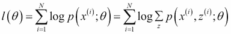

这里， *θ* 表示参数的集合， *z ^((i))* 就是所谓的隐变量。

我们希望在不知道 *z ^((i))* (未观察变量)的值的情况下，找到使对数似然最大化的参数值。考虑在 *z ^((i))* 和 *Q(z ^((i)) )* 上的分布，例如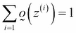。因此:

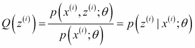

这意味着 *Q(z ^((i)) )* 是隐变量的后验分布， *z ^((i))* ，给定 *x ^((i))* 由 *θ* 参数化。期望值最大化算法来自詹森不等式的使用，它确保执行这两个步骤:

1.  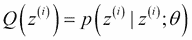
2.  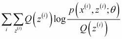

对数似然收敛到最大值，并且因此找到相关的 *θ* 值。

### 高斯混合

这种方法使用高斯分布的混合来模拟整个数据集。因此，簇的数目将由混合物中所考虑的高斯数给出。给定 N 个元素的数据集， *{x ^((i)) }i = 1，…，N* ，其中每个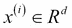是由混合高斯模型化的 d 特征向量，如下所示:

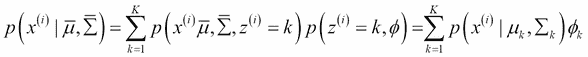

其中:

*   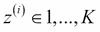是一个隐藏变量，代表每个 *x ^( (i) )* 生成的高斯分量
*   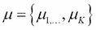代表高斯分量的一组平均参数
*   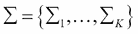代表高斯分量的方差参数集
*   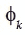是混合权重，代表高斯分量 *k* 产生随机选择的 *x ^( (i) )* 的概率，其中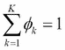和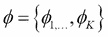是权重的集合
*   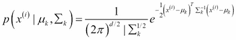是高斯分量 *k* 与参数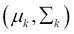关联与点 *x ^((i))* 

因此，我们模型的参数是φ和∑。为了估计它们，我们可以写下数据集的对数似然性:

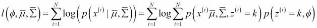

为了找到参数值，我们应用前面章节中解释的期望值最大化算法，其中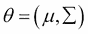和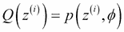。

在选择参数的第一个猜测之后，我们迭代以下步骤直到收敛:

1.  **E 步**:权重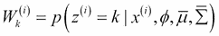由按照应用贝叶斯定理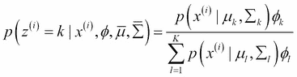得到的规则更新
2.  **M 步**:参数更新如下(这些公式来自解决最大化问题，这意味着将对数似然的导数设置为零):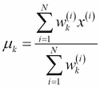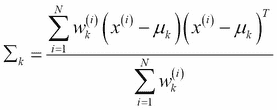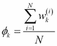

注意，需要期望最大化算法，因为隐藏变量 *z ^((i))* 是未知的。否则，这将是一个监督学习问题，其中 *z ^((i))* 是训练集每个点的标签(使用的监督算法将是高斯判别分析)。因此，这是一个无监督算法，目标也是找到 *z ^((i))* ，即每个点 *x ^((i))* 与 *K* 高斯分量中的哪一个相关联。事实上，通过计算每个 *K* 类的后验概率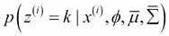，可以将每个 *x(i)* 分配给具有最高后验概率的类 *k* 。在几种情况下，该算法可以成功地用于聚类(标记)数据。

一个可能的实际例子是，一位教授有两个不同班级的学生成绩，但没有按班级标注。他想把成绩分成原来的两个班，假设每个班的成绩分布是高斯分布。另一个可使用混合高斯方法解决的示例是基于来自两个不同国家的一组人的身高值来确定每个人的国家，并假设每个国家的身高分布遵循高斯分布。

## 质心方法

这个类收集了寻找聚类中心的所有技术，将数据点分配到最近的聚类中心，并最小化中心和分配点之间的距离。这是一个优化问题，最终的中心是向量；它们可能不是原始数据集中的点。簇的数量是一个要预先指定的参数，并且生成的簇倾向于具有相似的大小，因此边界线不一定被很好地定义。这个优化问题可能导致局部最优解，这意味着不同的初始化值可能导致略有不同的聚类。最常见的方法被称为 **k-means** ( **劳氏算法**)，其中最小化的距离就是 **欧氏范数**。其他技术将中心作为聚类的中间值(**k-中间值聚类**)或者将中心值作为实际数据点。此外，这些方法的其他变体在定义初始中心的选择上不同(**k-均值++** 或**模糊 c-均值**)。

### k-均值

该算法尝试找到每个聚类的中心，作为所有成员的平均值，使中心和指定点之间的距离最小化。它可以与分类问题中的 k-最近邻算法相关联，并且所得到的聚类集可以被表示为**Voronoi 图**(一种基于与一组点(在这种情况下是聚类的中心)的距离在区域中划分空间的方法)。考虑通常的数据集，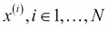。该算法规定选择多个中心 *K* ，将初始平均聚类中心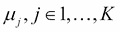分配给随机值，然后重复以下步骤直到收敛:

1.  对于每个数据点 *i* ，计算每个点 *i* 与每个中心 *j* 之间的欧几里德平方距离，找到中心索引*d[I]，对应这些距离中的最小值: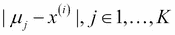。*
2.  对于每个中心 *j* ，重新计算其平均值，作为具有 *d_i j* 等于 *j* 的点的平均值(即，属于具有平均值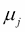的聚类的点):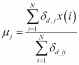有可能表明该算法相对于由以下函数给出的函数收敛: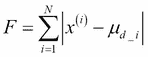

它随着迭代次数单调减少。由于 *F* 是一个非凸函数，所以不能保证最终的最小值就是全局最小值。为了避免聚类结果与局部极小值相关的问题，k-means 算法通常使用不同的随机初始中心均值运行多次。则与较低的 *F* 值相关联的结果被选为最佳聚类解决方案。

## 密度方法

这些方法基于这样的想法:稀疏区域必须被认为是边界(或噪声),而高密度区域应该与集群的中心相关。常见的方法叫做**基于密度的带噪声应用空间聚类** ( **DBSCAN** )，通过一定的距离阈值定义两点之间的连接(为此类似于层次算法；参见[第三章](ch03.html "Chapter 3. Supervised Machine Learning")、*监督机器学习*。仅当满足特定密度标准时，两个点才被认为是关联的(属于同一个聚类)-在特定半径内，相邻点的数量必须高于阈值。另一种流行的方法是均值漂移，其中每个数据点被分配到其邻域中密度最高的聚类。由于通过核密度估计计算密度非常耗时，因此均值漂移通常比 DBSCAN 或质心方法慢。这类算法的主要优点是能够定义具有任意形状的聚类，并且能够确定聚类的最佳数量，而不是将该数量先验地设置为参数，使得这些方法适合于聚类未知的数据集。

### 均值漂移

均值漂移是非参数算法，它在数据集上定义的密度核函数中找到局部最大值的位置。找到的局部极大值可以认为是数据集中聚类的中心，极大值的个数就是聚类的个数。为了用作聚类算法，每个点必须与其邻域的密度相关联:

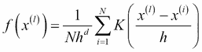

这里， *h* 就是所谓的带宽；它估算的是邻域的半径，其中的点影响密度值 *f(x ^((l)) )* (即其他点对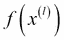的影响可以忽略不计)。 *K* 是满足这些条件的核函数:

*   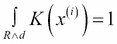
*   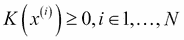

*K(x ^((i)) )* 的典型例子如下:

*   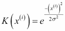:高斯内核
*   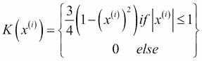 : Epanechnikov 内核

均值漂移算法使 *f(x ^((l)) )* 最大化，这转化为数学等式(记住在函数分析中，最大值是通过对 *0* 求导得到的):

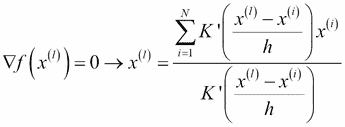

这里， *K'* 是核密度函数 *K* 的导数。

因此，为了找到与特征向量 *x ^((l))* 相关联的局部最大值位置，可以计算以下迭代等式:

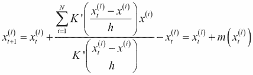

这里，称为均值漂移向量。当在迭代 *t=a* 时，满足条件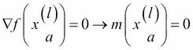时，算法将收敛。

在等式的支持下，我们现在可以借助下图的来解释算法。在第一次迭代 *t=0* 时，原始点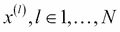(红色)在数据空间上展开，计算均值偏移向量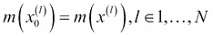，相同的点用十字( *x* )标记，用算法跟踪它们的演化。在迭代 *1* 时，将使用前述等式获得数据集，并且结果点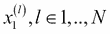在下图中以( *+* )符号显示:

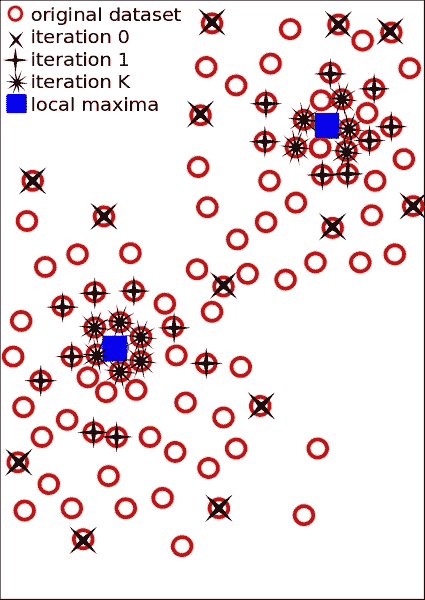

通过迭代的均值漂移进化示意图

在前面的图中，在迭代 *0* 时，原始点显示为红色(十字)，在迭代 *1* 和 *K* 时，采样点(分别用符号 *+* 和 *** 表示)向蓝色方块表示的局部密度最大值移动。

同样，在迭代 *K* 时，计算新的数据点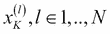，并在前图中用 *** 符号显示。与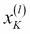相关联的密度函数值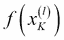大于先前迭代中的值，因为算法旨在最大化它们。原始数据集现在清楚地与点相关联，并且它们汇聚到在前面的图中用蓝色方块标出的位置。特征向量现在是折叠成两个不同的局部极大值，这两个极大值代表两个聚类的中心。

为了正确使用该方法，需要考虑一些事项。

唯一需要的参数，带宽 *h* ，需要巧妙调整以达到良好的效果。事实上， *h* 的值太低可能会导致大量的集群，而 *h* 的值太大可能会合并多个不同的集群。还要注意，如果特征向量维数的数量 *d* 很大，则均值偏移方法可能导致较差的结果。这是因为在非常高维的空间中，局部最大值的数量相应地很大，并且迭代方程很容易过早地收敛。

## 分层方法

分层方法的类别也称为基于连通性的聚类，通过基于距离度量的相似性标准收集元素来形成聚类:近的元素聚集在同一分区中，而远的元素被分成不同的聚类。这种类算法分为两种:**分裂聚类**和**凝聚聚类**。分裂方法首先将整个数据集分配给一个集群，然后将该集群分成两个不太相似(距离较远)的集群。每个分区被进一步划分，直到每个数据点本身成为一个簇。凝聚法是最常用的方法，它从数据点开始，每个数据点代表一个聚类。然后通过相似性合并这些聚类，直到剩下包含所有数据点的单个聚类。这些方法被称为**层次**，因为这两个类别都迭代地创建了集群的层次，如下图所示。这种分层表示法被称为**树状图**。横轴表示数据集的元素，纵轴表示距离值。每条水平线代表一个聚类，而垂直轴指示哪个元素/聚类形成相关的聚类:

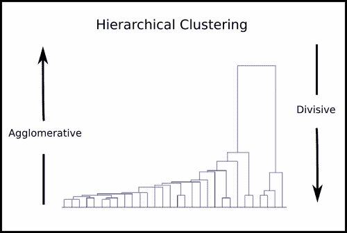

在上图中，聚集聚类从作为数据集点的许多聚类开始，以包含整个数据集的单个聚类结束。反之亦然，除法从单个聚类开始，当所有聚类每个都包含单个数据点时结束。

然后通过应用停止聚集/分裂策略的标准来形成最终的聚类。距离标准设置最大距离，超过该距离，两个集群将因距离太远而无法合并，而*集群数量*标准设置最大集群数量，以阻止层次继续合并或分割分区。

下面的算法给出了一个凝聚的例子:

1.  将数据集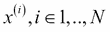的每个元素 *i* 分配到不同的集群。
2.  计算每对聚类之间的距离，并将最近的一对合并成一个聚类，将聚类总数减少 *1* 。
3.  计算新群集与其他群集的距离。
4.  重复步骤 2 和 3，直到只剩下一个包含所有 *N* 元素的集群。

由于两个集群*、*、【C2】*之间的距离 *d(C1，C2)* 是通过两点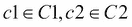之间的定义来计算的，并且每个集群包含多个点，因此需要一个标准来决定在计算距离时必须考虑哪些元素(链接标准)。两个集群 *C1* 和 *C2* 的共同联动标准如下:*

*   ***单联动**:C1*的任一元素与 C2* 的任一元素之间的距离中的最小距离由下式给出: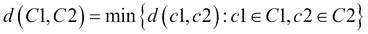*
*   ***完全联动**:C1*的任一元素与 C2* 的任一元素之间的距离中的最大距离由下式给出:*
*   ***算术平均(UPGMA)或平均连锁的未加权对分组法**:C1 的任一元素与 C2*的任一元素*的距离中的平均距离为，其中分别为 *C1* 和 *C2* 的元素个数。*
*   ***沃德算法**:这合并了不会增加某种异质性度量的分区。它旨在加入两个集群 *C1* 和 *C2* ，由于它们的组合，这两个集群具有最小的变化度量增加，称为合并成本。这种情况下的距离用合并代价代替，合并代价由下式给出:这里，分别是 C1 和 C2 的元素个数。*

*有种不同的度量 *d(c1，c2)* 可以选择来实现分层算法。最常见的是欧几里德距离:*

**

*请注意，这类方法的时间效率不是特别高，因此它不适合对大型数据集进行聚类。它对于错误聚类的数据点(异常值)也不是非常健壮，这可能导致聚类的不正确合并。*

### *聚类方法的训练和比较*

*为了比较刚才介绍的聚类方法，我们需要生成一个数据集。我们选择由均值和协方差分别等于和的两个二维多元正态分布给出的两个数据集类。*

*使用 NumPy 库生成数据点，并用 matplotlib 绘制:*

```
***from matplotlib import pyplot as plt**
**import numpy as np**
**np.random.seed(4711)  # for repeatability** 
**c1 = np.random.multivariate_normal([10, 0], [[3, 1], [1, 4]], size=[100,])**
**l1 = np.zeros(100)**
**l2 = np.ones(100)**
**c2 = np.random.multivariate_normal([0, 10], [[3, 1], [1, 4]], size=[100,])**
**#add noise:**
**np.random.seed(1)  # for repeatability** 
**noise1x = np.random.normal(0,2,100)**
**noise1y = np.random.normal(0,8,100)**
**noise2 = np.random.normal(0,8,100)**
**c1[:,0] += noise1x**
**c1[:,1] += noise1y**
**c2[:,1] += noise2**

**fig = plt.figure(figsize=(20,15))**
**ax = fig.add_subplot(111)**
**ax.set_xlabel('x',fontsize=30)**
**ax.set_ylabel('y',fontsize=30)**
**fig.suptitle('classes',fontsize=30)**
**labels = np.concatenate((l1,l2),)**
**X = np.concatenate((c1, c2),)**
**pp1= ax.scatter(c1[:,0], c1[:,1],cmap='prism',s=50,color='r')**
**pp2= ax.scatter(c2[:,0], c2[:,1],cmap='prism',s=50,color='g')**
**ax.legend((pp1,pp2),('class 1', 'class2'),fontsize=35)**
**fig.savefig('classes.png')*** 
```

*一个正常分布的噪声被添加到两个类中，以使这个例子更加真实。结果如下图所示:*

*

两个带噪声的多元正态类* 

*使用`sklearn`和`scipy`库实现了聚类方法，并再次使用 matplotlib 绘制:*

```
***import numpy as np**
**from sklearn import mixture**
**from scipy.cluster.hierarchy import linkage**
**from scipy.cluster.hierarchy import fcluster**
**from sklearn.cluster import KMeans**
**from sklearn.cluster import MeanShift**
**from matplotlib import pyplot as plt**

**fig.clf()#reset plt**
**fig, ((axis1, axis2), (axis3, axis4)) = plt.subplots(2, 2, sharex='col', sharey='row')**

**#k-means**
**kmeans = KMeans(n_clusters=2)**
**kmeans.fit(X)**
**pred_kmeans = kmeans.labels_**
**plt.scatter(X[:,0], X[:,1], c=kmeans.labels_, cmap='prism')  # plot points with cluster dependent colors**
**axis1.scatter(X[:,0], X[:,1], c=kmeans.labels_, cmap='prism')**
**axis1.set_ylabel('y',fontsize=40)**
**axis1.set_title('k-means',fontsize=20)**

**#mean-shift**
**ms = MeanShift(bandwidth=7)**
**ms.fit(X)**
**pred_ms = ms.labels_**
**axis2.scatter(X[:,0], X[:,1], c=pred_ms, cmap='prism')**
**axis2.set_title('mean-shift',fontsize=20)**

**#gaussian mixture**
**g = mixture.GMM(n_components=2)**
**g.fit(X)** 
**pred_gmm = g.predict(X)**
**axis3.scatter(X[:,0], X[:,1], c=pred_gmm, cmap='prism')**
**axis3.set_xlabel('x',fontsize=40)**
**axis3.set_ylabel('y',fontsize=40)**
**axis3.set_title('gaussian mixture',fontsize=20)**

**#hierarchical**
**# generate the linkage matrix**
**Z = linkage(X, 'ward')**
**max_d = 110**
**pred_h = fcluster(Z, max_d, criterion='distance')**
**axis4.scatter(X[:,0], X[:,1], c=pred_h, cmap='prism')**
**axis4.set_xlabel('x',fontsize=40)**
**axis4.set_title('hierarchical ward',fontsize=20)**
**fig.set_size_inches(18.5,10.5)**
**fig.savefig('comp_clustering.png', dpi=100)*** 
```

*K 均值函数和高斯混合模型具有指定数量的聚类(`n_clusters =2,n_components=2`)，而均值漂移算法具有带宽值`bandwidth=7`。分级算法使用沃德链接来实现，并且最大(沃德)距离`max_d`被设置为`110`以停止分级。`fcluster`函数用于获得每个数据点的预测类别。使用`labels_`属性访问 k-means 和 mean-shift 方法的预测类，而高斯混合模型需要使用`predict`函数。使用`fit`函数对 K 均值、均值漂移和高斯混合方法进行了训练，而使用`linkage`函数对分级方法进行了训练。上述代码的输出如下图所示:*

*

使用 k-均值、均值漂移、高斯混合模型和分层沃德方法对两个多变量类别进行聚类* 

*均值漂移和分层方法显示了两个类别，因此参数选择(带宽和最大距离)是合适的。请注意，分层方法的最大距离值是通过查看由以下代码生成的树状图(下图)来选择的:*

```
***from scipy.cluster.hierarchy import dendrogram**
**fig = plt.figure(figsize=(20,15))**
**plt.title('Hierarchical Clustering Dendrogram',fontsize=30)**
**plt.xlabel('data point index (or cluster index)',fontsize=30)**
**plt.ylabel('distance (ward)',fontsize=30)**
**dendrogram(**
 **Z,**
 **truncate_mode='lastp',  # show only the last p merged clusters**
 **p=12,**
 **leaf_rotation=90.,**
 **leaf_font_size=12.,**
 **show_contracted=True,**
**)**
**fig.savefig('dendrogram.png')*** 
```

*`truncate_mode='lastp'`标志允许我们指定要在图中显示的最后合并的数量(在本例中为`p=12`)。上图清楚地显示，当距离在`100`和`135`之间时，只剩下两个集群:*

*

最近 12 次合并的层次聚类树状图* 

*在横轴上的前图中，在最后一个 *12* 合并之前属于每个聚类的个数据点在括号()中显示。*

*除了高斯混合模型之外，其他三种算法都对一些数据点进行了错误分类，尤其是 k-means 和层次方法。该结果证明高斯混合模型是最稳健的方法，正如所预期的，因为数据集来自相同的分布假设。为了评估聚类的质量，scikit-learn 提供了量化划分正确性的方法:v-measure、完整性和同质性。这些方法需要每个数据点的类的真实值，因此它们被称为外部验证过程。这是因为它们需要在应用聚类方法时不使用的附加信息。同质性， *h* ，是一个介于 *0* 和 *1* 之间的分数，用于衡量每个聚类是否只包含单个类的元素。完整性， *c* ，用一个在 *0* 和 *1* 之间的分数来量化一个类的所有元素是否被分配到同一个簇。考虑将每个数据点分配给不同聚类的聚类。这样，每个聚类将只包含一个类，并且同质性是 *1* ，但是除非每个类只包含一个元素，否则完整性非常低，因为类元素分布在许多聚类中。反之亦然，如果一个聚类的结果是将多个类的所有数据点分配到同一个聚类中，当然完备性是 *1* 但是同质性较差。这两个分数具有类似的公式，如下所示:*

**

*这里:*

*   *是类*C^l 的条件熵，给定聚类分配**
*   *是给定类成员资格的聚类的条件熵*
*   **H(C [l] )* 是类的熵:*
*   **H(C)* 是星团的熵:*
*   **N[PC]是簇 *c* 中类 *p* 的元素个数，*N[p]是类 *p* 的元素个数， *N [c]* 是簇 *c* 的元素个数***

v-measure 只是同质性和完整性的调和平均值:


这些度量需要真实的标签来评估聚类的质量，而这通常不是真实情况。另一种方法只采用来自聚类本身的数据，称为**剪影**，它计算每个数据点与其所属的聚类成员以及与其他聚类成员的相似性。如果平均起来，每个点比其余的点更类似于它自己的聚类的点，那么聚类被很好地定义，并且分数接近于 *1* (否则，它接近于 *-1* )。对于公式，考虑每个点 *i* 和下列量:

*   *d [s] (i)* 是点 *i* 到同一聚类的点的平均距离
*   *d [剩余点] (i)* 是点 *i* 到所有其他聚类中剩余点的最小距离

轮廓可以定义为

，侧影得分是所有数据点的 *s(i)* 的平均值。

我们介绍的四种聚类算法与使用`sklearn` (scikit-learn)计算的这四种度量的以下值相关联:

```
from sklearn.metrics import homogeneity_completeness_v_measure
from sklearn.metrics import silhouette_score
res = homogeneity_completeness_v_measure(labels,pred_kmeans)
print 'kmeans measures, homogeneity:',res[0],' completeness:',res[1],' v-measure:',res[2],' silhouette score:',silhouette_score(X,pred_kmeans)
res = homogeneity_completeness_v_measure(labels,pred_ms)
print 'mean-shift measures, homogeneity:',res[0],' completeness:',res[1],' v-measure:',res[2],' silhouette score:',silhouette_score(X,pred_ms)
res = homogeneity_completeness_v_measure(labels,pred_gmm)
print 'gaussian mixture model measures, homogeneity:',res[0],' completeness:',res[1],' v-measure:',res[2],' silhouette score:',silhouette_score(X,pred_gmm)
res = homogeneity_completeness_v_measure(labels,pred_h)
print 'hierarchical (ward) measures, homogeneity:',res[0],' completeness:',res[1],' v-measure:',res[2],' silhouette score:',silhouette_score(X,pred_h)
The preceding code produces the following output:
kmeans measures, homogeneity: 0.25910415428  completeness: 0.259403626429  v-measure: 0.259253803872  silhouette score: 0.409469791511
mean-shift measures, homogeneity: 0.657373750073  completeness: 0.662158204648  v-measure: 0.65975730345  silhouette score: 0.40117810244
gaussian mixture model measures, homogeneity: 0.959531296098  completeness: 0.959600517797  v-measure: 0.959565905699  silhouette score: 0.380255218681
hierarchical (ward) measures, homogeneity: 0.302367273976  completeness: 0.359334499592  v-measure: 0.32839867574  silhouette score: 0.356446705251

```

正如对上图的分析所预期的，高斯混合模型具有最佳的同质性、完整性和 v-measure 度量值(接近于*1*)；均值漂移有合理的值(在 *0.5* 左右)；而 k-means 和层次方法的结果是差的值(大约在 *0.3* 左右)。取而代之的是，所有方法的侧影分数都相当不错(在 *0.35* 和 *0.41* 之间)，这意味着聚类被合理地定义。


# 降维

**降维**，也称特征提取，是指将一个由大量维度给出的数据空间转换到一个更少维度的子空间的操作。得到的子空间应该仅包含初始数据的最相关信息，并且执行该操作的技术被分类为线性或非线性。降维是一种广泛的技术，用于从大型数据集中提取最相关的信息，降低其复杂性，但保留相关信息。

最著名的算法，**主成分分析** ( **PCA** )，是将原始数据线性映射到一个不相关维度的子空间中，这将在后面讨论。本段显示的代码可以在作者的 GitHub book 文件夹中的 IPython 笔记本和脚本版本中获得，该文件夹位于[https://GitHub . com/ai 2010/machine _ learning _ for _ the _ web/tree/master/chapter _ 2/](https://github.com/ai2010/machine_learning_for_the_web/tree/master/chapter_2/)。

## 主成分分析

主成分分析算法旨在识别数据集相关信息所在的子空间。事实上，由于数据点在某些数据维度上是相关的，主成分分析将找到数据变化的几个不相关的维度。例如，汽车轨迹可以用一系列变量来描述，如以 km/h 或 m/s 为单位的速度、以纬度和经度为单位的位置、以米为单位的距离选定点的位置以及以英里为单位的距离选定点的位置。很明显，因为速度变量和位置变量给出相同的信息(相关变量)，所以维数可以减少，因此相关子空间可以由两个不相关的维数(一个速度变量和一个位置变量)组成。PCA 不仅找到不相关的变量集，还找到方差最大化的维度。也就是说，在以 km/h 为单位的速度和以 miles/h 为单位的速度之间，算法将选择具有最高方差的变量，该变量通常由函数*速度[km/h]= 3.6 *速度[m/s]* 给出的两个轴之间的线表示(通常更靠近 km/h 轴，因为 *1 km/h = 3.6 m/s* ，并且速度投影沿着 km/h 轴比沿着 m/s 轴更分散):


以米/秒和千米/小时为单位的速度之间的线性函数

上图显示了 m/s 和 km/h 之间的线性函数。沿 km/h 轴的点投影具有较大的方差，而 m/s 轴上的投影具有较小的方差。沿线性函数*速度[km/h]= 3.6 *速度[m/s]* 的方差大于两个轴。

现在我们准备详细讨论该方法及其特点。可以证明，找到方差最大化的不相关维度等价于计算以下步骤。像往常一样，我们考虑特征向量:

*   数据集的平均值:
*   均值偏移数据集:
*   重新缩放的数据集，其中每个特征向量分量除以标准偏差，其中
*   样本协方差矩阵:
*   第 *k 个*最大特征值及其相关特征向量
*   在第 *k* 个特征向量的子空间上投影的特征向量，其中是具有第 *N* 行和第 *k* 列的特征向量的矩阵

最终的特征的向量(主成分)位于一个子空间*R^k 上，该子空间仍然保留了原始向量的最大方差(和信息)。*

请注意，这种技术在处理高维数据集时特别有用，例如在人脸识别中。在这个领域，输入图像必须与其他图像的数据库进行比较，以找到正确的人。PCA 应用被称为 **Eigenfaces** ，它利用了每个图像中大量像素(变量)是相关的这一事实。例如，背景像素都是相关的(相同的)，因此可以应用降维，并且在较小的子空间中比较图像是给出准确结果的更快方法。在作者位于 https://github.com/ai2010/eigenfaces[的 GitHub 个人资料](https://github.com/ai2010/eigenfaces)中可以找到一个实现特征脸的例子。

### PCA 示例

作为 PCA 用法的示例以及在[第 1 章](ch01.html "Chapter 1. Introduction to Practical Machine Learning Using Python")、*使用 Python 的实用机器学习简介*中讨论的 NumPy 库，我们将确定沿直线 *y=2x* 分布的二维数据集的主成分，具有随机(正态分布)噪声。数据集和相应的图(见下图)是使用以下代码生成的:

```
import numpy as np
from matplotlib import pyplot as plt

#line y = 2*x
x = np.arange(1,101,1).astype(float)
y = 2*np.arange(1,101,1).astype(float)
#add noise
noise = np.random.normal(0, 10, 100)
y += noise

fig = plt.figure(figsize=(10,10))
#plot
plt.plot(x,y,'ro')
plt.axis([0,102, -20,220])
plt.quiver(60, 100,10-0, 20-0, scale_units='xy', scale=1)
plt.arrow(60, 100,10-0, 20-0,head_width=2.5, head_length=2.5, fc='k', ec='k')
plt.text(70, 110, r'$v^1$', fontsize=20)

#save
ax = fig.add_subplot(111)
ax.axis([0,102, -20,220])
ax.set_xlabel('x',fontsize=40)
ax.set_ylabel('y',fontsize=40)
fig.suptitle('2 dimensional dataset',fontsize=40)
fig.savefig('pca_data.png')

```

下图显示了生成的数据集。显然，数据分布有一个方向，它对应于我们要从数据中提取的主成分。


二维数据集。主分量方向 v1 由箭头表示。

该算法计算二维数据集和均值偏移数据集的均值，然后使用相应的标准差进行重新调整:

```
mean_x = np.mean(x)
mean_y = np.mean(y)
u_x = (x- mean_x)/np.std(x)
u_y = (y-mean_y)/np.std(y)
sigma = np.cov([u_x,u_y])

```

为了提取主分量，我们必须计算特征值和特征向量，并选择与最大特征值相关的特征向量:

```
eig_vals, eig_vecs = np.linalg.eig(sigma)
eig_pairs = [(np.abs(eig_vals[i]), eig_vecs[:,i])
 for i in range(len(eig_vals))]

eig_pairs.sort()
eig_pairs.reverse()
v1 = eig_pairs[0][1]
print v1
array([ 0.70710678,  0.70710678]

```

为了检查主成分是否如预期的那样位于直线上，我们需要重新调整其坐标:

```
x_v1 = v1[0]*np.std(x)+mean_x
y_v1 = v1[1]*np.std(y)+mean_y
print 'slope:',(y_v1-1)/(x_v1-1)
slope: 2.03082418796

```

得到的斜率约为`2`，与开始时选择的值一致。`scikit-learn`库提供了一个可能的 PCA 算法的现成实现，而无需应用任何重新缩放或均值漂移。要使用`sklearn`模块，我们需要将重新调整的数据转换成矩阵结构，其中每一行都是一个数据点，坐标为 *x* ， *y* :

```
X = np.array([u_x,u_y])
X = X.T
print X.shape
(100,2)

```

现在可以启动 PCA 模块，指定我们想要的主成分数量(本例中为`1`):

```
from sklearn.decomposition import PCA
pca = PCA(n_components=1)
pca.fit(X)
v1_sklearn = pca.components_[0]
print v1_sklearn
[ 0.70710678  0.70710678]

```

主成分与使用逐步方法`[ 0.70710678 0.70710678]`获得的成分完全相同，因此斜率也将相同。现在可以使用两种方法将数据集转换到新的一维空间:

```
#transform in reduced space
X_red_sklearn = pca.fit_transform(X)
W = np.array(v1.reshape(2,1))
X_red = W.T.dot(X.T)
#check the reduced matrices are equal
assert X_red.T.all() == X_red_sklearn.all(), 'problem with the pca algorithm'

```

没有抛出 assert 异常，所以结果显示两种方法完全一致。


# 奇异值分解

这种方法基于一个定理，该定理表明矩阵 *X d x N* 可以分解如下:


这里:

*   *U* 是一个 *d x d* 酉矩阵
*   ∑是一个对角矩阵，其中对角元素 s *i* 被称为奇异值
*   *V* 是一个*N×N*酉矩阵

在我们的例子中， *X* 可以由特征向量组成，其中每个是一列。我们可以减少每个特征向量 *d* 的维数，近似奇异值分解。实际上，我们只考虑最大的奇异值，因此:


*t* 表示投影特征向量的新的缩减空间的维度。*一个*向量 *x ^((i))* 在新空间中使用以下公式进行变换:


这意味着矩阵(不是)表示 *t* 维空间中的特征向量。

请注意，可能显示该方法与 PCA 非常相似；实际上，`scikit-learn`库使用 SVD 来实现 PCA。


# 总结

本章详细讨论了主要的聚类算法。我们实现了它们(使用 scikit-learn)并比较了结果。此外，最相关的降维技术，主成分分析，提出和实现。现在，您应该已经掌握了在使用 Python 及其库的真实场景中使用主要的无监督学习技术的知识。

在下一章，我们将讨论监督学习算法，包括分类和回归问题。