# 三、监督机器学习

本章将讨论最相关的回归和分类技术。所有这些算法共享相同的后台过程，并且通常算法的名称指的是分类和回归方法。线性回归算法、朴素贝叶斯、决策树和支持向量机将在下面的部分中讨论。为了理解如何使用这些技术，将使用上述方法解决一个分类和回归问题。本质上，一个带标签的训练数据集将用于*训练模型*，这意味着找到参数的值，正如我们在引言中讨论的那样。像往常一样，代码可以在我的 GitHub 文件夹中找到，地址是[https://GitHub . com/ai 2010/machine _ learning _ for _ the _ web/tree/master/chapter _ 3/](https://github.com/ai2010/machine_learning_for_the_web/tree/master/chapter_3/)。

我们将用一个可能用于分类的额外算法来结束这一章，尽管它不是专门为此目的而设计的(隐马尔可夫模型)。我们现在将开始解释当预测与数据集相关联的真实标签时方法中的误差的一般原因。

# 模型误差估计

我们说过训练的模型用于预测新数据的标签，预测的质量取决于模型*概括*的能力，即正确预测训练数据中不存在的情况。这是文献中一个众所周知的问题，与两个概念有关:输出的偏差和方差。

偏差是由于算法中的错误假设而产生的误差。给定一个标签为*y[t]的点 *x ^((t))* ，如果用不同的训练集训练，模型会有偏差，预测的标签*y[t]^(pred)*将始终不同于 *y [t]* 。而方差误差是指给定点 *x ^((t))* 的不同的、错误预测的标签。解释这些概念的一个经典示例是考虑一个以真值为中心的圆(真标签)，如下图所示。预测的标注越靠近中心，模型越无偏，方差越低(下图中的左上)。这里还显示了其他三种情况:*

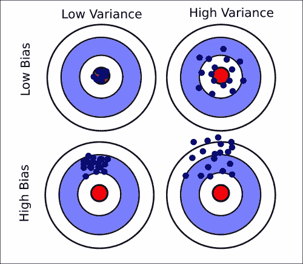

方差和偏差示例。

具有低方差和低偏差误差的模型将具有集中在红色中心(真实标签)的蓝点预测标签(如上图所示)。当预测值远离真实标签时，会出现高偏差误差，而当预测值范围较大时，会出现高方差。

我们已经看到标签可以是连续的，也可以是离散的，分别对应回归分类问题。大多数模型都适合解决这两个问题，我们将使用词回归和分类引用同一个模型。更正式地，给定一组 *N* 数据点和相应的标签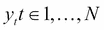，具有一组参数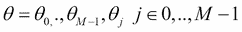和真实参数值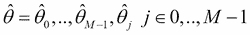的模型将具有**均方误差** ( **MSE** )，等于:

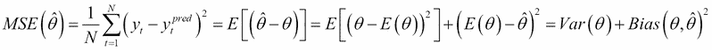

我们将使用MSE 作为衡量标准来评估本章中讨论的方法。现在我们将开始描述广义线性方法。


# 广义线性模型

广义线性模型是一组试图找到在标签*y[I]和特征向量 *x ^((i))* 之间形成线性关系的 *M* 参数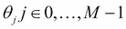的模型，如下所示:*


这里，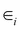是模型的误差。用于寻找参数的算法试图最小化由成本函数 *J* 定义的模型的总误差:

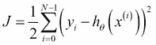

使用名为**批量梯度下降**的迭代算法实现 *J* 的最小化:

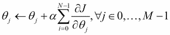

这里α称为学习率，是收敛速度和收敛精度的权衡。另一种算法叫做**随机梯度下降**，即是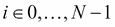的循环:

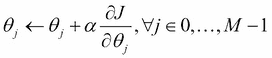

为每个训练示例 *i* 更新θ [j] 而不是等待对整个训练集求和。最后一种算法收敛在 *J* 的最小值附近，通常比批量梯度下降更快，但是最终解可能在参数的真实值附近振荡。以下段落描述了最常见的模型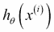和相应的成本函数 *J* 。

## 线性回归

线性回归是最简单的算法，基于模型:

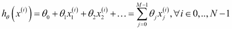

成本函数和更新规则是:

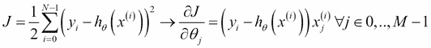

## 岭回归

岭回归，也被称为吉洪诺夫正则化，在成本函数中增加了一个项:

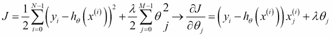

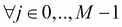，其中λ为正则化参数。附加项具有所需的功能，即在所有可能的解决方案中优选某一组参数，惩罚与 *0* 不同的所有参数θ [j] 。最后一组θ[j]在 *0* 附近收缩，降低了参数的方差，但引入了偏置误差。用上标 *l* 表示来自线性回归的参数，岭回归参数与以下公式相关:

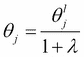

这清楚地表明，λ值越大，脊参数在 *0* 附近收缩得越多。

## 套索回归

Lasso 回归是一种类似于岭回归的算法，唯一的区别在于正则化项是参数绝对值的和:

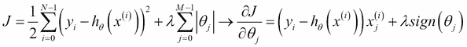

## 逻辑回归

尽管有的名字，这种算法用于(二元)分类问题，所以我们定义标签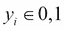。该模型被赋予所谓的逻辑函数，表示为:

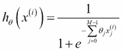

在这种情况下，成本函数定义如下:

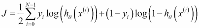

由此，更新规则在形式上与线性回归相同(但是模型定义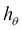不同):

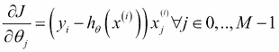

注意，对点 *p* 、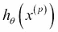的预测是在 *0* 和 *1* 之间的连续值。因此，通常，为了估计类别标签，我们有一个阈值 =0.5，这样:

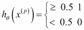

逻辑回归算法适用于使用一对一或一对一技术的多标签问题。使用第一种方法，通过训练 *K* 逻辑回归模型来解决关于 *K* 类的问题，每个模型假设所考虑的类 *j* 的标签为 *+1* ，所有其余的为 *0* 。第二种方法包括为每对标签训练一个模型(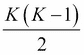训练模型)。

## 广义线性模型的概率解释

现在我们已经看到了广义的线性模型，让我们找到满足关系式的参数θ [j] :

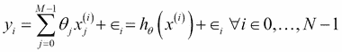

在线性回归的情况下，我们可以假设为正态分布，均值*为 0* ，方差^(为 2) ，这样概率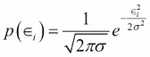等于:

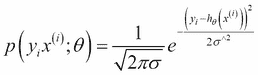

因此，系统的总可能性可以表示如下:

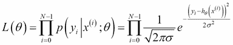

在逻辑回归算法的情况下，我们假设逻辑函数本身就是概率:

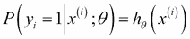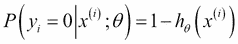

那么这种可能性可以表示为:

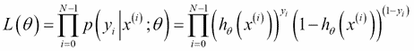

在这两种情况下，可以证明最大化似然等价于最小化成本函数，因此梯度下降将是相同的。

## K 近邻(KNN)

这是一种非常简单的分类(或回归)方法，其中给定一组具有相应标签*y[I]的特征向量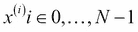，测试点 *x ^( (t) )* 被分配给标签值，其中在 *K* 最近邻居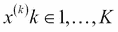中找到大多数标签出现，使用如下距离测量:*

*   **欧几里得** : 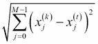
*   **曼哈顿** : 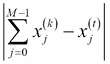
*   **闵可夫斯基** : 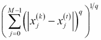(如果 *q=2* ，这减少到欧几里德距离)

在回归的情况下，值 *y [t]* 是通过用标签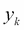 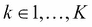的平均值替换大多数出现次数来计算的。最简单的平均值(或大多数出现)具有统一的权重，因此每个点具有相同的重要性，而不管它们与 x*^(【t】)*的实际距离。然而，可以使用权重等于距离 *x ^( (t) )* 的倒数的加权平均值。


# 朴素贝叶斯

**朴素贝叶斯**是一种基于贝叶斯概率定理和对特征的条件独立性假设的分类算法。给定一组 *m* 特征、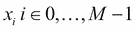和一组标签(类)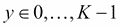，拥有标签 *c* (也给定特征集 *x [ i ]* )的概率由贝叶斯定理表示:

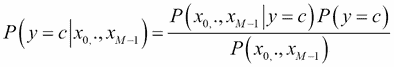

这里:

*   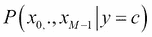叫做似然分布
*   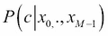是后验分布
*   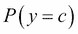是先验分布
*   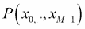被称为证据

与特征集相关联的预测类将是值 *p* ，使得概率最大化:

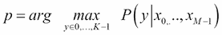

然而，这个方程是无法计算的。所以，需要一个假设。

使用条件概率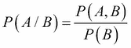的规则，我们可以将前面公式的分子写成如下:

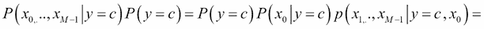

我们现在使用假设每个特征*x[I]是条件独立的给定 *c* (例如，为了计算概率 *x [1] 给定 *c* ，标签 *c* 的知识使得另一个特征*x[0]的知识冗余，):***


在这种假设下，标签为 *c* 的概率等于:

–––––––––(1)

这里，分子中的 *+1* 和分母中的 *M* 都是常数，对于避免*0/0*的情况(**拉普拉斯平滑**)很有用。

由于(**1**)的分母不依赖于标签(它是在所有可能的标签上求和的)，最终的预测标签 *p* 是通过寻找( **1** 的分子的最大值获得的:

–––––––––(2)

给定通常的训练集，其中 ( *M* 特征)对应于标签集，概率 *P(y=c)* 在频率项中简单地计算为与类别 *c* 相关联的训练样本的数量超过样本总数。相反，条件概率通过遵循一个分布来评估。我们将要讨论两个模型，**多项朴素贝叶斯**和高斯朴素贝叶斯。

## 多项式朴素贝叶斯

让我们假设我们想要确定由一组单词出现给出的电子邮件 *s* 是否是垃圾邮件 *(1)* 或者不是 *(0)* 以便。 *M* 是词汇量的大小(特征的数量)。有文字和 *N* 训练实例(邮件)。

每个电子邮件 *x ^((i))* 带有标签 *y [i]* 使得是单词 *j* 在词汇表中出现在训练示例 *l* 中的次数。对于示例，表示单词 *1* 或*w[1]在第三封电子邮件中出现的次数。在这种情况下，应用关于可能性的多项式分布:*


这里，前面的归一化常数可以被丢弃，因为它们不依赖于标签 *y* ，因此 *arg max* 运算符不会受到影响。重要的部分是对单个单词*w[j]的评估:在训练集上的概率；*


这里 *N [iy]* 是单词 *j* 出现的次数，与标签 *y* 相关联， *N [y]* 是训练集的标签为 *y* 的部分。

这是、对等式( **1** )和多项式分布似然的类比。由于概率上的指数，通常对数被应用于计算最终算法 *(2)* :


## 高斯朴素贝叶斯

如果特征向量 *x ^((i))* 有连续值，可以应用此方法。比如我们要将图像分类到 *K* 类中，每个特征 *j* 为一个像素，*x[j]^((I))*为带有 *N* 图像和标签的训练集中第*I*图像的第*j*像素。给定由像素表示的未标记图像，在这种情况下，等式( **1** )中的变为:


这里:


并且:

<title>Decision trees</title>

# 决策树

这类算法旨在通过生成一组从特征值中学习的简单规则来预测分割数据集的未知标签。例如，考虑基于湿度、风、温度和压力的值来决定今天是否带伞的情况。这是一个分类问题，基于 100 天的数据，决策树的示例可以如下图所示。下面是一个示例表:

| 

湿度(%)

 | 

压力(毫巴)

 | 

风速(千米/小时)

 | 

温度(℃)

 | 

雨伞

 |
| --- | --- | --- | --- | --- |
| 56 | 1,021 | 5 | 21 | 是 |
| 65 | 1,018 | 3 | 18 | 不 |
| 80 | 1,020 | 10 | 17 | 不 |
| 81 | 1,015 | 11 | 20 | 是 |


基于 100 天的记录预测是否带伞的决策树。

在前面的图中，方块中的数字代表带伞的日子，而圆圈中的数字表示不需要带伞的日子。

决策树呈现两种类型的节点:决策节点，当应用决策拆分时，它有两个(或更多)分支；和叶节点。停止标准通常是决策节点的最大数量(树的深度)或继续分裂的最小数据点(通常大约 2 到 5)。决策树学习的问题是从所有可能的节点组合中构建出*最佳*树，也就是估计要应用的规则的层次结构(换句话说，第一个决策节点应该在湿度上还是在温度上，等等)。更正式地说，给定一个训练集为的*x^((I))*in*R^m*以及相应的标签 *y [ i ]* ，我们需要找到在节点 *k* 处划分数据 *S* 的最佳规则。如果所选择的特征 *j* 是连续的，则每个分割规则由特征[j和阈值*t^jk*]给出，该阈值将中的 *S* 分割成和、。节点 *k* 的最佳分割规则与杂质 *I* 函数的最小值相关联，该函数测量该规则能够将多少数据分成具有不同标签的分区(即，每个分支将包含最少量的标签混合):


这里，分别是左右分支上的数据点的数量。 *N [ k]*

*   分支的熵:
*   分支机构的基尼系数:
*   误分类:

    *   均方误差(方差):(其中 )

请注意，后者通常用于回归问题，而其他则用于分类。还要注意，通常在文献中，*信息增益*定义是作为节点 *k* 和处的 *H* 之差引入的

哪里

如果特征 *j* 是离散的，具有 *d* 个可能值，则没有二进制阈值*t^jk要计算，并且数据被分割到 *d* 分区中。测量值 *H* 是在 *d* 子集上计算的。*

例如，我们可以使用熵作为杂质度量 *H* 来确定前面示例的第一个节点的规则( *k=0* )。

所有的特征都是连续的，所以需要*t^j0的值。假设 *j=0* 是湿度，并按升序排序，我们拥有的数据集中可能的湿度值如下:*

| h | 0 | 一 | …. | 98 | 99 |
| 雨伞 | 是 | 不 | …. | 不 | 不 |
| 湿度 | **58** | 62 | …. | 88 | 89 |
|   | < | > = | < | > = | < | > = | < | > = | < | > = |
| 是 | 0 | 11 | 14 | 32 | 七 | 20 | 29 | 12 | 78 | 0 |
| 不 | 0 | 89 | 21 | 33 | 13 | 60 | 10 | 49 | 22 | 0 |
|  | **0.5** | 0.99 | 0.85 | 0.76 | 0.76 |

因此，湿度特征的阈值为= 58；同样，我们可以计算出温度*t¹0风速*t²0*和压力*t³[0]*的阈值。现在我们可以记录以确定第一个节点的最佳规则，计算四个特征中每一个的杂质:*

| 是 | 雨伞 | 是不 | 雨伞 |
| 不 |   |   |   |
| 湿度 j=0 |  | 0 | 0 | 温度 j=1 |  | 21 | 32 |
|  | 11 | 89 |  | 11 | 36 |
| 杂质: | 杂质: |
| 是 | 雨伞 | 是不 | 雨伞 |
| 不 |   |   |   |
| 风力 j=2 |  | 48 | 5 | 压力 j=3 |  | 39 | 3 |
|  | 一 | 46 |  | 45 | 13 |
| **杂质**: | 杂质: |

因此，对于节点 *0* ，最佳规则由下式给出:


即具有阈值*t²0的风特征。我们可以重复相同的过程，为下面的决策节点找到最佳规则，直到树的末尾。*

决策树学习能够处理大型数据集，尽管它往往不能很好地泛化，特别是对于一大组特征( *N* ≈ *M* )。在这种情况下，建议设置较小的树深度或使用一些降维技术。设置要分割的最小数据点数或叶节点中的最小数据点数也有助于防止过度拟合。这种算法可能导致树过于复杂；它们可以被*修剪*以减少不影响预测质量的分支。各种修剪技术都是可用的，但它们超出了本书的范围。还要注意，可以同时训练一系列决策树，组成所谓的**随机森林**。随机森林用原始数据点的随机样本训练每棵树，并且特征的随机子集可用于每个决策节点学习。结果是回归问题中预测的平均值或分类问题中的大多数。


# 支持向量机

这种算法，**支持向量机** ( **SVM** )试图将数据集几何分离成两个子集，分别标记为 *y [ i ] =+1* 和 *y [ i ] =-1* 。下图显示了数据被完美地分成两类(空心圆和黑圆)，也就是黑线给出的判定边界(或超平面)完全分开两类的数据的情况(换句话说，没有错误分类的数据点):


由黑线(决策边界)分成两类(空圆和实心圆)的数据集草图

超平面在数学上由方程描述，其中是超平面到原点的距离， *w* 是超平面的法线。该算法的目标是最大化决策边界到数据点的距离。在实践中，我们考虑距离超平面最近的点 *i* ，称为支持向量，它们位于两个平面*H[1]、*H[2]中，距离决策边界的距离为 *d [ 1 ]* 、 *d [ 2 ]* ，使得:**

对于*H[1]使得*y[I]=+1*––––––1*

用于*H[2]使得*y[I]=-1*––––––2*

假设*d[1]= d[2]，共同的距离被称为余量，以便支持向量机方法找到使余量最大化的 *w* 和 *b* 的值。*

由于*H[1]和*H[2]之间的距离是由给出的，所以余量等于，支持向量机算法等价于:**

使得，

这里，增加了平方运算和因子，允许使用二次规划方法来解决数学问题。现在，这个问题可以用拉格朗日乘数 a *[ i ] > 0* 改写成拉格朗日形式:


设定相对于和 *b* 到 *0* 的导数，我们得到:

––––––––三

––––––––四

所以优化后的拉格朗日量变成了:


这里，。

这被称为原问题的对偶形式，它只取决于 a *i* 的最大化:


解(a*[I]= 0*返回空向量的情况)是使用称为二次规划的技术找到的，并通过公式 **(3)** 表示支持向量 *w* :

––––––––五。

a *s* 满足方程(方程**(1)****(2)**的组合):


代入方程 **(3)** ，两边乘以*y[s]T5(即 *+1* 或 *-1* ，得到:*


对所有支持向量*N[s]进行平均我们可以对参数 *b* 进行更好的估计:*

––––––––六

等式 **(5)** 和 **(6)** 返回定义支持向量机算法的参数值，由此可以预测所有测试点 *t* 的类别:


如果一条线不能将数据点完全分为两类，我们需要允许数据点因错误而被错误分类，例如:


我们需要最大限度地提高利润率，尽量减少错误分类的错误。这个条件被转换成这个等式:

使得

这里，设置参数 *C* 以平衡带有误分类误差的余量的大小( *C=0* 很小没有误分类和最大余量， *C > > 1* 许多误分类点和窄余量)。应用与前面相同的方法，对偶问题服从拉格朗日乘数条件，上限为 *C* :


到目前为止，我们只处理了两类问题。实际问题可能有多个类别，通常使用两种程序来采用这种方法(如逻辑回归所示):一对所有或一对一。给定一个关于 *M* 类的问题，第一种方法训练 *M* SVM 模型，每一个都假定被考虑的类 *j +1* 和所有其余的 *-1* 的标签。第二种方法改为为每对类 *i* 、 *j* 训练一个模型，从而得到训练的模型。显然，第二种方法在计算上更昂贵，但结果通常更精确。

同理，SVM 可用于回归问题，即无论何时 *y [i]* 在 *-1* 和 *1* 之间连续。在这种情况下，目标是找到参数 *w* 和 *b* ，使得:


我们假设真实值*t[I]可能与最大值的预测值*y[I]不同，并且根据*y[I]是大于还是小于*t[I]T18预测可能进一步被错误分类为大约。下图显示了位于真实值*t[I]附近的各种预测*y[I]以及相关的误差:******


预测值 *y [i]* 位于真实值 *[ti]* 附近

最小化问题变成:


使得:


有可能显示相关联的对偶问题现在等于:

以为准。

这里，是拉格朗日乘数。

新的预测*y[p]可以通过应用公式来找到，其中参数 *b* 可以像之前一样获得——对由与子集和相关联的支持向量给出的子集 *S* 求平均:*


## 内核绝招

在某个空间中存在不可线性分离的数据集，但是如果在正确的空间中对其进行变换，那么超平面可以将数据分成期望的两个或更多个类。考虑下图所示的示例:


在二维空间中，左边显示的数据集是不可分的。在三维空间中映射数据集，这两个类是可分的。

我们可以清楚地看到，两类在二维空间中不是线性可分的(左图)。假设我们然后对数据应用核函数 *K* ，使得:


数据现在可以通过一个二维平面分离(右图)。将 SVM 算法上的核函数应用于矩阵*H[ij]，替换变量 *i* 、 *j* 上的点积:*


在 SVM 算法上使用的流行的内核函数有:

*   线性内核:
*   径向基核函数(RBF): 
*   多项式内核:
*   Sigmoid 内核:


# 方法的比较

我们现在可以测试本章讨论的方法来解决一个回归问题和一个分类问题。为了避免过度拟合，数据集通常被分成两组:训练集和测试集，前者用于拟合模型参数，后者用于评估模型的准确性。然而，可能有必要使用第三个集合，即验证集合，其中的超参数(例如，SVM 的 *C* 和，或者岭回归中的α)可以被优化。原始数据集可能太小，不允许分成三个数据集，并且结果可能会受到训练集、验证集和测试集上数据点的特定选择的影响。解决这个问题的一个常见方法是按照所谓的交叉验证程序评估模型——数据集被分成 *k* 个子集(称为折叠),模型被训练如下:

*   使用褶皱的 *k-1* 作为训练数据来训练模型。
*   产生的模型在剩余的部分数据上进行测试。
*   重复该程序，重复次数与开始时决定的折叠次数一样多，每次使用不同的 *k-1* 折叠进行训练(因此测试折叠也不同)。通过对不同的 *k 次*迭代获得的精度进行平均，获得最终精度。

## 回归问题

我们使用的是波士顿郊区的住房数据集，存储在[http://archive.ics.uci.edu/ml/datasets/Housing](http://archive.ics.uci.edu/ml/datasets/Housing)和作者的存储库中([https://github . com/ai 2010/machine _ learning _ for _ the _ web/tree/master/chapter _ 3/](https://github.com/ai2010/machine_learning_for_the_web/tree/master/chapter_3/))，其中也提供了本段中使用的代码。该数据集有 13 个特征:

*   各城镇的人均犯罪率
*   **ZN** :面积超过 25，000 平方英尺的住宅用地比例
*   **INDUS** :每镇非零售营业亩数比例
*   **CHAS** : Charles River 虚拟变量( *= 1* 如果区域边界为河流； *0* 否则)
*   **NOX** :氮氧化物浓度(百万分之一)
*   RM :每个住宅的平均房间数
*   **楼龄**:1940 年前建成的自住单位比例
*   **DIS** :距离波士顿五个就业中心的加权距离
*   **RAD** :放射状公路可达性指标
*   **税**:每万美元的全价值财产税税率
*   **PTRATIO** :按城镇划分的学生-教师比率
*   **b**:*1000(bk-0.63)^2*，其中 *Bk* 是按城镇划分的黑人比例
*   **LSTAT** :我们要预测的较低社会地位人口的百分比和标签是 MEDV，它代表房屋价值(以 1000 美元计)

为了评估模型的质量，计算引言中定义的均方误差和决定系数*R²。*R²由下式给出:**


这里，*y[I]pred表示来自模型的预测标签。*

最好的结果是 *R ² =1* ，这意味着模型完美地拟合了数据，而 *R ² =0* 与具有恒定直线的模型相关联(负值表示拟合越来越差)。使用`sklearn`库计算训练线性回归、岭回归、拉索回归和 SVM 回归的代码如下(IPython notebook at[https://github . com/ai 2010/machine _ learning _ for _ the _ web/tree/master/chapter _ 3/](https://github.com/ai2010/machine_learning_for_the_web/tree/master/chapter_3/)):


使用 pandas 库加载房屋数据，并通过应用函数`df.iloc[np.random.permutation(len(df))]`重新排列以随机化交叉验证折叠子集数据(已使用 10 个折叠)。该脚本的输出如下:


使用随机森林(50 棵树)获得最佳模型拟合；它返回平均决定系数 *0.86* 和 *MSE=11.5* 。正如所料，决策树回归器比随机森林具有更低的 *R ² 和更高的 MSE(分别为 *0.67* 和 *25* )。采用 **rbf 核** ( *C=1，* )的支持向量机是最差的模型，在 *R ^( 2 )* 处有巨大的 MSE 误差 *83.9* 和 *0.0* ，而采用线性核( *C=1* ，的 SVM 返回了一个像样的模型( *0)。lasso 和 ridge 回归变量具有可比的结果，大约为*0.7 R²和 *24* MSE。改善模型结果的一个重要步骤是特征选择。经常发生的情况是，只有全部特征的子集与执行模型训练相关，而其他特征可能对模型没有任何贡献。因为忽略了误导性的数据并且减少了训练时间(需要考虑的特征更少)，所以特征选择可以改善*R²。****

有许多技术可以提取特定模型的最佳特征，但在这种情况下，我们探索所谓的递归特征消除方法(RSE ),该方法主要考虑与最大绝对权重相关的属性，直到选择了所需数量的特征。在 SVM 算法的情况下，权重只是 *w* 的值，而对于回归，它们是模型参数θ。使用`sklearn`内置函数`RFE`，仅指定最佳的四个属性(`best_features`):


输出是:


`RFE`函数返回一列布尔值(`support_`属性),表明哪些特征被选中(真值)哪些没有被选中(假值)。然后，像我们之前所做的那样，使用所选择的特征来评估模型。

即使仅使用四个特征，最佳模型仍然是具有 50 棵树的随机森林，并且*R²仅略低于使用全套特征训练的模型的 R*R²2*(0.82*对 *0.86* )。其他模型——lasso、ridge、决策树和线性 SVM 回归器——具有更显著的 *R ²* 下降，但结果仍然与它们相应的完全训练模型相当。注意，KNN 算法不提供特征的权重，因此不能应用`RFE`方法。

## 分类问题

为了测试本章中学习的分类器，基于描述汽车主要特征(购买价格、维护成本、车门数量、载客人数、行李箱尺寸和安全性)的六个特征的汽车评估质量数据集(不准确、准确、良好和非常好)。数据集可以在[http://archive.ics.uci.edu/ml/datasets/Car+Evaluation](http://archive.ics.uci.edu/ml/datasets/Car+Evaluation)或者我的 GitHub 账号上找到，还有这里讨论的代码([https://GitHub . com/ai 2010/machine _ learning _ for _ the _ web/tree/master/chapter _ 3/](https://github.com/ai2010/machine_learning_for_the_web/tree/master/chapter_3/))。为了评估分类的准确性，我们将使用精度、召回率和 f 值。给定只有两个类(阳性和阴性)的数据集，我们定义真阳性点的数量( *tp* )正确标记为阳性的点的数量( *fp* )错误标记为阳性的点的数量(阴性点)和假阴性的数量( *fn* )错误分配给阴性类的点的数量。使用这些定义，精确度、召回率和 f-measure 可以计算如下:


在分类问题中，给定类别 *C* 的完美精度( *1.0* )意味着分配给类别 *C* 的每个点都属于类别 *C* (没有关于类别 *C* 被错误标记的点的数量的信息)，而等于 *1.0* 的召回意味着来自类别 *C* 的每个点都被标记为属于类别

*注意，在多个类别的情况下，这些度量通常被计算为标签数量的许多倍，每次将一个类别视为正面，而将所有其他类别视为负面。然后使用多个类别度量的不同平均值来估计总精度、召回率和 f-measure。*

*对汽车数据集进行分类的代码如下。首先，我们将所有的库和数据加载到 pandas 数据框架中。*

**

*以下是分类的特征值:*

```
***buying 0      v-high, high, med, low**
**maintenance 1  v-high, high, med, low**
**doors 2       2, 3, 4, 5-more**
**persons 3     2, 4, more**
**lug_boot 4    small, med, big**
**safety 5      low, med, high**
**car evaluation 6 unacc,acc,good,vgood*** 
```

*这些被映射成在分类算法中使用的数字:*

**

*由于我们需要计算并保存所有方法的度量，我们编写一个标准函数`CalcMeasures`，并将标签的向量`Y`与特征`X`分开:*

**

*使用了一个`10`交叉验证折叠，代码为:*

**

*测量值存储在数据帧中:*

**

*每个测量值已经评估了四次，即根据索引映射填充数组的汽车评估类的数量:*

```
*'acc': 0, 'unacc': 2, 'good': 1, 'vgood': 3*
```

*最好的模型是具有 rbf 核的 SVM(*C = 50*)，但是随机森林(50 棵树)和决策树也返回极好的结果(对于所有四个类，度量值超过 *0.9* )。朴素贝叶斯、逻辑回归和具有线性核的 SVM(*C = 50*)返回较差的模型，尤其是对于准确、良好和非常好的类，因为具有这些标签的点很少:*

**

*从百分比来看，非常好(v-good)和良好分别为 3.993%和 3.762%，而不准确为 70.0223%，准确为 22.222%。因此，我们可以得出结论，这些算法不适合预测数据集中很少出现的类。*

*<title>Hidden Markov model</title>

# 隐马尔可夫模型

虽然这个方法不能被严格地认为是监督学习算法，但它也可以用来执行一些真正类似于分类的事情，所以我们决定在这里包含它。为了介绍这个主题，我们将举一个例子。考虑这样一个简单的例子，通过观察他的目光来预测你面前的推销员是否在说谎(两种状态):目光接触、向下看或看向一边(每个观察值*O[I]分别具有值 *0* 、 *1* 和 *2* )。想象一下对推销员的眼色的一系列观察 O=O *[ 0 ]* ，O *[ 1 ]* ，O *[ 2 ]* ，O *[ 3 ]* ，O *[ 4 ]* ，…是 *0，1，0，2，…* 我们要推断的转移矩阵*

**

**A* 、 *a [ij]* 的任何条目表示在时间 *t+1* 停留在状态 *S [i] 的概率，给定时间 *t* 的状态 *S [j]* 。因此，*0.3*(*a[01]*)是假设业务员在 *t* 时刻躺在句子上，在 *t+1* 时刻不躺在句子上的概率， *0.6 (a [10] )* 反之亦然， *0.7(a [00] )* 代表业务员在时间 *t* 和时间 *t+10.4(a [11] )* 是他在时间 *t* 真诚后，在时间 *t+1* 没有躺在句子上的概率。 以类似的方式，可以定义矩阵 *B* ，该矩阵将销售员的意图与其三种可能的行为相关联:**

**

*任何条目 *b [j(k)]* 都是在时间 *t* 给出状态 *S [j]* 在时间 *t* 出现观测值 *k* 的概率。例如，*0.7*(*b[00]*)、*0.1*(*b[01]*)、*0.2*(*b[02]*)是在给定行为观察—的情况下，销售员说谎的概率下图描述了这些关系:*

*

推销员行为——两状态隐马尔可夫模型* 

*推销员的初始状态分布也可以定义为:(他在时间 *0* 的第一句话中，稍微倾向于说谎而不是说真话)。注意，所有这些矩阵都是行随机的；也就是说，这些行总计为 *1* ，并且不直接依赖于时间。一个**隐马尔可夫模型** ( **HMM** )由三个矩阵()的组合给出，这三个矩阵描述了已知的观察值序列 *O=O [0] ，O [1] ，…O [ T-1 ]* 与相应的隐藏状态序列 *S=S [0] ，S [1] 之间的关系一般来说，该算法使用的标准符号概括如下:**

*   **T* 是观察序列的长度*O = O[0]，O [1] ，… O [T-1] 和隐藏状态序列 *S=S [0] ，S [1] ，…S[T-1]***
*   *N 是模型中可能的(隐藏的)状态的数量*
*   **M* 是可能观察值的数量:*
*   **A* 是状态转移矩阵*
*   **B* 是观测概率矩阵*
*   *π是初始状态分布*

*在前面的例子中， *M=3* ， *N=2* ，我们设想预测推销员在讲话过程中的意图序列(即隐藏状态) *S=S [0] ，S [1] ，… S [T-1]* ，观察他的行为值 *O=O [这是通过计算每个状态序列 *S* 的概率来实现的:]**

**

*例如，固定 *T=4* 、 *S=0101* 和 *O=1012* :*

**

*同样的，我们可以计算隐藏状态所有其他组合的概率，找到最可能的序列 *S* 。寻找最可能序列 *S* 的有效算法是维特比算法，它包括计算从 *0* 到 *t* 直到 *T-1* 的部分序列集合的最大概率。在实践中，我们计算以下数量:*

*   **
*   *对于 *t=1，…，T-1* 和 *i=0，…，N-1* ，来自不同状态 *j* 的可能路径中，在时间 *t* 处于状态 *i* 的最大概率为。与的最大值相关联的部分序列是直到时间 *t* 的最可能的部分序列。*
*   *最终的最可能序列与时间 *T-1* : 的最大概率相关联。*

*例如，给定前面的模型，长度 *T=2* 的最可能序列可以被计算为:*

*   **P(10)=0.0024**
*   **P(00)= 0.0294*

    *   所以 d*1*(0)= P(00)= 0.0294* 
*   **P(01)=0.076**
*   **P(11)= 0.01*

    *   所以 d*[1](1)= P(01)= 0.076** 

*而最后最有可能的序列是 *00* (两个连续的假句子)。*

*考虑最可能序列的另一种方法是最大化正确状态的数量；也就是说，每次考虑具有最大概率的状态 *i* 。使用一种称为反向算法的算法，可以显示给定状态 *i* 、的概率为:*

**

*这里:*

*   **
*   *和部分观察序列的概率直到时间 *t* ，其中 HMM 处于开状态 *i* : *
*   *和给定时间 *t* 等于 *i* 的状态，在时间 *t* 之后直到 *T-1* 的部分序列的概率:*
*   *在时间 *t* 之前和之后停留在状态 *i* 的概率的组合产生了的值。*

*请注意，计算最可能序列的两种方法不一定返回相同的结果。*

*反向问题——在给定序列 *O=O [0] ，O [1] ，…O [T-1]* 以及参数 *N* ， *M* 的值的情况下，找到最佳 HMM—也可以使用 ** Baum-Welch 算法**迭代求解。将在时间 *t* 出现在状态 *i* 以及在时间 *t+1* 出现在状态 *j* 的概率定义为:*

*其中为和。*

*那么鲍姆-韦尔奇算法如下:*

*   *初始化*
*   *计算和*
*   *重新计算模型矩阵为:其中和为 Kronacker 符号，如果等于 *1* ，否则等于 *0**
*   *迭代直到收敛:*

*在下一节中，我们将展示一段 Python 代码，它实现了这些等式来测试 HMM 算法。*

## *一个 Python 例子*

*像往常一样，下面讨论的`hmm_example.py`文件可以在[https://github . com/ai 2010/machine _ learning _ for _ the _ web/tree/master/chapter _ 3/](https://github.com/ai2010/machine_learning_for_the_web/tree/master/chapter_3/)获得。*

*我们开始定义一个类，在这个类中我们传递模型矩阵:*

```
***class HMM:**
 **def __init__(self):**

**self.pi = pi**
 **self.A = A**
 **self.B = B*** 
```

*维特比算法和正确状态数的最大化在以下两个函数中实现:*

```
 ***def ViterbiSequence(self,observations):**
 **deltas = [{}]**
 **seq = {}**
 **N = self.A.shape[0]**
 **states = [i for i in range(N)]**
 **T = len(observations)**
 **#initialization**
 **for s in states:**
 **deltas[0][s] = self.pi[s]*self.B[s,observations[0]]**
 **seq[s] = [s]**
 **#compute Viterbi**
 **for t in range(1,T):**
 **deltas.append({})**
 **newseq = {}**
 **for s in states:**
 **(delta,state) = max((deltas[t-1][s0]*self.A[s0,s]*self.B[s,observations[t]],s0) for s0 in states)**
 **deltas[t][s] = delta**
 **newseq[s] = seq[state] + [s]**
 **seq = newseq**

 **(delta,state) = max((deltas[T-1][s],s) for s in states)**
 **return  delta,' sequence: ', seq[state]**

 **def maxProbSequence(self,observations):**
 **N = self.A.shape[0]**
 **states = [i for i in range(N)]**
 **T = len(observations)**
 **M = self.B.shape[1]**
 **# alpha_t(i) = P(O_1 O_2 ... O_t, q_t = S_i | hmm)**
 **# Initialize alpha**
 **alpha = np.zeros((N,T))**
 **c = np.zeros(T) #scale factors**
 **alpha[:,0] = pi.T * self.B[:,observations[0]]**
 **c[0] = 1.0/np.sum(alpha[:,0])**
 **alpha[:,0] = c[0] * alpha[:,0]**
 **# Update alpha for each observation step**
 **for t in range(1,T):**
 **alpha[:,t] = np.dot(alpha[:,t-1].T, self.A).T * self.B[:,observations[t]]**
 **c[t] = 1.0/np.sum(alpha[:,t])**
 **alpha[:,t] = c[t] * alpha[:,t]**

 **# beta_t(i) = P(O_t+1 O_t+2 ... O_T | q_t = S_i , hmm)**
 **# Initialize beta**
 **beta = np.zeros((N,T))**
 **beta[:,T-1] = 1**
 **beta[:,T-1] = c[T-1] * beta[:,T-1]**
 **# Update beta backwards froT end of sequence**
 **for t in range(len(observations)-1,0,-1):**
 **beta[:,t-1] = np.dot(self.A, (self.B[:,observations[t]] * beta[:,t]))**
 **beta[:,t-1] = c[t-1] * beta[:,t-1]**

 **norm = np.sum(alpha[:,T-1])**
 **seq = ''**
 **for t in range(T):**
 **g,state = max(((beta[i,t]*alpha[i,t])/norm,i) for i in states)**
 **seq +=str(state)**

 **return seq*** 
```

*由于概率的相乘将导致下溢问题，所有的α*[t](I)*和β*[t](I)*都被乘以一个常数，使得对于:*

*   **
*   *哪里*

*现在，我们可以用销售员意图示例中的矩阵初始化 HMM 模型，并使用前面的两个函数:*

```
***pi = np.array([0.6, 0.4])**
**A = np.array([[0.7, 0.3],**
 **[0.6, 0.4]])**
**B = np.array([[0.7, 0.1, 0.2],**
 **[0.1, 0.6, 0.3]])** 
**hmmguess = HMM(pi,A,B)** 
**print 'Viterbi sequence:',hmmguess.ViterbiSequence(np.array([0,1,0,2]))**
**print 'max prob sequence:',hmmguess.maxProbSequence(np.array([0,1,0,2]))*** 
```

*结果是:*

```
***Viterbi: (0.0044, 'sequence: ', [0, 1, 0, 0])**
**Max prob sequence: 0100*** 
```

*在这种特殊情况下，两种方法返回相同的序列，您可以很容易地验证，通过改变初始矩阵，算法可能会导致不同的结果。我们得到行为序列；目光接触、向下看、目光接触、向旁边看可能与推销员状态的顺序有关；说谎，不说谎，说谎，说谎的概率为 *0.0044* 。*

*在给定观察序列和参数 *N* 和 *M* 的情况下，还可以实现 Baum-Welch 算法来找到最佳 HMM。代码如下:*

```
 ***def train(self,observations,criterion):**

 **N = self.A.shape[0]**
 **T = len(observations)**
 **M = self.B.shape[1]**

 **A = self.A**
 **B = self.B**
 **pi = copy(self.pi)**

 **convergence = False**
 **while not convergence:**

 **# alpha_t(i) = P(O_1 O_2 ... O_t, q_t = S_i | hmm)**
 **# Initialize alpha**
 **alpha = np.zeros((N,T))**
 **c = np.zeros(T) #scale factors**
 **alpha[:,0] = pi.T * self.B[:,observations[0]]**
 **c[0] = 1.0/np.sum(alpha[:,0])**
 **alpha[:,0] = c[0] * alpha[:,0]**
 **# Update alpha for each observation step**
 **for t in range(1,T):**
 **alpha[:,t] = np.dot(alpha[:,t-1].T, self.A).T * self.B[:,observations[t]]**
 **c[t] = 1.0/np.sum(alpha[:,t])**
 **alpha[:,t] = c[t] * alpha[:,t]**

 **#P(O=O_0,O_1,...,O_T-1 | hmm)**
 **P_O = np.sum(alpha[:,T-1])**
 **# beta_t(i) = P(O_t+1 O_t+2 ... O_T | q_t = S_i , hmm)**
 **# Initialize beta**
 **beta = np.zeros((N,T))**
 **beta[:,T-1] = 1**
 **beta[:,T-1] = c[T-1] * beta[:,T-1]**
 **# Update beta backwards froT end of sequence**
 **for t in range(len(observations)-1,0,-1):**
 **beta[:,t-1] = np.dot(self.A, (self.B[:,observations[t]] * beta[:,t]))**
 **beta[:,t-1] = c[t-1] * beta[:,t-1]**

 **gi = np.zeros((N,N,T-1));**

 **for t in range(T-1):**
 **for i in range(N):**

 **gamma_num = alpha[i,t] * self.A[i,:] * self.B[:,observations[t+1]].T * \**
 **beta[:,t+1].T**
 **gi[i,:,t] = gamma_num / P_O**

 **# gamma_t(i) = P(q_t = S_i | O, hmm)**
 **gamma = np.squeeze(np.sum(gi,axis=1))**
 **# Need final gamma element for new B**
 **prod =  (alpha[:,T-1] * beta[:,T-1]).reshape((-1,1))**
 **gamma_T = prod/P_O**
 **gamma = np.hstack((gamma,  gamma_T)) #append one Tore to gamma!!!**

 **newpi = gamma[:,0]**
 **newA = np.sum(gi,2) / np.sum(gamma[:,:-1],axis=1).reshape((-1,1))**
 **newB = copy(B)**

 **sumgamma = np.sum(gamma,axis=1)**
 **for ob_k in range(M):**
 **list_k = observations == ob_k**
 **newB[:,ob_k] = np.sum(gamma[:,list_k],axis=1) / sumgamma**

 **if np.max(abs(pi - newpi)) < criterion and \**
 **np.max(abs(A - newA)) < criterion and \**
 **np.max(abs(B - newB)) < criterion:**
 **convergence = True;**

 **A[:],B[:],pi[:] = newA,newB,newpi**

 **self.A[:] = newA**
 **self.B[:] = newB**
 **self.pi[:] = newpi**
 **self.gamma = gamma*** 
```

*请注意，代码使用了来自模块`copy`的浅层副本，它创建了一个新的容器，其中填充了对原始对象内容的引用(在本例中为`pi`、`B`)。也就是说，`newpi`是与`pi`不同的对象，但是`newpi[0]`是`pi[0]`的引用。相反，需要 NumPy 挤压函数来从矩阵中删除冗余维度。*

*使用相同的行为序列 *O=0，1，0，2* ，我们得到最优模型由下式给出:*

*、、*

*这意味着状态序列必须从一个真正的推销员的句子开始，并在两个状态*位于*和*不位于*之间持续振荡。一个真正的推销员的句子(不是谎言)当然与目光接触值有关，而谎言则与低头和侧视行为有关。*

*在这个关于 HMM 的简单介绍中，我们假设每个观察值是一个标量值，但是在实际应用中，每个*O[I]T21 通常是一个特征向量。通常，这种方法用于分类训练尽可能多的 HMM l *[i]* ，作为类别进行预测，然后在测试时间选择具有最高的类别。继续这个例子，我们可以想象构建一个*真机*来测试我们与之交谈的每一个销售人员。想象一下，对于我们说话人的每一句话(观察) *O [ i ]* ，我们可以提取三个可能值的三个特征眼神 *e [ i ]* (目光接触、向下看、向旁边看)、三个可能值的语音声音 *v [ i ]* (太响、太低、平)以及两个可能值的手部动作 *h [ i ]* (抖动和在训练的时候，我们让我们的朋友说谎，然后我们用这些观察来训练一个使用 Baum-Welch 的 HMM l *0* 。我们重复训练过程，但使用真实的句子，并训练 l *1* 。测试的时候，我们把业务员 *O* 的句子录下来，两个都算:，。类预测将是概率最高的一个。**

*注意，HMM 已经应用于各种领域，但是其表现相当好的应用是语音识别任务、手写字符识别和动作识别。*

*<title>Summary</title>

# 总结

本章讨论了主要的分类和回归算法，以及实现它们的技术。现在，您应该能够理解每种方法可以在什么情况下使用，以及如何使用 Python 及其库(sklearn 和 pandas)来实现它。

在下一章中，我们将介绍用于从网络数据中学习的最相关的技术(网络数据挖掘)。**