# 第四章。Web 挖掘技术

Web 数据挖掘技术用于探索网上可用的数据，然后从互联网上提取相关信息。在网上搜索是一个复杂的过程，需要不同的算法，它们将是本章的重点。给定一个搜索查询，使用每个网页上的可用数据来获得相关页面，这些数据通常被划分为页面内容和指向其他页面的页面超链接。通常，搜索引擎有多个组件:

*   用于收集网页的网络爬虫或蜘蛛
*   提取内容并预处理网页的解析器
*   以数据结构组织网页的索引器
*   对与查询相关的最重要的文档进行评分的检索信息系统
*   以有意义的方式排序网页的排序算法

这些部分可以分为 web 结构挖掘技术和 web 内容挖掘技术。

网络爬虫、索引器和排名程序指的是网络结构(超链接的网络)。搜索引擎的其他部分(解析器和检索系统)是网页内容分析方法，因为网页上的文本信息用于执行这种操作。

此外，可以使用一些自然语言处理技术来进一步分析网页集合的内容，例如**潜在狄利克雷分配**意见挖掘或情感分析工具。这些技术对于提取网络用户的主观信息尤其重要，因此它们被广泛应用于从营销到咨询的许多商业应用中。这些情感分析技术将在本章末尾讨论。现在我们将开始讨论 web 结构挖掘类别。

# Web 结构挖掘

web 挖掘的这个领域关注于发现网页之间的关系，以及如何使用这种链接结构来发现网页的相关性。对于第一个任务，通常使用蜘蛛，链接和收集的网页存储在索引器中。对于最后一个任务，网页排名评估网页的重要性。

## 网络爬虫(或蜘蛛)

蜘蛛从一组 URL(种子页面)开始，然后提取其中的 URL 来获取更多页面。然后从新的页面中提取新的链接，该过程继续进行，直到符合某些标准。未访问的 URL 存储在一个名为 **frontier** 的列表中，根据列表的使用方式，我们可以有不同的爬虫算法，比如广度优先和优先蜘蛛。在 **广度优先**算法中，下一个要爬行的 URL 来自边界的头部，而新的 URL 被附加到边界的尾部。优先蜘蛛取而代之的是对未访问的 URL 列表进行一定的重要性评估，以确定首先抓取哪个页面。注意，从页面中提取链接是使用解析器执行的，这个操作在 web 内容挖掘部分的相关段落中有更详细的讨论。

web crawler 本质上是一种图形搜索算法，在该算法中，按照某些标准(如要跟踪的最大链接数(图形深度)、要爬行的最大页面数或时间限制)来检索起始页面的邻域结构。然后，蜘蛛可以提取网络中具有有趣结构的部分，如中心和权限。hub 是包含大量链接的网页，而 authority 被定义为一个页面，其 URL 在其他网页上出现的次数很多(这是衡量页面受欢迎程度的一个指标)。Scrapy 库提供了一个流行的 Python 爬虫实现，它也采用并发方法(使用 Twisted 的异步编程)来加速操作。关于此模块的教程在[第 7 章](ch07.html "Chapter 7. Movie Recommendation System Web Application")、*电影推荐系统 Web 应用*中给出，此时爬虫将用于提取关于电影评论的信息。

## 索引器

索引器是一种将爬虫找到的网页存储在结构化数据库中的方式，以允许对给定的搜索查询进行后续的快速检索。最简单的索引方法是直接存储所有页面，在查询时，只扫描包含查询中的关键字的所有文档。然而，如果页面数量很大(实际上就是这样)，由于计算成本很高，这种方法是不可行的。最常见的加快检索速度的方法叫做 **倒排索引方案**，最流行的搜索引擎都在使用。

给定一组网页 *p [1] ，…，p [k]* 和一个包含页面中所有单词的词汇 *V* ，通过存储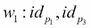，…，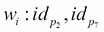等列表得到倒排索引数据库，

这里，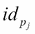是网页的 ID*j*。可以为每个单词存储额外的信息，例如，单词的频率计数或它在每页上的位置。索引器的实现超出了本书的范围，但是为了完整起见，在这一段中描述了一般的概念。

因此，带有单词列表的搜索查询将检索与每个单词相关的所有倒排列表，然后合并这些列表。最终列表的顺序将使用排序算法和信息检索系统来选择，以测量文档与查询的相关性。

## 排名–page rank 算法

一个排名算法之所以重要，是因为单个信息检索查询通常可以返回的 web 页面数量可能是巨大的，因此存在如何选择最相关页面的问题。此外，信息检索模型可以很容易地通过在页面中插入许多关键字来使页面与大量查询相关而被发送垃圾邮件。因此，评估互联网上网页的重要性(即，排名分数)的问题已经考虑到这样的事实，即网络具有一个图形，其中超链接(从一个页面到另一个页面的链接)是评估网页相关性的主要信息来源。超链接可以分为:

*   页面 *i* 的内链接:指向页面 *i* 的超链接
*   页面 *i* 的外链:从页面 *i* 指向其他页面的超链接

直觉上，一个网页的内链越多，这个网页就应该越重要。对这种超链接结构的研究是社会网络分析的一部分，并且已经使用和提出了许多算法。但出于历史原因，我们将解释最著名的算法，称为 **PageRank** ，由谢尔盖·布林和拉里·佩奇(谷歌创始人)于 1998 年提出。整个想法是计算一个页面的声望，作为指向它的页面的声望的总和。如果一个页面 *j* 的声望是 *P(j)* 它被平均分配给它所指向的所有页面 *N [j]* ，使得每个外链接收一部分等于 *P(j)|N [j]* 的声望。形式上，页面 *i* 的声望或页面排名分数可以定义为:

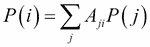

这里，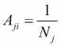如果页面 *j* 指向页面*I*；否则等于 *0* 。 *A [ ij ]* 称为邻接矩阵，它表示从节点 *j* 传播到节点 *i* 的声望部分。考虑到图中的 *N* 个节点，前面的等式可以用矩阵形式重写:

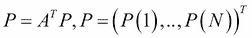

注意，如果邻接矩阵满足某些条件，这个方程等价于具有特征值的特征系统。解释前述等式的另一种方式是使用马尔可夫链术语——条目 *A [ ij ]* 成为从节点 *j* 到节点 *i* 的转移概率，并且节点 *i* 、 *p(i)* 的声望是访问节点 *i* 的概率。在这种情况下，可能会发生两个(或更多)节点相互指向对方，但不指向其他页面的情况。一旦访问了这两个节点中的一个，就会出现一个循环，用户就会被困在其中。这种情况被称为 **秩下沉**(矩阵 *A* 被称为 **周期**)，解决方案是增加一个转移矩阵项，允许从每个页面随机跳转到另一个页面，而不遵循 *A* 描述的马尔可夫链:

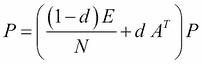

这里， *E=ee ^T* 是一维矩阵 *N N* ( *e* 是单位向量)，而 *d* (也称为 **阻尼因子**)是遵循转移矩阵 *A* 给出的转移的概率。 *(1-d)* 是随机访问一个页面的概率。在这种最终形式中，所有的节点都是相互链接的，因此即使邻接矩阵的一行中有许多针对特定节点 *s* 、 *A [sj]* 的*条目，总有一个等于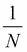的小概率从所有的 *N* 中访问 *s* 注意 *A* 必须是随机的，这意味着每一行的总和必须等于*1*；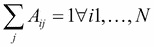(每行至少有一个条目不同于 *0* 或每页至少有一个外链)。可以通过将 *P* 向量归一化为 *e ^( T ) P=N* 来简化该等式:*

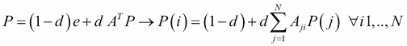

这可以用幂迭代法来解决。该算法将在《T4》第 8 章、*中用于电影评论的情感分析应用*，以实现一个电影评论情感分析系统的例子。该算法的主要优点是它不依赖于查询(因此 PageRank 分数可以离线计算并在查询时检索)，并且它对垃圾邮件非常鲁棒，因为垃圾邮件发送者在有影响的页面上插入到他们的页面的内链接是不可行的。


# Web 内容挖掘

这种类型的挖掘专注于从网页内容中提取信息。通常对每个页面进行收集和组织(使用解析技术)，进行处理以从文本中删除不重要的部分(自然语言处理)，然后使用信息检索系统进行分析，以将相关文档与给定的查询进行匹配。这三个组成部分将在以下段落中讨论。

## 解析

一个网页是用 HTML 格式编写的，所以第一个操作是提取相关的信息片段。HTML 解析器构建一个标签树，从中可以提取内容。如今，有许多可用的解析器，但是作为一个例子，我们使用 Scrapy 库(参见[第 7 章](ch07.html "Chapter 7. Movie Recommendation System Web Application")、*电影推荐系统 Web 应用*，它提供了一个命令行解析器。假设我们想要解析维基百科的主页，[https://en.wikipedia.org/wiki/Main_Page](https://en.wikipedia.org/wiki/Main_Page)。我们只需在终端中键入以下内容:

```
scrapy shell 'https://en.wikipedia.org/wiki/Main_Page' 

```

提示将准备好使用`response`对象和`xpath`语言解析页面。例如我们想获得标题的页面:

```
In [1]: response.xpath('//title/text()').extract()
Out[1]: [u'Wikipedia, the free encyclopedia']

```

或者我们想提取页面中所有嵌入的链接(爬虫工作需要这个操作)，这些链接通常放在`<a>`上，URL 值在一个`href`属性上:

```
In [2]: response.xpath("//a/@href").extract()
Out[2]:
[u'#mw-head',
 u'#p-search',
 u'/wiki/Wikipedia',
 u'/wiki/Free_content',
 u'/wiki/Encyclopedia',
 u'/wiki/Wikipedia:Introduction',
…
 u'//wikimediafoundation.org/',
 u'//www.mediawiki.org/']

```

请注意，可以使用更健壮的方法来解析内容，因为网页通常由非程序员编写，所以 HTML 可能包含浏览器通常会修复的语法错误。还要注意，由于广告，网页可能包含大量数据，使得相关信息的解析变得复杂。已经提出了不同的算法(例如，树匹配)来识别页面的主要内容，但是目前还没有 Python 库可用，所以我们决定不进一步讨论这个主题。但是，请注意，可以在报纸库中找到一个很好的解析实现来提取 web 文章的正文，它也将用于[第 7 章](ch07.html "Chapter 7. Movie Recommendation System Web Application")、*电影推荐系统 Web 应用*。


# 自然语言处理

一旦网页的文本内容被提取出来，文本数据通常会被预处理以去除不包含任何相关信息的部分。一个文本被标记化，即转换成一个单词列表(标记)，所有的标点符号都被删除。另一个常用的操作是去掉所有的*停用词*，即所有用于构造句子句法但不包含文本信息(如连词、冠词、介词)的词，如 *a* 、 *about* 、 *an* 、*is*、 *as* 、 *at* 、 *be* 、 **如何*、*中的*、*是*、*中的*、*上的*、*或*、*中的*、*中的*、*这些*、*中的*、*到*、*中的*、*什么**

*英语(或任何语言)中的许多单词有相同的词根，但有不同的后缀或前缀。比如*认为*、*思考*、*思考者*这几个词都是同一个词根——*认为*表示意思相同——但是在句子中的作用不同(动词、名词等等)。将一个集合中的所有单词化简为其根的过程称为 **词干**，已经发明了许多算法来这样做(Porter、Snowball 和 Lancaster)。所有这些技术都是被称为 **自然语言处理**的更广泛算法的一部分，它们是在`nltk`库上用 Python 实现的(照常通过`sudo pip install nltk`安装)。例如，以下代码使用前面描述的技术(使用 Python 接口终端)预处理示例文本:*

**

*请注意，`stopwords`列表已经使用`nltk dowloader nltk.download('stopwords')`下载了。*

## *信息检索模型*

*需要使用信息检索方法来找到与给定查询最相关的文档。网页中包含的单词可以使用不同的方法建模，如布尔模型、向量空间模型和概率模型，在本书中，我们决定讨论向量空间模型以及如何实现它们。从形式上来说，给定一个由 *V* 个单词组成的词汇表，一个由 *N* 个页面组成的集合中的每个网页*d[I](或文档)可以被认为是一个单词向量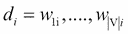，其中属于文档 *i* 的每个单词 *j* 由 *w [ ij ]* 表示，它可以是一个数字(权重)或一个向量**

*   *术语频率-逆文档频率(TF-IDF)，*w[ij]，是一个实数**
*   ***潜在语义分析** ( **LSA** )， *w [ij]* ，是一个实数(表示独立于文档 *i* )*
*   *Doc2Vec(或 word2vec)， *w [ij]* ，是一个实数的向量(独立于文档 *i* 的表示)*

*由于查询也可以是由单词向量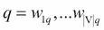表示的，通过计算查询向量和每个文档之间的相似性度量，找到与向量 *q* 最相似的网页。最常用的相似性度量被称为余弦相似性，对于任何文档 *i* 由下式给出:*

*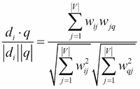*

*请注意，在文献中还使用了其他度量方法(okapi 和旋转归一化加权)，但对于本书来说，它们不是必需的。*

*在本节最后一段的文本案例中应用这三种方法之前，下面几节将给出一些关于这三种方法的细节。*

### *TF-IDF*

*此方法计算*w[ij]，考虑到在大量页面中出现多次的单词可能不如在文档的子集中出现多次的单词重要。它由两个因素相乘得出:**

*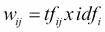其中:*

*   *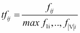是文档 *I* 中 *j* 的归一化频率*
*   *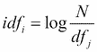是逆文档频率，而 *df [ j ]* 是包含单词 *j* 的网页的数量*

### *潜在语义分析(LSA)*

*这个算法的名字来源于这样一个想法:假设具有相似含义的单词也出现在相似的文本位置，那么每个单词(和每个文档)都可以在这个潜在的空间中被有效地描述。使用已经在第 2 章[、*机器学习技术——无监督学习*中讨论过的(截断的)SVD 方法在这个子空间上进行投影。我们将 LSA 的方法上下文化如下:网页被收集在矩阵 *X (V N* )中，其中每一列都是一个文档:](ch02.html "Chapter 2. Unsupervised Machine Learning")*

*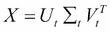*

*这里，*U[t]*(*V d*)是投射到新潜在空间中的具有 *d* 维的单词的矩阵，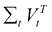 ( * d * *N* )是变换到子空间中的文档的转置矩阵，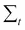 ( * d * *d* )是具有奇异值的对角矩阵。查询向量本身通过以下方式被投影到潜在空间中:*

*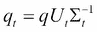*

*现在，*V[t]的每一行所代表的每一个文档都可以使用余弦相似度与*q[t]进行比较。请注意，潜在空间上的文档的真实数学表示由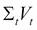给出(而不是*V[t]t*),因为奇异值是空间轴分量的比例因子，并且必须将它们考虑在内。所以这个矩阵要和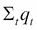比较。尽管如此，它通常会计算出*V[t]和*q[t]之间的相似度，而在实践中，哪种方法返回最好的结果还是未知的。*****

### Doc2Vec (word2vec)

这个方法将每个单词 *j* 、*w[j]表示为一个向量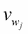但是独立于它出现的文档 *d [ i ]* 。Doc2Vec 是由 Mikolov 等人最初提出的 word2vec 算法的扩展，它采用神经元网络和反向传播来生成单词(和文档)向量。由于神经元网络(尤其是深度学习)在许多机器学习应用中的重要性日益增加，我们决定在这里包括这种相当先进的方法的主要概念和公式，以向您介绍一个在各个领域的机器学习的未来将变得极其重要的主题。下面的描述是根据荣(2014)和勒和米科洛夫(2014)的论文，符号也反映了目前文献中使用的名称。*

### word 2 vec–连续的单词包和跳格结构

词汇表 *V* 中的每个单词 *j* 都是用一个长度为 *|V|* 的向量来表示的，有二进制条目 *x [j] =(x [1j] ，…，x [Vj] )* ，这里只有*x[jj]= 1*；否则， *0* 。word2vec 方法训练一个单(隐藏)层的 *N* 个神经元(权重)，在两个不同的网络架构之间进行选择(如下图所示)。注意，两种架构都只有一层 *N* 个神经元或权重， *h* 。这意味着该方法必须被认为是*浅层*学习而非深层学习，这通常是指具有许多隐藏层的网络。 **连续单词包** ( **CBOW** )方法(显示在下图的右侧)使用一组 *C* 单词作为称为*上下文*的输入来训练模型，试图预测与输入文本相邻出现的单词(目标)。反向方法称为 **Skip-gram** 、，其中输入是目标单词，网络被训练来预测上下文集(显示在下图的左侧)。注意 *C* 被称为窗口参数，它设置距离目标单词多远选择上下文单词:

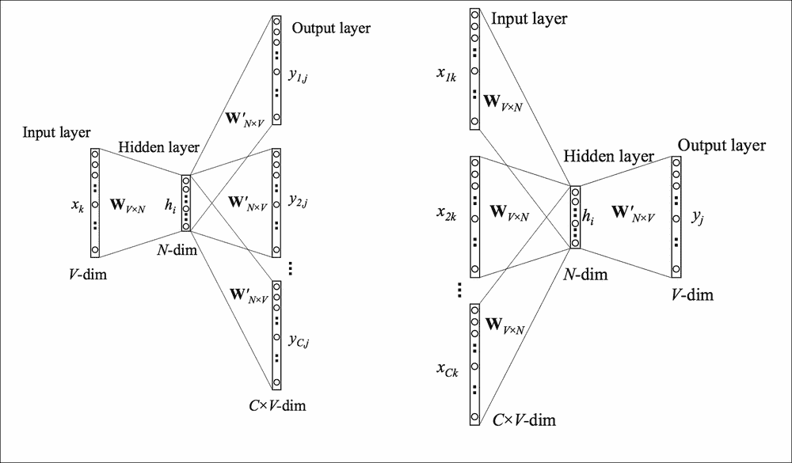

word2vec 算法的 Skip-gram(左)和 CBOW(右)结构；图取自 X 荣(2015)解释的 word2vec 参数学习

在这两种情况下，矩阵 *W* 将输入向量转换到隐藏层，并且*W’*从隐藏层转换到输出层 *y* ，在输出层评估目标(或上下文)。在训练阶段，计算与真实目标(或背景)的误差，并用于计算随机梯度下降，以更新矩阵 *W* 和*W’*。我们将在下一节中给出 CBOW 方法的数学描述。请注意，跳格方程是相似的，我们将参考荣(2015)的论文了解更多细节。

### CBOW 模型的数学描述

从输入层开始，通过计算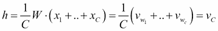可以得到隐藏层 *h* ，其中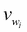是长度为 *N* 的向量，代表隐藏层上的单词*w[I]T22*w[C]是 *C* 上下文向量的平均值。选择一个目标词*W[j]，输出层的得分*u[j]通过将向量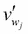(*W’*的第 j 列)乘以 *h* 得到:****

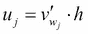

这不是输出层上的最终值y[j]因为我们想要评估后验条件概率，以使目标词*w[j]给出由 **softmax** 公式表示的上下文 *C* :*

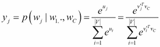

现在的训练目标是对词汇表中的所有单词最大化这个概率，相当于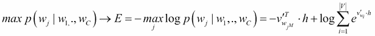，其中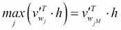和索引 *j ^( M )* 表示*W’*的向量，其中乘积最大，也就是最可能的目标单词。

然后通过计算 *E* 相对于 *W (w [ij]* )和*W’(W’[ij’]*)项的导数得到随机梯度下降方程。每个输出目标字*w[j]的最终等式为:*

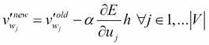

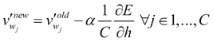其中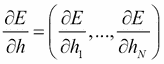和 *a* 是梯度下降的学习率。导数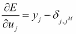表示网络相对于真实目标单词的误差，从而误差被反向传播到系统上，该系统可以迭代学习。注意，向量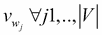是用于执行语义操作的常用单词表示。

有关更多详细信息，请参见荣(2015)的论文。

### Doc2Vec 扩展

正如 Le 和 Mikolov (2014)所解释的，Doc2Vec 是 word2vec 方法的自然扩展，其中文档被视为附加的单词向量。所以在 CBOW 架构的情况下，隐藏层向量 *h* 只是上下文向量和文档向量*d[I]的平均值:*


这个架构如下图所示，之所以称之为 **分布式内存模型** ( **DM** )是因为文档*d[I]vector 只是记住了上下文单词没有表示的文档的信息。向量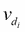与从文档*d[I]中采样的所有上下文单词共享，但是矩阵 *W* (和*W’*)对于所有文档是相同的:**

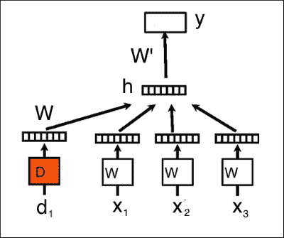

具有三个单词的上下文(窗口=3)的分布式存储器模型示例；图取自 Le 和 Mikolov (2014)的句子和文档的分布式表示

另一个提出的架构叫做 **分布式单词包** ( **DBOW** )，它在输入层只考虑一个文档向量，在输出层只考虑从文档中采样的一组上下文单词。已经证明 DM 架构比 DBOW 性能更好，因此它是`gensim`库实现中的默认模型。建议读者阅读 Le 和 Mikolov (2014)的论文以了解更多详细信息。

### 电影评论查询示例

为了展示前面讨论的三种信息检索方法，我们使用了由庞博和莉莲·李提供的*极性数据集 v2.0* 和*池中的 27886 个未处理的 html 文件*(位于 http://www.cs.cornell.edu/people/pabo/movie-review-data/[)中的 IMBD 电影评论(数据集和代码也存储在作者的 GitHub 帐户中，网址为](http://www.cs.cornell.edu/people/pabo/movie-review-data/)[)https://GitHub . com/ai 2010/machine _ learning _ for _ the _ web/tree/master/chapter _ chapter _ 中从网站(名为`polarity_html.zip`)下载并解压`movie.zip`文件，这样就创建了`movie`文件夹，里面有所有网页电影评论(大约 2000 个文件)。首先，我们需要从文件中准备数据:](https://github.com/ai2010/machine_learning_for_the_web/tree/master/chapter_4/)

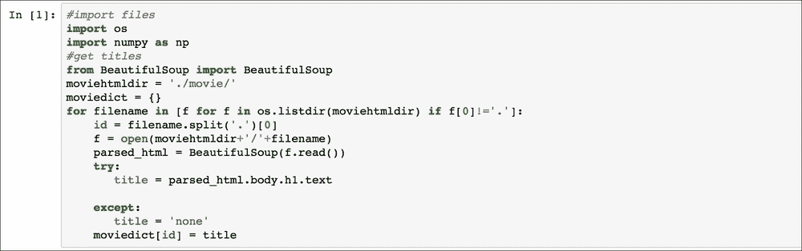

这次我们使用 **BeautifulSoup** 来解析来自每个 HTML 网页的电影标题并创建一个字典`moviedict`。`polarity dataset v2.0.tar.gz`包含一个文件夹`review_polarity`，它位于`txt_sentoken/`文件夹中，将正面和负面评论分成两个独立的子文件夹(正面和负面)。这些文件使用以下代码进行预处理:

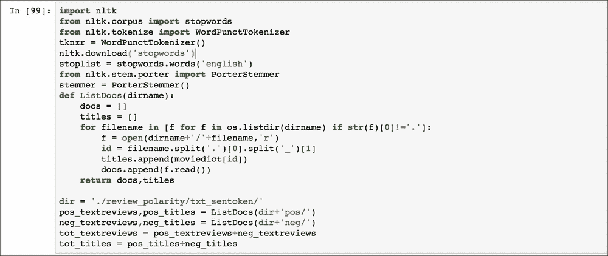

现在所有的 2000 条评论都存储在`tot_textreviews`列表中，相应的标题存储在`tot_titles`中。TF-IDF 模型可以使用`sklearn`进行训练:

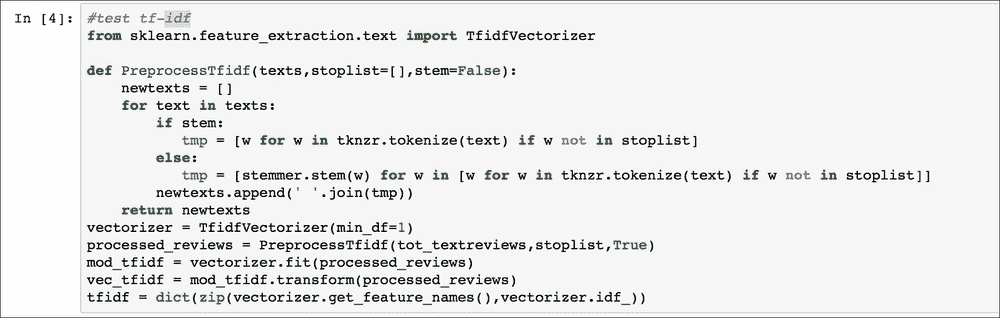

在执行完`PreprocessTfidf`函数后，对每个文档应用所有的预处理技术(删除停用词、分词和词干)。同样，我们可以使用`gensim`库训练 LSA 模型，指定 10 个潜在维度:

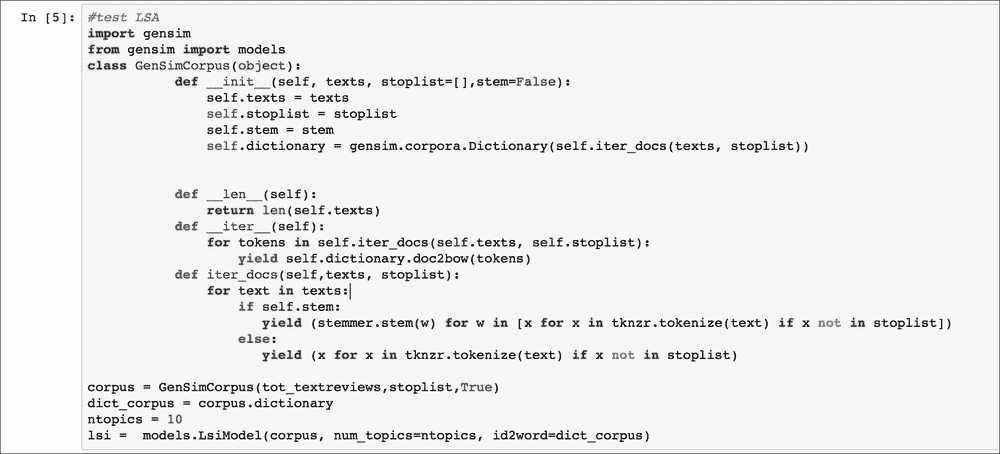

注意，`GenSimCorpus`函数只是用通常的技术预处理文档，并将它们转换成 gensim LSA 实现可以读取的格式。从`lsi`对象中，可以获得将查询转换到潜在空间所需的矩阵 *U* 、 *V* 和 S:

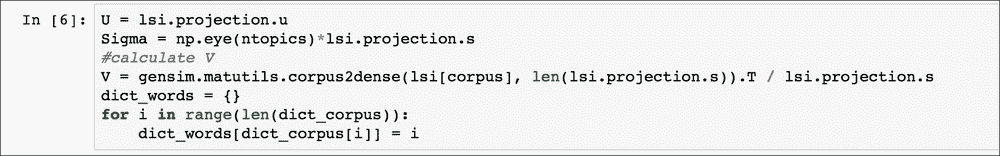

此外，已经计算了单词`dict_words`的索引字典，以将查询单词转换成`dict_corpus`中的相应索引单词。

最后一个训练的模型是 Doc2Vec。首先，我们以 gensim Doc2Vec 实现可以处理的格式准备数据:

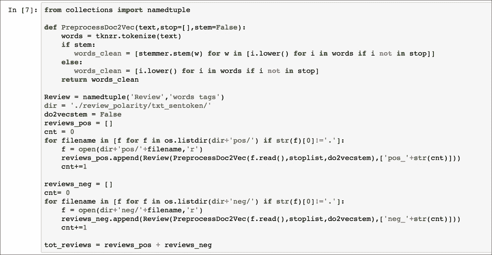

每个评论都被放在一个`namedtuple`对象中，该对象包含由`PreprocessDoc2Vec`函数预处理的单词(删除停用词并执行标记化)和作为文件名的标签。注意，我们选择不应用词干分析器，因为没有它，结果通常会更好(读者可以通过应用词干分析器，将布尔标志`doc2vecstem`设置为`True`来测试结果)。Doc2Vec 训练最后由以下代码执行:

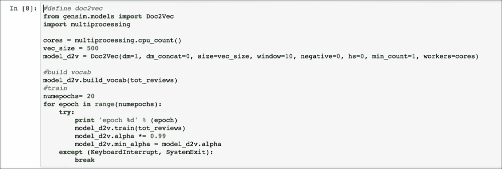

我们设置 DM 架构(`dm` =1)，500 维的隐藏层(`size`，10 个单词的窗口大小，所有至少出现一次的单词都已经被模型考虑进去(`min_count` =1)。其他参数与效率优化方法有关(`negative`用于负采样，`hs`用于分层 softmax)。训练持续`20`个时代，学习率等于`0.99`。

我们现在可以验证每个方法返回哪些结果，定义一个查询来检索与科幻电影相关的所有 web 文档，即通常由以下单词列表描述的电影:

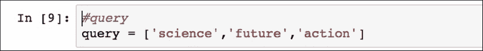

TF-IDF 方法使用以下脚本返回五个最相似的网页:

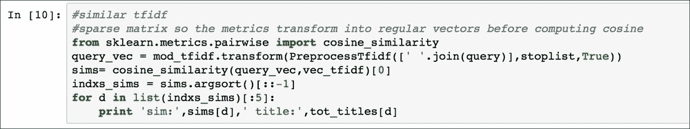

注意，该模型使用稀疏矩阵格式来存储数据，因此`cosine_similarity`函数将向量转换为常规向量。然后它计算相似度。以类似的方式，查询被转换成 LSA 术语中的*q[k]并打印出五个最相似的网页:*

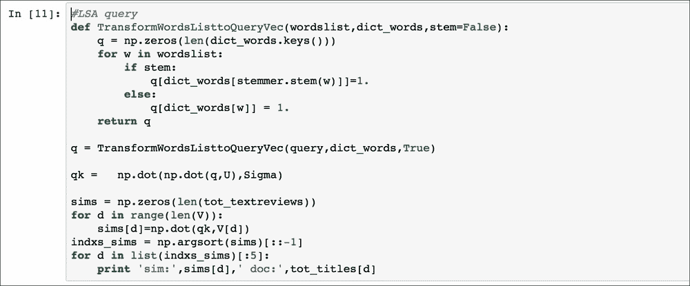

最后，`doc2vec`模型使用`infer_vector`函数将查询列表转换为向量，最相似的评论由`most_similar`函数返回:

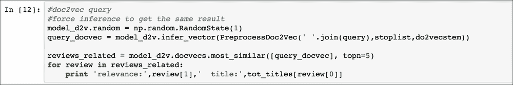

请注意，模型的`random`参数需要设置为固定值，以便在使用优化方法(负采样或分层 softmax)时返回确定性结果。结果如下:

*   **TF-IDF**: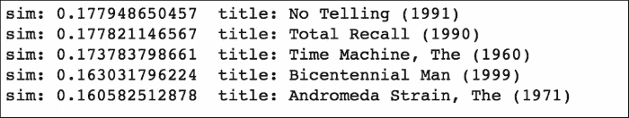
*   **:**
*   **Doc2vec:**

**这三种方法都显示与查询相关的电影。有趣的是，TF-IDF 比更先进的 LSA 和 Doc2Vec 算法执行得更好，因为与仅显示一部电影(*No tell*)不相关的 TF-IDF 结果相比, *In the Heat of the Night* 、 *Pokemon* 、 *Rocky Horror Picture Show* 和 *Wild Things* 与查询不相关。电影*查理的天使*和*蝙蝠侠&罗宾*都是动作片，所以大多和单个查询词*动作*有关。Doc2Vec 返回最差的结果主要是因为训练数据集太小，无法学习良好的向量表示(例如，Google 发布了一个基于数十亿文档或更多文档的 word2vec 训练数据集)。网站[http://www.cs.cornell.edu/people/pabo/movie-review-data/](http://www.cs.cornell.edu/people/pabo/movie-review-data/)提供了更大的数据集，所以读者可以尝试用更多的数据训练 Doc2Vec 作为练习。**

**<title>Postprocessing information</title>

# 后处理信息

一旦从网上收集了网页，自然语言处理算法就能够提取相关信息用于不同的商业目的，除了建立网络搜索引擎。我们将在这里讨论能够提取文档集合上的主要主题(潜在狄利克雷分析)和提取每个网页的情感或观点(观点挖掘技术)的算法。

## 潜狄利克雷分配

**潜在狄利克雷分配** ( **LDA** ) 属于生成模型范畴的自然语言处理算法。该技术基于对一些变量的观察，这些变量可以用其他带下划线的未观察到的变量来解释，这就是观察到的数据相似或不同的原因。

例如，考虑其中单词是观察值的文本文档。每个文档可以是主题(未观察变量)混合的结果，每个单词指的是一个特定的主题。

例如，考虑描述两家公司的以下两个文档:

*   通过视觉识别改变人们搜索时尚物品、分享和购买时尚的方式，TRUELIFE 将成为搜索终极趋势的最佳途径…
*   **doc2**:cinema 4 you enabling any venue is a cinema 是一家新的数字电影媒体发行公司，目前处于测试阶段。它将视频点播和广播中使用的技术应用于...

LDA 是自动发现这些文档包含的潜在主题的一种方式。例如，给定这些文档并要求两个主题，LDA 可能会返回与每个主题相关联的以下单词:

*   **话题一**:人物视频时尚媒体……
*   **话题 2** :影院技术识别广播…

因此，第二个主题可以标为*技术*，第一个主题可以标为*商业*。

然后，文档被表示为主题的混合物，这些主题以一定的概率吐出单词:

*   **文档 1** :主题 1 42%，主题 2 64%
*   **文档 2** :主题 1 21%，主题 2 79%

文档的这种表示在各种应用中是有用的，例如不同组中的页面聚类，或者提取页面集合的主要共同主题。这种算法背后的数学模型将在下一段中解释。

### 型号

文档被表示为潜在主题的随机混合，其中每个主题的特征是单词的分布。LDA 对由 *M* 个文档组成的语料库进行如下处理， *d=(d [1] ，…，d [M] )* ，每个 *i* 包含*N[I]个单词。如果 *V* 是词汇表的长度，那么文档 *i* 的一个单词就用长度为 *V* 的向量*w[I]来表示，其中只有一个元素*w[I]V[V]= 1*，其余为 *0* :**


潜在维度(主题)的数量是 *K* ，对于每个文档，是与每个单词*w[I]相关的主题的向量，其中*z[I]是除元素 *j、z[I]j 之外的 *0 的*的向量***

b 表示 *K* *V* 矩阵，其中 *b [ij]* 表示词汇表中的每个单词 *j* 取自题目 *i* : 的概率。

所以，b 的每一行 *i* 是话题 *i* 的词分布，而每一列 *j* 是话题 *j* 的词分布。使用这些定义，该过程描述如下:

1.  从选定的分布(通常是泊松分布)中，画出每个文档的长度*N[I]。*
2.  对于每个文档*d[I]，绘制主题分布 q*I，作为狄利克雷分布 *Dir(a)* ，其中和 *a* 为长度为 *K* 使得的参数向量。**
3.  对于每个文档*d[I]，对于每个单词 *n* ，从多项式中抽取一个题目。*
4.  对于每个文档*d[I]对于每个单词 *n* 对于每个主题*z[n]从 b 的行*z[n]*给出的多项式中抽取一个单词 *w [n]*** 

该算法的目标是最大化每个文档的后验概率:


应用条件概率定义，分子变成如下:


因此，由主题向量 *z* 和单词概率矩阵 b 给出的文档 *i* 的概率可以表示为单个单词概率的乘积:


考虑到 *z [n]* 是一个只有一个分量 *j* 不同于 *0* ，*z^j[n]= 1*，那么。将这些表达式代入(2):


简单地通过对 q *[i]* 的积分和对 *z* 的求和来获得(1)的分母。主题分布 *q [i] 那些超出了本书的范围。*

参数 *a* 被称为浓度参数，它表示在可能值上的分布程度。浓度参数 *1* (或 *k* ，根据主题建模文献中使用的定义，是狄利克雷分布的维度)导致所有概率集的概率相等。同时，在浓度参数趋于零的极限中，只有几乎全部质量集中在它们的一个成分上的分布才是可能的(词在不同主题之间较少共享，并且它们集中在几个主题上)。

例如，100，000 维的分类分布具有 100，000 个单词的词汇表，即使一个主题可能由几百个单词表示。因此，concentration 参数的典型值在 0.01 和 0.001 之间，或者如果词汇表的大小是数百万个单词或更大，则更低。

根据 L. Li 和 Y. Zhang 的论文*使用潜在狄利克雷分配进行文本分类的实证研究*，LDA 可以用作文本建模的有效降维方法。然而，即使该方法在各种应用中表现良好，仍有一些问题需要考虑。模型的初始化是随机的，这意味着每次运行都会导致不同的结果。还有，浓度参数的选择很重要，但是没有标准的方法来选择。

### 例子

再次考虑在*电影评论查询示例*部分中已经预处理的电影评论的网页`textreviews`，并且应用 LDA 来测试是否可以收集不同主题的评论。和往常一样，下面的代码可以在`postprocessing.ipynb`的[https://github . com/ai 2010/machine _ learning _ for _ the _ web/tree/master/chapter _ 4/](https://github.com/ai2010/machine_learning_for_the_web/tree/master/chapter_4/)中找到:


像往常一样，我们已经用记号对每个文档进行了转换(使用了不同的记号赋予器),停用词已经被删除。为了获得更好的结果，我们过滤掉了最常用的单词(如`movie`和`film`)，这些单词不会给页面增加任何信息。我们忽略所有出现次数超过 1000 次或观察次数少于三次的单词:


现在我们可以用 10 个话题训练 LDA 模型(`passes`是训练通过语料库的次数):


代码返回以下 10 个最有可能与每个主题相关联的单词:


虽然并不是所有的话题都有一个容易的解读，但是我们可以明确的看到，话题 2 是和`disney`、`mulan`(迪士尼电影)、`love`、`life`这几个词联系在一起的，是一个关于动画电影的话题，话题 6 是和`action`、`alien`、`bad`这几个词联系在一起的，而`planet`是和奇幻科幻电影有关的。事实上，我们可以像这样查询最可能主题等于 6 的所有电影:


这将返回:

```
Rock Star (2001)
Star Wars: Episode I - The Phantom Menace (1999)
Zoolander (2001)
Star Wars: Episode I - The Phantom Menace (1999)
Matrix, The (1999)
Volcano (1997)
Return of the Jedi (1983)
Daylight (1996)
Blues Brothers 2000 (1998)
Alien&#179; (1992)
Fallen (1998)
Planet of the Apes (2001)

```

这些标题中的大多数显然是科幻和奇幻电影，因此 LDA 算法正确地对它们进行了聚类。

注意，利用主题空间中的文档表示(`lda_lfq[corpus]`)，可以应用聚类算法(参见[第 2 章](ch02.html "Chapter 2. Unsupervised Machine Learning")、*机器学习技术-无监督学习*)，但这留给读者作为练习。还要注意，每次运行 LDA 算法时，由于模型的随机初始化，可能会导致不同的结果(也就是说，如果您的结果与本段中显示的结果不同，这是正常的)。

## 意见挖掘(情感分析)

观点挖掘或情感分析是对文本的研究领域，用于提取作者的观点，通常可以是积极的或消极的(或中性的)。这种分析特别有用，尤其是在市场营销中，可以发现公众对产品或服务的看法。标准的方法是考虑情绪(或极性)，消极的或积极的，作为分类问题的目标。文档的数据集将具有与词汇表中包含的不同单词的数量一样多的特征，并且通常使用诸如 SVM 和朴素贝叶斯之类的分类算法。作为一个例子，我们考虑已经用于测试 LDA 和已经被标记(正面或负面)的信息检索模型的 2，000 个电影评论。本段中讨论的所有代码都可以在位于[https://github . com/ai 2010/machine _ learning _ for _ the _ web/tree/master/chapter _ 4/](https://github.com/ai2010/machine_learning_for_the_web/tree/master/chapter_4/)的`postprocessing.ipynb` IPython 笔记本上获得。和以前一样，我们导入数据并进行预处理:


然后，以`nltk`库可以处理的方式将数据分成训练集(80%)和测试集(20%)(每个元组的列表或具有包含文档单词和标签的字典的元组列表):


现在我们可以使用`nltk`库训练和测试一个`NaiveBayesClassifier`(多项式)并检查错误:


代码返回 28.25%的错误，但是可以通过计算每个文档中的最佳二元模型来改善结果。二元模型定义为一对连续的单词，使用*X²测试来寻找不是偶然出现而是出现频率较大的二元模型。这些特定的二元模型包含文本的相关信息，在自然语言处理术语中称为搭配。例如，给定两个词的二元模型 **w1** 和 **w2** ，在我们总共有 N 个可能二元模型的语料库中，在零假设下 **w1** 和 **w2** 彼此独立出现，我们可以通过收集二元模型( **w1** 、 **w2** )和其余可能二元模型的出现来填充一个二维矩阵 *O**

|   | 

w1

 | 

不是 w1

 |
| --- | --- | --- |
| **w2** | 10 | 901 |
| **不是 w2** | 345 | 1,111,111 |

然后由给出 *X ^( 2 )* 度量，其中 *O [ ij ]* 是由单词 *(i，j)* 给出的二元模型的出现次数(因此 *O [ 00 ] =10* 等等)，并且 *E [ ij ]* 是二元模型的预期频率*直觉上， *X ^( 2 )* 越高，观察到的频率 *O [ ij ]* 与预期均值 *E [ ij ]* 相差越多，因此零假设很可能被拒绝。二元模型是一个很好的搭配，它比遵循预期方法的二元模型包含更多的信息。可以看出， *X ^( 2 )* 可以计算为 f 检验(也称为**均方列联系数**)乘以二元组出现总数 *N* ，如下所示:*


关于搭配和*X²方法的更多信息可以在 C. D. Manning 和 H. Schuetze (1999)的*统计自然语言处理基础*中找到。还要注意的是，*X²作为信息增益度量(这里不讨论)，可以被认为是[第 3 章](ch03.html "Chapter 3. Supervised Machine Learning")、*监督机器学习*中定义的特征选择方法。使用`nltk`库，我们可以使用*X²度量来选择每个文档的 500 个最佳二元模型，然后再次训练朴素贝叶斯分类器，如下所示:***


这一次的错误率是 20%，低于正常方法。也可以使用 *X ²* 测试从整个语料库中提取最有信息量的单词。我们可以测量单个单词的频率与正面(或负面)文档的频率相差多少，以对其重要性进行评分(例如，如果单词`great`在正面评论中具有高的 *X ²* 值，但在负面评论中具有低的值，则意味着该单词给出了评论是正面的信息)。通过计算 T76 语料库中的 10，000 个最重要的单词中的每一个、整个语料库中的总频率以及正负子集上的频率，可以提取出语料库中的 10，000 个最重要的单词:


现在我们可以简单地再次训练一个朴素贝叶斯分类器，只使用每个文档的`bestwords`集中的单词:


错误率为 12.75%，考虑到相对较小的数据集，是非常低的。请注意，为了获得更可靠的结果，应该应用交叉验证方法(参见[第 3 章](ch03.html "Chapter 3. Supervised Machine Learning")、*监督机器学习*)，但这是作为练习提供给读者的。还要注意，Doc2Vec 向量(在*电影评论查询示例*部分中计算)可以用于训练分类器。假设 Doc2Vec 向量已经被训练并存储在`model_d2v.doc2vec`对象中，我们通常将数据分成训练数据集(80%)和测试集(20%):


然后我们可以训练一个 SVM 分类器(**径向基函数核** ( **RBF** 核)或逻辑回归模型:


逻辑回归和 SVM 给出了非常低的精度，分别为`0.5172`和`0.5225`。这主要是由于训练数据集的规模较小，不允许我们训练有大量参数要训练的算法，如神经元网络。


# 摘要

在本章中，我们讨论了用于管理 web 数据的最常见和最先进的算法，并使用一系列 Python 库实现了这些算法。现在，您应该对 web 挖掘领域面临的挑战有了清晰的理解，并且应该能够用 Python 处理其中的一些问题。在下一章，我们将讨论商业环境中最重要的推荐系统算法。**