# 五、推荐系统

每当用户面对大量他们无法在合理的时间框架内评估的产品或服务时，推荐系统就会找到其自然的应用。这些引擎是电子商务业务的重要组成部分，因为它们帮助 web 上的客户在与最终用户无关的大量候选商品中决定购买或选择合适的商品。典型的例子是亚马逊、网飞、易贝和 Google Play 商店，它们使用用户收集的历史数据向每个用户推荐他们可能喜欢购买的商品。在过去的 20 年里，已经开发出了不同的技术，我们将把重点放在迄今为止行业中使用的最重要的(和使用的)方法上，详细说明这些方法各自的优点和缺点。推荐系统分为**基于内容的过滤** ( **CBF** )和**协同过滤** ( **CF** )技术和其他不同的方法(关联规则、对数似然法和混合方法)将与评估其准确性的不同方法一起讨论。方法将在 MovieLens 数据库(来自[http://grouplens.org/datasets/movielens/](http://grouplens.org/datasets/movielens/))上进行测试，该数据库由 943 名用户对 1682 部电影的 100000 个电影评级(1 到 5 个值)组成。每个用户至少有 20 个评级，每部电影都有一个它所属的流派列表。像往常一样，本章中显示的所有代码都可以在`rec_sys_methods.ipynb`文件中的[https://github . com/ai 2010/machine _ learning _ for _ the _ web/tree/master/chapter _ 5](https://github.com/ai2010/machine_learning_for_the_web/tree/master/chapter_5)中找到。

我们将首先介绍用于排列推荐系统所采用的数据集的主矩阵，以及在开始讨论以下部分中的算法之前通常使用的度量标准。

# 效用矩阵

推荐系统中使用的数据分为两类:用户和项目。每个用户喜欢某些物品，评分值 *r [ij]* (从 1 到 5)是与每个用户 *i* 和物品 *j* 相关联的数据，代表用户对物品的欣赏程度。这些评分值被收集在称为效用矩阵 *R* 的矩阵中，其中每一行 *i* 代表用户 *i* 的评分项目列表，而每一列 *j* 列出所有对项目 *j* 进行评分的用户。在我们的例子中，数据文件夹`ml-100k`包含一个名为`u.data`的文件(还有一个名为`u.item`的电影标题列表)，它已经被以下脚本转换成一个熊猫数据帧(并保存到一个`csv, utilitymatrix.csv`):

前两行的输出如下:

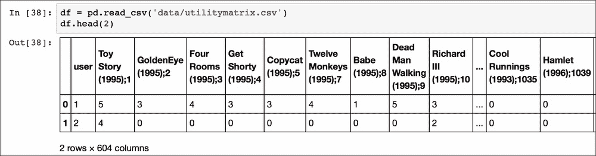

除了第一个列名(即用户 id)之外，每个列名都定义了电影名称和电影在 MovieLens 数据库中的 ID(用分号分隔)。`0`值代表缺失的值，我们希望有大量的缺失值，因为用户评价的电影远远少于 1600 部。请注意，评级低于 50 的电影已从效用矩阵中删除，因此列数为 604 (603 部评级超过 50 次的电影)。推荐系统的目标是预测这些值，但是为了使一些技术正常工作，我们有必要首先设置这些值(插补)。通常使用两种插补方法:每个用户的平均评分或每个项目的平均评分，这两种方法都在以下函数中实现:

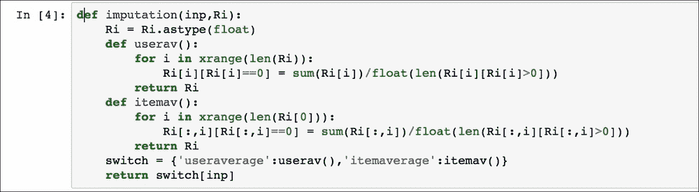

本章实现的很多算法都会调用这个函数，所以我们决定在这里讨论一下，作为以后使用的参考。此外，在这一章中，效用矩阵 *R* 将具有维度 *N* × *M* 以及 *N* 个用户和 *M* 个项目。由于不同算法反复使用相似性度量，我们将在下文中定义最常用的定义。

# 相似性度量

为了计算两个不同的向量 *x* 和 *y* 之间的相似性 *s* ，这两个向量可以是用户(效用矩阵的行)或项目(效用矩阵的列)，通常使用两个度量:

*   余弦相似度: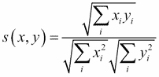
*   皮尔逊相关: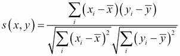，其中 *x* 和 *y* 是两个向量的平均值。

注意如果平均值为 0，这两个度量是一致的。我们现在可以开始讨论不同的算法，从 CF 类别开始。以下`sim()`函数将用于评估两个向量之间的相似性:

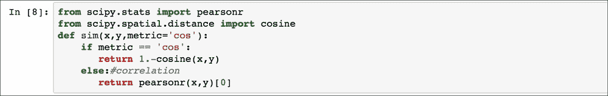

`SciPy`库已经被用来计算两个相似性(注意余弦 scipy 定义与之前定义的相反，所以值从 1 中减去)。

# 协同过滤方法

这类方法是基于这样的想法:任何用户都会喜欢与他们相似的其他用户所欣赏的项目。简而言之，基本假设是，与用户 *B* 相似的用户 *A* 可能会像 *B* 那样对一个项目进行评级，而不是以另一种方式。在实践中，通过比较不同用户的喜好并使用最相似的用户喜好(基于记忆)推断给定用户的未来评级，或者通过从用户喜欢的事物中提取一些评级模式(基于模型)并尝试按照这些模式预测未来评级，来实现这一概念。所有这些方法都需要大量的数据才能工作，因为给定用户的推荐依赖于在数据中可以找到多少相似的用户。这个问题被称为**冷启动**并且在文献中被很好地研究，文献通常建议使用 CF 和 CBF 之间的某种混合方法来克服这个问题。在我们的 MovieLens 数据库示例中，我们假设我们有足够的数据来避免冷启动问题。CF 算法的其他常见问题是可扩展性，因为计算随着用户和产品数量的增加而增加(可能需要一些并行化技术)，以及效用矩阵的稀疏性，因为任何用户通常评价的项目数量很少(插补通常是处理问题的一种尝试)。

## 基于记忆的协同过滤

这个子类使用效用矩阵来计算用户或项目之间的相似性。这些方法受到可扩展性和冷启动问题的困扰，但是当它们被应用于一个或大或小的效用矩阵时，它们目前被用在许多商业系统中。我们将在下文中讨论基于用户的协同过滤和网络化协同过滤。

### 基于用户的协同过滤

方法使用一种`k-NN`方法(参见[第 3 章](ch03.html "Chapter 3. Supervised Machine Learning")、*监督机器学习*)来查找其过去评分与所选用户的评分相似的用户，以便可以将他们的评分合并为一个加权平均值，从而返回当前用户缺失的评分。

算法如下:

对于任何给定的用户 *i* 和尚未评级的项目 *j* :

1.  使用相似性度量 *s* 找到具有评级 *j* 的最相似用户 *K* 。
2.  计算尚未被 *i* 评价的每个项目 *j* 的预测评价，作为用户 *K* :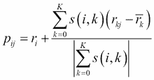评价的加权平均值

这里是用户 *i* 和 *k* 的平均评分，以补偿主观判断(一些用户慷慨，一些用户挑剔) *s(i* ， *k)* 是相似性度量，如前一段所见。请注意，我们甚至可以通过每个用户的评分分布进行标准化，以比较更相似的评分:

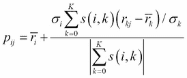

这里σ [i] 和σ [k] 是用户 *i* 和 *k* 的评分标准差。

该算法具有作为输入参数的邻居数量 *K* ，但是在大多数应用中，通常在`20`和`50`之间的值就足够了。已经发现皮尔逊相关比余弦相似度返回更好的结果，这可能是因为减去用户评级意味着相关公式使用户更具可比性。以下代码用于预测每个用户的缺失评级。

`u_vec`代表用户评价值，函数`FindKNeighbours`从这些值中找到最相似的其他用户 *K* 。`CalcRating`仅使用之前讨论的公式计算预测评级(没有扩展校正)。注意，在效用矩阵如此稀疏以至于没有找到邻居的情况下，预测用户的平均评级。预测评级可能会超出`5`或低于`1`，因此在这种情况下，预测评级会分别设置为`5`或`1`。

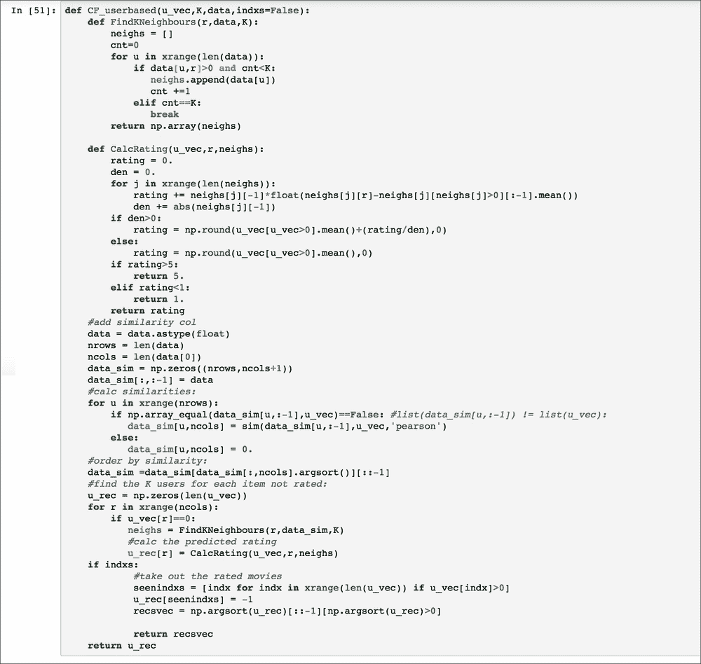

### 基于项目的协同过滤

这种方法在概念上与基于用户的 CF 相同，只是相似性是根据项目而不是用户来计算的。由于大多数时候用户的数量可能会比项目的数量大得多，这种方法提供了一种更具可扩展性的推荐系统，因为项目的相似性可以预先计算，并且当新用户到来时它们不会改变太多(如果用户数量 *N* 非常大)。

每个用户 *i* 和项目 *j* 的算法如下:

1.  使用 *i* 已经评定的相似性度量 *s* 找到 *K* 最相似的项目。
2.  计算预测评分作为 *K* 项: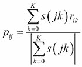评分的加权平均值

注意相似性度量可能具有负值，因此我们需要将总和限制为只有正的相似性，以便具有有意义的(即正的) *P [ij]* (如果我们只对要推荐的最佳项目而不是评级感兴趣，项目的相对顺序无论如何都是正确的)。即使在这种情况下，在大多数应用中，`20`和`50`之间的 *K* 值通常是合适的。

该算法是使用类实现的，如下所示:

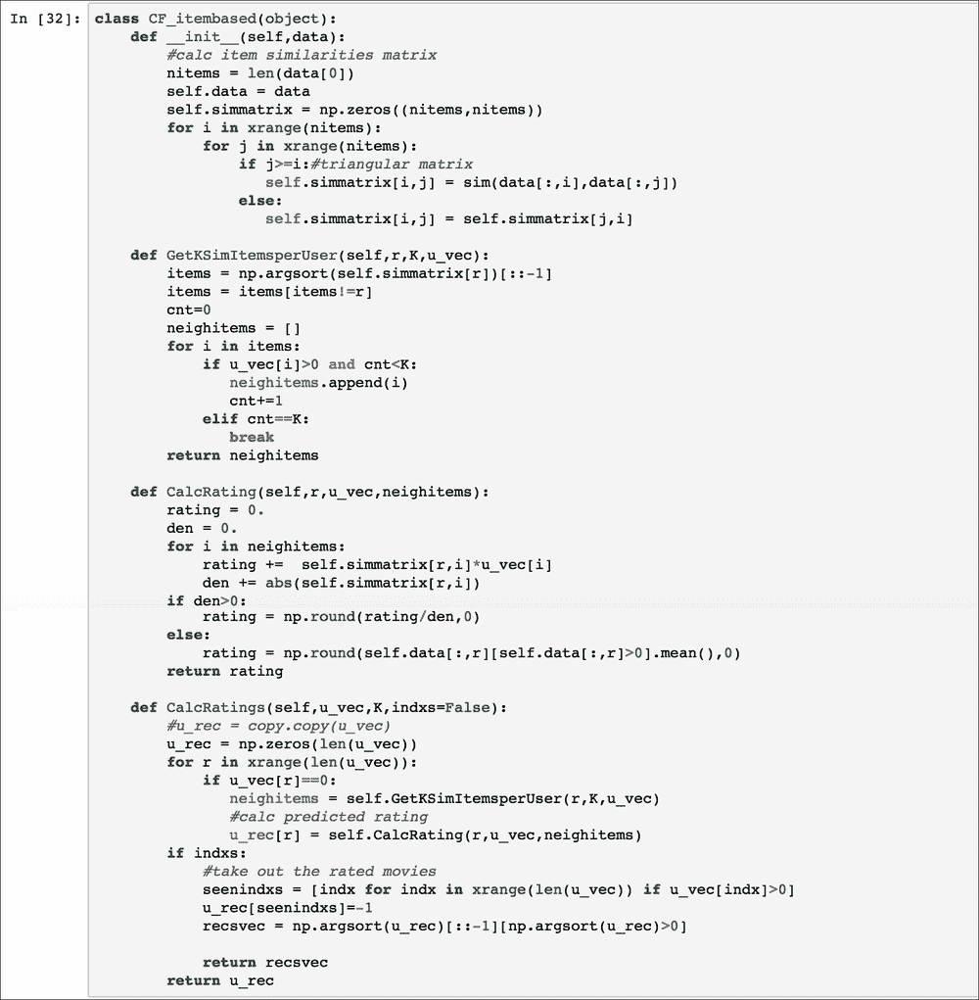

类`CF_itembased`的构造器计算项目相似性矩阵`simmatrix` 以在任何时候使用，我们希望通过函数`CalcRatings`为用户评估缺失评分。函数`GetKSimItemsperUser`找到 *K* :与所选用户(由`u_vec`给出)最相似的用户，并且`CalcRating`仅实现前面讨论的加权平均评级计算。请注意，如果找不到邻居，等级将设置为平均值或该项目的等级。

### 最简单的基于项目的协同过滤——slope one

可以使用一种非常简单但有效的方法来代替使用前面讨论的度量来计算相似性。我们可以计算一个矩阵 *D* ，其中每个条目*D[ij]是项目 *i* 和 *j* 的评级之间的平均差:*

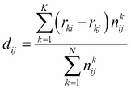

这里，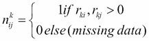是一个变量，如果用户 *k* 对 *i* 和 *j* 项目都进行了评价，那么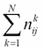就是对 *i* 和 *j* 项目都进行了评价的用户数。

那么该算法如在*基于项目的协同过滤*部分中所解释的。对于每个用户 *i* 和项目 *j* :

1.  找出与 *j* 、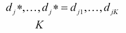差异最小的 *K* 项(`*`表示可能的索引值，但为了简单起见，我们将其从`1`重新标记为 *K* )。
2.  将预测评分计算为加权平均值: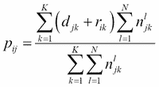

虽然这种算法比其他 CF 算法简单得多，但它通常与它们的精度相当，计算成本较低，并且易于实现。该实现非常类似于用于基于项目的 CF 的类:

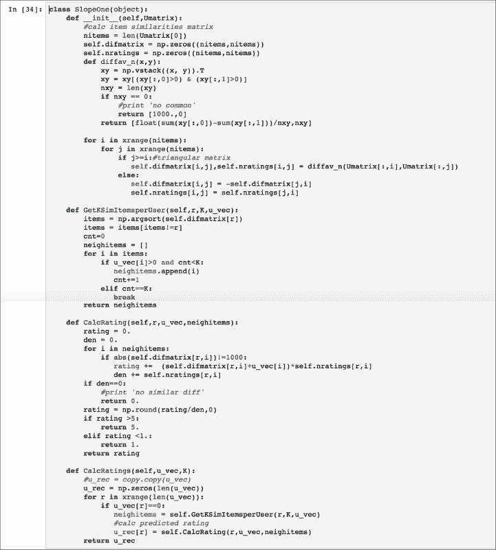

唯一的区别是矩阵:现在`difmatrix`用于计算项 *i* 、 *j* 之间的差异 *d(i* 、 *j)* ，如前所述，函数`GetKSimItemsperUser`现在寻找最小的`difmatrix`值来确定 *K* 最近邻居。因为有可能(尽管不太可能)两个项目没有被至少一个用户评级，`difmatrix`可以具有未定义的值，这些值被默认设置为`1000`。请注意，预测额定值也可能超过`5`或低于`1`，因此在这种情况下，预测额定值必须适当设置为`5`或`1`。

## 基于模型的协同过滤

这种类方法使用效用矩阵来生成模型，以提取用户如何对项目进行评级的模式。模式模型返回预测的评级，填充或近似原始矩阵(矩阵分解)。文献中已经研究了各种模型，我们将讨论特定的*矩阵分解*算法——奇异值分解 ( **SVD** ，也具有期望值最大化)、交替最小二乘 ( **ALS** )、随机梯度下降**(**SGD**，以及一般的**非负矩阵分解** ( 【T58**

### **备选最小二乘法(ALS)**

**这是分解矩阵 *R* 最简单的方法。每个用户和每个项目可以在维度为 K 的特征空间中表示，从而:**

****

**这里， *P N×K* 是用户在特征空间的新矩阵， *Q M×K* 是项目在同一空间的投影。因此问题被简化为最小化一个正则化的成本函数 *J* :**

**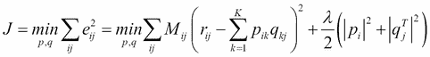**

**这里，λ是正则化参数，它有助于通过惩罚学习参数来避免过拟合，并确保向量 *p [i]* 和*[q]^T[j]*的幅度不会太大。矩阵条目 *Mc [ij]* 是检查用户 *i* 和项目 *j* 对是否实际评分所需的，所以 *Mc [ij]* 如果 *r [ij] > 0* 为`1`，否则为`0`。对于每个用户向量*p[I]和项目向量*q[J]设置 *J* 到`0`的导数，我们得到以下两个等式:****

**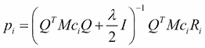****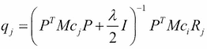**

**此处*R[I]和*Mc[I]指矩阵 *R* 和 *Mc* 的行 *i* 和*R[j]和*Mc[j]指交替固定矩阵 *P* 、 *Q* ，可以使用最小二乘法直接求解前面的方程，以下函数在 Python 中实现 ALS 算法:******

**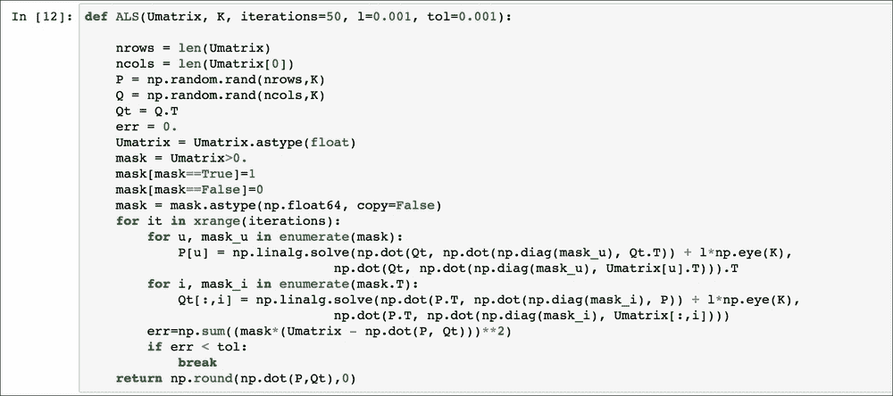**

**矩阵 *Mc* 被称为`mask`，变量`l`代表正则化参数λ，默认设置为`0.001`，最小二乘问题已经使用`Numpy`库的`linalg.solve`函数解决。这种方法通常不如**随机梯度下降** ( **SGD** )和**奇异值分解** ( **SVD** )(参见以下章节)精确，但它非常容易实现，并且易于并行化(因此它可以很快)。**

### **随机梯度下降法**

**这个方法也属于矩阵分解子类，因为它依赖于效用矩阵 *R* 的近似，如下所示:**

**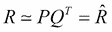**

**这里，矩阵 *P(N×K)* 和 *Q(M×K)* 表示在一个 *K* 维的潜在特征空间中的用户和项目。每个近似额定值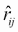可表示如下:**

**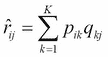**

**找到矩阵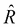，用 ALS 方法解决正则化平方误差的最小化问题 *e ^( 2 ) [ ij ]* (代价函数 *J* 如[第 3 章](ch03.html "Chapter 3. Supervised Machine Learning")，*监督机器学习*):**

**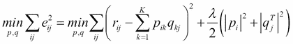**

**这个最小化问题是使用梯度下降法解决的(参见[第 3 章](ch03.html "Chapter 3. Supervised Machine Learning")、*监督机器学习*):**

**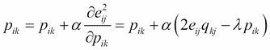****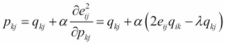**

**这里，α是学习率(参见[第三章](ch03.html "Chapter 3. Supervised Machine Learning")、*监督机器学习*、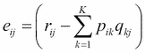)。该技术发现 *R* 在前面两个方程之间交替(固定*q[kj]并求解*P[ik]，反之亦然)直到收敛。SGD 通常比 SVD 更容易并行化(因此速度更快)(参见下一节),但在寻找良好的评级方面不太精确。以下脚本给出了该方法在 Python 中的实现:****

**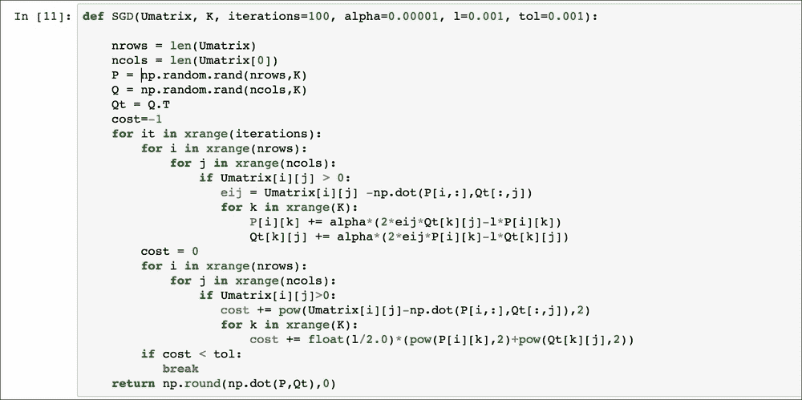**

**该 SGD 函数具有默认参数，即学习率 *α = 0.0001* ，正则化参数 *λ = l =0.001* ，最大迭代次数`1000`，收敛容差`tol = 0.001`。还要注意的是，计算中不考虑未评级的项目(`0`评级值)，因此使用该方法时不需要初始填充(插补)。**

### **非负矩阵分解(NMF)**

**这个是将矩阵 *R* 再次分解为两个矩阵*P*(*N*×*K*)和*Q*(*M*×*K*)(其中 *K* 是特征空间的一个维度)的一组方法，但是要求它们的元素一般的最小化问题如下:**

**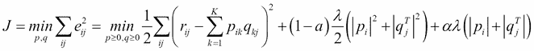**

**这里，α是定义使用哪个正则化项的参数(`0`平方、`1`套索正则化或它们的混合)，λ是正则化参数。已经开发了几种技术来解决这个问题，例如投影梯度、坐标下降和非负约束最小二乘法。讨论这些技术的细节已经超出了本书的范围，但是我们将使用在`sklearn NFM`中实现的坐标下降方法，该方法包含在以下函数中:**

**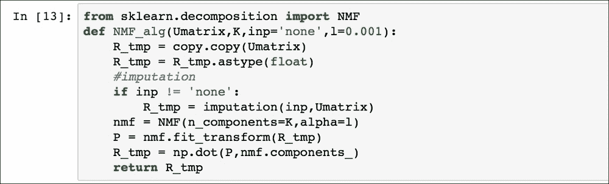**

**注意，可以在实际因式分解发生之前进行插补，函数`fit_transform`返回 *P* 矩阵，而 *Q ^T* 矩阵存储在`nmf.components_`对象中。默认情况下， *α* 值假定为`0`(平方正则化) *λ = l =0.01* 。由于效用矩阵具有正值(评级)，这类方法当然非常适合预测这些值。**

### **奇异值分解**

**我们已经在[第 2 章](ch02.html "Chapter 2. Unsupervised Machine Learning")、*无监督机器学习*中讨论了这种算法，作为一种降维技术，通过分解成矩阵 *U* 、【σ】、 *V* 来近似一个矩阵(更多技术细节，您应该阅读[第 2 章](ch02.html "Chapter 2. Unsupervised Machine Learning")、*无监督机器学习*中的相关章节)。在这种情况下，使用奇异值分解作为矩阵分解技术，但是需要一种插补方法来初步估计每个用户的缺失数据；通常，使用每个效用矩阵行(或列)的平均值或两者的组合(而不是保留零值)。除了直接将 SVD 应用于效用矩阵之外，从矩阵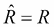开始，可以如下使用利用期望最大化的另一种算法(参见[第 2 章](ch02.html "Chapter 2. Unsupervised Machine Learning")、*无监督机器学习*):**

1.  ****m 步**:执行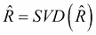**
2.  ****电子步骤** : 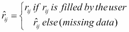**

**重复该程序，直到误差平方和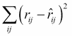小于选定的公差。实现该算法和简单 SVD 分解的代码如下:**

**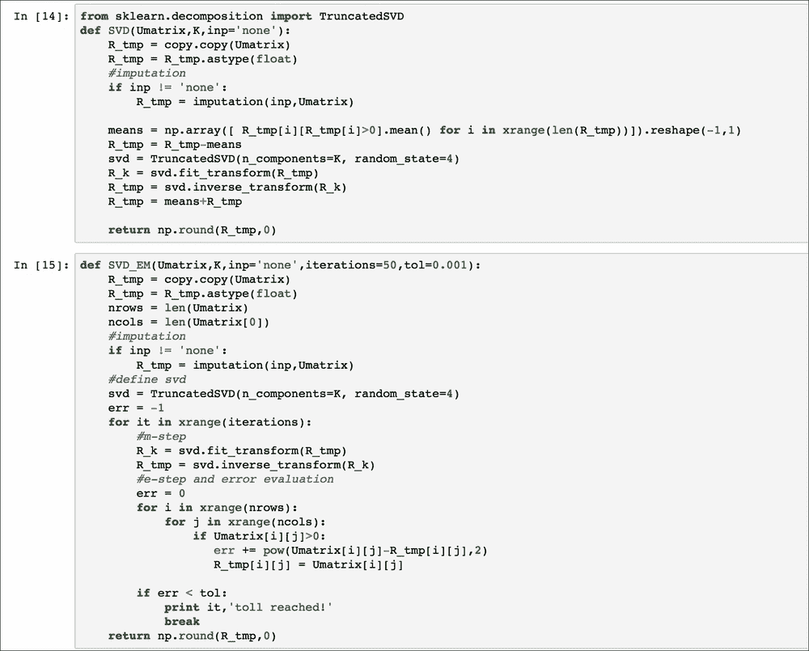**

**请注意，SVD 由`sklearn`库给出，两种插补平均方法(用户评分‘平均’和项目评分‘平均’)均已实施，尽管函数默认为*无*，这意味着零值仍为初始值。对于期望最大化 SVD，其他默认参数是收敛容差(0.0001)和最大迭代次数(10，000)。这种方法(尤其是使用期望值最大化的方法)比 ALS 慢，但准确性通常更高。还要注意，SVD 方法分解效用矩阵减去用户评级的平均值，因为这种方法通常执行得更好(在 SVD 矩阵被计算之后，用户评级的平均值被加上)。**

**我们最后指出，SVD 因式分解也可以在基于内存的 CF 中使用，以在缩减的空间(矩阵 *U* 或*V^T)中比较用户或项目，然后从原始效用矩阵(SVD 与 k-NN 方法)中获取评级。***

**<title>CBF methods</title>

# CBF 战法

这个类方法依赖于描述项目的数据，这些数据然后被用来提取用户的特征。在我们的 MovieLens 示例中，每部电影 *j* 都有一组 *G* 二进制字段来表示它是否属于以下类型之一:未知、动作、冒险、动画、儿童、喜剧、犯罪、纪录片、戏剧、奇幻、黑色电影、恐怖、音乐、神秘、浪漫、科幻、惊悚、战争或西部。

基于这些特征(类型)，每部电影都由一个二进制向量*m[j]来描述，该向量具有 *G* 维度(电影类型的数量)，对于电影 *j* 中包含的所有类型，其条目等于`1`，否则为`0`。给定前面提到的*效用矩阵*部分中存储了名为`dfout`的效用矩阵的`dataframe`，使用以下脚本将这些二进制向量*m[j]从 movie lens`database`收集到一个数据帧中:**

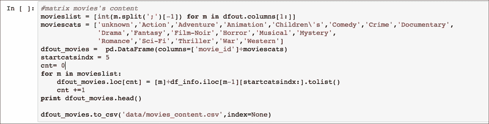

电影内容矩阵已保存在`movies_content.csv`文件中，可供 CBF 方法使用。

基于内容的推荐系统的目标是生成具有相同字段的用户简档，以指示用户喜欢每个流派的程度。这种方法的问题是，商品的内容描述并不总是可用的，因此在电子商务环境中并不总是可能采用这种技术。优点是对特定用户的推荐独立于其他用户的评级，因此它不会遭受由于特定项目的用户评级数量不足而导致的冷启动问题。我们将讨论两种方法来寻找最佳的推荐方法。第一种方法简单地生成与每个用户观看的电影对每个流派的平均评级相关联的用户简档，并且余弦相似性被用于找到与用户偏好最相似的电影。第二种方法是正则化的线性回归模型，以从评级和电影特征中生成用户的简档特征，从而可以使用这些用户简档来预测每个用户尚未观看的电影的评级。

## 项目特征平均法

方法非常简单，我们将使用 MovieLens 示例中描述电影的特性来解释它，如前所述。该方法的目的是为每个用户 *i* (长度等于 *G* )生成电影流派的偏好向量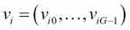。这是通过计算平均评级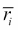和每个流派条目 *g* 来完成的；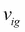由包含类型 *g* 的用户 *i* ( *Mi* )观看的电影的评级总和减去平均值并除以包含类型 *g* 的电影的数量给出:

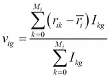

这里，*I[kg]如果电影 *k* 包含流派 *g* 则为 1；否则就是`0`。*

然后使用余弦相似度将向量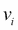与二进制向量 m *j* 进行比较，并且将具有最高相似度值的电影推荐给用户 *i* 。方法的实现由以下 Python 类给出:

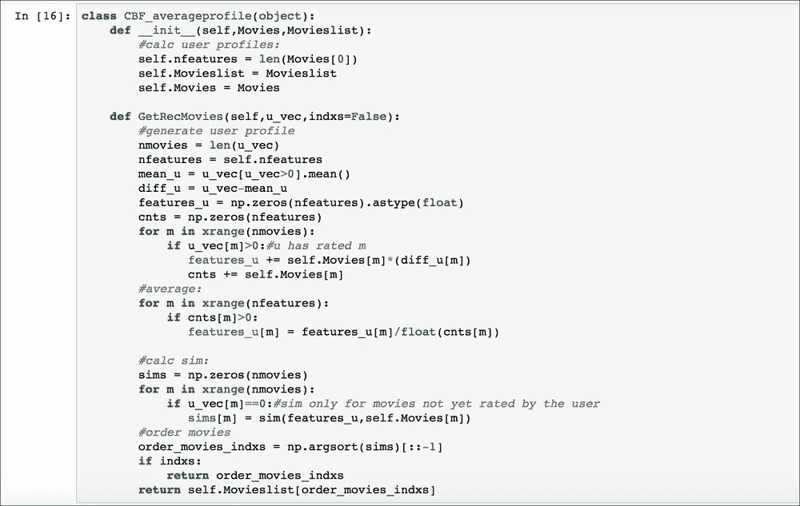

构造函数在`Movieslist`中存储电影标题列表，在`Movies`向量中存储电影特征，`GetRecMovies`函数生成用户风格偏好向量，即(应用前面的公式)称为`features_u`，并返回与该向量最相似的项目。

## 正则化线性回归方法

方法将用户的电影偏好作为线性模型的参数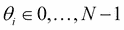进行学习，其中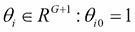为用户数量 *N* 和 *G* 为每个项目的特征(电影类型)数量。我们在用户参数*θ[I](θ[i0]= 1*)上添加一个截距值，并且还添加具有相同值 *m [ j0 ] =1* 的电影向量 *m [ j ]* ，以此类推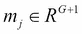。为了学习参数 q *[ i ]* 的向量，我们解决下面的正则化最小化问题:

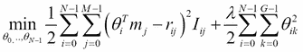

这里，*I[ij]是`1`；即用户 *i* 看了电影，否则 *j* 为`0`，λ为正则化参数(见[第三章](ch03.html "Chapter 3. Supervised Machine Learning")，*监督机器学习*)。*

通过应用梯度下降给出解决方案(参见[第 3 章](ch03.html "Chapter 3. Supervised Machine Learning")、*监督机器学习*)。对于每个用户 *i* :

*   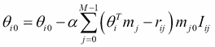 (k=0)
*   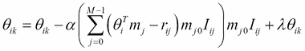 (k > 0)

由于我们分别将`1`条目添加到电影和用户向量中，因此学习截距参数( *k=0* )和其他参数之间的区别是必要的(截距不可能过度拟合，因此无需对其进行调整)。在学习了参数 q *[i]* 之后，通过简单地应用公式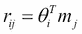中的任何缺失评级 *r [ ij ]* 来执行推荐。

该方法由以下代码实现:

类`CBF_regression`的构造器只是执行梯度下降来找到参数*θ[I](称为`Pmatrix`)，而函数`CalcRatings`在存储的效用矩阵 *R* 中找到最相似的评级向量(如果用户不在效用矩阵中)，然后它使用相应的参数向量来预测缺失的评级。*

# 关联规则学习推荐系统

虽然这种方法在许多商业推荐系统中并不常用，但由于历史数据的原因，关联规则学习无疑是一种值得了解的方法，它可以用来解决现实世界中的许多问题。该方法的主要概念是基于交易数据库 *T* 中项目出现的某种统计度量来发现项目之间的关系(例如，交易可以是用户 *i* 看过的电影或者 *i* 购买的产品)。更正式的说法是，规则可以是 *{item1，item2} = > {item3}* ，也就是说，一组项目 *({item1，item2})* 暗示着另一组项目 *({item3})* 的存在。两个定义用于描述每个 *X= > Y* 规则:

*   **支持度**:给定一个项集合 *X* ，支持度 *supp(X)* 是包含集合 *X* 的事务在总事务中所占的部分。
*   **置信度**:它是包含集合 *X* 同时也包含集合*Y:conf(X =>Y)= supp(X U Y)/supp(X)*的事务的分数。请注意，置信度 *conf(X= > Y)* 可以具有与 *conf(Y= > X)* 非常不同的值。

支持度表示某个规则在事务数据库上出现的频率，而置信度表示如果 set *X* 存在，set *Y* 将出现的概率。换句话说，选择支持值来过滤我们想要从数据库中挖掘的规则的数量(支持越高，满足条件的规则越少)，而置信度可以被认为是集合 *X* 和 *Y* 之间的*相似性*度量。在电影推荐系统的情况下，考虑到每个用户喜欢的电影，可以从效用矩阵 *R* 中生成交易数据库，并且我们寻找由仅包含一个项目(电影)的集合 *X* 和 *Y* 组成的规则。这些规则被收集在矩阵`ass_matrix`中，其中每个条目 *ass_matrixij* 代表规则 *i = > j* 的置信度。对于给定用户的推荐是通过简单地将`ass_matrix`乘以他的评级`u_vec` : ，并且将所有值按照对应于最推荐电影的最大值排序到最小值来获得的。所以这种方法不是预测收视率，而是电影推荐列表；然而，它是快速的，并且对于稀疏的效用矩阵也工作得很好。注意，为了尽可能快地找到所有可能的项目组合以形成集合 X 和 Y，在文献中开发了两种算法: *apriori* 和 *fp-growth* (这里不讨论，因为我们只需要每个集合有一个项目的规则 *X* 和 *Y* )。

实现方法的类如下:

类构造器将效用矩阵`Umatrix`、电影标题列表`Movieslist`、支持度`min_support`、置信度`min_confidence`阈值(默认`0.1`)和`likethreshold`作为输入参数，T5 是交易中考虑电影的最小评级值(默认`3`)。函数`combine_lists`查找所有可能的规则，而`filterSet`只是将规则减少到满足最小支持度阈值的子集。`calc_confidence_matrix`用满足最小阈值的置信度值填充`ass_matrix`(否则默认设置`0`)，并且`GetRecItems`返回给定用户评级的推荐电影列表`u_vec`。

# 对数似然比推荐系统方法

**对数似然比** ( **LLR** )是对两个事件 *A* 和 *B* 不太可能是独立的，而是一起发生的可能性大于偶然(大于单个事件发生的频率)。换句话说，LLR 指示两个事件 *A* 和 *B* 之间可能存在显著的同现，其频率高于正态分布(在两个事件变量上)所预测的频率。

Ted Dunning([http://t Dunning . blogspot . it/2008/03/surprise-and-concurrence . html](http://tdunning.blogspot.it/2008/03/surprise-and-coincidence.html))已经表明，LLR 可以基于事件 A 和 B 的二项式分布，使用具有以下条目的矩阵 *k* 来表示:

|   | 

A

 | 

一个也不

 |
| --- | --- | --- |
| **B** | *k11* | *k12* |
| **不是 B** | *k21* | *k22* |

这里，和是度量向量 *p* 中包含的信息的**香农**熵。

注:也叫**两个事件变量 *A* 和 *B* 的互信息** ( **MI** )，度量两个事件的发生如何相互依赖。

这个测试也被称为 *G2* ，它被证明可以有效地检测罕见事件的同时发生(尤其是在文本分析中)，因此它对于稀疏数据库(或者在我们的例子中是效用矩阵)很有用。

在我们的例子中，事件 *A* 和 *B* 是用户对两部电影 *A* 和 *B* 的喜欢或不喜欢，其中*喜欢一部电影*的事件定义为评分大于`3`(反之为不喜欢)。因此，算法的实现由下面的类给出:

该构造函数将效用矩阵、电影标题列表和用于定义用户是否喜欢电影的`likethreshold`(默认`3`)作为输入。函数`loglikelihood_ratio`生成具有每对电影 *i* 和 *j* 的所有 LLR 值的矩阵，计算矩阵 *k* ( `calc_k`)和相应的 LLR ( `calc_llr`)。函数`GetRecItems`根据`u_vec`给出的评分为用户返回推荐电影列表(该方法不预测评分值)。

# 混合推荐系统

这是一类在单个推荐器中结合了 CBF 和 CF 以获得更好结果的方法。已经尝试了几种方法，这些方法可以归纳为以下几类:

*   **加权**:将 CBF 和 CF 预测评级组合成某种加权平均值。
*   **混合** : CF 和 CBF 预测的电影被分别找到，然后合并到一个列表中。
*   **切换**:基于特定标准，使用 CF 预测或 CBF 预测。
*   **特征组合** : CF 和 CBF 特征一起考虑，寻找最相似的用户或物品。
*   **特征增强**:类似于特征组合，但是附加特征用于预测一些评级，然后主推荐器使用这些评级来产生推荐列表。例如，内容增强的协作过滤通过基于内容的模型学习未分级电影的分级，然后采用协作方法来定义推荐。

作为一个例子，我们实现了两种混合特征组合方法，将项目的特征 CBF 方法与基于用户的 CF 方法相结合。第一种方法对扩展的效用矩阵采用基于用户的 CF，该效用矩阵现在还包含每个用户的每个流派的平均评级。Python 类如下所示:

构造器生成扩展的效用矩阵，该矩阵具有与每个用户`Umatrix_mfeats`相关联的电影流派平均评级特征。函数`CalcRatings`使用比较用户的扩展特征向量的皮尔逊相关性来找到 K-NN。第二种方法将 SVD 分解应用于包含每个用户的流派偏好的扩展效用矩阵。

作为 SVD 方法，从用户评分的平均值中减去评分，并且从同一用户评分的平均值中减去流派偏好。

# 推荐系统的评估

我们已经讨论了迄今为止商业环境中使用的所有最相关的方法。推荐系统的评估可以离线执行(仅使用效用矩阵中的数据)或在线执行(使用效用矩阵数据和使用网站的每个用户实时提供的新数据)。在线评估程序在[第 7 章](ch07.html "Chapter 7. Movie Recommendation System Web Application")、*电影推荐系统网络应用*中讨论，以及一个合适的在线电影推荐系统网站。在本节中，我们将使用两个常用于评估推荐系统的离线测试来评估这些方法的性能:评分的均方根误差和排名准确度。对于所有适用 k 重交叉验证(参见[第 3 章](ch03.html "Chapter 3. Supervised Machine Learning")、*监督机器学习*)的评估，都执行了 5 重交叉验证，以获得更客观的结果。使用以下函数将效用矩阵分成 5 个部分:

这里`df`是一个存储效用矩阵的数据框对象，而 *k* 是折叠数。在验证集中，对于每个用户评级的向量`u_vec`，一半的评级已经被隐藏，从而可以预测真实值。

`u_vals`存储预测值，而`u_test`包含测试算法的评分。在我们开始用不同的度量来比较不同的算法之前，我们将效用矩阵和电影内容矩阵加载到数据帧中，并将数据分成 5 份进行交叉验证。

`df_vals`包含验证集，因此需要应用本节介绍的`HideRandomRatings`函数。

在`movies`矩阵、`movieslist`列表和数据框`df_trains`、`vals_vecs_folds`、`tests_vecs_folds`中可用的数据现在已经准备好用于训练和验证前面章节中讨论的所有方法。我们可以开始评估**均方根误差** ( **RMSE** )。

## 均方根误差(RMSE)评估

此验证技术仅适用于 CF 方法和线性回归 CBF，因为预测评级仅由这些算法生成。给定验证集中`u_vals`的每个等级 *rij* ，使用每种方法计算预测等级，并获得均方根误差:

RMSE = 

这里， *Nval* 是`u_vals`向量中的等级数。该公式中平方因子的存在对大误差造成了严重的不利影响，因此具有低 RMSE(最佳值)的方法的特点是小误差分布在所有预测评级上，而不是少数评级上的大误差，就像平均绝对误差 MAE= 更喜欢的那样。

计算基于内存的 CF 基于用户的方法和基于项目的方法的 RMSE 的代码如下:

对于每个方法，调用 SE 函数计算每个折叠的误差，然后获得折叠的总 RMSE。

对于斜率为 1 的基于项目的 CF 使用 5 个最近邻，对于基于用户的 CF 使用 20 个最近邻，这些方法具有以下误差:

| 

方法

 | 

均方根误差

 | 

预测评级的数量

 |
| --- | --- | --- |
| **CF 基于用户** | 1.01 | 39,972 |
| **CF 基于项目** | 1.03 | 39,972 |
| **斜坡一号** | 1.08 | 39,972 |
| **CF-CBF 基于用户** | 1.01 | 39,972 |

所有的都有相似的 RMSE 值，但最好的方法是基于项目的协同过滤。

对于基于模型的方法，`u_test`包含在效用矩阵中用于训练，然后使用以下脚本计算 RMSE，而不是隐藏验证评级:

该代码仅计算 CBF 回归和奇异值分解的 RMSE，读者可以很容易地复制该代码来计算其他算法的误差，因为大多数所需的代码只是被注释了(奇异值分解期望最大化、奇异值分解、ALS 和 NMF)。结果如下表所示( *K* 维特征空间):

| 

方法

 | 

均方根误差

 | 

预测评级数量

 |
| --- | --- | --- |
| CBF 线性回归(a= 0.01，l =0.0001，its=50) | 1.09 | 39,972 |
| SGD ( K=20，50 its，a =0.00001，l=0.001) | 1.35 | 39,972 |
| ALS ( K=20，50 its，l =0.001) | 2.58 | 39,972 |
| 奇异值分解(`imputation` = `useraverage`， *K* =20) | 1.02 | 39,972 |
| 奇异值分解 EM ( `imputation` = `itemaverage`，迭代次数=30， *K* =20) | 1.03 | 39,972 |
| 混合动力 SVD ( `imputation` = `useraverage`， *K* =20) | 1.01 | 39,972 |
| NMF ( *K* =20 `imputation` = `useraverage`) | 0.97 | 39,972 |

正如预期的那样，ALS 和 SGD 是最差的方法，但讨论它们是因为它们从教学的角度来看是有指导意义的(它们也很慢，因为实现不如`sklearn`库中的方法优化)。

所有其他的都有相似的结果。但是，请注意，混合方法的结果略好于相应的 SVD 和 CF 基于用户的算法。请注意，预测的电影是随机选择的，因此结果可能会有所不同。

## 分类指标

评级误差 RMSE 并不能真正表明方法的质量，而是一种学术上的衡量标准，并没有真正用于商业环境。网站的目标是呈现与用户相关的内容，而不考虑用户给出的确切评分。为了评估推荐项目的相关性，使用了`precision`、`recall`和`f1`(参见[第 2 章](ch02.html "Chapter 2. Unsupervised Machine Learning")、*无监督机器学习*)度量，其中正确的预测是评分大于 3 的项目。这些度量是对每个算法返回的前 50 个项目进行计算的(如果该算法返回一个推荐列表或对其他方法具有最高预测评级的 50 个项目)。计算测量值的函数如下:

这里，Boolean `ratingsval`表示该方法是返回评级还是推荐列表。我们使用函数`ClassificationMetrics`的方式与计算所有方法的 RMSE 的方式相同，因此评估度量的实际代码没有显示出来(您可以将它作为练习来编写)。下表总结了所有方法的结果(*neighbors*是最近邻的数量， *K* 维特征空间):

| 

方法

 | 

精确

 | 

回忆

 | 

第一子代

 | 

预测评级的数量

 |
| --- | --- | --- | --- | --- |
| CF 基于用户(*邻居* =20) | 0.6 | 0.18 | 0.26 | 39,786 |
| 基于用户的(*邻居* =20) | 0.6 | 0.18 | 0.26 | 39,786 |
| 混合动力 SVD ( *K* =20，`imputation` = `useraverage`) | 0.54 | 0.12 | 0.18 | 39,786 |
| CF 基于项目( *neighs* =5) | 0.57 | 0.15 | 0.22 | 39,786 |
| 坡一(*嘶声* =5) | 0.57 | 0.17 | 0.24 | 39,786 |
| SVD EM ( *K* =20，迭代次数=30，`imputation` = `useraverage`) | 0.58 | 0.16 | 0.24 | 39,786 |
| SVD ( *K* =20，`imputation` = `itemaverage`) | 0.53 | 0.12 | 0.18 | 39,786 |
| CBF 回归(a = 0.01，l =0.0001，迭代次数=50 次) | 0.54 | 0.13 | 0.2 | 39,786 |
| SGD (K=20，a =0.00001，l =0.001) | 0.52 | 0.12 | 0.18 | 39,786 |
| ALS ( *K* =20，λ =0.001，迭代次数=50) | 0.57 | 0.15 | 0.23 | 39,786 |
| CBF 平均值 | 0.56 | 0.12 | 0.19 | 39,786 |
| 最小抵抗力线(line of least resistance) | 0.63 | 0.3 | 0.39 | 39,786 |
| NMF ( *K* =20，λ =0.001，`imputation` = `ssss`) | 0.53 | 0.13 | 0.19 | 39,786 |
| 关联规则 | 0.68 | 0.31 | 0.4 | 39,786 |

从的结果可以看出，最好的方法是关联规则，LLR、基于用户的混合 CBFCF 和基于用户的 CF 方法也有很好的精度。请注意，由于要预测的电影是随机选择的，因此结果可能会有所不同。

# 总结

在本章中，我们讨论了最常用的推荐系统方法，从协同过滤和基于内容的过滤到两种简单的混合算法。还要注意的是，在文献中出现了*模态*推荐系统，其中不同的数据(用户性别、人口统计、视图、位置、设备等)被合并到相同的算法中。这些方法更先进，使用它们需要更多不同的数据。

在[第 7 章](ch07.html "Chapter 7. Movie Recommendation System Web Application")、*电影推荐系统 web 应用*中，我们将使用本章讨论的方法实现一个 web 推荐系统，但在此之前，我们将在[第 6 章](ch06.html "Chapter 6. Getting Started with Django")、*Django 入门*中介绍 Django 框架来构建 Web 应用。**